This document describes the flow of the <SwmToken path="src/base/cobol_src/BNK1CAC.cbl" pos="258:4:4" line-data="              MOVE &#39;BNK1CAC - A010 - RETURN TRANSID(OCAC) FAIL&#39; TO">`BNK1CAC`</SwmToken> program, which is responsible for handling various key events and processing user inputs in a banking application. The program achieves its role by initializing the communication area, handling different key presses, processing the entered data, and managing error handling.

The flow starts with the initialization of the communication area, followed by handling different key events such as PA keys, <SwmToken path="src/base/cobol_src/BNK1CAC.cbl" pos="183:5:5" line-data="      *       When Pf3 is pressed, return to the main menu">`Pf3`</SwmToken> key, <SwmToken path="src/base/cobol_src/BNK1CAC.cbl" pos="194:11:11" line-data="      *       If the aid or Pf12 is pressed, then send a termination">`Pf12`</SwmToken> key, CLEAR key, and the Enter key. Each key event triggers specific actions, such as returning to the main menu, sending termination messages, or processing the entered data. The program also includes error handling mechanisms to manage invalid key presses and other errors.

Here is a high level diagram of the program:

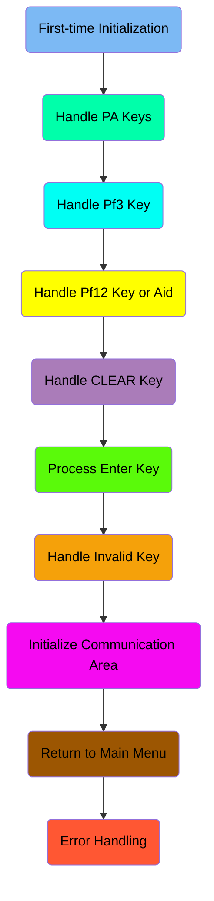

## First-time Initialization

First, we'll zoom into this section of the flow:

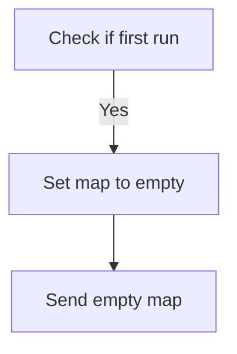

<SwmSnippet path="/src/base/cobol_src/BNK1CAC.cbl" line="163">

---

First, the code checks if it is the first time the program is running by evaluating if <SwmToken path="src/base/cobol_src/BNK1CAC.cbl" pos="169:3:3" line-data="              WHEN EIBCALEN = ZERO">`EIBCALEN`</SwmToken> (the length of the communication area) is zero.

```cobol
           EVALUATE TRUE

      *
      *       Is it the first time through? If so, send the map
      *       with erased (empty) data fields.
      *
              WHEN EIBCALEN = ZERO
```

---

</SwmSnippet>

<SwmSnippet path="/src/base/cobol_src/BNK1CAC.cbl" line="170">

---

Next, if it is the first run, the program sets the map to empty by moving <SwmToken path="src/base/cobol_src/BNK1CAC.cbl" pos="170:3:5" line-data="                 MOVE LOW-VALUE TO BNK1CAO">`LOW-VALUE`</SwmToken> to <SwmToken path="src/base/cobol_src/BNK1CAC.cbl" pos="170:9:9" line-data="                 MOVE LOW-VALUE TO BNK1CAO">`BNK1CAO`</SwmToken>, setting <SwmToken path="src/base/cobol_src/BNK1CAC.cbl" pos="171:8:8" line-data="                 MOVE -1 TO CUSTNOL">`CUSTNOL`</SwmToken> to -1, setting <SwmToken path="src/base/cobol_src/BNK1CAC.cbl" pos="172:3:5" line-data="                 SET SEND-ERASE TO TRUE">`SEND-ERASE`</SwmToken> to true, and moving spaces to <SwmToken path="src/base/cobol_src/BNK1CAC.cbl" pos="173:7:7" line-data="                 MOVE SPACES TO MESSAGEO">`MESSAGEO`</SwmToken>. Finally, it performs the <SwmToken path="src/base/cobol_src/BNK1CAC.cbl" pos="174:3:5" line-data="                 PERFORM SEND-MAP">`SEND-MAP`</SwmToken> operation to send the empty map.

```cobol
                 MOVE LOW-VALUE TO BNK1CAO
                 MOVE -1 TO CUSTNOL
                 SET SEND-ERASE TO TRUE
                 MOVE SPACES TO MESSAGEO
                 PERFORM SEND-MAP
```

---

</SwmSnippet>

## Handle PA Keys

Now, lets zoom into this section of the flow:

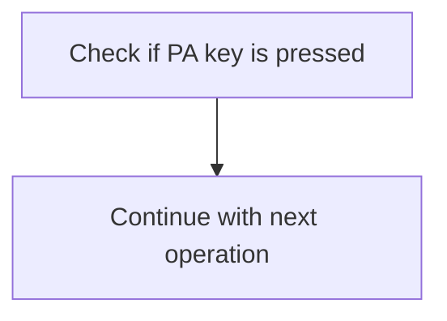

<SwmSnippet path="/src/base/cobol_src/BNK1CAC.cbl" line="179">

---

The <SwmToken path="src/base/cobol_src/BNK1CAC.cbl" pos="160:1:1" line-data="       PREMIERE SECTION.">`PREMIERE`</SwmToken> function checks if any PA (Program Attention) key is pressed by evaluating the <SwmToken path="src/base/cobol_src/BNK1CAC.cbl" pos="179:3:3" line-data="              WHEN EIBAID = DFHPA1 OR DFHPA2 OR DFHPA3">`EIBAID`</SwmToken> field against <SwmToken path="src/base/cobol_src/BNK1CAC.cbl" pos="179:7:7" line-data="              WHEN EIBAID = DFHPA1 OR DFHPA2 OR DFHPA3">`DFHPA1`</SwmToken>, <SwmToken path="src/base/cobol_src/BNK1CAC.cbl" pos="179:11:11" line-data="              WHEN EIBAID = DFHPA1 OR DFHPA2 OR DFHPA3">`DFHPA2`</SwmToken>, and <SwmToken path="src/base/cobol_src/BNK1CAC.cbl" pos="179:15:15" line-data="              WHEN EIBAID = DFHPA1 OR DFHPA2 OR DFHPA3">`DFHPA3`</SwmToken>. If a PA key is pressed, the function simply continues to the next operation without taking any additional action. This ensures that the program does not interrupt the user flow and allows the user to proceed with their tasks seamlessly.

```cobol
              WHEN EIBAID = DFHPA1 OR DFHPA2 OR DFHPA3
                 CONTINUE
```

---

</SwmSnippet>

## Handle <SwmToken path="src/base/cobol_src/BNK1CAC.cbl" pos="183:5:5" line-data="      *       When Pf3 is pressed, return to the main menu">`Pf3`</SwmToken> Key

Now, lets zoom into this section of the flow:

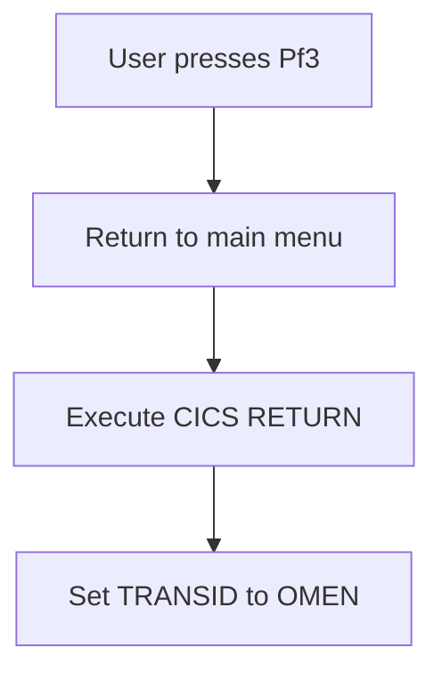

<SwmSnippet path="/src/base/cobol_src/BNK1CAC.cbl" line="182">

---

When the user presses the <SwmToken path="src/base/cobol_src/BNK1CAC.cbl" pos="183:5:5" line-data="      *       When Pf3 is pressed, return to the main menu">`Pf3`</SwmToken> key, the system initiates a return to the main menu. This is achieved by checking if <SwmToken path="src/base/cobol_src/BNK1CAC.cbl" pos="185:3:3" line-data="              WHEN EIBAID = DFHPF3">`EIBAID`</SwmToken> (which holds the attention identifier) equals <SwmToken path="src/base/cobol_src/BNK1CAC.cbl" pos="185:7:7" line-data="              WHEN EIBAID = DFHPF3">`DFHPF3`</SwmToken> (the identifier for the <SwmToken path="src/base/cobol_src/BNK1CAC.cbl" pos="183:5:5" line-data="      *       When Pf3 is pressed, return to the main menu">`Pf3`</SwmToken> key). If this condition is met, the <SwmToken path="src/base/cobol_src/BNK1CAC.cbl" pos="186:1:5" line-data="                 EXEC CICS RETURN">`EXEC CICS RETURN`</SwmToken> command is executed. This command sets the <SwmToken path="src/base/cobol_src/BNK1CAC.cbl" pos="187:1:1" line-data="                    TRANSID(&#39;OMEN&#39;)">`TRANSID`</SwmToken> to 'OMEN', which directs the system to transition immediately to the main menu transaction. The response codes <SwmToken path="src/base/cobol_src/BNK1CAC.cbl" pos="189:1:1" line-data="                    RESP(WS-CICS-RESP)">`RESP`</SwmToken> and <SwmToken path="src/base/cobol_src/BNK1CAC.cbl" pos="190:1:1" line-data="                    RESP2(WS-CICS-RESP2)">`RESP2`</SwmToken> are used to capture any response messages from the CICS command execution.

```cobol
      *
      *       When Pf3 is pressed, return to the main menu
      *
              WHEN EIBAID = DFHPF3
                 EXEC CICS RETURN
                    TRANSID('OMEN')
                    IMMEDIATE
                    RESP(WS-CICS-RESP)
                    RESP2(WS-CICS-RESP2)
                 END-EXEC
```

---

</SwmSnippet>

## Handle <SwmToken path="src/base/cobol_src/BNK1CAC.cbl" pos="194:11:11" line-data="      *       If the aid or Pf12 is pressed, then send a termination">`Pf12`</SwmToken> Key or Aid

Now, lets zoom into this section of the flow:

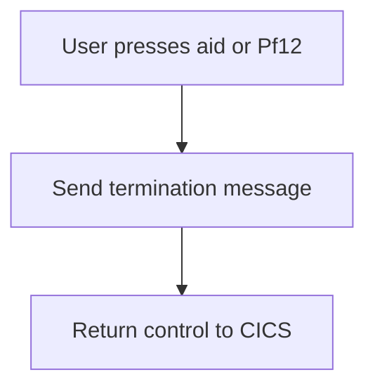

<SwmSnippet path="/src/base/cobol_src/BNK1CAC.cbl" line="193">

---

When the user presses either the aid key or <SwmToken path="src/base/cobol_src/BNK1CAC.cbl" pos="194:11:11" line-data="      *       If the aid or Pf12 is pressed, then send a termination">`Pf12`</SwmToken>, the system recognizes this as a termination request. The system then performs the action to send a termination message to the user. Finally, control is returned to CICS to complete the termination process.

```cobol
      *
      *       If the aid or Pf12 is pressed, then send a termination
      *       message.
      *
              WHEN EIBAID = DFHAID OR DFHPF12
                 PERFORM SEND-TERMINATION-MSG
                 EXEC CICS
                    RETURN
                 END-EXEC
```

---

</SwmSnippet>

## Handle CLEAR Key

Now, lets zoom into this section of the flow:

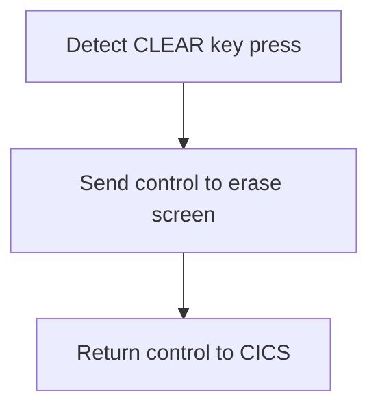

First, the code checks if the <SwmToken path="src/base/cobol_src/BNK1CAC.cbl" pos="179:3:3" line-data="              WHEN EIBAID = DFHPA1 OR DFHPA2 OR DFHPA3">`EIBAID`</SwmToken> (which holds the attention identifier) is equal to <SwmToken path="src/base/cobol_src/BNK1CAC.cbl" pos="206:7:7" line-data="              WHEN EIBAID = DFHCLEAR">`DFHCLEAR`</SwmToken> (the identifier for the CLEAR key). This ensures that the following actions are only executed when the CLEAR key is pressed.

<SwmSnippet path="/src/base/cobol_src/BNK1CAC.cbl" line="207">

---

Next, the <SwmToken path="src/base/cobol_src/BNK1CAC.cbl" pos="207:1:7" line-data="                 EXEC CICS SEND CONTROL">`EXEC CICS SEND CONTROL`</SwmToken> command is used to erase the screen and free the keyboard. This clears any data currently displayed and allows for new input.

```cobol
                 EXEC CICS SEND CONTROL
                          ERASE
                          FREEKB
                 END-EXEC
```

---

</SwmSnippet>

## Process Enter Key

Now, lets zoom into this section of the flow:

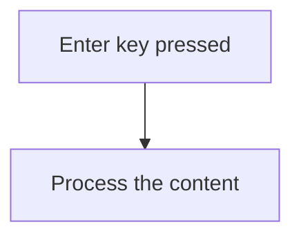

<SwmSnippet path="/src/base/cobol_src/BNK1CAC.cbl" line="216">

---

When the enter key is pressed, the system triggers the processing of the content. This is indicated by the condition <SwmToken path="src/base/cobol_src/BNK1CAC.cbl" pos="218:1:7" line-data="              WHEN EIBAID = DFHENTER">`WHEN EIBAID = DFHENTER`</SwmToken>, which checks if the enter key has been pressed. If this condition is met, the <SwmToken path="src/base/cobol_src/BNK1CAC.cbl" pos="219:3:5" line-data="                 PERFORM PROCESS-MAP">`PROCESS-MAP`</SwmToken> routine is performed to handle the content processing.

```cobol
      *       When enter is pressed then process the content
      *
              WHEN EIBAID = DFHENTER
                 PERFORM PROCESS-MAP

```

---

</SwmSnippet>

## Handle Invalid Key

Now, lets zoom into this section of the flow:

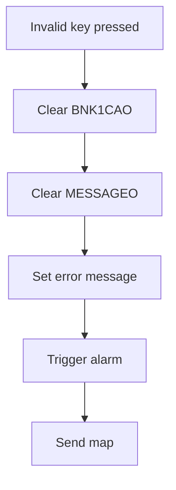

<SwmSnippet path="/src/base/cobol_src/BNK1CAC.cbl" line="224">

---

When an invalid key is pressed by the user, the system first clears the <SwmToken path="src/base/cobol_src/BNK1CAC.cbl" pos="225:9:9" line-data="                 MOVE LOW-VALUES TO BNK1CAO">`BNK1CAO`</SwmToken> field (which is likely used for output data) to ensure no residual data is present. Next, it clears the <SwmToken path="src/base/cobol_src/BNK1CAC.cbl" pos="226:7:7" line-data="                 MOVE SPACES TO MESSAGEO">`MESSAGEO`</SwmToken> field (which is used for messages) to remove any previous messages. Then, it sets the <SwmToken path="src/base/cobol_src/BNK1CAC.cbl" pos="226:7:7" line-data="                 MOVE SPACES TO MESSAGEO">`MESSAGEO`</SwmToken> field to 'Invalid key pressed.' to inform the user of the error. The system then triggers an alarm to alert the user that an invalid key was pressed. Finally, it performs the <SwmToken path="src/base/cobol_src/BNK1CAC.cbl" pos="229:3:5" line-data="                 PERFORM SEND-MAP">`SEND-MAP`</SwmToken> operation to update the user interface with the error message and alert.

```cobol
              WHEN OTHER
                 MOVE LOW-VALUES TO BNK1CAO
                 MOVE SPACES TO MESSAGEO
                 MOVE 'Invalid key pressed.' TO MESSAGEO
                 SET SEND-DATAONLY-ALARM TO TRUE
                 PERFORM SEND-MAP
```

---

</SwmSnippet>

## Initialize Communication Area

This is the next section of the flow.

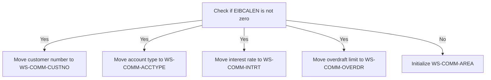

<SwmSnippet path="/src/base/cobol_src/BNK1CAC.cbl" line="233">

---

The <SwmToken path="src/base/cobol_src/BNK1CAC.cbl" pos="160:1:1" line-data="       PREMIERE SECTION.">`PREMIERE`</SwmToken> function is responsible for initializing or setting customer account information based on whether it is the first time through the process. If <SwmToken path="src/base/cobol_src/BNK1CAC.cbl" pos="239:3:3" line-data="            IF EIBCALEN NOT = 0">`EIBCALEN`</SwmToken> (which indicates the length of the communication area) is not zero, it means that there is existing data to be processed. In this case, the function moves the customer number from <SwmToken path="src/base/cobol_src/BNK1CAC.cbl" pos="240:3:5" line-data="               MOVE SUBPGM-CUSTNO     TO WS-COMM-CUSTNO">`SUBPGM-CUSTNO`</SwmToken> to <SwmToken path="src/base/cobol_src/BNK1CAC.cbl" pos="240:9:13" line-data="               MOVE SUBPGM-CUSTNO     TO WS-COMM-CUSTNO">`WS-COMM-CUSTNO`</SwmToken>, the account type from <SwmToken path="src/base/cobol_src/BNK1CAC.cbl" pos="241:3:7" line-data="               MOVE SUBPGM-ACC-TYPE   TO WS-COMM-ACCTYPE">`SUBPGM-ACC-TYPE`</SwmToken> to <SwmToken path="src/base/cobol_src/BNK1CAC.cbl" pos="241:11:15" line-data="               MOVE SUBPGM-ACC-TYPE   TO WS-COMM-ACCTYPE">`WS-COMM-ACCTYPE`</SwmToken>, the interest rate from <SwmToken path="src/base/cobol_src/BNK1CAC.cbl" pos="242:3:7" line-data="               MOVE SUBPGM-INT-RT     TO WS-COMM-INTRT">`SUBPGM-INT-RT`</SwmToken> to <SwmToken path="src/base/cobol_src/BNK1CAC.cbl" pos="242:11:15" line-data="               MOVE SUBPGM-INT-RT     TO WS-COMM-INTRT">`WS-COMM-INTRT`</SwmToken>, and the overdraft limit from <SwmToken path="src/base/cobol_src/BNK1CAC.cbl" pos="243:3:7" line-data="               MOVE SUBPGM-OVERDR-LIM TO WS-COMM-OVERDR">`SUBPGM-OVERDR-LIM`</SwmToken> to <SwmToken path="src/base/cobol_src/BNK1CAC.cbl" pos="243:11:15" line-data="               MOVE SUBPGM-OVERDR-LIM TO WS-COMM-OVERDR">`WS-COMM-OVERDR`</SwmToken>. This ensures that the relevant customer account information is correctly set for further processing. If <SwmToken path="src/base/cobol_src/BNK1CAC.cbl" pos="239:3:3" line-data="            IF EIBCALEN NOT = 0">`EIBCALEN`</SwmToken> is zero, indicating that there is no existing data, the function initializes the <SwmToken path="src/base/cobol_src/BNK1CAC.cbl" pos="245:3:7" line-data="               INITIALIZE WS-COMM-AREA">`WS-COMM-AREA`</SwmToken> to prepare it for new data.

```cobol
      *
      *     Having processed the input or processed the error check
      *     to see if it is the first time through. If it is then
      *     initialise the returned information. If it is not, set
      *     the return information accordingly.
      *
            IF EIBCALEN NOT = 0
               MOVE SUBPGM-CUSTNO     TO WS-COMM-CUSTNO
               MOVE SUBPGM-ACC-TYPE   TO WS-COMM-ACCTYPE
               MOVE SUBPGM-INT-RT     TO WS-COMM-INTRT
               MOVE SUBPGM-OVERDR-LIM TO WS-COMM-OVERDR
            ELSE
               INITIALIZE WS-COMM-AREA
            END-IF.
```

---

</SwmSnippet>

## Return to Main Menu

This is the next section of the flow.

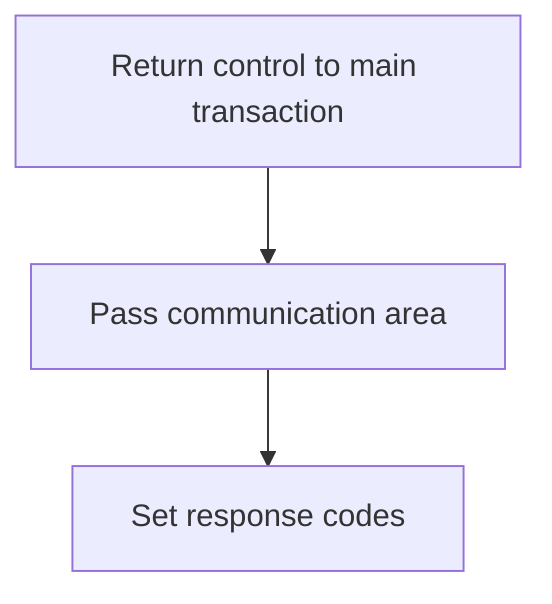

<SwmSnippet path="/src/base/cobol_src/BNK1CAC.cbl" line="248">

---

The <SwmToken path="src/base/cobol_src/BNK1CAC.cbl" pos="160:1:1" line-data="       PREMIERE SECTION.">`PREMIERE`</SwmToken> function is responsible for returning control to the main transaction identified by 'OCAC'. This is achieved by passing the communication area <SwmToken path="src/base/cobol_src/BNK1CAC.cbl" pos="250:3:7" line-data="               COMMAREA(WS-COMM-AREA)">`WS-COMM-AREA`</SwmToken> which contains relevant data for the transaction. Additionally, the function sets the response codes <SwmToken path="src/base/cobol_src/BNK1CAC.cbl" pos="252:3:7" line-data="               RESP(WS-CICS-RESP)">`WS-CICS-RESP`</SwmToken> and <SwmToken path="src/base/cobol_src/BNK1CAC.cbl" pos="253:3:7" line-data="               RESP2(WS-CICS-RESP2)">`WS-CICS-RESP2`</SwmToken> to handle any potential responses from the CICS system.

```cobol
            EXEC CICS
               RETURN TRANSID('OCAC')
               COMMAREA(WS-COMM-AREA)
               LENGTH(32)
               RESP(WS-CICS-RESP)
               RESP2(WS-CICS-RESP2)
            END-EXEC.
```

---

</SwmSnippet>

## Error Handling

Now, lets zoom into this section of the flow:

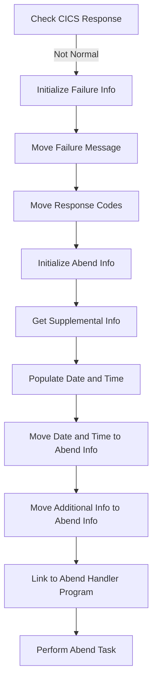

### Initialize Failure Info

### Check CICS Response

First, the function checks if the CICS response is not normal. This is crucial to determine if there was an issue with the transaction.

<SwmSnippet path="/src/base/cobol_src/BNK1CAC.cbl" line="257">

---

If the response is not normal, it initializes the failure information to prepare for logging the error details.

```cobol
              INITIALIZE WS-FAIL-INFO
```

---

</SwmSnippet>

<SwmSnippet path="/src/base/cobol_src/BNK1CAC.cbl" line="258">

---

### Move Failure Message

Next, it moves a predefined failure message into the failure message variable to describe the error context.

```cobol
              MOVE 'BNK1CAC - A010 - RETURN TRANSID(OCAC) FAIL' TO
                 WS-CICS-FAIL-MSG
```

---

</SwmSnippet>

<SwmSnippet path="/src/base/cobol_src/BNK1CAC.cbl" line="260">

---

### Move Response Codes

Then, it moves the response codes to display variables for further processing and logging.

```cobol
              MOVE WS-CICS-RESP  TO WS-CICS-RESP-DISP
              MOVE WS-CICS-RESP2 TO WS-CICS-RESP2-DISP
```

---

</SwmSnippet>

<SwmSnippet path="/src/base/cobol_src/BNK1CAC.cbl" line="269">

---

### Initialize Abend Info

The function initializes the abend (abnormal end) information structure to store details about the error.

```cobol
                INITIALIZE ABNDINFO-REC
```

---

</SwmSnippet>

<SwmSnippet path="/src/base/cobol_src/BNK1CAC.cbl" line="275">

---

### Get Supplemental Info

It retrieves supplemental information such as the application ID and task number to provide more context about the transaction.

```cobol
                EXEC CICS ASSIGN APPLID(ABND-APPLID)
                END-EXEC
```

---

</SwmSnippet>

<SwmSnippet path="/src/base/cobol_src/BNK1CAC.cbl" line="281">

---

### Populate Date and Time

The function then populates the current date and time to record when the error occurred.

```cobol
                PERFORM POPULATE-TIME-DATE
```

---

</SwmSnippet>

<SwmSnippet path="/src/base/cobol_src/BNK1CAC.cbl" line="309">

---

### Link to Abend Handler Program

Finally, it links to the abend handler program to process the error and perform necessary cleanup tasks.

```cobol
                EXEC CICS LINK PROGRAM(WS-ABEND-PGM)
                          COMMAREA(ABNDINFO-REC)
                END-EXEC
```

---

</SwmSnippet>

# Manage Map Sending (<SwmToken path="src/base/cobol_src/BNK1CAC.cbl" pos="174:3:5" line-data="                 PERFORM SEND-MAP">`SEND-MAP`</SwmToken>)

Let's split this section into smaller parts:

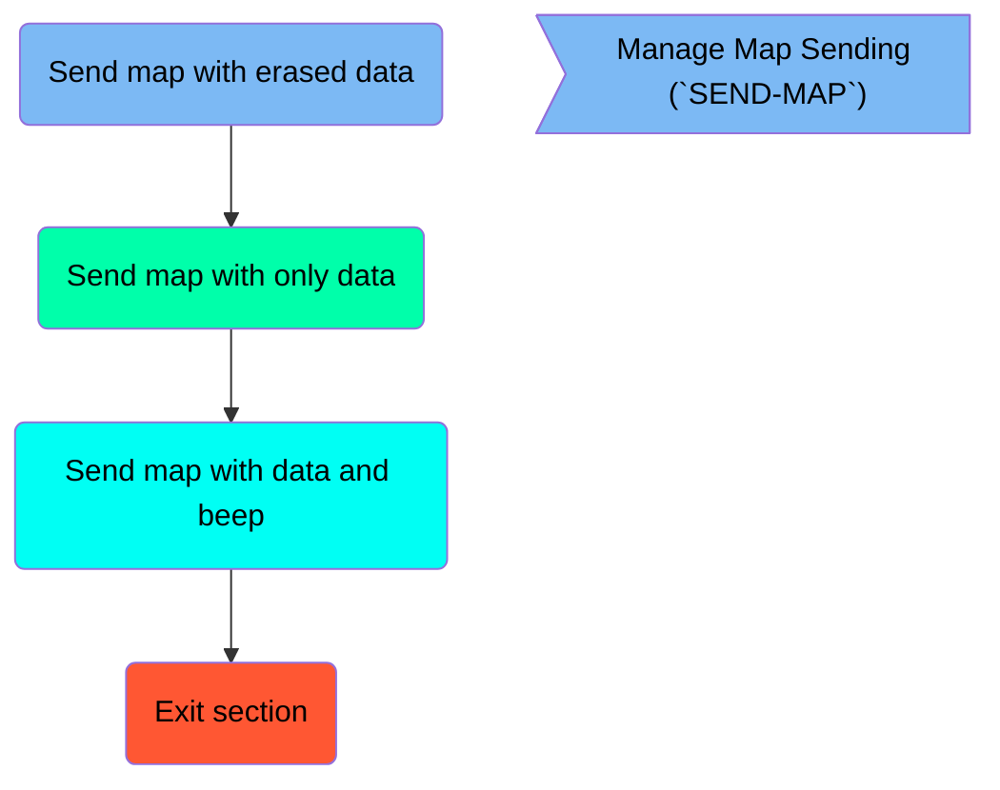

## Send map with erased data

First, we'll zoom into this section of the flow:

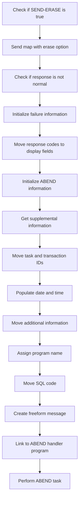

First, the code checks if <SwmToken path="src/base/cobol_src/BNK1CAC.cbl" pos="172:3:5" line-data="                 SET SEND-ERASE TO TRUE">`SEND-ERASE`</SwmToken> (a flag indicating whether to erase the screen) is true.

<SwmSnippet path="/src/base/cobol_src/BNK1CAC.cbl" line="965">

---

If <SwmToken path="src/base/cobol_src/BNK1CAC.cbl" pos="965:3:5" line-data="           IF SEND-ERASE">`SEND-ERASE`</SwmToken> is true, the map <SwmToken path="src/base/cobol_src/BNK1CAC.cbl" pos="966:10:10" line-data="              EXEC CICS SEND MAP(&#39;BNK1CA&#39;)">`BNK1CA`</SwmToken> is sent with the erase option, clearing the screen for the bank teller.

```cobol
           IF SEND-ERASE
              EXEC CICS SEND MAP('BNK1CA')
                 MAPSET('BNK1CAM')
                 FROM(BNK1CAO)
                 ERASE
                 CURSOR
                 RESP(WS-CICS-RESP)
                 RESP2(WS-CICS-RESP2)
              END-EXEC
```

---

</SwmSnippet>

<SwmSnippet path="/src/base/cobol_src/BNK1CAC.cbl" line="975">

---

Next, the code checks if the response from the <SwmToken path="src/base/cobol_src/BNK1CAC.cbl" pos="966:5:7" line-data="              EXEC CICS SEND MAP(&#39;BNK1CA&#39;)">`SEND MAP`</SwmToken> command is not normal, indicating an error occurred.

```cobol
              IF WS-CICS-RESP NOT = DFHRESP(NORMAL)
```

---

</SwmSnippet>

<SwmSnippet path="/src/base/cobol_src/BNK1CAC.cbl" line="976">

---

If an error is detected, the failure information is initialized and a failure message is set.

```cobol
                 INITIALIZE WS-FAIL-INFO
                 MOVE 'BNK1CAC - SM010 - SEND MAP ERASE FAIL '
                    TO WS-CICS-FAIL-MSG
```

---

</SwmSnippet>

<SwmSnippet path="/src/base/cobol_src/BNK1CAC.cbl" line="979">

---

The response codes are then moved to display fields for further analysis.

```cobol
                 MOVE WS-CICS-RESP  TO WS-CICS-RESP-DISP
                 MOVE WS-CICS-RESP2 TO WS-CICS-RESP2-DISP
```

---

</SwmSnippet>

<SwmSnippet path="/src/base/cobol_src/BNK1CAC.cbl" line="987">

---

The ABEND information is initialized to prepare for abnormal termination handling.

```cobol
                 INITIALIZE ABNDINFO-REC
```

---

</SwmSnippet>

<SwmSnippet path="/src/base/cobol_src/BNK1CAC.cbl" line="993">

---

Supplemental information such as application ID, task number, and transaction ID is retrieved and stored.

```cobol
                 EXEC CICS ASSIGN APPLID(ABND-APPLID)
                 END-EXEC

                 MOVE EIBTASKN   TO ABND-TASKNO-KEY
                 MOVE EIBTRNID   TO ABND-TRANID

```

---

</SwmSnippet>

<SwmSnippet path="/src/base/cobol_src/BNK1CAC.cbl" line="999">

---

The current date and time are populated into the ABEND information record.

```cobol
                 PERFORM POPULATE-TIME-DATE

                 MOVE WS-ORIG-DATE TO ABND-DATE
                 STRING WS-TIME-NOW-GRP-HH DELIMITED BY SIZE,
                       ':' DELIMITED BY SIZE,
                        WS-TIME-NOW-GRP-MM DELIMITED BY SIZE,
                        ':' DELIMITED BY SIZE,
                        WS-TIME-NOW-GRP-MM DELIMITED BY SIZE
                        INTO ABND-TIME
```

---

</SwmSnippet>

<SwmSnippet path="/src/base/cobol_src/BNK1CAC.cbl" line="1010">

---

Additional information such as user time and a specific code are moved to the ABEND record.

```cobol
                 MOVE WS-U-TIME   TO ABND-UTIME-KEY
                 MOVE 'HBNK'      TO ABND-CODE
```

---

</SwmSnippet>

<SwmSnippet path="/src/base/cobol_src/BNK1CAC.cbl" line="1013">

---

Finally, the program name is assigned, and a freeform message is created before linking to the ABEND handler program to manage the abnormal termination.

```cobol
                 EXEC CICS ASSIGN PROGRAM(ABND-PROGRAM)
                 END-EXEC

                 MOVE ZEROS      TO ABND-SQLCODE

                 STRING 'SM010 -SEND MAP ERASE FAIL' DELIMITED BY SIZE,
                       ' EIBRESP=' DELIMITED BY SIZE,
                       ABND-RESPCODE DELIMITED BY SIZE,
                       ' RESP2=' DELIMITED BY SIZE,
                       ABND-RESP2CODE DELIMITED BY SIZE
                       INTO ABND-FREEFORM
                 END-STRING

                 EXEC CICS LINK PROGRAM(WS-ABEND-PGM)
                           COMMAREA(ABNDINFO-REC)
                 END-EXEC
```

---

</SwmSnippet>

## Send map with only data

Now, lets zoom into this section of the flow:

```mermaid
graph TD
  A[Check if SEND-DATAONLY is true] -->|Yes| B[SEND MAP BNK1CA]
  B --> C[Check if WS-CICS-RESP is not NORMAL]
  C -->|Yes| D[Initialize WS-FAIL-INFO]
  D --> E[Move failure message to WS-CICS-FAIL-MSG]
  E --> F[Move response codes to display variables]
  F --> G[Initialize ABNDINFO-REC]
  G --> H[Move EIBRESP and EIBRESP2 to ABND-RESPCODE and ABND-RESP2CODE]
  H --> I[Assign APPLID to ABND-APPLID]
  I --> J[Move task and transaction IDs to ABNDINFO-REC]
  J --> K[Perform POPULATE-TIME-DATE]
  K --> L[Move date and time to ABNDINFO-REC]
  L --> M[Assign program name to ABND-PROGRAM]
  M --> N[Move zeros to ABND-SQLCODE]
  N --> O[Create failure message in ABND-FREEFORM]
  O --> P[Link to ABEND handler program]
  P --> Q[Perform ABEND-THIS-TASK]

%% Swimm:
%% graph TD
%%   A[Check if <SwmToken path="src/base/cobol_src/BNK1CAC.cbl" pos="228:3:5" line-data="                 SET SEND-DATAONLY-ALARM TO TRUE">`SEND-DATAONLY`</SwmToken> is true] -->|Yes| B[SEND MAP <SwmToken path="src/base/cobol_src/BNK1CAC.cbl" pos="357:6:6" line-data="              RECEIVE MAP(&#39;BNK1CA&#39;)">`BNK1CA`</SwmToken>]
%%   B --> C[Check if <SwmToken path="src/base/cobol_src/BNK1CAC.cbl" pos="189:3:7" line-data="                    RESP(WS-CICS-RESP)">`WS-CICS-RESP`</SwmToken> is not NORMAL]
%%   C -->|Yes| D[Initialize <SwmToken path="src/base/cobol_src/BNK1CAC.cbl" pos="257:3:7" line-data="              INITIALIZE WS-FAIL-INFO">`WS-FAIL-INFO`</SwmToken>]
%%   D --> E[Move failure message to <SwmToken path="src/base/cobol_src/BNK1CAC.cbl" pos="259:1:7" line-data="                 WS-CICS-FAIL-MSG">`WS-CICS-FAIL-MSG`</SwmToken>]
%%   E --> F[Move response codes to display variables]
%%   F --> G[Initialize <SwmToken path="src/base/cobol_src/BNK1CAC.cbl" pos="269:3:5" line-data="                INITIALIZE ABNDINFO-REC">`ABNDINFO-REC`</SwmToken>]
%%   G --> H[Move EIBRESP and <SwmToken path="src/base/cobol_src/BNK1CAC.cbl" pos="379:3:3" line-data="              MOVE EIBRESP2   TO ABND-RESP2CODE">`EIBRESP2`</SwmToken> to <SwmToken path="src/base/cobol_src/BNK1CAC.cbl" pos="378:7:9" line-data="              MOVE EIBRESP    TO ABND-RESPCODE">`ABND-RESPCODE`</SwmToken> and <SwmToken path="src/base/cobol_src/BNK1CAC.cbl" pos="379:7:9" line-data="              MOVE EIBRESP2   TO ABND-RESP2CODE">`ABND-RESP2CODE`</SwmToken>]
%%   H --> I[Assign APPLID to <SwmToken path="src/base/cobol_src/BNK1CAC.cbl" pos="275:9:11" line-data="                EXEC CICS ASSIGN APPLID(ABND-APPLID)">`ABND-APPLID`</SwmToken>]
%%   I --> J[Move task and transaction IDs to <SwmToken path="src/base/cobol_src/BNK1CAC.cbl" pos="269:3:5" line-data="                INITIALIZE ABNDINFO-REC">`ABNDINFO-REC`</SwmToken>]
%%   J --> K[Perform <SwmToken path="src/base/cobol_src/BNK1CAC.cbl" pos="281:3:7" line-data="                PERFORM POPULATE-TIME-DATE">`POPULATE-TIME-DATE`</SwmToken>]
%%   K --> L[Move date and time to <SwmToken path="src/base/cobol_src/BNK1CAC.cbl" pos="269:3:5" line-data="                INITIALIZE ABNDINFO-REC">`ABNDINFO-REC`</SwmToken>]
%%   L --> M[Assign program name to <SwmToken path="src/base/cobol_src/BNK1CAC.cbl" pos="1013:9:11" line-data="                 EXEC CICS ASSIGN PROGRAM(ABND-PROGRAM)">`ABND-PROGRAM`</SwmToken>]
%%   M --> N[Move zeros to <SwmToken path="src/base/cobol_src/BNK1CAC.cbl" pos="1016:7:9" line-data="                 MOVE ZEROS      TO ABND-SQLCODE">`ABND-SQLCODE`</SwmToken>]
%%   N --> O[Create failure message in <SwmToken path="src/base/cobol_src/BNK1CAC.cbl" pos="1023:3:5" line-data="                       INTO ABND-FREEFORM">`ABND-FREEFORM`</SwmToken>]
%%   O --> P[Link to ABEND handler program]
%%   P --> Q[Perform <SwmToken path="src/base/cobol_src/BNK1CAC.cbl" pos="420:3:7" line-data="              PERFORM ABEND-THIS-TASK">`ABEND-THIS-TASK`</SwmToken>]
```

First, the code checks if <SwmToken path="src/base/cobol_src/BNK1CAC.cbl" pos="228:3:5" line-data="                 SET SEND-DATAONLY-ALARM TO TRUE">`SEND-DATAONLY`</SwmToken> is true. If it is, the program proceeds to send the map data using the <SwmToken path="src/base/cobol_src/BNK1CAC.cbl" pos="966:5:7" line-data="              EXEC CICS SEND MAP(&#39;BNK1CA&#39;)">`SEND MAP`</SwmToken> command.

<SwmSnippet path="/src/base/cobol_src/BNK1CAC.cbl" line="1039">

---

Next, the <SwmToken path="src/base/cobol_src/BNK1CAC.cbl" pos="1040:5:7" line-data="              EXEC CICS SEND MAP(&#39;BNK1CA&#39;)">`SEND MAP`</SwmToken> command is executed with the map name <SwmToken path="src/base/cobol_src/BNK1CAC.cbl" pos="1040:10:10" line-data="              EXEC CICS SEND MAP(&#39;BNK1CA&#39;)">`BNK1CA`</SwmToken> and mapset <SwmToken path="src/base/cobol_src/BNK1CAC.cbl" pos="1041:4:4" line-data="                 MAPSET(&#39;BNK1CAM&#39;)">`BNK1CAM`</SwmToken>, sending data from <SwmToken path="src/base/cobol_src/BNK1CAC.cbl" pos="1042:3:3" line-data="                 FROM(BNK1CAO)">`BNK1CAO`</SwmToken> and setting the cursor.

```cobol
           IF SEND-DATAONLY
              EXEC CICS SEND MAP('BNK1CA')
                 MAPSET('BNK1CAM')
                 FROM(BNK1CAO)
                 DATAONLY
                 CURSOR
                 RESP(WS-CICS-RESP)
                 RESP2(WS-CICS-RESP2)
              END-EXEC
```

---

</SwmSnippet>

<SwmSnippet path="/src/base/cobol_src/BNK1CAC.cbl" line="1049">

---

Then, the code checks if the response <SwmToken path="src/base/cobol_src/BNK1CAC.cbl" pos="1049:3:7" line-data="              IF WS-CICS-RESP NOT = DFHRESP(NORMAL)">`WS-CICS-RESP`</SwmToken> is not equal to <SwmToken path="src/base/cobol_src/BNK1CAC.cbl" pos="1049:13:16" line-data="              IF WS-CICS-RESP NOT = DFHRESP(NORMAL)">`DFHRESP(NORMAL)`</SwmToken>. If the response indicates an error, the program initializes the failure information in <SwmToken path="src/base/cobol_src/BNK1CAC.cbl" pos="1050:3:7" line-data="                 INITIALIZE WS-FAIL-INFO">`WS-FAIL-INFO`</SwmToken>.

```cobol
              IF WS-CICS-RESP NOT = DFHRESP(NORMAL)
                 INITIALIZE WS-FAIL-INFO
```

---

</SwmSnippet>

<SwmSnippet path="/src/base/cobol_src/BNK1CAC.cbl" line="1051">

---

Moving to the next step, the failure message '<SwmToken path="src/base/cobol_src/BNK1CAC.cbl" pos="1051:4:4" line-data="                 MOVE &#39;BNK1CAC - SM010 - SEND MAP DATAONLY FAIL &#39;">`BNK1CAC`</SwmToken> - <SwmToken path="src/base/cobol_src/BNK1CAC.cbl" pos="1051:8:8" line-data="                 MOVE &#39;BNK1CAC - SM010 - SEND MAP DATAONLY FAIL &#39;">`SM010`</SwmToken> - SEND MAP DATAONLY FAIL' is moved to <SwmToken path="src/base/cobol_src/BNK1CAC.cbl" pos="1052:3:9" line-data="                    TO WS-CICS-FAIL-MSG">`WS-CICS-FAIL-MSG`</SwmToken>, and the response codes are moved to display variables.

```cobol
                 MOVE 'BNK1CAC - SM010 - SEND MAP DATAONLY FAIL '
                    TO WS-CICS-FAIL-MSG
                 MOVE WS-CICS-RESP  TO WS-CICS-RESP-DISP
                 MOVE WS-CICS-RESP2 TO WS-CICS-RESP2-DISP
```

---

</SwmSnippet>

<SwmSnippet path="/src/base/cobol_src/BNK1CAC.cbl" line="1062">

---

The program then initializes the <SwmToken path="src/base/cobol_src/BNK1CAC.cbl" pos="1062:3:5" line-data="                 INITIALIZE ABNDINFO-REC">`ABNDINFO-REC`</SwmToken> structure and moves the response codes <SwmToken path="src/base/cobol_src/BNK1CAC.cbl" pos="1063:3:3" line-data="                 MOVE EIBRESP    TO ABND-RESPCODE">`EIBRESP`</SwmToken> and <SwmToken path="src/base/cobol_src/BNK1CAC.cbl" pos="1064:3:3" line-data="                 MOVE EIBRESP2   TO ABND-RESP2CODE">`EIBRESP2`</SwmToken> to <SwmToken path="src/base/cobol_src/BNK1CAC.cbl" pos="1063:7:9" line-data="                 MOVE EIBRESP    TO ABND-RESPCODE">`ABND-RESPCODE`</SwmToken> and <SwmToken path="src/base/cobol_src/BNK1CAC.cbl" pos="1064:7:9" line-data="                 MOVE EIBRESP2   TO ABND-RESP2CODE">`ABND-RESP2CODE`</SwmToken> respectively.

```cobol
                 INITIALIZE ABNDINFO-REC
                 MOVE EIBRESP    TO ABND-RESPCODE
                 MOVE EIBRESP2   TO ABND-RESP2CODE
```

---

</SwmSnippet>

<SwmSnippet path="/src/base/cobol_src/BNK1CAC.cbl" line="1068">

---

Next, the application ID is assigned to <SwmToken path="src/base/cobol_src/BNK1CAC.cbl" pos="1068:9:11" line-data="                 EXEC CICS ASSIGN APPLID(ABND-APPLID)">`ABND-APPLID`</SwmToken>, and the task and transaction IDs are moved to the <SwmToken path="src/base/cobol_src/BNK1CAC.cbl" pos="269:3:5" line-data="                INITIALIZE ABNDINFO-REC">`ABNDINFO-REC`</SwmToken> structure.

```cobol
                 EXEC CICS ASSIGN APPLID(ABND-APPLID)
                 END-EXEC

                 MOVE EIBTASKN   TO ABND-TASKNO-KEY
                 MOVE EIBTRNID   TO ABND-TRANID

```

---

</SwmSnippet>

<SwmSnippet path="/src/base/cobol_src/BNK1CAC.cbl" line="1074">

---

The program then performs the <SwmToken path="src/base/cobol_src/BNK1CAC.cbl" pos="1074:3:7" line-data="                 PERFORM POPULATE-TIME-DATE">`POPULATE-TIME-DATE`</SwmToken> routine to get the current date and time, which are moved to the <SwmToken path="src/base/cobol_src/BNK1CAC.cbl" pos="269:3:5" line-data="                INITIALIZE ABNDINFO-REC">`ABNDINFO-REC`</SwmToken> structure.

```cobol
                 PERFORM POPULATE-TIME-DATE

                 MOVE WS-ORIG-DATE TO ABND-DATE
                 STRING WS-TIME-NOW-GRP-HH DELIMITED BY SIZE,
                        ':' DELIMITED BY SIZE,
                        WS-TIME-NOW-GRP-MM DELIMITED BY SIZE,
                        ':' DELIMITED BY SIZE,
                        WS-TIME-NOW-GRP-MM DELIMITED BY SIZE
                        INTO ABND-TIME
```

---

</SwmSnippet>

<SwmSnippet path="/src/base/cobol_src/BNK1CAC.cbl" line="1088">

---

Following this, the program name is assigned to <SwmToken path="src/base/cobol_src/BNK1CAC.cbl" pos="1088:9:11" line-data="                 EXEC CICS ASSIGN PROGRAM(ABND-PROGRAM)">`ABND-PROGRAM`</SwmToken>, and zeros are moved to <SwmToken path="src/base/cobol_src/BNK1CAC.cbl" pos="1091:7:9" line-data="                 MOVE ZEROS      TO ABND-SQLCODE">`ABND-SQLCODE`</SwmToken>.

```cobol
                 EXEC CICS ASSIGN PROGRAM(ABND-PROGRAM)
                 END-EXEC

                 MOVE ZEROS      TO ABND-SQLCODE
```

---

</SwmSnippet>

<SwmSnippet path="/src/base/cobol_src/BNK1CAC.cbl" line="1093">

---

The failure message is then created in <SwmToken path="src/base/cobol_src/BNK1CAC.cbl" pos="1099:3:5" line-data="                      INTO ABND-FREEFORM">`ABND-FREEFORM`</SwmToken>, including the response codes.

```cobol
                 STRING 'SM010 - SEND MAP DATAONLY Fail'
                      DELIMITED BY SIZE,
                      ' EIBRESP=' DELIMITED BY SIZE,
                      ABND-RESPCODE DELIMITED BY SIZE,
                      ' RESP2=' DELIMITED BY SIZE,
                      ABND-RESP2CODE DELIMITED BY SIZE
                      INTO ABND-FREEFORM
```

---

</SwmSnippet>

<SwmSnippet path="/src/base/cobol_src/BNK1CAC.cbl" line="1102">

---

Finally, the program links to the ABEND handler program using <SwmToken path="src/base/cobol_src/BNK1CAC.cbl" pos="1102:1:5" line-data="                 EXEC CICS LINK PROGRAM(WS-ABEND-PGM)">`EXEC CICS LINK`</SwmToken> and performs the <SwmToken path="src/base/cobol_src/BNK1CAC.cbl" pos="1106:3:7" line-data="                 PERFORM ABEND-THIS-TASK">`ABEND-THIS-TASK`</SwmToken> routine to handle the abnormal termination.

```cobol
                 EXEC CICS LINK PROGRAM(WS-ABEND-PGM)
                           COMMAREA(ABNDINFO-REC)
                 END-EXEC

                 PERFORM ABEND-THIS-TASK
```

---

</SwmSnippet>

## Send map with data and beep

Now, lets zoom into this section of the flow:

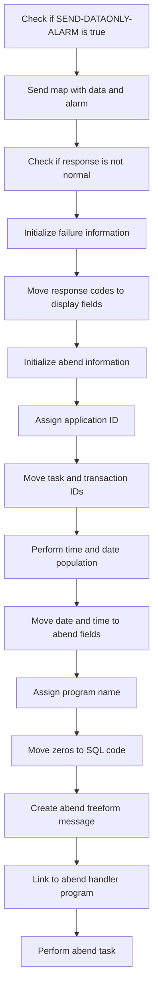

### Sending map with data and alarm

### Checking <SwmToken path="src/base/cobol_src/BNK1CAC.cbl" pos="228:3:7" line-data="                 SET SEND-DATAONLY-ALARM TO TRUE">`SEND-DATAONLY-ALARM`</SwmToken>

First, the code checks if the <SwmToken path="src/base/cobol_src/BNK1CAC.cbl" pos="228:3:7" line-data="                 SET SEND-DATAONLY-ALARM TO TRUE">`SEND-DATAONLY-ALARM`</SwmToken> flag is set to true. This flag indicates whether the map should be sent with data and an alarm.

<SwmSnippet path="/src/base/cobol_src/BNK1CAC.cbl" line="1116">

---

If the <SwmToken path="src/base/cobol_src/BNK1CAC.cbl" pos="1116:3:7" line-data="           IF SEND-DATAONLY-ALARM">`SEND-DATAONLY-ALARM`</SwmToken> flag is true, the program sends the map <SwmToken path="src/base/cobol_src/BNK1CAC.cbl" pos="1117:10:10" line-data="              EXEC CICS SEND MAP(&#39;BNK1CA&#39;)">`BNK1CA`</SwmToken> from the mapset <SwmToken path="src/base/cobol_src/BNK1CAC.cbl" pos="1118:4:4" line-data="                 MAPSET(&#39;BNK1CAM&#39;)">`BNK1CAM`</SwmToken> with the data from <SwmToken path="src/base/cobol_src/BNK1CAC.cbl" pos="1119:3:3" line-data="                 FROM(BNK1CAO)">`BNK1CAO`</SwmToken>, and it includes the <SwmToken path="src/base/cobol_src/BNK1CAC.cbl" pos="1116:5:5" line-data="           IF SEND-DATAONLY-ALARM">`DATAONLY`</SwmToken> and <SwmToken path="src/base/cobol_src/BNK1CAC.cbl" pos="1116:7:7" line-data="           IF SEND-DATAONLY-ALARM">`ALARM`</SwmToken> options. The cursor position and response codes are also captured.

```cobol
           IF SEND-DATAONLY-ALARM
              EXEC CICS SEND MAP('BNK1CA')
                 MAPSET('BNK1CAM')
                 FROM(BNK1CAO)
                 DATAONLY
                 ALARM
                 CURSOR
                 RESP(WS-CICS-RESP)
                 RESP2(WS-CICS-RESP2)
              END-EXEC
```

---

</SwmSnippet>

<SwmSnippet path="/src/base/cobol_src/BNK1CAC.cbl" line="1127">

---

### Checking response

Next, the program checks if the response (<SwmToken path="src/base/cobol_src/BNK1CAC.cbl" pos="1127:3:7" line-data="              IF WS-CICS-RESP NOT = DFHRESP(NORMAL)">`WS-CICS-RESP`</SwmToken>) is not normal. If the response is not normal, it indicates that there was an issue with sending the map.

```cobol
              IF WS-CICS-RESP NOT = DFHRESP(NORMAL)
```

---

</SwmSnippet>

<SwmSnippet path="/src/base/cobol_src/BNK1CAC.cbl" line="1128">

---

### Initializing failure information

If the response is not normal, the program initializes the failure information and sets up a failure message indicating that the SEND MAP DATAONLY ALARM operation failed.

```cobol
                 INITIALIZE WS-FAIL-INFO
                 MOVE 'BNK1CAC - SM010 - SEND MAP DATAONLY ALARM FAIL '
                    TO WS-CICS-FAIL-MSG
```

---

</SwmSnippet>

<SwmSnippet path="/src/base/cobol_src/BNK1CAC.cbl" line="1131">

---

### Moving response codes to display fields

The program then moves the response codes (<SwmToken path="src/base/cobol_src/BNK1CAC.cbl" pos="1131:3:7" line-data="                 MOVE WS-CICS-RESP  TO WS-CICS-RESP-DISP">`WS-CICS-RESP`</SwmToken> and <SwmToken path="src/base/cobol_src/BNK1CAC.cbl" pos="1132:3:7" line-data="                 MOVE WS-CICS-RESP2 TO WS-CICS-RESP2-DISP">`WS-CICS-RESP2`</SwmToken>) to display fields for further processing.

```cobol
                 MOVE WS-CICS-RESP  TO WS-CICS-RESP-DISP
                 MOVE WS-CICS-RESP2 TO WS-CICS-RESP2-DISP
```

---

</SwmSnippet>

<SwmSnippet path="/src/base/cobol_src/BNK1CAC.cbl" line="1139">

---

### Initializing abend information

The program initializes the abend information record to prepare for capturing additional details about the failure.

```cobol
                 INITIALIZE ABNDINFO-REC
```

---

</SwmSnippet>

<SwmSnippet path="/src/base/cobol_src/BNK1CAC.cbl" line="1145">

---

### Assigning application ID

The program assigns the application ID to the abend information record to identify the application that encountered the issue.

```cobol
                 EXEC CICS ASSIGN APPLID(ABND-APPLID)
                 END-EXEC
```

---

</SwmSnippet>

<SwmSnippet path="/src/base/cobol_src/BNK1CAC.cbl" line="1148">

---

### Moving task and transaction IDs

The program moves the task number and transaction ID to the abend information record to capture the context of the failure.

```cobol
                 MOVE EIBTASKN   TO ABND-TASKNO-KEY
                 MOVE EIBTRNID   TO ABND-TRANID
```

---

</SwmSnippet>

<SwmSnippet path="/src/base/cobol_src/BNK1CAC.cbl" line="1151">

---

### Performing time and date population

The program performs a routine to populate the current time and date, which are then moved to the abend information record.

```cobol
                 PERFORM POPULATE-TIME-DATE

                 MOVE WS-ORIG-DATE TO ABND-DATE
```

---

</SwmSnippet>

<SwmSnippet path="/src/base/cobol_src/BNK1CAC.cbl" line="1170">

---

### Creating abend freeform message

The program creates a freeform message detailing the failure, including the response codes, and stores it in the abend information record.

```cobol
                 STRING 'SM010 - SEND MAP DATAONLY ALARM fail'
                      DELIMITED BY SIZE,
                      ' EIBRESP=' DELIMITED BY SIZE,
                      ABND-RESPCODE DELIMITED BY SIZE,
                      ' RESP2=' DELIMITED BY SIZE,
                      ABND-RESP2CODE DELIMITED BY SIZE
                      INTO ABND-FREEFORM
```

---

</SwmSnippet>

## Exit section

This is the next section of the flow.

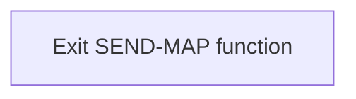

<SwmSnippet path="/src/base/cobol_src/BNK1CAC.cbl" line="1188">

---

The <SwmToken path="src/base/cobol_src/BNK1CAC.cbl" pos="174:3:5" line-data="                 PERFORM SEND-MAP">`SEND-MAP`</SwmToken> function concludes by reaching the <SwmToken path="src/base/cobol_src/BNK1CAC.cbl" pos="1188:1:1" line-data="       SM999.">`SM999`</SwmToken> label, which signifies the end of the function's logic. This is followed by the <SwmToken path="src/base/cobol_src/BNK1CAC.cbl" pos="1189:1:1" line-data="           EXIT.">`EXIT`</SwmToken> statement, which ensures that the function terminates properly and control is returned to the calling program or the next logical sequence in the application.

```cobol
       SM999.
           EXIT.
```

---

</SwmSnippet>

## <SwmToken path="src/base/cobol_src/BNK1CAC.cbl" pos="281:3:7" line-data="                PERFORM POPULATE-TIME-DATE">`POPULATE-TIME-DATE`</SwmToken>

Lets' zoom into this section of the flow:

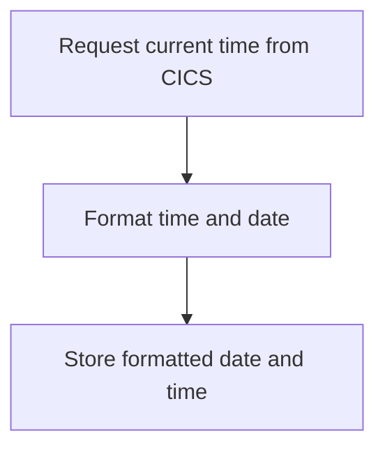

<SwmSnippet path="/src/base/cobol_src/BNK1CAC.cbl" line="1286">

---

### Requesting current time

First, the function requests the current time from CICS and stores it in <SwmToken path="src/base/cobol_src/BNK1CAC.cbl" pos="1287:3:7" line-data="              ABSTIME(WS-U-TIME)">`WS-U-TIME`</SwmToken> (a variable to hold the current time).

```cobol
           EXEC CICS ASKTIME
              ABSTIME(WS-U-TIME)
           END-EXEC.
```

---

</SwmSnippet>

<SwmSnippet path="/src/base/cobol_src/BNK1CAC.cbl" line="1290">

---

### Formatting time and date

Next, the function formats the retrieved time into a human-readable date and time. It stores the formatted date in <SwmToken path="src/base/cobol_src/BNK1CAC.cbl" pos="1292:3:7" line-data="                     DDMMYYYY(WS-ORIG-DATE)">`WS-ORIG-DATE`</SwmToken> and the time in <SwmToken path="src/base/cobol_src/BNK1CAC.cbl" pos="1293:3:7" line-data="                     TIME(WS-TIME-NOW)">`WS-TIME-NOW`</SwmToken>.

```cobol
           EXEC CICS FORMATTIME
                     ABSTIME(WS-U-TIME)
                     DDMMYYYY(WS-ORIG-DATE)
                     TIME(WS-TIME-NOW)
                     DATESEP
           END-EXEC.
```

---

</SwmSnippet>

<SwmSnippet path="/src/base/cobol_src/BNK1CAC.cbl" line="1297">

---

### Storing formatted date and time

Finally, the function completes by exiting, having populated the necessary variables with the current date and time.

```cobol
       PTD999.
           EXIT.
```

---

</SwmSnippet>

## <SwmToken path="src/base/cobol_src/BNK1CAC.cbl" pos="420:3:7" line-data="              PERFORM ABEND-THIS-TASK">`ABEND-THIS-TASK`</SwmToken>

Lets' zoom into this section of the flow:

```mermaid
graph TD
  A[Display failure information] --> B[Trigger abnormal end (ABEND)]
```

<SwmSnippet path="/src/base/cobol_src/BNK1CAC.cbl" line="1269">

---

First, the <SwmToken path="src/base/cobol_src/BNK1CAC.cbl" pos="1269:1:5" line-data="       ABEND-THIS-TASK SECTION.">`ABEND-THIS-TASK`</SwmToken> section begins by displaying the failure information stored in <SwmToken path="src/base/cobol_src/BNK1CAC.cbl" pos="1272:3:7" line-data="           DISPLAY WS-FAIL-INFO.">`WS-FAIL-INFO`</SwmToken> (which includes details like the failure message and response codes). This helps in understanding the context of the failure.

```cobol
       ABEND-THIS-TASK SECTION.
       ATT010.

           DISPLAY WS-FAIL-INFO.
```

---

</SwmSnippet>

<SwmSnippet path="/src/base/cobol_src/BNK1CAC.cbl" line="1274">

---

Next, the code triggers an abnormal end (ABEND) for the task by executing the <SwmToken path="src/base/cobol_src/BNK1CAC.cbl" pos="1274:1:5" line-data="           EXEC CICS ABEND">`EXEC CICS ABEND`</SwmToken> command with the <SwmToken path="src/base/cobol_src/BNK1CAC.cbl" pos="1275:1:1" line-data="              ABCODE(&#39;HBNK&#39;)">`ABCODE`</SwmToken> set to 'HBNK' and the <SwmToken path="src/base/cobol_src/BNK1CAC.cbl" pos="1276:1:1" line-data="              NODUMP">`NODUMP`</SwmToken> option. This ensures that the task is terminated without generating a system dump, which is useful for controlled shutdowns.

```cobol
           EXEC CICS ABEND
              ABCODE('HBNK')
              NODUMP
           END-EXEC.
```

---

</SwmSnippet>

<SwmSnippet path="/src/base/cobol_src/BNK1CAC.cbl" line="1279">

---

Finally, the section exits, completing the abnormal termination process.

```cobol
       ATT999.
           EXIT.
```

---

</SwmSnippet>

## <SwmToken path="src/base/cobol_src/BNK1CAC.cbl" pos="198:3:7" line-data="                 PERFORM SEND-TERMINATION-MSG">`SEND-TERMINATION-MSG`</SwmToken>

Lets' zoom into this section of the flow:

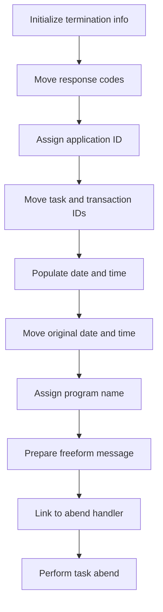

<SwmSnippet path="/src/base/cobol_src/BNK1CAC.cbl" line="1217">

---

### Initializing termination info

First, the termination information record is initialized to ensure that all fields are set to their default values.

```cobol
              INITIALIZE ABNDINFO-REC
```

---

</SwmSnippet>

<SwmSnippet path="/src/base/cobol_src/BNK1CAC.cbl" line="1218">

---

### Moving response codes

Next, the response codes from the <SwmToken path="src/base/cobol_src/BNK1CAC.cbl" pos="1218:3:3" line-data="              MOVE EIBRESP    TO ABND-RESPCODE">`EIBRESP`</SwmToken> and <SwmToken path="src/base/cobol_src/BNK1CAC.cbl" pos="1219:3:3" line-data="              MOVE EIBRESP2   TO ABND-RESP2CODE">`EIBRESP2`</SwmToken> fields are moved to the termination information record. These codes provide details about the nature of the termination.

```cobol
              MOVE EIBRESP    TO ABND-RESPCODE
              MOVE EIBRESP2   TO ABND-RESP2CODE
```

---

</SwmSnippet>

<SwmSnippet path="/src/base/cobol_src/BNK1CAC.cbl" line="1223">

---

### Assigning application ID

The application ID is then assigned to the termination information record using the <SwmToken path="src/base/cobol_src/BNK1CAC.cbl" pos="1223:1:5" line-data="              EXEC CICS ASSIGN APPLID(ABND-APPLID)">`EXEC CICS ASSIGN`</SwmToken> command. This helps in identifying which application encountered the issue.

```cobol
              EXEC CICS ASSIGN APPLID(ABND-APPLID)
              END-EXEC
```

---

</SwmSnippet>

<SwmSnippet path="/src/base/cobol_src/BNK1CAC.cbl" line="1226">

---

### Moving task and transaction IDs

Moving to the next step, the task number and transaction ID are moved to the termination information record. These identifiers are crucial for tracking the specific task and transaction that failed.

```cobol
              MOVE EIBTASKN   TO ABND-TASKNO-KEY
              MOVE EIBTRNID   TO ABND-TRANID
```

---

</SwmSnippet>

<SwmSnippet path="/src/base/cobol_src/BNK1CAC.cbl" line="1229">

---

### Populating date and time

The <SwmToken path="src/base/cobol_src/BNK1CAC.cbl" pos="1229:3:7" line-data="              PERFORM POPULATE-TIME-DATE">`POPULATE-TIME-DATE`</SwmToken> routine is performed to get the current date and time, which are then moved to the termination information record. This timestamp is essential for logging when the termination occurred.

```cobol
              PERFORM POPULATE-TIME-DATE

              MOVE WS-ORIG-DATE TO ABND-DATE
```

---

</SwmSnippet>

<SwmSnippet path="/src/base/cobol_src/BNK1CAC.cbl" line="1231">

---

### Moving original date and time

The original date and time are moved to the termination information record, and the current time is formatted and moved as well. This ensures that both the original and current timestamps are logged.

```cobol
              MOVE WS-ORIG-DATE TO ABND-DATE
              STRING WS-TIME-NOW-GRP-HH DELIMITED BY SIZE,
                     ':' DELIMITED BY SIZE,
                     WS-TIME-NOW-GRP-MM DELIMITED BY SIZE,
                     ':' DELIMITED BY SIZE,
                     WS-TIME-NOW-GRP-MM DELIMITED BY SIZE
                     INTO ABND-TIME
```

---

</SwmSnippet>

<SwmSnippet path="/src/base/cobol_src/BNK1CAC.cbl" line="1243">

---

### Assigning program name

The program name is assigned to the termination information record using another <SwmToken path="src/base/cobol_src/BNK1CAC.cbl" pos="1243:1:5" line-data="              EXEC CICS ASSIGN PROGRAM(ABND-PROGRAM)">`EXEC CICS ASSIGN`</SwmToken> command. This helps in identifying which program was running when the termination occurred.

```cobol
              EXEC CICS ASSIGN PROGRAM(ABND-PROGRAM)
              END-EXEC
```

---

</SwmSnippet>

<SwmSnippet path="/src/base/cobol_src/BNK1CAC.cbl" line="1248">

---

### Preparing freeform message

A freeform message is prepared by concatenating various pieces of information, including the response codes. This message provides a detailed description of the termination event.

```cobol
              STRING 'STM010 - SEND TEXT FAIL'
                   DELIMITED BY SIZE,
                   ' EIBRESP=' DELIMITED BY SIZE,
                   ABND-RESPCODE DELIMITED BY SIZE,
                   ' RESP2=' DELIMITED BY SIZE,
                   ABND-RESP2CODE DELIMITED BY SIZE
                   INTO ABND-FREEFORM
```

---

</SwmSnippet>

<SwmSnippet path="/src/base/cobol_src/BNK1CAC.cbl" line="1257">

---

### Linking to abend handler

The termination information record is then passed to the abend handler program via a <SwmToken path="src/base/cobol_src/BNK1CAC.cbl" pos="1257:3:5" line-data="              EXEC CICS LINK PROGRAM(WS-ABEND-PGM)">`CICS LINK`</SwmToken> command. This step ensures that the termination details are logged and processed appropriately.

```cobol
              EXEC CICS LINK PROGRAM(WS-ABEND-PGM)
                           COMMAREA(ABNDINFO-REC)
              END-EXEC
```

---

</SwmSnippet>

<SwmSnippet path="/src/base/cobol_src/BNK1CAC.cbl" line="1261">

---

### Performing task abend

Finally, the task is abended by performing the <SwmToken path="src/base/cobol_src/BNK1CAC.cbl" pos="1261:3:7" line-data="              PERFORM ABEND-THIS-TASK">`ABEND-THIS-TASK`</SwmToken> routine. This step terminates the task and ensures that the system handles the abnormal termination correctly.

```cobol
              PERFORM ABEND-THIS-TASK
```

---

</SwmSnippet>

## <SwmToken path="src/base/cobol_src/BNK1CAC.cbl" pos="219:3:5" line-data="                 PERFORM PROCESS-MAP">`PROCESS-MAP`</SwmToken>

Lets' zoom into this section of the flow:

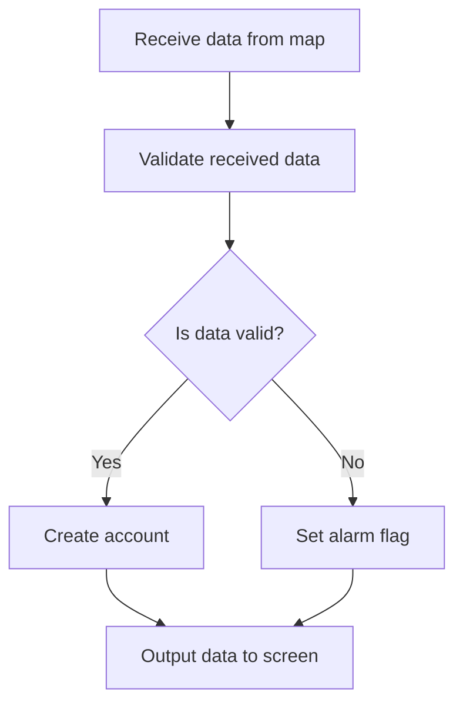

<SwmSnippet path="/src/base/cobol_src/BNK1CAC.cbl" line="325">

---

First, the function retrieves the data from the map, which involves receiving user input data.

```cobol
           PERFORM RECEIVE-MAP.
```

---

</SwmSnippet>

<SwmSnippet path="/src/base/cobol_src/BNK1CAC.cbl" line="330">

---

Moving to the next step, the function validates the received data to ensure it meets the required criteria.

```cobol
           PERFORM EDIT-DATA.
```

---

</SwmSnippet>

<SwmSnippet path="/src/base/cobol_src/BNK1CAC.cbl" line="336">

---

Next, if the data passes validation, the function proceeds to create an account using the validated data.

```cobol
           IF VALID-DATA
              PERFORM CRE-ACC-DATA
           END-IF.
```

---

</SwmSnippet>

<SwmSnippet path="/src/base/cobol_src/BNK1CAC.cbl" line="340">

---

Then, the function sets an alarm flag to indicate that the data should be sent with an alarm.

```cobol
           SET SEND-DATAONLY-ALARM TO TRUE.
```

---

</SwmSnippet>

<SwmSnippet path="/src/base/cobol_src/BNK1CAC.cbl" line="345">

---

Finally, the function outputs the data to the screen, displaying the results of the account creation process.

```cobol
           PERFORM SEND-MAP.
```

---

</SwmSnippet>

## <SwmToken path="src/base/cobol_src/BNK1CAC.cbl" pos="325:3:5" line-data="           PERFORM RECEIVE-MAP.">`RECEIVE-MAP`</SwmToken>

Lets' zoom into this section of the flow:

```mermaid
graph TD
  A[Receive user input data] --> B{Check if response is normal}
  B -- Yes --> C[Continue processing]
  B -- No --> D[Initialize failure info]
  D --> E[Get supplemental information]
  E --> F[Populate date and time]
  F --> G[Prepare ABEND info]
  G --> H[Link to ABEND handler]
  H --> I[Perform ABEND task]
```

<SwmSnippet path="/src/base/cobol_src/BNK1CAC.cbl" line="356">

---

### Receiving user input data

First, the <SwmToken path="src/base/cobol_src/BNK1CAC.cbl" pos="325:3:5" line-data="           PERFORM RECEIVE-MAP.">`RECEIVE-MAP`</SwmToken> section retrieves the user input data from the map using the <SwmToken path="src/base/cobol_src/BNK1CAC.cbl" pos="357:1:3" line-data="              RECEIVE MAP(&#39;BNK1CA&#39;)">`RECEIVE MAP`</SwmToken> command.

```cobol
           EXEC CICS
              RECEIVE MAP('BNK1CA')
              MAPSET('BNK1CAM')
              INTO(BNK1CAI)
              RESP(WS-CICS-RESP)
              RESP2(WS-CICS-RESP2)
           END-EXEC.
```

---

</SwmSnippet>

<SwmSnippet path="/src/base/cobol_src/BNK1CAC.cbl" line="364">

---

### Checking response status

Next, it checks if the response status is normal by evaluating <SwmToken path="src/base/cobol_src/BNK1CAC.cbl" pos="364:3:7" line-data="           IF WS-CICS-RESP NOT = DFHRESP(NORMAL)">`WS-CICS-RESP`</SwmToken>. If the response is not normal, it proceeds to handle the failure.

```cobol
           IF WS-CICS-RESP NOT = DFHRESP(NORMAL)
```

---

</SwmSnippet>

<SwmSnippet path="/src/base/cobol_src/BNK1CAC.cbl" line="365">

---

### Initializing failure information

If the response is not normal, it initializes the failure information by setting up the failure message and response codes.

```cobol
              INITIALIZE WS-FAIL-INFO
              MOVE 'BNK1CAC - RM010 - RECEIVE MAP FAIL ' TO
                 WS-CICS-FAIL-MSG
              MOVE WS-CICS-RESP  TO WS-CICS-RESP-DISP
              MOVE WS-CICS-RESP2 TO WS-CICS-RESP2-DISP
```

---

</SwmSnippet>

<SwmSnippet path="/src/base/cobol_src/BNK1CAC.cbl" line="377">

---

### Getting supplemental information

Then, it retrieves supplemental information such as the application ID, task number, and transaction ID.

```cobol
              INITIALIZE ABNDINFO-REC
              MOVE EIBRESP    TO ABND-RESPCODE
              MOVE EIBRESP2   TO ABND-RESP2CODE
      *
      *       Get supplemental information
      *
              EXEC CICS ASSIGN APPLID(ABND-APPLID)
              END-EXEC

              MOVE EIBTASKN   TO ABND-TASKNO-KEY
              MOVE EIBTRNID   TO ABND-TRANID

```

---

</SwmSnippet>

<SwmSnippet path="/src/base/cobol_src/BNK1CAC.cbl" line="389">

---

### Populating date and time

The program then populates the current date and time information to be included in the ABEND record.

```cobol
              PERFORM POPULATE-TIME-DATE

              MOVE WS-ORIG-DATE TO ABND-DATE
              STRING WS-TIME-NOW-GRP-HH DELIMITED BY SIZE,
                     ':' DELIMITED BY SIZE,
                     WS-TIME-NOW-GRP-MM DELIMITED BY SIZE,
                     ':' DELIMITED BY SIZE,
                     WS-TIME-NOW-GRP-MM DELIMITED BY SIZE
                     INTO ABND-TIME
```

---

</SwmSnippet>

<SwmSnippet path="/src/base/cobol_src/BNK1CAC.cbl" line="400">

---

### Preparing ABEND information

It prepares the ABEND information by setting various fields such as the unique time key and the ABEND code.

```cobol
              MOVE WS-U-TIME   TO ABND-UTIME-KEY
              MOVE 'HBNK'      TO ABND-CODE

```

---

</SwmSnippet>

<SwmSnippet path="/src/base/cobol_src/BNK1CAC.cbl" line="416">

---

### Linking to ABEND handler

The program then links to the ABEND handler program by passing the ABEND information record.

```cobol
              EXEC CICS LINK PROGRAM(WS-ABEND-PGM)
                          COMMAREA(ABNDINFO-REC)
              END-EXEC
```

---

</SwmSnippet>

<SwmSnippet path="/src/base/cobol_src/BNK1CAC.cbl" line="420">

---

### Performing ABEND task

Finally, it performs the ABEND task to handle the abnormal termination of the transaction.

```cobol
              PERFORM ABEND-THIS-TASK
```

---

</SwmSnippet>

## <SwmToken path="src/base/cobol_src/BNK1CAC.cbl" pos="330:3:5" line-data="           PERFORM EDIT-DATA.">`EDIT-DATA`</SwmToken>

Lets' zoom into this section of the flow:

```mermaid
graph TD
  A[Validate Customer Number] --> B[Check if Customer Number is Numeric]
  B --> C[Validate Account Type]
  C --> D[Format Account Type]
  D --> E[Validate Interest Rate]
  E --> F[Check Decimal Points in Interest Rate]
  F --> G[Validate Overdraft Limit]
```

<SwmSnippet path="/src/base/cobol_src/BNK1CAC.cbl" line="433">

---

### Validate Customer Number

First, the customer number is validated to ensure it is not empty and has a length of 10 digits. If the customer number is invalid, an error message is set, and the process is terminated.

```cobol
           EXEC CICS BIF DEEDIT
              FIELD(CUSTNOI)
           END-EXEC.

           IF CUSTNOL < 1 OR CUSTNOI = '__________'
              MOVE SPACES TO MESSAGEO
              STRING 'Please enter a 10 digit Customer Number '
                    DELIMITED BY SIZE,
                     ' ' DELIMITED BY SIZE
                 INTO MESSAGEO
              MOVE 'N' TO VALID-DATA-SW
              MOVE -1 TO CUSTNOL
              GO TO ED999
           END-IF.
```

---

</SwmSnippet>

<SwmSnippet path="/src/base/cobol_src/BNK1CAC.cbl" line="448">

---

### Check if Customer Number is Numeric

Next, the customer number is checked to ensure it is numeric. If it is not numeric, an error message is set, and the process is terminated.

```cobol
           IF CUSTNOI NOT NUMERIC
              MOVE SPACES TO MESSAGEO
              STRING 'Please enter a numeric Customer number '
                    DELIMITED BY SIZE,
                     ' ' DELIMITED BY SIZE
                 INTO MESSAGEO
              MOVE 'N' TO VALID-DATA-SW
              MOVE -1 TO CUSTNOL
              GO TO ED999
           END-IF.
```

---

</SwmSnippet>

<SwmSnippet path="/src/base/cobol_src/BNK1CAC.cbl" line="459">

---

### Validate Account Type

The account type is then validated to ensure it is not empty and has a valid length. If the account type is invalid, an error message is set, and the process is terminated.

```cobol
           IF ACCTYPI = '________' OR ACCTYPL < 1
              MOVE SPACES TO MESSAGEO
              STRING 'Account Type should be ISA,CURRENT,LOAN,'
                 DELIMITED BY SIZE,
                    'SAVING or MORTGAGE' DELIMITED BY SIZE
                 INTO MESSAGEO
              MOVE 'N' TO VALID-DATA-SW
              move -1 to acctypl
              GO TO ED999
           END-IF.
```

---

</SwmSnippet>

<SwmSnippet path="/src/base/cobol_src/BNK1CAC.cbl" line="472">

---

### Format Account Type

Moving to the next step, the account type is formatted to ensure it matches one of the predefined types (ISA, CURRENT, LOAN, SAVING, or MORTGAGE). If the account type does not match any of these, an error message is set, and the process is terminated.

```cobol
           IF ACCTYPL > 0

              EVALUATE ACCTYPI
                 WHEN 'ISA_____'
                    MOVE 'ISA     ' TO ACCTYPI
                    CONTINUE
                 WHEN 'isa_____'
                    MOVE 'ISA     ' TO ACCTYPI
                    CONTINUE
                 WHEN 'ISA     '
                    CONTINUE
                 WHEN 'isa     '
                    MOVE 'ISA     ' TO ACCTYPI
                    CONTINUE
                 WHEN 'CURRENT_'
                    MOVE 'CURRENT ' TO ACCTYPI
                    CONTINUE
                 WHEN 'current_'
                    MOVE 'CURRENT ' TO ACCTYPI
                    CONTINUE
                 WHEN 'CURRENT '
```

---

</SwmSnippet>

<SwmSnippet path="/src/base/cobol_src/BNK1CAC.cbl" line="538">

---

### Validate Interest Rate

The interest rate is validated to ensure it is numeric and within a valid range. If the interest rate is invalid, an error message is set, and the process is terminated.

```cobol
           IF INTRTL = ZERO
              MOVE SPACES TO MESSAGEO
              STRING 'Please supply a numeric interest rate'
                    DELIMITED BY SIZE,
              INTO MESSAGEO
              MOVE 'N' TO VALID-DATA-SW
              MOVE -1 TO INTRTL
              GO TO ED999
```

---

</SwmSnippet>

<SwmSnippet path="/src/base/cobol_src/BNK1CAC.cbl" line="548">

---

### Check Decimal Points in Interest Rate

The interest rate is further checked to ensure it has at most one decimal point and no more than two digits after the decimal point. If these conditions are not met, an error message is set, and the process is terminated.

```cobol
           IF INTRTI(1:INTRTL) IS NOT NUMERIC
              MOVE ZERO TO WS-NUM-COUNT-TOTAL
              INSPECT INTRTI(1:INTRTL) TALLYING
                 WS-NUM-COUNT-TOTAL FOR ALL '0'
                 WS-NUM-COUNT-TOTAL FOR ALL '1'
                 WS-NUM-COUNT-TOTAL FOR ALL '2'
                 WS-NUM-COUNT-TOTAL FOR ALL '3'
                 WS-NUM-COUNT-TOTAL FOR ALL '4'
                 WS-NUM-COUNT-TOTAL FOR ALL '5'
                 WS-NUM-COUNT-TOTAL FOR ALL '6'
                 WS-NUM-COUNT-TOTAL FOR ALL '7'
                 WS-NUM-COUNT-TOTAL FOR ALL '8'
                 WS-NUM-COUNT-TOTAL FOR ALL '9'
                 WS-NUM-COUNT-TOTAL FOR ALL '.'
                 WS-NUM-COUNT-TOTAL FOR ALL '-'
                 WS-NUM-COUNT-TOTAL FOR ALL '+'
                 WS-NUM-COUNT-TOTAL FOR ALL ' '
      *
      *       So the idea here is that if there is a
      *       decimal point, the field is not numeric. But if it
      *       is 1.1 then it is valid. So first of all we check
```

---

</SwmSnippet>

<SwmSnippet path="/src/base/cobol_src/BNK1CAC.cbl" line="682">

---

### Validate Overdraft Limit

Finally, the overdraft limit is validated to ensure it is numeric and positive. If the overdraft limit is invalid, an error message is set, and the process is terminated.

```cobol
      * Remove trailing spaces from OVERDRAFT
           MOVE FUNCTION REVERSE(OVERDRI) TO WS-REVERSE
           MOVE ZERO TO WS-NUM-COUNT-TOTAL
           INSPECT WS-REVERSE TALLYING WS-NUM-COUNT-TOTAL
           FOR LEADING SPACES
           SUBTRACT WS-NUM-COUNT-TOTAL FROM OVERDRL
             GIVING OVERDRL
           MOVE ZERO TO WS-NUM-COUNT-TOTAL
           INSPECT OVERDRI(1:OVERDRL) TALLYING
              WS-NUM-COUNT-TOTAL FOR ALL '0'
              WS-NUM-COUNT-TOTAL FOR ALL '1'
              WS-NUM-COUNT-TOTAL FOR ALL '2'
              WS-NUM-COUNT-TOTAL FOR ALL '3'
              WS-NUM-COUNT-TOTAL FOR ALL '4'
              WS-NUM-COUNT-TOTAL FOR ALL '5'
              WS-NUM-COUNT-TOTAL FOR ALL '6'
              WS-NUM-COUNT-TOTAL FOR ALL '7'
              WS-NUM-COUNT-TOTAL FOR ALL '8'
              WS-NUM-COUNT-TOTAL FOR ALL '9'.
           IF WS-NUM-COUNT-TOTAL < OVERDRL
              MOVE SPACES TO MESSAGEO
```

---

</SwmSnippet>

## <SwmToken path="src/base/cobol_src/BNK1CAC.cbl" pos="337:3:7" line-data="              PERFORM CRE-ACC-DATA">`CRE-ACC-DATA`</SwmToken>

Lets' zoom into this section of the flow:

```mermaid
graph TD
  A[Initialize Parameters] --> B[Set Customer Number]
  B --> C[Set Account Type]
  C --> D[Compute Interest Rate]
  D --> E[Set Overdraft Limit]
  E --> F[Link to CREACC Program]
  F --> G[Check Response]
  G --> H{Response Normal?}
  H -- Yes --> I[Check Success Flag]
  H -- No --> J[Handle Failure]
  I --> K{Success?}
  K -- Yes --> L[Set Success Message]
  K -- No --> M[Set Failure Message]
```

<SwmSnippet path="/src/base/cobol_src/BNK1CAC.cbl" line="748">

---

### Initializing Parameters

First, the function initializes the parameters required for creating a new account. This includes setting up the fields in the <SwmToken path="src/base/cobol_src/BNK1CAC.cbl" pos="753:3:5" line-data="           INITIALIZE SUBPGM-PARMS.">`SUBPGM-PARMS`</SwmToken> structure.

```cobol
       CRE-ACC-DATA SECTION.
       CAD010.
      *
      *    Set up the fields required by CREACC then link to it
      *
           INITIALIZE SUBPGM-PARMS.
```

---

</SwmSnippet>

<SwmSnippet path="/src/base/cobol_src/BNK1CAC.cbl" line="757">

---

### Setting Customer Number

Next, the customer number is set in the <SwmToken path="src/base/cobol_src/BNK1CAC.cbl" pos="757:7:9" line-data="           MOVE CUSTNOI      TO SUBPGM-CUSTNO.">`SUBPGM-CUSTNO`</SwmToken> field to identify the customer for whom the account is being created.

```cobol
           MOVE CUSTNOI      TO SUBPGM-CUSTNO.
```

---

</SwmSnippet>

<SwmSnippet path="/src/base/cobol_src/BNK1CAC.cbl" line="761">

---

### Setting Account Type

The account type is then set in the <SwmToken path="src/base/cobol_src/BNK1CAC.cbl" pos="761:7:11" line-data="           MOVE ACCTYPI      TO SUBPGM-ACC-TYPE.">`SUBPGM-ACC-TYPE`</SwmToken> field to specify the type of account being created.

```cobol
           MOVE ACCTYPI      TO SUBPGM-ACC-TYPE.
```

---

</SwmSnippet>

<SwmSnippet path="/src/base/cobol_src/BNK1CAC.cbl" line="763">

---

### Computing Interest Rate

The interest rate is computed using the <SwmToken path="src/base/cobol_src/BNK1CAC.cbl" pos="763:13:13" line-data="           COMPUTE INTRTI-COMP-1 = FUNCTION NUMVAL(INTRTI)">`NUMVAL`</SwmToken> function and then moved to the <SwmToken path="src/base/cobol_src/BNK1CAC.cbl" pos="765:11:15" line-data="           MOVE INTRTI-COMP-1 TO SUBPGM-INT-RT.">`SUBPGM-INT-RT`</SwmToken> field.

```cobol
           COMPUTE INTRTI-COMP-1 = FUNCTION NUMVAL(INTRTI)

           MOVE INTRTI-COMP-1 TO SUBPGM-INT-RT.
```

---

</SwmSnippet>

<SwmSnippet path="/src/base/cobol_src/BNK1CAC.cbl" line="768">

---

### Setting Overdraft Limit

The overdraft limit is set in the <SwmToken path="src/base/cobol_src/BNK1CAC.cbl" pos="768:7:11" line-data="           MOVE OVERDRI      TO SUBPGM-OVERDR-LIM.">`SUBPGM-OVERDR-LIM`</SwmToken> field to define the maximum overdraft allowed for the new account.

```cobol
           MOVE OVERDRI      TO SUBPGM-OVERDR-LIM.
```

---

</SwmSnippet>

<SwmSnippet path="/src/base/cobol_src/BNK1CAC.cbl" line="775">

---

### Linking to CREACC Program

The function then links to the <SwmToken path="src/base/cobol_src/BNK1CAC.cbl" pos="776:4:4" line-data="              PROGRAM(&#39;CREACC&#39;)">`CREACC`</SwmToken> program, passing the <SwmToken path="src/base/cobol_src/BNK1CAC.cbl" pos="777:3:5" line-data="              COMMAREA(SUBPGM-PARMS)">`SUBPGM-PARMS`</SwmToken> structure to create the account.

```cobol
           EXEC CICS LINK
              PROGRAM('CREACC')
              COMMAREA(SUBPGM-PARMS)
              RESP(WS-CICS-RESP)
              RESP2(WS-CICS-RESP2)
              SYNCONRETURN
           END-EXEC.
```

---

</SwmSnippet>

<SwmSnippet path="/src/base/cobol_src/BNK1CAC.cbl" line="783">

---

### Checking Response

After linking to the <SwmToken path="src/base/cobol_src/BNK1CAC.cbl" pos="751:15:15" line-data="      *    Set up the fields required by CREACC then link to it">`CREACC`</SwmToken> program, the function checks the response to determine if the operation was successful.

```cobol
           IF WS-CICS-RESP NOT = DFHRESP(NORMAL)
              INITIALIZE WS-FAIL-INFO
```

---

</SwmSnippet>

<SwmSnippet path="/src/base/cobol_src/BNK1CAC.cbl" line="784">

---

### Handling Failure

If the response indicates a failure, the function initializes failure information and sets up the standard ABEND info before linking to the Abend Handler program.

```cobol
              INITIALIZE WS-FAIL-INFO
              MOVE 'BNK1CAC - CAD010 - LINK CREACC FAILED    '
                 TO WS-CICS-FAIL-MSG
              MOVE WS-CICS-RESP  TO WS-CICS-RESP-DISP
              MOVE WS-CICS-RESP2 TO WS-CICS-RESP2-DISP
      *
      *       Preserve the RESP and RESP2, then set up the
      *       standard ABEND info before getting the applid,
      *       date/time etc. and linking to the Abend Handler
      *       program.
      *
              INITIALIZE ABNDINFO-REC
              MOVE EIBRESP    TO ABND-RESPCODE
              MOVE EIBRESP2   TO ABND-RESP2CODE
      *
      *       Get supplemental information
      *
              EXEC CICS ASSIGN APPLID(ABND-APPLID)
              END-EXEC

              MOVE EIBTASKN   TO ABND-TASKNO-KEY
```

---

</SwmSnippet>

<SwmSnippet path="/src/base/cobol_src/BNK1CAC.cbl" line="843">

---

### Checking Success Flag

If the response is normal, the function checks the <SwmToken path="src/base/cobol_src/BNK1CAC.cbl" pos="845:3:5" line-data="           IF SUBPGM-SUCCESS = &#39;N&#39;">`SUBPGM-SUCCESS`</SwmToken> flag to determine if the account creation was successful.

```cobol
      *    Check to see if the creation was successful or not
      *
           IF SUBPGM-SUCCESS = 'N'
```

---

</SwmSnippet>

<SwmSnippet path="/src/base/cobol_src/BNK1CAC.cbl" line="846">

---

### Setting Failure Message

If the account creation was not successful, the function sets an appropriate failure message based on the <SwmToken path="src/base/cobol_src/BNK1CAC.cbl" pos="849:3:7" line-data="              EVALUATE SUBPGM-FAIL-CODE">`SUBPGM-FAIL-CODE`</SwmToken>.

```cobol
              MOVE SPACES TO MESSAGEO
              MOVE 'N' TO VALID-DATA-SW

              EVALUATE SUBPGM-FAIL-CODE

                 WHEN '1'
                    MOVE 'The supplied customer number does not exist.'
                       TO  MESSAGEO

                 WHEN '2'
                    STRING 'The customer data cannot be accessed, '
                       DELIMITED BY SIZE,
                       ' unable to create account.'
                       DELIMITED BY SIZE
                    INTO MESSAGEO

                 WHEN '3'
                    STRING 'Account record creation failed.'
                       DELIMITED BY SIZE,
                       ' (unable to ENQ ACCOUNT NC).'
                       DELIMITED BY SIZE
```

---

</SwmSnippet>

<SwmSnippet path="/src/base/cobol_src/BNK1CAC.cbl" line="923">

---

### Setting Success Message

If the account creation was successful, the function sets a success message and updates the relevant output fields with the new account details.

```cobol
           ELSE
      *
      *       If the account creation was successful then set
      *       the values on the map
      *
              MOVE SPACES TO MESSAGEO
              MOVE 'The Account has been successfully created' TO
                 MESSAGEO

              MOVE SUBPGM-SORTCODE          TO SRTCDO
              MOVE SUBPGM-NUMBER            TO ACCNOO
              MOVE SUBPGM-OPENED(1:2)       TO OPENDDO
              MOVE SUBPGM-OPENED(3:2)       TO OPENMMO
              MOVE SUBPGM-OPENED(5:4)       TO OPENYYO
              MOVE SUBPGM-NEXT-STMT-DT(1:2) TO NSTMTDDO
              MOVE SUBPGM-NEXT-STMT-DT(3:2) TO NSTMTMMO
              MOVE SUBPGM-NEXT-STMT-DT(5:4) TO NSTMTYYO
              MOVE SUBPGM-LAST-STMT-DT(1:2) TO LSTMDDO
              MOVE SUBPGM-LAST-STMT-DT(3:2) TO LSTMMMO
              MOVE SUBPGM-LAST-STMT-DT(5:4) TO LSTMYYO
              MOVE SUBPGM-AVAIL-BAL         TO AVAILABLE-BALANCE-DISPLAY
```

---

</SwmSnippet>

&nbsp;

*This is an auto-generated document by Swimm 🌊 and has not yet been verified by a human*

<SwmMeta version="3.0.0" repo-id="Z2l0aHViJTNBJTNBY2ljcy1iYW5raW5nLXNhbXBsZS1hcHBsaWNhdGlvbi1jYnNhLUlCTS1EZW1vJTNBJTNBU3dpbW0tRGVtbw==" repo-name="cics-banking-sample-application-cbsa-IBM-Demo"><sup>Powered by [Swimm](https://staging.swimm.cloud/)</sup></SwmMeta>
