The <SwmToken path="src/base/cobol_src/BNK1DAC.cbl" pos="722:4:4" line-data="              MOVE &#39;BNK1DAC - DAD010 - LINK DELACC  FAIL      &#39;">`BNK1DAC`</SwmToken> program handles various keypress events and data processing tasks within the banking application. It manages user interactions by processing different keys such as PA, PF3, <SwmToken path="src/base/cobol_src/BNK1DAC.cbl" pos="693:21:21" line-data="           STRING &#39;If you wish to delete the Account press &lt;PF5&gt;.&#39;">`PF5`</SwmToken>, PF12, and CLEAR, each triggering specific actions. The program also handles data return, error handling, and abnormal task termination to ensure smooth operation and accurate transaction processing.

The <SwmToken path="src/base/cobol_src/BNK1DAC.cbl" pos="722:4:4" line-data="              MOVE &#39;BNK1DAC - DAD010 - LINK DELACC  FAIL      &#39;">`BNK1DAC`</SwmToken> program starts by checking if it is the first entry and sends an empty form if true. It then handles various keypress events like PA, PF3, <SwmToken path="src/base/cobol_src/BNK1DAC.cbl" pos="693:21:21" line-data="           STRING &#39;If you wish to delete the Account press &lt;PF5&gt;.&#39;">`PF5`</SwmToken>, PF12, and CLEAR, each triggering specific actions such as returning to the main menu, processing the map, or sending a termination message. The program processes the content when the enter key is pressed and handles invalid key presses. It also manages data return by checking the communication area length and processing account inquiry data. Error handling is performed by checking response codes and logging abend information. Finally, the program exits after completing its tasks.

Here is a high level diagram of the program:

```mermaid
graph TD
trxyp("Initial Entry Handling"):::a8c3b7202  --> 
67ugc("PA Key Handling"):::aee9eaab3  --> 
p0wjo("PF3 Key Handling"):::ae3b3435d  --> 
1zcng("PF5 Key Handling"):::a65969d55  --> 
wu6wn("PF12 Key Handling"):::af53e0e21  --> 
j7t2l("CLEAR Key Handling"):::a0dad1c7f  --> 
pj8kb("Enter Key Handling"):::abb5c655a  --> 
g9bqr("Data Return Handling"):::a6581cfe1  --> 
c9y5p("Return Transaction Data"):::a20db1339  --> 
cc0p1("Error Handling"):::a7ccb414a  --> 
iftsg("Exit"):::a53de50cd 
classDef a8c3b7202 color:#000000,fill:#7CB9F4
classDef aee9eaab3 color:#000000,fill:#00FFAA
classDef ae3b3435d color:#000000,fill:#00FFF4
classDef a65969d55 color:#000000,fill:#FFFF00
classDef af53e0e21 color:#000000,fill:#AA7CB9
classDef a0dad1c7f color:#000000,fill:#5afa0a
classDef abb5c655a color:#000000,fill:#f5a10a
classDef a6581cfe1 color:#000000,fill:#f50af1
classDef a20db1339 color:#000000,fill:#9c5602
classDef a7ccb414a color:#000000,fill:#FF5733
classDef a53de50cd color:#000000,fill:#AA7CB9

%% Swimm:
%% graph TD
%% trxyp("Initial Entry Handling"):::a8c3b7202  --> 
%% 67ugc("PA Key Handling"):::aee9eaab3  --> 
%% p0wjo("PF3 Key Handling"):::ae3b3435d  --> 
%% 1zcng("<SwmToken path="src/base/cobol_src/BNK1DAC.cbl" pos="693:21:21" line-data="           STRING &#39;If you wish to delete the Account press &lt;PF5&gt;.&#39;">`PF5`</SwmToken> Key Handling"):::a65969d55  --> 
%% wu6wn("PF12 Key Handling"):::af53e0e21  --> 
%% j7t2l("CLEAR Key Handling"):::a0dad1c7f  --> 
%% pj8kb("Enter Key Handling"):::abb5c655a  --> 
%% g9bqr("Data Return Handling"):::a6581cfe1  --> 
%% c9y5p("Return Transaction Data"):::a20db1339  --> 
%% cc0p1("Error Handling"):::a7ccb414a  --> 
%% iftsg("Exit"):::a53de50cd 
%% classDef a8c3b7202 color:#000000,fill:#7CB9F4
%% classDef aee9eaab3 color:#000000,fill:#00FFAA
%% classDef ae3b3435d color:#000000,fill:#00FFF4
%% classDef a65969d55 color:#000000,fill:#FFFF00
%% classDef af53e0e21 color:#000000,fill:#AA7CB9
%% classDef a0dad1c7f color:#000000,fill:#5afa0a
%% classDef abb5c655a color:#000000,fill:#f5a10a
%% classDef a6581cfe1 color:#000000,fill:#f50af1
%% classDef a20db1339 color:#000000,fill:#9c5602
%% classDef a7ccb414a color:#000000,fill:#FF5733
%% classDef a53de50cd color:#000000,fill:#AA7CB9
```

## Initial Entry Handling

First, we'll zoom into this section of the flow:

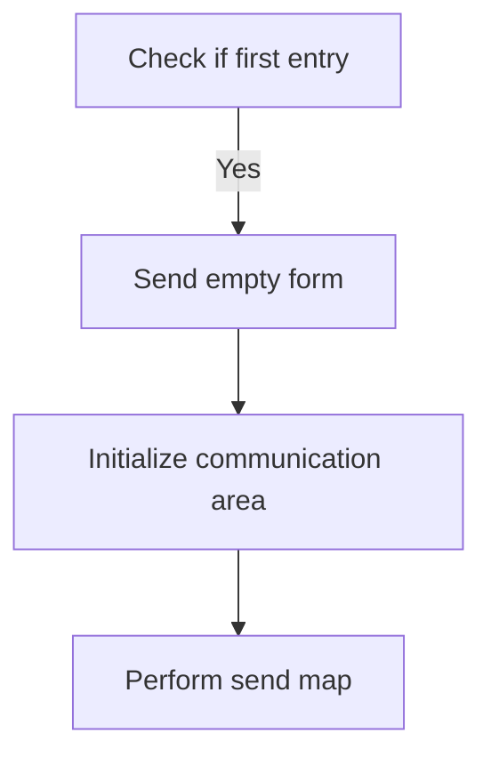

<SwmSnippet path="/src/base/cobol_src/BNK1DAC.cbl" line="191">

---

First, the code checks if it is the first time through by evaluating if <SwmToken path="src/base/cobol_src/BNK1DAC.cbl" pos="196:3:3" line-data="              WHEN EIBCALEN = ZERO">`EIBCALEN`</SwmToken> (which indicates the length of the communication area) is zero.

```cobol
           EVALUATE TRUE
      *
      *       Is it the first time through? If so, send the map
      *       with erased (empty) data fields.
      *
              WHEN EIBCALEN = ZERO
```

---

</SwmSnippet>

<SwmSnippet path="/src/base/cobol_src/BNK1DAC.cbl" line="197">

---

Next, if it is the first entry, the code moves <SwmToken path="src/base/cobol_src/BNK1DAC.cbl" pos="197:3:5" line-data="                 MOVE LOW-VALUE TO BNK1DAO">`LOW-VALUE`</SwmToken> to <SwmToken path="src/base/cobol_src/BNK1DAC.cbl" pos="197:9:9" line-data="                 MOVE LOW-VALUE TO BNK1DAO">`BNK1DAO`</SwmToken> (which likely initializes the data area), sets <SwmToken path="src/base/cobol_src/BNK1DAC.cbl" pos="198:8:8" line-data="                 MOVE -1 TO ACCNOL">`ACCNOL`</SwmToken> to -1, sets <SwmToken path="src/base/cobol_src/BNK1DAC.cbl" pos="199:3:5" line-data="                 SET SEND-ERASE TO TRUE">`SEND-ERASE`</SwmToken> to true (indicating that the form should be sent with erased fields), initializes the <SwmToken path="src/base/cobol_src/BNK1DAC.cbl" pos="200:3:7" line-data="                 INITIALIZE WS-COMM-AREA">`WS-COMM-AREA`</SwmToken> (working storage communication area), and performs the <SwmToken path="src/base/cobol_src/BNK1DAC.cbl" pos="201:3:5" line-data="                 PERFORM SEND-MAP">`SEND-MAP`</SwmToken> operation to send the empty form.

```cobol
                 MOVE LOW-VALUE TO BNK1DAO
                 MOVE -1 TO ACCNOL
                 SET SEND-ERASE TO TRUE
                 INITIALIZE WS-COMM-AREA
                 PERFORM SEND-MAP
```

---

</SwmSnippet>

## PA Key Handling

Now, lets zoom into this section of the flow:

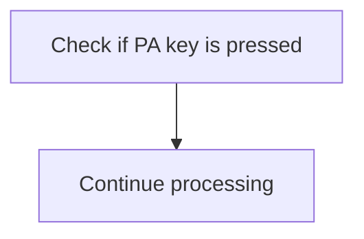

<SwmSnippet path="/src/base/cobol_src/BNK1DAC.cbl" line="203">

---

The code checks if a PA key (Program Attention key) is pressed by evaluating the <SwmToken path="src/base/cobol_src/BNK1DAC.cbl" pos="206:3:3" line-data="              WHEN EIBAID = DFHPA1 OR DFHPA2 OR DFHPA3">`EIBAID`</SwmToken> variable against <SwmToken path="src/base/cobol_src/BNK1DAC.cbl" pos="206:7:7" line-data="              WHEN EIBAID = DFHPA1 OR DFHPA2 OR DFHPA3">`DFHPA1`</SwmToken>, <SwmToken path="src/base/cobol_src/BNK1DAC.cbl" pos="206:11:11" line-data="              WHEN EIBAID = DFHPA1 OR DFHPA2 OR DFHPA3">`DFHPA2`</SwmToken>, or <SwmToken path="src/base/cobol_src/BNK1DAC.cbl" pos="206:15:15" line-data="              WHEN EIBAID = DFHPA1 OR DFHPA2 OR DFHPA3">`DFHPA3`</SwmToken>. If any of these keys are pressed, the program will simply continue processing without taking any additional action. This ensures that the system can handle PA key presses gracefully and continue with its operations without interruption.

```cobol
      *
      *       If a PA key is pressed, just carry on
      *
              WHEN EIBAID = DFHPA1 OR DFHPA2 OR DFHPA3
                 CONTINUE
```

---

</SwmSnippet>

## PF3 Key Handling

Now, lets zoom into this section of the flow:

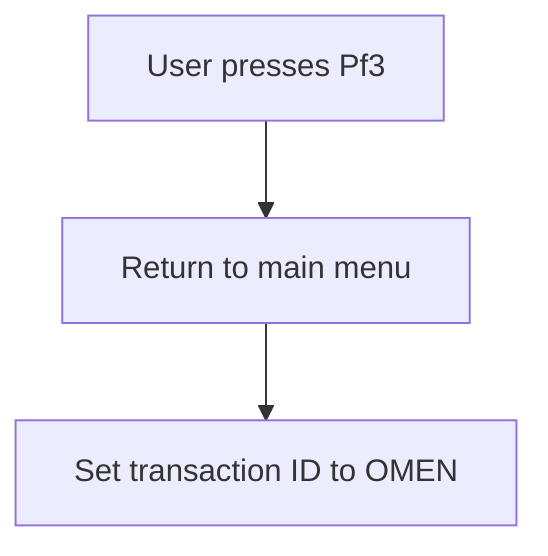

<SwmSnippet path="/src/base/cobol_src/BNK1DAC.cbl" line="212">

---

When the user presses the <SwmToken path="src/base/cobol_src/BNK1DAC.cbl" pos="210:5:5" line-data="      *       When Pf3 is pressed, return to the main menu">`Pf3`</SwmToken> key, the system initiates a return to the main menu. This is achieved by checking if <SwmToken path="src/base/cobol_src/BNK1DAC.cbl" pos="212:3:3" line-data="              WHEN EIBAID = DFHPF3">`EIBAID`</SwmToken> (which holds the attention identifier) is equal to <SwmToken path="src/base/cobol_src/BNK1DAC.cbl" pos="212:7:7" line-data="              WHEN EIBAID = DFHPF3">`DFHPF3`</SwmToken> (the identifier for the <SwmToken path="src/base/cobol_src/BNK1DAC.cbl" pos="210:5:5" line-data="      *       When Pf3 is pressed, return to the main menu">`Pf3`</SwmToken> key). If this condition is met, the <SwmToken path="src/base/cobol_src/BNK1DAC.cbl" pos="213:1:5" line-data="                 EXEC CICS RETURN">`EXEC CICS RETURN`</SwmToken> command is executed with the <SwmToken path="src/base/cobol_src/BNK1DAC.cbl" pos="214:1:1" line-data="                    TRANSID(&#39;OMEN&#39;)">`TRANSID`</SwmToken> set to 'OMEN', which specifies the transaction ID to return to. The <SwmToken path="src/base/cobol_src/BNK1DAC.cbl" pos="215:1:1" line-data="                    IMMEDIATE">`IMMEDIATE`</SwmToken> option ensures that the return is processed immediately, and the <SwmToken path="src/base/cobol_src/BNK1DAC.cbl" pos="216:1:1" line-data="                    RESP(WS-CICS-RESP)">`RESP`</SwmToken> and <SwmToken path="src/base/cobol_src/BNK1DAC.cbl" pos="217:1:1" line-data="                    RESP2(WS-CICS-RESP2)">`RESP2`</SwmToken> options capture any response codes in <SwmToken path="src/base/cobol_src/BNK1DAC.cbl" pos="216:3:7" line-data="                    RESP(WS-CICS-RESP)">`WS-CICS-RESP`</SwmToken> and <SwmToken path="src/base/cobol_src/BNK1DAC.cbl" pos="217:3:7" line-data="                    RESP2(WS-CICS-RESP2)">`WS-CICS-RESP2`</SwmToken> respectively.

```cobol
              WHEN EIBAID = DFHPF3
                 EXEC CICS RETURN
                    TRANSID('OMEN')
                    IMMEDIATE
                    RESP(WS-CICS-RESP)
                    RESP2(WS-CICS-RESP2)
                 END-EXEC
```

---

</SwmSnippet>

## <SwmToken path="src/base/cobol_src/BNK1DAC.cbl" pos="693:21:21" line-data="           STRING &#39;If you wish to delete the Account press &lt;PF5&gt;.&#39;">`PF5`</SwmToken> Key Handling

Now, lets zoom into this section of the flow:

```mermaid
graph TD
  A[PF5 key pressed] --> B[Process the map]

%% Swimm:
%% graph TD
%%   A[<SwmToken path="src/base/cobol_src/BNK1DAC.cbl" pos="693:21:21" line-data="           STRING &#39;If you wish to delete the Account press &lt;PF5&gt;.&#39;">`PF5`</SwmToken> key pressed] --> B[Process the map]
```

<SwmSnippet path="/src/base/cobol_src/BNK1DAC.cbl" line="223">

---

When the <SwmToken path="src/base/cobol_src/BNK1DAC.cbl" pos="693:21:21" line-data="           STRING &#39;If you wish to delete the Account press &lt;PF5&gt;.&#39;">`PF5`</SwmToken> key is pressed, the system triggers the processing of the map. This is indicated by checking if <SwmToken path="src/base/cobol_src/BNK1DAC.cbl" pos="223:3:3" line-data="              WHEN EIBAID = DFHPF5">`EIBAID`</SwmToken> (which holds the attention identifier) is equal to <SwmToken path="src/base/cobol_src/BNK1DAC.cbl" pos="223:7:7" line-data="              WHEN EIBAID = DFHPF5">`DFHPF5`</SwmToken> (the identifier for the <SwmToken path="src/base/cobol_src/BNK1DAC.cbl" pos="693:21:21" line-data="           STRING &#39;If you wish to delete the Account press &lt;PF5&gt;.&#39;">`PF5`</SwmToken> key). If this condition is met, the <SwmToken path="src/base/cobol_src/BNK1DAC.cbl" pos="224:3:5" line-data="                 PERFORM PROCESS-MAP">`PROCESS-MAP`</SwmToken> routine is performed, which handles the necessary operations for processing the map.

```cobol
              WHEN EIBAID = DFHPF5
                 PERFORM PROCESS-MAP
```

---

</SwmSnippet>

## PF12 Key Handling

Now, lets zoom into this section of the flow:

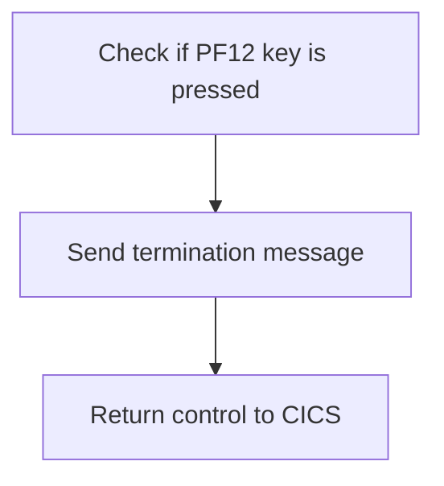

<SwmSnippet path="/src/base/cobol_src/BNK1DAC.cbl" line="230">

---

First, the function checks if the <SwmToken path="src/base/cobol_src/BNK1DAC.cbl" pos="230:3:3" line-data="              WHEN EIBAID = DFHPF12">`EIBAID`</SwmToken> (which holds the attention identifier) is equal to <SwmToken path="src/base/cobol_src/BNK1DAC.cbl" pos="230:7:7" line-data="              WHEN EIBAID = DFHPF12">`DFHPF12`</SwmToken> (the identifier for the PF12 key).

```cobol
              WHEN EIBAID = DFHPF12
```

---

</SwmSnippet>

<SwmSnippet path="/src/base/cobol_src/BNK1DAC.cbl" line="231">

---

Next, if the PF12 key is pressed, the function performs the <SwmToken path="src/base/cobol_src/BNK1DAC.cbl" pos="231:3:7" line-data="                 PERFORM SEND-TERMINATION-MSG">`SEND-TERMINATION-MSG`</SwmToken> operation to send a termination message. Finally, it returns control to CICS using the <SwmToken path="src/base/cobol_src/BNK1DAC.cbl" pos="213:1:5" line-data="                 EXEC CICS RETURN">`EXEC CICS RETURN`</SwmToken> command.

```cobol
                 PERFORM SEND-TERMINATION-MSG

                 EXEC CICS
                    RETURN
                 END-EXEC
```

---

</SwmSnippet>

## CLEAR Key Handling

Now, lets zoom into this section of the flow:

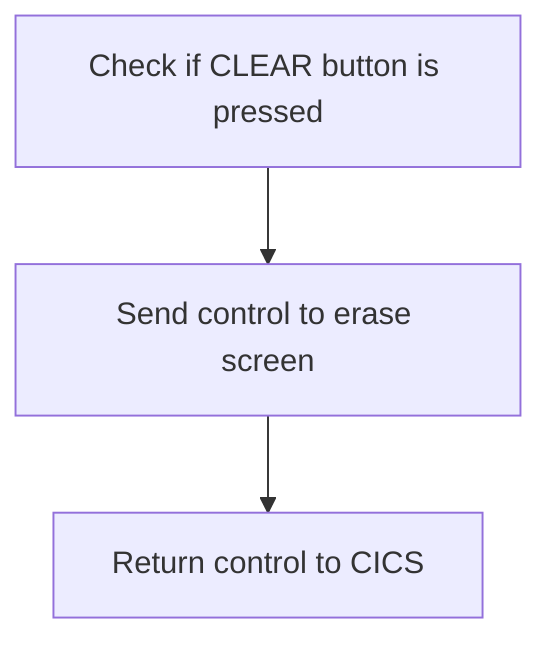

First, the code checks if the <SwmToken path="src/base/cobol_src/BNK1DAC.cbl" pos="238:5:5" line-data="      *       When CLEAR is pressed">`CLEAR`</SwmToken> button is pressed by evaluating if <SwmToken path="src/base/cobol_src/BNK1DAC.cbl" pos="206:3:3" line-data="              WHEN EIBAID = DFHPA1 OR DFHPA2 OR DFHPA3">`EIBAID`</SwmToken> (the attention identifier) is equal to <SwmToken path="src/base/cobol_src/BNK1DAC.cbl" pos="240:7:7" line-data="              WHEN EIBAID = DFHCLEAR">`DFHCLEAR`</SwmToken> (the identifier for the CLEAR button).

<SwmSnippet path="/src/base/cobol_src/BNK1DAC.cbl" line="240">

---

Next, if the <SwmToken path="src/base/cobol_src/BNK1DAC.cbl" pos="238:5:5" line-data="      *       When CLEAR is pressed">`CLEAR`</SwmToken> button is pressed, the code sends a control command to erase the screen and free the keyboard using <SwmToken path="src/base/cobol_src/BNK1DAC.cbl" pos="241:1:1" line-data="                EXEC CICS SEND CONTROL">`EXEC`</SwmToken>` `<SwmToken path="src/base/cobol_src/BNK1DAC.cbl" pos="241:3:3" line-data="                EXEC CICS SEND CONTROL">`CICS`</SwmToken>` `<SwmToken path="src/base/cobol_src/BNK1DAC.cbl" pos="241:5:5" line-data="                EXEC CICS SEND CONTROL">`SEND`</SwmToken>` `<SwmToken path="src/base/cobol_src/BNK1DAC.cbl" pos="241:7:7" line-data="                EXEC CICS SEND CONTROL">`CONTROL`</SwmToken>` `<SwmToken path="src/base/cobol_src/BNK1DAC.cbl" pos="242:1:1" line-data="                          ERASE">`ERASE`</SwmToken>` `<SwmToken path="src/base/cobol_src/BNK1DAC.cbl" pos="243:1:1" line-data="                          FREEKB">`FREEKB`</SwmToken>. This ensures that the screen is cleared and ready for new input.

```cobol
              WHEN EIBAID = DFHCLEAR
                EXEC CICS SEND CONTROL
                          ERASE
                          FREEKB
                END-EXEC
```

---

</SwmSnippet>

<SwmSnippet path="/src/base/cobol_src/BNK1DAC.cbl" line="246">

---

Finally, the code returns control to CICS using <SwmToken path="src/base/cobol_src/BNK1DAC.cbl" pos="246:1:5" line-data="                EXEC CICS RETURN">`EXEC CICS RETURN`</SwmToken>, indicating that the current task is complete and the system can await further user actions.

```cobol
                EXEC CICS RETURN
                END-EXEC
```

---

</SwmSnippet>

## Enter Key Handling

Now, lets zoom into this section of the flow:

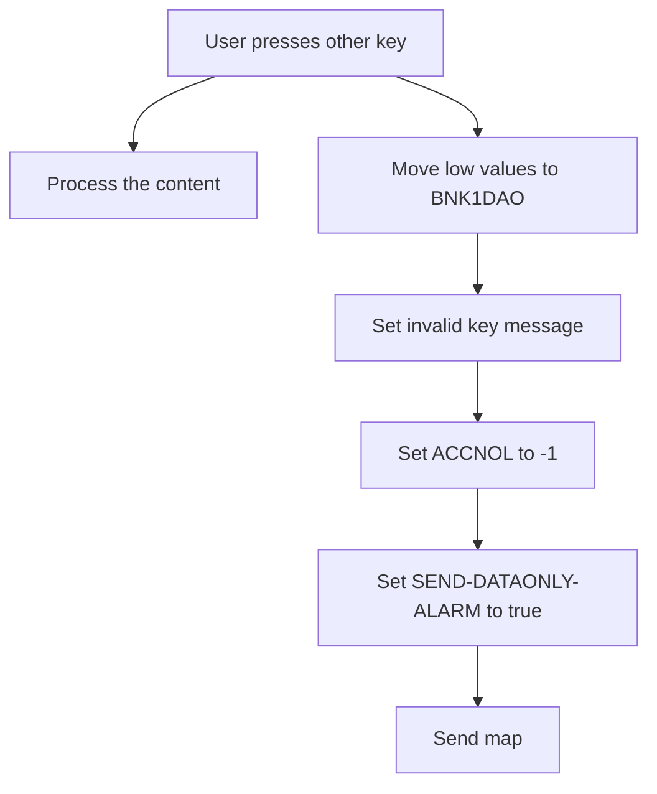

First, when the user presses the enter key, the system processes the content by performing the <SwmToken path="src/base/cobol_src/BNK1DAC.cbl" pos="224:3:5" line-data="                 PERFORM PROCESS-MAP">`PROCESS-MAP`</SwmToken> operation.

Moving to the next condition, if any other key is pressed, the system moves low values to <SwmToken path="src/base/cobol_src/BNK1DAC.cbl" pos="197:9:9" line-data="                 MOVE LOW-VALUE TO BNK1DAO">`BNK1DAO`</SwmToken> (which likely clears the field) and sets the message to 'Invalid key pressed.'

## Interim Summary

So far, we saw how the system handles various key presses such as PA, PF3, <SwmToken path="src/base/cobol_src/BNK1DAC.cbl" pos="693:21:21" line-data="           STRING &#39;If you wish to delete the Account press &lt;PF5&gt;.&#39;">`PF5`</SwmToken>, PF12, and CLEAR, each triggering specific actions like returning to the main menu, processing the map, or sending a termination message. Additionally, we explored how the system processes the content when the enter key is pressed and handles invalid key presses. Now, we will focus on how the system handles data return, specifically checking if the communication area length is not zero and processing account inquiry data.

## Data Return Handling

Now, lets zoom into this section of the flow:

```mermaid
graph TD
  A[Check if EIBCALEN is not zero] --> B{Is INQACC-EYE equal to 'ACCT'?}
  B -- Yes --> C[Move INQACC fields to WS-COMM fields]
  B -- No --> D[Initialize WS-COMM-AREA]

%% Swimm:
%% graph TD
%%   A[Check if EIBCALEN is not zero] --> B{Is <SwmToken path="src/base/cobol_src/BNK1DAC.cbl" pos="275:3:5" line-data="              IF INQACC-EYE = &#39;ACCT&#39;">`INQACC-EYE`</SwmToken> equal to 'ACCT'?}
%%   B -- Yes --> C[Move INQACC fields to <SwmToken path="src/base/cobol_src/BNK1DAC.cbl" pos="200:3:5" line-data="                 INITIALIZE WS-COMM-AREA">`WS-COMM`</SwmToken> fields]
%%   B -- No --> D[Initialize <SwmToken path="src/base/cobol_src/BNK1DAC.cbl" pos="200:3:7" line-data="                 INITIALIZE WS-COMM-AREA">`WS-COMM-AREA`</SwmToken>]
```

<SwmSnippet path="/src/base/cobol_src/BNK1DAC.cbl" line="274">

---

### Checking if EIBCALEN is not zero

First, the code checks if <SwmToken path="src/base/cobol_src/BNK1DAC.cbl" pos="274:3:3" line-data="           IF EIBCALEN NOT = ZERO">`EIBCALEN`</SwmToken> (which indicates the length of the communication area) is not zero. This condition ensures that the program has been executed before and there is data to process.

```cobol
           IF EIBCALEN NOT = ZERO
```

---

</SwmSnippet>

<SwmSnippet path="/src/base/cobol_src/BNK1DAC.cbl" line="275">

---

### Evaluating <SwmToken path="src/base/cobol_src/BNK1DAC.cbl" pos="275:3:5" line-data="              IF INQACC-EYE = &#39;ACCT&#39;">`INQACC-EYE`</SwmToken>

Moving to the next step, the code evaluates if <SwmToken path="src/base/cobol_src/BNK1DAC.cbl" pos="275:3:5" line-data="              IF INQACC-EYE = &#39;ACCT&#39;">`INQACC-EYE`</SwmToken> (which identifies the type of inquiry) is equal to 'ACCT'. This check determines if the data pertains to an account inquiry.

```cobol
              IF INQACC-EYE = 'ACCT'
```

---

</SwmSnippet>

<SwmSnippet path="/src/base/cobol_src/BNK1DAC.cbl" line="276">

---

### Moving data to <SwmToken path="src/base/cobol_src/BNK1DAC.cbl" pos="276:9:11" line-data="                 MOVE INQACC-EYE          TO WS-COMM-EYE">`WS-COMM`</SwmToken> fields

Then, if the condition is met, the code moves various fields from <SwmToken path="src/base/cobol_src/BNK1DAC.cbl" pos="276:3:3" line-data="                 MOVE INQACC-EYE          TO WS-COMM-EYE">`INQACC`</SwmToken> (the inquiry account structure) to <SwmToken path="src/base/cobol_src/BNK1DAC.cbl" pos="276:9:11" line-data="                 MOVE INQACC-EYE          TO WS-COMM-EYE">`WS-COMM`</SwmToken> (the working storage communication area). This step transfers the account details such as customer number, account number, interest rate, and balances to the communication area for further processing.

```cobol
                 MOVE INQACC-EYE          TO WS-COMM-EYE
                 MOVE INQACC-CUSTNO       TO WS-COMM-CUSTNO
                 MOVE INQACC-SCODE        TO WS-COMM-SCODE
                 MOVE INQACC-ACCNO        TO WS-COMM-ACCNO
                 MOVE INQACC-ACC-TYPE     TO WS-COMM-ACC-TYPE
                 MOVE INQACC-INT-RATE     TO WS-COMM-INT-RATE
                 MOVE INQACC-OPENED       TO WS-COMM-OPENED
                 MOVE INQACC-OVERDRAFT    TO WS-COMM-OVERDRAFT
                 MOVE INQACC-LAST-STMT-DT TO WS-COMM-LAST-STMT-DT
                 MOVE INQACC-NEXT-STMT-DT TO WS-COMM-NEXT-STMT-DT
                 MOVE INQACC-AVAIL-BAL    TO WS-COMM-AVAIL-BAL
                 MOVE INQACC-ACTUAL-BAL   TO WS-COMM-ACTUAL-BAL
                 MOVE INQACC-SUCCESS      TO WS-COMM-SUCCESS
```

---

</SwmSnippet>

## Return Transaction Data

This is the next section of the flow.

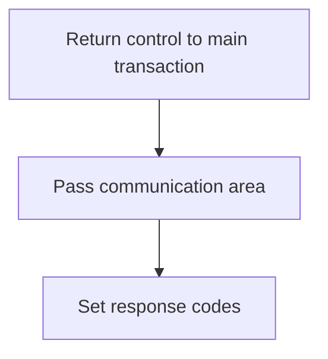

<SwmSnippet path="/src/base/cobol_src/BNK1DAC.cbl" line="295">

---

### Returning control to the main transaction

The <SwmToken path="src/base/cobol_src/BNK1DAC.cbl" pos="188:1:1" line-data="       PREMIERE SECTION.">`PREMIERE`</SwmToken> function is responsible for returning control to the main transaction identified by the transaction ID 'ODAC'. This is achieved by using the <SwmToken path="src/base/cobol_src/BNK1DAC.cbl" pos="213:1:5" line-data="                 EXEC CICS RETURN">`EXEC CICS RETURN`</SwmToken> command, which passes control back to the specified transaction. The communication area (<SwmToken path="src/base/cobol_src/BNK1DAC.cbl" pos="297:3:7" line-data="              COMMAREA(WS-COMM-AREA)">`WS-COMM-AREA`</SwmToken>) is passed along with a specified length of 102 bytes, ensuring that the necessary data is available to the receiving transaction. Additionally, response codes (<SwmToken path="src/base/cobol_src/BNK1DAC.cbl" pos="299:3:7" line-data="              RESP(WS-CICS-RESP)">`WS-CICS-RESP`</SwmToken> and <SwmToken path="src/base/cobol_src/BNK1DAC.cbl" pos="300:3:7" line-data="              RESP2(WS-CICS-RESP2)">`WS-CICS-RESP2`</SwmToken>) are set to capture the status of the `RETURN` command, which helps in handling any potential issues that may arise during the transaction handover.

```cobol
           EXEC CICS
              RETURN TRANSID('ODAC')
              COMMAREA(WS-COMM-AREA)
              LENGTH(102)
              RESP(WS-CICS-RESP)
              RESP2(WS-CICS-RESP2)
           END-EXEC.
```

---

</SwmSnippet>

## Error Handling

Now, lets zoom into this section of the flow:

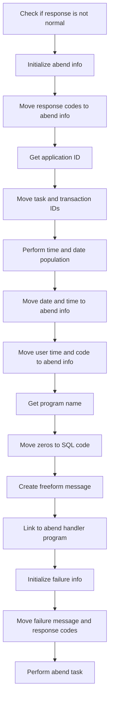

First, the code checks if the response code <SwmToken path="src/base/cobol_src/BNK1DAC.cbl" pos="216:3:7" line-data="                    RESP(WS-CICS-RESP)">`WS-CICS-RESP`</SwmToken> is not equal to <SwmToken path="src/base/cobol_src/BNK1DAC.cbl" pos="434:13:16" line-data="           IF WS-CICS-RESP NOT = DFHRESP(NORMAL)">`DFHRESP(NORMAL)`</SwmToken>. This indicates that an abnormal condition has occurred.

<SwmSnippet path="/src/base/cobol_src/BNK1DAC.cbl" line="310">

---

Moving to the next step, the code initializes the <SwmToken path="src/base/cobol_src/BNK1DAC.cbl" pos="310:3:5" line-data="              INITIALIZE ABNDINFO-REC">`ABNDINFO-REC`</SwmToken> structure to prepare for capturing abend information.

```cobol
              INITIALIZE ABNDINFO-REC
```

---

</SwmSnippet>

<SwmSnippet path="/src/base/cobol_src/BNK1DAC.cbl" line="311">

---

Next, the response codes <SwmToken path="src/base/cobol_src/BNK1DAC.cbl" pos="311:3:3" line-data="              MOVE EIBRESP    TO ABND-RESPCODE">`EIBRESP`</SwmToken> and <SwmToken path="src/base/cobol_src/BNK1DAC.cbl" pos="312:3:3" line-data="              MOVE EIBRESP2   TO ABND-RESP2CODE">`EIBRESP2`</SwmToken> are moved to <SwmToken path="src/base/cobol_src/BNK1DAC.cbl" pos="311:7:9" line-data="              MOVE EIBRESP    TO ABND-RESPCODE">`ABND-RESPCODE`</SwmToken> and <SwmToken path="src/base/cobol_src/BNK1DAC.cbl" pos="312:7:9" line-data="              MOVE EIBRESP2   TO ABND-RESP2CODE">`ABND-RESP2CODE`</SwmToken> respectively, to record the specific error details.

```cobol
              MOVE EIBRESP    TO ABND-RESPCODE
              MOVE EIBRESP2   TO ABND-RESP2CODE
```

---

</SwmSnippet>

<SwmSnippet path="/src/base/cobol_src/BNK1DAC.cbl" line="316">

---

Then, the application ID is retrieved using the <SwmToken path="src/base/cobol_src/BNK1DAC.cbl" pos="316:1:7" line-data="              EXEC CICS ASSIGN APPLID(ABND-APPLID)">`EXEC CICS ASSIGN APPLID`</SwmToken> command and stored in <SwmToken path="src/base/cobol_src/BNK1DAC.cbl" pos="316:9:11" line-data="              EXEC CICS ASSIGN APPLID(ABND-APPLID)">`ABND-APPLID`</SwmToken>.

```cobol
              EXEC CICS ASSIGN APPLID(ABND-APPLID)
              END-EXEC
```

---

</SwmSnippet>

<SwmSnippet path="/src/base/cobol_src/BNK1DAC.cbl" line="319">

---

Following this, the task number and transaction ID are moved to <SwmToken path="src/base/cobol_src/BNK1DAC.cbl" pos="319:7:11" line-data="              MOVE EIBTASKN   TO ABND-TASKNO-KEY">`ABND-TASKNO-KEY`</SwmToken> and <SwmToken path="src/base/cobol_src/BNK1DAC.cbl" pos="320:7:9" line-data="              MOVE EIBTRNID   TO ABND-TRANID">`ABND-TRANID`</SwmToken> respectively.

```cobol
              MOVE EIBTASKN   TO ABND-TASKNO-KEY
              MOVE EIBTRNID   TO ABND-TRANID
```

---

</SwmSnippet>

<SwmSnippet path="/src/base/cobol_src/BNK1DAC.cbl" line="322">

---

The code then performs the <SwmToken path="src/base/cobol_src/BNK1DAC.cbl" pos="322:3:7" line-data="              PERFORM POPULATE-TIME-DATE">`POPULATE-TIME-DATE`</SwmToken> routine to get the current date and time.

```cobol
              PERFORM POPULATE-TIME-DATE
```

---

</SwmSnippet>

<SwmSnippet path="/src/base/cobol_src/BNK1DAC.cbl" line="324">

---

After that, the current date and time are moved to <SwmToken path="src/base/cobol_src/BNK1DAC.cbl" pos="324:11:13" line-data="              MOVE WS-ORIG-DATE TO ABND-DATE">`ABND-DATE`</SwmToken> and <SwmToken path="src/base/cobol_src/BNK1DAC.cbl" pos="330:3:5" line-data="                     INTO ABND-TIME">`ABND-TIME`</SwmToken> respectively.

```cobol
              MOVE WS-ORIG-DATE TO ABND-DATE
              STRING WS-TIME-NOW-GRP-HH DELIMITED BY SIZE,
                    ':' DELIMITED BY SIZE,
                     WS-TIME-NOW-GRP-MM DELIMITED BY SIZE,
                     ':' DELIMITED BY SIZE,
                     WS-TIME-NOW-GRP-MM DELIMITED BY SIZE
                     INTO ABND-TIME
```

---

</SwmSnippet>

<SwmSnippet path="/src/base/cobol_src/BNK1DAC.cbl" line="333">

---

The user time and a specific code are moved to <SwmToken path="src/base/cobol_src/BNK1DAC.cbl" pos="333:11:15" line-data="              MOVE WS-U-TIME   TO ABND-UTIME-KEY">`ABND-UTIME-KEY`</SwmToken> and <SwmToken path="src/base/cobol_src/BNK1DAC.cbl" pos="334:9:11" line-data="              MOVE &#39;HBNK&#39;      TO ABND-CODE">`ABND-CODE`</SwmToken> respectively.

```cobol
              MOVE WS-U-TIME   TO ABND-UTIME-KEY
              MOVE 'HBNK'      TO ABND-CODE
```

---

</SwmSnippet>

<SwmSnippet path="/src/base/cobol_src/BNK1DAC.cbl" line="336">

---

Finally, the program name is retrieved using the <SwmToken path="src/base/cobol_src/BNK1DAC.cbl" pos="336:1:7" line-data="              EXEC CICS ASSIGN PROGRAM(ABND-PROGRAM)">`EXEC CICS ASSIGN PROGRAM`</SwmToken> command and stored in <SwmToken path="src/base/cobol_src/BNK1DAC.cbl" pos="336:9:11" line-data="              EXEC CICS ASSIGN PROGRAM(ABND-PROGRAM)">`ABND-PROGRAM`</SwmToken>, and the abend handler program is linked to handle the abnormal termination.

```cobol
              EXEC CICS ASSIGN PROGRAM(ABND-PROGRAM)
              END-EXEC

              MOVE ZEROS      TO ABND-SQLCODE

              STRING 'A010 - RETURN TRANSID(ODAC) FAIL.'
                    DELIMITED BY SIZE,
                    'EIBRESP=' DELIMITED BY SIZE,
                    ABND-RESPCODE DELIMITED BY SIZE,
                    ' RESP2=' DELIMITED BY SIZE,
                    ABND-RESP2CODE DELIMITED BY SIZE
                    INTO ABND-FREEFORM
              END-STRING

              EXEC CICS LINK PROGRAM(WS-ABEND-PGM)
                        COMMAREA(ABNDINFO-REC)
              END-EXEC
```

---

</SwmSnippet>

## Exit

This is the next section of the flow.

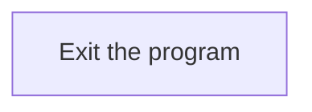

<SwmSnippet path="/src/base/cobol_src/BNK1DAC.cbl" line="362">

---

The <SwmToken path="src/base/cobol_src/BNK1DAC.cbl" pos="362:1:1" line-data="       A999.">`A999`</SwmToken> section is responsible for exiting the program. This is a standard practice in COBOL to ensure that the program terminates correctly and releases any resources it may have been using.

```cobol
       A999.
           EXIT.
```

---

</SwmSnippet>

# Send map (<SwmToken path="src/base/cobol_src/BNK1DAC.cbl" pos="201:3:5" line-data="                 PERFORM SEND-MAP">`SEND-MAP`</SwmToken>)

Let's split this section into smaller parts:

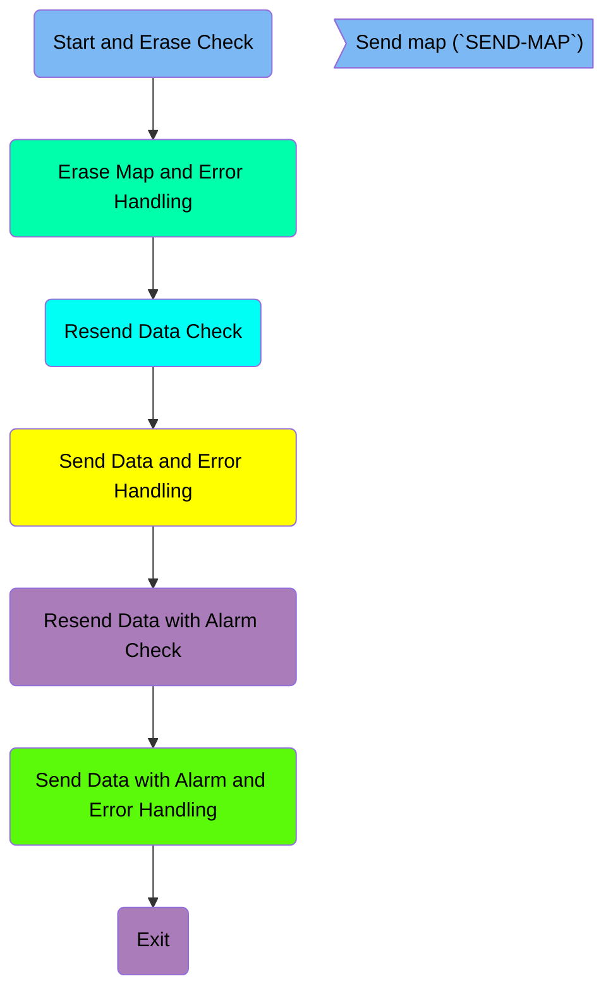

## Start and Erase Check

First, we'll zoom into this section of the flow:

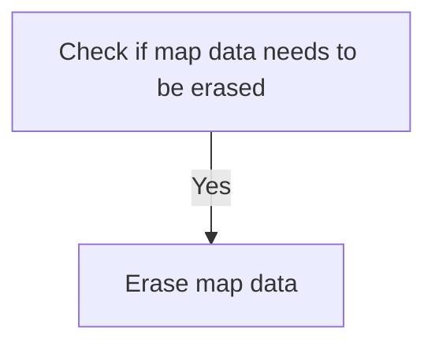

<SwmSnippet path="/src/base/cobol_src/BNK1DAC.cbl" line="825">

---

First, the code checks if the map data needs to be erased by evaluating the <SwmToken path="src/base/cobol_src/BNK1DAC.cbl" pos="825:3:5" line-data="           IF SEND-ERASE">`SEND-ERASE`</SwmToken> flag.

```cobol
           IF SEND-ERASE
```

---

</SwmSnippet>

## Erase Map and Error Handling

Now, lets zoom into this section of the flow:

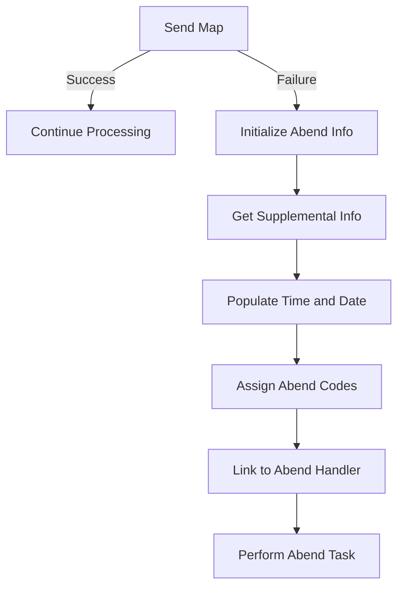

<SwmSnippet path="/src/base/cobol_src/BNK1DAC.cbl" line="827">

---

First, the <SwmToken path="src/base/cobol_src/BNK1DAC.cbl" pos="827:5:7" line-data="              EXEC CICS SEND MAP(&#39;BNK1DA&#39;)">`SEND MAP`</SwmToken> command is executed to display the map <SwmToken path="src/base/cobol_src/BNK1DAC.cbl" pos="827:10:10" line-data="              EXEC CICS SEND MAP(&#39;BNK1DA&#39;)">`BNK1DA`</SwmToken> from the mapset <SwmToken path="src/base/cobol_src/BNK1DAC.cbl" pos="828:4:4" line-data="                 MAPSET(&#39;BNK1DAM&#39;)">`BNK1DAM`</SwmToken>. This command is responsible for sending the map to the terminal screen.

```cobol
              EXEC CICS SEND MAP('BNK1DA')
                 MAPSET('BNK1DAM')
                 FROM(BNK1DAO)
                 ERASE
                 RESP(WS-CICS-RESP)
                 RESP2(WS-CICS-RESP2)
              END-EXEC
```

---

</SwmSnippet>

<SwmSnippet path="/src/base/cobol_src/BNK1DAC.cbl" line="835">

---

Next, if the response code <SwmToken path="src/base/cobol_src/BNK1DAC.cbl" pos="835:3:7" line-data="              IF WS-CICS-RESP NOT = DFHRESP(NORMAL)">`WS-CICS-RESP`</SwmToken> is not equal to <SwmToken path="src/base/cobol_src/BNK1DAC.cbl" pos="835:13:16" line-data="              IF WS-CICS-RESP NOT = DFHRESP(NORMAL)">`DFHRESP(NORMAL)`</SwmToken>, it indicates that an error occurred while sending the map.

```cobol
              IF WS-CICS-RESP NOT = DFHRESP(NORMAL)
```

---

</SwmSnippet>

<SwmSnippet path="/src/base/cobol_src/BNK1DAC.cbl" line="842">

---

In case of an error, the <SwmToken path="src/base/cobol_src/BNK1DAC.cbl" pos="842:3:5" line-data="                 INITIALIZE ABNDINFO-REC">`ABNDINFO-REC`</SwmToken> structure is initialized to store abend (abnormal end) information.

```cobol
                 INITIALIZE ABNDINFO-REC
```

---

</SwmSnippet>

<SwmSnippet path="/src/base/cobol_src/BNK1DAC.cbl" line="843">

---

The response codes <SwmToken path="src/base/cobol_src/BNK1DAC.cbl" pos="843:3:3" line-data="                 MOVE EIBRESP    TO ABND-RESPCODE">`EIBRESP`</SwmToken> and <SwmToken path="src/base/cobol_src/BNK1DAC.cbl" pos="844:3:3" line-data="                 MOVE EIBRESP2   TO ABND-RESP2CODE">`EIBRESP2`</SwmToken> are moved to <SwmToken path="src/base/cobol_src/BNK1DAC.cbl" pos="843:7:9" line-data="                 MOVE EIBRESP    TO ABND-RESPCODE">`ABND-RESPCODE`</SwmToken> and <SwmToken path="src/base/cobol_src/BNK1DAC.cbl" pos="844:7:9" line-data="                 MOVE EIBRESP2   TO ABND-RESP2CODE">`ABND-RESP2CODE`</SwmToken> respectively to capture the error details.

```cobol
                 MOVE EIBRESP    TO ABND-RESPCODE
                 MOVE EIBRESP2   TO ABND-RESP2CODE
```

---

</SwmSnippet>

<SwmSnippet path="/src/base/cobol_src/BNK1DAC.cbl" line="848">

---

Supplemental information such as the application ID (<SwmToken path="src/base/cobol_src/BNK1DAC.cbl" pos="848:7:7" line-data="                 EXEC CICS ASSIGN APPLID(ABND-APPLID)">`APPLID`</SwmToken>), task number (<SwmToken path="src/base/cobol_src/BNK1DAC.cbl" pos="851:3:3" line-data="                 MOVE EIBTASKN   TO ABND-TASKNO-KEY">`EIBTASKN`</SwmToken>), and transaction ID (<SwmToken path="src/base/cobol_src/BNK1DAC.cbl" pos="852:3:3" line-data="                 MOVE EIBTRNID   TO ABND-TRANID">`EIBTRNID`</SwmToken>) are retrieved and stored in the abend information structure.

```cobol
                 EXEC CICS ASSIGN APPLID(ABND-APPLID)
                 END-EXEC

                 MOVE EIBTASKN   TO ABND-TASKNO-KEY
                 MOVE EIBTRNID   TO ABND-TRANID

```

---

</SwmSnippet>

<SwmSnippet path="/src/base/cobol_src/BNK1DAC.cbl" line="854">

---

The current date and time are populated into the abend information structure using the <SwmToken path="src/base/cobol_src/BNK1DAC.cbl" pos="854:3:7" line-data="                 PERFORM POPULATE-TIME-DATE">`POPULATE-TIME-DATE`</SwmToken> routine and string operations.

```cobol
                 PERFORM POPULATE-TIME-DATE

                 MOVE WS-ORIG-DATE TO ABND-DATE
                 STRING WS-TIME-NOW-GRP-HH DELIMITED BY SIZE,
                       ':' DELIMITED BY SIZE,
                        WS-TIME-NOW-GRP-MM DELIMITED BY SIZE,
                        ':' DELIMITED BY SIZE,
                        WS-TIME-NOW-GRP-MM DELIMITED BY SIZE
                        INTO ABND-TIME
```

---

</SwmSnippet>

<SwmSnippet path="/src/base/cobol_src/BNK1DAC.cbl" line="865">

---

Additional abend information such as the universal time (<SwmToken path="src/base/cobol_src/BNK1DAC.cbl" pos="865:3:7" line-data="                 MOVE WS-U-TIME   TO ABND-UTIME-KEY">`WS-U-TIME`</SwmToken>), abend code (<SwmToken path="src/base/cobol_src/BNK1DAC.cbl" pos="866:4:4" line-data="                 MOVE &#39;HBNK&#39;      TO ABND-CODE">`HBNK`</SwmToken>), and the program name are assigned to the abend structure.

```cobol
                 MOVE WS-U-TIME   TO ABND-UTIME-KEY
                 MOVE 'HBNK'      TO ABND-CODE

                 EXEC CICS ASSIGN PROGRAM(ABND-PROGRAM)
                 END-EXEC
```

---

</SwmSnippet>

<SwmSnippet path="/src/base/cobol_src/BNK1DAC.cbl" line="873">

---

A detailed error message is constructed and stored in <SwmToken path="src/base/cobol_src/BNK1DAC.cbl" pos="879:3:5" line-data="                       INTO ABND-FREEFORM">`ABND-FREEFORM`</SwmToken> to describe the failure of the <SwmToken path="src/base/cobol_src/BNK1DAC.cbl" pos="873:8:10" line-data="                 STRING &#39;SM010 - SEND MAP ERASE FAIL.&#39;">`SEND MAP`</SwmToken> command.

```cobol
                 STRING 'SM010 - SEND MAP ERASE FAIL.'
                       DELIMITED BY SIZE,
                       'EIBRESP=' DELIMITED BY SIZE,
                       ABND-RESPCODE DELIMITED BY SIZE,
                       ' RESP2=' DELIMITED BY SIZE,
                       ABND-RESP2CODE DELIMITED BY SIZE
                       INTO ABND-FREEFORM
```

---

</SwmSnippet>

<SwmSnippet path="/src/base/cobol_src/BNK1DAC.cbl" line="882">

---

The abend handler program is linked to using the <SwmToken path="src/base/cobol_src/BNK1DAC.cbl" pos="882:5:7" line-data="                 EXEC CICS LINK PROGRAM(WS-ABEND-PGM)">`LINK PROGRAM`</SwmToken> command, passing the abend information structure as communication area (<SwmToken path="src/base/cobol_src/BNK1DAC.cbl" pos="883:1:1" line-data="                           COMMAREA(ABNDINFO-REC)">`COMMAREA`</SwmToken>).

```cobol
                 EXEC CICS LINK PROGRAM(WS-ABEND-PGM)
                           COMMAREA(ABNDINFO-REC)
                 END-EXEC
```

---

</SwmSnippet>

<SwmSnippet path="/src/base/cobol_src/BNK1DAC.cbl" line="886">

---

The failure information is initialized and a failure message is set in <SwmToken path="src/base/cobol_src/BNK1DAC.cbl" pos="888:3:9" line-data="                    TO WS-CICS-FAIL-MSG">`WS-CICS-FAIL-MSG`</SwmToken> to indicate the <SwmToken path="src/base/cobol_src/BNK1DAC.cbl" pos="887:12:14" line-data="                 MOVE &#39;BNK1DAC - SM010 - SEND MAP ERASE FAIL &#39;">`SEND MAP`</SwmToken> failure.

```cobol
                 INITIALIZE WS-FAIL-INFO
                 MOVE 'BNK1DAC - SM010 - SEND MAP ERASE FAIL '
                    TO WS-CICS-FAIL-MSG
```

---

</SwmSnippet>

<SwmSnippet path="/src/base/cobol_src/BNK1DAC.cbl" line="891">

---

Finally, the task is abended by performing the <SwmToken path="src/base/cobol_src/BNK1DAC.cbl" pos="891:3:7" line-data="                 PERFORM ABEND-THIS-TASK">`ABEND-THIS-TASK`</SwmToken> routine, which terminates the task due to the error.

```cobol
                 PERFORM ABEND-THIS-TASK
```

---

</SwmSnippet>

## Resend Data Check

This is the next section of the flow.

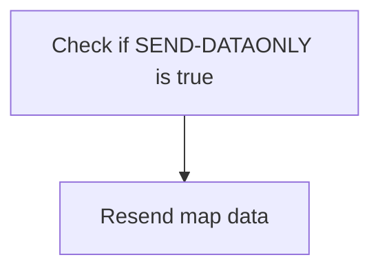

<SwmSnippet path="/src/base/cobol_src/BNK1DAC.cbl" line="896">

---

The <SwmToken path="src/base/cobol_src/BNK1DAC.cbl" pos="201:3:5" line-data="                 PERFORM SEND-MAP">`SEND-MAP`</SwmToken> function checks if <SwmToken path="src/base/cobol_src/BNK1DAC.cbl" pos="900:3:5" line-data="           IF SEND-DATAONLY">`SEND-DATAONLY`</SwmToken> is true. If it is, the function proceeds to resend only the data of the map to the user interface, ensuring that the user receives the most up-to-date information without reloading the entire map structure.

```cobol

      *
      *    If the map just needs a resend of only the data
      *
           IF SEND-DATAONLY
```

---

</SwmSnippet>

## Send Data and Error Handling

Now, lets zoom into this section of the flow:

```mermaid
graph TD
  A[Check if MESSAGEO is not empty] --> B[Set success message in MESSAGEO]
  B --> C[Send map BNK1DA with data]
  C --> D[Check if response is not normal]
  D --> E[Initialize abend info]
  E --> F[Get supplemental information]
  F --> G[Populate time and date]
  G --> H[Set abend details]
  H --> I[Link to abend handler program]
  I --> J[Initialize failure info]
  J --> K[Set failure message]
  K --> L[Perform abend task]

%% Swimm:
%% graph TD
%%   A[Check if MESSAGEO is not empty] --> B[Set success message in MESSAGEO]
%%   B --> C[Send map <SwmToken path="src/base/cobol_src/BNK1DAC.cbl" pos="427:6:6" line-data="              RECEIVE MAP(&#39;BNK1DA&#39;)">`BNK1DA`</SwmToken> with data]
%%   C --> D[Check if response is not normal]
%%   D --> E[Initialize abend info]
%%   E --> F[Get supplemental information]
%%   F --> G[Populate time and date]
%%   G --> H[Set abend details]
%%   H --> I[Link to abend handler program]
%%   I --> J[Initialize failure info]
%%   J --> K[Set failure message]
%%   K --> L[Perform abend task]
```

<SwmSnippet path="/src/base/cobol_src/BNK1DAC.cbl" line="901">

---

First, the code checks if <SwmToken path="src/base/cobol_src/BNK1DAC.cbl" pos="901:3:3" line-data="              IF MESSAGEO IS NOT EQUAL SPACES">`MESSAGEO`</SwmToken> (which holds the output message) is not empty or does not contain low-values.

```cobol
              IF MESSAGEO IS NOT EQUAL SPACES
              AND MESSAGEO IS NOT EQUAL LOW-VALUES
```

---

</SwmSnippet>

<SwmSnippet path="/src/base/cobol_src/BNK1DAC.cbl" line="903">

---

If <SwmToken path="src/base/cobol_src/BNK1DAC.cbl" pos="903:14:14" line-data="                 MOVE &#39;Account lookup successful.&#39; TO MESSAGEO">`MESSAGEO`</SwmToken> is not empty, it sets the message to 'Account lookup successful.'

```cobol
                 MOVE 'Account lookup successful.' TO MESSAGEO
```

---

</SwmSnippet>

<SwmSnippet path="/src/base/cobol_src/BNK1DAC.cbl" line="906">

---

Next, the code sends the map <SwmToken path="src/base/cobol_src/BNK1DAC.cbl" pos="906:10:10" line-data="              EXEC CICS SEND MAP(&#39;BNK1DA&#39;)">`BNK1DA`</SwmToken> with the data from <SwmToken path="src/base/cobol_src/BNK1DAC.cbl" pos="908:3:3" line-data="                 FROM(BNK1DAO)">`BNK1DAO`</SwmToken> to the user interface.

```cobol
              EXEC CICS SEND MAP('BNK1DA')
                 MAPSET('BNK1DAM')
                 FROM(BNK1DAO)
                 DATAONLY
                 RESP(WS-CICS-RESP)
                 RESP2(WS-CICS-RESP2)
              END-EXEC
```

---

</SwmSnippet>

<SwmSnippet path="/src/base/cobol_src/BNK1DAC.cbl" line="914">

---

Then, it checks if the response from the <SwmToken path="src/base/cobol_src/BNK1DAC.cbl" pos="827:5:7" line-data="              EXEC CICS SEND MAP(&#39;BNK1DA&#39;)">`SEND MAP`</SwmToken> command is not normal.

```cobol
              IF WS-CICS-RESP NOT = DFHRESP(NORMAL)
```

---

</SwmSnippet>

<SwmSnippet path="/src/base/cobol_src/BNK1DAC.cbl" line="921">

---

If the response is not normal, it initializes the abend information record.

```cobol
                 INITIALIZE ABNDINFO-REC
```

---

</SwmSnippet>

<SwmSnippet path="/src/base/cobol_src/BNK1DAC.cbl" line="927">

---

The code then retrieves supplemental information such as the application ID and task number.

```cobol
                 EXEC CICS ASSIGN APPLID(ABND-APPLID)
                 END-EXEC

                 MOVE EIBTASKN   TO ABND-TASKNO-KEY
                 MOVE EIBTRNID   TO ABND-TRANID
```

---

</SwmSnippet>

<SwmSnippet path="/src/base/cobol_src/BNK1DAC.cbl" line="933">

---

Moving to the next step, it populates the current date and time.

```cobol
                 PERFORM POPULATE-TIME-DATE

                 MOVE WS-ORIG-DATE TO ABND-DATE
                 STRING WS-TIME-NOW-GRP-HH DELIMITED BY SIZE,
                       ':' DELIMITED BY SIZE,
                        WS-TIME-NOW-GRP-MM DELIMITED BY SIZE,
                        ':' DELIMITED BY SIZE,
                        WS-TIME-NOW-GRP-MM DELIMITED BY SIZE
                        INTO ABND-TIME
```

---

</SwmSnippet>

<SwmSnippet path="/src/base/cobol_src/BNK1DAC.cbl" line="944">

---

The code sets additional abend details such as the unique time key and abend code.

```cobol
                 MOVE WS-U-TIME   TO ABND-UTIME-KEY
                 MOVE 'HBNK'      TO ABND-CODE

                 EXEC CICS ASSIGN PROGRAM(ABND-PROGRAM)
                 END-EXEC

                 MOVE ZEROS      TO ABND-SQLCODE
```

---

</SwmSnippet>

<SwmSnippet path="/src/base/cobol_src/BNK1DAC.cbl" line="952">

---

It then constructs a freeform message detailing the failure and links to the abend handler program.

More about ABNDPROC: <SwmLink doc-title="Writing Abend Records (ABNDPROC)">[Writing Abend Records (ABNDPROC)](/.swm/writing-abend-records-abndproc.svfj4jn5.sw.md)</SwmLink>

```cobol
                 STRING 'SM010 - SEND MAP DATAONLY FAIL.'
                       DELIMITED BY SIZE,
                       'EIBRESP=' DELIMITED BY SIZE,
                       ABND-RESPCODE DELIMITED BY SIZE,
                       ' RESP2=' DELIMITED BY SIZE,
                       ABND-RESP2CODE DELIMITED BY SIZE
                       INTO ABND-FREEFORM
                 END-STRING

                 EXEC CICS LINK PROGRAM(WS-ABEND-PGM)
                           COMMAREA(ABNDINFO-REC)
                 END-EXEC
```

---

</SwmSnippet>

<SwmSnippet path="/src/base/cobol_src/BNK1DAC.cbl" line="965">

---

Finally, it initializes failure information, sets the failure message, and performs the abend task.

```cobol
                 INITIALIZE WS-FAIL-INFO
                 MOVE 'BNK1DAC - SM010 - SEND MAP DATAONLY FAIL '
                    TO WS-CICS-FAIL-MSG
                 MOVE WS-CICS-RESP  TO WS-CICS-RESP-DISP
                 MOVE WS-CICS-RESP2 TO WS-CICS-RESP2-DISP
                 PERFORM ABEND-THIS-TASK
```

---

</SwmSnippet>

## Resend Data with Alarm Check

This is the next section of the flow.

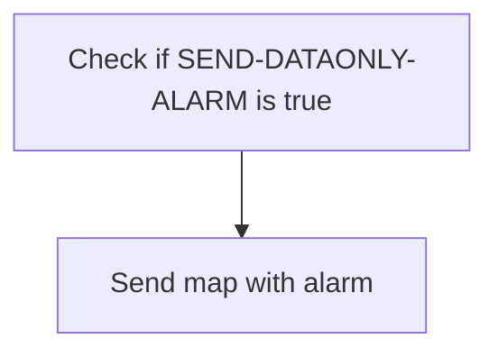

<SwmSnippet path="/src/base/cobol_src/BNK1DAC.cbl" line="979">

---

First, the code checks if <SwmToken path="src/base/cobol_src/BNK1DAC.cbl" pos="979:3:7" line-data="           IF SEND-DATAONLY-ALARM">`SEND-DATAONLY-ALARM`</SwmToken> (a flag indicating whether to send the map with an alarm signal) is true.

```cobol
           IF SEND-DATAONLY-ALARM
```

---

</SwmSnippet>

## Send Data with Alarm and Error Handling

Now, lets zoom into this section of the flow:

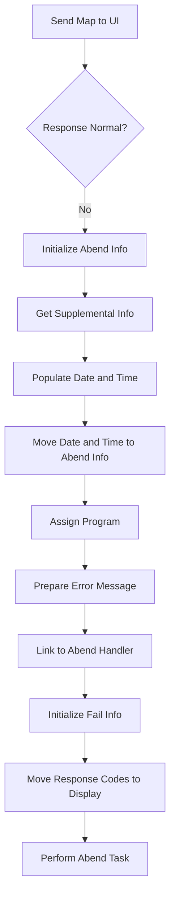

<SwmSnippet path="/src/base/cobol_src/BNK1DAC.cbl" line="980">

---

First, the <SwmToken path="src/base/cobol_src/BNK1DAC.cbl" pos="980:5:7" line-data="              EXEC CICS SEND MAP(&#39;BNK1DA&#39;)">`SEND MAP`</SwmToken> command is used to send the map <SwmToken path="src/base/cobol_src/BNK1DAC.cbl" pos="980:10:10" line-data="              EXEC CICS SEND MAP(&#39;BNK1DA&#39;)">`BNK1DA`</SwmToken> to the user interface, specifying the mapset <SwmToken path="src/base/cobol_src/BNK1DAC.cbl" pos="981:4:4" line-data="                 MAPSET(&#39;BNK1DAM&#39;)">`BNK1DAM`</SwmToken> and the data area <SwmToken path="src/base/cobol_src/BNK1DAC.cbl" pos="982:3:3" line-data="                 FROM(BNK1DAO)">`BNK1DAO`</SwmToken>.

```cobol
              EXEC CICS SEND MAP('BNK1DA')
                 MAPSET('BNK1DAM')
                 FROM(BNK1DAO)
                 DATAONLY
                 ALARM
                 RESP(WS-CICS-RESP)
                 RESP2(WS-CICS-RESP2)
              END-EXEC
```

---

</SwmSnippet>

<SwmSnippet path="/src/base/cobol_src/BNK1DAC.cbl" line="989">

---

Next, the code checks if the response (<SwmToken path="src/base/cobol_src/BNK1DAC.cbl" pos="989:3:7" line-data="              IF WS-CICS-RESP NOT = DFHRESP(NORMAL)">`WS-CICS-RESP`</SwmToken>) is not normal. If the response is not normal, it indicates an error occurred during the <SwmToken path="src/base/cobol_src/BNK1DAC.cbl" pos="827:5:7" line-data="              EXEC CICS SEND MAP(&#39;BNK1DA&#39;)">`SEND MAP`</SwmToken> operation.

```cobol
              IF WS-CICS-RESP NOT = DFHRESP(NORMAL)
```

---

</SwmSnippet>

<SwmSnippet path="/src/base/cobol_src/BNK1DAC.cbl" line="996">

---

Then, the code initializes the <SwmToken path="src/base/cobol_src/BNK1DAC.cbl" pos="996:3:5" line-data="                 INITIALIZE ABNDINFO-REC">`ABNDINFO-REC`</SwmToken> structure to prepare for capturing abend (abnormal end) information.

```cobol
                 INITIALIZE ABNDINFO-REC
```

---

</SwmSnippet>

<SwmSnippet path="/src/base/cobol_src/BNK1DAC.cbl" line="997">

---

Moving to the next step, the response codes <SwmToken path="src/base/cobol_src/BNK1DAC.cbl" pos="997:3:3" line-data="                 MOVE EIBRESP    TO ABND-RESPCODE">`EIBRESP`</SwmToken> and <SwmToken path="src/base/cobol_src/BNK1DAC.cbl" pos="998:3:3" line-data="                 MOVE EIBRESP2   TO ABND-RESP2CODE">`EIBRESP2`</SwmToken> are moved to the abend information structure to capture the error details.

```cobol
                 MOVE EIBRESP    TO ABND-RESPCODE
                 MOVE EIBRESP2   TO ABND-RESP2CODE
```

---

</SwmSnippet>

<SwmSnippet path="/src/base/cobol_src/BNK1DAC.cbl" line="1002">

---

The code then assigns the application ID to the abend information structure using the <SwmToken path="src/base/cobol_src/BNK1DAC.cbl" pos="1002:5:7" line-data="                 EXEC CICS ASSIGN APPLID(ABND-APPLID)">`ASSIGN APPLID`</SwmToken> command.

```cobol
                 EXEC CICS ASSIGN APPLID(ABND-APPLID)
                 END-EXEC
```

---

</SwmSnippet>

<SwmSnippet path="/src/base/cobol_src/BNK1DAC.cbl" line="1005">

---

Next, the task number and transaction ID are moved to the abend information structure to provide context for the error.

```cobol
                 MOVE EIBTASKN   TO ABND-TASKNO-KEY
                 MOVE EIBTRNID   TO ABND-TRANID
```

---

</SwmSnippet>

<SwmSnippet path="/src/base/cobol_src/BNK1DAC.cbl" line="1008">

---

The <SwmToken path="src/base/cobol_src/BNK1DAC.cbl" pos="1008:3:7" line-data="                 PERFORM POPULATE-TIME-DATE">`POPULATE-TIME-DATE`</SwmToken> routine is performed to get the current date and time, which are then moved to the abend information structure.

```cobol
                 PERFORM POPULATE-TIME-DATE

                 MOVE WS-ORIG-DATE TO ABND-DATE
                 STRING WS-TIME-NOW-GRP-HH DELIMITED BY SIZE,
```

---

</SwmSnippet>

<SwmSnippet path="/src/base/cobol_src/BNK1DAC.cbl" line="1022">

---

The code then assigns the program name to the abend information structure using the <SwmToken path="src/base/cobol_src/BNK1DAC.cbl" pos="1022:5:7" line-data="                 EXEC CICS ASSIGN PROGRAM(ABND-PROGRAM)">`ASSIGN PROGRAM`</SwmToken> command.

```cobol
                 EXEC CICS ASSIGN PROGRAM(ABND-PROGRAM)
                 END-EXEC
```

---

</SwmSnippet>

<SwmSnippet path="/src/base/cobol_src/BNK1DAC.cbl" line="1027">

---

An error message is prepared by concatenating various strings and response codes, which is then moved to the abend information structure.

```cobol
                 STRING 'SM010 - SEND MAP DATAONLY ALARM FAIL.'
                       DELIMITED BY SIZE,
                       'EIBRESP=' DELIMITED BY SIZE,
                       ABND-RESPCODE DELIMITED BY SIZE,
                       ' RESP2=' DELIMITED BY SIZE,
                       ABND-RESP2CODE DELIMITED BY SIZE
                       INTO ABND-FREEFORM
```

---

</SwmSnippet>

<SwmSnippet path="/src/base/cobol_src/BNK1DAC.cbl" line="1036">

---

The code then links to the abend handler program (<SwmToken path="src/base/cobol_src/BNK1DAC.cbl" pos="1036:9:13" line-data="                 EXEC CICS LINK PROGRAM(WS-ABEND-PGM)">`WS-ABEND-PGM`</SwmToken>) to handle the error, passing the abend information structure as the communication area.

More about ABNDPROC: <SwmLink doc-title="Writing Abend Records (ABNDPROC)">[Writing Abend Records (ABNDPROC)](/.swm/writing-abend-records-abndproc.svfj4jn5.sw.md)</SwmLink>

```cobol
                 EXEC CICS LINK PROGRAM(WS-ABEND-PGM)
                           COMMAREA(ABNDINFO-REC)
                 END-EXEC
```

---

</SwmSnippet>

<SwmSnippet path="/src/base/cobol_src/BNK1DAC.cbl" line="1041">

---

Finally, the code initializes the fail information structure and moves the response codes to display variables before performing the abend task.

```cobol
                 INITIALIZE WS-FAIL-INFO
                 MOVE 'BNK1DAC - SM010 - SEND MAP DATAONLY ALARM FAIL '
                    TO WS-CICS-FAIL-MSG
                 MOVE WS-CICS-RESP  TO WS-CICS-RESP-DISP
                 MOVE WS-CICS-RESP2 TO WS-CICS-RESP2-DISP
                 PERFORM ABEND-THIS-TASK
```

---

</SwmSnippet>

## Exit

This is the next section of the flow.

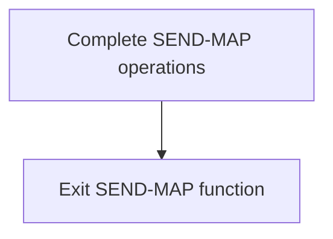

<SwmSnippet path="/src/base/cobol_src/BNK1DAC.cbl" line="1051">

---

The <SwmToken path="src/base/cobol_src/BNK1DAC.cbl" pos="201:3:5" line-data="                 PERFORM SEND-MAP">`SEND-MAP`</SwmToken> function concludes its operations and then reaches the <SwmToken path="src/base/cobol_src/BNK1DAC.cbl" pos="1051:1:1" line-data="       SM999.">`SM999`</SwmToken> label, which signifies the end of the function. The <SwmToken path="src/base/cobol_src/BNK1DAC.cbl" pos="1052:1:1" line-data="           EXIT.">`EXIT`</SwmToken> statement is then executed, indicating that the function has completed its tasks and is exiting.

```cobol
       SM999.
           EXIT.
```

---

</SwmSnippet>

## <SwmToken path="src/base/cobol_src/BNK1DAC.cbl" pos="322:3:7" line-data="              PERFORM POPULATE-TIME-DATE">`POPULATE-TIME-DATE`</SwmToken>

Lets' zoom into this section of the flow:

```mermaid
graph TD
  A[Get Current Date and Time] --> B[Format Date and Time] --> C[Store Formatted Date and Time]
```

<SwmSnippet path="/src/base/cobol_src/BNK1DAC.cbl" line="1197">

---

### Populating Current Date and Time

The <SwmToken path="src/base/cobol_src/BNK1DAC.cbl" pos="322:3:7" line-data="              PERFORM POPULATE-TIME-DATE">`POPULATE-TIME-DATE`</SwmToken> function is responsible for obtaining the current date and time, formatting them appropriately, and storing the formatted values for use in transaction records. This ensures that each transaction is accurately timestamped, which is crucial for record-keeping and auditing purposes.

```cobol

```

---

</SwmSnippet>

## <SwmToken path="src/base/cobol_src/BNK1DAC.cbl" pos="726:3:7" line-data="              PERFORM ABEND-THIS-TASK">`ABEND-THIS-TASK`</SwmToken>

Lets' zoom into this section of the flow:

```mermaid
graph TD
  A[Set abend code] --> B[Call ABNDPROC program]
```

<SwmSnippet path="/src/base/cobol_src/BNK1DAC.cbl" line="1186">

---

### Handling abnormal task termination

The <SwmToken path="src/base/cobol_src/BNK1DAC.cbl" pos="726:3:7" line-data="              PERFORM ABEND-THIS-TASK">`ABEND-THIS-TASK`</SwmToken> function is responsible for handling abnormal task termination within the application. It sets the abend code to '9999' to indicate an abnormal end. This is followed by calling the <SwmToken path="src/base/cobol_src/BNK1DAC.cbl" pos="161:19:19" line-data="       01 WS-ABEND-PGM                 PIC X(8) VALUE &#39;ABNDPROC&#39;.">`ABNDPROC`</SwmToken> program, which processes the abnormal termination by logging relevant transaction details for diagnostic purposes.

```cobol

```

---

</SwmSnippet>

# Keypress handling (<SwmToken path="src/base/cobol_src/BNK1DAC.cbl" pos="224:3:5" line-data="                 PERFORM PROCESS-MAP">`PROCESS-MAP`</SwmToken>)

Let's split this section into smaller parts:

```mermaid
graph TD
4p7h4("Retrieve map data"):::aa310bea1  --> 
wkoao("Process Enter key"):::ac4852bf6  --> 
nv9h5("Process PF5 key"):::aa6e2165d  --> 
krkxg("Send map data"):::a93fe5d42 
id1>"Keypress handling (`PROCESS-MAP`)"]:::a43a56b0a
classDef a43a56b0a color:#000000,fill:#7CB9F4
classDef aa310bea1 color:#000000,fill:#7CB9F4
classDef ac4852bf6 color:#000000,fill:#00FFAA
classDef aa6e2165d color:#000000,fill:#00FFF4
classDef a93fe5d42 color:#000000,fill:#FFFF00

%% Swimm:
%% graph TD
%% 4p7h4("Retrieve map data"):::aa310bea1  --> 
%% wkoao("Process Enter key"):::ac4852bf6  --> 
%% nv9h5("Process <SwmToken path="src/base/cobol_src/BNK1DAC.cbl" pos="693:21:21" line-data="           STRING &#39;If you wish to delete the Account press &lt;PF5&gt;.&#39;">`PF5`</SwmToken> key"):::aa6e2165d  --> 
%% krkxg("Send map data"):::a93fe5d42 
%% id1>"Keypress handling (`<SwmToken path="src/base/cobol_src/BNK1DAC.cbl" pos="224:3:5" line-data="                 PERFORM PROCESS-MAP">`PROCESS-MAP`</SwmToken>`)"]:::a43a56b0a
%% classDef a43a56b0a color:#000000,fill:#7CB9F4
%% classDef aa310bea1 color:#000000,fill:#7CB9F4
%% classDef ac4852bf6 color:#000000,fill:#00FFAA
%% classDef aa6e2165d color:#000000,fill:#00FFF4
%% classDef a93fe5d42 color:#000000,fill:#FFFF00
```

## Retrieve map data

First, we'll zoom into this section of the flow:

```mermaid
graph TD
  A[PROCESS-MAP Section] --> B[Retrieve data from the map]

%% Swimm:
%% graph TD
%%   A[<SwmToken path="src/base/cobol_src/BNK1DAC.cbl" pos="224:3:5" line-data="                 PERFORM PROCESS-MAP">`PROCESS-MAP`</SwmToken> Section] --> B[Retrieve data from the map]
```

<SwmSnippet path="/src/base/cobol_src/BNK1DAC.cbl" line="366">

---

First, the <SwmToken path="src/base/cobol_src/BNK1DAC.cbl" pos="366:1:3" line-data="       PROCESS-MAP SECTION.">`PROCESS-MAP`</SwmToken> section is initiated to handle the retrieval of data from the user interface map.

```cobol
       PROCESS-MAP SECTION.
       PM010.
```

---

</SwmSnippet>

<SwmSnippet path="/src/base/cobol_src/BNK1DAC.cbl" line="371">

---

Next, the <SwmToken path="src/base/cobol_src/BNK1DAC.cbl" pos="371:3:5" line-data="           PERFORM RECEIVE-MAP.">`RECEIVE-MAP`</SwmToken> operation is performed to actually retrieve the data from the map, ensuring that the user inputs are captured for further processing.

```cobol
           PERFORM RECEIVE-MAP.
```

---

</SwmSnippet>

## Process Enter key

This is the next section of the flow.

```mermaid
graph TD
  A[Check if Enter is pressed] --> B[Validate received data] --> C{Is data valid?}
  C -->|Yes| D[Retrieve account information]
  C -->|No| E[Initialize parameters for subprogram]
```

<SwmSnippet path="/src/base/cobol_src/BNK1DAC.cbl" line="376">

---

### Checking if Enter is pressed

First, the function checks if the Enter key has been pressed by evaluating <SwmToken path="src/base/cobol_src/BNK1DAC.cbl" pos="376:3:3" line-data="           IF EIBAID = DFHENTER">`EIBAID`</SwmToken> (which holds the attention identifier) against <SwmToken path="src/base/cobol_src/BNK1DAC.cbl" pos="376:7:7" line-data="           IF EIBAID = DFHENTER">`DFHENTER`</SwmToken> (the constant for the Enter key).

```cobol
           IF EIBAID = DFHENTER
```

---

</SwmSnippet>

<SwmSnippet path="/src/base/cobol_src/BNK1DAC.cbl" line="380">

---

### Validating received data

Moving to the next step, if the Enter key is pressed, the function proceeds to validate the received data by performing the <SwmToken path="src/base/cobol_src/BNK1DAC.cbl" pos="380:3:5" line-data="              PERFORM EDIT-DATA">`EDIT-DATA`</SwmToken> routine.

```cobol
              PERFORM EDIT-DATA
```

---

</SwmSnippet>

<SwmSnippet path="/src/base/cobol_src/BNK1DAC.cbl" line="386">

---

### Retrieving account information or initializing parameters

Next, the function checks if the data is valid by evaluating <SwmToken path="src/base/cobol_src/BNK1DAC.cbl" pos="386:3:5" line-data="              IF VALID-DATA">`VALID-DATA`</SwmToken>. If the data is valid, it performs the <SwmToken path="src/base/cobol_src/BNK1DAC.cbl" pos="387:3:7" line-data="                 PERFORM GET-ACC-DATA">`GET-ACC-DATA`</SwmToken> routine to retrieve account information. Otherwise, it initializes the parameters for the subprogram by performing <SwmToken path="src/base/cobol_src/BNK1DAC.cbl" pos="389:1:5" line-data="                 INITIALIZE PARMS-SUBPGM">`INITIALIZE PARMS-SUBPGM`</SwmToken>.

```cobol
              IF VALID-DATA
                 PERFORM GET-ACC-DATA
              ELSE
                 INITIALIZE PARMS-SUBPGM
              END-IF
```

---

</SwmSnippet>

## Process <SwmToken path="src/base/cobol_src/BNK1DAC.cbl" pos="693:21:21" line-data="           STRING &#39;If you wish to delete the Account press &lt;PF5&gt;.&#39;">`PF5`</SwmToken> key

This is the next section of the flow.

```mermaid
graph TD
  A[Check if delete key is pressed] --> B[Validate account data] --> C{Is data valid?}
  C -- Yes --> D[Delete account data]
  C -- No --> E[Stop process]
```

<SwmSnippet path="/src/base/cobol_src/BNK1DAC.cbl" line="398">

---

First, the function checks if the delete key (<SwmToken path="src/base/cobol_src/BNK1DAC.cbl" pos="398:7:7" line-data="           IF EIBAID = DFHPF5">`DFHPF5`</SwmToken>) is pressed by the user. This is crucial as it determines whether the subsequent steps for data validation and deletion should be initiated.

```cobol
           IF EIBAID = DFHPF5
```

---

</SwmSnippet>

<SwmSnippet path="/src/base/cobol_src/BNK1DAC.cbl" line="399">

---

Next, if the delete key is pressed, the function proceeds to validate the account data by performing the <SwmToken path="src/base/cobol_src/BNK1DAC.cbl" pos="399:3:5" line-data="              PERFORM VALIDATE-DATA">`VALIDATE-DATA`</SwmToken> operation. This step ensures that the data meets the necessary criteria before any deletion can occur.

```cobol
              PERFORM VALIDATE-DATA
```

---

</SwmSnippet>

<SwmSnippet path="/src/base/cobol_src/BNK1DAC.cbl" line="405">

---

Then, the function checks if the data passed the validation by evaluating the <SwmToken path="src/base/cobol_src/BNK1DAC.cbl" pos="405:3:5" line-data="              IF VALID-DATA">`VALID-DATA`</SwmToken> flag. This condition is critical as it determines whether the account data is eligible for deletion.

```cobol
              IF VALID-DATA
```

---

</SwmSnippet>

<SwmSnippet path="/src/base/cobol_src/BNK1DAC.cbl" line="406">

---

Finally, if the data is valid, the function performs the <SwmToken path="src/base/cobol_src/BNK1DAC.cbl" pos="406:3:7" line-data="                 PERFORM DEL-ACC-DATA">`DEL-ACC-DATA`</SwmToken> operation to delete the account data. This step completes the process of removing the account information from the system.

```cobol
                 PERFORM DEL-ACC-DATA
```

---

</SwmSnippet>

## Send map data

This is the next section of the flow.

```mermaid
graph TD
  A[Set Alarm for Data Transmission] --> B[Output Data to Screen] --> C[Exit Process]
```

<SwmSnippet path="/src/base/cobol_src/BNK1DAC.cbl" line="411">

---

First, the alarm for data transmission is set to true to ensure that the data is sent with an alert signal.

```cobol
           SET SEND-DATAONLY-ALARM TO TRUE.
```

---

</SwmSnippet>

<SwmSnippet path="/src/base/cobol_src/BNK1DAC.cbl" line="415">

---

Next, the data is output to the screen by performing the <SwmToken path="src/base/cobol_src/BNK1DAC.cbl" pos="415:3:5" line-data="           PERFORM SEND-MAP.">`SEND-MAP`</SwmToken> operation, which handles the display of the processed data.

```cobol
           PERFORM SEND-MAP.
```

---

</SwmSnippet>

## <SwmToken path="src/base/cobol_src/BNK1DAC.cbl" pos="371:3:5" line-data="           PERFORM RECEIVE-MAP.">`RECEIVE-MAP`</SwmToken>

Lets' zoom into this section of the flow:

```mermaid
graph TD
  A[Receive user input from map] --> B[Check response status] --> C[Handle normal response] --> D[Handle abnormal response] --> E[Log abend information] --> F[Link to abend handler program]
```

<SwmSnippet path="/src/base/cobol_src/BNK1DAC.cbl" line="421">

---

### Receiving user input

First, the <SwmToken path="src/base/cobol_src/BNK1DAC.cbl" pos="421:1:3" line-data="       RECEIVE-MAP SECTION.">`RECEIVE-MAP`</SwmToken> section retrieves the data from the map <SwmToken path="src/base/cobol_src/BNK1DAC.cbl" pos="427:6:6" line-data="              RECEIVE MAP(&#39;BNK1DA&#39;)">`BNK1DA`</SwmToken> and stores it into the <SwmToken path="src/base/cobol_src/BNK1DAC.cbl" pos="429:3:3" line-data="              INTO(BNK1DAI)">`BNK1DAI`</SwmToken> variable.

```cobol
       RECEIVE-MAP SECTION.
       RM010.
      *
      *    Retrieve the data
      *
           EXEC CICS
              RECEIVE MAP('BNK1DA')
              MAPSET('BNK1DAM')
              INTO(BNK1DAI)
              RESP(WS-CICS-RESP)
              RESP2(WS-CICS-RESP2)
           END-EXEC.
```

---

</SwmSnippet>

<SwmSnippet path="/src/base/cobol_src/BNK1DAC.cbl" line="434">

---

### Checking response status

Next, the code checks if the response status <SwmToken path="src/base/cobol_src/BNK1DAC.cbl" pos="434:3:7" line-data="           IF WS-CICS-RESP NOT = DFHRESP(NORMAL)">`WS-CICS-RESP`</SwmToken> is not equal to <SwmToken path="src/base/cobol_src/BNK1DAC.cbl" pos="434:13:16" line-data="           IF WS-CICS-RESP NOT = DFHRESP(NORMAL)">`DFHRESP(NORMAL)`</SwmToken>. If the response is not normal, it proceeds to handle the abnormal response.

```cobol
           IF WS-CICS-RESP NOT = DFHRESP(NORMAL)
```

---

</SwmSnippet>

<SwmSnippet path="/src/base/cobol_src/BNK1DAC.cbl" line="441">

---

### Handling abnormal response

If an abnormal response is detected, the code initializes the <SwmToken path="src/base/cobol_src/BNK1DAC.cbl" pos="441:3:5" line-data="              INITIALIZE ABNDINFO-REC">`ABNDINFO-REC`</SwmToken> record and moves the response codes <SwmToken path="src/base/cobol_src/BNK1DAC.cbl" pos="442:3:3" line-data="              MOVE EIBRESP    TO ABND-RESPCODE">`EIBRESP`</SwmToken> and <SwmToken path="src/base/cobol_src/BNK1DAC.cbl" pos="443:3:3" line-data="              MOVE EIBRESP2   TO ABND-RESP2CODE">`EIBRESP2`</SwmToken> to <SwmToken path="src/base/cobol_src/BNK1DAC.cbl" pos="442:7:9" line-data="              MOVE EIBRESP    TO ABND-RESPCODE">`ABND-RESPCODE`</SwmToken> and <SwmToken path="src/base/cobol_src/BNK1DAC.cbl" pos="443:7:9" line-data="              MOVE EIBRESP2   TO ABND-RESP2CODE">`ABND-RESP2CODE`</SwmToken> respectively.

```cobol
              INITIALIZE ABNDINFO-REC
              MOVE EIBRESP    TO ABND-RESPCODE
              MOVE EIBRESP2   TO ABND-RESP2CODE
```

---

</SwmSnippet>

<SwmSnippet path="/src/base/cobol_src/BNK1DAC.cbl" line="447">

---

### Gathering supplemental information

The code then gathers supplemental information such as the application ID, task number, transaction ID, and the current date and time. This information is used for logging and debugging purposes.

```cobol
              EXEC CICS ASSIGN APPLID(ABND-APPLID)
              END-EXEC

              MOVE EIBTASKN   TO ABND-TASKNO-KEY
              MOVE EIBTRNID   TO ABND-TRANID

              PERFORM POPULATE-TIME-DATE

              MOVE WS-ORIG-DATE TO ABND-DATE
              STRING WS-TIME-NOW-GRP-HH DELIMITED BY SIZE,
                    ':' DELIMITED BY SIZE,
                     WS-TIME-NOW-GRP-MM DELIMITED BY SIZE,
                     ':' DELIMITED BY SIZE,
                     WS-TIME-NOW-GRP-MM DELIMITED BY SIZE
                     INTO ABND-TIME
```

---

</SwmSnippet>

<SwmSnippet path="/src/base/cobol_src/BNK1DAC.cbl" line="467">

---

### Logging abend information

The code logs the abend information by moving various details into the <SwmToken path="src/base/cobol_src/BNK1DAC.cbl" pos="310:3:5" line-data="              INITIALIZE ABNDINFO-REC">`ABNDINFO-REC`</SwmToken> record, including the program name, SQL code, and a freeform message describing the failure.

```cobol
              EXEC CICS ASSIGN PROGRAM(ABND-PROGRAM)
              END-EXEC

              MOVE ZEROS      TO ABND-SQLCODE

              STRING 'RM010 - RECEIVE MAP FAIL.'
                    DELIMITED BY SIZE,
                    'EIBRESP=' DELIMITED BY SIZE,
                    ABND-RESPCODE DELIMITED BY SIZE,
                    ' RESP2=' DELIMITED BY SIZE,
                    ABND-RESP2CODE DELIMITED BY SIZE
                    INTO ABND-FREEFORM
```

---

</SwmSnippet>

<SwmSnippet path="/src/base/cobol_src/BNK1DAC.cbl" line="481">

---

### Linking to abend handler program

Finally, the code links to the abend handler program specified by <SwmToken path="src/base/cobol_src/BNK1DAC.cbl" pos="481:9:13" line-data="              EXEC CICS LINK PROGRAM(WS-ABEND-PGM)">`WS-ABEND-PGM`</SwmToken>, passing the <SwmToken path="src/base/cobol_src/BNK1DAC.cbl" pos="482:3:5" line-data="                        COMMAREA(ABNDINFO-REC)">`ABNDINFO-REC`</SwmToken> record as the communication area.

```cobol
              EXEC CICS LINK PROGRAM(WS-ABEND-PGM)
                        COMMAREA(ABNDINFO-REC)
              END-EXEC
```

---

</SwmSnippet>

## <SwmToken path="src/base/cobol_src/BNK1DAC.cbl" pos="380:3:5" line-data="              PERFORM EDIT-DATA">`EDIT-DATA`</SwmToken>

Lets' zoom into this section of the flow:

```mermaid
graph TD
  A[Check if data is valid] -->|Yes| B[Update account data]
  A -->|No| C[Handle invalid data]
```

<SwmSnippet path="/src/base/cobol_src/BNK1DAC.cbl" line="553">

---

### Editing customer account data

The <SwmToken path="src/base/cobol_src/BNK1DAC.cbl" pos="380:3:5" line-data="              PERFORM EDIT-DATA">`EDIT-DATA`</SwmToken> function is responsible for editing customer account data. It begins by checking if the data is valid using the <SwmToken path="src/base/cobol_src/BNK1DAC.cbl" pos="386:3:5" line-data="              IF VALID-DATA">`VALID-DATA`</SwmToken> switch. If the data is valid, the function proceeds to update the account data. If the data is not valid, the function handles the invalid data appropriately.

```cobol
           EXEC CICS LINK
              PROGRAM('INQACC')
              COMMAREA(INQACC-COMMAREA)
              RESP(WS-CICS-RESP)
              RESP2(WS-CICS-RESP2)
              SYNCONRETURN
           END-EXEC.

           IF WS-CICS-RESP NOT = DFHRESP(NORMAL)
      *
      *       Preserve the RESP and RESP2, then set up the
      *       standard ABEND info before getting the applid,
      *       date/time etc. and linking to the Abend Handler
      *       program.
      *
              INITIALIZE ABNDINFO-REC
              MOVE EIBRESP    TO ABND-RESPCODE
              MOVE EIBRESP2   TO ABND-RESP2CODE
      *
      *       Get supplemental information
      *
```

---

</SwmSnippet>

## <SwmToken path="src/base/cobol_src/BNK1DAC.cbl" pos="387:3:7" line-data="                 PERFORM GET-ACC-DATA">`GET-ACC-DATA`</SwmToken>

Lets' zoom into this section of the flow:

```mermaid
graph TD
  A[Check if account data is returned] -->|No| B[Display error message]
  A -->|Yes| C[Set values on the map]
```

<SwmSnippet path="/src/base/cobol_src/BNK1DAC.cbl" line="624">

---

First, the function checks if any account data was returned by verifying if <SwmToken path="src/base/cobol_src/BNK1DAC.cbl" pos="624:3:7" line-data="           IF INQACC-ACC-TYPE  = SPACES AND">`INQACC-ACC-TYPE`</SwmToken> is empty, <SwmToken path="src/base/cobol_src/BNK1DAC.cbl" pos="625:1:5" line-data="           INQACC-INT-RATE  = 0">`INQACC-INT-RATE`</SwmToken> is zero, and <SwmToken path="src/base/cobol_src/BNK1DAC.cbl" pos="626:3:5" line-data="           AND INQACC-SUCCESS = &#39;N&#39;">`INQACC-SUCCESS`</SwmToken> is 'N' (indicating no success).

```cobol
           IF INQACC-ACC-TYPE  = SPACES AND
           INQACC-INT-RATE  = 0
           AND INQACC-SUCCESS = 'N'
```

---

</SwmSnippet>

<SwmSnippet path="/src/base/cobol_src/BNK1DAC.cbl" line="628">

---

If no account data is found, it sets an error message 'Sorry, but that account number was not found.' to <SwmToken path="src/base/cobol_src/BNK1DAC.cbl" pos="629:1:1" line-data="                 MESSAGEO">`MESSAGEO`</SwmToken> and marks the data as invalid by setting <SwmToken path="src/base/cobol_src/BNK1DAC.cbl" pos="630:9:13" line-data="              MOVE &#39;N&#39; TO VALID-DATA-SW">`VALID-DATA-SW`</SwmToken> to 'N'.

```cobol
              MOVE 'Sorry, but that account number was not found.' TO
                 MESSAGEO
              MOVE 'N' TO VALID-DATA-SW
```

---

</SwmSnippet>

<SwmSnippet path="/src/base/cobol_src/BNK1DAC.cbl" line="631">

---

Additionally, it clears various fields related to the account information such as <SwmToken path="src/base/cobol_src/BNK1DAC.cbl" pos="631:7:7" line-data="              MOVE SPACES   TO SORTCO">`SORTCO`</SwmToken>, <SwmToken path="src/base/cobol_src/BNK1DAC.cbl" pos="632:7:7" line-data="              MOVE SPACES   TO CUSTNOO">`CUSTNOO`</SwmToken>, <SwmToken path="src/base/cobol_src/BNK1DAC.cbl" pos="633:7:7" line-data="              MOVE SPACES   TO ACCNO2O">`ACCNO2O`</SwmToken>, <SwmToken path="src/base/cobol_src/BNK1DAC.cbl" pos="634:7:7" line-data="              MOVE SPACES   TO ACTYPEO">`ACTYPEO`</SwmToken>, <SwmToken path="src/base/cobol_src/BNK1DAC.cbl" pos="635:7:7" line-data="              MOVE zero     TO INTRTO">`INTRTO`</SwmToken>, and others to ensure no residual data is displayed.

```cobol
              MOVE SPACES   TO SORTCO
              MOVE SPACES   TO CUSTNOO
              MOVE SPACES   TO ACCNO2O
              MOVE SPACES   TO ACTYPEO
              MOVE zero     TO INTRTO
              MOVE SPACES   TO COMM-OPENED-SPLIT
              MOVE SPACES   TO OPENDDO
              MOVE SPACES   TO OPENMMO
              MOVE SPACES   TO OPENYYO

              MOVE SPACES   TO OVERDRO

              MOVE SPACES   TO COMM-LAST-ST-SPLIT
              MOVE SPACES   TO LSTMTDDO
              MOVE SPACES   TO LSTMTMMO
              MOVE SPACES   TO LSTMTYYO

              MOVE SPACES   TO COMM-NEXT-ST-SPLIT
              MOVE SPACES   TO NSTMTDDO
              MOVE SPACES   TO NSTMTMMO
              MOVE SPACES   TO NSTMTYYO
```

---

</SwmSnippet>

<SwmSnippet path="/src/base/cobol_src/BNK1DAC.cbl" line="664">

---

Next, the function sets the values on the map by moving the retrieved account data from the <SwmToken path="src/base/cobol_src/BNK1DAC.cbl" pos="664:3:3" line-data="           MOVE INQACC-SCODE             TO SORTCO.">`INQACC`</SwmToken> structure to the corresponding output fields.

```cobol
           MOVE INQACC-SCODE             TO SORTCO.
           MOVE INQACC-CUSTNO            TO CUSTNOO.
           MOVE INQACC-ACCNO             TO ACCNO2O.
           MOVE INQACC-ACC-TYPE          TO ACTYPEO.
           MOVE INQACC-INT-RATE          TO INTRTO.
```

---

</SwmSnippet>

<SwmSnippet path="/src/base/cobol_src/BNK1DAC.cbl" line="670">

---

It then moves the account opening date, last statement date, and next statement date to their respective fields for display.

```cobol
           MOVE INQACC-OPENED            TO COMM-OPENED-SPLIT.
           MOVE COMM-OPENED-SPLIT-DD     TO OPENDDO.
           MOVE COMM-OPENED-SPLIT-MM     TO OPENMMO.
           MOVE COMM-OPENED-SPLIT-YY     TO OPENYYO.

           MOVE INQACC-OVERDRAFT    TO OVERDRO.

           MOVE INQACC-LAST-STMT-DT TO COMM-LAST-ST-SPLIT.
           MOVE COMM-LAST-ST-DD           TO LSTMTDDO.
           MOVE COMM-LAST-ST-MM           TO LSTMTMMO.
           MOVE COMM-LAST-ST-YY           TO LSTMTYYO.

           MOVE INQACC-NEXT-STMT-DT TO COMM-NEXT-ST-SPLIT.
           MOVE COMM-NEXT-ST-DD           TO NSTMTDDO.
           MOVE COMM-NEXT-ST-MM           TO NSTMTMMO.
           MOVE COMM-NEXT-ST-YY           TO NSTMTYYO.
```

---

</SwmSnippet>

<SwmSnippet path="/src/base/cobol_src/BNK1DAC.cbl" line="687">

---

Finally, it sets the available and actual balance values for the account to be displayed.

```cobol
           MOVE INQACC-AVAIL-BAL      TO AVAILABLE-BALANCE-DISPLAY.
           MOVE INQACC-ACTUAL-BAL     TO ACTual-balance-display.
           MOVE available-balance-display TO AVBALO
           MOVE actual-balance-display    TO ACTBALO
```

---

</SwmSnippet>

## <SwmToken path="src/base/cobol_src/BNK1DAC.cbl" pos="399:3:5" line-data="              PERFORM VALIDATE-DATA">`VALIDATE-DATA`</SwmToken>

Lets' zoom into this section of the flow:

```mermaid
graph TD
  A[Check if data is valid] -->|Yes| B[Set VALID-DATA-SW to 'Y']
  A -->|No| C[Set VALID-DATA-SW to 'N']

%% Swimm:
%% graph TD
%%   A[Check if data is valid] -->|Yes| B[Set <SwmToken path="src/base/cobol_src/BNK1DAC.cbl" pos="630:9:13" line-data="              MOVE &#39;N&#39; TO VALID-DATA-SW">`VALID-DATA-SW`</SwmToken> to 'Y']
%%   A -->|No| C[Set <SwmToken path="src/base/cobol_src/BNK1DAC.cbl" pos="630:9:13" line-data="              MOVE &#39;N&#39; TO VALID-DATA-SW">`VALID-DATA-SW`</SwmToken> to 'N']
```

<SwmSnippet path="/src/base/cobol_src/BNK1DAC.cbl" line="580">

---

### Validating the input data

The <SwmToken path="src/base/cobol_src/BNK1DAC.cbl" pos="399:3:5" line-data="              PERFORM VALIDATE-DATA">`VALIDATE-DATA`</SwmToken> function is responsible for ensuring that the input data is correct. It begins by checking if the data meets certain criteria. If the data is valid, it sets the <SwmToken path="src/base/cobol_src/BNK1DAC.cbl" pos="630:9:13" line-data="              MOVE &#39;N&#39; TO VALID-DATA-SW">`VALID-DATA-SW`</SwmToken> (a switch indicating data validity) to 'Y'. Otherwise, it sets the <SwmToken path="src/base/cobol_src/BNK1DAC.cbl" pos="630:9:13" line-data="              MOVE &#39;N&#39; TO VALID-DATA-SW">`VALID-DATA-SW`</SwmToken> to 'N'. This validation step is crucial as it ensures that only correct data is processed further in the application, preventing potential errors and ensuring data integrity.

```cobol
              PERFORM POPULATE-TIME-DATE

              MOVE WS-ORIG-DATE TO ABND-DATE
              STRING WS-TIME-NOW-GRP-HH DELIMITED BY SIZE,
                    ':' DELIMITED BY SIZE,
                     WS-TIME-NOW-GRP-MM DELIMITED BY SIZE,
                     ':' DELIMITED BY SIZE,
                     WS-TIME-NOW-GRP-MM DELIMITED BY SIZE
                     INTO ABND-TIME
              END-STRING

              MOVE WS-U-TIME   TO ABND-UTIME-KEY
              MOVE 'HBNK'      TO ABND-CODE

              EXEC CICS ASSIGN PROGRAM(ABND-PROGRAM)
              END-EXEC

```

---

</SwmSnippet>

## <SwmToken path="src/base/cobol_src/BNK1DAC.cbl" pos="406:3:7" line-data="                 PERFORM DEL-ACC-DATA">`DEL-ACC-DATA`</SwmToken>

Lets' zoom into this section of the flow:

```mermaid
graph TD
  A[Initialize parameters for DELACC] --> B[Link to DELACC program] --> C[Check if DELACC call was successful] --> D[Handle DELACC failure] --> E[Check if account was deleted successfully] --> F[Handle account not found error] --> G[Handle datastore error] --> H[Handle delete error] --> I[Handle generic delete error] --> J[Clear account data fields] --> K[Display success message]
```

<SwmSnippet path="/src/base/cobol_src/BNK1DAC.cbl" line="706">

---

First, the parameters required by the <SwmToken path="src/base/cobol_src/BNK1DAC.cbl" pos="713:4:4" line-data="              PROGRAM(&#39;DELACC&#39;)">`DELACC`</SwmToken> program are initialized. This includes setting the account number and clearing any previous pointers.

```cobol
           INITIALIZE PARMS-SUBPGM
           COMPUTE PARMS-SUBPGM-ACCNO = FUNCTION NUMVAL(ACCNO2I)
           SET PARMS-SUBPGM-DEL-PCB1 TO NULL.
           SET PARMS-SUBPGM-DEL-PCB2 TO NULL.
           SET PARMS-SUBPGM-DEL-PCB3 TO NULL.
```

---

</SwmSnippet>

<SwmSnippet path="/src/base/cobol_src/BNK1DAC.cbl" line="712">

---

Next, the <SwmToken path="src/base/cobol_src/BNK1DAC.cbl" pos="713:4:4" line-data="              PROGRAM(&#39;DELACC&#39;)">`DELACC`</SwmToken> program is called using the <SwmToken path="src/base/cobol_src/BNK1DAC.cbl" pos="712:1:5" line-data="           EXEC CICS LINK">`EXEC CICS LINK`</SwmToken> command, passing the initialized parameters.

```cobol
           EXEC CICS LINK
              PROGRAM('DELACC')
              COMMAREA(PARMS-SUBPGM)
              RESP(WS-CICS-RESP)
              RESP2(WS-CICS-RESP2)
              SYNCONRETURN
           END-EXEC.
```

---

</SwmSnippet>

<SwmSnippet path="/src/base/cobol_src/BNK1DAC.cbl" line="720">

---

Then, the response from the <SwmToken path="src/base/cobol_src/BNK1DAC.cbl" pos="722:14:14" line-data="              MOVE &#39;BNK1DAC - DAD010 - LINK DELACC  FAIL      &#39;">`DELACC`</SwmToken> call is checked. If the response is not normal, an error message is set, and the task is aborted.

```cobol
           IF WS-CICS-RESP NOT = DFHRESP(NORMAL)
              INITIALIZE WS-FAIL-INFO
              MOVE 'BNK1DAC - DAD010 - LINK DELACC  FAIL      '
                 TO WS-CICS-FAIL-MSG
              MOVE WS-CICS-RESP  TO WS-CICS-RESP-DISP
              MOVE WS-CICS-RESP2 TO WS-CICS-RESP2-DISP
              PERFORM ABEND-THIS-TASK
           END-IF.
```

---

</SwmSnippet>

<SwmSnippet path="/src/base/cobol_src/BNK1DAC.cbl" line="733">

---

Moving to the next step, the program checks if the account deletion was successful. If not, it checks for specific failure codes to determine the type of error.

```cobol
           IF PARMS-SUBPGM-DEL-SUCCESS = 'N' AND
           PARMS-SUBPGM-DEL-FAIL-CD = '1'
```

---

</SwmSnippet>

<SwmSnippet path="/src/base/cobol_src/BNK1DAC.cbl" line="735">

---

If the account number was not found, an error message is set indicating that the account was not deleted.

```cobol
              MOVE SPACES TO MESSAGEO
              STRING 'Sorry, but that account number was not found.'
                 DELIMITED BY SIZE,
                 ' Account NOT deleted.' DELIMITED BY SIZE
                 INTO MESSAGEO
              MOVE 'N' TO VALID-DATA-SW
              MOVE PARMS-SUBPGM-SCODE   TO SORTCO
              GO TO DAD999
           END-IF.
```

---

</SwmSnippet>

<SwmSnippet path="/src/base/cobol_src/BNK1DAC.cbl" line="746">

---

If a datastore error occurred, an appropriate error message is set, and the account is not deleted.

```cobol
           PARMS-SUBPGM-DEL-FAIL-CD = '2'
              MOVE SPACES TO MESSAGEO
              STRING 'Sorry, but a datastore error occurred.'
                 DELIMITED BY SIZE,
                 ' Account NOT deleted.' DELIMITED BY SIZE
                 INTO MESSAGEO
              MOVE 'N' TO VALID-DATA-SW
              MOVE PARMS-SUBPGM-SCODE   TO SORTCO
              GO TO DAD999
           END-IF.
```

---

</SwmSnippet>

<SwmSnippet path="/src/base/cobol_src/BNK1DAC.cbl" line="758">

---

If a delete error occurred, a corresponding error message is set, and the account is not deleted.

```cobol
           PARMS-SUBPGM-DEL-FAIL-CD = '3'
              MOVE SPACES TO MESSAGEO
              STRING 'Sorry, but a delete error occurred.'
                 DELIMITED BY SIZE,
                 ' Account NOT deleted.' DELIMITED BY SIZE
                 INTO MESSAGEO
              MOVE 'N' TO VALID-DATA-SW
              MOVE PARMS-SUBPGM-SCODE   TO SORTCO
              GO TO DAD999
           END-IF.
```

---

</SwmSnippet>

<SwmSnippet path="/src/base/cobol_src/BNK1DAC.cbl" line="769">

---

If any other delete error occurred, a generic error message is set, and the account is not deleted.

```cobol
           IF PARMS-SUBPGM-DEL-SUCCESS = 'N'
              MOVE SPACES TO MESSAGEO
              STRING 'Sorry, but a delete error occurred.'
                 DELIMITED BY SIZE,
                 ' Account NOT deleted.' DELIMITED BY SIZE
                 INTO MESSAGEO
              MOVE 'N' TO VALID-DATA-SW
              MOVE PARMS-SUBPGM-SCODE   TO SORTCO
              GO TO DAD999
           END-IF.
```

---

</SwmSnippet>

<SwmSnippet path="/src/base/cobol_src/BNK1DAC.cbl" line="783">

---

Next, the program clears the account data fields to ensure no residual data remains.

```cobol
           MOVE SPACES TO SORTCO.
           MOVE SPACES TO CUSTNOO.
           MOVE SPACES TO ACCNO2O.
           MOVE SPACES TO ACTYPEO.
           MOVE ZERO TO INTRTO.

           MOVE SPACES TO OPENDDO.
           MOVE SPACES TO OPENMMO.
           MOVE SPACES TO OPENYYO.

           MOVE SPACES TO OVERDRO.
           MOVE SPACES TO LSTMTDDO.
           MOVE SPACES TO LSTMTMMO.
           MOVE SPACES TO LSTMTYYO.

           MOVE SPACES TO NSTMTDDO.
           MOVE SPACES TO NSTMTMMO.
           MOVE SPACES TO NSTMTYYO.

           MOVE ZERO TO AVAILABLE-BALANCE-DISPLAY.
           MOVE ZERO TO ACTUAL-BALANCE-DISPLAY.
```

---

</SwmSnippet>

<SwmSnippet path="/src/base/cobol_src/BNK1DAC.cbl" line="809">

---

Finally, a success message is set indicating that the account was successfully deleted.

```cobol
           STRING 'Account ' DELIMITED BY SIZE,
                 PARMS-SUBPGM-ACCNO DELIMITED BY SIZE,
                 ' was successfully deleted.'
                 DELIMITED BY SIZE,
                 INTO MESSAGEO
           END-STRING.
```

---

</SwmSnippet>

## <SwmToken path="src/base/cobol_src/BNK1DAC.cbl" pos="231:3:7" line-data="                 PERFORM SEND-TERMINATION-MSG">`SEND-TERMINATION-MSG`</SwmToken>

Lets' zoom into this section of the flow:

```mermaid
graph TD
  A[Send Termination Message] -->|Success| B[Exit]
  A -->|Failure| C[Initialize ABEND Info] --> D[Get Supplemental Info] --> E[Populate Date and Time] --> F[Prepare ABEND Record] --> G[Link to ABEND Handler] --> H[Log Failure Info] --> I[Perform ABEND Task]
```

<SwmSnippet path="/src/base/cobol_src/BNK1DAC.cbl" line="1060">

---

### Sending Termination Message

First, the termination message is sent to the user interface using the <SwmToken path="src/base/cobol_src/BNK1DAC.cbl" pos="1060:1:7" line-data="           EXEC CICS SEND TEXT">`EXEC CICS SEND TEXT`</SwmToken> command.

```cobol
           EXEC CICS SEND TEXT
              FROM(END-OF-SESSION-MESSAGE)
              ERASE
              FREEKB
              RESP(WS-CICS-RESP)
              RESP2(WS-CICS-RESP2)
           END-EXEC.
```

---

</SwmSnippet>

<SwmSnippet path="/src/base/cobol_src/BNK1DAC.cbl" line="1068">

---

### Handling Send Failure

Next, if the message sending fails (<SwmToken path="src/base/cobol_src/BNK1DAC.cbl" pos="269:22:24" line-data="      *    Provided that we have been around this way before (i.e. it is">`i.e`</SwmToken>., <SwmToken path="src/base/cobol_src/BNK1DAC.cbl" pos="1068:3:7" line-data="           IF WS-CICS-RESP NOT = DFHRESP(NORMAL)">`WS-CICS-RESP`</SwmToken> is not equal to <SwmToken path="src/base/cobol_src/BNK1DAC.cbl" pos="1068:13:16" line-data="           IF WS-CICS-RESP NOT = DFHRESP(NORMAL)">`DFHRESP(NORMAL)`</SwmToken>), the program initializes the ABEND information record to capture the failure details.

```cobol
           IF WS-CICS-RESP NOT = DFHRESP(NORMAL)
      *
      *       Preserve the RESP and RESP2, then set up the
      *       standard ABEND info before getting the applid,
      *       date/time etc. and linking to the Abend Handler
      *       program.
      *
              INITIALIZE ABNDINFO-REC
```

---

</SwmSnippet>

<SwmSnippet path="/src/base/cobol_src/BNK1DAC.cbl" line="1076">

---

### Capturing Response Codes

The response codes <SwmToken path="src/base/cobol_src/BNK1DAC.cbl" pos="1076:3:3" line-data="              MOVE EIBRESP    TO ABND-RESPCODE">`EIBRESP`</SwmToken> and <SwmToken path="src/base/cobol_src/BNK1DAC.cbl" pos="1077:3:3" line-data="              MOVE EIBRESP2   TO ABND-RESP2CODE">`EIBRESP2`</SwmToken> are moved to the ABEND information record to preserve the failure details.

```cobol
              MOVE EIBRESP    TO ABND-RESPCODE
              MOVE EIBRESP2   TO ABND-RESP2CODE
```

---

</SwmSnippet>

<SwmSnippet path="/src/base/cobol_src/BNK1DAC.cbl" line="1081">

---

### Gathering Supplemental Information

The program then gathers supplemental information such as the application ID, task number, and transaction ID using the <SwmToken path="src/base/cobol_src/BNK1DAC.cbl" pos="1081:1:5" line-data="              EXEC CICS ASSIGN APPLID(ABND-APPLID)">`EXEC CICS ASSIGN`</SwmToken> command.

```cobol
              EXEC CICS ASSIGN APPLID(ABND-APPLID)
              END-EXEC

              MOVE EIBTASKN   TO ABND-TASKNO-KEY
              MOVE EIBTRNID   TO ABND-TRANID

```

---

</SwmSnippet>

<SwmSnippet path="/src/base/cobol_src/BNK1DAC.cbl" line="1087">

---

### Populating Date and Time

The current date and time are populated into the ABEND information record to provide a timestamp for the failure.

```cobol
              PERFORM POPULATE-TIME-DATE

              MOVE WS-ORIG-DATE TO ABND-DATE
              STRING WS-TIME-NOW-GRP-HH DELIMITED BY SIZE,
                    ':' DELIMITED BY SIZE,
                     WS-TIME-NOW-GRP-MM DELIMITED BY SIZE,
                     ':' DELIMITED BY SIZE,
                     WS-TIME-NOW-GRP-MM DELIMITED BY SIZE
                     INTO ABND-TIME
```

---

</SwmSnippet>

<SwmSnippet path="/src/base/cobol_src/BNK1DAC.cbl" line="1098">

---

### Preparing ABEND Record

The program prepares the ABEND record by setting various fields such as the unique time key, program name, and a freeform message describing the failure.

```cobol
              MOVE WS-U-TIME   TO ABND-UTIME-KEY
              MOVE 'HBNK'      TO ABND-CODE

              EXEC CICS ASSIGN PROGRAM(ABND-PROGRAM)
              END-EXEC

              MOVE ZEROS      TO ABND-SQLCODE

              STRING 'STM010 - SEND TEXT FAIL.'
                    DELIMITED BY SIZE,
                    'EIBRESP=' DELIMITED BY SIZE,
                    ABND-RESPCODE DELIMITED BY SIZE,
                    ' RESP2=' DELIMITED BY SIZE,
                    ABND-RESP2CODE DELIMITED BY SIZE
                    INTO ABND-FREEFORM
```

---

</SwmSnippet>

<SwmSnippet path="/src/base/cobol_src/BNK1DAC.cbl" line="1115">

---

### Linking to ABEND Handler

The ABEND handler program is then linked to using the <SwmToken path="src/base/cobol_src/BNK1DAC.cbl" pos="1115:1:5" line-data="              EXEC CICS LINK PROGRAM(WS-ABEND-PGM)">`EXEC CICS LINK`</SwmToken> command, passing the ABEND information record.

```cobol
              EXEC CICS LINK PROGRAM(WS-ABEND-PGM)
                        COMMAREA(ABNDINFO-REC)
              END-EXEC
```

---

</SwmSnippet>

<SwmSnippet path="/src/base/cobol_src/BNK1DAC.cbl" line="1119">

---

### Logging Failure Information

The program logs the failure information by initializing the failure info structure and setting the failure message and response codes.

```cobol
              INITIALIZE WS-FAIL-INFO
              MOVE 'BNK1DAC - STM010 - SEND TEXT FAIL'
                 TO WS-CICS-FAIL-MSG
              MOVE WS-CICS-RESP  TO WS-CICS-RESP-DISP
              MOVE WS-CICS-RESP2 TO WS-CICS-RESP2-DISP
```

---

</SwmSnippet>

<SwmSnippet path="/src/base/cobol_src/BNK1DAC.cbl" line="1124">

---

### Performing ABEND Task

Finally, the program performs the ABEND task to handle the abnormal termination.

```cobol
              PERFORM ABEND-THIS-TASK
           END-IF.
```

---

</SwmSnippet>

&nbsp;

*This is an auto-generated document by Swimm 🌊 and has not yet been verified by a human*

<SwmMeta version="3.0.0" repo-id="Z2l0aHViJTNBJTNBY2ljcy1iYW5raW5nLXNhbXBsZS1hcHBsaWNhdGlvbi1jYnNhLUlCTS1EZW1vJTNBJTNBU3dpbW0tRGVtbw==" repo-name="cics-banking-sample-application-cbsa-IBM-Demo"><sup>Powered by [Swimm](/)</sup></SwmMeta>
