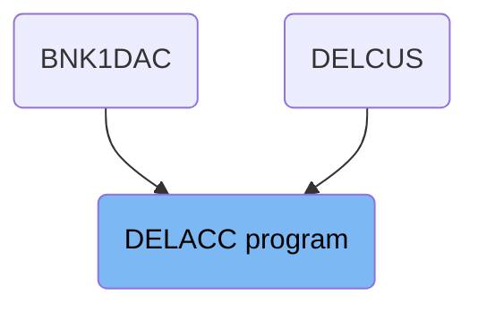
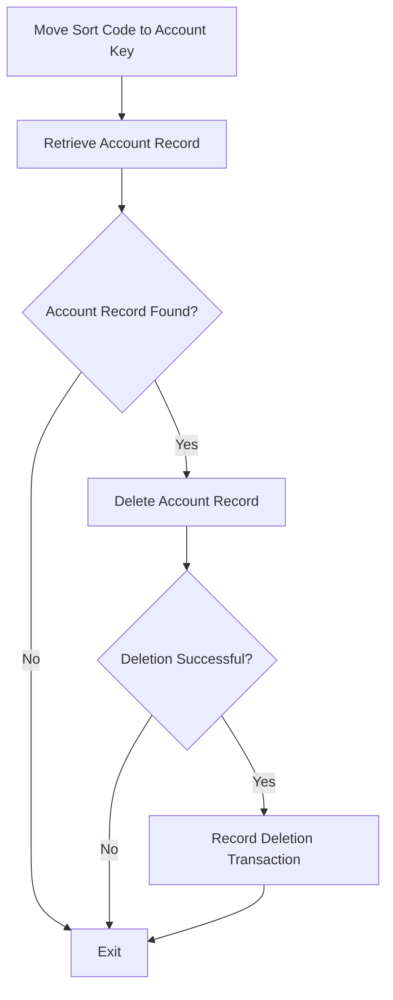
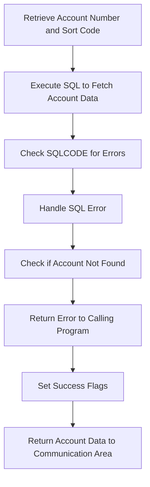
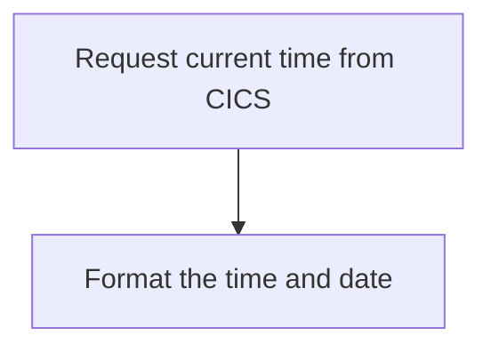
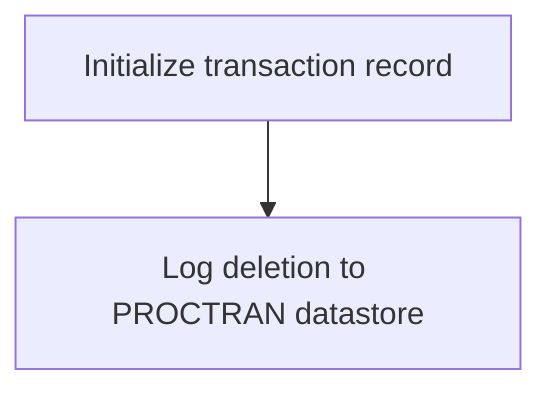
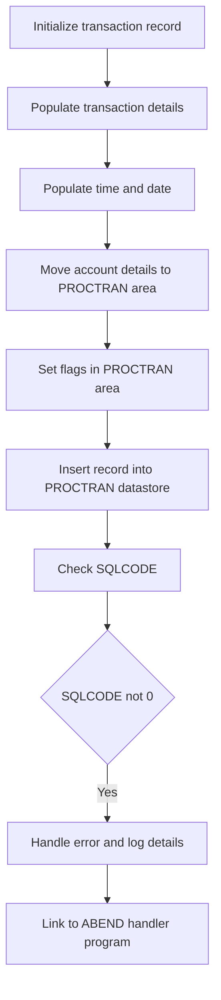
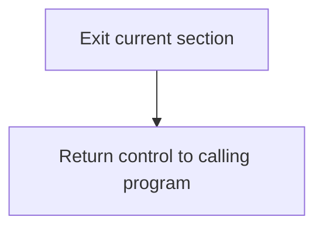

```mermaid
graph TD
  A[Delete account from ACCOUNT table] -->|If SQLCODE is not 0| B[Set DELACC-SUCCESS to blank]
  B --> C[Set DELACC-DEL-SUCCESS to 'N']
  C --> D[Set DELACC-DEL-FAIL-CD to '3']

%% Swimm:
%% graph TD
%%   A[Delete account from ACCOUNT table] -->|If SQLCODE is not 0| B[Set <SwmToken path="src/base/cobol_src/DELACC.cbl" pos="364:9:11" line-data="              MOVE &#39; &#39; TO DELACC-SUCCESS">`DELACC-SUCCESS`</SwmToken> to blank]
%%   B --> C[Set <SwmToken path="src/base/cobol_src/DELACC.cbl" pos="218:3:7" line-data="           IF DELACC-DEL-SUCCESS = &#39;Y&#39;">`DELACC-DEL-SUCCESS`</SwmToken> to 'N']
%%   C --> D[Set <SwmToken path="src/base/cobol_src/DELACC.cbl" pos="355:9:15" line-data="              MOVE &#39;1&#39; TO DELACC-DEL-FAIL-CD">`DELACC-DEL-FAIL-CD`</SwmToken> to '3']
```

The DELACC program is responsible for deleting an account from the bank's database. This process involves several steps, including moving the sort code to the account key, retrieving the account record, checking if the account exists, deleting the account, and recording the deletion transaction. The program ensures that the account is properly deleted and that all necessary records are updated accordingly.

The flow starts by moving the sort code to the account key to prepare for account retrieval. The account record is then retrieved from the database. If the account exists, it is deleted, and the deletion is recorded in the transaction log. If the account does not exist or the deletion fails, appropriate error handling is performed.

# Where is this program used?

This program is used multiple times in the codebase as represented in the following diagram:



## PREMIERE

Lets' zoom into this section of the flow:



<SwmSnippet path="/src/base/cobol_src/DELACC.cbl" line="207">

---

First, the sort code is moved to the required account key to prepare for the account retrieval process.

```cobol
           MOVE SORTCODE TO REQUIRED-SORT-CODE OF ACCOUNT-KEY-RID.
```

---

</SwmSnippet>

<SwmSnippet path="/src/base/cobol_src/DELACC.cbl" line="212">

---

Next, the account record is retrieved from the database using the provided sort code and account number.

```cobol
           PERFORM READ-ACCOUNT-DB2.
```

---

</SwmSnippet>

<SwmSnippet path="/src/base/cobol_src/DELACC.cbl" line="218">

---

Then, we check if a matching account record was successfully retrieved. If a match is found, the deletion process proceeds.

```cobol
           IF DELACC-DEL-SUCCESS = 'Y'
```

---

</SwmSnippet>

<SwmSnippet path="/src/base/cobol_src/DELACC.cbl" line="220">

---

If the account record is found, it is deleted from the database.

```cobol
             PERFORM DEL-ACCOUNT-DB2
```

---

</SwmSnippet>

<SwmSnippet path="/src/base/cobol_src/DELACC.cbl" line="221">

---

After the deletion, we check if the deletion was successful. If it was, the deletion transaction is recorded.

```cobol
             IF DELACC-DEL-SUCCESS = 'Y'
               PERFORM WRITE-PROCTRAN
             END-IF
```

---

</SwmSnippet>

<SwmSnippet path="/src/base/cobol_src/DELACC.cbl" line="227">

---

Finally, the program performs necessary cleanup operations and exits.

```cobol
           PERFORM GET-ME-OUT-OF-HERE.
```

---

</SwmSnippet>

## <SwmToken path="src/base/cobol_src/DELACC.cbl" pos="212:3:7" line-data="           PERFORM READ-ACCOUNT-DB2.">`READ-ACCOUNT-DB2`</SwmToken>

Lets' zoom into this section of the flow:



<SwmSnippet path="/src/base/cobol_src/DELACC.cbl" line="243">

---

First, the account number and sort code are retrieved from the communication area and moved to the host variables <SwmToken path="src/base/cobol_src/DELACC.cbl" pos="244:3:9" line-data="              TO HV-ACCOUNT-ACC-NO.">`HV-ACCOUNT-ACC-NO`</SwmToken> and <SwmToken path="src/base/cobol_src/DELACC.cbl" pos="246:7:11" line-data="           MOVE SORTCODE TO HV-ACCOUNT-SORTCODE.">`HV-ACCOUNT-SORTCODE`</SwmToken>.

```cobol
           MOVE DELACC-ACCNO
              TO HV-ACCOUNT-ACC-NO.

           MOVE SORTCODE TO HV-ACCOUNT-SORTCODE.
```

---

</SwmSnippet>

<SwmSnippet path="/src/base/cobol_src/DELACC.cbl" line="248">

---

Next, an SQL query is executed to fetch the account data from the database using the account number and sort code.

```cobol
           EXEC SQL
              SELECT ACCOUNT_EYECATCHER,
                     ACCOUNT_CUSTOMER_NUMBER,
                     ACCOUNT_SORTCODE,
                     ACCOUNT_NUMBER,
                     ACCOUNT_TYPE,
                     ACCOUNT_INTEREST_RATE,
                     ACCOUNT_OPENED,
                     ACCOUNT_OVERDRAFT_LIMIT,
                     ACCOUNT_LAST_STATEMENT,
                     ACCOUNT_NEXT_STATEMENT,
                     ACCOUNT_AVAILABLE_BALANCE,
                     ACCOUNT_ACTUAL_BALANCE
              INTO  :HV-ACCOUNT-EYECATCHER,
                    :HV-ACCOUNT-CUST-NO,
                    :HV-ACCOUNT-SORTCODE,
                    :HV-ACCOUNT-ACC-NO,
                    :HV-ACCOUNT-ACC-TYPE,
                    :HV-ACCOUNT-INT-RATE,
                    :HV-ACCOUNT-OPENED,
                    :HV-ACCOUNT-OVERDRAFT-LIM,
```

---

</SwmSnippet>

<SwmSnippet path="/src/base/cobol_src/DELACC.cbl" line="282">

---

Then, the SQL return code (<SwmToken path="src/base/cobol_src/DELACC.cbl" pos="282:3:3" line-data="           IF SQLCODE NOT = 0 AND SQLCODE NOT = +100">`SQLCODE`</SwmToken>) is checked to determine if there were any errors during the SQL execution.

```cobol
           IF SQLCODE NOT = 0 AND SQLCODE NOT = +100
```

---

</SwmSnippet>

<SwmSnippet path="/src/base/cobol_src/DELACC.cbl" line="283">

---

If an error occurred (i.e., <SwmToken path="src/base/cobol_src/DELACC.cbl" pos="283:3:3" line-data="              MOVE SQLCODE TO SQLCODE-DISPLAY">`SQLCODE`</SwmToken> is not 0 or +100), the error details are captured, and an abnormal end (abend) is triggered.

More about ABNDPROC: <SwmLink doc-title="Writing Abend Records (ABNDPROC)">[Writing Abend Records (ABNDPROC)](/.swm/writing-abend-records-abndproc.svfj4jn5.sw.md)</SwmLink>

```cobol
              MOVE SQLCODE TO SQLCODE-DISPLAY
      *
      *       Preserve the RESP and RESP2, then set up the
      *       standard ABEND info before getting the applid,
      *       date/time etc. and linking to the Abend Handler
      *       program.
      *
              INITIALIZE ABNDINFO-REC
              MOVE ZERO       TO ABND-RESPCODE
              MOVE ZERO       TO ABND-RESP2CODE
      *
      *       Get supplemental information
      *
              EXEC CICS ASSIGN APPLID(ABND-APPLID)
              END-EXEC

              MOVE EIBTASKN   TO ABND-TASKNO-KEY
              MOVE EIBTRNID   TO ABND-TRANID

              PERFORM POPULATE-TIME-DATE

```

---

</SwmSnippet>

<SwmSnippet path="/src/base/cobol_src/DELACC.cbl" line="350">

---

If the account is not found (<SwmToken path="src/base/cobol_src/DELACC.cbl" pos="350:3:3" line-data="           IF SQLCODE = +100">`SQLCODE`</SwmToken> is +100), the process finishes and returns an error to the calling program via the communication area.

```cobol
           IF SQLCODE = +100
              INITIALIZE OUTPUT-DATA
              MOVE SORTCODE TO ACCOUNT-SORT-CODE OF OUTPUT-DATA
              MOVE DELACC-ACCNO TO ACCOUNT-NUMBER OF OUTPUT-DATA
              MOVE 'N' TO DELACC-DEL-SUCCESS
              MOVE '1' TO DELACC-DEL-FAIL-CD
              GO TO RAD999
           END-IF.
```

---

</SwmSnippet>

<SwmSnippet path="/src/base/cobol_src/DELACC.cbl" line="363">

---

If the SQL return code is OK (<SwmToken path="src/base/cobol_src/DELACC.cbl" pos="363:3:3" line-data="           IF SQLCODE = 0">`SQLCODE`</SwmToken> is 0), the success flags are set accordingly.

```cobol
           IF SQLCODE = 0
              MOVE ' ' TO DELACC-SUCCESS
              MOVE 'Y' TO DELACC-DEL-SUCCESS
              MOVE ' ' TO DELACC-DEL-FAIL-CD
           END-IF.
```

---

</SwmSnippet>

<SwmSnippet path="/src/base/cobol_src/DELACC.cbl" line="372">

---

Finally, the retrieved account data is returned to the communication area, making it available for further processing by the calling program.

```cobol
           MOVE HV-ACCOUNT-EYECATCHER TO
              ACCOUNT-EYE-CATCHER OF OUTPUT-DATA.
           MOVE HV-ACCOUNT-CUST-NO TO
              ACCOUNT-CUST-NO OF OUTPUT-DATA.
           MOVE HV-ACCOUNT-SORTCODE TO
              ACCOUNT-SORT-CODE OF OUTPUT-DATA.
           MOVE HV-ACCOUNT-ACC-NO TO
              ACCOUNT-NUMBER OF OUTPUT-DATA.
           MOVE HV-ACCOUNT-ACC-TYPE TO
              ACCOUNT-TYPE OF OUTPUT-DATA.
           MOVE HV-ACCOUNT-INT-RATE TO
              ACCOUNT-INTEREST-RATE OF OUTPUT-DATA.
           MOVE HV-ACCOUNT-OPENED TO DB2-DATE-REFORMAT.
           MOVE DB2-DATE-REF-DAY TO
              ACCOUNT-OPENED-DAY OF OUTPUT-DATA.
           MOVE DB2-DATE-REF-MNTH TO
              ACCOUNT-OPENED-MONTH OF OUTPUT-DATA.
           MOVE DB2-DATE-REF-YR TO
              ACCOUNT-OPENED-YEAR OF OUTPUT-DATA.
           MOVE HV-ACCOUNT-OVERDRAFT-LIM TO
              ACCOUNT-OVERDRAFT-LIMIT OF OUTPUT-DATA.
```

---

</SwmSnippet>

## <SwmToken path="src/base/cobol_src/DELACC.cbl" pos="302:3:7" line-data="              PERFORM POPULATE-TIME-DATE">`POPULATE-TIME-DATE`</SwmToken>

Lets' zoom into this section of the flow:



<SwmSnippet path="/src/base/cobol_src/DELACC.cbl" line="637">

---

### Requesting current time

First, the function requests the current time from CICS and stores it in <SwmToken path="src/base/cobol_src/DELACC.cbl" pos="638:3:7" line-data="              ABSTIME(WS-U-TIME)">`WS-U-TIME`</SwmToken> (a variable to hold the current time).

```cobol
           EXEC CICS ASKTIME
              ABSTIME(WS-U-TIME)
           END-EXEC.
```

---

</SwmSnippet>

<SwmSnippet path="/src/base/cobol_src/DELACC.cbl" line="641">

---

### Formatting the time and date

Next, the function formats the retrieved time into a human-readable date and time. It converts <SwmToken path="src/base/cobol_src/DELACC.cbl" pos="642:3:7" line-data="                     ABSTIME(WS-U-TIME)">`WS-U-TIME`</SwmToken> into <SwmToken path="src/base/cobol_src/DELACC.cbl" pos="643:3:7" line-data="                     DDMMYYYY(WS-ORIG-DATE)">`WS-ORIG-DATE`</SwmToken> (the current date) and <SwmToken path="src/base/cobol_src/DELACC.cbl" pos="644:3:7" line-data="                     TIME(WS-TIME-NOW)">`WS-TIME-NOW`</SwmToken> (the current time).

```cobol
           EXEC CICS FORMATTIME
                     ABSTIME(WS-U-TIME)
                     DDMMYYYY(WS-ORIG-DATE)
                     TIME(WS-TIME-NOW)
                     DATESEP
           END-EXEC.
```

---

</SwmSnippet>

## <SwmToken path="src/base/cobol_src/DELACC.cbl" pos="220:3:7" line-data="             PERFORM DEL-ACCOUNT-DB2">`DEL-ACCOUNT-DB2`</SwmToken>

Lets' zoom into this section of the flow:



<SwmSnippet path="/src/base/cobol_src/DELACC.cbl" line="431">

---

First, the <SwmToken path="src/base/cobol_src/DELACC.cbl" pos="431:1:5" line-data="       DEL-ACCOUNT-DB2 SECTION.">`DEL-ACCOUNT-DB2`</SwmToken> section is responsible for deleting an account from the <SwmToken path="src/base/cobol_src/DELACC.cbl" pos="431:3:3" line-data="       DEL-ACCOUNT-DB2 SECTION.">`ACCOUNT`</SwmToken> table where the <SwmToken path="src/base/cobol_src/DELACC.cbl" pos="435:15:15" line-data="      *    Delete the ACCOUNT row where the SORTCODE and ACCOUNT">`SORTCODE`</SwmToken> and <SwmToken path="src/base/cobol_src/DELACC.cbl" pos="431:3:3" line-data="       DEL-ACCOUNT-DB2 SECTION.">`ACCOUNT`</SwmToken>` `<SwmToken path="src/base/cobol_src/DELACC.cbl" pos="436:3:3" line-data="      *    NUMBER match.">`NUMBER`</SwmToken> match the provided values.

```cobol
       DEL-ACCOUNT-DB2 SECTION.
       DADB010.

      *
      *    Delete the ACCOUNT row where the SORTCODE and ACCOUNT
      *    NUMBER match.
      *
           EXEC SQL
              DELETE FROM ACCOUNT
              WHERE ACCOUNT_SORTCODE = :HV-ACCOUNT-SORTCODE AND
                    ACCOUNT_NUMBER = :HV-ACCOUNT-ACC-NO
```

---

</SwmSnippet>

<SwmSnippet path="/src/base/cobol_src/DELACC.cbl" line="444">

---

Next, if the SQL operation does not succeed (i.e., <SwmToken path="src/base/cobol_src/DELACC.cbl" pos="444:3:3" line-data="           IF SQLCODE NOT = 0">`SQLCODE`</SwmToken> is not 0), the program sets <SwmToken path="src/base/cobol_src/DELACC.cbl" pos="445:9:11" line-data="              MOVE &#39; &#39; TO DELACC-SUCCESS">`DELACC-SUCCESS`</SwmToken> to a blank value, indicating that the deletion was not successful.

```cobol
           IF SQLCODE NOT = 0
              MOVE ' ' TO DELACC-SUCCESS
```

---

</SwmSnippet>

<SwmSnippet path="/src/base/cobol_src/DELACC.cbl" line="446">

---

Then, it sets <SwmToken path="src/base/cobol_src/DELACC.cbl" pos="446:9:13" line-data="              MOVE &#39;N&#39; TO DELACC-DEL-SUCCESS">`DELACC-DEL-SUCCESS`</SwmToken> to 'N', which signifies that the account deletion was not successful.

```cobol
              MOVE 'N' TO DELACC-DEL-SUCCESS
```

---

</SwmSnippet>

<SwmSnippet path="/src/base/cobol_src/DELACC.cbl" line="447">

---

Finally, the program sets <SwmToken path="src/base/cobol_src/DELACC.cbl" pos="447:9:15" line-data="              MOVE &#39;3&#39; TO DELACC-DEL-FAIL-CD">`DELACC-DEL-FAIL-CD`</SwmToken> to '3', which is a failure code indicating the reason for the unsuccessful deletion.

```cobol
              MOVE '3' TO DELACC-DEL-FAIL-CD
           END-IF.
```

---

</SwmSnippet>

## <SwmToken path="src/base/cobol_src/DELACC.cbl" pos="222:3:5" line-data="               PERFORM WRITE-PROCTRAN">`WRITE-PROCTRAN`</SwmToken>

Lets' zoom into this section of the flow:



<SwmSnippet path="/src/base/cobol_src/DELACC.cbl" line="454">

---

The <SwmToken path="src/base/cobol_src/DELACC.cbl" pos="454:1:3" line-data="       WRITE-PROCTRAN SECTION.">`WRITE-PROCTRAN`</SwmToken> section is responsible for logging the deletion of an account to the PROCTRAN datastore. It begins by performing the <SwmToken path="src/base/cobol_src/DELACC.cbl" pos="457:3:7" line-data="           PERFORM WRITE-PROCTRAN-DB2.">`WRITE-PROCTRAN-DB2`</SwmToken> section, which initializes the transaction record and logs the deletion details. This ensures that the deletion is properly recorded in the datastore, which is crucial for maintaining accurate transaction records and auditing purposes.

```cobol
       WRITE-PROCTRAN SECTION.
       WP010.

           PERFORM WRITE-PROCTRAN-DB2.
       WP999.
           EXIT.
```

---

</SwmSnippet>

## <SwmToken path="src/base/cobol_src/DELACC.cbl" pos="457:3:7" line-data="           PERFORM WRITE-PROCTRAN-DB2.">`WRITE-PROCTRAN-DB2`</SwmToken>

Lets' zoom into this section of the flow:



<SwmSnippet path="/src/base/cobol_src/DELACC.cbl" line="462">

---

First, the transaction record is initialized to prepare for logging the deletion of an account.

```cobol
       WRITE-PROCTRAN-DB2 SECTION.
       WPD010.

      *
      *    If the DELETE of the account row was successful then record
      *    this on the PROCTRAN datastore.
      *
           INITIALIZE HOST-PROCTRAN-ROW.
           INITIALIZE WS-EIBTASKN12.

```

---

</SwmSnippet>

<SwmSnippet path="/src/base/cobol_src/DELACC.cbl" line="472">

---

Next, the transaction details such as the eyecatcher, sort code, account number, and task number are populated.

```cobol
           MOVE 'PRTR' TO HV-PROCTRAN-EYECATCHER.
           MOVE ACCOUNT-SORT-CODE  TO HV-PROCTRAN-SORT-CODE.
           MOVE ACCOUNT-NUMBER     TO HV-PROCTRAN-ACC-NUMBER.
           MOVE EIBTASKN           TO WS-EIBTASKN12.
           MOVE WS-EIBTASKN12      TO HV-PROCTRAN-REF.
```

---

</SwmSnippet>

<SwmSnippet path="/src/base/cobol_src/DELACC.cbl" line="481">

---

Then, the current time and date are populated using CICS commands to ensure accurate logging.

```cobol
           EXEC CICS ASKTIME
              ABSTIME(WS-U-TIME)
           END-EXEC.

           EXEC CICS FORMATTIME
                     ABSTIME(WS-U-TIME)
                     DDMMYYYY(WS-ORIG-DATE)
                     TIME(HV-PROCTRAN-TIME)
                     DATESEP('.')
           END-EXEC.

           MOVE WS-ORIG-DATE TO WS-ORIG-DATE-GRP-X.
           MOVE WS-ORIG-DATE-GRP-X TO HV-PROCTRAN-DATE.

```

---

</SwmSnippet>

<SwmSnippet path="/src/base/cobol_src/DELACC.cbl" line="495">

---

Moving to the next step, the account details such as customer number, account type, and statement dates are moved to the PROCTRAN area.

```cobol
           MOVE ACCOUNT-CUST-NO    TO PROC-DESC-DELACC-CUSTOMER
            OF PROCTRAN-AREA
           MOVE ACCOUNT-TYPE       TO PROC-DESC-DELACC-ACCTYPE
            OF PROCTRAN-AREA
           MOVE ACCOUNT-LAST-STMT-DAY
             TO PROC-DESC-DELACC-LAST-DD  OF PROCTRAN-AREA
           MOVE ACCOUNT-LAST-STMT-MONTH
             TO PROC-DESC-DELACC-LAST-MM  OF PROCTRAN-AREA
           MOVE ACCOUNT-LAST-STMT-YEAR
             TO PROC-DESC-DELACC-LAST-YYYY  OF PROCTRAN-AREA
           MOVE ACCOUNT-NEXT-STMT-DAY
             TO PROC-DESC-DELACC-NEXT-DD  OF PROCTRAN-AREA
           MOVE ACCOUNT-NEXT-STMT-MONTH
             TO PROC-DESC-DELACC-NEXT-MM  OF PROCTRAN-AREA
           MOVE ACCOUNT-NEXT-STMT-YEAR
             TO PROC-DESC-DELACC-NEXT-YYYY  OF PROCTRAN-AREA
```

---

</SwmSnippet>

<SwmSnippet path="/src/base/cobol_src/DELACC.cbl" line="512">

---

The flags in the PROCTRAN area are set to indicate that the account has been deleted.

```cobol
           SET PROC-DESC-DELACC-FLAG  OF PROCTRAN-AREA TO TRUE.
           SET PROC-TY-BRANCH-DELETE-ACCOUNT  OF PROCTRAN-AREA TO TRUE.

```

---

</SwmSnippet>

<SwmSnippet path="/src/base/cobol_src/DELACC.cbl" line="515">

---

The transaction description and type are moved to the transaction record, and the account balance is also recorded.

```cobol
           MOVE PROC-TRAN-DESC  OF PROCTRAN-AREA TO HV-PROCTRAN-DESC


           MOVE PROC-TRAN-TYPE  OF PROCTRAN-AREA TO HV-PROCTRAN-TYPE.
           MOVE ACCOUNT-ACT-BAL-STORE    TO HV-PROCTRAN-AMOUNT.

```

---

</SwmSnippet>

<SwmSnippet path="/src/base/cobol_src/DELACC.cbl" line="521">

---

The transaction record is then inserted into the PROCTRAN datastore to log the deletion.

```cobol
           EXEC SQL
              INSERT INTO PROCTRAN
                     (
                      PROCTRAN_EYECATCHER,
                      PROCTRAN_SORTCODE,
                      PROCTRAN_NUMBER,
                      PROCTRAN_DATE,
                      PROCTRAN_TIME,
                      PROCTRAN_REF,
                      PROCTRAN_TYPE,
                      PROCTRAN_DESC,
                      PROCTRAN_AMOUNT
                     )
              VALUES
                     (
                      :HV-PROCTRAN-EYECATCHER,
                      :HV-PROCTRAN-SORT-CODE,
                      :HV-PROCTRAN-ACC-NUMBER,
                      :HV-PROCTRAN-DATE,
                      :HV-PROCTRAN-TIME,
                      :HV-PROCTRAN-REF,
```

---

</SwmSnippet>

<SwmSnippet path="/src/base/cobol_src/DELACC.cbl" line="552">

---

We check the SQLCODE to determine if the insertion was successful.

```cobol
           IF SQLCODE NOT = 0
              MOVE SQLCODE TO SQLCODE-DISPLAY

```

---

</SwmSnippet>

<SwmSnippet path="/src/base/cobol_src/DELACC.cbl" line="560">

---

If the SQLCODE is not zero, indicating an error, we initialize the ABEND information and gather supplemental details.

```cobol
              INITIALIZE ABNDINFO-REC
              MOVE EIBRESP    TO ABND-RESPCODE
              MOVE EIBRESP2   TO ABND-RESP2CODE
      *
      *       Get supplemental information
      *
              EXEC CICS ASSIGN APPLID(ABND-APPLID)
              END-EXEC
```

---

</SwmSnippet>

<SwmSnippet path="/src/base/cobol_src/DELACC.cbl" line="569">

---

The task number and transaction ID are moved to the ABEND record, and the current date and time are populated.

```cobol
              MOVE EIBTASKN   TO ABND-TASKNO-KEY
              MOVE EIBTRNID   TO ABND-TRANID

              PERFORM POPULATE-TIME-DATE

              MOVE WS-ORIG-DATE TO ABND-DATE
              STRING WS-TIME-NOW-GRP-HH DELIMITED BY SIZE,
                    ':' DELIMITED BY SIZE,
                     WS-TIME-NOW-GRP-MM DELIMITED BY SIZE,
                     ':' DELIMITED BY SIZE,
                     WS-TIME-NOW-GRP-MM DELIMITED BY SIZE
                     INTO ABND-TIME
```

---

</SwmSnippet>

<SwmSnippet path="/src/base/cobol_src/DELACC.cbl" line="583">

---

The SQLCODE and other relevant details are moved to the ABEND record, and a message is constructed to describe the error.

```cobol
              MOVE WS-U-TIME   TO ABND-UTIME-KEY
              MOVE 'HWPT'      TO ABND-CODE

              EXEC CICS ASSIGN PROGRAM(ABND-PROGRAM)
              END-EXEC

              MOVE SQLCODE-DISPLAY    TO ABND-SQLCODE

              STRING 'WPD010 - Unable to  WRITE to PROCTRAN row '
                    DELIMITED BY SIZE,
                    'datastore with the following data:'
                    DELIMITED BY SIZE,
                    HOST-PROCTRAN-ROW DELIMITED BY SIZE,
                    ' EIBRESP=' DELIMITED BY SIZE,
                    ABND-RESPCODE DELIMITED BY SIZE,
                    ' RESP2=' DELIMITED BY SIZE,
                    ABND-RESP2CODE DELIMITED BY SIZE
                    INTO ABND-FREEFORM
```

---

</SwmSnippet>

<SwmSnippet path="/src/base/cobol_src/DELACC.cbl" line="603">

---

Finally, the ABEND handler program is linked to handle the error, and a message is displayed to indicate the failure to write to the PROCTRAN datastore.

```cobol
              EXEC CICS LINK PROGRAM(WS-ABEND-PGM)
                        COMMAREA(ABNDINFO-REC)
              END-EXEC

              DISPLAY 'In DELACC (WPD010) '
              'UNABLE TO WRITE TO PROCTRAN ROW DATASTORE'
              ' SQLCODE=' SQLCODE-DISPLAY
              'WITH THE FOLLOWING DATA:' HOST-PROCTRAN-ROW

              EXEC CICS ABEND
                 ABCODE ('HWPT')
              END-EXEC
```

---

</SwmSnippet>

## <SwmToken path="src/base/cobol_src/DELACC.cbl" pos="227:3:11" line-data="           PERFORM GET-ME-OUT-OF-HERE.">`GET-ME-OUT-OF-HERE`</SwmToken>

Lets' zoom into this section of the flow:



<SwmSnippet path="/src/base/cobol_src/DELACC.cbl" line="625">

---

First, the <SwmToken path="src/base/cobol_src/DELACC.cbl" pos="625:1:9" line-data="       GET-ME-OUT-OF-HERE SECTION.">`GET-ME-OUT-OF-HERE`</SwmToken> section is defined to handle the exit process for the current section.

```cobol
       GET-ME-OUT-OF-HERE SECTION.
       GMOFH010.
```

---

</SwmSnippet>

<SwmSnippet path="/src/base/cobol_src/DELACC.cbl" line="628">

---

Then, the <SwmToken path="src/base/cobol_src/DELACC.cbl" pos="628:1:1" line-data="           GOBACK.">`GOBACK`</SwmToken> statement is executed, which returns control to the calling program, effectively ending the current section's execution.

```cobol
           GOBACK.
```

---

</SwmSnippet>

&nbsp;

*This is an auto-generated document by Swimm 🌊 and has not yet been verified by a human*

<SwmMeta version="3.0.0" repo-id="Z2l0aHViJTNBJTNBY2ljcy1iYW5raW5nLXNhbXBsZS1hcHBsaWNhdGlvbi1jYnNhLUlCTS1EZW1vJTNBJTNBU3dpbW0tRGVtbw==" repo-name="cics-banking-sample-application-cbsa-IBM-Demo"><sup>Powered by [Swimm](/)</sup></SwmMeta>
