In this document, we will explain the process of deleting an account. The process involves initializing the transaction, calling the deletion method with account details, and handling the response based on the success or failure of the deletion.

The flow starts with initializing the transaction and then calling the deletion method with the necessary account details. If the deletion is successful, an OK response is returned; otherwise, a server error response is returned. The deletion method sets the account details, prepares an SQL statement to delete the record from the database, and executes the SQL command to ensure the account is properly removed from the system.

# Where is this flow used?

This flow is used multiple times in the codebase as represented in the following diagram:

```mermaid
graph TD;
      subgraph srcwebuisrcmainjavacomibmcicscipbanklibertyapijson[src/…/api/json]
59f68282fac8b210b13db613d26c370f42607dd4e5ae1aea57c0abc2e165bb7c(writeDeleteAccountExternal) --> 0df2045cc807bbce7985486c830347a3ec5b867a7fb1919e30cad7dc6d46c996(ProcessedTransactionResource.writeDeleteAccountInternal)
end

subgraph srcwebuisrcmainjavacomibmcicscipbanklibertyapijson[src/…/api/json]
83e1bf56d5fbbe3e16704cc68daa27c0f7bf77669f2eab58dfc442e2448d60e5(deleteAccountInternal) --> 0df2045cc807bbce7985486c830347a3ec5b867a7fb1919e30cad7dc6d46c996(ProcessedTransactionResource.writeDeleteAccountInternal)
end

subgraph srcwebuisrcmainjavacomibmcicscipbanklibertyapijson[src/…/api/json]
e7542c730e9415d44d77757d00807d6d92c7a315ed8943458008f4aa99d4c133(deleteFromDB) --> 83e1bf56d5fbbe3e16704cc68daa27c0f7bf77669f2eab58dfc442e2448d60e5(deleteAccountInternal)
end

subgraph srcwebuisrcmainjavacomibmcicscipbanklibertyapijson[src/…/api/json]
d49ebb1b315a9b620fa465764b00f97cdd9c107764a7b83ec90c6ed9d0cd2920(deleteCustomerInternal) --> 83e1bf56d5fbbe3e16704cc68daa27c0f7bf77669f2eab58dfc442e2448d60e5(deleteAccountInternal)
end

subgraph srcwebuisrcmainjavacomibmcicscipbanklibertyapijson[src/…/api/json]
c2d23d7e56810a46c767a5003f3368a0a6d0001b55376d5a3caaa02b285256d1(deleteCustomerExternal) --> d49ebb1b315a9b620fa465764b00f97cdd9c107764a7b83ec90c6ed9d0cd2920(deleteCustomerInternal)
end

subgraph srcwebuisrcmainjavacomibmcicscipbanklibertyapijson[src/…/api/json]
bbfb78b67e00621dae0654ad63f9ed1f51677a5602135e9fe3059639514361f6(deleteFromDB) --> c2d23d7e56810a46c767a5003f3368a0a6d0001b55376d5a3caaa02b285256d1(deleteCustomerExternal)
end

subgraph srcwebuisrcmainjavacomibmcicscipbanklibertyapijson[src/…/api/json]
825cad3d815663dfff91fa36189c449f5a5e7f16c9ace3f2d89d8252c27d449f(deleteAccountExternal) --> 83e1bf56d5fbbe3e16704cc68daa27c0f7bf77669f2eab58dfc442e2448d60e5(deleteAccountInternal)
end


      classDef mainFlowStyle color:#000000,fill:#7CB9F4
classDef rootsStyle color:#000000,fill:#00FFF4
classDef Style1 color:#000000,fill:#00FFAA
classDef Style2 color:#000000,fill:#FFFF00
classDef Style3 color:#000000,fill:#AA7CB9

%% Swimm:
%% graph TD;
%%       subgraph srcwebuisrcmainjavacomibmcicscipbanklibertyapijson[<SwmPath>[src/…/api/json/](src/webui/src/main/java/com/ibm/cics/cip/bankliberty/api/json/)</SwmPath>]
%% 59f68282fac8b210b13db613d26c370f42607dd4e5ae1aea57c0abc2e165bb7c(<SwmToken path="src/webui/src/main/java/com/ibm/cics/cip/bankliberty/api/json/ProcessedTransactionResource.java" pos="416:5:5" line-data="	public Response writeDeleteAccountExternal(">`writeDeleteAccountExternal`</SwmToken>) --> 0df2045cc807bbce7985486c830347a3ec5b867a7fb1919e30cad7dc6d46c996(ProcessedTransactionResource.writeDeleteAccountInternal)
%% end
%% 
%% subgraph srcwebuisrcmainjavacomibmcicscipbanklibertyapijson[<SwmPath>[src/…/api/json/](src/webui/src/main/java/com/ibm/cics/cip/bankliberty/api/json/)</SwmPath>]
%% 83e1bf56d5fbbe3e16704cc68daa27c0f7bf77669f2eab58dfc442e2448d60e5(deleteAccountInternal) --> 0df2045cc807bbce7985486c830347a3ec5b867a7fb1919e30cad7dc6d46c996(ProcessedTransactionResource.writeDeleteAccountInternal)
%% end
%% 
%% subgraph srcwebuisrcmainjavacomibmcicscipbanklibertyapijson[<SwmPath>[src/…/api/json/](src/webui/src/main/java/com/ibm/cics/cip/bankliberty/api/json/)</SwmPath>]
%% e7542c730e9415d44d77757d00807d6d92c7a315ed8943458008f4aa99d4c133(deleteFromDB) --> 83e1bf56d5fbbe3e16704cc68daa27c0f7bf77669f2eab58dfc442e2448d60e5(deleteAccountInternal)
%% end
%% 
%% subgraph srcwebuisrcmainjavacomibmcicscipbanklibertyapijson[<SwmPath>[src/…/api/json/](src/webui/src/main/java/com/ibm/cics/cip/bankliberty/api/json/)</SwmPath>]
%% d49ebb1b315a9b620fa465764b00f97cdd9c107764a7b83ec90c6ed9d0cd2920(deleteCustomerInternal) --> 83e1bf56d5fbbe3e16704cc68daa27c0f7bf77669f2eab58dfc442e2448d60e5(deleteAccountInternal)
%% end
%% 
%% subgraph srcwebuisrcmainjavacomibmcicscipbanklibertyapijson[<SwmPath>[src/…/api/json/](src/webui/src/main/java/com/ibm/cics/cip/bankliberty/api/json/)</SwmPath>]
%% c2d23d7e56810a46c767a5003f3368a0a6d0001b55376d5a3caaa02b285256d1(deleteCustomerExternal) --> d49ebb1b315a9b620fa465764b00f97cdd9c107764a7b83ec90c6ed9d0cd2920(deleteCustomerInternal)
%% end
%% 
%% subgraph srcwebuisrcmainjavacomibmcicscipbanklibertyapijson[<SwmPath>[src/…/api/json/](src/webui/src/main/java/com/ibm/cics/cip/bankliberty/api/json/)</SwmPath>]
%% bbfb78b67e00621dae0654ad63f9ed1f51677a5602135e9fe3059639514361f6(deleteFromDB) --> c2d23d7e56810a46c767a5003f3368a0a6d0001b55376d5a3caaa02b285256d1(deleteCustomerExternal)
%% end
%% 
%% subgraph srcwebuisrcmainjavacomibmcicscipbanklibertyapijson[<SwmPath>[src/…/api/json/](src/webui/src/main/java/com/ibm/cics/cip/bankliberty/api/json/)</SwmPath>]
%% 825cad3d815663dfff91fa36189c449f5a5e7f16c9ace3f2d89d8252c27d449f(deleteAccountExternal) --> 83e1bf56d5fbbe3e16704cc68daa27c0f7bf77669f2eab58dfc442e2448d60e5(deleteAccountInternal)
%% end
%% 
%% 
%%       classDef mainFlowStyle color:#000000,fill:#7CB9F4
%% classDef rootsStyle color:#000000,fill:#00FFF4
%% classDef Style1 color:#000000,fill:#00FFAA
%% classDef Style2 color:#000000,fill:#FFFF00
%% classDef Style3 color:#000000,fill:#AA7CB9
```



# Flow drill down

```mermaid
graph TD
  subgraph writeDeleteAccountInternal
    writeDeleteAccountInternal:A["Initialize ProcessedTransaction DB2"] --> writeDeleteAccountInternal:B["Call writeDeleteAccount with account details"]
    writeDeleteAccountInternal:B --> writeDeleteAccountInternal:C["Check if account deletion was successful"]
    writeDeleteAccountInternal:C -->|Successful| writeDeleteAccountInternal:D["Return OK response"]
    writeDeleteAccountInternal:C -->|Failed| writeDeleteAccountInternal:E["Return server error response"]
  end
  subgraph writeDeleteAccount
    writeDeleteAccount:A["Initialize PROCTRAN"] --> writeDeleteAccount:B["Set last statement date"]
    writeDeleteAccount:B --> writeDeleteAccount:C["Set next statement date"]
    writeDeleteAccount:C --> writeDeleteAccount:D["Set account type, customer number, and footer"]
    writeDeleteAccount:D --> writeDeleteAccount:E["Generate description for deleted account"]
    writeDeleteAccount:E --> writeDeleteAccount:F["Sort out date-time task"]
    writeDeleteAccount:F --> writeDeleteAccount:G["Open connection"]
    writeDeleteAccount:G --> writeDeleteAccount:H["Prepare and execute SQL statement"]
    writeDeleteAccount:H --> writeDeleteAccount:I["Check for SQL exception"]
    writeDeleteAccount:I -->|No Exception| writeDeleteAccount:J["Return true"]
    writeDeleteAccount:I -->|SQL Exception| writeDeleteAccount:K["Log error and return false"]
  end
  writeDeleteAccountInternal:B --> writeDeleteAccount

%% Swimm:
%% graph TD
%%   subgraph <SwmToken path="src/webui/src/main/java/com/ibm/cics/cip/bankliberty/api/json/ProcessedTransactionResource.java" pos="426:5:5" line-data="	public Response writeDeleteAccountInternal(">`writeDeleteAccountInternal`</SwmToken>
%%     <SwmToken path="src/webui/src/main/java/com/ibm/cics/cip/bankliberty/api/json/ProcessedTransactionResource.java" pos="426:5:5" line-data="	public Response writeDeleteAccountInternal(">`writeDeleteAccountInternal`</SwmToken>:A["Initialize <SwmToken path="src/webui/src/main/java/com/ibm/cics/cip/bankliberty/api/json/ProcessedTransactionResource.java" pos="429:15:15" line-data="		com.ibm.cics.cip.bankliberty.web.db2.ProcessedTransaction myProcessedTransactionDB2 = new com.ibm.cics.cip.bankliberty.web.db2.ProcessedTransaction();">`ProcessedTransaction`</SwmToken> <SwmToken path="src/webui/src/main/java/com/ibm/cics/cip/bankliberty/api/json/ProcessedTransactionResource.java" pos="134:4:4" line-data="					&quot;Proctran DB2 table not accessible. Please contact your system administrator.&quot;);">`DB2`</SwmToken>"] --> <SwmToken path="src/webui/src/main/java/com/ibm/cics/cip/bankliberty/api/json/ProcessedTransactionResource.java" pos="426:5:5" line-data="	public Response writeDeleteAccountInternal(">`writeDeleteAccountInternal`</SwmToken>:B["Call <SwmToken path="src/webui/src/main/java/com/ibm/cics/cip/bankliberty/api/json/ProcessedTransactionResource.java" pos="430:6:6" line-data="		if (myProcessedTransactionDB2.writeDeleteAccount(">`writeDeleteAccount`</SwmToken> with account details"]
%%     <SwmToken path="src/webui/src/main/java/com/ibm/cics/cip/bankliberty/api/json/ProcessedTransactionResource.java" pos="426:5:5" line-data="	public Response writeDeleteAccountInternal(">`writeDeleteAccountInternal`</SwmToken>:B --> <SwmToken path="src/webui/src/main/java/com/ibm/cics/cip/bankliberty/api/json/ProcessedTransactionResource.java" pos="426:5:5" line-data="	public Response writeDeleteAccountInternal(">`writeDeleteAccountInternal`</SwmToken>:C["Check if account deletion was successful"]
%%     <SwmToken path="src/webui/src/main/java/com/ibm/cics/cip/bankliberty/api/json/ProcessedTransactionResource.java" pos="426:5:5" line-data="	public Response writeDeleteAccountInternal(">`writeDeleteAccountInternal`</SwmToken>:C -->|Successful| <SwmToken path="src/webui/src/main/java/com/ibm/cics/cip/bankliberty/api/json/ProcessedTransactionResource.java" pos="426:5:5" line-data="	public Response writeDeleteAccountInternal(">`writeDeleteAccountInternal`</SwmToken>:D["Return OK response"]
%%     <SwmToken path="src/webui/src/main/java/com/ibm/cics/cip/bankliberty/api/json/ProcessedTransactionResource.java" pos="426:5:5" line-data="	public Response writeDeleteAccountInternal(">`writeDeleteAccountInternal`</SwmToken>:C -->|Failed| <SwmToken path="src/webui/src/main/java/com/ibm/cics/cip/bankliberty/api/json/ProcessedTransactionResource.java" pos="426:5:5" line-data="	public Response writeDeleteAccountInternal(">`writeDeleteAccountInternal`</SwmToken>:E["Return server error response"]
%%   end
%%   subgraph <SwmToken path="src/webui/src/main/java/com/ibm/cics/cip/bankliberty/api/json/ProcessedTransactionResource.java" pos="430:6:6" line-data="		if (myProcessedTransactionDB2.writeDeleteAccount(">`writeDeleteAccount`</SwmToken>
%%     <SwmToken path="src/webui/src/main/java/com/ibm/cics/cip/bankliberty/api/json/ProcessedTransactionResource.java" pos="430:6:6" line-data="		if (myProcessedTransactionDB2.writeDeleteAccount(">`writeDeleteAccount`</SwmToken>:A["Initialize PROCTRAN"] --> <SwmToken path="src/webui/src/main/java/com/ibm/cics/cip/bankliberty/api/json/ProcessedTransactionResource.java" pos="430:6:6" line-data="		if (myProcessedTransactionDB2.writeDeleteAccount(">`writeDeleteAccount`</SwmToken>:B["Set last statement date"]
%%     <SwmToken path="src/webui/src/main/java/com/ibm/cics/cip/bankliberty/api/json/ProcessedTransactionResource.java" pos="430:6:6" line-data="		if (myProcessedTransactionDB2.writeDeleteAccount(">`writeDeleteAccount`</SwmToken>:B --> <SwmToken path="src/webui/src/main/java/com/ibm/cics/cip/bankliberty/api/json/ProcessedTransactionResource.java" pos="430:6:6" line-data="		if (myProcessedTransactionDB2.writeDeleteAccount(">`writeDeleteAccount`</SwmToken>:C["Set next statement date"]
%%     <SwmToken path="src/webui/src/main/java/com/ibm/cics/cip/bankliberty/api/json/ProcessedTransactionResource.java" pos="430:6:6" line-data="		if (myProcessedTransactionDB2.writeDeleteAccount(">`writeDeleteAccount`</SwmToken>:C --> <SwmToken path="src/webui/src/main/java/com/ibm/cics/cip/bankliberty/api/json/ProcessedTransactionResource.java" pos="430:6:6" line-data="		if (myProcessedTransactionDB2.writeDeleteAccount(">`writeDeleteAccount`</SwmToken>:D["Set account type, customer number, and footer"]
%%     <SwmToken path="src/webui/src/main/java/com/ibm/cics/cip/bankliberty/api/json/ProcessedTransactionResource.java" pos="430:6:6" line-data="		if (myProcessedTransactionDB2.writeDeleteAccount(">`writeDeleteAccount`</SwmToken>:D --> <SwmToken path="src/webui/src/main/java/com/ibm/cics/cip/bankliberty/api/json/ProcessedTransactionResource.java" pos="430:6:6" line-data="		if (myProcessedTransactionDB2.writeDeleteAccount(">`writeDeleteAccount`</SwmToken>:E["Generate description for deleted account"]
%%     <SwmToken path="src/webui/src/main/java/com/ibm/cics/cip/bankliberty/api/json/ProcessedTransactionResource.java" pos="430:6:6" line-data="		if (myProcessedTransactionDB2.writeDeleteAccount(">`writeDeleteAccount`</SwmToken>:E --> <SwmToken path="src/webui/src/main/java/com/ibm/cics/cip/bankliberty/api/json/ProcessedTransactionResource.java" pos="430:6:6" line-data="		if (myProcessedTransactionDB2.writeDeleteAccount(">`writeDeleteAccount`</SwmToken>:F["Sort out date-time task"]
%%     <SwmToken path="src/webui/src/main/java/com/ibm/cics/cip/bankliberty/api/json/ProcessedTransactionResource.java" pos="430:6:6" line-data="		if (myProcessedTransactionDB2.writeDeleteAccount(">`writeDeleteAccount`</SwmToken>:F --> <SwmToken path="src/webui/src/main/java/com/ibm/cics/cip/bankliberty/api/json/ProcessedTransactionResource.java" pos="430:6:6" line-data="		if (myProcessedTransactionDB2.writeDeleteAccount(">`writeDeleteAccount`</SwmToken>:G["Open connection"]
%%     <SwmToken path="src/webui/src/main/java/com/ibm/cics/cip/bankliberty/api/json/ProcessedTransactionResource.java" pos="430:6:6" line-data="		if (myProcessedTransactionDB2.writeDeleteAccount(">`writeDeleteAccount`</SwmToken>:G --> <SwmToken path="src/webui/src/main/java/com/ibm/cics/cip/bankliberty/api/json/ProcessedTransactionResource.java" pos="430:6:6" line-data="		if (myProcessedTransactionDB2.writeDeleteAccount(">`writeDeleteAccount`</SwmToken>:H["Prepare and execute SQL statement"]
%%     <SwmToken path="src/webui/src/main/java/com/ibm/cics/cip/bankliberty/api/json/ProcessedTransactionResource.java" pos="430:6:6" line-data="		if (myProcessedTransactionDB2.writeDeleteAccount(">`writeDeleteAccount`</SwmToken>:H --> <SwmToken path="src/webui/src/main/java/com/ibm/cics/cip/bankliberty/api/json/ProcessedTransactionResource.java" pos="430:6:6" line-data="		if (myProcessedTransactionDB2.writeDeleteAccount(">`writeDeleteAccount`</SwmToken>:I["Check for SQL exception"]
%%     <SwmToken path="src/webui/src/main/java/com/ibm/cics/cip/bankliberty/api/json/ProcessedTransactionResource.java" pos="430:6:6" line-data="		if (myProcessedTransactionDB2.writeDeleteAccount(">`writeDeleteAccount`</SwmToken>:I -->|No Exception| <SwmToken path="src/webui/src/main/java/com/ibm/cics/cip/bankliberty/api/json/ProcessedTransactionResource.java" pos="430:6:6" line-data="		if (myProcessedTransactionDB2.writeDeleteAccount(">`writeDeleteAccount`</SwmToken>:J["Return true"]
%%     <SwmToken path="src/webui/src/main/java/com/ibm/cics/cip/bankliberty/api/json/ProcessedTransactionResource.java" pos="430:6:6" line-data="		if (myProcessedTransactionDB2.writeDeleteAccount(">`writeDeleteAccount`</SwmToken>:I -->|SQL Exception| <SwmToken path="src/webui/src/main/java/com/ibm/cics/cip/bankliberty/api/json/ProcessedTransactionResource.java" pos="430:6:6" line-data="		if (myProcessedTransactionDB2.writeDeleteAccount(">`writeDeleteAccount`</SwmToken>:K["Log error and return false"]
%%   end
%%   <SwmToken path="src/webui/src/main/java/com/ibm/cics/cip/bankliberty/api/json/ProcessedTransactionResource.java" pos="426:5:5" line-data="	public Response writeDeleteAccountInternal(">`writeDeleteAccountInternal`</SwmToken>:B --> <SwmToken path="src/webui/src/main/java/com/ibm/cics/cip/bankliberty/api/json/ProcessedTransactionResource.java" pos="430:6:6" line-data="		if (myProcessedTransactionDB2.writeDeleteAccount(">`writeDeleteAccount`</SwmToken>
```



<SwmSnippet path="/src/webui/src/main/java/com/ibm/cics/cip/bankliberty/api/json/ProcessedTransactionResource.java" line="426">

---

## Handling the deletion transaction

First, the <SwmToken path="src/webui/src/main/java/com/ibm/cics/cip/bankliberty/api/json/ProcessedTransactionResource.java" pos="426:5:5" line-data="	public Response writeDeleteAccountInternal(">`writeDeleteAccountInternal`</SwmToken> method in <SwmToken path="src/webui/src/main/java/com/ibm/cics/cip/bankliberty/api/json/ProcessedTransactionResource.java" pos="39:4:4" line-data="public class ProcessedTransactionResource">`ProcessedTransactionResource`</SwmToken> initiates the deletion process by creating an instance of <SwmToken path="src/webui/src/main/java/com/ibm/cics/cip/bankliberty/api/json/ProcessedTransactionResource.java" pos="429:15:15" line-data="		com.ibm.cics.cip.bankliberty.web.db2.ProcessedTransaction myProcessedTransactionDB2 = new com.ibm.cics.cip.bankliberty.web.db2.ProcessedTransaction();">`ProcessedTransaction`</SwmToken> and calling its <SwmToken path="src/webui/src/main/java/com/ibm/cics/cip/bankliberty/api/json/ProcessedTransactionResource.java" pos="430:6:6" line-data="		if (myProcessedTransactionDB2.writeDeleteAccount(">`writeDeleteAccount`</SwmToken> method with the necessary account details.

```java
	public Response writeDeleteAccountInternal(
			ProcessedTransactionAccountJSON myDeletedAccount)
	{
		com.ibm.cics.cip.bankliberty.web.db2.ProcessedTransaction myProcessedTransactionDB2 = new com.ibm.cics.cip.bankliberty.web.db2.ProcessedTransaction();
		if (myProcessedTransactionDB2.writeDeleteAccount(
				myDeletedAccount.getSortCode(),
				myDeletedAccount.getAccountNumber(),
				myDeletedAccount.getActualBalance(),
				myDeletedAccount.getLastStatement(),
				myDeletedAccount.getNextStatement(),
				myDeletedAccount.getCustomerNumber(),
				myDeletedAccount.getType()))
		{
			return Response.ok().build();
		}
		else
		{
			return Response.serverError().build();
		}

	}
```

---

</SwmSnippet>

<SwmSnippet path="/src/webui/src/main/java/com/ibm/cics/cip/bankliberty/web/db2/ProcessedTransaction.java" line="752">

---

## Preparing the SQL statement

Next, the <SwmToken path="src/webui/src/main/java/com/ibm/cics/cip/bankliberty/web/db2/ProcessedTransaction.java" pos="752:5:5" line-data="	public boolean writeDeleteAccount(String sortCode2, String accountNumber,">`writeDeleteAccount`</SwmToken> method in <SwmToken path="src/webui/src/main/java/com/ibm/cics/cip/bankliberty/api/json/ProcessedTransactionResource.java" pos="429:15:15" line-data="		com.ibm.cics.cip.bankliberty.web.db2.ProcessedTransaction myProcessedTransactionDB2 = new com.ibm.cics.cip.bankliberty.web.db2.ProcessedTransaction();">`ProcessedTransaction`</SwmToken> processes the deletion transaction by setting the necessary account details and timestamps. It prepares a SQL statement to delete the record from the database and executes the SQL command. This ensures that the account is properly removed from the system.

```java
	public boolean writeDeleteAccount(String sortCode2, String accountNumber,
			BigDecimal actualBalance, Date lastStatement, Date nextStatement,
			String customerNumber, String accountType)
	{
		logger.entering(this.getClass().getName(), WRITE_DELETE_ACCOUNT);

		PROCTRAN myPROCTRAN = new PROCTRAN();

		Calendar myCalendar = Calendar.getInstance();
		myCalendar.setTime(lastStatement);

		myPROCTRAN.setProcDescDelaccLastDd(myCalendar.get(Calendar.DATE));
		myPROCTRAN.setProcDescDelaccLastMm(myCalendar.get(Calendar.MONTH) + 1);
		myPROCTRAN.setProcDescDelaccLastYyyy(myCalendar.get(Calendar.YEAR));

		myCalendar.setTime(nextStatement);
		myPROCTRAN.setProcDescDelaccNextDd(myCalendar.get(Calendar.DATE));
		myPROCTRAN.setProcDescDelaccNextMm(myCalendar.get(Calendar.MONTH) + 1);
		myPROCTRAN.setProcDescDelaccNextYyyy(myCalendar.get(Calendar.YEAR));
		myPROCTRAN.setProcDescDelaccAcctype(accountType);
		myPROCTRAN.setProcDescDelaccCustomer(Integer.parseInt(customerNumber));
```

---

</SwmSnippet>

&nbsp;

*This is an auto-generated document by Swimm 🌊 and has not yet been verified by a human*

<SwmMeta version="3.0.0" repo-id="Z2l0aHViJTNBJTNBY2ljcy1iYW5raW5nLXNhbXBsZS1hcHBsaWNhdGlvbi1jYnNhLUlCTS1EZW1vJTNBJTNBU3dpbW0tRGVtbw==" repo-name="cics-banking-sample-application-cbsa-IBM-Demo"><sup>Powered by [Swimm](/)</sup></SwmMeta>
