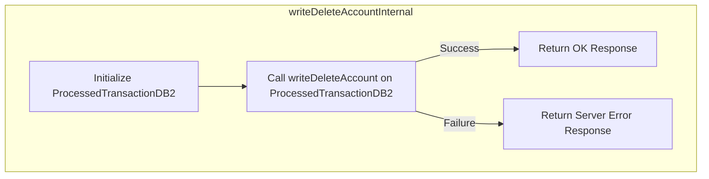

```mermaid
graph TD
  subgraph deleteAccount
    deleteAccount:A["Retrieve account details"] --> deleteAccount:B["Check if account exists"]
    deleteAccount:B -->|No| deleteAccount:C["Return null"]
    deleteAccount:B -->|Yes| deleteAccount:D["Pad account number and sort code"]
    deleteAccount:D --> deleteAccount:E["Execute SQL select statement"]
    deleteAccount:E --> deleteAccount:F["Create Account object from result"]
    deleteAccount:F --> deleteAccount:G["Execute SQL delete statement"]
    deleteAccount:G --> deleteAccount:H["Return deleted Account object"]
  end
  subgraph getAccount
    getAccount:A["Open SQL connection"] --> getAccount:B["Pad sort code"]
    getAccount:B --> getAccount:C["Execute SQL select statement based on account number"]
    getAccount:C --> getAccount:D{Check if account number is 99999999}
    getAccount:D -->|Yes| getAccount:E["Execute select statement for sort code"]
    getAccount:E --> getAccount:F["Check if results found"]
    getAccount:F -->|No| getAccount:G["Return null"]
    getAccount:F -->|Yes| getAccount:H["Create Account object from result"]
    getAccount:H --> getAccount:I["Return Account object"]
    getAccount:D -->|No| getAccount:J["Pad account number"]
    getAccount:J --> getAccount:K["Execute select statement"]
    getAccount:K --> getAccount:L["Check if result set is closed"]
    getAccount:L -->|Yes| getAccount:G
    getAccount:L -->|No| getAccount:H
  end
deleteAccount:A --> getAccount

%% Swimm:
%% graph TD
%%   subgraph <SwmToken path="src/webui/src/main/java/com/ibm/cics/cip/bankliberty/api/json/AccountsResource.java" pos="1252:7:7" line-data="		db2Account = db2Account.deleteAccount(accountNumber.intValue(),">`deleteAccount`</SwmToken>
%%     <SwmToken path="src/webui/src/main/java/com/ibm/cics/cip/bankliberty/api/json/AccountsResource.java" pos="1252:7:7" line-data="		db2Account = db2Account.deleteAccount(accountNumber.intValue(),">`deleteAccount`</SwmToken>:A["Retrieve account details"] --> <SwmToken path="src/webui/src/main/java/com/ibm/cics/cip/bankliberty/api/json/AccountsResource.java" pos="1252:7:7" line-data="		db2Account = db2Account.deleteAccount(accountNumber.intValue(),">`deleteAccount`</SwmToken>:B["Check if account exists"]
%%     <SwmToken path="src/webui/src/main/java/com/ibm/cics/cip/bankliberty/api/json/AccountsResource.java" pos="1252:7:7" line-data="		db2Account = db2Account.deleteAccount(accountNumber.intValue(),">`deleteAccount`</SwmToken>:B -->|No| <SwmToken path="src/webui/src/main/java/com/ibm/cics/cip/bankliberty/api/json/AccountsResource.java" pos="1252:7:7" line-data="		db2Account = db2Account.deleteAccount(accountNumber.intValue(),">`deleteAccount`</SwmToken>:C["Return null"]
%%     <SwmToken path="src/webui/src/main/java/com/ibm/cics/cip/bankliberty/api/json/AccountsResource.java" pos="1252:7:7" line-data="		db2Account = db2Account.deleteAccount(accountNumber.intValue(),">`deleteAccount`</SwmToken>:B -->|Yes| <SwmToken path="src/webui/src/main/java/com/ibm/cics/cip/bankliberty/api/json/AccountsResource.java" pos="1252:7:7" line-data="		db2Account = db2Account.deleteAccount(accountNumber.intValue(),">`deleteAccount`</SwmToken>:D["Pad account number and sort code"]
%%     <SwmToken path="src/webui/src/main/java/com/ibm/cics/cip/bankliberty/api/json/AccountsResource.java" pos="1252:7:7" line-data="		db2Account = db2Account.deleteAccount(accountNumber.intValue(),">`deleteAccount`</SwmToken>:D --> <SwmToken path="src/webui/src/main/java/com/ibm/cics/cip/bankliberty/api/json/AccountsResource.java" pos="1252:7:7" line-data="		db2Account = db2Account.deleteAccount(accountNumber.intValue(),">`deleteAccount`</SwmToken>:E["Execute SQL select statement"]
%%     <SwmToken path="src/webui/src/main/java/com/ibm/cics/cip/bankliberty/api/json/AccountsResource.java" pos="1252:7:7" line-data="		db2Account = db2Account.deleteAccount(accountNumber.intValue(),">`deleteAccount`</SwmToken>:E --> <SwmToken path="src/webui/src/main/java/com/ibm/cics/cip/bankliberty/api/json/AccountsResource.java" pos="1252:7:7" line-data="		db2Account = db2Account.deleteAccount(accountNumber.intValue(),">`deleteAccount`</SwmToken>:F["Create Account object from result"]
%%     <SwmToken path="src/webui/src/main/java/com/ibm/cics/cip/bankliberty/api/json/AccountsResource.java" pos="1252:7:7" line-data="		db2Account = db2Account.deleteAccount(accountNumber.intValue(),">`deleteAccount`</SwmToken>:F --> <SwmToken path="src/webui/src/main/java/com/ibm/cics/cip/bankliberty/api/json/AccountsResource.java" pos="1252:7:7" line-data="		db2Account = db2Account.deleteAccount(accountNumber.intValue(),">`deleteAccount`</SwmToken>:G["Execute SQL delete statement"]
%%     <SwmToken path="src/webui/src/main/java/com/ibm/cics/cip/bankliberty/api/json/AccountsResource.java" pos="1252:7:7" line-data="		db2Account = db2Account.deleteAccount(accountNumber.intValue(),">`deleteAccount`</SwmToken>:G --> <SwmToken path="src/webui/src/main/java/com/ibm/cics/cip/bankliberty/api/json/AccountsResource.java" pos="1252:7:7" line-data="		db2Account = db2Account.deleteAccount(accountNumber.intValue(),">`deleteAccount`</SwmToken>:H["Return deleted Account object"]
%%   end
%%   subgraph <SwmToken path="src/webui/src/main/java/com/ibm/cics/cip/bankliberty/web/db2/Account.java" pos="650:9:9" line-data="		Account db2Account = this.getAccount(account, sortcode);">`getAccount`</SwmToken>
%%     <SwmToken path="src/webui/src/main/java/com/ibm/cics/cip/bankliberty/web/db2/Account.java" pos="650:9:9" line-data="		Account db2Account = this.getAccount(account, sortcode);">`getAccount`</SwmToken>:A["Open SQL connection"] --> <SwmToken path="src/webui/src/main/java/com/ibm/cics/cip/bankliberty/web/db2/Account.java" pos="650:9:9" line-data="		Account db2Account = this.getAccount(account, sortcode);">`getAccount`</SwmToken>:B["Pad sort code"]
%%     <SwmToken path="src/webui/src/main/java/com/ibm/cics/cip/bankliberty/web/db2/Account.java" pos="650:9:9" line-data="		Account db2Account = this.getAccount(account, sortcode);">`getAccount`</SwmToken>:B --> <SwmToken path="src/webui/src/main/java/com/ibm/cics/cip/bankliberty/web/db2/Account.java" pos="650:9:9" line-data="		Account db2Account = this.getAccount(account, sortcode);">`getAccount`</SwmToken>:C["Execute SQL select statement based on account number"]
%%     <SwmToken path="src/webui/src/main/java/com/ibm/cics/cip/bankliberty/web/db2/Account.java" pos="650:9:9" line-data="		Account db2Account = this.getAccount(account, sortcode);">`getAccount`</SwmToken>:C --> <SwmToken path="src/webui/src/main/java/com/ibm/cics/cip/bankliberty/web/db2/Account.java" pos="650:9:9" line-data="		Account db2Account = this.getAccount(account, sortcode);">`getAccount`</SwmToken>:D{Check if account number is 99999999}
%%     <SwmToken path="src/webui/src/main/java/com/ibm/cics/cip/bankliberty/web/db2/Account.java" pos="650:9:9" line-data="		Account db2Account = this.getAccount(account, sortcode);">`getAccount`</SwmToken>:D -->|Yes| <SwmToken path="src/webui/src/main/java/com/ibm/cics/cip/bankliberty/web/db2/Account.java" pos="650:9:9" line-data="		Account db2Account = this.getAccount(account, sortcode);">`getAccount`</SwmToken>:E["Execute select statement for sort code"]
%%     <SwmToken path="src/webui/src/main/java/com/ibm/cics/cip/bankliberty/web/db2/Account.java" pos="650:9:9" line-data="		Account db2Account = this.getAccount(account, sortcode);">`getAccount`</SwmToken>:E --> <SwmToken path="src/webui/src/main/java/com/ibm/cics/cip/bankliberty/web/db2/Account.java" pos="650:9:9" line-data="		Account db2Account = this.getAccount(account, sortcode);">`getAccount`</SwmToken>:F["Check if results found"]
%%     <SwmToken path="src/webui/src/main/java/com/ibm/cics/cip/bankliberty/web/db2/Account.java" pos="650:9:9" line-data="		Account db2Account = this.getAccount(account, sortcode);">`getAccount`</SwmToken>:F -->|No| <SwmToken path="src/webui/src/main/java/com/ibm/cics/cip/bankliberty/web/db2/Account.java" pos="650:9:9" line-data="		Account db2Account = this.getAccount(account, sortcode);">`getAccount`</SwmToken>:G["Return null"]
%%     <SwmToken path="src/webui/src/main/java/com/ibm/cics/cip/bankliberty/web/db2/Account.java" pos="650:9:9" line-data="		Account db2Account = this.getAccount(account, sortcode);">`getAccount`</SwmToken>:F -->|Yes| <SwmToken path="src/webui/src/main/java/com/ibm/cics/cip/bankliberty/web/db2/Account.java" pos="650:9:9" line-data="		Account db2Account = this.getAccount(account, sortcode);">`getAccount`</SwmToken>:H["Create Account object from result"]
%%     <SwmToken path="src/webui/src/main/java/com/ibm/cics/cip/bankliberty/web/db2/Account.java" pos="650:9:9" line-data="		Account db2Account = this.getAccount(account, sortcode);">`getAccount`</SwmToken>:H --> <SwmToken path="src/webui/src/main/java/com/ibm/cics/cip/bankliberty/web/db2/Account.java" pos="650:9:9" line-data="		Account db2Account = this.getAccount(account, sortcode);">`getAccount`</SwmToken>:I["Return Account object"]
%%     <SwmToken path="src/webui/src/main/java/com/ibm/cics/cip/bankliberty/web/db2/Account.java" pos="650:9:9" line-data="		Account db2Account = this.getAccount(account, sortcode);">`getAccount`</SwmToken>:D -->|No| <SwmToken path="src/webui/src/main/java/com/ibm/cics/cip/bankliberty/web/db2/Account.java" pos="650:9:9" line-data="		Account db2Account = this.getAccount(account, sortcode);">`getAccount`</SwmToken>:J["Pad account number"]
%%     <SwmToken path="src/webui/src/main/java/com/ibm/cics/cip/bankliberty/web/db2/Account.java" pos="650:9:9" line-data="		Account db2Account = this.getAccount(account, sortcode);">`getAccount`</SwmToken>:J --> <SwmToken path="src/webui/src/main/java/com/ibm/cics/cip/bankliberty/web/db2/Account.java" pos="650:9:9" line-data="		Account db2Account = this.getAccount(account, sortcode);">`getAccount`</SwmToken>:K["Execute select statement"]
%%     <SwmToken path="src/webui/src/main/java/com/ibm/cics/cip/bankliberty/web/db2/Account.java" pos="650:9:9" line-data="		Account db2Account = this.getAccount(account, sortcode);">`getAccount`</SwmToken>:K --> <SwmToken path="src/webui/src/main/java/com/ibm/cics/cip/bankliberty/web/db2/Account.java" pos="650:9:9" line-data="		Account db2Account = this.getAccount(account, sortcode);">`getAccount`</SwmToken>:L["Check if result set is closed"]
%%     <SwmToken path="src/webui/src/main/java/com/ibm/cics/cip/bankliberty/web/db2/Account.java" pos="650:9:9" line-data="		Account db2Account = this.getAccount(account, sortcode);">`getAccount`</SwmToken>:L -->|Yes| <SwmToken path="src/webui/src/main/java/com/ibm/cics/cip/bankliberty/web/db2/Account.java" pos="650:9:9" line-data="		Account db2Account = this.getAccount(account, sortcode);">`getAccount`</SwmToken>:G
%%     <SwmToken path="src/webui/src/main/java/com/ibm/cics/cip/bankliberty/web/db2/Account.java" pos="650:9:9" line-data="		Account db2Account = this.getAccount(account, sortcode);">`getAccount`</SwmToken>:L -->|No| <SwmToken path="src/webui/src/main/java/com/ibm/cics/cip/bankliberty/web/db2/Account.java" pos="650:9:9" line-data="		Account db2Account = this.getAccount(account, sortcode);">`getAccount`</SwmToken>:H
%%   end
%% <SwmToken path="src/webui/src/main/java/com/ibm/cics/cip/bankliberty/api/json/AccountsResource.java" pos="1252:7:7" line-data="		db2Account = db2Account.deleteAccount(accountNumber.intValue(),">`deleteAccount`</SwmToken>:A --> <SwmToken path="src/webui/src/main/java/com/ibm/cics/cip/bankliberty/web/db2/Account.java" pos="650:9:9" line-data="		Account db2Account = this.getAccount(account, sortcode);">`getAccount`</SwmToken>
```

In this document, we will explain the process of deleting an account. The process involves several steps, including retrieving the account details, deleting the account from the database, preparing a response, and handling any errors that may occur.

The flow starts with retrieving the account details to ensure the account exists. If the account is found, it is deleted from the database. A response is then prepared with the details of the deleted account. The deletion transaction is logged to ensure it is recorded in the system. Finally, any errors that occur during the process are handled, and an appropriate response is returned.

# Where is this flow used?

This flow is used multiple times in the codebase as represented in the following diagram:

```mermaid
graph TD;
      subgraph srcwebuisrcmainjavacomibmcicscipbanklibertyapijson[src/…/api/json]
e7542c730e9415d44d77757d00807d6d92c7a315ed8943458008f4aa99d4c133(deleteFromDB) --> fe110b5e292e50b577c45cceb2bbc05bc00eb890b3c62f1aad2f5adb48782877(AccountsResource.deleteAccountInternal)
end

subgraph srcwebuisrcmainjavacomibmcicscipbanklibertyapijson[src/…/api/json]
d49ebb1b315a9b620fa465764b00f97cdd9c107764a7b83ec90c6ed9d0cd2920(deleteCustomerInternal) --> fe110b5e292e50b577c45cceb2bbc05bc00eb890b3c62f1aad2f5adb48782877(AccountsResource.deleteAccountInternal)
end

subgraph srcwebuisrcmainjavacomibmcicscipbanklibertyapijson[src/…/api/json]
c2d23d7e56810a46c767a5003f3368a0a6d0001b55376d5a3caaa02b285256d1(deleteCustomerExternal) --> d49ebb1b315a9b620fa465764b00f97cdd9c107764a7b83ec90c6ed9d0cd2920(deleteCustomerInternal)
end

subgraph srcwebuisrcmainjavacomibmcicscipbanklibertyapijson[src/…/api/json]
bbfb78b67e00621dae0654ad63f9ed1f51677a5602135e9fe3059639514361f6(deleteFromDB) --> c2d23d7e56810a46c767a5003f3368a0a6d0001b55376d5a3caaa02b285256d1(deleteCustomerExternal)
end

subgraph srcwebuisrcmainjavacomibmcicscipbanklibertyapijson[src/…/api/json]
825cad3d815663dfff91fa36189c449f5a5e7f16c9ace3f2d89d8252c27d449f(deleteAccountExternal) --> fe110b5e292e50b577c45cceb2bbc05bc00eb890b3c62f1aad2f5adb48782877(AccountsResource.deleteAccountInternal)
end


      classDef mainFlowStyle color:#000000,fill:#7CB9F4
classDef rootsStyle color:#000000,fill:#00FFF4
classDef Style1 color:#000000,fill:#00FFAA
classDef Style2 color:#000000,fill:#FFFF00
classDef Style3 color:#000000,fill:#AA7CB9

%% Swimm:
%% graph TD;
%%       subgraph srcwebuisrcmainjavacomibmcicscipbanklibertyapijson[<SwmPath>[src/…/api/json/](src/webui/src/main/java/com/ibm/cics/cip/bankliberty/api/json/)</SwmPath>]
%% e7542c730e9415d44d77757d00807d6d92c7a315ed8943458008f4aa99d4c133(deleteFromDB) --> fe110b5e292e50b577c45cceb2bbc05bc00eb890b3c62f1aad2f5adb48782877(AccountsResource.deleteAccountInternal)
%% end
%% 
%% subgraph srcwebuisrcmainjavacomibmcicscipbanklibertyapijson[<SwmPath>[src/…/api/json/](src/webui/src/main/java/com/ibm/cics/cip/bankliberty/api/json/)</SwmPath>]
%% d49ebb1b315a9b620fa465764b00f97cdd9c107764a7b83ec90c6ed9d0cd2920(deleteCustomerInternal) --> fe110b5e292e50b577c45cceb2bbc05bc00eb890b3c62f1aad2f5adb48782877(AccountsResource.deleteAccountInternal)
%% end
%% 
%% subgraph srcwebuisrcmainjavacomibmcicscipbanklibertyapijson[<SwmPath>[src/…/api/json/](src/webui/src/main/java/com/ibm/cics/cip/bankliberty/api/json/)</SwmPath>]
%% c2d23d7e56810a46c767a5003f3368a0a6d0001b55376d5a3caaa02b285256d1(deleteCustomerExternal) --> d49ebb1b315a9b620fa465764b00f97cdd9c107764a7b83ec90c6ed9d0cd2920(deleteCustomerInternal)
%% end
%% 
%% subgraph srcwebuisrcmainjavacomibmcicscipbanklibertyapijson[<SwmPath>[src/…/api/json/](src/webui/src/main/java/com/ibm/cics/cip/bankliberty/api/json/)</SwmPath>]
%% bbfb78b67e00621dae0654ad63f9ed1f51677a5602135e9fe3059639514361f6(deleteFromDB) --> c2d23d7e56810a46c767a5003f3368a0a6d0001b55376d5a3caaa02b285256d1(deleteCustomerExternal)
%% end
%% 
%% subgraph srcwebuisrcmainjavacomibmcicscipbanklibertyapijson[<SwmPath>[src/…/api/json/](src/webui/src/main/java/com/ibm/cics/cip/bankliberty/api/json/)</SwmPath>]
%% 825cad3d815663dfff91fa36189c449f5a5e7f16c9ace3f2d89d8252c27d449f(<SwmToken path="src/webui/src/main/java/com/ibm/cics/cip/bankliberty/api/json/AccountsResource.java" pos="1227:5:5" line-data="	public Response deleteAccountExternal(">`deleteAccountExternal`</SwmToken>) --> fe110b5e292e50b577c45cceb2bbc05bc00eb890b3c62f1aad2f5adb48782877(AccountsResource.deleteAccountInternal)
%% end
%% 
%% 
%%       classDef mainFlowStyle color:#000000,fill:#7CB9F4
%% classDef rootsStyle color:#000000,fill:#00FFF4
%% classDef Style1 color:#000000,fill:#00FFAA
%% classDef Style2 color:#000000,fill:#FFFF00
%% classDef Style3 color:#000000,fill:#AA7CB9
```



Here is a high level diagram of the flow, showing only the most important functions:

```mermaid
graph TD;
      subgraph srcwebuisrcmainjavacomibmcicscipbanklibertywebdb2[src/…/web/db2]
fe110b5e292e50b577c45cceb2bbc05bc00eb890b3c62f1aad2f5adb48782877(AccountsResource.deleteAccountInternal) --> 551bc939bf153d021e4b889b6fe3fac03beb53ed54151b123e4ac583fd6cba7e(Account.deleteAccount)
end

subgraph srcwebuisrcmainjavacomibmcicscipbanklibertyapijson[src/…/api/json]
fe110b5e292e50b577c45cceb2bbc05bc00eb890b3c62f1aad2f5adb48782877(AccountsResource.deleteAccountInternal) --> 0df2045cc807bbce7985486c830347a3ec5b867a7fb1919e30cad7dc6d46c996(ProcessedTransactionResource.writeDeleteAccountInternal)
end

subgraph srcwebuisrcmainjavacomibmcicscipbanklibertywebdb2[src/…/web/db2]
551bc939bf153d021e4b889b6fe3fac03beb53ed54151b123e4ac583fd6cba7e(Account.deleteAccount) --> 1eab8b7c3852bcbc5a3632cd4490f056cd96c1dbf48f74d39c5e626e18f47fcc(Account.getAccount)
end

subgraph srcwebuisrcmainjavacomibmcicscipbanklibertywebdb2[src/…/web/db2]
0df2045cc807bbce7985486c830347a3ec5b867a7fb1919e30cad7dc6d46c996(ProcessedTransactionResource.writeDeleteAccountInternal) --> e4839591940764c1b91ca6b007e665b5e602baa2e1f63b03f41ec29ba5d5eb87(ProcessedTransaction.writeDeleteAccount)
end


      classDef mainFlowStyle color:#000000,fill:#7CB9F4
classDef rootsStyle color:#000000,fill:#00FFF4
classDef Style1 color:#000000,fill:#00FFAA
classDef Style2 color:#000000,fill:#FFFF00
classDef Style3 color:#000000,fill:#AA7CB9

%% Swimm:
%% graph TD;
%%       subgraph srcwebuisrcmainjavacomibmcicscipbanklibertywebdb2[<SwmPath>[src/…/web/db2/](src/webui/src/main/java/com/ibm/cics/cip/bankliberty/web/db2/)</SwmPath>]
%% fe110b5e292e50b577c45cceb2bbc05bc00eb890b3c62f1aad2f5adb48782877(AccountsResource.deleteAccountInternal) --> 551bc939bf153d021e4b889b6fe3fac03beb53ed54151b123e4ac583fd6cba7e(Account.deleteAccount)
%% end
%% 
%% subgraph srcwebuisrcmainjavacomibmcicscipbanklibertyapijson[<SwmPath>[src/…/api/json/](src/webui/src/main/java/com/ibm/cics/cip/bankliberty/api/json/)</SwmPath>]
%% fe110b5e292e50b577c45cceb2bbc05bc00eb890b3c62f1aad2f5adb48782877(AccountsResource.deleteAccountInternal) --> 0df2045cc807bbce7985486c830347a3ec5b867a7fb1919e30cad7dc6d46c996(ProcessedTransactionResource.writeDeleteAccountInternal)
%% end
%% 
%% subgraph srcwebuisrcmainjavacomibmcicscipbanklibertywebdb2[<SwmPath>[src/…/web/db2/](src/webui/src/main/java/com/ibm/cics/cip/bankliberty/web/db2/)</SwmPath>]
%% 551bc939bf153d021e4b889b6fe3fac03beb53ed54151b123e4ac583fd6cba7e(Account.deleteAccount) --> 1eab8b7c3852bcbc5a3632cd4490f056cd96c1dbf48f74d39c5e626e18f47fcc(Account.getAccount)
%% end
%% 
%% subgraph srcwebuisrcmainjavacomibmcicscipbanklibertywebdb2[<SwmPath>[src/…/web/db2/](src/webui/src/main/java/com/ibm/cics/cip/bankliberty/web/db2/)</SwmPath>]
%% 0df2045cc807bbce7985486c830347a3ec5b867a7fb1919e30cad7dc6d46c996(ProcessedTransactionResource.writeDeleteAccountInternal) --> e4839591940764c1b91ca6b007e665b5e602baa2e1f63b03f41ec29ba5d5eb87(ProcessedTransaction.writeDeleteAccount)
%% end
%% 
%% 
%%       classDef mainFlowStyle color:#000000,fill:#7CB9F4
%% classDef rootsStyle color:#000000,fill:#00FFF4
%% classDef Style1 color:#000000,fill:#00FFAA
%% classDef Style2 color:#000000,fill:#FFFF00
%% classDef Style3 color:#000000,fill:#AA7CB9
```



# Flow drill down

```mermaid
graph TD
  subgraph deleteAccountInternal
    deleteAccountInternal:A["Get sort code"] --> deleteAccountInternal:B["Call deleteAccount with account number and sort code"]
    deleteAccountInternal:B --> deleteAccountInternal:C{"db2Account is null?"}
    deleteAccountInternal:C -->|No| deleteAccountInternal:D["Prepare response JSON with account details"]
    deleteAccountInternal:D --> deleteAccountInternal:E["Call writeDeleteAccountInternal"]
    deleteAccountInternal:E --> deleteAccountInternal:F{"deletedAccountResponse is null or status not 200?"}
    deleteAccountInternal:F -->|No| deleteAccountInternal:G["Prepare successful response"]
    deleteAccountInternal:F -->|Yes| deleteAccountInternal:H["Rollback transaction"]
    deleteAccountInternal:H --> deleteAccountInternal:G
    deleteAccountInternal:C -->|Yes| deleteAccountInternal:I["Log failure and rollback transaction"]
    deleteAccountInternal:I --> deleteAccountInternal:J["Prepare error response"]
  end

%% Swimm:
%% graph TD
%%   subgraph <SwmToken path="src/webui/src/main/java/com/ibm/cics/cip/bankliberty/api/json/AccountsResource.java" pos="75:14:14" line-data="	private static final String DELETE_ACCOUNT = &quot;deleteAccountInternal(Long accountNumber)&quot;;">`deleteAccountInternal`</SwmToken>
%%     <SwmToken path="src/webui/src/main/java/com/ibm/cics/cip/bankliberty/api/json/AccountsResource.java" pos="75:14:14" line-data="	private static final String DELETE_ACCOUNT = &quot;deleteAccountInternal(Long accountNumber)&quot;;">`deleteAccountInternal`</SwmToken>:A["Get sort code"] --> <SwmToken path="src/webui/src/main/java/com/ibm/cics/cip/bankliberty/api/json/AccountsResource.java" pos="75:14:14" line-data="	private static final String DELETE_ACCOUNT = &quot;deleteAccountInternal(Long accountNumber)&quot;;">`deleteAccountInternal`</SwmToken>:B["Call <SwmToken path="src/webui/src/main/java/com/ibm/cics/cip/bankliberty/api/json/AccountsResource.java" pos="1252:7:7" line-data="		db2Account = db2Account.deleteAccount(accountNumber.intValue(),">`deleteAccount`</SwmToken> with account number and sort code"]
%%     <SwmToken path="src/webui/src/main/java/com/ibm/cics/cip/bankliberty/api/json/AccountsResource.java" pos="75:14:14" line-data="	private static final String DELETE_ACCOUNT = &quot;deleteAccountInternal(Long accountNumber)&quot;;">`deleteAccountInternal`</SwmToken>:B --> <SwmToken path="src/webui/src/main/java/com/ibm/cics/cip/bankliberty/api/json/AccountsResource.java" pos="75:14:14" line-data="	private static final String DELETE_ACCOUNT = &quot;deleteAccountInternal(Long accountNumber)&quot;;">`deleteAccountInternal`</SwmToken>:C{"<SwmToken path="src/webui/src/main/java/com/ibm/cics/cip/bankliberty/api/json/AccountsResource.java" pos="1250:17:17" line-data="		com.ibm.cics.cip.bankliberty.web.db2.Account db2Account = new Account();">`db2Account`</SwmToken> is null?"}
%%     <SwmToken path="src/webui/src/main/java/com/ibm/cics/cip/bankliberty/api/json/AccountsResource.java" pos="75:14:14" line-data="	private static final String DELETE_ACCOUNT = &quot;deleteAccountInternal(Long accountNumber)&quot;;">`deleteAccountInternal`</SwmToken>:C -->|No| <SwmToken path="src/webui/src/main/java/com/ibm/cics/cip/bankliberty/api/json/AccountsResource.java" pos="75:14:14" line-data="	private static final String DELETE_ACCOUNT = &quot;deleteAccountInternal(Long accountNumber)&quot;;">`deleteAccountInternal`</SwmToken>:D["Prepare response JSON with account details"]
%%     <SwmToken path="src/webui/src/main/java/com/ibm/cics/cip/bankliberty/api/json/AccountsResource.java" pos="75:14:14" line-data="	private static final String DELETE_ACCOUNT = &quot;deleteAccountInternal(Long accountNumber)&quot;;">`deleteAccountInternal`</SwmToken>:D --> <SwmToken path="src/webui/src/main/java/com/ibm/cics/cip/bankliberty/api/json/AccountsResource.java" pos="75:14:14" line-data="	private static final String DELETE_ACCOUNT = &quot;deleteAccountInternal(Long accountNumber)&quot;;">`deleteAccountInternal`</SwmToken>:E["Call <SwmToken path="src/webui/src/main/java/com/ibm/cics/cip/bankliberty/api/json/AccountsResource.java" pos="1288:2:2" line-data="					.writeDeleteAccountInternal(myDeletedAccount);">`writeDeleteAccountInternal`</SwmToken>"]
%%     <SwmToken path="src/webui/src/main/java/com/ibm/cics/cip/bankliberty/api/json/AccountsResource.java" pos="75:14:14" line-data="	private static final String DELETE_ACCOUNT = &quot;deleteAccountInternal(Long accountNumber)&quot;;">`deleteAccountInternal`</SwmToken>:E --> <SwmToken path="src/webui/src/main/java/com/ibm/cics/cip/bankliberty/api/json/AccountsResource.java" pos="75:14:14" line-data="	private static final String DELETE_ACCOUNT = &quot;deleteAccountInternal(Long accountNumber)&quot;;">`deleteAccountInternal`</SwmToken>:F{"<SwmToken path="src/webui/src/main/java/com/ibm/cics/cip/bankliberty/api/json/AccountsResource.java" pos="1287:3:3" line-data="			Response deletedAccountResponse = myProcessedTransactionResource">`deletedAccountResponse`</SwmToken> is null or status not 200?"}
%%     <SwmToken path="src/webui/src/main/java/com/ibm/cics/cip/bankliberty/api/json/AccountsResource.java" pos="75:14:14" line-data="	private static final String DELETE_ACCOUNT = &quot;deleteAccountInternal(Long accountNumber)&quot;;">`deleteAccountInternal`</SwmToken>:F -->|No| <SwmToken path="src/webui/src/main/java/com/ibm/cics/cip/bankliberty/api/json/AccountsResource.java" pos="75:14:14" line-data="	private static final String DELETE_ACCOUNT = &quot;deleteAccountInternal(Long accountNumber)&quot;;">`deleteAccountInternal`</SwmToken>:G["Prepare successful response"]
%%     <SwmToken path="src/webui/src/main/java/com/ibm/cics/cip/bankliberty/api/json/AccountsResource.java" pos="75:14:14" line-data="	private static final String DELETE_ACCOUNT = &quot;deleteAccountInternal(Long accountNumber)&quot;;">`deleteAccountInternal`</SwmToken>:F -->|Yes| <SwmToken path="src/webui/src/main/java/com/ibm/cics/cip/bankliberty/api/json/AccountsResource.java" pos="75:14:14" line-data="	private static final String DELETE_ACCOUNT = &quot;deleteAccountInternal(Long accountNumber)&quot;;">`deleteAccountInternal`</SwmToken>:H["Rollback transaction"]
%%     <SwmToken path="src/webui/src/main/java/com/ibm/cics/cip/bankliberty/api/json/AccountsResource.java" pos="75:14:14" line-data="	private static final String DELETE_ACCOUNT = &quot;deleteAccountInternal(Long accountNumber)&quot;;">`deleteAccountInternal`</SwmToken>:H --> <SwmToken path="src/webui/src/main/java/com/ibm/cics/cip/bankliberty/api/json/AccountsResource.java" pos="75:14:14" line-data="	private static final String DELETE_ACCOUNT = &quot;deleteAccountInternal(Long accountNumber)&quot;;">`deleteAccountInternal`</SwmToken>:G
%%     <SwmToken path="src/webui/src/main/java/com/ibm/cics/cip/bankliberty/api/json/AccountsResource.java" pos="75:14:14" line-data="	private static final String DELETE_ACCOUNT = &quot;deleteAccountInternal(Long accountNumber)&quot;;">`deleteAccountInternal`</SwmToken>:C -->|Yes| <SwmToken path="src/webui/src/main/java/com/ibm/cics/cip/bankliberty/api/json/AccountsResource.java" pos="75:14:14" line-data="	private static final String DELETE_ACCOUNT = &quot;deleteAccountInternal(Long accountNumber)&quot;;">`deleteAccountInternal`</SwmToken>:I["Log failure and rollback transaction"]
%%     <SwmToken path="src/webui/src/main/java/com/ibm/cics/cip/bankliberty/api/json/AccountsResource.java" pos="75:14:14" line-data="	private static final String DELETE_ACCOUNT = &quot;deleteAccountInternal(Long accountNumber)&quot;;">`deleteAccountInternal`</SwmToken>:I --> <SwmToken path="src/webui/src/main/java/com/ibm/cics/cip/bankliberty/api/json/AccountsResource.java" pos="75:14:14" line-data="	private static final String DELETE_ACCOUNT = &quot;deleteAccountInternal(Long accountNumber)&quot;;">`deleteAccountInternal`</SwmToken>:J["Prepare error response"]
%%   end
```

## Exploring <SwmToken path="src/webui/src/main/java/com/ibm/cics/cip/bankliberty/api/json/AccountsResource.java" pos="75:14:14" line-data="	private static final String DELETE_ACCOUNT = &quot;deleteAccountInternal(Long accountNumber)&quot;;">`deleteAccountInternal`</SwmToken>



<SwmSnippet path="/src/webui/src/main/java/com/ibm/cics/cip/bankliberty/api/json/AccountsResource.java" line="1248">

---

## Deleting the Account

First, the <SwmToken path="src/webui/src/main/java/com/ibm/cics/cip/bankliberty/api/json/AccountsResource.java" pos="75:14:14" line-data="	private static final String DELETE_ACCOUNT = &quot;deleteAccountInternal(Long accountNumber)&quot;;">`deleteAccountInternal`</SwmToken> method is called to initiate the deletion process. It retrieves the sort code and account number to identify the account to be deleted.

```java
		Integer sortCode = this.getSortCode();

		com.ibm.cics.cip.bankliberty.web.db2.Account db2Account = new Account();

		db2Account = db2Account.deleteAccount(accountNumber.intValue(),
```

---

</SwmSnippet>

<SwmSnippet path="/src/webui/src/main/java/com/ibm/cics/cip/bankliberty/api/json/AccountsResource.java" line="1252">

---

## Handling Account Deletion

Next, the <SwmToken path="src/webui/src/main/java/com/ibm/cics/cip/bankliberty/api/json/AccountsResource.java" pos="1252:7:7" line-data="		db2Account = db2Account.deleteAccount(accountNumber.intValue(),">`deleteAccount`</SwmToken> method is invoked to remove the account from the database. This method ensures the account exists before attempting to delete it.

```java
		db2Account = db2Account.deleteAccount(accountNumber.intValue(),
				sortCode.intValue());
```

---

</SwmSnippet>

<SwmSnippet path="/src/webui/src/main/java/com/ibm/cics/cip/bankliberty/api/json/AccountsResource.java" line="1254">

---

## Preparing the Response

Then, the method prepares a JSON response with the details of the deleted account, including sort code, account number, customer number, and balances.

```java
		if (db2Account != null)
		{
			response.put(JSON_SORT_CODE, db2Account.getSortcode().trim());
			response.put("id", db2Account.getAccountNumber());
			response.put(JSON_CUSTOMER_NUMBER, db2Account.getCustomerNumber());
			response.put(JSON_ACCOUNT_TYPE, db2Account.getType().trim());
			response.put(JSON_AVAILABLE_BALANCE,
					BigDecimal.valueOf(db2Account.getAvailableBalance()));
			response.put(JSON_ACTUAL_BALANCE,
					BigDecimal.valueOf(db2Account.getActualBalance()));
			response.put(JSON_INTEREST_RATE,
					BigDecimal.valueOf(db2Account.getInterestRate()));
			response.put(JSON_OVERDRAFT, db2Account.getOverdraftLimit());
			response.put(JSON_LAST_STATEMENT_DATE,
					db2Account.getLastStatement().toString().trim());
			response.put(JSON_NEXT_STATEMENT_DATE,
					db2Account.getNextStatement().toString().trim());
			response.put(JSON_DATE_OPENED,
					db2Account.getOpened().toString().trim());
```

---

</SwmSnippet>

<SwmSnippet path="/src/webui/src/main/java/com/ibm/cics/cip/bankliberty/api/json/AccountsResource.java" line="1274">

---

## Writing the Deletion Transaction

Moving to the next step, the <SwmToken path="src/webui/src/main/java/com/ibm/cics/cip/bankliberty/api/json/AccountsResource.java" pos="1288:2:2" line-data="					.writeDeleteAccountInternal(myDeletedAccount);">`writeDeleteAccountInternal`</SwmToken> method is called to log the deletion transaction. This ensures that the transaction is recorded in the system.

```java
			ProcessedTransactionResource myProcessedTransactionResource = new ProcessedTransactionResource();

			ProcessedTransactionAccountJSON myDeletedAccount = new ProcessedTransactionAccountJSON();
			myDeletedAccount.setAccountNumber(db2Account.getAccountNumber());
			myDeletedAccount.setType(db2Account.getType());
			myDeletedAccount.setCustomerNumber(db2Account.getCustomerNumber());

			myDeletedAccount.setSortCode(db2Account.getSortcode());
			myDeletedAccount.setNextStatement(db2Account.getNextStatement());
			myDeletedAccount.setLastStatement(db2Account.getLastStatement());
			myDeletedAccount.setActualBalance(
					BigDecimal.valueOf(db2Account.getActualBalance()));

			Response deletedAccountResponse = myProcessedTransactionResource
					.writeDeleteAccountInternal(myDeletedAccount);
```

---

</SwmSnippet>

<SwmSnippet path="/src/webui/src/main/java/com/ibm/cics/cip/bankliberty/api/json/AccountsResource.java" line="1289">

---

## Handling Errors

Finally, the method handles any errors that occur during the deletion process. If the deletion transaction fails, it rolls back the transaction and returns an error response.

```java
			if (deletedAccountResponse == null
					|| deletedAccountResponse.getStatus() != 200)
			{
				JSONObject error = new JSONObject();
				error.put(JSON_ERROR_MSG, PROCTRAN_WRITE_FAILURE);
				logger.log(Level.SEVERE, () -> PROCTRAN_WRITE_FAILURE);
				try
				{
					Task.getTask().rollback();
				}
				catch (InvalidRequestException e)
				{
					logger.log(Level.SEVERE, () -> PROCTRAN_WRITE_FAILURE);
				}
				myResponse = Response.status(500).entity(error.toString())
						.build();
				logger.exiting(this.getClass().getName(), DELETE_ACCOUNT,
						myResponse);
				return myResponse;
```

---

</SwmSnippet>

## Looking at <SwmToken path="src/webui/src/main/java/com/ibm/cics/cip/bankliberty/api/json/AccountsResource.java" pos="1252:7:7" line-data="		db2Account = db2Account.deleteAccount(accountNumber.intValue(),">`deleteAccount`</SwmToken> & <SwmToken path="src/webui/src/main/java/com/ibm/cics/cip/bankliberty/web/db2/Account.java" pos="650:9:9" line-data="		Account db2Account = this.getAccount(account, sortcode);">`getAccount`</SwmToken>



<SwmSnippet path="/src/webui/src/main/java/com/ibm/cics/cip/bankliberty/web/db2/Account.java" line="647">

---

## Retrieving Account Details

First, the <SwmToken path="src/webui/src/main/java/com/ibm/cics/cip/bankliberty/web/db2/Account.java" pos="647:5:5" line-data="	public Account deleteAccount(int account, int sortcode)">`deleteAccount`</SwmToken> method retrieves the account details using the <SwmToken path="src/webui/src/main/java/com/ibm/cics/cip/bankliberty/web/db2/Account.java" pos="650:9:9" line-data="		Account db2Account = this.getAccount(account, sortcode);">`getAccount`</SwmToken> method. This step ensures that the account exists before attempting to delete it. If the account does not exist, the method exits early and returns null.

```java
	public Account deleteAccount(int account, int sortcode)
	{
		logger.entering(this.getClass().getName(), DELETE_ACCOUNT);
		Account db2Account = this.getAccount(account, sortcode);
		if (db2Account == null)
		{
			logger.exiting(this.getClass().getName(), DELETE_ACCOUNT, null);
			return null;
		}
```

---

</SwmSnippet>

<SwmSnippet path="/src/webui/src/main/java/com/ibm/cics/cip/bankliberty/web/db2/Account.java" line="677">

---

## Deleting the Account

Next, if the account exists, the method proceeds to delete the account from the database. It constructs the necessary SQL queries and executes them to remove the account record. This step ensures that the account is properly deleted from the system.

```java
		String sql1 = SQL_SELECT;
		String sql2 = "DELETE from ACCOUNT where ACCOUNT_EYECATCHER LIKE 'ACCT' AND ACCOUNT_NUMBER like ? and ACCOUNT_SORTCODE like ?";
		try (PreparedStatement stmt = conn.prepareStatement(sql1);
				PreparedStatement stmt2 = conn.prepareStatement(sql2);)
		{
			logger.log(Level.FINE, () -> PRE_SELECT_MSG + sql1 + ">");

			stmt.setString(1, accountNumberString);
			stmt.setString(2, sortCodeString);
			
			
			ResultSet rs = stmt.executeQuery();
			while (rs.next())
			{
				temp = new Account(rs.getString(ACCOUNT_CUSTOMER_NUMBER),
						rs.getString(ACCOUNT_SORTCODE),
						rs.getString(ACCOUNT_NUMBER),
						rs.getString(ACCOUNT_TYPE),
						rs.getDouble(ACCOUNT_INTEREST_RATE),
						rs.getDate(ACCOUNT_OPENED),
						rs.getInt(ACCOUNT_OVERDRAFT_LIMIT),
```

---

</SwmSnippet>

## Exploring <SwmToken path="src/webui/src/main/java/com/ibm/cics/cip/bankliberty/api/json/AccountsResource.java" pos="1288:2:2" line-data="					.writeDeleteAccountInternal(myDeletedAccount);">`writeDeleteAccountInternal`</SwmToken> & <SwmToken path="src/webui/src/main/java/com/ibm/cics/cip/bankliberty/api/json/ProcessedTransactionResource.java" pos="430:6:6" line-data="		if (myProcessedTransactionDB2.writeDeleteAccount(">`writeDeleteAccount`</SwmToken>



<SwmSnippet path="/src/webui/src/main/java/com/ibm/cics/cip/bankliberty/api/json/ProcessedTransactionResource.java" line="426">

---

## Processing the deletion transaction

First, the <SwmToken path="src/webui/src/main/java/com/ibm/cics/cip/bankliberty/api/json/ProcessedTransactionResource.java" pos="426:5:5" line-data="	public Response writeDeleteAccountInternal(">`writeDeleteAccountInternal`</SwmToken> method in <SwmToken path="src/webui/src/main/java/com/ibm/cics/cip/bankliberty/api/json/AccountsResource.java" pos="1274:1:1" line-data="			ProcessedTransactionResource myProcessedTransactionResource = new ProcessedTransactionResource();">`ProcessedTransactionResource`</SwmToken> is called to initiate the deletion process. It creates an instance of <SwmToken path="src/webui/src/main/java/com/ibm/cics/cip/bankliberty/api/json/ProcessedTransactionResource.java" pos="429:15:15" line-data="		com.ibm.cics.cip.bankliberty.web.db2.ProcessedTransaction myProcessedTransactionDB2 = new com.ibm.cics.cip.bankliberty.web.db2.ProcessedTransaction();">`ProcessedTransaction`</SwmToken> and calls its <SwmToken path="src/webui/src/main/java/com/ibm/cics/cip/bankliberty/api/json/ProcessedTransactionResource.java" pos="430:6:6" line-data="		if (myProcessedTransactionDB2.writeDeleteAccount(">`writeDeleteAccount`</SwmToken> method with the necessary account details.

```java
	public Response writeDeleteAccountInternal(
			ProcessedTransactionAccountJSON myDeletedAccount)
	{
		com.ibm.cics.cip.bankliberty.web.db2.ProcessedTransaction myProcessedTransactionDB2 = new com.ibm.cics.cip.bankliberty.web.db2.ProcessedTransaction();
		if (myProcessedTransactionDB2.writeDeleteAccount(
				myDeletedAccount.getSortCode(),
				myDeletedAccount.getAccountNumber(),
				myDeletedAccount.getActualBalance(),
				myDeletedAccount.getLastStatement(),
				myDeletedAccount.getNextStatement(),
				myDeletedAccount.getCustomerNumber(),
				myDeletedAccount.getType()))
		{
			return Response.ok().build();
		}
		else
		{
			return Response.serverError().build();
		}

	}
```

---

</SwmSnippet>

<SwmSnippet path="/src/webui/src/main/java/com/ibm/cics/cip/bankliberty/web/db2/ProcessedTransaction.java" line="752">

---

## Preparing the SQL statement

Next, the <SwmToken path="src/webui/src/main/java/com/ibm/cics/cip/bankliberty/web/db2/ProcessedTransaction.java" pos="752:5:5" line-data="	public boolean writeDeleteAccount(String sortCode2, String accountNumber,">`writeDeleteAccount`</SwmToken> method in <SwmToken path="src/webui/src/main/java/com/ibm/cics/cip/bankliberty/api/json/ProcessedTransactionResource.java" pos="429:15:15" line-data="		com.ibm.cics.cip.bankliberty.web.db2.ProcessedTransaction myProcessedTransactionDB2 = new com.ibm.cics.cip.bankliberty.web.db2.ProcessedTransaction();">`ProcessedTransaction`</SwmToken> processes the deletion transaction. It sets the necessary account details and timestamps, prepares a SQL statement to delete the record from the database, and executes the SQL command. This ensures that the account is properly removed from the system.

```java
	public boolean writeDeleteAccount(String sortCode2, String accountNumber,
			BigDecimal actualBalance, Date lastStatement, Date nextStatement,
			String customerNumber, String accountType)
	{
		logger.entering(this.getClass().getName(), WRITE_DELETE_ACCOUNT);

		PROCTRAN myPROCTRAN = new PROCTRAN();

		Calendar myCalendar = Calendar.getInstance();
		myCalendar.setTime(lastStatement);

		myPROCTRAN.setProcDescDelaccLastDd(myCalendar.get(Calendar.DATE));
		myPROCTRAN.setProcDescDelaccLastMm(myCalendar.get(Calendar.MONTH) + 1);
		myPROCTRAN.setProcDescDelaccLastYyyy(myCalendar.get(Calendar.YEAR));

		myCalendar.setTime(nextStatement);
		myPROCTRAN.setProcDescDelaccNextDd(myCalendar.get(Calendar.DATE));
		myPROCTRAN.setProcDescDelaccNextMm(myCalendar.get(Calendar.MONTH) + 1);
		myPROCTRAN.setProcDescDelaccNextYyyy(myCalendar.get(Calendar.YEAR));
		myPROCTRAN.setProcDescDelaccAcctype(accountType);
		myPROCTRAN.setProcDescDelaccCustomer(Integer.parseInt(customerNumber));
```

---

</SwmSnippet>

&nbsp;

*This is an auto-generated document by Swimm 🌊 and has not yet been verified by a human*

<SwmMeta version="3.0.0" repo-id="Z2l0aHViJTNBJTNBY2ljcy1iYW5raW5nLXNhbXBsZS1hcHBsaWNhdGlvbi1jYnNhLUlCTS1EZW1vJTNBJTNBU3dpbW0tRGVtbw==" repo-name="cics-banking-sample-application-cbsa-IBM-Demo"><sup>Powered by [Swimm](/)</sup></SwmMeta>
