The INQACC program is designed to handle inquiries about account information within the banking system. It achieves this by initializing output data, setting up abend handling, checking account numbers, retrieving account information from the database, and populating the account details into the communication area.

The flow starts with initializing the output data to clear any previous information. It then sets up abend handling to manage any abnormal terminations. The program checks the account number to determine whether to retrieve the last account or a specific account from the database. Depending on the account type, it either sets a success flag to 'N' or populates the account details. Finally, the program performs an exit routine to conclude the process.

# Where is this program used?

This program is used multiple times in the codebase as represented in the following diagram:

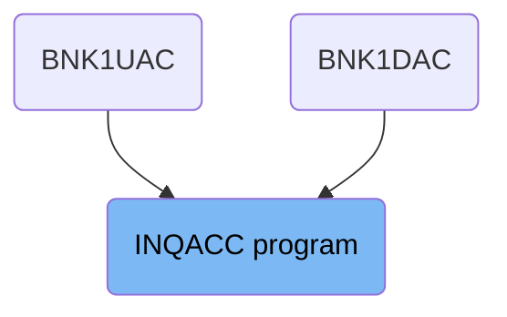

## PREMIERE

Lets' zoom into this section of the flow:

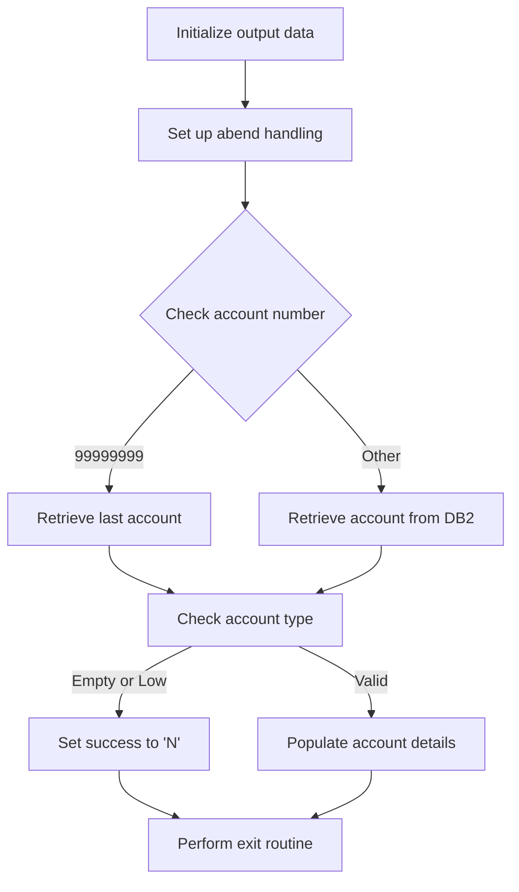

<SwmSnippet path="/src/base/cobol_src/INQACC.cbl" line="206">

---

### Initializing output data

First, the output data is initialized to ensure that any previous data is cleared and the structure is ready for new information.

```cobol
           INITIALIZE OUTPUT-DATA.
```

---

</SwmSnippet>

<SwmSnippet path="/src/base/cobol_src/INQACC.cbl" line="210">

---

### Setting up abend handling

Moving to the next step, abend handling is set up to manage any abnormal terminations that might occur during the execution of the section.

More about ABNDPROC: <SwmLink doc-title="Writing Abend Records (ABNDPROC)">[Writing Abend Records (ABNDPROC)](/.swm/writing-abend-records-abndproc.svfj4jn5.sw.md)</SwmLink>

```cobol
           EXEC CICS HANDLE
              ABEND LABEL(ABEND-HANDLING)
           END-EXEC.
```

---

</SwmSnippet>

<SwmSnippet path="/src/base/cobol_src/INQACC.cbl" line="218">

---

### Checking account number

Next, the code checks if the account number is <SwmToken path="src/base/cobol_src/INQACC.cbl" pos="218:9:9" line-data="           IF INQACC-ACCNO = 99999999">`99999999`</SwmToken>. This is a special condition to determine whether to retrieve the last account or a specific account from the database.

```cobol
           IF INQACC-ACCNO = 99999999
             PERFORM READ-ACCOUNT-LAST
           ELSE
             PERFORM READ-ACCOUNT-DB2
           END-IF
```

---

</SwmSnippet>

<SwmSnippet path="/src/base/cobol_src/INQACC.cbl" line="219">

---

### Retrieving account information

If the account number is <SwmToken path="src/base/cobol_src/INQACC.cbl" pos="218:9:9" line-data="           IF INQACC-ACCNO = 99999999">`99999999`</SwmToken>, the last account information is retrieved. Otherwise, the specific account information is retrieved from the <SwmToken path="src/base/cobol_src/INQACC.cbl" pos="221:7:7" line-data="             PERFORM READ-ACCOUNT-DB2">`DB2`</SwmToken> database.

```cobol
             PERFORM READ-ACCOUNT-LAST
           ELSE
             PERFORM READ-ACCOUNT-DB2
           END-IF
```

---

</SwmSnippet>

<SwmSnippet path="/src/base/cobol_src/INQACC.cbl" line="229">

---

### Checking account type

Then, the code checks if the account type is empty or contains low values. This helps determine if the account retrieval was successful.

```cobol
           IF ACCOUNT-TYPE = SPACES OR LOW-VALUES
```

---

</SwmSnippet>

<SwmSnippet path="/src/base/cobol_src/INQACC.cbl" line="232">

---

### Populating account details

If the account type is valid, the account details are populated into the communication area. This includes various fields such as customer number, sort code, account number, interest rate, and balances.

```cobol
              MOVE ACCOUNT-EYE-CATCHER       TO INQACC-EYE
              MOVE ACCOUNT-CUST-NO           TO INQACC-CUSTNO
              MOVE ACCOUNT-SORT-CODE         TO INQACC-SCODE
              MOVE ACCOUNT-NUMBER            TO INQACC-ACCNO
              MOVE ACCOUNT-TYPE              TO INQACC-ACC-TYPE
              MOVE ACCOUNT-INTEREST-RATE     TO INQACC-INT-RATE
              MOVE ACCOUNT-OPENED            TO INQACC-OPENED
              MOVE ACCOUNT-OVERDRAFT-LIMIT   TO INQACC-OVERDRAFT
              MOVE ACCOUNT-LAST-STMT-DATE    TO INQACC-LAST-STMT-DT
              MOVE ACCOUNT-NEXT-STMT-DATE    TO INQACC-NEXT-STMT-DT
              MOVE ACCOUNT-AVAILABLE-BALANCE TO INQACC-AVAIL-BAL
              MOVE ACCOUNT-ACTUAL-BALANCE    TO INQACC-ACTUAL-BAL
              MOVE 'Y'                       TO INQACC-SUCCESS
```

---

</SwmSnippet>

<SwmSnippet path="/src/base/cobol_src/INQACC.cbl" line="247">

---

### Performing exit routine

Finally, the exit routine is performed to conclude the section and ensure that any necessary cleanup or final steps are executed.

```cobol
           PERFORM GET-ME-OUT-OF-HERE.
```

---

</SwmSnippet>

## <SwmToken path="src/base/cobol_src/INQACC.cbl" pos="219:3:7" line-data="             PERFORM READ-ACCOUNT-LAST">`READ-ACCOUNT-LAST`</SwmToken>

Lets' zoom into this section of the flow:

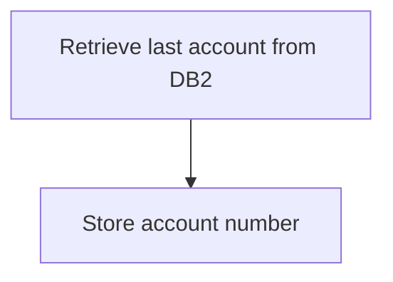

<SwmSnippet path="/src/base/cobol_src/INQACC.cbl" line="827">

---

First, the section performs the retrieval of the last account information from the <SwmToken path="src/base/cobol_src/INQACC.cbl" pos="830:9:9" line-data="            PERFORM GET-LAST-ACCOUNT-DB2.">`DB2`</SwmToken> database.

```cobol
       READ-ACCOUNT-LAST SECTION.
       RAN010.

            PERFORM GET-LAST-ACCOUNT-DB2.
```

---

</SwmSnippet>

<SwmSnippet path="/src/base/cobol_src/INQACC.cbl" line="831">

---

Next, it moves the required account number to the <SwmToken path="src/base/cobol_src/INQACC.cbl" pos="831:11:17" line-data="            MOVE REQUIRED-ACC-NUMBER2 TO NCS-ACC-NO-VALUE.">`NCS-ACC-NO-VALUE`</SwmToken> field for further processing.

```cobol
            MOVE REQUIRED-ACC-NUMBER2 TO NCS-ACC-NO-VALUE.

       RAN999.
           EXIT.
```

---

</SwmSnippet>

## <SwmToken path="src/base/cobol_src/INQACC.cbl" pos="830:3:9" line-data="            PERFORM GET-LAST-ACCOUNT-DB2.">`GET-LAST-ACCOUNT-DB2`</SwmToken>

Lets' zoom into this section of the flow:

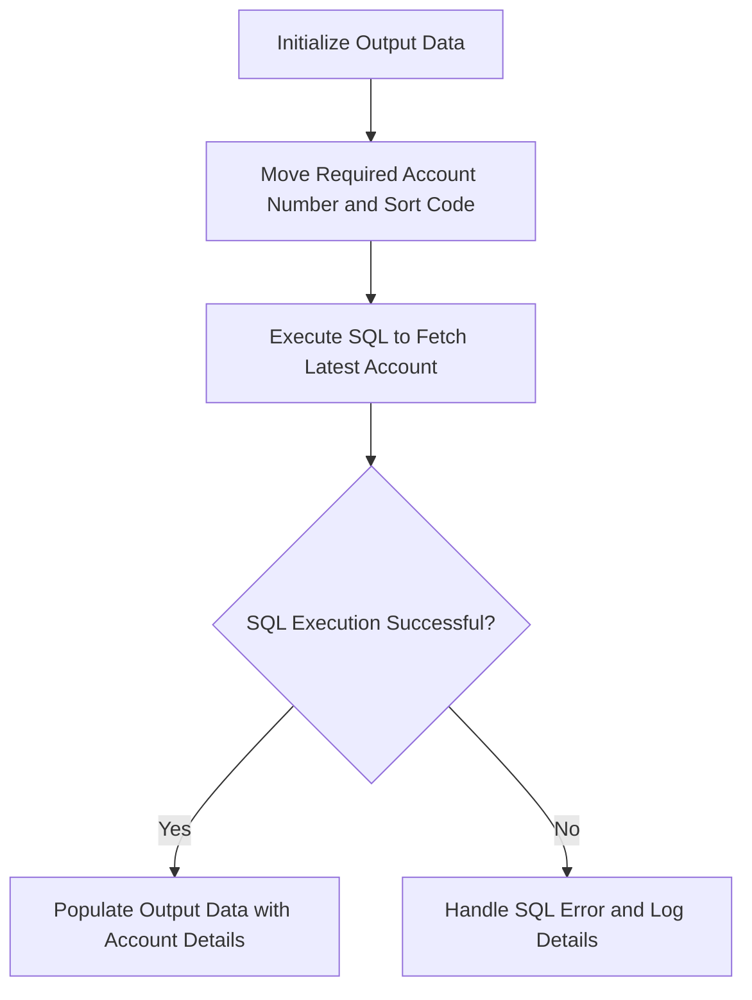

<SwmSnippet path="/src/base/cobol_src/INQACC.cbl" line="839">

---

First, the section initializes the <SwmToken path="src/base/cobol_src/INQACC.cbl" pos="839:3:5" line-data="           INITIALIZE OUTPUT-DATA.">`OUTPUT-DATA`</SwmToken> structure to ensure it is ready to store the retrieved account details.

```cobol
           INITIALIZE OUTPUT-DATA.
```

---

</SwmSnippet>

<SwmSnippet path="/src/base/cobol_src/INQACC.cbl" line="840">

---

Moving to the next step, the required account number and sort code are moved to the host variables <SwmToken path="src/base/cobol_src/INQACC.cbl" pos="840:11:17" line-data="           MOVE REQUIRED-ACC-NUMBER2 TO HV-ACCOUNT-ACC-NO.">`HV-ACCOUNT-ACC-NO`</SwmToken> and <SwmToken path="src/base/cobol_src/INQACC.cbl" pos="841:11:15" line-data="           MOVE REQUIRED-SORT-CODE TO HV-ACCOUNT-SORTCODE.">`HV-ACCOUNT-SORTCODE`</SwmToken> respectively.

```cobol
           MOVE REQUIRED-ACC-NUMBER2 TO HV-ACCOUNT-ACC-NO.
           MOVE REQUIRED-SORT-CODE TO HV-ACCOUNT-SORTCODE.
           MOVE SORTCODE TO HV-ACCOUNT-SORTCODE.
```

---

</SwmSnippet>

<SwmSnippet path="/src/base/cobol_src/INQACC.cbl" line="843">

---

Next, an SQL query is executed to fetch the latest account details from the <SwmToken path="src/base/cobol_src/INQACC.cbl" pos="856:6:6" line-data="              INTO :HV-ACCOUNT-EYECATCHER,">`ACCOUNT`</SwmToken> table. The query selects various account attributes and orders the results by account number in descending order, fetching only the first row.

```cobol
           EXEC SQL
              SELECT ACCOUNT_EYECATCHER,
                     ACCOUNT_CUSTOMER_NUMBER,
                     ACCOUNT_SORTCODE,
                     ACCOUNT_NUMBER,
                     ACCOUNT_TYPE,
                     ACCOUNT_INTEREST_RATE,
                     ACCOUNT_OPENED,
                     ACCOUNT_OVERDRAFT_LIMIT,
                     ACCOUNT_LAST_STATEMENT,
                     ACCOUNT_NEXT_STATEMENT,
                     ACCOUNT_AVAILABLE_BALANCE,
                     ACCOUNT_ACTUAL_BALANCE
              INTO :HV-ACCOUNT-EYECATCHER,
                   :HV-ACCOUNT-CUST-NO,
                   :HV-ACCOUNT-SORTCODE,
                   :HV-ACCOUNT-ACC-NO,
                   :HV-ACCOUNT-ACC-TYPE,
                   :HV-ACCOUNT-INT-RATE,
                   :HV-ACCOUNT-OPENED,
                   :HV-ACCOUNT-OVERDRAFT-LIM,
```

---

</SwmSnippet>

<SwmSnippet path="/src/base/cobol_src/INQACC.cbl" line="874">

---

Then, the code checks if the SQL execution was successful by evaluating the <SwmToken path="src/base/cobol_src/INQACC.cbl" pos="874:3:3" line-data="           IF SQLCODE IS NOT EQUAL TO ZERO">`SQLCODE`</SwmToken>. If the <SwmToken path="src/base/cobol_src/INQACC.cbl" pos="874:3:3" line-data="           IF SQLCODE IS NOT EQUAL TO ZERO">`SQLCODE`</SwmToken> is not zero, it indicates an error.

```cobol
           IF SQLCODE IS NOT EQUAL TO ZERO
```

---

</SwmSnippet>

<SwmSnippet path="/src/base/cobol_src/INQACC.cbl" line="875">

---

In case of an SQL error, the <SwmToken path="src/base/cobol_src/INQACC.cbl" pos="875:3:3" line-data="              MOVE SQLCODE TO SQLCODE-DISPLAY">`SQLCODE`</SwmToken> is moved to <SwmToken path="src/base/cobol_src/INQACC.cbl" pos="875:7:9" line-data="              MOVE SQLCODE TO SQLCODE-DISPLAY">`SQLCODE-DISPLAY`</SwmToken> for logging purposes.

```cobol
              MOVE SQLCODE TO SQLCODE-DISPLAY
```

---

</SwmSnippet>

<SwmSnippet path="/src/base/cobol_src/INQACC.cbl" line="883">

---

The section then initializes the <SwmToken path="src/base/cobol_src/INQACC.cbl" pos="883:3:5" line-data="              INITIALIZE ABNDINFO-REC">`ABNDINFO-REC`</SwmToken> structure to prepare for abnormal termination handling.

```cobol
              INITIALIZE ABNDINFO-REC
```

---

</SwmSnippet>

<SwmSnippet path="/src/base/cobol_src/INQACC.cbl" line="889">

---

Supplemental information such as application ID, task number, and transaction ID are retrieved and stored in the <SwmToken path="src/base/cobol_src/INQACC.cbl" pos="476:3:5" line-data="              INITIALIZE ABNDINFO-REC">`ABNDINFO-REC`</SwmToken> structure.

```cobol
              EXEC CICS ASSIGN APPLID(ABND-APPLID)
              END-EXEC

              MOVE EIBTASKN   TO ABND-TASKNO-KEY
              MOVE EIBTRNID   TO ABND-TRANID

```

---

</SwmSnippet>

<SwmSnippet path="/src/base/cobol_src/INQACC.cbl" line="895">

---

The current date and time are formatted and stored in the <SwmToken path="src/base/cobol_src/INQACC.cbl" pos="476:3:5" line-data="              INITIALIZE ABNDINFO-REC">`ABNDINFO-REC`</SwmToken> structure for logging purposes.

```cobol
              PERFORM POPULATE-TIME-DATE

              MOVE WS-ORIG-DATE TO ABND-DATE
              STRING WS-TIME-NOW-GRP-HH DELIMITED BY SIZE,
                   ':' DELIMITED BY SIZE,
                    WS-TIME-NOW-GRP-MM DELIMITED BY SIZE,
                    ':' DELIMITED BY SIZE,
                    WS-TIME-NOW-GRP-MM DELIMITED BY SIZE
                     INTO ABND-TIME
```

---

</SwmSnippet>

<SwmSnippet path="/src/base/cobol_src/INQACC.cbl" line="912">

---

The <SwmToken path="src/base/cobol_src/INQACC.cbl" pos="912:3:5" line-data="              MOVE SQLCODE-DISPLAY TO ABND-SQLCODE">`SQLCODE-DISPLAY`</SwmToken> is moved to <SwmToken path="src/base/cobol_src/INQACC.cbl" pos="912:9:11" line-data="              MOVE SQLCODE-DISPLAY TO ABND-SQLCODE">`ABND-SQLCODE`</SwmToken> for inclusion in the abend information.

```cobol
              MOVE SQLCODE-DISPLAY TO ABND-SQLCODE
```

---

</SwmSnippet>

<SwmSnippet path="/src/base/cobol_src/INQACC.cbl" line="914">

---

A detailed error message is constructed and stored in <SwmToken path="src/base/cobol_src/INQACC.cbl" pos="921:3:5" line-data="                   INTO ABND-FREEFORM">`ABND-FREEFORM`</SwmToken> to describe the SQL failure.

```cobol
              STRING 'GLAD010 -ACCOUNT NCS '
                   DELIMITED BY SIZE,
                   NCS-ACC-NO-NAME   DELIMITED BY SIZE,
                   ' CANNOT be accessed and DB2 ' DELIMITED BY SIZE,
                   ' SELECT failed. SQLCODE='
                   DELIMITED BY SIZE,
                   SQLCODE-DISPLAY DELIMITED BY SIZE
                   INTO ABND-FREEFORM
```

---

</SwmSnippet>

<SwmSnippet path="/src/base/cobol_src/INQACC.cbl" line="924">

---

The <SwmToken path="src/base/cobol_src/INQACC.cbl" pos="925:3:5" line-data="                       COMMAREA(ABNDINFO-REC)">`ABNDINFO-REC`</SwmToken> structure is then passed to the abend handler program <SwmToken path="src/base/cobol_src/INQACC.cbl" pos="193:19:19" line-data="       01 WS-ABEND-PGM                 PIC X(8) VALUE &#39;ABNDPROC&#39;.">`ABNDPROC`</SwmToken> via a CICS LINK command.

```cobol
              EXEC CICS LINK PROGRAM(WS-ABEND-PGM)
                       COMMAREA(ABNDINFO-REC)
              END-EXEC
```

---

</SwmSnippet>

<SwmSnippet path="/src/base/cobol_src/INQACC.cbl" line="928">

---

A message is displayed indicating the failure to access the account and the associated SQLCODE.

```cobol
              DISPLAY 'INQACC - ACCOUNT NCS ' NCS-ACC-NO-NAME
                 ' CANNOT BE ACCESSED AND DB2 SELECT FAILED. SQLCODE='
                 SQLCODE-DISPLAY
```

---

</SwmSnippet>

<SwmSnippet path="/src/base/cobol_src/INQACC.cbl" line="932">

---

Finally, a CICS ABEND command is issued to terminate the transaction with the code 'HNCS' without generating a dump.

```cobol
              EXEC CICS ABEND
                       ABCODE('HNCS')
                       NODUMP
                       CANCEL
              END-EXEC
```

---

</SwmSnippet>

<SwmSnippet path="/src/base/cobol_src/INQACC.cbl" line="941">

---

If the SQL execution is successful, the retrieved account details are moved to the <SwmToken path="src/base/cobol_src/INQACC.cbl" pos="942:9:11" line-data="                ACCOUNT-EYE-CATCHER OF OUTPUT-DATA">`OUTPUT-DATA`</SwmToken> structure.

```cobol
             MOVE HV-ACCOUNT-EYECATCHER TO
                ACCOUNT-EYE-CATCHER OF OUTPUT-DATA
             MOVE HV-ACCOUNT-CUST-NO TO
                ACCOUNT-CUST-NO OF OUTPUT-DATA
             MOVE HV-ACCOUNT-SORTCODE TO
                ACCOUNT-SORT-CODE OF OUTPUT-DATA
             MOVE HV-ACCOUNT-ACC-NO TO
                ACCOUNT-NUMBER OF OUTPUT-DATA
             MOVE HV-ACCOUNT-ACC-TYPE TO
                ACCOUNT-TYPE OF OUTPUT-DATA
             MOVE HV-ACCOUNT-INT-RATE TO
                ACCOUNT-INTEREST-RATE OF OUTPUT-DATA
             MOVE HV-ACCOUNT-OPENED TO DB2-DATE-REFORMAT
             MOVE DB2-DATE-REF-DAY TO
                ACCOUNT-OPENED-DAY OF OUTPUT-DATA
             MOVE DB2-DATE-REF-MNTH TO
                ACCOUNT-OPENED-MONTH OF OUTPUT-DATA
             MOVE DB2-DATE-REF-YR TO
                ACCOUNT-OPENED-YEAR OF OUTPUT-DATA
             MOVE HV-ACCOUNT-OVERDRAFT-LIM TO
                ACCOUNT-OVERDRAFT-LIMIT OF OUTPUT-DATA
```

---

</SwmSnippet>

## <SwmToken path="src/base/cobol_src/INQACC.cbl" pos="895:3:7" line-data="              PERFORM POPULATE-TIME-DATE">`POPULATE-TIME-DATE`</SwmToken>

Lets' zoom into this section of the flow:

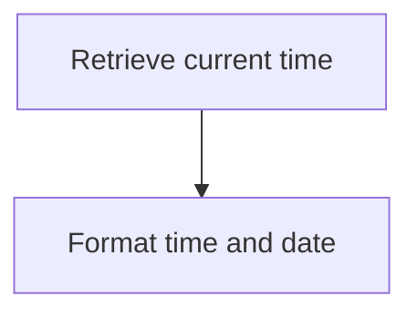

<SwmSnippet path="/src/base/cobol_src/INQACC.cbl" line="990">

---

### Retrieving current time

First, the current time is retrieved using the <SwmToken path="src/base/cobol_src/INQACC.cbl" pos="990:1:5" line-data="           EXEC CICS ASKTIME">`EXEC CICS ASKTIME`</SwmToken> command, which stores the time in <SwmToken path="src/base/cobol_src/INQACC.cbl" pos="991:3:7" line-data="              ABSTIME(WS-U-TIME)">`WS-U-TIME`</SwmToken>.

```cobol
           EXEC CICS ASKTIME
              ABSTIME(WS-U-TIME)
           END-EXEC.
```

---

</SwmSnippet>

<SwmSnippet path="/src/base/cobol_src/INQACC.cbl" line="994">

---

### Formatting time and date

Next, the <SwmToken path="src/base/cobol_src/INQACC.cbl" pos="994:1:5" line-data="           EXEC CICS FORMATTIME">`EXEC CICS FORMATTIME`</SwmToken> command is used to format the retrieved time into a human-readable date and time. The formatted date is stored in <SwmToken path="src/base/cobol_src/INQACC.cbl" pos="996:3:7" line-data="                     DDMMYYYY(WS-ORIG-DATE)">`WS-ORIG-DATE`</SwmToken> and the formatted time is stored in <SwmToken path="src/base/cobol_src/INQACC.cbl" pos="997:3:7" line-data="                     TIME(WS-TIME-NOW)">`WS-TIME-NOW`</SwmToken>.

```cobol
           EXEC CICS FORMATTIME
                     ABSTIME(WS-U-TIME)
                     DDMMYYYY(WS-ORIG-DATE)
                     TIME(WS-TIME-NOW)
                     DATESEP
           END-EXEC.
```

---

</SwmSnippet>

## Interim Summary

So far, we saw the detailed steps involved in initializing output data, setting up abend handling, checking account numbers, retrieving account information, and populating account details. We also covered the process of performing exit routines and retrieving the last account from the <SwmToken path="src/base/cobol_src/INQACC.cbl" pos="221:7:7" line-data="             PERFORM READ-ACCOUNT-DB2">`DB2`</SwmToken> database. Now, we will focus on the <SwmToken path="src/base/cobol_src/INQACC.cbl" pos="221:3:7" line-data="             PERFORM READ-ACCOUNT-DB2">`READ-ACCOUNT-DB2`</SwmToken> section, which involves opening a <SwmToken path="src/base/cobol_src/INQACC.cbl" pos="221:7:7" line-data="             PERFORM READ-ACCOUNT-DB2">`DB2`</SwmToken> cursor, handling errors, fetching data, and closing the cursor.

# Read <SwmToken path="src/base/cobol_src/INQACC.cbl" pos="221:7:7" line-data="             PERFORM READ-ACCOUNT-DB2">`DB2`</SwmToken> data (<SwmToken path="src/base/cobol_src/INQACC.cbl" pos="221:3:7" line-data="             PERFORM READ-ACCOUNT-DB2">`READ-ACCOUNT-DB2`</SwmToken>)

Let's split this section into smaller parts:

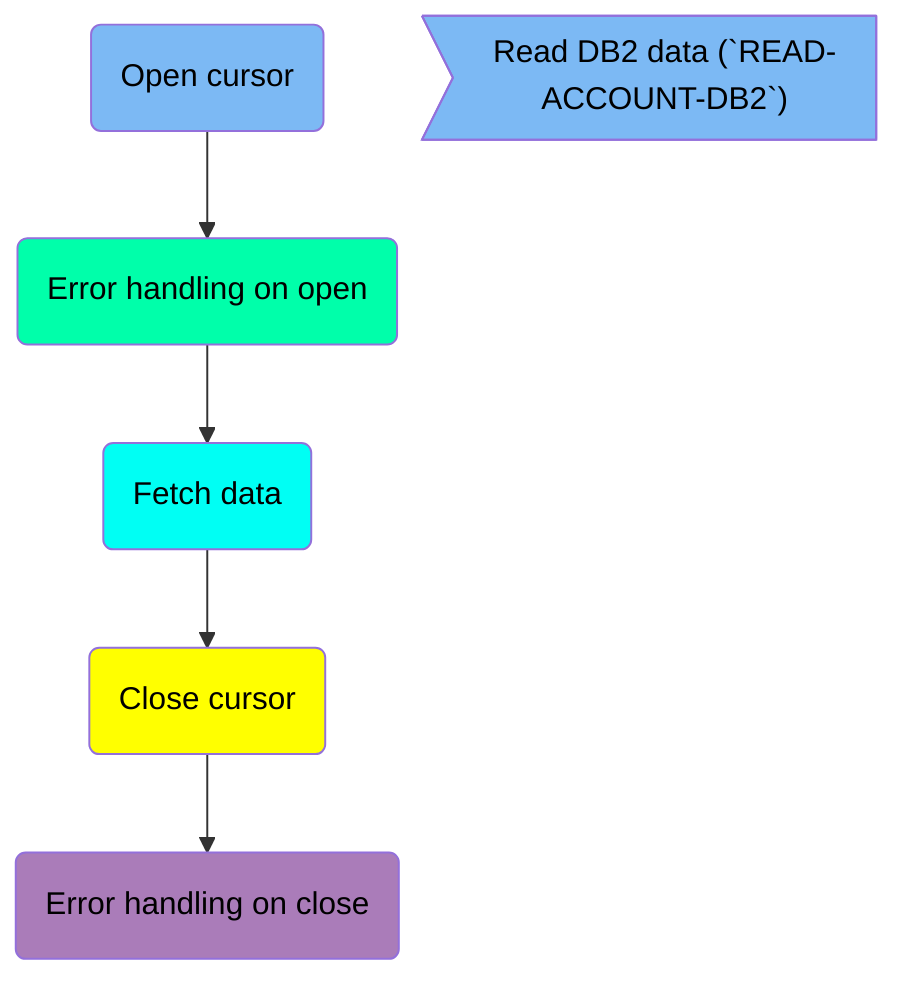

## Open cursor

First, we'll zoom into this section of the flow:

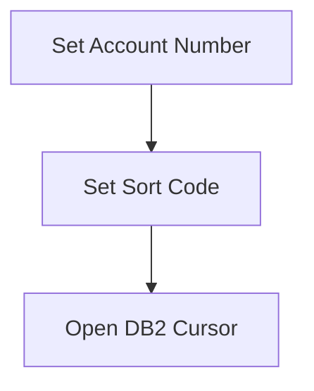

<SwmSnippet path="/src/base/cobol_src/INQACC.cbl" line="263">

---

### Setting Account Number

First, the account number is set by moving the value from <SwmToken path="src/base/cobol_src/INQACC.cbl" pos="263:3:5" line-data="           MOVE INQACC-ACCNO">`INQACC-ACCNO`</SwmToken> (which holds the account number) to <SwmToken path="src/base/cobol_src/INQACC.cbl" pos="264:3:9" line-data="              TO HV-ACCOUNT-ACC-NO.">`HV-ACCOUNT-ACC-NO`</SwmToken> (the host variable for the account number).

```cobol
           MOVE INQACC-ACCNO
              TO HV-ACCOUNT-ACC-NO.
```

---

</SwmSnippet>

<SwmSnippet path="/src/base/cobol_src/INQACC.cbl" line="265">

---

### Setting Sort Code

Moving to the next step, the sort code is set by moving the value from <SwmToken path="src/base/cobol_src/INQACC.cbl" pos="265:3:3" line-data="           MOVE SORTCODE TO HV-ACCOUNT-SORTCODE.">`SORTCODE`</SwmToken> (which holds the sort code) to <SwmToken path="src/base/cobol_src/INQACC.cbl" pos="265:7:11" line-data="           MOVE SORTCODE TO HV-ACCOUNT-SORTCODE.">`HV-ACCOUNT-SORTCODE`</SwmToken> (the host variable for the sort code).

```cobol
           MOVE SORTCODE TO HV-ACCOUNT-SORTCODE.
```

---

</SwmSnippet>

<SwmSnippet path="/src/base/cobol_src/INQACC.cbl" line="270">

---

### Opening <SwmToken path="src/base/cobol_src/INQACC.cbl" pos="221:7:7" line-data="             PERFORM READ-ACCOUNT-DB2">`DB2`</SwmToken> Cursor

Next, the <SwmToken path="src/base/cobol_src/INQACC.cbl" pos="221:7:7" line-data="             PERFORM READ-ACCOUNT-DB2">`DB2`</SwmToken> cursor is opened by executing the SQL command <SwmToken path="src/base/cobol_src/INQACC.cbl" pos="270:5:9" line-data="           EXEC SQL OPEN ACC-CURSOR">`OPEN ACC-CURSOR`</SwmToken>. This cursor is used to fetch the account details from the database.

```cobol
           EXEC SQL OPEN ACC-CURSOR
           END-EXEC.
```

---

</SwmSnippet>

## Error handling on open

Now, lets zoom into this section of the flow:

```mermaid
graph TD
  A[Check SQLCODE] --> |SQLCODE NOT = 0| B[Initialize ABNDINFO-REC]
  B --> C[Move EIBRESP to ABND-RESPCODE]
  C --> D[Move EIBRESP2 to ABND-RESP2CODE]
  D --> E[Assign APPLID to ABND-APPLID]
  E --> F[Move EIBTASKN to ABND-TASKNO-KEY]
  F --> G[Move EIBTRNID to ABND-TRANID]
  G --> H[Perform POPULATE-TIME-DATE]
  H --> I[Move WS-ORIG-DATE to ABND-DATE]
  I --> J[Format and move current time to ABND-TIME]
  J --> K[Move WS-U-TIME to ABND-UTIME-KEY]
  K --> L[Move 'HRAC' to ABND-CODE]
  L --> M[Assign PROGRAM to ABND-PROGRAM]
  M --> N[Move SQLCODE-DISPLAY to ABND-SQLCODE]
  N --> O[Format and move error message to ABND-FREEFORM]
  O --> P[Link to ABNDPROC program]
  P --> Q[Display error message]
  Q --> R[Perform CHECK-FOR-STORM-DRAIN-DB2]
  R --> S[Initiate CICS ABEND]

%% Swimm:
%% graph TD
%%   A[Check SQLCODE] --> |SQLCODE NOT = 0| B[Initialize <SwmToken path="src/base/cobol_src/INQACC.cbl" pos="476:3:5" line-data="              INITIALIZE ABNDINFO-REC">`ABNDINFO-REC`</SwmToken>]
%%   B --> C[Move EIBRESP to <SwmToken path="src/base/cobol_src/INQACC.cbl" pos="477:7:9" line-data="              MOVE EIBRESP    TO ABND-RESPCODE">`ABND-RESPCODE`</SwmToken>]
%%   C --> D[Move <SwmToken path="src/base/cobol_src/INQACC.cbl" pos="478:3:3" line-data="              MOVE EIBRESP2   TO ABND-RESP2CODE">`EIBRESP2`</SwmToken> to <SwmToken path="src/base/cobol_src/INQACC.cbl" pos="478:7:9" line-data="              MOVE EIBRESP2   TO ABND-RESP2CODE">`ABND-RESP2CODE`</SwmToken>]
%%   D --> E[Assign APPLID to <SwmToken path="src/base/cobol_src/INQACC.cbl" pos="889:9:11" line-data="              EXEC CICS ASSIGN APPLID(ABND-APPLID)">`ABND-APPLID`</SwmToken>]
%%   E --> F[Move EIBTASKN to <SwmToken path="src/base/cobol_src/INQACC.cbl" pos="892:7:11" line-data="              MOVE EIBTASKN   TO ABND-TASKNO-KEY">`ABND-TASKNO-KEY`</SwmToken>]
%%   F --> G[Move EIBTRNID to <SwmToken path="src/base/cobol_src/INQACC.cbl" pos="893:7:9" line-data="              MOVE EIBTRNID   TO ABND-TRANID">`ABND-TRANID`</SwmToken>]
%%   G --> H[Perform <SwmToken path="src/base/cobol_src/INQACC.cbl" pos="895:3:7" line-data="              PERFORM POPULATE-TIME-DATE">`POPULATE-TIME-DATE`</SwmToken>]
%%   H --> I[Move <SwmToken path="src/base/cobol_src/INQACC.cbl" pos="897:3:7" line-data="              MOVE WS-ORIG-DATE TO ABND-DATE">`WS-ORIG-DATE`</SwmToken> to <SwmToken path="src/base/cobol_src/INQACC.cbl" pos="897:11:13" line-data="              MOVE WS-ORIG-DATE TO ABND-DATE">`ABND-DATE`</SwmToken>]
%%   I --> J[Format and move current time to <SwmToken path="src/base/cobol_src/INQACC.cbl" pos="903:3:5" line-data="                     INTO ABND-TIME">`ABND-TIME`</SwmToken>]
%%   J --> K[Move <SwmToken path="src/base/cobol_src/INQACC.cbl" pos="991:3:7" line-data="              ABSTIME(WS-U-TIME)">`WS-U-TIME`</SwmToken> to <SwmToken path="src/base/cobol_src/INQACC.cbl" pos="304:11:15" line-data="              MOVE WS-U-TIME   TO ABND-UTIME-KEY">`ABND-UTIME-KEY`</SwmToken>]
%%   K --> L[Move 'HRAC' to <SwmToken path="src/base/cobol_src/INQACC.cbl" pos="305:9:11" line-data="              MOVE &#39;HRAC&#39;      TO ABND-CODE">`ABND-CODE`</SwmToken>]
%%   L --> M[Assign PROGRAM to <SwmToken path="src/base/cobol_src/INQACC.cbl" pos="307:9:11" line-data="              EXEC CICS ASSIGN PROGRAM(ABND-PROGRAM)">`ABND-PROGRAM`</SwmToken>]
%%   M --> N[Move <SwmToken path="src/base/cobol_src/INQACC.cbl" pos="468:7:9" line-data="              MOVE SQLCODE TO SQLCODE-DISPLAY">`SQLCODE-DISPLAY`</SwmToken> to <SwmToken path="src/base/cobol_src/INQACC.cbl" pos="912:9:11" line-data="              MOVE SQLCODE-DISPLAY TO ABND-SQLCODE">`ABND-SQLCODE`</SwmToken>]
%%   N --> O[Format and move error message to <SwmToken path="src/base/cobol_src/INQACC.cbl" pos="921:3:5" line-data="                   INTO ABND-FREEFORM">`ABND-FREEFORM`</SwmToken>]
%%   O --> P[Link to ABNDPROC program]
%%   P --> Q[Display error message]
%%   Q --> R[Perform <SwmToken path="src/base/cobol_src/INQACC.cbl" pos="466:3:11" line-data="              PERFORM CHECK-FOR-STORM-DRAIN-DB2">`CHECK-FOR-STORM-DRAIN-DB2`</SwmToken>]
%%   R --> S[Initiate CICS ABEND]
```

First, the code checks if <SwmToken path="src/base/cobol_src/INQACC.cbl" pos="450:3:3" line-data="           IF SQLCODE = +100">`SQLCODE`</SwmToken> is not equal to 0, indicating an error in the database operation.

Moving to the next step, the <SwmToken path="src/base/cobol_src/INQACC.cbl" pos="476:3:5" line-data="              INITIALIZE ABNDINFO-REC">`ABNDINFO-REC`</SwmToken> structure is initialized to prepare for abend processing.

Next, the response codes <SwmToken path="src/base/cobol_src/INQACC.cbl" pos="477:3:3" line-data="              MOVE EIBRESP    TO ABND-RESPCODE">`EIBRESP`</SwmToken> and <SwmToken path="src/base/cobol_src/INQACC.cbl" pos="478:3:3" line-data="              MOVE EIBRESP2   TO ABND-RESP2CODE">`EIBRESP2`</SwmToken> are moved to <SwmToken path="src/base/cobol_src/INQACC.cbl" pos="477:7:9" line-data="              MOVE EIBRESP    TO ABND-RESPCODE">`ABND-RESPCODE`</SwmToken> and <SwmToken path="src/base/cobol_src/INQACC.cbl" pos="478:7:9" line-data="              MOVE EIBRESP2   TO ABND-RESP2CODE">`ABND-RESP2CODE`</SwmToken> respectively to capture the error details.

Then, the application ID is assigned to <SwmToken path="src/base/cobol_src/INQACC.cbl" pos="889:9:11" line-data="              EXEC CICS ASSIGN APPLID(ABND-APPLID)">`ABND-APPLID`</SwmToken> to record which application encountered the error.

The task number and transaction ID are moved to <SwmToken path="src/base/cobol_src/INQACC.cbl" pos="892:7:11" line-data="              MOVE EIBTASKN   TO ABND-TASKNO-KEY">`ABND-TASKNO-KEY`</SwmToken> and <SwmToken path="src/base/cobol_src/INQACC.cbl" pos="893:7:9" line-data="              MOVE EIBTRNID   TO ABND-TRANID">`ABND-TRANID`</SwmToken> respectively for tracking purposes.

Going into the next step, the <SwmToken path="src/base/cobol_src/INQACC.cbl" pos="895:3:7" line-data="              PERFORM POPULATE-TIME-DATE">`POPULATE-TIME-DATE`</SwmToken> routine is performed to get the current date and time.

The original date is moved to <SwmToken path="src/base/cobol_src/INQACC.cbl" pos="897:11:13" line-data="              MOVE WS-ORIG-DATE TO ABND-DATE">`ABND-DATE`</SwmToken>, and the current time is formatted and moved to <SwmToken path="src/base/cobol_src/INQACC.cbl" pos="903:3:5" line-data="                     INTO ABND-TIME">`ABND-TIME`</SwmToken>.

The universal time is moved to <SwmToken path="src/base/cobol_src/INQACC.cbl" pos="304:11:15" line-data="              MOVE WS-U-TIME   TO ABND-UTIME-KEY">`ABND-UTIME-KEY`</SwmToken>, and the abend code 'HRAC' is set in <SwmToken path="src/base/cobol_src/INQACC.cbl" pos="305:9:11" line-data="              MOVE &#39;HRAC&#39;      TO ABND-CODE">`ABND-CODE`</SwmToken>.

The current program name is assigned to <SwmToken path="src/base/cobol_src/INQACC.cbl" pos="307:9:11" line-data="              EXEC CICS ASSIGN PROGRAM(ABND-PROGRAM)">`ABND-PROGRAM`</SwmToken> to log which program encountered the error.

The <SwmToken path="src/base/cobol_src/INQACC.cbl" pos="468:7:9" line-data="              MOVE SQLCODE TO SQLCODE-DISPLAY">`SQLCODE-DISPLAY`</SwmToken> is moved to <SwmToken path="src/base/cobol_src/INQACC.cbl" pos="912:9:11" line-data="              MOVE SQLCODE-DISPLAY TO ABND-SQLCODE">`ABND-SQLCODE`</SwmToken> to capture the specific SQL error code.

An error message is formatted and moved to <SwmToken path="src/base/cobol_src/INQACC.cbl" pos="921:3:5" line-data="                   INTO ABND-FREEFORM">`ABND-FREEFORM`</SwmToken> to provide a detailed error description.

The <SwmToken path="src/base/cobol_src/INQACC.cbl" pos="476:3:5" line-data="              INITIALIZE ABNDINFO-REC">`ABNDINFO-REC`</SwmToken> is then linked to the <SwmToken path="src/base/cobol_src/INQACC.cbl" pos="193:19:19" line-data="       01 WS-ABEND-PGM                 PIC X(8) VALUE &#39;ABNDPROC&#39;.">`ABNDPROC`</SwmToken> program to handle the abend processing.

An error message is displayed to inform the user about the failure in opening the <SwmToken path="src/base/cobol_src/INQACC.cbl" pos="221:7:7" line-data="             PERFORM READ-ACCOUNT-DB2">`DB2`</SwmToken> cursor.

The <SwmToken path="src/base/cobol_src/INQACC.cbl" pos="466:3:11" line-data="              PERFORM CHECK-FOR-STORM-DRAIN-DB2">`CHECK-FOR-STORM-DRAIN-DB2`</SwmToken> routine is performed to determine if storm drain processing is applicable.

## Fetch data

Now, lets zoom into this section of the flow:

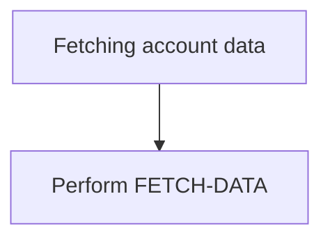

<SwmSnippet path="/src/base/cobol_src/INQACC.cbl" line="342">

---

The <SwmToken path="src/base/cobol_src/INQACC.cbl" pos="221:3:7" line-data="             PERFORM READ-ACCOUNT-DB2">`READ-ACCOUNT-DB2`</SwmToken> function is responsible for fetching account data from the database. This is achieved by performing the <SwmToken path="src/base/cobol_src/INQACC.cbl" pos="345:3:5" line-data="           PERFORM FETCH-DATA.">`FETCH-DATA`</SwmToken> operation, which retrieves the relevant account row from the database.

```cobol
      *
      *    FETCH the account row
      *
           PERFORM FETCH-DATA.
```

---

</SwmSnippet>

## Close cursor

This is the next section of the flow.


<SwmSnippet path="/src/base/cobol_src/INQACC.cbl" line="350">

---

After retrieving the necessary account information from the database, the cursor used for the query needs to be closed to free up database resources and maintain efficient database operations. This step ensures that the cursor, which was previously opened to fetch account data, is properly closed. This is done using the <SwmToken path="src/base/cobol_src/INQACC.cbl" pos="350:1:1" line-data="           EXEC SQL CLOSE ACC-CURSOR">`EXEC`</SwmToken>` `<SwmToken path="src/base/cobol_src/INQACC.cbl" pos="350:3:3" line-data="           EXEC SQL CLOSE ACC-CURSOR">`SQL`</SwmToken>` `<SwmToken path="src/base/cobol_src/INQACC.cbl" pos="350:5:5" line-data="           EXEC SQL CLOSE ACC-CURSOR">`CLOSE`</SwmToken>` `<SwmToken path="src/base/cobol_src/INQACC.cbl" pos="350:7:9" line-data="           EXEC SQL CLOSE ACC-CURSOR">`ACC-CURSOR`</SwmToken>` `<SwmToken path="src/base/cobol_src/INQACC.cbl" pos="351:1:3" line-data="           END-EXEC.">`END-EXEC`</SwmToken> statement, which sends a command to the <SwmToken path="src/base/cobol_src/INQACC.cbl" pos="221:7:7" line-data="             PERFORM READ-ACCOUNT-DB2">`DB2`</SwmToken> database to close the cursor named <SwmToken path="src/base/cobol_src/INQACC.cbl" pos="350:7:9" line-data="           EXEC SQL CLOSE ACC-CURSOR">`ACC-CURSOR`</SwmToken>.

```cobol
           EXEC SQL CLOSE ACC-CURSOR
           END-EXEC.
```

---

</SwmSnippet>

## Error handling on close

Now, lets zoom into this section of the flow:

```mermaid
graph TD
  A[Check SQLCODE] -->|SQLCODE NOT = 0| B[Initialize ABNDINFO-REC]
  B --> C[Move EIBRESP to ABND-RESPCODE]
  C --> D[Move EIBRESP2 to ABND-RESP2CODE]
  D --> E[Get supplemental information]
  E --> F[Move EIBTASKN to ABND-TASKNO-KEY]
  F --> G[Move EIBTRNID to ABND-TRANID]
  G --> H[Perform POPULATE-TIME-DATE]
  H --> I[Move WS-ORIG-DATE to ABND-DATE]
  I --> J[Format and move current time to ABND-TIME]
  J --> K[Move WS-U-TIME to ABND-UTIME-KEY]
  K --> L[Move 'HRAC' to ABND-CODE]
  L --> M[Assign current program to ABND-PROGRAM]
  M --> N[Move SQLCODE-DISPLAY to ABND-SQLCODE]
  N --> O[Create failure message in ABND-FREEFORM]
  O --> P[Link to ABNDPROC program]
  P --> Q[Display failure message]
  Q --> R[Perform CHECK-FOR-STORM-DRAIN-DB2]
  R --> S[Initiate CICS ABEND]

%% Swimm:
%% graph TD
%%   A[Check SQLCODE] -->|SQLCODE NOT = 0| B[Initialize <SwmToken path="src/base/cobol_src/INQACC.cbl" pos="476:3:5" line-data="              INITIALIZE ABNDINFO-REC">`ABNDINFO-REC`</SwmToken>]
%%   B --> C[Move EIBRESP to <SwmToken path="src/base/cobol_src/INQACC.cbl" pos="477:7:9" line-data="              MOVE EIBRESP    TO ABND-RESPCODE">`ABND-RESPCODE`</SwmToken>]
%%   C --> D[Move <SwmToken path="src/base/cobol_src/INQACC.cbl" pos="478:3:3" line-data="              MOVE EIBRESP2   TO ABND-RESP2CODE">`EIBRESP2`</SwmToken> to <SwmToken path="src/base/cobol_src/INQACC.cbl" pos="478:7:9" line-data="              MOVE EIBRESP2   TO ABND-RESP2CODE">`ABND-RESP2CODE`</SwmToken>]
%%   D --> E[Get supplemental information]
%%   E --> F[Move EIBTASKN to <SwmToken path="src/base/cobol_src/INQACC.cbl" pos="892:7:11" line-data="              MOVE EIBTASKN   TO ABND-TASKNO-KEY">`ABND-TASKNO-KEY`</SwmToken>]
%%   F --> G[Move EIBTRNID to <SwmToken path="src/base/cobol_src/INQACC.cbl" pos="893:7:9" line-data="              MOVE EIBTRNID   TO ABND-TRANID">`ABND-TRANID`</SwmToken>]
%%   G --> H[Perform <SwmToken path="src/base/cobol_src/INQACC.cbl" pos="895:3:7" line-data="              PERFORM POPULATE-TIME-DATE">`POPULATE-TIME-DATE`</SwmToken>]
%%   H --> I[Move <SwmToken path="src/base/cobol_src/INQACC.cbl" pos="897:3:7" line-data="              MOVE WS-ORIG-DATE TO ABND-DATE">`WS-ORIG-DATE`</SwmToken> to <SwmToken path="src/base/cobol_src/INQACC.cbl" pos="897:11:13" line-data="              MOVE WS-ORIG-DATE TO ABND-DATE">`ABND-DATE`</SwmToken>]
%%   I --> J[Format and move current time to <SwmToken path="src/base/cobol_src/INQACC.cbl" pos="903:3:5" line-data="                     INTO ABND-TIME">`ABND-TIME`</SwmToken>]
%%   J --> K[Move <SwmToken path="src/base/cobol_src/INQACC.cbl" pos="991:3:7" line-data="              ABSTIME(WS-U-TIME)">`WS-U-TIME`</SwmToken> to <SwmToken path="src/base/cobol_src/INQACC.cbl" pos="304:11:15" line-data="              MOVE WS-U-TIME   TO ABND-UTIME-KEY">`ABND-UTIME-KEY`</SwmToken>]
%%   K --> L[Move 'HRAC' to <SwmToken path="src/base/cobol_src/INQACC.cbl" pos="305:9:11" line-data="              MOVE &#39;HRAC&#39;      TO ABND-CODE">`ABND-CODE`</SwmToken>]
%%   L --> M[Assign current program to <SwmToken path="src/base/cobol_src/INQACC.cbl" pos="307:9:11" line-data="              EXEC CICS ASSIGN PROGRAM(ABND-PROGRAM)">`ABND-PROGRAM`</SwmToken>]
%%   M --> N[Move <SwmToken path="src/base/cobol_src/INQACC.cbl" pos="468:7:9" line-data="              MOVE SQLCODE TO SQLCODE-DISPLAY">`SQLCODE-DISPLAY`</SwmToken> to <SwmToken path="src/base/cobol_src/INQACC.cbl" pos="912:9:11" line-data="              MOVE SQLCODE-DISPLAY TO ABND-SQLCODE">`ABND-SQLCODE`</SwmToken>]
%%   N --> O[Create failure message in <SwmToken path="src/base/cobol_src/INQACC.cbl" pos="921:3:5" line-data="                   INTO ABND-FREEFORM">`ABND-FREEFORM`</SwmToken>]
%%   O --> P[Link to ABNDPROC program]
%%   P --> Q[Display failure message]
%%   Q --> R[Perform <SwmToken path="src/base/cobol_src/INQACC.cbl" pos="466:3:11" line-data="              PERFORM CHECK-FOR-STORM-DRAIN-DB2">`CHECK-FOR-STORM-DRAIN-DB2`</SwmToken>]
%%   R --> S[Initiate CICS ABEND]
```

First, the code checks if <SwmToken path="src/base/cobol_src/INQACC.cbl" pos="450:3:3" line-data="           IF SQLCODE = +100">`SQLCODE`</SwmToken> (the SQL return code) is not equal to 0, indicating an error occurred during the database operation.

Moving to the next step, the <SwmToken path="src/base/cobol_src/INQACC.cbl" pos="476:3:5" line-data="              INITIALIZE ABNDINFO-REC">`ABNDINFO-REC`</SwmToken> structure is initialized to prepare for capturing abnormal end (abend) information.

Next, the response codes <SwmToken path="src/base/cobol_src/INQACC.cbl" pos="477:3:3" line-data="              MOVE EIBRESP    TO ABND-RESPCODE">`EIBRESP`</SwmToken> and <SwmToken path="src/base/cobol_src/INQACC.cbl" pos="478:3:3" line-data="              MOVE EIBRESP2   TO ABND-RESP2CODE">`EIBRESP2`</SwmToken> are moved to <SwmToken path="src/base/cobol_src/INQACC.cbl" pos="477:7:9" line-data="              MOVE EIBRESP    TO ABND-RESPCODE">`ABND-RESPCODE`</SwmToken> and <SwmToken path="src/base/cobol_src/INQACC.cbl" pos="478:7:9" line-data="              MOVE EIBRESP2   TO ABND-RESP2CODE">`ABND-RESP2CODE`</SwmToken> respectively, to record the CICS response codes.

Then, supplemental information is gathered by assigning the application ID to <SwmToken path="src/base/cobol_src/INQACC.cbl" pos="889:9:11" line-data="              EXEC CICS ASSIGN APPLID(ABND-APPLID)">`ABND-APPLID`</SwmToken> and moving the task number and transaction ID to <SwmToken path="src/base/cobol_src/INQACC.cbl" pos="892:7:11" line-data="              MOVE EIBTASKN   TO ABND-TASKNO-KEY">`ABND-TASKNO-KEY`</SwmToken> and <SwmToken path="src/base/cobol_src/INQACC.cbl" pos="893:7:9" line-data="              MOVE EIBTRNID   TO ABND-TRANID">`ABND-TRANID`</SwmToken> respectively.

Going into the next step, the <SwmToken path="src/base/cobol_src/INQACC.cbl" pos="895:3:7" line-data="              PERFORM POPULATE-TIME-DATE">`POPULATE-TIME-DATE`</SwmToken> routine is performed to get the current date and time, which are then formatted and moved to <SwmToken path="src/base/cobol_src/INQACC.cbl" pos="897:11:13" line-data="              MOVE WS-ORIG-DATE TO ABND-DATE">`ABND-DATE`</SwmToken> and <SwmToken path="src/base/cobol_src/INQACC.cbl" pos="903:3:5" line-data="                     INTO ABND-TIME">`ABND-TIME`</SwmToken>.

Diving into further details, the universal time <SwmToken path="src/base/cobol_src/INQACC.cbl" pos="991:3:7" line-data="              ABSTIME(WS-U-TIME)">`WS-U-TIME`</SwmToken> is moved to <SwmToken path="src/base/cobol_src/INQACC.cbl" pos="304:11:15" line-data="              MOVE WS-U-TIME   TO ABND-UTIME-KEY">`ABND-UTIME-KEY`</SwmToken>, and the code 'HRAC' is assigned to <SwmToken path="src/base/cobol_src/INQACC.cbl" pos="305:9:11" line-data="              MOVE &#39;HRAC&#39;      TO ABND-CODE">`ABND-CODE`</SwmToken> to indicate the type of abend.

Next, the current program name is assigned to <SwmToken path="src/base/cobol_src/INQACC.cbl" pos="307:9:11" line-data="              EXEC CICS ASSIGN PROGRAM(ABND-PROGRAM)">`ABND-PROGRAM`</SwmToken>, and the SQL code is moved to <SwmToken path="src/base/cobol_src/INQACC.cbl" pos="912:9:11" line-data="              MOVE SQLCODE-DISPLAY TO ABND-SQLCODE">`ABND-SQLCODE`</SwmToken> for logging purposes.

Then, a failure message is created and stored in <SwmToken path="src/base/cobol_src/INQACC.cbl" pos="921:3:5" line-data="                   INTO ABND-FREEFORM">`ABND-FREEFORM`</SwmToken> to provide details about the error, including the SQL code.

Moving forward, the <SwmToken path="src/base/cobol_src/INQACC.cbl" pos="193:19:19" line-data="       01 WS-ABEND-PGM                 PIC X(8) VALUE &#39;ABNDPROC&#39;.">`ABNDPROC`</SwmToken> program is linked to handle the abend processing, passing the <SwmToken path="src/base/cobol_src/INQACC.cbl" pos="476:3:5" line-data="              INITIALIZE ABNDINFO-REC">`ABNDINFO-REC`</SwmToken> structure as communication area.

## <SwmToken path="src/base/cobol_src/INQACC.cbl" pos="466:3:11" line-data="              PERFORM CHECK-FOR-STORM-DRAIN-DB2">`CHECK-FOR-STORM-DRAIN-DB2`</SwmToken>

Lets' zoom into this section of the flow:

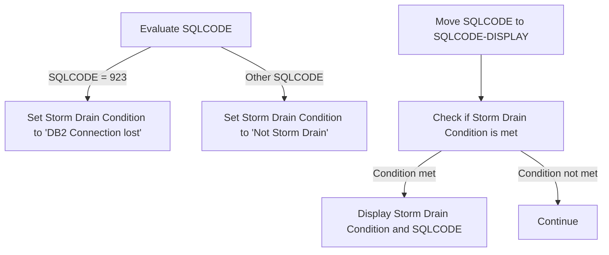

<SwmSnippet path="/src/base/cobol_src/INQACC.cbl" line="604">

---

First, the function evaluates the <SwmToken path="src/base/cobol_src/INQACC.cbl" pos="604:3:3" line-data="           EVALUATE SQLCODE">`SQLCODE`</SwmToken> to determine if it matches specific conditions.

```cobol
           EVALUATE SQLCODE
```

---

</SwmSnippet>

<SwmSnippet path="/src/base/cobol_src/INQACC.cbl" line="606">

---

When the <SwmToken path="src/base/cobol_src/INQACC.cbl" pos="450:3:3" line-data="           IF SQLCODE = +100">`SQLCODE`</SwmToken> is 923, it sets the <SwmToken path="src/base/cobol_src/INQACC.cbl" pos="607:14:18" line-data="                 MOVE &#39;DB2 Connection lost &#39; TO STORM-DRAIN-CONDITION">`STORM-DRAIN-CONDITION`</SwmToken> to '<SwmToken path="src/base/cobol_src/INQACC.cbl" pos="607:4:4" line-data="                 MOVE &#39;DB2 Connection lost &#39; TO STORM-DRAIN-CONDITION">`DB2`</SwmToken> Connection lost'.

```cobol
              WHEN 923
                 MOVE 'DB2 Connection lost ' TO STORM-DRAIN-CONDITION
```

---

</SwmSnippet>

<SwmSnippet path="/src/base/cobol_src/INQACC.cbl" line="609">

---

For any other <SwmToken path="src/base/cobol_src/INQACC.cbl" pos="450:3:3" line-data="           IF SQLCODE = +100">`SQLCODE`</SwmToken>, it sets the <SwmToken path="src/base/cobol_src/INQACC.cbl" pos="610:14:18" line-data="                 MOVE &#39;Not Storm Drain     &#39; TO STORM-DRAIN-CONDITION">`STORM-DRAIN-CONDITION`</SwmToken> to 'Not Storm Drain'.

```cobol
              WHEN OTHER
                 MOVE 'Not Storm Drain     ' TO STORM-DRAIN-CONDITION
```

---

</SwmSnippet>

<SwmSnippet path="/src/base/cobol_src/INQACC.cbl" line="614">

---

Next, the function moves the <SwmToken path="src/base/cobol_src/INQACC.cbl" pos="614:3:3" line-data="           MOVE SQLCODE TO SQLCODE-DISPLAY.">`SQLCODE`</SwmToken> to <SwmToken path="src/base/cobol_src/INQACC.cbl" pos="614:7:9" line-data="           MOVE SQLCODE TO SQLCODE-DISPLAY.">`SQLCODE-DISPLAY`</SwmToken> for logging purposes.

```cobol
           MOVE SQLCODE TO SQLCODE-DISPLAY.
```

---

</SwmSnippet>

<SwmSnippet path="/src/base/cobol_src/INQACC.cbl" line="616">

---

Then, it checks if the <SwmToken path="src/base/cobol_src/INQACC.cbl" pos="616:3:7" line-data="           IF STORM-DRAIN-CONDITION NOT EQUAL &#39;Not Storm Drain     &#39;">`STORM-DRAIN-CONDITION`</SwmToken> is not equal to 'Not Storm Drain'.

```cobol
           IF STORM-DRAIN-CONDITION NOT EQUAL 'Not Storm Drain     '
```

---

</SwmSnippet>

<SwmSnippet path="/src/base/cobol_src/INQACC.cbl" line="617">

---

If the condition is met, it displays a message indicating that a storm drain condition has been met, along with the <SwmToken path="src/base/cobol_src/INQACC.cbl" pos="618:9:13" line-data="                      &#39;Drain condition (&#39; STORM-DRAIN-CONDITION &#39;) &#39;">`STORM-DRAIN-CONDITION`</SwmToken> and <SwmToken path="src/base/cobol_src/INQACC.cbl" pos="619:11:13" line-data="                      &#39;has been met (&#39; SQLCODE-DISPLAY &#39;).&#39;">`SQLCODE-DISPLAY`</SwmToken>.

```cobol
              DISPLAY 'INQACC: Check-For-Storm-Drain-DB2: Storm '
                      'Drain condition (' STORM-DRAIN-CONDITION ') '
                      'has been met (' SQLCODE-DISPLAY ').'
```

---

</SwmSnippet>

<SwmSnippet path="/src/base/cobol_src/INQACC.cbl" line="620">

---

If the condition is not met, the function continues without any further action.

```cobol
           ELSE
              CONTINUE
```

---

</SwmSnippet>

## <SwmToken path="src/base/cobol_src/INQACC.cbl" pos="345:3:5" line-data="           PERFORM FETCH-DATA.">`FETCH-DATA`</SwmToken>

Lets' zoom into this section of the flow:

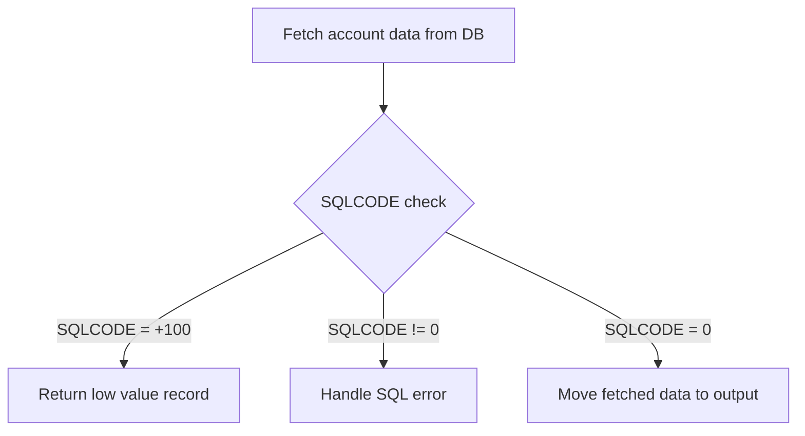

<SwmSnippet path="/src/base/cobol_src/INQACC.cbl" line="431">

---

### Fetching account data from DB

First, the function fetches matching data from the ACCOUNT table using the SQL cursor <SwmToken path="src/base/cobol_src/INQACC.cbl" pos="431:9:11" line-data="           EXEC SQL FETCH FROM ACC-CURSOR">`ACC-CURSOR`</SwmToken>. This retrieves various account details such as customer number, sort code, account number, account type, interest rate, and balances.

```cobol
           EXEC SQL FETCH FROM ACC-CURSOR
              INTO :HV-ACCOUNT-EYECATCHER,
                   :HV-ACCOUNT-CUST-NO,
                   :HV-ACCOUNT-SORTCODE,
                   :HV-ACCOUNT-ACC-NO,
                   :HV-ACCOUNT-ACC-TYPE,
                   :HV-ACCOUNT-INT-RATE,
                   :HV-ACCOUNT-OPENED,
                   :HV-ACCOUNT-OVERDRAFT-LIM,
                   :HV-ACCOUNT-LAST-STMT,
                   :HV-ACCOUNT-NEXT-STMT,
                   :HV-ACCOUNT-AVAIL-BAL,
                   :HV-ACCOUNT-ACTUAL-BAL
```

---

</SwmSnippet>

<SwmSnippet path="/src/base/cobol_src/INQACC.cbl" line="450">

---

### Handling no data found

Next, if no data is found (indicated by <SwmToken path="src/base/cobol_src/INQACC.cbl" pos="450:3:8" line-data="           IF SQLCODE = +100">`SQLCODE = +100`</SwmToken>), the function initializes the <SwmToken path="src/base/cobol_src/INQACC.cbl" pos="452:3:5" line-data="             INITIALIZE OUTPUT-DATA">`OUTPUT-DATA`</SwmToken> structure with low values and moves the sort code and account number to the respective fields in <SwmToken path="src/base/cobol_src/INQACC.cbl" pos="452:3:5" line-data="             INITIALIZE OUTPUT-DATA">`OUTPUT-DATA`</SwmToken>.

```cobol
           IF SQLCODE = +100

             INITIALIZE OUTPUT-DATA
             MOVE SORTCODE TO ACCOUNT-SORT-CODE OF OUTPUT-DATA
             MOVE INQACC-ACCNO TO ACCOUNT-NUMBER OF OUTPUT-DATA

             GO TO FD999
```

---

</SwmSnippet>

<SwmSnippet path="/src/base/cobol_src/INQACC.cbl" line="460">

---

### Handling SQL errors

If an SQL error occurs (indicated by <SwmToken path="src/base/cobol_src/INQACC.cbl" pos="460:3:9" line-data="           IF SQLCODE NOT = 0">`SQLCODE NOT = 0`</SwmToken>), the function performs storm drain processing, populates abend information, and links to the abend handler program to log the error details and terminate the transaction.

```cobol
           IF SQLCODE NOT = 0

      *
      *       Check if SQLCODE indicates that Storm Drain processing
      *       is applicable in a workload if activated
      *
              PERFORM CHECK-FOR-STORM-DRAIN-DB2

              MOVE SQLCODE TO SQLCODE-DISPLAY

      *
      *       Preserve the RESP and RESP2, then set up the
      *       standard ABEND info before getting the applid,
      *       date/time etc. and linking to the Abend Handler
      *       program.
      *
              INITIALIZE ABNDINFO-REC
              MOVE EIBRESP    TO ABND-RESPCODE
              MOVE EIBRESP2   TO ABND-RESP2CODE
      *
      *       Get supplemental information
```

---

</SwmSnippet>

<SwmSnippet path="/src/base/cobol_src/INQACC.cbl" line="534">

---

### Moving fetched data to output

If matching account data is found, the function moves the fetched data from the host variables to the corresponding fields in the <SwmToken path="src/base/cobol_src/INQACC.cbl" pos="535:9:11" line-data="              ACCOUNT-EYE-CATCHER OF OUTPUT-DATA.">`OUTPUT-DATA`</SwmToken> structure. This includes details such as the account eyecatcher, customer number, sort code, account number, account type, interest rate, opened date, overdraft limit, last statement date, next statement date, available balance, and actual balance.

More about ABNDPROC: <SwmLink doc-title="Writing Abend Records (ABNDPROC)">[Writing Abend Records (ABNDPROC)](/.swm/writing-abend-records-abndproc.svfj4jn5.sw.md)</SwmLink>

```cobol
           MOVE HV-ACCOUNT-EYECATCHER TO
              ACCOUNT-EYE-CATCHER OF OUTPUT-DATA.
           MOVE HV-ACCOUNT-CUST-NO TO
              ACCOUNT-CUST-NO OF OUTPUT-DATA.
           MOVE HV-ACCOUNT-SORTCODE TO
              ACCOUNT-SORT-CODE OF OUTPUT-DATA.
           MOVE HV-ACCOUNT-ACC-NO TO
              ACCOUNT-NUMBER OF OUTPUT-DATA.
           MOVE HV-ACCOUNT-ACC-TYPE TO
              ACCOUNT-TYPE OF OUTPUT-DATA.
           MOVE HV-ACCOUNT-INT-RATE TO
              ACCOUNT-INTEREST-RATE OF OUTPUT-DATA.
           MOVE HV-ACCOUNT-OPENED TO DB2-DATE-REFORMAT.
           MOVE DB2-DATE-REF-DAY TO
              ACCOUNT-OPENED-DAY OF OUTPUT-DATA.
           MOVE DB2-DATE-REF-MNTH TO
              ACCOUNT-OPENED-MONTH OF OUTPUT-DATA.
           MOVE DB2-DATE-REF-YR TO
              ACCOUNT-OPENED-YEAR OF OUTPUT-DATA.
           MOVE HV-ACCOUNT-OVERDRAFT-LIM TO
              ACCOUNT-OVERDRAFT-LIMIT OF OUTPUT-DATA.
```

---

</SwmSnippet>

## <SwmToken path="src/base/cobol_src/INQACC.cbl" pos="247:3:11" line-data="           PERFORM GET-ME-OUT-OF-HERE.">`GET-ME-OUT-OF-HERE`</SwmToken>

Lets' zoom into this section of the flow:

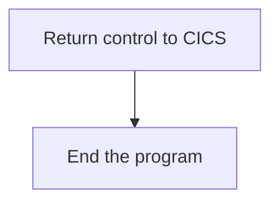

<SwmSnippet path="/src/base/cobol_src/INQACC.cbl" line="578">

---

First, the <SwmToken path="src/base/cobol_src/INQACC.cbl" pos="578:1:9" line-data="       GET-ME-OUT-OF-HERE SECTION.">`GET-ME-OUT-OF-HERE`</SwmToken> section is responsible for returning control back to CICS. This is achieved by executing the <SwmToken path="src/base/cobol_src/INQACC.cbl" pos="584:1:5" line-data="           EXEC CICS RETURN">`EXEC CICS RETURN`</SwmToken> command.

```cobol
       GET-ME-OUT-OF-HERE SECTION.
       GMOFH010.

      *
      *    Return control back to CICS
      *
           EXEC CICS RETURN
           END-EXEC.
```

---

</SwmSnippet>

<SwmSnippet path="/src/base/cobol_src/INQACC.cbl" line="587">

---

Moving to the next step, the <SwmToken path="src/base/cobol_src/INQACC.cbl" pos="587:1:1" line-data="           GOBACK.">`GOBACK`</SwmToken> statement is used to end the program and return control to the calling program or environment.

```cobol
           GOBACK.
```

---

</SwmSnippet>

<SwmSnippet path="/src/base/cobol_src/INQACC.cbl" line="590">

---

Finally, the <SwmToken path="src/base/cobol_src/INQACC.cbl" pos="590:1:1" line-data="           EXIT.">`EXIT`</SwmToken> statement is included to ensure that the program exits cleanly, marking the end of the <SwmToken path="src/base/cobol_src/INQACC.cbl" pos="247:3:11" line-data="           PERFORM GET-ME-OUT-OF-HERE.">`GET-ME-OUT-OF-HERE`</SwmToken> section.

```cobol
           EXIT.
```

---

</SwmSnippet>

&nbsp;

*This is an auto-generated document by Swimm 🌊 and has not yet been verified by a human*

<SwmMeta version="3.0.0" repo-id="Z2l0aHViJTNBJTNBY2ljcy1iYW5raW5nLXNhbXBsZS1hcHBsaWNhdGlvbi1jYnNhLUlCTS1EZW1vJTNBJTNBU3dpbW0tRGVtbw==" repo-name="cics-banking-sample-application-cbsa-IBM-Demo"><sup>Powered by [Swimm](/)</sup></SwmMeta>
