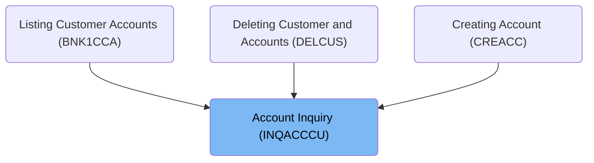
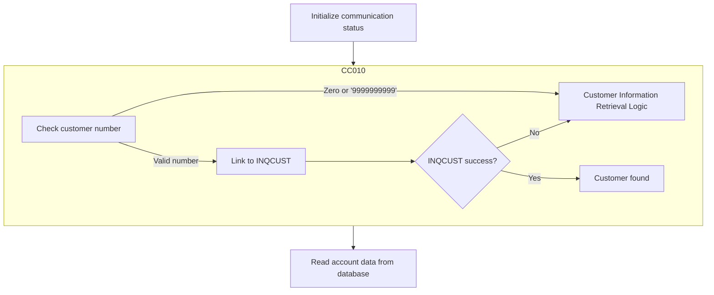
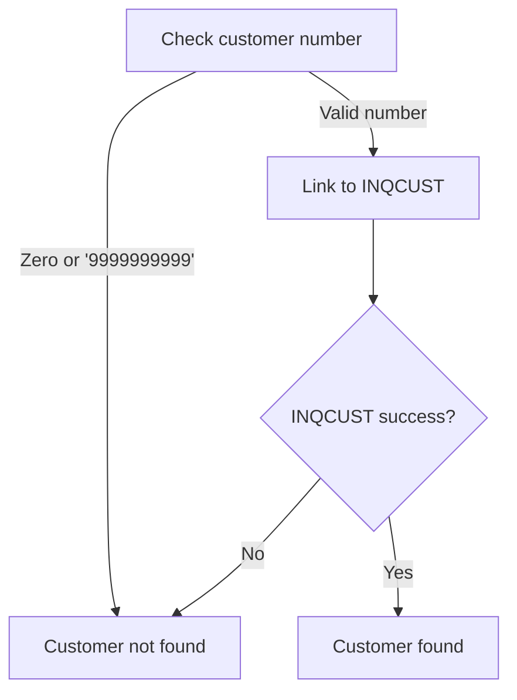
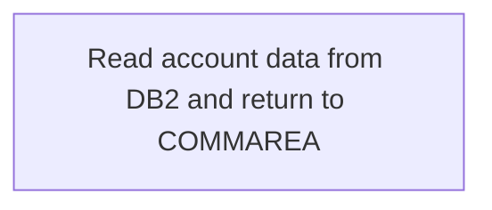
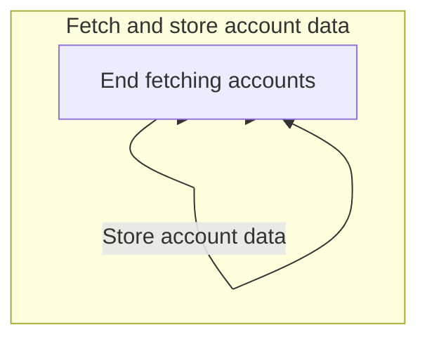

The Account Inquiry (INQACCCU) program is designed to retrieve account information associated with a given customer number. It plays a vital role in the banking application by accessing the datastore to fetch account records linked to the customer. The program is utilized in various operations such as listing customer accounts, deleting customer and accounts, and creating accounts. The flow begins with initializing communication and handling errors, followed by customer information retrieval, and concludes with fetching account data from the database. The input to this flow is a customer number, and the output is the associated account information.

For instance, if a customer number is provided, the program will access the datastore to retrieve all accounts linked to that number, ensuring accurate account management.

# Where is this program used?

This program is used multiple times in the codebase as represented in the following diagram:



# Initializing Communication and Handling Abends



<SwmSnippet path="/src/base/cobol_src/INQACCCU.cbl" line="195">

---

Here, we set up abend handling to manage errors, ensuring the system can handle unexpected terminations gracefully.

```cobol
       A010.
           MOVE 'N' TO COMM-SUCCESS
           MOVE '0' TO COMM-FAIL-CODE

           EXEC CICS HANDLE ABEND
              LABEL(ABEND-HANDLING)
           END-EXEC.
```

---

</SwmSnippet>

<SwmSnippet path="/src/base/cobol_src/INQACCCU.cbl" line="203">

---

Next, we prepare data for customer information retrieval and call <SwmToken path="src/base/cobol_src/INQACCCU.cbl" pos="206:3:5" line-data="      *    CUSTOMER-CHECK LINKS to program INQCUST to retrieve the">`CUSTOMER-CHECK`</SwmToken>, which is crucial for fetching customer details needed for subsequent operations.

```cobol
           MOVE SORTCODE TO REQUIRED-SORT-CODE OF CUSTOMER-KY.

      *
      *    CUSTOMER-CHECK LINKS to program INQCUST to retrieve the
      *    customer information.
      *

           PERFORM CUSTOMER-CHECK.
```

---

</SwmSnippet>

## Customer Information Retrieval Logic



<SwmSnippet path="/src/base/cobol_src/INQACCCU.cbl" line="830">

---

Here, we check for missing customer information and exit if none is found, preventing the system from proceeding with invalid data.

```cobol
       CC010.
      *
      *    Retrieve customer information by linking to INQCUST
      *

           IF CUSTOMER-NUMBER IN DFHCOMMAREA = ZERO
              MOVE 'N' TO CUSTOMER-FOUND
              MOVE ZERO TO NUMBER-OF-ACCOUNTS
              GO TO CC999
           END-IF.
```

---

</SwmSnippet>

<SwmSnippet path="/src/base/cobol_src/INQACCCU.cbl" line="841">

---

Next, we handle specific invalid customer numbers and exit if found, ensuring the system doesn't process incorrect data.

```cobol
           IF CUSTOMER-NUMBER IN DFHCOMMAREA = '9999999999'
              MOVE 'N' TO CUSTOMER-FOUND
              MOVE ZERO TO NUMBER-OF-ACCOUNTS
              GO TO CC999
           END-IF.
```

---

</SwmSnippet>

<SwmSnippet path="/src/base/cobol_src/INQACCCU.cbl" line="847">

---

Next, we link to INQCUST for customer information, transitioning from checking invalid data to retrieving valid details.

```cobol
           INITIALIZE INQCUST-COMMAREA.

           MOVE CUSTOMER-NUMBER IN DFHCOMMAREA TO INQCUST-CUSTNO.

           EXEC CICS LINK PROGRAM('INQCUST ')
              COMMAREA(INQCUST-COMMAREA)
           END-EXEC.
```

---

</SwmSnippet>

<SwmSnippet path="/src/base/cobol_src/INQACCCU.cbl" line="855">

---

Finally, we check the success flag and set the customer found status, determining the outcome of the retrieval process for subsequent operations.

```cobol
           IF INQCUST-INQ-SUCCESS = 'Y'
              MOVE 'Y' TO CUSTOMER-FOUND
           ELSE
              MOVE 'N' TO CUSTOMER-FOUND
              MOVE ZERO TO NUMBER-OF-ACCOUNTS
           END-IF.
```

---

</SwmSnippet>

## Post-Customer Check Account Retrieval



<SwmSnippet path="/src/base/cobol_src/INQACCCU.cbl" line="222">

---

Next, we call <SwmToken path="src/base/cobol_src/INQACCCU.cbl" pos="222:3:7" line-data="           PERFORM READ-ACCOUNT-DB2">`READ-ACCOUNT-DB2`</SwmToken> to retrieve account data, transitioning from customer information to account data processing.

```cobol
           PERFORM READ-ACCOUNT-DB2
      *
      * Return the ACCOUNT data to the COMMAREA
      *

           PERFORM GET-ME-OUT-OF-HERE.
```

---

</SwmSnippet>

# Account Data Fetching Loop



<SwmSnippet path="/src/base/cobol_src/INQACCCU.cbl" line="455">

---

Here, we enter a loop for account data retrieval, ensuring systematic processing of all relevant data.

```cobol
       FD010.
      *
      *    Fetch each account in turn, & store data until there are no
      *    more rows to process. (There is a maximum of 20 accounts per
      *    customer).
      *
           MOVE ZERO TO NUMBER-OF-ACCOUNTS.

           PERFORM UNTIL SQLCODE NOT = 0 OR
           NUMBER-OF-ACCOUNTS = 20
```

---

</SwmSnippet>

<SwmSnippet path="/src/base/cobol_src/INQACCCU.cbl" line="466">

---

Next, we execute SQL fetch to retrieve account data, populating fields for subsequent operations.

```cobol
              EXEC SQL FETCH FROM ACC-CURSOR
              INTO :HV-ACCOUNT-EYECATCHER,
                   :HV-ACCOUNT-CUST-NO,
                   :HV-ACCOUNT-SORTCODE,
                   :HV-ACCOUNT-ACC-NO,
                   :HV-ACCOUNT-ACC-TYPE,
                   :HV-ACCOUNT-INT-RATE,
                   :HV-ACCOUNT-OPENED,
                   :HV-ACCOUNT-OVERDRAFT-LIM,
                   :HV-ACCOUNT-LAST-STMT,
                   :HV-ACCOUNT-NEXT-STMT,
                   :HV-ACCOUNT-AVAIL-BAL,
                   :HV-ACCOUNT-ACTUAL-BAL
              END-EXEC
```

---

</SwmSnippet>

<SwmSnippet path="/src/base/cobol_src/INQACCCU.cbl" line="485">

---

Next, we check SQLCODE for end of data and exit if reached, preventing processing of non-existent data.

```cobol
              IF SQLCODE = +100
                  MOVE 'Y' TO COMM-SUCCESS
                  GO TO FD999
              END-IF
```

---

</SwmSnippet>

<SwmSnippet path="/src/base/cobol_src/INQACCCU.cbl" line="587">

---

Finally, we move account details into communication area, formatting dates, finalizing the account data retrieval process.

```cobol
              MOVE HV-ACCOUNT-EYECATCHER
                 TO COMM-EYE(NUMBER-OF-ACCOUNTS)
              MOVE HV-ACCOUNT-CUST-NO
                  TO COMM-CUSTNO(NUMBER-OF-ACCOUNTS)
              MOVE HV-ACCOUNT-SORTCODE
                  TO COMM-SCODE(NUMBER-OF-ACCOUNTS)
              MOVE HV-ACCOUNT-ACC-NO
                  TO COMM-ACCNO(NUMBER-OF-ACCOUNTS)
              MOVE HV-ACCOUNT-ACC-TYPE
                  TO COMM-ACC-TYPE(NUMBER-OF-ACCOUNTS)
              MOVE HV-ACCOUNT-INT-RATE
                  TO COMM-INT-RATE(NUMBER-OF-ACCOUNTS)
              MOVE HV-ACCOUNT-OPENED TO DB2-DATE-REFORMAT

              STRING DB2-DATE-REF-DAY
                DB2-DATE-REF-MNTH
                DB2-DATE-REF-YR
                DELIMITED BY SIZE
                INTO COMM-OPENED(NUMBER-OF-ACCOUNTS)
              END-STRING

              MOVE HV-ACCOUNT-OVERDRAFT-LIM
                 TO COMM-OVERDRAFT(NUMBER-OF-ACCOUNTS)
              MOVE HV-ACCOUNT-LAST-STMT TO DB2-DATE-REFORMAT

              STRING DB2-DATE-REF-DAY
                 DB2-DATE-REF-MNTH
                 DB2-DATE-REF-YR
                 DELIMITED BY SIZE
                 INTO COMM-LAST-STMT-DT(NUMBER-OF-ACCOUNTS)
              END-STRING

              MOVE HV-ACCOUNT-NEXT-STMT TO DB2-DATE-REFORMAT

              STRING DB2-DATE-REF-DAY
                 DB2-DATE-REF-MNTH
                 DB2-DATE-REF-YR
                 DELIMITED BY SIZE
                 INTO COMM-NEXT-STMT-DT(NUMBER-OF-ACCOUNTS)
              END-STRING

              MOVE HV-ACCOUNT-ACTUAL-BAL
                 TO COMM-ACTUAL-BAL(NUMBER-OF-ACCOUNTS)
              MOVE HV-ACCOUNT-AVAIL-BAL
                 TO COMM-AVAIL-BAL(NUMBER-OF-ACCOUNTS)

           END-PERFORM.
```

---

</SwmSnippet>

&nbsp;

*This is an auto-generated document by Swimm 🌊 and has not yet been verified by a human*

<SwmMeta version="3.0.0" repo-id="Z2l0aHViJTNBJTNBY2ljcy1iYW5raW5nLXNhbXBsZS1hcHBsaWNhdGlvbi1jYnNhLUlCTS1EZW1vJTNBJTNBU3dpbW0tRGVtbw==" repo-name="cics-banking-sample-application-cbsa-IBM-Demo"><sup>Powered by [Swimm](/)</sup></SwmMeta>
