The INQACCCU program is responsible for retrieving customer account information. It plays a crucial role in the system by ensuring that customer details are accurately fetched for further processing. This is achieved through a series of steps including initializing communication, handling abnormal terminations, setting required sort codes, retrieving customer information, and reading account data from the <SwmToken path="src/base/cobol_src/INQACCCU.cbl" pos="259:11:11" line-data="              PERFORM CHECK-FOR-STORM-DRAIN-DB2">`DB2`</SwmToken> database.

The flow starts by initializing communication and setting up ABEND handling to manage any abnormal terminations. It then sets the required sort code and retrieves customer information using the INQCUST program. If a matching customer is found, it proceeds to read account data from the <SwmToken path="src/base/cobol_src/INQACCCU.cbl" pos="259:11:11" line-data="              PERFORM CHECK-FOR-STORM-DRAIN-DB2">`DB2`</SwmToken> database. If no matching customer is found, it sets failure flags and exits the process. The program also includes sections for handling SQL errors, fetching account data, and returning control to the CICS environment after completing its operations.

# Where is this program used?

This program is used multiple times in the codebase as represented in the following diagram:

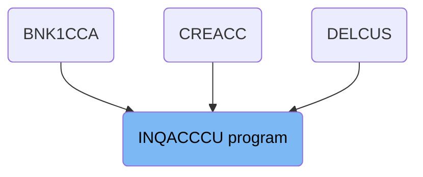

## PREMIERE

Lets' zoom into this section of the flow:

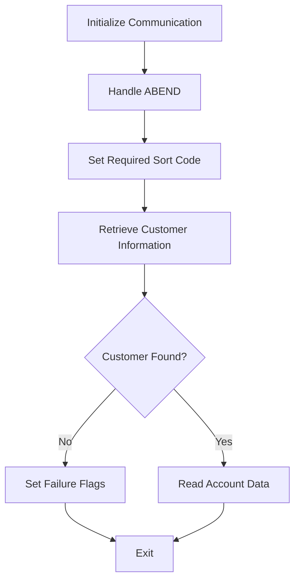

First, the section initializes communication by setting the <SwmToken path="src/base/cobol_src/INQACCCU.cbl" pos="196:9:11" line-data="           MOVE &#39;N&#39; TO COMM-SUCCESS">`COMM-SUCCESS`</SwmToken> to 'N' and <SwmToken path="src/base/cobol_src/INQACCCU.cbl" pos="197:9:13" line-data="           MOVE &#39;0&#39; TO COMM-FAIL-CODE">`COMM-FAIL-CODE`</SwmToken> to '0'. This ensures that any previous communication statuses do not interfere with the current operation.

Moving to the next step, the section sets up ABEND handling by linking to the <SwmToken path="src/base/cobol_src/INQACCCU.cbl" pos="200:3:5" line-data="              LABEL(ABEND-HANDLING)">`ABEND-HANDLING`</SwmToken> label. This ensures that any abnormal terminations are properly managed.

Next, the section sets the <SwmToken path="src/base/cobol_src/INQACCCU.cbl" pos="203:7:11" line-data="           MOVE SORTCODE TO REQUIRED-SORT-CODE OF CUSTOMER-KY.">`REQUIRED-SORT-CODE`</SwmToken> of the <SwmToken path="src/base/cobol_src/INQACCCU.cbl" pos="203:15:17" line-data="           MOVE SORTCODE TO REQUIRED-SORT-CODE OF CUSTOMER-KY.">`CUSTOMER-KY`</SwmToken> to the value of <SwmToken path="src/base/cobol_src/INQACCCU.cbl" pos="203:3:3" line-data="           MOVE SORTCODE TO REQUIRED-SORT-CODE OF CUSTOMER-KY.">`SORTCODE`</SwmToken>. This prepares the necessary data for the customer information retrieval process.

<SwmSnippet path="/src/base/cobol_src/INQACCCU.cbl" line="194">

---

Then, the section performs the <SwmToken path="src/base/cobol_src/INQACCCU.cbl" pos="206:3:5" line-data="      *    CUSTOMER-CHECK LINKS to program INQCUST to retrieve the">`CUSTOMER-CHECK`</SwmToken> to retrieve customer information by linking to the <SwmToken path="src/base/cobol_src/INQACCCU.cbl" pos="206:13:13" line-data="      *    CUSTOMER-CHECK LINKS to program INQCUST to retrieve the">`INQCUST`</SwmToken> program. This step is crucial as it fetches the customer details needed for further processing.

More about INQCUST: <SwmLink doc-title="Customer Inquiry (INQCUST)">[Customer Inquiry (INQCUST)](/.swm/customer-inquiry-inqcust.kzcrsldz.sw.md)</SwmLink>

```cobol
       PREMIERE SECTION.
       A010.
           MOVE 'N' TO COMM-SUCCESS
           MOVE '0' TO COMM-FAIL-CODE

           EXEC CICS HANDLE ABEND
              LABEL(ABEND-HANDLING)
           END-EXEC.

           MOVE SORTCODE TO REQUIRED-SORT-CODE OF CUSTOMER-KY.

      *
      *    CUSTOMER-CHECK LINKS to program INQCUST to retrieve the
      *    customer information.
      *

           PERFORM CUSTOMER-CHECK.

      *
      *    If a  matching customer was not returned then set fail flags
      *
```

---

</SwmSnippet>

If a matching customer is not found, the section sets the <SwmToken path="src/base/cobol_src/INQACCCU.cbl" pos="196:9:11" line-data="           MOVE &#39;N&#39; TO COMM-SUCCESS">`COMM-SUCCESS`</SwmToken> to 'N' and <SwmToken path="src/base/cobol_src/INQACCCU.cbl" pos="197:9:13" line-data="           MOVE &#39;0&#39; TO COMM-FAIL-CODE">`COMM-FAIL-CODE`</SwmToken> to '1', indicating a failure in retrieving customer information. It then performs the <SwmToken path="src/base/cobol_src/INQACCCU.cbl" pos="638:1:9" line-data="       GET-ME-OUT-OF-HERE SECTION.">`GET-ME-OUT-OF-HERE`</SwmToken> to exit the process.

If a matching customer is found, the section proceeds to perform the <SwmToken path="src/base/cobol_src/INQACCCU.cbl" pos="222:3:7" line-data="           PERFORM READ-ACCOUNT-DB2">`READ-ACCOUNT-DB2`</SwmToken> to retrieve account details from the <SwmToken path="src/base/cobol_src/INQACCCU.cbl" pos="259:11:11" line-data="              PERFORM CHECK-FOR-STORM-DRAIN-DB2">`DB2`</SwmToken> database. This step is essential for obtaining the account data associated with the customer.

## <SwmToken path="src/base/cobol_src/INQACCCU.cbl" pos="206:3:5" line-data="      *    CUSTOMER-CHECK LINKS to program INQCUST to retrieve the">`CUSTOMER-CHECK`</SwmToken>

Lets' zoom into this section of the flow:

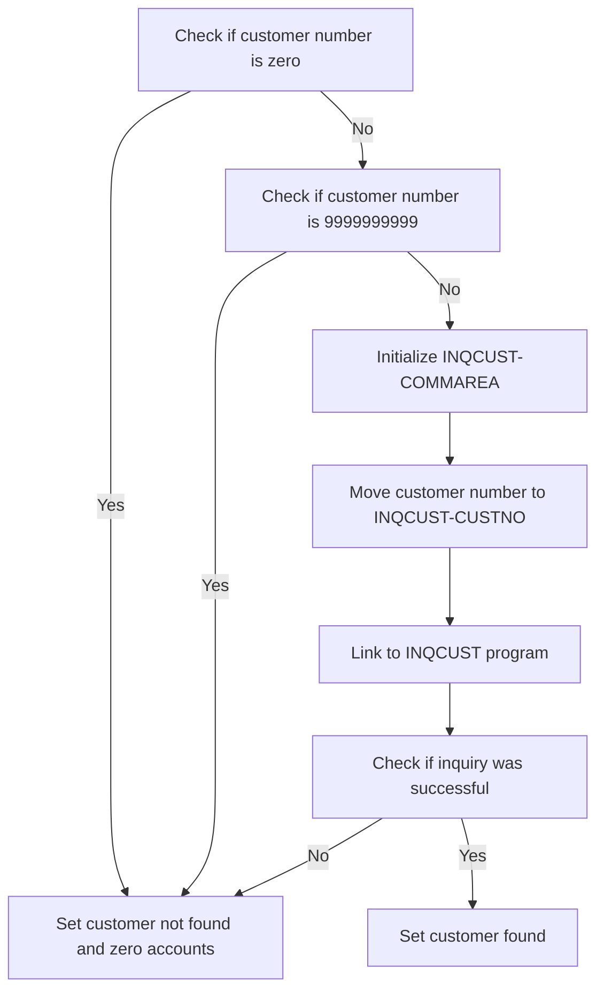

<SwmSnippet path="/src/base/cobol_src/INQACCCU.cbl" line="835">

---

First, we check if the customer number is zero. If it is, we set the customer as not found and the number of accounts to zero.

```cobol
           IF CUSTOMER-NUMBER IN DFHCOMMAREA = ZERO
              MOVE 'N' TO CUSTOMER-FOUND
              MOVE ZERO TO NUMBER-OF-ACCOUNTS
              GO TO CC999
           END-IF.
```

---

</SwmSnippet>

<SwmSnippet path="/src/base/cobol_src/INQACCCU.cbl" line="841">

---

Next, we check if the customer number is '9999999999'. If it is, we again set the customer as not found and the number of accounts to zero.

```cobol
           IF CUSTOMER-NUMBER IN DFHCOMMAREA = '9999999999'
              MOVE 'N' TO CUSTOMER-FOUND
              MOVE ZERO TO NUMBER-OF-ACCOUNTS
              GO TO CC999
           END-IF.
```

---

</SwmSnippet>

<SwmSnippet path="/src/base/cobol_src/INQACCCU.cbl" line="847">

---

Then, we initialize the communication area for the INQCUST program.

```cobol
           INITIALIZE INQCUST-COMMAREA.
```

---

</SwmSnippet>

<SwmSnippet path="/src/base/cobol_src/INQACCCU.cbl" line="849">

---

Moving to the next step, we move the customer number to the INQCUST communication area.

```cobol
           MOVE CUSTOMER-NUMBER IN DFHCOMMAREA TO INQCUST-CUSTNO.
```

---

</SwmSnippet>

<SwmSnippet path="/src/base/cobol_src/INQACCCU.cbl" line="851">

---

We then link to the INQCUST program to retrieve the customer information.

More about INQCUST: <SwmLink doc-title="Customer Inquiry (INQCUST)">[Customer Inquiry (INQCUST)](/.swm/customer-inquiry-inqcust.kzcrsldz.sw.md)</SwmLink>

```cobol
           EXEC CICS LINK PROGRAM('INQCUST ')
              COMMAREA(INQCUST-COMMAREA)
           END-EXEC.
```

---

</SwmSnippet>

<SwmSnippet path="/src/base/cobol_src/INQACCCU.cbl" line="855">

---

Finally, we check if the inquiry was successful. If it was, we set the customer as found. Otherwise, we set the customer as not found and the number of accounts to zero.

```cobol
           IF INQCUST-INQ-SUCCESS = 'Y'
              MOVE 'Y' TO CUSTOMER-FOUND
           ELSE
              MOVE 'N' TO CUSTOMER-FOUND
              MOVE ZERO TO NUMBER-OF-ACCOUNTS
           END-IF.
```

---

</SwmSnippet>

## Interim Summary

So far, we saw how the <SwmToken path="src/base/cobol_src/INQACCCU.cbl" pos="206:3:5" line-data="      *    CUSTOMER-CHECK LINKS to program INQCUST to retrieve the">`CUSTOMER-CHECK`</SwmToken> section verifies the customer number and retrieves customer information using the <SwmToken path="src/base/cobol_src/INQACCCU.cbl" pos="206:13:13" line-data="      *    CUSTOMER-CHECK LINKS to program INQCUST to retrieve the">`INQCUST`</SwmToken> program. This process ensures that the customer details are accurately fetched for further processing. Now, we will focus on the <SwmToken path="src/base/cobol_src/INQACCCU.cbl" pos="638:1:9" line-data="       GET-ME-OUT-OF-HERE SECTION.">`GET-ME-OUT-OF-HERE`</SwmToken> section, which handles the return of control to the CICS environment after completing the operations.

## <SwmToken path="src/base/cobol_src/INQACCCU.cbl" pos="638:1:9" line-data="       GET-ME-OUT-OF-HERE SECTION.">`GET-ME-OUT-OF-HERE`</SwmToken>

Lets' zoom into this section of the flow:

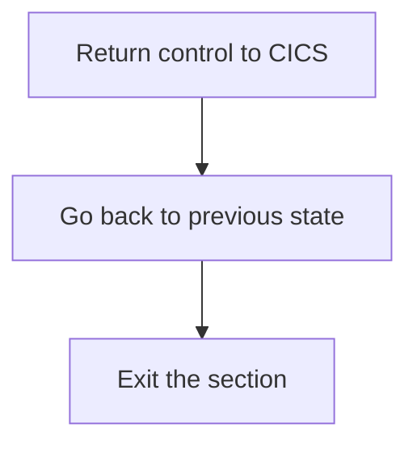

<SwmSnippet path="/src/base/cobol_src/INQACCCU.cbl" line="638">

---

### Returning control to CICS

First, the <SwmToken path="src/base/cobol_src/INQACCCU.cbl" pos="638:1:9" line-data="       GET-ME-OUT-OF-HERE SECTION.">`GET-ME-OUT-OF-HERE`</SwmToken> section is designed to return control back to the CICS environment. This is crucial for ensuring that the program hands back control to the CICS system after completing its operations.

```cobol
       GET-ME-OUT-OF-HERE SECTION.
       GMOFH010.
```

---

</SwmSnippet>

<SwmSnippet path="/src/base/cobol_src/INQACCCU.cbl" line="643">

---

### Executing the CICS RETURN command

Moving to the next step, the <SwmToken path="src/base/cobol_src/INQACCCU.cbl" pos="643:1:5" line-data="           EXEC CICS RETURN">`EXEC CICS RETURN`</SwmToken> command is executed. This command is essential as it signals the end of the current task and returns control to the CICS region, allowing other tasks to be processed.

```cobol
           EXEC CICS RETURN
           END-EXEC.
```

---

</SwmSnippet>

<SwmSnippet path="/src/base/cobol_src/INQACCCU.cbl" line="646">

---

### Going back to the previous state

Next, the <SwmToken path="src/base/cobol_src/INQACCCU.cbl" pos="646:1:1" line-data="           GOBACK.">`GOBACK`</SwmToken> statement is used to return to the previous state or calling program. This ensures that the program flow is correctly managed and that control is handed back appropriately.

```cobol
           GOBACK.
```

---

</SwmSnippet>

<SwmSnippet path="/src/base/cobol_src/INQACCCU.cbl" line="649">

---

### Exiting the section

Finally, the <SwmToken path="src/base/cobol_src/INQACCCU.cbl" pos="649:1:1" line-data="           EXIT.">`EXIT`</SwmToken> statement is executed to exit the <SwmToken path="src/base/cobol_src/INQACCCU.cbl" pos="638:1:9" line-data="       GET-ME-OUT-OF-HERE SECTION.">`GET-ME-OUT-OF-HERE`</SwmToken> section. This marks the end of the section and ensures that no further code in this section is executed.

```cobol
           EXIT.
```

---

</SwmSnippet>

# Retrieve Account (<SwmToken path="src/base/cobol_src/INQACCCU.cbl" pos="222:3:7" line-data="           PERFORM READ-ACCOUNT-DB2">`READ-ACCOUNT-DB2`</SwmToken>)

Let's split this section into smaller parts:

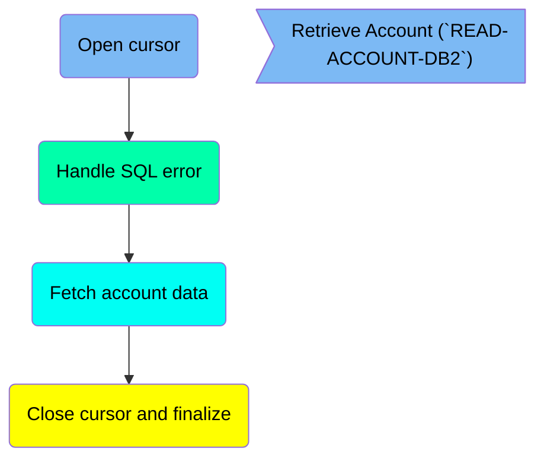

## Open cursor

First, we'll zoom into this section of the flow:

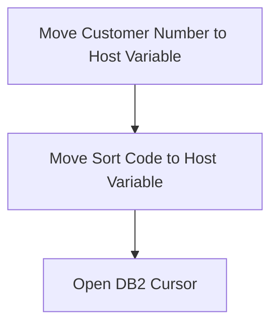

<SwmSnippet path="/src/base/cobol_src/INQACCCU.cbl" line="243">

---

First, the customer number is moved from the communication area (<SwmToken path="src/base/cobol_src/INQACCCU.cbl" pos="243:9:9" line-data="           MOVE CUSTOMER-NUMBER IN DFHCOMMAREA TO HV-ACCOUNT-CUST-NO.">`DFHCOMMAREA`</SwmToken>) to the host variable <SwmToken path="src/base/cobol_src/INQACCCU.cbl" pos="243:13:19" line-data="           MOVE CUSTOMER-NUMBER IN DFHCOMMAREA TO HV-ACCOUNT-CUST-NO.">`HV-ACCOUNT-CUST-NO`</SwmToken>. This step ensures that the correct customer number is used for the database query.

```cobol
           MOVE CUSTOMER-NUMBER IN DFHCOMMAREA TO HV-ACCOUNT-CUST-NO.
```

---

</SwmSnippet>

<SwmSnippet path="/src/base/cobol_src/INQACCCU.cbl" line="244">

---

Next, the sort code is moved to the host variable <SwmToken path="src/base/cobol_src/INQACCCU.cbl" pos="244:7:11" line-data="           MOVE  SORTCODE TO HV-ACCOUNT-SORTCODE.">`HV-ACCOUNT-SORTCODE`</SwmToken>. This step is crucial for specifying the sort code in the database query, which helps in retrieving the correct account details.

```cobol
           MOVE  SORTCODE TO HV-ACCOUNT-SORTCODE.
```

---

</SwmSnippet>

<SwmSnippet path="/src/base/cobol_src/INQACCCU.cbl" line="246">

---

Then, the <SwmToken path="src/base/cobol_src/INQACCCU.cbl" pos="259:11:11" line-data="              PERFORM CHECK-FOR-STORM-DRAIN-DB2">`DB2`</SwmToken> cursor <SwmToken path="src/base/cobol_src/INQACCCU.cbl" pos="247:1:3" line-data="              ACC-CURSOR">`ACC-CURSOR`</SwmToken> is opened. Opening the cursor is essential for executing the SQL query that retrieves the account details associated with the specified customer number and sort code.

```cobol
           EXEC SQL OPEN
              ACC-CURSOR
           END-EXEC.
```

---

</SwmSnippet>

## Handle SQL error

Now, lets zoom into this section of the flow:

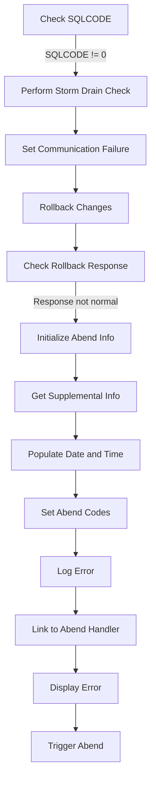

<SwmSnippet path="/src/base/cobol_src/INQACCCU.cbl" line="250">

---

First, the code checks the <SwmToken path="src/base/cobol_src/INQACCCU.cbl" pos="250:3:3" line-data="           MOVE SQLCODE TO SQLCODE-DISPLAY.">`SQLCODE`</SwmToken> to determine if the database read operation was successful.

```cobol
           MOVE SQLCODE TO SQLCODE-DISPLAY.

           IF SQLCODE NOT = 0
```

---

</SwmSnippet>

<SwmSnippet path="/src/base/cobol_src/INQACCCU.cbl" line="258">

---

Moving to the next step, if the <SwmToken path="src/base/cobol_src/INQACCCU.cbl" pos="250:3:3" line-data="           MOVE SQLCODE TO SQLCODE-DISPLAY.">`SQLCODE`</SwmToken> is not zero, it indicates an error, and the code performs a storm drain check to handle workload processing.

```cobol
      *
              PERFORM CHECK-FOR-STORM-DRAIN-DB2
```

---

</SwmSnippet>

<SwmSnippet path="/src/base/cobol_src/INQACCCU.cbl" line="261">

---

Next, the code sets communication-related flags to indicate failure and resets the number of accounts to zero.

```cobol
              MOVE 'N'  TO COMM-SUCCESS
              MOVE 'N'  TO CUSTOMER-FOUND
              MOVE '2'  TO COMM-FAIL-CODE
              MOVE ZERO TO NUMBER-OF-ACCOUNTS
```

---

</SwmSnippet>

<SwmSnippet path="/src/base/cobol_src/INQACCCU.cbl" line="266">

---

Then, it attempts to rollback any changes made during the transaction to maintain data integrity.

```cobol
              EXEC CICS SYNCPOINT ROLLBACK
                RESP(WS-CICS-RESP)
                RESP2(WS-CICS-RESP2)
              END-EXEC
```

---

</SwmSnippet>

<SwmSnippet path="/src/base/cobol_src/INQACCCU.cbl" line="271">

---

Going into the next step, if the rollback response is not normal, the code initializes the abend (abnormal end) information.

```cobol
              IF WS-CICS-RESP NOT = DFHRESP(NORMAL)
      *
      *          Preserve the RESP and RESP2, then set up the
      *          standard ABEND info before getting the applid,
      *          date/time etc. and linking to the Abend Handler
      *          program.
      *
                 INITIALIZE ABNDINFO-REC
```

---

</SwmSnippet>

<SwmSnippet path="/src/base/cobol_src/INQACCCU.cbl" line="284">

---

Diving into the details, it retrieves supplemental information such as application ID, task number, and transaction ID.

```cobol
                 EXEC CICS ASSIGN APPLID(ABND-APPLID)
                 END-EXEC

                 MOVE EIBTASKN   TO ABND-TASKNO-KEY
                 MOVE EIBTRNID   TO ABND-TRANID

```

---

</SwmSnippet>

<SwmSnippet path="/src/base/cobol_src/INQACCCU.cbl" line="290">

---

The code then populates the current date and time for logging purposes.

```cobol
                 PERFORM POPULATE-TIME-DATE

                 MOVE WS-ORIG-DATE TO ABND-DATE
                 STRING WS-TIME-NOW-GRP-HH DELIMITED BY SIZE,
                       ':' DELIMITED BY SIZE,
                        WS-TIME-NOW-GRP-MM DELIMITED BY SIZE,
                        ':' DELIMITED BY SIZE,
                        WS-TIME-NOW-GRP-MM DELIMITED BY SIZE
                        INTO ABND-TIME
```

---

</SwmSnippet>

<SwmSnippet path="/src/base/cobol_src/INQACCCU.cbl" line="301">

---

It sets specific abend codes to help identify the type of error that occurred.

```cobol
                 MOVE WS-U-TIME   TO ABND-UTIME-KEY
                 MOVE 'HROL'      TO ABND-CODE

```

---

</SwmSnippet>

<SwmSnippet path="/src/base/cobol_src/INQACCCU.cbl" line="309">

---

Next, the code logs a detailed error message that includes the SQLCODE and response codes.

```cobol
                 STRING 'RAD010 - Unable to perform Synpoint Rollback'
                       DELIMITED BY SIZE,
                       '. Possible Integrity issue following DB2 '
                       DELIMITED BY SIZE,
                       'CURSOR OPEN' DELIMITED BY SIZE,
                       'EIBRESP=' DELIMITED BY SIZE,
                       ABND-RESPCODE DELIMITED BY SIZE,
                       ' RESP2=' DELIMITED BY SIZE,
                       ABND-RESP2CODE DELIMITED BY SIZE
                       INTO ABND-FREEFORM
```

---

</SwmSnippet>

<SwmSnippet path="/src/base/cobol_src/INQACCCU.cbl" line="321">

---

It then links to the abend handler program to process the abnormal termination.

```cobol
                 EXEC CICS LINK PROGRAM(WS-ABEND-PGM)
                           COMMAREA(ABNDINFO-REC)
                 END-EXEC
```

---

</SwmSnippet>

<SwmSnippet path="/src/base/cobol_src/INQACCCU.cbl" line="326">

---

Finally, the code displays an error message and triggers an abend to terminate the transaction.

```cobol
                 DISPLAY 'INQACCCU: Unable to perform Synpoint Rollback'
                 '. Possible Integrity issue following DB2 CURSOR OPEN'
                 ' SQLCODE=' SQLCODE-DISPLAY
                 ',RESP=' WS-CICS-RESP
                 ',RESP2=' WS-CICS-RESP2
                 EXEC CICS ABEND
                    ABCODE ('HROL')
                    CANCEL
                 END-EXEC
```

---

</SwmSnippet>

## Fetch account data

Now, lets zoom into this section of the flow:

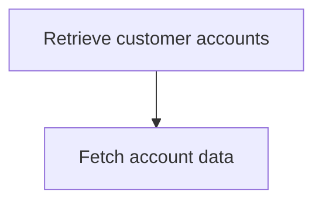

<SwmSnippet path="/src/base/cobol_src/INQACCCU.cbl" line="340">

---

The <SwmToken path="src/base/cobol_src/INQACCCU.cbl" pos="222:3:7" line-data="           PERFORM READ-ACCOUNT-DB2">`READ-ACCOUNT-DB2`</SwmToken> function is responsible for retrieving each of the accounts associated with a specific customer. This is achieved by performing the <SwmToken path="src/base/cobol_src/INQACCCU.cbl" pos="343:3:5" line-data="           PERFORM FETCH-DATA.">`FETCH-DATA`</SwmToken> operation, which fetches the account details from the database.

```cobol
      *
      *    Retrieve each of the accounts associated with this customer
      *
           PERFORM FETCH-DATA.
```

---

</SwmSnippet>

## Close cursor and finalize

Now, lets zoom into this section of the flow:

```mermaid
graph TD
  A[Close DB2 Cursor] --> B{SQLCODE = 0?}
  B -- No --> C[Move SQLCODE to SQLCODE-DISPLAY]
  C --> D[Display Failure Message]
  D --> E[Perform CHECK-FOR-STORM-DRAIN-DB2]
  E --> F[Move 'N' to COMM-SUCCESS]
  F --> G[Move 'N' to CUSTOMER-FOUND]
  G --> H[Move '4' to COMM-FAIL-CODE]
  H --> I[Execute CICS SYNCPOINT ROLLBACK]
  I --> J{WS-CICS-RESP = DFHRESP(NORMAL)?}
  J -- No --> K[Initialize ABNDINFO-REC]
  K --> L[Move EIBRESP to ABND-RESPCODE]
  L --> M[Move EIBRESP2 to ABND-RESP2CODE]
  M --> N[Execute CICS ASSIGN APPLID]
  N --> O[Move EIBTASKN to ABND-TASKNO-KEY]
  O --> P[Move EIBTRNID to ABND-TRANID]
  P --> Q[Perform POPULATE-TIME-DATE]
  Q --> R[Move WS-ORIG-DATE to ABND-DATE]
  R --> S[Create ABND-TIME String]
  S --> T[Move WS-U-TIME to ABND-UTIME-KEY]
  T --> U[Move 'HROL' to ABND-CODE]
  U --> V[Execute CICS ASSIGN PROGRAM]
  V --> W[Move ZEROS to ABND-SQLCODE]
  W --> X[Create ABND-FREEFORM String]
  X --> Y[Execute CICS LINK PROGRAM]
  Y --> Z[Display Syncpoint Rollback Failure]
  Z --> AA[Execute CICS ABEND]
  AA --> AB[Go to RAD999]
  J -- Yes --> AC[Move 'Y' to COMM-SUCCESS]

%% Swimm:
%% graph TD
%%   A[Close <SwmToken path="src/base/cobol_src/INQACCCU.cbl" pos="259:11:11" line-data="              PERFORM CHECK-FOR-STORM-DRAIN-DB2">`DB2`</SwmToken> Cursor] --> B{SQLCODE = 0?}
%%   B -- No --> C[Move SQLCODE to <SwmToken path="src/base/cobol_src/INQACCCU.cbl" pos="250:7:9" line-data="           MOVE SQLCODE TO SQLCODE-DISPLAY.">`SQLCODE-DISPLAY`</SwmToken>]
%%   C --> D[Display Failure Message]
%%   D --> E[Perform <SwmToken path="src/base/cobol_src/INQACCCU.cbl" pos="259:3:11" line-data="              PERFORM CHECK-FOR-STORM-DRAIN-DB2">`CHECK-FOR-STORM-DRAIN-DB2`</SwmToken>]
%%   E --> F[Move 'N' to <SwmToken path="src/base/cobol_src/INQACCCU.cbl" pos="196:9:11" line-data="           MOVE &#39;N&#39; TO COMM-SUCCESS">`COMM-SUCCESS`</SwmToken>]
%%   F --> G[Move 'N' to <SwmToken path="src/base/cobol_src/INQACCCU.cbl" pos="262:9:11" line-data="              MOVE &#39;N&#39;  TO CUSTOMER-FOUND">`CUSTOMER-FOUND`</SwmToken>]
%%   G --> H[Move '4' to <SwmToken path="src/base/cobol_src/INQACCCU.cbl" pos="197:9:13" line-data="           MOVE &#39;0&#39; TO COMM-FAIL-CODE">`COMM-FAIL-CODE`</SwmToken>]
%%   H --> I[Execute CICS SYNCPOINT ROLLBACK]
%%   I --> J{WS-CICS-RESP = DFHRESP(NORMAL)?}
%%   J -- No --> K[Initialize <SwmToken path="src/base/cobol_src/INQACCCU.cbl" pos="278:3:5" line-data="                 INITIALIZE ABNDINFO-REC">`ABNDINFO-REC`</SwmToken>]
%%   K --> L[Move EIBRESP to <SwmToken path="src/base/cobol_src/INQACCCU.cbl" pos="315:1:3" line-data="                       ABND-RESPCODE DELIMITED BY SIZE,">`ABND-RESPCODE`</SwmToken>]
%%   L --> M[Move <SwmToken path="src/base/cobol_src/INQACCCU.cbl" pos="280:3:3" line-data="                 MOVE EIBRESP2   TO ABND-RESP2CODE">`EIBRESP2`</SwmToken> to <SwmToken path="src/base/cobol_src/INQACCCU.cbl" pos="317:1:3" line-data="                       ABND-RESP2CODE DELIMITED BY SIZE">`ABND-RESP2CODE`</SwmToken>]
%%   M --> N[Execute CICS ASSIGN APPLID]
%%   N --> O[Move EIBTASKN to <SwmToken path="src/base/cobol_src/INQACCCU.cbl" pos="287:7:11" line-data="                 MOVE EIBTASKN   TO ABND-TASKNO-KEY">`ABND-TASKNO-KEY`</SwmToken>]
%%   O --> P[Move EIBTRNID to <SwmToken path="src/base/cobol_src/INQACCCU.cbl" pos="288:7:9" line-data="                 MOVE EIBTRNID   TO ABND-TRANID">`ABND-TRANID`</SwmToken>]
%%   P --> Q[Perform <SwmToken path="src/base/cobol_src/INQACCCU.cbl" pos="290:3:7" line-data="                 PERFORM POPULATE-TIME-DATE">`POPULATE-TIME-DATE`</SwmToken>]
%%   Q --> R[Move <SwmToken path="src/base/cobol_src/INQACCCU.cbl" pos="292:3:7" line-data="                 MOVE WS-ORIG-DATE TO ABND-DATE">`WS-ORIG-DATE`</SwmToken> to <SwmToken path="src/base/cobol_src/INQACCCU.cbl" pos="292:11:13" line-data="                 MOVE WS-ORIG-DATE TO ABND-DATE">`ABND-DATE`</SwmToken>]
%%   R --> S[Create <SwmToken path="src/base/cobol_src/INQACCCU.cbl" pos="298:3:5" line-data="                        INTO ABND-TIME">`ABND-TIME`</SwmToken> String]
%%   S --> T[Move <SwmToken path="src/base/cobol_src/INQACCCU.cbl" pos="301:3:7" line-data="                 MOVE WS-U-TIME   TO ABND-UTIME-KEY">`WS-U-TIME`</SwmToken> to <SwmToken path="src/base/cobol_src/INQACCCU.cbl" pos="301:11:15" line-data="                 MOVE WS-U-TIME   TO ABND-UTIME-KEY">`ABND-UTIME-KEY`</SwmToken>]
%%   T --> U[Move 'HROL' to <SwmToken path="src/base/cobol_src/INQACCCU.cbl" pos="302:9:11" line-data="                 MOVE &#39;HROL&#39;      TO ABND-CODE">`ABND-CODE`</SwmToken>]
%%   U --> V[Execute CICS ASSIGN PROGRAM]
%%   V --> W[Move ZEROS to <SwmToken path="src/base/cobol_src/INQACCCU.cbl" pos="307:7:9" line-data="                 MOVE ZEROS      TO ABND-SQLCODE">`ABND-SQLCODE`</SwmToken>]
%%   W --> X[Create <SwmToken path="src/base/cobol_src/INQACCCU.cbl" pos="318:3:5" line-data="                       INTO ABND-FREEFORM">`ABND-FREEFORM`</SwmToken> String]
%%   X --> Y[Execute CICS LINK PROGRAM]
%%   Y --> Z[Display Syncpoint Rollback Failure]
%%   Z --> AA[Execute CICS ABEND]
%%   AA --> AB[Go to <SwmToken path="src/base/cobol_src/INQACCCU.cbl" pos="337:5:5" line-data="              GO TO RAD999">`RAD999`</SwmToken>]
%%   J -- Yes --> AC[Move 'Y' to <SwmToken path="src/base/cobol_src/INQACCCU.cbl" pos="196:9:11" line-data="           MOVE &#39;N&#39; TO COMM-SUCCESS">`COMM-SUCCESS`</SwmToken>]
```

First, the <SwmToken path="src/base/cobol_src/INQACCCU.cbl" pos="259:11:11" line-data="              PERFORM CHECK-FOR-STORM-DRAIN-DB2">`DB2`</SwmToken> cursor is closed to ensure that no further database operations are performed using this cursor.

Next, we check if the <SwmToken path="src/base/cobol_src/INQACCCU.cbl" pos="250:3:3" line-data="           MOVE SQLCODE TO SQLCODE-DISPLAY.">`SQLCODE`</SwmToken> (which indicates the result of the SQL operation) is not equal to 0, which would signify an error.

If an error is detected, the <SwmToken path="src/base/cobol_src/INQACCCU.cbl" pos="250:3:3" line-data="           MOVE SQLCODE TO SQLCODE-DISPLAY.">`SQLCODE`</SwmToken> is moved to <SwmToken path="src/base/cobol_src/INQACCCU.cbl" pos="250:7:9" line-data="           MOVE SQLCODE TO SQLCODE-DISPLAY.">`SQLCODE-DISPLAY`</SwmToken> for logging purposes.

A failure message is then displayed to indicate that there was an issue when attempting to close the <SwmToken path="src/base/cobol_src/INQACCCU.cbl" pos="259:11:11" line-data="              PERFORM CHECK-FOR-STORM-DRAIN-DB2">`DB2`</SwmToken> cursor.

The <SwmToken path="src/base/cobol_src/INQACCCU.cbl" pos="259:3:11" line-data="              PERFORM CHECK-FOR-STORM-DRAIN-DB2">`CHECK-FOR-STORM-DRAIN-DB2`</SwmToken> routine is performed to handle any specific workload processing that might be applicable.

We then set <SwmToken path="src/base/cobol_src/INQACCCU.cbl" pos="196:9:11" line-data="           MOVE &#39;N&#39; TO COMM-SUCCESS">`COMM-SUCCESS`</SwmToken> to 'N' to indicate that the operation was not successful.

Similarly, <SwmToken path="src/base/cobol_src/INQACCCU.cbl" pos="262:9:11" line-data="              MOVE &#39;N&#39;  TO CUSTOMER-FOUND">`CUSTOMER-FOUND`</SwmToken> is set to 'N' to indicate that no customer data was found.

The <SwmToken path="src/base/cobol_src/INQACCCU.cbl" pos="197:9:13" line-data="           MOVE &#39;0&#39; TO COMM-FAIL-CODE">`COMM-FAIL-CODE`</SwmToken> is set to '4' to represent a specific failure code for communication.

A CICS SYNCPOINT ROLLBACK is executed to revert any changes made during the transaction to maintain data integrity.

We then check if the <SwmToken path="src/base/cobol_src/INQACCCU.cbl" pos="267:3:7" line-data="                RESP(WS-CICS-RESP)">`WS-CICS-RESP`</SwmToken> (which holds the response code from the CICS command) is not equal to <SwmToken path="src/base/cobol_src/INQACCCU.cbl" pos="271:13:16" line-data="              IF WS-CICS-RESP NOT = DFHRESP(NORMAL)">`DFHRESP(NORMAL)`</SwmToken>, indicating an abnormal response.

If the response is abnormal, the <SwmToken path="src/base/cobol_src/INQACCCU.cbl" pos="278:3:5" line-data="                 INITIALIZE ABNDINFO-REC">`ABNDINFO-REC`</SwmToken> is initialized to prepare for abnormal end (abend) processing.

The <SwmToken path="src/base/cobol_src/INQACCCU.cbl" pos="314:2:2" line-data="                       &#39;EIBRESP=&#39; DELIMITED BY SIZE,">`EIBRESP`</SwmToken> and <SwmToken path="src/base/cobol_src/INQACCCU.cbl" pos="280:3:3" line-data="                 MOVE EIBRESP2   TO ABND-RESP2CODE">`EIBRESP2`</SwmToken> values are moved to <SwmToken path="src/base/cobol_src/INQACCCU.cbl" pos="315:1:3" line-data="                       ABND-RESPCODE DELIMITED BY SIZE,">`ABND-RESPCODE`</SwmToken> and <SwmToken path="src/base/cobol_src/INQACCCU.cbl" pos="317:1:3" line-data="                       ABND-RESP2CODE DELIMITED BY SIZE">`ABND-RESP2CODE`</SwmToken> respectively for logging.

The <SwmToken path="src/base/cobol_src/INQACCCU.cbl" pos="284:3:7" line-data="                 EXEC CICS ASSIGN APPLID(ABND-APPLID)">`CICS ASSIGN APPLID`</SwmToken> command is executed to get the application ID and store it in <SwmToken path="src/base/cobol_src/INQACCCU.cbl" pos="284:9:11" line-data="                 EXEC CICS ASSIGN APPLID(ABND-APPLID)">`ABND-APPLID`</SwmToken>.

The <SwmToken path="src/base/cobol_src/INQACCCU.cbl" pos="287:3:3" line-data="                 MOVE EIBTASKN   TO ABND-TASKNO-KEY">`EIBTASKN`</SwmToken> and <SwmToken path="src/base/cobol_src/INQACCCU.cbl" pos="288:3:3" line-data="                 MOVE EIBTRNID   TO ABND-TRANID">`EIBTRNID`</SwmToken> values are moved to <SwmToken path="src/base/cobol_src/INQACCCU.cbl" pos="287:7:11" line-data="                 MOVE EIBTASKN   TO ABND-TASKNO-KEY">`ABND-TASKNO-KEY`</SwmToken> and <SwmToken path="src/base/cobol_src/INQACCCU.cbl" pos="288:7:9" line-data="                 MOVE EIBTRNID   TO ABND-TRANID">`ABND-TRANID`</SwmToken> respectively for logging.

The <SwmToken path="src/base/cobol_src/INQACCCU.cbl" pos="290:3:7" line-data="                 PERFORM POPULATE-TIME-DATE">`POPULATE-TIME-DATE`</SwmToken> routine is performed to get the current date and time.

The <SwmToken path="src/base/cobol_src/INQACCCU.cbl" pos="292:3:7" line-data="                 MOVE WS-ORIG-DATE TO ABND-DATE">`WS-ORIG-DATE`</SwmToken> is moved to <SwmToken path="src/base/cobol_src/INQACCCU.cbl" pos="292:11:13" line-data="                 MOVE WS-ORIG-DATE TO ABND-DATE">`ABND-DATE`</SwmToken> to log the original date of the transaction.

A string is created for <SwmToken path="src/base/cobol_src/INQACCCU.cbl" pos="298:3:5" line-data="                        INTO ABND-TIME">`ABND-TIME`</SwmToken> using the current time values.

The <SwmToken path="src/base/cobol_src/INQACCCU.cbl" pos="301:3:7" line-data="                 MOVE WS-U-TIME   TO ABND-UTIME-KEY">`WS-U-TIME`</SwmToken> is moved to <SwmToken path="src/base/cobol_src/INQACCCU.cbl" pos="301:11:15" line-data="                 MOVE WS-U-TIME   TO ABND-UTIME-KEY">`ABND-UTIME-KEY`</SwmToken> to log the universal time.

The <SwmToken path="src/base/cobol_src/INQACCCU.cbl" pos="302:9:11" line-data="                 MOVE &#39;HROL&#39;      TO ABND-CODE">`ABND-CODE`</SwmToken> is set to 'HROL' to represent a specific abend code.

The <SwmToken path="src/base/cobol_src/INQACCCU.cbl" pos="304:3:7" line-data="                 EXEC CICS ASSIGN PROGRAM(ABND-PROGRAM)">`CICS ASSIGN PROGRAM`</SwmToken> command is executed to get the program name and store it in <SwmToken path="src/base/cobol_src/INQACCCU.cbl" pos="304:9:11" line-data="                 EXEC CICS ASSIGN PROGRAM(ABND-PROGRAM)">`ABND-PROGRAM`</SwmToken>.

The <SwmToken path="src/base/cobol_src/INQACCCU.cbl" pos="307:7:9" line-data="                 MOVE ZEROS      TO ABND-SQLCODE">`ABND-SQLCODE`</SwmToken> is set to zeros to indicate no SQL error.

A string is created for <SwmToken path="src/base/cobol_src/INQACCCU.cbl" pos="318:3:5" line-data="                       INTO ABND-FREEFORM">`ABND-FREEFORM`</SwmToken> to log a detailed error message.

The <SwmToken path="src/base/cobol_src/INQACCCU.cbl" pos="321:3:7" line-data="                 EXEC CICS LINK PROGRAM(WS-ABEND-PGM)">`CICS LINK PROGRAM`</SwmToken> command is executed to link to the abend handler program with the <SwmToken path="src/base/cobol_src/INQACCCU.cbl" pos="278:3:5" line-data="                 INITIALIZE ABNDINFO-REC">`ABNDINFO-REC`</SwmToken>.

A failure message is displayed to indicate that the syncpoint rollback failed, potentially causing data integrity issues.

Finally, the <SwmToken path="src/base/cobol_src/INQACCCU.cbl" pos="331:3:5" line-data="                 EXEC CICS ABEND">`CICS ABEND`</SwmToken> command is executed to abnormally terminate the transaction with the code 'HROL'.

## <SwmToken path="src/base/cobol_src/INQACCCU.cbl" pos="259:3:11" line-data="              PERFORM CHECK-FOR-STORM-DRAIN-DB2">`CHECK-FOR-STORM-DRAIN-DB2`</SwmToken>

Lets' zoom into this section of the flow:

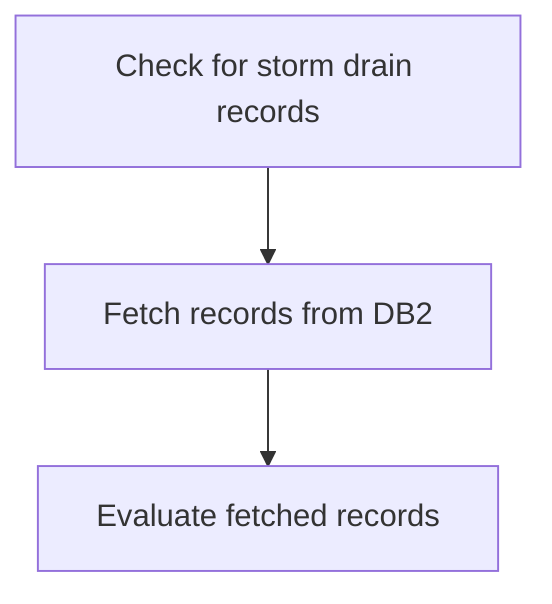

<SwmSnippet path="/src/base/cobol_src/INQACCCU.cbl" line="815">

---

The <SwmToken path="src/base/cobol_src/INQACCCU.cbl" pos="259:3:11" line-data="              PERFORM CHECK-FOR-STORM-DRAIN-DB2">`CHECK-FOR-STORM-DRAIN-DB2`</SwmToken> function is responsible for checking if there are any storm drain records in the <SwmToken path="src/base/cobol_src/INQACCCU.cbl" pos="259:11:11" line-data="              PERFORM CHECK-FOR-STORM-DRAIN-DB2">`DB2`</SwmToken> database. It starts by fetching the relevant records from the database using a SQL query. Once the records are fetched, the function evaluates the fetched records to determine if any storm drain records exist. This evaluation helps in identifying the presence of storm drain records, which is crucial for further processing and decision-making within the application.

```cobol
           END-EVALUATE.

           IF WS-STORM-DRAIN = 'N'
              EXEC CICS ABEND
                 ABCODE( MY-ABEND-CODE)
                 NODUMP
                 CANCEL
              END-EXEC
           END-IF.

       AH999.
           EXIT.


       CUSTOMER-CHECK SECTION.
       CC010.
      *
      *    Retrieve customer information by linking to INQCUST
      *

           IF CUSTOMER-NUMBER IN DFHCOMMAREA = ZERO
```

---

</SwmSnippet>

## <SwmToken path="src/base/cobol_src/INQACCCU.cbl" pos="290:3:7" line-data="                 PERFORM POPULATE-TIME-DATE">`POPULATE-TIME-DATE`</SwmToken>

Lets' zoom into this section of the flow:

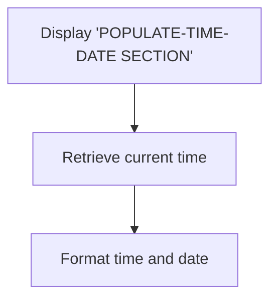

<SwmSnippet path="/src/base/cobol_src/INQACCCU.cbl" line="867">

---

First, the section displays the message '<SwmToken path="src/base/cobol_src/INQACCCU.cbl" pos="868:6:10" line-data="      D    DISPLAY &#39;POPULATE-TIME-DATE SECTION&#39;.">`POPULATE-TIME-DATE`</SwmToken> SECTION' to indicate that the process of updating the current date and time has started.

```cobol
       PTD010.
      D    DISPLAY 'POPULATE-TIME-DATE SECTION'.
```

---

</SwmSnippet>

<SwmSnippet path="/src/base/cobol_src/INQACCCU.cbl" line="870">

---

Moving to the next step, the program retrieves the current time using the <SwmToken path="src/base/cobol_src/INQACCCU.cbl" pos="870:1:5" line-data="           EXEC CICS ASKTIME">`EXEC CICS ASKTIME`</SwmToken> command, which stores the time in the <SwmToken path="src/base/cobol_src/INQACCCU.cbl" pos="871:3:7" line-data="              ABSTIME(WS-U-TIME)">`WS-U-TIME`</SwmToken> variable.

```cobol
           EXEC CICS ASKTIME
              ABSTIME(WS-U-TIME)
           END-EXEC.
```

---

</SwmSnippet>

<SwmSnippet path="/src/base/cobol_src/INQACCCU.cbl" line="874">

---

Next, the program formats the retrieved time and date using the <SwmToken path="src/base/cobol_src/INQACCCU.cbl" pos="874:1:5" line-data="           EXEC CICS FORMATTIME">`EXEC CICS FORMATTIME`</SwmToken> command. This command converts the absolute time in <SwmToken path="src/base/cobol_src/INQACCCU.cbl" pos="875:3:7" line-data="                     ABSTIME(WS-U-TIME)">`WS-U-TIME`</SwmToken> to a more readable format, storing the date in <SwmToken path="src/base/cobol_src/INQACCCU.cbl" pos="876:3:7" line-data="                     DDMMYYYY(WS-ORIG-DATE)">`WS-ORIG-DATE`</SwmToken> and the time in <SwmToken path="src/base/cobol_src/INQACCCU.cbl" pos="877:3:7" line-data="                     TIME(WS-TIME-NOW)">`WS-TIME-NOW`</SwmToken>.

```cobol
           EXEC CICS FORMATTIME
                     ABSTIME(WS-U-TIME)
                     DDMMYYYY(WS-ORIG-DATE)
                     TIME(WS-TIME-NOW)
                     DATESEP
           END-EXEC.
```

---

</SwmSnippet>

<SwmSnippet path="/src/base/cobol_src/INQACCCU.cbl" line="881">

---

Finally, the section ends with the <SwmToken path="src/base/cobol_src/INQACCCU.cbl" pos="882:1:1" line-data="           EXIT.">`EXIT`</SwmToken> statement, indicating the completion of the date and time update process.

```cobol
       PTD999.
           EXIT.
```

---

</SwmSnippet>

## <SwmToken path="src/base/cobol_src/INQACCCU.cbl" pos="343:3:5" line-data="           PERFORM FETCH-DATA.">`FETCH-DATA`</SwmToken>

Lets' zoom into this section of the flow:

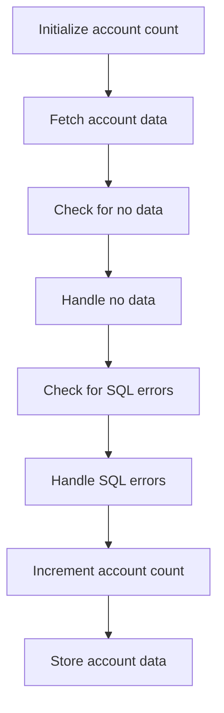

<SwmSnippet path="/src/base/cobol_src/INQACCCU.cbl" line="461">

---

First, the section initializes the account count to zero, preparing to fetch account data.

```cobol
           MOVE ZERO TO NUMBER-OF-ACCOUNTS.
```

---

</SwmSnippet>

<SwmSnippet path="/src/base/cobol_src/INQACCCU.cbl" line="463">

---

Next, it enters a loop to fetch account data until there are no more rows to process or a maximum of 20 accounts is reached.

```cobol
           PERFORM UNTIL SQLCODE NOT = 0 OR
           NUMBER-OF-ACCOUNTS = 20
```

---

</SwmSnippet>

<SwmSnippet path="/src/base/cobol_src/INQACCCU.cbl" line="466">

---

The section fetches account data from the database cursor and stores it in host variables.

```cobol
              EXEC SQL FETCH FROM ACC-CURSOR
              INTO :HV-ACCOUNT-EYECATCHER,
                   :HV-ACCOUNT-CUST-NO,
                   :HV-ACCOUNT-SORTCODE,
                   :HV-ACCOUNT-ACC-NO,
                   :HV-ACCOUNT-ACC-TYPE,
                   :HV-ACCOUNT-INT-RATE,
                   :HV-ACCOUNT-OPENED,
                   :HV-ACCOUNT-OVERDRAFT-LIM,
                   :HV-ACCOUNT-LAST-STMT,
                   :HV-ACCOUNT-NEXT-STMT,
                   :HV-ACCOUNT-AVAIL-BAL,
                   :HV-ACCOUNT-ACTUAL-BAL
```

---

</SwmSnippet>

<SwmSnippet path="/src/base/cobol_src/INQACCCU.cbl" line="485">

---

If no data is found, it sets a success flag and exits the loop.

```cobol
              IF SQLCODE = +100
                  MOVE 'Y' TO COMM-SUCCESS
                  GO TO FD999
              END-IF
```

---

</SwmSnippet>

<SwmSnippet path="/src/base/cobol_src/INQACCCU.cbl" line="490">

---

If an SQL error occurs, it logs the error, performs a rollback, and handles the error by setting appropriate flags and calling the abnormal termination handler.

```cobol
              IF SQLCODE NOT = 0
                 MOVE SQLCODE TO SQLCODE-DISPLAY

                 DISPLAY 'Failure when attempting to FETCH from the'
                    ' DB2 CURSOR ACC-CURSOR. With SQL code='
                    SQLCODE-DISPLAY
      *
      *          Check if SQLCODE indicates that Storm Drain processing
      *          is applicable in a workload if activated
      *
                 PERFORM CHECK-FOR-STORM-DRAIN-DB2

                 MOVE 'N'  TO COMM-SUCCESS
                 MOVE 'N'  TO CUSTOMER-FOUND
                 MOVE ZERO TO NUMBER-OF-ACCOUNTS
                 MOVE '3' TO COMM-FAIL-CODE

                 EXEC CICS SYNCPOINT
                    ROLLBACK
                    RESP(WS-CICS-RESP)
                    RESP2(WS-CICS-RESP2)
```

---

</SwmSnippet>

<SwmSnippet path="/src/base/cobol_src/INQACCCU.cbl" line="583">

---

Then, it increments the account count for each successfully fetched account.

```cobol
              ADD 1 TO NUMBER-OF-ACCOUNTS GIVING NUMBER-OF-ACCOUNTS
```

---

</SwmSnippet>

<SwmSnippet path="/src/base/cobol_src/INQACCCU.cbl" line="587">

---

Finally, it stores the fetched account data into communication fields for further processing.

```cobol
              MOVE HV-ACCOUNT-EYECATCHER
                 TO COMM-EYE(NUMBER-OF-ACCOUNTS)
              MOVE HV-ACCOUNT-CUST-NO
                  TO COMM-CUSTNO(NUMBER-OF-ACCOUNTS)
              MOVE HV-ACCOUNT-SORTCODE
                  TO COMM-SCODE(NUMBER-OF-ACCOUNTS)
              MOVE HV-ACCOUNT-ACC-NO
                  TO COMM-ACCNO(NUMBER-OF-ACCOUNTS)
              MOVE HV-ACCOUNT-ACC-TYPE
                  TO COMM-ACC-TYPE(NUMBER-OF-ACCOUNTS)
              MOVE HV-ACCOUNT-INT-RATE
                  TO COMM-INT-RATE(NUMBER-OF-ACCOUNTS)
              MOVE HV-ACCOUNT-OPENED TO DB2-DATE-REFORMAT

              STRING DB2-DATE-REF-DAY
                DB2-DATE-REF-MNTH
                DB2-DATE-REF-YR
                DELIMITED BY SIZE
                INTO COMM-OPENED(NUMBER-OF-ACCOUNTS)
              END-STRING

```

---

</SwmSnippet>

&nbsp;

*This is an auto-generated document by Swimm 🌊 and has not yet been verified by a human*

<SwmMeta version="3.0.0" repo-id="Z2l0aHViJTNBJTNBY2ljcy1iYW5raW5nLXNhbXBsZS1hcHBsaWNhdGlvbi1jYnNhLUlCTS1EZW1vJTNBJTNBU3dpbW0tRGVtbw==" repo-name="cics-banking-sample-application-cbsa-IBM-Demo"><sup>Powered by [Swimm](/)</sup></SwmMeta>
