The <SwmToken path="src/base/cobol_src/BNK1CCA.cbl" pos="285:4:4" line-data="              MOVE &#39;BNK1CCA - A010 - RETURN TRANSID(OCCA) FAIL&#39; TO">`BNK1CCA`</SwmToken> program is responsible for handling various key events and interactions within the CICS Bank Sample Application. It ensures smooth operation by managing initial setups, processing key presses, handling errors, and terminating sessions. The program achieves this by evaluating key events, performing necessary actions, and maintaining communication with the CICS system.

The <SwmToken path="src/base/cobol_src/BNK1CCA.cbl" pos="285:4:4" line-data="              MOVE &#39;BNK1CCA - A010 - RETURN TRANSID(OCCA) FAIL&#39; TO">`BNK1CCA`</SwmToken> program starts by setting up initial values and checking if it's the first iteration. It then handles different key events such as PA keys, PF3 key, terminate keys, clear key, and enter key. For each key event, the program performs specific actions like sending maps, returning to the main menu, or processing content. If an invalid key is pressed, it sets an error message and triggers an alarm. The program also includes error handling routines to manage abnormal terminations and ensure proper logging of errors.

Here is a high level diagram of the program:

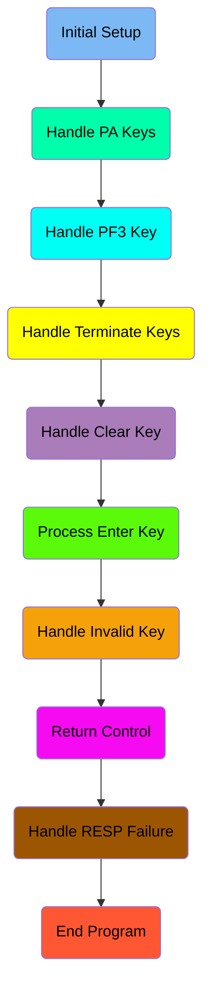

## Initial Setup

First, we'll zoom into this section of the flow:

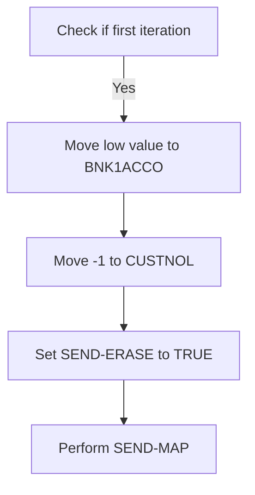

<SwmSnippet path="/src/base/cobol_src/BNK1CCA.cbl" line="162">

---

First, the code checks if it is the first time through by evaluating if <SwmToken path="src/base/cobol_src/BNK1CCA.cbl" pos="162:3:3" line-data="              WHEN EIBCALEN = ZERO">`EIBCALEN`</SwmToken> (the length of the communication area) is zero.

```cobol
              WHEN EIBCALEN = ZERO
```

---

</SwmSnippet>

<SwmSnippet path="/src/base/cobol_src/BNK1CCA.cbl" line="163">

---

Next, if it is the first iteration, the code moves a low value to <SwmToken path="src/base/cobol_src/BNK1CCA.cbl" pos="163:9:9" line-data="                 MOVE LOW-VALUE TO BNK1ACCO">`BNK1ACCO`</SwmToken> (which likely represents an account number), sets <SwmToken path="src/base/cobol_src/BNK1CCA.cbl" pos="164:8:8" line-data="                 MOVE -1 TO CUSTNOL">`CUSTNOL`</SwmToken> (customer number) to -1, sets the <SwmToken path="src/base/cobol_src/BNK1CCA.cbl" pos="165:3:5" line-data="                 SET SEND-ERASE TO TRUE">`SEND-ERASE`</SwmToken> flag to true, and performs the <SwmToken path="src/base/cobol_src/BNK1CCA.cbl" pos="166:3:5" line-data="                 PERFORM SEND-MAP">`SEND-MAP`</SwmToken> operation to send the map with erased (empty) data fields.

```cobol
                 MOVE LOW-VALUE TO BNK1ACCO
                 MOVE -1 TO CUSTNOL
                 SET SEND-ERASE TO TRUE
                 PERFORM SEND-MAP
```

---

</SwmSnippet>

## Handle PA Keys

Now, lets zoom into this section of the flow:

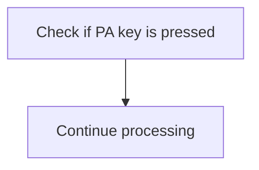

<SwmSnippet path="/src/base/cobol_src/BNK1CCA.cbl" line="171">

---

The code checks if any of the PA keys (Program Attention keys) are pressed by evaluating the <SwmToken path="src/base/cobol_src/BNK1CCA.cbl" pos="171:3:3" line-data="              WHEN EIBAID = DFHPA1 OR DFHPA2 OR DFHPA3">`EIBAID`</SwmToken> variable against <SwmToken path="src/base/cobol_src/BNK1CCA.cbl" pos="171:7:7" line-data="              WHEN EIBAID = DFHPA1 OR DFHPA2 OR DFHPA3">`DFHPA1`</SwmToken>, <SwmToken path="src/base/cobol_src/BNK1CCA.cbl" pos="171:11:11" line-data="              WHEN EIBAID = DFHPA1 OR DFHPA2 OR DFHPA3">`DFHPA2`</SwmToken>, or <SwmToken path="src/base/cobol_src/BNK1CCA.cbl" pos="171:15:15" line-data="              WHEN EIBAID = DFHPA1 OR DFHPA2 OR DFHPA3">`DFHPA3`</SwmToken>. If any of these keys are pressed, the program will simply continue processing without taking any additional action. This ensures that the program does not interrupt its flow when a PA key is pressed, allowing the user to continue their operations seamlessly.

```cobol
              WHEN EIBAID = DFHPA1 OR DFHPA2 OR DFHPA3
                 CONTINUE
```

---

</SwmSnippet>

## Handle PF3 Key

Now, lets zoom into this section of the flow:

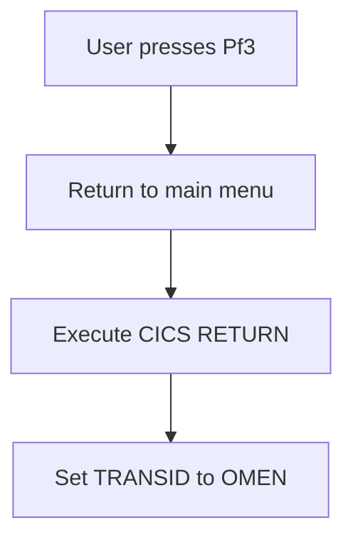

<SwmSnippet path="/src/base/cobol_src/BNK1CCA.cbl" line="177">

---

When the user presses the <SwmToken path="src/base/cobol_src/BNK1CCA.cbl" pos="175:5:5" line-data="      *       When Pf3 is pressed, return to the main menu">`Pf3`</SwmToken> key, the system initiates a return to the main menu. This is achieved by executing the <SwmToken path="src/base/cobol_src/BNK1CCA.cbl" pos="178:3:5" line-data="                 EXEC CICS RETURN">`CICS RETURN`</SwmToken> command, which sets the transaction ID to 'OMEN'. This ensures that the user is immediately redirected to the main menu, providing a seamless navigation experience.

```cobol
              WHEN EIBAID = DFHPF3
                 EXEC CICS RETURN
                    TRANSID('OMEN')
                    IMMEDIATE
                    RESP(WS-CICS-RESP)
                    RESP2(WS-CICS-RESP2)
                 END-EXEC
```

---

</SwmSnippet>

## Handle Terminate Keys

Now, lets zoom into this section of the flow:

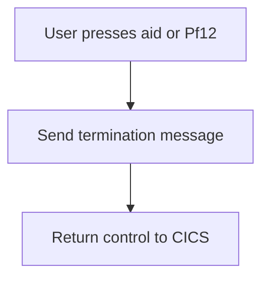

<SwmSnippet path="/src/base/cobol_src/BNK1CCA.cbl" line="189">

---

When the user presses either the aid key or <SwmToken path="src/base/cobol_src/BNK1CCA.cbl" pos="186:11:11" line-data="      *       If the aid or Pf12 is pressed, then send a termination">`Pf12`</SwmToken>, the system recognizes this as a termination request. The system then sends a termination message to notify the user that the session is ending. Finally, control is returned to CICS to complete the termination process.

```cobol
              WHEN EIBAID = DFHAID OR DFHPF12
                 PERFORM SEND-TERMINATION-MSG
                 EXEC CICS
                    RETURN
                 END-EXEC
```

---

</SwmSnippet>

## Handle Clear Key

Now, lets zoom into this section of the flow:

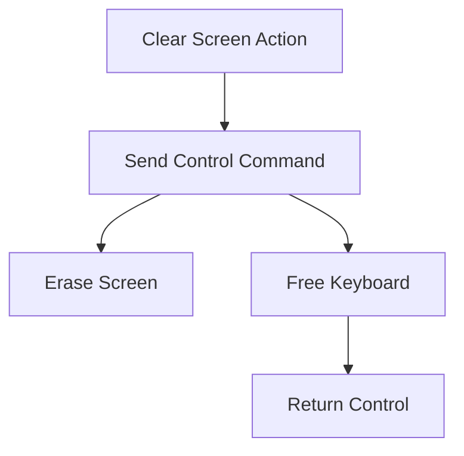

<SwmSnippet path="/src/base/cobol_src/BNK1CCA.cbl" line="198">

---

First, the function checks if the <SwmToken path="src/base/cobol_src/BNK1CCA.cbl" pos="196:5:5" line-data="      *       When CLEAR is pressed">`CLEAR`</SwmToken> key was pressed by evaluating if <SwmToken path="src/base/cobol_src/BNK1CCA.cbl" pos="198:3:3" line-data="              WHEN EIBAID = DFHCLEAR">`EIBAID`</SwmToken> (which holds the attention identifier) is equal to <SwmToken path="src/base/cobol_src/BNK1CCA.cbl" pos="198:7:7" line-data="              WHEN EIBAID = DFHCLEAR">`DFHCLEAR`</SwmToken> (the identifier for the clear key).

```cobol
              WHEN EIBAID = DFHCLEAR
```

---

</SwmSnippet>

<SwmSnippet path="/src/base/cobol_src/BNK1CCA.cbl" line="199">

---

Next, if the <SwmToken path="src/base/cobol_src/BNK1CCA.cbl" pos="196:5:5" line-data="      *       When CLEAR is pressed">`CLEAR`</SwmToken> key was pressed, the function sends a control command to erase the screen and free the keyboard using the <SwmToken path="src/base/cobol_src/BNK1CCA.cbl" pos="199:1:7" line-data="                 EXEC CICS SEND CONTROL">`EXEC CICS SEND CONTROL`</SwmToken> command with the <SwmToken path="src/base/cobol_src/BNK1CCA.cbl" pos="200:1:1" line-data="                          ERASE">`ERASE`</SwmToken> and <SwmToken path="src/base/cobol_src/BNK1CCA.cbl" pos="201:1:1" line-data="                          FREEKB">`FREEKB`</SwmToken> options. Finally, it returns control to CICS using the <SwmToken path="src/base/cobol_src/BNK1CCA.cbl" pos="204:1:5" line-data="                 EXEC CICS RETURN">`EXEC CICS RETURN`</SwmToken> command.

```cobol
                 EXEC CICS SEND CONTROL
                          ERASE
                          FREEKB
                 END-EXEC

                 EXEC CICS RETURN
                 END-EXEC
```

---

</SwmSnippet>

## Process Enter Key

Now, lets zoom into this section of the flow:

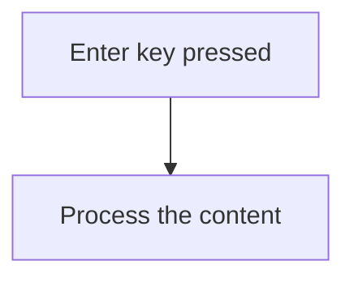

<SwmSnippet path="/src/base/cobol_src/BNK1CCA.cbl" line="210">

---

### Processing the content

When the enter key is pressed, the system triggers the processing of the content. This is done by checking if <SwmToken path="src/base/cobol_src/BNK1CCA.cbl" pos="210:3:3" line-data="              WHEN EIBAID = DFHENTER">`EIBAID`</SwmToken> (which holds the attention identifier) is equal to <SwmToken path="src/base/cobol_src/BNK1CCA.cbl" pos="210:7:7" line-data="              WHEN EIBAID = DFHENTER">`DFHENTER`</SwmToken> (the constant for the enter key). If this condition is met, the <SwmToken path="src/base/cobol_src/BNK1CCA.cbl" pos="211:3:5" line-data="                  PERFORM PROCESS-MAP">`PROCESS-MAP`</SwmToken> routine is performed, which handles the necessary actions for processing the content.

```cobol
              WHEN EIBAID = DFHENTER
                  PERFORM PROCESS-MAP
```

---

</SwmSnippet>

## Handle Invalid Key

Now, lets zoom into this section of the flow:

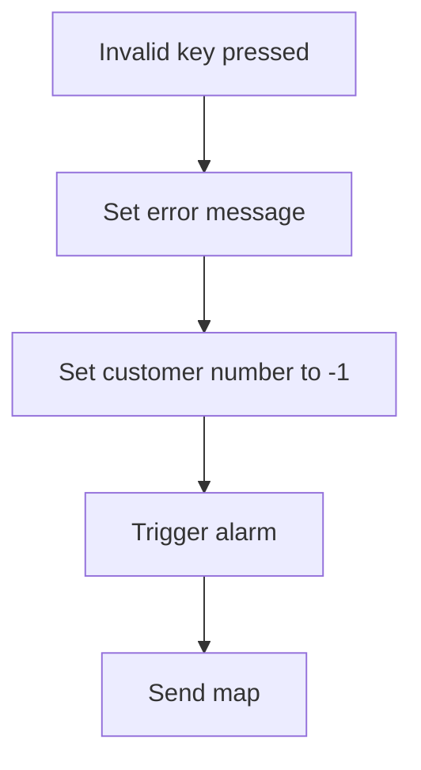

<SwmSnippet path="/src/base/cobol_src/BNK1CCA.cbl" line="216">

---

When an invalid key is pressed, the system sets the <SwmToken path="src/base/cobol_src/BNK1CCA.cbl" pos="218:14:14" line-data="                 MOVE &#39;Invalid key pressed.&#39; TO MESSAGEO">`MESSAGEO`</SwmToken> to 'Invalid key pressed.' to inform the user of the error. It then sets the <SwmToken path="src/base/cobol_src/BNK1CCA.cbl" pos="219:8:8" line-data="                  MOVE -1 TO CUSTNOL">`CUSTNOL`</SwmToken> (customer number) to -1, indicating an invalid customer. The <SwmToken path="src/base/cobol_src/BNK1CCA.cbl" pos="220:3:7" line-data="                 SET SEND-DATAONLY-ALARM TO TRUE">`SEND-DATAONLY-ALARM`</SwmToken> is set to TRUE to trigger an alarm, alerting the system of the invalid action. Finally, the <SwmToken path="src/base/cobol_src/BNK1CCA.cbl" pos="221:3:5" line-data="                 PERFORM SEND-MAP">`SEND-MAP`</SwmToken> operation is performed to update the user interface with the error message and alarm status.

```cobol
              WHEN OTHER
                 MOVE LOW-VALUES TO BNK1ACCO
                 MOVE 'Invalid key pressed.' TO MESSAGEO
                  MOVE -1 TO CUSTNOL
                 SET SEND-DATAONLY-ALARM TO TRUE
                 PERFORM SEND-MAP
```

---

</SwmSnippet>

## Return Control

This is the next section of the flow.

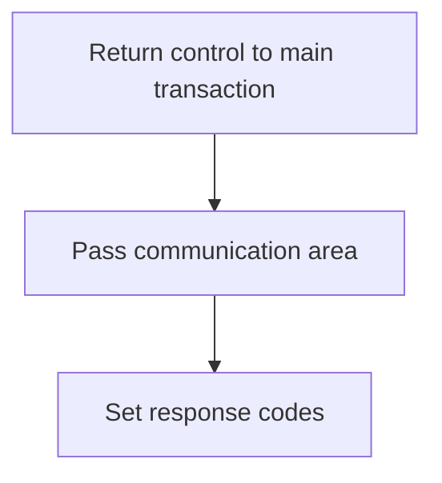

<SwmSnippet path="/src/base/cobol_src/BNK1CCA.cbl" line="225">

---

The <SwmToken path="src/base/cobol_src/BNK1CCA.cbl" pos="153:1:1" line-data="       PREMIERE SECTION.">`PREMIERE`</SwmToken> function is responsible for returning control to the main transaction identified by the transaction ID 'OCCA'. This is achieved by using the <SwmToken path="src/base/cobol_src/BNK1CCA.cbl" pos="178:1:5" line-data="                 EXEC CICS RETURN">`EXEC CICS RETURN`</SwmToken> command, which ensures that the control is passed back to the specified transaction. The communication area (<SwmToken path="src/base/cobol_src/BNK1CCA.cbl" pos="227:1:1" line-data="               COMMAREA(WS-COMM-AREA)">`COMMAREA`</SwmToken>) is passed along with the control, containing relevant data for the transaction. Additionally, the length of the communication area is specified as 248 bytes. The response codes (<SwmToken path="src/base/cobol_src/BNK1CCA.cbl" pos="229:1:1" line-data="               RESP(WS-CICS-RESP)">`RESP`</SwmToken> and <SwmToken path="src/base/cobol_src/BNK1CCA.cbl" pos="230:1:1" line-data="               RESP2(WS-CICS-RESP2)">`RESP2`</SwmToken>) are set to capture any response from the CICS system, ensuring that any issues or statuses are recorded for further processing.

```cobol
           EXEC CICS
               RETURN TRANSID('OCCA')
               COMMAREA(WS-COMM-AREA)
               LENGTH(248)
               RESP(WS-CICS-RESP)
               RESP2(WS-CICS-RESP2)
           END-EXEC.
```

---

</SwmSnippet>

## Handle RESP Failure

Now, lets zoom into this section of the flow:

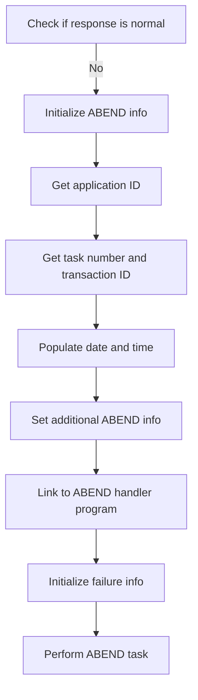

<SwmSnippet path="/src/base/cobol_src/BNK1CCA.cbl" line="233">

---

First, the code checks if the response code <SwmToken path="src/base/cobol_src/BNK1CCA.cbl" pos="233:3:7" line-data="           IF WS-CICS-RESP NOT = DFHRESP(NORMAL)">`WS-CICS-RESP`</SwmToken> is not equal to <SwmToken path="src/base/cobol_src/BNK1CCA.cbl" pos="233:13:16" line-data="           IF WS-CICS-RESP NOT = DFHRESP(NORMAL)">`DFHRESP(NORMAL)`</SwmToken> (indicating an abnormal response).

```cobol
           IF WS-CICS-RESP NOT = DFHRESP(NORMAL)
```

---

</SwmSnippet>

<SwmSnippet path="/src/base/cobol_src/BNK1CCA.cbl" line="240">

---

If the response is abnormal, it initializes the <SwmToken path="src/base/cobol_src/BNK1CCA.cbl" pos="240:3:5" line-data="              INITIALIZE ABNDINFO-REC">`ABNDINFO-REC`</SwmToken> structure to store information about the abnormal termination.

```cobol
              INITIALIZE ABNDINFO-REC
```

---

</SwmSnippet>

<SwmSnippet path="/src/base/cobol_src/BNK1CCA.cbl" line="241">

---

Next, it moves the response codes <SwmToken path="src/base/cobol_src/BNK1CCA.cbl" pos="241:3:3" line-data="              MOVE EIBRESP    TO ABND-RESPCODE">`EIBRESP`</SwmToken> and <SwmToken path="src/base/cobol_src/BNK1CCA.cbl" pos="242:3:3" line-data="              MOVE EIBRESP2   TO ABND-RESP2CODE">`EIBRESP2`</SwmToken> into <SwmToken path="src/base/cobol_src/BNK1CCA.cbl" pos="241:7:9" line-data="              MOVE EIBRESP    TO ABND-RESPCODE">`ABND-RESPCODE`</SwmToken> and <SwmToken path="src/base/cobol_src/BNK1CCA.cbl" pos="242:7:9" line-data="              MOVE EIBRESP2   TO ABND-RESP2CODE">`ABND-RESP2CODE`</SwmToken> respectively, to capture the specific error details.

```cobol
              MOVE EIBRESP    TO ABND-RESPCODE
              MOVE EIBRESP2   TO ABND-RESP2CODE
```

---

</SwmSnippet>

<SwmSnippet path="/src/base/cobol_src/BNK1CCA.cbl" line="246">

---

The program then retrieves the application ID using the <SwmToken path="src/base/cobol_src/BNK1CCA.cbl" pos="246:1:7" line-data="              EXEC CICS ASSIGN APPLID(ABND-APPLID)">`EXEC CICS ASSIGN APPLID`</SwmToken> command and stores it in <SwmToken path="src/base/cobol_src/BNK1CCA.cbl" pos="246:9:11" line-data="              EXEC CICS ASSIGN APPLID(ABND-APPLID)">`ABND-APPLID`</SwmToken>.

```cobol
              EXEC CICS ASSIGN APPLID(ABND-APPLID)
              END-EXEC
```

---

</SwmSnippet>

<SwmSnippet path="/src/base/cobol_src/BNK1CCA.cbl" line="249">

---

It also captures the task number and transaction ID by moving <SwmToken path="src/base/cobol_src/BNK1CCA.cbl" pos="249:3:3" line-data="              MOVE EIBTASKN   TO ABND-TASKNO-KEY">`EIBTASKN`</SwmToken> and <SwmToken path="src/base/cobol_src/BNK1CCA.cbl" pos="250:3:3" line-data="              MOVE EIBTRNID   TO ABND-TRANID">`EIBTRNID`</SwmToken> into <SwmToken path="src/base/cobol_src/BNK1CCA.cbl" pos="249:7:11" line-data="              MOVE EIBTASKN   TO ABND-TASKNO-KEY">`ABND-TASKNO-KEY`</SwmToken> and <SwmToken path="src/base/cobol_src/BNK1CCA.cbl" pos="250:7:9" line-data="              MOVE EIBTRNID   TO ABND-TRANID">`ABND-TRANID`</SwmToken> respectively.

```cobol
              MOVE EIBTASKN   TO ABND-TASKNO-KEY
              MOVE EIBTRNID   TO ABND-TRANID
```

---

</SwmSnippet>

<SwmSnippet path="/src/base/cobol_src/BNK1CCA.cbl" line="252">

---

The <SwmToken path="src/base/cobol_src/BNK1CCA.cbl" pos="252:3:7" line-data="              PERFORM POPULATE-TIME-DATE">`POPULATE-TIME-DATE`</SwmToken> routine is performed to get the current date and time, which are then formatted and stored in <SwmToken path="src/base/cobol_src/BNK1CCA.cbl" pos="254:11:13" line-data="              MOVE WS-ORIG-DATE TO ABND-DATE">`ABND-DATE`</SwmToken> and <SwmToken path="src/base/cobol_src/BNK1CCA.cbl" pos="260:3:5" line-data="                     INTO ABND-TIME">`ABND-TIME`</SwmToken>.

```cobol
              PERFORM POPULATE-TIME-DATE

              MOVE WS-ORIG-DATE TO ABND-DATE
              STRING WS-TIME-NOW-GRP-HH DELIMITED BY SIZE,
                    ':' DELIMITED BY SIZE,
                     WS-TIME-NOW-GRP-MM DELIMITED BY SIZE,
                     ':' DELIMITED BY SIZE,
                     WS-TIME-NOW-GRP-MM DELIMITED BY SIZE
                     INTO ABND-TIME
              END-STRING
```

---

</SwmSnippet>

<SwmSnippet path="/src/base/cobol_src/BNK1CCA.cbl" line="263">

---

Additional information such as <SwmToken path="src/base/cobol_src/BNK1CCA.cbl" pos="263:3:7" line-data="              MOVE WS-U-TIME   TO ABND-UTIME-KEY">`WS-U-TIME`</SwmToken>, <SwmToken path="src/base/cobol_src/BNK1CCA.cbl" pos="264:4:4" line-data="              MOVE &#39;HBNK&#39;      TO ABND-CODE">`HBNK`</SwmToken> code, and the current program name are moved into the respective fields in <SwmToken path="src/base/cobol_src/BNK1CCA.cbl" pos="240:3:5" line-data="              INITIALIZE ABNDINFO-REC">`ABNDINFO-REC`</SwmToken>.

```cobol
              MOVE WS-U-TIME   TO ABND-UTIME-KEY
              MOVE 'HBNK'      TO ABND-CODE

              EXEC CICS ASSIGN PROGRAM(ABND-PROGRAM)
              END-EXEC
```

---

</SwmSnippet>

<SwmSnippet path="/src/base/cobol_src/BNK1CCA.cbl" line="271">

---

A detailed error message is constructed using the <SwmToken path="src/base/cobol_src/BNK1CCA.cbl" pos="271:1:1" line-data="              STRING &#39;A010 - RETURN TRANSID(OCCA) FAIL&#39;">`STRING`</SwmToken> command and stored in <SwmToken path="src/base/cobol_src/BNK1CCA.cbl" pos="277:3:5" line-data="                    INTO ABND-FREEFORM">`ABND-FREEFORM`</SwmToken>.

```cobol
              STRING 'A010 - RETURN TRANSID(OCCA) FAIL'
                    DELIMITED BY SIZE,
                    'EIBRESP=' DELIMITED BY SIZE,
                    ABND-RESPCODE DELIMITED BY SIZE,
                    ' RESP2=' DELIMITED BY SIZE,
                    ABND-RESP2CODE DELIMITED BY SIZE
                    INTO ABND-FREEFORM
```

---

</SwmSnippet>

<SwmSnippet path="/src/base/cobol_src/BNK1CCA.cbl" line="280">

---

Finally, the program links to the ABEND handler program <SwmToken path="src/base/cobol_src/BNK1CCA.cbl" pos="280:9:13" line-data="              EXEC CICS LINK PROGRAM(WS-ABEND-PGM)">`WS-ABEND-PGM`</SwmToken> with the <SwmToken path="src/base/cobol_src/BNK1CCA.cbl" pos="281:3:5" line-data="                        COMMAREA(ABNDINFO-REC)">`ABNDINFO-REC`</SwmToken> structure, initializes failure information, and performs the ABEND task.

```cobol
              EXEC CICS LINK PROGRAM(WS-ABEND-PGM)
                        COMMAREA(ABNDINFO-REC)
              END-EXEC

              INITIALIZE WS-FAIL-INFO
              MOVE 'BNK1CCA - A010 - RETURN TRANSID(OCCA) FAIL' TO
                 WS-CICS-FAIL-MSG
              MOVE WS-CICS-RESP  TO WS-CICS-RESP-DISP
              MOVE WS-CICS-RESP2 TO WS-CICS-RESP2-DISP
              PERFORM ABEND-THIS-TASK
```

---

</SwmSnippet>

## End Program

This is the next section of the flow.


<SwmSnippet path="/src/base/cobol_src/BNK1CCA.cbl" line="292">

---

The <SwmToken path="src/base/cobol_src/BNK1CCA.cbl" pos="292:1:1" line-data="       A999.">`A999`</SwmToken> section is responsible for exiting the program. This is a standard practice in COBOL to mark the end of a program or a logical section within the program. The <SwmToken path="src/base/cobol_src/BNK1CCA.cbl" pos="293:1:1" line-data="           EXIT.">`EXIT`</SwmToken> statement ensures that the program terminates gracefully, releasing any resources that were allocated during its execution.

```cobol
       A999.
           EXIT.
```

---

</SwmSnippet>

# Send map (<SwmToken path="src/base/cobol_src/BNK1CCA.cbl" pos="166:3:5" line-data="                 PERFORM SEND-MAP">`SEND-MAP`</SwmToken>)

Let's split this section into smaller parts:

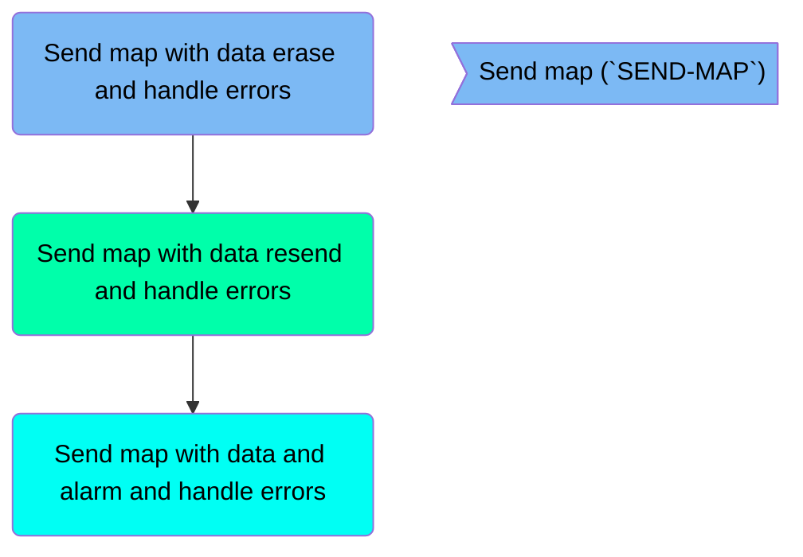

## Send map with data erase and handle errors

First, we'll zoom into this section of the flow:

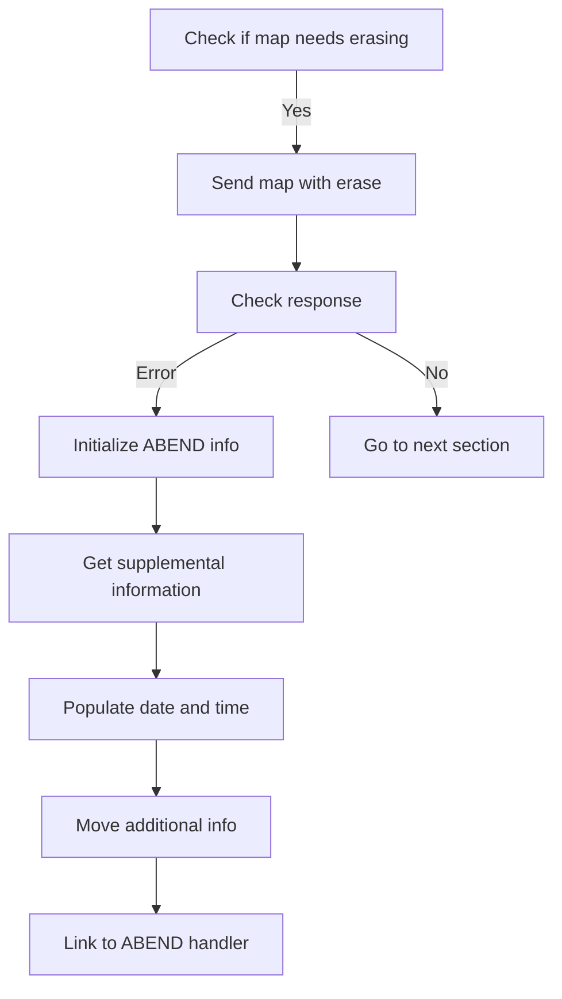

<SwmSnippet path="/src/base/cobol_src/BNK1CCA.cbl" line="621">

---

### Checking if map needs erasing

First, the code checks if the map needs to have its data erased by evaluating the <SwmToken path="src/base/cobol_src/BNK1CCA.cbl" pos="621:3:5" line-data="           IF SEND-ERASE">`SEND-ERASE`</SwmToken> flag.

```cobol
           IF SEND-ERASE
```

---

</SwmSnippet>

<SwmSnippet path="/src/base/cobol_src/BNK1CCA.cbl" line="622">

---

### Sending map with erase

If the <SwmToken path="src/base/cobol_src/BNK1CCA.cbl" pos="165:3:5" line-data="                 SET SEND-ERASE TO TRUE">`SEND-ERASE`</SwmToken> flag is set, the map <SwmToken path="src/base/cobol_src/BNK1CCA.cbl" pos="622:10:10" line-data="               EXEC CICS SEND MAP(&#39;BNK1ACC&#39;)">`BNK1ACC`</SwmToken> is sent with the ERASE option to clear any existing data.

```cobol
               EXEC CICS SEND MAP('BNK1ACC')
                  MAPSET('BNK1ACC')
                  FROM(BNK1ACCO)
                  ERASE
                  RESP(WS-CICS-RESP)
                  RESP2(WS-CICS-RESP2)
               END-EXEC
```

---

</SwmSnippet>

<SwmSnippet path="/src/base/cobol_src/BNK1CCA.cbl" line="630">

---

### Checking response

Next, the response from the SEND MAP command is checked to ensure it was successful. If the response is not normal, error handling is initiated.

```cobol
              IF WS-CICS-RESP NOT = DFHRESP(NORMAL)
      *
```

---

</SwmSnippet>

<SwmSnippet path="/src/base/cobol_src/BNK1CCA.cbl" line="637">

---

### Initializing ABEND info

If an error occurs, the ABEND information is initialized to capture the error details.

```cobol
                 INITIALIZE ABNDINFO-REC
                 MOVE EIBRESP    TO ABND-RESPCODE
```

---

</SwmSnippet>

<SwmSnippet path="/src/base/cobol_src/BNK1CCA.cbl" line="643">

---

### Getting supplemental information

Supplemental information such as application ID, task number, and transaction ID is retrieved to provide context for the error.

```cobol
                 EXEC CICS ASSIGN APPLID(ABND-APPLID)
                 END-EXEC

                 MOVE EIBTASKN   TO ABND-TASKNO-KEY
                 MOVE EIBTRNID   TO ABND-TRANID

```

---

</SwmSnippet>

<SwmSnippet path="/src/base/cobol_src/BNK1CCA.cbl" line="649">

---

### Populating date and time

The current date and time are populated to record when the error occurred.

```cobol
                 PERFORM POPULATE-TIME-DATE

                 MOVE WS-ORIG-DATE TO ABND-DATE
                 STRING WS-TIME-NOW-GRP-HH DELIMITED BY SIZE,
                       ':' DELIMITED BY SIZE,
                        WS-TIME-NOW-GRP-MM DELIMITED BY SIZE,
                        ':' DELIMITED BY SIZE,
                        WS-TIME-NOW-GRP-MM DELIMITED BY SIZE
                        INTO ABND-TIME
```

---

</SwmSnippet>

<SwmSnippet path="/src/base/cobol_src/BNK1CCA.cbl" line="660">

---

### Moving additional info

Additional information such as user time and a specific code is moved to the ABEND record.

```cobol
                 MOVE WS-U-TIME   TO ABND-UTIME-KEY
                 MOVE 'HBNK'      TO ABND-CODE

```

---

</SwmSnippet>

<SwmSnippet path="/src/base/cobol_src/BNK1CCA.cbl" line="677">

---

### Linking to ABEND handler

Finally, the ABEND handler program is linked to, passing the ABEND information for further processing and logging.

```cobol
                 EXEC CICS LINK PROGRAM(WS-ABEND-PGM)
                           COMMAREA(ABNDINFO-REC)
                 END-EXEC
```

---

</SwmSnippet>

## Send map with data resend and handle errors

Now, lets zoom into this section of the flow:

```mermaid
graph TD
  A[Check if SEND-DATAONLY is true] --> B[Send map data only]
  B --> C{Check if response is normal}
  C -->|No| D[Initialize ABNDINFO-REC]
  D --> E[Move response codes to ABNDINFO-REC]
  E --> F[Assign application ID]
  F --> G[Move task number and transaction ID]
  G --> H[Perform POPULATE-TIME-DATE]
  H --> I[Move date and time to ABNDINFO-REC]
  I --> J[Assign program name]
  J --> K[Move SQL code to ABNDINFO-REC]
  K --> L[Create error message]
  L --> M[Link to ABEND handler program]
  M --> N[Initialize WS-FAIL-INFO]
  N --> O[Move failure message and response codes]
  O --> P[Perform ABEND-THIS-TASK]
  C -->|Yes| Q[Go to SM999]

%% Swimm:
%% graph TD
%%   A[Check if <SwmToken path="src/base/cobol_src/BNK1CCA.cbl" pos="220:3:5" line-data="                 SET SEND-DATAONLY-ALARM TO TRUE">`SEND-DATAONLY`</SwmToken> is true] --> B[Send map data only]
%%   B --> C{Check if response is normal}
%%   C -->|No| D[Initialize <SwmToken path="src/base/cobol_src/BNK1CCA.cbl" pos="240:3:5" line-data="              INITIALIZE ABNDINFO-REC">`ABNDINFO-REC`</SwmToken>]
%%   D --> E[Move response codes to <SwmToken path="src/base/cobol_src/BNK1CCA.cbl" pos="240:3:5" line-data="              INITIALIZE ABNDINFO-REC">`ABNDINFO-REC`</SwmToken>]
%%   E --> F[Assign application ID]
%%   F --> G[Move task number and transaction ID]
%%   G --> H[Perform <SwmToken path="src/base/cobol_src/BNK1CCA.cbl" pos="252:3:7" line-data="              PERFORM POPULATE-TIME-DATE">`POPULATE-TIME-DATE`</SwmToken>]
%%   H --> I[Move date and time to <SwmToken path="src/base/cobol_src/BNK1CCA.cbl" pos="240:3:5" line-data="              INITIALIZE ABNDINFO-REC">`ABNDINFO-REC`</SwmToken>]
%%   I --> J[Assign program name]
%%   J --> K[Move SQL code to <SwmToken path="src/base/cobol_src/BNK1CCA.cbl" pos="240:3:5" line-data="              INITIALIZE ABNDINFO-REC">`ABNDINFO-REC`</SwmToken>]
%%   K --> L[Create error message]
%%   L --> M[Link to ABEND handler program]
%%   M --> N[Initialize <SwmToken path="src/base/cobol_src/BNK1CCA.cbl" pos="284:3:7" line-data="              INITIALIZE WS-FAIL-INFO">`WS-FAIL-INFO`</SwmToken>]
%%   N --> O[Move failure message and response codes]
%%   O --> P[Perform <SwmToken path="src/base/cobol_src/BNK1CCA.cbl" pos="289:3:7" line-data="              PERFORM ABEND-THIS-TASK">`ABEND-THIS-TASK`</SwmToken>]
%%   C -->|Yes| Q[Go to <SwmToken path="src/base/cobol_src/BNK1CCA.cbl" pos="689:5:5" line-data="              GO TO SM999">`SM999`</SwmToken>]
```

<SwmSnippet path="/src/base/cobol_src/BNK1CCA.cbl" line="695">

---

### Checking if <SwmToken path="src/base/cobol_src/BNK1CCA.cbl" pos="695:3:5" line-data="           IF SEND-DATAONLY">`SEND-DATAONLY`</SwmToken> is true

First, the code checks if <SwmToken path="src/base/cobol_src/BNK1CCA.cbl" pos="695:3:5" line-data="           IF SEND-DATAONLY">`SEND-DATAONLY`</SwmToken> is true, which indicates that only the data needs to be resent.

```cobol
           IF SEND-DATAONLY
```

---

</SwmSnippet>

<SwmSnippet path="/src/base/cobol_src/BNK1CCA.cbl" line="696">

---

### Sending map data only

If <SwmToken path="src/base/cobol_src/BNK1CCA.cbl" pos="220:3:5" line-data="                 SET SEND-DATAONLY-ALARM TO TRUE">`SEND-DATAONLY`</SwmToken> is true, the map data is sent using the <SwmToken path="src/base/cobol_src/BNK1CCA.cbl" pos="696:1:7" line-data="              EXEC CICS SEND MAP(&#39;BNK1ACC&#39;)">`EXEC CICS SEND MAP`</SwmToken> command with the <SwmToken path="src/base/cobol_src/BNK1CCA.cbl" pos="699:1:1" line-data="                 DATAONLY">`DATAONLY`</SwmToken> option.

```cobol
              EXEC CICS SEND MAP('BNK1ACC')
                 MAPSET('BNK1ACC')
                 FROM(BNK1ACCO)
                 DATAONLY
                 RESP(WS-CICS-RESP)
                 RESP2(WS-CICS-RESP2)
              END-EXEC
```

---

</SwmSnippet>

<SwmSnippet path="/src/base/cobol_src/BNK1CCA.cbl" line="704">

---

### Checking the response

Next, the code checks if the response (<SwmToken path="src/base/cobol_src/BNK1CCA.cbl" pos="704:3:7" line-data="              IF WS-CICS-RESP NOT = DFHRESP(NORMAL)">`WS-CICS-RESP`</SwmToken>) is not equal to <SwmToken path="src/base/cobol_src/BNK1CCA.cbl" pos="704:13:16" line-data="              IF WS-CICS-RESP NOT = DFHRESP(NORMAL)">`DFHRESP(NORMAL)`</SwmToken>, indicating an error occurred during the send operation.

```cobol
              IF WS-CICS-RESP NOT = DFHRESP(NORMAL)
```

---

</SwmSnippet>

<SwmSnippet path="/src/base/cobol_src/BNK1CCA.cbl" line="712">

---

### Initializing <SwmToken path="src/base/cobol_src/BNK1CCA.cbl" pos="712:3:5" line-data="                 INITIALIZE ABNDINFO-REC">`ABNDINFO-REC`</SwmToken>

If an error occurred, the <SwmToken path="src/base/cobol_src/BNK1CCA.cbl" pos="712:3:5" line-data="                 INITIALIZE ABNDINFO-REC">`ABNDINFO-REC`</SwmToken> structure is initialized to store error information.

```cobol
                 INITIALIZE ABNDINFO-REC
```

---

</SwmSnippet>

<SwmSnippet path="/src/base/cobol_src/BNK1CCA.cbl" line="713">

---

### Moving response codes to <SwmToken path="src/base/cobol_src/BNK1CCA.cbl" pos="240:3:5" line-data="              INITIALIZE ABNDINFO-REC">`ABNDINFO-REC`</SwmToken>

The response codes <SwmToken path="src/base/cobol_src/BNK1CCA.cbl" pos="713:3:3" line-data="                 MOVE EIBRESP    TO ABND-RESPCODE">`EIBRESP`</SwmToken> and <SwmToken path="src/base/cobol_src/BNK1CCA.cbl" pos="714:3:3" line-data="                 MOVE EIBRESP2   TO ABND-RESP2CODE">`EIBRESP2`</SwmToken> are moved to <SwmToken path="src/base/cobol_src/BNK1CCA.cbl" pos="713:7:9" line-data="                 MOVE EIBRESP    TO ABND-RESPCODE">`ABND-RESPCODE`</SwmToken> and <SwmToken path="src/base/cobol_src/BNK1CCA.cbl" pos="714:7:9" line-data="                 MOVE EIBRESP2   TO ABND-RESP2CODE">`ABND-RESP2CODE`</SwmToken> respectively for error tracking.

```cobol
                 MOVE EIBRESP    TO ABND-RESPCODE
                 MOVE EIBRESP2   TO ABND-RESP2CODE
```

---

</SwmSnippet>

<SwmSnippet path="/src/base/cobol_src/BNK1CCA.cbl" line="718">

---

### Assigning application ID

The application ID is assigned to <SwmToken path="src/base/cobol_src/BNK1CCA.cbl" pos="718:9:11" line-data="                 EXEC CICS ASSIGN APPLID(ABND-APPLID)">`ABND-APPLID`</SwmToken> using the <SwmToken path="src/base/cobol_src/BNK1CCA.cbl" pos="718:1:7" line-data="                 EXEC CICS ASSIGN APPLID(ABND-APPLID)">`EXEC CICS ASSIGN APPLID`</SwmToken> command.

```cobol
                 EXEC CICS ASSIGN APPLID(ABND-APPLID)
                 END-EXEC
```

---

</SwmSnippet>

<SwmSnippet path="/src/base/cobol_src/BNK1CCA.cbl" line="721">

---

### Moving task number and transaction ID

The task number and transaction ID are moved to <SwmToken path="src/base/cobol_src/BNK1CCA.cbl" pos="721:7:11" line-data="                 MOVE EIBTASKN   TO ABND-TASKNO-KEY">`ABND-TASKNO-KEY`</SwmToken> and <SwmToken path="src/base/cobol_src/BNK1CCA.cbl" pos="722:7:9" line-data="                 MOVE EIBTRNID   TO ABND-TRANID">`ABND-TRANID`</SwmToken> respectively.

```cobol
                 MOVE EIBTASKN   TO ABND-TASKNO-KEY
                 MOVE EIBTRNID   TO ABND-TRANID
```

---

</SwmSnippet>

<SwmSnippet path="/src/base/cobol_src/BNK1CCA.cbl" line="724">

---

### Performing <SwmToken path="src/base/cobol_src/BNK1CCA.cbl" pos="724:3:7" line-data="                 PERFORM POPULATE-TIME-DATE">`POPULATE-TIME-DATE`</SwmToken>

The <SwmToken path="src/base/cobol_src/BNK1CCA.cbl" pos="724:3:7" line-data="                 PERFORM POPULATE-TIME-DATE">`POPULATE-TIME-DATE`</SwmToken> routine is performed to get the current date and time.

```cobol
                 PERFORM POPULATE-TIME-DATE
```

---

</SwmSnippet>

<SwmSnippet path="/src/base/cobol_src/BNK1CCA.cbl" line="726">

---

### Moving date and time to <SwmToken path="src/base/cobol_src/BNK1CCA.cbl" pos="240:3:5" line-data="              INITIALIZE ABNDINFO-REC">`ABNDINFO-REC`</SwmToken>

The current date and time are moved to <SwmToken path="src/base/cobol_src/BNK1CCA.cbl" pos="726:11:13" line-data="                 MOVE WS-ORIG-DATE TO ABND-DATE">`ABND-DATE`</SwmToken> and <SwmToken path="src/base/cobol_src/BNK1CCA.cbl" pos="732:3:5" line-data="                        INTO ABND-TIME">`ABND-TIME`</SwmToken> respectively.

```cobol
                 MOVE WS-ORIG-DATE TO ABND-DATE
                 STRING WS-TIME-NOW-GRP-HH DELIMITED BY SIZE,
                       ':' DELIMITED BY SIZE,
                        WS-TIME-NOW-GRP-MM DELIMITED BY SIZE,
                        ':' DELIMITED BY SIZE,
                        WS-TIME-NOW-GRP-MM DELIMITED BY SIZE
                        INTO ABND-TIME
```

---

</SwmSnippet>

<SwmSnippet path="/src/base/cobol_src/BNK1CCA.cbl" line="738">

---

### Assigning program name

The program name is assigned to <SwmToken path="src/base/cobol_src/BNK1CCA.cbl" pos="738:9:11" line-data="                 EXEC CICS ASSIGN PROGRAM(ABND-PROGRAM)">`ABND-PROGRAM`</SwmToken> using the <SwmToken path="src/base/cobol_src/BNK1CCA.cbl" pos="738:1:7" line-data="                 EXEC CICS ASSIGN PROGRAM(ABND-PROGRAM)">`EXEC CICS ASSIGN PROGRAM`</SwmToken> command.

```cobol
                 EXEC CICS ASSIGN PROGRAM(ABND-PROGRAM)
                 END-EXEC
```

---

</SwmSnippet>

<SwmSnippet path="/src/base/cobol_src/BNK1CCA.cbl" line="743">

---

### Creating error message

An error message is created and stored in <SwmToken path="src/base/cobol_src/BNK1CCA.cbl" pos="749:3:5" line-data="                       INTO ABND-FREEFORM">`ABND-FREEFORM`</SwmToken> to describe the failure.

```cobol
                 STRING 'SM010 - SEND MAP DATAONLY FAIL.'
                       DELIMITED BY SIZE,
                       'EIBRESP=' DELIMITED BY SIZE,
                       ABND-RESPCODE DELIMITED BY SIZE,
                       ' RESP2=' DELIMITED BY SIZE,
                       ABND-RESP2CODE DELIMITED BY SIZE
                       INTO ABND-FREEFORM
```

---

</SwmSnippet>

## Send map with data and alarm and handle errors

Now, lets zoom into this section of the flow:

```mermaid
graph TD
  A[Check if SEND-DATAONLY-ALARM is true] -->|Yes| B[SEND MAP with DATAONLY and ALARM]
  B --> C[Check if WS-CICS-RESP is not NORMAL]
  C -->|Yes| D[Initialize ABNDINFO-REC]
  D --> E[Move EIBRESP to ABND-RESPCODE]
  E --> F[Move EIBRESP2 to ABND-RESP2CODE]
  F --> G[Assign APPLID to ABND-APPLID]
  G --> H[Move EIBTASKN to ABND-TASKNO-KEY]
  H --> I[Move EIBTRNID to ABND-TRANID]
  I --> J[Perform POPULATE-TIME-DATE]
  J --> K[Move WS-ORIG-DATE to ABND-DATE]
  K --> L[Format and move current time to ABND-TIME]
  L --> M[Move WS-U-TIME to ABND-UTIME-KEY]
  M --> N[Move 'HBNK' to ABND-CODE]
  N --> O[Assign PROGRAM to ABND-PROGRAM]
  O --> P[Move ZEROS to ABND-SQLCODE]
  P --> Q[Format and move error message to ABND-FREEFORM]
  Q --> R[LINK to ABEND Handler program]
  R --> S[Initialize WS-FAIL-INFO]
  S --> T[Move error details to WS-CICS-FAIL-MSG, WS-CICS-RESP-DISP, and WS-CICS-RESP2-DISP]
  T --> U[Perform ABEND-THIS-TASK]

%% Swimm:
%% graph TD
%%   A[Check if <SwmToken path="src/base/cobol_src/BNK1CCA.cbl" pos="220:3:7" line-data="                 SET SEND-DATAONLY-ALARM TO TRUE">`SEND-DATAONLY-ALARM`</SwmToken> is true] -->|Yes| B[SEND MAP with DATAONLY and ALARM]
%%   B --> C[Check if <SwmToken path="src/base/cobol_src/BNK1CCA.cbl" pos="181:3:7" line-data="                    RESP(WS-CICS-RESP)">`WS-CICS-RESP`</SwmToken> is not NORMAL]
%%   C -->|Yes| D[Initialize <SwmToken path="src/base/cobol_src/BNK1CCA.cbl" pos="240:3:5" line-data="              INITIALIZE ABNDINFO-REC">`ABNDINFO-REC`</SwmToken>]
%%   D --> E[Move EIBRESP to <SwmToken path="src/base/cobol_src/BNK1CCA.cbl" pos="241:7:9" line-data="              MOVE EIBRESP    TO ABND-RESPCODE">`ABND-RESPCODE`</SwmToken>]
%%   E --> F[Move <SwmToken path="src/base/cobol_src/BNK1CCA.cbl" pos="242:3:3" line-data="              MOVE EIBRESP2   TO ABND-RESP2CODE">`EIBRESP2`</SwmToken> to <SwmToken path="src/base/cobol_src/BNK1CCA.cbl" pos="242:7:9" line-data="              MOVE EIBRESP2   TO ABND-RESP2CODE">`ABND-RESP2CODE`</SwmToken>]
%%   F --> G[Assign APPLID to <SwmToken path="src/base/cobol_src/BNK1CCA.cbl" pos="246:9:11" line-data="              EXEC CICS ASSIGN APPLID(ABND-APPLID)">`ABND-APPLID`</SwmToken>]
%%   G --> H[Move EIBTASKN to <SwmToken path="src/base/cobol_src/BNK1CCA.cbl" pos="249:7:11" line-data="              MOVE EIBTASKN   TO ABND-TASKNO-KEY">`ABND-TASKNO-KEY`</SwmToken>]
%%   H --> I[Move EIBTRNID to <SwmToken path="src/base/cobol_src/BNK1CCA.cbl" pos="250:7:9" line-data="              MOVE EIBTRNID   TO ABND-TRANID">`ABND-TRANID`</SwmToken>]
%%   I --> J[Perform <SwmToken path="src/base/cobol_src/BNK1CCA.cbl" pos="252:3:7" line-data="              PERFORM POPULATE-TIME-DATE">`POPULATE-TIME-DATE`</SwmToken>]
%%   J --> K[Move <SwmToken path="src/base/cobol_src/BNK1CCA.cbl" pos="254:3:7" line-data="              MOVE WS-ORIG-DATE TO ABND-DATE">`WS-ORIG-DATE`</SwmToken> to <SwmToken path="src/base/cobol_src/BNK1CCA.cbl" pos="254:11:13" line-data="              MOVE WS-ORIG-DATE TO ABND-DATE">`ABND-DATE`</SwmToken>]
%%   K --> L[Format and move current time to <SwmToken path="src/base/cobol_src/BNK1CCA.cbl" pos="260:3:5" line-data="                     INTO ABND-TIME">`ABND-TIME`</SwmToken>]
%%   L --> M[Move <SwmToken path="src/base/cobol_src/BNK1CCA.cbl" pos="263:3:7" line-data="              MOVE WS-U-TIME   TO ABND-UTIME-KEY">`WS-U-TIME`</SwmToken> to <SwmToken path="src/base/cobol_src/BNK1CCA.cbl" pos="263:11:15" line-data="              MOVE WS-U-TIME   TO ABND-UTIME-KEY">`ABND-UTIME-KEY`</SwmToken>]
%%   M --> N[Move 'HBNK' to <SwmToken path="src/base/cobol_src/BNK1CCA.cbl" pos="264:9:11" line-data="              MOVE &#39;HBNK&#39;      TO ABND-CODE">`ABND-CODE`</SwmToken>]
%%   N --> O[Assign PROGRAM to <SwmToken path="src/base/cobol_src/BNK1CCA.cbl" pos="266:9:11" line-data="              EXEC CICS ASSIGN PROGRAM(ABND-PROGRAM)">`ABND-PROGRAM`</SwmToken>]
%%   O --> P[Move ZEROS to <SwmToken path="src/base/cobol_src/BNK1CCA.cbl" pos="479:7:9" line-data="              MOVE ZEROS      TO ABND-SQLCODE">`ABND-SQLCODE`</SwmToken>]
%%   P --> Q[Format and move error message to <SwmToken path="src/base/cobol_src/BNK1CCA.cbl" pos="277:3:5" line-data="                    INTO ABND-FREEFORM">`ABND-FREEFORM`</SwmToken>]
%%   Q --> R[LINK to ABEND Handler program]
%%   R --> S[Initialize <SwmToken path="src/base/cobol_src/BNK1CCA.cbl" pos="284:3:7" line-data="              INITIALIZE WS-FAIL-INFO">`WS-FAIL-INFO`</SwmToken>]
%%   S --> T[Move error details to <SwmToken path="src/base/cobol_src/BNK1CCA.cbl" pos="286:1:7" line-data="                 WS-CICS-FAIL-MSG">`WS-CICS-FAIL-MSG`</SwmToken>, <SwmToken path="src/base/cobol_src/BNK1CCA.cbl" pos="287:11:17" line-data="              MOVE WS-CICS-RESP  TO WS-CICS-RESP-DISP">`WS-CICS-RESP-DISP`</SwmToken>, and <SwmToken path="src/base/cobol_src/BNK1CCA.cbl" pos="288:11:17" line-data="              MOVE WS-CICS-RESP2 TO WS-CICS-RESP2-DISP">`WS-CICS-RESP2-DISP`</SwmToken>]
%%   T --> U[Perform <SwmToken path="src/base/cobol_src/BNK1CCA.cbl" pos="289:3:7" line-data="              PERFORM ABEND-THIS-TASK">`ABEND-THIS-TASK`</SwmToken>]
```

First, we check if <SwmToken path="src/base/cobol_src/BNK1CCA.cbl" pos="220:3:7" line-data="                 SET SEND-DATAONLY-ALARM TO TRUE">`SEND-DATAONLY-ALARM`</SwmToken> is true. If it is, we proceed to send the map with the <SwmToken path="src/base/cobol_src/BNK1CCA.cbl" pos="220:5:5" line-data="                 SET SEND-DATAONLY-ALARM TO TRUE">`DATAONLY`</SwmToken> and <SwmToken path="src/base/cobol_src/BNK1CCA.cbl" pos="220:7:7" line-data="                 SET SEND-DATAONLY-ALARM TO TRUE">`ALARM`</SwmToken> options.

<SwmSnippet path="/src/base/cobol_src/BNK1CCA.cbl" line="771">

---

Next, we send the map <SwmToken path="src/base/cobol_src/BNK1CCA.cbl" pos="772:10:10" line-data="              EXEC CICS SEND MAP(&#39;BNK1ACC&#39;)">`BNK1ACC`</SwmToken> from <SwmToken path="src/base/cobol_src/BNK1CCA.cbl" pos="774:3:3" line-data="                 FROM(BNK1ACCO)">`BNK1ACCO`</SwmToken> with the <SwmToken path="src/base/cobol_src/BNK1CCA.cbl" pos="771:5:5" line-data="           IF SEND-DATAONLY-ALARM">`DATAONLY`</SwmToken> and <SwmToken path="src/base/cobol_src/BNK1CCA.cbl" pos="771:7:7" line-data="           IF SEND-DATAONLY-ALARM">`ALARM`</SwmToken> options, and store the response in <SwmToken path="src/base/cobol_src/BNK1CCA.cbl" pos="777:3:7" line-data="                 RESP(WS-CICS-RESP)">`WS-CICS-RESP`</SwmToken> and <SwmToken path="src/base/cobol_src/BNK1CCA.cbl" pos="778:3:7" line-data="                 RESP2(WS-CICS-RESP2)">`WS-CICS-RESP2`</SwmToken>.

```cobol
           IF SEND-DATAONLY-ALARM
              EXEC CICS SEND MAP('BNK1ACC')
                 MAPSET('BNK1ACC')
                 FROM(BNK1ACCO)
                 DATAONLY
                 ALARM
                 RESP(WS-CICS-RESP)
                 RESP2(WS-CICS-RESP2)
              END-EXEC
```

---

</SwmSnippet>

<SwmSnippet path="/src/base/cobol_src/BNK1CCA.cbl" line="781">

---

Then, we check if <SwmToken path="src/base/cobol_src/BNK1CCA.cbl" pos="781:3:7" line-data="              IF WS-CICS-RESP NOT = DFHRESP(NORMAL)">`WS-CICS-RESP`</SwmToken> is not equal to <SwmToken path="src/base/cobol_src/BNK1CCA.cbl" pos="781:13:16" line-data="              IF WS-CICS-RESP NOT = DFHRESP(NORMAL)">`DFHRESP(NORMAL)`</SwmToken>. If it is not normal, we proceed to handle the error.

```cobol
              IF WS-CICS-RESP NOT = DFHRESP(NORMAL)
```

---

</SwmSnippet>

<SwmSnippet path="/src/base/cobol_src/BNK1CCA.cbl" line="790">

---

Diving into error handling, we initialize <SwmToken path="src/base/cobol_src/BNK1CCA.cbl" pos="790:3:5" line-data="                 INITIALIZE ABNDINFO-REC">`ABNDINFO-REC`</SwmToken> to prepare for capturing error details.

```cobol
                 INITIALIZE ABNDINFO-REC
```

---

</SwmSnippet>

<SwmSnippet path="/src/base/cobol_src/BNK1CCA.cbl" line="791">

---

We move <SwmToken path="src/base/cobol_src/BNK1CCA.cbl" pos="791:3:3" line-data="                 MOVE EIBRESP    TO ABND-RESPCODE">`EIBRESP`</SwmToken> to <SwmToken path="src/base/cobol_src/BNK1CCA.cbl" pos="791:7:9" line-data="                 MOVE EIBRESP    TO ABND-RESPCODE">`ABND-RESPCODE`</SwmToken> and <SwmToken path="src/base/cobol_src/BNK1CCA.cbl" pos="792:3:3" line-data="                 MOVE EIBRESP2   TO ABND-RESP2CODE">`EIBRESP2`</SwmToken> to <SwmToken path="src/base/cobol_src/BNK1CCA.cbl" pos="792:7:9" line-data="                 MOVE EIBRESP2   TO ABND-RESP2CODE">`ABND-RESP2CODE`</SwmToken> to capture the response codes.

```cobol
                 MOVE EIBRESP    TO ABND-RESPCODE
                 MOVE EIBRESP2   TO ABND-RESP2CODE
```

---

</SwmSnippet>

<SwmSnippet path="/src/base/cobol_src/BNK1CCA.cbl" line="796">

---

We assign the application ID to <SwmToken path="src/base/cobol_src/BNK1CCA.cbl" pos="796:9:11" line-data="                 EXEC CICS ASSIGN APPLID(ABND-APPLID)">`ABND-APPLID`</SwmToken> and move <SwmToken path="src/base/cobol_src/BNK1CCA.cbl" pos="799:3:3" line-data="                 MOVE EIBTASKN   TO ABND-TASKNO-KEY">`EIBTASKN`</SwmToken> to <SwmToken path="src/base/cobol_src/BNK1CCA.cbl" pos="799:7:11" line-data="                 MOVE EIBTASKN   TO ABND-TASKNO-KEY">`ABND-TASKNO-KEY`</SwmToken> and <SwmToken path="src/base/cobol_src/BNK1CCA.cbl" pos="800:3:3" line-data="                 MOVE EIBTRNID   TO ABND-TRANID">`EIBTRNID`</SwmToken> to <SwmToken path="src/base/cobol_src/BNK1CCA.cbl" pos="800:7:9" line-data="                 MOVE EIBTRNID   TO ABND-TRANID">`ABND-TRANID`</SwmToken> to capture the task and transaction details.

```cobol
                 EXEC CICS ASSIGN APPLID(ABND-APPLID)
                 END-EXEC

                 MOVE EIBTASKN   TO ABND-TASKNO-KEY
                 MOVE EIBTRNID   TO ABND-TRANID

```

---

</SwmSnippet>

<SwmSnippet path="/src/base/cobol_src/BNK1CCA.cbl" line="802">

---

We perform <SwmToken path="src/base/cobol_src/BNK1CCA.cbl" pos="802:3:7" line-data="                 PERFORM POPULATE-TIME-DATE">`POPULATE-TIME-DATE`</SwmToken> to get the current date and time, and then move <SwmToken path="src/base/cobol_src/BNK1CCA.cbl" pos="804:3:7" line-data="                 MOVE WS-ORIG-DATE TO ABND-DATE">`WS-ORIG-DATE`</SwmToken> to <SwmToken path="src/base/cobol_src/BNK1CCA.cbl" pos="804:11:13" line-data="                 MOVE WS-ORIG-DATE TO ABND-DATE">`ABND-DATE`</SwmToken> and format the current time into <SwmToken path="src/base/cobol_src/BNK1CCA.cbl" pos="810:3:5" line-data="                        INTO ABND-TIME">`ABND-TIME`</SwmToken>.

```cobol
                 PERFORM POPULATE-TIME-DATE

                 MOVE WS-ORIG-DATE TO ABND-DATE
                 STRING WS-TIME-NOW-GRP-HH DELIMITED BY SIZE,
                       ':' DELIMITED BY SIZE,
                        WS-TIME-NOW-GRP-MM DELIMITED BY SIZE,
                        ':' DELIMITED BY SIZE,
                        WS-TIME-NOW-GRP-MM DELIMITED BY SIZE
                        INTO ABND-TIME
```

---

</SwmSnippet>

<SwmSnippet path="/src/base/cobol_src/BNK1CCA.cbl" line="813">

---

We move <SwmToken path="src/base/cobol_src/BNK1CCA.cbl" pos="813:3:7" line-data="                 MOVE WS-U-TIME   TO ABND-UTIME-KEY">`WS-U-TIME`</SwmToken> to <SwmToken path="src/base/cobol_src/BNK1CCA.cbl" pos="813:11:15" line-data="                 MOVE WS-U-TIME   TO ABND-UTIME-KEY">`ABND-UTIME-KEY`</SwmToken> and set <SwmToken path="src/base/cobol_src/BNK1CCA.cbl" pos="814:9:11" line-data="                 MOVE &#39;HBNK&#39;      TO ABND-CODE">`ABND-CODE`</SwmToken> to 'HBNK' to capture additional error details.

```cobol
                 MOVE WS-U-TIME   TO ABND-UTIME-KEY
                 MOVE 'HBNK'      TO ABND-CODE

```

---

</SwmSnippet>

<SwmSnippet path="/src/base/cobol_src/BNK1CCA.cbl" line="816">

---

We assign the current program name to <SwmToken path="src/base/cobol_src/BNK1CCA.cbl" pos="816:9:11" line-data="                 EXEC CICS ASSIGN PROGRAM(ABND-PROGRAM)">`ABND-PROGRAM`</SwmToken> and set <SwmToken path="src/base/cobol_src/BNK1CCA.cbl" pos="819:7:9" line-data="                 MOVE ZEROS      TO ABND-SQLCODE">`ABND-SQLCODE`</SwmToken> to zero.

```cobol
                 EXEC CICS ASSIGN PROGRAM(ABND-PROGRAM)
                 END-EXEC

                 MOVE ZEROS      TO ABND-SQLCODE
```

---

</SwmSnippet>

<SwmSnippet path="/src/base/cobol_src/BNK1CCA.cbl" line="821">

---

We format an error message and move it to <SwmToken path="src/base/cobol_src/BNK1CCA.cbl" pos="827:3:5" line-data="                       INTO ABND-FREEFORM">`ABND-FREEFORM`</SwmToken>, then link to the ABEND handler program with the error details.

```cobol
                 STRING 'SM010 - SEND MAP DATAONLY ALARM FAIL.'
                       DELIMITED BY SIZE,
                       'EIBRESP=' DELIMITED BY SIZE,
                       ABND-RESPCODE DELIMITED BY SIZE,
                       ' RESP2=' DELIMITED BY SIZE,
                       ABND-RESP2CODE DELIMITED BY SIZE
                       INTO ABND-FREEFORM
                 END-STRING

                 EXEC CICS LINK PROGRAM(WS-ABEND-PGM)
                           COMMAREA(ABNDINFO-REC)
                 END-EXEC
```

---

</SwmSnippet>

<SwmSnippet path="/src/base/cobol_src/BNK1CCA.cbl" line="835">

---

Finally, we initialize <SwmToken path="src/base/cobol_src/BNK1CCA.cbl" pos="835:3:7" line-data="                 INITIALIZE WS-FAIL-INFO">`WS-FAIL-INFO`</SwmToken>, move the error details to <SwmToken path="src/base/cobol_src/BNK1CCA.cbl" pos="837:3:9" line-data="                    TO WS-CICS-FAIL-MSG">`WS-CICS-FAIL-MSG`</SwmToken>, <SwmToken path="src/base/cobol_src/BNK1CCA.cbl" pos="838:11:17" line-data="                 MOVE WS-CICS-RESP  TO WS-CICS-RESP-DISP">`WS-CICS-RESP-DISP`</SwmToken>, and <SwmToken path="src/base/cobol_src/BNK1CCA.cbl" pos="839:11:17" line-data="                 MOVE WS-CICS-RESP2 TO WS-CICS-RESP2-DISP">`WS-CICS-RESP2-DISP`</SwmToken>, and perform <SwmToken path="src/base/cobol_src/BNK1CCA.cbl" pos="840:3:7" line-data="                 PERFORM ABEND-THIS-TASK">`ABEND-THIS-TASK`</SwmToken> to handle the task abend.

More about ABNDPROC: <SwmLink doc-title="Writing Abend Records (ABNDPROC)">[Writing Abend Records (ABNDPROC)](/.swm/writing-abend-records-abndproc.svfj4jn5.sw.md)</SwmLink>

```cobol
                 INITIALIZE WS-FAIL-INFO
                 MOVE 'BNK1CCA - SM010 - SEND MAP DATAONLY ALARM FAIL '
                    TO WS-CICS-FAIL-MSG
                 MOVE WS-CICS-RESP  TO WS-CICS-RESP-DISP
                 MOVE WS-CICS-RESP2 TO WS-CICS-RESP2-DISP
                 PERFORM ABEND-THIS-TASK
```

---

</SwmSnippet>

## <SwmToken path="src/base/cobol_src/BNK1CCA.cbl" pos="252:3:7" line-data="              PERFORM POPULATE-TIME-DATE">`POPULATE-TIME-DATE`</SwmToken>

Lets' zoom into this section of the flow:

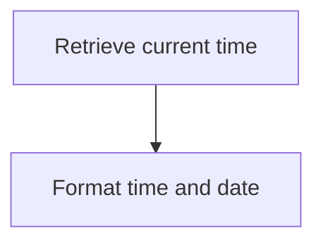

<SwmSnippet path="/src/base/cobol_src/BNK1CCA.cbl" line="940">

---

### Retrieving current time

First, the function retrieves the current time using the <SwmToken path="src/base/cobol_src/BNK1CCA.cbl" pos="940:1:5" line-data="           EXEC CICS ASKTIME">`EXEC CICS ASKTIME`</SwmToken> command, which stores the time in <SwmToken path="src/base/cobol_src/BNK1CCA.cbl" pos="941:3:7" line-data="              ABSTIME(WS-U-TIME)">`WS-U-TIME`</SwmToken>.

```cobol
           EXEC CICS ASKTIME
              ABSTIME(WS-U-TIME)
           END-EXEC.
```

---

</SwmSnippet>

<SwmSnippet path="/src/base/cobol_src/BNK1CCA.cbl" line="944">

---

### Formatting time and date

Next, the function formats the retrieved time into a human-readable date and time using the <SwmToken path="src/base/cobol_src/BNK1CCA.cbl" pos="944:1:5" line-data="           EXEC CICS FORMATTIME">`EXEC CICS FORMATTIME`</SwmToken> command. The formatted date is stored in <SwmToken path="src/base/cobol_src/BNK1CCA.cbl" pos="946:3:7" line-data="                     DDMMYYYY(WS-ORIG-DATE)">`WS-ORIG-DATE`</SwmToken> and the time in <SwmToken path="src/base/cobol_src/BNK1CCA.cbl" pos="947:3:7" line-data="                     TIME(WS-TIME-NOW)">`WS-TIME-NOW`</SwmToken>.

```cobol
           EXEC CICS FORMATTIME
                     ABSTIME(WS-U-TIME)
                     DDMMYYYY(WS-ORIG-DATE)
                     TIME(WS-TIME-NOW)
                     DATESEP
           END-EXEC.
```

---

</SwmSnippet>

## <SwmToken path="src/base/cobol_src/BNK1CCA.cbl" pos="289:3:7" line-data="              PERFORM ABEND-THIS-TASK">`ABEND-THIS-TASK`</SwmToken>

Lets' zoom into this section of the flow:

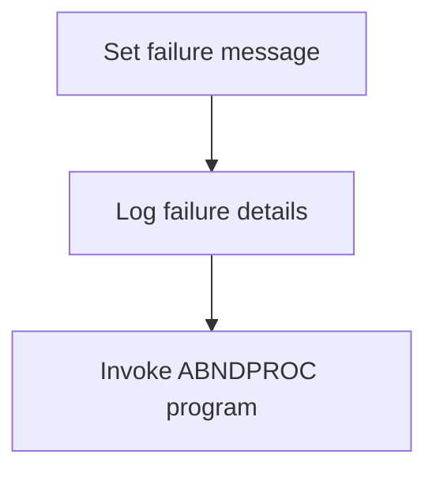

<SwmSnippet path="/src/base/cobol_src/BNK1CCA.cbl" line="986">

---

### Handling abnormal task termination

The <SwmToken path="src/base/cobol_src/BNK1CCA.cbl" pos="289:3:7" line-data="              PERFORM ABEND-THIS-TASK">`ABEND-THIS-TASK`</SwmToken> function is responsible for handling abnormal task termination in the application. It sets a failure message in the <SwmToken path="src/base/cobol_src/BNK1CCA.cbl" pos="284:3:7" line-data="              INITIALIZE WS-FAIL-INFO">`WS-FAIL-INFO`</SwmToken> structure, which includes details like the application ID, response codes, and a message indicating the task is abending. This information is crucial for diagnosing and resolving issues that caused the abnormal termination. The function then logs these details and invokes the <SwmToken path="src/base/cobol_src/BNK1CCA.cbl" pos="136:19:19" line-data="       01 WS-ABEND-PGM                 PIC X(8) VALUE &#39;ABNDPROC&#39;.">`ABNDPROC`</SwmToken> program to handle the abend processing, ensuring that all relevant transaction details are captured and written to the `ABNDFILE` for further analysis.

```cobol

```

---

</SwmSnippet>

## <SwmToken path="src/base/cobol_src/BNK1CCA.cbl" pos="190:3:7" line-data="                 PERFORM SEND-TERMINATION-MSG">`SEND-TERMINATION-MSG`</SwmToken>

Lets' zoom into this section of the flow:

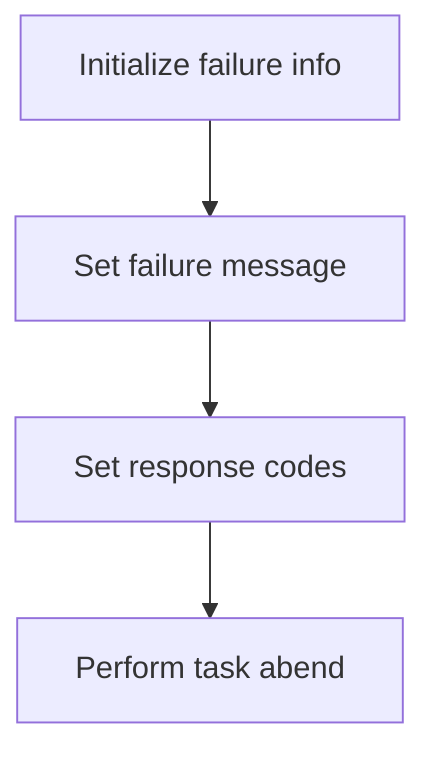

<SwmSnippet path="/src/base/cobol_src/BNK1CCA.cbl" line="913">

---

### Initializing failure information

First, the function initializes the failure information structure to prepare for handling the abnormal termination.

```cobol
              INITIALIZE WS-FAIL-INFO
```

---

</SwmSnippet>

<SwmSnippet path="/src/base/cobol_src/BNK1CCA.cbl" line="914">

---

### Setting failure message

Next, it sets a specific failure message indicating that sending text has failed, which helps in diagnosing the issue.

```cobol
              MOVE 'BNK1CCA - STM010 - SEND TEXT FAIL'
                 TO WS-CICS-FAIL-MSG
```

---

</SwmSnippet>

<SwmSnippet path="/src/base/cobol_src/BNK1CCA.cbl" line="916">

---

### Setting response codes and performing task abend

Then, it sets the response codes for display and performs the task abend to terminate the task abnormally, ensuring that the failure is logged and can be investigated.

```cobol
              MOVE WS-CICS-RESP  TO WS-CICS-RESP-DISP
              MOVE WS-CICS-RESP2 TO WS-CICS-RESP2-DISP
              PERFORM ABEND-THIS-TASK
```

---

</SwmSnippet>

## <SwmToken path="src/base/cobol_src/BNK1CCA.cbl" pos="211:3:5" line-data="                  PERFORM PROCESS-MAP">`PROCESS-MAP`</SwmToken>

Lets' zoom into this section of the flow:

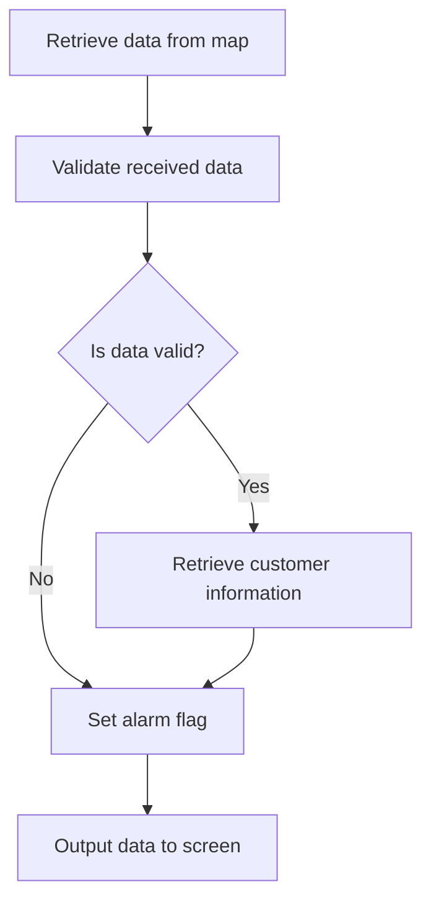

<SwmSnippet path="/src/base/cobol_src/BNK1CCA.cbl" line="296">

---

First, the function retrieves the data from the map, which is essential for processing the customer's request.

```cobol
        PROCESS-MAP SECTION.
        PM010.
      *
      *    Retrieve the data from the map
      *
           PERFORM RECEIVE-MAP.
```

---

</SwmSnippet>

<SwmSnippet path="/src/base/cobol_src/BNK1CCA.cbl" line="303">

---

Moving to the next step, the function validates the received data to ensure it meets the required criteria.

```cobol
      *
      *    Validate the received data
      *
           PERFORM EDIT-DATA.
```

---

</SwmSnippet>

<SwmSnippet path="/src/base/cobol_src/BNK1CCA.cbl" line="308">

---

Next, if the data passes validation, the function proceeds to retrieve the customer information.

```cobol
      *
      *    If the data passes validation go on to
      *    retrieve the CUSTOMER information
      *
           IF VALID-DATA
              PERFORM GET-CUST-DATA
           END-IF.
```

---

</SwmSnippet>

<SwmSnippet path="/src/base/cobol_src/BNK1CCA.cbl" line="316">

---

Then, the function sets the alarm flag to indicate that the data retrieval process is complete.

```cobol
           SET SEND-DATAONLY-ALARM TO TRUE.
```

---

</SwmSnippet>

<SwmSnippet path="/src/base/cobol_src/BNK1CCA.cbl" line="318">

---

Finally, the function outputs the data to the screen, allowing the bank teller to view the customer's information.

```cobol
      *
      *    Output the data to the screen
      *
           PERFORM SEND-MAP.
```

---

</SwmSnippet>

## <SwmToken path="src/base/cobol_src/BNK1CCA.cbl" pos="301:3:5" line-data="           PERFORM RECEIVE-MAP.">`RECEIVE-MAP`</SwmToken>

Lets' zoom into this section of the flow:

```mermaid
graph TD
  A[Initialize BNK1ACCI] --> B[Receive Map Data] --> C{Check Response}
  C -->|Normal| D[Continue Processing]
  C -->|Error| E[Initialize ABNDINFO-REC]
  E --> F[Move EIBRESP to ABND-RESPCODE]
  F --> G[Move EIBRESP2 to ABND-RESP2CODE]
  G --> H[Assign APPLID to ABND-APPLID]
  H --> I[Move EIBTASKN to ABND-TASKNO-KEY]
  I --> J[Move EIBTRNID to ABND-TRANID]
  J --> K[Perform POPULATE-TIME-DATE]
  K --> L[Move WS-ORIG-DATE to ABND-DATE]
  L --> M[Format and Move Time to ABND-TIME]
  M --> N[Move WS-U-TIME to ABND-UTIME-KEY]
  N --> O[Move 'HBNK' to ABND-CODE]
  O --> P[Assign PROGRAM to ABND-PROGRAM]
  P --> Q[Move ZEROS to ABND-SQLCODE]
  Q --> R[Format and Move Error Message to ABND-FREEFORM]
  R --> S[Link to ABEND Handler]
  S --> T[Initialize WS-FAIL-INFO]
  T --> U[Move Error Message to WS-CICS-FAIL-MSG]
  U --> V[Move WS-CICS-RESP to WS-CICS-RESP-DISP]
  V --> W[Move WS-CICS-RESP2 to WS-CICS-RESP2-DISP]
  W --> X[Perform ABEND-THIS-TASK]

%% Swimm:
%% graph TD
%%   A[Initialize <SwmToken path="src/base/cobol_src/BNK1CCA.cbl" pos="332:3:3" line-data="            INITIALIZE BNK1ACCI.">`BNK1ACCI`</SwmToken>] --> B[Receive Map Data] --> C{Check Response}
%%   C -->|Normal| D[Continue Processing]
%%   C -->|Error| E[Initialize <SwmToken path="src/base/cobol_src/BNK1CCA.cbl" pos="240:3:5" line-data="              INITIALIZE ABNDINFO-REC">`ABNDINFO-REC`</SwmToken>]
%%   E --> F[Move EIBRESP to <SwmToken path="src/base/cobol_src/BNK1CCA.cbl" pos="241:7:9" line-data="              MOVE EIBRESP    TO ABND-RESPCODE">`ABND-RESPCODE`</SwmToken>]
%%   F --> G[Move <SwmToken path="src/base/cobol_src/BNK1CCA.cbl" pos="242:3:3" line-data="              MOVE EIBRESP2   TO ABND-RESP2CODE">`EIBRESP2`</SwmToken> to <SwmToken path="src/base/cobol_src/BNK1CCA.cbl" pos="242:7:9" line-data="              MOVE EIBRESP2   TO ABND-RESP2CODE">`ABND-RESP2CODE`</SwmToken>]
%%   G --> H[Assign APPLID to <SwmToken path="src/base/cobol_src/BNK1CCA.cbl" pos="246:9:11" line-data="              EXEC CICS ASSIGN APPLID(ABND-APPLID)">`ABND-APPLID`</SwmToken>]
%%   H --> I[Move EIBTASKN to <SwmToken path="src/base/cobol_src/BNK1CCA.cbl" pos="249:7:11" line-data="              MOVE EIBTASKN   TO ABND-TASKNO-KEY">`ABND-TASKNO-KEY`</SwmToken>]
%%   I --> J[Move EIBTRNID to <SwmToken path="src/base/cobol_src/BNK1CCA.cbl" pos="250:7:9" line-data="              MOVE EIBTRNID   TO ABND-TRANID">`ABND-TRANID`</SwmToken>]
%%   J --> K[Perform <SwmToken path="src/base/cobol_src/BNK1CCA.cbl" pos="252:3:7" line-data="              PERFORM POPULATE-TIME-DATE">`POPULATE-TIME-DATE`</SwmToken>]
%%   K --> L[Move <SwmToken path="src/base/cobol_src/BNK1CCA.cbl" pos="254:3:7" line-data="              MOVE WS-ORIG-DATE TO ABND-DATE">`WS-ORIG-DATE`</SwmToken> to <SwmToken path="src/base/cobol_src/BNK1CCA.cbl" pos="254:11:13" line-data="              MOVE WS-ORIG-DATE TO ABND-DATE">`ABND-DATE`</SwmToken>]
%%   L --> M[Format and Move Time to <SwmToken path="src/base/cobol_src/BNK1CCA.cbl" pos="260:3:5" line-data="                     INTO ABND-TIME">`ABND-TIME`</SwmToken>]
%%   M --> N[Move <SwmToken path="src/base/cobol_src/BNK1CCA.cbl" pos="263:3:7" line-data="              MOVE WS-U-TIME   TO ABND-UTIME-KEY">`WS-U-TIME`</SwmToken> to <SwmToken path="src/base/cobol_src/BNK1CCA.cbl" pos="263:11:15" line-data="              MOVE WS-U-TIME   TO ABND-UTIME-KEY">`ABND-UTIME-KEY`</SwmToken>]
%%   N --> O[Move 'HBNK' to <SwmToken path="src/base/cobol_src/BNK1CCA.cbl" pos="264:9:11" line-data="              MOVE &#39;HBNK&#39;      TO ABND-CODE">`ABND-CODE`</SwmToken>]
%%   O --> P[Assign PROGRAM to <SwmToken path="src/base/cobol_src/BNK1CCA.cbl" pos="266:9:11" line-data="              EXEC CICS ASSIGN PROGRAM(ABND-PROGRAM)">`ABND-PROGRAM`</SwmToken>]
%%   P --> Q[Move ZEROS to <SwmToken path="src/base/cobol_src/BNK1CCA.cbl" pos="479:7:9" line-data="              MOVE ZEROS      TO ABND-SQLCODE">`ABND-SQLCODE`</SwmToken>]
%%   Q --> R[Format and Move Error Message to <SwmToken path="src/base/cobol_src/BNK1CCA.cbl" pos="277:3:5" line-data="                    INTO ABND-FREEFORM">`ABND-FREEFORM`</SwmToken>]
%%   R --> S[Link to ABEND Handler]
%%   S --> T[Initialize <SwmToken path="src/base/cobol_src/BNK1CCA.cbl" pos="284:3:7" line-data="              INITIALIZE WS-FAIL-INFO">`WS-FAIL-INFO`</SwmToken>]
%%   T --> U[Move Error Message to <SwmToken path="src/base/cobol_src/BNK1CCA.cbl" pos="286:1:7" line-data="                 WS-CICS-FAIL-MSG">`WS-CICS-FAIL-MSG`</SwmToken>]
%%   U --> V[Move <SwmToken path="src/base/cobol_src/BNK1CCA.cbl" pos="181:3:7" line-data="                    RESP(WS-CICS-RESP)">`WS-CICS-RESP`</SwmToken> to <SwmToken path="src/base/cobol_src/BNK1CCA.cbl" pos="287:11:17" line-data="              MOVE WS-CICS-RESP  TO WS-CICS-RESP-DISP">`WS-CICS-RESP-DISP`</SwmToken>]
%%   V --> W[Move <SwmToken path="src/base/cobol_src/BNK1CCA.cbl" pos="182:3:7" line-data="                    RESP2(WS-CICS-RESP2)">`WS-CICS-RESP2`</SwmToken> to <SwmToken path="src/base/cobol_src/BNK1CCA.cbl" pos="288:11:17" line-data="              MOVE WS-CICS-RESP2 TO WS-CICS-RESP2-DISP">`WS-CICS-RESP2-DISP`</SwmToken>]
%%   W --> X[Perform <SwmToken path="src/base/cobol_src/BNK1CCA.cbl" pos="289:3:7" line-data="              PERFORM ABEND-THIS-TASK">`ABEND-THIS-TASK`</SwmToken>]
```

<SwmSnippet path="/src/base/cobol_src/BNK1CCA.cbl" line="332">

---

### Initializing <SwmToken path="src/base/cobol_src/BNK1CCA.cbl" pos="332:3:3" line-data="            INITIALIZE BNK1ACCI.">`BNK1ACCI`</SwmToken>

First, the <SwmToken path="src/base/cobol_src/BNK1CCA.cbl" pos="332:3:3" line-data="            INITIALIZE BNK1ACCI.">`BNK1ACCI`</SwmToken> structure is initialized to ensure it is ready to receive data from the map.

```cobol
            INITIALIZE BNK1ACCI.
```

---

</SwmSnippet>

<SwmSnippet path="/src/base/cobol_src/BNK1CCA.cbl" line="333">

---

### Receiving Map Data

Next, the map data is received into the <SwmToken path="src/base/cobol_src/BNK1CCA.cbl" pos="336:3:3" line-data="               INTO(BNK1ACCI)">`BNK1ACCI`</SwmToken> structure using the <SwmToken path="src/base/cobol_src/BNK1CCA.cbl" pos="334:1:3" line-data="               RECEIVE MAP(&#39;BNK1ACC&#39;)">`RECEIVE MAP`</SwmToken> command. This command retrieves the data entered by the user on the screen.

```cobol
            EXEC CICS
               RECEIVE MAP('BNK1ACC')
               MAPSET('BNK1ACC')
               INTO(BNK1ACCI)
               RESP(WS-CICS-RESP)
               RESP2(WS-CICS-RESP2)
            END-EXEC.
```

---

</SwmSnippet>

<SwmSnippet path="/src/base/cobol_src/BNK1CCA.cbl" line="341">

---

### Checking Response

The response from the <SwmToken path="src/base/cobol_src/BNK1CCA.cbl" pos="334:1:3" line-data="               RECEIVE MAP(&#39;BNK1ACC&#39;)">`RECEIVE MAP`</SwmToken> command is then checked. If the response is not normal, error handling procedures are initiated.

```cobol
            IF WS-CICS-RESP NOT = DFHRESP(NORMAL)
```

---

</SwmSnippet>

<SwmSnippet path="/src/base/cobol_src/BNK1CCA.cbl" line="349">

---

### Initializing <SwmToken path="src/base/cobol_src/BNK1CCA.cbl" pos="349:3:5" line-data="               INITIALIZE ABNDINFO-REC">`ABNDINFO-REC`</SwmToken>

If an error occurs, the <SwmToken path="src/base/cobol_src/BNK1CCA.cbl" pos="349:3:5" line-data="               INITIALIZE ABNDINFO-REC">`ABNDINFO-REC`</SwmToken> structure is initialized to store information about the abnormal termination.

```cobol
               INITIALIZE ABNDINFO-REC
```

---

</SwmSnippet>

<SwmSnippet path="/src/base/cobol_src/BNK1CCA.cbl" line="350">

---

### Moving Response Codes

The response codes <SwmToken path="src/base/cobol_src/BNK1CCA.cbl" pos="350:3:3" line-data="               MOVE EIBRESP    TO ABND-RESPCODE">`EIBRESP`</SwmToken> and <SwmToken path="src/base/cobol_src/BNK1CCA.cbl" pos="351:3:3" line-data="               MOVE EIBRESP2   TO ABND-RESP2CODE">`EIBRESP2`</SwmToken> are moved to <SwmToken path="src/base/cobol_src/BNK1CCA.cbl" pos="350:7:9" line-data="               MOVE EIBRESP    TO ABND-RESPCODE">`ABND-RESPCODE`</SwmToken> and <SwmToken path="src/base/cobol_src/BNK1CCA.cbl" pos="351:7:9" line-data="               MOVE EIBRESP2   TO ABND-RESP2CODE">`ABND-RESP2CODE`</SwmToken> respectively for further processing.

```cobol
               MOVE EIBRESP    TO ABND-RESPCODE
               MOVE EIBRESP2   TO ABND-RESP2CODE
```

---

</SwmSnippet>

<SwmSnippet path="/src/base/cobol_src/BNK1CCA.cbl" line="355">

---

### Assigning Application ID

The application ID is assigned to <SwmToken path="src/base/cobol_src/BNK1CCA.cbl" pos="355:9:11" line-data="               EXEC CICS ASSIGN APPLID(ABND-APPLID)">`ABND-APPLID`</SwmToken> to identify the application that encountered the error.

```cobol
               EXEC CICS ASSIGN APPLID(ABND-APPLID)
               END-EXEC
```

---

</SwmSnippet>

<SwmSnippet path="/src/base/cobol_src/BNK1CCA.cbl" line="358">

---

### Moving Task and Transaction IDs

The task number and transaction ID are moved to <SwmToken path="src/base/cobol_src/BNK1CCA.cbl" pos="358:7:11" line-data="               MOVE EIBTASKN   TO ABND-TASKNO-KEY">`ABND-TASKNO-KEY`</SwmToken> and <SwmToken path="src/base/cobol_src/BNK1CCA.cbl" pos="359:7:9" line-data="               MOVE EIBTRNID   TO ABND-TRANID">`ABND-TRANID`</SwmToken> respectively to log the specific task and transaction that failed.

```cobol
               MOVE EIBTASKN   TO ABND-TASKNO-KEY
               MOVE EIBTRNID   TO ABND-TRANID
```

---

</SwmSnippet>

<SwmSnippet path="/src/base/cobol_src/BNK1CCA.cbl" line="361">

---

### Populating Date and Time

The current date and time are populated into the <SwmToken path="src/base/cobol_src/BNK1CCA.cbl" pos="363:11:13" line-data="               MOVE WS-ORIG-DATE TO ABND-DATE">`ABND-DATE`</SwmToken> and <SwmToken path="src/base/cobol_src/BNK1CCA.cbl" pos="369:3:5" line-data="                      INTO ABND-TIME">`ABND-TIME`</SwmToken> fields to record when the error occurred.

```cobol
               PERFORM POPULATE-TIME-DATE

               MOVE WS-ORIG-DATE TO ABND-DATE
               STRING WS-TIME-NOW-GRP-HH DELIMITED BY SIZE,
                     ':' DELIMITED BY SIZE,
                      WS-TIME-NOW-GRP-MM DELIMITED BY SIZE,
                      ':' DELIMITED BY SIZE,
                      WS-TIME-NOW-GRP-MM DELIMITED BY SIZE
                      INTO ABND-TIME
```

---

</SwmSnippet>

<SwmSnippet path="/src/base/cobol_src/BNK1CCA.cbl" line="372">

---

### Moving Additional Information

Additional information such as <SwmToken path="src/base/cobol_src/BNK1CCA.cbl" pos="372:3:7" line-data="               MOVE WS-U-TIME   TO ABND-UTIME-KEY">`WS-U-TIME`</SwmToken>, <SwmToken path="src/base/cobol_src/BNK1CCA.cbl" pos="373:4:4" line-data="               MOVE &#39;HBNK&#39;      TO ABND-CODE">`HBNK`</SwmToken>, and the program name are moved to their respective fields in the <SwmToken path="src/base/cobol_src/BNK1CCA.cbl" pos="240:3:5" line-data="              INITIALIZE ABNDINFO-REC">`ABNDINFO-REC`</SwmToken> structure.

```cobol
               MOVE WS-U-TIME   TO ABND-UTIME-KEY
               MOVE 'HBNK'      TO ABND-CODE

               EXEC CICS ASSIGN PROGRAM(ABND-PROGRAM)
               END-EXEC
```

---

</SwmSnippet>

<SwmSnippet path="/src/base/cobol_src/BNK1CCA.cbl" line="380">

---

### Formatting Error Message

An error message is formatted and moved to <SwmToken path="src/base/cobol_src/BNK1CCA.cbl" pos="386:3:5" line-data="                     INTO ABND-FREEFORM">`ABND-FREEFORM`</SwmToken> to provide a detailed description of the error.

```cobol
               STRING 'RM010 - RECEIVE MAP FAIL.'
                     DELIMITED BY SIZE,
                     'EIBRESP=' DELIMITED BY SIZE,
                     ABND-RESPCODE DELIMITED BY SIZE,
                     ' RESP2=' DELIMITED BY SIZE,
                     ABND-RESP2CODE DELIMITED BY SIZE
                     INTO ABND-FREEFORM
```

---

</SwmSnippet>

<SwmSnippet path="/src/base/cobol_src/BNK1CCA.cbl" line="389">

---

### Linking to ABEND Handler

Finally, the <SwmToken path="src/base/cobol_src/BNK1CCA.cbl" pos="390:3:5" line-data="                         COMMAREA(ABNDINFO-REC)">`ABNDINFO-REC`</SwmToken> structure is passed to the ABEND handler program to log the error and terminate the task.

More about ABNDPROC: <SwmLink doc-title="Writing Abend Records (ABNDPROC)">[Writing Abend Records (ABNDPROC)](/.swm/writing-abend-records-abndproc.svfj4jn5.sw.md)</SwmLink>

```cobol
               EXEC CICS LINK PROGRAM(WS-ABEND-PGM)
                         COMMAREA(ABNDINFO-REC)
               END-EXEC
```

---

</SwmSnippet>

## <SwmToken path="src/base/cobol_src/BNK1CCA.cbl" pos="306:3:5" line-data="           PERFORM EDIT-DATA.">`EDIT-DATA`</SwmToken>

Lets' zoom into this section of the flow:

```mermaid
graph TD
  A[Check if data is valid] -->|Yes| B[Update customer data]
  A -->|No| C[Handle invalid data]
```

<SwmSnippet path="/src/base/cobol_src/BNK1CCA.cbl" line="467">

---

### Checking if data is valid

The <SwmToken path="src/base/cobol_src/BNK1CCA.cbl" pos="306:3:5" line-data="           PERFORM EDIT-DATA.">`EDIT-DATA`</SwmToken> function begins by checking if the data is valid using the <SwmToken path="src/base/cobol_src/BNK1CCA.cbl" pos="312:3:5" line-data="           IF VALID-DATA">`VALID-DATA`</SwmToken> flag. If the data is valid, the function proceeds to update the customer data. If the data is not valid, it handles the invalid data scenario appropriately.

```cobol
                             WS-TIME-NOW-GRP-MM DELIMITED BY SIZE,
                      ':' DELIMITED BY SIZE,
                      WS-TIME-NOW-GRP-MM DELIMITED BY SIZE
                      INTO ABND-TIME
              END-STRING

              MOVE WS-U-TIME   TO ABND-UTIME-KEY
              MOVE 'HBNK'      TO ABND-CODE

              EXEC CICS ASSIGN PROGRAM(ABND-PROGRAM)
              END-EXEC

              MOVE ZEROS      TO ABND-SQLCODE
```

---

</SwmSnippet>

## <SwmToken path="src/base/cobol_src/BNK1CCA.cbl" pos="313:3:7" line-data="              PERFORM GET-CUST-DATA">`GET-CUST-DATA`</SwmToken>

Lets' zoom into this section of the flow:

```mermaid
graph TD
  A[Set up fields for INQACCCU] --> B[Link to INQACCCU] --> C{Check if link was successful}
  C -- Yes --> D{Check if customer was found}
  D -- No --> E[Set error message and clear account numbers]
  D -- Yes --> F{Check number of accounts}
  F -- Zero --> G[Set no accounts message]
  F -- More than zero --> H{Check if communication was successful}
  H -- No --> I[Set error message]
  H -- Yes --> J[Set success message and populate account details]
```

<SwmSnippet path="/src/base/cobol_src/BNK1CCA.cbl" line="426">

---

### Setting up fields for INQACCCU

First, the necessary fields for the <SwmToken path="src/base/cobol_src/BNK1CCA.cbl" pos="427:15:15" line-data="           MOVE &#39;N&#39; TO COMM-SUCCESS OF INQACCCU-COMMAREA.">`INQACCCU`</SwmToken> program are set up. This includes initializing the number of accounts to 20 and setting the communication success flag to 'N'.

```cobol
           MOVE 20 TO NUMBER-OF-ACCOUNTS.
           MOVE 'N' TO COMM-SUCCESS OF INQACCCU-COMMAREA.

```

---

</SwmSnippet>

<SwmSnippet path="/src/base/cobol_src/BNK1CCA.cbl" line="429">

---

### Linking to INQACCCU

Next, the customer number is moved to the communication area, and the program links to <SwmToken path="src/base/cobol_src/BNK1CCA.cbl" pos="429:13:13" line-data="           MOVE CUSTNOI TO CUSTOMER-NUMBER OF INQACCCU-COMMAREA.">`INQACCCU`</SwmToken> to retrieve customer data.

```cobol
           MOVE CUSTNOI TO CUSTOMER-NUMBER OF INQACCCU-COMMAREA.
           SET COMM-PCB-POINTER TO NULL.

      *
      *    Link to INQACCCU
      *
           EXEC CICS LINK
               PROGRAM(INQACCCU-PROGRAM)
               COMMAREA(INQACCCU-COMMAREA)
               RESP(WS-CICS-RESP)
               RESP2(WS-CICS-RESP2)
               SYNCONRETURN
           END-EXEC.
```

---

</SwmSnippet>

<SwmSnippet path="/src/base/cobol_src/BNK1CCA.cbl" line="443">

---

### Handling link failure

If the link to <SwmToken path="src/base/cobol_src/BNK1CCA.cbl" pos="427:15:15" line-data="           MOVE &#39;N&#39; TO COMM-SUCCESS OF INQACCCU-COMMAREA.">`INQACCCU`</SwmToken> fails, the program captures the response codes and additional information, then links to the <SwmToken path="src/base/cobol_src/BNK1CCA.cbl" pos="136:19:19" line-data="       01 WS-ABEND-PGM                 PIC X(8) VALUE &#39;ABNDPROC&#39;.">`ABNDPROC`</SwmToken> program to handle the abnormal termination.

```cobol
           IF WS-CICS-RESP NOT = DFHRESP(NORMAL)
      *
      *       Preserve the RESP and RESP2, then set up the
      *       standard ABEND info before getting the applid,
      *       date/time etc. and linking to the Abend Handler
      *       program.
      *
              INITIALIZE ABNDINFO-REC
              MOVE EIBRESP    TO ABND-RESPCODE
              MOVE EIBRESP2   TO ABND-RESP2CODE
      *
      *       Get supplemental information
      *
              EXEC CICS ASSIGN APPLID(ABND-APPLID)
              END-EXEC

              MOVE EIBTASKN   TO ABND-TASKNO-KEY
              MOVE EIBTRNID   TO ABND-TRANID

              PERFORM POPULATE-TIME-DATE

```

---

</SwmSnippet>

<SwmSnippet path="/src/base/cobol_src/BNK1CCA.cbl" line="502">

---

### Customer not found

If no matching customer is found, an appropriate message is set, and the account numbers on the screen are cleared.

More about ABNDPROC: <SwmLink doc-title="Writing Abend Records (ABNDPROC)">[Writing Abend Records (ABNDPROC)](/.swm/writing-abend-records-abndproc.svfj4jn5.sw.md)</SwmLink>

```cobol
      *
      *    If no matching customer was found
      *
           IF CUSTOMER-FOUND = 'N'
              MOVE SPACES TO MESSAGEO
              STRING 'Unable to find customer '
                 CUSTOMER-NUMBER DELIMITED BY SIZE
              INTO MESSAGEO

      *
      *       Empty the account numbers in the on screen array
      *
              PERFORM VARYING WS-INDEX FROM 1 BY 1 UNTIL
              WS-INDEX > 10
                 MOVE SPACES TO ACCOUNTO(WS-INDEX)
              END-PERFORM

              GO TO GCD999
           END-IF.
```

---

</SwmSnippet>

<SwmSnippet path="/src/base/cobol_src/BNK1CCA.cbl" line="522">

---

### Customer found

If a customer is found, the account numbers on the screen are cleared, and the program checks the number of accounts.

```cobol
      *
      *    If a customer was found, empty the account numbers
      *    in the on screen array
      *
           PERFORM VARYING WS-INDEX FROM 1 BY 1 UNTIL
           WS-INDEX > 10
```

---

</SwmSnippet>

<SwmSnippet path="/src/base/cobol_src/BNK1CCA.cbl" line="531">

---

### No accounts found

If no accounts are found for the customer, a message indicating this is set.

```cobol
           IF NUMBER-OF-ACCOUNTS = ZERO
              MOVE 'No accounts found for customer' to MESSAGEO
```

---

</SwmSnippet>

<SwmSnippet path="/src/base/cobol_src/BNK1CCA.cbl" line="534">

---

### Communication failure

If the communication with <SwmToken path="src/base/cobol_src/BNK1CCA.cbl" pos="427:15:15" line-data="           MOVE &#39;N&#39; TO COMM-SUCCESS OF INQACCCU-COMMAREA.">`INQACCCU`</SwmToken> was not successful, an error message is set.

```cobol
              IF COMM-SUCCESS = 'N'
                 MOVE SPACES TO MESSAGEO
                 STRING 'Error accessing accounts for customer '
                    CUSTOMER-NUMBER '.' DELIMITED BY SIZE
                 INTO MESSAGEO
```

---

</SwmSnippet>

<SwmSnippet path="/src/base/cobol_src/BNK1CCA.cbl" line="540">

---

### Accounts found

If accounts are found and the communication was successful, a success message is set, and the account details are populated on the screen.

```cobol
                 MOVE NUMBER-OF-ACCOUNTS TO NUMBER-OF-ACCOUNTS-DISPLAY
                 MOVE SPACES TO MESSAGEO
                 STRING NUMBER-OF-ACCOUNTS-DISPLAY
                    DELIMITED BY SIZE,
                    ' accounts found' DELIMITED BY SIZE
                 INTO MESSAGEO
```

---

</SwmSnippet>

<SwmSnippet path="/src/base/cobol_src/BNK1CCA.cbl" line="548">

---

### Populating account details

The program then populates the account details on the screen, including account numbers, types, and balances.

```cobol
      *
      *       Populate the account number/s on screen (along
      *       with other information returned from INQACCCU).
      *
              PERFORM VARYING WS-INDEX FROM 1 BY 1 UNTIL
              WS-INDEX > NUMBER-OF-ACCOUNTS
              OR WS-INDEX > 10
                 MOVE COMM-SCODE OF INQACCCU-COMMAREA(WS-INDEX)
                    TO SCODE-CHAR
                 MOVE COMM-ACCNO(WS-INDEX) TO ACCNO-CHAR
                 MOVE SPACES TO ACCOUNTO(WS-INDEX)
                 MOVE ' ' TO WS-AVAIL-BAL-SIGN
                 MOVE ' ' TO WS-ACT-BAL-SIGN

                 IF COMM-AVAIL-BAL(WS-INDEX) < 0
                    MOVE '-' TO WS-AVAIL-BAL-SIGN
                 ELSE
                    MOVE '+' TO WS-AVAIL-BAL-SIGN
                 END-IF

                 IF COMM-ACTUAL-BAL(WS-INDEX) < 0
```

---

</SwmSnippet>

&nbsp;

*This is an auto-generated document by Swimm 🌊 and has not yet been verified by a human*

<SwmMeta version="3.0.0" repo-id="Z2l0aHViJTNBJTNBY2ljcy1iYW5raW5nLXNhbXBsZS1hcHBsaWNhdGlvbi1jYnNhLUlCTS1EZW1vJTNBJTNBU3dpbW0tRGVtbw==" repo-name="cics-banking-sample-application-cbsa-IBM-Demo"><sup>Powered by [Swimm](/)</sup></SwmMeta>
