The <SwmToken path="src/base/cobol_src/BNK1UAC.cbl" pos="1211:4:4" line-data="                 MOVE &#39;BNK1UAC - SM010 - SEND MAP DATAONLY FAIL &#39;">`BNK1UAC`</SwmToken> program is responsible for handling user account operations in the banking system. It achieves this by processing user inputs, validating data, and interacting with other programs to retrieve and update account information.

The flow starts by initializing or handling user input, then it terminates on invalid input, handles clear input, processes enter or <SwmToken path="src/base/cobol_src/BNK1UAC.cbl" pos="520:8:8" line-data="                 &#39;. Then press PF5.&#39; DELIMITED BY SIZE">`PF5`</SwmToken> input, and handles invalid input. It establishes communication area context, returns control to CICS, and handles responses that are not normal. The program also includes sections for sending maps with different options and processing user actions.

Here is a high level diagram of the program:

```mermaid
graph TD
sin6i("Initialize or handle user input"):::a6666a233  --> 
jr0i0("Terminate on invalid input"):::a7a2bf2b5  --> 
esh18("Handle clear input"):::a10afa287  --> 
ngddp("Handle enter or PF5 input"):::a34661248  --> 
u2uq0("Handle invalid input"):::aa3c7a81c  --> 
tcrhl("Establish communication area context"):::aec4a25ad  --> 
oxctk("Return control to CICS"):::ac6e7fdf0  --> 
bzf48("Handle response not normal"):::a956f42e3 
classDef a6666a233 color:#000000,fill:#7CB9F4
classDef a7a2bf2b5 color:#000000,fill:#00FFAA
classDef a10afa287 color:#000000,fill:#00FFF4
classDef a34661248 color:#000000,fill:#FFFF00
classDef aa3c7a81c color:#000000,fill:#AA7CB9
classDef aec4a25ad color:#000000,fill:#5afa0a
classDef ac6e7fdf0 color:#000000,fill:#f5a10a
classDef a956f42e3 color:#000000,fill:#f50af1

%% Swimm:
%% graph TD
%% sin6i("Initialize or handle user input"):::a6666a233  --> 
%% jr0i0("Terminate on invalid input"):::a7a2bf2b5  --> 
%% esh18("Handle clear input"):::a10afa287  --> 
%% ngddp("Handle enter or <SwmToken path="src/base/cobol_src/BNK1UAC.cbl" pos="520:8:8" line-data="                 &#39;. Then press PF5.&#39; DELIMITED BY SIZE">`PF5`</SwmToken> input"):::a34661248  --> 
%% u2uq0("Handle invalid input"):::aa3c7a81c  --> 
%% tcrhl("Establish communication area context"):::aec4a25ad  --> 
%% oxctk("Return control to CICS"):::ac6e7fdf0  --> 
%% bzf48("Handle response not normal"):::a956f42e3 
%% classDef a6666a233 color:#000000,fill:#7CB9F4
%% classDef a7a2bf2b5 color:#000000,fill:#00FFAA
%% classDef a10afa287 color:#000000,fill:#00FFF4
%% classDef a34661248 color:#000000,fill:#FFFF00
%% classDef aa3c7a81c color:#000000,fill:#AA7CB9
%% classDef aec4a25ad color:#000000,fill:#5afa0a
%% classDef ac6e7fdf0 color:#000000,fill:#f5a10a
%% classDef a956f42e3 color:#000000,fill:#f50af1
```

## Initialize or handle user input

First, we'll zoom into this section of the flow:

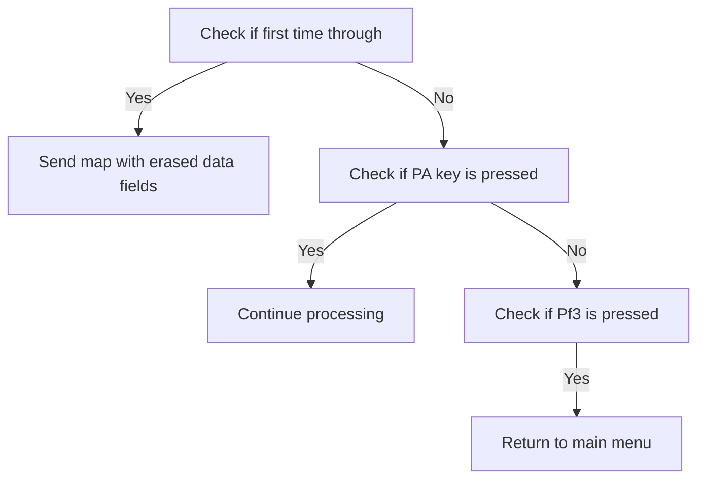

<SwmSnippet path="/src/base/cobol_src/BNK1UAC.cbl" line="200">

---

### Checking if it's the first time through

First, the code checks if it is the first time through by evaluating if <SwmToken path="src/base/cobol_src/BNK1UAC.cbl" pos="205:3:3" line-data="              WHEN EIBCALEN = ZERO">`EIBCALEN`</SwmToken> (the length of the communication area) is zero. If it is, it indicates that this is the initial interaction, and the system prepares to send a map with erased (empty) data fields.

```cobol
           EVALUATE TRUE
      *
      *       Is it the first time through? If so, send the map
      *       with erased (empty) data fields.
      *
              WHEN EIBCALEN = ZERO
                 MOVE LOW-VALUE TO BNK1UAO
                 MOVE -1 TO ACCNOL
                 SET SEND-ERASE TO TRUE
                 INITIALIZE WS-COMM-AREA
                 PERFORM SEND-MAP
```

---

</SwmSnippet>

<SwmSnippet path="/src/base/cobol_src/BNK1UAC.cbl" line="213">

---

### Handling PA key presses

Moving to the next condition, if any PA key (Program Attention key) is pressed, the system simply continues processing without any specific action. This ensures that the system remains responsive to user inputs.

```cobol
      *       If a PA key is pressed, just carry on
      *
              WHEN EIBAID = DFHPA1 OR DFHPA2 OR DFHPA3
                 CONTINUE
```

---

</SwmSnippet>

<SwmSnippet path="/src/base/cobol_src/BNK1UAC.cbl" line="219">

---

### Handling <SwmToken path="src/base/cobol_src/BNK1UAC.cbl" pos="219:5:5" line-data="      *       When Pf3 is pressed, return to the main menu">`Pf3`</SwmToken> key press

Next, if the <SwmToken path="src/base/cobol_src/BNK1UAC.cbl" pos="219:5:5" line-data="      *       When Pf3 is pressed, return to the main menu">`Pf3`</SwmToken> key is pressed, the system initiates a return to the main menu. This is done by executing a CICS RETURN command with the transaction ID 'OMEN', ensuring that the user is redirected appropriately.

```cobol
      *       When Pf3 is pressed, return to the main menu
      *
              WHEN EIBAID = DFHPF3
                 EXEC CICS RETURN
                    TRANSID('OMEN')
                    IMMEDIATE
                    RESP(WS-CICS-RESP)
                    RESP2(WS-CICS-RESP2)
                 END-EXEC
```

---

</SwmSnippet>

## Terminate on invalid input

Now, lets zoom into this section of the flow:

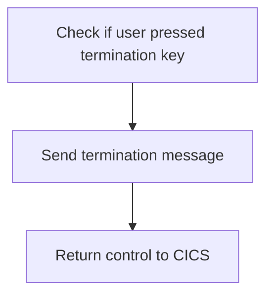

<SwmSnippet path="/src/base/cobol_src/BNK1UAC.cbl" line="233">

---

### Handling user termination requests

The code checks if the user has pressed the termination key by evaluating <SwmToken path="src/base/cobol_src/BNK1UAC.cbl" pos="233:3:3" line-data="              WHEN EIBAID = DFHAID OR DFHPF12">`EIBAID`</SwmToken> against <SwmToken path="src/base/cobol_src/BNK1UAC.cbl" pos="233:7:7" line-data="              WHEN EIBAID = DFHAID OR DFHPF12">`DFHAID`</SwmToken> or <SwmToken path="src/base/cobol_src/BNK1UAC.cbl" pos="233:11:11" line-data="              WHEN EIBAID = DFHAID OR DFHPF12">`DFHPF12`</SwmToken>. If the termination key is pressed, it performs the <SwmToken path="src/base/cobol_src/BNK1UAC.cbl" pos="234:3:7" line-data="                 PERFORM SEND-TERMINATION-MSG">`SEND-TERMINATION-MSG`</SwmToken> routine to notify the user about the termination. Finally, it returns control to CICS using the <SwmToken path="src/base/cobol_src/BNK1UAC.cbl" pos="222:1:5" line-data="                 EXEC CICS RETURN">`EXEC CICS RETURN`</SwmToken> command.

```cobol
              WHEN EIBAID = DFHAID OR DFHPF12
                 PERFORM SEND-TERMINATION-MSG
                 EXEC CICS
                    RETURN
                 END-EXEC
```

---

</SwmSnippet>

## Handle clear input

Now, lets zoom into this section of the flow:

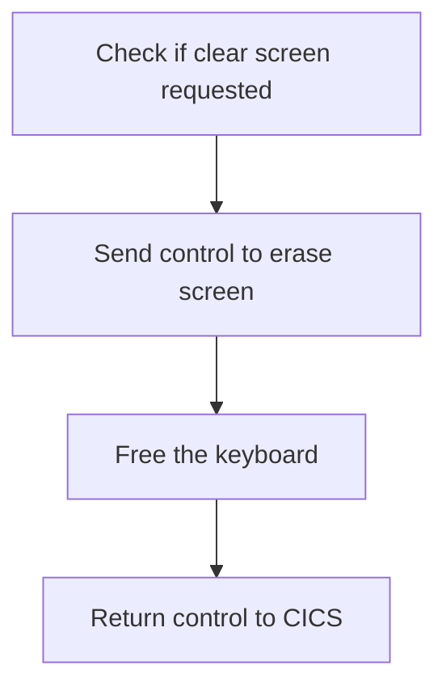

<SwmSnippet path="/src/base/cobol_src/BNK1UAC.cbl" line="242">

---

First, the code checks if the <SwmToken path="src/base/cobol_src/BNK1UAC.cbl" pos="242:3:3" line-data="              WHEN EIBAID = DFHCLEAR">`EIBAID`</SwmToken> (which holds the attention identifier) is equal to <SwmToken path="src/base/cobol_src/BNK1UAC.cbl" pos="242:7:7" line-data="              WHEN EIBAID = DFHCLEAR">`DFHCLEAR`</SwmToken> (the clear screen command). This ensures that the subsequent operations are only performed when a clear screen request is made.

```cobol
              WHEN EIBAID = DFHCLEAR
```

---

</SwmSnippet>

<SwmSnippet path="/src/base/cobol_src/BNK1UAC.cbl" line="243">

---

Next, the <SwmToken path="src/base/cobol_src/BNK1UAC.cbl" pos="243:1:7" line-data="                EXEC CICS SEND CONTROL">`EXEC CICS SEND CONTROL`</SwmToken> command is used to erase the screen and free the keyboard. This clears the current screen display and allows the user to input new data. Finally, the <SwmToken path="src/base/cobol_src/BNK1UAC.cbl" pos="248:1:5" line-data="                EXEC CICS RETURN">`EXEC CICS RETURN`</SwmToken> command returns control to CICS, completing the clear screen operation.

```cobol
                EXEC CICS SEND CONTROL
                   ERASE
                   FREEKB
                END-EXEC

                EXEC CICS RETURN
                END-EXEC
```

---

</SwmSnippet>

## Handle enter or <SwmToken path="src/base/cobol_src/BNK1UAC.cbl" pos="520:8:8" line-data="                 &#39;. Then press PF5.&#39; DELIMITED BY SIZE">`PF5`</SwmToken> input

Now, lets zoom into this section of the flow:

```mermaid
graph TD
  A[Check if Enter key is pressed] --> B[Process the map]
  A --> C[Check if PF5 key is pressed] --> B

%% Swimm:
%% graph TD
%%   A[Check if Enter key is pressed] --> B[Process the map]
%%   A --> C[Check if <SwmToken path="src/base/cobol_src/BNK1UAC.cbl" pos="520:8:8" line-data="                 &#39;. Then press PF5.&#39; DELIMITED BY SIZE">`PF5`</SwmToken> key is pressed] --> B
```

<SwmSnippet path="/src/base/cobol_src/BNK1UAC.cbl" line="254">

---

First, the function checks if the <SwmToken path="src/base/cobol_src/BNK1UAC.cbl" pos="254:3:3" line-data="              WHEN EIBAID = DFHENTER">`EIBAID`</SwmToken> (which holds the key pressed by the user) is equal to <SwmToken path="src/base/cobol_src/BNK1UAC.cbl" pos="254:7:7" line-data="              WHEN EIBAID = DFHENTER">`DFHENTER`</SwmToken> (the Enter key). If the Enter key is pressed, it triggers the <SwmToken path="src/base/cobol_src/BNK1UAC.cbl" pos="255:3:5" line-data="                 PERFORM PROCESS-MAP">`PROCESS-MAP`</SwmToken> routine to handle the user input.

```cobol
              WHEN EIBAID = DFHENTER
                 PERFORM PROCESS-MAP
```

---

</SwmSnippet>

<SwmSnippet path="/src/base/cobol_src/BNK1UAC.cbl" line="260">

---

Next, the function checks if the <SwmToken path="src/base/cobol_src/BNK1UAC.cbl" pos="260:3:3" line-data="              WHEN EIBAID = DFHPF5">`EIBAID`</SwmToken> is equal to <SwmToken path="src/base/cobol_src/BNK1UAC.cbl" pos="260:7:7" line-data="              WHEN EIBAID = DFHPF5">`DFHPF5`</SwmToken> (the <SwmToken path="src/base/cobol_src/BNK1UAC.cbl" pos="520:8:8" line-data="                 &#39;. Then press PF5.&#39; DELIMITED BY SIZE">`PF5`</SwmToken> key). If the <SwmToken path="src/base/cobol_src/BNK1UAC.cbl" pos="520:8:8" line-data="                 &#39;. Then press PF5.&#39; DELIMITED BY SIZE">`PF5`</SwmToken> key is pressed, it also triggers the <SwmToken path="src/base/cobol_src/BNK1UAC.cbl" pos="261:3:5" line-data="                 PERFORM PROCESS-MAP">`PROCESS-MAP`</SwmToken> routine to handle the user input.

```cobol
              WHEN EIBAID = DFHPF5
                 PERFORM PROCESS-MAP
```

---

</SwmSnippet>

## Handle invalid input

Now, lets zoom into this section of the flow:

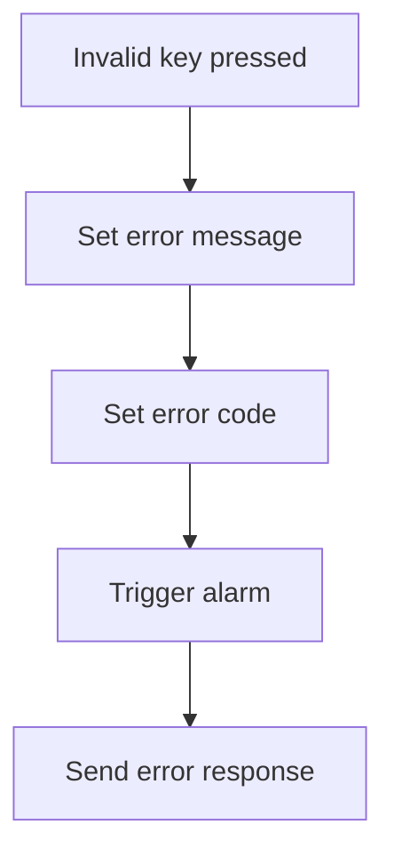

<SwmSnippet path="/src/base/cobol_src/BNK1UAC.cbl" line="266">

---

When an invalid key is pressed during user account operations, the system sets the <SwmToken path="src/base/cobol_src/BNK1UAC.cbl" pos="267:9:9" line-data="                 MOVE LOW-VALUES TO BNK1UAO">`BNK1UAO`</SwmToken> variable to low values, indicating an error state. It then updates the <SwmToken path="src/base/cobol_src/BNK1UAC.cbl" pos="268:14:14" line-data="                 MOVE &#39;Invalid key pressed.&#39; TO MESSAGEO">`MESSAGEO`</SwmToken> variable with the error message 'Invalid key pressed.' to inform the user of the issue. The <SwmToken path="src/base/cobol_src/BNK1UAC.cbl" pos="269:8:8" line-data="                 MOVE -1 TO ACCNOL">`ACCNOL`</SwmToken> variable is set to -1 to denote an invalid account number. The system then triggers an alarm by setting <SwmToken path="src/base/cobol_src/BNK1UAC.cbl" pos="270:3:7" line-data="                 SET SEND-DATAONLY-ALARM TO TRUE">`SEND-DATAONLY-ALARM`</SwmToken> to true, ensuring that the user is alerted to the error. Finally, the <SwmToken path="src/base/cobol_src/BNK1UAC.cbl" pos="271:3:5" line-data="                 PERFORM SEND-MAP">`SEND-MAP`</SwmToken> operation is performed to send the error response back to the user interface.

```cobol
              WHEN OTHER
                 MOVE LOW-VALUES TO BNK1UAO
                 MOVE 'Invalid key pressed.' TO MESSAGEO
                 MOVE -1 TO ACCNOL
                 SET SEND-DATAONLY-ALARM TO TRUE
                 PERFORM SEND-MAP

```

---

</SwmSnippet>

## Establish communication area context

This is the next section of the flow.

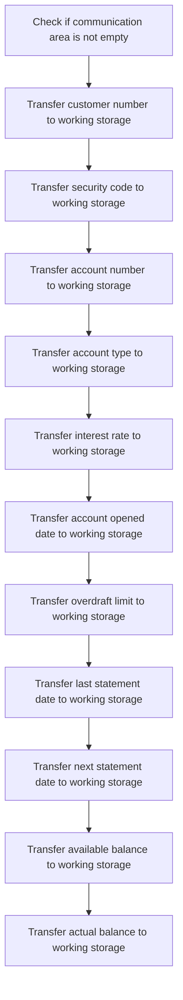

<SwmSnippet path="/src/base/cobol_src/BNK1UAC.cbl" line="279">

---

The PREMIERE function begins by checking if the communication area length (<SwmToken path="src/base/cobol_src/BNK1UAC.cbl" pos="280:3:3" line-data="           IF EIBCALEN NOT = ZERO">`EIBCALEN`</SwmToken>) is not zero, indicating that there is data to be processed. If this condition is met, it proceeds to transfer various pieces of customer and account data from the communication area to working storage. This includes moving the customer number (<SwmToken path="src/base/cobol_src/BNK1UAC.cbl" pos="282:3:5" line-data="              MOVE COMM-CUSTNO         TO WS-COMM-CUSTNO">`COMM-CUSTNO`</SwmToken>), security code (<SwmToken path="src/base/cobol_src/BNK1UAC.cbl" pos="283:3:5" line-data="              MOVE COMM-SCODE          TO WS-COMM-SCODE">`COMM-SCODE`</SwmToken>), account number (<SwmToken path="src/base/cobol_src/BNK1UAC.cbl" pos="284:3:5" line-data="              MOVE COMM-ACCNO          TO WS-COMM-ACCNO">`COMM-ACCNO`</SwmToken>), account type (<SwmToken path="src/base/cobol_src/BNK1UAC.cbl" pos="285:3:7" line-data="              MOVE COMM-ACC-TYPE       TO WS-COMM-ACC-TYPE">`COMM-ACC-TYPE`</SwmToken>), interest rate (<SwmToken path="src/base/cobol_src/BNK1UAC.cbl" pos="286:3:7" line-data="              MOVE COMM-INT-RATE       TO WS-COMM-INT-RATE">`COMM-INT-RATE`</SwmToken>), account opened date (<SwmToken path="src/base/cobol_src/BNK1UAC.cbl" pos="287:3:5" line-data="              MOVE COMM-OPENED         TO WS-COMM-OPENED">`COMM-OPENED`</SwmToken>), overdraft limit (<SwmToken path="src/base/cobol_src/BNK1UAC.cbl" pos="288:3:5" line-data="              MOVE COMM-OVERDRAFT      TO WS-COMM-OVERDRAFT">`COMM-OVERDRAFT`</SwmToken>), last statement date (<SwmToken path="src/base/cobol_src/BNK1UAC.cbl" pos="289:3:9" line-data="              MOVE COMM-LAST-STMT-DT   TO WS-COMM-LAST-STMT-DT">`COMM-LAST-STMT-DT`</SwmToken>), next statement date (<SwmToken path="src/base/cobol_src/BNK1UAC.cbl" pos="290:3:9" line-data="              MOVE COMM-NEXT-STMT-DT   TO WS-COMM-NEXT-STMT-DT">`COMM-NEXT-STMT-DT`</SwmToken>), available balance (<SwmToken path="src/base/cobol_src/BNK1UAC.cbl" pos="291:3:7" line-data="              MOVE COMM-AVAIL-BAL      TO WS-COMM-AVAIL-BAL">`COMM-AVAIL-BAL`</SwmToken>), and actual balance (<SwmToken path="src/base/cobol_src/BNK1UAC.cbl" pos="292:3:7" line-data="              MOVE COMM-ACTUAL-BAL     TO WS-COMM-ACTUAL-BAL">`COMM-ACTUAL-BAL`</SwmToken>) to their respective working storage fields. This ensures that the data is readily available for subsequent processing within the application.

```cobol
      *
           IF EIBCALEN NOT = ZERO
              MOVE COMM-EYE            TO WS-COMM-EYE
              MOVE COMM-CUSTNO         TO WS-COMM-CUSTNO
              MOVE COMM-SCODE          TO WS-COMM-SCODE
              MOVE COMM-ACCNO          TO WS-COMM-ACCNO
              MOVE COMM-ACC-TYPE       TO WS-COMM-ACC-TYPE
              MOVE COMM-INT-RATE       TO WS-COMM-INT-RATE
              MOVE COMM-OPENED         TO WS-COMM-OPENED
              MOVE COMM-OVERDRAFT      TO WS-COMM-OVERDRAFT
              MOVE COMM-LAST-STMT-DT   TO WS-COMM-LAST-STMT-DT
              MOVE COMM-NEXT-STMT-DT   TO WS-COMM-NEXT-STMT-DT
              MOVE COMM-AVAIL-BAL      TO WS-COMM-AVAIL-BAL
              MOVE COMM-ACTUAL-BAL     TO WS-COMM-ACTUAL-BAL
           END-IF.
```

---

</SwmSnippet>

## Return control to CICS

This is the next section of the flow.

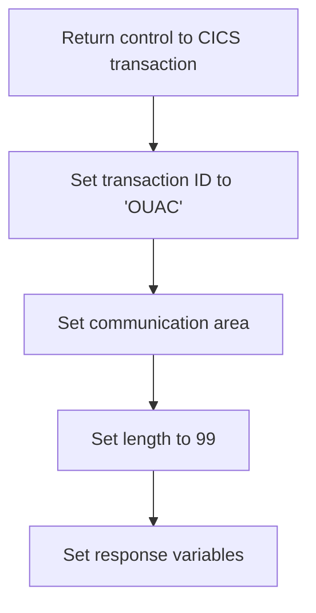

<SwmSnippet path="/src/base/cobol_src/BNK1UAC.cbl" line="295">

---

The <SwmToken path="src/base/cobol_src/BNK1UAC.cbl" pos="197:1:1" line-data="       PREMIERE SECTION.">`PREMIERE`</SwmToken> function is responsible for returning control to the CICS transaction. This is done by setting the transaction ID to 'OUAC', which indicates the next transaction to be executed. The communication area (<SwmToken path="src/base/cobol_src/BNK1UAC.cbl" pos="297:3:7" line-data="              COMMAREA(WS-COMM-AREA)">`WS-COMM-AREA`</SwmToken>) is set to pass data between transactions, and its length is specified as 99 bytes. Additionally, the response variables (<SwmToken path="src/base/cobol_src/BNK1UAC.cbl" pos="299:3:7" line-data="              RESP(WS-CICS-RESP)">`WS-CICS-RESP`</SwmToken> and <SwmToken path="src/base/cobol_src/BNK1UAC.cbl" pos="300:3:7" line-data="              RESP2(WS-CICS-RESP2)">`WS-CICS-RESP2`</SwmToken>) are set to capture any response codes from the CICS command.

```cobol
           EXEC CICS
              RETURN TRANSID('OUAC')
              COMMAREA(WS-COMM-AREA)
              LENGTH(99)
              RESP(WS-CICS-RESP)
              RESP2(WS-CICS-RESP2)
           END-EXEC.
```

---

</SwmSnippet>

## Handle response not normal

Now, lets zoom into this section of the flow:

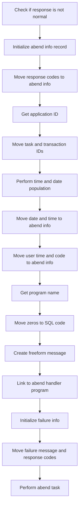

First, the code checks if the response code <SwmToken path="src/base/cobol_src/BNK1UAC.cbl" pos="225:3:7" line-data="                    RESP(WS-CICS-RESP)">`WS-CICS-RESP`</SwmToken> is not equal to <SwmToken path="src/base/cobol_src/BNK1UAC.cbl" pos="775:13:16" line-data="           IF WS-CICS-RESP NOT = DFHRESP(NORMAL)">`DFHRESP(NORMAL)`</SwmToken>. This condition determines if there was an abnormal termination of the transaction.

<SwmSnippet path="/src/base/cobol_src/BNK1UAC.cbl" line="310">

---

Moving to the next step, the <SwmToken path="src/base/cobol_src/BNK1UAC.cbl" pos="310:3:5" line-data="              INITIALIZE ABNDINFO-REC">`ABNDINFO-REC`</SwmToken> is initialized to prepare for capturing abend information.

```cobol
              INITIALIZE ABNDINFO-REC
```

---

</SwmSnippet>

<SwmSnippet path="/src/base/cobol_src/BNK1UAC.cbl" line="311">

---

Next, the response codes <SwmToken path="src/base/cobol_src/BNK1UAC.cbl" pos="311:3:3" line-data="              MOVE EIBRESP    TO ABND-RESPCODE">`EIBRESP`</SwmToken> and <SwmToken path="src/base/cobol_src/BNK1UAC.cbl" pos="312:3:3" line-data="              MOVE EIBRESP2   TO ABND-RESP2CODE">`EIBRESP2`</SwmToken> are moved to <SwmToken path="src/base/cobol_src/BNK1UAC.cbl" pos="311:7:9" line-data="              MOVE EIBRESP    TO ABND-RESPCODE">`ABND-RESPCODE`</SwmToken> and <SwmToken path="src/base/cobol_src/BNK1UAC.cbl" pos="312:7:9" line-data="              MOVE EIBRESP2   TO ABND-RESP2CODE">`ABND-RESP2CODE`</SwmToken> respectively, to record the specific error codes.

```cobol
              MOVE EIBRESP    TO ABND-RESPCODE
              MOVE EIBRESP2   TO ABND-RESP2CODE
```

---

</SwmSnippet>

<SwmSnippet path="/src/base/cobol_src/BNK1UAC.cbl" line="316">

---

Then, the application ID is retrieved using the <SwmToken path="src/base/cobol_src/BNK1UAC.cbl" pos="316:1:7" line-data="              EXEC CICS ASSIGN APPLID(ABND-APPLID)">`EXEC CICS ASSIGN APPLID`</SwmToken> command and stored in <SwmToken path="src/base/cobol_src/BNK1UAC.cbl" pos="316:9:11" line-data="              EXEC CICS ASSIGN APPLID(ABND-APPLID)">`ABND-APPLID`</SwmToken>.

```cobol
              EXEC CICS ASSIGN APPLID(ABND-APPLID)
              END-EXEC
```

---

</SwmSnippet>

<SwmSnippet path="/src/base/cobol_src/BNK1UAC.cbl" line="319">

---

Following this, the task number and transaction ID are moved to <SwmToken path="src/base/cobol_src/BNK1UAC.cbl" pos="319:7:11" line-data="              MOVE EIBTASKN   TO ABND-TASKNO-KEY">`ABND-TASKNO-KEY`</SwmToken> and <SwmToken path="src/base/cobol_src/BNK1UAC.cbl" pos="320:7:9" line-data="              MOVE EIBTRNID   TO ABND-TRANID">`ABND-TRANID`</SwmToken> respectively.

```cobol
              MOVE EIBTASKN   TO ABND-TASKNO-KEY
              MOVE EIBTRNID   TO ABND-TRANID
```

---

</SwmSnippet>

<SwmSnippet path="/src/base/cobol_src/BNK1UAC.cbl" line="322">

---

The <SwmToken path="src/base/cobol_src/BNK1UAC.cbl" pos="322:3:7" line-data="              PERFORM POPULATE-TIME-DATE">`POPULATE-TIME-DATE`</SwmToken> routine is performed to get the current date and time.

```cobol
              PERFORM POPULATE-TIME-DATE
```

---

</SwmSnippet>

<SwmSnippet path="/src/base/cobol_src/BNK1UAC.cbl" line="324">

---

Next, the original date and current time are moved to <SwmToken path="src/base/cobol_src/BNK1UAC.cbl" pos="324:11:13" line-data="              MOVE WS-ORIG-DATE TO ABND-DATE">`ABND-DATE`</SwmToken> and <SwmToken path="src/base/cobol_src/BNK1UAC.cbl" pos="330:3:5" line-data="                     INTO ABND-TIME">`ABND-TIME`</SwmToken> respectively, to record when the abend occurred.

```cobol
              MOVE WS-ORIG-DATE TO ABND-DATE
              STRING WS-TIME-NOW-GRP-HH DELIMITED BY SIZE,
                    ':' DELIMITED BY SIZE,
                     WS-TIME-NOW-GRP-MM DELIMITED BY SIZE,
                     ':' DELIMITED BY SIZE,
                     WS-TIME-NOW-GRP-MM DELIMITED BY SIZE
                     INTO ABND-TIME
```

---

</SwmSnippet>

<SwmSnippet path="/src/base/cobol_src/BNK1UAC.cbl" line="333">

---

The user time and a specific code are then moved to <SwmToken path="src/base/cobol_src/BNK1UAC.cbl" pos="333:11:15" line-data="              MOVE WS-U-TIME   TO ABND-UTIME-KEY">`ABND-UTIME-KEY`</SwmToken> and <SwmToken path="src/base/cobol_src/BNK1UAC.cbl" pos="334:9:11" line-data="              MOVE &#39;HBNK&#39;      TO ABND-CODE">`ABND-CODE`</SwmToken> respectively.

```cobol
              MOVE WS-U-TIME   TO ABND-UTIME-KEY
              MOVE 'HBNK'      TO ABND-CODE
```

---

</SwmSnippet>

<SwmSnippet path="/src/base/cobol_src/BNK1UAC.cbl" line="336">

---

Finally, the program name is retrieved using the <SwmToken path="src/base/cobol_src/BNK1UAC.cbl" pos="336:1:7" line-data="              EXEC CICS ASSIGN PROGRAM(ABND-PROGRAM)">`EXEC CICS ASSIGN PROGRAM`</SwmToken> command and stored in <SwmToken path="src/base/cobol_src/BNK1UAC.cbl" pos="336:9:11" line-data="              EXEC CICS ASSIGN PROGRAM(ABND-PROGRAM)">`ABND-PROGRAM`</SwmToken>, and zeros are moved to <SwmToken path="src/base/cobol_src/BNK1UAC.cbl" pos="339:7:9" line-data="              MOVE ZEROS      TO ABND-SQLCODE">`ABND-SQLCODE`</SwmToken> to initialize it.

```cobol
              EXEC CICS ASSIGN PROGRAM(ABND-PROGRAM)
              END-EXEC

              MOVE ZEROS      TO ABND-SQLCODE
```

---

</SwmSnippet>

# Handling CICS maps (<SwmToken path="src/base/cobol_src/BNK1UAC.cbl" pos="210:3:5" line-data="                 PERFORM SEND-MAP">`SEND-MAP`</SwmToken>)

Let's split this section into smaller parts:

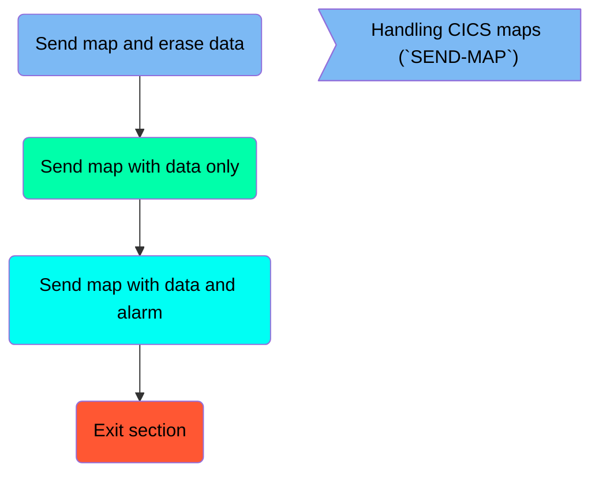

## Send map and erase data

First, we'll zoom into this section of the flow:

```mermaid
graph TD
  A[Check if SEND-ERASE is true] --> B[Send map with ERASE option]
  B --> C[Check if response is not NORMAL]
  C --> D[Initialize ABNDINFO-REC]
  D --> E[Move EIBRESP to ABND-RESPCODE]
  E --> F[Move EIBRESP2 to ABND-RESP2CODE]
  F --> G[Assign APPLID to ABND-APPLID]
  G --> H[Move EIBTASKN to ABND-TASKNO-KEY]
  H --> I[Move EIBTRNID to ABND-TRANID]
  I --> J[Perform POPULATE-TIME-DATE]
  J --> K[Move WS-ORIG-DATE to ABND-DATE]
  K --> L[Format and move current time to ABND-TIME]
  L --> M[Move WS-U-TIME to ABND-UTIME-KEY]
  M --> N[Move 'HBNK' to ABND-CODE]
  N --> O[Assign PROGRAM to ABND-PROGRAM]
  O --> P[Move ZEROS to ABND-SQLCODE]
  P --> Q[Format and move error message to ABND-FREEFORM]
  Q --> R[Link to ABEND handler program]
  R --> S[Initialize WS-FAIL-INFO]
  S --> T[Move error message to WS-CICS-FAIL-MSG]
  T --> U[Move response codes to display variables]
  U --> V[Perform ABEND-THIS-TASK]

%% Swimm:
%% graph TD
%%   A[Check if <SwmToken path="src/base/cobol_src/BNK1UAC.cbl" pos="208:3:5" line-data="                 SET SEND-ERASE TO TRUE">`SEND-ERASE`</SwmToken> is true] --> B[Send map with ERASE option]
%%   B --> C[Check if response is not NORMAL]
%%   C --> D[Initialize <SwmToken path="src/base/cobol_src/BNK1UAC.cbl" pos="310:3:5" line-data="              INITIALIZE ABNDINFO-REC">`ABNDINFO-REC`</SwmToken>]
%%   D --> E[Move EIBRESP to <SwmToken path="src/base/cobol_src/BNK1UAC.cbl" pos="311:7:9" line-data="              MOVE EIBRESP    TO ABND-RESPCODE">`ABND-RESPCODE`</SwmToken>]
%%   E --> F[Move <SwmToken path="src/base/cobol_src/BNK1UAC.cbl" pos="312:3:3" line-data="              MOVE EIBRESP2   TO ABND-RESP2CODE">`EIBRESP2`</SwmToken> to <SwmToken path="src/base/cobol_src/BNK1UAC.cbl" pos="312:7:9" line-data="              MOVE EIBRESP2   TO ABND-RESP2CODE">`ABND-RESP2CODE`</SwmToken>]
%%   F --> G[Assign APPLID to <SwmToken path="src/base/cobol_src/BNK1UAC.cbl" pos="316:9:11" line-data="              EXEC CICS ASSIGN APPLID(ABND-APPLID)">`ABND-APPLID`</SwmToken>]
%%   G --> H[Move EIBTASKN to <SwmToken path="src/base/cobol_src/BNK1UAC.cbl" pos="319:7:11" line-data="              MOVE EIBTASKN   TO ABND-TASKNO-KEY">`ABND-TASKNO-KEY`</SwmToken>]
%%   H --> I[Move EIBTRNID to <SwmToken path="src/base/cobol_src/BNK1UAC.cbl" pos="320:7:9" line-data="              MOVE EIBTRNID   TO ABND-TRANID">`ABND-TRANID`</SwmToken>]
%%   I --> J[Perform <SwmToken path="src/base/cobol_src/BNK1UAC.cbl" pos="322:3:7" line-data="              PERFORM POPULATE-TIME-DATE">`POPULATE-TIME-DATE`</SwmToken>]
%%   J --> K[Move <SwmToken path="src/base/cobol_src/BNK1UAC.cbl" pos="324:3:7" line-data="              MOVE WS-ORIG-DATE TO ABND-DATE">`WS-ORIG-DATE`</SwmToken> to <SwmToken path="src/base/cobol_src/BNK1UAC.cbl" pos="324:11:13" line-data="              MOVE WS-ORIG-DATE TO ABND-DATE">`ABND-DATE`</SwmToken>]
%%   K --> L[Format and move current time to <SwmToken path="src/base/cobol_src/BNK1UAC.cbl" pos="330:3:5" line-data="                     INTO ABND-TIME">`ABND-TIME`</SwmToken>]
%%   L --> M[Move <SwmToken path="src/base/cobol_src/BNK1UAC.cbl" pos="333:3:7" line-data="              MOVE WS-U-TIME   TO ABND-UTIME-KEY">`WS-U-TIME`</SwmToken> to <SwmToken path="src/base/cobol_src/BNK1UAC.cbl" pos="333:11:15" line-data="              MOVE WS-U-TIME   TO ABND-UTIME-KEY">`ABND-UTIME-KEY`</SwmToken>]
%%   M --> N[Move 'HBNK' to <SwmToken path="src/base/cobol_src/BNK1UAC.cbl" pos="334:9:11" line-data="              MOVE &#39;HBNK&#39;      TO ABND-CODE">`ABND-CODE`</SwmToken>]
%%   N --> O[Assign PROGRAM to <SwmToken path="src/base/cobol_src/BNK1UAC.cbl" pos="336:9:11" line-data="              EXEC CICS ASSIGN PROGRAM(ABND-PROGRAM)">`ABND-PROGRAM`</SwmToken>]
%%   O --> P[Move ZEROS to <SwmToken path="src/base/cobol_src/BNK1UAC.cbl" pos="339:7:9" line-data="              MOVE ZEROS      TO ABND-SQLCODE">`ABND-SQLCODE`</SwmToken>]
%%   P --> Q[Format and move error message to <SwmToken path="src/base/cobol_src/BNK1UAC.cbl" pos="471:3:5" line-data="                    INTO ABND-FREEFORM">`ABND-FREEFORM`</SwmToken>]
%%   Q --> R[Link to ABEND handler program]
%%   R --> S[Initialize <SwmToken path="src/base/cobol_src/BNK1UAC.cbl" pos="1210:3:7" line-data="                 INITIALIZE WS-FAIL-INFO">`WS-FAIL-INFO`</SwmToken>]
%%   S --> T[Move error message to <SwmToken path="src/base/cobol_src/BNK1UAC.cbl" pos="1212:3:9" line-data="                    TO WS-CICS-FAIL-MSG">`WS-CICS-FAIL-MSG`</SwmToken>]
%%   T --> U[Move response codes to display variables]
%%   U --> V[Perform <SwmToken path="src/base/cobol_src/BNK1UAC.cbl" pos="1215:3:7" line-data="                 PERFORM ABEND-THIS-TASK">`ABEND-THIS-TASK`</SwmToken>]
```

<SwmSnippet path="/src/base/cobol_src/BNK1UAC.cbl" line="1073">

---

First, the code checks if <SwmToken path="src/base/cobol_src/BNK1UAC.cbl" pos="1073:3:5" line-data="           IF SEND-ERASE">`SEND-ERASE`</SwmToken> is true, which indicates that the map should be sent with the ERASE option.

```cobol
           IF SEND-ERASE
```

---

</SwmSnippet>

<SwmSnippet path="/src/base/cobol_src/BNK1UAC.cbl" line="1074">

---

If <SwmToken path="src/base/cobol_src/BNK1UAC.cbl" pos="208:3:5" line-data="                 SET SEND-ERASE TO TRUE">`SEND-ERASE`</SwmToken> is true, the map <SwmToken path="src/base/cobol_src/BNK1UAC.cbl" pos="1074:10:10" line-data="              EXEC CICS SEND MAP(&#39;BNK1UA&#39;)">`BNK1UA`</SwmToken> is sent with the ERASE option, clearing any existing data on the screen.

```cobol
              EXEC CICS SEND MAP('BNK1UA')
                 MAPSET('BNK1UAM')
                 FROM(BNK1UAO)
                 ERASE
                 CURSOR
                 RESP(WS-CICS-RESP)
                 RESP2(WS-CICS-RESP2)
              END-EXEC
```

---

</SwmSnippet>

<SwmSnippet path="/src/base/cobol_src/BNK1UAC.cbl" line="1083">

---

Next, the code checks if the response from the SEND MAP command is not NORMAL, indicating an error occurred.

```cobol
              IF WS-CICS-RESP NOT = DFHRESP(NORMAL)
```

---

</SwmSnippet>

<SwmSnippet path="/src/base/cobol_src/BNK1UAC.cbl" line="1090">

---

If an error occurred, the <SwmToken path="src/base/cobol_src/BNK1UAC.cbl" pos="1090:3:5" line-data="                 INITIALIZE ABNDINFO-REC">`ABNDINFO-REC`</SwmToken> structure is initialized to store information about the error.

```cobol
                 INITIALIZE ABNDINFO-REC
```

---

</SwmSnippet>

<SwmSnippet path="/src/base/cobol_src/BNK1UAC.cbl" line="1091">

---

The response codes <SwmToken path="src/base/cobol_src/BNK1UAC.cbl" pos="1091:3:3" line-data="                 MOVE EIBRESP    TO ABND-RESPCODE">`EIBRESP`</SwmToken> and <SwmToken path="src/base/cobol_src/BNK1UAC.cbl" pos="1092:3:3" line-data="                 MOVE EIBRESP2   TO ABND-RESP2CODE">`EIBRESP2`</SwmToken> are moved to <SwmToken path="src/base/cobol_src/BNK1UAC.cbl" pos="1091:7:9" line-data="                 MOVE EIBRESP    TO ABND-RESPCODE">`ABND-RESPCODE`</SwmToken> and <SwmToken path="src/base/cobol_src/BNK1UAC.cbl" pos="1092:7:9" line-data="                 MOVE EIBRESP2   TO ABND-RESP2CODE">`ABND-RESP2CODE`</SwmToken> respectively for error tracking.

```cobol
                 MOVE EIBRESP    TO ABND-RESPCODE
                 MOVE EIBRESP2   TO ABND-RESP2CODE
```

---

</SwmSnippet>

<SwmSnippet path="/src/base/cobol_src/BNK1UAC.cbl" line="1096">

---

The application ID is assigned to <SwmToken path="src/base/cobol_src/BNK1UAC.cbl" pos="1096:9:11" line-data="                 EXEC CICS ASSIGN APPLID(ABND-APPLID)">`ABND-APPLID`</SwmToken> to identify the application where the error occurred.

```cobol
                 EXEC CICS ASSIGN APPLID(ABND-APPLID)
                 END-EXEC
```

---

</SwmSnippet>

<SwmSnippet path="/src/base/cobol_src/BNK1UAC.cbl" line="1099">

---

The task number and transaction ID are moved to <SwmToken path="src/base/cobol_src/BNK1UAC.cbl" pos="1099:7:11" line-data="                 MOVE EIBTASKN   TO ABND-TASKNO-KEY">`ABND-TASKNO-KEY`</SwmToken> and <SwmToken path="src/base/cobol_src/BNK1UAC.cbl" pos="1100:7:9" line-data="                 MOVE EIBTRNID   TO ABND-TRANID">`ABND-TRANID`</SwmToken> respectively for error tracking.

```cobol
                 MOVE EIBTASKN   TO ABND-TASKNO-KEY
                 MOVE EIBTRNID   TO ABND-TRANID

```

---

</SwmSnippet>

<SwmSnippet path="/src/base/cobol_src/BNK1UAC.cbl" line="1102">

---

The <SwmToken path="src/base/cobol_src/BNK1UAC.cbl" pos="1102:3:7" line-data="                 PERFORM POPULATE-TIME-DATE">`POPULATE-TIME-DATE`</SwmToken> routine is performed to get the current date and time.

```cobol
                 PERFORM POPULATE-TIME-DATE
```

---

</SwmSnippet>

<SwmSnippet path="/src/base/cobol_src/BNK1UAC.cbl" line="1104">

---

The original date is moved to <SwmToken path="src/base/cobol_src/BNK1UAC.cbl" pos="1104:11:13" line-data="                 MOVE WS-ORIG-DATE TO ABND-DATE">`ABND-DATE`</SwmToken>, and the current time is formatted and moved to <SwmToken path="src/base/cobol_src/BNK1UAC.cbl" pos="1110:3:5" line-data="                        INTO ABND-TIME">`ABND-TIME`</SwmToken>.

```cobol
                 MOVE WS-ORIG-DATE TO ABND-DATE
                 STRING WS-TIME-NOW-GRP-HH DELIMITED BY SIZE,
                       ':' DELIMITED BY SIZE,
                        WS-TIME-NOW-GRP-MM DELIMITED BY SIZE,
                        ':' DELIMITED BY SIZE,
                        WS-TIME-NOW-GRP-MM DELIMITED BY SIZE
                        INTO ABND-TIME
                 END-STRING
```

---

</SwmSnippet>

<SwmSnippet path="/src/base/cobol_src/BNK1UAC.cbl" line="1113">

---

The unique time value is moved to <SwmToken path="src/base/cobol_src/BNK1UAC.cbl" pos="1113:11:15" line-data="                 MOVE WS-U-TIME   TO ABND-UTIME-KEY">`ABND-UTIME-KEY`</SwmToken>, and the code 'HBNK' is moved to <SwmToken path="src/base/cobol_src/BNK1UAC.cbl" pos="1114:9:11" line-data="                 MOVE &#39;HBNK&#39;      TO ABND-CODE">`ABND-CODE`</SwmToken> for error identification.

```cobol
                 MOVE WS-U-TIME   TO ABND-UTIME-KEY
                 MOVE 'HBNK'      TO ABND-CODE
```

---

</SwmSnippet>

<SwmSnippet path="/src/base/cobol_src/BNK1UAC.cbl" line="1121">

---

Finally, the error message is formatted and moved to <SwmToken path="src/base/cobol_src/BNK1UAC.cbl" pos="1127:3:5" line-data="                       INTO ABND-FREEFORM">`ABND-FREEFORM`</SwmToken>, and the ABEND handler program is linked to handle the error.

```cobol
                 STRING 'SM010 - SEND MAP ERASE FAIL.'
                       DELIMITED BY SIZE,
                       ' EIBRESP=' DELIMITED BY SIZE,
                       ABND-RESPCODE DELIMITED BY SIZE,
                       ' RESP2=' DELIMITED BY SIZE,
                       ABND-RESP2CODE DELIMITED BY SIZE
                       INTO ABND-FREEFORM
                 END-STRING

                 EXEC CICS LINK PROGRAM(WS-ABEND-PGM)
                           COMMAREA(ABNDINFO-REC)
                 END-EXEC
```

---

</SwmSnippet>

## Send map with data only

Now, lets zoom into this section of the flow:

```mermaid
graph TD
  A[Check if SEND-DATAONLY is true] --> B[SEND MAP with DATAONLY]
  B --> C{Check if WS-CICS-RESP is not NORMAL}
  C -->|Yes| D[Initialize ABNDINFO-REC]
  D --> E[Move EIBRESP to ABND-RESPCODE]
  E --> F[Move EIBRESP2 to ABND-RESP2CODE]
  F --> G[Assign APPLID to ABND-APPLID]
  G --> H[Move EIBTASKN to ABND-TASKNO-KEY]
  H --> I[Move EIBTRNID to ABND-TRANID]
  I --> J[Perform POPULATE-TIME-DATE]
  J --> K[Move WS-ORIG-DATE to ABND-DATE]
  K --> L[Format and move current time to ABND-TIME]
  L --> M[Move WS-U-TIME to ABND-UTIME-KEY]
  M --> N[Move 'HBNK' to ABND-CODE]
  N --> O[Assign PROGRAM to ABND-PROGRAM]
  O --> P[Move ZEROS to ABND-SQLCODE]
  P --> Q[Format and move error message to ABND-FREEFORM]
  Q --> R[LINK to ABEND Handler program]
  R --> S[Initialize WS-FAIL-INFO]
  S --> T[Move error details to WS-CICS-FAIL-MSG]
  T --> U[Move WS-CICS-RESP to WS-CICS-RESP-DISP]
  U --> V[Move WS-CICS-RESP2 to WS-CICS-RESP2-DISP]
  V --> W[Perform ABEND-THIS-TASK]
  C -->|No| X[GO TO SM999]

%% Swimm:
%% graph TD
%%   A[Check if <SwmToken path="src/base/cobol_src/BNK1UAC.cbl" pos="270:3:5" line-data="                 SET SEND-DATAONLY-ALARM TO TRUE">`SEND-DATAONLY`</SwmToken> is true] --> B[SEND MAP with DATAONLY]
%%   B --> C{Check if <SwmToken path="src/base/cobol_src/BNK1UAC.cbl" pos="225:3:7" line-data="                    RESP(WS-CICS-RESP)">`WS-CICS-RESP`</SwmToken> is not NORMAL}
%%   C -->|Yes| D[Initialize <SwmToken path="src/base/cobol_src/BNK1UAC.cbl" pos="310:3:5" line-data="              INITIALIZE ABNDINFO-REC">`ABNDINFO-REC`</SwmToken>]
%%   D --> E[Move EIBRESP to <SwmToken path="src/base/cobol_src/BNK1UAC.cbl" pos="311:7:9" line-data="              MOVE EIBRESP    TO ABND-RESPCODE">`ABND-RESPCODE`</SwmToken>]
%%   E --> F[Move <SwmToken path="src/base/cobol_src/BNK1UAC.cbl" pos="312:3:3" line-data="              MOVE EIBRESP2   TO ABND-RESP2CODE">`EIBRESP2`</SwmToken> to <SwmToken path="src/base/cobol_src/BNK1UAC.cbl" pos="312:7:9" line-data="              MOVE EIBRESP2   TO ABND-RESP2CODE">`ABND-RESP2CODE`</SwmToken>]
%%   F --> G[Assign APPLID to <SwmToken path="src/base/cobol_src/BNK1UAC.cbl" pos="316:9:11" line-data="              EXEC CICS ASSIGN APPLID(ABND-APPLID)">`ABND-APPLID`</SwmToken>]
%%   G --> H[Move EIBTASKN to <SwmToken path="src/base/cobol_src/BNK1UAC.cbl" pos="319:7:11" line-data="              MOVE EIBTASKN   TO ABND-TASKNO-KEY">`ABND-TASKNO-KEY`</SwmToken>]
%%   H --> I[Move EIBTRNID to <SwmToken path="src/base/cobol_src/BNK1UAC.cbl" pos="320:7:9" line-data="              MOVE EIBTRNID   TO ABND-TRANID">`ABND-TRANID`</SwmToken>]
%%   I --> J[Perform <SwmToken path="src/base/cobol_src/BNK1UAC.cbl" pos="322:3:7" line-data="              PERFORM POPULATE-TIME-DATE">`POPULATE-TIME-DATE`</SwmToken>]
%%   J --> K[Move <SwmToken path="src/base/cobol_src/BNK1UAC.cbl" pos="324:3:7" line-data="              MOVE WS-ORIG-DATE TO ABND-DATE">`WS-ORIG-DATE`</SwmToken> to <SwmToken path="src/base/cobol_src/BNK1UAC.cbl" pos="324:11:13" line-data="              MOVE WS-ORIG-DATE TO ABND-DATE">`ABND-DATE`</SwmToken>]
%%   K --> L[Format and move current time to <SwmToken path="src/base/cobol_src/BNK1UAC.cbl" pos="330:3:5" line-data="                     INTO ABND-TIME">`ABND-TIME`</SwmToken>]
%%   L --> M[Move <SwmToken path="src/base/cobol_src/BNK1UAC.cbl" pos="333:3:7" line-data="              MOVE WS-U-TIME   TO ABND-UTIME-KEY">`WS-U-TIME`</SwmToken> to <SwmToken path="src/base/cobol_src/BNK1UAC.cbl" pos="333:11:15" line-data="              MOVE WS-U-TIME   TO ABND-UTIME-KEY">`ABND-UTIME-KEY`</SwmToken>]
%%   M --> N[Move 'HBNK' to <SwmToken path="src/base/cobol_src/BNK1UAC.cbl" pos="334:9:11" line-data="              MOVE &#39;HBNK&#39;      TO ABND-CODE">`ABND-CODE`</SwmToken>]
%%   N --> O[Assign PROGRAM to <SwmToken path="src/base/cobol_src/BNK1UAC.cbl" pos="336:9:11" line-data="              EXEC CICS ASSIGN PROGRAM(ABND-PROGRAM)">`ABND-PROGRAM`</SwmToken>]
%%   O --> P[Move ZEROS to <SwmToken path="src/base/cobol_src/BNK1UAC.cbl" pos="339:7:9" line-data="              MOVE ZEROS      TO ABND-SQLCODE">`ABND-SQLCODE`</SwmToken>]
%%   P --> Q[Format and move error message to <SwmToken path="src/base/cobol_src/BNK1UAC.cbl" pos="471:3:5" line-data="                    INTO ABND-FREEFORM">`ABND-FREEFORM`</SwmToken>]
%%   Q --> R[LINK to ABEND Handler program]
%%   R --> S[Initialize <SwmToken path="src/base/cobol_src/BNK1UAC.cbl" pos="1210:3:7" line-data="                 INITIALIZE WS-FAIL-INFO">`WS-FAIL-INFO`</SwmToken>]
%%   S --> T[Move error details to <SwmToken path="src/base/cobol_src/BNK1UAC.cbl" pos="1212:3:9" line-data="                    TO WS-CICS-FAIL-MSG">`WS-CICS-FAIL-MSG`</SwmToken>]
%%   T --> U[Move <SwmToken path="src/base/cobol_src/BNK1UAC.cbl" pos="225:3:7" line-data="                    RESP(WS-CICS-RESP)">`WS-CICS-RESP`</SwmToken> to <SwmToken path="src/base/cobol_src/BNK1UAC.cbl" pos="1213:11:17" line-data="                 MOVE WS-CICS-RESP  TO WS-CICS-RESP-DISP">`WS-CICS-RESP-DISP`</SwmToken>]
%%   U --> V[Move <SwmToken path="src/base/cobol_src/BNK1UAC.cbl" pos="226:3:7" line-data="                    RESP2(WS-CICS-RESP2)">`WS-CICS-RESP2`</SwmToken> to <SwmToken path="src/base/cobol_src/BNK1UAC.cbl" pos="1214:11:17" line-data="                 MOVE WS-CICS-RESP2 TO WS-CICS-RESP2-DISP">`WS-CICS-RESP2-DISP`</SwmToken>]
%%   V --> W[Perform <SwmToken path="src/base/cobol_src/BNK1UAC.cbl" pos="1215:3:7" line-data="                 PERFORM ABEND-THIS-TASK">`ABEND-THIS-TASK`</SwmToken>]
%%   C -->|No| X[GO TO <SwmToken path="src/base/cobol_src/BNK1UAC.cbl" pos="1297:1:1" line-data="       SM999.">`SM999`</SwmToken>]
```

<SwmSnippet path="/src/base/cobol_src/BNK1UAC.cbl" line="1149">

---

First, the code checks if <SwmToken path="src/base/cobol_src/BNK1UAC.cbl" pos="1149:3:5" line-data="           IF SEND-DATAONLY">`SEND-DATAONLY`</SwmToken> is true. If it is, the program proceeds to send the map data using the <SwmToken path="src/base/cobol_src/BNK1UAC.cbl" pos="1150:5:7" line-data="              EXEC CICS SEND MAP(&#39;BNK1UA&#39;)">`SEND MAP`</SwmToken> command with the <SwmToken path="src/base/cobol_src/BNK1UAC.cbl" pos="1149:5:5" line-data="           IF SEND-DATAONLY">`DATAONLY`</SwmToken> option.

```cobol
           IF SEND-DATAONLY
              EXEC CICS SEND MAP('BNK1UA')
                 MAPSET('BNK1UAM')
                 FROM(BNK1UAO)
                 DATAONLY
                 CURSOR
                 RESP(WS-CICS-RESP)
                 RESP2(WS-CICS-RESP2)
              END-EXEC
```

---

</SwmSnippet>

<SwmSnippet path="/src/base/cobol_src/BNK1UAC.cbl" line="1159">

---

Next, the program checks if the response code <SwmToken path="src/base/cobol_src/BNK1UAC.cbl" pos="1159:3:7" line-data="              IF WS-CICS-RESP NOT = DFHRESP(NORMAL)">`WS-CICS-RESP`</SwmToken> is not equal to <SwmToken path="src/base/cobol_src/BNK1UAC.cbl" pos="1159:13:16" line-data="              IF WS-CICS-RESP NOT = DFHRESP(NORMAL)">`DFHRESP(NORMAL)`</SwmToken>. This indicates that an error occurred during the <SwmToken path="src/base/cobol_src/BNK1UAC.cbl" pos="1074:5:7" line-data="              EXEC CICS SEND MAP(&#39;BNK1UA&#39;)">`SEND MAP`</SwmToken> operation.

```cobol
              IF WS-CICS-RESP NOT = DFHRESP(NORMAL)
```

---

</SwmSnippet>

<SwmSnippet path="/src/base/cobol_src/BNK1UAC.cbl" line="1166">

---

If an error is detected, the program initializes the <SwmToken path="src/base/cobol_src/BNK1UAC.cbl" pos="1166:3:5" line-data="                 INITIALIZE ABNDINFO-REC">`ABNDINFO-REC`</SwmToken> structure to prepare for capturing error details.

```cobol
                 INITIALIZE ABNDINFO-REC
```

---

</SwmSnippet>

<SwmSnippet path="/src/base/cobol_src/BNK1UAC.cbl" line="1167">

---

The program then moves the response codes <SwmToken path="src/base/cobol_src/BNK1UAC.cbl" pos="1167:3:3" line-data="                 MOVE EIBRESP    TO ABND-RESPCODE">`EIBRESP`</SwmToken> and <SwmToken path="src/base/cobol_src/BNK1UAC.cbl" pos="1168:3:3" line-data="                 MOVE EIBRESP2   TO ABND-RESP2CODE">`EIBRESP2`</SwmToken> to <SwmToken path="src/base/cobol_src/BNK1UAC.cbl" pos="1167:7:9" line-data="                 MOVE EIBRESP    TO ABND-RESPCODE">`ABND-RESPCODE`</SwmToken> and <SwmToken path="src/base/cobol_src/BNK1UAC.cbl" pos="1168:7:9" line-data="                 MOVE EIBRESP2   TO ABND-RESP2CODE">`ABND-RESP2CODE`</SwmToken> respectively, to record the error details.

```cobol
                 MOVE EIBRESP    TO ABND-RESPCODE
                 MOVE EIBRESP2   TO ABND-RESP2CODE
```

---

</SwmSnippet>

<SwmSnippet path="/src/base/cobol_src/BNK1UAC.cbl" line="1172">

---

The <SwmToken path="src/base/cobol_src/BNK1UAC.cbl" pos="1172:7:7" line-data="                 EXEC CICS ASSIGN APPLID(ABND-APPLID)">`APPLID`</SwmToken> is assigned to <SwmToken path="src/base/cobol_src/BNK1UAC.cbl" pos="1172:9:11" line-data="                 EXEC CICS ASSIGN APPLID(ABND-APPLID)">`ABND-APPLID`</SwmToken> to capture the application ID where the error occurred.

```cobol
                 EXEC CICS ASSIGN APPLID(ABND-APPLID)
                 END-EXEC
```

---

</SwmSnippet>

<SwmSnippet path="/src/base/cobol_src/BNK1UAC.cbl" line="1175">

---

The task number and transaction ID are moved to <SwmToken path="src/base/cobol_src/BNK1UAC.cbl" pos="1175:7:11" line-data="                 MOVE EIBTASKN   TO ABND-TASKNO-KEY">`ABND-TASKNO-KEY`</SwmToken> and <SwmToken path="src/base/cobol_src/BNK1UAC.cbl" pos="1176:7:9" line-data="                 MOVE EIBTRNID   TO ABND-TRANID">`ABND-TRANID`</SwmToken> respectively, to record the specific task and transaction details.

```cobol
                 MOVE EIBTASKN   TO ABND-TASKNO-KEY
                 MOVE EIBTRNID   TO ABND-TRANID
```

---

</SwmSnippet>

<SwmSnippet path="/src/base/cobol_src/BNK1UAC.cbl" line="1178">

---

The program performs <SwmToken path="src/base/cobol_src/BNK1UAC.cbl" pos="1178:3:7" line-data="                 PERFORM POPULATE-TIME-DATE">`POPULATE-TIME-DATE`</SwmToken> to get the current date and time, which are then moved to <SwmToken path="src/base/cobol_src/BNK1UAC.cbl" pos="1180:11:13" line-data="                 MOVE WS-ORIG-DATE TO ABND-DATE">`ABND-DATE`</SwmToken> and <SwmToken path="src/base/cobol_src/BNK1UAC.cbl" pos="1186:3:5" line-data="                        INTO ABND-TIME">`ABND-TIME`</SwmToken>.

```cobol
                 PERFORM POPULATE-TIME-DATE

                 MOVE WS-ORIG-DATE TO ABND-DATE
                 STRING WS-TIME-NOW-GRP-HH DELIMITED BY SIZE,
                       ':' DELIMITED BY SIZE,
                        WS-TIME-NOW-GRP-MM DELIMITED BY SIZE,
                        ':' DELIMITED BY SIZE,
                        WS-TIME-NOW-GRP-MM DELIMITED BY SIZE
                        INTO ABND-TIME
```

---

</SwmSnippet>

<SwmSnippet path="/src/base/cobol_src/BNK1UAC.cbl" line="1189">

---

Additional details such as <SwmToken path="src/base/cobol_src/BNK1UAC.cbl" pos="1189:3:7" line-data="                 MOVE WS-U-TIME   TO ABND-UTIME-KEY">`WS-U-TIME`</SwmToken> and a hardcoded code 'HBNK' are moved to <SwmToken path="src/base/cobol_src/BNK1UAC.cbl" pos="1189:11:15" line-data="                 MOVE WS-U-TIME   TO ABND-UTIME-KEY">`ABND-UTIME-KEY`</SwmToken> and <SwmToken path="src/base/cobol_src/BNK1UAC.cbl" pos="1190:9:11" line-data="                 MOVE &#39;HBNK&#39;      TO ABND-CODE">`ABND-CODE`</SwmToken> respectively.

```cobol
                 MOVE WS-U-TIME   TO ABND-UTIME-KEY
                 MOVE 'HBNK'      TO ABND-CODE

```

---

</SwmSnippet>

<SwmSnippet path="/src/base/cobol_src/BNK1UAC.cbl" line="1192">

---

The program name is assigned to <SwmToken path="src/base/cobol_src/BNK1UAC.cbl" pos="1192:9:11" line-data="                 EXEC CICS ASSIGN PROGRAM(ABND-PROGRAM)">`ABND-PROGRAM`</SwmToken> and <SwmToken path="src/base/cobol_src/BNK1UAC.cbl" pos="1195:3:3" line-data="                 MOVE ZEROS      TO ABND-SQLCODE">`ZEROS`</SwmToken> are moved to <SwmToken path="src/base/cobol_src/BNK1UAC.cbl" pos="1195:7:9" line-data="                 MOVE ZEROS      TO ABND-SQLCODE">`ABND-SQLCODE`</SwmToken> to complete the error information.

```cobol
                 EXEC CICS ASSIGN PROGRAM(ABND-PROGRAM)
                 END-EXEC

                 MOVE ZEROS      TO ABND-SQLCODE
```

---

</SwmSnippet>

<SwmSnippet path="/src/base/cobol_src/BNK1UAC.cbl" line="1197">

---

An error message is formatted and moved to <SwmToken path="src/base/cobol_src/BNK1UAC.cbl" pos="1203:3:5" line-data="                       INTO ABND-FREEFORM">`ABND-FREEFORM`</SwmToken> to provide a detailed description of the error.

```cobol
                 STRING 'SM010 - SEND MAP DATAONLY FAIL.'
                       DELIMITED BY SIZE,
                       ' EIBRESP=' DELIMITED BY SIZE,
                       ABND-RESPCODE DELIMITED BY SIZE,
                       ' RESP2=' DELIMITED BY SIZE,
                       ABND-RESP2CODE DELIMITED BY SIZE
                       INTO ABND-FREEFORM
```

---

</SwmSnippet>

<SwmSnippet path="/src/base/cobol_src/BNK1UAC.cbl" line="1206">

---

Finally, the program links to the ABEND Handler program to handle the error, initializes <SwmToken path="src/base/cobol_src/BNK1UAC.cbl" pos="1210:3:7" line-data="                 INITIALIZE WS-FAIL-INFO">`WS-FAIL-INFO`</SwmToken>, and moves the error details to <SwmToken path="src/base/cobol_src/BNK1UAC.cbl" pos="1212:3:9" line-data="                    TO WS-CICS-FAIL-MSG">`WS-CICS-FAIL-MSG`</SwmToken>, <SwmToken path="src/base/cobol_src/BNK1UAC.cbl" pos="1213:11:17" line-data="                 MOVE WS-CICS-RESP  TO WS-CICS-RESP-DISP">`WS-CICS-RESP-DISP`</SwmToken>, and <SwmToken path="src/base/cobol_src/BNK1UAC.cbl" pos="1214:11:17" line-data="                 MOVE WS-CICS-RESP2 TO WS-CICS-RESP2-DISP">`WS-CICS-RESP2-DISP`</SwmToken> before performing <SwmToken path="src/base/cobol_src/BNK1UAC.cbl" pos="1215:3:7" line-data="                 PERFORM ABEND-THIS-TASK">`ABEND-THIS-TASK`</SwmToken>.

More about ABNDPROC: <SwmLink doc-title="Writing Abend Records (ABNDPROC)">[Writing Abend Records (ABNDPROC)](/.swm/writing-abend-records-abndproc.svfj4jn5.sw.md)</SwmLink>

```cobol
                 EXEC CICS LINK PROGRAM(WS-ABEND-PGM)
                           COMMAREA(ABNDINFO-REC)
                 END-EXEC

                 INITIALIZE WS-FAIL-INFO
                 MOVE 'BNK1UAC - SM010 - SEND MAP DATAONLY FAIL '
                    TO WS-CICS-FAIL-MSG
                 MOVE WS-CICS-RESP  TO WS-CICS-RESP-DISP
                 MOVE WS-CICS-RESP2 TO WS-CICS-RESP2-DISP
                 PERFORM ABEND-THIS-TASK
```

---

</SwmSnippet>

## Send map with data and alarm

Now, lets zoom into this section of the flow:

```mermaid
graph TD
  A[Check if SEND-DATAONLY-ALARM is true] --> B[SEND MAP with DATAONLY and ALARM]
  B --> C[Check if WS-CICS-RESP is not NORMAL]
  C --> D[Initialize ABNDINFO-REC]
  D --> E[Move EIBRESP and EIBRESP2 to ABND-RESPCODE and ABND-RESP2CODE]
  E --> F[Assign APPLID to ABND-APPLID]
  F --> G[Move EIBTASKN and EIBTRNID to ABND-TASKNO-KEY and ABND-TRANID]
  G --> H[Perform POPULATE-TIME-DATE]
  H --> I[Move WS-ORIG-DATE to ABND-DATE]
  I --> J[Create ABND-TIME string]
  J --> K[Move WS-U-TIME to ABND-UTIME-KEY]
  K --> L[Move 'HBNK' to ABND-CODE]
  L --> M[Assign PROGRAM to ABND-PROGRAM]
  M --> N[Move ZEROS to ABND-SQLCODE]
  N --> O[Create ABND-FREEFORM string]
  O --> P[LINK to WS-ABEND-PGM with ABNDINFO-REC]
  P --> Q[Initialize WS-FAIL-INFO]
  Q --> R[Move failure message to WS-CICS-FAIL-MSG]
  R --> S[Move WS-CICS-RESP and WS-CICS-RESP2 to display variables]
  S --> T[Perform ABEND-THIS-TASK]

%% Swimm:
%% graph TD
%%   A[Check if <SwmToken path="src/base/cobol_src/BNK1UAC.cbl" pos="270:3:7" line-data="                 SET SEND-DATAONLY-ALARM TO TRUE">`SEND-DATAONLY-ALARM`</SwmToken> is true] --> B[SEND MAP with DATAONLY and ALARM]
%%   B --> C[Check if <SwmToken path="src/base/cobol_src/BNK1UAC.cbl" pos="225:3:7" line-data="                    RESP(WS-CICS-RESP)">`WS-CICS-RESP`</SwmToken> is not NORMAL]
%%   C --> D[Initialize <SwmToken path="src/base/cobol_src/BNK1UAC.cbl" pos="310:3:5" line-data="              INITIALIZE ABNDINFO-REC">`ABNDINFO-REC`</SwmToken>]
%%   D --> E[Move EIBRESP and <SwmToken path="src/base/cobol_src/BNK1UAC.cbl" pos="312:3:3" line-data="              MOVE EIBRESP2   TO ABND-RESP2CODE">`EIBRESP2`</SwmToken> to <SwmToken path="src/base/cobol_src/BNK1UAC.cbl" pos="311:7:9" line-data="              MOVE EIBRESP    TO ABND-RESPCODE">`ABND-RESPCODE`</SwmToken> and <SwmToken path="src/base/cobol_src/BNK1UAC.cbl" pos="312:7:9" line-data="              MOVE EIBRESP2   TO ABND-RESP2CODE">`ABND-RESP2CODE`</SwmToken>]
%%   E --> F[Assign APPLID to <SwmToken path="src/base/cobol_src/BNK1UAC.cbl" pos="316:9:11" line-data="              EXEC CICS ASSIGN APPLID(ABND-APPLID)">`ABND-APPLID`</SwmToken>]
%%   F --> G[Move EIBTASKN and EIBTRNID to <SwmToken path="src/base/cobol_src/BNK1UAC.cbl" pos="319:7:11" line-data="              MOVE EIBTASKN   TO ABND-TASKNO-KEY">`ABND-TASKNO-KEY`</SwmToken> and <SwmToken path="src/base/cobol_src/BNK1UAC.cbl" pos="320:7:9" line-data="              MOVE EIBTRNID   TO ABND-TRANID">`ABND-TRANID`</SwmToken>]
%%   G --> H[Perform <SwmToken path="src/base/cobol_src/BNK1UAC.cbl" pos="322:3:7" line-data="              PERFORM POPULATE-TIME-DATE">`POPULATE-TIME-DATE`</SwmToken>]
%%   H --> I[Move <SwmToken path="src/base/cobol_src/BNK1UAC.cbl" pos="324:3:7" line-data="              MOVE WS-ORIG-DATE TO ABND-DATE">`WS-ORIG-DATE`</SwmToken> to <SwmToken path="src/base/cobol_src/BNK1UAC.cbl" pos="324:11:13" line-data="              MOVE WS-ORIG-DATE TO ABND-DATE">`ABND-DATE`</SwmToken>]
%%   I --> J[Create <SwmToken path="src/base/cobol_src/BNK1UAC.cbl" pos="330:3:5" line-data="                     INTO ABND-TIME">`ABND-TIME`</SwmToken> string]
%%   J --> K[Move <SwmToken path="src/base/cobol_src/BNK1UAC.cbl" pos="333:3:7" line-data="              MOVE WS-U-TIME   TO ABND-UTIME-KEY">`WS-U-TIME`</SwmToken> to <SwmToken path="src/base/cobol_src/BNK1UAC.cbl" pos="333:11:15" line-data="              MOVE WS-U-TIME   TO ABND-UTIME-KEY">`ABND-UTIME-KEY`</SwmToken>]
%%   K --> L[Move 'HBNK' to <SwmToken path="src/base/cobol_src/BNK1UAC.cbl" pos="334:9:11" line-data="              MOVE &#39;HBNK&#39;      TO ABND-CODE">`ABND-CODE`</SwmToken>]
%%   L --> M[Assign PROGRAM to <SwmToken path="src/base/cobol_src/BNK1UAC.cbl" pos="336:9:11" line-data="              EXEC CICS ASSIGN PROGRAM(ABND-PROGRAM)">`ABND-PROGRAM`</SwmToken>]
%%   M --> N[Move ZEROS to <SwmToken path="src/base/cobol_src/BNK1UAC.cbl" pos="339:7:9" line-data="              MOVE ZEROS      TO ABND-SQLCODE">`ABND-SQLCODE`</SwmToken>]
%%   N --> O[Create <SwmToken path="src/base/cobol_src/BNK1UAC.cbl" pos="471:3:5" line-data="                    INTO ABND-FREEFORM">`ABND-FREEFORM`</SwmToken> string]
%%   O --> P[LINK to <SwmToken path="src/base/cobol_src/BNK1UAC.cbl" pos="474:9:13" line-data="              EXEC CICS LINK PROGRAM(WS-ABEND-PGM)">`WS-ABEND-PGM`</SwmToken> with <SwmToken path="src/base/cobol_src/BNK1UAC.cbl" pos="310:3:5" line-data="              INITIALIZE ABNDINFO-REC">`ABNDINFO-REC`</SwmToken>]
%%   P --> Q[Initialize <SwmToken path="src/base/cobol_src/BNK1UAC.cbl" pos="1210:3:7" line-data="                 INITIALIZE WS-FAIL-INFO">`WS-FAIL-INFO`</SwmToken>]
%%   Q --> R[Move failure message to <SwmToken path="src/base/cobol_src/BNK1UAC.cbl" pos="1212:3:9" line-data="                    TO WS-CICS-FAIL-MSG">`WS-CICS-FAIL-MSG`</SwmToken>]
%%   R --> S[Move <SwmToken path="src/base/cobol_src/BNK1UAC.cbl" pos="225:3:7" line-data="                    RESP(WS-CICS-RESP)">`WS-CICS-RESP`</SwmToken> and <SwmToken path="src/base/cobol_src/BNK1UAC.cbl" pos="226:3:7" line-data="                    RESP2(WS-CICS-RESP2)">`WS-CICS-RESP2`</SwmToken> to display variables]
%%   S --> T[Perform <SwmToken path="src/base/cobol_src/BNK1UAC.cbl" pos="1215:3:7" line-data="                 PERFORM ABEND-THIS-TASK">`ABEND-THIS-TASK`</SwmToken>]
```

First, the code checks if <SwmToken path="src/base/cobol_src/BNK1UAC.cbl" pos="270:3:7" line-data="                 SET SEND-DATAONLY-ALARM TO TRUE">`SEND-DATAONLY-ALARM`</SwmToken> is true. If it is, the program proceeds to send a map using the <SwmToken path="src/base/cobol_src/BNK1UAC.cbl" pos="1074:5:7" line-data="              EXEC CICS SEND MAP(&#39;BNK1UA&#39;)">`SEND MAP`</SwmToken> command with the <SwmToken path="src/base/cobol_src/BNK1UAC.cbl" pos="270:5:5" line-data="                 SET SEND-DATAONLY-ALARM TO TRUE">`DATAONLY`</SwmToken> and <SwmToken path="src/base/cobol_src/BNK1UAC.cbl" pos="270:7:7" line-data="                 SET SEND-DATAONLY-ALARM TO TRUE">`ALARM`</SwmToken> options.

Next, the program checks if the response code <SwmToken path="src/base/cobol_src/BNK1UAC.cbl" pos="225:3:7" line-data="                    RESP(WS-CICS-RESP)">`WS-CICS-RESP`</SwmToken> is not equal to <SwmToken path="src/base/cobol_src/BNK1UAC.cbl" pos="775:13:16" line-data="           IF WS-CICS-RESP NOT = DFHRESP(NORMAL)">`DFHRESP(NORMAL)`</SwmToken>. If the response is not normal, it indicates an error has occurred.

Then, the program initializes the <SwmToken path="src/base/cobol_src/BNK1UAC.cbl" pos="310:3:5" line-data="              INITIALIZE ABNDINFO-REC">`ABNDINFO-REC`</SwmToken> structure to prepare for capturing error information.

Moving to the next step, the program moves the values of <SwmToken path="src/base/cobol_src/BNK1UAC.cbl" pos="311:3:3" line-data="              MOVE EIBRESP    TO ABND-RESPCODE">`EIBRESP`</SwmToken> and <SwmToken path="src/base/cobol_src/BNK1UAC.cbl" pos="312:3:3" line-data="              MOVE EIBRESP2   TO ABND-RESP2CODE">`EIBRESP2`</SwmToken> into <SwmToken path="src/base/cobol_src/BNK1UAC.cbl" pos="311:7:9" line-data="              MOVE EIBRESP    TO ABND-RESPCODE">`ABND-RESPCODE`</SwmToken> and <SwmToken path="src/base/cobol_src/BNK1UAC.cbl" pos="312:7:9" line-data="              MOVE EIBRESP2   TO ABND-RESP2CODE">`ABND-RESP2CODE`</SwmToken> respectively to store the response codes.

The program then assigns the application ID to <SwmToken path="src/base/cobol_src/BNK1UAC.cbl" pos="316:9:11" line-data="              EXEC CICS ASSIGN APPLID(ABND-APPLID)">`ABND-APPLID`</SwmToken> using the <SwmToken path="src/base/cobol_src/BNK1UAC.cbl" pos="316:5:7" line-data="              EXEC CICS ASSIGN APPLID(ABND-APPLID)">`ASSIGN APPLID`</SwmToken> command.

Following this, the program moves the task number and transaction ID to <SwmToken path="src/base/cobol_src/BNK1UAC.cbl" pos="319:7:11" line-data="              MOVE EIBTASKN   TO ABND-TASKNO-KEY">`ABND-TASKNO-KEY`</SwmToken> and <SwmToken path="src/base/cobol_src/BNK1UAC.cbl" pos="320:7:9" line-data="              MOVE EIBTRNID   TO ABND-TRANID">`ABND-TRANID`</SwmToken> respectively.

The <SwmToken path="src/base/cobol_src/BNK1UAC.cbl" pos="322:3:7" line-data="              PERFORM POPULATE-TIME-DATE">`POPULATE-TIME-DATE`</SwmToken> routine is performed to get the current date and time, which are then moved to <SwmToken path="src/base/cobol_src/BNK1UAC.cbl" pos="324:11:13" line-data="              MOVE WS-ORIG-DATE TO ABND-DATE">`ABND-DATE`</SwmToken> and <SwmToken path="src/base/cobol_src/BNK1UAC.cbl" pos="330:3:5" line-data="                     INTO ABND-TIME">`ABND-TIME`</SwmToken>.

The program then moves the current time to <SwmToken path="src/base/cobol_src/BNK1UAC.cbl" pos="333:11:15" line-data="              MOVE WS-U-TIME   TO ABND-UTIME-KEY">`ABND-UTIME-KEY`</SwmToken> and sets the abend code to 'HBNK'.

Next, the program assigns the current program name to <SwmToken path="src/base/cobol_src/BNK1UAC.cbl" pos="336:9:11" line-data="              EXEC CICS ASSIGN PROGRAM(ABND-PROGRAM)">`ABND-PROGRAM`</SwmToken> and sets the SQL code to zero.

## Exit section

This is the next section of the flow.

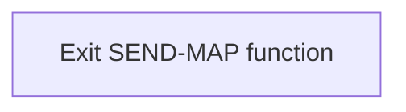

<SwmSnippet path="/src/base/cobol_src/BNK1UAC.cbl" line="1297">

---

The <SwmToken path="src/base/cobol_src/BNK1UAC.cbl" pos="210:3:5" line-data="                 PERFORM SEND-MAP">`SEND-MAP`</SwmToken> function concludes its operations by reaching the <SwmToken path="src/base/cobol_src/BNK1UAC.cbl" pos="1297:1:1" line-data="       SM999.">`SM999`</SwmToken> label, which signifies the end of the function's logic. This is followed by the <SwmToken path="src/base/cobol_src/BNK1UAC.cbl" pos="1298:1:1" line-data="           EXIT.">`EXIT`</SwmToken> statement, which ensures that the function terminates properly and control is returned to the calling program or the next logical sequence in the application.

```cobol
       SM999.
           EXIT.
```

---

</SwmSnippet>

## <SwmToken path="src/base/cobol_src/BNK1UAC.cbl" pos="322:3:7" line-data="              PERFORM POPULATE-TIME-DATE">`POPULATE-TIME-DATE`</SwmToken>

Lets' zoom into this section of the flow:

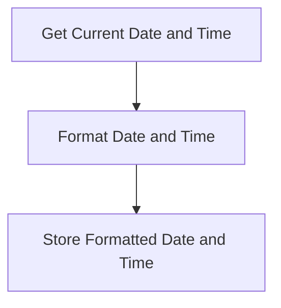

<SwmSnippet path="/src/base/cobol_src/BNK1UAC.cbl" line="1412">

---

### Populating the Current Date and Time

The <SwmToken path="src/base/cobol_src/BNK1UAC.cbl" pos="322:3:7" line-data="              PERFORM POPULATE-TIME-DATE">`POPULATE-TIME-DATE`</SwmToken> function is responsible for retrieving the current date and time, formatting them appropriately, and storing the formatted values for further use. This is crucial for ensuring that all transactions and operations have accurate timestamps, which is essential for tracking and auditing purposes.

```cobol

```

---

</SwmSnippet>

## <SwmToken path="src/base/cobol_src/BNK1UAC.cbl" pos="1215:3:7" line-data="                 PERFORM ABEND-THIS-TASK">`ABEND-THIS-TASK`</SwmToken>

Lets' zoom into this section of the flow:

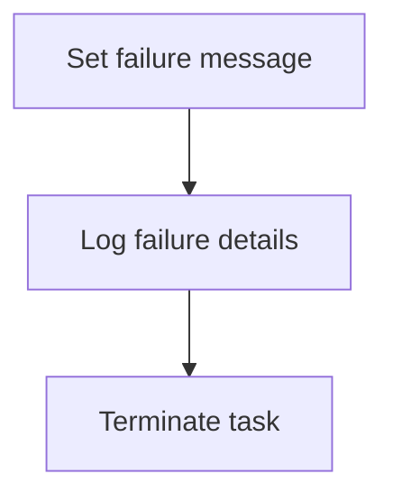

<SwmSnippet path="/src/base/cobol_src/BNK1UAC.cbl" line="1400">

---

The <SwmToken path="src/base/cobol_src/BNK1UAC.cbl" pos="1215:3:7" line-data="                 PERFORM ABEND-THIS-TASK">`ABEND-THIS-TASK`</SwmToken> function is responsible for handling abnormal task termination. It sets a failure message in <SwmToken path="src/base/cobol_src/BNK1UAC.cbl" pos="1210:3:7" line-data="                 INITIALIZE WS-FAIL-INFO">`WS-FAIL-INFO`</SwmToken> to indicate that the task is abending. This message includes details such as the application ID and response codes. The function then logs these failure details to help diagnose the issue. Finally, it terminates the task to prevent further processing and potential data corruption.

```cobol
                     TIME(WS-TIME-NOW)
                     DATESEP
           END-EXEC.

       PTD999.
           EXIT.


```

---

</SwmSnippet>

## <SwmToken path="src/base/cobol_src/BNK1UAC.cbl" pos="234:3:7" line-data="                 PERFORM SEND-TERMINATION-MSG">`SEND-TERMINATION-MSG`</SwmToken>

Lets' zoom into this section of the flow:

```mermaid
graph TD
  A[Move EIBRESP2 to ABND-RESP2CODE] --> B[Assign APPLID to ABND-APPLID]
  B --> C[Move EIBTASKN to ABND-TASKNO-KEY]
  C --> D[Move EIBTRNID to ABND-TRANID]
  D --> E[Perform POPULATE-TIME-DATE]
  E --> F[Move WS-ORIG-DATE to ABND-DATE]
  F --> G[Format current time into ABND-TIME]
  G --> H[Move WS-U-TIME to ABND-UTIME-KEY]
  H --> I[Move 'HBNK' to ABND-CODE]
  I --> J[Assign PROGRAM to ABND-PROGRAM]
  J --> K[Move ZEROS to ABND-SQLCODE]
  K --> L[Format failure message into ABND-FREEFORM]
  L --> M[Link to ABNDPROC program with ABNDINFO-REC]
  M --> N[Initialize WS-FAIL-INFO]
  N --> O[Move failure message to WS-CICS-FAIL-MSG]
  O --> P[Move WS-CICS-RESP to WS-CICS-RESP-DISP]
  P --> Q[Move WS-CICS-RESP2 to WS-CICS-RESP2-DISP]
  Q --> R[Perform ABEND-THIS-TASK]

%% Swimm:
%% graph TD
%%   A[Move <SwmToken path="src/base/cobol_src/BNK1UAC.cbl" pos="312:3:3" line-data="              MOVE EIBRESP2   TO ABND-RESP2CODE">`EIBRESP2`</SwmToken> to <SwmToken path="src/base/cobol_src/BNK1UAC.cbl" pos="312:7:9" line-data="              MOVE EIBRESP2   TO ABND-RESP2CODE">`ABND-RESP2CODE`</SwmToken>] --> B[Assign APPLID to <SwmToken path="src/base/cobol_src/BNK1UAC.cbl" pos="316:9:11" line-data="              EXEC CICS ASSIGN APPLID(ABND-APPLID)">`ABND-APPLID`</SwmToken>]
%%   B --> C[Move EIBTASKN to <SwmToken path="src/base/cobol_src/BNK1UAC.cbl" pos="319:7:11" line-data="              MOVE EIBTASKN   TO ABND-TASKNO-KEY">`ABND-TASKNO-KEY`</SwmToken>]
%%   C --> D[Move EIBTRNID to <SwmToken path="src/base/cobol_src/BNK1UAC.cbl" pos="320:7:9" line-data="              MOVE EIBTRNID   TO ABND-TRANID">`ABND-TRANID`</SwmToken>]
%%   D --> E[Perform <SwmToken path="src/base/cobol_src/BNK1UAC.cbl" pos="322:3:7" line-data="              PERFORM POPULATE-TIME-DATE">`POPULATE-TIME-DATE`</SwmToken>]
%%   E --> F[Move <SwmToken path="src/base/cobol_src/BNK1UAC.cbl" pos="324:3:7" line-data="              MOVE WS-ORIG-DATE TO ABND-DATE">`WS-ORIG-DATE`</SwmToken> to <SwmToken path="src/base/cobol_src/BNK1UAC.cbl" pos="324:11:13" line-data="              MOVE WS-ORIG-DATE TO ABND-DATE">`ABND-DATE`</SwmToken>]
%%   F --> G[Format current time into <SwmToken path="src/base/cobol_src/BNK1UAC.cbl" pos="330:3:5" line-data="                     INTO ABND-TIME">`ABND-TIME`</SwmToken>]
%%   G --> H[Move <SwmToken path="src/base/cobol_src/BNK1UAC.cbl" pos="333:3:7" line-data="              MOVE WS-U-TIME   TO ABND-UTIME-KEY">`WS-U-TIME`</SwmToken> to <SwmToken path="src/base/cobol_src/BNK1UAC.cbl" pos="333:11:15" line-data="              MOVE WS-U-TIME   TO ABND-UTIME-KEY">`ABND-UTIME-KEY`</SwmToken>]
%%   H --> I[Move 'HBNK' to <SwmToken path="src/base/cobol_src/BNK1UAC.cbl" pos="334:9:11" line-data="              MOVE &#39;HBNK&#39;      TO ABND-CODE">`ABND-CODE`</SwmToken>]
%%   I --> J[Assign PROGRAM to <SwmToken path="src/base/cobol_src/BNK1UAC.cbl" pos="336:9:11" line-data="              EXEC CICS ASSIGN PROGRAM(ABND-PROGRAM)">`ABND-PROGRAM`</SwmToken>]
%%   J --> K[Move ZEROS to <SwmToken path="src/base/cobol_src/BNK1UAC.cbl" pos="339:7:9" line-data="              MOVE ZEROS      TO ABND-SQLCODE">`ABND-SQLCODE`</SwmToken>]
%%   K --> L[Format failure message into <SwmToken path="src/base/cobol_src/BNK1UAC.cbl" pos="471:3:5" line-data="                    INTO ABND-FREEFORM">`ABND-FREEFORM`</SwmToken>]
%%   L --> M[Link to ABNDPROC program with <SwmToken path="src/base/cobol_src/BNK1UAC.cbl" pos="310:3:5" line-data="              INITIALIZE ABNDINFO-REC">`ABNDINFO-REC`</SwmToken>]
%%   M --> N[Initialize <SwmToken path="src/base/cobol_src/BNK1UAC.cbl" pos="1210:3:7" line-data="                 INITIALIZE WS-FAIL-INFO">`WS-FAIL-INFO`</SwmToken>]
%%   N --> O[Move failure message to <SwmToken path="src/base/cobol_src/BNK1UAC.cbl" pos="1212:3:9" line-data="                    TO WS-CICS-FAIL-MSG">`WS-CICS-FAIL-MSG`</SwmToken>]
%%   O --> P[Move <SwmToken path="src/base/cobol_src/BNK1UAC.cbl" pos="225:3:7" line-data="                    RESP(WS-CICS-RESP)">`WS-CICS-RESP`</SwmToken> to <SwmToken path="src/base/cobol_src/BNK1UAC.cbl" pos="1213:11:17" line-data="                 MOVE WS-CICS-RESP  TO WS-CICS-RESP-DISP">`WS-CICS-RESP-DISP`</SwmToken>]
%%   P --> Q[Move <SwmToken path="src/base/cobol_src/BNK1UAC.cbl" pos="226:3:7" line-data="                    RESP2(WS-CICS-RESP2)">`WS-CICS-RESP2`</SwmToken> to <SwmToken path="src/base/cobol_src/BNK1UAC.cbl" pos="1214:11:17" line-data="                 MOVE WS-CICS-RESP2 TO WS-CICS-RESP2-DISP">`WS-CICS-RESP2-DISP`</SwmToken>]
%%   Q --> R[Perform <SwmToken path="src/base/cobol_src/BNK1UAC.cbl" pos="1215:3:7" line-data="                 PERFORM ABEND-THIS-TASK">`ABEND-THIS-TASK`</SwmToken>]
```

First, the function moves the value of <SwmToken path="src/base/cobol_src/BNK1UAC.cbl" pos="312:3:3" line-data="              MOVE EIBRESP2   TO ABND-RESP2CODE">`EIBRESP2`</SwmToken> (the extended response code) to <SwmToken path="src/base/cobol_src/BNK1UAC.cbl" pos="312:7:9" line-data="              MOVE EIBRESP2   TO ABND-RESP2CODE">`ABND-RESP2CODE`</SwmToken> to capture the response code of the failed transaction.

Next, it assigns the application ID to <SwmToken path="src/base/cobol_src/BNK1UAC.cbl" pos="316:9:11" line-data="              EXEC CICS ASSIGN APPLID(ABND-APPLID)">`ABND-APPLID`</SwmToken> to identify the application where the failure occurred.

Then, it moves the task number and transaction ID to <SwmToken path="src/base/cobol_src/BNK1UAC.cbl" pos="319:7:11" line-data="              MOVE EIBTASKN   TO ABND-TASKNO-KEY">`ABND-TASKNO-KEY`</SwmToken> and <SwmToken path="src/base/cobol_src/BNK1UAC.cbl" pos="320:7:9" line-data="              MOVE EIBTRNID   TO ABND-TRANID">`ABND-TRANID`</SwmToken> respectively, to log the specific task and transaction that failed.

Moving to the next step, it performs the <SwmToken path="src/base/cobol_src/BNK1UAC.cbl" pos="322:3:7" line-data="              PERFORM POPULATE-TIME-DATE">`POPULATE-TIME-DATE`</SwmToken> routine to get the current date and time.

The function then formats the current date and time into <SwmToken path="src/base/cobol_src/BNK1UAC.cbl" pos="324:11:13" line-data="              MOVE WS-ORIG-DATE TO ABND-DATE">`ABND-DATE`</SwmToken> and <SwmToken path="src/base/cobol_src/BNK1UAC.cbl" pos="330:3:5" line-data="                     INTO ABND-TIME">`ABND-TIME`</SwmToken> for logging purposes.

It also moves the current universal time to <SwmToken path="src/base/cobol_src/BNK1UAC.cbl" pos="333:11:15" line-data="              MOVE WS-U-TIME   TO ABND-UTIME-KEY">`ABND-UTIME-KEY`</SwmToken> and sets a specific code 'HBNK' to <SwmToken path="src/base/cobol_src/BNK1UAC.cbl" pos="334:9:11" line-data="              MOVE &#39;HBNK&#39;      TO ABND-CODE">`ABND-CODE`</SwmToken> to categorize the failure.

The program name is assigned to <SwmToken path="src/base/cobol_src/BNK1UAC.cbl" pos="336:9:11" line-data="              EXEC CICS ASSIGN PROGRAM(ABND-PROGRAM)">`ABND-PROGRAM`</SwmToken> to log which program encountered the failure.

The function initializes <SwmToken path="src/base/cobol_src/BNK1UAC.cbl" pos="339:7:9" line-data="              MOVE ZEROS      TO ABND-SQLCODE">`ABND-SQLCODE`</SwmToken> to zero, indicating no SQL error initially.

It then formats a detailed failure message into <SwmToken path="src/base/cobol_src/BNK1UAC.cbl" pos="471:3:5" line-data="                    INTO ABND-FREEFORM">`ABND-FREEFORM`</SwmToken> to provide context about the failure.

The function links to the <SwmToken path="src/base/cobol_src/BNK1UAC.cbl" pos="172:19:19" line-data="       01 WS-ABEND-PGM                 PIC X(8) VALUE &#39;ABNDPROC&#39;.">`ABNDPROC`</SwmToken> program with <SwmToken path="src/base/cobol_src/BNK1UAC.cbl" pos="310:3:5" line-data="              INITIALIZE ABNDINFO-REC">`ABNDINFO-REC`</SwmToken> to handle the abnormal termination and log the failure details.

# User actions processing (<SwmToken path="src/base/cobol_src/BNK1UAC.cbl" pos="255:3:5" line-data="                 PERFORM PROCESS-MAP">`PROCESS-MAP`</SwmToken>)

Let's split this section into smaller parts:

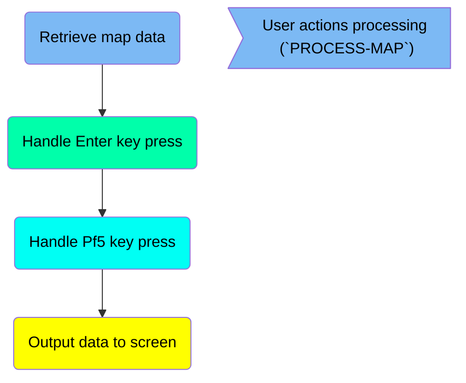

## Retrieve map data

First, we'll zoom into this section of the flow:

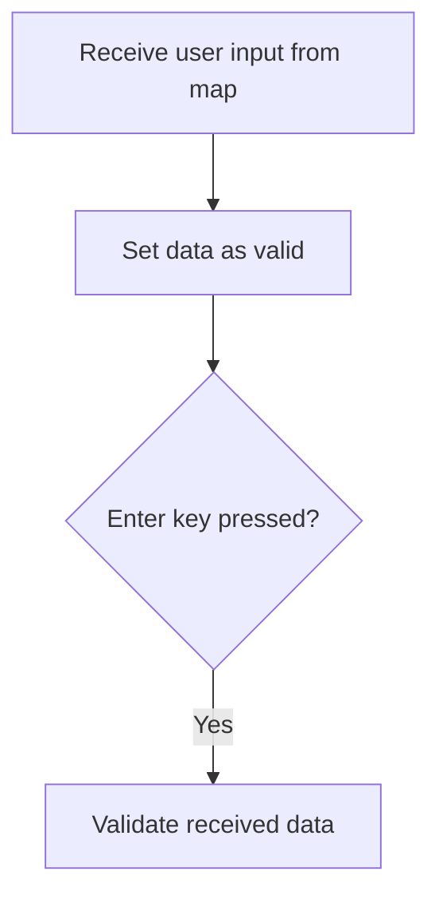

<SwmSnippet path="/src/base/cobol_src/BNK1UAC.cbl" line="371">

---

First, the <SwmToken path="src/base/cobol_src/BNK1UAC.cbl" pos="371:3:5" line-data="           PERFORM RECEIVE-MAP.">`RECEIVE-MAP`</SwmToken> operation is performed to receive user input data from the map.

```cobol
           PERFORM RECEIVE-MAP.
```

---

</SwmSnippet>

<SwmSnippet path="/src/base/cobol_src/BNK1UAC.cbl" line="372">

---

Next, the <SwmToken path="src/base/cobol_src/BNK1UAC.cbl" pos="372:9:13" line-data="           MOVE &#39;Y&#39; TO VALID-DATA-SW">`VALID-DATA-SW`</SwmToken> (which indicates if the data is valid) is set to 'Y', marking the data as valid.

```cobol
           MOVE 'Y' TO VALID-DATA-SW
```

---

</SwmSnippet>

## Handle Enter key press

This is the next section of the flow.

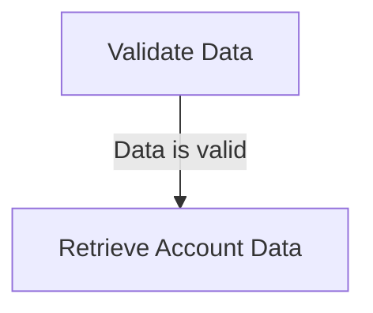

<SwmSnippet path="/src/base/cobol_src/BNK1UAC.cbl" line="377">

---

First, the <SwmToken path="src/base/cobol_src/BNK1UAC.cbl" pos="377:3:5" line-data="              PERFORM EDIT-DATA">`EDIT-DATA`</SwmToken> step is performed to validate the input data.

```cobol
              PERFORM EDIT-DATA
```

---

</SwmSnippet>

<SwmSnippet path="/src/base/cobol_src/BNK1UAC.cbl" line="382">

---

Next, if the data passes validation (i.e., <SwmToken path="src/base/cobol_src/BNK1UAC.cbl" pos="382:3:7" line-data="              IF VALID-DATA-SW = &#39;Y&#39;">`VALID-DATA-SW`</SwmToken> is set to 'Y'), the process proceeds to retrieve the account data.

```cobol
              IF VALID-DATA-SW = 'Y'
                 PERFORM INQ-ACC-DATA
```

---

</SwmSnippet>

## Handle <SwmToken path="src/base/cobol_src/BNK1UAC.cbl" pos="258:5:5" line-data="      *       When Pf5 is pressed then process the content">`Pf5`</SwmToken> key press

Now, lets zoom into this section of the flow:

```mermaid
graph TD
  A[Check if PF5 was pressed] --> B[Validate received data]
  B --> C{Is data valid?}
  C -->|Yes| D[Update account data]

%% Swimm:
%% graph TD
%%   A[Check if <SwmToken path="src/base/cobol_src/BNK1UAC.cbl" pos="520:8:8" line-data="                 &#39;. Then press PF5.&#39; DELIMITED BY SIZE">`PF5`</SwmToken> was pressed] --> B[Validate received data]
%%   B --> C{Is data valid?}
%%   C -->|Yes| D[Update account data]
```

<SwmSnippet path="/src/base/cobol_src/BNK1UAC.cbl" line="391">

---

First, the code checks if the <SwmToken path="src/base/cobol_src/BNK1UAC.cbl" pos="520:8:8" line-data="                 &#39;. Then press PF5.&#39; DELIMITED BY SIZE">`PF5`</SwmToken> key was pressed by evaluating the <SwmToken path="src/base/cobol_src/BNK1UAC.cbl" pos="391:3:3" line-data="           IF EIBAID = DFHPF5">`EIBAID`</SwmToken> variable.

```cobol
           IF EIBAID = DFHPF5
```

---

</SwmSnippet>

<SwmSnippet path="/src/base/cobol_src/BNK1UAC.cbl" line="392">

---

Next, if <SwmToken path="src/base/cobol_src/BNK1UAC.cbl" pos="520:8:8" line-data="                 &#39;. Then press PF5.&#39; DELIMITED BY SIZE">`PF5`</SwmToken> was pressed, the <SwmToken path="src/base/cobol_src/BNK1UAC.cbl" pos="392:3:5" line-data="              PERFORM VALIDATE-DATA">`VALIDATE-DATA`</SwmToken> routine is performed to ensure the received data is correct.

```cobol
              PERFORM VALIDATE-DATA
```

---

</SwmSnippet>

<SwmSnippet path="/src/base/cobol_src/BNK1UAC.cbl" line="398">

---

Then, if the data passes validation (indicated by <SwmToken path="src/base/cobol_src/BNK1UAC.cbl" pos="398:3:7" line-data="              IF VALID-DATA-SW = &#39;Y&#39;">`VALID-DATA-SW`</SwmToken> being 'Y'), the <SwmToken path="src/base/cobol_src/BNK1UAC.cbl" pos="399:3:7" line-data="                 PERFORM UPD-ACC-DATA">`UPD-ACC-DATA`</SwmToken> routine is performed to update the account data.

```cobol
              IF VALID-DATA-SW = 'Y'
                 PERFORM UPD-ACC-DATA
```

---

</SwmSnippet>

## Output data to screen

This is the next section of the flow.

```mermaid
graph TD
  A[Set Alarm for Data Transmission] --> B[Send Data to Screen]
```

<SwmSnippet path="/src/base/cobol_src/BNK1UAC.cbl" line="404">

---

First, the alarm for data transmission is set by enabling the <SwmToken path="src/base/cobol_src/BNK1UAC.cbl" pos="404:3:7" line-data="           SET SEND-DATAONLY-ALARM TO TRUE.">`SEND-DATAONLY-ALARM`</SwmToken> flag. This ensures that the system is ready to alert the user interface about the incoming data.

```cobol
           SET SEND-DATAONLY-ALARM TO TRUE.
```

---

</SwmSnippet>

<SwmSnippet path="/src/base/cobol_src/BNK1UAC.cbl" line="408">

---

Next, the <SwmToken path="src/base/cobol_src/BNK1UAC.cbl" pos="408:3:5" line-data="           PERFORM SEND-MAP.">`SEND-MAP`</SwmToken> operation is performed to output the processed data to the screen. This step is crucial as it updates the user interface with the latest information.

```cobol
           PERFORM SEND-MAP.
```

---

</SwmSnippet>

## <SwmToken path="src/base/cobol_src/BNK1UAC.cbl" pos="371:3:5" line-data="           PERFORM RECEIVE-MAP.">`RECEIVE-MAP`</SwmToken>

Lets' zoom into this section of the flow:

```mermaid
graph TD
  A[Move EIBRESP2 to ABND-RESP2CODE] --> B[Assign APPLID to ABND-APPLID] --> C[Move EIBTASKN to ABND-TASKNO-KEY] --> D[Move EIBTRNID to ABND-TRANID] --> E[Perform POPULATE-TIME-DATE] --> F[Move WS-ORIG-DATE to ABND-DATE] --> G[Concatenate time components into ABND-TIME] --> H[Move WS-U-TIME to ABND-UTIME-KEY] --> I[Move 'HBNK' to ABND-CODE] --> J[Assign PROGRAM to ABND-PROGRAM] --> K[Move ZEROS to ABND-SQLCODE] --> L[Concatenate error message into ABND-FREEFORM] --> M[Link to ABNDPROC program]

%% Swimm:
%% graph TD
%%   A[Move <SwmToken path="src/base/cobol_src/BNK1UAC.cbl" pos="312:3:3" line-data="              MOVE EIBRESP2   TO ABND-RESP2CODE">`EIBRESP2`</SwmToken> to <SwmToken path="src/base/cobol_src/BNK1UAC.cbl" pos="312:7:9" line-data="              MOVE EIBRESP2   TO ABND-RESP2CODE">`ABND-RESP2CODE`</SwmToken>] --> B[Assign APPLID to <SwmToken path="src/base/cobol_src/BNK1UAC.cbl" pos="316:9:11" line-data="              EXEC CICS ASSIGN APPLID(ABND-APPLID)">`ABND-APPLID`</SwmToken>] --> C[Move EIBTASKN to <SwmToken path="src/base/cobol_src/BNK1UAC.cbl" pos="319:7:11" line-data="              MOVE EIBTASKN   TO ABND-TASKNO-KEY">`ABND-TASKNO-KEY`</SwmToken>] --> D[Move EIBTRNID to <SwmToken path="src/base/cobol_src/BNK1UAC.cbl" pos="320:7:9" line-data="              MOVE EIBTRNID   TO ABND-TRANID">`ABND-TRANID`</SwmToken>] --> E[Perform <SwmToken path="src/base/cobol_src/BNK1UAC.cbl" pos="322:3:7" line-data="              PERFORM POPULATE-TIME-DATE">`POPULATE-TIME-DATE`</SwmToken>] --> F[Move <SwmToken path="src/base/cobol_src/BNK1UAC.cbl" pos="324:3:7" line-data="              MOVE WS-ORIG-DATE TO ABND-DATE">`WS-ORIG-DATE`</SwmToken> to <SwmToken path="src/base/cobol_src/BNK1UAC.cbl" pos="324:11:13" line-data="              MOVE WS-ORIG-DATE TO ABND-DATE">`ABND-DATE`</SwmToken>] --> G[Concatenate time components into <SwmToken path="src/base/cobol_src/BNK1UAC.cbl" pos="330:3:5" line-data="                     INTO ABND-TIME">`ABND-TIME`</SwmToken>] --> H[Move <SwmToken path="src/base/cobol_src/BNK1UAC.cbl" pos="333:3:7" line-data="              MOVE WS-U-TIME   TO ABND-UTIME-KEY">`WS-U-TIME`</SwmToken> to <SwmToken path="src/base/cobol_src/BNK1UAC.cbl" pos="333:11:15" line-data="              MOVE WS-U-TIME   TO ABND-UTIME-KEY">`ABND-UTIME-KEY`</SwmToken>] --> I[Move 'HBNK' to <SwmToken path="src/base/cobol_src/BNK1UAC.cbl" pos="334:9:11" line-data="              MOVE &#39;HBNK&#39;      TO ABND-CODE">`ABND-CODE`</SwmToken>] --> J[Assign PROGRAM to <SwmToken path="src/base/cobol_src/BNK1UAC.cbl" pos="336:9:11" line-data="              EXEC CICS ASSIGN PROGRAM(ABND-PROGRAM)">`ABND-PROGRAM`</SwmToken>] --> K[Move ZEROS to <SwmToken path="src/base/cobol_src/BNK1UAC.cbl" pos="339:7:9" line-data="              MOVE ZEROS      TO ABND-SQLCODE">`ABND-SQLCODE`</SwmToken>] --> L[Concatenate error message into <SwmToken path="src/base/cobol_src/BNK1UAC.cbl" pos="471:3:5" line-data="                    INTO ABND-FREEFORM">`ABND-FREEFORM`</SwmToken>] --> M[Link to ABNDPROC program]
```

<SwmSnippet path="/src/base/cobol_src/BNK1UAC.cbl" line="436">

---

First, the response code <SwmToken path="src/base/cobol_src/BNK1UAC.cbl" pos="436:3:3" line-data="              MOVE EIBRESP2   TO ABND-RESP2CODE">`EIBRESP2`</SwmToken> is moved to <SwmToken path="src/base/cobol_src/BNK1UAC.cbl" pos="436:7:9" line-data="              MOVE EIBRESP2   TO ABND-RESP2CODE">`ABND-RESP2CODE`</SwmToken> to capture the response code for further processing.

```cobol
              MOVE EIBRESP2   TO ABND-RESP2CODE
```

---

</SwmSnippet>

<SwmSnippet path="/src/base/cobol_src/BNK1UAC.cbl" line="440">

---

Next, the application ID is assigned to <SwmToken path="src/base/cobol_src/BNK1UAC.cbl" pos="440:9:11" line-data="              EXEC CICS ASSIGN APPLID(ABND-APPLID)">`ABND-APPLID`</SwmToken> to identify the application context.

```cobol
              EXEC CICS ASSIGN APPLID(ABND-APPLID)
              END-EXEC
```

---

</SwmSnippet>

<SwmSnippet path="/src/base/cobol_src/BNK1UAC.cbl" line="443">

---

Then, the task number and transaction ID are moved to <SwmToken path="src/base/cobol_src/BNK1UAC.cbl" pos="443:7:11" line-data="              MOVE EIBTASKN   TO ABND-TASKNO-KEY">`ABND-TASKNO-KEY`</SwmToken> and <SwmToken path="src/base/cobol_src/BNK1UAC.cbl" pos="444:7:9" line-data="              MOVE EIBTRNID   TO ABND-TRANID">`ABND-TRANID`</SwmToken> respectively, to log the task and transaction details.

```cobol
              MOVE EIBTASKN   TO ABND-TASKNO-KEY
              MOVE EIBTRNID   TO ABND-TRANID
```

---

</SwmSnippet>

<SwmSnippet path="/src/base/cobol_src/BNK1UAC.cbl" line="446">

---

Moving to the next step, the <SwmToken path="src/base/cobol_src/BNK1UAC.cbl" pos="446:3:7" line-data="              PERFORM POPULATE-TIME-DATE">`POPULATE-TIME-DATE`</SwmToken> routine is performed to get the current date and time.

```cobol
              PERFORM POPULATE-TIME-DATE
```

---

</SwmSnippet>

<SwmSnippet path="/src/base/cobol_src/BNK1UAC.cbl" line="448">

---

The original date is moved to <SwmToken path="src/base/cobol_src/BNK1UAC.cbl" pos="448:11:13" line-data="              MOVE WS-ORIG-DATE TO ABND-DATE">`ABND-DATE`</SwmToken> and the current time components are concatenated into <SwmToken path="src/base/cobol_src/BNK1UAC.cbl" pos="454:3:5" line-data="                     INTO ABND-TIME">`ABND-TIME`</SwmToken> for logging purposes.

```cobol
              MOVE WS-ORIG-DATE TO ABND-DATE
              STRING WS-TIME-NOW-GRP-HH DELIMITED BY SIZE,
                    ':' DELIMITED BY SIZE,
                     WS-TIME-NOW-GRP-MM DELIMITED BY SIZE,
                     ':' DELIMITED BY SIZE,
                     WS-TIME-NOW-GRP-MM DELIMITED BY SIZE
                     INTO ABND-TIME
              END-STRING
```

---

</SwmSnippet>

<SwmSnippet path="/src/base/cobol_src/BNK1UAC.cbl" line="457">

---

The universal time is moved to <SwmToken path="src/base/cobol_src/BNK1UAC.cbl" pos="457:11:15" line-data="              MOVE WS-U-TIME   TO ABND-UTIME-KEY">`ABND-UTIME-KEY`</SwmToken> and a specific code 'HBNK' is assigned to <SwmToken path="src/base/cobol_src/BNK1UAC.cbl" pos="458:9:11" line-data="              MOVE &#39;HBNK&#39;      TO ABND-CODE">`ABND-CODE`</SwmToken> for identification.

```cobol
              MOVE WS-U-TIME   TO ABND-UTIME-KEY
              MOVE 'HBNK'      TO ABND-CODE
```

---

</SwmSnippet>

<SwmSnippet path="/src/base/cobol_src/BNK1UAC.cbl" line="460">

---

The program name is assigned to <SwmToken path="src/base/cobol_src/BNK1UAC.cbl" pos="460:9:11" line-data="              EXEC CICS ASSIGN PROGRAM(ABND-PROGRAM)">`ABND-PROGRAM`</SwmToken> to log which program was running.

```cobol
              EXEC CICS ASSIGN PROGRAM(ABND-PROGRAM)
              END-EXEC
```

---

</SwmSnippet>

<SwmSnippet path="/src/base/cobol_src/BNK1UAC.cbl" line="463">

---

Zeros are moved to <SwmToken path="src/base/cobol_src/BNK1UAC.cbl" pos="463:7:9" line-data="              MOVE ZEROS      TO ABND-SQLCODE">`ABND-SQLCODE`</SwmToken> to initialize the SQL code field.

```cobol
              MOVE ZEROS      TO ABND-SQLCODE
```

---

</SwmSnippet>

<SwmSnippet path="/src/base/cobol_src/BNK1UAC.cbl" line="465">

---

Finally, an error message is constructed and moved to <SwmToken path="src/base/cobol_src/BNK1UAC.cbl" pos="471:3:5" line-data="                    INTO ABND-FREEFORM">`ABND-FREEFORM`</SwmToken>, and the <SwmToken path="src/base/cobol_src/BNK1UAC.cbl" pos="172:19:19" line-data="       01 WS-ABEND-PGM                 PIC X(8) VALUE &#39;ABNDPROC&#39;.">`ABNDPROC`</SwmToken> program is linked to handle the abnormal termination.

```cobol
              STRING 'RM010 - RECEIVE MAP FAIL.'
                    DELIMITED BY SIZE,
                    ' EIBRESP=' DELIMITED BY SIZE,
                    ABND-RESPCODE DELIMITED BY SIZE,
                    ' RESP2=' DELIMITED BY SIZE,
                    ABND-RESP2CODE DELIMITED BY SIZE
                    INTO ABND-FREEFORM
              END-STRING

              EXEC CICS LINK PROGRAM(WS-ABEND-PGM)
                        COMMAREA(ABNDINFO-REC)
              END-EXEC
```

---

</SwmSnippet>

## <SwmToken path="src/base/cobol_src/BNK1UAC.cbl" pos="377:3:5" line-data="              PERFORM EDIT-DATA">`EDIT-DATA`</SwmToken>

Lets' zoom into this section of the flow:

```mermaid
graph TD
  A[Check if data is valid] --> |Yes| B[Update account data]
  A --> |No| C[Handle invalid data]
```

<SwmSnippet path="/src/base/cobol_src/BNK1UAC.cbl" line="513">

---

### Checking if data is valid

The first step in the <SwmToken path="src/base/cobol_src/BNK1UAC.cbl" pos="377:3:5" line-data="              PERFORM EDIT-DATA">`EDIT-DATA`</SwmToken> function is to check if the data is valid by evaluating the <SwmToken path="src/base/cobol_src/BNK1UAC.cbl" pos="523:9:11" line-data="              MOVE &#39;N&#39; TO VALID-DATA-SW">`VALID-DATA`</SwmToken> switch. If the data is valid, the function proceeds to update the account data by calling the <SwmToken path="src/base/cobol_src/BNK1UAC.cbl" pos="955:4:4" line-data="              PROGRAM(&#39;UPDACC&#39;)">`UPDACC`</SwmToken> program. If the data is not valid, the function handles the invalid data scenario.

```cobol
           ACTYPEI NOT = 'LOAN    ' AND
           ACTYPEI NOT = 'MORTGAGE' AND
           ACTYPEI NOT = 'ISA     '

              MOVE SPACES TO MESSAGEO
              STRING 'Account Type must be CURRENT, SAVING, LOAN, '
                 'MORTGAGE or ISA' DELIMITED BY SIZE,
                 '. Then press PF5.' DELIMITED BY SIZE
              INTO MESSAGEO
              MOVE -1 to ACTYPEL
              MOVE 'N' TO VALID-DATA-SW
           END-IF.

```

---

</SwmSnippet>

## <SwmToken path="src/base/cobol_src/BNK1UAC.cbl" pos="383:3:7" line-data="                 PERFORM INQ-ACC-DATA">`INQ-ACC-DATA`</SwmToken>

Lets' zoom into this section of the flow:

```mermaid
graph TD
  A[Initialize DFHCOMMAREA] --> B[Move account number to COMM-ACCNO]
  B --> C[Link to INQACC program to retrieve account data]
  C --> D{Check if response is normal}
  D -->|No| E[Handle abend scenario]
  D -->|Yes| F{Check if account data is valid}
  F -->|No| G[Set error message and flag]
  F -->|Yes| H[Move account data to output fields]

%% Swimm:
%% graph TD
%%   A[Initialize DFHCOMMAREA] --> B[Move account number to <SwmToken path="src/base/cobol_src/BNK1UAC.cbl" pos="284:3:5" line-data="              MOVE COMM-ACCNO          TO WS-COMM-ACCNO">`COMM-ACCNO`</SwmToken>]
%%   B --> C[Link to INQACC program to retrieve account data]
%%   C --> D{Check if response is normal}
%%   D -->|No| E[Handle abend scenario]
%%   D -->|Yes| F{Check if account data is valid}
%%   F -->|No| G[Set error message and flag]
%%   F -->|Yes| H[Move account data to output fields]
```

First, the <SwmToken path="src/base/cobol_src/BNK1UAC.cbl" pos="769:3:3" line-data="              COMMAREA(DFHCOMMAREA)">`DFHCOMMAREA`</SwmToken> is initialized to prepare the communication area for the <SwmToken path="src/base/cobol_src/BNK1UAC.cbl" pos="768:4:4" line-data="              PROGRAM(&#39;INQACC&#39;)">`INQACC`</SwmToken> program.

Next, the account number is moved to <SwmToken path="src/base/cobol_src/BNK1UAC.cbl" pos="284:3:5" line-data="              MOVE COMM-ACCNO          TO WS-COMM-ACCNO">`COMM-ACCNO`</SwmToken> to set up the required fields for the <SwmToken path="src/base/cobol_src/BNK1UAC.cbl" pos="768:4:4" line-data="              PROGRAM(&#39;INQACC&#39;)">`INQACC`</SwmToken> program.

<SwmSnippet path="/src/base/cobol_src/BNK1UAC.cbl" line="767">

---

Then, the <SwmToken path="src/base/cobol_src/BNK1UAC.cbl" pos="768:4:4" line-data="              PROGRAM(&#39;INQACC&#39;)">`INQACC`</SwmToken> program is linked to retrieve account data using the provided account number.

```cobol
           EXEC CICS LINK
              PROGRAM('INQACC')
              COMMAREA(DFHCOMMAREA)
              RESP(WS-CICS-RESP)
              RESP2(WS-CICS-RESP2)
              SYNCONRETURN
           END-EXEC.
```

---

</SwmSnippet>

<SwmSnippet path="/src/base/cobol_src/BNK1UAC.cbl" line="775">

---

Moving to the next step, the response from the <SwmToken path="src/base/cobol_src/BNK1UAC.cbl" pos="768:4:4" line-data="              PROGRAM(&#39;INQACC&#39;)">`INQACC`</SwmToken> program is checked to see if it is normal.

More about INQACC: <SwmLink doc-title="Account Inquiry (INQACC)">[Account Inquiry (INQACC)](/.swm/account-inquiry-inqacc.455lrigy.sw.md)</SwmLink>

```cobol
           IF WS-CICS-RESP NOT = DFHRESP(NORMAL)
```

---

</SwmSnippet>

<SwmSnippet path="/src/base/cobol_src/BNK1UAC.cbl" line="782">

---

If the response is not normal, an abend scenario is handled by preserving the response codes and linking to the abend handler program.

```cobol
              INITIALIZE ABNDINFO-REC
              MOVE EIBRESP    TO ABND-RESPCODE
              MOVE EIBRESP2   TO ABND-RESP2CODE
      *
      *       Get supplemental information
      *
              EXEC CICS ASSIGN APPLID(ABND-APPLID)
              END-EXEC

              MOVE EIBTASKN   TO ABND-TASKNO-KEY
              MOVE EIBTRNID   TO ABND-TRANID

              PERFORM POPULATE-TIME-DATE

              MOVE WS-ORIG-DATE TO ABND-DATE
              STRING WS-TIME-NOW-GRP-HH DELIMITED BY SIZE,
                    ':' DELIMITED BY SIZE,
                     WS-TIME-NOW-GRP-MM DELIMITED BY SIZE,
                     ':' DELIMITED BY SIZE,
                     WS-TIME-NOW-GRP-MM DELIMITED BY SIZE
                     INTO ABND-TIME
```

---

</SwmSnippet>

<SwmSnippet path="/src/base/cobol_src/BNK1UAC.cbl" line="837">

---

If the response is normal, the validity of the account data is checked by verifying if <SwmToken path="src/base/cobol_src/BNK1UAC.cbl" pos="837:3:7" line-data="           IF COMM-ACC-TYPE = SPACES AND">`COMM-ACC-TYPE`</SwmToken> is spaces and <SwmToken path="src/base/cobol_src/BNK1UAC.cbl" pos="838:1:7" line-data="           COMM-LAST-STMT-DT = ZERO">`COMM-LAST-STMT-DT`</SwmToken> is zero.

More about ABNDPROC: <SwmLink doc-title="Writing Abend Records (ABNDPROC)">[Writing Abend Records (ABNDPROC)](/.swm/writing-abend-records-abndproc.svfj4jn5.sw.md)</SwmLink>

```cobol
           IF COMM-ACC-TYPE = SPACES AND
           COMM-LAST-STMT-DT = ZERO
```

---

</SwmSnippet>

<SwmSnippet path="/src/base/cobol_src/BNK1UAC.cbl" line="839">

---

If the account data is not valid, an error message is set and the <SwmToken path="src/base/cobol_src/BNK1UAC.cbl" pos="839:9:13" line-data="              MOVE &#39;N&#39; TO VALID-DATA-SW">`VALID-DATA-SW`</SwmToken> is moved to 'N'.

```cobol
              MOVE 'N' TO VALID-DATA-SW
              MOVE SPACES TO MESSAGEO
              MOVE 'This account number could not be found' TO
                 MESSAGEO
              MOVE -1 TO ACCNOL
```

---

</SwmSnippet>

<SwmSnippet path="/src/base/cobol_src/BNK1UAC.cbl" line="852">

---

If the account data is valid, the fields are moved to the associated output fields for further processing.

```cobol
              MOVE COMM-ACCNO       TO ACCNO2O

              MOVE COMM-CUSTNO      TO CUSTNOO
              MOVE COMM-SCODE       TO SORTCO
              MOVE COMM-ACC-TYPE    TO ACTYPEO
              MOVE COMM-INT-RATE    TO INTRT-PIC9
              MOVE INTRT-PIC9       TO INTRTO
              MOVE COMM-OPENED      TO WS-DATE-SPLIT
              MOVE WS-DATE-SPLIT-DD TO OPENDDO
              MOVE WS-DATE-SPLIT-MM TO OPENMMO
              MOVE WS-DATE-SPLIT-YY TO OPENYYO
              MOVE COMM-LAST-STMT-DT TO WS-DATE-SPLIT
              MOVE WS-DATE-SPLIT-DD TO LSTMTDDO
              MOVE WS-DATE-SPLIT-MM TO LSTMTMMO
              MOVE WS-DATE-SPLIT-YY TO LSTMTYYO
              MOVE COMM-NEXT-STMT-DT TO WS-DATE-SPLIT
              MOVE WS-DATE-SPLIT-DD TO NSTMTDDO
              MOVE WS-DATE-SPLIT-MM TO NSTMTMMO
              MOVE WS-DATE-SPLIT-YY TO NSTMTYYO
              MOVE COMM-OVERDRAFT   TO OVERDRO
              MOVE COMM-AVAIL-BAL   TO AVAILABLE-BALANCE-DISPLAY
```

---

</SwmSnippet>

## <SwmToken path="src/base/cobol_src/BNK1UAC.cbl" pos="392:3:5" line-data="              PERFORM VALIDATE-DATA">`VALIDATE-DATA`</SwmToken>

Lets' zoom into this section of the flow:

```mermaid
graph TD
  A[Check if interest rate is numeric] --> B[Check valid characters]
  B --> C[Check decimal points]
  C --> D[Check negative interest rate]
  D --> E[Check interest rate range]
  E --> F[Check account type and interest rate]
  F --> G[Check overdraft]
  G --> H[Check last statement date]
  H --> I[Check next statement date]
```

<SwmSnippet path="/src/base/cobol_src/BNK1UAC.cbl" line="536">

---

First, the function checks if the interest rate input is numeric. If it is not, it sets an error message asking the user to supply a numeric interest rate.

```cobol
           IF INTRTI(1:INTRTL) IS NOT NUMERIC
              MOVE ZERO TO WS-NUM-COUNT-TOTAL
              INSPECT INTRTI(1:INTRTL) TALLYING
                 WS-NUM-COUNT-TOTAL for ALL '0'
                 WS-NUM-COUNT-TOTAL for ALL '1'
                 WS-NUM-COUNT-TOTAL for ALL '2'
                 WS-NUM-COUNT-TOTAL for ALL '3'
                 WS-NUM-COUNT-TOTAL for ALL '4'
                 WS-NUM-COUNT-TOTAL for ALL '5'
                 WS-NUM-COUNT-TOTAL for ALL '6'
                 WS-NUM-COUNT-TOTAL for ALL '7'
                 WS-NUM-COUNT-TOTAL for ALL '8'
                 WS-NUM-COUNT-TOTAL for ALL '9'
                 WS-NUM-COUNT-TOTAL for ALL '.'
                 WS-NUM-COUNT-TOTAL for ALL '-'
                 WS-NUM-COUNT-TOTAL for ALL '+'
```

---

</SwmSnippet>

<SwmSnippet path="/src/base/cobol_src/BNK1UAC.cbl" line="536">

---

Next, it verifies that the input contains only valid characters, including digits, decimal points, and signs. If invalid characters are found, an error message is set.

```cobol
           IF INTRTI(1:INTRTL) IS NOT NUMERIC
              MOVE ZERO TO WS-NUM-COUNT-TOTAL
              INSPECT INTRTI(1:INTRTL) TALLYING
                 WS-NUM-COUNT-TOTAL for ALL '0'
                 WS-NUM-COUNT-TOTAL for ALL '1'
                 WS-NUM-COUNT-TOTAL for ALL '2'
                 WS-NUM-COUNT-TOTAL for ALL '3'
                 WS-NUM-COUNT-TOTAL for ALL '4'
                 WS-NUM-COUNT-TOTAL for ALL '5'
                 WS-NUM-COUNT-TOTAL for ALL '6'
                 WS-NUM-COUNT-TOTAL for ALL '7'
                 WS-NUM-COUNT-TOTAL for ALL '8'
                 WS-NUM-COUNT-TOTAL for ALL '9'
                 WS-NUM-COUNT-TOTAL for ALL '.'
                 WS-NUM-COUNT-TOTAL for ALL '-'
                 WS-NUM-COUNT-TOTAL for ALL '+'
                 WS-NUM-COUNT-TOTAL for ALL ' '

      *
      *       So the idea here is that if there is a
      *       decimal point, the field is not numeric. But if it is
```

---

</SwmSnippet>

<SwmSnippet path="/src/base/cobol_src/BNK1UAC.cbl" line="573">

---

Then, the function checks that there is at most one decimal point in the interest rate. If there are multiple decimal points, an error message is set.

```cobol
      *       And let's check to make sure we only have
      *       0 to 1 decimal points.
      *
              MOVE ZERO TO WS-NUM-COUNT-POINT
              INSPECT INTRTI(1:INTRTL) TALLYING
                 WS-NUM-COUNT-POINT FOR ALL '.'

              IF WS-NUM-COUNT-POINT > 1
                 STRING 'Use one decimal point for interest rate '
                    DELIMITED BY SIZE,
                    'only' DELIMITED BY SIZE,
                 INTO MESSAGEO
                 MOVE 'N' TO VALID-DATA-SW
                 MOVE -1 TO INTRTL
                 GO TO VD999
              END-If
```

---

</SwmSnippet>

<SwmSnippet path="/src/base/cobol_src/BNK1UAC.cbl" line="590">

---

Moving to the next step, it ensures that there are no more than two digits after the decimal point. If there are more, an error message is set.

```cobol
      *       Now let's check to see if we have too
      *       many decimals!
      *
              IF WS-NUM-COUNT-POINT = 1
                 MOVE ZERO TO WS-NUM-COUNT-TOTAL
                 INSPECT INTRTI(1:INTRTL) TALLYING
                    WS-NUM-COUNT-TOTAL FOR CHARACTERS AFTER '.'

                 IF WS-NUM-COUNT-TOTAL > 2
      *
      *             There are more than 2 characters after the point
      *
                    MOVE ZERO TO WS-NUM-COUNT-TOTAL
                       WS-NUM-COUNT-POINT
                    INSPECT INTRTI(1:INTRTL) TALLYING
                       WS-NUM-COUNT-POINT FOR CHARACTERS BEFORE '.'

                    ADD 2 TO WS-NUM-COUNT-POINT
                       GIVING WS-NUM-COUNT-POINT

                    INSPECT INTRTI(WS-NUM-COUNT-POINT:INTRTL) TALLYING
```

---

</SwmSnippet>

<SwmSnippet path="/src/base/cobol_src/BNK1UAC.cbl" line="646">

---

Diving into the next validation, the function checks if the interest rate is negative. If it is, an error message is set.

```cobol
           IF INTRTI-COMP-1 < 0
              MOVE SPACES TO MESSAGEO
              STRING 'Please supply a zero or positive interest rate'
                 DELIMITED BY SIZE,
                 INTO MESSAGEO
              MOVE 'N' TO VALID-DATA-SW
              MOVE -1 TO INTRTL
              GO TO VD999
           END-IF.
```

---

</SwmSnippet>

<SwmSnippet path="/src/base/cobol_src/BNK1UAC.cbl" line="656">

---

Then, it verifies that the interest rate does not exceed <SwmToken path="src/base/cobol_src/BNK1UAC.cbl" pos="656:11:13" line-data="           IF INTRTI-COMP-1 &gt; 9999.99">`9999.99`</SwmToken>%. If it does, an error message is set.

```cobol
           IF INTRTI-COMP-1 > 9999.99
              MOVE SPACES TO MESSAGEO
              STRING 'Please supply an interest rate less than '
                     DELIMITED BY SIZE,
                     '9999.99%' DELIMITED BY SIZE
              INTO MESSAGEO
              MOVE 'N' TO VALID-DATA-SW
              MOVE -1 TO INTRTL
              GO TO VD999
           END-IF.
```

---

</SwmSnippet>

<SwmSnippet path="/src/base/cobol_src/BNK1UAC.cbl" line="667">

---

Next, the function checks if the account type is 'LOAN' or 'MORTGAGE' and the interest rate is zero. If both conditions are met, an error message is set.

```cobol
           IF (ACTYPEI = 'LOAN    ' AND INTRTI = '0000.00') OR
           (ACTYPEI = 'MORTGAGE' AND INTRTI = '0000.00')
              MOVE SPACES TO MESSAGEO
              STRING
              'Interest rate cannot be 0 with this account type.'
              ' Correct and press PF5.' delimited by size into
                 MESSAGEO
              MOVE 'N' TO VALID-DATA-SW
              MOVE -1  TO INTRTL
              GO TO VD999
           END-IF.
```

---

</SwmSnippet>

<SwmSnippet path="/src/base/cobol_src/BNK1UAC.cbl" line="679">

---

Going into the next validation, it checks if the overdraft value is numeric. If it is not, an error message is set.

```cobol
           IF(OVERDRL = ZERO OR OVERDRI(1:OVERDRL) IS NOT NUMERIC)
               MOVE 'Overdraft must be numeric. Correct and press PF5.'
                  TO MESSAGEO
              MOVE 'N' TO VALID-DATA-SW
              MOVE -1  TO OVERDRL
              GO TO VD999
           END-IF.
```

---

</SwmSnippet>

<SwmSnippet path="/src/base/cobol_src/BNK1UAC.cbl" line="687">

---

The function then checks if the last statement date components (day, month, year) are numeric. If any component is not numeric, an error message is set.

```cobol
           IF LSTMTDDI NOT NUMERIC OR
           LSTMTMMI NOT NUMERIC OR
           LSTMTYYI NOT NUMERIC
              MOVE 'Last statement date must be numeric      ' TO
                 MESSAGEO
              MOVE 'N' TO VALID-DATA-SW
              GO TO VD999
           END-IF.
```

---

</SwmSnippet>

<SwmSnippet path="/src/base/cobol_src/BNK1UAC.cbl" line="696">

---

It also checks if the next statement date components (day, month, year) are numeric. If any component is not numeric, an error message is set.

```cobol
           IF NSTMTDDI NOT NUMERIC OR
           NSTMTMMI NOT NUMERIC OR
           NSTMTYYI NOT NUMERIC
              MOVE 'Next statement date must be numeric      ' TO
                 MESSAGEO
              MOVE 'N' TO VALID-DATA-SW
              GO TO VD999
           END-IF.
```

---

</SwmSnippet>

<SwmSnippet path="/src/base/cobol_src/BNK1UAC.cbl" line="709">

---

Finally, the function validates the last statement date to ensure the day is within the valid range for the given month. If the date is invalid, an error message is set.

```cobol
           IF WS-LSTMTDDI > 31 OR
           WS-LSTMTDDI = 0 OR
           WS-LSTMTMMI > 12 OR
           WS-LSTMTMMI = 0

              MOVE 'Incorrect date for LAST STATEMENT.      '
                 TO MESSAGEO
              MOVE 'N' TO VALID-DATA-SW
           END-IF.

           IF (WS-LSTMTDDI = 31 AND WS-LSTMTMMI = 9) OR
           (WS-LSTMTDDI = 31 AND WS-LSTMTMMI = 4) OR
           (WS-LSTMTDDI = 31 AND WS-LSTMTMMI = 6) OR
           (WS-LSTMTDDI = 31 AND WS-LSTMTMMI = 11) OR
           (WS-LSTMTDDI > 29 AND WS-LSTMTMMI = 2)
               MOVE 'Incorrect date for LAST STATEMENT.      '
                  TO MESSAGEO
              MOVE 'N' TO VALID-DATA-SW
           END-IF.
```

---

</SwmSnippet>

<SwmSnippet path="/src/base/cobol_src/BNK1UAC.cbl" line="733">

---

Similarly, it validates the next statement date to ensure the day is within the valid range for the given month. If the date is invalid, an error message is set.

```cobol
           IF (WS-NSTMTDDI = 31 AND WS-NSTMTMMI = 9) OR
           (WS-NSTMTDDI = 31 AND WS-NSTMTMMI = 4) OR
           (WS-NSTMTDDI = 31 AND WS-NSTMTMMI = 6) OR
           (WS-NSTMTDDI = 31 AND WS-NSTMTMMI = 11) OR
           (WS-NSTMTDDI > 29 AND WS-NSTMTMMI = 2)
              MOVE 'Incorrect date for NEXT STATEMENT.      '
                 TO MESSAGEO
              MOVE 'N' TO VALID-DATA-SW
           END-IF.

           IF (WS-NSTMTDDI = 31 AND WS-NSTMTMMI = 9) OR
           (WS-NSTMTDDI = 31 AND WS-NSTMTMMI = 4) OR
           (WS-NSTMTDDI = 31 AND WS-NSTMTMMI = 6) OR
           (WS-NSTMTDDI = 31 AND WS-NSTMTMMI = 11) OR
           (WS-NSTMTDDI > 29 AND WS-NSTMTMMI = 2)
               MOVE 'Incorrect date for NEXT STATEMENT.      '
                  TO MESSAGEO
              MOVE 'N' TO VALID-DATA-SW
           END-IF.
```

---

</SwmSnippet>

## <SwmToken path="src/base/cobol_src/BNK1UAC.cbl" pos="399:3:7" line-data="                 PERFORM UPD-ACC-DATA">`UPD-ACC-DATA`</SwmToken>

Lets' zoom into this section of the flow:

```mermaid
graph TD
  A[Move last statement date to COMM-LAST-STMT-DT] --> B[Move next statement date to COMM-NEXT-STMT-DT]
  B --> C[Convert AVBALI to numeric format]
  C --> D[Convert ACTBALI to numeric format]
  D --> E[Link to UPDACC program]
  E --> F[Check if update was successful]
  F --> G[Update output fields with account data]

%% Swimm:
%% graph TD
%%   A[Move last statement date to <SwmToken path="src/base/cobol_src/BNK1UAC.cbl" pos="289:3:9" line-data="              MOVE COMM-LAST-STMT-DT   TO WS-COMM-LAST-STMT-DT">`COMM-LAST-STMT-DT`</SwmToken>] --> B[Move next statement date to <SwmToken path="src/base/cobol_src/BNK1UAC.cbl" pos="290:3:9" line-data="              MOVE COMM-NEXT-STMT-DT   TO WS-COMM-NEXT-STMT-DT">`COMM-NEXT-STMT-DT`</SwmToken>]
%%   B --> C[Convert AVBALI to numeric format]
%%   C --> D[Convert ACTBALI to numeric format]
%%   D --> E[Link to UPDACC program]
%%   E --> F[Check if update was successful]
%%   F --> G[Update output fields with account data]
```

First, the function moves the last statement date components (<SwmToken path="src/base/cobol_src/BNK1UAC.cbl" pos="687:3:3" line-data="           IF LSTMTDDI NOT NUMERIC OR">`LSTMTDDI`</SwmToken>, <SwmToken path="src/base/cobol_src/BNK1UAC.cbl" pos="688:1:1" line-data="           LSTMTMMI NOT NUMERIC OR">`LSTMTMMI`</SwmToken>, <SwmToken path="src/base/cobol_src/BNK1UAC.cbl" pos="689:1:1" line-data="           LSTMTYYI NOT NUMERIC">`LSTMTYYI`</SwmToken>) into <SwmToken path="src/base/cobol_src/BNK1UAC.cbl" pos="289:3:9" line-data="              MOVE COMM-LAST-STMT-DT   TO WS-COMM-LAST-STMT-DT">`COMM-LAST-STMT-DT`</SwmToken>.

Moving to the next step, it moves the next statement date components (<SwmToken path="src/base/cobol_src/BNK1UAC.cbl" pos="696:3:3" line-data="           IF NSTMTDDI NOT NUMERIC OR">`NSTMTDDI`</SwmToken>, <SwmToken path="src/base/cobol_src/BNK1UAC.cbl" pos="697:1:1" line-data="           NSTMTMMI NOT NUMERIC OR">`NSTMTMMI`</SwmToken>, <SwmToken path="src/base/cobol_src/BNK1UAC.cbl" pos="698:1:1" line-data="           NSTMTYYI NOT NUMERIC">`NSTMTYYI`</SwmToken>) into <SwmToken path="src/base/cobol_src/BNK1UAC.cbl" pos="290:3:9" line-data="              MOVE COMM-NEXT-STMT-DT   TO WS-COMM-NEXT-STMT-DT">`COMM-NEXT-STMT-DT`</SwmToken>.

<SwmSnippet path="/src/base/cobol_src/BNK1UAC.cbl" line="925">

---

Next, the function converts the available balance (<SwmToken path="src/base/cobol_src/BNK1UAC.cbl" pos="925:3:3" line-data="           MOVE AVBALI        TO WS-CONVERT-PICX.">`AVBALI`</SwmToken>) from screen format to a proper numeric format, handling the decimal point and sign.

```cobol
           MOVE AVBALI        TO WS-CONVERT-PICX.
           COMPUTE WS-CONVERTED-VAL1 = WS-CONVERT-REMAIN / 100.
           COMPUTE WS-CONVERTED-VAL2 = WS-CONVERT-DEC.
           COMPUTE WS-CONVERTED-VAL3 = WS-CONVERTED-VAL1 +
                                           WS-CONVERTED-VAL2.

           IF WS-CONVERT-SIGN = '-'
              COMPUTE WS-CONVERTED-VAL4 = 0 - WS-CONVERTED-VAL3
           ELSE
              COMPUTE WS-CONVERTED-VAL4 = 0 + WS-CONVERTED-VAL3
           END-IF.

           MOVE WS-CONVERTED-VAL4 TO COMM-AVAIL-BAL.
```

---

</SwmSnippet>

<SwmSnippet path="/src/base/cobol_src/BNK1UAC.cbl" line="939">

---

Then, it converts the actual balance (<SwmToken path="src/base/cobol_src/BNK1UAC.cbl" pos="939:3:3" line-data="           MOVE ACTBALI        TO WS-CONVERT-PICX.">`ACTBALI`</SwmToken>) from screen format to a proper numeric format, handling the decimal point and sign.

```cobol
           MOVE ACTBALI        TO WS-CONVERT-PICX.
           COMPUTE WS-CONVERTED-VAL1 = WS-CONVERT-REMAIN / 100.
           COMPUTE WS-CONVERTED-VAL2 = WS-CONVERT-DEC.
           COMPUTE WS-CONVERTED-VAL3 = WS-CONVERTED-VAL1 +
                                           WS-CONVERTED-VAL2.

           IF WS-CONVERT-SIGN = '-'
              COMPUTE WS-CONVERTED-VAL4 = 0 - WS-CONVERTED-VAL3
           ELSE
              COMPUTE WS-CONVERTED-VAL4 = 0 + WS-CONVERTED-VAL3
           END-IF.

           MOVE WS-CONVERTED-VAL4 TO COMM-ACTUAL-BAL.
```

---

</SwmSnippet>

<SwmSnippet path="/src/base/cobol_src/BNK1UAC.cbl" line="954">

---

The function then links to the <SwmToken path="src/base/cobol_src/BNK1UAC.cbl" pos="955:4:4" line-data="              PROGRAM(&#39;UPDACC&#39;)">`UPDACC`</SwmToken> program to update the account information in the database.

More about UPDACC: <SwmLink doc-title="Updating Account Information (UPDACC)">[Updating Account Information (UPDACC)](/.swm/updating-account-information-updacc.doj7id5a.sw.md)</SwmLink>

```cobol
           EXEC CICS LINK
              PROGRAM('UPDACC')
              COMMAREA(DFHCOMMAREA)
              RESP(WS-CICS-RESP)
              RESP2(WS-CICS-RESP2)
              SYNCONRETURN
           END-EXEC.
```

---

</SwmSnippet>

<SwmSnippet path="/src/base/cobol_src/BNK1UAC.cbl" line="962">

---

If the update is not successful, it handles the error by preserving the response codes and linking to the Abend Handler program.

More about ABNDPROC: <SwmLink doc-title="Writing Abend Records (ABNDPROC)">[Writing Abend Records (ABNDPROC)](/.swm/writing-abend-records-abndproc.svfj4jn5.sw.md)</SwmLink>

```cobol
           IF WS-CICS-RESP NOT = DFHRESP(NORMAL)
      *
      *       Preserve the RESP and RESP2, then set up the
      *       standard ABEND info before getting the applid,
      *       date/time etc. and linking to the Abend Handler
      *       program.
      *
              INITIALIZE ABNDINFO-REC
              MOVE EIBRESP    TO ABND-RESPCODE
              MOVE EIBRESP2   TO ABND-RESP2CODE
      *
      *       Get supplemental information
      *
              EXEC CICS ASSIGN APPLID(ABND-APPLID)
              END-EXEC

              MOVE EIBTASKN   TO ABND-TASKNO-KEY
              MOVE EIBTRNID   TO ABND-TRANID

              PERFORM POPULATE-TIME-DATE

```

---

</SwmSnippet>

<SwmSnippet path="/src/base/cobol_src/BNK1UAC.cbl" line="1020">

---

If the update is successful, it sets a success message and updates the output fields with the account data.

```cobol

      *
      *    Has the update worked or not?
      *
           IF COMM-SUCCESS = 'N'

              MOVE 'N' TO VALID-DATA-SW
              MOVE SPACES TO MESSAGEO
              MOVE 'Update unsuccessful, try again later.    ' TO
                 MESSAGEO
           ELSE
              MOVE SPACES TO MESSAGEO
              MOVE 'Account update successfully applied.     '
                 TO MESSAGEO
      *
      *       Move fields to the associated output fields
      *
              MOVE COMM-ACCNO       TO ACCNO2O
              MOVE COMM-CUSTNO      TO CUSTNOO
              MOVE COMM-SCODE       TO SORTCO
              MOVE COMM-ACC-TYPE    TO ACTYPEO
```

---

</SwmSnippet>

&nbsp;

*This is an auto-generated document by Swimm 🌊 and has not yet been verified by a human*

<SwmMeta version="3.0.0" repo-id="Z2l0aHViJTNBJTNBY2ljcy1iYW5raW5nLXNhbXBsZS1hcHBsaWNhdGlvbi1jYnNhLUlCTS1EZW1vJTNBJTNBU3dpbW0tRGVtbw==" repo-name="cics-banking-sample-application-cbsa-IBM-Demo"><sup>Powered by [Swimm](https://staging.swimm.cloud/)</sup></SwmMeta>
