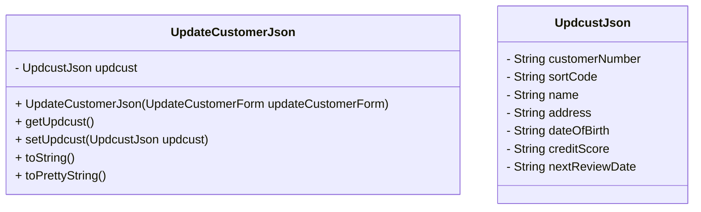

# Overview

The <SwmToken path="src/Z-OS-Connect-Customer-Services-Interface/src/main/java/com/ibm/cics/cip/bank/springboot/customerservices/controllers/WebController.java" pos="47:20:20" line-data="import com.ibm.cics.cip.bank.springboot.customerservices.jsonclasses.updatecustomer.UpdateCustomerJson;">`UpdateCustomerJson`</SwmToken> class is located in the `Jsonclasses` directory. It represents the JSON structure for updating customer information. This class is essential for handling customer data updates in the application.

# Fields and Constructor

The class contains a field <SwmToken path="src/Z-OS-Connect-Customer-Services-Interface/src/main/java/com/ibm/cics/cip/bank/springboot/customerservices/controllers/WebController.java" pos="709:14:14" line-data="				.create(ConnectionInfo.getAddressAndPort() + &quot;/updcust/update&quot;);">`updcust`</SwmToken> of type `UpdcustJson`, which holds the customer details to be updated. The constructor `UpdateCustomerJson(UpdateCustomerForm `<SwmToken path="src/Z-OS-Connect-Customer-Services-Interface/src/main/java/com/ibm/cics/cip/bank/springboot/customerservices/controllers/WebController.java" pos="680:9:9" line-data="	public String showUpdateAccountForm(UpdateCustomerForm updateCustomerForm,">`updateCustomerForm`</SwmToken>`)` initializes the <SwmToken path="src/Z-OS-Connect-Customer-Services-Interface/src/main/java/com/ibm/cics/cip/bank/springboot/customerservices/controllers/WebController.java" pos="709:14:14" line-data="				.create(ConnectionInfo.getAddressAndPort() + &quot;/updcust/update&quot;);">`updcust`</SwmToken> field using data from an <SwmToken path="src/Z-OS-Connect-Customer-Services-Interface/src/main/java/com/ibm/cics/cip/bank/springboot/customerservices/controllers/WebController.java" pos="680:7:7" line-data="	public String showUpdateAccountForm(UpdateCustomerForm updateCustomerForm,">`UpdateCustomerForm`</SwmToken> object.

<SwmSnippet path="/src/Z-OS-Connect-Customer-Services-Interface/src/main/java/com/ibm/cics/cip/bank/springboot/customerservices/controllers/WebController.java" line="679">

---

In <SwmPath>[src/Z-OS-Connect-Customer-Services-Interface/src/main/java/com/ibm/cics/cip/bank/springboot/customerservices/controllers/WebController.java](src/Z-OS-Connect-Customer-Services-Interface/src/main/java/com/ibm/cics/cip/bank/springboot/customerservices/controllers/WebController.java)</SwmPath>, the <SwmToken path="src/Z-OS-Connect-Customer-Services-Interface/src/main/java/com/ibm/cics/cip/bank/springboot/customerservices/controllers/WebController.java" pos="680:7:7" line-data="	public String showUpdateAccountForm(UpdateCustomerForm updateCustomerForm,">`UpdateCustomerForm`</SwmToken> is used in the <SwmToken path="src/Z-OS-Connect-Customer-Services-Interface/src/main/java/com/ibm/cics/cip/bank/springboot/customerservices/controllers/WebController.java" pos="680:5:5" line-data="	public String showUpdateAccountForm(UpdateCustomerForm updateCustomerForm,">`showUpdateAccountForm`</SwmToken> and <SwmToken path="src/Z-OS-Connect-Customer-Services-Interface/src/main/java/com/ibm/cics/cip/bank/springboot/customerservices/controllers/WebController.java" pos="689:5:5" line-data="	public String processUpdateCust(">`processUpdateCust`</SwmToken> methods to handle the update customer form and process the update request respectively.

```java
	@GetMapping("/updatecust")
	public String showUpdateAccountForm(UpdateCustomerForm updateCustomerForm,
			Model model)
	{
		model.addAttribute(ACCOUNT_TYPES, AccountType.values());
		return UPDATE_CUSTOMER_FORM;
	}


	@PostMapping("/updatecust")
	public String processUpdateCust(
			@Valid UpdateCustomerForm updateCustomerForm,
			BindingResult bindingResult, Model model)
```

---

</SwmSnippet>

# Methods

The class provides getter and setter methods for the <SwmToken path="src/Z-OS-Connect-Customer-Services-Interface/src/main/java/com/ibm/cics/cip/bank/springboot/customerservices/controllers/WebController.java" pos="709:14:14" line-data="				.create(ConnectionInfo.getAddressAndPort() + &quot;/updcust/update&quot;);">`updcust`</SwmToken> field, allowing access and modification of the customer details. The <SwmToken path="src/Z-OS-Connect-Customer-Services-Interface/src/main/java/com/ibm/cics/cip/bank/springboot/customerservices/controllers/WebController.java" pos="192:7:7" line-data="				log.info(e.toString());">`toString`</SwmToken> method returns a string representation of the <SwmToken path="src/Z-OS-Connect-Customer-Services-Interface/src/main/java/com/ibm/cics/cip/bank/springboot/customerservices/controllers/WebController.java" pos="47:20:20" line-data="import com.ibm.cics.cip.bank.springboot.customerservices.jsonclasses.updatecustomer.UpdateCustomerJson;">`UpdateCustomerJson`</SwmToken> object, including the <SwmToken path="src/Z-OS-Connect-Customer-Services-Interface/src/main/java/com/ibm/cics/cip/bank/springboot/customerservices/controllers/WebController.java" pos="709:14:14" line-data="				.create(ConnectionInfo.getAddressAndPort() + &quot;/updcust/update&quot;);">`updcust`</SwmToken> field. The <SwmToken path="src/Z-OS-Connect-Customer-Services-Interface/src/main/java/com/ibm/cics/cip/bank/springboot/customerservices/controllers/WebController.java" pos="187:10:10" line-data="				model.addAttribute(SMALL_TEXT, responseObj.toPrettyString());">`toPrettyString`</SwmToken> method returns a formatted string with detailed customer information, such as customer number, sort code, name, address, date of birth, credit score, and next review date.



&nbsp;

*This is an auto-generated document by Swimm 🌊 and has not yet been verified by a human*

<SwmMeta version="3.0.0" repo-id="Z2l0aHViJTNBJTNBY2ljcy1iYW5raW5nLXNhbXBsZS1hcHBsaWNhdGlvbi1jYnNhLUlCTS1EZW1vJTNBJTNBU3dpbW0tRGVtbw==" repo-name="cics-banking-sample-application-cbsa-IBM-Demo"><sup>Powered by [Swimm](/)</sup></SwmMeta>
