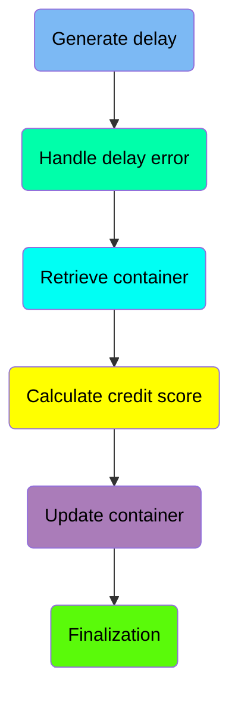
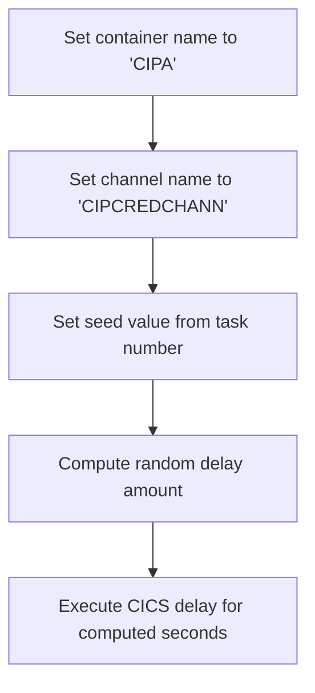
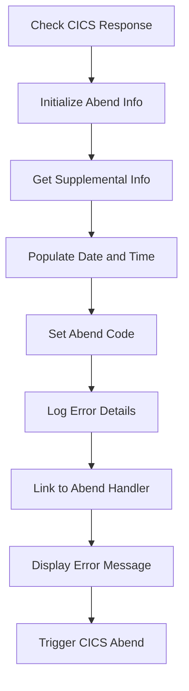
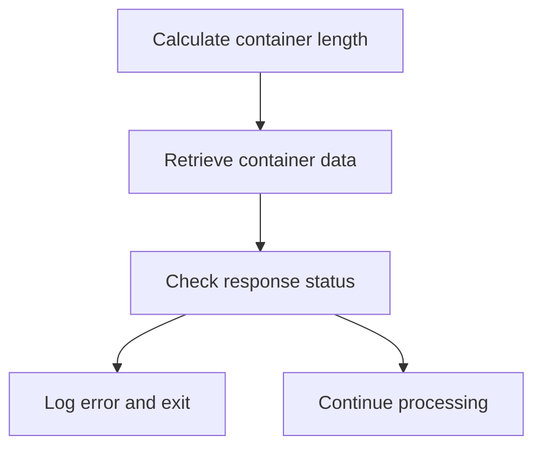
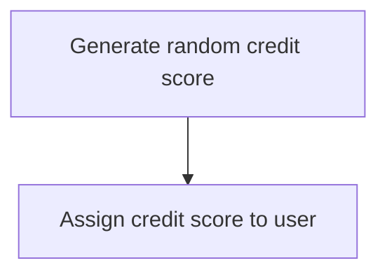
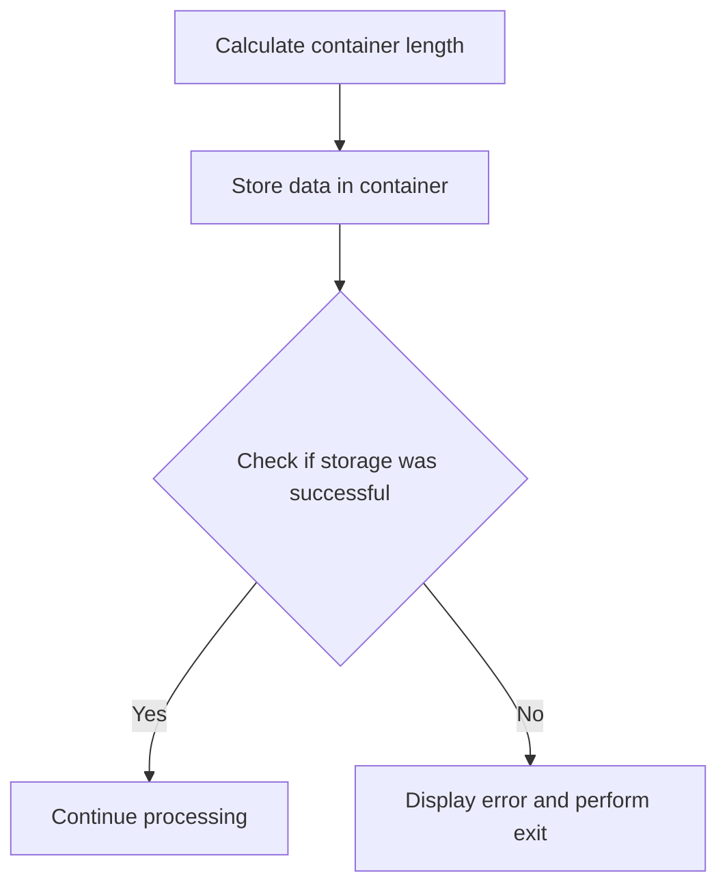
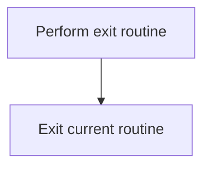
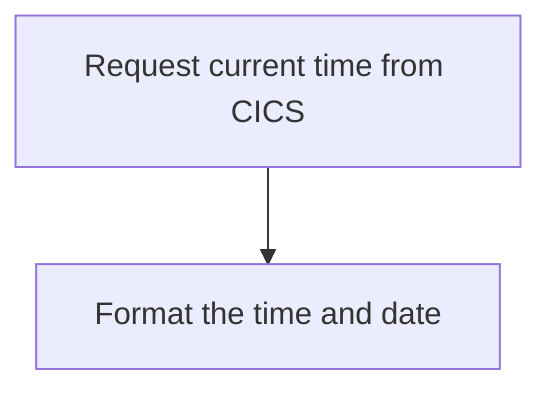
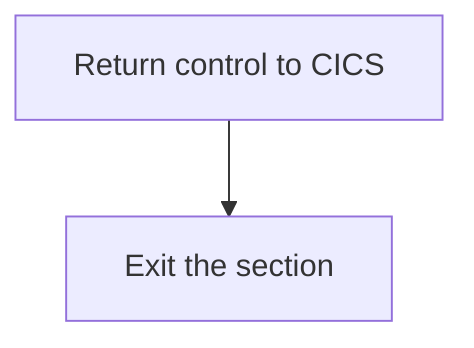

The <SwmToken path="src/base/cobol_src/CRDTAGY1.cbl" pos="201:4:4" line-data="              DISPLAY &#39;CRDTAGY1 - UNABLE TO GET CONTAINER. RESP=&#39;">`CRDTAGY1`</SwmToken> program is responsible for calculating credit scores within the system. This is achieved by generating a random delay, handling any errors that occur during the delay, retrieving and updating container data, and finally calculating and assigning a new credit score to the user.

The flow starts with generating a random delay and handling any errors that might occur during this delay. Next, it retrieves the necessary container data, calculates the credit score, and updates the container with the new score. Finally, it ensures proper finalization and error handling throughout the process.

Here is a high level diagram of the program:



## Generate delay

First, we'll zoom into this section of the flow:



<SwmSnippet path="/src/base/cobol_src/CRDTAGY1.cbl" line="120">

---

### Setting container and channel names

First, the container name is set to <SwmToken path="src/base/cobol_src/CRDTAGY1.cbl" pos="120:4:4" line-data="           MOVE &#39;CIPA            &#39; TO WS-CONTAINER-NAME.">`CIPA`</SwmToken> and the channel name is set to <SwmToken path="src/base/cobol_src/CRDTAGY1.cbl" pos="121:4:4" line-data="           MOVE &#39;CIPCREDCHANN    &#39; TO WS-CHANNEL-NAME.">`CIPCREDCHANN`</SwmToken>. These names are used to identify the specific container and channel for subsequent operations.

```cobol
           MOVE 'CIPA            ' TO WS-CONTAINER-NAME.
           MOVE 'CIPCREDCHANN    ' TO WS-CHANNEL-NAME.
```

---

</SwmSnippet>

<SwmSnippet path="/src/base/cobol_src/CRDTAGY1.cbl" line="122">

---

### Setting the seed value

Moving to the next step, the seed value for generating a random number is set using the task number (<SwmToken path="src/base/cobol_src/CRDTAGY1.cbl" pos="122:3:3" line-data="           MOVE EIBTASKN           TO WS-SEED.">`EIBTASKN`</SwmToken>). This ensures that the random number generation is unique for each task.

```cobol
           MOVE EIBTASKN           TO WS-SEED.
```

---

</SwmSnippet>

<SwmSnippet path="/src/base/cobol_src/CRDTAGY1.cbl" line="124">

---

### Computing the random delay amount

Next, a random delay amount between 1 and 3 seconds is computed. This is done by using the <SwmToken path="src/base/cobol_src/CRDTAGY1.cbl" pos="125:3:5" line-data="                            * FUNCTION RANDOM(WS-SEED)) + 1.">`FUNCTION RANDOM`</SwmToken> with the previously set seed value, ensuring variability in the delay.

```cobol
           COMPUTE WS-DELAY-AMT = ((3 - 1)
                            * FUNCTION RANDOM(WS-SEED)) + 1.
```

---

</SwmSnippet>

<SwmSnippet path="/src/base/cobol_src/CRDTAGY1.cbl" line="127">

---

### Executing the CICS delay

Finally, the CICS delay is executed for the computed number of seconds. This introduces a pause in the processing, simulating a delay that might occur in real-world scenarios.

```cobol
           EXEC CICS DELAY
                FOR SECONDS(WS-DELAY-AMT)
                RESP(WS-CICS-RESP)
                RESP2(WS-CICS-RESP2)
           END-EXEC.
```

---

</SwmSnippet>

## Handle delay error

Now, lets zoom into this section of the flow:



<SwmSnippet path="/src/base/cobol_src/CRDTAGY1.cbl" line="133">

---

### Check CICS Response

First, we check if the CICS response is not normal. This is crucial to determine if there was an abnormal termination that needs to be handled.

```cobol
           IF WS-CICS-RESP NOT = DFHRESP(NORMAL)
```

---

</SwmSnippet>

<SwmSnippet path="/src/base/cobol_src/CRDTAGY1.cbl" line="140">

---

### Initialize Abend Info

Moving to the next step, we initialize the abend information record to prepare for capturing the necessary details about the abnormal termination.

```cobol
              INITIALIZE ABNDINFO-REC
```

---

</SwmSnippet>

<SwmSnippet path="/src/base/cobol_src/CRDTAGY1.cbl" line="146">

---

### Get Supplemental Info

Next, we retrieve supplemental information such as the application ID, task number, and transaction ID, which are essential for diagnosing the issue.

```cobol
              EXEC CICS ASSIGN APPLID(ABND-APPLID)
              END-EXEC

              MOVE EIBTASKN   TO ABND-TASKNO-KEY
              MOVE EIBTRNID   TO ABND-TRANID

```

---

</SwmSnippet>

<SwmSnippet path="/src/base/cobol_src/CRDTAGY1.cbl" line="152">

---

### Populate Date and Time

Then, we populate the current date and time to record when the abnormal termination occurred. This helps in tracking and correlating events.

```cobol
              PERFORM POPULATE-TIME-DATE

              MOVE WS-ORIG-DATE TO ABND-DATE
              STRING WS-TIME-NOW-GRP-HH DELIMITED BY SIZE,
                      ':' DELIMITED BY SIZE,
                       WS-TIME-NOW-GRP-MM DELIMITED BY SIZE,
                       ':' DELIMITED BY SIZE,
                       WS-TIME-NOW-GRP-MM DELIMITED BY SIZE
                       INTO ABND-TIME
```

---

</SwmSnippet>

<SwmSnippet path="/src/base/cobol_src/CRDTAGY1.cbl" line="164">

---

### Set Abend Code

We set a specific abend code 'PLOP' to identify the type of abnormal termination that occurred.

```cobol
              MOVE 'PLOP'      TO ABND-CODE
```

---

</SwmSnippet>

<SwmSnippet path="/src/base/cobol_src/CRDTAGY1.cbl" line="171">

---

### Log Error Details

Next, we log detailed error information including response codes and a freeform message to help in diagnosing the issue.

```cobol
              STRING 'A010  - *** The delay messed up! ***'
                      DELIMITED BY SIZE,
                      ' EIBRESP=' DELIMITED BY SIZE,
                      ABND-RESPCODE DELIMITED BY SIZE,
                      ' RESP2=' DELIMITED BY SIZE,
                      ABND-RESP2CODE DELIMITED BY SIZE
                      INTO ABND-FREEFORM
```

---

</SwmSnippet>

<SwmSnippet path="/src/base/cobol_src/CRDTAGY1.cbl" line="180">

---

### Link to Abend Handler

We then link to the abend handler program, passing the abend information record to handle the abnormal termination.

```cobol
              EXEC CICS LINK PROGRAM(WS-ABEND-PGM)
                          COMMAREA(ABNDINFO-REC)
              END-EXEC
```

---

</SwmSnippet>

<SwmSnippet path="/src/base/cobol_src/CRDTAGY1.cbl" line="184">

---

### Display Error Message

We display an error message to notify the user or system operator about the abnormal termination.

More about ABNDPROC: <SwmLink doc-title="Writing Abend Records (ABNDPROC)">[Writing Abend Records (ABNDPROC)](/.swm/writing-abend-records-abndproc.svfj4jn5.sw.md)</SwmLink>

```cobol
              DISPLAY '*** The delay messed up ! ***'
```

---

</SwmSnippet>

<SwmSnippet path="/src/base/cobol_src/CRDTAGY1.cbl" line="185">

---

### Trigger CICS Abend

Finally, we trigger a CICS abend with the code 'PLOP' to formally end the transaction and allow for proper error handling and logging.

```cobol
              EXEC CICS ABEND
                 ABCODE('PLOP')
              END-EXEC
```

---

</SwmSnippet>

## Retrieve container

Now, lets zoom into this section of the flow:



<SwmSnippet path="/src/base/cobol_src/CRDTAGY1.cbl" line="190">

---

First, the length of the container data is calculated and stored in <SwmToken path="src/base/cobol_src/CRDTAGY1.cbl" pos="190:3:7" line-data="           COMPUTE WS-CONTAINER-LEN = LENGTH OF WS-CONT-IN.">`WS-CONTAINER-LEN`</SwmToken> (which holds the length of the container data).

```cobol
           COMPUTE WS-CONTAINER-LEN = LENGTH OF WS-CONT-IN.
```

---

</SwmSnippet>

<SwmSnippet path="/src/base/cobol_src/CRDTAGY1.cbl" line="192">

---

Next, the container data is retrieved from CICS using the <SwmToken path="src/base/cobol_src/CRDTAGY1.cbl" pos="192:5:7" line-data="           EXEC CICS GET CONTAINER(WS-CONTAINER-NAME)">`GET CONTAINER`</SwmToken> command, which fetches the data into <SwmToken path="src/base/cobol_src/CRDTAGY1.cbl" pos="194:3:7" line-data="                     INTO(WS-CONT-IN)">`WS-CONT-IN`</SwmToken> (the variable holding the container data). If the response code <SwmToken path="src/base/cobol_src/CRDTAGY1.cbl" pos="196:3:7" line-data="                     RESP(WS-CICS-RESP)">`WS-CICS-RESP`</SwmToken> is not normal, an error message is displayed, and the program exits by performing <SwmToken path="src/base/cobol_src/CRDTAGY1.cbl" pos="206:3:11" line-data="              PERFORM GET-ME-OUT-OF-HERE">`GET-ME-OUT-OF-HERE`</SwmToken>.

```cobol
           EXEC CICS GET CONTAINER(WS-CONTAINER-NAME)
                     CHANNEL(WS-CHANNEL-NAME)
                     INTO(WS-CONT-IN)
                     FLENGTH(WS-CONTAINER-LEN)
                     RESP(WS-CICS-RESP)
                     RESP2(WS-CICS-RESP2)
           END-EXEC.

           IF WS-CICS-RESP NOT = DFHRESP(NORMAL)
              DISPLAY 'CRDTAGY1 - UNABLE TO GET CONTAINER. RESP='
                 WS-CICS-RESP ', RESP2=' WS-CICS-RESP2
              DISPLAY 'CONTAINER=' WS-CONTAINER-NAME ' CHANNEL='
                       WS-CHANNEL-NAME ' FLENGTH='
                       WS-CONTAINER-LEN
              PERFORM GET-ME-OUT-OF-HERE
           END-IF.
```

---

</SwmSnippet>

## Calculate credit score

This is the next section of the flow.



<SwmSnippet path="/src/base/cobol_src/CRDTAGY1.cbl" line="215">

---

First, we generate a new credit score for the user by computing a random number between 1 and 999. This is done using the <SwmToken path="src/base/cobol_src/CRDTAGY1.cbl" pos="215:1:1" line-data="           COMPUTE WS-NEW-CREDSCORE = ((999 - 1)">`COMPUTE`</SwmToken> statement, which calculates <SwmToken path="src/base/cobol_src/CRDTAGY1.cbl" pos="215:3:7" line-data="           COMPUTE WS-NEW-CREDSCORE = ((999 - 1)">`WS-NEW-CREDSCORE`</SwmToken> as a random number within the specified range.

```cobol
           COMPUTE WS-NEW-CREDSCORE = ((999 - 1)
                            * FUNCTION RANDOM) + 1.
```

---

</SwmSnippet>

<SwmSnippet path="/src/base/cobol_src/CRDTAGY1.cbl" line="218">

---

Next, the newly generated credit score is assigned to the user's credit score field by moving the value of <SwmToken path="src/base/cobol_src/CRDTAGY1.cbl" pos="218:3:7" line-data="           MOVE WS-NEW-CREDSCORE TO WS-CONT-IN-CREDIT-SCORE.">`WS-NEW-CREDSCORE`</SwmToken> to <SwmToken path="src/base/cobol_src/CRDTAGY1.cbl" pos="218:11:19" line-data="           MOVE WS-NEW-CREDSCORE TO WS-CONT-IN-CREDIT-SCORE.">`WS-CONT-IN-CREDIT-SCORE`</SwmToken>. This ensures that the user's credit score is updated with the newly generated value.

```cobol
           MOVE WS-NEW-CREDSCORE TO WS-CONT-IN-CREDIT-SCORE.

```

---

</SwmSnippet>

## Interim Summary

So far, we saw how to generate a delay by setting container and channel names, computing a random delay amount, and executing the CICS delay. We also covered handling delay errors by checking the CICS response, initializing abend information, and logging error details. Now, we will focus on retrieving container data, calculating its length, and handling the response status.

## Update container

Now, lets zoom into this section of the flow:



<SwmSnippet path="/src/base/cobol_src/CRDTAGY1.cbl" line="223">

---

First, the length of the container data is calculated and stored in <SwmToken path="src/base/cobol_src/CRDTAGY1.cbl" pos="223:3:7" line-data="           COMPUTE WS-CONTAINER-LEN = LENGTH OF WS-CONT-IN.">`WS-CONTAINER-LEN`</SwmToken> (which holds the length of the container data).

```cobol
           COMPUTE WS-CONTAINER-LEN = LENGTH OF WS-CONT-IN.
```

---

</SwmSnippet>

<SwmSnippet path="/src/base/cobol_src/CRDTAGY1.cbl" line="225">

---

Next, the data is stored back into the container using the <SwmToken path="src/base/cobol_src/CRDTAGY1.cbl" pos="225:3:7" line-data="           EXEC CICS PUT CONTAINER(WS-CONTAINER-NAME)">`CICS PUT CONTAINER`</SwmToken> command, which includes specifying the container name, the data to be stored, its length, and the channel name.

```cobol
           EXEC CICS PUT CONTAINER(WS-CONTAINER-NAME)
                         FROM(WS-CONT-IN)
                         FLENGTH(WS-CONTAINER-LEN)
                         CHANNEL(WS-CHANNEL-NAME)
                         RESP(WS-CICS-RESP)
                         RESP2(WS-CICS-RESP2)
           END-EXEC.
```

---

</SwmSnippet>

<SwmSnippet path="/src/base/cobol_src/CRDTAGY1.cbl" line="233">

---

Then, the response from the <SwmToken path="src/base/cobol_src/CRDTAGY1.cbl" pos="225:3:7" line-data="           EXEC CICS PUT CONTAINER(WS-CONTAINER-NAME)">`CICS PUT CONTAINER`</SwmToken> command is checked. If the response is not normal, an error message is displayed with details about the container and channel, and the program performs an exit routine.

```cobol
           IF WS-CICS-RESP NOT = DFHRESP(NORMAL)
              DISPLAY 'CRDTAGY1 - UNABLE TO PUT CONTAINER. RESP='
                 WS-CICS-RESP ', RESP2=' WS-CICS-RESP2
              DISPLAY  'CONTAINER='  WS-CONTAINER-NAME
              ' CHANNEL=' WS-CHANNEL-NAME ' FLENGTH='
                    WS-CONTAINER-LEN
              PERFORM GET-ME-OUT-OF-HERE
           END-IF.
```

---

</SwmSnippet>

## Finalization

This is the next section of the flow.



<SwmSnippet path="/src/base/cobol_src/CRDTAGY1.cbl" line="242">

---

The <SwmToken path="src/base/cobol_src/CRDTAGY1.cbl" pos="242:1:11" line-data="           PERFORM GET-ME-OUT-OF-HERE.">`PERFORM GET-ME-OUT-OF-HERE`</SwmToken> statement is used to execute the exit routine. This routine is responsible for handling any necessary cleanup or final actions before exiting the current routine. After performing the exit routine, the <SwmToken path="src/base/cobol_src/CRDTAGY1.cbl" pos="245:1:1" line-data="           EXIT.">`EXIT`</SwmToken> statement is used to leave the current routine, ensuring that control is properly returned to the calling program or the next logical step in the application flow.

```cobol
           PERFORM GET-ME-OUT-OF-HERE.

       A999.
           EXIT.
```

---

</SwmSnippet>

## <SwmToken path="src/base/cobol_src/CRDTAGY1.cbl" pos="152:3:7" line-data="              PERFORM POPULATE-TIME-DATE">`POPULATE-TIME-DATE`</SwmToken>

Lets' zoom into this section of the flow:



<SwmSnippet path="/src/base/cobol_src/CRDTAGY1.cbl" line="261">

---

### Requesting current time

First, the function requests the current time from CICS and stores it in <SwmToken path="src/base/cobol_src/CRDTAGY1.cbl" pos="262:3:7" line-data="              ABSTIME(WS-U-TIME)">`WS-U-TIME`</SwmToken> (a variable to hold the current time).

```cobol
           EXEC CICS ASKTIME
              ABSTIME(WS-U-TIME)
           END-EXEC.
```

---

</SwmSnippet>

<SwmSnippet path="/src/base/cobol_src/CRDTAGY1.cbl" line="265">

---

### Formatting the time and date

Next, the function formats the retrieved time into a human-readable date and time. It stores the formatted date in <SwmToken path="src/base/cobol_src/CRDTAGY1.cbl" pos="267:3:7" line-data="                     DDMMYYYY(WS-ORIG-DATE)">`WS-ORIG-DATE`</SwmToken> and the time in <SwmToken path="src/base/cobol_src/CRDTAGY1.cbl" pos="268:3:7" line-data="                     TIME(WS-TIME-NOW)">`WS-TIME-NOW`</SwmToken>.

```cobol
           EXEC CICS FORMATTIME
                     ABSTIME(WS-U-TIME)
                     DDMMYYYY(WS-ORIG-DATE)
                     TIME(WS-TIME-NOW)
                     DATESEP
           END-EXEC.
```

---

</SwmSnippet>

## <SwmToken path="src/base/cobol_src/CRDTAGY1.cbl" pos="206:3:11" line-data="              PERFORM GET-ME-OUT-OF-HERE">`GET-ME-OUT-OF-HERE`</SwmToken>

Lets' zoom into this section of the flow:



<SwmSnippet path="/src/base/cobol_src/CRDTAGY1.cbl" line="248">

---

First, the <SwmToken path="src/base/cobol_src/CRDTAGY1.cbl" pos="248:1:9" line-data="       GET-ME-OUT-OF-HERE SECTION.">`GET-ME-OUT-OF-HERE`</SwmToken> section initiates the process of returning control to CICS. This is done using the <SwmToken path="src/base/cobol_src/CRDTAGY1.cbl" pos="251:1:5" line-data="           EXEC CICS RETURN">`EXEC CICS RETURN`</SwmToken> command, which signals the end of the current task and returns control to the CICS region.

```cobol
       GET-ME-OUT-OF-HERE SECTION.
       GMOFH010.

           EXEC CICS RETURN
           END-EXEC.
```

---

</SwmSnippet>

<SwmSnippet path="/src/base/cobol_src/CRDTAGY1.cbl" line="254">

---

Next, the section reaches the <SwmToken path="src/base/cobol_src/CRDTAGY1.cbl" pos="255:1:1" line-data="           EXIT.">`EXIT`</SwmToken> statement, which marks the end of the <SwmToken path="src/base/cobol_src/CRDTAGY1.cbl" pos="206:3:11" line-data="              PERFORM GET-ME-OUT-OF-HERE">`GET-ME-OUT-OF-HERE`</SwmToken> section, ensuring that the program exits cleanly after returning control to CICS.

```cobol
       GMOFH999.
           EXIT.
```

---

</SwmSnippet>

&nbsp;

*This is an auto-generated document by Swimm 🌊 and has not yet been verified by a human*

<SwmMeta version="3.0.0" repo-id="Z2l0aHViJTNBJTNBY2ljcy1iYW5raW5nLXNhbXBsZS1hcHBsaWNhdGlvbi1jYnNhLUlCTS1EZW1vJTNBJTNBU3dpbW0tRGVtbw==" repo-name="cics-banking-sample-application-cbsa-IBM-Demo"><sup>Powered by [Swimm](/)</sup></SwmMeta>
