This document explains the <SwmToken path="src/webui/src/main/java/com/ibm/cics/cip/bankliberty/webui/data_access/AccountList.java" pos="69:1:1" line-data="			howMany(filter);">`howMany`</SwmToken> method, which is used to determine the number of accounts based on various filtering criteria. The method is integral to the application's functionality, as it helps in retrieving and counting accounts based on specific conditions such as balance, account number, and customer number.

The <SwmToken path="src/webui/src/main/java/com/ibm/cics/cip/bankliberty/webui/data_access/AccountList.java" pos="69:1:1" line-data="			howMany(filter);">`howMany`</SwmToken> method starts by checking if the filter contains a condition related to the account balance. If it does, it extracts the relevant details and calls another method to get the accounts matching the balance condition. If the filter contains an account number, it extracts the account number and retrieves the corresponding account. Similarly, if the filter contains a customer number, it extracts the customer number and retrieves the accounts associated with that customer. If the filter is empty, it retrieves all accounts. Finally, the method processes the response to count the total number of accounts and updates the count variable accordingly.

# Where is this flow used?

This flow is used multiple times in the codebase as represented in the following diagram:

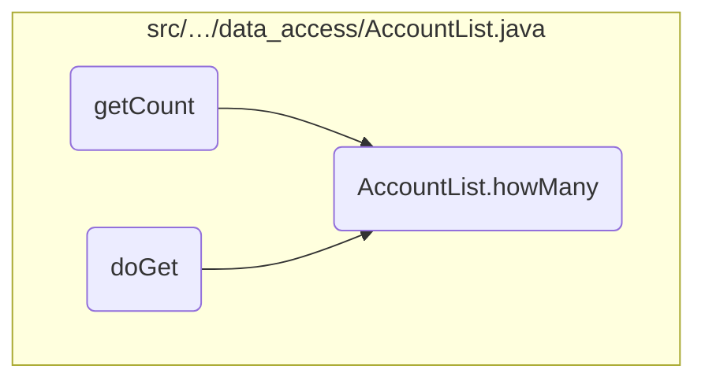

Here is a high level diagram of the flow, showing only the most important functions:

```mermaid
graph TD;
      subgraph srcwebuisrcmainjavacomibmcicscipbankliberty[src/…/cip/bankliberty]
b701208ecf31142e954520a4cf9e0c9285c827694444237f4a973af604fd3384(AccountList.howMany) --> 91f8c224560739c58ba634b4a1892e317d2dc882e473e54a7a8164f839fd9e16(AccountsResource.getAccountsByBalanceWithOffsetAndLimitExternal)
end

subgraph srcwebuisrcmainjavacomibmcicscipbankliberty[src/…/cip/bankliberty]
b701208ecf31142e954520a4cf9e0c9285c827694444237f4a973af604fd3384(AccountList.howMany) --> bf0f472324115783579ea58f5e589beb09368b720f16fb9bda00fa4b4a99c17a(AccountsResource.getAccountsByCustomerExternal)
end

subgraph srcwebuisrcmainjavacomibmcicscipbankliberty[src/…/cip/bankliberty]
b701208ecf31142e954520a4cf9e0c9285c827694444237f4a973af604fd3384(AccountList.howMany) --> 36ee12db42d5bd2a66e8233b20d6fe239e8232d9c900abb2ab36b9200e4acbc8(AccountsResource.getAccountsExternal)
end

subgraph srcwebuisrcmainjavacomibmcicscipbankliberty[src/…/cip/bankliberty]
91f8c224560739c58ba634b4a1892e317d2dc882e473e54a7a8164f839fd9e16(AccountsResource.getAccountsByBalanceWithOffsetAndLimitExternal) --> 3c8d8d7b3d0ddd6300f00ce03f16a160c4722690411cb7fef00b8ee2a5ea5388(AccountsResource.getAccountsByBalanceWithOffsetAndLimitInternal)
end

subgraph srcwebuisrcmainjavacomibmcicscipbankliberty[src/…/cip/bankliberty]
3c8d8d7b3d0ddd6300f00ce03f16a160c4722690411cb7fef00b8ee2a5ea5388(AccountsResource.getAccountsByBalanceWithOffsetAndLimitInternal) --> 18f5d576ca552feb59671fc0754e50fd0af5c82a22157edd9dbb59123804be37(Account.getAccountsByBalanceCountOnly)
end

subgraph srcwebuisrcmainjavacomibmcicscipbankliberty[src/…/cip/bankliberty]
bf0f472324115783579ea58f5e589beb09368b720f16fb9bda00fa4b4a99c17a(AccountsResource.getAccountsByCustomerExternal) --> 684eeaac8794ce5d410ff6628b5badf434d88acc2c317574d21ad654147bf93c(AccountsResource.getAccountsByCustomerInternal)
end

subgraph srcwebuisrcmainjavacomibmcicscipbankliberty[src/…/cip/bankliberty]
684eeaac8794ce5d410ff6628b5badf434d88acc2c317574d21ad654147bf93c(AccountsResource.getAccountsByCustomerInternal) --> 53d95b332910897f8349c5da61ecfcad3f4d64e2cd786c22e72ad668a8accdc9(Account.getAccounts)
end

subgraph srcwebuisrcmainjavacomibmcicscipbankliberty[src/…/cip/bankliberty]
36ee12db42d5bd2a66e8233b20d6fe239e8232d9c900abb2ab36b9200e4acbc8(AccountsResource.getAccountsExternal) --> 8dd925fd3dff334617d98156216c10d8fcfc179fb3af28813315008ff390b57c(AccountsResource.getAccountsInternal)
end

subgraph srcwebuisrcmainjavacomibmcicscipbankliberty[src/…/cip/bankliberty]
8dd925fd3dff334617d98156216c10d8fcfc179fb3af28813315008ff390b57c(AccountsResource.getAccountsInternal) --> 53d95b332910897f8349c5da61ecfcad3f4d64e2cd786c22e72ad668a8accdc9(Account.getAccounts)
end


      classDef mainFlowStyle color:#000000,fill:#7CB9F4
classDef rootsStyle color:#000000,fill:#00FFF4
classDef Style1 color:#000000,fill:#00FFAA
classDef Style2 color:#000000,fill:#FFFF00
classDef Style3 color:#000000,fill:#AA7CB9

%% Swimm:
%% graph TD;
%%       subgraph srcwebuisrcmainjavacomibmcicscipbankliberty[<SwmPath>[src/…/cip/bankliberty/](src/webui/src/main/java/com/ibm/cics/cip/bankliberty/)</SwmPath>]
%% b701208ecf31142e954520a4cf9e0c9285c827694444237f4a973af604fd3384(AccountList.howMany) --> 91f8c224560739c58ba634b4a1892e317d2dc882e473e54a7a8164f839fd9e16(AccountsResource.getAccountsByBalanceWithOffsetAndLimitExternal)
%% end
%% 
%% subgraph srcwebuisrcmainjavacomibmcicscipbankliberty[<SwmPath>[src/…/cip/bankliberty/](src/webui/src/main/java/com/ibm/cics/cip/bankliberty/)</SwmPath>]
%% b701208ecf31142e954520a4cf9e0c9285c827694444237f4a973af604fd3384(AccountList.howMany) --> bf0f472324115783579ea58f5e589beb09368b720f16fb9bda00fa4b4a99c17a(AccountsResource.getAccountsByCustomerExternal)
%% end
%% 
%% subgraph srcwebuisrcmainjavacomibmcicscipbankliberty[<SwmPath>[src/…/cip/bankliberty/](src/webui/src/main/java/com/ibm/cics/cip/bankliberty/)</SwmPath>]
%% b701208ecf31142e954520a4cf9e0c9285c827694444237f4a973af604fd3384(AccountList.howMany) --> 36ee12db42d5bd2a66e8233b20d6fe239e8232d9c900abb2ab36b9200e4acbc8(AccountsResource.getAccountsExternal)
%% end
%% 
%% subgraph srcwebuisrcmainjavacomibmcicscipbankliberty[<SwmPath>[src/…/cip/bankliberty/](src/webui/src/main/java/com/ibm/cics/cip/bankliberty/)</SwmPath>]
%% 91f8c224560739c58ba634b4a1892e317d2dc882e473e54a7a8164f839fd9e16(AccountsResource.getAccountsByBalanceWithOffsetAndLimitExternal) --> 3c8d8d7b3d0ddd6300f00ce03f16a160c4722690411cb7fef00b8ee2a5ea5388(AccountsResource.getAccountsByBalanceWithOffsetAndLimitInternal)
%% end
%% 
%% subgraph srcwebuisrcmainjavacomibmcicscipbankliberty[<SwmPath>[src/…/cip/bankliberty/](src/webui/src/main/java/com/ibm/cics/cip/bankliberty/)</SwmPath>]
%% 3c8d8d7b3d0ddd6300f00ce03f16a160c4722690411cb7fef00b8ee2a5ea5388(AccountsResource.getAccountsByBalanceWithOffsetAndLimitInternal) --> 18f5d576ca552feb59671fc0754e50fd0af5c82a22157edd9dbb59123804be37(Account.getAccountsByBalanceCountOnly)
%% end
%% 
%% subgraph srcwebuisrcmainjavacomibmcicscipbankliberty[<SwmPath>[src/…/cip/bankliberty/](src/webui/src/main/java/com/ibm/cics/cip/bankliberty/)</SwmPath>]
%% bf0f472324115783579ea58f5e589beb09368b720f16fb9bda00fa4b4a99c17a(AccountsResource.getAccountsByCustomerExternal) --> 684eeaac8794ce5d410ff6628b5badf434d88acc2c317574d21ad654147bf93c(AccountsResource.getAccountsByCustomerInternal)
%% end
%% 
%% subgraph srcwebuisrcmainjavacomibmcicscipbankliberty[<SwmPath>[src/…/cip/bankliberty/](src/webui/src/main/java/com/ibm/cics/cip/bankliberty/)</SwmPath>]
%% 684eeaac8794ce5d410ff6628b5badf434d88acc2c317574d21ad654147bf93c(AccountsResource.getAccountsByCustomerInternal) --> 53d95b332910897f8349c5da61ecfcad3f4d64e2cd786c22e72ad668a8accdc9(Account.getAccounts)
%% end
%% 
%% subgraph srcwebuisrcmainjavacomibmcicscipbankliberty[<SwmPath>[src/…/cip/bankliberty/](src/webui/src/main/java/com/ibm/cics/cip/bankliberty/)</SwmPath>]
%% 36ee12db42d5bd2a66e8233b20d6fe239e8232d9c900abb2ab36b9200e4acbc8(AccountsResource.getAccountsExternal) --> 8dd925fd3dff334617d98156216c10d8fcfc179fb3af28813315008ff390b57c(AccountsResource.getAccountsInternal)
%% end
%% 
%% subgraph srcwebuisrcmainjavacomibmcicscipbankliberty[<SwmPath>[src/…/cip/bankliberty/](src/webui/src/main/java/com/ibm/cics/cip/bankliberty/)</SwmPath>]
%% 8dd925fd3dff334617d98156216c10d8fcfc179fb3af28813315008ff390b57c(AccountsResource.getAccountsInternal) --> 53d95b332910897f8349c5da61ecfcad3f4d64e2cd786c22e72ad668a8accdc9(Account.getAccounts)
%% end
%% 
%% 
%%       classDef mainFlowStyle color:#000000,fill:#7CB9F4
%% classDef rootsStyle color:#000000,fill:#00FFF4
%% classDef Style1 color:#000000,fill:#00FFAA
%% classDef Style2 color:#000000,fill:#FFFF00
%% classDef Style3 color:#000000,fill:#AA7CB9
```

# Flow drill down

## Going into <SwmToken path="src/webui/src/main/java/com/ibm/cics/cip/bankliberty/webui/data_access/AccountList.java" pos="69:1:1" line-data="			howMany(filter);">`howMany`</SwmToken>

```mermaid
graph TD
  subgraph howMany
    howMany:A["Check if filter contains AND ACCOUNT_AVAILABLE_BALANCE"] -->|Contains| howMany:B["Extract operator and balance from filter"]
    howMany:B --> howMany:C["Call getAccountsByBalanceWithOffsetAndLimitExternal" ]
    howMany:A -->|Does not contain| howMany:D["Check if filter contains AND ACCOUNT_NUMBER"]
    howMany:D -->|Contains| howMany:E["Extract account number from filter"]
    howMany:E --> howMany:F["Call getAccountExternal"]
    howMany:D -->|Does not contain| howMany:G["Check if filter contains AND ACCOUNT_CUSTOMER_NUMBER"]
    howMany:G -->|Contains| howMany:H["Extract customer number from filter"]
    howMany:H --> howMany:I["Call getAccountsByCustomerExternal"]
    howMany:G -->|Does not contain| howMany:J["Check if filter is empty"]
    howMany:J -->|Empty| howMany:K["Call getAccountsExternal"]
    howMany:K --> howMany:L["Parse JSON response"]
    howMany:J -->|Not empty| howMany:M["Check if myAccountsResponse is not null and status is 200"]
    howMany:M -->|Valid response| howMany:N["Parse JSON response"]
  end

%% Swimm:
%% graph TD
%%   subgraph <SwmToken path="src/webui/src/main/java/com/ibm/cics/cip/bankliberty/webui/data_access/AccountList.java" pos="69:1:1" line-data="			howMany(filter);">`howMany`</SwmToken>
%%     <SwmToken path="src/webui/src/main/java/com/ibm/cics/cip/bankliberty/webui/data_access/AccountList.java" pos="69:1:1" line-data="			howMany(filter);">`howMany`</SwmToken>:A["Check if filter contains AND <SwmToken path="src/webui/src/main/java/com/ibm/cics/cip/bankliberty/webui/data_access/AccountList.java" pos="87:11:11" line-data="			if (filter.contains(&quot;AND ACCOUNT_AVAILABLE_BALANCE&quot;))">`ACCOUNT_AVAILABLE_BALANCE`</SwmToken>"] -->|Contains| <SwmToken path="src/webui/src/main/java/com/ibm/cics/cip/bankliberty/webui/data_access/AccountList.java" pos="69:1:1" line-data="			howMany(filter);">`howMany`</SwmToken>:B["Extract operator and balance from filter"]
%%     <SwmToken path="src/webui/src/main/java/com/ibm/cics/cip/bankliberty/webui/data_access/AccountList.java" pos="69:1:1" line-data="			howMany(filter);">`howMany`</SwmToken>:B --> <SwmToken path="src/webui/src/main/java/com/ibm/cics/cip/bankliberty/webui/data_access/AccountList.java" pos="69:1:1" line-data="			howMany(filter);">`howMany`</SwmToken>:C["Call <SwmToken path="src/webui/src/main/java/com/ibm/cics/cip/bankliberty/webui/data_access/AccountList.java" pos="97:2:2" line-data="						.getAccountsByBalanceWithOffsetAndLimitExternal(balance,">`getAccountsByBalanceWithOffsetAndLimitExternal`</SwmToken>" ]
%%     <SwmToken path="src/webui/src/main/java/com/ibm/cics/cip/bankliberty/webui/data_access/AccountList.java" pos="69:1:1" line-data="			howMany(filter);">`howMany`</SwmToken>:A -->|Does not contain| <SwmToken path="src/webui/src/main/java/com/ibm/cics/cip/bankliberty/webui/data_access/AccountList.java" pos="69:1:1" line-data="			howMany(filter);">`howMany`</SwmToken>:D["Check if filter contains AND <SwmToken path="src/webui/src/main/java/com/ibm/cics/cip/bankliberty/webui/data_access/AccountList.java" pos="101:11:11" line-data="			if (filter.contains(&quot;AND ACCOUNT_NUMBER&quot;))">`ACCOUNT_NUMBER`</SwmToken>"]
%%     <SwmToken path="src/webui/src/main/java/com/ibm/cics/cip/bankliberty/webui/data_access/AccountList.java" pos="69:1:1" line-data="			howMany(filter);">`howMany`</SwmToken>:D -->|Contains| <SwmToken path="src/webui/src/main/java/com/ibm/cics/cip/bankliberty/webui/data_access/AccountList.java" pos="69:1:1" line-data="			howMany(filter);">`howMany`</SwmToken>:E["Extract account number from filter"]
%%     <SwmToken path="src/webui/src/main/java/com/ibm/cics/cip/bankliberty/webui/data_access/AccountList.java" pos="69:1:1" line-data="			howMany(filter);">`howMany`</SwmToken>:E --> <SwmToken path="src/webui/src/main/java/com/ibm/cics/cip/bankliberty/webui/data_access/AccountList.java" pos="69:1:1" line-data="			howMany(filter);">`howMany`</SwmToken>:F["Call <SwmToken path="src/webui/src/main/java/com/ibm/cics/cip/bankliberty/webui/data_access/AccountList.java" pos="112:2:2" line-data="						.getAccountExternal(accountNumberFilterLong);">`getAccountExternal`</SwmToken>"]
%%     <SwmToken path="src/webui/src/main/java/com/ibm/cics/cip/bankliberty/webui/data_access/AccountList.java" pos="69:1:1" line-data="			howMany(filter);">`howMany`</SwmToken>:D -->|Does not contain| <SwmToken path="src/webui/src/main/java/com/ibm/cics/cip/bankliberty/webui/data_access/AccountList.java" pos="69:1:1" line-data="			howMany(filter);">`howMany`</SwmToken>:G["Check if filter contains AND <SwmToken path="src/webui/src/main/java/com/ibm/cics/cip/bankliberty/webui/data_access/AccountList.java" pos="115:11:11" line-data="			if (filter.contains(&quot;AND ACCOUNT_CUSTOMER_NUMBER&quot;))">`ACCOUNT_CUSTOMER_NUMBER`</SwmToken>"]
%%     <SwmToken path="src/webui/src/main/java/com/ibm/cics/cip/bankliberty/webui/data_access/AccountList.java" pos="69:1:1" line-data="			howMany(filter);">`howMany`</SwmToken>:G -->|Contains| <SwmToken path="src/webui/src/main/java/com/ibm/cics/cip/bankliberty/webui/data_access/AccountList.java" pos="69:1:1" line-data="			howMany(filter);">`howMany`</SwmToken>:H["Extract customer number from filter"]
%%     <SwmToken path="src/webui/src/main/java/com/ibm/cics/cip/bankliberty/webui/data_access/AccountList.java" pos="69:1:1" line-data="			howMany(filter);">`howMany`</SwmToken>:H --> <SwmToken path="src/webui/src/main/java/com/ibm/cics/cip/bankliberty/webui/data_access/AccountList.java" pos="69:1:1" line-data="			howMany(filter);">`howMany`</SwmToken>:I["Call <SwmToken path="src/webui/src/main/java/com/ibm/cics/cip/bankliberty/webui/data_access/AccountList.java" pos="121:2:2" line-data="						.getAccountsByCustomerExternal(customerNumber, true);">`getAccountsByCustomerExternal`</SwmToken>"]
%%     <SwmToken path="src/webui/src/main/java/com/ibm/cics/cip/bankliberty/webui/data_access/AccountList.java" pos="69:1:1" line-data="			howMany(filter);">`howMany`</SwmToken>:G -->|Does not contain| <SwmToken path="src/webui/src/main/java/com/ibm/cics/cip/bankliberty/webui/data_access/AccountList.java" pos="69:1:1" line-data="			howMany(filter);">`howMany`</SwmToken>:J["Check if filter is empty"]
%%     <SwmToken path="src/webui/src/main/java/com/ibm/cics/cip/bankliberty/webui/data_access/AccountList.java" pos="69:1:1" line-data="			howMany(filter);">`howMany`</SwmToken>:J -->|Empty| <SwmToken path="src/webui/src/main/java/com/ibm/cics/cip/bankliberty/webui/data_access/AccountList.java" pos="69:1:1" line-data="			howMany(filter);">`howMany`</SwmToken>:K["Call <SwmToken path="src/webui/src/main/java/com/ibm/cics/cip/bankliberty/webui/data_access/AccountList.java" pos="128:7:7" line-data="				myAccountsResponse = myAccountsResource.getAccountsExternal(Integer.valueOf(0),Integer.valueOf(999999),true);">`getAccountsExternal`</SwmToken>"]
%%     <SwmToken path="src/webui/src/main/java/com/ibm/cics/cip/bankliberty/webui/data_access/AccountList.java" pos="69:1:1" line-data="			howMany(filter);">`howMany`</SwmToken>:K --> <SwmToken path="src/webui/src/main/java/com/ibm/cics/cip/bankliberty/webui/data_access/AccountList.java" pos="69:1:1" line-data="			howMany(filter);">`howMany`</SwmToken>:L["Parse JSON response"]
%%     <SwmToken path="src/webui/src/main/java/com/ibm/cics/cip/bankliberty/webui/data_access/AccountList.java" pos="69:1:1" line-data="			howMany(filter);">`howMany`</SwmToken>:J -->|Not empty| <SwmToken path="src/webui/src/main/java/com/ibm/cics/cip/bankliberty/webui/data_access/AccountList.java" pos="69:1:1" line-data="			howMany(filter);">`howMany`</SwmToken>:M["Check if <SwmToken path="src/webui/src/main/java/com/ibm/cics/cip/bankliberty/webui/data_access/AccountList.java" pos="96:1:1" line-data="				myAccountsResponse = myAccountsResource">`myAccountsResponse`</SwmToken> is not null and status is 200"]
%%     <SwmToken path="src/webui/src/main/java/com/ibm/cics/cip/bankliberty/webui/data_access/AccountList.java" pos="69:1:1" line-data="			howMany(filter);">`howMany`</SwmToken>:M -->|Valid response| <SwmToken path="src/webui/src/main/java/com/ibm/cics/cip/bankliberty/webui/data_access/AccountList.java" pos="69:1:1" line-data="			howMany(filter);">`howMany`</SwmToken>:N["Parse JSON response"]
%%   end
```

<SwmSnippet path="/src/webui/src/main/java/com/ibm/cics/cip/bankliberty/webui/data_access/AccountList.java" line="87">

---

## Filtering accounts based on balance

First, the method checks if the filter contains the condition <SwmToken path="src/webui/src/main/java/com/ibm/cics/cip/bankliberty/webui/data_access/AccountList.java" pos="87:9:11" line-data="			if (filter.contains(&quot;AND ACCOUNT_AVAILABLE_BALANCE&quot;))">`AND ACCOUNT_AVAILABLE_BALANCE`</SwmToken>. If this condition is present, it extracts the operator and balance value from the filter string. This information is then used to call the <SwmToken path="src/webui/src/main/java/com/ibm/cics/cip/bankliberty/webui/data_access/AccountList.java" pos="97:2:2" line-data="						.getAccountsByBalanceWithOffsetAndLimitExternal(balance,">`getAccountsByBalanceWithOffsetAndLimitExternal`</SwmToken> method from the <SwmToken path="src/webui/src/main/java/com/ibm/cics/cip/bankliberty/webui/data_access/AccountList.java" pos="20:16:16" line-data="import com.ibm.cics.cip.bankliberty.api.json.AccountsResource;">`AccountsResource`</SwmToken> class, which retrieves accounts that match the specified balance condition.

```java
			if (filter.contains("AND ACCOUNT_AVAILABLE_BALANCE"))
			{
				// 01234567890123456789012345678901234567890
				// AND ACCOUNT_AVAILABLE_BALANCE <= 33558.0

				String operator = filter.substring(31, 32);
				BigDecimal balance = BigDecimal
						.valueOf(Double.parseDouble(filter.substring(34)));

				myAccountsResponse = myAccountsResource
						.getAccountsByBalanceWithOffsetAndLimitExternal(balance,
								operator, null, null, true);
```

---

</SwmSnippet>

<SwmSnippet path="/src/webui/src/main/java/com/ibm/cics/cip/bankliberty/webui/data_access/AccountList.java" line="101">

---

## Filtering accounts based on account number

Next, if the filter contains the condition <SwmToken path="src/webui/src/main/java/com/ibm/cics/cip/bankliberty/webui/data_access/AccountList.java" pos="101:9:11" line-data="			if (filter.contains(&quot;AND ACCOUNT_NUMBER&quot;))">`AND ACCOUNT_NUMBER`</SwmToken>, the method extracts the account number from the filter string. This account number is then used to call the <SwmToken path="src/webui/src/main/java/com/ibm/cics/cip/bankliberty/webui/data_access/AccountList.java" pos="112:2:2" line-data="						.getAccountExternal(accountNumberFilterLong);">`getAccountExternal`</SwmToken> method from the <SwmToken path="src/webui/src/main/java/com/ibm/cics/cip/bankliberty/webui/data_access/AccountList.java" pos="20:16:16" line-data="import com.ibm.cics.cip.bankliberty.api.json.AccountsResource;">`AccountsResource`</SwmToken> class, which retrieves the account that matches the specified account number.

```java
			if (filter.contains("AND ACCOUNT_NUMBER"))
			{
				String accountNumberFilter = filter.substring(22);
				if (accountNumberFilter.indexOf(' ') >= 0)
				{
					accountNumberFilter = accountNumberFilter.substring(0,
							accountNumberFilter.indexOf(' '));
				}
				Long accountNumberFilterLong = Long
						.parseLong(accountNumberFilter);
				myAccountsResponse = myAccountsResource
						.getAccountExternal(accountNumberFilterLong);
```

---

</SwmSnippet>

<SwmSnippet path="/src/webui/src/main/java/com/ibm/cics/cip/bankliberty/webui/data_access/AccountList.java" line="115">

---

## Filtering accounts based on customer number

Then, if the filter contains the condition <SwmToken path="src/webui/src/main/java/com/ibm/cics/cip/bankliberty/webui/data_access/AccountList.java" pos="115:9:11" line-data="			if (filter.contains(&quot;AND ACCOUNT_CUSTOMER_NUMBER&quot;))">`AND ACCOUNT_CUSTOMER_NUMBER`</SwmToken>, the method extracts the customer number from the filter string. This customer number is then used to call the <SwmToken path="src/webui/src/main/java/com/ibm/cics/cip/bankliberty/webui/data_access/AccountList.java" pos="121:2:2" line-data="						.getAccountsByCustomerExternal(customerNumber, true);">`getAccountsByCustomerExternal`</SwmToken> method from the <SwmToken path="src/webui/src/main/java/com/ibm/cics/cip/bankliberty/webui/data_access/AccountList.java" pos="20:16:16" line-data="import com.ibm.cics.cip.bankliberty.api.json.AccountsResource;">`AccountsResource`</SwmToken> class, which retrieves accounts that match the specified customer number.

```java
			if (filter.contains("AND ACCOUNT_CUSTOMER_NUMBER"))
			{
				String customerNumberFilter = filter.substring(31);
				Long customerNumber = Long.parseLong(customerNumberFilter);

				myAccountsResponse = myAccountsResource
						.getAccountsByCustomerExternal(customerNumber, true);
```

---

</SwmSnippet>

<SwmSnippet path="/src/webui/src/main/java/com/ibm/cics/cip/bankliberty/webui/data_access/AccountList.java" line="125">

---

## Retrieving all accounts

If the filter string is empty, the method calls the <SwmToken path="src/webui/src/main/java/com/ibm/cics/cip/bankliberty/webui/data_access/AccountList.java" pos="128:7:7" line-data="				myAccountsResponse = myAccountsResource.getAccountsExternal(Integer.valueOf(0),Integer.valueOf(999999),true);">`getAccountsExternal`</SwmToken> method from the <SwmToken path="src/webui/src/main/java/com/ibm/cics/cip/bankliberty/webui/data_access/AccountList.java" pos="20:16:16" line-data="import com.ibm.cics.cip.bankliberty.api.json.AccountsResource;">`AccountsResource`</SwmToken> class to retrieve all accounts. The response is then parsed to extract the total number of accounts.

```java
			if (filter.length() == 0)
			{

				myAccountsResponse = myAccountsResource.getAccountsExternal(Integer.valueOf(0),Integer.valueOf(999999),true);
				String myAccountsString = myAccountsResponse.getEntity().toString();

				JSONObject myAccountsJSON = JSONObject.parse(myAccountsString);
				if (myAccountsJSON.get(JSON_NUMBER_OF_ACCOUNTS) != null)
				{
					long accountCount = (Long) myAccountsJSON
							.get(JSON_NUMBER_OF_ACCOUNTS);
					this.count = (int) accountCount;
				}
```

---

</SwmSnippet>

<SwmSnippet path="/src/webui/src/main/java/com/ibm/cics/cip/bankliberty/webui/data_access/AccountList.java" line="140">

---

## Handling the response

Finally, if a valid response is received, the method parses the response to extract the total number of accounts and updates the <SwmToken path="src/webui/src/main/java/com/ibm/cics/cip/bankliberty/webui/data_access/AccountList.java" pos="148:3:3" line-data="				this.count = 1;">`count`</SwmToken> variable accordingly.

```java
			if (myAccountsResponse != null
					&& myAccountsResponse.getStatus() == 200)
			{

				String myAccountsString = myAccountsResponse.getEntity()
						.toString();

				JSONObject myAccountsJSON = JSONObject.parse(myAccountsString);
				this.count = 1;
				if (myAccountsJSON.get(JSON_NUMBER_OF_ACCOUNTS) != null)
				{
					long accountCount = (Long) myAccountsJSON
							.get(JSON_NUMBER_OF_ACCOUNTS);
					this.count = (int) accountCount;
				}

```

---

</SwmSnippet>

## A closer look at <SwmToken path="src/webui/src/main/java/com/ibm/cics/cip/bankliberty/webui/data_access/AccountList.java" pos="97:2:2" line-data="						.getAccountsByBalanceWithOffsetAndLimitExternal(balance,">`getAccountsByBalanceWithOffsetAndLimitExternal`</SwmToken>

```mermaid
graph TD
  subgraph getAccountsByBalanceWithOffsetAndLimitExternal
    getAccountsByBalanceWithOffsetAndLimitExternal:A["Log function entry"] --> getAccountsByBalanceWithOffsetAndLimitExternal:B["Check countOnly parameter"]
    getAccountsByBalanceWithOffsetAndLimitExternal:B -->|True| getAccountsByBalanceWithOffsetAndLimitExternal:C["Set countOnlyReal to countOnly value"]
    getAccountsByBalanceWithOffsetAndLimitExternal:B -->|False| getAccountsByBalanceWithOffsetAndLimitExternal:D["Set countOnlyReal to false"]
    getAccountsByBalanceWithOffsetAndLimitExternal:C --> getAccountsByBalanceWithOffsetAndLimitExternal:E["Call getAccountsByBalanceWithOffsetAndLimitInternal"]
    getAccountsByBalanceWithOffsetAndLimitExternal:D --> getAccountsByBalanceWithOffsetAndLimitExternal:E
    getAccountsByBalanceWithOffsetAndLimitInternal:E --> getAccountsByBalanceWithOffsetAndLimitExternal:F["Terminate HBankDataAccess"]
    getAccountsByBalanceWithOffsetAndLimitExternal:F --> getAccountsByBalanceWithOffsetAndLimitExternal:G["Log function exit"]
    getAccountsByBalanceWithOffsetAndLimitExternal:G --> getAccountsByBalanceWithOffsetAndLimitExternal:H["Return response"]
  end

%% Swimm:
%% graph TD
%%   subgraph <SwmToken path="src/webui/src/main/java/com/ibm/cics/cip/bankliberty/webui/data_access/AccountList.java" pos="97:2:2" line-data="						.getAccountsByBalanceWithOffsetAndLimitExternal(balance,">`getAccountsByBalanceWithOffsetAndLimitExternal`</SwmToken>
%%     <SwmToken path="src/webui/src/main/java/com/ibm/cics/cip/bankliberty/webui/data_access/AccountList.java" pos="97:2:2" line-data="						.getAccountsByBalanceWithOffsetAndLimitExternal(balance,">`getAccountsByBalanceWithOffsetAndLimitExternal`</SwmToken>:A["Log function entry"] --> <SwmToken path="src/webui/src/main/java/com/ibm/cics/cip/bankliberty/webui/data_access/AccountList.java" pos="97:2:2" line-data="						.getAccountsByBalanceWithOffsetAndLimitExternal(balance,">`getAccountsByBalanceWithOffsetAndLimitExternal`</SwmToken>:B["Check <SwmToken path="src/webui/src/main/java/com/ibm/cics/cip/bankliberty/api/json/AccountsResource.java" pos="480:11:11" line-data="				&quot;getAccountsByCustomerExternal(Long customerNumber, Boolean countOnly)&quot;);">`countOnly`</SwmToken> parameter"]
%%     <SwmToken path="src/webui/src/main/java/com/ibm/cics/cip/bankliberty/webui/data_access/AccountList.java" pos="97:2:2" line-data="						.getAccountsByBalanceWithOffsetAndLimitExternal(balance,">`getAccountsByBalanceWithOffsetAndLimitExternal`</SwmToken>:B -->|True| <SwmToken path="src/webui/src/main/java/com/ibm/cics/cip/bankliberty/webui/data_access/AccountList.java" pos="97:2:2" line-data="						.getAccountsByBalanceWithOffsetAndLimitExternal(balance,">`getAccountsByBalanceWithOffsetAndLimitExternal`</SwmToken>:C["Set <SwmToken path="src/webui/src/main/java/com/ibm/cics/cip/bankliberty/api/json/AccountsResource.java" pos="1352:3:3" line-data="		boolean countOnlyReal = false;">`countOnlyReal`</SwmToken> to <SwmToken path="src/webui/src/main/java/com/ibm/cics/cip/bankliberty/api/json/AccountsResource.java" pos="480:11:11" line-data="				&quot;getAccountsByCustomerExternal(Long customerNumber, Boolean countOnly)&quot;);">`countOnly`</SwmToken> value"]
%%     <SwmToken path="src/webui/src/main/java/com/ibm/cics/cip/bankliberty/webui/data_access/AccountList.java" pos="97:2:2" line-data="						.getAccountsByBalanceWithOffsetAndLimitExternal(balance,">`getAccountsByBalanceWithOffsetAndLimitExternal`</SwmToken>:B -->|False| <SwmToken path="src/webui/src/main/java/com/ibm/cics/cip/bankliberty/webui/data_access/AccountList.java" pos="97:2:2" line-data="						.getAccountsByBalanceWithOffsetAndLimitExternal(balance,">`getAccountsByBalanceWithOffsetAndLimitExternal`</SwmToken>:D["Set <SwmToken path="src/webui/src/main/java/com/ibm/cics/cip/bankliberty/api/json/AccountsResource.java" pos="1352:3:3" line-data="		boolean countOnlyReal = false;">`countOnlyReal`</SwmToken> to false"]
%%     <SwmToken path="src/webui/src/main/java/com/ibm/cics/cip/bankliberty/webui/data_access/AccountList.java" pos="97:2:2" line-data="						.getAccountsByBalanceWithOffsetAndLimitExternal(balance,">`getAccountsByBalanceWithOffsetAndLimitExternal`</SwmToken>:C --> <SwmToken path="src/webui/src/main/java/com/ibm/cics/cip/bankliberty/webui/data_access/AccountList.java" pos="97:2:2" line-data="						.getAccountsByBalanceWithOffsetAndLimitExternal(balance,">`getAccountsByBalanceWithOffsetAndLimitExternal`</SwmToken>:E["Call <SwmToken path="src/webui/src/main/java/com/ibm/cics/cip/bankliberty/api/json/AccountsResource.java" pos="1481:7:7" line-data="		Response myResponse = getAccountsByBalanceWithOffsetAndLimitInternal(">`getAccountsByBalanceWithOffsetAndLimitInternal`</SwmToken>"]
%%     <SwmToken path="src/webui/src/main/java/com/ibm/cics/cip/bankliberty/webui/data_access/AccountList.java" pos="97:2:2" line-data="						.getAccountsByBalanceWithOffsetAndLimitExternal(balance,">`getAccountsByBalanceWithOffsetAndLimitExternal`</SwmToken>:D --> <SwmToken path="src/webui/src/main/java/com/ibm/cics/cip/bankliberty/webui/data_access/AccountList.java" pos="97:2:2" line-data="						.getAccountsByBalanceWithOffsetAndLimitExternal(balance,">`getAccountsByBalanceWithOffsetAndLimitExternal`</SwmToken>:E
%%     <SwmToken path="src/webui/src/main/java/com/ibm/cics/cip/bankliberty/api/json/AccountsResource.java" pos="1481:7:7" line-data="		Response myResponse = getAccountsByBalanceWithOffsetAndLimitInternal(">`getAccountsByBalanceWithOffsetAndLimitInternal`</SwmToken>:E --> <SwmToken path="src/webui/src/main/java/com/ibm/cics/cip/bankliberty/webui/data_access/AccountList.java" pos="97:2:2" line-data="						.getAccountsByBalanceWithOffsetAndLimitExternal(balance,">`getAccountsByBalanceWithOffsetAndLimitExternal`</SwmToken>:F["Terminate <SwmToken path="src/webui/src/main/java/com/ibm/cics/cip/bankliberty/api/json/AccountsResource.java" pos="483:1:1" line-data="		HBankDataAccess myHBankDataAccess = new HBankDataAccess();">`HBankDataAccess`</SwmToken>"]
%%     <SwmToken path="src/webui/src/main/java/com/ibm/cics/cip/bankliberty/webui/data_access/AccountList.java" pos="97:2:2" line-data="						.getAccountsByBalanceWithOffsetAndLimitExternal(balance,">`getAccountsByBalanceWithOffsetAndLimitExternal`</SwmToken>:F --> <SwmToken path="src/webui/src/main/java/com/ibm/cics/cip/bankliberty/webui/data_access/AccountList.java" pos="97:2:2" line-data="						.getAccountsByBalanceWithOffsetAndLimitExternal(balance,">`getAccountsByBalanceWithOffsetAndLimitExternal`</SwmToken>:G["Log function exit"]
%%     <SwmToken path="src/webui/src/main/java/com/ibm/cics/cip/bankliberty/webui/data_access/AccountList.java" pos="97:2:2" line-data="						.getAccountsByBalanceWithOffsetAndLimitExternal(balance,">`getAccountsByBalanceWithOffsetAndLimitExternal`</SwmToken>:G --> <SwmToken path="src/webui/src/main/java/com/ibm/cics/cip/bankliberty/webui/data_access/AccountList.java" pos="97:2:2" line-data="						.getAccountsByBalanceWithOffsetAndLimitExternal(balance,">`getAccountsByBalanceWithOffsetAndLimitExternal`</SwmToken>:H["Return response"]
%%   end
```

<SwmSnippet path="/src/webui/src/main/java/com/ibm/cics/cip/bankliberty/api/json/AccountsResource.java" line="1462">

---

## Handling the retrieval of bank accounts based on balance conditions

First, the method <SwmToken path="src/webui/src/main/java/com/ibm/cics/cip/bankliberty/api/json/AccountsResource.java" pos="1465:5:5" line-data="	public Response getAccountsByBalanceWithOffsetAndLimitExternal(">`getAccountsByBalanceWithOffsetAndLimitExternal`</SwmToken> is called to handle the retrieval of bank accounts based on balance conditions. This method is responsible for processing the input parameters such as balance, operator, offset, limit, and <SwmToken path="src/webui/src/main/java/com/ibm/cics/cip/bankliberty/api/json/AccountsResource.java" pos="1470:5:5" line-data="			@QueryParam(&quot;countOnly&quot;) Boolean countOnly)">`countOnly`</SwmToken> flag.

```java
	@GET
	@Path("/balance")
	@Produces("application/json")
	public Response getAccountsByBalanceWithOffsetAndLimitExternal(
			@QueryParam("balance") BigDecimal balance,
			@QueryParam("operator") String operator,
			@QueryParam("offset") Integer offset,
			@QueryParam("limit") Integer limit,
			@QueryParam("countOnly") Boolean countOnly)
	{
```

---

</SwmSnippet>

<SwmSnippet path="/src/webui/src/main/java/com/ibm/cics/cip/bankliberty/api/json/AccountsResource.java" line="1473">

---

Next, the method logs the entry into the function for debugging and tracking purposes.

```java
		logger.entering(this.getClass().getName(),
				"getAccountsByBalanceWithOffsetAndLimitExternal(BigDecimal balance, String operator, Integer offset, Integer limit, Boolean countOnly");
```

---

</SwmSnippet>

<SwmSnippet path="/src/webui/src/main/java/com/ibm/cics/cip/bankliberty/api/json/AccountsResource.java" line="1475">

---

Then, it checks if the <SwmToken path="src/webui/src/main/java/com/ibm/cics/cip/bankliberty/api/json/AccountsResource.java" pos="1476:4:4" line-data="		if (countOnly != null)">`countOnly`</SwmToken> parameter is provided and sets the <SwmToken path="src/webui/src/main/java/com/ibm/cics/cip/bankliberty/api/json/AccountsResource.java" pos="1475:3:3" line-data="		boolean countOnlyReal = false;">`countOnlyReal`</SwmToken> flag accordingly. This flag determines whether the response should include only the count of matching accounts or the actual list of accounts.

```java
		boolean countOnlyReal = false;
		if (countOnly != null)
		{
			countOnlyReal = countOnly.booleanValue();
		}
```

---

</SwmSnippet>

<SwmSnippet path="/src/webui/src/main/java/com/ibm/cics/cip/bankliberty/api/json/AccountsResource.java" line="1481">

---

Moving to the next step, the method calls <SwmToken path="src/webui/src/main/java/com/ibm/cics/cip/bankliberty/api/json/AccountsResource.java" pos="1481:7:7" line-data="		Response myResponse = getAccountsByBalanceWithOffsetAndLimitInternal(">`getAccountsByBalanceWithOffsetAndLimitInternal`</SwmToken> to perform the actual retrieval of accounts based on the provided balance conditions and pagination parameters.

```java
		Response myResponse = getAccountsByBalanceWithOffsetAndLimitInternal(
				balance, operator, offset, limit, countOnlyReal);
```

---

</SwmSnippet>

<SwmSnippet path="/src/webui/src/main/java/com/ibm/cics/cip/bankliberty/api/json/AccountsResource.java" line="1483">

---

After fetching the accounts, the method terminates the <SwmToken path="src/webui/src/main/java/com/ibm/cics/cip/bankliberty/api/json/AccountsResource.java" pos="1483:1:1" line-data="		HBankDataAccess myHBankDataAccess = new HBankDataAccess();">`HBankDataAccess`</SwmToken> instance to ensure proper resource management.

```java
		HBankDataAccess myHBankDataAccess = new HBankDataAccess();
		myHBankDataAccess.terminate();
```

---

</SwmSnippet>

<SwmSnippet path="/src/webui/src/main/java/com/ibm/cics/cip/bankliberty/api/json/AccountsResource.java" line="1485">

---

Finally, the method logs the exit from the function and returns the response containing either the count or the list of matching accounts.

```java
		logger.exiting(this.getClass().getName(),
				"getAccountsByBalanceWithOffsetAndLimitExternal(BigDecimal balance, String operator, Integer offset, Integer limit, Boolean countOnly",
				myResponse);
		return myResponse;
```

---

</SwmSnippet>

## Diving into the <SwmToken path="src/webui/src/main/java/com/ibm/cics/cip/bankliberty/api/json/AccountsResource.java" pos="1481:7:7" line-data="		Response myResponse = getAccountsByBalanceWithOffsetAndLimitInternal(">`getAccountsByBalanceWithOffsetAndLimitInternal`</SwmToken> function

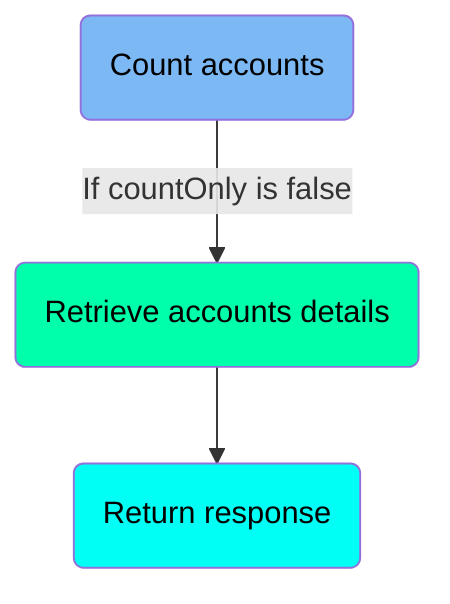

## <SwmToken path="src/webui/src/main/java/com/ibm/cics/cip/bankliberty/api/json/AccountsResource.java" pos="1481:7:7" line-data="		Response myResponse = getAccountsByBalanceWithOffsetAndLimitInternal(">`getAccountsByBalanceWithOffsetAndLimitInternal`</SwmToken> function - Count accounts

Here is a diagram of this part:

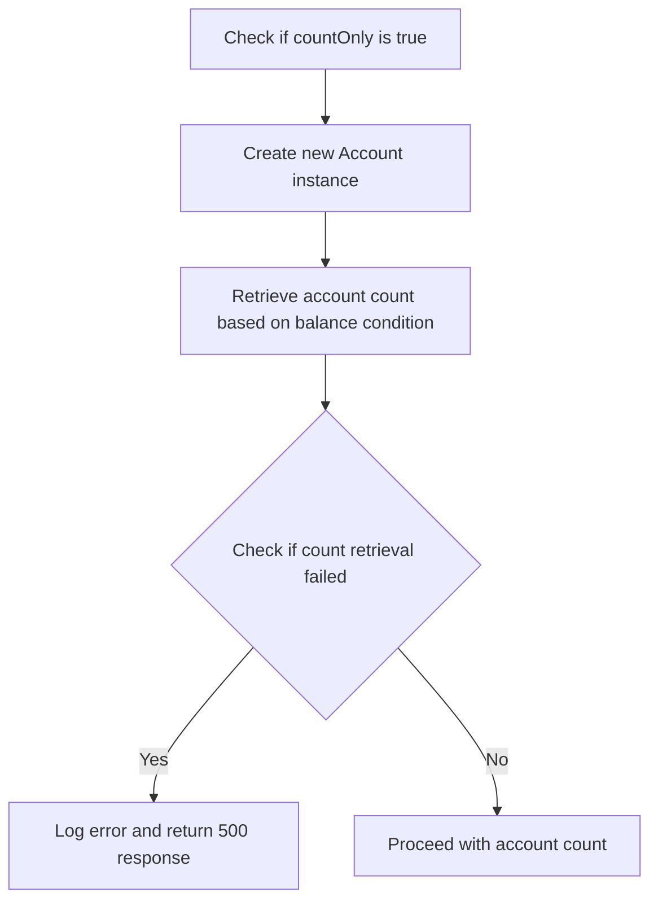

<SwmSnippet path="/src/webui/src/main/java/com/ibm/cics/cip/bankliberty/api/json/AccountsResource.java" line="1541">

---

### Counting accounts based on balance condition

When <SwmToken path="src/webui/src/main/java/com/ibm/cics/cip/bankliberty/api/json/AccountsResource.java" pos="1541:4:4" line-data="		if (countOnly)">`countOnly`</SwmToken> (a flag indicating whether only the count of accounts is needed) is true, the function proceeds to count the number of bank accounts that meet a specific balance condition. This is done by creating a new instance of the <SwmToken path="src/webui/src/main/java/com/ibm/cics/cip/bankliberty/api/json/AccountsResource.java" pos="1543:7:7" line-data="			db2Account = new Account();">`Account`</SwmToken> class and calling the <SwmToken path="src/webui/src/main/java/com/ibm/cics/cip/bankliberty/api/json/AccountsResource.java" pos="1545:2:2" line-data="					.getAccountsByBalanceCountOnly(sortCode, balance, lessThan);">`getAccountsByBalanceCountOnly`</SwmToken> method with the <SwmToken path="src/webui/src/main/java/com/ibm/cics/cip/bankliberty/api/json/AccountsResource.java" pos="1545:4:4" line-data="					.getAccountsByBalanceCountOnly(sortCode, balance, lessThan);">`sortCode`</SwmToken>, <SwmToken path="src/webui/src/main/java/com/ibm/cics/cip/bankliberty/api/json/AccountsResource.java" pos="1545:7:7" line-data="					.getAccountsByBalanceCountOnly(sortCode, balance, lessThan);">`balance`</SwmToken>, and <SwmToken path="src/webui/src/main/java/com/ibm/cics/cip/bankliberty/api/json/AccountsResource.java" pos="1545:10:10" line-data="					.getAccountsByBalanceCountOnly(sortCode, balance, lessThan);">`lessThan`</SwmToken> parameters.

```java
		if (countOnly)
		{
			db2Account = new Account();
			numberOfAccounts = db2Account
					.getAccountsByBalanceCountOnly(sortCode, balance, lessThan);
```

---

</SwmSnippet>

<SwmSnippet path="/src/webui/src/main/java/com/ibm/cics/cip/bankliberty/api/json/AccountsResource.java" line="1546">

---

### Handling potential errors

If the <SwmToken path="src/webui/src/main/java/com/ibm/cics/cip/bankliberty/api/json/AccountsResource.java" pos="1545:2:2" line-data="					.getAccountsByBalanceCountOnly(sortCode, balance, lessThan);">`getAccountsByBalanceCountOnly`</SwmToken> method returns <SwmToken path="src/webui/src/main/java/com/ibm/cics/cip/bankliberty/api/json/AccountsResource.java" pos="1546:8:9" line-data="			if (numberOfAccounts == -1)">`-1`</SwmToken>, it indicates a failure in retrieving the account count. In this case, the function logs a severe error message and constructs a JSON error response with a 500 status code, indicating an internal server error.

```java
			if (numberOfAccounts == -1)
			{
				JSONObject error = new JSONObject();
				error.put(JSON_ERROR_MSG, DB2_READ_FAILURE);
				logger.log(Level.SEVERE, () -> DB2_READ_FAILURE);
				logger.exiting(this.getClass().getName(),
						GET_ACCOUNTS_BY_BALANCE_WITH_OFFSET_AND_LIMIT_INTERNAL,
						myResponse);
				myResponse = Response.status(500).entity(error.toString())
						.build();
				return myResponse;
			}
```

---

</SwmSnippet>

## <SwmToken path="src/webui/src/main/java/com/ibm/cics/cip/bankliberty/api/json/AccountsResource.java" pos="1481:7:7" line-data="		Response myResponse = getAccountsByBalanceWithOffsetAndLimitInternal(">`getAccountsByBalanceWithOffsetAndLimitInternal`</SwmToken> function - Retrieve accounts details

Here is a diagram of this part:

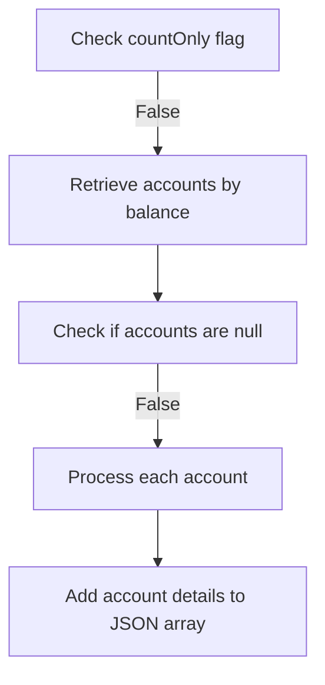

<SwmSnippet path="/src/webui/src/main/java/com/ibm/cics/cip/bankliberty/api/json/AccountsResource.java" line="1561">

---

### Retrieving and processing account details

When the <SwmToken path="src/webui/src/main/java/com/ibm/cics/cip/bankliberty/api/json/AccountsResource.java" pos="480:11:11" line-data="				&quot;getAccountsByCustomerExternal(Long customerNumber, Boolean countOnly)&quot;);">`countOnly`</SwmToken> flag is false, the function proceeds to retrieve account details based on the specified balance condition. It calls the <SwmToken path="src/webui/src/main/java/com/ibm/cics/cip/bankliberty/api/json/AccountsResource.java" pos="1565:7:7" line-data="			myAccounts = db2Account.getAccountsByBalance(sortCode, balance,">`getAccountsByBalance`</SwmToken> method of the <SwmToken path="src/webui/src/main/java/com/ibm/cics/cip/bankliberty/api/json/AccountsResource.java" pos="1561:1:1" line-data="			Account[] myAccounts = null;">`Account`</SwmToken> class, passing the sort code, balance, comparison operator (<SwmToken path="src/webui/src/main/java/com/ibm/cics/cip/bankliberty/api/json/AccountsResource.java" pos="1566:1:1" line-data="					lessThan, offset, limit);">`lessThan`</SwmToken>), offset, and limit as parameters.

```java
			Account[] myAccounts = null;

			db2Account = new Account();

			myAccounts = db2Account.getAccountsByBalance(sortCode, balance,
					lessThan, offset, limit);
```

---

</SwmSnippet>

<SwmSnippet path="/src/webui/src/main/java/com/ibm/cics/cip/bankliberty/api/json/AccountsResource.java" line="1568">

---

If the retrieved accounts are null, it logs an error and returns a response indicating a <SwmToken path="src/webui/src/main/java/com/ibm/cics/cip/bankliberty/api/json/AccountsResource.java" pos="167:11:11" line-data="		 * to keep track of DB2 connections">`DB2`</SwmToken> read failure. This ensures that any issues with database access are promptly reported and handled.

```java
			if (myAccounts == null)
			{
				JSONObject error = new JSONObject();
				error.put(JSON_ERROR_MSG, DB2_READ_FAILURE);
				logger.log(Level.SEVERE, () -> DB2_READ_FAILURE);
				logger.exiting(this.getClass().getName(),
						GET_ACCOUNTS_BY_BALANCE_WITH_OFFSET_AND_LIMIT_INTERNAL,
						myResponse);
				myResponse = Response.status(500).entity(error.toString())
						.build();
				return myResponse;
```

---

</SwmSnippet>

<SwmSnippet path="/src/webui/src/main/java/com/ibm/cics/cip/bankliberty/api/json/AccountsResource.java" line="1580">

---

The function then processes each retrieved account, extracting relevant details such as sort code, account number, customer number, account type, available balance, actual balance, interest rate, overdraft limit, last statement date, next statement date, and the date the account was opened. These details are added to a JSON array, which will be included in the final response.

```java
			accounts = new JSONArray(myAccounts.length);

			for (int i = 0; i < myAccounts.length; i++)
			{
				JSONObject account = new JSONObject();
				account.put(JSON_SORT_CODE, myAccounts[i].getSortcode().trim());
				account.put("id", myAccounts[i].getAccountNumber());
				account.put(JSON_CUSTOMER_NUMBER,
						myAccounts[i].getCustomerNumber());
				account.put(JSON_ACCOUNT_TYPE, myAccounts[i].getType().trim());
				account.put(JSON_AVAILABLE_BALANCE, BigDecimal
						.valueOf(myAccounts[i].getAvailableBalance()));
				account.put(JSON_ACTUAL_BALANCE,
						BigDecimal.valueOf(myAccounts[i].getActualBalance()));
				account.put(JSON_INTEREST_RATE,
						BigDecimal.valueOf(myAccounts[i].getInterestRate()));
				account.put(JSON_OVERDRAFT, myAccounts[i].getOverdraftLimit());
				account.put(JSON_LAST_STATEMENT_DATE,
						myAccounts[i].getLastStatement().toString().trim());
				account.put(JSON_NEXT_STATEMENT_DATE,
						myAccounts[i].getNextStatement().toString().trim());
```

---

</SwmSnippet>

## <SwmToken path="src/webui/src/main/java/com/ibm/cics/cip/bankliberty/api/json/AccountsResource.java" pos="1481:7:7" line-data="		Response myResponse = getAccountsByBalanceWithOffsetAndLimitInternal(">`getAccountsByBalanceWithOffsetAndLimitInternal`</SwmToken> function - Return response

Here is a diagram of this part:

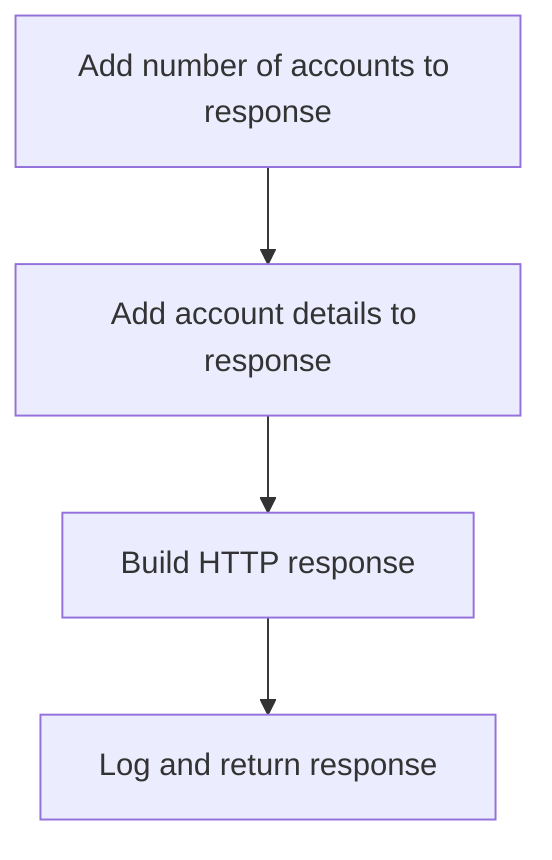

<SwmSnippet path="/src/webui/src/main/java/com/ibm/cics/cip/bankliberty/api/json/AccountsResource.java" line="1614">

---

### Returning the response with the number of accounts and account details

The function prepares the response by adding the number of accounts retrieved to the <SwmToken path="src/webui/src/main/java/com/ibm/cics/cip/bankliberty/api/json/AccountsResource.java" pos="1614:1:1" line-data="		response.put(JSON_NUMBER_OF_ACCOUNTS, numberOfAccounts);">`response`</SwmToken> JSON object. This is done using the <SwmToken path="src/webui/src/main/java/com/ibm/cics/cip/bankliberty/api/json/AccountsResource.java" pos="1614:3:3" line-data="		response.put(JSON_NUMBER_OF_ACCOUNTS, numberOfAccounts);">`put`</SwmToken> method, where <SwmToken path="src/webui/src/main/java/com/ibm/cics/cip/bankliberty/api/json/AccountsResource.java" pos="1614:5:5" line-data="		response.put(JSON_NUMBER_OF_ACCOUNTS, numberOfAccounts);">`JSON_NUMBER_OF_ACCOUNTS`</SwmToken> is the key and <SwmToken path="src/webui/src/main/java/com/ibm/cics/cip/bankliberty/api/json/AccountsResource.java" pos="1614:8:8" line-data="		response.put(JSON_NUMBER_OF_ACCOUNTS, numberOfAccounts);">`numberOfAccounts`</SwmToken> (which holds the count of accounts) is the value.

```java
		response.put(JSON_NUMBER_OF_ACCOUNTS, numberOfAccounts);
```

---

</SwmSnippet>

<SwmSnippet path="/src/webui/src/main/java/com/ibm/cics/cip/bankliberty/api/json/AccountsResource.java" line="1615">

---

Next, the function adds the account details to the <SwmToken path="src/webui/src/main/java/com/ibm/cics/cip/bankliberty/api/json/AccountsResource.java" pos="1615:1:1" line-data="		response.put(JSON_ACCOUNTS, accounts);">`response`</SwmToken> JSON object. This is achieved by using the <SwmToken path="src/webui/src/main/java/com/ibm/cics/cip/bankliberty/api/json/AccountsResource.java" pos="1615:3:3" line-data="		response.put(JSON_ACCOUNTS, accounts);">`put`</SwmToken> method again, where <SwmToken path="src/webui/src/main/java/com/ibm/cics/cip/bankliberty/api/json/AccountsResource.java" pos="1615:5:5" line-data="		response.put(JSON_ACCOUNTS, accounts);">`JSON_ACCOUNTS`</SwmToken> is the key and <SwmToken path="src/webui/src/main/java/com/ibm/cics/cip/bankliberty/api/json/AccountsResource.java" pos="1615:8:8" line-data="		response.put(JSON_ACCOUNTS, accounts);">`accounts`</SwmToken> (which holds the details of the accounts) is the value.

```java
		response.put(JSON_ACCOUNTS, accounts);
```

---

</SwmSnippet>

<SwmSnippet path="/src/webui/src/main/java/com/ibm/cics/cip/bankliberty/api/json/AccountsResource.java" line="1616">

---

The function then builds the HTTP response with a status code of 200 (indicating success) and the <SwmToken path="src/webui/src/main/java/com/ibm/cics/cip/bankliberty/api/json/AccountsResource.java" pos="1616:14:14" line-data="		myResponse = Response.status(200).entity(response.toString()).build();">`response`</SwmToken> JSON object as the entity. This is done using the <SwmToken path="src/webui/src/main/java/com/ibm/cics/cip/bankliberty/api/json/AccountsResource.java" pos="1616:5:23" line-data="		myResponse = Response.status(200).entity(response.toString()).build();">`Response.status(200).entity(response.toString()).build()`</SwmToken> method.

```java
		myResponse = Response.status(200).entity(response.toString()).build();
```

---

</SwmSnippet>

<SwmSnippet path="/src/webui/src/main/java/com/ibm/cics/cip/bankliberty/api/json/AccountsResource.java" line="1617">

---

Finally, the function logs the exit of the method along with the response and returns the <SwmToken path="src/webui/src/main/java/com/ibm/cics/cip/bankliberty/api/json/AccountsResource.java" pos="1619:1:1" line-data="				myResponse);">`myResponse`</SwmToken> object.

```java
		logger.exiting(this.getClass().getName(),
				GET_ACCOUNTS_BY_BALANCE_WITH_OFFSET_AND_LIMIT_INTERNAL,
				myResponse);
		return myResponse;
```

---

</SwmSnippet>

## Going into <SwmToken path="src/webui/src/main/java/com/ibm/cics/cip/bankliberty/api/json/AccountsResource.java" pos="1545:2:2" line-data="					.getAccountsByBalanceCountOnly(sortCode, balance, lessThan);">`getAccountsByBalanceCountOnly`</SwmToken>

```mermaid
graph TD
  subgraph getAccountsByBalanceCountOnly
    getAccountsByBalanceCountOnly:A["Open database connection"] --> getAccountsByBalanceCountOnly:B["Prepare SQL statement"]
    getAccountsByBalanceCountOnly:B --> getAccountsByBalanceCountOnly:C["Set query parameters"]
    getAccountsByBalanceCountOnly:C --> getAccountsByBalanceCountOnly:D["Check if balance comparison is less than"]
    getAccountsByBalanceCountOnly:D -->|Less than| getAccountsByBalanceCountOnly:E["Apply SQL less than filter"]
    getAccountsByBalanceCountOnly:D -->|Not less than| getAccountsByBalanceCountOnly:F["Apply SQL more than filter"]
    getAccountsByBalanceCountOnly:E --> getAccountsByBalanceCountOnly:G["Execute query"]
    getAccountsByBalanceCountOnly:F --> getAccountsByBalanceCountOnly:G["Execute query"]
    getAccountsByBalanceCountOnly:G --> getAccountsByBalanceCountOnly:H["Process result set"]
  end

%% Swimm:
%% graph TD
%%   subgraph <SwmToken path="src/webui/src/main/java/com/ibm/cics/cip/bankliberty/api/json/AccountsResource.java" pos="1545:2:2" line-data="					.getAccountsByBalanceCountOnly(sortCode, balance, lessThan);">`getAccountsByBalanceCountOnly`</SwmToken>
%%     <SwmToken path="src/webui/src/main/java/com/ibm/cics/cip/bankliberty/api/json/AccountsResource.java" pos="1545:2:2" line-data="					.getAccountsByBalanceCountOnly(sortCode, balance, lessThan);">`getAccountsByBalanceCountOnly`</SwmToken>:A["Open database connection"] --> <SwmToken path="src/webui/src/main/java/com/ibm/cics/cip/bankliberty/api/json/AccountsResource.java" pos="1545:2:2" line-data="					.getAccountsByBalanceCountOnly(sortCode, balance, lessThan);">`getAccountsByBalanceCountOnly`</SwmToken>:B["Prepare SQL statement"]
%%     <SwmToken path="src/webui/src/main/java/com/ibm/cics/cip/bankliberty/api/json/AccountsResource.java" pos="1545:2:2" line-data="					.getAccountsByBalanceCountOnly(sortCode, balance, lessThan);">`getAccountsByBalanceCountOnly`</SwmToken>:B --> <SwmToken path="src/webui/src/main/java/com/ibm/cics/cip/bankliberty/api/json/AccountsResource.java" pos="1545:2:2" line-data="					.getAccountsByBalanceCountOnly(sortCode, balance, lessThan);">`getAccountsByBalanceCountOnly`</SwmToken>:C["Set query parameters"]
%%     <SwmToken path="src/webui/src/main/java/com/ibm/cics/cip/bankliberty/api/json/AccountsResource.java" pos="1545:2:2" line-data="					.getAccountsByBalanceCountOnly(sortCode, balance, lessThan);">`getAccountsByBalanceCountOnly`</SwmToken>:C --> <SwmToken path="src/webui/src/main/java/com/ibm/cics/cip/bankliberty/api/json/AccountsResource.java" pos="1545:2:2" line-data="					.getAccountsByBalanceCountOnly(sortCode, balance, lessThan);">`getAccountsByBalanceCountOnly`</SwmToken>:D["Check if balance comparison is less than"]
%%     <SwmToken path="src/webui/src/main/java/com/ibm/cics/cip/bankliberty/api/json/AccountsResource.java" pos="1545:2:2" line-data="					.getAccountsByBalanceCountOnly(sortCode, balance, lessThan);">`getAccountsByBalanceCountOnly`</SwmToken>:D -->|Less than| <SwmToken path="src/webui/src/main/java/com/ibm/cics/cip/bankliberty/api/json/AccountsResource.java" pos="1545:2:2" line-data="					.getAccountsByBalanceCountOnly(sortCode, balance, lessThan);">`getAccountsByBalanceCountOnly`</SwmToken>:E["Apply SQL less than filter"]
%%     <SwmToken path="src/webui/src/main/java/com/ibm/cics/cip/bankliberty/api/json/AccountsResource.java" pos="1545:2:2" line-data="					.getAccountsByBalanceCountOnly(sortCode, balance, lessThan);">`getAccountsByBalanceCountOnly`</SwmToken>:D -->|Not less than| <SwmToken path="src/webui/src/main/java/com/ibm/cics/cip/bankliberty/api/json/AccountsResource.java" pos="1545:2:2" line-data="					.getAccountsByBalanceCountOnly(sortCode, balance, lessThan);">`getAccountsByBalanceCountOnly`</SwmToken>:F["Apply SQL more than filter"]
%%     <SwmToken path="src/webui/src/main/java/com/ibm/cics/cip/bankliberty/api/json/AccountsResource.java" pos="1545:2:2" line-data="					.getAccountsByBalanceCountOnly(sortCode, balance, lessThan);">`getAccountsByBalanceCountOnly`</SwmToken>:E --> <SwmToken path="src/webui/src/main/java/com/ibm/cics/cip/bankliberty/api/json/AccountsResource.java" pos="1545:2:2" line-data="					.getAccountsByBalanceCountOnly(sortCode, balance, lessThan);">`getAccountsByBalanceCountOnly`</SwmToken>:G["Execute query"]
%%     <SwmToken path="src/webui/src/main/java/com/ibm/cics/cip/bankliberty/api/json/AccountsResource.java" pos="1545:2:2" line-data="					.getAccountsByBalanceCountOnly(sortCode, balance, lessThan);">`getAccountsByBalanceCountOnly`</SwmToken>:F --> <SwmToken path="src/webui/src/main/java/com/ibm/cics/cip/bankliberty/api/json/AccountsResource.java" pos="1545:2:2" line-data="					.getAccountsByBalanceCountOnly(sortCode, balance, lessThan);">`getAccountsByBalanceCountOnly`</SwmToken>:G["Execute query"]
%%     <SwmToken path="src/webui/src/main/java/com/ibm/cics/cip/bankliberty/api/json/AccountsResource.java" pos="1545:2:2" line-data="					.getAccountsByBalanceCountOnly(sortCode, balance, lessThan);">`getAccountsByBalanceCountOnly`</SwmToken>:G --> <SwmToken path="src/webui/src/main/java/com/ibm/cics/cip/bankliberty/api/json/AccountsResource.java" pos="1545:2:2" line-data="					.getAccountsByBalanceCountOnly(sortCode, balance, lessThan);">`getAccountsByBalanceCountOnly`</SwmToken>:H["Process result set"]
%%   end
```

## Counting accounts based on balance criteria

First, the method <SwmToken path="src/webui/src/main/java/com/ibm/cics/cip/bankliberty/api/json/AccountsResource.java" pos="1545:2:2" line-data="					.getAccountsByBalanceCountOnly(sortCode, balance, lessThan);">`getAccountsByBalanceCountOnly`</SwmToken> is called to count the number of accounts that meet specific balance criteria. This is crucial for determining how many accounts fall within a certain balance range.

<SwmSnippet path="/src/webui/src/main/java/com/ibm/cics/cip/bankliberty/web/db2/Account.java" line="1321">

---

Next, the method opens a connection to the database to execute the SQL query. This ensures that the application can interact with the database to retrieve the necessary data.

```java
		openConnection();
```

---

</SwmSnippet>

<SwmSnippet path="/src/webui/src/main/java/com/ibm/cics/cip/bankliberty/web/db2/Account.java" line="1324">

---

Then, the method constructs the SQL query based on whether the balance should be less than or more than the specified amount. This allows for flexible querying based on different balance conditions.

```java
		String sql = "SELECT COUNT(*) AS ACCOUNT_COUNT from ACCOUNT where ACCOUNT_EYECATCHER LIKE 'ACCT' AND ACCOUNT_SORTCODE like ?";
		if (lessThan)
		{
			sql = sql.concat(SQL_LESS_THAN);
		}
		else
		{
			sql = sql.concat(SQL_MORE_THAN);
		}
```

---

</SwmSnippet>

<SwmSnippet path="/src/webui/src/main/java/com/ibm/cics/cip/bankliberty/web/db2/Account.java" line="1334">

---

Diving into the SQL execution, the method prepares the SQL statement and sets the parameters for the sort code and balance. This step ensures that the query is correctly parameterized to prevent SQL injection and to accurately filter the results.

```java
		try (PreparedStatement stmt = conn.prepareStatement(sql);)
		{
			stmt.setString(1, sortCodeString);
			stmt.setBigDecimal(2, balance);
```

---

</SwmSnippet>

<SwmSnippet path="/src/webui/src/main/java/com/ibm/cics/cip/bankliberty/web/db2/Account.java" line="1338">

---

Finally, the method executes the query and retrieves the count of accounts that match the criteria. If the query is successful, the count is returned; otherwise, an error is logged, and -1 is returned. This step is critical for providing the final count of accounts to the calling function.

```java
			ResultSet rs = stmt.executeQuery();
			if (rs.next())
			{
				accountCount = rs.getInt(ACCOUNT_COUNT);
			}
			else
			{
				logger.exiting(this.getClass().getName(),
						GET_ACCOUNTS_BY_BALANCE_COUNT_ONLY, -1);
				return -1;
			}
		}
		catch (SQLException e)
		{
			logger.severe(e.getLocalizedMessage());
			logger.exiting(this.getClass().getName(),
					GET_ACCOUNTS_BY_BALANCE_COUNT_ONLY, -1);
			return -1;
		}
		logger.exiting(this.getClass().getName(),
				GET_ACCOUNTS_BY_BALANCE_COUNT_ONLY, accountCount);
```

---

</SwmSnippet>

## Inside <SwmToken path="src/webui/src/main/java/com/ibm/cics/cip/bankliberty/webui/data_access/AccountList.java" pos="121:2:2" line-data="						.getAccountsByCustomerExternal(customerNumber, true);">`getAccountsByCustomerExternal`</SwmToken>

```mermaid
graph TD
  subgraph getAccountsByCustomerExternal
    getAccountsByCustomerExternal:A["Log entry with customer details"] --> getAccountsByCustomerExternal:B["Invoke getAccountsByCustomerInternal"]
    getAccountsByCustomerExternal:B --> getAccountsByCustomerExternal:C["Initialize HBankDataAccess to terminate"]
    getAccountsByCustomerExternal:C --> getAccountsByCustomerExternal:D["Log exit with response"]
    getAccountsByCustomerExternal:D --> getAccountsByCustomerExternal:E["Return response"]
  end

  subgraph getAccountsByCustomerInternal
    getAccountsByCustomerInternal:A["Retrieve bank accounts using customer number"] --> getAccountsByCustomerInternal:B["Check for errors and validate customer existence"]
    getAccountsByCustomerInternal:B --> getAccountsByCustomerInternal:C["Formulate JSON response with account details"]
    getAccountsByCustomerInternal:C --> getAccountsByCustomerInternal:D["Return JSON response"]
  end

%% Swimm:
%% graph TD
%%   subgraph <SwmToken path="src/webui/src/main/java/com/ibm/cics/cip/bankliberty/webui/data_access/AccountList.java" pos="121:2:2" line-data="						.getAccountsByCustomerExternal(customerNumber, true);">`getAccountsByCustomerExternal`</SwmToken>
%%     <SwmToken path="src/webui/src/main/java/com/ibm/cics/cip/bankliberty/webui/data_access/AccountList.java" pos="121:2:2" line-data="						.getAccountsByCustomerExternal(customerNumber, true);">`getAccountsByCustomerExternal`</SwmToken>:A["Log entry with customer details"] --> <SwmToken path="src/webui/src/main/java/com/ibm/cics/cip/bankliberty/webui/data_access/AccountList.java" pos="121:2:2" line-data="						.getAccountsByCustomerExternal(customerNumber, true);">`getAccountsByCustomerExternal`</SwmToken>:B["Invoke <SwmToken path="src/webui/src/main/java/com/ibm/cics/cip/bankliberty/api/json/AccountsResource.java" pos="482:7:7" line-data="		Response myResponse = getAccountsByCustomerInternal(customerNumber);">`getAccountsByCustomerInternal`</SwmToken>"]
%%     <SwmToken path="src/webui/src/main/java/com/ibm/cics/cip/bankliberty/webui/data_access/AccountList.java" pos="121:2:2" line-data="						.getAccountsByCustomerExternal(customerNumber, true);">`getAccountsByCustomerExternal`</SwmToken>:B --> <SwmToken path="src/webui/src/main/java/com/ibm/cics/cip/bankliberty/webui/data_access/AccountList.java" pos="121:2:2" line-data="						.getAccountsByCustomerExternal(customerNumber, true);">`getAccountsByCustomerExternal`</SwmToken>:C["Initialize <SwmToken path="src/webui/src/main/java/com/ibm/cics/cip/bankliberty/api/json/AccountsResource.java" pos="483:1:1" line-data="		HBankDataAccess myHBankDataAccess = new HBankDataAccess();">`HBankDataAccess`</SwmToken> to terminate"]
%%     <SwmToken path="src/webui/src/main/java/com/ibm/cics/cip/bankliberty/webui/data_access/AccountList.java" pos="121:2:2" line-data="						.getAccountsByCustomerExternal(customerNumber, true);">`getAccountsByCustomerExternal`</SwmToken>:C --> <SwmToken path="src/webui/src/main/java/com/ibm/cics/cip/bankliberty/webui/data_access/AccountList.java" pos="121:2:2" line-data="						.getAccountsByCustomerExternal(customerNumber, true);">`getAccountsByCustomerExternal`</SwmToken>:D["Log exit with response"]
%%     <SwmToken path="src/webui/src/main/java/com/ibm/cics/cip/bankliberty/webui/data_access/AccountList.java" pos="121:2:2" line-data="						.getAccountsByCustomerExternal(customerNumber, true);">`getAccountsByCustomerExternal`</SwmToken>:D --> <SwmToken path="src/webui/src/main/java/com/ibm/cics/cip/bankliberty/webui/data_access/AccountList.java" pos="121:2:2" line-data="						.getAccountsByCustomerExternal(customerNumber, true);">`getAccountsByCustomerExternal`</SwmToken>:E["Return response"]
%%   end
%% 
%%   subgraph <SwmToken path="src/webui/src/main/java/com/ibm/cics/cip/bankliberty/api/json/AccountsResource.java" pos="482:7:7" line-data="		Response myResponse = getAccountsByCustomerInternal(customerNumber);">`getAccountsByCustomerInternal`</SwmToken>
%%     <SwmToken path="src/webui/src/main/java/com/ibm/cics/cip/bankliberty/api/json/AccountsResource.java" pos="482:7:7" line-data="		Response myResponse = getAccountsByCustomerInternal(customerNumber);">`getAccountsByCustomerInternal`</SwmToken>:A["Retrieve bank accounts using customer number"] --> <SwmToken path="src/webui/src/main/java/com/ibm/cics/cip/bankliberty/api/json/AccountsResource.java" pos="482:7:7" line-data="		Response myResponse = getAccountsByCustomerInternal(customerNumber);">`getAccountsByCustomerInternal`</SwmToken>:B["Check for errors and validate customer existence"]
%%     <SwmToken path="src/webui/src/main/java/com/ibm/cics/cip/bankliberty/api/json/AccountsResource.java" pos="482:7:7" line-data="		Response myResponse = getAccountsByCustomerInternal(customerNumber);">`getAccountsByCustomerInternal`</SwmToken>:B --> <SwmToken path="src/webui/src/main/java/com/ibm/cics/cip/bankliberty/api/json/AccountsResource.java" pos="482:7:7" line-data="		Response myResponse = getAccountsByCustomerInternal(customerNumber);">`getAccountsByCustomerInternal`</SwmToken>:C["Formulate JSON response with account details"]
%%     <SwmToken path="src/webui/src/main/java/com/ibm/cics/cip/bankliberty/api/json/AccountsResource.java" pos="482:7:7" line-data="		Response myResponse = getAccountsByCustomerInternal(customerNumber);">`getAccountsByCustomerInternal`</SwmToken>:C --> <SwmToken path="src/webui/src/main/java/com/ibm/cics/cip/bankliberty/api/json/AccountsResource.java" pos="482:7:7" line-data="		Response myResponse = getAccountsByCustomerInternal(customerNumber);">`getAccountsByCustomerInternal`</SwmToken>:D["Return JSON response"]
%%   end
```

<SwmSnippet path="/src/webui/src/main/java/com/ibm/cics/cip/bankliberty/api/json/AccountsResource.java" line="471">

---

## Retrieving accounts by customer number

First, the method <SwmToken path="src/webui/src/main/java/com/ibm/cics/cip/bankliberty/webui/data_access/AccountList.java" pos="121:2:2" line-data="						.getAccountsByCustomerExternal(customerNumber, true);">`getAccountsByCustomerExternal`</SwmToken> is responsible for handling HTTP GET requests to retrieve bank accounts associated with a specific customer number. This method is mapped to the URL path <SwmToken path="src/webui/src/main/java/com/ibm/cics/cip/bankliberty/api/json/AccountsResource.java" pos="472:5:10" line-data="	@Path(&quot;/retrieveByCustomerNumber/{customerNumber}&quot;)">`/retrieveByCustomerNumber/{customerNumber}`</SwmToken> and produces a JSON response.

```java
	@GET
	@Path("/retrieveByCustomerNumber/{customerNumber}")
	@Produces("application/json")
```

---

</SwmSnippet>

<SwmSnippet path="/src/webui/src/main/java/com/ibm/cics/cip/bankliberty/api/json/AccountsResource.java" line="479">

---

Moving to the next step, the method logs the entry into the function for debugging and tracking purposes. This helps in monitoring the flow of execution and identifying any issues that may arise.

```java
		logger.entering(this.getClass().getName(),
				"getAccountsByCustomerExternal(Long customerNumber, Boolean countOnly)");
```

---

</SwmSnippet>

<SwmSnippet path="/src/webui/src/main/java/com/ibm/cics/cip/bankliberty/api/json/AccountsResource.java" line="482">

---

Next, the method calls <SwmToken path="src/webui/src/main/java/com/ibm/cics/cip/bankliberty/api/json/AccountsResource.java" pos="482:7:7" line-data="		Response myResponse = getAccountsByCustomerInternal(customerNumber);">`getAccountsByCustomerInternal`</SwmToken> with the provided customer number. This internal method is responsible for querying the database to retrieve all accounts linked to the specified customer number. It ensures that the customer exists and checks for any error statuses before formulating a JSON response containing the account details.

```java
		Response myResponse = getAccountsByCustomerInternal(customerNumber);
```

---

</SwmSnippet>

<SwmSnippet path="/src/webui/src/main/java/com/ibm/cics/cip/bankliberty/api/json/AccountsResource.java" line="483">

---

Then, an instance of <SwmToken path="src/webui/src/main/java/com/ibm/cics/cip/bankliberty/api/json/AccountsResource.java" pos="483:1:1" line-data="		HBankDataAccess myHBankDataAccess = new HBankDataAccess();">`HBankDataAccess`</SwmToken> is created and terminated immediately after the internal method call. This step ensures that any resources or connections used during the data access are properly released.

```java
		HBankDataAccess myHBankDataAccess = new HBankDataAccess();
		myHBankDataAccess.terminate();
```

---

</SwmSnippet>

<SwmSnippet path="/src/webui/src/main/java/com/ibm/cics/cip/bankliberty/api/json/AccountsResource.java" line="485">

---

Finally, the method logs the exit from the function and returns the response containing the account details. This response is then sent back to the client in JSON format.

```java
		logger.exiting(this.getClass().getName(),
				"getAccountsByCustomerExternal(Long customerNumber, Boolean countOnly)",
				myResponse);
		return myResponse;
```

---

</SwmSnippet>

## Diving into the <SwmToken path="src/webui/src/main/java/com/ibm/cics/cip/bankliberty/api/json/AccountsResource.java" pos="482:7:7" line-data="		Response myResponse = getAccountsByCustomerInternal(customerNumber);">`getAccountsByCustomerInternal`</SwmToken> function

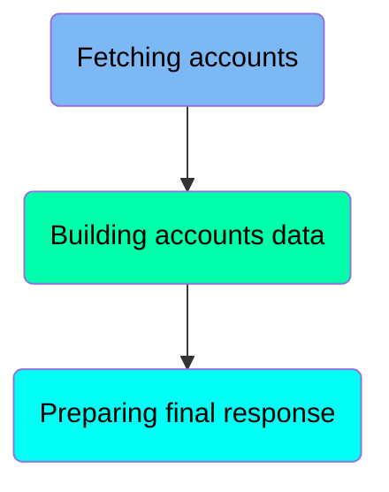

## <SwmToken path="src/webui/src/main/java/com/ibm/cics/cip/bankliberty/api/json/AccountsResource.java" pos="482:7:7" line-data="		Response myResponse = getAccountsByCustomerInternal(customerNumber);">`getAccountsByCustomerInternal`</SwmToken> function - Fetching accounts

Here is a diagram of this part:

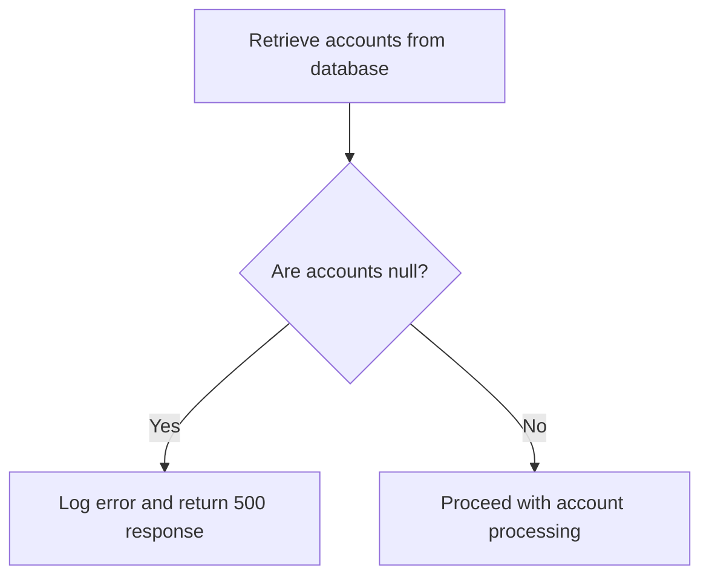

<SwmSnippet path="/src/webui/src/main/java/com/ibm/cics/cip/bankliberty/api/json/AccountsResource.java" line="544">

---

### Retrieving accounts from the database

The function retrieves all accounts associated with a given customer number and sort code from the database. This is done by calling the <SwmToken path="src/webui/src/main/java/com/ibm/cics/cip/bankliberty/api/json/AccountsResource.java" pos="545:11:11" line-data="		Account[] myAccounts = db2Account.getAccounts(customerNumber.intValue(),">`getAccounts`</SwmToken> method on the <SwmToken path="src/webui/src/main/java/com/ibm/cics/cip/bankliberty/api/json/AccountsResource.java" pos="544:17:17" line-data="		com.ibm.cics.cip.bankliberty.web.db2.Account db2Account = new Account();">`db2Account`</SwmToken> object, which constructs an SQL query, executes it, and maps the result set to an array of <SwmToken path="src/webui/src/main/java/com/ibm/cics/cip/bankliberty/api/json/AccountsResource.java" pos="544:15:15" line-data="		com.ibm.cics.cip.bankliberty.web.db2.Account db2Account = new Account();">`Account`</SwmToken> objects.

```java
		com.ibm.cics.cip.bankliberty.web.db2.Account db2Account = new Account();
		Account[] myAccounts = db2Account.getAccounts(customerNumber.intValue(),
				sortCode);
```

---

</SwmSnippet>

<SwmSnippet path="/src/webui/src/main/java/com/ibm/cics/cip/bankliberty/api/json/AccountsResource.java" line="547">

---

### Handling potential errors

If the retrieved accounts are null, the function logs an error message indicating that the accounts cannot be accessed for the specified customer. It then constructs a JSON error response with a status code of 500 and returns this response.

```java
		if (myAccounts == null)
		{
			JSONObject error = new JSONObject();
			error.put(JSON_ERROR_MSG,
					"Accounts cannot be accessed for customer "
							+ customerNumber.longValue() + CLASS_NAME_MSG);
			logger.log(Level.SEVERE,
					() -> "Accounts cannot be accessed for customer "
							+ customerNumber.longValue() + CLASS_NAME_MSG);
			myResponse = Response.status(500).entity(error.toString()).build();
			logger.exiting(this.getClass().getName(),
					GET_ACCOUNTS_BY_CUSTOMER_INTERNAL, myResponse);
			return myResponse;
		}
```

---

</SwmSnippet>

## <SwmToken path="src/webui/src/main/java/com/ibm/cics/cip/bankliberty/api/json/AccountsResource.java" pos="482:7:7" line-data="		Response myResponse = getAccountsByCustomerInternal(customerNumber);">`getAccountsByCustomerInternal`</SwmToken> function - Building accounts data

Here is a diagram of this part:

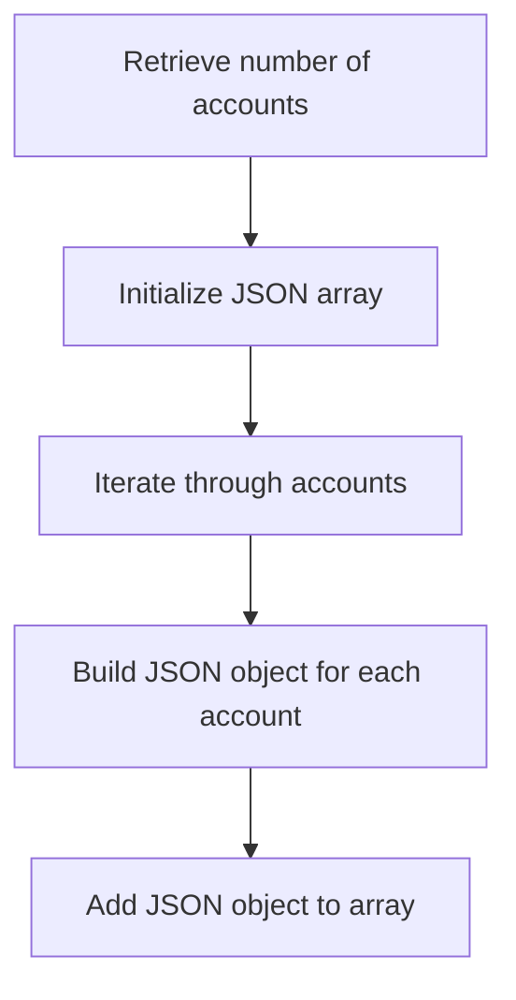

<SwmSnippet path="/src/webui/src/main/java/com/ibm/cics/cip/bankliberty/api/json/AccountsResource.java" line="561">

---

### Retrieve number of accounts

The function first retrieves the number of accounts associated with the customer by accessing the length of the <SwmToken path="src/webui/src/main/java/com/ibm/cics/cip/bankliberty/api/json/AccountsResource.java" pos="562:5:5" line-data="		numberOfAccounts = myAccounts.length;">`myAccounts`</SwmToken> array.

```java

		numberOfAccounts = myAccounts.length;
```

---

</SwmSnippet>

<SwmSnippet path="/src/webui/src/main/java/com/ibm/cics/cip/bankliberty/api/json/AccountsResource.java" line="563">

---

### Initialize JSON array

Next, it initializes a <SwmToken path="src/webui/src/main/java/com/ibm/cics/cip/bankliberty/api/json/AccountsResource.java" pos="563:7:7" line-data="		accounts = new JSONArray(numberOfAccounts);">`JSONArray`</SwmToken> with the size equal to the number of accounts. This array will hold the JSON objects representing each account.

```java
		accounts = new JSONArray(numberOfAccounts);
```

---

</SwmSnippet>

<SwmSnippet path="/src/webui/src/main/java/com/ibm/cics/cip/bankliberty/api/json/AccountsResource.java" line="564">

---

### Iterate through accounts

The function then iterates through each account in the <SwmToken path="src/webui/src/main/java/com/ibm/cics/cip/bankliberty/api/json/AccountsResource.java" pos="545:5:5" line-data="		Account[] myAccounts = db2Account.getAccounts(customerNumber.intValue(),">`myAccounts`</SwmToken> array. For each account, it creates a new <SwmToken path="src/webui/src/main/java/com/ibm/cics/cip/bankliberty/webui/data_access/AccountList.java" pos="131:1:1" line-data="				JSONObject myAccountsJSON = JSONObject.parse(myAccountsString);">`JSONObject`</SwmToken> to store the account details.

```java
		for (int i = 0; i < numberOfAccounts; i++)
		{
```

---

</SwmSnippet>

<SwmSnippet path="/src/webui/src/main/java/com/ibm/cics/cip/bankliberty/api/json/AccountsResource.java" line="567">

---

### Build JSON object for each account

For each account, the function populates the <SwmToken path="src/webui/src/main/java/com/ibm/cics/cip/bankliberty/api/json/AccountsResource.java" pos="567:1:1" line-data="			JSONObject account = new JSONObject();">`JSONObject`</SwmToken> with various details such as sort code, account number, customer number, account type, available balance, actual balance, interest rate, overdraft limit, last statement date, next statement date, and the date the account was opened.

```java
			JSONObject account = new JSONObject();
			account.put(JSON_SORT_CODE, myAccounts[i].getSortcode());
			account.put("id", myAccounts[i].getAccountNumber());
			account.put(JSON_CUSTOMER_NUMBER,
					myAccounts[i].getCustomerNumber());
			account.put(JSON_ACCOUNT_TYPE, myAccounts[i].getType());
			account.put(JSON_AVAILABLE_BALANCE,
					BigDecimal.valueOf(myAccounts[i].getAvailableBalance()));
			account.put(JSON_ACTUAL_BALANCE,
					BigDecimal.valueOf(myAccounts[i].getActualBalance()));
			account.put(JSON_INTEREST_RATE,
					BigDecimal.valueOf(myAccounts[i].getInterestRate()));
			account.put(JSON_OVERDRAFT, myAccounts[i].getOverdraftLimit());
			account.put(JSON_LAST_STATEMENT_DATE,
					myAccounts[i].getLastStatement().toString());
			account.put(JSON_NEXT_STATEMENT_DATE,
					myAccounts[i].getNextStatement().toString());
			account.put(JSON_DATE_OPENED, myAccounts[i].getOpened().toString());

```

---

</SwmSnippet>

<SwmSnippet path="/src/webui/src/main/java/com/ibm/cics/cip/bankliberty/api/json/AccountsResource.java" line="586">

---

### Add JSON object to array

Finally, the function adds the populated <SwmToken path="src/webui/src/main/java/com/ibm/cics/cip/bankliberty/webui/data_access/AccountList.java" pos="131:1:1" line-data="				JSONObject myAccountsJSON = JSONObject.parse(myAccountsString);">`JSONObject`</SwmToken> to the <SwmToken path="src/webui/src/main/java/com/ibm/cics/cip/bankliberty/api/json/AccountsResource.java" pos="586:1:1" line-data="			accounts.add(account);">`accounts`</SwmToken> array, which will eventually contain all the account details for the customer.

```java
			accounts.add(account);
		}
```

---

</SwmSnippet>

## <SwmToken path="src/webui/src/main/java/com/ibm/cics/cip/bankliberty/api/json/AccountsResource.java" pos="482:7:7" line-data="		Response myResponse = getAccountsByCustomerInternal(customerNumber);">`getAccountsByCustomerInternal`</SwmToken> function - Preparing final response

Here is a diagram of this part:

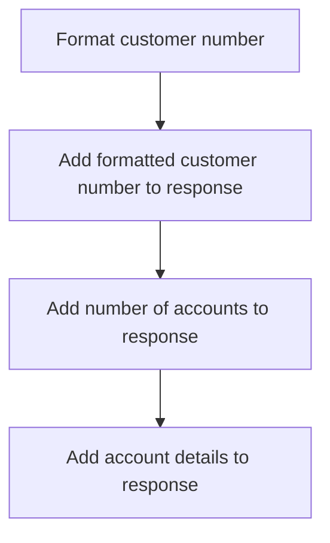

<SwmSnippet path="/src/webui/src/main/java/com/ibm/cics/cip/bankliberty/api/json/AccountsResource.java" line="588">

---

### Formatting customer number

The customer number is formatted to ensure it meets a specific length requirement. This is achieved by appending leading zeros to the customer number until it reaches the desired length.

```java
		StringBuilder myStringBuilder = new StringBuilder();

		for (int i = customerNumber.toString().length(); i < CUSTOMER_NUMBER_LENGTH; i++)
		{
			myStringBuilder.append('0');
		}
		myStringBuilder.append(customerNumber.toString());
```

---

</SwmSnippet>

<SwmSnippet path="/src/webui/src/main/java/com/ibm/cics/cip/bankliberty/api/json/AccountsResource.java" line="596">

---

### Adding formatted customer number to response

The formatted customer number is then added to the response JSON object under the key <SwmToken path="src/webui/src/main/java/com/ibm/cics/cip/bankliberty/api/json/AccountsResource.java" pos="596:5:5" line-data="		response.put(JSON_CUSTOMER_NUMBER, myStringBuilder.toString());">`JSON_CUSTOMER_NUMBER`</SwmToken>.

```java
		response.put(JSON_CUSTOMER_NUMBER, myStringBuilder.toString());
```

---

</SwmSnippet>

<SwmSnippet path="/src/webui/src/main/java/com/ibm/cics/cip/bankliberty/api/json/AccountsResource.java" line="597">

---

### Adding number of accounts to response

The total number of accounts retrieved is added to the response JSON object under the key <SwmToken path="src/webui/src/main/java/com/ibm/cics/cip/bankliberty/api/json/AccountsResource.java" pos="597:5:5" line-data="		response.put(JSON_NUMBER_OF_ACCOUNTS, numberOfAccounts);">`JSON_NUMBER_OF_ACCOUNTS`</SwmToken>.

```java
		response.put(JSON_NUMBER_OF_ACCOUNTS, numberOfAccounts);
```

---

</SwmSnippet>

<SwmSnippet path="/src/webui/src/main/java/com/ibm/cics/cip/bankliberty/api/json/AccountsResource.java" line="598">

---

### Adding account details to response

Finally, the details of the accounts are added to the response JSON object under the key <SwmToken path="src/webui/src/main/java/com/ibm/cics/cip/bankliberty/api/json/AccountsResource.java" pos="598:5:5" line-data="		response.put(JSON_ACCOUNTS, accounts);">`JSON_ACCOUNTS`</SwmToken>.

```java
		response.put(JSON_ACCOUNTS, accounts);
```

---

</SwmSnippet>

## Going into <SwmToken path="src/webui/src/main/java/com/ibm/cics/cip/bankliberty/api/json/AccountsResource.java" pos="545:11:11" line-data="		Account[] myAccounts = db2Account.getAccounts(customerNumber.intValue(),">`getAccounts`</SwmToken>

```mermaid
graph TD
  subgraph getAccounts
    getAccounts:A["Open database connection"] --> getAccounts:B["Prepare SQL query"]
    getAccounts:B --> getAccounts:C["Set query parameters"]
    getAccounts:C --> getAccounts:D["Execute query to retrieve accounts"]
    getAccounts:D --> getAccounts:E["Create Account objects from result set"]
    getAccounts:E --> getAccounts:F["Return array of Account objects"]
  end

%% Swimm:
%% graph TD
%%   subgraph <SwmToken path="src/webui/src/main/java/com/ibm/cics/cip/bankliberty/api/json/AccountsResource.java" pos="545:11:11" line-data="		Account[] myAccounts = db2Account.getAccounts(customerNumber.intValue(),">`getAccounts`</SwmToken>
%%     <SwmToken path="src/webui/src/main/java/com/ibm/cics/cip/bankliberty/api/json/AccountsResource.java" pos="545:11:11" line-data="		Account[] myAccounts = db2Account.getAccounts(customerNumber.intValue(),">`getAccounts`</SwmToken>:A["Open database connection"] --> <SwmToken path="src/webui/src/main/java/com/ibm/cics/cip/bankliberty/api/json/AccountsResource.java" pos="545:11:11" line-data="		Account[] myAccounts = db2Account.getAccounts(customerNumber.intValue(),">`getAccounts`</SwmToken>:B["Prepare SQL query"]
%%     <SwmToken path="src/webui/src/main/java/com/ibm/cics/cip/bankliberty/api/json/AccountsResource.java" pos="545:11:11" line-data="		Account[] myAccounts = db2Account.getAccounts(customerNumber.intValue(),">`getAccounts`</SwmToken>:B --> <SwmToken path="src/webui/src/main/java/com/ibm/cics/cip/bankliberty/api/json/AccountsResource.java" pos="545:11:11" line-data="		Account[] myAccounts = db2Account.getAccounts(customerNumber.intValue(),">`getAccounts`</SwmToken>:C["Set query parameters"]
%%     <SwmToken path="src/webui/src/main/java/com/ibm/cics/cip/bankliberty/api/json/AccountsResource.java" pos="545:11:11" line-data="		Account[] myAccounts = db2Account.getAccounts(customerNumber.intValue(),">`getAccounts`</SwmToken>:C --> <SwmToken path="src/webui/src/main/java/com/ibm/cics/cip/bankliberty/api/json/AccountsResource.java" pos="545:11:11" line-data="		Account[] myAccounts = db2Account.getAccounts(customerNumber.intValue(),">`getAccounts`</SwmToken>:D["Execute query to retrieve accounts"]
%%     <SwmToken path="src/webui/src/main/java/com/ibm/cics/cip/bankliberty/api/json/AccountsResource.java" pos="545:11:11" line-data="		Account[] myAccounts = db2Account.getAccounts(customerNumber.intValue(),">`getAccounts`</SwmToken>:D --> <SwmToken path="src/webui/src/main/java/com/ibm/cics/cip/bankliberty/api/json/AccountsResource.java" pos="545:11:11" line-data="		Account[] myAccounts = db2Account.getAccounts(customerNumber.intValue(),">`getAccounts`</SwmToken>:E["Create Account objects from result set"]
%%     <SwmToken path="src/webui/src/main/java/com/ibm/cics/cip/bankliberty/api/json/AccountsResource.java" pos="545:11:11" line-data="		Account[] myAccounts = db2Account.getAccounts(customerNumber.intValue(),">`getAccounts`</SwmToken>:E --> <SwmToken path="src/webui/src/main/java/com/ibm/cics/cip/bankliberty/api/json/AccountsResource.java" pos="545:11:11" line-data="		Account[] myAccounts = db2Account.getAccounts(customerNumber.intValue(),">`getAccounts`</SwmToken>:F["Return array of Account objects"]
%%   end
```

<SwmSnippet path="/src/webui/src/main/java/com/ibm/cics/cip/bankliberty/web/db2/Account.java" line="504">

---

## Fetching and processing account data

First, the <SwmToken path="src/webui/src/main/java/com/ibm/cics/cip/bankliberty/web/db2/Account.java" pos="504:7:7" line-data="	public Account[] getAccounts(long l, int sortCode)">`getAccounts`</SwmToken> method is called to retrieve account details for a specific customer based on their customer number and sort code. This method opens a connection to the database and prepares to fetch the account data.

```java
	public Account[] getAccounts(long l, int sortCode)
	{
		logger.entering(this.getClass().getName(), GET_ACCOUNTS_CUSTNO + l);
		openConnection();
```

---

</SwmSnippet>

<SwmSnippet path="/src/webui/src/main/java/com/ibm/cics/cip/bankliberty/web/db2/Account.java" line="510">

---

Next, the customer number and sort code are formatted to match the database schema requirements. This ensures that the query will correctly match the relevant records.

```java
		String customerNumberString = padCustomerNumber(Long.toString(l));

		String sortCodeString = padSortCode(sortCode);
```

---

</SwmSnippet>

<SwmSnippet path="/src/webui/src/main/java/com/ibm/cics/cip/bankliberty/web/db2/Account.java" line="514">

---

Then, an SQL query is constructed to select all account records that match the given customer number and sort code. The query is logged for debugging purposes.

```java
		String sql = "SELECT * from ACCOUNT where ACCOUNT_EYECATCHER LIKE 'ACCT' AND ACCOUNT_CUSTOMER_NUMBER like ? and ACCOUNT_SORTCODE like ? ORDER BY ACCOUNT_NUMBER";
		logger.log(Level.FINE, () -> PRE_SELECT_MSG + sql + ">");
```

---

</SwmSnippet>

<SwmSnippet path="/src/webui/src/main/java/com/ibm/cics/cip/bankliberty/web/db2/Account.java" line="517">

---

Moving to the execution phase, the prepared statement is executed, and the result set is processed. Each account record is read from the result set and stored in an array of <SwmToken path="src/webui/src/main/java/com/ibm/cics/cip/bankliberty/web/db2/Account.java" pos="526:10:10" line-data="				temp[i] = new Account(rs.getString(ACCOUNT_CUSTOMER_NUMBER),">`Account`</SwmToken> objects.

```java
		try (PreparedStatement stmt = conn.prepareStatement(sql);)
		{
			stmt.setString(1, customerNumberString);
			stmt.setString(2, sortCodeString);

			ResultSet rs = stmt.executeQuery();

			while (rs.next())
			{
				temp[i] = new Account(rs.getString(ACCOUNT_CUSTOMER_NUMBER),
						rs.getString(ACCOUNT_SORTCODE),
						rs.getString(ACCOUNT_NUMBER),
						rs.getString(ACCOUNT_TYPE),
						rs.getDouble(ACCOUNT_INTEREST_RATE),
						rs.getDate(ACCOUNT_OPENED),
						rs.getInt(ACCOUNT_OVERDRAFT_LIMIT),
						rs.getDate(ACCOUNT_LAST_STATEMENT),
						rs.getDate(ACCOUNT_NEXT_STATEMENT),
						rs.getDouble(ACCOUNT_AVAILABLE_BALANCE),
						rs.getDouble(ACCOUNT_ACTUAL_BALANCE));
				i++;
```

---

</SwmSnippet>

<SwmSnippet path="/src/webui/src/main/java/com/ibm/cics/cip/bankliberty/web/db2/Account.java" line="540">

---

Finally, the method handles any SQL exceptions that may occur during the query execution. If an exception is caught, an error message is logged, and the method returns null. Otherwise, the array of <SwmToken path="src/webui/src/main/java/com/ibm/cics/cip/bankliberty/web/db2/Account.java" pos="547:1:1" line-data="		Account[] real = new Account[i];">`Account`</SwmToken> objects is returned.

```java
		catch (SQLException e)
		{
			logger.severe(e.getLocalizedMessage());
			logger.exiting(this.getClass().getName(), GET_ACCOUNTS_CUSTNO + l,
					null);
			return null;
		}
		Account[] real = new Account[i];
		System.arraycopy(temp, 0, real, 0, i);

		logger.exiting(this.getClass().getName(), GET_ACCOUNTS_CUSTNO + l,
				real);
		return real;
```

---

</SwmSnippet>

## Going into <SwmToken path="src/webui/src/main/java/com/ibm/cics/cip/bankliberty/webui/data_access/AccountList.java" pos="128:7:7" line-data="				myAccountsResponse = myAccountsResource.getAccountsExternal(Integer.valueOf(0),Integer.valueOf(999999),true);">`getAccountsExternal`</SwmToken>

```mermaid
graph TD
subgraph getAccountsExternal
  getAccountsExternal:A["Log entering function"] --> getAccountsExternal:B["Determine if countOnly is true"]
  getAccountsExternal:B --> getAccountsExternal:C["Call getAccountsInternal"]
  getAccountsExternal:C --> getAccountsExternal:D["Terminate HBankDataAccess"]
  getAccountsExternal:D --> getAccountsExternal:E["Log exiting function"]
  getAccountsExternal:E --> getAccountsExternal:F["Return response"]
end

%% Swimm:
%% graph TD
%% subgraph <SwmToken path="src/webui/src/main/java/com/ibm/cics/cip/bankliberty/webui/data_access/AccountList.java" pos="128:7:7" line-data="				myAccountsResponse = myAccountsResource.getAccountsExternal(Integer.valueOf(0),Integer.valueOf(999999),true);">`getAccountsExternal`</SwmToken>
%%   <SwmToken path="src/webui/src/main/java/com/ibm/cics/cip/bankliberty/webui/data_access/AccountList.java" pos="128:7:7" line-data="				myAccountsResponse = myAccountsResource.getAccountsExternal(Integer.valueOf(0),Integer.valueOf(999999),true);">`getAccountsExternal`</SwmToken>:A["Log entering function"] --> <SwmToken path="src/webui/src/main/java/com/ibm/cics/cip/bankliberty/webui/data_access/AccountList.java" pos="128:7:7" line-data="				myAccountsResponse = myAccountsResource.getAccountsExternal(Integer.valueOf(0),Integer.valueOf(999999),true);">`getAccountsExternal`</SwmToken>:B["Determine if <SwmToken path="src/webui/src/main/java/com/ibm/cics/cip/bankliberty/api/json/AccountsResource.java" pos="480:11:11" line-data="				&quot;getAccountsByCustomerExternal(Long customerNumber, Boolean countOnly)&quot;);">`countOnly`</SwmToken> is true"]
%%   <SwmToken path="src/webui/src/main/java/com/ibm/cics/cip/bankliberty/webui/data_access/AccountList.java" pos="128:7:7" line-data="				myAccountsResponse = myAccountsResource.getAccountsExternal(Integer.valueOf(0),Integer.valueOf(999999),true);">`getAccountsExternal`</SwmToken>:B --> <SwmToken path="src/webui/src/main/java/com/ibm/cics/cip/bankliberty/webui/data_access/AccountList.java" pos="128:7:7" line-data="				myAccountsResponse = myAccountsResource.getAccountsExternal(Integer.valueOf(0),Integer.valueOf(999999),true);">`getAccountsExternal`</SwmToken>:C["Call <SwmToken path="src/webui/src/main/java/com/ibm/cics/cip/bankliberty/api/json/AccountsResource.java" pos="1357:7:7" line-data="		Response myResponse = getAccountsInternal(limit, offset, countOnlyReal);">`getAccountsInternal`</SwmToken>"]
%%   <SwmToken path="src/webui/src/main/java/com/ibm/cics/cip/bankliberty/webui/data_access/AccountList.java" pos="128:7:7" line-data="				myAccountsResponse = myAccountsResource.getAccountsExternal(Integer.valueOf(0),Integer.valueOf(999999),true);">`getAccountsExternal`</SwmToken>:C --> <SwmToken path="src/webui/src/main/java/com/ibm/cics/cip/bankliberty/webui/data_access/AccountList.java" pos="128:7:7" line-data="				myAccountsResponse = myAccountsResource.getAccountsExternal(Integer.valueOf(0),Integer.valueOf(999999),true);">`getAccountsExternal`</SwmToken>:D["Terminate <SwmToken path="src/webui/src/main/java/com/ibm/cics/cip/bankliberty/api/json/AccountsResource.java" pos="483:1:1" line-data="		HBankDataAccess myHBankDataAccess = new HBankDataAccess();">`HBankDataAccess`</SwmToken>"]
%%   <SwmToken path="src/webui/src/main/java/com/ibm/cics/cip/bankliberty/webui/data_access/AccountList.java" pos="128:7:7" line-data="				myAccountsResponse = myAccountsResource.getAccountsExternal(Integer.valueOf(0),Integer.valueOf(999999),true);">`getAccountsExternal`</SwmToken>:D --> <SwmToken path="src/webui/src/main/java/com/ibm/cics/cip/bankliberty/webui/data_access/AccountList.java" pos="128:7:7" line-data="				myAccountsResponse = myAccountsResource.getAccountsExternal(Integer.valueOf(0),Integer.valueOf(999999),true);">`getAccountsExternal`</SwmToken>:E["Log exiting function"]
%%   <SwmToken path="src/webui/src/main/java/com/ibm/cics/cip/bankliberty/webui/data_access/AccountList.java" pos="128:7:7" line-data="				myAccountsResponse = myAccountsResource.getAccountsExternal(Integer.valueOf(0),Integer.valueOf(999999),true);">`getAccountsExternal`</SwmToken>:E --> <SwmToken path="src/webui/src/main/java/com/ibm/cics/cip/bankliberty/webui/data_access/AccountList.java" pos="128:7:7" line-data="				myAccountsResponse = myAccountsResource.getAccountsExternal(Integer.valueOf(0),Integer.valueOf(999999),true);">`getAccountsExternal`</SwmToken>:F["Return response"]
%% end
```

<SwmSnippet path="/src/webui/src/main/java/com/ibm/cics/cip/bankliberty/api/json/AccountsResource.java" line="1352">

---

## Handling the <SwmToken path="src/webui/src/main/java/com/ibm/cics/cip/bankliberty/api/json/AccountsResource.java" pos="1353:4:4" line-data="		if (countOnly != null)">`countOnly`</SwmToken> parameter

First, the method checks if the <SwmToken path="src/webui/src/main/java/com/ibm/cics/cip/bankliberty/api/json/AccountsResource.java" pos="1353:4:4" line-data="		if (countOnly != null)">`countOnly`</SwmToken> parameter is provided. If it is, it converts the <SwmToken path="src/webui/src/main/java/com/ibm/cics/cip/bankliberty/api/json/AccountsResource.java" pos="1353:4:4" line-data="		if (countOnly != null)">`countOnly`</SwmToken> parameter to a boolean value. This parameter determines whether the response should include only the count of accounts or the actual account details.

```java
		boolean countOnlyReal = false;
		if (countOnly != null)
		{
			countOnlyReal = countOnly.booleanValue();
		}
```

---

</SwmSnippet>

<SwmSnippet path="/src/webui/src/main/java/com/ibm/cics/cip/bankliberty/api/json/AccountsResource.java" line="1357">

---

## Calling the internal method

Next, the method calls <SwmToken path="src/webui/src/main/java/com/ibm/cics/cip/bankliberty/api/json/AccountsResource.java" pos="1357:7:7" line-data="		Response myResponse = getAccountsInternal(limit, offset, countOnlyReal);">`getAccountsInternal`</SwmToken> with the provided <SwmToken path="src/webui/src/main/java/com/ibm/cics/cip/bankliberty/api/json/AccountsResource.java" pos="1357:9:9" line-data="		Response myResponse = getAccountsInternal(limit, offset, countOnlyReal);">`limit`</SwmToken>, <SwmToken path="src/webui/src/main/java/com/ibm/cics/cip/bankliberty/api/json/AccountsResource.java" pos="1357:12:12" line-data="		Response myResponse = getAccountsInternal(limit, offset, countOnlyReal);">`offset`</SwmToken>, and the boolean value of <SwmToken path="src/webui/src/main/java/com/ibm/cics/cip/bankliberty/api/json/AccountsResource.java" pos="480:11:11" line-data="				&quot;getAccountsByCustomerExternal(Long customerNumber, Boolean countOnly)&quot;);">`countOnly`</SwmToken>. This internal method handles the actual retrieval of account data based on these parameters.

```java
		Response myResponse = getAccountsInternal(limit, offset, countOnlyReal);
```

---

</SwmSnippet>

<SwmSnippet path="/src/webui/src/main/java/com/ibm/cics/cip/bankliberty/api/json/AccountsResource.java" line="1358">

---

## Terminating the data access

Then, the method creates an instance of <SwmToken path="src/webui/src/main/java/com/ibm/cics/cip/bankliberty/api/json/AccountsResource.java" pos="1358:1:1" line-data="		HBankDataAccess myHBankDataAccess = new HBankDataAccess();">`HBankDataAccess`</SwmToken> and calls its <SwmToken path="src/webui/src/main/java/com/ibm/cics/cip/bankliberty/api/json/AccountsResource.java" pos="1359:3:3" line-data="		myHBankDataAccess.terminate();">`terminate`</SwmToken> method. This ensures that any resources used during the data access are properly released.

```java
		HBankDataAccess myHBankDataAccess = new HBankDataAccess();
		myHBankDataAccess.terminate();
```

---

</SwmSnippet>

<SwmSnippet path="/src/webui/src/main/java/com/ibm/cics/cip/bankliberty/api/json/AccountsResource.java" line="1360">

---

## Returning the response

Finally, the method logs the exit and returns the response obtained from <SwmToken path="src/webui/src/main/java/com/ibm/cics/cip/bankliberty/api/json/AccountsResource.java" pos="1357:7:7" line-data="		Response myResponse = getAccountsInternal(limit, offset, countOnlyReal);">`getAccountsInternal`</SwmToken>. This response contains either the count of accounts or the account details, depending on the <SwmToken path="src/webui/src/main/java/com/ibm/cics/cip/bankliberty/api/json/AccountsResource.java" pos="1361:15:15" line-data="				&quot;getAccountsExternal(Integer limit, Integer offset,Boolean countOnly)&quot;,">`countOnly`</SwmToken> parameter.

```java
		logger.exiting(this.getClass().getName(),
				"getAccountsExternal(Integer limit, Integer offset,Boolean countOnly)",
				myResponse);
		return myResponse;
	}
```

---

</SwmSnippet>

## A closer look at <SwmToken path="src/webui/src/main/java/com/ibm/cics/cip/bankliberty/api/json/AccountsResource.java" pos="1357:7:7" line-data="		Response myResponse = getAccountsInternal(limit, offset, countOnlyReal);">`getAccountsInternal`</SwmToken>

```mermaid
graph TD
  subgraph getAccountsInternal
    getAccountsInternal:A["Check if limit is null"] --> getAccountsInternal:B["Set limit to 250000 if true"]
    getAccountsInternal:B --> getAccountsInternal:C["Check if limit is zero"]
    getAccountsInternal:C --> getAccountsInternal:D["Set limit to 250000 if true"]
    getAccountsInternal:D --> getAccountsInternal:E["Check if offset is null"]
    getAccountsInternal:E --> getAccountsInternal:F["Set offset to 0 if true"]
    getAccountsInternal:F --> getAccountsInternal:G["Check if countOnly is true"]
    getAccountsInternal:G -->|true| getAccountsInternal:H["Get accounts count only"]
    getAccountsInternal:G -->|false| getAccountsInternal:I["Get accounts using sort code, limit, offset"]
    getAccountsInternal:I --> getAccountsInternal:J["Check if accounts are null"]
    getAccountsInternal:J -->|true| getAccountsInternal:K["Log error and return 500 response"]
    getAccountsInternal:J -->|false| getAccountsInternal:L["Create JSON array of accounts"]
    getAccountsInternal:L --> getAccountsInternal:M["Add account details to JSON array"]
    getAccountsInternal:M --> getAccountsInternal:N["Prepare JSON response with number of accounts"]
    getAccountsInternal:H --> getAccountsInternal:N
    getAccountsInternal:N --> getAccountsInternal:O["Add accounts array to response if not null"]
    getAccountsInternal:O --> getAccountsInternal:P["Return 200 response with JSON data"]
  end

%% Swimm:
%% graph TD
%%   subgraph <SwmToken path="src/webui/src/main/java/com/ibm/cics/cip/bankliberty/api/json/AccountsResource.java" pos="1357:7:7" line-data="		Response myResponse = getAccountsInternal(limit, offset, countOnlyReal);">`getAccountsInternal`</SwmToken>
%%     <SwmToken path="src/webui/src/main/java/com/ibm/cics/cip/bankliberty/api/json/AccountsResource.java" pos="1357:7:7" line-data="		Response myResponse = getAccountsInternal(limit, offset, countOnlyReal);">`getAccountsInternal`</SwmToken>:A["Check if limit is null"] --> <SwmToken path="src/webui/src/main/java/com/ibm/cics/cip/bankliberty/api/json/AccountsResource.java" pos="1357:7:7" line-data="		Response myResponse = getAccountsInternal(limit, offset, countOnlyReal);">`getAccountsInternal`</SwmToken>:B["Set limit to 250000 if true"]
%%     <SwmToken path="src/webui/src/main/java/com/ibm/cics/cip/bankliberty/api/json/AccountsResource.java" pos="1357:7:7" line-data="		Response myResponse = getAccountsInternal(limit, offset, countOnlyReal);">`getAccountsInternal`</SwmToken>:B --> <SwmToken path="src/webui/src/main/java/com/ibm/cics/cip/bankliberty/api/json/AccountsResource.java" pos="1357:7:7" line-data="		Response myResponse = getAccountsInternal(limit, offset, countOnlyReal);">`getAccountsInternal`</SwmToken>:C["Check if limit is zero"]
%%     <SwmToken path="src/webui/src/main/java/com/ibm/cics/cip/bankliberty/api/json/AccountsResource.java" pos="1357:7:7" line-data="		Response myResponse = getAccountsInternal(limit, offset, countOnlyReal);">`getAccountsInternal`</SwmToken>:C --> <SwmToken path="src/webui/src/main/java/com/ibm/cics/cip/bankliberty/api/json/AccountsResource.java" pos="1357:7:7" line-data="		Response myResponse = getAccountsInternal(limit, offset, countOnlyReal);">`getAccountsInternal`</SwmToken>:D["Set limit to 250000 if true"]
%%     <SwmToken path="src/webui/src/main/java/com/ibm/cics/cip/bankliberty/api/json/AccountsResource.java" pos="1357:7:7" line-data="		Response myResponse = getAccountsInternal(limit, offset, countOnlyReal);">`getAccountsInternal`</SwmToken>:D --> <SwmToken path="src/webui/src/main/java/com/ibm/cics/cip/bankliberty/api/json/AccountsResource.java" pos="1357:7:7" line-data="		Response myResponse = getAccountsInternal(limit, offset, countOnlyReal);">`getAccountsInternal`</SwmToken>:E["Check if offset is null"]
%%     <SwmToken path="src/webui/src/main/java/com/ibm/cics/cip/bankliberty/api/json/AccountsResource.java" pos="1357:7:7" line-data="		Response myResponse = getAccountsInternal(limit, offset, countOnlyReal);">`getAccountsInternal`</SwmToken>:E --> <SwmToken path="src/webui/src/main/java/com/ibm/cics/cip/bankliberty/api/json/AccountsResource.java" pos="1357:7:7" line-data="		Response myResponse = getAccountsInternal(limit, offset, countOnlyReal);">`getAccountsInternal`</SwmToken>:F["Set offset to 0 if true"]
%%     <SwmToken path="src/webui/src/main/java/com/ibm/cics/cip/bankliberty/api/json/AccountsResource.java" pos="1357:7:7" line-data="		Response myResponse = getAccountsInternal(limit, offset, countOnlyReal);">`getAccountsInternal`</SwmToken>:F --> <SwmToken path="src/webui/src/main/java/com/ibm/cics/cip/bankliberty/api/json/AccountsResource.java" pos="1357:7:7" line-data="		Response myResponse = getAccountsInternal(limit, offset, countOnlyReal);">`getAccountsInternal`</SwmToken>:G["Check if <SwmToken path="src/webui/src/main/java/com/ibm/cics/cip/bankliberty/api/json/AccountsResource.java" pos="480:11:11" line-data="				&quot;getAccountsByCustomerExternal(Long customerNumber, Boolean countOnly)&quot;);">`countOnly`</SwmToken> is true"]
%%     <SwmToken path="src/webui/src/main/java/com/ibm/cics/cip/bankliberty/api/json/AccountsResource.java" pos="1357:7:7" line-data="		Response myResponse = getAccountsInternal(limit, offset, countOnlyReal);">`getAccountsInternal`</SwmToken>:G -->|true| <SwmToken path="src/webui/src/main/java/com/ibm/cics/cip/bankliberty/api/json/AccountsResource.java" pos="1357:7:7" line-data="		Response myResponse = getAccountsInternal(limit, offset, countOnlyReal);">`getAccountsInternal`</SwmToken>:H["Get accounts count only"]
%%     <SwmToken path="src/webui/src/main/java/com/ibm/cics/cip/bankliberty/api/json/AccountsResource.java" pos="1357:7:7" line-data="		Response myResponse = getAccountsInternal(limit, offset, countOnlyReal);">`getAccountsInternal`</SwmToken>:G -->|false| <SwmToken path="src/webui/src/main/java/com/ibm/cics/cip/bankliberty/api/json/AccountsResource.java" pos="1357:7:7" line-data="		Response myResponse = getAccountsInternal(limit, offset, countOnlyReal);">`getAccountsInternal`</SwmToken>:I["Get accounts using sort code, limit, offset"]
%%     <SwmToken path="src/webui/src/main/java/com/ibm/cics/cip/bankliberty/api/json/AccountsResource.java" pos="1357:7:7" line-data="		Response myResponse = getAccountsInternal(limit, offset, countOnlyReal);">`getAccountsInternal`</SwmToken>:I --> <SwmToken path="src/webui/src/main/java/com/ibm/cics/cip/bankliberty/api/json/AccountsResource.java" pos="1357:7:7" line-data="		Response myResponse = getAccountsInternal(limit, offset, countOnlyReal);">`getAccountsInternal`</SwmToken>:J["Check if accounts are null"]
%%     <SwmToken path="src/webui/src/main/java/com/ibm/cics/cip/bankliberty/api/json/AccountsResource.java" pos="1357:7:7" line-data="		Response myResponse = getAccountsInternal(limit, offset, countOnlyReal);">`getAccountsInternal`</SwmToken>:J -->|true| <SwmToken path="src/webui/src/main/java/com/ibm/cics/cip/bankliberty/api/json/AccountsResource.java" pos="1357:7:7" line-data="		Response myResponse = getAccountsInternal(limit, offset, countOnlyReal);">`getAccountsInternal`</SwmToken>:K["Log error and return 500 response"]
%%     <SwmToken path="src/webui/src/main/java/com/ibm/cics/cip/bankliberty/api/json/AccountsResource.java" pos="1357:7:7" line-data="		Response myResponse = getAccountsInternal(limit, offset, countOnlyReal);">`getAccountsInternal`</SwmToken>:J -->|false| <SwmToken path="src/webui/src/main/java/com/ibm/cics/cip/bankliberty/api/json/AccountsResource.java" pos="1357:7:7" line-data="		Response myResponse = getAccountsInternal(limit, offset, countOnlyReal);">`getAccountsInternal`</SwmToken>:L["Create JSON array of accounts"]
%%     <SwmToken path="src/webui/src/main/java/com/ibm/cics/cip/bankliberty/api/json/AccountsResource.java" pos="1357:7:7" line-data="		Response myResponse = getAccountsInternal(limit, offset, countOnlyReal);">`getAccountsInternal`</SwmToken>:L --> <SwmToken path="src/webui/src/main/java/com/ibm/cics/cip/bankliberty/api/json/AccountsResource.java" pos="1357:7:7" line-data="		Response myResponse = getAccountsInternal(limit, offset, countOnlyReal);">`getAccountsInternal`</SwmToken>:M["Add account details to JSON array"]
%%     <SwmToken path="src/webui/src/main/java/com/ibm/cics/cip/bankliberty/api/json/AccountsResource.java" pos="1357:7:7" line-data="		Response myResponse = getAccountsInternal(limit, offset, countOnlyReal);">`getAccountsInternal`</SwmToken>:M --> <SwmToken path="src/webui/src/main/java/com/ibm/cics/cip/bankliberty/api/json/AccountsResource.java" pos="1357:7:7" line-data="		Response myResponse = getAccountsInternal(limit, offset, countOnlyReal);">`getAccountsInternal`</SwmToken>:N["Prepare JSON response with number of accounts"]
%%     <SwmToken path="src/webui/src/main/java/com/ibm/cics/cip/bankliberty/api/json/AccountsResource.java" pos="1357:7:7" line-data="		Response myResponse = getAccountsInternal(limit, offset, countOnlyReal);">`getAccountsInternal`</SwmToken>:H --> <SwmToken path="src/webui/src/main/java/com/ibm/cics/cip/bankliberty/api/json/AccountsResource.java" pos="1357:7:7" line-data="		Response myResponse = getAccountsInternal(limit, offset, countOnlyReal);">`getAccountsInternal`</SwmToken>:N
%%     <SwmToken path="src/webui/src/main/java/com/ibm/cics/cip/bankliberty/api/json/AccountsResource.java" pos="1357:7:7" line-data="		Response myResponse = getAccountsInternal(limit, offset, countOnlyReal);">`getAccountsInternal`</SwmToken>:N --> <SwmToken path="src/webui/src/main/java/com/ibm/cics/cip/bankliberty/api/json/AccountsResource.java" pos="1357:7:7" line-data="		Response myResponse = getAccountsInternal(limit, offset, countOnlyReal);">`getAccountsInternal`</SwmToken>:O["Add accounts array to response if not null"]
%%     <SwmToken path="src/webui/src/main/java/com/ibm/cics/cip/bankliberty/api/json/AccountsResource.java" pos="1357:7:7" line-data="		Response myResponse = getAccountsInternal(limit, offset, countOnlyReal);">`getAccountsInternal`</SwmToken>:O --> <SwmToken path="src/webui/src/main/java/com/ibm/cics/cip/bankliberty/api/json/AccountsResource.java" pos="1357:7:7" line-data="		Response myResponse = getAccountsInternal(limit, offset, countOnlyReal);">`getAccountsInternal`</SwmToken>:P["Return 200 response with JSON data"]
%%   end
```

<SwmSnippet path="/src/webui/src/main/java/com/ibm/cics/cip/bankliberty/api/json/AccountsResource.java" line="1367">

---

## Handling account retrieval and response construction

First, the method <SwmToken path="src/webui/src/main/java/com/ibm/cics/cip/bankliberty/api/json/AccountsResource.java" pos="1367:5:5" line-data="	public Response getAccountsInternal(Integer limit, Integer offset,">`getAccountsInternal`</SwmToken> is invoked to handle the retrieval of account information based on the provided parameters such as limit, offset, and <SwmToken path="src/webui/src/main/java/com/ibm/cics/cip/bankliberty/api/json/AccountsResource.java" pos="1368:3:3" line-data="			boolean countOnly)">`countOnly`</SwmToken>.

```java
	public Response getAccountsInternal(Integer limit, Integer offset,
			boolean countOnly)
	{
```

---

</SwmSnippet>

<SwmSnippet path="/src/webui/src/main/java/com/ibm/cics/cip/bankliberty/api/json/AccountsResource.java" line="1381">

---

Next, the method checks if the limit and offset parameters are null and assigns default values to avoid potential memory issues.

```java
		if (limit == null)
		{
			limit = 250000;
		}
		if (limit == 0)
		{
			limit = 250000;
		}
		if (offset == null)
		{
			offset = 0;
		}
```

---

</SwmSnippet>

<SwmSnippet path="/src/webui/src/main/java/com/ibm/cics/cip/bankliberty/api/json/AccountsResource.java" line="1394">

---

Then, if the <SwmToken path="src/webui/src/main/java/com/ibm/cics/cip/bankliberty/api/json/AccountsResource.java" pos="1394:4:4" line-data="		if (countOnly)">`countOnly`</SwmToken> flag is true, it retrieves the count of accounts using the <SwmToken path="src/webui/src/main/java/com/ibm/cics/cip/bankliberty/api/json/AccountsResource.java" pos="1398:2:2" line-data="					.getAccountsCountOnly(sortCode.intValue());">`getAccountsCountOnly`</SwmToken> method.

```java
		if (countOnly)
		{
			db2Account = new com.ibm.cics.cip.bankliberty.web.db2.Account();
			numberOfAccounts = db2Account
					.getAccountsCountOnly(sortCode.intValue());
```

---

</SwmSnippet>

<SwmSnippet path="/src/webui/src/main/java/com/ibm/cics/cip/bankliberty/api/json/AccountsResource.java" line="1400">

---

If the <SwmToken path="src/webui/src/main/java/com/ibm/cics/cip/bankliberty/api/json/AccountsResource.java" pos="1414:15:15" line-data="						&quot;getAccountsInternal(Integer limit, Integer offset,boolean countOnly)&quot;,">`countOnly`</SwmToken> flag is false, it retrieves the account details using the <SwmToken path="src/webui/src/main/java/com/ibm/cics/cip/bankliberty/api/json/AccountsResource.java" pos="1406:7:7" line-data="			myAccounts = db2Account.getAccounts(sortCode, limit, offset);">`getAccounts`</SwmToken> method and constructs a JSON response with the account information.

```java
		else
		{
			Account[] myAccounts = null;

			db2Account = new Account();

			myAccounts = db2Account.getAccounts(sortCode, limit, offset);
			if (myAccounts == null)
			{
				response.put(JSON_ERROR_MSG, "Accounts cannot be accessed");
				logger.log(Level.SEVERE, () -> "Accounts cannot be accessed");
				myResponse = Response.status(500).entity(response.toString())
						.build();
				logger.exiting(this.getClass().getName(),
						"getAccountsInternal(Integer limit, Integer offset,boolean countOnly)",
						myResponse);
				return myResponse;
			}
			accounts = new JSONArray(myAccounts.length);

			for (int i = 0; i < myAccounts.length; i++)
```

---

</SwmSnippet>

<SwmSnippet path="/src/webui/src/main/java/com/ibm/cics/cip/bankliberty/api/json/AccountsResource.java" line="1451">

---

Finally, the method constructs the final JSON response with the number of accounts and the account details, and returns it.

```java
		response.put(JSON_NUMBER_OF_ACCOUNTS, numberOfAccounts);
		if (accounts != null)
		{
			response.put(JSON_ACCOUNTS, accounts);
		}
		myResponse = Response.status(200).entity(response.toString()).build();
		logger.exiting(this.getClass().getName(), DELETE_ACCOUNT, myResponse);
		return myResponse;
```

---

</SwmSnippet>

&nbsp;

*This is an auto-generated document by Swimm 🌊 and has not yet been verified by a human*

<SwmMeta version="3.0.0" repo-id="Z2l0aHViJTNBJTNBY2ljcy1iYW5raW5nLXNhbXBsZS1hcHBsaWNhdGlvbi1jYnNhLUlCTS1EZW1vJTNBJTNBU3dpbW0tRGVtbw==" repo-name="cics-banking-sample-application-cbsa-IBM-Demo"><sup>Powered by [Swimm](/)</sup></SwmMeta>
