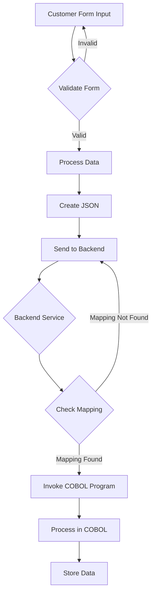

# Introduction

This document will walk you through the implementation of creating a customer.

The feature allows users to create a new customer by filling out a form, which is then processed and stored in the system.

We will cover:

1. How the form is structured and validated.
2. How the form data is processed on the server side.
3. How the data is sent to the backend service.
4. How the backend service is configured.
5. How the COBOL program processes the data.



# Form structure and validation

<SwmSnippet path="/src/Z-OS-Connect-Customer-Services-Interface/src/main/resources/templates/createCustomerForm.html" line="25">

---

The form for creating a customer is defined in the HTML template. It includes fields for customer name, address, and date of birth. Each field has validation to check for errors.

```
            <form class="bx--form-item form" action="/createcust" th:action="@{/createcust}"
                th:object="${createCustomerForm}" method="post">
                <table>
                    <tr>
                        <td>
                            <h1>Create Customer</h1>
                        </td>
                    </tr>
                    <tr>
                        <td>Customer Name:</td>
                        <td><input class="bx--text-input" type="text" th:field="*{custName}" /></td>
                        <td class="danger" th:if="${#fields.hasErrors('custName')}" th:errors="*{custName}">Customer
                            Name Error</td>
                    </tr>
                    <tr>
                        <td>Customer Address:</td>
                        <td><input class="bx--text-input" type="text" th:field="*{custAddress}" /></td>
                        <td class="danger" th:if="${#fields.hasErrors('custAddress')}" th:errors="*{custAddress}">
                            Customer
                            Address Error</td>
                    </tr>
                    <tr>
                        <td>Customer Date of Birth</td>
                        <td><input class="bx--date-picker" type="date" th:field="*{custDob}" /></td>
                        <td class="danger" th:if="${#fields.hasErrors('custDob')}" th:errors="*{custDob}">Date of Birth
                            error</td>
                    </tr>
                    <tr>
                        <td><button class="bx--btn bx--btn--primary" type="submit">Submit</button></td>
                    </tr>
                </table>
            </form>
```

---

</SwmSnippet>

# Form data processing

<SwmSnippet path="/src/Z-OS-Connect-Customer-Services-Interface/src/main/java/com/ibm/cics/cip/bank/springboot/customerservices/controllers/WebController.java" line="490">

---

When the form is submitted, the data is sent to the <SwmToken path="/src/Z-OS-Connect-Customer-Services-Interface/src/main/java/com/ibm/cics/cip/bank/springboot/customerservices/controllers/WebController.java" pos="490:5:6" line-data="	@PostMapping(&quot;/createcust&quot;)">`/createcust`</SwmToken> endpoint. The <SwmToken path="/src/Z-OS-Connect-Customer-Services-Interface/src/main/java/com/ibm/cics/cip/bank/springboot/customerservices/controllers/WebController.java" pos="491:5:5" line-data="	public String processCreateCust(@Valid CreateCustomerForm createCustForm,">`processCreateCust`</SwmToken> method in the <SwmToken path="/src/Z-OS-Connect-Payment-Interface/src/main/java/com/ibm/cics/cip/bank/springboot/paymentinterface/controllers/WebController.java" pos="34:4:4" line-data="public class WebController implements WebMvcConfigurer">`WebController`</SwmToken> handles this request. It checks for validation errors and returns the form if any errors are found.

```
	@PostMapping("/createcust")
	public String processCreateCust(@Valid CreateCustomerForm createCustForm,
			BindingResult bindingResult, Model model)
			throws JsonProcessingException
	{
		if (bindingResult.hasErrors())
		{
			return CREATE_CUSTOMER_FORM;
		}
```

---

</SwmSnippet>

# Sending data to backend service

<SwmSnippet path="/src/Z-OS-Connect-Customer-Services-Interface/src/main/java/com/ibm/cics/cip/bank/springboot/customerservices/controllers/WebController.java" line="508">

---

If the form data is valid, it is sent to the backend service using a <SwmToken path="/src/Z-OS-Connect-Customer-Services-Interface/src/main/java/com/ibm/cics/cip/bank/springboot/customerservices/controllers/WebController.java" pos="509:1:1" line-data="		WebClient client = WebClient">`WebClient`</SwmToken>. The client is configured to send a POST request to the <SwmPath>[src/zosconnect_artefacts/apis/creacc/api/insert/](/src/zosconnect_artefacts/apis/creacc/api/insert/)</SwmPath> endpoint with the form data in JSON format. The response is logged for debugging purposes.

```
		// The port is set elsewhere as it changes frequently
		WebClient client = WebClient
				.create(ConnectionInfo.getAddressAndPort() + "/crecust/insert");

		try
		{
			// Create a response object - body of json, accept json back, and
			// insert the
			// request body created a couple lines up
			ResponseSpec response = client.post()
					.header(CONTENT_TYPE, APPLICATION_JSON)
					.accept(MediaType.APPLICATION_JSON)
					.body(BodyInserters.fromValue(jsonString)).retrieve();
			String responseBody = response.bodyToMono(String.class).block();
			log.info("Response Body: \n{}", responseBody);
```

---

</SwmSnippet>

# Backend service configuration

<SwmSnippet path="/src/zosconnect_artefacts/apis/crecust/api/insert/POST/mapping.xml" line="1">

---

The backend service is configured using a service mapping XML file. This file defines the endpoint and the service name that handles the request.

```
<?xml version="1.0" encoding="UTF-8" standalone="yes"?>
<!--  Copyright IBM Corp. 2023   -->
<ns2:ZosConnectServiceMapping xmlns:ns2="http://www.ibm.com/zosConnect/2.0/zosConnectServiceMapping" mappingSpecVersion="1.0">
    <mappingContext basePath="/crecust" relativePath="/insert" method="POST" serviceName="CScustcre" defaultResponseCode="200"/>
    <requestMessage>
```

---

</SwmSnippet>

<SwmSnippet path="/src/zosconnect_artefacts/services/CScustcre/service.properties" line="8">

---

The service properties file specifies details such as the service type, executable name, and input/output configurations.

```
responseSIName=CRECUST.si
bidiConfigRef=
servicetype=cicsCommarea
initializeInputFields=false
requestSIName=CRECUST.si
executableName=CRECUST
trimOutputTrailingWhitespace=true
```

---

</SwmSnippet>

# COBOL program processing

<SwmSnippet path="/src/base/cobol_src/CRECUST.cbl" line="354">

---

The COBOL program <SwmPath>[src/base/cobol_src/CRECUST.cbl](/src/base/cobol_src/CRECUST.cbl)</SwmPath> processes the data. It includes logic to move the sort code and derive the date and time.

```
       PREMIERE SECTION.
       P010.

           MOVE SORTCODE TO REQUIRED-SORT-CODE.


      *
      *    Derive the date and time
      *

           PERFORM POPULATE-TIME-DATE.
```

---

</SwmSnippet>

This concludes the walkthrough of the "Creating a customer" feature. Each part of the implementation is connected to ensure that user input is validated, processed, and stored correctly.

<SwmMeta version="3.0.0" repo-id="Z2l0aHViJTNBJTNBY2ljcy1iYW5raW5nLXNhbXBsZS1hcHBsaWNhdGlvbi1jYnNhLUlCTS1EZW1vJTNBJTNBU3dpbW0tRGVtbw==" repo-name="cics-banking-sample-application-cbsa-IBM-Demo"><sup>Powered by [Swimm](https://staging.swimm.cloud/)</sup></SwmMeta>
