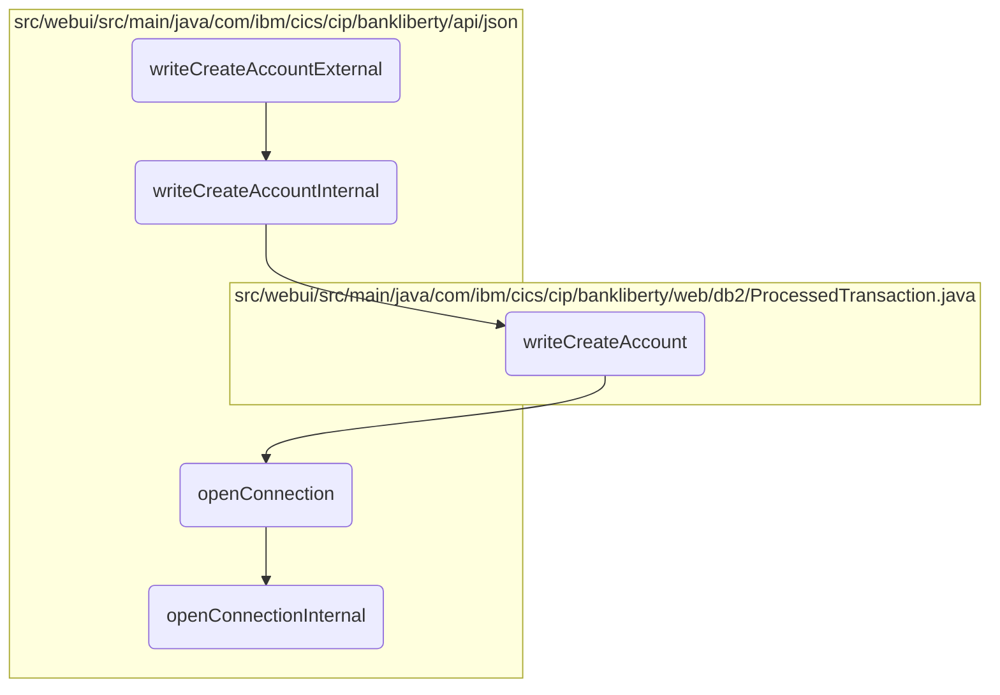

In this document, we will explain the process of creating a new account. The process involves receiving account details, processing these details, and inserting the new account information into the database.

The flow starts with receiving the account details in JSON format. These details are then processed to ensure they are correct and complete. After processing, the account information is inserted into the database. If the insertion is successful, a confirmation response is sent back; otherwise, an error response is returned.

# Flow drill down



<SwmSnippet path="/src/webui/src/main/java/com/ibm/cics/cip/bankliberty/api/json/ProcessedTransactionResource.java" line="449">

---

## <SwmToken path="src/webui/src/main/java/com/ibm/cics/cip/bankliberty/api/json/ProcessedTransactionResource.java" pos="454:5:5" line-data="	public Response writeCreateAccountExternal(">`writeCreateAccountExternal`</SwmToken>

First, the <SwmToken path="src/webui/src/main/java/com/ibm/cics/cip/bankliberty/api/json/ProcessedTransactionResource.java" pos="454:5:5" line-data="	public Response writeCreateAccountExternal(">`writeCreateAccountExternal`</SwmToken> method is called to initiate the account creation process. It receives the account details in JSON format and calls the <SwmToken path="src/webui/src/main/java/com/ibm/cics/cip/bankliberty/api/json/ProcessedTransactionResource.java" pos="457:7:7" line-data="		Response myResponse = writeCreateAccountInternal(myCreatedAccount);">`writeCreateAccountInternal`</SwmToken> method to process these details. After processing, it terminates the database access object.

```java
	@POST
	@Produces("application/json")
	@Consumes(MediaType.APPLICATION_JSON)
	@Path("/createAccount")

	public Response writeCreateAccountExternal(
			ProcessedTransactionAccountJSON myCreatedAccount)
	{
		Response myResponse = writeCreateAccountInternal(myCreatedAccount);
		HBankDataAccess myHBankDataAccess = new HBankDataAccess();
		myHBankDataAccess.terminate();
		return myResponse;
	}
```

---

</SwmSnippet>

<SwmSnippet path="/src/webui/src/main/java/com/ibm/cics/cip/bankliberty/api/json/ProcessedTransactionResource.java" line="464">

---

## <SwmToken path="src/webui/src/main/java/com/ibm/cics/cip/bankliberty/api/json/ProcessedTransactionResource.java" pos="464:5:5" line-data="	public Response writeCreateAccountInternal(">`writeCreateAccountInternal`</SwmToken>

Next, the <SwmToken path="src/webui/src/main/java/com/ibm/cics/cip/bankliberty/api/json/ProcessedTransactionResource.java" pos="464:5:5" line-data="	public Response writeCreateAccountInternal(">`writeCreateAccountInternal`</SwmToken> method processes the account details by calling the <SwmToken path="src/webui/src/main/java/com/ibm/cics/cip/bankliberty/api/json/ProcessedTransactionResource.java" pos="468:6:6" line-data="		if (myProcessedTransactionDB2.writeCreateAccount(">`writeCreateAccount`</SwmToken> method. It checks if the account creation was successful and returns an appropriate response.

```java
	public Response writeCreateAccountInternal(
			ProcessedTransactionAccountJSON myCreatedAccount)
	{
		com.ibm.cics.cip.bankliberty.web.db2.ProcessedTransaction myProcessedTransactionDB2 = new com.ibm.cics.cip.bankliberty.web.db2.ProcessedTransaction();
		if (myProcessedTransactionDB2.writeCreateAccount(
				myCreatedAccount.getSortCode(),
				myCreatedAccount.getAccountNumber(),
				myCreatedAccount.getActualBalance(),
				myCreatedAccount.getLastStatement(),
				myCreatedAccount.getNextStatement(),
				myCreatedAccount.getCustomerNumber(),
				myCreatedAccount.getType()))
		{
			return Response.ok().build();
		}
		else
		{
			return Response.serverError().build();
		}

	}
```

---

</SwmSnippet>

<SwmSnippet path="/src/webui/src/main/java/com/ibm/cics/cip/bankliberty/web/db2/ProcessedTransaction.java" line="815">

---

## <SwmToken path="src/webui/src/main/java/com/ibm/cics/cip/bankliberty/web/db2/ProcessedTransaction.java" pos="815:5:5" line-data="	public boolean writeCreateAccount(String sortCode2, String accountNumber,">`writeCreateAccount`</SwmToken>

Then, the <SwmToken path="src/webui/src/main/java/com/ibm/cics/cip/bankliberty/web/db2/ProcessedTransaction.java" pos="815:5:5" line-data="	public boolean writeCreateAccount(String sortCode2, String accountNumber,">`writeCreateAccount`</SwmToken> method handles the actual database operations. It prepares the account details, opens a database connection, and inserts the new account information into the database. If the insertion is successful, it returns true; otherwise, it returns false.

```java
	public boolean writeCreateAccount(String sortCode2, String accountNumber,
			BigDecimal actualBalance, Date lastStatement, Date nextStatement,
			String customerNumber, String accountType)
	{
		logger.entering(this.getClass().getName(), WRITE_CREATE_ACCOUNT);

		sortOutDateTimeTaskString();

		PROCTRAN myPROCTRAN = new PROCTRAN();

		Calendar myCalendar = Calendar.getInstance();
		myCalendar.setTime(lastStatement);

		myPROCTRAN.setProcDescDelaccLastDd(myCalendar.get(Calendar.DATE));
		myPROCTRAN.setProcDescDelaccLastMm(myCalendar.get(Calendar.MONTH) + 1);
		myPROCTRAN.setProcDescDelaccLastYyyy(myCalendar.get(Calendar.YEAR));

		myCalendar.setTime(nextStatement);
		myPROCTRAN.setProcDescDelaccNextDd(myCalendar.get(Calendar.DATE));
		myPROCTRAN.setProcDescDelaccNextMm(myCalendar.get(Calendar.MONTH) + 1);
		myPROCTRAN.setProcDescDelaccNextYyyy(myCalendar.get(Calendar.YEAR));
```

---

</SwmSnippet>

<SwmSnippet path="/src/webui/src/main/java/com/ibm/cics/cip/bankliberty/api/json/HBankDataAccess.java" line="69">

---

## <SwmToken path="src/webui/src/main/java/com/ibm/cics/cip/bankliberty/api/json/HBankDataAccess.java" pos="69:5:5" line-data="	protected void openConnection()">`openConnection`</SwmToken>

Going into the <SwmToken path="src/webui/src/main/java/com/ibm/cics/cip/bankliberty/api/json/HBankDataAccess.java" pos="69:5:5" line-data="	protected void openConnection()">`openConnection`</SwmToken> method, it ensures that a connection to the <SwmToken path="src/webui/src/main/java/com/ibm/cics/cip/bankliberty/api/json/HBankDataAccess.java" pos="71:13:13" line-data="		// Open a connection to the DB2 database">`DB2`</SwmToken> database is established. If a connection already exists, it reuses it; otherwise, it creates a new one by calling <SwmToken path="src/webui/src/main/java/com/ibm/cics/cip/bankliberty/api/json/HBankDataAccess.java" pos="87:1:1" line-data="			openConnectionInternal();">`openConnectionInternal`</SwmToken>.

```java
	protected void openConnection()
	{
		// Open a connection to the DB2 database
		logger.entering(this.getClass().getName(), "openConnection()");

		Integer taskNumberInteger = Task.getTask().getTaskNumber();
		String db2ConnString = DB2CONN.concat(taskNumberInteger.toString());
		logger.log(Level.FINE,
				() -> "Attempting to get DB2CONN for task number "
						+ taskNumberInteger.toString());
		this.conn = (Connection) cornedBeef.get(db2ConnString);
		if (this.conn == null)
		{
			HBankDataAccess.incrementConnCount();
			logger.log(Level.FINE,
					() -> "Attempting to create DB2CONN for task number "
							+ taskNumberInteger.toString());
			// Attempt to open a connection
			openConnectionInternal();
			logger.log(Level.FINE,
					() -> "Creation succcessful for DB2CONN for task number "
```

---

</SwmSnippet>

<SwmSnippet path="/src/webui/src/main/java/com/ibm/cics/cip/bankliberty/api/json/HBankDataAccess.java" line="162">

---

## <SwmToken path="src/webui/src/main/java/com/ibm/cics/cip/bankliberty/api/json/HBankDataAccess.java" pos="163:3:3" line-data="	void openConnectionInternal()">`openConnectionInternal`</SwmToken>

Finally, the <SwmToken path="src/webui/src/main/java/com/ibm/cics/cip/bankliberty/api/json/HBankDataAccess.java" pos="163:3:3" line-data="	void openConnectionInternal()">`openConnectionInternal`</SwmToken> method attempts to get a new database connection using JNDI lookup. If successful, it sets the transaction isolation level and stores the connection for reuse.

```java
	@SuppressWarnings("unchecked")
	void openConnectionInternal()
	{
		logger.entering(this.getClass().getName(), "openConnectionInternal");
		String jndiString = "jdbc/defaultCICSDataSource";
		Context ctx;

		try
		{
			ctx = new InitialContext();
			DataSource ds = (DataSource) ctx.lookup(jndiString);
			logger.log(Level.FINE, () -> "jndi string is " + jndiString);
			// If there is no current connection
			if (this.conn == null)
			{
				logger.log(Level.FINE,
						() -> "About to attempt to get DB2 connection");
				// Try and get a connection
				this.conn = ds.getConnection();
				this.conn.setTransactionIsolation(
						Connection.TRANSACTION_READ_UNCOMMITTED);
```

---

</SwmSnippet>

&nbsp;

*This is an auto-generated document by Swimm 🌊 and has not yet been verified by a human*

<SwmMeta version="3.0.0" repo-id="Z2l0aHViJTNBJTNBY2ljcy1iYW5raW5nLXNhbXBsZS1hcHBsaWNhdGlvbi1jYnNhLUlCTS1EZW1vJTNBJTNBU3dpbW0tRGVtbw==" repo-name="cics-banking-sample-application-cbsa-IBM-Demo"><sup>Powered by [Swimm](/)</sup></SwmMeta>
