```mermaid
graph TD
  subgraph writeCreateAccountInternal
    writeCreateAccountInternal:A["Initialize ProcessedTransaction instance"] --> writeCreateAccountInternal:B["Call writeCreateAccount with account details"]
    writeCreateAccountInternal:B --> |Success| writeCreateAccountInternal:C["Return Response.ok"]
    writeCreateAccountInternal:B --> |Failure| writeCreateAccountInternal:D["Return Response.serverError"]
  end
  subgraph writeCreateAccount
    writeCreateAccount:A["Log entry into function"] --> writeCreateAccount:B["Set up date and time"] --> writeCreateAccount:C["Initialize PROCTRAN instance"]
    writeCreateAccount:C --> writeCreateAccount:D["Set transaction details"]
    writeCreateAccount:D --> writeCreateAccount:E["Open database connection"]
    writeCreateAccount:E --> writeCreateAccount:F["Prepare and execute SQL insert statement"]
    writeCreateAccount:F -->|Success| writeCreateAccount:G["Return true"]
    writeCreateAccount:F -->|SQL Exception| writeCreateAccount:H["Log error and return false"]
  end
  writeCreateAccountInternal:B --> writeCreateAccount

%% Swimm:
%% graph TD
%%   subgraph <SwmToken path="src/webui/src/main/java/com/ibm/cics/cip/bankliberty/api/json/ProcessedTransactionResource.java" pos="457:7:7" line-data="		Response myResponse = writeCreateAccountInternal(myCreatedAccount);">`writeCreateAccountInternal`</SwmToken>
%%     <SwmToken path="src/webui/src/main/java/com/ibm/cics/cip/bankliberty/api/json/ProcessedTransactionResource.java" pos="457:7:7" line-data="		Response myResponse = writeCreateAccountInternal(myCreatedAccount);">`writeCreateAccountInternal`</SwmToken>:A["Initialize <SwmToken path="src/webui/src/main/java/com/ibm/cics/cip/bankliberty/api/json/ProcessedTransactionResource.java" pos="467:15:15" line-data="		com.ibm.cics.cip.bankliberty.web.db2.ProcessedTransaction myProcessedTransactionDB2 = new com.ibm.cics.cip.bankliberty.web.db2.ProcessedTransaction();">`ProcessedTransaction`</SwmToken> instance"] --> <SwmToken path="src/webui/src/main/java/com/ibm/cics/cip/bankliberty/api/json/ProcessedTransactionResource.java" pos="457:7:7" line-data="		Response myResponse = writeCreateAccountInternal(myCreatedAccount);">`writeCreateAccountInternal`</SwmToken>:B["Call <SwmToken path="src/webui/src/main/java/com/ibm/cics/cip/bankliberty/api/json/ProcessedTransactionResource.java" pos="468:6:6" line-data="		if (myProcessedTransactionDB2.writeCreateAccount(">`writeCreateAccount`</SwmToken> with account details"]
%%     <SwmToken path="src/webui/src/main/java/com/ibm/cics/cip/bankliberty/api/json/ProcessedTransactionResource.java" pos="457:7:7" line-data="		Response myResponse = writeCreateAccountInternal(myCreatedAccount);">`writeCreateAccountInternal`</SwmToken>:B --> |Success| <SwmToken path="src/webui/src/main/java/com/ibm/cics/cip/bankliberty/api/json/ProcessedTransactionResource.java" pos="457:7:7" line-data="		Response myResponse = writeCreateAccountInternal(myCreatedAccount);">`writeCreateAccountInternal`</SwmToken>:C["Return <SwmToken path="src/webui/src/main/java/com/ibm/cics/cip/bankliberty/api/json/ProcessedTransactionResource.java" pos="281:3:5" line-data="				return Response.ok().build();">`Response.ok`</SwmToken>"]
%%     <SwmToken path="src/webui/src/main/java/com/ibm/cics/cip/bankliberty/api/json/ProcessedTransactionResource.java" pos="457:7:7" line-data="		Response myResponse = writeCreateAccountInternal(myCreatedAccount);">`writeCreateAccountInternal`</SwmToken>:B --> |Failure| <SwmToken path="src/webui/src/main/java/com/ibm/cics/cip/bankliberty/api/json/ProcessedTransactionResource.java" pos="457:7:7" line-data="		Response myResponse = writeCreateAccountInternal(myCreatedAccount);">`writeCreateAccountInternal`</SwmToken>:D["Return <SwmToken path="src/webui/src/main/java/com/ibm/cics/cip/bankliberty/api/json/ProcessedTransactionResource.java" pos="286:3:5" line-data="				return Response.serverError().build();">`Response.serverError`</SwmToken>"]
%%   end
%%   subgraph <SwmToken path="src/webui/src/main/java/com/ibm/cics/cip/bankliberty/api/json/ProcessedTransactionResource.java" pos="468:6:6" line-data="		if (myProcessedTransactionDB2.writeCreateAccount(">`writeCreateAccount`</SwmToken>
%%     <SwmToken path="src/webui/src/main/java/com/ibm/cics/cip/bankliberty/api/json/ProcessedTransactionResource.java" pos="468:6:6" line-data="		if (myProcessedTransactionDB2.writeCreateAccount(">`writeCreateAccount`</SwmToken>:A["Log entry into function"] --> <SwmToken path="src/webui/src/main/java/com/ibm/cics/cip/bankliberty/api/json/ProcessedTransactionResource.java" pos="468:6:6" line-data="		if (myProcessedTransactionDB2.writeCreateAccount(">`writeCreateAccount`</SwmToken>:B["Set up date and time"] --> <SwmToken path="src/webui/src/main/java/com/ibm/cics/cip/bankliberty/api/json/ProcessedTransactionResource.java" pos="468:6:6" line-data="		if (myProcessedTransactionDB2.writeCreateAccount(">`writeCreateAccount`</SwmToken>:C["Initialize PROCTRAN instance"]
%%     <SwmToken path="src/webui/src/main/java/com/ibm/cics/cip/bankliberty/api/json/ProcessedTransactionResource.java" pos="468:6:6" line-data="		if (myProcessedTransactionDB2.writeCreateAccount(">`writeCreateAccount`</SwmToken>:C --> <SwmToken path="src/webui/src/main/java/com/ibm/cics/cip/bankliberty/api/json/ProcessedTransactionResource.java" pos="468:6:6" line-data="		if (myProcessedTransactionDB2.writeCreateAccount(">`writeCreateAccount`</SwmToken>:D["Set transaction details"]
%%     <SwmToken path="src/webui/src/main/java/com/ibm/cics/cip/bankliberty/api/json/ProcessedTransactionResource.java" pos="468:6:6" line-data="		if (myProcessedTransactionDB2.writeCreateAccount(">`writeCreateAccount`</SwmToken>:D --> <SwmToken path="src/webui/src/main/java/com/ibm/cics/cip/bankliberty/api/json/ProcessedTransactionResource.java" pos="468:6:6" line-data="		if (myProcessedTransactionDB2.writeCreateAccount(">`writeCreateAccount`</SwmToken>:E["Open database connection"]
%%     <SwmToken path="src/webui/src/main/java/com/ibm/cics/cip/bankliberty/api/json/ProcessedTransactionResource.java" pos="468:6:6" line-data="		if (myProcessedTransactionDB2.writeCreateAccount(">`writeCreateAccount`</SwmToken>:E --> <SwmToken path="src/webui/src/main/java/com/ibm/cics/cip/bankliberty/api/json/ProcessedTransactionResource.java" pos="468:6:6" line-data="		if (myProcessedTransactionDB2.writeCreateAccount(">`writeCreateAccount`</SwmToken>:F["Prepare and execute SQL insert statement"]
%%     <SwmToken path="src/webui/src/main/java/com/ibm/cics/cip/bankliberty/api/json/ProcessedTransactionResource.java" pos="468:6:6" line-data="		if (myProcessedTransactionDB2.writeCreateAccount(">`writeCreateAccount`</SwmToken>:F -->|Success| <SwmToken path="src/webui/src/main/java/com/ibm/cics/cip/bankliberty/api/json/ProcessedTransactionResource.java" pos="468:6:6" line-data="		if (myProcessedTransactionDB2.writeCreateAccount(">`writeCreateAccount`</SwmToken>:G["Return true"]
%%     <SwmToken path="src/webui/src/main/java/com/ibm/cics/cip/bankliberty/api/json/ProcessedTransactionResource.java" pos="468:6:6" line-data="		if (myProcessedTransactionDB2.writeCreateAccount(">`writeCreateAccount`</SwmToken>:F -->|SQL Exception| <SwmToken path="src/webui/src/main/java/com/ibm/cics/cip/bankliberty/api/json/ProcessedTransactionResource.java" pos="468:6:6" line-data="		if (myProcessedTransactionDB2.writeCreateAccount(">`writeCreateAccount`</SwmToken>:H["Log error and return false"]
%%   end
%%   <SwmToken path="src/webui/src/main/java/com/ibm/cics/cip/bankliberty/api/json/ProcessedTransactionResource.java" pos="457:7:7" line-data="		Response myResponse = writeCreateAccountInternal(myCreatedAccount);">`writeCreateAccountInternal`</SwmToken>:B --> <SwmToken path="src/webui/src/main/java/com/ibm/cics/cip/bankliberty/api/json/ProcessedTransactionResource.java" pos="468:6:6" line-data="		if (myProcessedTransactionDB2.writeCreateAccount(">`writeCreateAccount`</SwmToken>
```

In this document, we will explain the process of creating a new bank account. The process involves handling the account creation request, creating the account internally, terminating the data access, and returning the response.

The flow starts with handling the account creation request, where the necessary details for the new account are received. Next, the account is created internally by interacting with the database. After that, any resources or connections used during the process are properly closed and cleaned up. Finally, the response indicating the result of the account creation request is sent back to the client.

Here is a high level diagram of the flow, showing only the most important functions:

```mermaid
graph TD;
      subgraph srcwebuisrcmainjavacomibmcicscipbankliberty[src/…/cip/bankliberty]
0213db261f56f30b55483693b74eccc443ab3e4fec4df4e94e5a1f620aeb1877(ProcessedTransactionResource.writeCreateAccountExternal) --> 748c4019183096d56f8e3d84736e76da5004bbc2e7383769e8d76a22e492dee2(ProcessedTransactionResource.writeCreateAccountInternal)
end

subgraph srcwebuisrcmainjavacomibmcicscipbankliberty[src/…/cip/bankliberty]
748c4019183096d56f8e3d84736e76da5004bbc2e7383769e8d76a22e492dee2(ProcessedTransactionResource.writeCreateAccountInternal) --> aaa03461f505ff82544c189f6bc4a691844472f8ce506c56291a9c9e6bb61c63(ProcessedTransaction.writeCreateAccount)
end


      classDef mainFlowStyle color:#000000,fill:#7CB9F4
classDef rootsStyle color:#000000,fill:#00FFF4
classDef Style1 color:#000000,fill:#00FFAA
classDef Style2 color:#000000,fill:#FFFF00
classDef Style3 color:#000000,fill:#AA7CB9

%% Swimm:
%% graph TD;
%%       subgraph srcwebuisrcmainjavacomibmcicscipbankliberty[<SwmPath>[src/…/cip/bankliberty/](src/webui/src/main/java/com/ibm/cics/cip/bankliberty/)</SwmPath>]
%% 0213db261f56f30b55483693b74eccc443ab3e4fec4df4e94e5a1f620aeb1877(ProcessedTransactionResource.writeCreateAccountExternal) --> 748c4019183096d56f8e3d84736e76da5004bbc2e7383769e8d76a22e492dee2(ProcessedTransactionResource.writeCreateAccountInternal)
%% end
%% 
%% subgraph srcwebuisrcmainjavacomibmcicscipbankliberty[<SwmPath>[src/…/cip/bankliberty/](src/webui/src/main/java/com/ibm/cics/cip/bankliberty/)</SwmPath>]
%% 748c4019183096d56f8e3d84736e76da5004bbc2e7383769e8d76a22e492dee2(ProcessedTransactionResource.writeCreateAccountInternal) --> aaa03461f505ff82544c189f6bc4a691844472f8ce506c56291a9c9e6bb61c63(ProcessedTransaction.writeCreateAccount)
%% end
%% 
%% 
%%       classDef mainFlowStyle color:#000000,fill:#7CB9F4
%% classDef rootsStyle color:#000000,fill:#00FFF4
%% classDef Style1 color:#000000,fill:#00FFAA
%% classDef Style2 color:#000000,fill:#FFFF00
%% classDef Style3 color:#000000,fill:#AA7CB9
```



# Flow drill down

```mermaid
graph TD
  subgraph writeCreateAccountExternal
    writeCreateAccountExternal:A["Call writeCreateAccountInternal"] --> writeCreateAccountExternal:B["Create HBankDataAccess instance"]
    writeCreateAccountExternal:B --> writeCreateAccountExternal:C["Terminate HBankDataAccess"]
    writeCreateAccountExternal:A --> writeCreateAccountExternal:D["Return response"]
  end

%% Swimm:
%% graph TD
%%   subgraph <SwmToken path="src/webui/src/main/java/com/ibm/cics/cip/bankliberty/api/json/ProcessedTransactionResource.java" pos="454:5:5" line-data="	public Response writeCreateAccountExternal(">`writeCreateAccountExternal`</SwmToken>
%%     <SwmToken path="src/webui/src/main/java/com/ibm/cics/cip/bankliberty/api/json/ProcessedTransactionResource.java" pos="454:5:5" line-data="	public Response writeCreateAccountExternal(">`writeCreateAccountExternal`</SwmToken>:A["Call <SwmToken path="src/webui/src/main/java/com/ibm/cics/cip/bankliberty/api/json/ProcessedTransactionResource.java" pos="457:7:7" line-data="		Response myResponse = writeCreateAccountInternal(myCreatedAccount);">`writeCreateAccountInternal`</SwmToken>"] --> <SwmToken path="src/webui/src/main/java/com/ibm/cics/cip/bankliberty/api/json/ProcessedTransactionResource.java" pos="454:5:5" line-data="	public Response writeCreateAccountExternal(">`writeCreateAccountExternal`</SwmToken>:B["Create <SwmToken path="src/webui/src/main/java/com/ibm/cics/cip/bankliberty/api/json/ProcessedTransactionResource.java" pos="458:1:1" line-data="		HBankDataAccess myHBankDataAccess = new HBankDataAccess();">`HBankDataAccess`</SwmToken> instance"]
%%     <SwmToken path="src/webui/src/main/java/com/ibm/cics/cip/bankliberty/api/json/ProcessedTransactionResource.java" pos="454:5:5" line-data="	public Response writeCreateAccountExternal(">`writeCreateAccountExternal`</SwmToken>:B --> <SwmToken path="src/webui/src/main/java/com/ibm/cics/cip/bankliberty/api/json/ProcessedTransactionResource.java" pos="454:5:5" line-data="	public Response writeCreateAccountExternal(">`writeCreateAccountExternal`</SwmToken>:C["Terminate <SwmToken path="src/webui/src/main/java/com/ibm/cics/cip/bankliberty/api/json/ProcessedTransactionResource.java" pos="458:1:1" line-data="		HBankDataAccess myHBankDataAccess = new HBankDataAccess();">`HBankDataAccess`</SwmToken>"]
%%     <SwmToken path="src/webui/src/main/java/com/ibm/cics/cip/bankliberty/api/json/ProcessedTransactionResource.java" pos="454:5:5" line-data="	public Response writeCreateAccountExternal(">`writeCreateAccountExternal`</SwmToken>:A --> <SwmToken path="src/webui/src/main/java/com/ibm/cics/cip/bankliberty/api/json/ProcessedTransactionResource.java" pos="454:5:5" line-data="	public Response writeCreateAccountExternal(">`writeCreateAccountExternal`</SwmToken>:D["Return response"]
%%   end
```

## Exploring <SwmToken path="src/webui/src/main/java/com/ibm/cics/cip/bankliberty/api/json/ProcessedTransactionResource.java" pos="454:5:5" line-data="	public Response writeCreateAccountExternal(">`writeCreateAccountExternal`</SwmToken>



<SwmSnippet path="/src/webui/src/main/java/com/ibm/cics/cip/bankliberty/api/json/ProcessedTransactionResource.java" line="449">

---

## Handling the account creation request

First, the <SwmToken path="src/webui/src/main/java/com/ibm/cics/cip/bankliberty/api/json/ProcessedTransactionResource.java" pos="454:5:5" line-data="	public Response writeCreateAccountExternal(">`writeCreateAccountExternal`</SwmToken> method is responsible for handling the incoming request to create a new bank account. It consumes a <SwmToken path="src/webui/src/main/java/com/ibm/cics/cip/bankliberty/api/json/ProcessedTransactionResource.java" pos="455:1:1" line-data="			ProcessedTransactionAccountJSON myCreatedAccount)">`ProcessedTransactionAccountJSON`</SwmToken> object that contains all the necessary details for the new account, such as sort code, account number, actual balance, last statement date, next statement date, customer number, and account type.

```java
	@POST
	@Produces("application/json")
	@Consumes(MediaType.APPLICATION_JSON)
	@Path("/createAccount")

	public Response writeCreateAccountExternal(
			ProcessedTransactionAccountJSON myCreatedAccount)
	{
```

---

</SwmSnippet>

<SwmSnippet path="/src/webui/src/main/java/com/ibm/cics/cip/bankliberty/api/json/ProcessedTransactionResource.java" line="457">

---

## Creating the account internally

Next, the method calls <SwmToken path="src/webui/src/main/java/com/ibm/cics/cip/bankliberty/api/json/ProcessedTransactionResource.java" pos="457:7:7" line-data="		Response myResponse = writeCreateAccountInternal(myCreatedAccount);">`writeCreateAccountInternal`</SwmToken> with the provided account details. This internal method is responsible for the actual creation of the account in the database. It returns a <SwmToken path="src/webui/src/main/java/com/ibm/cics/cip/bankliberty/api/json/ProcessedTransactionResource.java" pos="457:1:1" line-data="		Response myResponse = writeCreateAccountInternal(myCreatedAccount);">`Response`</SwmToken> object indicating whether the account creation was successful (HTTP 200) or if there was a server error (HTTP 500).

```java
		Response myResponse = writeCreateAccountInternal(myCreatedAccount);
```

---

</SwmSnippet>

<SwmSnippet path="/src/webui/src/main/java/com/ibm/cics/cip/bankliberty/api/json/ProcessedTransactionResource.java" line="458">

---

## Terminating the data access

Then, an instance of <SwmToken path="src/webui/src/main/java/com/ibm/cics/cip/bankliberty/api/json/ProcessedTransactionResource.java" pos="458:1:1" line-data="		HBankDataAccess myHBankDataAccess = new HBankDataAccess();">`HBankDataAccess`</SwmToken> is created and its <SwmToken path="src/webui/src/main/java/com/ibm/cics/cip/bankliberty/api/json/ProcessedTransactionResource.java" pos="459:3:3" line-data="		myHBankDataAccess.terminate();">`terminate`</SwmToken> method is called. This step ensures that any resources or connections used during the account creation process are properly closed and cleaned up.

```java
		HBankDataAccess myHBankDataAccess = new HBankDataAccess();
		myHBankDataAccess.terminate();
```

---

</SwmSnippet>

<SwmSnippet path="/src/webui/src/main/java/com/ibm/cics/cip/bankliberty/api/json/ProcessedTransactionResource.java" line="460">

---

## Returning the response

Finally, the method returns the <SwmToken path="src/webui/src/main/java/com/ibm/cics/cip/bankliberty/api/json/ProcessedTransactionResource.java" pos="454:3:3" line-data="	public Response writeCreateAccountExternal(">`Response`</SwmToken> object obtained from the <SwmToken path="src/webui/src/main/java/com/ibm/cics/cip/bankliberty/api/json/ProcessedTransactionResource.java" pos="457:7:7" line-data="		Response myResponse = writeCreateAccountInternal(myCreatedAccount);">`writeCreateAccountInternal`</SwmToken> call. This response is sent back to the client, indicating the result of the account creation request.

```java
		return myResponse;
	}
```

---

</SwmSnippet>

## Inside <SwmToken path="src/webui/src/main/java/com/ibm/cics/cip/bankliberty/api/json/ProcessedTransactionResource.java" pos="457:7:7" line-data="		Response myResponse = writeCreateAccountInternal(myCreatedAccount);">`writeCreateAccountInternal`</SwmToken> & <SwmToken path="src/webui/src/main/java/com/ibm/cics/cip/bankliberty/api/json/ProcessedTransactionResource.java" pos="468:6:6" line-data="		if (myProcessedTransactionDB2.writeCreateAccount(">`writeCreateAccount`</SwmToken>



<SwmSnippet path="/src/webui/src/main/java/com/ibm/cics/cip/bankliberty/api/json/ProcessedTransactionResource.java" line="464">

---

## Handling the creation of a new bank account

First, the <SwmToken path="src/webui/src/main/java/com/ibm/cics/cip/bankliberty/api/json/ProcessedTransactionResource.java" pos="464:5:5" line-data="	public Response writeCreateAccountInternal(">`writeCreateAccountInternal`</SwmToken> method is called to handle the creation of a new bank account. This method receives the account details in the form of a <SwmToken path="src/webui/src/main/java/com/ibm/cics/cip/bankliberty/api/json/ProcessedTransactionResource.java" pos="465:1:1" line-data="			ProcessedTransactionAccountJSON myCreatedAccount)">`ProcessedTransactionAccountJSON`</SwmToken> object.

```java
	public Response writeCreateAccountInternal(
			ProcessedTransactionAccountJSON myCreatedAccount)
```

---

</SwmSnippet>

<SwmSnippet path="/src/webui/src/main/java/com/ibm/cics/cip/bankliberty/api/json/ProcessedTransactionResource.java" line="467">

---

Next, the method creates an instance of <SwmToken path="src/webui/src/main/java/com/ibm/cics/cip/bankliberty/api/json/ProcessedTransactionResource.java" pos="467:15:15" line-data="		com.ibm.cics.cip.bankliberty.web.db2.ProcessedTransaction myProcessedTransactionDB2 = new com.ibm.cics.cip.bankliberty.web.db2.ProcessedTransaction();">`ProcessedTransaction`</SwmToken> to interact with the database.

```java
		com.ibm.cics.cip.bankliberty.web.db2.ProcessedTransaction myProcessedTransactionDB2 = new com.ibm.cics.cip.bankliberty.web.db2.ProcessedTransaction();
```

---

</SwmSnippet>

<SwmSnippet path="/src/webui/src/main/java/com/ibm/cics/cip/bankliberty/api/json/ProcessedTransactionResource.java" line="468">

---

Then, it calls the <SwmToken path="src/webui/src/main/java/com/ibm/cics/cip/bankliberty/api/json/ProcessedTransactionResource.java" pos="468:6:6" line-data="		if (myProcessedTransactionDB2.writeCreateAccount(">`writeCreateAccount`</SwmToken> method of the <SwmToken path="src/webui/src/main/java/com/ibm/cics/cip/bankliberty/api/json/ProcessedTransactionResource.java" pos="467:15:15" line-data="		com.ibm.cics.cip.bankliberty.web.db2.ProcessedTransaction myProcessedTransactionDB2 = new com.ibm.cics.cip.bankliberty.web.db2.ProcessedTransaction();">`ProcessedTransaction`</SwmToken> class, passing the necessary account details such as sort code, account number, actual balance, last statement date, next statement date, customer number, and account type.

```java
		if (myProcessedTransactionDB2.writeCreateAccount(
				myCreatedAccount.getSortCode(),
				myCreatedAccount.getAccountNumber(),
				myCreatedAccount.getActualBalance(),
				myCreatedAccount.getLastStatement(),
				myCreatedAccount.getNextStatement(),
				myCreatedAccount.getCustomerNumber(),
				myCreatedAccount.getType()))
```

---

</SwmSnippet>

<SwmSnippet path="/src/webui/src/main/java/com/ibm/cics/cip/bankliberty/web/db2/ProcessedTransaction.java" line="815">

---

Moving to the <SwmToken path="src/webui/src/main/java/com/ibm/cics/cip/bankliberty/web/db2/ProcessedTransaction.java" pos="815:5:5" line-data="	public boolean writeCreateAccount(String sortCode2, String accountNumber,">`writeCreateAccount`</SwmToken> method, it first logs the entry into the method and prepares the transaction details.

```java
	public boolean writeCreateAccount(String sortCode2, String accountNumber,
			BigDecimal actualBalance, Date lastStatement, Date nextStatement,
			String customerNumber, String accountType)
	{
		logger.entering(this.getClass().getName(), WRITE_CREATE_ACCOUNT);

		sortOutDateTimeTaskString();
```

---

</SwmSnippet>

<SwmSnippet path="/src/webui/src/main/java/com/ibm/cics/cip/bankliberty/web/db2/ProcessedTransaction.java" line="825">

---

Next, it sets up the transaction details, including the last and next statement dates, account type, and customer number.

```java
		Calendar myCalendar = Calendar.getInstance();
		myCalendar.setTime(lastStatement);

		myPROCTRAN.setProcDescDelaccLastDd(myCalendar.get(Calendar.DATE));
		myPROCTRAN.setProcDescDelaccLastMm(myCalendar.get(Calendar.MONTH) + 1);
		myPROCTRAN.setProcDescDelaccLastYyyy(myCalendar.get(Calendar.YEAR));

		myCalendar.setTime(nextStatement);
		myPROCTRAN.setProcDescDelaccNextDd(myCalendar.get(Calendar.DATE));
		myPROCTRAN.setProcDescDelaccNextMm(myCalendar.get(Calendar.MONTH) + 1);
		myPROCTRAN.setProcDescDelaccNextYyyy(myCalendar.get(Calendar.YEAR));

		myPROCTRAN.setProcDescCreaccAcctype(accountType);
		myPROCTRAN.setProcDescCreaccCustomer(Integer.parseInt(customerNumber));
		myPROCTRAN.setProcDescCreaccFooter(PROCTRAN.PROC_DESC_CREACC_FLAG);
```

---

</SwmSnippet>

<SwmSnippet path="/src/webui/src/main/java/com/ibm/cics/cip/bankliberty/web/db2/ProcessedTransaction.java" line="843">

---

Then, it opens a connection to the database and prepares the SQL insert statement to create the new account.

```java
		openConnection();

		logger.log(Level.FINE, () -> ABOUT_TO_INSERT + SQL_INSERT + ">");
		try (PreparedStatement stmt = conn.prepareStatement(SQL_INSERT);)
```

---

</SwmSnippet>

<SwmSnippet path="/src/webui/src/main/java/com/ibm/cics/cip/bankliberty/web/db2/ProcessedTransaction.java" line="847">

---

Finally, it executes the SQL insert statement. If the operation is successful, it returns true; otherwise, it handles any SQL exceptions and returns false.

```java
		{
			stmt.setString(1, PROCTRAN.PROC_TRAN_VALID);
			stmt.setString(2, sortCode2);
			stmt.setString(3,
					String.format("%08d", Integer.parseInt(accountNumber)));
			stmt.setString(4, dateString);
			stmt.setString(5, timeString);
			stmt.setString(6, taskRef);
			stmt.setString(7, PROCTRAN.PROC_TY_WEB_CREATE_ACCOUNT);
			stmt.setString(8, descriptionForCreatedAccount);
			stmt.setBigDecimal(9,
					actualBalance.setScale(2, RoundingMode.HALF_UP));
			stmt.executeUpdate();
		}
		catch (SQLException e)
		{
			logger.severe(e.getLocalizedMessage());
			logger.exiting(this.getClass().getName(), WRITE_CREATE_ACCOUNT,
					false);
			return false;
		}
```

---

</SwmSnippet>

&nbsp;

*This is an auto-generated document by Swimm 🌊 and has not yet been verified by a human*

<SwmMeta version="3.0.0" repo-id="Z2l0aHViJTNBJTNBY2ljcy1iYW5raW5nLXNhbXBsZS1hcHBsaWNhdGlvbi1jYnNhLUlCTS1EZW1vJTNBJTNBU3dpbW0tRGVtbw==" repo-name="cics-banking-sample-application-cbsa-IBM-Demo"><sup>Powered by [Swimm](/)</sup></SwmMeta>
