This document explains the process of creating a new bank account. The process involves several steps, including retrieving customer accounts, checking account limits, creating the account in the database, and updating transaction records.

The flow starts by retrieving the customer's existing accounts to ensure the customer does not exceed the account limit. If the customer is eligible, a new account is created in the database. Finally, the transaction records are updated to reflect the new account creation.

# Where is this flow used?

This flow is used multiple times in the codebase as represented in the following diagram:

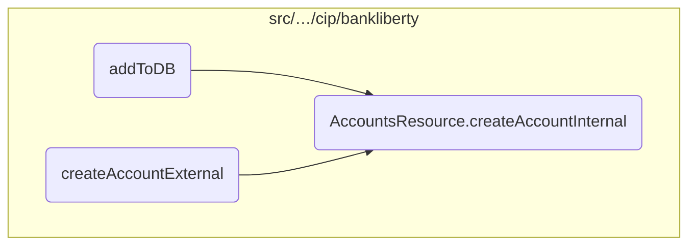

Here is a high level diagram of the flow, showing only the most important functions:

```mermaid
graph TD;
      subgraph srcwebuisrcmainjavacomibmcicscipbankliberty[src/…/cip/bankliberty]
015b7c2936895bf2dc74d68b2e5a32be0a673ff0ef3cecc3e97dc1c7565f4470(AccountsResource.createAccountInternal) --> 684eeaac8794ce5d410ff6628b5badf434d88acc2c317574d21ad654147bf93c(AccountsResource.getAccountsByCustomerInternal)
end

subgraph srcwebuisrcmainjavacomibmcicscipbankliberty[src/…/cip/bankliberty]
015b7c2936895bf2dc74d68b2e5a32be0a673ff0ef3cecc3e97dc1c7565f4470(AccountsResource.createAccountInternal) --> 99a07fb7789581a9b590979cba4b7d38b2d9d4b665725e733ae523ef5c0f5844(Account.createAccount)
end

subgraph srcwebuisrcmainjavacomibmcicscipbankliberty[src/…/cip/bankliberty]
684eeaac8794ce5d410ff6628b5badf434d88acc2c317574d21ad654147bf93c(AccountsResource.getAccountsByCustomerInternal) --> 53d95b332910897f8349c5da61ecfcad3f4d64e2cd786c22e72ad668a8accdc9(Account.getAccounts)
end


      classDef mainFlowStyle color:#000000,fill:#7CB9F4
classDef rootsStyle color:#000000,fill:#00FFF4
classDef Style1 color:#000000,fill:#00FFAA
classDef Style2 color:#000000,fill:#FFFF00
classDef Style3 color:#000000,fill:#AA7CB9

%% Swimm:
%% graph TD;
%%       subgraph srcwebuisrcmainjavacomibmcicscipbankliberty[<SwmPath>[src/…/cip/bankliberty/](src/webui/src/main/java/com/ibm/cics/cip/bankliberty/)</SwmPath>]
%% 015b7c2936895bf2dc74d68b2e5a32be0a673ff0ef3cecc3e97dc1c7565f4470(AccountsResource.createAccountInternal) --> 684eeaac8794ce5d410ff6628b5badf434d88acc2c317574d21ad654147bf93c(AccountsResource.getAccountsByCustomerInternal)
%% end
%% 
%% subgraph srcwebuisrcmainjavacomibmcicscipbankliberty[<SwmPath>[src/…/cip/bankliberty/](src/webui/src/main/java/com/ibm/cics/cip/bankliberty/)</SwmPath>]
%% 015b7c2936895bf2dc74d68b2e5a32be0a673ff0ef3cecc3e97dc1c7565f4470(AccountsResource.createAccountInternal) --> 99a07fb7789581a9b590979cba4b7d38b2d9d4b665725e733ae523ef5c0f5844(Account.createAccount)
%% end
%% 
%% subgraph srcwebuisrcmainjavacomibmcicscipbankliberty[<SwmPath>[src/…/cip/bankliberty/](src/webui/src/main/java/com/ibm/cics/cip/bankliberty/)</SwmPath>]
%% 684eeaac8794ce5d410ff6628b5badf434d88acc2c317574d21ad654147bf93c(AccountsResource.getAccountsByCustomerInternal) --> 53d95b332910897f8349c5da61ecfcad3f4d64e2cd786c22e72ad668a8accdc9(Account.getAccounts)
%% end
%% 
%% 
%%       classDef mainFlowStyle color:#000000,fill:#7CB9F4
%% classDef rootsStyle color:#000000,fill:#00FFF4
%% classDef Style1 color:#000000,fill:#00FFAA
%% classDef Style2 color:#000000,fill:#FFFF00
%% classDef Style3 color:#000000,fill:#AA7CB9
```

# Flow drill down

## Diving into the <SwmToken path="src/webui/src/main/java/com/ibm/cics/cip/bankliberty/api/json/AccountsResource.java" pos="57:14:14" line-data="	private static final String CREATE_ACCOUNT_INTERNAL = &quot;createAccountInternal(AccountJSON account)&quot;;">`createAccountInternal`</SwmToken> function

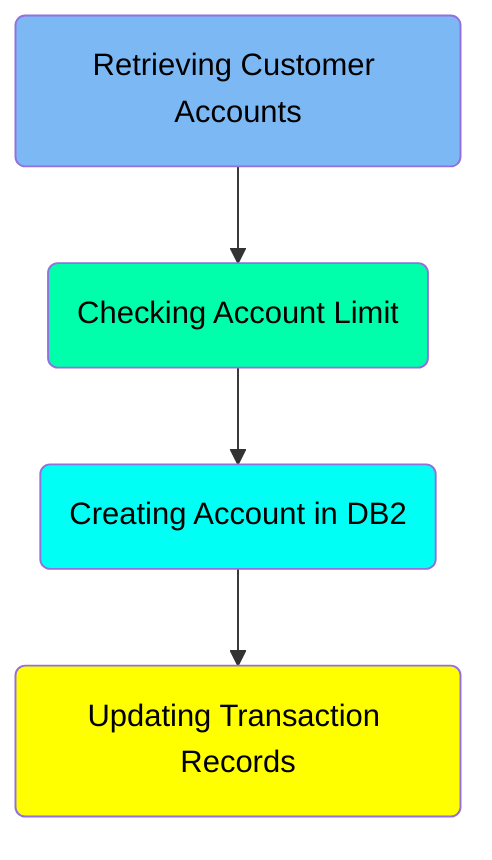

## <SwmToken path="src/webui/src/main/java/com/ibm/cics/cip/bankliberty/api/json/AccountsResource.java" pos="57:14:14" line-data="	private static final String CREATE_ACCOUNT_INTERNAL = &quot;createAccountInternal(AccountJSON account)&quot;;">`createAccountInternal`</SwmToken> function - Retrieving Customer Accounts

Here is a diagram of this part:

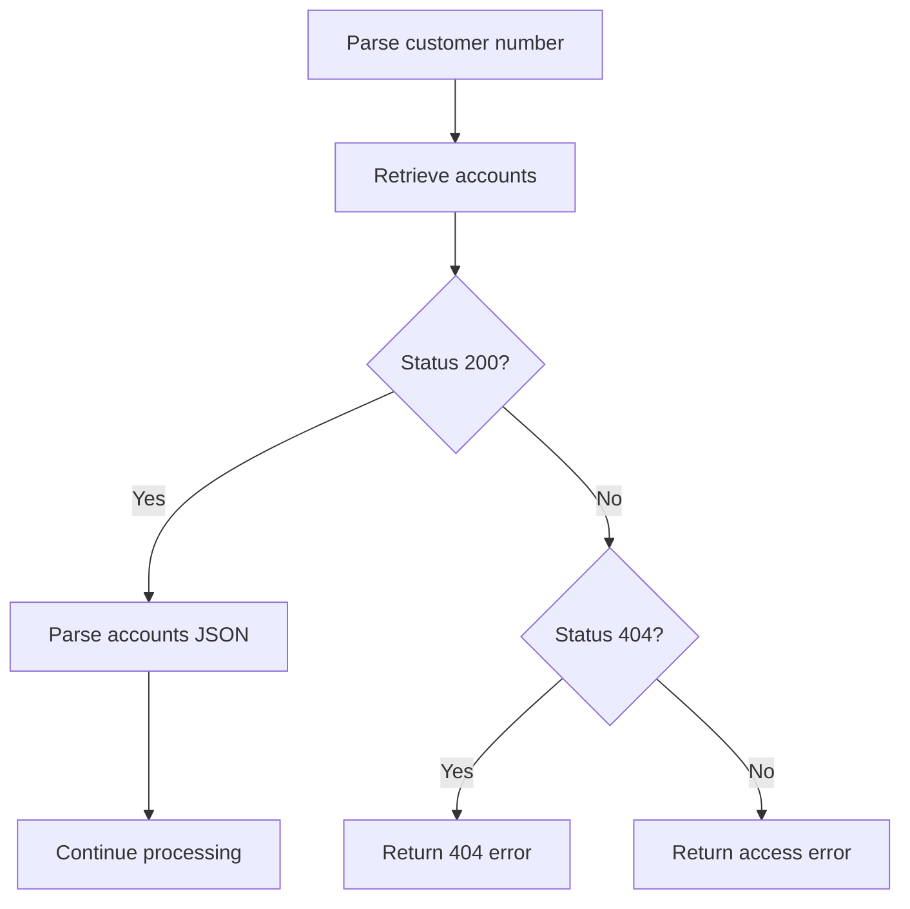

<SwmSnippet path="/src/webui/src/main/java/com/ibm/cics/cip/bankliberty/api/json/AccountsResource.java" line="207">

---

### Parsing customer number

The function begins by parsing the customer number from the <SwmToken path="src/webui/src/main/java/com/ibm/cics/cip/bankliberty/api/json/AccountsResource.java" pos="207:11:11" line-data="		Long customerNumberLong = Long.parseLong(account.getCustomerNumber());">`account`</SwmToken> object. This is done using <SwmToken path="src/webui/src/main/java/com/ibm/cics/cip/bankliberty/api/json/AccountsResource.java" pos="207:7:16" line-data="		Long customerNumberLong = Long.parseLong(account.getCustomerNumber());">`Long.parseLong(account.getCustomerNumber())`</SwmToken> to convert the customer number string into a long value.

```java
		Long customerNumberLong = Long.parseLong(account.getCustomerNumber());
```

---

</SwmSnippet>

<SwmSnippet path="/src/webui/src/main/java/com/ibm/cics/cip/bankliberty/api/json/AccountsResource.java" line="211">

---

### Retrieving customer accounts

Next, the function attempts to retrieve all accounts associated with the parsed customer number by calling `thisAccountsResource.getAccountsByCustomerInternal(`<SwmToken path="src/webui/src/main/java/com/ibm/cics/cip/bankliberty/api/json/AccountsResource.java" pos="212:4:4" line-data="					.getAccountsByCustomerInternal(customerNumberLong);">`customerNumberLong`</SwmToken>`)`. This call queries the internal customer data and the database to fetch the account details.

```java
			Response accountsOfThisCustomer = thisAccountsResource
					.getAccountsByCustomerInternal(customerNumberLong);
```

---

</SwmSnippet>

<SwmSnippet path="/src/webui/src/main/java/com/ibm/cics/cip/bankliberty/api/json/AccountsResource.java" line="213">

---

### Handling non-200 status codes

If the status code of the response is not 200, the function checks if the status is 404. If it is, it creates a JSON error message indicating that the customer number cannot be found and returns a 404 response. If the status is any other value, it creates a JSON error message indicating that the customer number cannot be accessed and returns the corresponding status code.

```java
			if (accountsOfThisCustomer.getStatus() != 200)
			{
				// If accountsOfThisCustomer returns status 404, create new
				// JSONObject containing the error message
				if (accountsOfThisCustomer.getStatus() == 404)
				{
					error = new JSONObject();
					error.put(JSON_ERROR_MSG, CUSTOMER_NUMBER_LITERAL
							+ customerNumberLong.longValue() + CANNOT_BE_FOUND);
					logger.log(Level.WARNING, () -> CUSTOMER_NUMBER_LITERAL
							+ customerNumberLong.longValue() + CANNOT_BE_FOUND);
					myResponse = Response.status(404).entity(error.toString())
							.build();
					logger.exiting(this.getClass().getName(),
							CREATE_ACCOUNT_INTERNAL, myResponse);
					return myResponse;
				}
				error = new JSONObject();
				error.put(JSON_ERROR_MSG, CUSTOMER_NUMBER_LITERAL
						+ customerNumberLong.longValue() + CANNOT_BE_ACCESSED);
				logger.log(Level.SEVERE, () -> CUSTOMER_NUMBER_LITERAL
```

---

</SwmSnippet>

<SwmSnippet path="/src/webui/src/main/java/com/ibm/cics/cip/bankliberty/api/json/AccountsResource.java" line="242">

---

### Parsing accounts JSON

If the status code is 200, the function proceeds to parse the response entity into a JSON object using <SwmToken path="src/webui/src/main/java/com/ibm/cics/cip/bankliberty/api/json/AccountsResource.java" pos="244:5:10" line-data="			myAccountsJSON = JSONObject.parse(accountsOfThisCustomerString);">`JSONObject.parse(accountsOfThisCustomerString)`</SwmToken>. This JSON object contains the details of the customer's accounts.

```java
			String accountsOfThisCustomerString = accountsOfThisCustomer
					.getEntity().toString();
			myAccountsJSON = JSONObject.parse(accountsOfThisCustomerString);
```

---

</SwmSnippet>

<SwmSnippet path="/src/webui/src/main/java/com/ibm/cics/cip/bankliberty/api/json/AccountsResource.java" line="246">

---

### Handling IOExceptions

In case of an <SwmToken path="src/webui/src/main/java/com/ibm/cics/cip/bankliberty/api/json/AccountsResource.java" pos="246:4:4" line-data="		catch (IOException e)">`IOException`</SwmToken> during the retrieval of customer accounts, the function catches the exception, logs an error message, creates a JSON error message indicating the failure, and returns a 500 response.

```java
		catch (IOException e)
		{
			error = new JSONObject();
			error.put(JSON_ERROR_MSG, "Failed to retrieve customer number "
					+ customerNumberLong + " " + e.getLocalizedMessage());
			logger.log(Level.SEVERE, () -> "Failed to retrieve customer number "
					+ customerNumberLong + " " + e.getLocalizedMessage());
			myResponse = Response.status(500).entity(error.toString()).build();
			logger.exiting(this.getClass().getName(), CREATE_ACCOUNT_INTERNAL,
					myResponse);
			return myResponse;
```

---

</SwmSnippet>

## <SwmToken path="src/webui/src/main/java/com/ibm/cics/cip/bankliberty/api/json/AccountsResource.java" pos="57:14:14" line-data="	private static final String CREATE_ACCOUNT_INTERNAL = &quot;createAccountInternal(AccountJSON account)&quot;;">`createAccountInternal`</SwmToken> function - Checking Account Limit

Here is a diagram of this part:

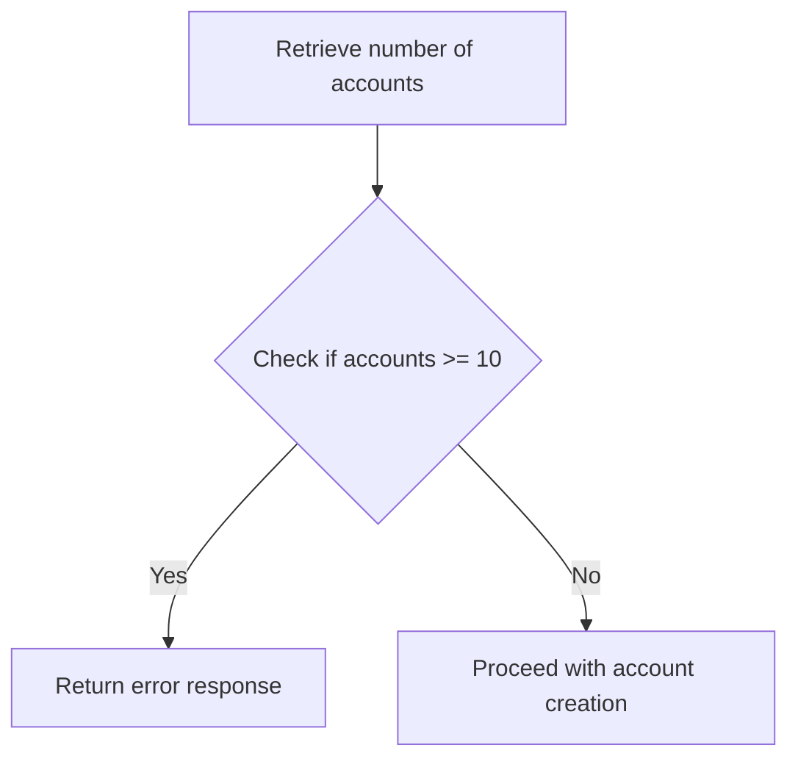

<SwmSnippet path="/src/webui/src/main/java/com/ibm/cics/cip/bankliberty/api/json/AccountsResource.java" line="258">

---

### Checking the number of accounts a customer has

The function retrieves the number of accounts a customer currently has by accessing the <SwmToken path="src/webui/src/main/java/com/ibm/cics/cip/bankliberty/api/json/AccountsResource.java" pos="258:11:11" line-data="		long accountCount = (Long) myAccountsJSON.get(JSON_NUMBER_OF_ACCOUNTS);">`myAccountsJSON`</SwmToken> object and extracting the value associated with the <SwmToken path="src/webui/src/main/java/com/ibm/cics/cip/bankliberty/api/json/AccountsResource.java" pos="258:15:15" line-data="		long accountCount = (Long) myAccountsJSON.get(JSON_NUMBER_OF_ACCOUNTS);">`JSON_NUMBER_OF_ACCOUNTS`</SwmToken> key.

```java
		long accountCount = (Long) myAccountsJSON.get(JSON_NUMBER_OF_ACCOUNTS);

```

---

</SwmSnippet>

<SwmSnippet path="/src/webui/src/main/java/com/ibm/cics/cip/bankliberty/api/json/AccountsResource.java" line="262">

---

### Validating the account limit

It then checks if the customer has reached or exceeded the maximum allowed number of accounts, which is defined by the <SwmToken path="src/webui/src/main/java/com/ibm/cics/cip/bankliberty/api/json/AccountsResource.java" pos="262:8:8" line-data="		if (accountCount &gt;= MAXIMUM_ACCOUNTS_PER_CUSTOMER)">`MAXIMUM_ACCOUNTS_PER_CUSTOMER`</SwmToken> constant. If the customer has ten or more accounts, an error message is created indicating that the customer cannot have more than ten accounts.

```java
		if (accountCount >= MAXIMUM_ACCOUNTS_PER_CUSTOMER)
		{
			error = new JSONObject();
			error.put(JSON_ERROR_MSG,
					CUSTOMER_NUMBER_LITERAL + customerNumberLong.longValue()
							+ " cannot have more than ten accounts.");
```

---

</SwmSnippet>

<SwmSnippet path="/src/webui/src/main/java/com/ibm/cics/cip/bankliberty/api/json/AccountsResource.java" line="268">

---

### Returning an error response

If the customer has reached the account limit, the function logs a warning message and returns an HTTP 400 error response with the error message.

```java
			logger.log(Level.WARNING,
					() -> (CUSTOMER_NUMBER_LITERAL
							+ customerNumberLong.longValue()
							+ " cannot have more than ten accounts."));
			myResponse = Response.status(400).entity(error.toString()).build();
			logger.exiting(this.getClass().getName(), CREATE_ACCOUNT_INTERNAL,
					myResponse);
			return myResponse;
```

---

</SwmSnippet>

## <SwmToken path="src/webui/src/main/java/com/ibm/cics/cip/bankliberty/api/json/AccountsResource.java" pos="57:14:14" line-data="	private static final String CREATE_ACCOUNT_INTERNAL = &quot;createAccountInternal(AccountJSON account)&quot;;">`createAccountInternal`</SwmToken> function - Creating Account in <SwmToken path="src/webui/src/main/java/com/ibm/cics/cip/bankliberty/api/json/AccountsResource.java" pos="167:11:11" line-data="		 * to keep track of DB2 connections">`DB2`</SwmToken>

Here is a diagram of this part:

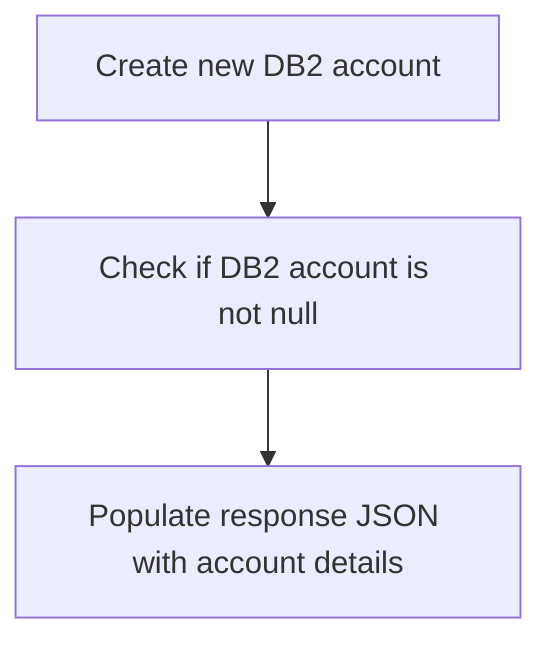

<SwmSnippet path="/src/webui/src/main/java/com/ibm/cics/cip/bankliberty/api/json/AccountsResource.java" line="277">

---

### Creating a new <SwmToken path="src/webui/src/main/java/com/ibm/cics/cip/bankliberty/api/json/AccountsResource.java" pos="167:11:11" line-data="		 * to keep track of DB2 connections">`DB2`</SwmToken> account

The function begins by creating a new <SwmToken path="src/webui/src/main/java/com/ibm/cics/cip/bankliberty/api/json/AccountsResource.java" pos="278:15:15" line-data="		com.ibm.cics.cip.bankliberty.web.db2.Account db2Account = new com.ibm.cics.cip.bankliberty.web.db2.Account();">`Account`</SwmToken> object for the <SwmToken path="src/webui/src/main/java/com/ibm/cics/cip/bankliberty/api/json/AccountsResource.java" pos="167:11:11" line-data="		 * to keep track of DB2 connections">`DB2`</SwmToken> database. It sets the sort code for the account and then calls the <SwmToken path="src/webui/src/main/java/com/ibm/cics/cip/bankliberty/api/json/AccountsResource.java" pos="280:7:7" line-data="		db2Account = db2Account.createAccount(account, this.getSortCode());">`createAccount`</SwmToken> method to create the account in the database.

```java

		com.ibm.cics.cip.bankliberty.web.db2.Account db2Account = new com.ibm.cics.cip.bankliberty.web.db2.Account();
		db2Account.setSortcode(this.getSortCode().toString());
		db2Account = db2Account.createAccount(account, this.getSortCode());
```

---

</SwmSnippet>

<SwmSnippet path="/src/webui/src/main/java/com/ibm/cics/cip/bankliberty/api/json/AccountsResource.java" line="282">

---

### Populating the response JSON

If the <SwmToken path="src/webui/src/main/java/com/ibm/cics/cip/bankliberty/api/json/AccountsResource.java" pos="167:11:11" line-data="		 * to keep track of DB2 connections">`DB2`</SwmToken> account is successfully created (i.e., <SwmToken path="src/webui/src/main/java/com/ibm/cics/cip/bankliberty/api/json/AccountsResource.java" pos="282:4:4" line-data="		if (db2Account != null)">`db2Account`</SwmToken> is not null), the function proceeds to populate the <SwmToken path="src/webui/src/main/java/com/ibm/cics/cip/bankliberty/api/json/AccountsResource.java" pos="284:1:1" line-data="			response.put(JSON_SORT_CODE, db2Account.getSortcode().trim());">`response`</SwmToken> JSON object with various details of the newly created account. This includes the sort code, account number, customer number, account type, available balance, actual balance, interest rate, overdraft limit, last statement date, next statement date, and the date the account was opened.

```java
		if (db2Account != null)
		{
			response.put(JSON_SORT_CODE, db2Account.getSortcode().trim());
			response.put("id", db2Account.getAccountNumber());
			response.put(JSON_CUSTOMER_NUMBER, db2Account.getCustomerNumber());
			response.put(JSON_ACCOUNT_TYPE, db2Account.getType().trim());
			response.put(JSON_AVAILABLE_BALANCE,
					BigDecimal.valueOf(db2Account.getAvailableBalance()));
			response.put(JSON_ACTUAL_BALANCE,
					BigDecimal.valueOf(db2Account.getActualBalance()));
			response.put(JSON_INTEREST_RATE,
					BigDecimal.valueOf(db2Account.getInterestRate()));
			response.put(JSON_OVERDRAFT, db2Account.getOverdraftLimit());
			response.put(JSON_LAST_STATEMENT_DATE,
					db2Account.getLastStatement().toString().trim());
			response.put(JSON_NEXT_STATEMENT_DATE,
					db2Account.getNextStatement().toString().trim());
			response.put(JSON_DATE_OPENED,
					db2Account.getOpened().toString().trim());

```

---

</SwmSnippet>

## <SwmToken path="src/webui/src/main/java/com/ibm/cics/cip/bankliberty/api/json/AccountsResource.java" pos="57:14:14" line-data="	private static final String CREATE_ACCOUNT_INTERNAL = &quot;createAccountInternal(AccountJSON account)&quot;;">`createAccountInternal`</SwmToken> function - Updating Transaction Records

Here is a diagram of this part:

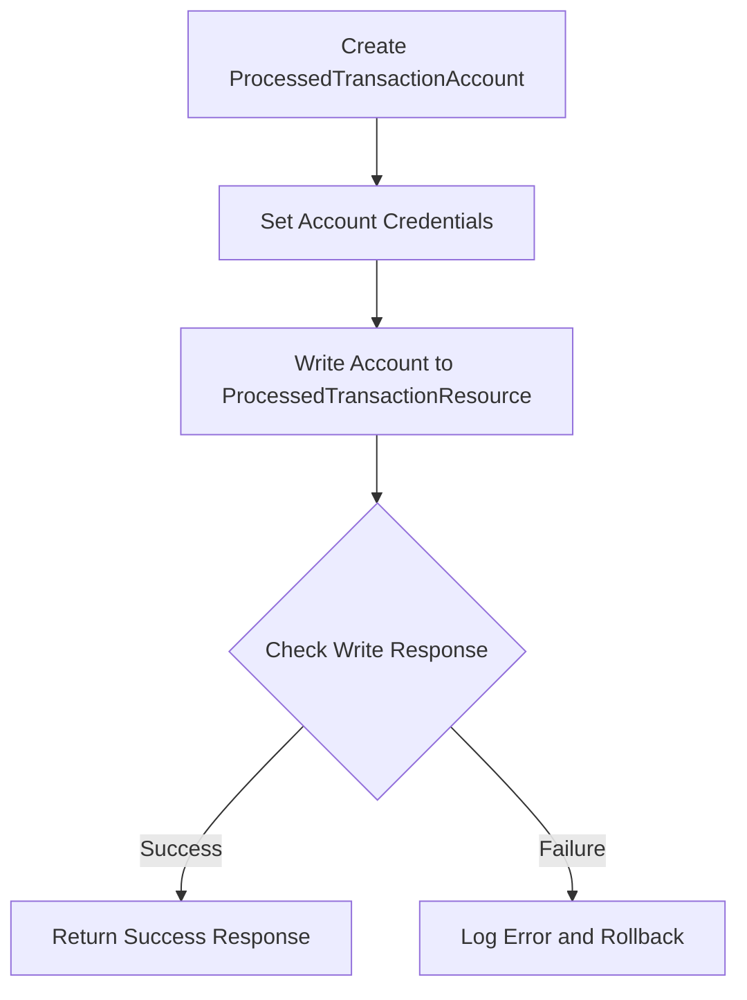

<SwmSnippet path="/src/webui/src/main/java/com/ibm/cics/cip/bankliberty/api/json/AccountsResource.java" line="302">

---

### Creating and setting credentials for <SwmToken path="src/webui/src/main/java/com/ibm/cics/cip/bankliberty/api/json/AccountsResource.java" pos="302:9:9" line-data="			// Create a new ProcessedTransactionAccount and set credentials">`ProcessedTransactionAccount`</SwmToken>

The function begins by creating a new <SwmToken path="src/webui/src/main/java/com/ibm/cics/cip/bankliberty/api/json/AccountsResource.java" pos="302:9:9" line-data="			// Create a new ProcessedTransactionAccount and set credentials">`ProcessedTransactionAccount`</SwmToken> and setting its credentials. This involves initializing a <SwmToken path="src/webui/src/main/java/com/ibm/cics/cip/bankliberty/api/json/AccountsResource.java" pos="303:1:1" line-data="			ProcessedTransactionResource myProcessedTransactionResource = new ProcessedTransactionResource();">`ProcessedTransactionResource`</SwmToken> and a <SwmToken path="src/webui/src/main/java/com/ibm/cics/cip/bankliberty/api/json/AccountsResource.java" pos="304:1:1" line-data="			ProcessedTransactionAccountJSON myProctranAccount = new ProcessedTransactionAccountJSON();">`ProcessedTransactionAccountJSON`</SwmToken> object. The credentials such as sort code, account number, customer number, last statement date, next statement date, account type, and actual balance are set using the details from the newly created <SwmToken path="src/webui/src/main/java/com/ibm/cics/cip/bankliberty/api/json/AccountsResource.java" pos="305:5:5" line-data="			myProctranAccount.setSortCode(db2Account.getSortcode());">`db2Account`</SwmToken>.

```java
			// Create a new ProcessedTransactionAccount and set credentials
			ProcessedTransactionResource myProcessedTransactionResource = new ProcessedTransactionResource();
			ProcessedTransactionAccountJSON myProctranAccount = new ProcessedTransactionAccountJSON();
			myProctranAccount.setSortCode(db2Account.getSortcode());
			myProctranAccount.setAccountNumber(db2Account.getAccountNumber());
			myProctranAccount.setCustomerNumber(db2Account.getCustomerNumber());
			myProctranAccount.setLastStatement(db2Account.getLastStatement());
			myProctranAccount.setNextStatement(db2Account.getNextStatement());
			myProctranAccount.setType(db2Account.getType());
			myProctranAccount.setActualBalance(
					BigDecimal.valueOf(db2Account.getActualBalance()));

```

---

</SwmSnippet>

<SwmSnippet path="/src/webui/src/main/java/com/ibm/cics/cip/bankliberty/api/json/AccountsResource.java" line="314">

---

### Writing the new account to <SwmToken path="src/webui/src/main/java/com/ibm/cics/cip/bankliberty/api/json/AccountsResource.java" pos="303:1:1" line-data="			ProcessedTransactionResource myProcessedTransactionResource = new ProcessedTransactionResource();">`ProcessedTransactionResource`</SwmToken>

Next, the function writes the new account to the <SwmToken path="src/webui/src/main/java/com/ibm/cics/cip/bankliberty/api/json/AccountsResource.java" pos="303:1:1" line-data="			ProcessedTransactionResource myProcessedTransactionResource = new ProcessedTransactionResource();">`ProcessedTransactionResource`</SwmToken> by calling <SwmToken path="src/webui/src/main/java/com/ibm/cics/cip/bankliberty/api/json/AccountsResource.java" pos="315:2:2" line-data="					.writeCreateAccountInternal(myProctranAccount);">`writeCreateAccountInternal`</SwmToken> with the <SwmToken path="src/webui/src/main/java/com/ibm/cics/cip/bankliberty/api/json/AccountsResource.java" pos="304:1:1" line-data="			ProcessedTransactionAccountJSON myProctranAccount = new ProcessedTransactionAccountJSON();">`ProcessedTransactionAccountJSON`</SwmToken> object. It then checks the response to determine if the write operation was successful. If the response is null or the status is not 200, it logs an error, attempts to roll back the transaction, and returns a server error response.

```java
			Response writeCreateAccountResponse = myProcessedTransactionResource
					.writeCreateAccountInternal(myProctranAccount);
			if (writeCreateAccountResponse == null
					|| writeCreateAccountResponse.getStatus() != 200)
			{
				error = new JSONObject();
				error.put(JSON_ERROR_MSG, PROCTRAN_WRITE_FAILURE);
				try
				{
					logger.log(Level.SEVERE, () -> "Accounts: createAccount: "
							+ PROCTRAN_WRITE_FAILURE);
					Task.getTask().rollback();
				}
				catch (InvalidRequestException e)
				{
					logger.log(Level.SEVERE, () -> "Accounts: createAccount: "
							+ PROCTRAN_WRITE_FAILURE);
				}
				logger.log(Level.SEVERE, () -> ACCOUNT_CREATE_FAILURE);
				myResponse = Response.status(500).entity(error.toString())
						.build();
```

---

</SwmSnippet>

## Diving into the <SwmToken path="src/webui/src/main/java/com/ibm/cics/cip/bankliberty/api/json/AccountsResource.java" pos="280:7:7" line-data="		db2Account = db2Account.createAccount(account, this.getSortCode());">`createAccount`</SwmToken> function

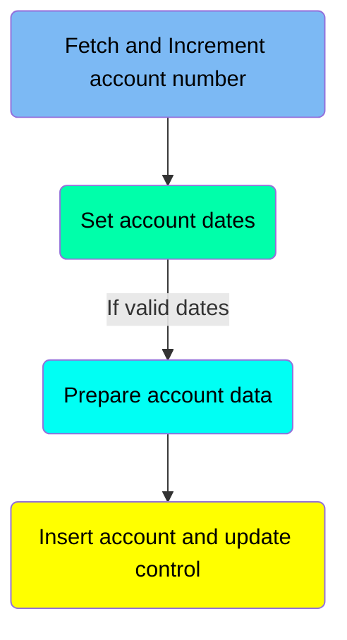

## <SwmToken path="src/webui/src/main/java/com/ibm/cics/cip/bankliberty/api/json/AccountsResource.java" pos="280:7:7" line-data="		db2Account = db2Account.createAccount(account, this.getSortCode());">`createAccount`</SwmToken> function - Fetch and Increment account number

Here is a diagram of this part:

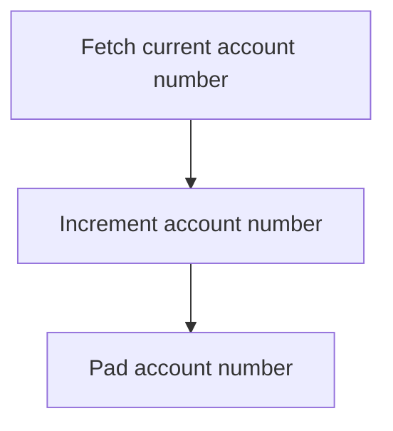

<SwmSnippet path="/src/webui/src/main/java/com/ibm/cics/cip/bankliberty/web/db2/Account.java" line="750">

---

### Fetching the current account number

The function first fetches the current account number from the <SwmToken path="src/webui/src/main/java/com/ibm/cics/cip/bankliberty/web/db2/Account.java" pos="737:14:14" line-data="		String sqlControl = &quot;SELECT * from CONTROL where CONTROL_NAME = ?&quot;;">`CONTROL`</SwmToken> table using the <SwmToken path="src/webui/src/main/java/com/ibm/cics/cip/bankliberty/web/db2/Account.java" pos="752:3:3" line-data="				// CONTROL_VALUE_NUM is up to 10 digits long. Account number is">`CONTROL_VALUE_NUM`</SwmToken> field. This value is retrieved to ensure that the new account number is unique and sequential.

```java
			if (rs.next())
			{
				// CONTROL_VALUE_NUM is up to 10 digits long. Account number is
				// only ever up to 8 digits long
				Long tempLong = rs.getLong("CONTROL_VALUE_NUM");
				accountNumberInteger = Integer.parseInt(tempLong.toString());
```

---

</SwmSnippet>

<SwmSnippet path="/src/webui/src/main/java/com/ibm/cics/cip/bankliberty/web/db2/Account.java" line="758">

---

### Incrementing the account number

After fetching the current account number, the function increments this number by one. This step ensures that the new account will have a unique and sequential account number.

```java
				accountNumberInteger++;

```

---

</SwmSnippet>

<SwmSnippet path="/src/webui/src/main/java/com/ibm/cics/cip/bankliberty/web/db2/Account.java" line="760">

---

### Padding the account number

Finally, the incremented account number is padded to ensure it meets the required format. This padded account number is then used for the new account creation.

```java
				accountNumberString = padAccountNumber(accountNumberInteger);
```

---

</SwmSnippet>

## <SwmToken path="src/webui/src/main/java/com/ibm/cics/cip/bankliberty/api/json/AccountsResource.java" pos="280:7:7" line-data="		db2Account = db2Account.createAccount(account, this.getSortCode());">`createAccount`</SwmToken> function - Set account dates

Here is a diagram of this part:

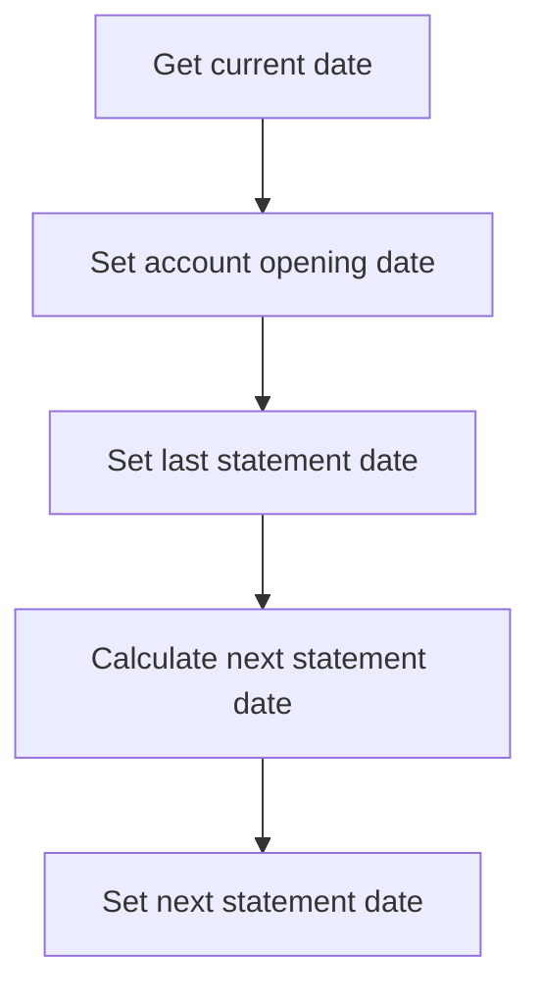

<SwmSnippet path="/src/webui/src/main/java/com/ibm/cics/cip/bankliberty/web/db2/Account.java" line="767">

---

### Setting account dates

The function sets the account opening date, last statement date, and next statement date for a new account. First, it retrieves the current date using <SwmToken path="src/webui/src/main/java/com/ibm/cics/cip/bankliberty/web/db2/Account.java" pos="767:7:11" line-data="				Calendar myCalendar = Calendar.getInstance();">`Calendar.getInstance()`</SwmToken> and stores it in the variable <SwmToken path="src/webui/src/main/java/com/ibm/cics/cip/bankliberty/web/db2/Account.java" pos="768:3:3" line-data="				Date today = new Date(myCalendar.getTimeInMillis());">`today`</SwmToken>.

```java
				Calendar myCalendar = Calendar.getInstance();
				Date today = new Date(myCalendar.getTimeInMillis());

```

---

</SwmSnippet>

<SwmSnippet path="/src/webui/src/main/java/com/ibm/cics/cip/bankliberty/web/db2/Account.java" line="770">

---

Next, the function sets the account opening date and last statement date to the current date by calling <SwmToken path="src/webui/src/main/java/com/ibm/cics/cip/bankliberty/web/db2/Account.java" pos="773:1:6" line-data="				temp.setOpened(dateOpened);">`temp.setOpened(dateOpened)`</SwmToken> and <SwmToken path="src/webui/src/main/java/com/ibm/cics/cip/bankliberty/web/db2/Account.java" pos="774:1:6" line-data="				temp.setLastStatement(lastStatementforNewCustomer);">`temp.setLastStatement(lastStatementforNewCustomer)`</SwmToken>.

```java
				Date dateOpened = today;
				Date lastStatementforNewCustomer = dateOpened;

				temp.setOpened(dateOpened);
				temp.setLastStatement(lastStatementforNewCustomer);
```

---

</SwmSnippet>

<SwmSnippet path="/src/webui/src/main/java/com/ibm/cics/cip/bankliberty/web/db2/Account.java" line="776">

---

The function then calculates the next statement date by adding one month to the current date. It uses the <SwmToken path="src/webui/src/main/java/com/ibm/cics/cip/bankliberty/web/db2/Account.java" pos="779:7:10" line-data="				long nextMonthInMs = getNextMonth(today);">`getNextMonth(today)`</SwmToken> method to get the duration of one month in milliseconds and adds it to the current time.

```java
				long timeNow = myCalendar.getTimeInMillis();
				// You must specify the values here as longs otherwise it ends
				// up negative due to overflow
				long nextMonthInMs = getNextMonth(today);

				long nextStatementLong = timeNow + nextMonthInMs;
```

---

</SwmSnippet>

<SwmSnippet path="/src/webui/src/main/java/com/ibm/cics/cip/bankliberty/web/db2/Account.java" line="782">

---

Finally, the function sets the next statement date for the new account by calling <SwmToken path="src/webui/src/main/java/com/ibm/cics/cip/bankliberty/web/db2/Account.java" pos="784:1:6" line-data="				temp.setNextStatement(nextStatementForNewCustomer);">`temp.setNextStatement(nextStatementForNewCustomer)`</SwmToken>.

```java
				Date nextStatementForNewCustomer = new Date(nextStatementLong);

				temp.setNextStatement(nextStatementForNewCustomer);
```

---

</SwmSnippet>

## <SwmToken path="src/webui/src/main/java/com/ibm/cics/cip/bankliberty/api/json/AccountsResource.java" pos="280:7:7" line-data="		db2Account = db2Account.createAccount(account, this.getSortCode());">`createAccount`</SwmToken> function - Prepare account data

Here is a diagram of this part:

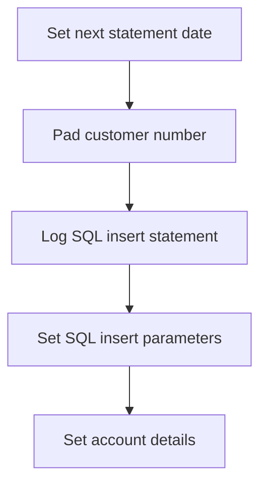

<SwmSnippet path="/src/webui/src/main/java/com/ibm/cics/cip/bankliberty/web/db2/Account.java" line="784">

---

### Setting next statement date

The function sets the <SwmToken path="src/webui/src/main/java/com/ibm/cics/cip/bankliberty/web/db2/Account.java" pos="115:5:5" line-data="	private Date nextStatement;">`nextStatement`</SwmToken> date for the new account by calling <SwmToken path="src/webui/src/main/java/com/ibm/cics/cip/bankliberty/web/db2/Account.java" pos="784:1:6" line-data="				temp.setNextStatement(nextStatementForNewCustomer);">`temp.setNextStatement(nextStatementForNewCustomer)`</SwmToken>.

```java
				temp.setNextStatement(nextStatementForNewCustomer);
```

---

</SwmSnippet>

<SwmSnippet path="/src/webui/src/main/java/com/ibm/cics/cip/bankliberty/web/db2/Account.java" line="786">

---

### Padding customer number

The customer number is padded to ensure it meets the required format by calling <SwmToken path="src/webui/src/main/java/com/ibm/cics/cip/bankliberty/web/db2/Account.java" pos="786:7:7" line-data="				String customerNumberString = padCustomerNumber(">`padCustomerNumber`</SwmToken>`(`<SwmToken path="src/webui/src/main/java/com/ibm/cics/cip/bankliberty/web/db2/Account.java" pos="787:1:5" line-data="						account.getCustomerNumber());">`account.getCustomerNumber()`</SwmToken>`)`.

```java
				String customerNumberString = padCustomerNumber(
						account.getCustomerNumber());
```

---

</SwmSnippet>

<SwmSnippet path="/src/webui/src/main/java/com/ibm/cics/cip/bankliberty/web/db2/Account.java" line="789">

---

### Logging SQL insert statement

A log entry is created to indicate that the SQL insert statement is about to be executed, providing visibility into the SQL operation.

```java
				logger.log(Level.FINE,
						() -> "About to insert record SQL <" + sqlInsert + ">");
```

---

</SwmSnippet>

<SwmSnippet path="/src/webui/src/main/java/com/ibm/cics/cip/bankliberty/web/db2/Account.java" line="792">

---

### Setting SQL insert parameters

The function sets the parameters for the SQL insert statement, including customer number, sort code, account number, account type, interest rate, date opened, overdraft limit, last statement date, and next statement date.

```java
				stmtI.setString(1, customerNumberString);
				stmtI.setString(2, sortCodeString);
				stmtI.setString(3, accountNumberString);
				stmtI.setString(4, account.getAccountType());
				stmtI.setBigDecimal(5, account.getInterestRate());
				stmtI.setDate(6, dateOpened);
				stmtI.setInt(7, account.getOverdraft());
				stmtI.setDate(8, lastStatementforNewCustomer);
				stmtI.setDate(9, nextStatementForNewCustomer);
```

---

</SwmSnippet>

<SwmSnippet path="/src/webui/src/main/java/com/ibm/cics/cip/bankliberty/web/db2/Account.java" line="801">

---

### Setting account details

The function sets various details for the new account, such as account number, actual balance, available balance, customer number, interest rate, last statement date, next statement date, overdraft limit, sort code, account type, and date opened.

```java
				temp.setAccountNumber(accountNumberString);
				temp.setActualBalance(0.00);
				temp.setAvailableBalance(0.00);
				temp.setCustomerNumber(customerNumberString);
				temp.setInterestRate(account.getInterestRate().doubleValue());
				temp.setLastStatement(lastStatementforNewCustomer);
				temp.setNextStatement(nextStatementForNewCustomer);
				temp.setOverdraftLimit(account.getOverdraft().intValue());
				temp.setSortcode(sortCodeString);
				temp.setType(account.getAccountType());
				temp.setOpened(dateOpened);

```

---

</SwmSnippet>

## <SwmToken path="src/webui/src/main/java/com/ibm/cics/cip/bankliberty/api/json/AccountsResource.java" pos="280:7:7" line-data="		db2Account = db2Account.createAccount(account, this.getSortCode());">`createAccount`</SwmToken> function - Insert account and update control

Here is a diagram of this part:

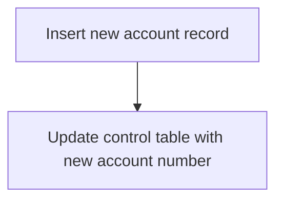

<SwmSnippet path="/src/webui/src/main/java/com/ibm/cics/cip/bankliberty/web/db2/Account.java" line="813">

---

### Inserting the new account record

The function inserts a new account record into the database using the prepared statement <SwmToken path="src/webui/src/main/java/com/ibm/cics/cip/bankliberty/web/db2/Account.java" pos="813:1:1" line-data="				stmtI.execute();">`stmtI`</SwmToken>. This step involves setting various parameters such as the customer number, sort code, account number, account type, interest rate, and dates for account opening, last statement, and next statement.

```java
				stmtI.execute();
```

---

</SwmSnippet>

<SwmSnippet path="/src/webui/src/main/java/com/ibm/cics/cip/bankliberty/web/db2/Account.java" line="814">

---

### Updating the control table

After inserting the new account record, the function updates the control table to reflect the new account number. This is done using the prepared statement <SwmToken path="src/webui/src/main/java/com/ibm/cics/cip/bankliberty/web/db2/Account.java" pos="816:1:1" line-data="				stmtU.setLong(1, accountNumberInteger);">`stmtU`</SwmToken>, which sets the new account number and the control string.

```java
				logger.log(Level.FINE, () -> "About to execute update SQL <"
						+ sqlUpdate + ">");
				stmtU.setLong(1, accountNumberInteger);
				stmtU.setString(2, controlString);
				stmtU.execute();
```

---

</SwmSnippet>

## Diving into the <SwmToken path="src/webui/src/main/java/com/ibm/cics/cip/bankliberty/api/json/AccountsResource.java" pos="212:2:2" line-data="					.getAccountsByCustomerInternal(customerNumberLong);">`getAccountsByCustomerInternal`</SwmToken> function

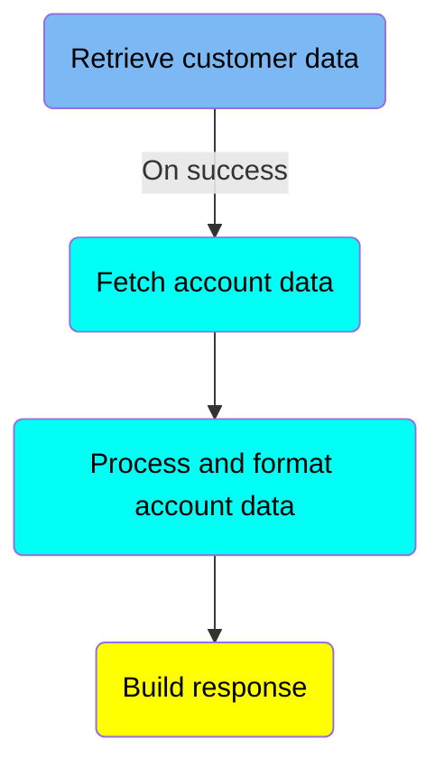

## <SwmToken path="src/webui/src/main/java/com/ibm/cics/cip/bankliberty/api/json/AccountsResource.java" pos="212:2:2" line-data="					.getAccountsByCustomerInternal(customerNumberLong);">`getAccountsByCustomerInternal`</SwmToken> function - Retrieve customer data

Here is a diagram of this part:

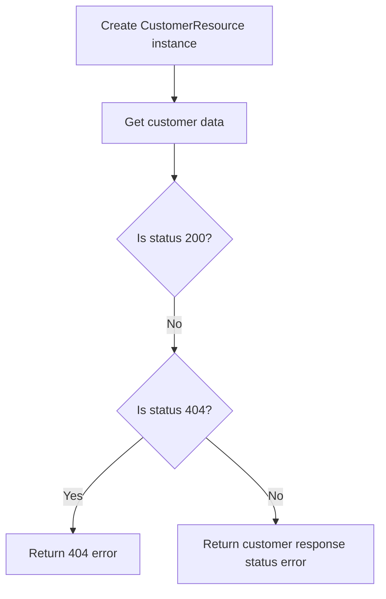

<SwmSnippet path="/src/webui/src/main/java/com/ibm/cics/cip/bankliberty/api/json/AccountsResource.java" line="505">

---

### Handling customer response status

The function begins by creating an instance of <SwmToken path="src/webui/src/main/java/com/ibm/cics/cip/bankliberty/api/json/AccountsResource.java" pos="505:1:1" line-data="		CustomerResource myCustomer = new CustomerResource();">`CustomerResource`</SwmToken> and retrieving customer data using the <SwmToken path="src/webui/src/main/java/com/ibm/cics/cip/bankliberty/api/json/AccountsResource.java" pos="507:2:2" line-data="				.getCustomerInternal(customerNumber);">`getCustomerInternal`</SwmToken> method with the provided <SwmToken path="src/webui/src/main/java/com/ibm/cics/cip/bankliberty/api/json/AccountsResource.java" pos="507:4:4" line-data="				.getCustomerInternal(customerNumber);">`customerNumber`</SwmToken>.

```java
		CustomerResource myCustomer = new CustomerResource();
		Response customerResponse = myCustomer
				.getCustomerInternal(customerNumber);
```

---

</SwmSnippet>

<SwmSnippet path="/src/webui/src/main/java/com/ibm/cics/cip/bankliberty/api/json/AccountsResource.java" line="509">

---

Next, it checks if the status of the <SwmToken path="src/webui/src/main/java/com/ibm/cics/cip/bankliberty/api/json/AccountsResource.java" pos="509:4:4" line-data="		if (customerResponse.getStatus() != 200)">`customerResponse`</SwmToken> is not 200. If the status is 404, it constructs a JSON error message indicating that the customer number cannot be found and logs this error.

```java
		if (customerResponse.getStatus() != 200)
		{
			if (customerResponse.getStatus() == 404)
			{
				// If cannot find response "CustomerResponse" then error 404
				// returned
				JSONObject error = new JSONObject();
				error.put(JSON_ERROR_MSG, CUSTOMER_NUMBER_LITERAL
						+ customerNumber.longValue() + CANNOT_BE_FOUND);
				logger.log(Level.SEVERE, () -> CUSTOMER_NUMBER_LITERAL
						+ customerNumber.longValue() + CANNOT_BE_FOUND);
				myResponse = Response.status(404).entity(error.toString())
						.build();
```

---

</SwmSnippet>

<SwmSnippet path="/src/webui/src/main/java/com/ibm/cics/cip/bankliberty/api/json/AccountsResource.java" line="526">

---

If the status is not 404, it constructs a different JSON error message indicating that the customer number cannot be accessed, including the status from the <SwmToken path="src/webui/src/main/java/com/ibm/cics/cip/bankliberty/api/json/AccountsResource.java" pos="532:3:3" line-data="								+ customerResponse.toString());">`customerResponse`</SwmToken>, and logs this error.

```java
			else
			{
				JSONObject error = new JSONObject();
				error.put(JSON_ERROR_MSG,
						CUSTOMER_NUMBER_LITERAL + customerNumber.longValue()
								+ " cannot be accessed. "
								+ customerResponse.toString());
				logger.log(Level.SEVERE, () -> CUSTOMER_NUMBER_LITERAL
						+ customerNumber.longValue() + " cannot be accessed. "
						+ customerResponse.toString());
				myResponse = Response.status(customerResponse.getStatus())
						.entity(error.toString()).build();
```

---

</SwmSnippet>

## <SwmToken path="src/webui/src/main/java/com/ibm/cics/cip/bankliberty/api/json/AccountsResource.java" pos="212:2:2" line-data="					.getAccountsByCustomerInternal(customerNumberLong);">`getAccountsByCustomerInternal`</SwmToken> function - Fetch account data

Here is a diagram of this part:

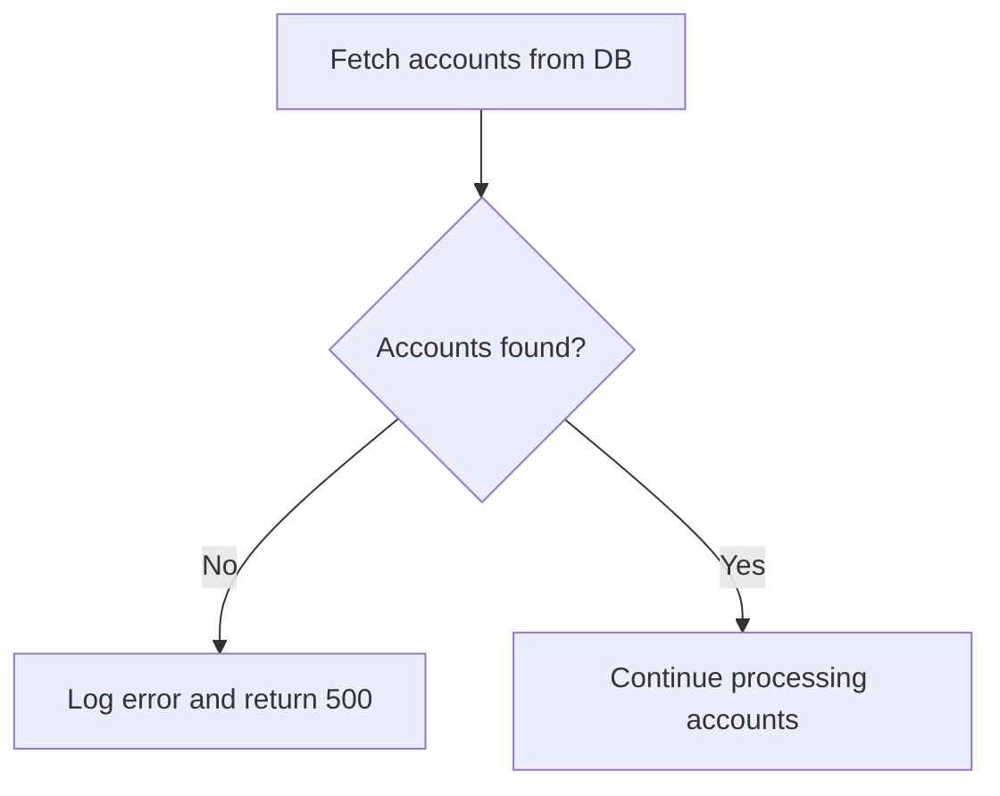

<SwmSnippet path="/src/webui/src/main/java/com/ibm/cics/cip/bankliberty/api/json/AccountsResource.java" line="544">

---

### Fetching accounts from the database

The function retrieves all accounts associated with a given customer number and sort code from the database. This is done by creating an instance of <SwmToken path="src/webui/src/main/java/com/ibm/cics/cip/bankliberty/api/json/AccountsResource.java" pos="544:15:15" line-data="		com.ibm.cics.cip.bankliberty.web.db2.Account db2Account = new Account();">`Account`</SwmToken> and calling the <SwmToken path="src/webui/src/main/java/com/ibm/cics/cip/bankliberty/api/json/AccountsResource.java" pos="545:11:11" line-data="		Account[] myAccounts = db2Account.getAccounts(customerNumber.intValue(),">`getAccounts`</SwmToken> method with the <SwmToken path="src/webui/src/main/java/com/ibm/cics/cip/bankliberty/api/json/AccountsResource.java" pos="545:13:13" line-data="		Account[] myAccounts = db2Account.getAccounts(customerNumber.intValue(),">`customerNumber`</SwmToken> and <SwmToken path="src/webui/src/main/java/com/ibm/cics/cip/bankliberty/api/json/AccountsResource.java" pos="546:1:1" line-data="				sortCode);">`sortCode`</SwmToken> as parameters.

```java
		com.ibm.cics.cip.bankliberty.web.db2.Account db2Account = new Account();
		Account[] myAccounts = db2Account.getAccounts(customerNumber.intValue(),
				sortCode);
```

---

</SwmSnippet>

<SwmSnippet path="/src/webui/src/main/java/com/ibm/cics/cip/bankliberty/api/json/AccountsResource.java" line="547">

---

### Handling null results

If the <SwmToken path="src/webui/src/main/java/com/ibm/cics/cip/bankliberty/api/json/AccountsResource.java" pos="545:11:11" line-data="		Account[] myAccounts = db2Account.getAccounts(customerNumber.intValue(),">`getAccounts`</SwmToken> method returns <SwmToken path="src/webui/src/main/java/com/ibm/cics/cip/bankliberty/api/json/AccountsResource.java" pos="547:8:8" line-data="		if (myAccounts == null)">`null`</SwmToken>, indicating that no accounts could be accessed for the given customer, the function logs a severe error message and constructs a JSON error response with a 500 status code. This response is then returned to the caller.

```java
		if (myAccounts == null)
		{
			JSONObject error = new JSONObject();
			error.put(JSON_ERROR_MSG,
					"Accounts cannot be accessed for customer "
							+ customerNumber.longValue() + CLASS_NAME_MSG);
			logger.log(Level.SEVERE,
					() -> "Accounts cannot be accessed for customer "
							+ customerNumber.longValue() + CLASS_NAME_MSG);
			myResponse = Response.status(500).entity(error.toString()).build();
			logger.exiting(this.getClass().getName(),
					GET_ACCOUNTS_BY_CUSTOMER_INTERNAL, myResponse);
			return myResponse;
		}
```

---

</SwmSnippet>

## <SwmToken path="src/webui/src/main/java/com/ibm/cics/cip/bankliberty/api/json/AccountsResource.java" pos="212:2:2" line-data="					.getAccountsByCustomerInternal(customerNumberLong);">`getAccountsByCustomerInternal`</SwmToken> function - Process and format account data

Here is a diagram of this part:

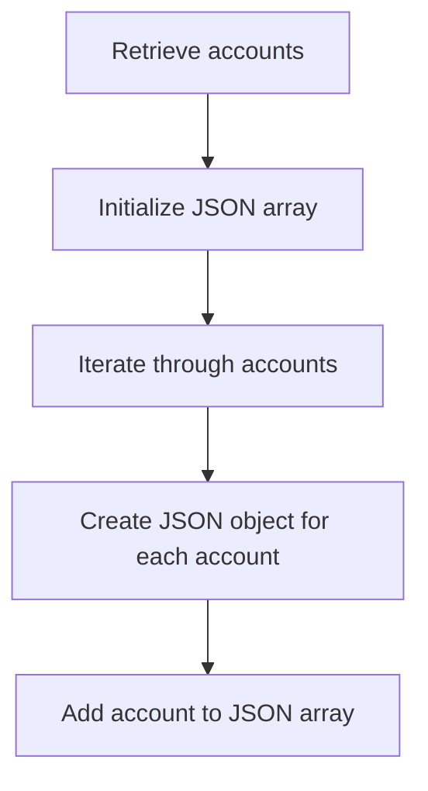

<SwmSnippet path="/src/webui/src/main/java/com/ibm/cics/cip/bankliberty/api/json/AccountsResource.java" line="562">

---

### Processing and formatting account data

The function processes and formats account data by first determining the number of accounts retrieved and initializing a JSON array to hold the account information.

```java
		numberOfAccounts = myAccounts.length;
		accounts = new JSONArray(numberOfAccounts);
```

---

</SwmSnippet>

<SwmSnippet path="/src/webui/src/main/java/com/ibm/cics/cip/bankliberty/api/json/AccountsResource.java" line="564">

---

It then iterates through each account, creating a JSON object for each one. This JSON object includes various details such as the sort code, account number, customer number, account type, available balance, actual balance, interest rate, overdraft limit, last statement date, next statement date, and the date the account was opened.

```java
		for (int i = 0; i < numberOfAccounts; i++)
		{

			JSONObject account = new JSONObject();
			account.put(JSON_SORT_CODE, myAccounts[i].getSortcode());
			account.put("id", myAccounts[i].getAccountNumber());
			account.put(JSON_CUSTOMER_NUMBER,
					myAccounts[i].getCustomerNumber());
			account.put(JSON_ACCOUNT_TYPE, myAccounts[i].getType());
			account.put(JSON_AVAILABLE_BALANCE,
					BigDecimal.valueOf(myAccounts[i].getAvailableBalance()));
			account.put(JSON_ACTUAL_BALANCE,
					BigDecimal.valueOf(myAccounts[i].getActualBalance()));
			account.put(JSON_INTEREST_RATE,
					BigDecimal.valueOf(myAccounts[i].getInterestRate()));
			account.put(JSON_OVERDRAFT, myAccounts[i].getOverdraftLimit());
			account.put(JSON_LAST_STATEMENT_DATE,
					myAccounts[i].getLastStatement().toString());
			account.put(JSON_NEXT_STATEMENT_DATE,
					myAccounts[i].getNextStatement().toString());
			account.put(JSON_DATE_OPENED, myAccounts[i].getOpened().toString());
```

---

</SwmSnippet>

<SwmSnippet path="/src/webui/src/main/java/com/ibm/cics/cip/bankliberty/api/json/AccountsResource.java" line="586">

---

Finally, each JSON object is added to the JSON array, which will be used to construct the response.

```java
			accounts.add(account);
		}
```

---

</SwmSnippet>

## <SwmToken path="src/webui/src/main/java/com/ibm/cics/cip/bankliberty/api/json/AccountsResource.java" pos="212:2:2" line-data="					.getAccountsByCustomerInternal(customerNumberLong);">`getAccountsByCustomerInternal`</SwmToken> function - Build response

Here is a diagram of this part:

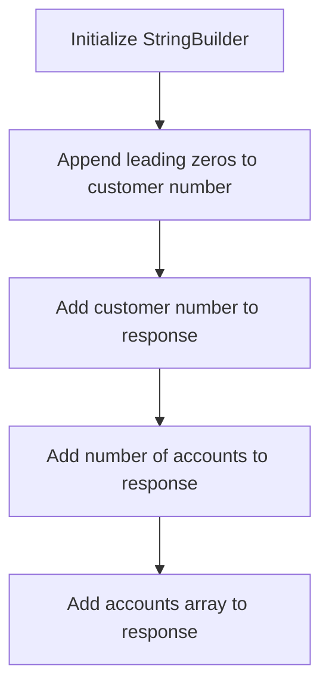

<SwmSnippet path="/src/webui/src/main/java/com/ibm/cics/cip/bankliberty/api/json/AccountsResource.java" line="588">

---

### Initialize <SwmToken path="src/webui/src/main/java/com/ibm/cics/cip/bankliberty/api/json/AccountsResource.java" pos="588:1:1" line-data="		StringBuilder myStringBuilder = new StringBuilder();">`StringBuilder`</SwmToken>

The function initializes a <SwmToken path="src/webui/src/main/java/com/ibm/cics/cip/bankliberty/api/json/AccountsResource.java" pos="588:1:1" line-data="		StringBuilder myStringBuilder = new StringBuilder();">`StringBuilder`</SwmToken> object to construct the customer number string with leading zeros.

```java
		StringBuilder myStringBuilder = new StringBuilder();

```

---

</SwmSnippet>

<SwmSnippet path="/src/webui/src/main/java/com/ibm/cics/cip/bankliberty/api/json/AccountsResource.java" line="590">

---

### Append leading zeros to customer number

The function appends leading zeros to the customer number to ensure it matches the required length (<SwmToken path="src/webui/src/main/java/com/ibm/cics/cip/bankliberty/api/json/AccountsResource.java" pos="590:25:25" line-data="		for (int i = customerNumber.toString().length(); i &lt; CUSTOMER_NUMBER_LENGTH; i++)">`CUSTOMER_NUMBER_LENGTH`</SwmToken>). This is done by iterating from the length of the customer number to the required length and appending '0' for each iteration.

```java
		for (int i = customerNumber.toString().length(); i < CUSTOMER_NUMBER_LENGTH; i++)
		{
			myStringBuilder.append('0');
		}
```

---

</SwmSnippet>

<SwmSnippet path="/src/webui/src/main/java/com/ibm/cics/cip/bankliberty/api/json/AccountsResource.java" line="594">

---

### Add customer number to response

The function then appends the actual customer number to the <SwmToken path="src/webui/src/main/java/com/ibm/cics/cip/bankliberty/api/json/AccountsResource.java" pos="588:1:1" line-data="		StringBuilder myStringBuilder = new StringBuilder();">`StringBuilder`</SwmToken> and adds the resulting string to the response JSON object under the key <SwmToken path="src/webui/src/main/java/com/ibm/cics/cip/bankliberty/api/json/AccountsResource.java" pos="596:5:5" line-data="		response.put(JSON_CUSTOMER_NUMBER, myStringBuilder.toString());">`JSON_CUSTOMER_NUMBER`</SwmToken>.

```java
		myStringBuilder.append(customerNumber.toString());

		response.put(JSON_CUSTOMER_NUMBER, myStringBuilder.toString());
```

---

</SwmSnippet>

<SwmSnippet path="/src/webui/src/main/java/com/ibm/cics/cip/bankliberty/api/json/AccountsResource.java" line="597">

---

### Add number of accounts to response

The function adds the number of accounts to the response JSON object under the key <SwmToken path="src/webui/src/main/java/com/ibm/cics/cip/bankliberty/api/json/AccountsResource.java" pos="597:5:5" line-data="		response.put(JSON_NUMBER_OF_ACCOUNTS, numberOfAccounts);">`JSON_NUMBER_OF_ACCOUNTS`</SwmToken>.

```java
		response.put(JSON_NUMBER_OF_ACCOUNTS, numberOfAccounts);
```

---

</SwmSnippet>

<SwmSnippet path="/src/webui/src/main/java/com/ibm/cics/cip/bankliberty/api/json/AccountsResource.java" line="598">

---

### Add accounts array to response

Finally, the function adds the array of account details to the response JSON object under the key <SwmToken path="src/webui/src/main/java/com/ibm/cics/cip/bankliberty/api/json/AccountsResource.java" pos="598:5:5" line-data="		response.put(JSON_ACCOUNTS, accounts);">`JSON_ACCOUNTS`</SwmToken>.

```java
		response.put(JSON_ACCOUNTS, accounts);

```

---

</SwmSnippet>

## Inside <SwmToken path="src/webui/src/main/java/com/ibm/cics/cip/bankliberty/api/json/AccountsResource.java" pos="545:11:11" line-data="		Account[] myAccounts = db2Account.getAccounts(customerNumber.intValue(),">`getAccounts`</SwmToken>

```mermaid
graph TD
  subgraph getAccounts
    getAccounts:A["Open DB connection"] --> getAccounts:B["Pad customer number"]
    getAccounts:B --> getAccounts:C["Pad sort code"]
    getAccounts:C --> getAccounts:D["Prepare SQL statement"]
    getAccounts:D --> getAccounts:E["Execute SQL query"]
    getAccounts:E --> getAccounts:F["Map result set to Account objects"]
    getAccounts:F --> getAccounts:G["Return accounts array"]
  end

%% Swimm:
%% graph TD
%%   subgraph <SwmToken path="src/webui/src/main/java/com/ibm/cics/cip/bankliberty/api/json/AccountsResource.java" pos="545:11:11" line-data="		Account[] myAccounts = db2Account.getAccounts(customerNumber.intValue(),">`getAccounts`</SwmToken>
%%     <SwmToken path="src/webui/src/main/java/com/ibm/cics/cip/bankliberty/api/json/AccountsResource.java" pos="545:11:11" line-data="		Account[] myAccounts = db2Account.getAccounts(customerNumber.intValue(),">`getAccounts`</SwmToken>:A["Open DB connection"] --> <SwmToken path="src/webui/src/main/java/com/ibm/cics/cip/bankliberty/api/json/AccountsResource.java" pos="545:11:11" line-data="		Account[] myAccounts = db2Account.getAccounts(customerNumber.intValue(),">`getAccounts`</SwmToken>:B["Pad customer number"]
%%     <SwmToken path="src/webui/src/main/java/com/ibm/cics/cip/bankliberty/api/json/AccountsResource.java" pos="545:11:11" line-data="		Account[] myAccounts = db2Account.getAccounts(customerNumber.intValue(),">`getAccounts`</SwmToken>:B --> <SwmToken path="src/webui/src/main/java/com/ibm/cics/cip/bankliberty/api/json/AccountsResource.java" pos="545:11:11" line-data="		Account[] myAccounts = db2Account.getAccounts(customerNumber.intValue(),">`getAccounts`</SwmToken>:C["Pad sort code"]
%%     <SwmToken path="src/webui/src/main/java/com/ibm/cics/cip/bankliberty/api/json/AccountsResource.java" pos="545:11:11" line-data="		Account[] myAccounts = db2Account.getAccounts(customerNumber.intValue(),">`getAccounts`</SwmToken>:C --> <SwmToken path="src/webui/src/main/java/com/ibm/cics/cip/bankliberty/api/json/AccountsResource.java" pos="545:11:11" line-data="		Account[] myAccounts = db2Account.getAccounts(customerNumber.intValue(),">`getAccounts`</SwmToken>:D["Prepare SQL statement"]
%%     <SwmToken path="src/webui/src/main/java/com/ibm/cics/cip/bankliberty/api/json/AccountsResource.java" pos="545:11:11" line-data="		Account[] myAccounts = db2Account.getAccounts(customerNumber.intValue(),">`getAccounts`</SwmToken>:D --> <SwmToken path="src/webui/src/main/java/com/ibm/cics/cip/bankliberty/api/json/AccountsResource.java" pos="545:11:11" line-data="		Account[] myAccounts = db2Account.getAccounts(customerNumber.intValue(),">`getAccounts`</SwmToken>:E["Execute SQL query"]
%%     <SwmToken path="src/webui/src/main/java/com/ibm/cics/cip/bankliberty/api/json/AccountsResource.java" pos="545:11:11" line-data="		Account[] myAccounts = db2Account.getAccounts(customerNumber.intValue(),">`getAccounts`</SwmToken>:E --> <SwmToken path="src/webui/src/main/java/com/ibm/cics/cip/bankliberty/api/json/AccountsResource.java" pos="545:11:11" line-data="		Account[] myAccounts = db2Account.getAccounts(customerNumber.intValue(),">`getAccounts`</SwmToken>:F["Map result set to Account objects"]
%%     <SwmToken path="src/webui/src/main/java/com/ibm/cics/cip/bankliberty/api/json/AccountsResource.java" pos="545:11:11" line-data="		Account[] myAccounts = db2Account.getAccounts(customerNumber.intValue(),">`getAccounts`</SwmToken>:F --> <SwmToken path="src/webui/src/main/java/com/ibm/cics/cip/bankliberty/api/json/AccountsResource.java" pos="545:11:11" line-data="		Account[] myAccounts = db2Account.getAccounts(customerNumber.intValue(),">`getAccounts`</SwmToken>:G["Return accounts array"]
%%   end
```

### Preparing the SQL query

## Retrieving customer accounts

First, the <SwmToken path="src/webui/src/main/java/com/ibm/cics/cip/bankliberty/api/json/AccountsResource.java" pos="212:2:2" line-data="					.getAccountsByCustomerInternal(customerNumberLong);">`getAccountsByCustomerInternal`</SwmToken> method calls the <SwmToken path="src/webui/src/main/java/com/ibm/cics/cip/bankliberty/api/json/AccountsResource.java" pos="545:11:11" line-data="		Account[] myAccounts = db2Account.getAccounts(customerNumber.intValue(),">`getAccounts`</SwmToken> method to retrieve the accounts associated with a specific customer number and sort code. This is crucial for displaying the customer's account information accurately.

<SwmSnippet path="/src/webui/src/main/java/com/ibm/cics/cip/bankliberty/web/db2/Account.java" line="514">

---

Next, the <SwmToken path="src/webui/src/main/java/com/ibm/cics/cip/bankliberty/api/json/AccountsResource.java" pos="545:11:11" line-data="		Account[] myAccounts = db2Account.getAccounts(customerNumber.intValue(),">`getAccounts`</SwmToken> method prepares an SQL query to select all accounts that match the given customer number and sort code. This ensures that only relevant accounts are retrieved for the customer.

```java
		String sql = "SELECT * from ACCOUNT where ACCOUNT_EYECATCHER LIKE 'ACCT' AND ACCOUNT_CUSTOMER_NUMBER like ? and ACCOUNT_SORTCODE like ? ORDER BY ACCOUNT_NUMBER";
		logger.log(Level.FINE, () -> PRE_SELECT_MSG + sql + ">");
```

---

</SwmSnippet>

<SwmSnippet path="/src/webui/src/main/java/com/ibm/cics/cip/bankliberty/web/db2/Account.java" line="522">

---

### Executing the query

Then, the method executes the SQL query and processes the result set. Each row in the result set represents an account, and the method creates an <SwmToken path="src/webui/src/main/java/com/ibm/cics/cip/bankliberty/web/db2/Account.java" pos="526:10:10" line-data="				temp[i] = new Account(rs.getString(ACCOUNT_CUSTOMER_NUMBER),">`Account`</SwmToken> object for each row. This step is essential for converting the raw data from the database into a structured format that can be used by the application.

```java
			ResultSet rs = stmt.executeQuery();

			while (rs.next())
			{
				temp[i] = new Account(rs.getString(ACCOUNT_CUSTOMER_NUMBER),
						rs.getString(ACCOUNT_SORTCODE),
						rs.getString(ACCOUNT_NUMBER),
						rs.getString(ACCOUNT_TYPE),
						rs.getDouble(ACCOUNT_INTEREST_RATE),
						rs.getDate(ACCOUNT_OPENED),
						rs.getInt(ACCOUNT_OVERDRAFT_LIMIT),
						rs.getDate(ACCOUNT_LAST_STATEMENT),
						rs.getDate(ACCOUNT_NEXT_STATEMENT),
						rs.getDouble(ACCOUNT_AVAILABLE_BALANCE),
						rs.getDouble(ACCOUNT_ACTUAL_BALANCE));
				i++;
			}
```

---

</SwmSnippet>

<SwmSnippet path="/src/webui/src/main/java/com/ibm/cics/cip/bankliberty/web/db2/Account.java" line="540">

---

### Handling exceptions

Finally, the method handles any SQL exceptions that may occur during the query execution. Proper exception handling ensures that the application can gracefully handle errors and provide meaningful feedback to the user.

```java
		catch (SQLException e)
		{
			logger.severe(e.getLocalizedMessage());
			logger.exiting(this.getClass().getName(), GET_ACCOUNTS_CUSTNO + l,
					null);
			return null;
		}
```

---

</SwmSnippet>

&nbsp;

*This is an auto-generated document by Swimm 🌊 and has not yet been verified by a human*

<SwmMeta version="3.0.0" repo-id="Z2l0aHViJTNBJTNBY2ljcy1iYW5raW5nLXNhbXBsZS1hcHBsaWNhdGlvbi1jYnNhLUlCTS1EZW1vJTNBJTNBU3dpbW0tRGVtbw==" repo-name="cics-banking-sample-application-cbsa-IBM-Demo"><sup>Powered by [Swimm](/)</sup></SwmMeta>
