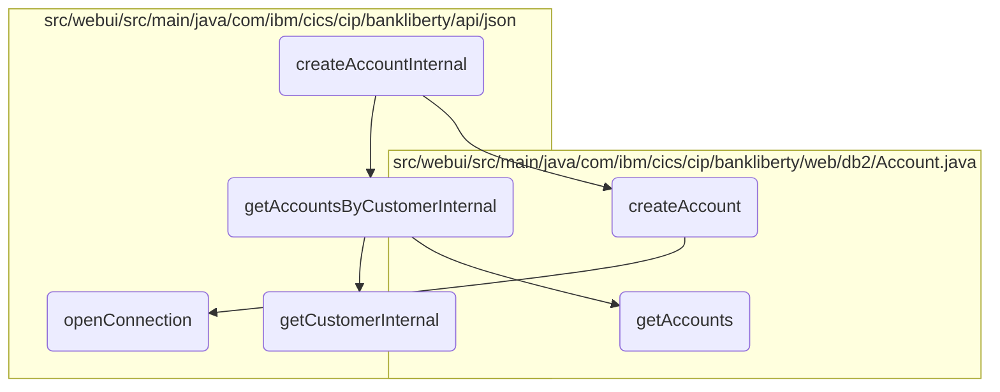
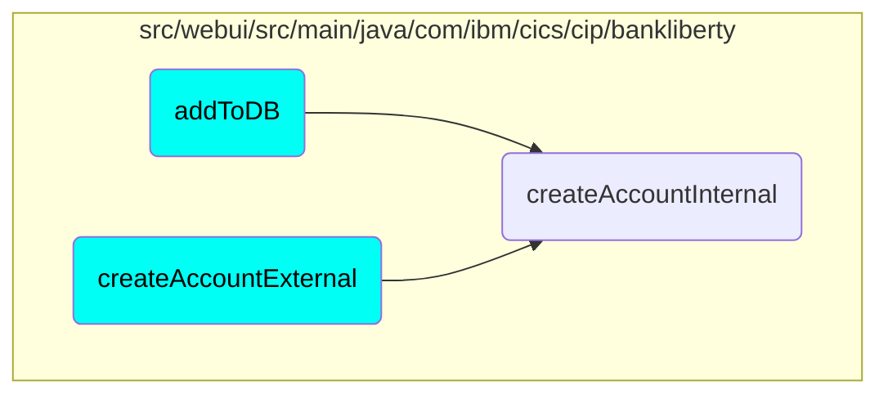

In this document, we will explain the process of creating a new bank account. The process involves several steps including validating the new account details, retrieving existing customer accounts, checking account limits, and finally creating the new account.

The flow starts with validating the new account details provided by the user. If the details are valid, the system retrieves existing accounts for the customer to ensure the customer exists and to check how many accounts they already have. If the customer has not exceeded the maximum allowed number of accounts, the system proceeds to create the new account. The new account details are then recorded in the database, and a response with the new account information is returned to the user.

# Flow drill down



<SwmSnippet path="/src/webui/src/main/java/com/ibm/cics/cip/bankliberty/api/json/AccountsResource.java" line="194">

---

## Validating the New Account

First, the <SwmToken path="src/webui/src/main/java/com/ibm/cics/cip/bankliberty/api/json/AccountsResource.java" pos="57:14:14" line-data="	private static final String CREATE_ACCOUNT_INTERNAL = &quot;createAccountInternal(AccountJSON account)&quot;;">`createAccountInternal`</SwmToken> method validates the new account details provided by the user. If the validation fails, an error response is returned, ensuring that only valid account details are processed further.

```java
		JSONObject error = validateNewAccount(account);
		if (error != null)
		{
			myResponse = Response.status(400).entity(error.toString()).build();
			logger.exiting(this.getClass().getName(), CREATE_ACCOUNT_INTERNAL,
					myResponse);
			return myResponse;

```

---

</SwmSnippet>

<SwmSnippet path="/src/webui/src/main/java/com/ibm/cics/cip/bankliberty/api/json/AccountsResource.java" line="211">

---

## Retrieving Customer Accounts

Next, the method retrieves existing accounts for the customer using <SwmToken path="src/webui/src/main/java/com/ibm/cics/cip/bankliberty/api/json/AccountsResource.java" pos="212:2:2" line-data="					.getAccountsByCustomerInternal(customerNumberLong);">`getAccountsByCustomerInternal`</SwmToken>. This step ensures that the customer exists and checks the number of accounts they already have.

```java
			Response accountsOfThisCustomer = thisAccountsResource
					.getAccountsByCustomerInternal(customerNumberLong);
			if (accountsOfThisCustomer.getStatus() != 200)
			{
				// If accountsOfThisCustomer returns status 404, create new
				// JSONObject containing the error message
				if (accountsOfThisCustomer.getStatus() == 404)
				{
					error = new JSONObject();
					error.put(JSON_ERROR_MSG, CUSTOMER_NUMBER_LITERAL
							+ customerNumberLong.longValue() + CANNOT_BE_FOUND);
					logger.log(Level.WARNING, () -> CUSTOMER_NUMBER_LITERAL
							+ customerNumberLong.longValue() + CANNOT_BE_FOUND);
					myResponse = Response.status(404).entity(error.toString())
							.build();
					logger.exiting(this.getClass().getName(),
							CREATE_ACCOUNT_INTERNAL, myResponse);
					return myResponse;
				}
				error = new JSONObject();
				error.put(JSON_ERROR_MSG, CUSTOMER_NUMBER_LITERAL
```

---

</SwmSnippet>

<SwmSnippet path="/src/webui/src/main/java/com/ibm/cics/cip/bankliberty/api/json/AccountsResource.java" line="258">

---

## Checking Account Limits

Then, the method checks if the customer has reached the maximum allowed number of accounts. If the limit is exceeded, an error response is returned, preventing the creation of additional accounts.

```java
		long accountCount = (Long) myAccountsJSON.get(JSON_NUMBER_OF_ACCOUNTS);

		// Does the customer have ten or more accounts?

		if (accountCount >= MAXIMUM_ACCOUNTS_PER_CUSTOMER)
		{
			error = new JSONObject();
			error.put(JSON_ERROR_MSG,
					CUSTOMER_NUMBER_LITERAL + customerNumberLong.longValue()
							+ " cannot have more than ten accounts.");
			logger.log(Level.WARNING,
					() -> (CUSTOMER_NUMBER_LITERAL
							+ customerNumberLong.longValue()
							+ " cannot have more than ten accounts."));
			myResponse = Response.status(400).entity(error.toString()).build();
			logger.exiting(this.getClass().getName(), CREATE_ACCOUNT_INTERNAL,
					myResponse);
			return myResponse;
		}
```

---

</SwmSnippet>

<SwmSnippet path="/src/webui/src/main/java/com/ibm/cics/cip/bankliberty/api/json/AccountsResource.java" line="278">

---

## Creating the New Account

Finally, the method creates the new account by calling <SwmToken path="src/webui/src/main/java/com/ibm/cics/cip/bankliberty/api/json/AccountsResource.java" pos="280:7:7" line-data="		db2Account = db2Account.createAccount(account, this.getSortCode());">`createAccount`</SwmToken>. It sets various account details and ensures the account is properly recorded in the database. If successful, a response with the new account details is returned.

```java
		com.ibm.cics.cip.bankliberty.web.db2.Account db2Account = new com.ibm.cics.cip.bankliberty.web.db2.Account();
		db2Account.setSortcode(this.getSortCode().toString());
		db2Account = db2Account.createAccount(account, this.getSortCode());
		// Add data to JSONObject
		if (db2Account != null)
		{
			response.put(JSON_SORT_CODE, db2Account.getSortcode().trim());
			response.put("id", db2Account.getAccountNumber());
			response.put(JSON_CUSTOMER_NUMBER, db2Account.getCustomerNumber());
			response.put(JSON_ACCOUNT_TYPE, db2Account.getType().trim());
			response.put(JSON_AVAILABLE_BALANCE,
					BigDecimal.valueOf(db2Account.getAvailableBalance()));
			response.put(JSON_ACTUAL_BALANCE,
					BigDecimal.valueOf(db2Account.getActualBalance()));
			response.put(JSON_INTEREST_RATE,
					BigDecimal.valueOf(db2Account.getInterestRate()));
			response.put(JSON_OVERDRAFT, db2Account.getOverdraftLimit());
			response.put(JSON_LAST_STATEMENT_DATE,
					db2Account.getLastStatement().toString().trim());
			response.put(JSON_NEXT_STATEMENT_DATE,
					db2Account.getNextStatement().toString().trim());
```

---

</SwmSnippet>

# Where is this flow used?

This flow is used multiple times in the codebase as represented in the following diagram:



&nbsp;

*This is an auto-generated document by Swimm 🌊 and has not yet been verified by a human*

<SwmMeta version="3.0.0" repo-id="Z2l0aHViJTNBJTNBY2ljcy1iYW5raW5nLXNhbXBsZS1hcHBsaWNhdGlvbi1jYnNhLUlCTS1EZW1vJTNBJTNBU3dpbW0tRGVtbw==" repo-name="cics-banking-sample-application-cbsa-IBM-Demo"><sup>Powered by [Swimm](/)</sup></SwmMeta>
