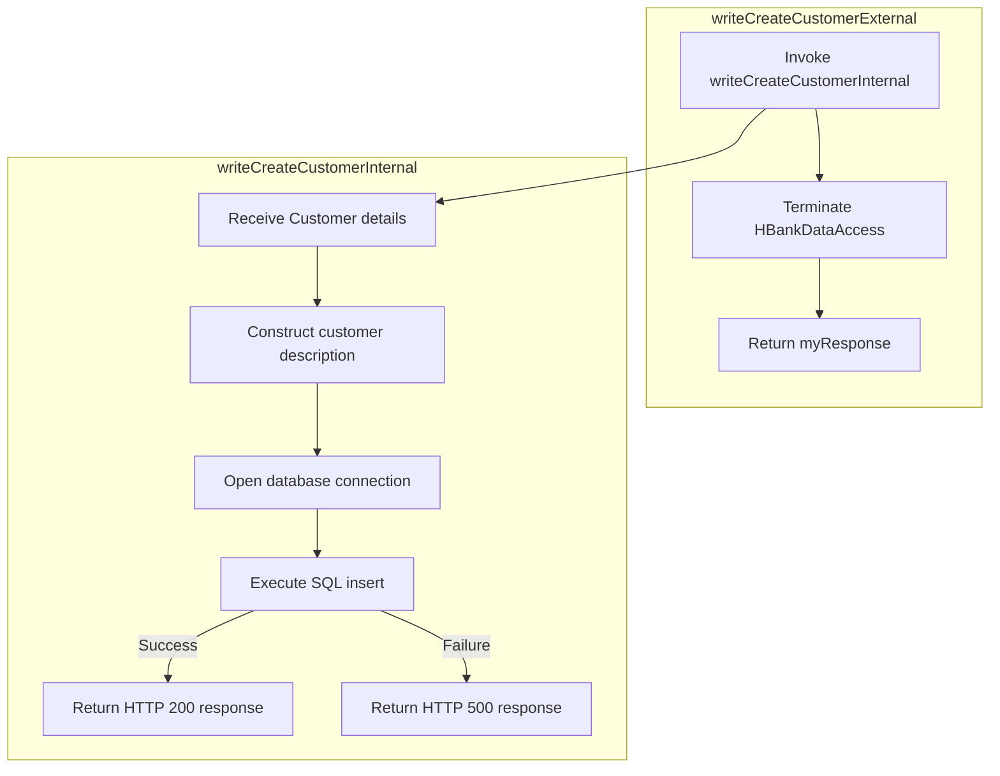

```mermaid
graph TD
  subgraph writeCreateCustomerInternal
    writeCreateCustomerInternal:A["Instantiate ProcessedTransaction object"] --> writeCreateCustomerInternal:B["Call writeCreateCustomer"]
    writeCreateCustomerInternal:B -->|Success| writeCreateCustomerInternal:C["Return HTTP 200 OK"]
    writeCreateCustomerInternal:B -->|Failure| writeCreateCustomerInternal:D["Return HTTP 500 Internal Server Error"]
  end
  subgraph writeCreateCustomer
    writeCreateCustomer:A["Initialize log entry"] --> writeCreateCustomer:B["Sort out date and time for task"]
    writeCreateCustomer:B --> writeCreateCustomer:C["Pad sort code"]
    writeCreateCustomer:C --> writeCreateCustomer:D["Pad customer number"]
    writeCreateCustomer:D --> writeCreateCustomer:E["Pad customer name"]
    writeCreateCustomer:E --> writeCreateCustomer:F["Sort out customer DOB"]
    writeCreateCustomer:F --> writeCreateCustomer:G["Open database connection"]
    writeCreateCustomer:G --> writeCreateCustomer:H["Prepare SQL insert statement"]
    writeCreateCustomer:H --> writeCreateCustomer:I["Execute SQL insert"]
    writeCreateCustomer:I -->|Success| writeCreateCustomer:J["Log success"]
    writeCreateCustomer:I -->|Failure| writeCreateCustomer:K["Log error"]
    writeCreateCustomer:J --> writeCreateCustomer:L["Return true"]
    writeCreateCustomer:K --> writeCreateCustomer:M["Return false"]
  end
  writeCreateCustomerInternal:B --> writeCreateCustomer

%% Swimm:
%% graph TD
%%   subgraph <SwmToken path="src/webui/src/main/java/com/ibm/cics/cip/bankliberty/api/json/ProcessedTransactionResource.java" pos="382:7:7" line-data="		Response myResponse = writeCreateCustomerInternal(myCreatedCustomer);">`writeCreateCustomerInternal`</SwmToken>
%%     <SwmToken path="src/webui/src/main/java/com/ibm/cics/cip/bankliberty/api/json/ProcessedTransactionResource.java" pos="382:7:7" line-data="		Response myResponse = writeCreateCustomerInternal(myCreatedCustomer);">`writeCreateCustomerInternal`</SwmToken>:A["Instantiate <SwmToken path="src/webui/src/main/java/com/ibm/cics/cip/bankliberty/api/json/ProcessedTransactionResource.java" pos="392:15:15" line-data="		com.ibm.cics.cip.bankliberty.web.db2.ProcessedTransaction myProcessedTransactionDB2 = new com.ibm.cics.cip.bankliberty.web.db2.ProcessedTransaction();">`ProcessedTransaction`</SwmToken> object"] --> <SwmToken path="src/webui/src/main/java/com/ibm/cics/cip/bankliberty/api/json/ProcessedTransactionResource.java" pos="382:7:7" line-data="		Response myResponse = writeCreateCustomerInternal(myCreatedCustomer);">`writeCreateCustomerInternal`</SwmToken>:B["Call <SwmToken path="src/webui/src/main/java/com/ibm/cics/cip/bankliberty/api/json/ProcessedTransactionResource.java" pos="395:6:6" line-data="		if (myProcessedTransactionDB2.writeCreateCustomer(">`writeCreateCustomer`</SwmToken>"]
%%     <SwmToken path="src/webui/src/main/java/com/ibm/cics/cip/bankliberty/api/json/ProcessedTransactionResource.java" pos="382:7:7" line-data="		Response myResponse = writeCreateCustomerInternal(myCreatedCustomer);">`writeCreateCustomerInternal`</SwmToken>:B -->|Success| <SwmToken path="src/webui/src/main/java/com/ibm/cics/cip/bankliberty/api/json/ProcessedTransactionResource.java" pos="382:7:7" line-data="		Response myResponse = writeCreateCustomerInternal(myCreatedCustomer);">`writeCreateCustomerInternal`</SwmToken>:C["Return HTTP 200 OK"]
%%     <SwmToken path="src/webui/src/main/java/com/ibm/cics/cip/bankliberty/api/json/ProcessedTransactionResource.java" pos="382:7:7" line-data="		Response myResponse = writeCreateCustomerInternal(myCreatedCustomer);">`writeCreateCustomerInternal`</SwmToken>:B -->|Failure| <SwmToken path="src/webui/src/main/java/com/ibm/cics/cip/bankliberty/api/json/ProcessedTransactionResource.java" pos="382:7:7" line-data="		Response myResponse = writeCreateCustomerInternal(myCreatedCustomer);">`writeCreateCustomerInternal`</SwmToken>:D["Return HTTP 500 Internal Server Error"]
%%   end
%%   subgraph <SwmToken path="src/webui/src/main/java/com/ibm/cics/cip/bankliberty/api/json/ProcessedTransactionResource.java" pos="395:6:6" line-data="		if (myProcessedTransactionDB2.writeCreateCustomer(">`writeCreateCustomer`</SwmToken>
%%     <SwmToken path="src/webui/src/main/java/com/ibm/cics/cip/bankliberty/api/json/ProcessedTransactionResource.java" pos="395:6:6" line-data="		if (myProcessedTransactionDB2.writeCreateCustomer(">`writeCreateCustomer`</SwmToken>:A["Initialize log entry"] --> <SwmToken path="src/webui/src/main/java/com/ibm/cics/cip/bankliberty/api/json/ProcessedTransactionResource.java" pos="395:6:6" line-data="		if (myProcessedTransactionDB2.writeCreateCustomer(">`writeCreateCustomer`</SwmToken>:B["Sort out date and time for task"]
%%     <SwmToken path="src/webui/src/main/java/com/ibm/cics/cip/bankliberty/api/json/ProcessedTransactionResource.java" pos="395:6:6" line-data="		if (myProcessedTransactionDB2.writeCreateCustomer(">`writeCreateCustomer`</SwmToken>:B --> <SwmToken path="src/webui/src/main/java/com/ibm/cics/cip/bankliberty/api/json/ProcessedTransactionResource.java" pos="395:6:6" line-data="		if (myProcessedTransactionDB2.writeCreateCustomer(">`writeCreateCustomer`</SwmToken>:C["Pad sort code"]
%%     <SwmToken path="src/webui/src/main/java/com/ibm/cics/cip/bankliberty/api/json/ProcessedTransactionResource.java" pos="395:6:6" line-data="		if (myProcessedTransactionDB2.writeCreateCustomer(">`writeCreateCustomer`</SwmToken>:C --> <SwmToken path="src/webui/src/main/java/com/ibm/cics/cip/bankliberty/api/json/ProcessedTransactionResource.java" pos="395:6:6" line-data="		if (myProcessedTransactionDB2.writeCreateCustomer(">`writeCreateCustomer`</SwmToken>:D["Pad customer number"]
%%     <SwmToken path="src/webui/src/main/java/com/ibm/cics/cip/bankliberty/api/json/ProcessedTransactionResource.java" pos="395:6:6" line-data="		if (myProcessedTransactionDB2.writeCreateCustomer(">`writeCreateCustomer`</SwmToken>:D --> <SwmToken path="src/webui/src/main/java/com/ibm/cics/cip/bankliberty/api/json/ProcessedTransactionResource.java" pos="395:6:6" line-data="		if (myProcessedTransactionDB2.writeCreateCustomer(">`writeCreateCustomer`</SwmToken>:E["Pad customer name"]
%%     <SwmToken path="src/webui/src/main/java/com/ibm/cics/cip/bankliberty/api/json/ProcessedTransactionResource.java" pos="395:6:6" line-data="		if (myProcessedTransactionDB2.writeCreateCustomer(">`writeCreateCustomer`</SwmToken>:E --> <SwmToken path="src/webui/src/main/java/com/ibm/cics/cip/bankliberty/api/json/ProcessedTransactionResource.java" pos="395:6:6" line-data="		if (myProcessedTransactionDB2.writeCreateCustomer(">`writeCreateCustomer`</SwmToken>:F["Sort out customer DOB"]
%%     <SwmToken path="src/webui/src/main/java/com/ibm/cics/cip/bankliberty/api/json/ProcessedTransactionResource.java" pos="395:6:6" line-data="		if (myProcessedTransactionDB2.writeCreateCustomer(">`writeCreateCustomer`</SwmToken>:F --> <SwmToken path="src/webui/src/main/java/com/ibm/cics/cip/bankliberty/api/json/ProcessedTransactionResource.java" pos="395:6:6" line-data="		if (myProcessedTransactionDB2.writeCreateCustomer(">`writeCreateCustomer`</SwmToken>:G["Open database connection"]
%%     <SwmToken path="src/webui/src/main/java/com/ibm/cics/cip/bankliberty/api/json/ProcessedTransactionResource.java" pos="395:6:6" line-data="		if (myProcessedTransactionDB2.writeCreateCustomer(">`writeCreateCustomer`</SwmToken>:G --> <SwmToken path="src/webui/src/main/java/com/ibm/cics/cip/bankliberty/api/json/ProcessedTransactionResource.java" pos="395:6:6" line-data="		if (myProcessedTransactionDB2.writeCreateCustomer(">`writeCreateCustomer`</SwmToken>:H["Prepare SQL insert statement"]
%%     <SwmToken path="src/webui/src/main/java/com/ibm/cics/cip/bankliberty/api/json/ProcessedTransactionResource.java" pos="395:6:6" line-data="		if (myProcessedTransactionDB2.writeCreateCustomer(">`writeCreateCustomer`</SwmToken>:H --> <SwmToken path="src/webui/src/main/java/com/ibm/cics/cip/bankliberty/api/json/ProcessedTransactionResource.java" pos="395:6:6" line-data="		if (myProcessedTransactionDB2.writeCreateCustomer(">`writeCreateCustomer`</SwmToken>:I["Execute SQL insert"]
%%     <SwmToken path="src/webui/src/main/java/com/ibm/cics/cip/bankliberty/api/json/ProcessedTransactionResource.java" pos="395:6:6" line-data="		if (myProcessedTransactionDB2.writeCreateCustomer(">`writeCreateCustomer`</SwmToken>:I -->|Success| <SwmToken path="src/webui/src/main/java/com/ibm/cics/cip/bankliberty/api/json/ProcessedTransactionResource.java" pos="395:6:6" line-data="		if (myProcessedTransactionDB2.writeCreateCustomer(">`writeCreateCustomer`</SwmToken>:J["Log success"]
%%     <SwmToken path="src/webui/src/main/java/com/ibm/cics/cip/bankliberty/api/json/ProcessedTransactionResource.java" pos="395:6:6" line-data="		if (myProcessedTransactionDB2.writeCreateCustomer(">`writeCreateCustomer`</SwmToken>:I -->|Failure| <SwmToken path="src/webui/src/main/java/com/ibm/cics/cip/bankliberty/api/json/ProcessedTransactionResource.java" pos="395:6:6" line-data="		if (myProcessedTransactionDB2.writeCreateCustomer(">`writeCreateCustomer`</SwmToken>:K["Log error"]
%%     <SwmToken path="src/webui/src/main/java/com/ibm/cics/cip/bankliberty/api/json/ProcessedTransactionResource.java" pos="395:6:6" line-data="		if (myProcessedTransactionDB2.writeCreateCustomer(">`writeCreateCustomer`</SwmToken>:J --> <SwmToken path="src/webui/src/main/java/com/ibm/cics/cip/bankliberty/api/json/ProcessedTransactionResource.java" pos="395:6:6" line-data="		if (myProcessedTransactionDB2.writeCreateCustomer(">`writeCreateCustomer`</SwmToken>:L["Return true"]
%%     <SwmToken path="src/webui/src/main/java/com/ibm/cics/cip/bankliberty/api/json/ProcessedTransactionResource.java" pos="395:6:6" line-data="		if (myProcessedTransactionDB2.writeCreateCustomer(">`writeCreateCustomer`</SwmToken>:K --> <SwmToken path="src/webui/src/main/java/com/ibm/cics/cip/bankliberty/api/json/ProcessedTransactionResource.java" pos="395:6:6" line-data="		if (myProcessedTransactionDB2.writeCreateCustomer(">`writeCreateCustomer`</SwmToken>:M["Return false"]
%%   end
%%   <SwmToken path="src/webui/src/main/java/com/ibm/cics/cip/bankliberty/api/json/ProcessedTransactionResource.java" pos="382:7:7" line-data="		Response myResponse = writeCreateCustomerInternal(myCreatedCustomer);">`writeCreateCustomerInternal`</SwmToken>:B --> <SwmToken path="src/webui/src/main/java/com/ibm/cics/cip/bankliberty/api/json/ProcessedTransactionResource.java" pos="395:6:6" line-data="		if (myProcessedTransactionDB2.writeCreateCustomer(">`writeCreateCustomer`</SwmToken>
```

This document explains the process of creating a new customer record. The process involves handling an HTTP POST request, processing the customer details, and inserting the new customer record into the database.

The flow starts with receiving an HTTP POST request containing the new customer's details. These details are then processed and passed to another method that handles the actual database insertion. The database insertion involves constructing a detailed description of the customer, opening a database connection, and executing an SQL insert statement. Finally, the response indicates whether the customer record was successfully created or if there was an error during the process.

Here is a high level diagram of the flow, showing only the most important functions:

```mermaid
graph TD;
      subgraph srcwebuisrcmainjavacomibmcicscipbankliberty[src/…/cip/bankliberty]
ef3d85d380d1b40ef0f71537c418079a6415e3db33aef3d33e99dd2ed861b511(ProcessedTransactionResource.writeCreateCustomerExternal) --> bb400a534440b9401ac2d666d2df4f9f623b1ef6222993ee227a19e55a791f2e(ProcessedTransactionResource.writeCreateCustomerInternal)
end

subgraph srcwebuisrcmainjavacomibmcicscipbankliberty[src/…/cip/bankliberty]
bb400a534440b9401ac2d666d2df4f9f623b1ef6222993ee227a19e55a791f2e(ProcessedTransactionResource.writeCreateCustomerInternal) --> 44eb8e80fc814784fe2bc4e9103b3ef6c69b5f7764dc767fcb489f84fc443637(ProcessedTransaction.writeCreateCustomer)
end


      classDef mainFlowStyle color:#000000,fill:#7CB9F4
classDef rootsStyle color:#000000,fill:#00FFF4
classDef Style1 color:#000000,fill:#00FFAA
classDef Style2 color:#000000,fill:#FFFF00
classDef Style3 color:#000000,fill:#AA7CB9

%% Swimm:
%% graph TD;
%%       subgraph srcwebuisrcmainjavacomibmcicscipbankliberty[<SwmPath>[src/…/cip/bankliberty/](src/webui/src/main/java/com/ibm/cics/cip/bankliberty/)</SwmPath>]
%% ef3d85d380d1b40ef0f71537c418079a6415e3db33aef3d33e99dd2ed861b511(ProcessedTransactionResource.writeCreateCustomerExternal) --> bb400a534440b9401ac2d666d2df4f9f623b1ef6222993ee227a19e55a791f2e(ProcessedTransactionResource.writeCreateCustomerInternal)
%% end
%% 
%% subgraph srcwebuisrcmainjavacomibmcicscipbankliberty[<SwmPath>[src/…/cip/bankliberty/](src/webui/src/main/java/com/ibm/cics/cip/bankliberty/)</SwmPath>]
%% bb400a534440b9401ac2d666d2df4f9f623b1ef6222993ee227a19e55a791f2e(ProcessedTransactionResource.writeCreateCustomerInternal) --> 44eb8e80fc814784fe2bc4e9103b3ef6c69b5f7764dc767fcb489f84fc443637(ProcessedTransaction.writeCreateCustomer)
%% end
%% 
%% 
%%       classDef mainFlowStyle color:#000000,fill:#7CB9F4
%% classDef rootsStyle color:#000000,fill:#00FFF4
%% classDef Style1 color:#000000,fill:#00FFAA
%% classDef Style2 color:#000000,fill:#FFFF00
%% classDef Style3 color:#000000,fill:#AA7CB9
```



# Flow drill down

## Zooming into <SwmToken path="src/webui/src/main/java/com/ibm/cics/cip/bankliberty/api/json/ProcessedTransactionResource.java" pos="379:5:5" line-data="	public Response writeCreateCustomerExternal(">`writeCreateCustomerExternal`</SwmToken>



<SwmSnippet path="/src/webui/src/main/java/com/ibm/cics/cip/bankliberty/api/json/ProcessedTransactionResource.java" line="375">

---

## <SwmToken path="src/webui/src/main/java/com/ibm/cics/cip/bankliberty/api/json/ProcessedTransactionResource.java" pos="379:5:5" line-data="	public Response writeCreateCustomerExternal(">`writeCreateCustomerExternal`</SwmToken>

First, the <SwmToken path="src/webui/src/main/java/com/ibm/cics/cip/bankliberty/api/json/ProcessedTransactionResource.java" pos="379:5:5" line-data="	public Response writeCreateCustomerExternal(">`writeCreateCustomerExternal`</SwmToken> method is invoked to handle the creation of a new customer record. This method is annotated with <SwmToken path="src/webui/src/main/java/com/ibm/cics/cip/bankliberty/api/json/ProcessedTransactionResource.java" pos="375:1:2" line-data="	@POST">`@POST`</SwmToken>, indicating that it handles HTTP POST requests, and it consumes and produces JSON data.

```java
	@POST
	@Produces("application/json")
	@Consumes(MediaType.APPLICATION_JSON)
	@Path("/createCustomer")
	public Response writeCreateCustomerExternal(
```

---

</SwmSnippet>

<SwmSnippet path="/src/webui/src/main/java/com/ibm/cics/cip/bankliberty/api/json/ProcessedTransactionResource.java" line="380">

---

Next, the method takes in a <SwmToken path="src/webui/src/main/java/com/ibm/cics/cip/bankliberty/api/json/ProcessedTransactionResource.java" pos="380:1:1" line-data="			ProcessedTransactionCreateCustomerJSON myCreatedCustomer)">`ProcessedTransactionCreateCustomerJSON`</SwmToken> object, which contains the details of the customer to be created. This object is passed to the <SwmToken path="src/webui/src/main/java/com/ibm/cics/cip/bankliberty/api/json/ProcessedTransactionResource.java" pos="382:7:7" line-data="		Response myResponse = writeCreateCustomerInternal(myCreatedCustomer);">`writeCreateCustomerInternal`</SwmToken> method to handle the actual database insertion.

```java
			ProcessedTransactionCreateCustomerJSON myCreatedCustomer)
	{
		Response myResponse = writeCreateCustomerInternal(myCreatedCustomer);
```

---

</SwmSnippet>

<SwmSnippet path="/src/webui/src/main/java/com/ibm/cics/cip/bankliberty/api/json/ProcessedTransactionResource.java" line="383">

---

Then, a new instance of <SwmToken path="src/webui/src/main/java/com/ibm/cics/cip/bankliberty/api/json/ProcessedTransactionResource.java" pos="383:1:1" line-data="		HBankDataAccess myHBankDataAccess = new HBankDataAccess();">`HBankDataAccess`</SwmToken> is created to manage the database connection. The <SwmToken path="src/webui/src/main/java/com/ibm/cics/cip/bankliberty/api/json/ProcessedTransactionResource.java" pos="384:3:3" line-data="		myHBankDataAccess.terminate();">`terminate`</SwmToken> method is called on this instance to ensure that the database connection is properly closed after the operation is complete.

```java
		HBankDataAccess myHBankDataAccess = new HBankDataAccess();
		myHBankDataAccess.terminate();
```

---

</SwmSnippet>

<SwmSnippet path="/src/webui/src/main/java/com/ibm/cics/cip/bankliberty/api/json/ProcessedTransactionResource.java" line="385">

---

Finally, the response from the <SwmToken path="src/webui/src/main/java/com/ibm/cics/cip/bankliberty/api/json/ProcessedTransactionResource.java" pos="382:7:7" line-data="		Response myResponse = writeCreateCustomerInternal(myCreatedCustomer);">`writeCreateCustomerInternal`</SwmToken> method is returned. This response indicates whether the customer record was successfully created or if there was an error during the process.

```java
		return myResponse;
	}
```

---

</SwmSnippet>

## Inside <SwmToken path="src/webui/src/main/java/com/ibm/cics/cip/bankliberty/api/json/ProcessedTransactionResource.java" pos="382:7:7" line-data="		Response myResponse = writeCreateCustomerInternal(myCreatedCustomer);">`writeCreateCustomerInternal`</SwmToken> & <SwmToken path="src/webui/src/main/java/com/ibm/cics/cip/bankliberty/api/json/ProcessedTransactionResource.java" pos="395:6:6" line-data="		if (myProcessedTransactionDB2.writeCreateCustomer(">`writeCreateCustomer`</SwmToken>



<SwmSnippet path="/src/webui/src/main/java/com/ibm/cics/cip/bankliberty/api/json/ProcessedTransactionResource.java" line="389">

---

## Handling the customer creation request

First, the <SwmToken path="src/webui/src/main/java/com/ibm/cics/cip/bankliberty/api/json/ProcessedTransactionResource.java" pos="389:5:5" line-data="	public Response writeCreateCustomerInternal(">`writeCreateCustomerInternal`</SwmToken> method receives a <SwmToken path="src/webui/src/main/java/com/ibm/cics/cip/bankliberty/api/json/ProcessedTransactionResource.java" pos="390:1:1" line-data="			ProcessedTransactionCreateCustomerJSON myCreatedCustomer)">`ProcessedTransactionCreateCustomerJSON`</SwmToken> object containing the details of the new customer. This method is responsible for processing the customer creation request by delegating the task to the <SwmToken path="src/webui/src/main/java/com/ibm/cics/cip/bankliberty/api/json/ProcessedTransactionResource.java" pos="395:6:6" line-data="		if (myProcessedTransactionDB2.writeCreateCustomer(">`writeCreateCustomer`</SwmToken> method.

```java
	public Response writeCreateCustomerInternal(
			ProcessedTransactionCreateCustomerJSON myCreatedCustomer)
	{
		com.ibm.cics.cip.bankliberty.web.db2.ProcessedTransaction myProcessedTransactionDB2 = new com.ibm.cics.cip.bankliberty.web.db2.ProcessedTransaction();
		

		if (myProcessedTransactionDB2.writeCreateCustomer(
				myCreatedCustomer.getSortCode(),
				myCreatedCustomer.getAccountNumber(), 0.00,
				myCreatedCustomer.getCustomerDOB(),
				myCreatedCustomer.getCustomerName(),
				myCreatedCustomer.getCustomerNumber()))
		{
			return Response.ok().build();
		}
		else
		{
			return Response.serverError().build();
		}

	}
```

---

</SwmSnippet>

<SwmSnippet path="/src/webui/src/main/java/com/ibm/cics/cip/bankliberty/web/db2/ProcessedTransaction.java" line="693">

---

## Inserting the customer record into the database

Next, the <SwmToken path="src/webui/src/main/java/com/ibm/cics/cip/bankliberty/web/db2/ProcessedTransaction.java" pos="693:5:5" line-data="	public boolean writeCreateCustomer(String sortCode2, String accountNumber,">`writeCreateCustomer`</SwmToken> method in the <SwmToken path="src/webui/src/main/java/com/ibm/cics/cip/bankliberty/api/json/ProcessedTransactionResource.java" pos="392:15:15" line-data="		com.ibm.cics.cip.bankliberty.web.db2.ProcessedTransaction myProcessedTransactionDB2 = new com.ibm.cics.cip.bankliberty.web.db2.ProcessedTransaction();">`ProcessedTransaction`</SwmToken> class is called to handle the actual insertion of the customer record into the database. This method constructs a detailed description of the customer using the provided details, such as sort code, account number, date of birth, customer name, and customer number. It then opens a database connection and executes an SQL insert statement to add the new customer record to the database.

```java
	public boolean writeCreateCustomer(String sortCode2, String accountNumber,
			double amountWhichWillBeZero, Date customerDOB, String customerName,
			String customerNumber)
	{
		logger.entering(this.getClass().getName(), WRITE_CREATE_CUSTOMER);
		sortOutDateTimeTaskString();
		String createCustomerDescription = "";
		createCustomerDescription = createCustomerDescription
				.concat(padSortCode(Integer.parseInt(sortCode2)));

		createCustomerDescription = createCustomerDescription
				.concat(padCustomerNumber(customerNumber));
		StringBuilder myStringBuilder = new StringBuilder();
		for (int z = customerName.length(); z < 14; z++)
		{
			myStringBuilder.append("0");
		}
		myStringBuilder.append(customerName);
		createCustomerDescription = createCustomerDescription
				.concat(myStringBuilder.substring(0, 14));

```

---

</SwmSnippet>

&nbsp;

*This is an auto-generated document by Swimm 🌊 and has not yet been verified by a human*

<SwmMeta version="3.0.0" repo-id="Z2l0aHViJTNBJTNBY2ljcy1iYW5raW5nLXNhbXBsZS1hcHBsaWNhdGlvbi1jYnNhLUlCTS1EZW1vJTNBJTNBU3dpbW0tRGVtbw==" repo-name="cics-banking-sample-application-cbsa-IBM-Demo"><sup>Powered by [Swimm](/)</sup></SwmMeta>
