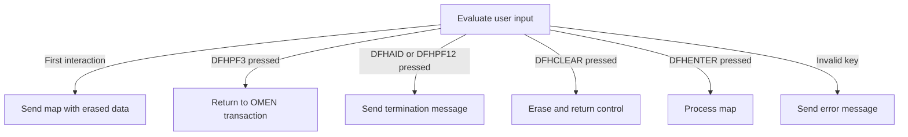
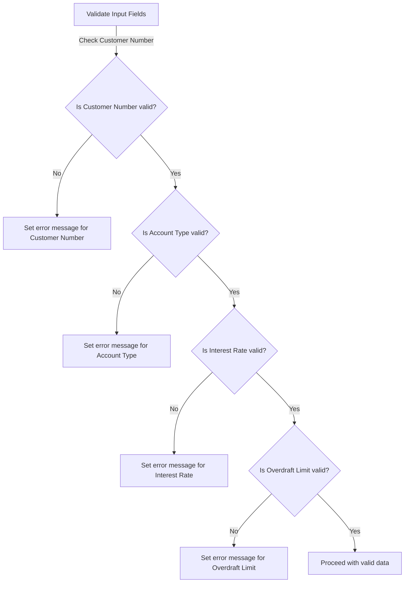
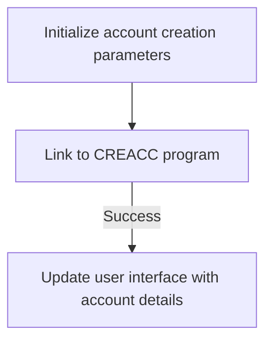

The <SwmToken path="src/base/cobol_src/BNK1CAC.cbl" pos="16:6:6" line-data="       PROGRAM-ID. BNK1CAC.">`BNK1CAC`</SwmToken> program is designed to manage the initial user input for creating a bank account. It evaluates the input and, upon successful verification, links to the CREACC program to add the account to the datastore. The program handles various user actions, such as sending a map with erased data for first-time interactions, processing input data, and managing termination actions. The flow receives user input through a CICS transaction and returns control to the system with updated account information. The main steps are:

- Evaluate user input and determine the interaction type.
- Handle specific key presses for navigation and termination.
- Process valid input data and send error messages for invalid keys.
- Link to the CREACC program for account creation.

For instance, if a user presses the ENTER key after inputting their data, the program processes the map and proceeds with account creation.

# Handling Initial User Input



<SwmSnippet path="/src/base/cobol_src/BNK1CAC.cbl" line="161">

---

Here, we check EIBCALEN to determine if it's the first interaction. If true, we prepare to send a blank map by setting <SwmToken path="src/base/cobol_src/BNK1CAC.cbl" pos="172:3:5" line-data="                 SET SEND-ERASE TO TRUE">`SEND-ERASE`</SwmToken> to TRUE and call <SwmToken path="src/base/cobol_src/BNK1CAC.cbl" pos="174:3:5" line-data="                 PERFORM SEND-MAP">`SEND-MAP`</SwmToken> to prompt user input.

```cobol
       A010.

           EVALUATE TRUE

      *
      *       Is it the first time through? If so, send the map
      *       with erased (empty) data fields.
      *
              WHEN EIBCALEN = ZERO
                 MOVE LOW-VALUE TO BNK1CAO
                 MOVE -1 TO CUSTNOL
                 SET SEND-ERASE TO TRUE
                 MOVE SPACES TO MESSAGEO
                 PERFORM SEND-MAP
```

---

</SwmSnippet>

<SwmSnippet path="/src/base/cobol_src/BNK1CAC.cbl" line="179">

---

Next, we handle specific user actions with EIBAID values <SwmToken path="src/base/cobol_src/BNK1CAC.cbl" pos="179:7:7" line-data="              WHEN EIBAID = DFHPA1 OR DFHPA2 OR DFHPA3">`DFHPA1`</SwmToken>, <SwmToken path="src/base/cobol_src/BNK1CAC.cbl" pos="179:11:11" line-data="              WHEN EIBAID = DFHPA1 OR DFHPA2 OR DFHPA3">`DFHPA2`</SwmToken>, or <SwmToken path="src/base/cobol_src/BNK1CAC.cbl" pos="179:15:15" line-data="              WHEN EIBAID = DFHPA1 OR DFHPA2 OR DFHPA3">`DFHPA3`</SwmToken>, which are expected inputs that do not require immediate action, allowing the flow to continue without interruption.

```cobol
              WHEN EIBAID = DFHPA1 OR DFHPA2 OR DFHPA3
                 CONTINUE
```

---

</SwmSnippet>

<SwmSnippet path="/src/base/cobol_src/BNK1CAC.cbl" line="185">

---

Next, we handle the PF3 key press, which is used for exiting, by executing a CICS RETURN to terminate the transaction and return control to a specified transaction ID.

```cobol
              WHEN EIBAID = DFHPF3
                 EXEC CICS RETURN
                    TRANSID('OMEN')
                    IMMEDIATE
                    RESP(WS-CICS-RESP)
                    RESP2(WS-CICS-RESP2)
                 END-EXEC
```

---

</SwmSnippet>

<SwmSnippet path="/src/base/cobol_src/BNK1CAC.cbl" line="197">

---

Next, we handle termination actions triggered by specific keys by performing <SwmToken path="src/base/cobol_src/BNK1CAC.cbl" pos="198:3:7" line-data="                 PERFORM SEND-TERMINATION-MSG">`SEND-TERMINATION-MSG`</SwmToken> to inform the user and executing a CICS RETURN to close the transaction.

```cobol
              WHEN EIBAID = DFHAID OR DFHPF12
                 PERFORM SEND-TERMINATION-MSG
                 EXEC CICS
                    RETURN
                 END-EXEC
```

---

</SwmSnippet>

<SwmSnippet path="/src/base/cobol_src/BNK1CAC.cbl" line="206">

---

Next, we handle the CLEAR key press, which resets the screen, by executing CICS SEND CONTROL with ERASE and FREEKB to clear the screen and unlock the keyboard, preparing the system for new input.

```cobol
              WHEN EIBAID = DFHCLEAR
                 EXEC CICS SEND CONTROL
                          ERASE
                          FREEKB
                 END-EXEC

                 EXEC CICS RETURN
                 END-EXEC
```

---

</SwmSnippet>

<SwmSnippet path="/src/base/cobol_src/BNK1CAC.cbl" line="218">

---

Next, we handle the ENTER key press, which indicates completion of input, by performing <SwmToken path="src/base/cobol_src/BNK1CAC.cbl" pos="219:3:5" line-data="                 PERFORM PROCESS-MAP">`PROCESS-MAP`</SwmToken> to process the input data.

```cobol
              WHEN EIBAID = DFHENTER
                 PERFORM PROCESS-MAP
```

---

</SwmSnippet>

<SwmSnippet path="/src/base/cobol_src/BNK1CAC.cbl" line="224">

---

Finally, we handle unrecognized key presses by setting an error message to inform the user and calling <SwmToken path="src/base/cobol_src/BNK1CAC.cbl" pos="229:3:5" line-data="                 PERFORM SEND-MAP">`SEND-MAP`</SwmToken> to prompt the user to try again.

```cobol
              WHEN OTHER
                 MOVE LOW-VALUES TO BNK1CAO
                 MOVE SPACES TO MESSAGEO
                 MOVE 'Invalid key pressed.' TO MESSAGEO
                 SET SEND-DATAONLY-ALARM TO TRUE
                 PERFORM SEND-MAP

           END-EVALUATE.
```

---

</SwmSnippet>

<SwmSnippet path="/src/base/cobol_src/BNK1CAC.cbl" line="239">

---

Next, we check if the communication area length is not zero to ensure data is moved to working storage for further processing, or initialize it if zero to prevent residual data issues.

```cobol
            IF EIBCALEN NOT = 0
               MOVE SUBPGM-CUSTNO     TO WS-COMM-CUSTNO
               MOVE SUBPGM-ACC-TYPE   TO WS-COMM-ACCTYPE
               MOVE SUBPGM-INT-RT     TO WS-COMM-INTRT
               MOVE SUBPGM-OVERDR-LIM TO WS-COMM-OVERDR
            ELSE
               INITIALIZE WS-COMM-AREA
            END-IF.
```

---

</SwmSnippet>

<SwmSnippet path="/src/base/cobol_src/BNK1CAC.cbl" line="248">

---

Finally, we execute a CICS RETURN to conclude the transaction, returning control with the communication area to prepare the system for the next operation.

```cobol
            EXEC CICS
               RETURN TRANSID('OCAC')
               COMMAREA(WS-COMM-AREA)
               LENGTH(32)
               RESP(WS-CICS-RESP)
               RESP2(WS-CICS-RESP2)
            END-EXEC.
```

---

</SwmSnippet>

# Validating User Input



<SwmSnippet path="/src/base/cobol_src/BNK1CAC.cbl" line="429">

---

Here, we perform validation on incoming fields using DEEDIT to ensure the customer number is correctly formatted, maintaining data integrity.

```cobol
       ED010.
      *
      *    Perform validation on the incoming fields
      *
           EXEC CICS BIF DEEDIT
              FIELD(CUSTNOI)
           END-EXEC.
```

---

</SwmSnippet>

<SwmSnippet path="/src/base/cobol_src/BNK1CAC.cbl" line="437">

---

Next, we check if the customer number is less than 1 or not entered to ensure validity, prompting for a valid 10-digit number and directing to error handling if invalid.

```cobol
           IF CUSTNOL < 1 OR CUSTNOI = '__________'
              MOVE SPACES TO MESSAGEO
              STRING 'Please enter a 10 digit Customer Number '
                    DELIMITED BY SIZE,
                     ' ' DELIMITED BY SIZE
                 INTO MESSAGEO
              MOVE 'N' TO VALID-DATA-SW
              MOVE -1 TO CUSTNOL
              GO TO ED999
           END-IF.
```

---

</SwmSnippet>

<SwmSnippet path="/src/base/cobol_src/BNK1CAC.cbl" line="448">

---

Next, we check if the customer number is numeric to ensure correct format, directing to error handling if non-numeric.

```cobol
           IF CUSTNOI NOT NUMERIC
              MOVE SPACES TO MESSAGEO
              STRING 'Please enter a numeric Customer number '
                    DELIMITED BY SIZE,
                     ' ' DELIMITED BY SIZE
                 INTO MESSAGEO
              MOVE 'N' TO VALID-DATA-SW
              MOVE -1 TO CUSTNOL
              GO TO ED999
           END-IF.
```

---

</SwmSnippet>

<SwmSnippet path="/src/base/cobol_src/BNK1CAC.cbl" line="459">

---

Next, we check if the account type is entered and valid to ensure correct specification, directing to error handling if invalid.

```cobol
           IF ACCTYPI = '________' OR ACCTYPL < 1
              MOVE SPACES TO MESSAGEO
              STRING 'Account Type should be ISA,CURRENT,LOAN,'
                 DELIMITED BY SIZE,
                    'SAVING or MORTGAGE' DELIMITED BY SIZE
                 INTO MESSAGEO
              MOVE 'N' TO VALID-DATA-SW
              move -1 to acctypl
              GO TO ED999
           END-IF.
```

---

</SwmSnippet>

<SwmSnippet path="/src/base/cobol_src/BNK1CAC.cbl" line="470">

---

Next, we prepare the message output and evaluate the account type input to ensure it matches expected values, standardizing it for correct processing.

```cobol
           MOVE SPACES TO MESSAGEO.

           IF ACCTYPL > 0

              EVALUATE ACCTYPI
                 WHEN 'ISA_____'
                    MOVE 'ISA     ' TO ACCTYPI
                    CONTINUE
                 WHEN 'isa_____'
                    MOVE 'ISA     ' TO ACCTYPI
                    CONTINUE
                 WHEN 'ISA     '
                    CONTINUE
                 WHEN 'isa     '
                    MOVE 'ISA     ' TO ACCTYPI
                    CONTINUE
                 WHEN 'CURRENT_'
                    MOVE 'CURRENT ' TO ACCTYPI
                    CONTINUE
                 WHEN 'current_'
                    MOVE 'CURRENT ' TO ACCTYPI
                    CONTINUE
                 WHEN 'CURRENT '
                    CONTINUE
                 WHEN 'current '
                    MOVE 'CURRENT ' TO ACCTYPI
                    CONTINUE
                 WHEN 'LOAN____'
                    MOVE 'LOAN    ' TO ACCTYPI
                    CONTINUE
                 WHEN 'loan____'
                    MOVE 'LOAN    ' TO ACCTYPI
                    CONTINUE
                 WHEN 'loan    '
                    MOVE 'LOAN    ' TO ACCTYPI
                    CONTINUE
                 WHEN 'LOAN    '
                    CONTINUE
                 WHEN 'SAVING__'
                    MOVE 'SAVING  ' TO ACCTYPI
                    CONTINUE
                 WHEN 'saving__'
                    MOVE 'SAVING  ' TO ACCTYPI
                    CONTINUE
                 WHEN 'saving  '
                    MOVE 'SAVING  ' TO ACCTYPI
                    CONTINUE
                 WHEN 'SAVING  '
                    CONTINUE
                 WHEN 'MORTGAGE'
                    CONTINUE
                 WHEN 'mortgage'
                    MOVE 'MORTGAGE' TO ACCTYPI
                    CONTINUE
```

---

</SwmSnippet>

<SwmSnippet path="/src/base/cobol_src/BNK1CAC.cbl" line="524">

---

Next, we handle invalid account type input by setting an error message to inform the user and directing to error handling for correction.

```cobol
                 WHEN OTHER
                    MOVE SPACES TO MESSAGEO
                    STRING 'Account Type should be ISA,CURRENT,LOAN,'
                       DELIMITED BY SIZE,
                       'SAVING or MORTGAGE' DELIMITED BY SIZE
                       INTO MESSAGEO
                    MOVE 'N' TO VALID-DATA-SW
                    MOVE -1 TO ACCTYPL
                    GO TO ED999

              END-EVALUATE

           END-IF.
```

---

</SwmSnippet>

<SwmSnippet path="/src/base/cobol_src/BNK1CAC.cbl" line="538">

---

Next, we check if the interest rate length is zero to ensure it is entered, setting an error message and directing to error handling for completion.

```cobol
           IF INTRTL = ZERO
              MOVE SPACES TO MESSAGEO
              STRING 'Please supply a numeric interest rate'
                    DELIMITED BY SIZE,
              INTO MESSAGEO
              MOVE 'N' TO VALID-DATA-SW
              MOVE -1 TO INTRTL
              GO TO ED999
           END-IF
```

---

</SwmSnippet>

<SwmSnippet path="/src/base/cobol_src/BNK1CAC.cbl" line="548">

---

Next, we check if the interest rate input is numeric by tallying numeric characters to ensure correct format, directing to error handling if non-numeric.

```cobol
           IF INTRTI(1:INTRTL) IS NOT NUMERIC
              MOVE ZERO TO WS-NUM-COUNT-TOTAL
              INSPECT INTRTI(1:INTRTL) TALLYING
                 WS-NUM-COUNT-TOTAL FOR ALL '0'
                 WS-NUM-COUNT-TOTAL FOR ALL '1'
                 WS-NUM-COUNT-TOTAL FOR ALL '2'
                 WS-NUM-COUNT-TOTAL FOR ALL '3'
                 WS-NUM-COUNT-TOTAL FOR ALL '4'
                 WS-NUM-COUNT-TOTAL FOR ALL '5'
                 WS-NUM-COUNT-TOTAL FOR ALL '6'
                 WS-NUM-COUNT-TOTAL FOR ALL '7'
                 WS-NUM-COUNT-TOTAL FOR ALL '8'
                 WS-NUM-COUNT-TOTAL FOR ALL '9'
                 WS-NUM-COUNT-TOTAL FOR ALL '.'
                 WS-NUM-COUNT-TOTAL FOR ALL '-'
                 WS-NUM-COUNT-TOTAL FOR ALL '+'
                 WS-NUM-COUNT-TOTAL FOR ALL ' '
```

---

</SwmSnippet>

<SwmSnippet path="/src/base/cobol_src/BNK1CAC.cbl" line="575">

---

Next, we verify that the numeric tally matches the input length to ensure the input is entirely numeric, directing to error handling if not.

```cobol
              IF WS-NUM-COUNT-TOTAL < INTRTL
                 MOVE SPACES TO MESSAGEO
                 STRING 'Please supply a numeric interest rate'
                      DELIMITED BY SIZE,
                 INTO MESSAGEO
                 MOVE 'N' TO VALID-DATA-SW
                 MOVE -1 TO INTRTL
                 GO TO ED999
              END-IF
```

---

</SwmSnippet>

<SwmSnippet path="/src/base/cobol_src/BNK1CAC.cbl" line="588">

---

Next, we initialize the count of decimal points in the interest rate input to verify it meets valid numeric format constraints.

```cobol
              MOVE ZERO TO WS-NUM-COUNT-POINT

              INSPECT INTRTI(1:INTRTL) TALLYING
                 WS-NUM-COUNT-POINT for ALL '.'
```

---

</SwmSnippet>

<SwmSnippet path="/src/base/cobol_src/BNK1CAC.cbl" line="594">

---

Next, we check for more than one decimal point in the interest rate input to ensure valid format, setting an error message and directing to error handling for correction.

```cobol
              IF WS-NUM-COUNT-POINT > 1
                 MOVE SPACES TO MESSAGEO
                 STRING 'Use one decimal point for interest rate only'
                      DELIMITED BY SIZE,
                 INTO MESSAGEO
                 MOVE 'N' TO VALID-DATA-SW
                 MOVE -1 TO INTRTL
                 GO TO ED999
              END-If
```

---

</SwmSnippet>

<SwmSnippet path="/src/base/cobol_src/BNK1CAC.cbl" line="606">

---

Next, we handle the scenario with exactly one decimal point by tallying characters after it to ensure the interest rate meets decimal precision constraints.

```cobol
              IF WS-NUM-COUNT-POINT = 1
                 MOVE ZERO TO WS-NUM-COUNT-TOTAL
                 INSPECT INTRTI(1:INTRTL) TALLYING
                    WS-NUM-COUNT-TOTAL FOR CHARACTERS AFTER '.'
```

---

</SwmSnippet>

<SwmSnippet path="/src/base/cobol_src/BNK1CAC.cbl" line="611">

---

Next, we check for excessive precision after the decimal point to ensure the interest rate meets precision constraints, setting an error message and directing to error handling for correction.

```cobol
                 IF WS-NUM-COUNT-TOTAL > 2
      *
      *             There are more than 2 characters after the point
      *
                    MOVE ZERO TO WS-NUM-COUNT-TOTAL WS-NUM-COUNT-POINT
                    INSPECT INTRTI(1:INTRTL) TALLYING
                       WS-NUM-COUNT-POINT FOR CHARACTERS BEFORE '.'

                    ADD 2 TO WS-NUM-COUNT-POINT
                       GIVING WS-NUM-COUNT-POINT

                    INSPECT INTRTI(WS-NUM-COUNT-POINT:INTRTL) TALLYING
                       WS-NUM-COUNT-TOTAL FOR ALL '0'
                       WS-NUM-COUNT-TOTAL FOR ALL '1'
                       WS-NUM-COUNT-TOTAL FOR ALL '2'
                       WS-NUM-COUNT-TOTAL FOR ALL '3'
                       WS-NUM-COUNT-TOTAL FOR ALL '4'
                       WS-NUM-COUNT-TOTAL FOR ALL '5'
                       WS-NUM-COUNT-TOTAL FOR ALL '6'
                       WS-NUM-COUNT-TOTAL FOR ALL '7'
                       WS-NUM-COUNT-TOTAL FOR ALL '8'
                       WS-NUM-COUNT-TOTAL FOR ALL '9'
                       WS-NUM-COUNT-TOTAL FOR ALL '-'
                       WS-NUM-COUNT-TOTAL FOR ALL '+'
                       AFTER '.'

                    IF WS-NUM-COUNT-TOTAL > 2
      *
      *                More than two of them are numeric
      *
                       MOVE SPACES TO MESSAGEO
                       STRING
                         'Only up to two decimal places are supported'
                         DELIMITED BY SIZE,
                       INTO MESSAGEO

                       MOVE 'N' TO VALID-DATA-SW
                       MOVE -1 TO INTRTL
                       GO TO ED999
                    END-IF

                 END-IF
```

---

</SwmSnippet>

<SwmSnippet path="/src/base/cobol_src/BNK1CAC.cbl" line="663">

---

Next, we check if the interest rate is negative to ensure it is within acceptable bounds, setting an error message and directing to error handling for correction.

```cobol
           IF INTRTI-COMP-1 < 0
              MOVE SPACES TO MESSAGEO
              STRING 'Please supply a zero or positive interest rate'
                    DELIMITED BY SIZE,
              INTO MESSAGEO
              MOVE 'N' TO VALID-DATA-SW
              MOVE -1 TO INTRTL
              GO TO ED999
           END-IF
```

---

</SwmSnippet>

<SwmSnippet path="/src/base/cobol_src/BNK1CAC.cbl" line="673">

---

Next, we check if the interest rate exceeds <SwmToken path="src/base/cobol_src/BNK1CAC.cbl" pos="673:11:13" line-data="           IF INTRTI-COMP-1 &gt; 9999.99">`9999.99`</SwmToken>% to ensure it is within acceptable bounds, setting an error message and directing to error handling for correction.

```cobol
           IF INTRTI-COMP-1 > 9999.99
              MOVE SPACES TO MESSAGEO
              STRING 'Please supply an interest rate less than 9999.99%'
                    DELIMITED BY SIZE,
              INTO MESSAGEO
              MOVE 'N' TO VALID-DATA-SW
              MOVE -1 TO INTRTL
              GO TO ED999
           END-IF
```

---

</SwmSnippet>

<SwmSnippet path="/src/base/cobol_src/BNK1CAC.cbl" line="683">

---

Next, we prepare the overdraft limit input for validation by reversing it and tallying leading spaces to accurately determine the actual numeric length.

```cobol
           MOVE FUNCTION REVERSE(OVERDRI) TO WS-REVERSE
           MOVE ZERO TO WS-NUM-COUNT-TOTAL
           INSPECT WS-REVERSE TALLYING WS-NUM-COUNT-TOTAL
           FOR LEADING SPACES
           SUBTRACT WS-NUM-COUNT-TOTAL FROM OVERDRL
             GIVING OVERDRL
           MOVE ZERO TO WS-NUM-COUNT-TOTAL
           INSPECT OVERDRI(1:OVERDRL) TALLYING
              WS-NUM-COUNT-TOTAL FOR ALL '0'
              WS-NUM-COUNT-TOTAL FOR ALL '1'
              WS-NUM-COUNT-TOTAL FOR ALL '2'
              WS-NUM-COUNT-TOTAL FOR ALL '3'
              WS-NUM-COUNT-TOTAL FOR ALL '4'
              WS-NUM-COUNT-TOTAL FOR ALL '5'
              WS-NUM-COUNT-TOTAL FOR ALL '6'
              WS-NUM-COUNT-TOTAL FOR ALL '7'
              WS-NUM-COUNT-TOTAL FOR ALL '8'
              WS-NUM-COUNT-TOTAL FOR ALL '9'.
```

---

</SwmSnippet>

<SwmSnippet path="/src/base/cobol_src/BNK1CAC.cbl" line="701">

---

Next, we check if the overdraft limit input is numeric by tallying numeric characters to ensure correct format, directing to error handling if non-numeric.

```cobol
           IF WS-NUM-COUNT-TOTAL < OVERDRL
              MOVE SPACES TO MESSAGEO
              MOVE 'Overdraft Limit must be numeric positive int' TO
                 MESSAGEO
              MOVE 'N' TO VALID-DATA-SW
              MOVE -1 TO OVERDRL
              GO TO ED999
           END-IF.
```

---

</SwmSnippet>

<SwmSnippet path="/src/base/cobol_src/BNK1CAC.cbl" line="710">

---

Next, we use DEEDIT to format the overdraft limit input to ensure it is in the correct format before proceeding.

```cobol
           EXEC CICS BIF DEEDIT FIELD(OVERDRI)
           END-EXEC.
```

---

</SwmSnippet>

<SwmSnippet path="/src/base/cobol_src/BNK1CAC.cbl" line="717">

---

Next, we check if the overdraft limit is less than 1 or not entered to ensure it is initialized to a valid state, setting it to zero if true.

```cobol
           IF OVERDRL < 1 OR OVERDRI = '________' or overdri = spaces
              MOVE ZERO TO OVERDRI
           END-IF.
```

---

</SwmSnippet>

<SwmSnippet path="/src/base/cobol_src/BNK1CAC.cbl" line="724">

---

Finally, we check if the overdraft limit input is numeric to ensure correct format, directing to error handling if non-numeric.

```cobol
           IF OVERDRI NOT NUMERIC
              MOVE SPACES TO MESSAGEO
              MOVE 'The Overdraft Limit must be numeric ' TO
                 MESSAGEO
              MOVE 'N' TO VALID-DATA-SW
```

---

</SwmSnippet>

# Setting Up Account Creation



<SwmSnippet path="/src/base/cobol_src/BNK1CAC.cbl" line="749">

---

Here, we set up fields for account creation, initializing parameters and calling <SwmToken path="src/base/cobol_src/BNK1CAC.cbl" pos="281:3:7" line-data="                PERFORM POPULATE-TIME-DATE">`POPULATE-TIME-DATE`</SwmToken> to ensure date and time fields are accurately populated for recording account creation.

```cobol
       CAD010.
      *
      *    Set up the fields required by CREACC then link to it
      *
           INITIALIZE SUBPGM-PARMS.
           MOVE 'ACCT' TO SUBPGM-EYECATCHER.
           MOVE 'N' TO SUBPGM-SUCCESS.

           MOVE CUSTNOI      TO SUBPGM-CUSTNO.
           MOVE ZEROS        TO SUBPGM-SORTCODE.
           MOVE ZEROS        TO SUBPGM-NUMBER.

           MOVE ACCTYPI      TO SUBPGM-ACC-TYPE.

           COMPUTE INTRTI-COMP-1 = FUNCTION NUMVAL(INTRTI)

           MOVE INTRTI-COMP-1 TO SUBPGM-INT-RT.

           MOVE ZEROS        TO SUBPGM-OPENED.
           MOVE OVERDRI      TO SUBPGM-OVERDR-LIM.
           MOVE ZEROS        TO SUBPGM-LAST-STMT-DT.
           MOVE ZEROS        TO SUBPGM-NEXT-STMT-DT.
           MOVE ZEROS        TO SUBPGM-AVAIL-BAL.
           MOVE ZEROS        TO SUBPGM-ACT-BAL.
           MOVE ' '          TO SUBPGM-FAIL-CODE.
```

---

</SwmSnippet>

<SwmSnippet path="/src/base/cobol_src/BNK1CAC.cbl" line="775">

---

Next, we link to the account creation program, passing initialized parameters to execute the account creation process with the correct data.

```cobol
           EXEC CICS LINK
              PROGRAM('CREACC')
              COMMAREA(SUBPGM-PARMS)
              RESP(WS-CICS-RESP)
              RESP2(WS-CICS-RESP2)
              SYNCONRETURN
           END-EXEC.
```

---

</SwmSnippet>

<SwmSnippet path="/src/base/cobol_src/BNK1CAC.cbl" line="923">

---

Next, we handle successful account creation by setting values on the map to display new account details, providing feedback to the user.

```cobol
           ELSE
      *
      *       If the account creation was successful then set
      *       the values on the map
      *
              MOVE SPACES TO MESSAGEO
              MOVE 'The Account has been successfully created' TO
                 MESSAGEO

              MOVE SUBPGM-SORTCODE          TO SRTCDO
              MOVE SUBPGM-NUMBER            TO ACCNOO
              MOVE SUBPGM-OPENED(1:2)       TO OPENDDO
              MOVE SUBPGM-OPENED(3:2)       TO OPENMMO
              MOVE SUBPGM-OPENED(5:4)       TO OPENYYO
              MOVE SUBPGM-NEXT-STMT-DT(1:2) TO NSTMTDDO
              MOVE SUBPGM-NEXT-STMT-DT(3:2) TO NSTMTMMO
              MOVE SUBPGM-NEXT-STMT-DT(5:4) TO NSTMTYYO
              MOVE SUBPGM-LAST-STMT-DT(1:2) TO LSTMDDO
              MOVE SUBPGM-LAST-STMT-DT(3:2) TO LSTMMMO
              MOVE SUBPGM-LAST-STMT-DT(5:4) TO LSTMYYO
              MOVE SUBPGM-AVAIL-BAL         TO AVAILABLE-BALANCE-DISPLAY
              MOVE SUBPGM-ACT-BAL           TO ACTUAL-BALANCE-DISPLAY
              MOVE AVAILABLE-BALANCE-DISPLAY TO AVAILO
              MOVE ACTUAL-BALANCE-DISPLAY   TO ACTBALO
           END-IF.
```

---

</SwmSnippet>

<SwmSnippet path="/src/base/cobol_src/BNK1CAC.cbl" line="950">

---

Finally, we return the customer number, account type, interest rate, and overdraft limit from the account creation process to ensure the system has access to updated account information for further processing.

```cobol
           MOVE SUBPGM-CUSTNO               TO CUSTNOO.
           MOVE SUBPGM-ACC-TYPE             TO ACCTYPO.
           MOVE SUBPGM-INT-RT               TO INTRT-PIC9.
           MOVE INTRT-PIC9                  TO INTRTO.
           MOVE SUBPGM-OVERDR-LIM           TO OVERDRO.
```

---

</SwmSnippet>

&nbsp;

*This is an auto-generated document by Swimm 🌊 and has not yet been verified by a human*

<SwmMeta version="3.0.0" repo-id="Z2l0aHViJTNBJTNBY2ljcy1iYW5raW5nLXNhbXBsZS1hcHBsaWNhdGlvbi1jYnNhLUlCTS1EZW1vJTNBJTNBU3dpbW0tRGVtbw==" repo-name="cics-banking-sample-application-cbsa-IBM-Demo"><sup>Powered by [Swimm](/)</sup></SwmMeta>
