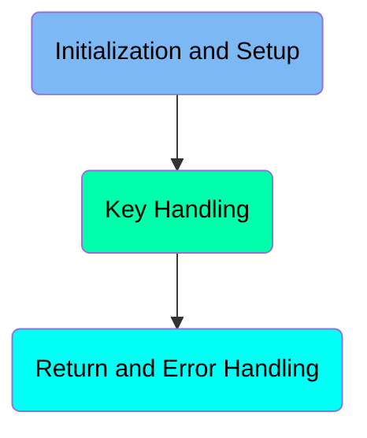
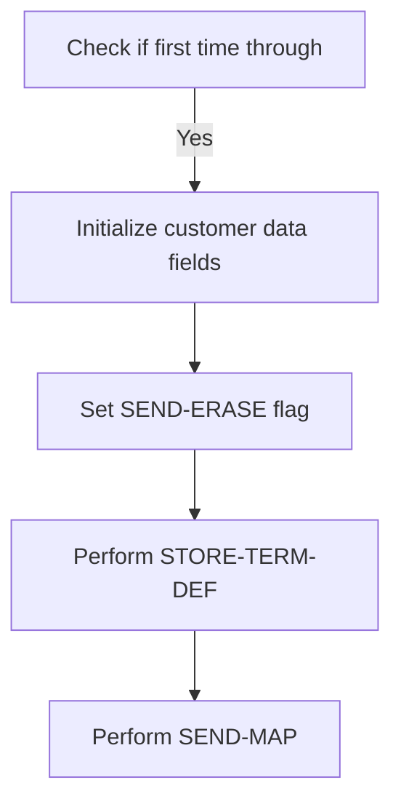
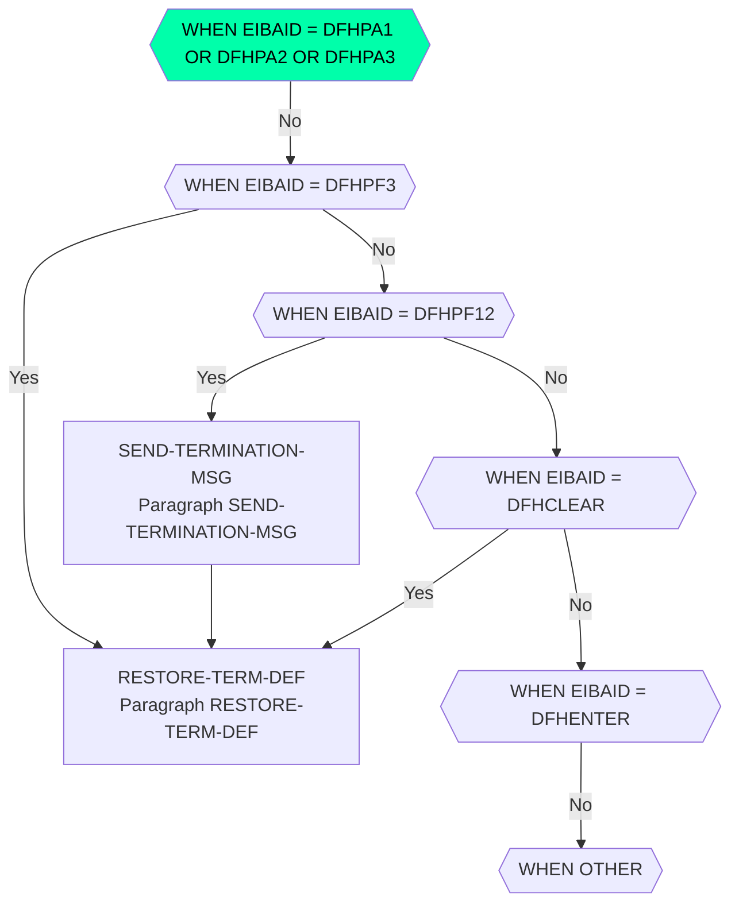
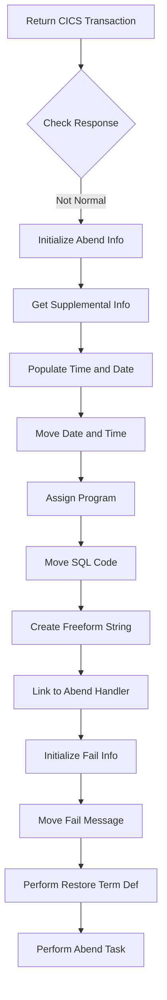

The <SwmToken path="src/base/cobol_src/BNK1CCS.cbl" pos="336:4:4" line-data="              MOVE &#39;BNK1CCS - A010 - RETURN TRANSID(OCCS) FAIL&#39; TO">`BNK1CCS`</SwmToken> program is responsible for handling customer data screens in a banking application. It initializes customer data fields, handles various key presses, and manages return and error handling. The program achieves this by checking if it's the first time through, setting flags, performing terminal definitions, and sending maps. It also processes key presses like PA, PF3, PF12, CLEAR, and ENTER, and handles errors by linking to the Abend Handler program.

The <SwmToken path="src/base/cobol_src/BNK1CCS.cbl" pos="336:4:4" line-data="              MOVE &#39;BNK1CCS - A010 - RETURN TRANSID(OCCS) FAIL&#39; TO">`BNK1CCS`</SwmToken> program starts by checking if it's the first time through and initializes customer data fields if needed. It sets flags and performs terminal definitions before sending the map to the terminal. The program then handles various key presses, such as PA, PF3, PF12, CLEAR, and ENTER, by performing specific actions for each key. Finally, it manages return and error handling by returning the CICS transaction and linking to the Abend Handler program if any errors occur.

Here is a high level diagram of the program:



# Initialization and Setup



<SwmSnippet path="/src/base/cobol_src/BNK1CCS.cbl" line="165">

---

## Check if first time through

First, the code checks if this is the first time through by evaluating if <SwmToken path="src/base/cobol_src/BNK1CCS.cbl" pos="170:3:3" line-data="              WHEN EIBCALEN = ZERO">`EIBCALEN`</SwmToken> is zero. If it is, it means the customer data screen needs to be initialized with empty fields.

```cobol
           EVALUATE TRUE
      *
      *       Is it the first time through? If so, send the map
      *       with erased (empty) data fields.
      *
              WHEN EIBCALEN = ZERO
```

---

</SwmSnippet>

<SwmSnippet path="/src/base/cobol_src/BNK1CCS.cbl" line="171">

---

## Initialize customer data fields

Next, the code initializes various customer data fields to empty values. This includes setting <SwmToken path="src/base/cobol_src/BNK1CCS.cbl" pos="171:9:9" line-data="                 MOVE LOW-VALUE TO BNK1CCO">`BNK1CCO`</SwmToken> to <SwmToken path="src/base/cobol_src/BNK1CCS.cbl" pos="171:3:5" line-data="                 MOVE LOW-VALUE TO BNK1CCO">`LOW-VALUE`</SwmToken> and other fields like <SwmToken path="src/base/cobol_src/BNK1CCS.cbl" pos="172:7:7" line-data="                 MOVE SPACES TO CUSTTITO">`CUSTTITO`</SwmToken>, <SwmToken path="src/base/cobol_src/BNK1CCS.cbl" pos="173:7:7" line-data="                 MOVE SPACES TO CHRISTNO">`CHRISTNO`</SwmToken>, <SwmToken path="src/base/cobol_src/BNK1CCS.cbl" pos="174:7:7" line-data="                 MOVE SPACES TO CUSTINSO">`CUSTINSO`</SwmToken>, <SwmToken path="src/base/cobol_src/BNK1CCS.cbl" pos="175:7:7" line-data="                 MOVE SPACES TO CUSTSNO">`CUSTSNO`</SwmToken>, <SwmToken path="src/base/cobol_src/BNK1CCS.cbl" pos="176:7:7" line-data="                 MOVE SPACES TO CUSTAD1O">`CUSTAD1O`</SwmToken>, <SwmToken path="src/base/cobol_src/BNK1CCS.cbl" pos="177:7:7" line-data="                 MOVE SPACES TO CUSTAD2O">`CUSTAD2O`</SwmToken>, and <SwmToken path="src/base/cobol_src/BNK1CCS.cbl" pos="178:7:7" line-data="                 MOVE SPACES TO CUSTAD3O">`CUSTAD3O`</SwmToken> to spaces.

```cobol
                 MOVE LOW-VALUE TO BNK1CCO
                 MOVE SPACES TO CUSTTITO
                 MOVE SPACES TO CHRISTNO
                 MOVE SPACES TO CUSTINSO
                 MOVE SPACES TO CUSTSNO
                 MOVE SPACES TO CUSTAD1O
                 MOVE SPACES TO CUSTAD2O
                 MOVE SPACES TO CUSTAD3O

```

---

</SwmSnippet>

<SwmSnippet path="/src/base/cobol_src/BNK1CCS.cbl" line="180">

---

## Set <SwmToken path="src/base/cobol_src/BNK1CCS.cbl" pos="181:3:5" line-data="                 SET SEND-ERASE TO TRUE">`SEND-ERASE`</SwmToken> flag

Then, the code sets the <SwmToken path="src/base/cobol_src/BNK1CCS.cbl" pos="181:3:5" line-data="                 SET SEND-ERASE TO TRUE">`SEND-ERASE`</SwmToken> flag to true by moving <SwmToken path="src/base/cobol_src/BNK1CCS.cbl" pos="180:3:4" line-data="                 MOVE -1 TO CUSTTITL">`-1`</SwmToken> to <SwmToken path="src/base/cobol_src/BNK1CCS.cbl" pos="180:8:8" line-data="                 MOVE -1 TO CUSTTITL">`CUSTTITL`</SwmToken> and setting <SwmToken path="src/base/cobol_src/BNK1CCS.cbl" pos="181:3:5" line-data="                 SET SEND-ERASE TO TRUE">`SEND-ERASE`</SwmToken> to true. This indicates that the map should be sent with erased (empty) data fields.

```cobol
                 MOVE -1 TO CUSTTITL
                 SET SEND-ERASE TO TRUE
                 MOVE SPACES TO MESSAGEO
```

---

</SwmSnippet>

<SwmSnippet path="/src/base/cobol_src/BNK1CCS.cbl" line="184">

---

## Perform <SwmToken path="src/base/cobol_src/BNK1CCS.cbl" pos="184:3:7" line-data="                 PERFORM STORE-TERM-DEF">`STORE-TERM-DEF`</SwmToken>

Moving to the next step, the code performs the <SwmToken path="src/base/cobol_src/BNK1CCS.cbl" pos="184:3:7" line-data="                 PERFORM STORE-TERM-DEF">`STORE-TERM-DEF`</SwmToken> section, which stores the terminal's uppercase translation settings.

```cobol
                 PERFORM STORE-TERM-DEF
```

---

</SwmSnippet>

<SwmSnippet path="/src/base/cobol_src/BNK1CCS.cbl" line="186">

---

## Perform <SwmToken path="src/base/cobol_src/BNK1CCS.cbl" pos="186:3:5" line-data="                 PERFORM SEND-MAP">`SEND-MAP`</SwmToken>

Finally, the code performs the <SwmToken path="src/base/cobol_src/BNK1CCS.cbl" pos="186:3:5" line-data="                 PERFORM SEND-MAP">`SEND-MAP`</SwmToken> section to send the initialized map to the terminal with the erased data fields.

```cobol
                 PERFORM SEND-MAP
```

---

</SwmSnippet>

# Key Handling



<SwmSnippet path="/src/base/cobol_src/BNK1CCS.cbl" line="194">

---

## Handling PA Key Presses

First, the code checks if a PA key (<SwmToken path="src/base/cobol_src/BNK1CCS.cbl" pos="194:7:7" line-data="              WHEN EIBAID = DFHPA1 OR DFHPA2 OR DFHPA3">`DFHPA1`</SwmToken>, <SwmToken path="src/base/cobol_src/BNK1CCS.cbl" pos="194:11:11" line-data="              WHEN EIBAID = DFHPA1 OR DFHPA2 OR DFHPA3">`DFHPA2`</SwmToken>, or <SwmToken path="src/base/cobol_src/BNK1CCS.cbl" pos="194:15:15" line-data="              WHEN EIBAID = DFHPA1 OR DFHPA2 OR DFHPA3">`DFHPA3`</SwmToken>) is pressed. If so, it simply continues without any further action.

```cobol
              WHEN EIBAID = DFHPA1 OR DFHPA2 OR DFHPA3
                 CONTINUE
```

---

</SwmSnippet>

<SwmSnippet path="/src/base/cobol_src/BNK1CCS.cbl" line="200">

---

## Handling PF3 Key Press

Next, if the PF3 key is pressed, the terminal's UCTRAN setting is restored to its original state by calling <SwmToken path="src/base/cobol_src/BNK1CCS.cbl" pos="206:3:7" line-data="                 PERFORM RESTORE-TERM-DEF">`RESTORE-TERM-DEF`</SwmToken>. Then, the program returns to the main menu by executing a CICS RETURN command with the transaction ID 'OMEN'.

```cobol
              WHEN EIBAID = DFHPF3

      *
      *          Set the terminal UCTRAN back to
      *          its starting position
      *
                 PERFORM RESTORE-TERM-DEF

                 EXEC CICS RETURN
                    TRANSID('OMEN')
                    IMMEDIATE
                    RESP(WS-CICS-RESP)
                    RESP2(WS-CICS-RESP2)
                 END-EXEC
```

---

</SwmSnippet>

<SwmSnippet path="/src/base/cobol_src/BNK1CCS.cbl" line="219">

---

## Handling PF12 Key Press

Then, if the PF12 key is pressed, a termination message is sent by calling <SwmToken path="src/base/cobol_src/BNK1CCS.cbl" pos="220:3:7" line-data="                 PERFORM SEND-TERMINATION-MSG">`SEND-TERMINATION-MSG`</SwmToken>. After that, the terminal's UCTRAN setting is restored to its original state by calling <SwmToken path="src/base/cobol_src/BNK1CCS.cbl" pos="226:3:7" line-data="                 PERFORM RESTORE-TERM-DEF">`RESTORE-TERM-DEF`</SwmToken>, and the program returns control to CICS.

```cobol
              WHEN EIBAID = DFHPF12
                 PERFORM SEND-TERMINATION-MSG

      *
      *          Set the terminal UCTRAN back to
      *          its starting position
      *
                 PERFORM RESTORE-TERM-DEF

                 EXEC CICS
                    RETURN
                 END-EXEC
```

---

</SwmSnippet>

<SwmSnippet path="/src/base/cobol_src/BNK1CCS.cbl" line="235">

---

## Handling CLEAR Key Press

When the CLEAR key is pressed, the program sends a map (<SwmToken path="src/base/cobol_src/BNK1CCS.cbl" pos="236:10:10" line-data="                 EXEC CICS SEND MAP(&#39;BNK1CCM&#39;)">`BNK1CCM`</SwmToken>) to the terminal, erasing the screen and freeing the keyboard. Then, the terminal's UCTRAN setting is restored to its original state by calling <SwmToken path="src/base/cobol_src/BNK1CCS.cbl" pos="246:3:7" line-data="                 PERFORM RESTORE-TERM-DEF">`RESTORE-TERM-DEF`</SwmToken>, and the program returns control to CICS with the transaction ID 'OCCS'.

```cobol
              WHEN EIBAID = DFHCLEAR
                 EXEC CICS SEND MAP('BNK1CCM')
                           MAPONLY
                           ERASE
                           FREEKB
                 END-EXEC

      *
      *          Set the terminal UCTRAN back to
      *          its starting position
      *
                 PERFORM RESTORE-TERM-DEF


                 EXEC CICS RETURN TRANSID('OCCS')
                           COMMAREA(WS-COMM-AREA)
                 END-EXEC
```

---

</SwmSnippet>

<SwmSnippet path="/src/base/cobol_src/BNK1CCS.cbl" line="256">

---

## Handling ENTER Key Press

If the ENTER key is pressed, the program processes the content by calling <SwmToken path="src/base/cobol_src/BNK1CCS.cbl" pos="257:3:5" line-data="                 PERFORM PROCESS-MAP">`PROCESS-MAP`</SwmToken>.

```cobol
              WHEN EIBAID = DFHENTER
                 PERFORM PROCESS-MAP

```

---

</SwmSnippet>

<SwmSnippet path="/src/base/cobol_src/BNK1CCS.cbl" line="262">

---

## Handling Other Key Presses

Finally, if any other key is pressed, the program moves the DFHCOMMAREA to <SwmToken path="src/base/cobol_src/BNK1CCS.cbl" pos="263:7:11" line-data="                 MOVE DFHCOMMAREA TO WS-COMM-AREA">`WS-COMM-AREA`</SwmToken>, sets an invalid key pressed message, and sends the map with an alarm.

```cobol
              WHEN OTHER
                 MOVE DFHCOMMAREA TO WS-COMM-AREA
                 MOVE LOW-VALUES TO BNK1CCO
                 MOVE SPACES TO MESSAGEO
                 MOVE 'Invalid key pressed.' TO MESSAGEO
                 SET SEND-DATAONLY-ALARM TO TRUE
                 PERFORM SEND-MAP


           END-EVALUATE.
```

---

</SwmSnippet>

<SwmSnippet path="/src/base/cobol_src/BNK1CCS.cbl" line="1518">

---

### <SwmToken path="src/base/cobol_src/BNK1CCS.cbl" pos="1518:1:5" line-data="       SEND-TERMINATION-MSG SECTION.">`SEND-TERMINATION-MSG`</SwmToken>

The <SwmToken path="src/base/cobol_src/BNK1CCS.cbl" pos="1518:1:5" line-data="       SEND-TERMINATION-MSG SECTION.">`SEND-TERMINATION-MSG`</SwmToken> function sends a termination message to the terminal. If the response is not normal, it handles the error by preserving the response codes and linking to the Abend Handler program.

```cobol
       SEND-TERMINATION-MSG SECTION.
       STM010.
      *
      *    Send the termination message
      *
           EXEC CICS SEND TEXT
              FROM(END-OF-SESSION-MESSAGE)
              ERASE
              FREEKB
              RESP(WS-CICS-RESP)
              RESP2(WS-CICS-RESP2)
           END-EXEC.

           IF WS-CICS-RESP NOT = DFHRESP(NORMAL)
      *
      *       Preserve the RESP and RESP2, then set up the
      *       standard ABEND info before getting the applid,
      *       date/time etc. and linking to the Abend Handler
      *       program.
      *
              INITIALIZE ABNDINFO-REC
```

---

</SwmSnippet>

<SwmSnippet path="/src/base/cobol_src/BNK1CCS.cbl" line="1201">

---

### <SwmToken path="src/base/cobol_src/BNK1CCS.cbl" pos="1201:1:5" line-data="       RESTORE-TERM-DEF SECTION.">`RESTORE-TERM-DEF`</SwmToken>

The <SwmToken path="src/base/cobol_src/BNK1CCS.cbl" pos="1201:1:5" line-data="       RESTORE-TERM-DEF SECTION.">`RESTORE-TERM-DEF`</SwmToken> function restores the terminal's UCTRAN setting to its original state. If the response is not normal, it handles the error by preserving the response codes and linking to the Abend Handler program.

```cobol
       RESTORE-TERM-DEF SECTION.
       RTD010.
      *
      *    We must now restore the UCTRAN setting back to what it
      *    was at the start
      *
           MOVE DFHCOMMAREA TO WS-COMM-AREA.

           MOVE WS-COMM-TERM TO WS-UCTRANS.

           EXEC CICS SET TERMINAL(EIBTRMID)
               UCTRANST(WS-UCTRANS)
               RESP(WS-CICS-RESP)
               RESP2(WS-CICS-RESP2)
           END-EXEC.

           IF WS-CICS-RESP NOT = DFHRESP(NORMAL)
      *
      *       Preserve the RESP and RESP2, then set up the
      *       standard ABEND info before getting the applid,
      *       date/time etc. and linking to the Abend Handler
```

---

</SwmSnippet>

## Interim Summary

So far, we saw how the initialization and setup process works, including checking if it's the first time through, initializing customer data fields, setting the <SwmToken path="src/base/cobol_src/BNK1CCS.cbl" pos="181:3:5" line-data="                 SET SEND-ERASE TO TRUE">`SEND-ERASE`</SwmToken> flag, performing <SwmToken path="src/base/cobol_src/BNK1CCS.cbl" pos="184:3:7" line-data="                 PERFORM STORE-TERM-DEF">`STORE-TERM-DEF`</SwmToken>, and sending the map. We also covered key handling, detailing how the program responds to various key presses such as PA, PF3, PF12, CLEAR, ENTER, and other keys. Now, we will focus on return and error handling, where the program returns the CICS transaction and handles any errors that may occur.

# Return and Error Handling



<SwmSnippet path="/src/base/cobol_src/BNK1CCS.cbl" line="276">

---

## Return CICS Transaction

First, the code returns the CICS transaction with the transaction ID 'OCCS' and the communication area <SwmToken path="src/base/cobol_src/BNK1CCS.cbl" pos="278:3:7" line-data="              COMMAREA(WS-COMM-AREA)">`WS-COMM-AREA`</SwmToken>. It also sets the response codes <SwmToken path="src/base/cobol_src/BNK1CCS.cbl" pos="280:3:7" line-data="              RESP(WS-CICS-RESP)">`WS-CICS-RESP`</SwmToken> and <SwmToken path="src/base/cobol_src/BNK1CCS.cbl" pos="281:3:7" line-data="              RESP2(WS-CICS-RESP2)">`WS-CICS-RESP2`</SwmToken>.

```cobol
           EXEC CICS
              RETURN TRANSID('OCCS')
              COMMAREA(WS-COMM-AREA)
              LENGTH(248)
              RESP(WS-CICS-RESP)
              RESP2(WS-CICS-RESP2)
           END-EXEC.
```

---

</SwmSnippet>

<SwmSnippet path="/src/base/cobol_src/BNK1CCS.cbl" line="284">

---

## Check Response

Next, the code checks if the response <SwmToken path="src/base/cobol_src/BNK1CCS.cbl" pos="284:3:7" line-data="           IF WS-CICS-RESP NOT = DFHRESP(NORMAL)">`WS-CICS-RESP`</SwmToken> is not equal to <SwmToken path="src/base/cobol_src/BNK1CCS.cbl" pos="284:13:16" line-data="           IF WS-CICS-RESP NOT = DFHRESP(NORMAL)">`DFHRESP(NORMAL)`</SwmToken>. If the response is not normal, it proceeds to handle the error.

```cobol
           IF WS-CICS-RESP NOT = DFHRESP(NORMAL)
```

---

</SwmSnippet>

<SwmSnippet path="/src/base/cobol_src/BNK1CCS.cbl" line="291">

---

## Initialize Abend Info

Then, the code initializes the <SwmToken path="src/base/cobol_src/BNK1CCS.cbl" pos="291:3:5" line-data="              INITIALIZE ABNDINFO-REC">`ABNDINFO-REC`</SwmToken> record and moves the response codes <SwmToken path="src/base/cobol_src/BNK1CCS.cbl" pos="292:3:3" line-data="              MOVE EIBRESP    TO ABND-RESPCODE">`EIBRESP`</SwmToken> and <SwmToken path="src/base/cobol_src/BNK1CCS.cbl" pos="293:3:3" line-data="              MOVE EIBRESP2   TO ABND-RESP2CODE">`EIBRESP2`</SwmToken> to <SwmToken path="src/base/cobol_src/BNK1CCS.cbl" pos="292:7:9" line-data="              MOVE EIBRESP    TO ABND-RESPCODE">`ABND-RESPCODE`</SwmToken> and <SwmToken path="src/base/cobol_src/BNK1CCS.cbl" pos="293:7:9" line-data="              MOVE EIBRESP2   TO ABND-RESP2CODE">`ABND-RESP2CODE`</SwmToken> respectively.

```cobol
              INITIALIZE ABNDINFO-REC
              MOVE EIBRESP    TO ABND-RESPCODE
              MOVE EIBRESP2   TO ABND-RESP2CODE
```

---

</SwmSnippet>

<SwmSnippet path="/src/base/cobol_src/BNK1CCS.cbl" line="297">

---

## Get Supplemental Info

Moving to the next step, the code gets supplemental information by assigning the application ID to <SwmToken path="src/base/cobol_src/BNK1CCS.cbl" pos="297:9:11" line-data="              EXEC CICS ASSIGN APPLID(ABND-APPLID)">`ABND-APPLID`</SwmToken>.

```cobol
              EXEC CICS ASSIGN APPLID(ABND-APPLID)
              END-EXEC
```

---

</SwmSnippet>

<SwmSnippet path="/src/base/cobol_src/BNK1CCS.cbl" line="303">

---

## Populate Time and Date

Next, the code performs the <SwmToken path="src/base/cobol_src/BNK1CCS.cbl" pos="303:3:7" line-data="              PERFORM POPULATE-TIME-DATE">`POPULATE-TIME-DATE`</SwmToken> section to get the current date and time.

```cobol
              PERFORM POPULATE-TIME-DATE
```

---

</SwmSnippet>

<SwmSnippet path="/src/base/cobol_src/BNK1CCS.cbl" line="1623">

---

### <SwmToken path="src/base/cobol_src/BNK1CCS.cbl" pos="1623:1:5" line-data="       POPULATE-TIME-DATE SECTION.">`POPULATE-TIME-DATE`</SwmToken>

The <SwmToken path="src/base/cobol_src/BNK1CCS.cbl" pos="1623:1:5" line-data="       POPULATE-TIME-DATE SECTION.">`POPULATE-TIME-DATE`</SwmToken> section uses CICS commands to get the current time and format it into <SwmToken path="src/base/cobol_src/BNK1CCS.cbl" pos="1632:3:7" line-data="                     DDMMYYYY(WS-ORIG-DATE)">`WS-ORIG-DATE`</SwmToken> and <SwmToken path="src/base/cobol_src/BNK1CCS.cbl" pos="1633:3:7" line-data="                     TIME(WS-TIME-NOW)">`WS-TIME-NOW`</SwmToken>.

```cobol
       POPULATE-TIME-DATE SECTION.
       PTD10.

           EXEC CICS ASKTIME
              ABSTIME(WS-U-TIME)
           END-EXEC.

           EXEC CICS FORMATTIME
                     ABSTIME(WS-U-TIME)
                     DDMMYYYY(WS-ORIG-DATE)
                     TIME(WS-TIME-NOW)
                     DATESEP
           END-EXEC.

       PTD999.
           EXIT.
```

---

</SwmSnippet>

<SwmSnippet path="/src/base/cobol_src/BNK1CCS.cbl" line="305">

---

## Move Date and Time

Then, the code moves the original date <SwmToken path="src/base/cobol_src/BNK1CCS.cbl" pos="305:3:7" line-data="              MOVE WS-ORIG-DATE TO ABND-DATE">`WS-ORIG-DATE`</SwmToken> to <SwmToken path="src/base/cobol_src/BNK1CCS.cbl" pos="305:11:13" line-data="              MOVE WS-ORIG-DATE TO ABND-DATE">`ABND-DATE`</SwmToken> and constructs the time string <SwmToken path="src/base/cobol_src/BNK1CCS.cbl" pos="311:3:5" line-data="                     INTO ABND-TIME">`ABND-TIME`</SwmToken> using <SwmToken path="src/base/cobol_src/BNK1CCS.cbl" pos="306:3:11" line-data="              STRING WS-TIME-NOW-GRP-HH DELIMITED BY SIZE,">`WS-TIME-NOW-GRP-HH`</SwmToken>, <SwmToken path="src/base/cobol_src/BNK1CCS.cbl" pos="308:1:9" line-data="                     WS-TIME-NOW-GRP-MM DELIMITED BY SIZE,">`WS-TIME-NOW-GRP-MM`</SwmToken>, and <SwmToken path="src/base/cobol_src/BNK1CCS.cbl" pos="308:1:9" line-data="                     WS-TIME-NOW-GRP-MM DELIMITED BY SIZE,">`WS-TIME-NOW-GRP-MM`</SwmToken>.

```cobol
              MOVE WS-ORIG-DATE TO ABND-DATE
              STRING WS-TIME-NOW-GRP-HH DELIMITED BY SIZE,
                    ':' DELIMITED BY SIZE,
                     WS-TIME-NOW-GRP-MM DELIMITED BY SIZE,
                     ':' DELIMITED BY SIZE,
                     WS-TIME-NOW-GRP-MM DELIMITED BY SIZE
                     INTO ABND-TIME
```

---

</SwmSnippet>

<SwmSnippet path="/src/base/cobol_src/BNK1CCS.cbl" line="317">

---

## Assign Program

Next, the code assigns the current program name to <SwmToken path="src/base/cobol_src/BNK1CCS.cbl" pos="317:9:11" line-data="              EXEC CICS ASSIGN PROGRAM(ABND-PROGRAM)">`ABND-PROGRAM`</SwmToken>.

```cobol
              EXEC CICS ASSIGN PROGRAM(ABND-PROGRAM)
              END-EXEC
```

---

</SwmSnippet>

<SwmSnippet path="/src/base/cobol_src/BNK1CCS.cbl" line="320">

---

## Move SQL Code

Then, the code moves zeros to <SwmToken path="src/base/cobol_src/BNK1CCS.cbl" pos="320:7:9" line-data="              MOVE ZEROS      TO ABND-SQLCODE">`ABND-SQLCODE`</SwmToken> to initialize it.

```cobol
              MOVE ZEROS      TO ABND-SQLCODE
```

---

</SwmSnippet>

<SwmSnippet path="/src/base/cobol_src/BNK1CCS.cbl" line="322">

---

## Create Freeform String

Moving forward, the code creates a freeform string <SwmToken path="src/base/cobol_src/BNK1CCS.cbl" pos="328:3:5" line-data="                    INTO ABND-FREEFORM">`ABND-FREEFORM`</SwmToken> that contains the error message and response codes.

```cobol
              STRING 'A010 -RETURN TRANSID(OCCS) FAIL'
                    DELIMITED BY SIZE,
                    'EIBRESP=' DELIMITED BY SIZE,
                    ABND-RESPCODE DELIMITED BY SIZE,
                    ' RESP2=' DELIMITED BY SIZE,
                    ABND-RESP2CODE DELIMITED BY SIZE
                    INTO ABND-FREEFORM
```

---

</SwmSnippet>

<SwmSnippet path="/src/base/cobol_src/BNK1CCS.cbl" line="331">

---

## Link to Abend Handler

Next, the code links to the Abend Handler program <SwmToken path="src/base/cobol_src/BNK1CCS.cbl" pos="331:9:13" line-data="              EXEC CICS LINK PROGRAM(WS-ABEND-PGM)">`WS-ABEND-PGM`</SwmToken> with the communication area <SwmToken path="src/base/cobol_src/BNK1CCS.cbl" pos="332:3:5" line-data="                        COMMAREA(ABNDINFO-REC)">`ABNDINFO-REC`</SwmToken>.

```cobol
              EXEC CICS LINK PROGRAM(WS-ABEND-PGM)
                        COMMAREA(ABNDINFO-REC)
              END-EXEC
```

---

</SwmSnippet>

<SwmSnippet path="/src/base/cobol_src/BNK1CCS.cbl" line="335">

---

## Initialize Fail Info

Then, the code initializes the fail information <SwmToken path="src/base/cobol_src/BNK1CCS.cbl" pos="335:3:7" line-data="              INITIALIZE WS-FAIL-INFO">`WS-FAIL-INFO`</SwmToken> and moves the fail message to <SwmToken path="src/base/cobol_src/BNK1CCS.cbl" pos="337:1:7" line-data="                 WS-CICS-FAIL-MSG">`WS-CICS-FAIL-MSG`</SwmToken> along with the response codes to <SwmToken path="src/base/cobol_src/BNK1CCS.cbl" pos="338:11:17" line-data="              MOVE WS-CICS-RESP  TO WS-CICS-RESP-DISP">`WS-CICS-RESP-DISP`</SwmToken> and <SwmToken path="src/base/cobol_src/BNK1CCS.cbl" pos="339:11:17" line-data="              MOVE WS-CICS-RESP2 TO WS-CICS-RESP2-DISP">`WS-CICS-RESP2-DISP`</SwmToken>.

```cobol
              INITIALIZE WS-FAIL-INFO
              MOVE 'BNK1CCS - A010 - RETURN TRANSID(OCCS) FAIL' TO
                 WS-CICS-FAIL-MSG
              MOVE WS-CICS-RESP  TO WS-CICS-RESP-DISP
              MOVE WS-CICS-RESP2 TO WS-CICS-RESP2-DISP
```

---

</SwmSnippet>

<SwmSnippet path="/src/base/cobol_src/BNK1CCS.cbl" line="341">

---

## Perform Restore Term Def

Next, the code performs the <SwmToken path="src/base/cobol_src/BNK1CCS.cbl" pos="341:3:7" line-data="              PERFORM RESTORE-TERM-DEF">`RESTORE-TERM-DEF`</SwmToken> section to restore terminal definitions.

```cobol
              PERFORM RESTORE-TERM-DEF
```

---

</SwmSnippet>

<SwmSnippet path="/src/base/cobol_src/BNK1CCS.cbl" line="342">

---

## Perform Abend Task

Finally, the code performs the <SwmToken path="src/base/cobol_src/BNK1CCS.cbl" pos="342:3:7" line-data="              PERFORM ABEND-THIS-TASK">`ABEND-THIS-TASK`</SwmToken> section to abend the task.

```cobol
              PERFORM ABEND-THIS-TASK
```

---

</SwmSnippet>

&nbsp;

*This is an auto-generated document by Swimm 🌊 and has not yet been verified by a human*

<SwmMeta version="3.0.0" repo-id="Z2l0aHViJTNBJTNBY2ljcy1iYW5raW5nLXNhbXBsZS1hcHBsaWNhdGlvbi1jYnNhLUlCTS1EZW1vJTNBJTNBU3dpbW0tRGVtbw==" repo-name="cics-banking-sample-application-cbsa-IBM-Demo"><sup>Powered by [Swimm](/)</sup></SwmMeta>
