The CRECUST program is responsible for creating a new customer record in the banking system. This process involves several steps including moving the sort code to the required field, populating the current date and time, performing a credit check, and validating the customer's date of birth. If all checks are successful, the program enqueues a named counter, updates the customer number, and writes the new customer record to the datastore.

The flow starts by ensuring the sort code is in the correct field, then it timestamps the process by populating the current date and time. A credit check is performed to assess the customer's creditworthiness. If the credit check passes, the customer's date of birth is validated. Once all validations are complete, the program locks a resource to update the customer number, retrieves the last customer number, increments it, and writes the new customer record to the datastore.

# Where is this program used?

This program is used once, in a flow starting from `BNK1CCS` as represented in the following diagram:

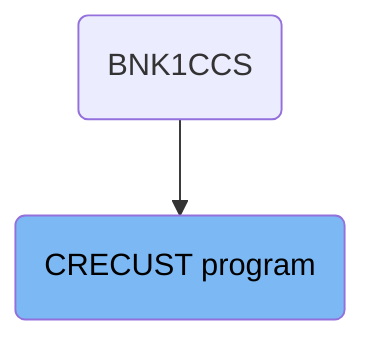

## <SwmToken path="src/base/cobol_src/CRECUST.cbl" pos="354:1:1" line-data="       PREMIERE SECTION.">`PREMIERE`</SwmToken>

Lets' zoom into this section of the flow:

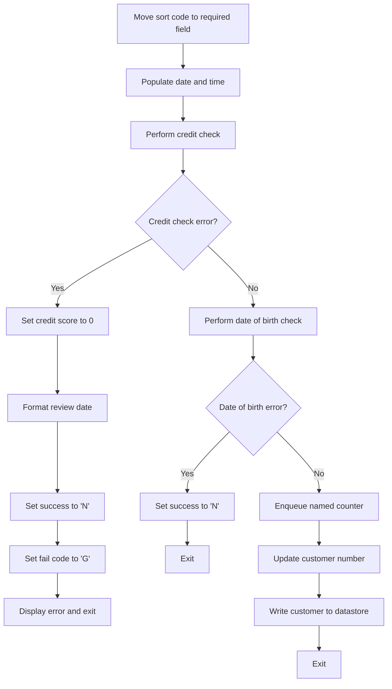

First, the sort code is moved to the required sort code field, ensuring that the necessary data is in place for subsequent operations.

<SwmSnippet path="/src/base/cobol_src/CRECUST.cbl" line="364">

---

Next, the current date and time are derived and populated, which is essential for timestamping the customer creation process.

```cobol
           PERFORM POPULATE-TIME-DATE.
```

---

</SwmSnippet>

<SwmSnippet path="/src/base/cobol_src/CRECUST.cbl" line="369">

---

Then, an asynchronous credit check is performed to assess the customer's creditworthiness.

```cobol
           PERFORM CREDIT-CHECK.
```

---

</SwmSnippet>

<SwmSnippet path="/src/base/cobol_src/CRECUST.cbl" line="371">

---

If there is a credit check error, the credit score is set to 0, and the review date is formatted for logging purposes.

```cobol
           IF WS-CREDIT-CHECK-ERROR = 'Y'
              MOVE 0 TO COMM-CREDIT-SCORE

              STRING WS-ORIG-DATE-DD DELIMITED BY SIZE,
                     WS-ORIG-DATE-MM DELIMITED BY SIZE,
                     WS-ORIG-DATE-YYYY DELIMITED BY SIZE
                     INTO COMM-CS-REVIEW-DATE
```

---

</SwmSnippet>

<SwmSnippet path="/src/base/cobol_src/CRECUST.cbl" line="380">

---

Additionally, the success flag is set to 'N', and the fail code is set to 'G', indicating a failure in the credit check process.

```cobol
              MOVE 'N' TO COMM-SUCCESS
              MOVE 'G' TO COMM-FAIL-CODE
```

---

</SwmSnippet>

<SwmSnippet path="/src/base/cobol_src/CRECUST.cbl" line="383">

---

The error details are displayed, and the process exits if a credit check error occurs.

```cobol
              DISPLAY 'WS-CREDIT-CHECK-ERROR = Y, '
                       ' RESP='
                       WS-CICS-RESP ' RESP2=' WS-CICS-RESP2
              DISPLAY '   Exiting CRECUST. COMMAREA='
                       DFHCOMMAREA
              PERFORM GET-ME-OUT-OF-HERE
```

---

</SwmSnippet>

<SwmSnippet path="/src/base/cobol_src/CRECUST.cbl" line="392">

---

Moving to the next step, a date of birth check is performed to validate the customer's age.

```cobol
           PERFORM DATE-OF-BIRTH-CHECK.
```

---

</SwmSnippet>

<SwmSnippet path="/src/base/cobol_src/CRECUST.cbl" line="394">

---

If there is a date of birth error, the success flag is set to 'N', and the process exits.

```cobol
           IF WS-DATE-OF-BIRTH-ERROR = 'Y'

              MOVE 'N' TO COMM-SUCCESS
              PERFORM GET-ME-OUT-OF-HERE
```

---

</SwmSnippet>

<SwmSnippet path="/src/base/cobol_src/CRECUST.cbl" line="404">

---

Next, the named counter for the customer is enqueued, preparing for the assignment of a new customer number.

```cobol
           PERFORM ENQ-NAMED-COUNTER.
```

---

</SwmSnippet>

<SwmSnippet path="/src/base/cobol_src/CRECUST.cbl" line="409">

---

The next customer number is retrieved from the customer named counter, ensuring a unique identifier for the new customer.

```cobol
           PERFORM UPD-NCS.
```

---

</SwmSnippet>

<SwmSnippet path="/src/base/cobol_src/CRECUST.cbl" line="414">

---

Finally, the new customer record is written to the VSAM datastore, completing the customer creation process.

```cobol
           PERFORM WRITE-CUSTOMER-VSAM.
```

---

</SwmSnippet>

<SwmSnippet path="/src/base/cobol_src/CRECUST.cbl" line="417">

---

The process exits, ensuring that all operations are concluded properly.

```cobol
           PERFORM GET-ME-OUT-OF-HERE.
```

---

</SwmSnippet>

## <SwmToken path="src/base/cobol_src/CRECUST.cbl" pos="364:3:7" line-data="           PERFORM POPULATE-TIME-DATE.">`POPULATE-TIME-DATE`</SwmToken>

Lets' zoom into this section of the flow:

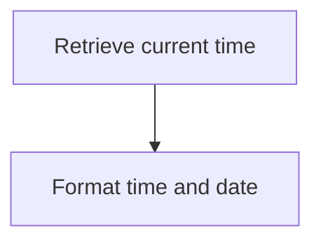

<SwmSnippet path="/src/base/cobol_src/CRECUST.cbl" line="423">

---

First, the <SwmToken path="src/base/cobol_src/CRECUST.cbl" pos="423:1:5" line-data="       POPULATE-TIME-DATE SECTION.">`POPULATE-TIME-DATE`</SwmToken> section begins by retrieving the current time using the <SwmToken path="src/base/cobol_src/CRECUST.cbl" pos="426:1:5" line-data="           EXEC CICS ASKTIME">`EXEC CICS ASKTIME`</SwmToken> command. This command stores the current time in the <SwmToken path="src/base/cobol_src/CRECUST.cbl" pos="427:3:7" line-data="              ABSTIME(WS-U-TIME)">`WS-U-TIME`</SwmToken> variable.

```cobol
       POPULATE-TIME-DATE SECTION.
       PTD010.

           EXEC CICS ASKTIME
              ABSTIME(WS-U-TIME)
           END-EXEC.
```

---

</SwmSnippet>

<SwmSnippet path="/src/base/cobol_src/CRECUST.cbl" line="430">

---

Next, the <SwmToken path="src/base/cobol_src/CRECUST.cbl" pos="430:1:5" line-data="           EXEC CICS FORMATTIME">`EXEC CICS FORMATTIME`</SwmToken> command is used to format the retrieved time. The <SwmToken path="src/base/cobol_src/CRECUST.cbl" pos="431:3:7" line-data="                     ABSTIME(WS-U-TIME)">`WS-U-TIME`</SwmToken> variable is used as input, and the formatted date is stored in <SwmToken path="src/base/cobol_src/CRECUST.cbl" pos="432:3:7" line-data="                     DDMMYYYY(WS-ORIG-DATE)">`WS-ORIG-DATE`</SwmToken>, while the formatted time is stored in <SwmToken path="src/base/cobol_src/CRECUST.cbl" pos="433:3:7" line-data="                     TIME(PROC-TRAN-TIME OF PROCTRAN-AREA )">`PROC-TRAN-TIME`</SwmToken> within the <SwmToken path="src/base/cobol_src/CRECUST.cbl" pos="433:11:13" line-data="                     TIME(PROC-TRAN-TIME OF PROCTRAN-AREA )">`PROCTRAN-AREA`</SwmToken> structure.

```cobol
           EXEC CICS FORMATTIME
                     ABSTIME(WS-U-TIME)
                     DDMMYYYY(WS-ORIG-DATE)
                     TIME(PROC-TRAN-TIME OF PROCTRAN-AREA )
                     DATESEP
           END-EXEC.
```

---

</SwmSnippet>

<SwmSnippet path="/src/base/cobol_src/CRECUST.cbl" line="437">

---

Finally, the section ends with the <SwmToken path="src/base/cobol_src/CRECUST.cbl" pos="437:1:1" line-data="       PTD999.">`PTD999`</SwmToken> label followed by the <SwmToken path="src/base/cobol_src/CRECUST.cbl" pos="438:1:1" line-data="           EXIT.">`EXIT`</SwmToken> statement, indicating the end of the <SwmToken path="src/base/cobol_src/CRECUST.cbl" pos="364:3:7" line-data="           PERFORM POPULATE-TIME-DATE.">`POPULATE-TIME-DATE`</SwmToken> section.

```cobol
       PTD999.
           EXIT.
```

---

</SwmSnippet>

# Conduct credit check (<SwmToken path="src/base/cobol_src/CRECUST.cbl" pos="369:3:5" line-data="           PERFORM CREDIT-CHECK.">`CREDIT-CHECK`</SwmToken>)

Let's split this section into smaller parts:

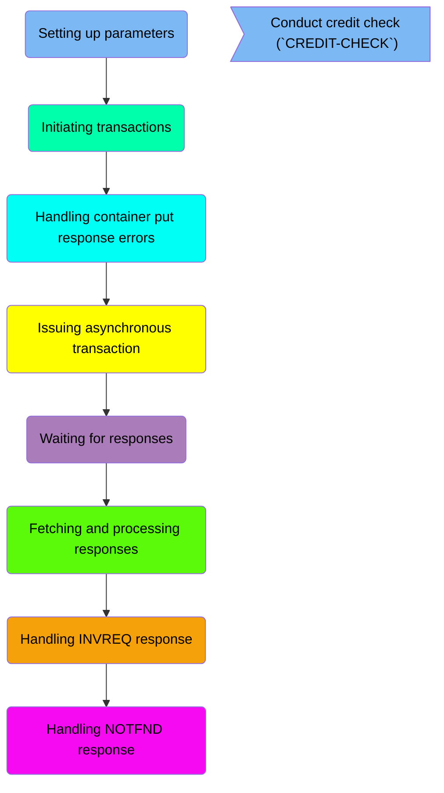

## Setting up parameters

First, we'll zoom into this section of the flow:

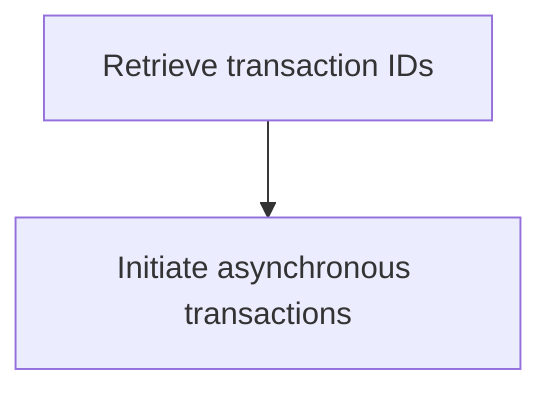

<SwmSnippet path="/src/base/cobol_src/CRECUST.cbl" line="505">

---

First, the section is designed to carry out the credit check asynchronously. This means that the credit check process will not block other operations and will run in the background, allowing the system to handle other tasks concurrently.

```cobol
       CREDIT-CHECK SECTION.
       CC010.
      *
      *    Carry out the Credit Check Asynchronously
```

---

</SwmSnippet>

<SwmSnippet path="/src/base/cobol_src/CRECUST.cbl" line="513">

---

Next, the section retrieves the table of transaction <SwmToken path="src/base/cobol_src/CRECUST.cbl" pos="513:13:13" line-data="      *    Retrieve the table of transaction IDs to use &amp;">`IDs`</SwmToken> that will be used for the credit check. This table contains the necessary identifiers for the transactions that need to be processed.

```cobol
      *    Retrieve the table of transaction IDs to use &
      *    initiate each Asynchronous transaction
```

---

</SwmSnippet>

<SwmSnippet path="/src/base/cobol_src/CRECUST.cbl" line="514">

---

Then, the section initiates each asynchronous transaction using the retrieved transaction <SwmToken path="src/base/cobol_src/CRECUST.cbl" pos="513:13:13" line-data="      *    Retrieve the table of transaction IDs to use &amp;">`IDs`</SwmToken>. This step ensures that each transaction is processed independently and concurrently, improving the efficiency and responsiveness of the credit check process.

```cobol
      *    initiate each Asynchronous transaction
      *
```

---

</SwmSnippet>

## Initiating transactions

Now, lets zoom into this section of the flow:

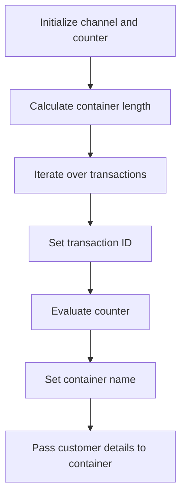

<SwmSnippet path="/src/base/cobol_src/CRECUST.cbl" line="516">

---

First, the channel name is initialized to <SwmToken path="src/base/cobol_src/CRECUST.cbl" pos="516:10:14" line-data="           MOVE &#39;CIPCREDCHANN    &#39; TO WS-CHANNEL-NAME.">`WS-CHANNEL-NAME`</SwmToken> with the value 'CIPCREDCHANN ' and the child issued count is set to 0.

```cobol
           MOVE 'CIPCREDCHANN    ' TO WS-CHANNEL-NAME.
           MOVE 0 TO WS-CHILD-ISSUED-CNT.
```

---

</SwmSnippet>

<SwmSnippet path="/src/base/cobol_src/CRECUST.cbl" line="519">

---

Next, the length of the <SwmToken path="src/base/cobol_src/CRECUST.cbl" pos="519:17:17" line-data="           COMPUTE WS-PUT-CONT-LEN = LENGTH OF DFHCOMMAREA.">`DFHCOMMAREA`</SwmToken> is computed and stored in <SwmToken path="src/base/cobol_src/CRECUST.cbl" pos="519:3:9" line-data="           COMPUTE WS-PUT-CONT-LEN = LENGTH OF DFHCOMMAREA.">`WS-PUT-CONT-LEN`</SwmToken>.

```cobol
           COMPUTE WS-PUT-CONT-LEN = LENGTH OF DFHCOMMAREA.
```

---

</SwmSnippet>

<SwmSnippet path="/src/base/cobol_src/CRECUST.cbl" line="521">

---

Moving to the iteration, a loop is performed varying <SwmToken path="src/base/cobol_src/CRECUST.cbl" pos="521:5:9" line-data="           PERFORM VARYING WS-CC-CNT FROM 1 BY 1">`WS-CC-CNT`</SwmToken> from 1 to 5 to handle different transactions.

```cobol
           PERFORM VARYING WS-CC-CNT FROM 1 BY 1
           UNTIL WS-CC-CNT > 5
```

---

</SwmSnippet>

<SwmSnippet path="/src/base/cobol_src/CRECUST.cbl" line="527">

---

Within the loop, the transaction ID is set by concatenating 'OCR' with the current counter value <SwmToken path="src/base/cobol_src/CRECUST.cbl" pos="528:1:5" line-data="                      WS-CC-CNT DELIMITED BY SIZE">`WS-CC-CNT`</SwmToken>.

```cobol
              STRING 'OCR' DELIMITED BY SIZE,
                      WS-CC-CNT DELIMITED BY SIZE
                 INTO WS-RUN-TRANSID
```

---

</SwmSnippet>

<SwmSnippet path="/src/base/cobol_src/CRECUST.cbl" line="532">

---

Then, the counter value <SwmToken path="src/base/cobol_src/CRECUST.cbl" pos="532:3:7" line-data="              EVALUATE WS-CC-CNT">`WS-CC-CNT`</SwmToken> is evaluated to determine the appropriate container name to use, setting <SwmToken path="src/base/cobol_src/CRECUST.cbl" pos="534:10:16" line-data="                    MOVE &#39;CIPA            &#39; TO WS-PUT-CONT-NAME">`WS-PUT-CONT-NAME`</SwmToken> accordingly.

```cobol
              EVALUATE WS-CC-CNT
                 WHEN 1
                    MOVE 'CIPA            ' TO WS-PUT-CONT-NAME
                 WHEN 2
                    MOVE 'CIPB            ' TO WS-PUT-CONT-NAME
                 WHEN 3
                    MOVE 'CIPC            ' TO WS-PUT-CONT-NAME
                 WHEN 4
                    MOVE 'CIPD            ' TO WS-PUT-CONT-NAME
                 WHEN 5
                    MOVE 'CIPE            ' TO WS-PUT-CONT-NAME
                 WHEN 6
                    MOVE 'CIPF            ' TO WS-PUT-CONT-NAME
                 WHEN 7
                    MOVE 'CIPG            ' TO WS-PUT-CONT-NAME
                 WHEN 8
                    MOVE 'CIPH            ' TO WS-PUT-CONT-NAME
                 WHEN 9
                    MOVE 'CIPI            ' TO WS-PUT-CONT-NAME

              END-EVALUATE
```

---

</SwmSnippet>

<SwmSnippet path="/src/base/cobol_src/CRECUST.cbl" line="557">

---

Finally, the customer details are passed into the container using the <SwmToken path="src/base/cobol_src/CRECUST.cbl" pos="557:1:7" line-data="              EXEC CICS PUT CONTAINER(WS-PUT-CONT-NAME)">`EXEC CICS PUT CONTAINER`</SwmToken> command with the specified container name, data from <SwmToken path="src/base/cobol_src/CRECUST.cbl" pos="558:3:3" line-data="                            FROM(DFHCOMMAREA)">`DFHCOMMAREA`</SwmToken>, and the channel name.

```cobol
              EXEC CICS PUT CONTAINER(WS-PUT-CONT-NAME)
                            FROM(DFHCOMMAREA)
                            FLENGTH(WS-PUT-CONT-LEN)
                            CHANNEL(WS-CHANNEL-NAME)
                            RESP(WS-CICS-RESP)
```

---

</SwmSnippet>

## Handling container put response errors

Now, lets zoom into this section of the flow:

```mermaid
graph TD
  A[Check if WS-CICS-RESP is not NORMAL] --> B[Set COMM-SUCCESS to 'N'] --> C[Set COMM-FAIL-CODE to 'A'] --> D[Display error message] --> E[Perform GET-ME-OUT-OF-HERE]

%% Swimm:
%% graph TD
%%   A[Check if <SwmToken path="src/base/cobol_src/CRECUST.cbl" pos="385:1:5" line-data="                       WS-CICS-RESP &#39; RESP2=&#39; WS-CICS-RESP2">`WS-CICS-RESP`</SwmToken> is not NORMAL] --> B[Set <SwmToken path="src/base/cobol_src/CRECUST.cbl" pos="380:9:11" line-data="              MOVE &#39;N&#39; TO COMM-SUCCESS">`COMM-SUCCESS`</SwmToken> to 'N'] --> C[Set <SwmToken path="src/base/cobol_src/CRECUST.cbl" pos="381:9:13" line-data="              MOVE &#39;G&#39; TO COMM-FAIL-CODE">`COMM-FAIL-CODE`</SwmToken> to 'A'] --> D[Display error message] --> E[Perform <SwmToken path="src/base/cobol_src/CRECUST.cbl" pos="388:3:11" line-data="              PERFORM GET-ME-OUT-OF-HERE">`GET-ME-OUT-OF-HERE`</SwmToken>]
```

<SwmSnippet path="/src/base/cobol_src/CRECUST.cbl" line="565">

---

First, the code checks if <SwmToken path="src/base/cobol_src/CRECUST.cbl" pos="565:3:7" line-data="              IF WS-CICS-RESP NOT = DFHRESP(NORMAL)">`WS-CICS-RESP`</SwmToken> (the response code from the CICS command) is not equal to <SwmToken path="src/base/cobol_src/CRECUST.cbl" pos="565:13:16" line-data="              IF WS-CICS-RESP NOT = DFHRESP(NORMAL)">`DFHRESP(NORMAL)`</SwmToken> (indicating a normal response).

```cobol
              IF WS-CICS-RESP NOT = DFHRESP(NORMAL)
```

---

</SwmSnippet>

<SwmSnippet path="/src/base/cobol_src/CRECUST.cbl" line="566">

---

Moving to the next step, if the response is not normal, it sets <SwmToken path="src/base/cobol_src/CRECUST.cbl" pos="566:9:11" line-data="                 MOVE &#39;N&#39; TO COMM-SUCCESS">`COMM-SUCCESS`</SwmToken> to 'N' (indicating the communication was not successful).

```cobol
                 MOVE 'N' TO COMM-SUCCESS
```

---

</SwmSnippet>

<SwmSnippet path="/src/base/cobol_src/CRECUST.cbl" line="567">

---

Next, it sets <SwmToken path="src/base/cobol_src/CRECUST.cbl" pos="567:9:13" line-data="                 MOVE &#39;A&#39; TO COMM-FAIL-CODE">`COMM-FAIL-CODE`</SwmToken> to 'A' (indicating a specific failure code).

```cobol
                 MOVE 'A' TO COMM-FAIL-CODE
```

---

</SwmSnippet>

<SwmSnippet path="/src/base/cobol_src/CRECUST.cbl" line="569">

---

Then, it displays an error message with details about the unsuccessful attempt, including the container name, channel name, and response codes.

```cobol
                 DISPLAY 'Unsuccessful attempt to PUT CONTAINER. '
                         'CONTAINER=' WS-PUT-CONT-NAME 'CHANNEL='
                         WS-CHANNEL-NAME '. FLENGTH ='
                         WS-PUT-CONT-LEN '.'
                 DISPLAY '    RESP=' WS-CICS-RESP ' RESP2='
                         WS-CICS-RESP2
```

---

</SwmSnippet>

<SwmSnippet path="/src/base/cobol_src/CRECUST.cbl" line="576">

---

Finally, it performs the <SwmToken path="src/base/cobol_src/CRECUST.cbl" pos="576:3:11" line-data="                 PERFORM GET-ME-OUT-OF-HERE">`GET-ME-OUT-OF-HERE`</SwmToken> routine to handle the error and exit the current process.

```cobol
                 PERFORM GET-ME-OUT-OF-HERE
```

---

</SwmSnippet>

## Issuing asynchronous transaction

Now, lets zoom into this section of the flow:

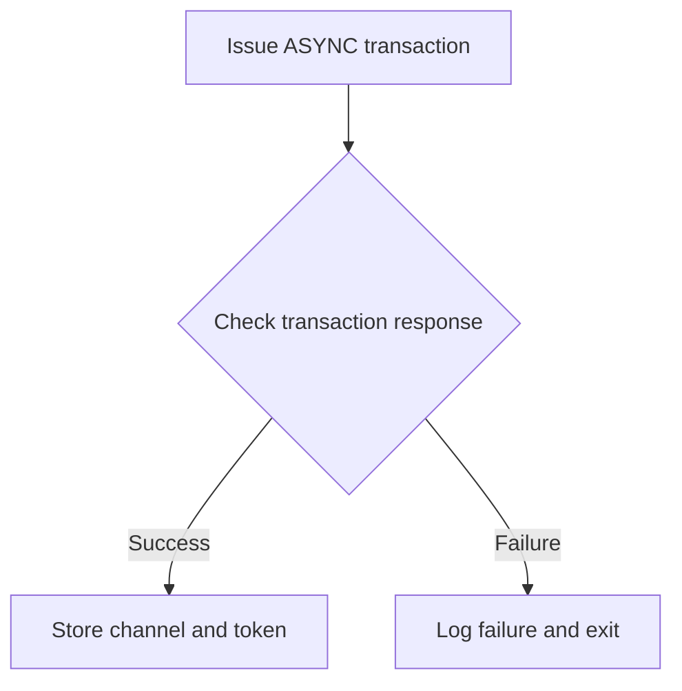

First, the code issues an asynchronous transaction using the <SwmToken path="src/base/cobol_src/CRECUST.cbl" pos="582:1:7" line-data="              EXEC CICS RUN TRANSID(WS-RUN-TRANSID)">`EXEC CICS RUN TRANSID`</SwmToken> command, which initiates a transaction identified by <SwmToken path="src/base/cobol_src/CRECUST.cbl" pos="529:3:7" line-data="                 INTO WS-RUN-TRANSID">`WS-RUN-TRANSID`</SwmToken> and associates it with a channel named <SwmToken path="src/base/cobol_src/CRECUST.cbl" pos="516:10:14" line-data="           MOVE &#39;CIPCREDCHANN    &#39; TO WS-CHANNEL-NAME.">`WS-CHANNEL-NAME`</SwmToken>.

Next, the code checks the response of the transaction by evaluating <SwmToken path="src/base/cobol_src/CRECUST.cbl" pos="385:1:5" line-data="                       WS-CICS-RESP &#39; RESP2=&#39; WS-CICS-RESP2">`WS-CICS-RESP`</SwmToken>. If the response is not normal (<SwmToken path="src/base/cobol_src/CRECUST.cbl" pos="453:13:16" line-data="           IF WS-CICS-RESP NOT = DFHRESP(NORMAL)">`DFHRESP(NORMAL)`</SwmToken>), it indicates a failure.

In case of a failure, the code sets <SwmToken path="src/base/cobol_src/CRECUST.cbl" pos="380:9:11" line-data="              MOVE &#39;N&#39; TO COMM-SUCCESS">`COMM-SUCCESS`</SwmToken> to 'N' and <SwmToken path="src/base/cobol_src/CRECUST.cbl" pos="381:9:13" line-data="              MOVE &#39;G&#39; TO COMM-FAIL-CODE">`COMM-FAIL-CODE`</SwmToken> to 'B', and logs the unsuccessful attempt details including the transaction ID, channel name, and response codes.

Then, the code performs the <SwmToken path="src/base/cobol_src/CRECUST.cbl" pos="388:3:11" line-data="              PERFORM GET-ME-OUT-OF-HERE">`GET-ME-OUT-OF-HERE`</SwmToken> routine to handle the failure scenario and exit the process.

If the transaction is successful, the code increments <SwmToken path="src/base/cobol_src/CRECUST.cbl" pos="517:7:13" line-data="           MOVE 0 TO WS-CHILD-ISSUED-CNT.">`WS-CHILD-ISSUED-CNT`</SwmToken> to keep track of the number of issued child transactions.

## Waiting for responses

This is the next section of the flow.

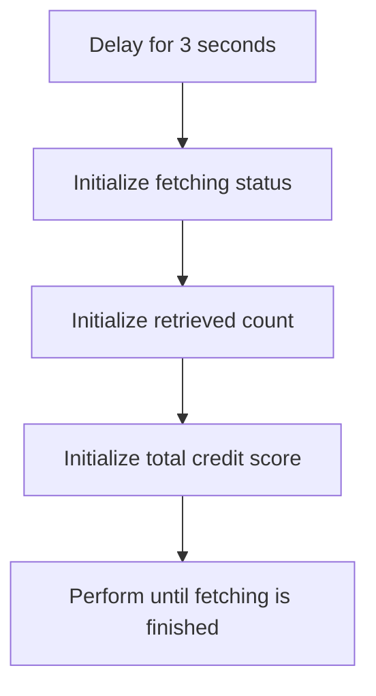

<SwmSnippet path="/src/base/cobol_src/CRECUST.cbl" line="623">

---

First, the system introduces a delay of 3 seconds to allow the asynchronous requests to be processed. This ensures that the data is ready to be fetched after the delay.

```cobol
           EXEC CICS DELAY
              FOR SECONDS(3)
           END-EXEC.
```

---

</SwmSnippet>

<SwmSnippet path="/src/base/cobol_src/CRECUST.cbl" line="627">

---

Moving to the next step, the system initializes the fetching status by setting <SwmToken path="src/base/cobol_src/CRECUST.cbl" pos="627:9:13" line-data="           MOVE &#39;N&#39; TO WS-FINISHED-FETCHING.">`WS-FINISHED-FETCHING`</SwmToken> to 'N'. This indicates that the fetching process is not yet complete.

```cobol
           MOVE 'N' TO WS-FINISHED-FETCHING.
```

---

</SwmSnippet>

<SwmSnippet path="/src/base/cobol_src/CRECUST.cbl" line="628">

---

Next, the system initializes the retrieved count and total credit score by setting <SwmToken path="src/base/cobol_src/CRECUST.cbl" pos="628:7:11" line-data="           MOVE 0 TO WS-RETRIEVED-CNT.">`WS-RETRIEVED-CNT`</SwmToken> and <SwmToken path="src/base/cobol_src/CRECUST.cbl" pos="629:7:13" line-data="           MOVE 0 TO WS-TOTAL-CS-SCR.">`WS-TOTAL-CS-SCR`</SwmToken> to 0. This prepares the variables for accumulating the fetched data.

```cobol
           MOVE 0 TO WS-RETRIEVED-CNT.
           MOVE 0 TO WS-TOTAL-CS-SCR.
```

---

</SwmSnippet>

## Fetching and processing responses

Now, lets zoom into this section of the flow:

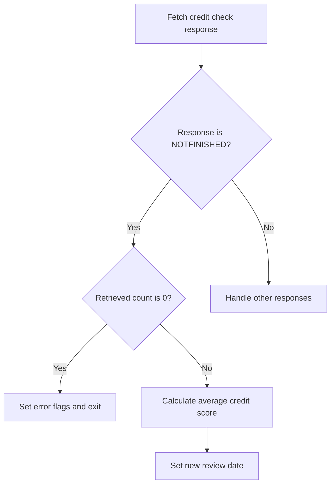

First, the code initializes the variable <SwmToken path="src/base/cobol_src/CRECUST.cbl" pos="633:7:15" line-data="              MOVE SPACES TO WS-ANY-CHILD-FETCH-ABCODE">`WS-ANY-CHILD-FETCH-ABCODE`</SwmToken> to spaces, preparing it for any potential error codes that might be returned during the fetch operation.

<SwmSnippet path="/src/base/cobol_src/CRECUST.cbl" line="633">

---

Next, the code attempts to fetch an available reply immediately from the credit agencies using the <SwmToken path="src/base/cobol_src/CRECUST.cbl" pos="639:1:7" line-data="              EXEC CICS FETCH ANY(WS-ANY-CHILD-FETCH-TKN)">`EXEC CICS FETCH ANY`</SwmToken> command. This command fetches any available response without waiting, and stores the response status in <SwmToken path="src/base/cobol_src/CRECUST.cbl" pos="644:3:7" line-data="                   RESP(WS-CICS-RESP)">`WS-CICS-RESP`</SwmToken> and <SwmToken path="src/base/cobol_src/CRECUST.cbl" pos="645:3:7" line-data="                   RESP2(WS-CICS-RESP2)">`WS-CICS-RESP2`</SwmToken>.

```cobol
              MOVE SPACES TO WS-ANY-CHILD-FETCH-ABCODE

      *
      *       Fetch an available reply immediately (without
      *       waiting).
      *
              EXEC CICS FETCH ANY(WS-ANY-CHILD-FETCH-TKN)
                   CHANNEL(WS-ANY-CHILD-FETCH-CHAN)
                   NOSUSPEND
                   COMPSTATUS(WS-CHILD-FETCH-COMPST)
                   ABCODE(WS-ANY-CHILD-FETCH-ABCODE)
                   RESP(WS-CICS-RESP)
                   RESP2(WS-CICS-RESP2)
```

---

</SwmSnippet>

<SwmSnippet path="/src/base/cobol_src/CRECUST.cbl" line="648">

---

Moving to the next step, the code checks if the response status <SwmToken path="src/base/cobol_src/CRECUST.cbl" pos="648:3:7" line-data="              IF WS-CICS-RESP NOT = DFHRESP(NORMAL)">`WS-CICS-RESP`</SwmToken> is not equal to <SwmToken path="src/base/cobol_src/CRECUST.cbl" pos="648:13:16" line-data="              IF WS-CICS-RESP NOT = DFHRESP(NORMAL)">`DFHRESP(NORMAL)`</SwmToken>, indicating that the fetch operation did not complete successfully.

```cobol
              IF WS-CICS-RESP NOT = DFHRESP(NORMAL)
      *
```

---

</SwmSnippet>

<SwmSnippet path="/src/base/cobol_src/CRECUST.cbl" line="657">

---

If the response status is <SwmToken path="src/base/cobol_src/CRECUST.cbl" pos="657:11:14" line-data="                 IF WS-CICS-RESP = DFHRESP(NOTFINISHED) AND">`DFHRESP(NOTFINISHED)`</SwmToken> and <SwmToken path="src/base/cobol_src/CRECUST.cbl" pos="658:1:5" line-data="                 WS-CICS-RESP2 = 52">`WS-CICS-RESP2`</SwmToken> is 52, it means that not all credit agencies replied in time. The code then checks if <SwmToken path="src/base/cobol_src/CRECUST.cbl" pos="664:3:7" line-data="                    IF WS-RETRIEVED-CNT = 0">`WS-RETRIEVED-CNT`</SwmToken> is 0, indicating that no data was retrieved at all.

```cobol
                 IF WS-CICS-RESP = DFHRESP(NOTFINISHED) AND
                 WS-CICS-RESP2 = 52

      *
      *             If we retrieved nothing at all then it is an
      *             error
      *
                    IF WS-RETRIEVED-CNT = 0
```

---

</SwmSnippet>

<SwmSnippet path="/src/base/cobol_src/CRECUST.cbl" line="665">

---

If no data was retrieved, the code sets the <SwmToken path="src/base/cobol_src/CRECUST.cbl" pos="665:9:13" line-data="                       MOVE &#39;Y&#39; TO WS-FINISHED-FETCHING">`WS-FINISHED-FETCHING`</SwmToken> flag to 'Y', sets the <SwmToken path="src/base/cobol_src/CRECUST.cbl" pos="666:7:11" line-data="                       MOVE 0 TO COMM-CREDIT-SCORE">`COMM-CREDIT-SCORE`</SwmToken> to 0, and sets the <SwmToken path="src/base/cobol_src/CRECUST.cbl" pos="667:9:15" line-data="                       MOVE &#39;Y&#39; TO WS-CREDIT-CHECK-ERROR">`WS-CREDIT-CHECK-ERROR`</SwmToken> flag to 'Y'. This indicates an error in the credit check process.

```cobol
                       MOVE 'Y' TO WS-FINISHED-FETCHING
                       MOVE 0 TO COMM-CREDIT-SCORE
                       MOVE 'Y' TO WS-CREDIT-CHECK-ERROR
```

---

</SwmSnippet>

<SwmSnippet path="/src/base/cobol_src/CRECUST.cbl" line="669">

---

The code then constructs the <SwmToken path="src/base/cobol_src/CRECUST.cbl" pos="672:3:9" line-data="                              INTO COMM-CS-REVIEW-DATE">`COMM-CS-REVIEW-DATE`</SwmToken> by concatenating the original date components (<SwmToken path="src/base/cobol_src/CRECUST.cbl" pos="669:3:9" line-data="                       STRING WS-ORIG-DATE-DD DELIMITED BY SIZE,">`WS-ORIG-DATE-DD`</SwmToken>, <SwmToken path="src/base/cobol_src/CRECUST.cbl" pos="670:1:7" line-data="                              WS-ORIG-DATE-MM DELIMITED BY SIZE,">`WS-ORIG-DATE-MM`</SwmToken>, <SwmToken path="src/base/cobol_src/CRECUST.cbl" pos="671:1:7" line-data="                              WS-ORIG-DATE-YYYY DELIMITED BY SIZE">`WS-ORIG-DATE-YYYY`</SwmToken>).

```cobol
                       STRING WS-ORIG-DATE-DD DELIMITED BY SIZE,
                              WS-ORIG-DATE-MM DELIMITED BY SIZE,
                              WS-ORIG-DATE-YYYY DELIMITED BY SIZE
                              INTO COMM-CS-REVIEW-DATE
                       END-STRING
```

---

</SwmSnippet>

<SwmSnippet path="/src/base/cobol_src/CRECUST.cbl" line="675">

---

It sets the <SwmToken path="src/base/cobol_src/CRECUST.cbl" pos="675:9:11" line-data="                       MOVE &#39;N&#39; TO COMM-SUCCESS">`COMM-SUCCESS`</SwmToken> flag to 'N' and the <SwmToken path="src/base/cobol_src/CRECUST.cbl" pos="676:9:13" line-data="                       MOVE &#39;C&#39; TO COMM-FAIL-CODE">`COMM-FAIL-CODE`</SwmToken> to 'C', indicating a failure in the credit check process.

```cobol
                       MOVE 'N' TO COMM-SUCCESS
                       MOVE 'C' TO COMM-FAIL-CODE
```

---

</SwmSnippet>

<SwmSnippet path="/src/base/cobol_src/CRECUST.cbl" line="678">

---

The code then displays error messages indicating the failure of the <SwmToken path="src/base/cobol_src/CRECUST.cbl" pos="678:4:10" line-data="                       DISPLAY &#39;EXEC CICS FETCH ANY failed. RESP=&#39;">`EXEC CICS FETCH ANY`</SwmToken> command and performs the <SwmToken path="src/base/cobol_src/CRECUST.cbl" pos="683:3:11" line-data="                       PERFORM GET-ME-OUT-OF-HERE">`GET-ME-OUT-OF-HERE`</SwmToken> routine to exit the process.

```cobol
                       DISPLAY 'EXEC CICS FETCH ANY failed. RESP='
                          WS-CICS-RESP ' RESP2=' WS-CICS-RESP2
                       DISPLAY '   NOTFINISHED (no data) was returned'
                       DISPLAY '   Exiting CRECUST. COMMAREA='
                          DFHCOMMAREA
                       PERFORM GET-ME-OUT-OF-HERE
```

---

</SwmSnippet>

<SwmSnippet path="/src/base/cobol_src/CRECUST.cbl" line="685">

---

If some data was retrieved, the code sets the <SwmToken path="src/base/cobol_src/CRECUST.cbl" pos="693:9:13" line-data="                       MOVE &#39;Y&#39; TO WS-FINISHED-FETCHING">`WS-FINISHED-FETCHING`</SwmToken> flag to 'Y' and the <SwmToken path="src/base/cobol_src/CRECUST.cbl" pos="694:9:15" line-data="                       MOVE &#39;N&#39; TO WS-CREDIT-CHECK-ERROR">`WS-CREDIT-CHECK-ERROR`</SwmToken> flag to 'N', indicating that the credit check process can proceed.

```cobol
                    ELSE
      *
      *                If we have previously retrieved some data from
      *                the credit checking agency/agencies then
      *                calculate the average credit score and a
      *                new random review date (sometime in the
      *                next 21 days)
      *
                       MOVE 'Y' TO WS-FINISHED-FETCHING
                       MOVE 'N' TO WS-CREDIT-CHECK-ERROR
```

---

</SwmSnippet>

<SwmSnippet path="/src/base/cobol_src/CRECUST.cbl" line="696">

---

The code then calculates the average credit score from the responses received by dividing the total credit score (<SwmToken path="src/base/cobol_src/CRECUST.cbl" pos="699:13:19" line-data="                       COMPUTE WS-ACTUAL-CS-SCR = WS-TOTAL-CS-SCR /">`WS-TOTAL-CS-SCR`</SwmToken>) by the number of responses (<SwmToken path="src/base/cobol_src/CRECUST.cbl" pos="700:1:5" line-data="                          WS-RETRIEVED-CNT">`WS-RETRIEVED-CNT`</SwmToken>). The result is stored in <SwmToken path="src/base/cobol_src/CRECUST.cbl" pos="701:13:17" line-data="                       MOVE WS-ACTUAL-CS-SCR TO COMM-CREDIT-SCORE">`COMM-CREDIT-SCORE`</SwmToken>.

```cobol
      *                Compute the average credit score from those
      *                credit agencies that responded
      *
                       COMPUTE WS-ACTUAL-CS-SCR = WS-TOTAL-CS-SCR /
                          WS-RETRIEVED-CNT
                       MOVE WS-ACTUAL-CS-SCR TO COMM-CREDIT-SCORE
```

---

</SwmSnippet>

<SwmSnippet path="/src/base/cobol_src/CRECUST.cbl" line="706">

---

Next, the code retrieves the current date using the <SwmToken path="src/base/cobol_src/CRECUST.cbl" pos="706:3:7" line-data="                       MOVE FUNCTION CURRENT-DATE">`FUNCTION CURRENT-DATE`</SwmToken> and stores it in <SwmToken path="src/base/cobol_src/CRECUST.cbl" pos="707:3:9" line-data="                          TO WS-CURRENT-DATE-DATA">`WS-CURRENT-DATE-DATA`</SwmToken>.

```cobol
                       MOVE FUNCTION CURRENT-DATE
                          TO WS-CURRENT-DATE-DATA
```

---

</SwmSnippet>

<SwmSnippet path="/src/base/cobol_src/CRECUST.cbl" line="709">

---

The current date is then formatted and stored in <SwmToken path="src/base/cobol_src/CRECUST.cbl" pos="710:3:9" line-data="                          TO WS-CURRENT-DATE-9">`WS-CURRENT-DATE-9`</SwmToken>.

```cobol
                       MOVE WS-CURRENT-DATE-DATA (1:8)
                          TO WS-CURRENT-DATE-9
```

---

</SwmSnippet>

<SwmSnippet path="/src/base/cobol_src/CRECUST.cbl" line="712">

---

The code converts the current date to an integer format and stores it in <SwmToken path="src/base/cobol_src/CRECUST.cbl" pos="712:3:7" line-data="                      COMPUTE WS-TODAY-INT =">`WS-TODAY-INT`</SwmToken>.

```cobol
                      COMPUTE WS-TODAY-INT =
                          FUNCTION INTEGER-OF-DATE (WS-CURRENT-DATE-9)
```

---

</SwmSnippet>

<SwmSnippet path="/src/base/cobol_src/CRECUST.cbl" line="721">

---

A random number of days within the next 21 days is calculated and stored in <SwmToken path="src/base/cobol_src/CRECUST.cbl" pos="721:3:9" line-data="                       COMPUTE WS-REVIEW-DATE-ADD = ((21 - 1)">`WS-REVIEW-DATE-ADD`</SwmToken>.

```cobol
                       COMPUTE WS-REVIEW-DATE-ADD = ((21 - 1)
                                   * FUNCTION RANDOM(WS-SEED)) + 1
```

---

</SwmSnippet>

<SwmSnippet path="/src/base/cobol_src/CRECUST.cbl" line="724">

---

The new review date is calculated by adding the random number of days to the current date and storing the result in <SwmToken path="src/base/cobol_src/CRECUST.cbl" pos="724:3:11" line-data="                       COMPUTE WS-NEW-REVIEW-DATE-INT =">`WS-NEW-REVIEW-DATE-INT`</SwmToken>.

```cobol
                       COMPUTE WS-NEW-REVIEW-DATE-INT =
                          WS-TODAY-INT + WS-REVIEW-DATE-ADD
```

---

</SwmSnippet>

<SwmSnippet path="/src/base/cobol_src/CRECUST.cbl" line="731">

---

The new review date is then converted back to the <SwmToken path="src/base/cobol_src/CRECUST.cbl" pos="731:9:9" line-data="                       COMPUTE WS-NEW-REVIEW-YYYYMMDD = FUNCTION">`YYYYMMDD`</SwmToken> format and stored in <SwmToken path="src/base/cobol_src/CRECUST.cbl" pos="731:3:9" line-data="                       COMPUTE WS-NEW-REVIEW-YYYYMMDD = FUNCTION">`WS-NEW-REVIEW-YYYYMMDD`</SwmToken>.

```cobol
                       COMPUTE WS-NEW-REVIEW-YYYYMMDD = FUNCTION
                          DATE-OF-INTEGER (WS-NEW-REVIEW-DATE-INT)
```

---

</SwmSnippet>

<SwmSnippet path="/src/base/cobol_src/CRECUST.cbl" line="734">

---

Finally, the new review date components are moved to <SwmToken path="src/base/cobol_src/CRECUST.cbl" pos="735:1:7" line-data="                          COMM-CS-REVIEW-DATE(5:4)">`COMM-CS-REVIEW-DATE`</SwmToken> in the correct order.

```cobol
                       MOVE WS-NEW-REVIEW-YYYYMMDD(1:4) TO
                          COMM-CS-REVIEW-DATE(5:4)
                       MOVE WS-NEW-REVIEW-YYYYMMDD(5:2) TO
                          COMM-CS-REVIEW-DATE(3:2)
                       MOVE WS-NEW-REVIEW-YYYYMMDD(7:2) TO
                          COMM-CS-REVIEW-DATE(1:2)
```

---

</SwmSnippet>

## Handling INVREQ response

Now, lets zoom into this section of the flow:

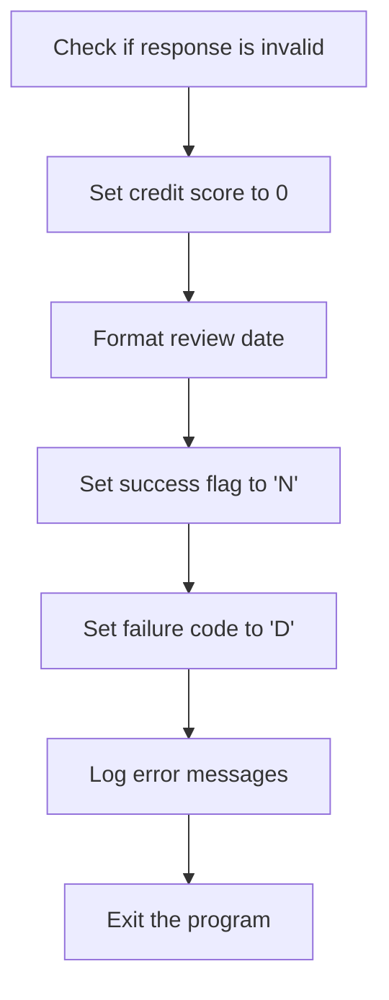

<SwmSnippet path="/src/base/cobol_src/CRECUST.cbl" line="747">

---

First, we check if the response code <SwmToken path="src/base/cobol_src/CRECUST.cbl" pos="747:3:7" line-data="                 IF WS-CICS-RESP = DFHRESP(INVREQ) AND">`WS-CICS-RESP`</SwmToken> is <SwmToken path="src/base/cobol_src/CRECUST.cbl" pos="747:11:14" line-data="                 IF WS-CICS-RESP = DFHRESP(INVREQ) AND">`DFHRESP(INVREQ)`</SwmToken> and <SwmToken path="src/base/cobol_src/CRECUST.cbl" pos="748:1:5" line-data="                 WS-CICS-RESP2 = 1">`WS-CICS-RESP2`</SwmToken> is 1, indicating an invalid request.

```cobol
                 IF WS-CICS-RESP = DFHRESP(INVREQ) AND
                 WS-CICS-RESP2 = 1
```

---

</SwmSnippet>

<SwmSnippet path="/src/base/cobol_src/CRECUST.cbl" line="750">

---

Next, we set the <SwmToken path="src/base/cobol_src/CRECUST.cbl" pos="750:7:11" line-data="                    MOVE 0 TO COMM-CREDIT-SCORE">`COMM-CREDIT-SCORE`</SwmToken> to 0, indicating that no valid credit score is available.

```cobol
                    MOVE 0 TO COMM-CREDIT-SCORE
```

---

</SwmSnippet>

<SwmSnippet path="/src/base/cobol_src/CRECUST.cbl" line="752">

---

Then, we format the review date by concatenating <SwmToken path="src/base/cobol_src/CRECUST.cbl" pos="752:3:9" line-data="                    STRING WS-ORIG-DATE-DD DELIMITED BY SIZE,">`WS-ORIG-DATE-DD`</SwmToken>, <SwmToken path="src/base/cobol_src/CRECUST.cbl" pos="753:1:7" line-data="                           WS-ORIG-DATE-MM DELIMITED BY SIZE,">`WS-ORIG-DATE-MM`</SwmToken>, and <SwmToken path="src/base/cobol_src/CRECUST.cbl" pos="754:1:7" line-data="                           WS-ORIG-DATE-YYYY DELIMITED BY SIZE">`WS-ORIG-DATE-YYYY`</SwmToken> into <SwmToken path="src/base/cobol_src/CRECUST.cbl" pos="755:3:9" line-data="                           INTO COMM-CS-REVIEW-DATE">`COMM-CS-REVIEW-DATE`</SwmToken>.

```cobol
                    STRING WS-ORIG-DATE-DD DELIMITED BY SIZE,
                           WS-ORIG-DATE-MM DELIMITED BY SIZE,
                           WS-ORIG-DATE-YYYY DELIMITED BY SIZE
                           INTO COMM-CS-REVIEW-DATE
```

---

</SwmSnippet>

<SwmSnippet path="/src/base/cobol_src/CRECUST.cbl" line="758">

---

Moving to the next step, we set the <SwmToken path="src/base/cobol_src/CRECUST.cbl" pos="758:9:11" line-data="                    MOVE &#39;N&#39; TO COMM-SUCCESS">`COMM-SUCCESS`</SwmToken> flag to 'N' to indicate the failure of the credit check and set the <SwmToken path="src/base/cobol_src/CRECUST.cbl" pos="759:9:13" line-data="                    MOVE &#39;D&#39; TO COMM-FAIL-CODE">`COMM-FAIL-CODE`</SwmToken> to 'D'.

```cobol
                    MOVE 'N' TO COMM-SUCCESS
                    MOVE 'D' TO COMM-FAIL-CODE
```

---

</SwmSnippet>

<SwmSnippet path="/src/base/cobol_src/CRECUST.cbl" line="761">

---

Finally, we log error messages to indicate the failure of the credit check and exit the program by performing the <SwmToken path="src/base/cobol_src/CRECUST.cbl" pos="766:3:11" line-data="                    PERFORM GET-ME-OUT-OF-HERE">`GET-ME-OUT-OF-HERE`</SwmToken> routine.

```cobol
                    DISPLAY 'EXEC CICS FETCH ANY failed. RESP='
                       WS-CICS-RESP ' RESP2=' WS-CICS-RESP2
                    DISPLAY '   INVREQ (no data) was returned'
                    DISPLAY '   Exiting CRECUST. COMMAREA='
                       DFHCOMMAREA
                    PERFORM GET-ME-OUT-OF-HERE
```

---

</SwmSnippet>

## Handling NOTFND response

Now, lets zoom into this section of the flow:

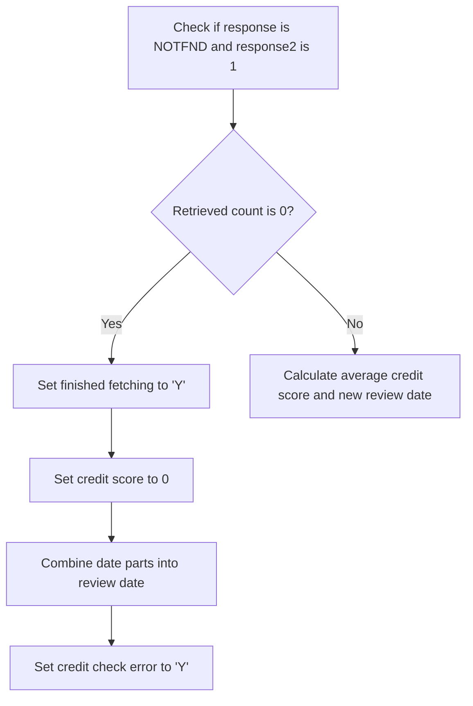

First, the function checks if the response code <SwmToken path="src/base/cobol_src/CRECUST.cbl" pos="385:1:5" line-data="                       WS-CICS-RESP &#39; RESP2=&#39; WS-CICS-RESP2">`WS-CICS-RESP`</SwmToken> is <SwmToken path="src/base/cobol_src/CRECUST.cbl" pos="773:11:14" line-data="                 IF WS-CICS-RESP = DFHRESP(NOTFND) AND">`DFHRESP(NOTFND)`</SwmToken> and <SwmToken path="src/base/cobol_src/CRECUST.cbl" pos="385:13:17" line-data="                       WS-CICS-RESP &#39; RESP2=&#39; WS-CICS-RESP2">`WS-CICS-RESP2`</SwmToken> is 1, indicating that the credit check process might be finished.

Next, it evaluates if <SwmToken path="src/base/cobol_src/CRECUST.cbl" pos="628:7:11" line-data="           MOVE 0 TO WS-RETRIEVED-CNT.">`WS-RETRIEVED-CNT`</SwmToken> (the count of retrieved records) is 0. If no records were retrieved, it implies an error in fetching data.

<SwmSnippet path="/src/base/cobol_src/CRECUST.cbl" line="780">

---

Then, if no records were retrieved, the function sets <SwmToken path="src/base/cobol_src/CRECUST.cbl" pos="781:9:13" line-data="                       MOVE &#39;Y&#39; TO WS-FINISHED-FETCHING">`WS-FINISHED-FETCHING`</SwmToken> to 'Y' to indicate that the fetching process is complete.

```cobol
                    IF WS-RETRIEVED-CNT = 0
                       MOVE 'Y' TO WS-FINISHED-FETCHING
```

---

</SwmSnippet>

<SwmSnippet path="/src/base/cobol_src/CRECUST.cbl" line="782">

---

Additionally, it sets <SwmToken path="src/base/cobol_src/CRECUST.cbl" pos="782:7:11" line-data="                       MOVE 0 TO COMM-CREDIT-SCORE">`COMM-CREDIT-SCORE`</SwmToken> to 0, indicating that no valid credit score was obtained.

```cobol
                       MOVE 0 TO COMM-CREDIT-SCORE
```

---

</SwmSnippet>

<SwmSnippet path="/src/base/cobol_src/CRECUST.cbl" line="784">

---

Moving to the next step, the function combines the date parts (<SwmToken path="src/base/cobol_src/CRECUST.cbl" pos="784:3:9" line-data="                       STRING WS-ORIG-DATE-DD DELIMITED BY SIZE,">`WS-ORIG-DATE-DD`</SwmToken>, <SwmToken path="src/base/cobol_src/CRECUST.cbl" pos="785:1:7" line-data="                              WS-ORIG-DATE-MM DELIMITED BY SIZE,">`WS-ORIG-DATE-MM`</SwmToken>, <SwmToken path="src/base/cobol_src/CRECUST.cbl" pos="786:1:7" line-data="                              WS-ORIG-DATE-YYYY DELIMITED BY SIZE">`WS-ORIG-DATE-YYYY`</SwmToken>) into <SwmToken path="src/base/cobol_src/CRECUST.cbl" pos="787:3:9" line-data="                              INTO COMM-CS-REVIEW-DATE">`COMM-CS-REVIEW-DATE`</SwmToken>.

```cobol
                       STRING WS-ORIG-DATE-DD DELIMITED BY SIZE,
                              WS-ORIG-DATE-MM DELIMITED BY SIZE,
                              WS-ORIG-DATE-YYYY DELIMITED BY SIZE
                              INTO COMM-CS-REVIEW-DATE
```

---

</SwmSnippet>

<SwmSnippet path="/src/base/cobol_src/CRECUST.cbl" line="789">

---

Finally, it sets <SwmToken path="src/base/cobol_src/CRECUST.cbl" pos="789:9:15" line-data="                       MOVE &#39;Y&#39; TO WS-CREDIT-CHECK-ERROR">`WS-CREDIT-CHECK-ERROR`</SwmToken> to 'Y', marking that an error occurred during the credit check process.

```cobol
                       MOVE 'Y' TO WS-CREDIT-CHECK-ERROR
```

---

</SwmSnippet>

## <SwmToken path="src/base/cobol_src/CRECUST.cbl" pos="392:3:9" line-data="           PERFORM DATE-OF-BIRTH-CHECK.">`DATE-OF-BIRTH-CHECK`</SwmToken>

Lets' zoom into this section of the flow:

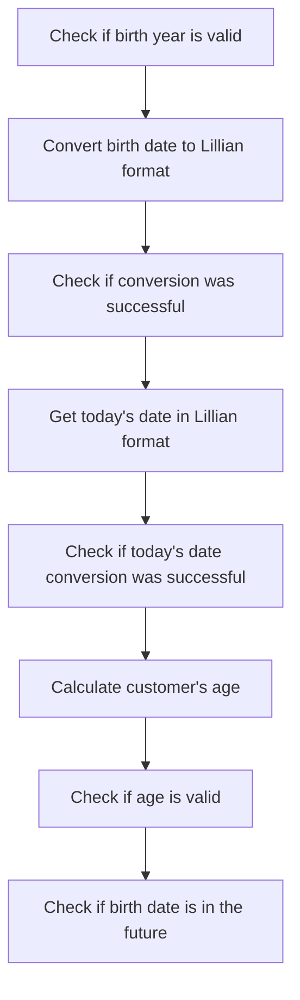

<SwmSnippet path="/src/base/cobol_src/CRECUST.cbl" line="1369">

---

### Check if birth year is valid

First, we check if <SwmToken path="src/base/cobol_src/CRECUST.cbl" pos="1369:3:7" line-data="           IF COMM-BIRTH-YEAR &lt; 1601">`COMM-BIRTH-YEAR`</SwmToken> (the customer's birth year) is less than 1601. If it is, we set <SwmToken path="src/base/cobol_src/CRECUST.cbl" pos="1370:9:17" line-data="              MOVE &#39;Y&#39; TO WS-DATE-OF-BIRTH-ERROR">`WS-DATE-OF-BIRTH-ERROR`</SwmToken> to 'Y' and <SwmToken path="src/base/cobol_src/CRECUST.cbl" pos="1371:9:13" line-data="              MOVE &#39;O&#39; TO COMM-FAIL-CODE">`COMM-FAIL-CODE`</SwmToken> to 'O', indicating an error in the date of birth.

```cobol
           IF COMM-BIRTH-YEAR < 1601
              MOVE 'Y' TO WS-DATE-OF-BIRTH-ERROR
              MOVE 'O' TO COMM-FAIL-CODE
              GO TO DOBC999
```

---

</SwmSnippet>

<SwmSnippet path="/src/base/cobol_src/CRECUST.cbl" line="1375">

---

### Convert birth date to Lillian format

Moving to the next step, we convert the birth date components (<SwmToken path="src/base/cobol_src/CRECUST.cbl" pos="1375:3:7" line-data="           MOVE COMM-BIRTH-YEAR TO CEEDAYS-YEAR.">`COMM-BIRTH-YEAR`</SwmToken>, <SwmToken path="src/base/cobol_src/CRECUST.cbl" pos="1376:3:7" line-data="           MOVE COMM-BIRTH-MONTH TO CEEDAYS-MONTH.">`COMM-BIRTH-MONTH`</SwmToken>, <SwmToken path="src/base/cobol_src/CRECUST.cbl" pos="1377:3:7" line-data="           MOVE COMM-BIRTH-DAY TO CEEDAYS-DAY.">`COMM-BIRTH-DAY`</SwmToken>) to the Lillian date format using the <SwmToken path="src/base/cobol_src/CRECUST.cbl" pos="1375:11:11" line-data="           MOVE COMM-BIRTH-YEAR TO CEEDAYS-YEAR.">`CEEDAYS`</SwmToken> function.

```cobol
           MOVE COMM-BIRTH-YEAR TO CEEDAYS-YEAR.
           MOVE COMM-BIRTH-MONTH TO CEEDAYS-MONTH.
           MOVE COMM-BIRTH-DAY TO CEEDAYS-DAY.

           CALL "CEEDAYS" USING DATE-OF-BIRTH-FOR-CEEDAYS
                                DATE-OF-BIRTH-FORMAT,
                                WS-DATE-OF-BIRTH-LILLIAN,
                                FC.
```

---

</SwmSnippet>

<SwmSnippet path="/src/base/cobol_src/CRECUST.cbl" line="1384">

---

### Check if conversion was successful

Next, we check if the <SwmToken path="src/base/cobol_src/CRECUST.cbl" pos="1387:4:4" line-data="              DISPLAY &#39;CEEDAYS failed, FORMAT LENGTH 10 with msg &#39;">`CEEDAYS`</SwmToken> function call was successful. If not, we set <SwmToken path="src/base/cobol_src/CRECUST.cbl" pos="1385:9:17" line-data="              MOVE &#39;Y&#39; TO WS-DATE-OF-BIRTH-ERROR">`WS-DATE-OF-BIRTH-ERROR`</SwmToken> to 'Y' and <SwmToken path="src/base/cobol_src/CRECUST.cbl" pos="1386:9:13" line-data="              MOVE &#39;Z&#39; TO COMM-FAIL-CODE">`COMM-FAIL-CODE`</SwmToken> to 'Z', and display an error message indicating the failure.

```cobol
           IF NOT CEE000 OF FC THEN
              MOVE 'Y' TO WS-DATE-OF-BIRTH-ERROR
              MOVE 'Z' TO COMM-FAIL-CODE
              DISPLAY 'CEEDAYS failed, FORMAT LENGTH 10 with msg '
                 MSG-NO OF FC
                 ' for date YYYYMMDD' DATE-OF-BIRTH-FOR-CEEDAYS
              GO TO DOBC999
           END-IF.
```

---

</SwmSnippet>

<SwmSnippet path="/src/base/cobol_src/CRECUST.cbl" line="1393">

---

### Get today's date in Lillian format

Then, we call the <SwmToken path="src/base/cobol_src/CRECUST.cbl" pos="1393:4:4" line-data="           CALL &quot;CEELOCT&quot; USING WS-TODAY-LILLIAN,">`CEELOCT`</SwmToken> function to get today's date in the Lillian date format and store it in <SwmToken path="src/base/cobol_src/CRECUST.cbl" pos="1393:9:13" line-data="           CALL &quot;CEELOCT&quot; USING WS-TODAY-LILLIAN,">`WS-TODAY-LILLIAN`</SwmToken>.

```cobol
           CALL "CEELOCT" USING WS-TODAY-LILLIAN,
                                WS-TODAY-SECONDS,
                                WS-TODAY-GREGORIAN,
                                FC.
```

---

</SwmSnippet>

<SwmSnippet path="/src/base/cobol_src/CRECUST.cbl" line="1398">

---

### Check if today's date conversion was successful

We then check if the <SwmToken path="src/base/cobol_src/CRECUST.cbl" pos="1393:4:4" line-data="           CALL &quot;CEELOCT&quot; USING WS-TODAY-LILLIAN,">`CEELOCT`</SwmToken> function call was successful. If not, we set <SwmToken path="src/base/cobol_src/CRECUST.cbl" pos="1399:9:17" line-data="              MOVE &#39;Y&#39; TO WS-DATE-OF-BIRTH-ERROR">`WS-DATE-OF-BIRTH-ERROR`</SwmToken> to 'Y' and display an error message indicating the failure.

```cobol
           IF NOT CEE000 OF FC THEN
              MOVE 'Y' TO WS-DATE-OF-BIRTH-ERROR
              DISPLAY 'CEEDLOCT failed with msg '
                 MSG-NO OF FC
              GO TO DOBC999
```

---

</SwmSnippet>

<SwmSnippet path="/src/base/cobol_src/CRECUST.cbl" line="1405">

---

### Calculate customer's age

Next, we calculate the customer's age by subtracting <SwmToken path="src/base/cobol_src/CRECUST.cbl" pos="1405:3:7" line-data="           SUBTRACT COMM-BIRTH-YEAR FROM WS-TODAY-G-YEAR">`COMM-BIRTH-YEAR`</SwmToken> from <SwmToken path="src/base/cobol_src/CRECUST.cbl" pos="1405:11:17" line-data="           SUBTRACT COMM-BIRTH-YEAR FROM WS-TODAY-G-YEAR">`WS-TODAY-G-YEAR`</SwmToken> and storing the result in <SwmToken path="src/base/cobol_src/CRECUST.cbl" pos="1406:3:7" line-data="              GIVING WS-CUSTOMER-AGE">`WS-CUSTOMER-AGE`</SwmToken>.

```cobol
           SUBTRACT COMM-BIRTH-YEAR FROM WS-TODAY-G-YEAR
              GIVING WS-CUSTOMER-AGE
```

---

</SwmSnippet>

<SwmSnippet path="/src/base/cobol_src/CRECUST.cbl" line="1408">

---

### Check if age is valid

We then check if the customer's age is greater than 150. If it is, we set <SwmToken path="src/base/cobol_src/CRECUST.cbl" pos="1409:9:17" line-data="              MOVE &#39;Y&#39; TO WS-DATE-OF-BIRTH-ERROR">`WS-DATE-OF-BIRTH-ERROR`</SwmToken> to 'Y' and <SwmToken path="src/base/cobol_src/CRECUST.cbl" pos="1410:9:13" line-data="              MOVE &#39;O&#39; TO COMM-FAIL-CODE">`COMM-FAIL-CODE`</SwmToken> to 'O', indicating an invalid age.

```cobol
           IF WS-CUSTOMER-AGE > 150
              MOVE 'Y' TO WS-DATE-OF-BIRTH-ERROR
              MOVE 'O' TO COMM-FAIL-CODE
              GO TO DOBC999
```

---

</SwmSnippet>

<SwmSnippet path="/src/base/cobol_src/CRECUST.cbl" line="1414">

---

### Check if birth date is in the future

Finally, we check if the birth date is in the future by comparing <SwmToken path="src/base/cobol_src/CRECUST.cbl" pos="1414:3:7" line-data="           IF WS-TODAY-LILLIAN &lt; WS-DATE-OF-BIRTH-LILLIAN">`WS-TODAY-LILLIAN`</SwmToken> with <SwmToken path="src/base/cobol_src/CRECUST.cbl" pos="1414:11:19" line-data="           IF WS-TODAY-LILLIAN &lt; WS-DATE-OF-BIRTH-LILLIAN">`WS-DATE-OF-BIRTH-LILLIAN`</SwmToken>. If the birth date is in the future, we set <SwmToken path="src/base/cobol_src/CRECUST.cbl" pos="1415:9:17" line-data="                        MOVE &#39;Y&#39; TO WS-DATE-OF-BIRTH-ERROR">`WS-DATE-OF-BIRTH-ERROR`</SwmToken> and <SwmToken path="src/base/cobol_src/CRECUST.cbl" pos="1416:9:13" line-data="              MOVE &#39;Y&#39; TO COMM-FAIL-CODE">`COMM-FAIL-CODE`</SwmToken> to 'Y'.

```cobol
           IF WS-TODAY-LILLIAN < WS-DATE-OF-BIRTH-LILLIAN
                        MOVE 'Y' TO WS-DATE-OF-BIRTH-ERROR
              MOVE 'Y' TO COMM-FAIL-CODE
           END-IF.
```

---

</SwmSnippet>

## <SwmToken path="src/base/cobol_src/CRECUST.cbl" pos="404:3:7" line-data="           PERFORM ENQ-NAMED-COUNTER.">`ENQ-NAMED-COUNTER`</SwmToken>

Lets' zoom into this section of the flow:

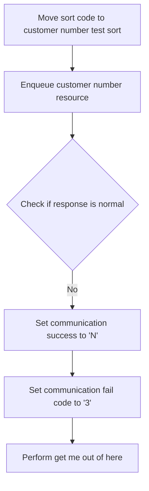

<SwmSnippet path="/src/base/cobol_src/CRECUST.cbl" line="443">

---

First, the sort code is moved to the customer number test sort field. This prepares the data for the subsequent resource locking operation.

```cobol
           MOVE SORTCODE TO
              NCS-CUST-NO-TEST-SORT.
```

---

</SwmSnippet>

<SwmSnippet path="/src/base/cobol_src/CRECUST.cbl" line="446">

---

Next, the customer number resource is enqueued. This operation locks the resource to prevent other transactions from modifying it simultaneously.

```cobol
           EXEC CICS ENQ
              RESOURCE(NCS-CUST-NO-NAME)
              LENGTH(16)
              RESP(WS-CICS-RESP)
              RESP2(WS-CICS-RESP2)
           END-EXEC.
```

---

</SwmSnippet>

<SwmSnippet path="/src/base/cobol_src/CRECUST.cbl" line="453">

---

Then, we check if the response from the enqueue operation is normal. If it is not, it indicates that the resource could not be locked successfully.

```cobol
           IF WS-CICS-RESP NOT = DFHRESP(NORMAL)
```

---

</SwmSnippet>

<SwmSnippet path="/src/base/cobol_src/CRECUST.cbl" line="454">

---

If the response is not normal, the communication success flag is set to 'N' and the communication fail code is set to '3'. This indicates a failure in locking the resource, and the program then performs the 'get me out of here' operation to handle the failure.

```cobol
             MOVE 'N' TO COMM-SUCCESS
             MOVE '3' TO COMM-FAIL-CODE
             PERFORM GET-ME-OUT-OF-HERE
           END-IF.
```

---

</SwmSnippet>

## <SwmToken path="src/base/cobol_src/CRECUST.cbl" pos="409:3:5" line-data="           PERFORM UPD-NCS.">`UPD-NCS`</SwmToken>

Lets' zoom into this section of the flow:

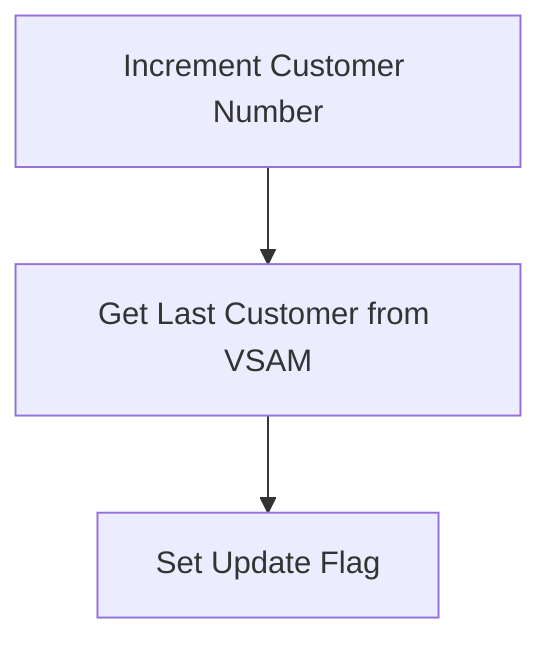

<SwmSnippet path="/src/base/cobol_src/CRECUST.cbl" line="493">

---

First, the customer number increment value is set to 1, indicating that the customer number should be increased by one.

```cobol
           MOVE 1 TO NCS-CUST-NO-INC.
```

---

</SwmSnippet>

<SwmSnippet path="/src/base/cobol_src/CRECUST.cbl" line="495">

---

Next, the program performs the <SwmToken path="src/base/cobol_src/CRECUST.cbl" pos="495:3:9" line-data="           PERFORM GET-LAST-CUSTOMER-VSAM">`GET-LAST-CUSTOMER-VSAM`</SwmToken> operation, which retrieves the last customer number from the VSAM file. This ensures that the system has the most recent customer information before updating.

```cobol
           PERFORM GET-LAST-CUSTOMER-VSAM
```

---

</SwmSnippet>

<SwmSnippet path="/src/base/cobol_src/CRECUST.cbl" line="497">

---

Then, the update flag <SwmToken path="src/base/cobol_src/CRECUST.cbl" pos="497:9:11" line-data="           MOVE &#39;Y&#39; TO NCS-UPDATED.">`NCS-UPDATED`</SwmToken> is set to 'Y', indicating that the Named Counter Server has been successfully updated with the new customer information.

```cobol
           MOVE 'Y' TO NCS-UPDATED.
```

---

</SwmSnippet>

<SwmSnippet path="/src/base/cobol_src/CRECUST.cbl" line="499">

---

Finally, the section ends with an exit statement, completing the update process for the Named Counter Server.

```cobol
       UN999.
           EXIT.
```

---

</SwmSnippet>

## <SwmToken path="src/base/cobol_src/CRECUST.cbl" pos="495:3:9" line-data="           PERFORM GET-LAST-CUSTOMER-VSAM">`GET-LAST-CUSTOMER-VSAM`</SwmToken>

Lets' zoom into this section of the flow:

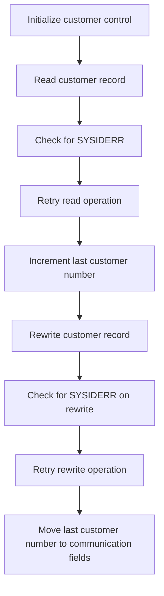

<SwmSnippet path="/src/base/cobol_src/CRECUST.cbl" line="1286">

---

First, the customer control data is initialized by setting the sort code to zero and the customer number to all nines.

```cobol
           INITIALIZE CUSTOMER-CONTROL
           MOVE ZERO TO CUSTOMER-CONTROL-SORTCODE
           MOVE ALL '9' TO CUSTOMER-CONTROL-NUMBER
```

---

</SwmSnippet>

<SwmSnippet path="/src/base/cobol_src/CRECUST.cbl" line="1290">

---

Next, the program reads the customer record from the VSAM file using the customer control key.

```cobol
           EXEC CICS READ FILE('CUSTOMER')
                     RIDFLD(CUSTOMER-CONTROL-KEY)
                     UPDATE
                     INTO(CUSTOMER-CONTROL)
                     RESP(WS-CICS-RESP)
                     RESP2(WS-CICS-RESP2)
```

---

</SwmSnippet>

<SwmSnippet path="/src/base/cobol_src/CRECUST.cbl" line="1298">

---

Then, it checks if the response indicates a SYSIDERR error, which signifies a system ID error.

```cobol
           IF WS-CICS-RESP = DFHRESP(SYSIDERR)
             PERFORM VARYING SYSIDERR-RETRY FROM 1 BY 1
             UNTIL SYSIDERR-RETRY > 100
             OR WS-CICS-RESP = DFHRESP(NORMAL)
             OR WS-CICS-RESP IS NOT EQUAL TO DFHRESP(SYSIDERR)
```

---

</SwmSnippet>

<SwmSnippet path="/src/base/cobol_src/CRECUST.cbl" line="1299">

---

If a SYSIDERR error is detected, the program retries the read operation up to 100 times, with a 3-second delay between each attempt.

```cobol
             PERFORM VARYING SYSIDERR-RETRY FROM 1 BY 1
             UNTIL SYSIDERR-RETRY > 100
             OR WS-CICS-RESP = DFHRESP(NORMAL)
             OR WS-CICS-RESP IS NOT EQUAL TO DFHRESP(SYSIDERR)
               EXEC CICS DELAY FOR SECONDS(3)
               END-EXEC
```

---

</SwmSnippet>

<SwmSnippet path="/src/base/cobol_src/CRECUST.cbl" line="1323">

---

After successfully reading the customer record, the program increments the last customer number by one.

```cobol
           ADD 1 TO LAST-CUSTOMER-NUMBER IN CUSTOMER-CONTROL
           GIVING LAST-CUSTOMER-NUMBER IN CUSTOMER-CONTROL
```

---

</SwmSnippet>

<SwmSnippet path="/src/base/cobol_src/CRECUST.cbl" line="1326">

---

The updated customer record is then rewritten to the VSAM file.

```cobol
           EXEC CICS REWRITE FILE('CUSTOMER')
                FROM(CUSTOMER-CONTROL)
                RESP(WS-CICS-RESP)
                RESP2(WS-CICS-RESP2)
           END-EXEC
```

---

</SwmSnippet>

<SwmSnippet path="/src/base/cobol_src/CRECUST.cbl" line="1333">

---

If a SYSIDERR error occurs during the rewrite operation, the program retries the rewrite up to 100 times, with a 3-second delay between each attempt.

```cobol
              PERFORM VARYING SYSIDERR-RETRY FROM 1 BY 1
              UNTIL SYSIDERR-RETRY > 100
              OR WS-CICS-RESP = DFHRESP(NORMAL)
              OR WS-CICS-RESP IS NOT EQUAL TO DFHRESP(SYSIDERR)
                 EXEC CICS DELAY FOR SECONDS(3)
                 END-EXEC
```

---

</SwmSnippet>

<SwmSnippet path="/src/base/cobol_src/CRECUST.cbl" line="1356">

---

Finally, the last customer number is moved to the communication fields for further processing.

```cobol
           MOVE LAST-CUSTOMER-NUMBER OF CUSTOMER-CONTROL  TO
              COMM-NUMBER CUSTOMER-NUMBER REQUIRED-CUST-NUMBER2
              NCS-CUST-NO-VALUE.
```

---

</SwmSnippet>

## <SwmToken path="src/base/cobol_src/CRECUST.cbl" pos="1067:3:7" line-data="              PERFORM DEQ-NAMED-COUNTER">`DEQ-NAMED-COUNTER`</SwmToken>

Lets' zoom into this section of the flow:

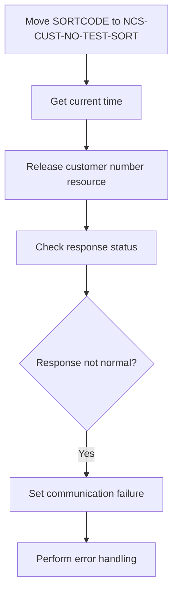

<SwmSnippet path="/src/base/cobol_src/CRECUST.cbl" line="466">

---

First, the <SwmToken path="src/base/cobol_src/CRECUST.cbl" pos="466:3:3" line-data="           MOVE SORTCODE TO">`SORTCODE`</SwmToken> is moved to <SwmToken path="src/base/cobol_src/CRECUST.cbl" pos="467:1:9" line-data="              NCS-CUST-NO-TEST-SORT.">`NCS-CUST-NO-TEST-SORT`</SwmToken>, which prepares the customer number for the subsequent operations.

```cobol
           MOVE SORTCODE TO
              NCS-CUST-NO-TEST-SORT.
```

---

</SwmSnippet>

<SwmSnippet path="/src/base/cobol_src/CRECUST.cbl" line="469">

---

Next, the current time is obtained and stored in <SwmToken path="src/base/cobol_src/CRECUST.cbl" pos="469:11:13" line-data="      D    EXEC CICS ASKTIME ABSTIME(START-DEQ) END-EXEC">`START-DEQ`</SwmToken> to timestamp the operation.

```cobol
      D    EXEC CICS ASKTIME ABSTIME(START-DEQ) END-EXEC
```

---

</SwmSnippet>

<SwmSnippet path="/src/base/cobol_src/CRECUST.cbl" line="471">

---

Then, the customer number resource identified by <SwmToken path="src/base/cobol_src/CRECUST.cbl" pos="472:3:9" line-data="              RESOURCE(NCS-CUST-NO-NAME)">`NCS-CUST-NO-NAME`</SwmToken> is released using the <SwmToken path="src/base/cobol_src/CRECUST.cbl" pos="471:5:5" line-data="           EXEC CICS DEQ">`DEQ`</SwmToken> command, which is essential for freeing up the resource for other operations.

```cobol
           EXEC CICS DEQ
              RESOURCE(NCS-CUST-NO-NAME)
              LENGTH(16)
              RESP(WS-CICS-RESP)
              RESP2(WS-CICS-RESP2)
           END-EXEC.
```

---

</SwmSnippet>

<SwmSnippet path="/src/base/cobol_src/CRECUST.cbl" line="478">

---

Finally, the response status is checked. If the response is not normal, the communication success flag is set to 'N', the failure code is set to '5', and the error handling routine <SwmToken path="src/base/cobol_src/CRECUST.cbl" pos="481:3:11" line-data="             PERFORM GET-ME-OUT-OF-HERE">`GET-ME-OUT-OF-HERE`</SwmToken> is performed to manage the failure.

```cobol
           IF WS-CICS-RESP NOT = DFHRESP(NORMAL)
             MOVE 'N' TO COMM-SUCCESS
             MOVE '5' TO COMM-FAIL-CODE
             PERFORM GET-ME-OUT-OF-HERE
           END-IF.
```

---

</SwmSnippet>

## <SwmToken path="src/base/cobol_src/CRECUST.cbl" pos="414:3:7" line-data="           PERFORM WRITE-CUSTOMER-VSAM.">`WRITE-CUSTOMER-VSAM`</SwmToken>

Lets' zoom into this section of the flow:

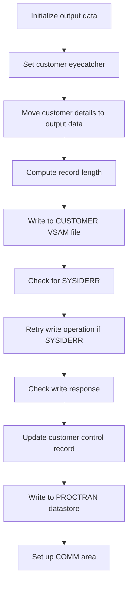

<SwmSnippet path="/src/base/cobol_src/CRECUST.cbl" line="1016">

---

First, the <SwmToken path="src/base/cobol_src/CRECUST.cbl" pos="414:3:7" line-data="           PERFORM WRITE-CUSTOMER-VSAM.">`WRITE-CUSTOMER-VSAM`</SwmToken> section initializes the <SwmToken path="src/base/cobol_src/CRECUST.cbl" pos="1016:3:5" line-data="           INITIALIZE OUTPUT-DATA.">`OUTPUT-DATA`</SwmToken> structure to prepare for writing customer information to the VSAM file.

```cobol
           INITIALIZE OUTPUT-DATA.
```

---

</SwmSnippet>

<SwmSnippet path="/src/base/cobol_src/CRECUST.cbl" line="1018">

---

Moving to the next step, the code sets the <SwmToken path="src/base/cobol_src/CRECUST.cbl" pos="1018:9:11" line-data="           MOVE &#39;CUST&#39;              TO CUSTOMER-EYECATCHER.">`CUSTOMER-EYECATCHER`</SwmToken> to 'CUST', which acts as an identifier for the customer record.

```cobol
           MOVE 'CUST'              TO CUSTOMER-EYECATCHER.
```

---

</SwmSnippet>

<SwmSnippet path="/src/base/cobol_src/CRECUST.cbl" line="1019">

---

Next, the customer details such as <SwmToken path="src/base/cobol_src/CRECUST.cbl" pos="1019:3:3" line-data="           MOVE SORTCODE            TO CUSTOMER-SORTCODE.">`SORTCODE`</SwmToken>, <SwmToken path="src/base/cobol_src/CRECUST.cbl" pos="1020:13:15" line-data="           MOVE NCS-CUST-NO-VALUE   TO CUSTOMER-NUMBER.">`CUSTOMER-NUMBER`</SwmToken>, <SwmToken path="src/base/cobol_src/CRECUST.cbl" pos="1021:9:11" line-data="           MOVE COMM-NAME           TO CUSTOMER-NAME.">`CUSTOMER-NAME`</SwmToken>, <SwmToken path="src/base/cobol_src/CRECUST.cbl" pos="1022:9:11" line-data="           MOVE COMM-ADDRESS        TO CUSTOMER-ADDRESS.">`CUSTOMER-ADDRESS`</SwmToken>, <SwmToken path="src/base/cobol_src/CRECUST.cbl" pos="1023:13:19" line-data="           MOVE COMM-DATE-OF-BIRTH  TO CUSTOMER-DATE-OF-BIRTH.">`CUSTOMER-DATE-OF-BIRTH`</SwmToken>, <SwmToken path="src/base/cobol_src/CRECUST.cbl" pos="1024:11:15" line-data="           MOVE COMM-CREDIT-SCORE   TO CUSTOMER-CREDIT-SCORE.">`CUSTOMER-CREDIT-SCORE`</SwmToken>, and <SwmToken path="src/base/cobol_src/CRECUST.cbl" pos="1025:13:19" line-data="           MOVE COMM-CS-REVIEW-DATE TO CUSTOMER-CS-REVIEW-DATE.">`CUSTOMER-CS-REVIEW-DATE`</SwmToken> are moved into the <SwmToken path="src/base/cobol_src/CRECUST.cbl" pos="1016:3:5" line-data="           INITIALIZE OUTPUT-DATA.">`OUTPUT-DATA`</SwmToken> structure.

```cobol
           MOVE SORTCODE            TO CUSTOMER-SORTCODE.
           MOVE NCS-CUST-NO-VALUE   TO CUSTOMER-NUMBER.
           MOVE COMM-NAME           TO CUSTOMER-NAME.
           MOVE COMM-ADDRESS        TO CUSTOMER-ADDRESS.
           MOVE COMM-DATE-OF-BIRTH  TO CUSTOMER-DATE-OF-BIRTH.
           MOVE COMM-CREDIT-SCORE   TO CUSTOMER-CREDIT-SCORE.
           MOVE COMM-CS-REVIEW-DATE TO CUSTOMER-CS-REVIEW-DATE.
```

---

</SwmSnippet>

<SwmSnippet path="/src/base/cobol_src/CRECUST.cbl" line="1027">

---

Then, the length of the <SwmToken path="src/base/cobol_src/CRECUST.cbl" pos="1027:17:19" line-data="           COMPUTE WS-CUST-REC-LEN = LENGTH OF OUTPUT-DATA.">`OUTPUT-DATA`</SwmToken> is computed and stored in <SwmToken path="src/base/cobol_src/CRECUST.cbl" pos="1027:3:9" line-data="           COMPUTE WS-CUST-REC-LEN = LENGTH OF OUTPUT-DATA.">`WS-CUST-REC-LEN`</SwmToken> to ensure the correct length is used during the write operation.

```cobol
           COMPUTE WS-CUST-REC-LEN = LENGTH OF OUTPUT-DATA.
```

---

</SwmSnippet>

<SwmSnippet path="/src/base/cobol_src/CRECUST.cbl" line="1029">

---

The code then attempts to write the <SwmToken path="src/base/cobol_src/CRECUST.cbl" pos="1031:3:5" line-data="                FROM(OUTPUT-DATA)">`OUTPUT-DATA`</SwmToken> to the <SwmToken path="src/base/cobol_src/CRECUST.cbl" pos="1030:4:4" line-data="                FILE(&#39;CUSTOMER&#39;)">`CUSTOMER`</SwmToken> VSAM file using the <SwmToken path="src/base/cobol_src/CRECUST.cbl" pos="1029:1:5" line-data="           EXEC CICS WRITE">`EXEC CICS WRITE`</SwmToken> command, specifying the file name, data, record ID field, length, and key length.

```cobol
           EXEC CICS WRITE
                FILE('CUSTOMER')
                FROM(OUTPUT-DATA)
                RIDFLD(CUSTOMER-KEY)
                LENGTH(WS-CUST-REC-LEN)
                KEYLENGTH(16)
                RESP(WS-CICS-RESP)
                RESP2(WS-CICS-RESP2)
           END-EXEC.
```

---

</SwmSnippet>

<SwmSnippet path="/src/base/cobol_src/CRECUST.cbl" line="1039">

---

If a <SwmToken path="src/base/cobol_src/CRECUST.cbl" pos="1039:13:13" line-data="           IF WS-CICS-RESP = DFHRESP(SYSIDERR)">`SYSIDERR`</SwmToken> response is received, the code enters a retry loop, attempting the write operation up to 100 times with a 3-second delay between each attempt.

```cobol
           IF WS-CICS-RESP = DFHRESP(SYSIDERR)
              PERFORM VARYING SYSIDERR-RETRY FROM 1 BY 1
              UNTIL SYSIDERR-RETRY > 100
              OR WS-CICS-RESP = DFHRESP(NORMAL)
              OR WS-CICS-RESP IS NOT EQUAL TO DFHRESP(SYSIDERR)

                 EXEC CICS DELAY FOR SECONDS(3)
                 END-EXEC

                 EXEC CICS WRITE
                    FILE('CUSTOMER')
                    FROM(OUTPUT-DATA)
                    RIDFLD(CUSTOMER-KEY)
                    LENGTH(WS-CUST-REC-LEN)
                    KEYLENGTH(16)
                    RESP(WS-CICS-RESP)
                    RESP2(WS-CICS-RESP2)
                 END-EXEC

              END-PERFORM
           END-IF
```

---

</SwmSnippet>

<SwmSnippet path="/src/base/cobol_src/CRECUST.cbl" line="1064">

---

Next, the code checks if the write operation was unsuccessful. If it was, it sets the <SwmToken path="src/base/cobol_src/CRECUST.cbl" pos="1065:9:11" line-data="              MOVE &#39;N&#39; TO COMM-SUCCESS">`COMM-SUCCESS`</SwmToken> flag to 'N', assigns a failure code, and performs error handling routines.

```cobol
           IF WS-CICS-RESP NOT = DFHRESP(NORMAL)
              MOVE 'N' TO COMM-SUCCESS
              MOVE '1' TO COMM-FAIL-CODE
              PERFORM DEQ-NAMED-COUNTER
              PERFORM GET-ME-OUT-OF-HERE
           END-IF.
```

---

</SwmSnippet>

<SwmSnippet path="/src/base/cobol_src/CRECUST.cbl" line="1071">

---

Moving forward, the code initializes the <SwmToken path="src/base/cobol_src/CRECUST.cbl" pos="1071:3:5" line-data="           INITIALIZE CUSTOMER-CONTROL">`CUSTOMER-CONTROL`</SwmToken> structure and reads the control record from the <SwmToken path="src/base/cobol_src/CRECUST.cbl" pos="1071:3:3" line-data="           INITIALIZE CUSTOMER-CONTROL">`CUSTOMER`</SwmToken> file to update the number of customers and the last customer number.

```cobol
           INITIALIZE CUSTOMER-CONTROL
           MOVE ZERO TO CUSTOMER-CONTROL-SORTCODE
           MOVE ALL '9' TO CUSTOMER-CONTROL-NUMBER

           EXEC CICS READ FILE('CUSTOMER')
                RIDFLD(CUSTOMER-CONTROL-KEY)
                INTO(CUSTOMER-CONTROL)
                UPDATE
           END-EXEC

           ADD 1 TO NUMBER-OF-CUSTOMERS IN CUSTOMER-CONTROL-RECORD
           GIVING NUMBER-OF-CUSTOMERS IN CUSTOMER-CONTROL-RECORD
           MOVE CUSTOMER-NUMBER OF CUSTOMER-RECORD TO
           LAST-CUSTOMER-NUMBER IN CUSTOMER-CONTROL-RECORD

           EXEC CICS REWRITE FILE('CUSTOMER')
                FROM(CUSTOMER-CONTROL)
```

---

</SwmSnippet>

<SwmSnippet path="/src/base/cobol_src/CRECUST.cbl" line="1091">

---

If the write operation was successful, the code proceeds to write the customer data to the <SwmToken path="src/base/cobol_src/CRECUST.cbl" pos="1091:19:19" line-data="      *    If the WRITE was successful then WRITE to PROCTRAN datastore">`PROCTRAN`</SwmToken> datastore by moving relevant fields from <SwmToken path="src/base/cobol_src/CRECUST.cbl" pos="1093:9:11" line-data="           MOVE CUSTOMER-SORTCODE OF OUTPUT-DATA TO STORED-SORTCODE.">`OUTPUT-DATA`</SwmToken> to <SwmToken path="src/base/cobol_src/CRECUST.cbl" pos="1093:15:15" line-data="           MOVE CUSTOMER-SORTCODE OF OUTPUT-DATA TO STORED-SORTCODE.">`STORED`</SwmToken> variables and performing the <SwmToken path="src/base/cobol_src/CRECUST.cbl" pos="1102:3:5" line-data="           PERFORM WRITE-PROCTRAN.">`WRITE-PROCTRAN`</SwmToken> routine.

```cobol
      *    If the WRITE was successful then WRITE to PROCTRAN datastore
      *
           MOVE CUSTOMER-SORTCODE OF OUTPUT-DATA TO STORED-SORTCODE.
           MOVE CUSTOMER-NUMBER OF OUTPUT-DATA TO STORED-CUSTNO.
           MOVE CUSTOMER-NAME TO STORED-NAME.
           MOVE CUSTOMER-DATE-OF-BIRTH(1:2) TO STORED-DOB(1:2).
           MOVE '/' TO STORED-DOB(3:1).
           MOVE CUSTOMER-DATE-OF-BIRTH(3:2) TO STORED-DOB(4:2).
           MOVE '/' TO STORED-DOB(6:1).
           MOVE CUSTOMER-DATE-OF-BIRTH(5:4) TO STORED-DOB(7:4).

           PERFORM WRITE-PROCTRAN.
```

---

</SwmSnippet>

<SwmSnippet path="/src/base/cobol_src/CRECUST.cbl" line="1107">

---

Finally, the code sets up the missing data in the <SwmToken path="src/base/cobol_src/CRECUST.cbl" pos="1107:17:17" line-data="      *    Set up the missing data in the COMM AREA ready for return">`COMM`</SwmToken> area, including the <SwmToken path="src/base/cobol_src/CRECUST.cbl" pos="1109:5:5" line-data="           MOVE CUSTOMER-SORTCODE OF OUTPUT-DATA">`SORTCODE`</SwmToken>, <SwmToken path="src/base/cobol_src/CRECUST.cbl" pos="1111:5:5" line-data="           MOVE CUSTOMER-NUMBER OF OUTPUT-DATA">`NUMBER`</SwmToken>, <SwmToken path="src/base/cobol_src/CRECUST.cbl" pos="1113:11:11" line-data="           MOVE &#39;CUST&#39; TO COMM-EYECATCHER.">`EYECATCHER`</SwmToken>, <SwmToken path="src/base/cobol_src/CRECUST.cbl" pos="1114:11:11" line-data="           MOVE &#39;Y&#39; TO COMM-SUCCESS.">`SUCCESS`</SwmToken> flag, and clears the <SwmToken path="src/base/cobol_src/CRECUST.cbl" pos="1115:11:13" line-data="           MOVE &#39; &#39; TO COMM-FAIL-CODE.">`FAIL-CODE`</SwmToken>, preparing the data for return.

```cobol
      *    Set up the missing data in the COMM AREA ready for return
      *
           MOVE CUSTOMER-SORTCODE OF OUTPUT-DATA
              TO COMM-SORTCODE.
           MOVE CUSTOMER-NUMBER OF OUTPUT-DATA
              TO COMM-NUMBER
           MOVE 'CUST' TO COMM-EYECATCHER.
           MOVE 'Y' TO COMM-SUCCESS.
           MOVE ' ' TO COMM-FAIL-CODE.
```

---

</SwmSnippet>

## <SwmToken path="src/base/cobol_src/CRECUST.cbl" pos="1102:3:5" line-data="           PERFORM WRITE-PROCTRAN.">`WRITE-PROCTRAN`</SwmToken>

Lets' zoom into this section of the flow:

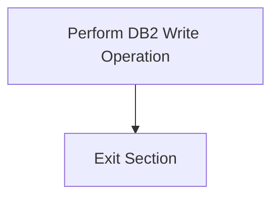

<SwmSnippet path="/src/base/cobol_src/CRECUST.cbl" line="1121">

---

First, the <SwmToken path="src/base/cobol_src/CRECUST.cbl" pos="1121:1:3" line-data="       WRITE-PROCTRAN SECTION.">`WRITE-PROCTRAN`</SwmToken> section begins by performing the <SwmToken path="src/base/cobol_src/CRECUST.cbl" pos="1123:3:7" line-data="              PERFORM WRITE-PROCTRAN-DB2.">`WRITE-PROCTRAN-DB2`</SwmToken> operation, which is responsible for logging the creation of a new customer record in the PROCTRAN table.

```cobol
       WRITE-PROCTRAN SECTION.
       WP010.
              PERFORM WRITE-PROCTRAN-DB2.
```

---

</SwmSnippet>

<SwmSnippet path="/src/base/cobol_src/CRECUST.cbl" line="1125">

---

Next, the section reaches the <SwmToken path="src/base/cobol_src/CRECUST.cbl" pos="1125:1:1" line-data="       WP999.">`WP999`</SwmToken> label and exits, indicating the end of the <SwmToken path="src/base/cobol_src/CRECUST.cbl" pos="1102:3:5" line-data="           PERFORM WRITE-PROCTRAN.">`WRITE-PROCTRAN`</SwmToken> section.

```cobol
       WP999.
           EXIT.
```

---

</SwmSnippet>

## <SwmToken path="src/base/cobol_src/CRECUST.cbl" pos="1123:3:7" line-data="              PERFORM WRITE-PROCTRAN-DB2.">`WRITE-PROCTRAN-DB2`</SwmToken>

Lets' zoom into this section of the flow:

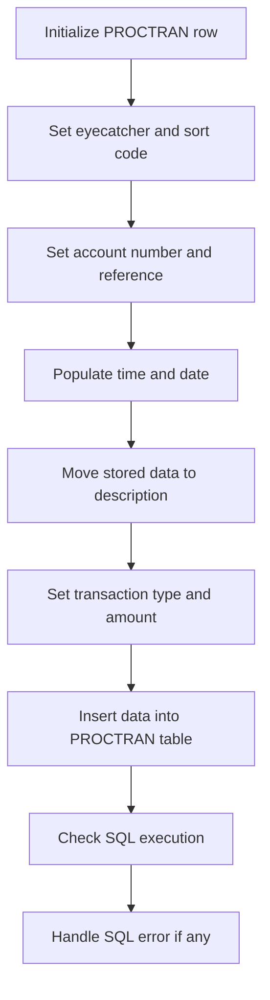

First, the <SwmToken path="src/base/cobol_src/CRECUST.cbl" pos="1123:3:7" line-data="              PERFORM WRITE-PROCTRAN-DB2.">`WRITE-PROCTRAN-DB2`</SwmToken> section initializes the <SwmToken path="src/base/cobol_src/CRECUST.cbl" pos="67:3:7" line-data="       01 HOST-PROCTRAN-ROW.">`HOST-PROCTRAN-ROW`</SwmToken> and <SwmToken path="src/base/cobol_src/CRECUST.cbl" pos="184:3:5" line-data="       01 WS-EIBTASKN12                 PIC 9(12)     VALUE 0.">`WS-EIBTASKN12`</SwmToken> to prepare for recording a new customer transaction.

Next, it sets the <SwmToken path="src/base/cobol_src/CRECUST.cbl" pos="68:3:7" line-data="          03 HV-PROCTRAN-EYECATCHER     PIC X(4).">`HV-PROCTRAN-EYECATCHER`</SwmToken> to 'PRTR' and assigns the <SwmToken path="src/base/cobol_src/CRECUST.cbl" pos="443:3:3" line-data="           MOVE SORTCODE TO">`SORTCODE`</SwmToken> to <SwmToken path="src/base/cobol_src/CRECUST.cbl" pos="69:3:9" line-data="          03 HV-PROCTRAN-SORT-CODE      PIC X(6).">`HV-PROCTRAN-SORT-CODE`</SwmToken>, ensuring the transaction is correctly identified and sorted.

Then, it sets the account number to zeros and moves the task number to <SwmToken path="src/base/cobol_src/CRECUST.cbl" pos="184:3:5" line-data="       01 WS-EIBTASKN12                 PIC 9(12)     VALUE 0.">`WS-EIBTASKN12`</SwmToken> and then to <SwmToken path="src/base/cobol_src/CRECUST.cbl" pos="73:3:7" line-data="          03 HV-PROCTRAN-REF            PIC X(12).">`HV-PROCTRAN-REF`</SwmToken> for reference purposes.

Moving to the next step, it populates the current time and date using <SwmToken path="src/base/cobol_src/CRECUST.cbl" pos="426:1:5" line-data="           EXEC CICS ASKTIME">`EXEC CICS ASKTIME`</SwmToken> and <SwmToken path="src/base/cobol_src/CRECUST.cbl" pos="430:1:5" line-data="           EXEC CICS FORMATTIME">`EXEC CICS FORMATTIME`</SwmToken>, storing the values in <SwmToken path="src/base/cobol_src/CRECUST.cbl" pos="427:3:7" line-data="              ABSTIME(WS-U-TIME)">`WS-U-TIME`</SwmToken>, <SwmToken path="src/base/cobol_src/CRECUST.cbl" pos="374:3:7" line-data="              STRING WS-ORIG-DATE-DD DELIMITED BY SIZE,">`WS-ORIG-DATE`</SwmToken>, <SwmToken path="src/base/cobol_src/CRECUST.cbl" pos="72:3:7" line-data="          03 HV-PROCTRAN-TIME           PIC X(6).">`HV-PROCTRAN-TIME`</SwmToken>, and <SwmToken path="src/base/cobol_src/CRECUST.cbl" pos="71:3:7" line-data="          03 HV-PROCTRAN-DATE           PIC X(10).">`HV-PROCTRAN-DATE`</SwmToken>.

The stored sort code, customer number, name, and date of birth are then moved to the <SwmToken path="src/base/cobol_src/CRECUST.cbl" pos="75:3:7" line-data="          03 HV-PROCTRAN-DESC           PIC X(40).">`HV-PROCTRAN-DESC`</SwmToken> field to provide a detailed description of the transaction.

Next, the transaction type is set to 'OCC' and the amount is set to zeros, indicating the nature and value of the transaction.

The data is then inserted into the <SwmToken path="src/base/cobol_src/CRECUST.cbl" pos="433:11:11" line-data="                     TIME(PROC-TRAN-TIME OF PROCTRAN-AREA )">`PROCTRAN`</SwmToken> table using an <SwmToken path="src/base/cobol_src/CRECUST.cbl" pos="426:1:1" line-data="           EXEC CICS ASKTIME">`EXEC`</SwmToken>` `<SwmToken path="src/base/cobol_src/CRECUST.cbl" pos="2:3:3" line-data="       CBL SQL">`SQL`</SwmToken>` `<SwmToken path="src/base/cobol_src/CRECUST.cbl" pos="1169:1:1" line-data="              INSERT INTO PROCTRAN">`INSERT`</SwmToken> statement, ensuring the transaction is recorded in the database.

After the insertion, the SQL execution is checked for errors by evaluating the <SwmToken path="src/base/cobol_src/CRECUST.cbl" pos="133:3:3" line-data="       01 SQLCODE-DISPLAY               PIC S9(8) DISPLAY">`SQLCODE`</SwmToken>. If <SwmToken path="src/base/cobol_src/CRECUST.cbl" pos="133:3:3" line-data="       01 SQLCODE-DISPLAY               PIC S9(8) DISPLAY">`SQLCODE`</SwmToken> is not zero, it indicates an error occurred during the insertion.

If an error is detected, the program initializes the <SwmToken path="src/base/cobol_src/CRECUST.cbl" pos="102:3:5" line-data="       01 ABNDINFO-REC.">`ABNDINFO-REC`</SwmToken> and moves the response codes <SwmToken path="src/base/cobol_src/CRECUST.cbl" pos="1207:3:3" line-data="              MOVE EIBRESP    TO ABND-RESPCODE">`EIBRESP`</SwmToken> and <SwmToken path="src/base/cobol_src/CRECUST.cbl" pos="1208:3:3" line-data="              MOVE EIBRESP2   TO ABND-RESP2CODE">`EIBRESP2`</SwmToken> to <SwmToken path="src/base/cobol_src/CRECUST.cbl" pos="1207:7:9" line-data="              MOVE EIBRESP    TO ABND-RESPCODE">`ABND-RESPCODE`</SwmToken> and <SwmToken path="src/base/cobol_src/CRECUST.cbl" pos="1208:7:9" line-data="              MOVE EIBRESP2   TO ABND-RESP2CODE">`ABND-RESP2CODE`</SwmToken> respectively.

Supplemental information such as the application ID, task number, transaction ID, date, and time are then gathered and moved to the <SwmToken path="src/base/cobol_src/CRECUST.cbl" pos="102:3:5" line-data="       01 ABNDINFO-REC.">`ABNDINFO-REC`</SwmToken>.

The program then constructs a detailed error message string, including the SQL code and the data that was attempted to be written, and stores it in <SwmToken path="src/base/cobol_src/CRECUST.cbl" pos="1247:3:5" line-data="                    INTO ABND-FREEFORM">`ABND-FREEFORM`</SwmToken>.

## <SwmToken path="src/base/cobol_src/CRECUST.cbl" pos="1425:6:10" line-data="      D    DISPLAY &#39;POPULATE-TIME-DATE2 SECTION&#39;.">`POPULATE-TIME-DATE2`</SwmToken>

Lets' zoom into this section of the flow:

```mermaid
graph TD
  A[Display section name] --> B[Retrieve current time] --> C[Format date and time]
```

<SwmSnippet path="/src/base/cobol_src/CRECUST.cbl" line="1425">

---

First, the section name <SwmToken path="src/base/cobol_src/CRECUST.cbl" pos="1425:6:10" line-data="      D    DISPLAY &#39;POPULATE-TIME-DATE2 SECTION&#39;.">`POPULATE-TIME-DATE2`</SwmToken> is displayed to indicate the start of this section.

```cobol
      D    DISPLAY 'POPULATE-TIME-DATE2 SECTION'.
```

---

</SwmSnippet>

<SwmSnippet path="/src/base/cobol_src/CRECUST.cbl" line="1427">

---

Next, the current time is retrieved and stored in <SwmToken path="src/base/cobol_src/CRECUST.cbl" pos="1428:3:7" line-data="              ABSTIME(WS-U-TIME)">`WS-U-TIME`</SwmToken>.

```cobol
           EXEC CICS ASKTIME
              ABSTIME(WS-U-TIME)
```

---

</SwmSnippet>

<SwmSnippet path="/src/base/cobol_src/CRECUST.cbl" line="1431">

---

Then, the retrieved time is formatted into a date (<SwmToken path="src/base/cobol_src/CRECUST.cbl" pos="1433:3:7" line-data="                     DDMMYYYY(WS-ORIG-DATE)">`WS-ORIG-DATE`</SwmToken>) and time (<SwmToken path="src/base/cobol_src/CRECUST.cbl" pos="1434:3:7" line-data="                     TIME(WS-TIME-NOW)">`WS-TIME-NOW`</SwmToken>).

```cobol
           EXEC CICS FORMATTIME
                     ABSTIME(WS-U-TIME)
                     DDMMYYYY(WS-ORIG-DATE)
                     TIME(WS-TIME-NOW)
```

---

</SwmSnippet>

&nbsp;

*This is an auto-generated document by Swimm 🌊 and has not yet been verified by a human*

<SwmMeta version="3.0.0" repo-id="Z2l0aHViJTNBJTNBY2ljcy1iYW5raW5nLXNhbXBsZS1hcHBsaWNhdGlvbi1jYnNhLUlCTS1EZW1vJTNBJTNBU3dpbW0tRGVtbw==" repo-name="cics-banking-sample-application-cbsa-IBM-Demo"><sup>Powered by [Swimm](/)</sup></SwmMeta>
