When a new customer's information is received, the CRECUST program is called to process this data.

It first determines the appropriate datastore (VSAM or DB2), then performs a credit check on multiple credit agencies. If no data is returned, it sets the credit score to 0 and marks the credit score review date. Subsequently, it attempts to update the CUSTOMER datastore and, if successful, writes a record to the PROCTRAN datastore.&nbsp;

# Where is this program used?

This program is used by a single program in the codebase as represented in the following diagram:

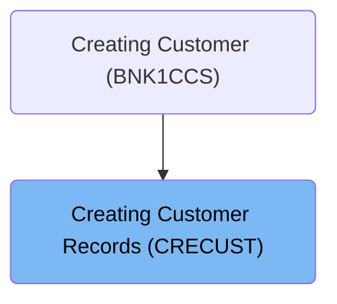

# Customer Data Processing (<SwmToken path="/src/base/cobol_src/CRECUST.cbl" pos="354:1:1" line-data="       PREMIERE SECTION." repo-id="Z2l0aHViJTNBJTNBY2ljcy1iYW5raW5nLXNhbXBsZS1hcHBsaWNhdGlvbi1jYnNhLUlCTS1EZW1vJTNBJTNBU3dpbW0tRGVtbw==" repo-name="cics-banking-sample-application-cbsa-IBM-Demo">`PREMIERE`</SwmToken>)

Let's split this section into smaller parts:

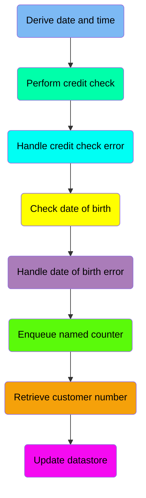

## Derive date and time

<SwmSnippet path="/src/base/cobol_src/CRECUST.cbl" line="364" repo-id="Z2l0aHViJTNBJTNBY2ljcy1iYW5raW5nLXNhbXBsZS1hcHBsaWNhdGlvbi1jYnNhLUlCTS1EZW1vJTNBJTNBU3dpbW0tRGVtbw==">

---

This is the first section of the flow, performed by <SwmToken path="/src/base/cobol_src/CRECUST.cbl" pos="364:3:7" line-data="           PERFORM POPULATE-TIME-DATE." repo-id="Z2l0aHViJTNBJTNBY2ljcy1iYW5raW5nLXNhbXBsZS1hcHBsaWNhdGlvbi1jYnNhLUlCTS1EZW1vJTNBJTNBU3dpbW0tRGVtbw==" repo-name="cics-banking-sample-application-cbsa-IBM-Demo">`POPULATE-TIME-DATE`</SwmToken>:

```cobol
           PERFORM POPULATE-TIME-DATE.
```

---

</SwmSnippet>

## Perform credit check

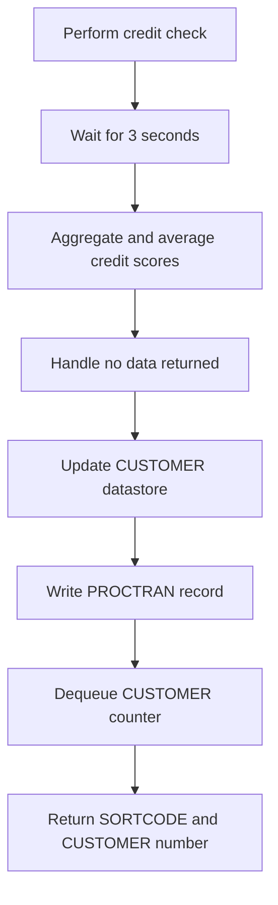

<SwmSnippet path="/src/base/cobol_src/CRECUST.cbl" line="366" repo-id="Z2l0aHViJTNBJTNBY2ljcy1iYW5raW5nLXNhbXBsZS1hcHBsaWNhdGlvbi1jYnNhLUlCTS1EZW1vJTNBJTNBU3dpbW0tRGVtbw==">

---

The <SwmToken path="/src/base/cobol_src/CRECUST.cbl" pos="354:1:1" line-data="       PREMIERE SECTION." repo-id="Z2l0aHViJTNBJTNBY2ljcy1iYW5raW5nLXNhbXBsZS1hcHBsaWNhdGlvbi1jYnNhLUlCTS1EZW1vJTNBJTNBU3dpbW0tRGVtbw==" repo-name="cics-banking-sample-application-cbsa-IBM-Demo">`PREMIERE`</SwmToken> function performs an asynchronous credit check by calling the <SwmToken path="/src/base/cobol_src/CRECUST.cbl" pos="369:3:5" line-data="           PERFORM CREDIT-CHECK." repo-id="Z2l0aHViJTNBJTNBY2ljcy1iYW5raW5nLXNhbXBsZS1hcHBsaWNhdGlvbi1jYnNhLUlCTS1EZW1vJTNBJTNBU3dpbW0tRGVtbw==" repo-name="cics-banking-sample-application-cbsa-IBM-Demo">`CREDIT-CHECK`</SwmToken> procedure. This procedure is responsible for checking the creditworthiness of the customer using multiple credit agencies.

```cobol
      *
      *    Perform the Asynchronous credit check
      *
           PERFORM CREDIT-CHECK.
```

---

</SwmSnippet>

## Handle credit check error

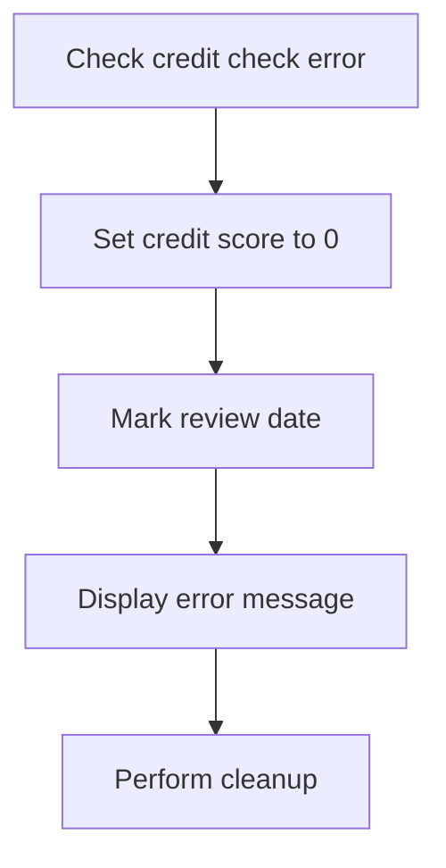

<SwmSnippet path="/src/base/cobol_src/CRECUST.cbl" line="371" repo-id="Z2l0aHViJTNBJTNBY2ljcy1iYW5raW5nLXNhbXBsZS1hcHBsaWNhdGlvbi1jYnNhLUlCTS1EZW1vJTNBJTNBU3dpbW0tRGVtbw==">

---

The code checks for errors. If there was an error, it sets the <SwmToken path="/src/base/cobol_src/CRECUST.cbl" pos="372:7:11" line-data="              MOVE 0 TO COMM-CREDIT-SCORE" repo-id="Z2l0aHViJTNBJTNBY2ljcy1iYW5raW5nLXNhbXBsZS1hcHBsaWNhdGlvbi1jYnNhLUlCTS1EZW1vJTNBJTNBU3dpbW0tRGVtbw==" repo-name="cics-banking-sample-application-cbsa-IBM-Demo">`COMM-CREDIT-SCORE`</SwmToken> to 0 and marks the <SwmToken path="/src/base/cobol_src/CRECUST.cbl" pos="377:3:9" line-data="                     INTO COMM-CS-REVIEW-DATE" repo-id="Z2l0aHViJTNBJTNBY2ljcy1iYW5raW5nLXNhbXBsZS1hcHBsaWNhdGlvbi1jYnNhLUlCTS1EZW1vJTNBJTNBU3dpbW0tRGVtbw==" repo-name="cics-banking-sample-application-cbsa-IBM-Demo">`COMM-CS-REVIEW-DATE`</SwmToken> as today's date.

```cobol
           IF WS-CREDIT-CHECK-ERROR = 'Y'
              MOVE 0 TO COMM-CREDIT-SCORE

              STRING WS-ORIG-DATE-DD DELIMITED BY SIZE,
                     WS-ORIG-DATE-MM DELIMITED BY SIZE,
                     WS-ORIG-DATE-YYYY DELIMITED BY SIZE
                     INTO COMM-CS-REVIEW-DATE
```

---

</SwmSnippet>

<SwmSnippet path="/src/base/cobol_src/CRECUST.cbl" line="383" repo-id="Z2l0aHViJTNBJTNBY2ljcy1iYW5raW5nLXNhbXBsZS1hcHBsaWNhdGlvbi1jYnNhLUlCTS1EZW1vJTNBJTNBU3dpbW0tRGVtbw==">

---

The code displays an error message, providing information about the error that occurred during the credit check process and terminates the program.

```cobol
              DISPLAY 'WS-CREDIT-CHECK-ERROR = Y, '
                       ' RESP='
                       WS-CICS-RESP ' RESP2=' WS-CICS-RESP2
              DISPLAY '   Exiting CRECUST. COMMAREA='
                       DFHCOMMAREA
              PERFORM GET-ME-OUT-OF-HERE
```

---

</SwmSnippet>

## Check date of birth

<SwmSnippet path="/src/base/cobol_src/CRECUST.cbl" line="392" repo-id="Z2l0aHViJTNBJTNBY2ljcy1iYW5raW5nLXNhbXBsZS1hcHBsaWNhdGlvbi1jYnNhLUlCTS1EZW1vJTNBJTNBU3dpbW0tRGVtbw==">

---

The function retrieves the date of birth from the input data. The function checks if the date of birth is valid by calling the <SwmToken path="/src/base/cobol_src/CRECUST.cbl" pos="392:3:9" line-data="           PERFORM DATE-OF-BIRTH-CHECK." repo-id="Z2l0aHViJTNBJTNBY2ljcy1iYW5raW5nLXNhbXBsZS1hcHBsaWNhdGlvbi1jYnNhLUlCTS1EZW1vJTNBJTNBU3dpbW0tRGVtbw==" repo-name="cics-banking-sample-application-cbsa-IBM-Demo">`DATE-OF-BIRTH-CHECK`</SwmToken> procedure.&nbsp;

```cobol
           PERFORM DATE-OF-BIRTH-CHECK.

           IF WS-DATE-OF-BIRTH-ERROR = 'Y'
```

---

</SwmSnippet>

### Handle date of birth error

<SwmSnippet path="/src/base/cobol_src/CRECUST.cbl" line="394" repo-id="Z2l0aHViJTNBJTNBY2ljcy1iYW5raW5nLXNhbXBsZS1hcHBsaWNhdGlvbi1jYnNhLUlCTS1EZW1vJTNBJTNBU3dpbW0tRGVtbw==">

---

The code snippet sets the <SwmToken path="/src/base/cobol_src/CRECUST.cbl" pos="396:9:11" line-data="              MOVE &#39;N&#39; TO COMM-SUCCESS" repo-id="Z2l0aHViJTNBJTNBY2ljcy1iYW5raW5nLXNhbXBsZS1hcHBsaWNhdGlvbi1jYnNhLUlCTS1EZW1vJTNBJTNBU3dpbW0tRGVtbw==" repo-name="cics-banking-sample-application-cbsa-IBM-Demo">`COMM-SUCCESS`</SwmToken> flag to <SwmToken path="/src/base/cobol_src/CRECUST.cbl" pos="396:4:4" line-data="              MOVE &#39;N&#39; TO COMM-SUCCESS" repo-id="Z2l0aHViJTNBJTNBY2ljcy1iYW5raW5nLXNhbXBsZS1hcHBsaWNhdGlvbi1jYnNhLUlCTS1EZW1vJTNBJTNBU3dpbW0tRGVtbw==" repo-name="cics-banking-sample-application-cbsa-IBM-Demo">`N`</SwmToken> to indicate that an error occurred during the date of birth validation. It then terminates the program.

```
           IF WS-DATE-OF-BIRTH-ERROR = 'Y'

              MOVE 'N' TO COMM-SUCCESS
              PERFORM GET-ME-OUT-OF-HERE
```

---

</SwmSnippet>

## Enqueue named counter and retrieve customer number

<SwmSnippet path="/src/base/cobol_src/CRECUST.cbl" line="404" repo-id="Z2l0aHViJTNBJTNBY2ljcy1iYW5raW5nLXNhbXBsZS1hcHBsaWNhdGlvbi1jYnNhLUlCTS1EZW1vJTNBJTNBU3dpbW0tRGVtbw==">

---

The <SwmToken path="/src/base/cobol_src/CRECUST.cbl" pos="354:1:1" line-data="       PREMIERE SECTION." repo-id="Z2l0aHViJTNBJTNBY2ljcy1iYW5raW5nLXNhbXBsZS1hcHBsaWNhdGlvbi1jYnNhLUlCTS1EZW1vJTNBJTNBU3dpbW0tRGVtbw==" repo-name="cics-banking-sample-application-cbsa-IBM-Demo">`PREMIERE`</SwmToken> function calls the <SwmToken path="/src/base/cobol_src/CRECUST.cbl" pos="404:3:7" line-data="           PERFORM ENQ-NAMED-COUNTER." repo-id="Z2l0aHViJTNBJTNBY2ljcy1iYW5raW5nLXNhbXBsZS1hcHBsaWNhdGlvbi1jYnNhLUlCTS1EZW1vJTNBJTNBU3dpbW0tRGVtbw==" repo-name="cics-banking-sample-application-cbsa-IBM-Demo">`ENQ-NAMED-COUNTER`</SwmToken> to get the named counter.

It then calls <SwmToken path="/src/base/cobol_src/CRECUST.cbl" pos="409:3:5" line-data="           PERFORM UPD-NCS." repo-id="Z2l0aHViJTNBJTNBY2ljcy1iYW5raW5nLXNhbXBsZS1hcHBsaWNhdGlvbi1jYnNhLUlCTS1EZW1vJTNBJTNBU3dpbW0tRGVtbw==" repo-name="cics-banking-sample-application-cbsa-IBM-Demo">`UPD-NCS`</SwmToken> to get the customer number.

```
           PERFORM ENQ-NAMED-COUNTER.

      *
      *    Get the next CUSTOMER number from the CUSTOMER Named Counter
      *
           PERFORM UPD-NCS.
```

---

</SwmSnippet>

## Update datastore

<SwmSnippet path="/src/base/cobol_src/CRECUST.cbl" line="414" repo-id="Z2l0aHViJTNBJTNBY2ljcy1iYW5raW5nLXNhbXBsZS1hcHBsaWNhdGlvbi1jYnNhLUlCTS1EZW1vJTNBJTNBU3dpbW0tRGVtbw==">

---

The <SwmToken path="/src/base/cobol_src/CRECUST.cbl" pos="354:1:1" line-data="       PREMIERE SECTION." repo-id="Z2l0aHViJTNBJTNBY2ljcy1iYW5raW5nLXNhbXBsZS1hcHBsaWNhdGlvbi1jYnNhLUlCTS1EZW1vJTNBJTNBU3dpbW0tRGVtbw==" repo-name="cics-banking-sample-application-cbsa-IBM-Demo">`PREMIERE`</SwmToken> function calls <SwmToken path="/src/base/cobol_src/CRECUST.cbl" pos="414:3:7" line-data="           PERFORM WRITE-CUSTOMER-VSAM." repo-id="Z2l0aHViJTNBJTNBY2ljcy1iYW5raW5nLXNhbXBsZS1hcHBsaWNhdGlvbi1jYnNhLUlCTS1EZW1vJTNBJTNBU3dpbW0tRGVtbw==" repo-name="cics-banking-sample-application-cbsa-IBM-Demo">`WRITE-CUSTOMER-VSAM`</SwmToken> to update the CUSTOMER datastore. This program takes the customer data and writes it to the VSAM file. If the write operation is successful, the function proceeds to write to the PROCTRAN datastore.

```cobol
           PERFORM WRITE-CUSTOMER-VSAM.

```

---

</SwmSnippet>

# Derive date and time (<SwmToken path="/src/base/cobol_src/CRECUST.cbl" pos="423:1:5" line-data="       POPULATE-TIME-DATE SECTION." repo-id="Z2l0aHViJTNBJTNBY2ljcy1iYW5raW5nLXNhbXBsZS1hcHBsaWNhdGlvbi1jYnNhLUlCTS1EZW1vJTNBJTNBU3dpbW0tRGVtbw==" repo-name="cics-banking-sample-application-cbsa-IBM-Demo">`POPULATE-TIME-DATE`</SwmToken>)

Lets' zoom into the section's flow:

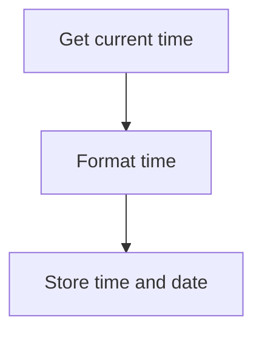

<SwmSnippet path="/src/base/cobol_src/CRECUST.cbl" line="426" repo-id="Z2l0aHViJTNBJTNBY2ljcy1iYW5raW5nLXNhbXBsZS1hcHBsaWNhdGlvbi1jYnNhLUlCTS1EZW1vJTNBJTNBU3dpbW0tRGVtbw==">

---

The code in this section gets the current time and date and formats it using CICS commands.

```cobol
           EXEC CICS ASKTIME
              ABSTIME(WS-U-TIME)
           END-EXEC.

           EXEC CICS FORMATTIME
                     ABSTIME(WS-U-TIME)
                     DDMMYYYY(WS-ORIG-DATE)
                     TIME(PROC-TRAN-TIME OF PROCTRAN-AREA )
                     DATESEP
           END-EXEC.
```

---

</SwmSnippet>

# Perform credit check (<SwmToken path="/src/base/cobol_src/CRECUST.cbl" pos="505:1:3" line-data="       CREDIT-CHECK SECTION." repo-id="Z2l0aHViJTNBJTNBY2ljcy1iYW5raW5nLXNhbXBsZS1hcHBsaWNhdGlvbi1jYnNhLUlCTS1EZW1vJTNBJTNBU3dpbW0tRGVtbw==" repo-name="cics-banking-sample-application-cbsa-IBM-Demo">`CREDIT-CHECK`</SwmToken>)

Let's split this section into smaller parts:

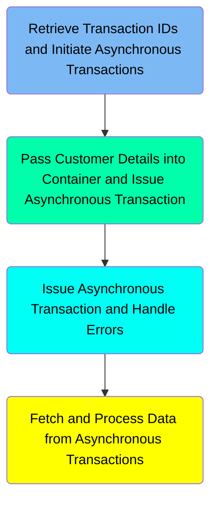

### Retrieve Transaction IDs and Initiate Asynchronous Transactions

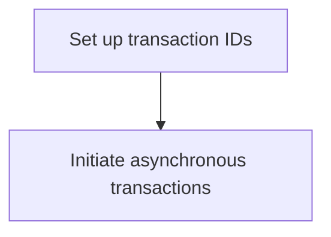

<SwmSnippet path="/src/base/cobol_src/CRECUST.cbl" line="521" repo-id="Z2l0aHViJTNBJTNBY2ljcy1iYW5raW5nLXNhbXBsZS1hcHBsaWNhdGlvbi1jYnNhLUlCTS1EZW1vJTNBJTNBU3dpbW0tRGVtbw==">

---

The code snippet sets up transaction IDs for asynchronous transactions. It uses transactions <SwmToken path="/src/base/cobol_src/CRECUST.cbl" pos="525:7:7" line-data="      *       Use transactions OCR1 - OCR5" repo-id="Z2l0aHViJTNBJTNBY2ljcy1iYW5raW5nLXNhbXBsZS1hcHBsaWNhdGlvbi1jYnNhLUlCTS1EZW1vJTNBJTNBU3dpbW0tRGVtbw==" repo-name="cics-banking-sample-application-cbsa-IBM-Demo">`OCR1`</SwmToken> - <SwmToken path="/src/base/cobol_src/CRECUST.cbl" pos="525:11:11" line-data="      *       Use transactions OCR1 - OCR5" repo-id="Z2l0aHViJTNBJTNBY2ljcy1iYW5raW5nLXNhbXBsZS1hcHBsaWNhdGlvbi1jYnNhLUlCTS1EZW1vJTNBJTNBU3dpbW0tRGVtbw==" repo-name="cics-banking-sample-application-cbsa-IBM-Demo">`OCR5`</SwmToken>

```cobol
           PERFORM VARYING WS-CC-CNT FROM 1 BY 1
           UNTIL WS-CC-CNT > 5

      *
      *       Use transactions OCR1 - OCR5
      *
              STRING 'OCR' DELIMITED BY SIZE,
                      WS-CC-CNT DELIMITED BY SIZE
                 INTO WS-RUN-TRANSID
              END-STRING

```

---

</SwmSnippet>

<SwmSnippet path="/src/base/cobol_src/CRECUST.cbl" line="532" repo-id="Z2l0aHViJTNBJTNBY2ljcy1iYW5raW5nLXNhbXBsZS1hcHBsaWNhdGlvbi1jYnNhLUlCTS1EZW1vJTNBJTNBU3dpbW0tRGVtbw==">

---

The EVALUATE statement assigns specific transaction names based on the value of <SwmToken path="/src/base/cobol_src/CRECUST.cbl" pos="532:3:7" line-data="              EVALUATE WS-CC-CNT" repo-id="Z2l0aHViJTNBJTNBY2ljcy1iYW5raW5nLXNhbXBsZS1hcHBsaWNhdGlvbi1jYnNhLUlCTS1EZW1vJTNBJTNBU3dpbW0tRGVtbw==" repo-name="cics-banking-sample-application-cbsa-IBM-Demo">`WS-CC-CNT`</SwmToken>. This assignment is done for each transaction ID (OCR1 - OCR5). The assigned transaction names are used to initiate asynchronous transactions, which will be processed by the respective credit agencies.

```cobol
              EVALUATE WS-CC-CNT
                 WHEN 1
                    MOVE 'CIPA            ' TO WS-PUT-CONT-NAME
                 WHEN 2
                    MOVE 'CIPB            ' TO WS-PUT-CONT-NAME
                 WHEN 3
                    MOVE 'CIPC            ' TO WS-PUT-CONT-NAME
                 WHEN 4
                    MOVE 'CIPD            ' TO WS-PUT-CONT-NAME
                 WHEN 5
                    MOVE 'CIPE            ' TO WS-PUT-CONT-NAME
                 WHEN 6
                    MOVE 'CIPF            ' TO WS-PUT-CONT-NAME
                 WHEN 7
                    MOVE 'CIPG            ' TO WS-PUT-CONT-NAME
                 WHEN 8
                    MOVE 'CIPH            ' TO WS-PUT-CONT-NAME
                 WHEN 9
                    MOVE 'CIPI            ' TO WS-PUT-CONT-NAME

              END-EVALUATE
```

---

</SwmSnippet>

### Pass Customer Details into Container and Issue Asynchronous Transaction

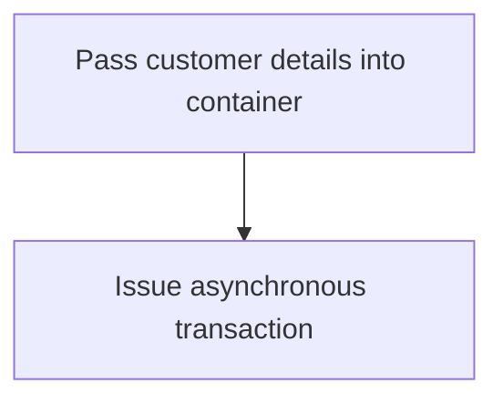

<SwmSnippet path="/src/base/cobol_src/CRECUST.cbl" line="557" repo-id="Z2l0aHViJTNBJTNBY2ljcy1iYW5raW5nLXNhbXBsZS1hcHBsaWNhdGlvbi1jYnNhLUlCTS1EZW1vJTNBJTNBU3dpbW0tRGVtbw==">

---

The <SwmToken path="/src/base/cobol_src/CRECUST.cbl" pos="505:1:3" line-data="       CREDIT-CHECK SECTION." repo-id="Z2l0aHViJTNBJTNBY2ljcy1iYW5raW5nLXNhbXBsZS1hcHBsaWNhdGlvbi1jYnNhLUlCTS1EZW1vJTNBJTNBU3dpbW0tRGVtbw==" repo-name="cics-banking-sample-application-cbsa-IBM-Demo">`CREDIT-CHECK`</SwmToken> function passes the customer details to a container using the EXEC CICS PUT CONTAINER command.

After issuing the asynchronous transaction, the <SwmToken path="/src/base/cobol_src/CRECUST.cbl" pos="505:1:3" line-data="       CREDIT-CHECK SECTION." repo-id="Z2l0aHViJTNBJTNBY2ljcy1iYW5raW5nLXNhbXBsZS1hcHBsaWNhdGlvbi1jYnNhLUlCTS1EZW1vJTNBJTNBU3dpbW0tRGVtbw==" repo-name="cics-banking-sample-application-cbsa-IBM-Demo">`CREDIT-CHECK`</SwmToken> function checks the response and performs a cleanup if the operation is unsuccessful.

```
              EXEC CICS PUT CONTAINER(WS-PUT-CONT-NAME)
                            FROM(DFHCOMMAREA)
                            FLENGTH(WS-PUT-CONT-LEN)
                            CHANNEL(WS-CHANNEL-NAME)
                            RESP(WS-CICS-RESP)
                            RESP2(WS-CICS-RESP2)
              END-EXEC

              IF WS-CICS-RESP NOT = DFHRESP(NORMAL)
                 MOVE 'N' TO COMM-SUCCESS
                 MOVE 'A' TO COMM-FAIL-CODE

                 DISPLAY 'Unsuccessful attempt to PUT CONTAINER. '
                         'CONTAINER=' WS-PUT-CONT-NAME 'CHANNEL='
                         WS-CHANNEL-NAME '. FLENGTH ='
                         WS-PUT-CONT-LEN '.'
                 DISPLAY '    RESP=' WS-CICS-RESP ' RESP2='
                         WS-CICS-RESP2

                 PERFORM GET-ME-OUT-OF-HERE
              END-IF
```

---

</SwmSnippet>

### Issue Asynchronous Transaction and Handle Errors

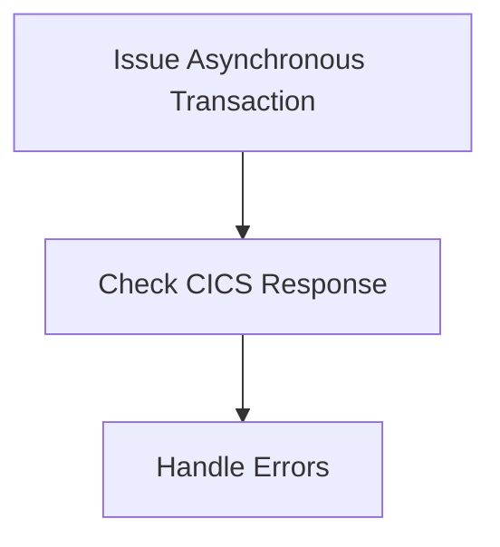

<SwmSnippet path="/src/base/cobol_src/CRECUST.cbl" line="582" repo-id="Z2l0aHViJTNBJTNBY2ljcy1iYW5raW5nLXNhbXBsZS1hcHBsaWNhdGlvbi1jYnNhLUlCTS1EZW1vJTNBJTNBU3dpbW0tRGVtbw==">

---

The <SwmToken path="/src/base/cobol_src/CRECUST.cbl" pos="505:1:3" line-data="       CREDIT-CHECK SECTION." repo-id="Z2l0aHViJTNBJTNBY2ljcy1iYW5raW5nLXNhbXBsZS1hcHBsaWNhdGlvbi1jYnNhLUlCTS1EZW1vJTNBJTNBU3dpbW0tRGVtbw==" repo-name="cics-banking-sample-application-cbsa-IBM-Demo">`CREDIT-CHECK`</SwmToken> function initiates an asynchronous transaction by calling the EXEC CICS RUN TRANSID command.&nbsp;

```cobol
              EXEC CICS RUN TRANSID(WS-RUN-TRANSID)
                   CHANNEL(WS-CHANNEL-NAME)
                   CHILD(WS-ANY-CHILD-TKN)
                   RESP(WS-CICS-RESP)
                   RESP2(WS-CICS-RESP2)
              END-EXEC
```

---

</SwmSnippet>

<SwmSnippet path="/src/base/cobol_src/CRECUST.cbl" line="589" repo-id="Z2l0aHViJTNBJTNBY2ljcy1iYW5raW5nLXNhbXBsZS1hcHBsaWNhdGlvbi1jYnNhLUlCTS1EZW1vJTNBJTNBU3dpbW0tRGVtbw==">

---

After issuing the asynchronous transaction, the <SwmToken path="/src/base/cobol_src/CRECUST.cbl" pos="505:1:3" line-data="       CREDIT-CHECK SECTION." repo-id="Z2l0aHViJTNBJTNBY2ljcy1iYW5raW5nLXNhbXBsZS1hcHBsaWNhdGlvbi1jYnNhLUlCTS1EZW1vJTNBJTNBU3dpbW0tRGVtbw==" repo-name="cics-banking-sample-application-cbsa-IBM-Demo">`CREDIT-CHECK`</SwmToken> function checks the CICS response. If the response is not normal, it then displays an error message with the transaction ID, channel, and response codes.

```cobol
              IF WS-CICS-RESP NOT = DFHRESP(NORMAL)
                 MOVE 'N' TO COMM-SUCCESS
                 MOVE 'B' TO COMM-FAIL-CODE

                 DISPLAY 'Unsuccessful attempt to RUN TRANSID. '
                         'TRANSID=' WS-RUN-TRANSID 'CHANNEL='
                         WS-CHANNEL-NAME '. TOKEN='
                         WS-ANY-CHILD-TKN
                 DISPLAY '    RESP=' WS-CICS-RESP ' RESP2='
                         WS-CICS-RESP2

```

---

</SwmSnippet>

<SwmSnippet path="/src/base/cobol_src/CRECUST.cbl" line="576" repo-id="Z2l0aHViJTNBJTNBY2ljcy1iYW5raW5nLXNhbXBsZS1hcHBsaWNhdGlvbi1jYnNhLUlCTS1EZW1vJTNBJTNBU3dpbW0tRGVtbw==" repo-name="cics-banking-sample-application-cbsa-IBM-Demo">

---

If an error occurs during the asynchronous transaction, the <SwmToken path="/src/base/cobol_src/CRECUST.cbl" pos="505:1:3" line-data="       CREDIT-CHECK SECTION." repo-id="Z2l0aHViJTNBJTNBY2ljcy1iYW5raW5nLXNhbXBsZS1hcHBsaWNhdGlvbi1jYnNhLUlCTS1EZW1vJTNBJTNBU3dpbW0tRGVtbw==" repo-name="cics-banking-sample-application-cbsa-IBM-Demo">`CREDIT-CHECK`</SwmToken> function terminates the program.

```cobol
                 PERFORM GET-ME-OUT-OF-HERE
              END-IF
```

---

</SwmSnippet>

### Fetch and Process Data from Asynchronous Transactions

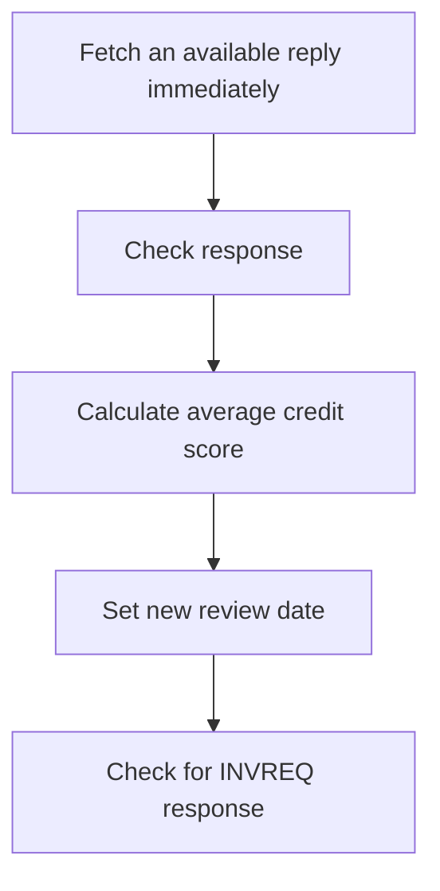

<SwmSnippet path="/src/base/cobol_src/CRECUST.cbl" line="639" repo-id="Z2l0aHViJTNBJTNBY2ljcy1iYW5raW5nLXNhbXBsZS1hcHBsaWNhdGlvbi1jYnNhLUlCTS1EZW1vJTNBJTNBU3dpbW0tRGVtbw==">

---

The <SwmToken path="/src/base/cobol_src/CRECUST.cbl" pos="505:1:3" line-data="       CREDIT-CHECK SECTION." repo-id="Z2l0aHViJTNBJTNBY2ljcy1iYW5raW5nLXNhbXBsZS1hcHBsaWNhdGlvbi1jYnNhLUlCTS1EZW1vJTNBJTNBU3dpbW0tRGVtbw==" repo-name="cics-banking-sample-application-cbsa-IBM-Demo">`CREDIT-CHECK`</SwmToken> function fetches an available reply immediately using the EXEC CICS FETCH ANY command.

```cobol
              EXEC CICS FETCH ANY(WS-ANY-CHILD-FETCH-TKN)
                   CHANNEL(WS-ANY-CHILD-FETCH-CHAN)
                   NOSUSPEND
                   COMPSTATUS(WS-CHILD-FETCH-COMPST)
                   ABCODE(WS-ANY-CHILD-FETCH-ABCODE)
                   RESP(WS-CICS-RESP)
                   RESP2(WS-CICS-RESP2)
              END-EXEC
```

---

</SwmSnippet>

<SwmSnippet path="/src/base/cobol_src/CRECUST.cbl" line="648" repo-id="Z2l0aHViJTNBJTNBY2ljcy1iYW5raW5nLXNhbXBsZS1hcHBsaWNhdGlvbi1jYnNhLUlCTS1EZW1vJTNBJTNBU3dpbW0tRGVtbw==">

---

It then checks the response from the EXEC CICS FETCH ANY command and handles the responses.

```cobol
              IF WS-CICS-RESP NOT = DFHRESP(NORMAL)
      *
      *          Check to see if the response was NOTFINISHED
      *          this means that not all credit agencies replied in
      *          time (for example we asked 5 and only 4 replied in
      *          the required time frame). So there is no more data
      *          to retrieve (the outstanding reply remains
      *          outstanding).
      *
                 IF WS-CICS-RESP = DFHRESP(NOTFINISHED) AND
                 WS-CICS-RESP2 = 52

      *
      *             If we retrieved nothing at all then it is an
      *             error
      *
                    IF WS-RETRIEVED-CNT = 0
                       MOVE 'Y' TO WS-FINISHED-FETCHING
                       MOVE 0 TO COMM-CREDIT-SCORE
                       MOVE 'Y' TO WS-CREDIT-CHECK-ERROR

                       STRING WS-ORIG-DATE-DD DELIMITED BY SIZE,
                              WS-ORIG-DATE-MM DELIMITED BY SIZE,
                              WS-ORIG-DATE-YYYY DELIMITED BY SIZE
                              INTO COMM-CS-REVIEW-DATE
                       END-STRING

                       MOVE 'N' TO COMM-SUCCESS
                       MOVE 'C' TO COMM-FAIL-CODE

                       DISPLAY 'EXEC CICS FETCH ANY failed. RESP='
                          WS-CICS-RESP ' RESP2=' WS-CICS-RESP2
                       DISPLAY '   NOTFINISHED (no data) was returned'
                       DISPLAY '   Exiting CRECUST. COMMAREA='
                          DFHCOMMAREA
                       PERFORM GET-ME-OUT-OF-HERE

                    ELSE
      *
      *                If we have previously retrieved some data from
      *                the credit checking agency/agencies then
      *                calculate the average credit score and a
      *                new random review date (sometime in the
      *                next 21 days)
      *
                       MOVE 'Y' TO WS-FINISHED-FETCHING
                       MOVE 'N' TO WS-CREDIT-CHECK-ERROR
      *
      *                Compute the average credit score from those
      *                credit agencies that responded
      *
                       COMPUTE WS-ACTUAL-CS-SCR = WS-TOTAL-CS-SCR /
                          WS-RETRIEVED-CNT
                       MOVE WS-ACTUAL-CS-SCR TO COMM-CREDIT-SCORE

      *
      *                Get today's date
      *
                       MOVE FUNCTION CURRENT-DATE
                          TO WS-CURRENT-DATE-DATA

                       MOVE WS-CURRENT-DATE-DATA (1:8)
                          TO WS-CURRENT-DATE-9

                      COMPUTE WS-TODAY-INT =
                          FUNCTION INTEGER-OF-DATE (WS-CURRENT-DATE-9)

      *
      *                Set up a random Credit Score review date
      *                within the next 21 days.
      *
                       MOVE EIBTASKN           TO WS-SEED

                       COMPUTE WS-REVIEW-DATE-ADD = ((21 - 1)
                                   * FUNCTION RANDOM(WS-SEED)) + 1

                       COMPUTE WS-NEW-REVIEW-DATE-INT =
                          WS-TODAY-INT + WS-REVIEW-DATE-ADD

      *
      *                Convert the integer date back to YYYYMMDD
      *                format
      *
                       COMPUTE WS-NEW-REVIEW-YYYYMMDD = FUNCTION
                          DATE-OF-INTEGER (WS-NEW-REVIEW-DATE-INT)

                       MOVE WS-NEW-REVIEW-YYYYMMDD(1:4) TO
                          COMM-CS-REVIEW-DATE(5:4)
                       MOVE WS-NEW-REVIEW-YYYYMMDD(5:2) TO
                          COMM-CS-REVIEW-DATE(3:2)
                       MOVE WS-NEW-REVIEW-YYYYMMDD(7:2) TO
                          COMM-CS-REVIEW-DATE(1:2)

                    END-IF
                 END-IF
      *
      *          Check to see if the response was INVREQ
      *          this means that the parent never had any children
      *
                 IF WS-CICS-RESP = DFHRESP(INVREQ) AND
                 WS-CICS-RESP2 = 1

                    MOVE 0 TO COMM-CREDIT-SCORE

                    STRING WS-ORIG-DATE-DD DELIMITED BY SIZE,
```

---

</SwmSnippet>

<SwmSnippet path="/src/base/cobol_src/CRECUST.cbl" line="699" repo-id="Z2l0aHViJTNBJTNBY2ljcy1iYW5raW5nLXNhbXBsZS1hcHBsaWNhdGlvbi1jYnNhLUlCTS1EZW1vJTNBJTNBU3dpbW0tRGVtbw==">

---

If the <SwmToken path="/src/base/cobol_src/CRECUST.cbl" pos="505:1:3" line-data="       CREDIT-CHECK SECTION." repo-id="Z2l0aHViJTNBJTNBY2ljcy1iYW5raW5nLXNhbXBsZS1hcHBsaWNhdGlvbi1jYnNhLUlCTS1EZW1vJTNBJTNBU3dpbW0tRGVtbw==" repo-name="cics-banking-sample-application-cbsa-IBM-Demo">`CREDIT-CHECK`</SwmToken> function has previously retrieved some data from the credit checking agency/agencies, it calculates the average credit score.

```cobol
                       COMPUTE WS-ACTUAL-CS-SCR = WS-TOTAL-CS-SCR /
                          WS-RETRIEVED-CNT
                       MOVE WS-ACTUAL-CS-SCR TO COMM-CREDIT-SCORE

```

---

</SwmSnippet>

<SwmSnippet path="/src/base/cobol_src/CRECUST.cbl" line="721" repo-id="Z2l0aHViJTNBJTNBY2ljcy1iYW5raW5nLXNhbXBsZS1hcHBsaWNhdGlvbi1jYnNhLUlCTS1EZW1vJTNBJTNBU3dpbW0tRGVtbw==">

---

The <SwmToken path="/src/base/cobol_src/CRECUST.cbl" pos="505:1:3" line-data="       CREDIT-CHECK SECTION." repo-id="Z2l0aHViJTNBJTNBY2ljcy1iYW5raW5nLXNhbXBsZS1hcHBsaWNhdGlvbi1jYnNhLUlCTS1EZW1vJTNBJTNBU3dpbW0tRGVtbw==" repo-name="cics-banking-sample-application-cbsa-IBM-Demo">`CREDIT-CHECK`</SwmToken> function sets a new random review date within the next 21 days.

```cobol
                       COMPUTE WS-REVIEW-DATE-ADD = ((21 - 1)
                                   * FUNCTION RANDOM(WS-SEED)) + 1

                       COMPUTE WS-NEW-REVIEW-DATE-INT =
                          WS-TODAY-INT + WS-REVIEW-DATE-ADD

      *
      *                Convert the integer date back to YYYYMMDD
      *                format
      *
                       COMPUTE WS-NEW-REVIEW-YYYYMMDD = FUNCTION
```

---

</SwmSnippet>

# Validate date of birth  (<SwmToken path="/src/base/cobol_src/CRECUST.cbl" pos="1364:1:7" line-data="       DATE-OF-BIRTH-CHECK SECTION." repo-id="Z2l0aHViJTNBJTNBY2ljcy1iYW5raW5nLXNhbXBsZS1hcHBsaWNhdGlvbi1jYnNhLUlCTS1EZW1vJTNBJTNBU3dpbW0tRGVtbw==" repo-name="cics-banking-sample-application-cbsa-IBM-Demo">`DATE-OF-BIRTH-CHECK`</SwmToken>)

Let's split this section into smaller parts:

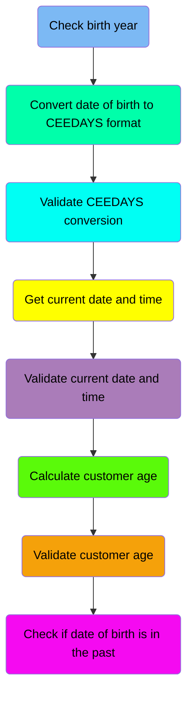

## Check birth year

<SwmSnippet path="/src/base/cobol_src/CRECUST.cbl" line="1366" repo-id="Z2l0aHViJTNBJTNBY2ljcy1iYW5raW5nLXNhbXBsZS1hcHBsaWNhdGlvbi1jYnNhLUlCTS1EZW1vJTNBJTNBU3dpbW0tRGVtbw==">

---

The <SwmToken path="/src/base/cobol_src/CRECUST.cbl" pos="1364:1:7" line-data="       DATE-OF-BIRTH-CHECK SECTION." repo-id="Z2l0aHViJTNBJTNBY2ljcy1iYW5raW5nLXNhbXBsZS1hcHBsaWNhdGlvbi1jYnNhLUlCTS1EZW1vJTNBJTNBU3dpbW0tRGVtbw==" repo-name="cics-banking-sample-application-cbsa-IBM-Demo">`DATE-OF-BIRTH-CHECK`</SwmToken> function checks if the Date Of Birth (DOB) year is valid. If the DOB year is less than <SwmToken path="/src/base/cobol_src/CRECUST.cbl" pos="1369:11:11" line-data="           IF COMM-BIRTH-YEAR &lt; 1601" repo-id="Z2l0aHViJTNBJTNBY2ljcy1iYW5raW5nLXNhbXBsZS1hcHBsaWNhdGlvbi1jYnNhLUlCTS1EZW1vJTNBJTNBU3dpbW0tRGVtbw==" repo-name="cics-banking-sample-application-cbsa-IBM-Demo">`1601`</SwmToken>, it sets the error flag and exits the section.

```cobol
      *
      *    Ensure that the Date Of Birth is valid
      *
           IF COMM-BIRTH-YEAR < 1601
              MOVE 'Y' TO WS-DATE-OF-BIRTH-ERROR
              MOVE 'O' TO COMM-FAIL-CODE
              GO TO DOBC999
           END-IF.
```

---

</SwmSnippet>

## Convert date of birth to CEEDAYS format

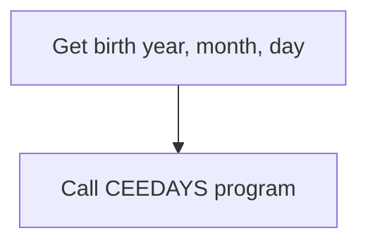

<SwmSnippet path="/src/base/cobol_src/CRECUST.cbl" line="1375" repo-id="Z2l0aHViJTNBJTNBY2ljcy1iYW5raW5nLXNhbXBsZS1hcHBsaWNhdGlvbi1jYnNhLUlCTS1EZW1vJTNBJTNBU3dpbW0tRGVtbw==">

---

The <SwmToken path="/src/base/cobol_src/CRECUST.cbl" pos="1364:1:7" line-data="       DATE-OF-BIRTH-CHECK SECTION." repo-id="Z2l0aHViJTNBJTNBY2ljcy1iYW5raW5nLXNhbXBsZS1hcHBsaWNhdGlvbi1jYnNhLUlCTS1EZW1vJTNBJTNBU3dpbW0tRGVtbw==" repo-name="cics-banking-sample-application-cbsa-IBM-Demo">`DATE-OF-BIRTH-CHECK`</SwmToken> function retrieves the birth year, month, and day from the incoming customer data and stores them in the <SwmToken path="/src/base/cobol_src/CRECUST.cbl" pos="1375:11:13" line-data="           MOVE COMM-BIRTH-YEAR TO CEEDAYS-YEAR." repo-id="Z2l0aHViJTNBJTNBY2ljcy1iYW5raW5nLXNhbXBsZS1hcHBsaWNhdGlvbi1jYnNhLUlCTS1EZW1vJTNBJTNBU3dpbW0tRGVtbw==" repo-name="cics-banking-sample-application-cbsa-IBM-Demo">`CEEDAYS-YEAR`</SwmToken>, <SwmToken path="/src/base/cobol_src/CRECUST.cbl" pos="1376:11:13" line-data="           MOVE COMM-BIRTH-MONTH TO CEEDAYS-MONTH." repo-id="Z2l0aHViJTNBJTNBY2ljcy1iYW5raW5nLXNhbXBsZS1hcHBsaWNhdGlvbi1jYnNhLUlCTS1EZW1vJTNBJTNBU3dpbW0tRGVtbw==" repo-name="cics-banking-sample-application-cbsa-IBM-Demo">`CEEDAYS-MONTH`</SwmToken>, and <SwmToken path="/src/base/cobol_src/CRECUST.cbl" pos="1377:11:13" line-data="           MOVE COMM-BIRTH-DAY TO CEEDAYS-DAY." repo-id="Z2l0aHViJTNBJTNBY2ljcy1iYW5raW5nLXNhbXBsZS1hcHBsaWNhdGlvbi1jYnNhLUlCTS1EZW1vJTNBJTNBU3dpbW0tRGVtbw==" repo-name="cics-banking-sample-application-cbsa-IBM-Demo">`CEEDAYS-DAY`</SwmToken> fields, respectively.

```cobol
           MOVE COMM-BIRTH-YEAR TO CEEDAYS-YEAR.
           MOVE COMM-BIRTH-MONTH TO CEEDAYS-MONTH.
           MOVE COMM-BIRTH-DAY TO CEEDAYS-DAY.

```

---

</SwmSnippet>

<SwmSnippet path="/src/base/cobol_src/CRECUST.cbl" line="1379" repo-id="Z2l0aHViJTNBJTNBY2ljcy1iYW5raW5nLXNhbXBsZS1hcHBsaWNhdGlvbi1jYnNhLUlCTS1EZW1vJTNBJTNBU3dpbW0tRGVtbw==">

---

It calls the <SwmToken path="/src/base/cobol_src/CRECUST.cbl" pos="1379:4:4" line-data="           CALL &quot;CEEDAYS&quot; USING DATE-OF-BIRTH-FOR-CEEDAYS" repo-id="Z2l0aHViJTNBJTNBY2ljcy1iYW5raW5nLXNhbXBsZS1hcHBsaWNhdGlvbi1jYnNhLUlCTS1EZW1vJTNBJTNBU3dpbW0tRGVtbw==" repo-name="cics-banking-sample-application-cbsa-IBM-Demo">`CEEDAYS`</SwmToken> program. This program converts the birth date into the CEEDAYS format, which is a standardized format used for date calculations in CICS applications.

```cobol
           CALL "CEEDAYS" USING DATE-OF-BIRTH-FOR-CEEDAYS
                                DATE-OF-BIRTH-FORMAT,
                                WS-DATE-OF-BIRTH-LILLIAN,
                                FC.
```

---

</SwmSnippet>

## Validate CEEDAYS conversion

<SwmSnippet path="/src/base/cobol_src/CRECUST.cbl" line="1384" repo-id="Z2l0aHViJTNBJTNBY2ljcy1iYW5raW5nLXNhbXBsZS1hcHBsaWNhdGlvbi1jYnNhLUlCTS1EZW1vJTNBJTNBU3dpbW0tRGVtbw==">

---

The <SwmToken path="/src/base/cobol_src/CRECUST.cbl" pos="1364:1:7" line-data="       DATE-OF-BIRTH-CHECK SECTION." repo-id="Z2l0aHViJTNBJTNBY2ljcy1iYW5raW5nLXNhbXBsZS1hcHBsaWNhdGlvbi1jYnNhLUlCTS1EZW1vJTNBJTNBU3dpbW0tRGVtbw==" repo-name="cics-banking-sample-application-cbsa-IBM-Demo">`DATE-OF-BIRTH-CHECK`</SwmToken> function validates the conversion by checking if the <SwmToken path="/src/base/cobol_src/CRECUST.cbl" pos="1384:5:5" line-data="           IF NOT CEE000 OF FC THEN" repo-id="Z2l0aHViJTNBJTNBY2ljcy1iYW5raW5nLXNhbXBsZS1hcHBsaWNhdGlvbi1jYnNhLUlCTS1EZW1vJTNBJTNBU3dpbW0tRGVtbw==" repo-name="cics-banking-sample-application-cbsa-IBM-Demo">`CEE000`</SwmToken> flag in the FC structure is set. If not, sets error flags and terminates the function.

```cobol
           IF NOT CEE000 OF FC THEN
              MOVE 'Y' TO WS-DATE-OF-BIRTH-ERROR
              MOVE 'Z' TO COMM-FAIL-CODE
              DISPLAY 'CEEDAYS failed, FORMAT LENGTH 10 with msg '
                 MSG-NO OF FC
                 ' for date YYYYMMDD' DATE-OF-BIRTH-FOR-CEEDAYS
              GO TO DOBC999
           END-IF.
```

---

</SwmSnippet>

## Get current date and time

<SwmSnippet path="/src/base/cobol_src/CRECUST.cbl" line="1393" repo-id="Z2l0aHViJTNBJTNBY2ljcy1iYW5raW5nLXNhbXBsZS1hcHBsaWNhdGlvbi1jYnNhLUlCTS1EZW1vJTNBJTNBU3dpbW0tRGVtbw==">

---

The <SwmToken path="/src/base/cobol_src/CRECUST.cbl" pos="1364:1:7" line-data="       DATE-OF-BIRTH-CHECK SECTION." repo-id="Z2l0aHViJTNBJTNBY2ljcy1iYW5raW5nLXNhbXBsZS1hcHBsaWNhdGlvbi1jYnNhLUlCTS1EZW1vJTNBJTNBU3dpbW0tRGVtbw==" repo-name="cics-banking-sample-application-cbsa-IBM-Demo">`DATE-OF-BIRTH-CHECK`</SwmToken> function calls the <SwmToken path="/src/base/cobol_src/CRECUST.cbl" pos="1393:4:4" line-data="           CALL &quot;CEELOCT&quot; USING WS-TODAY-LILLIAN," repo-id="Z2l0aHViJTNBJTNBY2ljcy1iYW5raW5nLXNhbXBsZS1hcHBsaWNhdGlvbi1jYnNhLUlCTS1EZW1vJTNBJTNBU3dpbW0tRGVtbw==" repo-name="cics-banking-sample-application-cbsa-IBM-Demo">`CEELOCT`</SwmToken> program to get the current date and time.&nbsp;

```cobol
           CALL "CEELOCT" USING WS-TODAY-LILLIAN,
                                WS-TODAY-SECONDS,
                                WS-TODAY-GREGORIAN,
                                FC.
```

---

</SwmSnippet>

## Calculate customer age

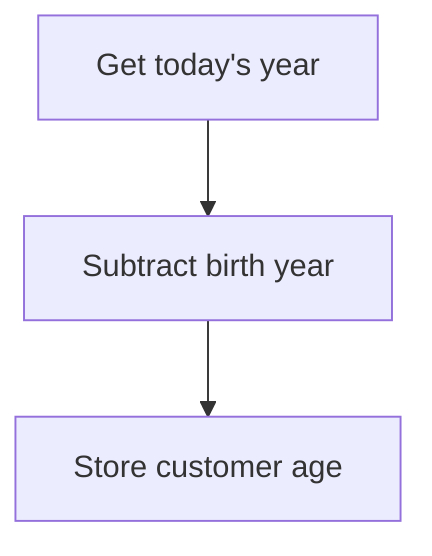

<SwmSnippet path="/src/base/cobol_src/CRECUST.cbl" line="1405" repo-id="Z2l0aHViJTNBJTNBY2ljcy1iYW5raW5nLXNhbXBsZS1hcHBsaWNhdGlvbi1jYnNhLUlCTS1EZW1vJTNBJTNBU3dpbW0tRGVtbw==">

---

The code snippet subtracts the customer's birth year from today's year. This calculation determines the customer's age.

```
           SUBTRACT COMM-BIRTH-YEAR FROM WS-TODAY-G-YEAR
              GIVING WS-CUSTOMER-AGE
```

---

</SwmSnippet>

## Validate customer age

<SwmSnippet path="/src/base/cobol_src/CRECUST.cbl" line="1408" repo-id="Z2l0aHViJTNBJTNBY2ljcy1iYW5raW5nLXNhbXBsZS1hcHBsaWNhdGlvbi1jYnNhLUlCTS1EZW1vJTNBJTNBU3dpbW0tRGVtbw==">

---

The <SwmToken path="/src/base/cobol_src/CRECUST.cbl" pos="1364:1:7" line-data="       DATE-OF-BIRTH-CHECK SECTION." repo-id="Z2l0aHViJTNBJTNBY2ljcy1iYW5raW5nLXNhbXBsZS1hcHBsaWNhdGlvbi1jYnNhLUlCTS1EZW1vJTNBJTNBU3dpbW0tRGVtbw==" repo-name="cics-banking-sample-application-cbsa-IBM-Demo">`DATE-OF-BIRTH-CHECK`</SwmToken> function validates the customer's age. If the age is greater than <SwmToken path="/src/base/cobol_src/CRECUST.cbl" pos="1408:11:11" line-data="           IF WS-CUSTOMER-AGE &gt; 150" repo-id="Z2l0aHViJTNBJTNBY2ljcy1iYW5raW5nLXNhbXBsZS1hcHBsaWNhdGlvbi1jYnNhLUlCTS1EZW1vJTNBJTNBU3dpbW0tRGVtbw==" repo-name="cics-banking-sample-application-cbsa-IBM-Demo">`150`</SwmToken>, it sets an error flag and terminates the section.

```cobol
           IF WS-CUSTOMER-AGE > 150
              MOVE 'Y' TO WS-DATE-OF-BIRTH-ERROR
              MOVE 'O' TO COMM-FAIL-CODE
              GO TO DOBC999
           END-IF.
```

---

</SwmSnippet>

### Check if date of birth is in the past

<SwmSnippet path="/src/base/cobol_src/CRECUST.cbl" line="1414" repo-id="Z2l0aHViJTNBJTNBY2ljcy1iYW5raW5nLXNhbXBsZS1hcHBsaWNhdGlvbi1jYnNhLUlCTS1EZW1vJTNBJTNBU3dpbW0tRGVtbw==">

---

The program compares today's date with the date of birth. If today's date is later than the date of birth, it sets relevant error flags.

```cobol
           IF WS-TODAY-LILLIAN < WS-DATE-OF-BIRTH-LILLIAN
                        MOVE 'Y' TO WS-DATE-OF-BIRTH-ERROR
              MOVE 'Y' TO COMM-FAIL-CODE
           END-IF.
```

---

</SwmSnippet>

# Enqueue named counter (<SwmToken path="/src/base/cobol_src/CRECUST.cbl" pos="404:3:7" line-data="           PERFORM ENQ-NAMED-COUNTER." repo-id="Z2l0aHViJTNBJTNBY2ljcy1iYW5raW5nLXNhbXBsZS1hcHBsaWNhdGlvbi1jYnNhLUlCTS1EZW1vJTNBJTNBU3dpbW0tRGVtbw==" repo-name="cics-banking-sample-application-cbsa-IBM-Demo">`ENQ-NAMED-COUNTER`</SwmToken>)

Lets' zoom into the program flow:

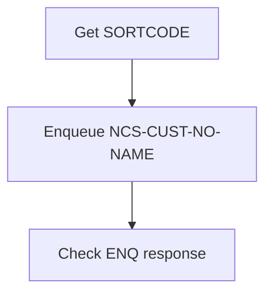

<SwmSnippet path="/src/base/cobol_src/CRECUST.cbl" line="441" repo-id="Z2l0aHViJTNBJTNBY2ljcy1iYW5raW5nLXNhbXBsZS1hcHBsaWNhdGlvbi1jYnNhLUlCTS1EZW1vJTNBJTNBU3dpbW0tRGVtbw==">

---

The <SwmToken path="/src/base/cobol_src/CRECUST.cbl" pos="443:3:3" line-data="           MOVE SORTCODE TO" repo-id="Z2l0aHViJTNBJTNBY2ljcy1iYW5raW5nLXNhbXBsZS1hcHBsaWNhdGlvbi1jYnNhLUlCTS1EZW1vJTNBJTNBU3dpbW0tRGVtbw==" repo-name="cics-banking-sample-application-cbsa-IBM-Demo">`SORTCODE`</SwmToken> is obtained from the BMS application and stored in the <SwmToken path="/src/base/cobol_src/CRECUST.cbl" pos="444:1:9" line-data="              NCS-CUST-NO-TEST-SORT." repo-id="Z2l0aHViJTNBJTNBY2ljcy1iYW5raW5nLXNhbXBsZS1hcHBsaWNhdGlvbi1jYnNhLUlCTS1EZW1vJTNBJTNBU3dpbW0tRGVtbw==" repo-name="cics-banking-sample-application-cbsa-IBM-Demo">`NCS-CUST-NO-TEST-SORT`</SwmToken> variable.

The <SwmToken path="/src/base/cobol_src/CRECUST.cbl" pos="442:1:1" line-data="       ENC010." repo-id="Z2l0aHViJTNBJTNBY2ljcy1iYW5raW5nLXNhbXBsZS1hcHBsaWNhdGlvbi1jYnNhLUlCTS1EZW1vJTNBJTNBU3dpbW0tRGVtbw==" repo-name="cics-banking-sample-application-cbsa-IBM-Demo">`ENC010`</SwmToken> function enqueues the <SwmToken path="/src/base/cobol_src/CRECUST.cbl" pos="447:3:9" line-data="              RESOURCE(NCS-CUST-NO-NAME)" repo-id="Z2l0aHViJTNBJTNBY2ljcy1iYW5raW5nLXNhbXBsZS1hcHBsaWNhdGlvbi1jYnNhLUlCTS1EZW1vJTNBJTNBU3dpbW0tRGVtbw==" repo-name="cics-banking-sample-application-cbsa-IBM-Demo">`NCS-CUST-NO-NAME`</SwmToken> resource. This action ensures that only one instance of the function can access the counter at a time, preventing conflicts and maintaining data integrity.

```
       ENQ-NAMED-COUNTER SECTION.
       ENC010.
           MOVE SORTCODE TO
              NCS-CUST-NO-TEST-SORT.

           EXEC CICS ENQ
              RESOURCE(NCS-CUST-NO-NAME)
              LENGTH(16)
              RESP(WS-CICS-RESP)
              RESP2(WS-CICS-RESP2)
           END-EXEC.
```

---

</SwmSnippet>

# Get customer number (<SwmToken path="/src/base/cobol_src/CRECUST.cbl" pos="488:1:3" line-data="       UPD-NCS SECTION." repo-id="Z2l0aHViJTNBJTNBY2ljcy1iYW5raW5nLXNhbXBsZS1hcHBsaWNhdGlvbi1jYnNhLUlCTS1EZW1vJTNBJTNBU3dpbW0tRGVtbw==" repo-name="cics-banking-sample-application-cbsa-IBM-Demo">`UPD-NCS`</SwmToken>)

<SwmSnippet path="/src/base/cobol_src/CRECUST.cbl" line="495" repo-id="Z2l0aHViJTNBJTNBY2ljcy1iYW5raW5nLXNhbXBsZS1hcHBsaWNhdGlvbi1jYnNhLUlCTS1EZW1vJTNBJTNBU3dpbW0tRGVtbw==">

---

The code calls the <SwmToken path="/src/base/cobol_src/CRECUST.cbl" pos="495:3:9" line-data="           PERFORM GET-LAST-CUSTOMER-VSAM" repo-id="Z2l0aHViJTNBJTNBY2ljcy1iYW5raW5nLXNhbXBsZS1hcHBsaWNhdGlvbi1jYnNhLUlCTS1EZW1vJTNBJTNBU3dpbW0tRGVtbw==" repo-name="cics-banking-sample-application-cbsa-IBM-Demo">`GET-LAST-CUSTOMER-VSAM`</SwmToken>, which retrieves the last customer number from the VSAM datastore.

```
           PERFORM GET-LAST-CUSTOMER-VSAM

           MOVE 'Y' TO NCS-UPDATED.
```

---

</SwmSnippet>

# Read customer record (<SwmToken path="/src/base/cobol_src/CRECUST.cbl" pos="495:3:9" line-data="           PERFORM GET-LAST-CUSTOMER-VSAM" repo-id="Z2l0aHViJTNBJTNBY2ljcy1iYW5raW5nLXNhbXBsZS1hcHBsaWNhdGlvbi1jYnNhLUlCTS1EZW1vJTNBJTNBU3dpbW0tRGVtbw==" repo-name="cics-banking-sample-application-cbsa-IBM-Demo">`GET-LAST-CUSTOMER-VSAM`</SwmToken>)

Let's split this section into smaller parts:

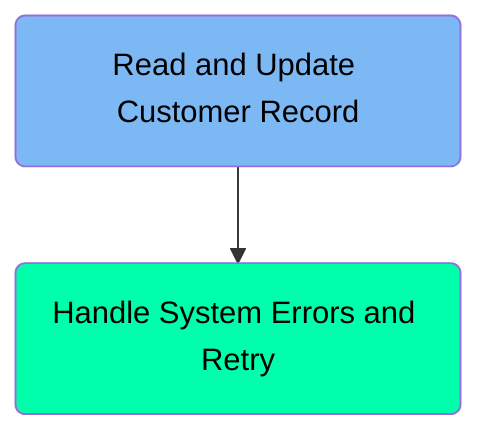

### Read and Update Customer Record

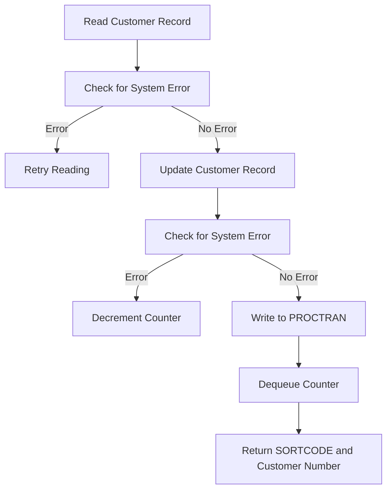

<SwmSnippet path="/src/base/cobol_src/CRECUST.cbl" line="1290" repo-id="Z2l0aHViJTNBJTNBY2ljcy1iYW5raW5nLXNhbXBsZS1hcHBsaWNhdGlvbi1jYnNhLUlCTS1EZW1vJTNBJTNBU3dpbW0tRGVtbw==">

---

The function reads the customer record from the <SwmToken path="/src/base/cobol_src/CRECUST.cbl" pos="1290:10:10" line-data="           EXEC CICS READ FILE(&#39;CUSTOMER&#39;)" repo-id="Z2l0aHViJTNBJTNBY2ljcy1iYW5raW5nLXNhbXBsZS1hcHBsaWNhdGlvbi1jYnNhLUlCTS1EZW1vJTNBJTNBU3dpbW0tRGVtbw==" repo-name="cics-banking-sample-application-cbsa-IBM-Demo">`CUSTOMER`</SwmToken> file.

```cobol
           EXEC CICS READ FILE('CUSTOMER')
                     RIDFLD(CUSTOMER-CONTROL-KEY)
                     UPDATE
                     INTO(CUSTOMER-CONTROL)
                     RESP(WS-CICS-RESP)
```

---

</SwmSnippet>

<SwmSnippet path="/src/base/cobol_src/CRECUST.cbl" line="1298" repo-id="Z2l0aHViJTNBJTNBY2ljcy1iYW5raW5nLXNhbXBsZS1hcHBsaWNhdGlvbi1jYnNhLUlCTS1EZW1vJTNBJTNBU3dpbW0tRGVtbw==">

---

If a system error occurs during the read operation, the function enters a retry loop.

```cobol
           IF WS-CICS-RESP = DFHRESP(SYSIDERR)
             PERFORM VARYING SYSIDERR-RETRY FROM 1 BY 1
             UNTIL SYSIDERR-RETRY > 100
             OR WS-CICS-RESP = DFHRESP(NORMAL)
             OR WS-CICS-RESP IS NOT EQUAL TO DFHRESP(SYSIDERR)
               EXEC CICS DELAY FOR SECONDS(3)
```

---

</SwmSnippet>

<SwmSnippet path="/src/base/cobol_src/CRECUST.cbl" line="1306" repo-id="Z2l0aHViJTNBJTNBY2ljcy1iYW5raW5nLXNhbXBsZS1hcHBsaWNhdGlvbi1jYnNhLUlCTS1EZW1vJTNBJTNBU3dpbW0tRGVtbw==">

---

After successfully reading the customer record, the function updates the <SwmToken path="/src/base/cobol_src/CRECUST.cbl" pos="1309:3:5" line-data="                         INTO(CUSTOMER-CONTROL)" repo-id="Z2l0aHViJTNBJTNBY2ljcy1iYW5raW5nLXNhbXBsZS1hcHBsaWNhdGlvbi1jYnNhLUlCTS1EZW1vJTNBJTNBU3dpbW0tRGVtbw==" repo-name="cics-banking-sample-application-cbsa-IBM-Demo">`CUSTOMER-CONTROL`</SwmToken> structure with the new data.

```cobol
               EXEC CICS READ FILE('CUSTOMER')
                         RIDFLD(CUSTOMER-CONTROL-KEY)
                         UPDATE
                         INTO(CUSTOMER-CONTROL)
                         RESP(WS-CICS-RESP)
```

---

</SwmSnippet>

<SwmSnippet path="/src/base/cobol_src/CRECUST.cbl" line="1309" repo-id="Z2l0aHViJTNBJTNBY2ljcy1iYW5raW5nLXNhbXBsZS1hcHBsaWNhdGlvbi1jYnNhLUlCTS1EZW1vJTNBJTNBU3dpbW0tRGVtbw==">

---

Following the update, the function checks for any system errors.

```cobol
                         INTO(CUSTOMER-CONTROL)
                         RESP(WS-CICS-RESP)
                         RESP2(WS-CICS-RESP2)
               END-EXEC
```

---

</SwmSnippet>

### Handle System Errors and Retry

This is the next section of the flow.

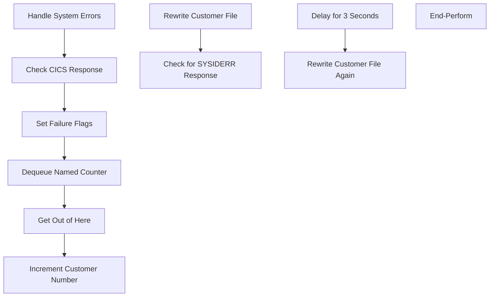

<SwmSnippet path="/src/base/cobol_src/CRECUST.cbl" line="1315" repo-id="Z2l0aHViJTNBJTNBY2ljcy1iYW5raW5nLXNhbXBsZS1hcHBsaWNhdGlvbi1jYnNhLUlCTS1EZW1vJTNBJTNBU3dpbW0tRGVtbw==">

---

The code handles system errors by checking the CICS response. If the response is not normal, it sets the COMM-SUCCESS flag to 'N' and the COMM-FAIL-CODE to '4'. It then dequeues the named counter and exits the function. In case of SYSIDERR errors, it retries up to 100 times with a 3-second delay between retries before giving up.

```
           ELSE
             IF WS-CICS-RESP IS NOT = DFHRESP(NORMAL)
               MOVE 'N' TO COMM-SUCCESS
               MOVE '4' TO COMM-FAIL-CODE
               PERFORM DEQ-NAMED-COUNTER
               PERFORM GET-ME-OUT-OF-HERE
             END-IF
           END-IF.
           ADD 1 TO LAST-CUSTOMER-NUMBER IN CUSTOMER-CONTROL
           GIVING LAST-CUSTOMER-NUMBER IN CUSTOMER-CONTROL

           EXEC CICS REWRITE FILE('CUSTOMER')
                FROM(CUSTOMER-CONTROL)
                RESP(WS-CICS-RESP)
                RESP2(WS-CICS-RESP2)
           END-EXEC

           IF WS-CICS-RESP = DFHRESP(SYSIDERR)
              PERFORM VARYING SYSIDERR-RETRY FROM 1 BY 1
              UNTIL SYSIDERR-RETRY > 100
              OR WS-CICS-RESP = DFHRESP(NORMAL)
              OR WS-CICS-RESP IS NOT EQUAL TO DFHRESP(SYSIDERR)
                 EXEC CICS DELAY FOR SECONDS(3)
                 END-EXEC

                 EXEC CICS REWRITE FILE('CUSTOMER')
                    FROM(CUSTOMER-CONTROL)
                    RESP(WS-CICS-RESP)
                    RESP2(WS-CICS-RESP2)
```

---

</SwmSnippet>

<SwmSnippet path="/src/base/cobol_src/CRECUST.cbl" line="1323" repo-id="Z2l0aHViJTNBJTNBY2ljcy1iYW5raW5nLXNhbXBsZS1hcHBsaWNhdGlvbi1jYnNhLUlCTS1EZW1vJTNBJTNBU3dpbW0tRGVtbw==">

---

After handling system errors, the code increments the <SwmToken path="/src/base/cobol_src/CRECUST.cbl" pos="1323:7:11" line-data="           ADD 1 TO LAST-CUSTOMER-NUMBER IN CUSTOMER-CONTROL" repo-id="Z2l0aHViJTNBJTNBY2ljcy1iYW5raW5nLXNhbXBsZS1hcHBsaWNhdGlvbi1jYnNhLUlCTS1EZW1vJTNBJTNBU3dpbW0tRGVtbw==" repo-name="cics-banking-sample-application-cbsa-IBM-Demo">`LAST-CUSTOMER-NUMBER`</SwmToken> in the <SwmToken path="/src/base/cobol_src/CRECUST.cbl" pos="1324:11:13" line-data="           GIVING LAST-CUSTOMER-NUMBER IN CUSTOMER-CONTROL" repo-id="Z2l0aHViJTNBJTNBY2ljcy1iYW5raW5nLXNhbXBsZS1hcHBsaWNhdGlvbi1jYnNhLUlCTS1EZW1vJTNBJTNBU3dpbW0tRGVtbw==" repo-name="cics-banking-sample-application-cbsa-IBM-Demo">`CUSTOMER-CONTROL`</SwmToken> structure and writes the updated number to the CUSTOMER file. This is done to maintain a unique identifier for each customer.

```cobol
           ADD 1 TO LAST-CUSTOMER-NUMBER IN CUSTOMER-CONTROL
           GIVING LAST-CUSTOMER-NUMBER IN CUSTOMER-CONTROL

```

---

</SwmSnippet>

<SwmSnippet path="/src/base/cobol_src/CRECUST.cbl" line="1333" repo-id="Z2l0aHViJTNBJTNBY2ljcy1iYW5raW5nLXNhbXBsZS1hcHBsaWNhdGlvbi1jYnNhLUlCTS1EZW1vJTNBJTNBU3dpbW0tRGVtbw==">

---

In case of SYSIDERR errors, the code retries the customer file update operation up to 100 times with a 3-second delay between retries before giving up. This mechanism ensures that temporary errors do not prevent the successful update of the customer file.

```cobol
              PERFORM VARYING SYSIDERR-RETRY FROM 1 BY 1
              UNTIL SYSIDERR-RETRY > 100
              OR WS-CICS-RESP = DFHRESP(NORMAL)
              OR WS-CICS-RESP IS NOT EQUAL TO DFHRESP(SYSIDERR)
                 EXEC CICS DELAY FOR SECONDS(3)
                 END-EXEC

                 EXEC CICS REWRITE FILE('CUSTOMER')
                    FROM(CUSTOMER-CONTROL)
                    RESP(WS-CICS-RESP)
                    RESP2(WS-CICS-RESP2)
                 END-EXEC
```

---

</SwmSnippet>

# Write customer record to VSAM file and PROCTRAN datastore (<SwmToken path="/src/base/cobol_src/CRECUST.cbl" pos="1011:1:5" line-data="       WRITE-CUSTOMER-VSAM SECTION." repo-id="Z2l0aHViJTNBJTNBY2ljcy1iYW5raW5nLXNhbXBsZS1hcHBsaWNhdGlvbi1jYnNhLUlCTS1EZW1vJTNBJTNBU3dpbW0tRGVtbw==" repo-name="cics-banking-sample-application-cbsa-IBM-Demo">`WRITE-CUSTOMER-VSAM`</SwmToken>)

Let's split this section into smaller parts:

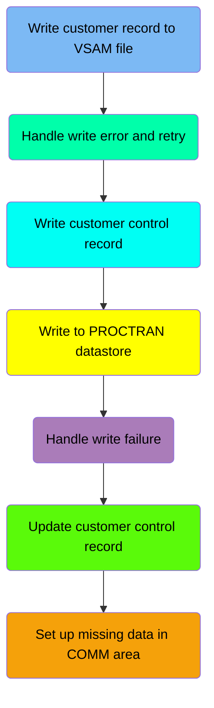

## Write to VSAM

First, we focus on this part:

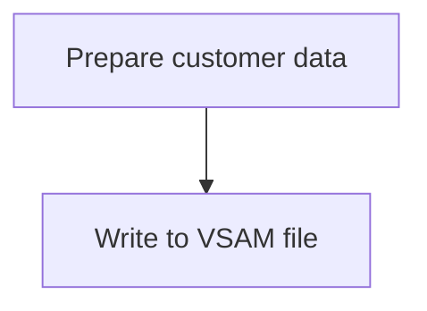

<SwmSnippet path="/src/base/cobol_src/CRECUST.cbl" line="1020" repo-id="Z2l0aHViJTNBJTNBY2ljcy1iYW5raW5nLXNhbXBsZS1hcHBsaWNhdGlvbi1jYnNhLUlCTS1EZW1vJTNBJTNBU3dpbW0tRGVtbw==">

---

The code snippet moves customer information from the COMMAREA to the CUSTOMER structure.

```cobol
           MOVE NCS-CUST-NO-VALUE   TO CUSTOMER-NUMBER.
           MOVE COMM-NAME           TO CUSTOMER-NAME.
           MOVE COMM-ADDRESS        TO CUSTOMER-ADDRESS.
           MOVE COMM-DATE-OF-BIRTH  TO CUSTOMER-DATE-OF-BIRTH.
           MOVE COMM-CREDIT-SCORE   TO CUSTOMER-CREDIT-SCORE.
           MOVE COMM-CS-REVIEW-DATE TO CUSTOMER-CS-REVIEW-DATE.

```

---

</SwmSnippet>

<SwmSnippet path="/src/base/cobol_src/CRECUST.cbl" line="1029" repo-id="Z2l0aHViJTNBJTNBY2ljcy1iYW5raW5nLXNhbXBsZS1hcHBsaWNhdGlvbi1jYnNhLUlCTS1EZW1vJTNBJTNBU3dpbW0tRGVtbw==">

---

The code snippet writes the customer data to the CUSTOMER VSAM file using the EXEC CICS WRITE command.

```cobol
           EXEC CICS WRITE
                FILE('CUSTOMER')
                FROM(OUTPUT-DATA)
                RIDFLD(CUSTOMER-KEY)
                LENGTH(WS-CUST-REC-LEN)
                KEYLENGTH(16)
                RESP(WS-CICS-RESP)
```

---

</SwmSnippet>

## Handle write error and retry

This is the next section of the flow.

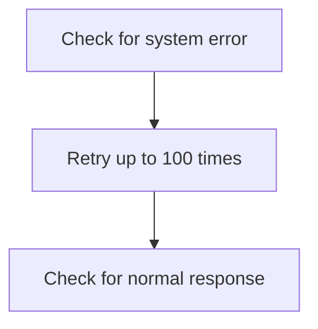

<SwmSnippet path="/src/base/cobol_src/CRECUST.cbl" line="1039" repo-id="Z2l0aHViJTNBJTNBY2ljcy1iYW5raW5nLXNhbXBsZS1hcHBsaWNhdGlvbi1jYnNhLUlCTS1EZW1vJTNBJTNBU3dpbW0tRGVtbw==">

---

If there is an error, the code proceeds to retry the operation up to 100 times.

```
           IF WS-CICS-RESP = DFHRESP(SYSIDERR)
              PERFORM VARYING SYSIDERR-RETRY FROM 1 BY 1
              UNTIL SYSIDERR-RETRY > 100
              OR WS-CICS-RESP = DFHRESP(NORMAL)
              OR WS-CICS-RESP IS NOT EQUAL TO DFHRESP(SYSIDERR)

                 EXEC CICS DELAY FOR SECONDS(3)
                 END-EXEC
```

---

</SwmSnippet>

<SwmSnippet path="/src/base/cobol_src/CRECUST.cbl" line="1048" repo-id="Z2l0aHViJTNBJTNBY2ljcy1iYW5raW5nLXNhbXBsZS1hcHBsaWNhdGlvbi1jYnNhLUlCTS1EZW1vJTNBJTNBU3dpbW0tRGVtbw==">

---

After the delay, the WCV010 function writes a customer control record to the CUSTOMER datastore.

```cobol
                 EXEC CICS WRITE
                    FILE('CUSTOMER')
                    FROM(OUTPUT-DATA)
                    RIDFLD(CUSTOMER-KEY)
                    LENGTH(WS-CUST-REC-LEN)
                    KEYLENGTH(16)
                    RESP(WS-CICS-RESP)
                    RESP2(WS-CICS-RESP2)
                 END-EXEC
```

---

</SwmSnippet>

## Handle write failure

This is the next section of the flow.

```mermaid
graph TD
  A[Handle write failure] --> B[Set failure flags] --> C[Dequeue named counter] --> D[Exit program]
```

<SwmSnippet path="/src/base/cobol_src/CRECUST.cbl" line="1064" repo-id="Z2l0aHViJTNBJTNBY2ljcy1iYW5raW5nLXNhbXBsZS1hcHBsaWNhdGlvbi1jYnNhLUlCTS1EZW1vJTNBJTNBU3dpbW0tRGVtbw==">

---

In case of an error, the code performs the <SwmToken path="/src/base/cobol_src/CRECUST.cbl" pos="1067:3:7" line-data="              PERFORM DEQ-NAMED-COUNTER" repo-id="Z2l0aHViJTNBJTNBY2ljcy1iYW5raW5nLXNhbXBsZS1hcHBsaWNhdGlvbi1jYnNhLUlCTS1EZW1vJTNBJTNBU3dpbW0tRGVtbw==" repo-name="cics-banking-sample-application-cbsa-IBM-Demo">`DEQ-NAMED-COUNTER`</SwmToken> procedure, which dequeues the named counter.

It then performs the <SwmToken path="/src/base/cobol_src/CRECUST.cbl" pos="1068:3:11" line-data="              PERFORM GET-ME-OUT-OF-HERE" repo-id="Z2l0aHViJTNBJTNBY2ljcy1iYW5raW5nLXNhbXBsZS1hcHBsaWNhdGlvbi1jYnNhLUlCTS1EZW1vJTNBJTNBU3dpbW0tRGVtbw==" repo-name="cics-banking-sample-application-cbsa-IBM-Demo">`GET-ME-OUT-OF-HERE`</SwmToken> procedure, which exits the program.

```
           IF WS-CICS-RESP NOT = DFHRESP(NORMAL)
              MOVE 'N' TO COMM-SUCCESS
              MOVE '1' TO COMM-FAIL-CODE
              PERFORM DEQ-NAMED-COUNTER
              PERFORM GET-ME-OUT-OF-HERE
```

---

</SwmSnippet>

# Update customer control record

This is the next section of the flow.

```mermaid
graph TD
  A[Initialize CUSTOMER-CONTROL] --> B[Set SORTCODE to zero] --> C[Set NUMBER to all '9'] --> D[Read CUSTOMER file] --> E[Update CUSTOMER-CONTROL]
```

<SwmSnippet path="/src/base/cobol_src/CRECUST.cbl" line="1071" repo-id="Z2l0aHViJTNBJTNBY2ljcy1iYW5raW5nLXNhbXBsZS1hcHBsaWNhdGlvbi1jYnNhLUlCTS1EZW1vJTNBJTNBU3dpbW0tRGVtbw==">

---

The CUSTOMER-CONTROL structure is initialized, setting up the structure for storing customer control information.

```cobol
           INITIALIZE CUSTOMER-CONTROL
           MOVE ZERO TO CUSTOMER-CONTROL-SORTCODE
```

---

</SwmSnippet>

<SwmSnippet path="/src/base/cobol_src/CRECUST.cbl" line="1072" repo-id="Z2l0aHViJTNBJTNBY2ljcy1iYW5raW5nLXNhbXBsZS1hcHBsaWNhdGlvbi1jYnNhLUlCTS1EZW1vJTNBJTNBU3dpbW0tRGVtbw==">

---

The SORTCODE field is set to zero, ensuring it is ready to be updated with the correct value.

```cobol
           MOVE ZERO TO CUSTOMER-CONTROL-SORTCODE
           MOVE ALL '9' TO CUSTOMER-CONTROL-NUMBER
```

---

</SwmSnippet>

<SwmSnippet path="/src/base/cobol_src/CRECUST.cbl" line="1073" repo-id="Z2l0aHViJTNBJTNBY2ljcy1iYW5raW5nLXNhbXBsZS1hcHBsaWNhdGlvbi1jYnNhLUlCTS1EZW1vJTNBJTNBU3dpbW0tRGVtbw==">

---

The NUMBER field is set to all '9', ensuring it is ready to be updated with the correct value.

```cobol
           MOVE ALL '9' TO CUSTOMER-CONTROL-NUMBER

```

---

</SwmSnippet>

<SwmSnippet path="/src/base/cobol_src/CRECUST.cbl" line="1075" repo-id="Z2l0aHViJTNBJTNBY2ljcy1iYW5raW5nLXNhbXBsZS1hcHBsaWNhdGlvbi1jYnNhLUlCTS1EZW1vJTNBJTNBU3dpbW0tRGVtbw==">

---

The CUSTOMER file is read, and the existing customer control record is retrieved and updated with the new information.

```cobol
           EXEC CICS READ FILE('CUSTOMER')
                RIDFLD(CUSTOMER-CONTROL-KEY)
                INTO(CUSTOMER-CONTROL)
                UPDATE
           END-EXEC
```

---

</SwmSnippet>

<SwmSnippet path="/src/base/cobol_src/CRECUST.cbl" line="1075" repo-id="Z2l0aHViJTNBJTNBY2ljcy1iYW5raW5nLXNhbXBsZS1hcHBsaWNhdGlvbi1jYnNhLUlCTS1EZW1vJTNBJTNBU3dpbW0tRGVtbw==">

---

The <SwmToken path="/src/base/cobol_src/CRECUST.cbl" pos="1309:3:5" line-data="                         INTO(CUSTOMER-CONTROL)" repo-id="Z2l0aHViJTNBJTNBY2ljcy1iYW5raW5nLXNhbXBsZS1hcHBsaWNhdGlvbi1jYnNhLUlCTS1EZW1vJTNBJTNBU3dpbW0tRGVtbw==" repo-name="cics-banking-sample-application-cbsa-IBM-Demo">`CUSTOMER-CONTROL`</SwmToken> structure is updated with the new information.

```
           EXEC CICS READ FILE('CUSTOMER')
                RIDFLD(CUSTOMER-CONTROL-KEY)
                INTO(CUSTOMER-CONTROL)
                UPDATE
           END-EXEC
```

---

</SwmSnippet>

<SwmSnippet path="/src/base/cobol_src/CRECUST.cbl" line="1093" repo-id="Z2l0aHViJTNBJTNBY2ljcy1iYW5raW5nLXNhbXBsZS1hcHBsaWNhdGlvbi1jYnNhLUlCTS1EZW1vJTNBJTNBU3dpbW0tRGVtbw==">

---

In case of successful write, the code writes to PROCTRAN.

```cobol
           MOVE CUSTOMER-SORTCODE OF OUTPUT-DATA TO STORED-SORTCODE.
           MOVE CUSTOMER-NUMBER OF OUTPUT-DATA TO STORED-CUSTNO.
           MOVE CUSTOMER-NAME TO STORED-NAME.
           MOVE CUSTOMER-DATE-OF-BIRTH(1:2) TO STORED-DOB(1:2).
           MOVE '/' TO STORED-DOB(3:1).
           MOVE CUSTOMER-DATE-OF-BIRTH(3:2) TO STORED-DOB(4:2).
           MOVE '/' TO STORED-DOB(6:1).
           MOVE CUSTOMER-DATE-OF-BIRTH(5:4) TO STORED-DOB(7:4).

           PERFORM WRITE-PROCTRAN.

           PERFORM DEQ-NAMED-COUNTER.
```

---

</SwmSnippet>

# Record customer creation on PROCTRAN (<SwmToken path="/src/base/cobol_src/CRECUST.cbl" pos="1123:3:7" line-data="              PERFORM WRITE-PROCTRAN-DB2." repo-id="Z2l0aHViJTNBJTNBY2ljcy1iYW5raW5nLXNhbXBsZS1hcHBsaWNhdGlvbi1jYnNhLUlCTS1EZW1vJTNBJTNBU3dpbW0tRGVtbw==" repo-name="cics-banking-sample-application-cbsa-IBM-Demo">`WRITE-PROCTRAN-DB2`</SwmToken>)

Let's split this section into smaller parts:

```mermaid
graph TD
inge1("Populate time and date"):::a489b6cf1  --> 
20jo5("Populate PROCTRAN fields"):::a321fa5cb  --> 
plsz7("Insert data into PROCTRAN"):::a51d03bd2  --> 
uzlh0("Check SQLCODE"):::a2e78002c 

classDef ae4218ace color:#000000,fill:#7CB9F4
classDef a489b6cf1 color:#000000,fill:#7CB9F4
classDef a321fa5cb color:#000000,fill:#00FFAA
classDef a51d03bd2 color:#000000,fill:#00FFF4
classDef a2e78002c color:#000000,fill:#FFFF00
```

## Populate time and date

This is the first section of the flow.

```mermaid
graph TD
  A[Get current time and date] --> B[Format time and date]
```

<SwmSnippet path="/src/base/cobol_src/CRECUST.cbl" line="1146" repo-id="Z2l0aHViJTNBJTNBY2ljcy1iYW5raW5nLXNhbXBsZS1hcHBsaWNhdGlvbi1jYnNhLUlCTS1EZW1vJTNBJTNBU3dpbW0tRGVtbw==">

---

After retrieving the current time and date, the <SwmToken path="/src/base/cobol_src/CRECUST.cbl" pos="1123:3:7" line-data="              PERFORM WRITE-PROCTRAN-DB2." repo-id="Z2l0aHViJTNBJTNBY2ljcy1iYW5raW5nLXNhbXBsZS1hcHBsaWNhdGlvbi1jYnNhLUlCTS1EZW1vJTNBJTNBU3dpbW0tRGVtbw==" repo-name="cics-banking-sample-application-cbsa-IBM-Demo">`WRITE-PROCTRAN-DB2`</SwmToken> function formats it.

```
           EXEC CICS ASKTIME
              ABSTIME(WS-U-TIME)
           END-EXEC.

           EXEC CICS FORMATTIME
                     ABSTIME(WS-U-TIME)
                     DDMMYYYY(WS-ORIG-DATE)
                     TIME(HV-PROCTRAN-TIME)
                     DATESEP('.')
           END-EXEC.
```

---

</SwmSnippet>

## Insert data into PROCTRAN

<SwmSnippet path="/src/base/cobol_src/CRECUST.cbl" line="1157" repo-id="Z2l0aHViJTNBJTNBY2ljcy1iYW5raW5nLXNhbXBsZS1hcHBsaWNhdGlvbi1jYnNhLUlCTS1EZW1vJTNBJTNBU3dpbW0tRGVtbw==">

---

This section populates the relevant variables to update.

```
           MOVE WS-ORIG-DATE TO WS-ORIG-DATE-GRP-X.
           MOVE WS-ORIG-DATE-GRP-X TO HV-PROCTRAN-DATE.

           MOVE STORED-SORTCODE TO HV-PROCTRAN-DESC(1:6).
           MOVE STORED-CUSTNO TO HV-PROCTRAN-DESC(7:10).
           MOVE STORED-NAME   TO HV-PROCTRAN-DESC(17:14).
           MOVE STORED-DOB    TO HV-PROCTRAN-DESC(31:10).

           MOVE 'OCC'         TO HV-PROCTRAN-TYPE.
           MOVE ZEROS         TO HV-PROCTRAN-AMOUNT.
```

---

</SwmSnippet>

<SwmSnippet path="/src/base/cobol_src/CRECUST.cbl" line="1168" repo-id="Z2l0aHViJTNBJTNBY2ljcy1iYW5raW5nLXNhbXBsZS1hcHBsaWNhdGlvbi1jYnNhLUlCTS1EZW1vJTNBJTNBU3dpbW0tRGVtbw==">

---

The code executes an SQL INSERT statement to insert the customer data into the PROCTRAN table.

```cobol
           EXEC SQL
              INSERT INTO PROCTRAN
                     (
                      PROCTRAN_EYECATCHER,
                      PROCTRAN_SORTCODE,
                      PROCTRAN_NUMBER,
                      PROCTRAN_DATE,
                      PROCTRAN_TIME,
                      PROCTRAN_REF,
                      PROCTRAN_TYPE,
                      PROCTRAN_DESC,
                      PROCTRAN_AMOUNT
                     )
```

---

</SwmSnippet>

*This is an auto-generated document by Swimm 🌊 and has not yet been verified by a human*

<SwmMeta version="3.0.0"><sup>Powered by [Swimm](https://app.swimm.io/)</sup></SwmMeta>
