The CRECUST program is responsible for creating a new customer record in the system. This process involves several steps, including initializing required fields, performing a credit check, validating the date of birth, enqueuing and updating counters, writing the customer data to the VSAM file, and handling any errors that occur during these operations.

The flow starts with initializing required fields and deriving the current date and time. It then performs a credit check and handles any errors that may arise. The program validates the customer's date of birth and enqueues a named counter for the customer. It retrieves the next available customer number, updates the counter, and writes the customer data to the VSAM file. Finally, the program performs any necessary finalization steps and exits gracefully.

# Where is this program used?

This program is used once, in a flow starting from `BNK1CCS` as represented in the following diagram:

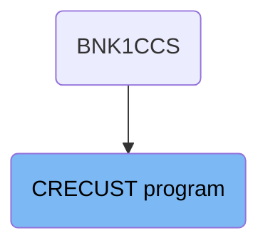

Here is a high level diagram of the program:

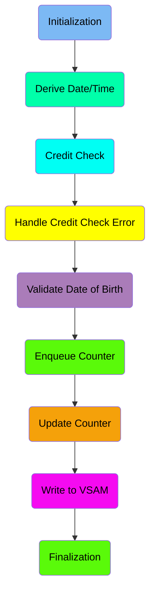

## Initialization

First, we'll zoom into this section of the flow:

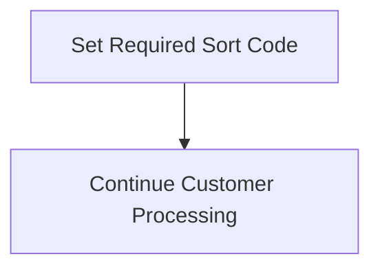

<SwmSnippet path="/src/base/cobol_src/CRECUST.cbl" line="354">

---

The <SwmToken path="src/base/cobol_src/CRECUST.cbl" pos="354:1:1" line-data="       PREMIERE SECTION.">`PREMIERE`</SwmToken> section is responsible for setting the required sort code for customer processing. This is done by moving the value from <SwmToken path="src/base/cobol_src/CRECUST.cbl" pos="357:3:3" line-data="           MOVE SORTCODE TO REQUIRED-SORT-CODE.">`SORTCODE`</SwmToken> to <SwmToken path="src/base/cobol_src/CRECUST.cbl" pos="357:7:11" line-data="           MOVE SORTCODE TO REQUIRED-SORT-CODE.">`REQUIRED-SORT-CODE`</SwmToken>, ensuring that the correct sort code is used in subsequent customer processing steps.

```cobol
       PREMIERE SECTION.
       P010.

           MOVE SORTCODE TO REQUIRED-SORT-CODE.
```

---

</SwmSnippet>

## Derive Date/Time

Now, lets zoom into this section of the flow:

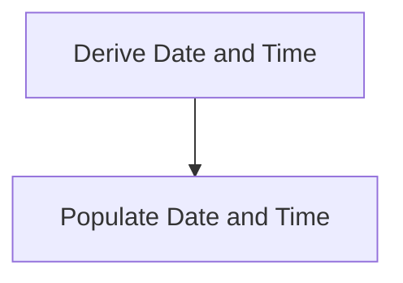

<SwmSnippet path="/src/base/cobol_src/CRECUST.cbl" line="361">

---

First, the function initiates the process of deriving the current date and time, which is essential for timestamping transactions and ensuring accurate record-keeping.

```cobol
      *    Derive the date and time
```

---

</SwmSnippet>

<SwmSnippet path="/src/base/cobol_src/CRECUST.cbl" line="364">

---

Next, it performs the <SwmToken path="src/base/cobol_src/CRECUST.cbl" pos="364:3:7" line-data="           PERFORM POPULATE-TIME-DATE.">`POPULATE-TIME-DATE`</SwmToken> operation, which populates the derived date and time into the relevant fields for further use in the transaction processing.

```cobol
           PERFORM POPULATE-TIME-DATE.
```

---

</SwmSnippet>

## Credit Check

Now, lets zoom into this section of the flow:

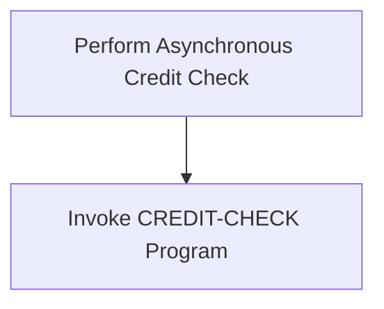

<SwmSnippet path="/src/base/cobol_src/CRECUST.cbl" line="366">

---

The <SwmToken path="src/base/cobol_src/CRECUST.cbl" pos="354:1:1" line-data="       PREMIERE SECTION.">`PREMIERE`</SwmToken> function is responsible for initiating an asynchronous credit check for the customer. This is achieved by invoking the <SwmToken path="src/base/cobol_src/CRECUST.cbl" pos="369:3:5" line-data="           PERFORM CREDIT-CHECK.">`CREDIT-CHECK`</SwmToken> program, which handles the credit verification process. By performing this check asynchronously, the system ensures that the credit verification does not block other operations, allowing for a smoother and more efficient customer experience.

```cobol
      *
      *    Perform the Asynchronous credit check
      *
           PERFORM CREDIT-CHECK.

```

---

</SwmSnippet>

## Handle Credit Check Error

Now, lets zoom into this section of the flow:

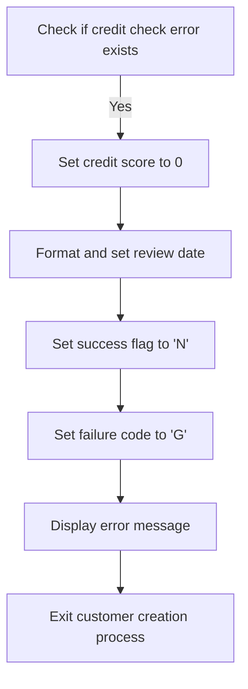

<SwmSnippet path="/src/base/cobol_src/CRECUST.cbl" line="371">

---

First, the function checks if <SwmToken path="src/base/cobol_src/CRECUST.cbl" pos="371:3:9" line-data="           IF WS-CREDIT-CHECK-ERROR = &#39;Y&#39;">`WS-CREDIT-CHECK-ERROR`</SwmToken> (which indicates if there was an error during the credit check) is equal to 'Y'. If it is, the function proceeds to handle the error scenario.

```cobol
           IF WS-CREDIT-CHECK-ERROR = 'Y'
```

---

</SwmSnippet>

<SwmSnippet path="/src/base/cobol_src/CRECUST.cbl" line="372">

---

Next, the function sets the <SwmToken path="src/base/cobol_src/CRECUST.cbl" pos="372:7:11" line-data="              MOVE 0 TO COMM-CREDIT-SCORE">`COMM-CREDIT-SCORE`</SwmToken> to 0, indicating that the credit score is invalid due to the error. It then formats the original date components (<SwmToken path="src/base/cobol_src/CRECUST.cbl" pos="374:3:9" line-data="              STRING WS-ORIG-DATE-DD DELIMITED BY SIZE,">`WS-ORIG-DATE-DD`</SwmToken>, <SwmToken path="src/base/cobol_src/CRECUST.cbl" pos="375:1:7" line-data="                     WS-ORIG-DATE-MM DELIMITED BY SIZE,">`WS-ORIG-DATE-MM`</SwmToken>, <SwmToken path="src/base/cobol_src/CRECUST.cbl" pos="376:1:7" line-data="                     WS-ORIG-DATE-YYYY DELIMITED BY SIZE">`WS-ORIG-DATE-YYYY`</SwmToken>) into a single string and assigns it to <SwmToken path="src/base/cobol_src/CRECUST.cbl" pos="377:3:9" line-data="                     INTO COMM-CS-REVIEW-DATE">`COMM-CS-REVIEW-DATE`</SwmToken>.

```cobol
              MOVE 0 TO COMM-CREDIT-SCORE

              STRING WS-ORIG-DATE-DD DELIMITED BY SIZE,
                     WS-ORIG-DATE-MM DELIMITED BY SIZE,
                     WS-ORIG-DATE-YYYY DELIMITED BY SIZE
                     INTO COMM-CS-REVIEW-DATE
```

---

</SwmSnippet>

<SwmSnippet path="/src/base/cobol_src/CRECUST.cbl" line="380">

---

Then, the function sets <SwmToken path="src/base/cobol_src/CRECUST.cbl" pos="380:9:11" line-data="              MOVE &#39;N&#39; TO COMM-SUCCESS">`COMM-SUCCESS`</SwmToken> to 'N' to indicate the failure of the customer creation process and assigns 'G' to <SwmToken path="src/base/cobol_src/CRECUST.cbl" pos="381:9:13" line-data="              MOVE &#39;G&#39; TO COMM-FAIL-CODE">`COMM-FAIL-CODE`</SwmToken> to specify the type of failure. It displays an error message with the response codes and exits the customer creation process by performing the <SwmToken path="src/base/cobol_src/CRECUST.cbl" pos="388:3:11" line-data="              PERFORM GET-ME-OUT-OF-HERE">`GET-ME-OUT-OF-HERE`</SwmToken> routine.

```cobol
              MOVE 'N' TO COMM-SUCCESS
              MOVE 'G' TO COMM-FAIL-CODE

              DISPLAY 'WS-CREDIT-CHECK-ERROR = Y, '
                       ' RESP='
                       WS-CICS-RESP ' RESP2=' WS-CICS-RESP2
              DISPLAY '   Exiting CRECUST. COMMAREA='
                       DFHCOMMAREA
              PERFORM GET-ME-OUT-OF-HERE
```

---

</SwmSnippet>

## Validate Date of Birth

Now, lets zoom into this section of the flow:

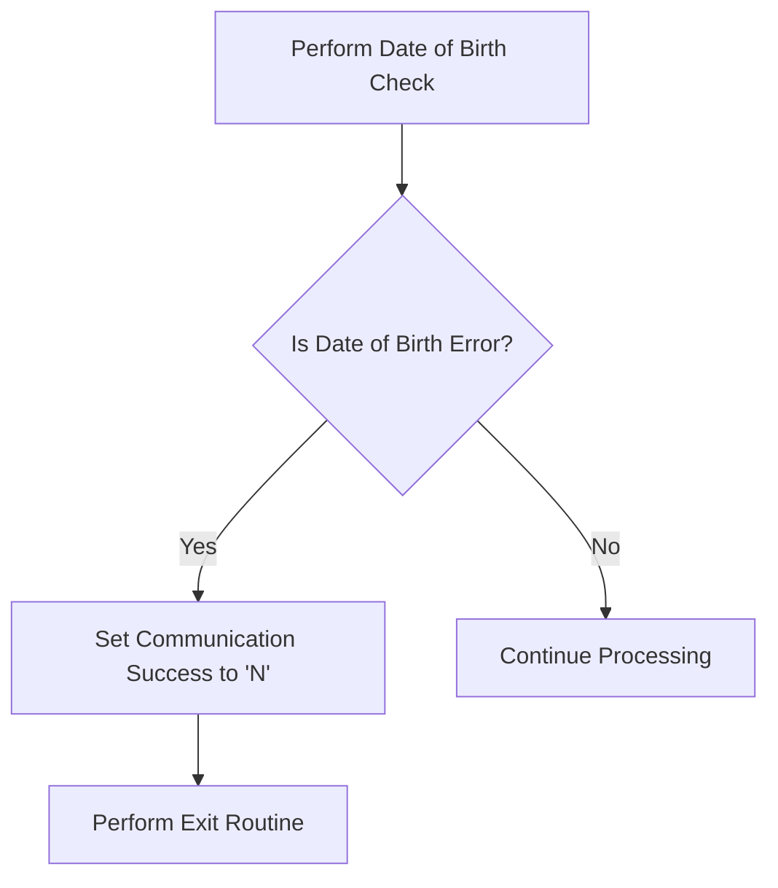

<SwmSnippet path="/src/base/cobol_src/CRECUST.cbl" line="392">

---

### Performing Date of Birth Check

First, the code performs a date of birth check to ensure that the provided date of birth is valid.

```cobol
           PERFORM DATE-OF-BIRTH-CHECK.
```

---

</SwmSnippet>

<SwmSnippet path="/src/base/cobol_src/CRECUST.cbl" line="394">

---

### Handling Date of Birth Error

Next, if the date of birth check results in an error (indicated by <SwmToken path="src/base/cobol_src/CRECUST.cbl" pos="394:3:11" line-data="           IF WS-DATE-OF-BIRTH-ERROR = &#39;Y&#39;">`WS-DATE-OF-BIRTH-ERROR`</SwmToken> being 'Y'), the communication success flag is set to 'N'.

```cobol
           IF WS-DATE-OF-BIRTH-ERROR = 'Y'

              MOVE 'N' TO COMM-SUCCESS
```

---

</SwmSnippet>

<SwmSnippet path="/src/base/cobol_src/CRECUST.cbl" line="397">

---

### Exiting on Error

Then, the code performs an exit routine to handle the error and terminate the process gracefully.

```cobol
              PERFORM GET-ME-OUT-OF-HERE

           END-IF.
```

---

</SwmSnippet>

## Enqueue Counter

Now, lets zoom into this section of the flow:

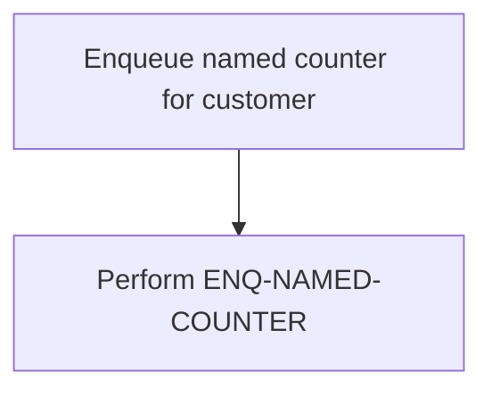

<SwmSnippet path="/src/base/cobol_src/CRECUST.cbl" line="404">

---

The <SwmToken path="src/base/cobol_src/CRECUST.cbl" pos="354:1:1" line-data="       PREMIERE SECTION.">`PREMIERE`</SwmToken> function is responsible for enqueuing a named counter for a customer. This step ensures that the counter is uniquely associated with the customer, preventing conflicts and ensuring data integrity during subsequent operations.

```cobol
           PERFORM ENQ-NAMED-COUNTER.
```

---

</SwmSnippet>

## Update Counter

Now, lets zoom into this section of the flow:

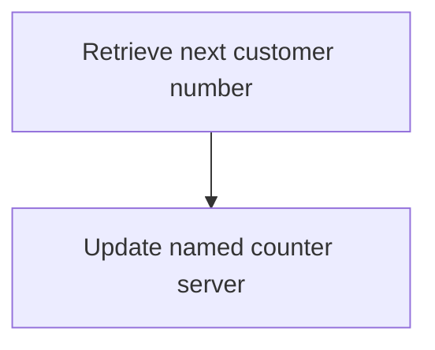

<SwmSnippet path="/src/base/cobol_src/CRECUST.cbl" line="406">

---

### Retrieving the next available customer number

The <SwmToken path="src/base/cobol_src/CRECUST.cbl" pos="354:1:1" line-data="       PREMIERE SECTION.">`PREMIERE`</SwmToken> function is responsible for retrieving the next available customer number. This is achieved by performing the <SwmToken path="src/base/cobol_src/CRECUST.cbl" pos="409:3:5" line-data="           PERFORM UPD-NCS.">`UPD-NCS`</SwmToken> operation, which updates the named counter server to get the last customer number from the VSAM file, increments it, and sets the updated status flag to 'Y'.

```cobol
      *
      *    Get the next CUSTOMER number from the CUSTOMER Named Counter
      *
           PERFORM UPD-NCS.
```

---

</SwmSnippet>

## Write to VSAM

Now, lets zoom into this section of the flow:

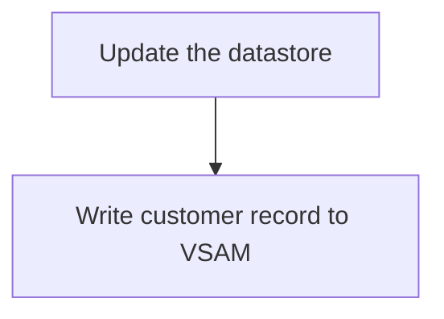

<SwmSnippet path="/src/base/cobol_src/CRECUST.cbl" line="410">

---

The <SwmToken path="src/base/cobol_src/CRECUST.cbl" pos="354:1:1" line-data="       PREMIERE SECTION.">`PREMIERE`</SwmToken> function is responsible for updating the customer record in the VSAM datastore. This is achieved by performing the <SwmToken path="src/base/cobol_src/CRECUST.cbl" pos="414:3:7" line-data="           PERFORM WRITE-CUSTOMER-VSAM.">`WRITE-CUSTOMER-VSAM`</SwmToken> operation, which writes the customer data to the VSAM file. This ensures that the customer information is stored and updated correctly in the database.

```cobol

      *
      *    Update the datastore
      *
           PERFORM WRITE-CUSTOMER-VSAM.
```

---

</SwmSnippet>

## Finalization

This is the next section of the flow.

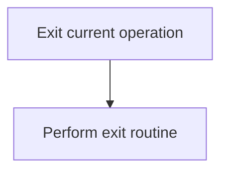

<SwmSnippet path="/src/base/cobol_src/CRECUST.cbl" line="415">

---

The <SwmToken path="src/base/cobol_src/CRECUST.cbl" pos="417:1:11" line-data="           PERFORM GET-ME-OUT-OF-HERE.">`PERFORM GET-ME-OUT-OF-HERE`</SwmToken> statement is used to exit the current operation. This is typically used when an operation needs to be terminated prematurely, ensuring that any necessary cleanup or finalization routines are executed before completely exiting. This helps maintain the integrity of the application state and ensures that resources are properly released.

```cobol


           PERFORM GET-ME-OUT-OF-HERE.
```

---

</SwmSnippet>

## <SwmToken path="src/base/cobol_src/CRECUST.cbl" pos="364:3:7" line-data="           PERFORM POPULATE-TIME-DATE.">`POPULATE-TIME-DATE`</SwmToken>

Lets' zoom into this section of the flow:

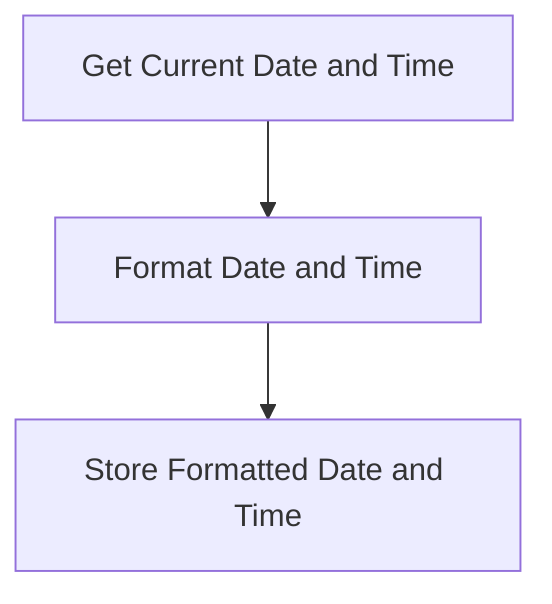

<SwmSnippet path="/src/base/cobol_src/CRECUST.cbl" line="636">

---

### Populating Current Date and Time

The <SwmToken path="src/base/cobol_src/CRECUST.cbl" pos="364:3:7" line-data="           PERFORM POPULATE-TIME-DATE.">`POPULATE-TIME-DATE`</SwmToken> function is responsible for obtaining the current date and time, formatting them appropriately, and storing these values for transaction records. This ensures that each transaction is accurately timestamped, which is crucial for tracking and auditing purposes.

```cobol
      *       Fetch an available reply immediately (without
      *       waiting).
      *
              EXEC CICS FETCH ANY(WS-ANY-CHILD-FETCH-TKN)
                   CHANNEL(WS-ANY-CHILD-FETCH-CHAN)
                   NOSUSPEND
                   COMPSTATUS(WS-CHILD-FETCH-COMPST)
                   ABCODE(WS-ANY-CHILD-FETCH-ABCODE)
                   RESP(WS-CICS-RESP)
                   RESP2(WS-CICS-RESP2)
              END-EXEC

              IF WS-CICS-RESP NOT = DFHRESP(NORMAL)
      *
      *          Check to see if the response was NOTFINISHED
      *          this means that not all credit agencies replied in
```

---

</SwmSnippet>

# Async credit check (<SwmToken path="src/base/cobol_src/CRECUST.cbl" pos="369:3:5" line-data="           PERFORM CREDIT-CHECK.">`CREDIT-CHECK`</SwmToken>)

Let's split this section into smaller parts:

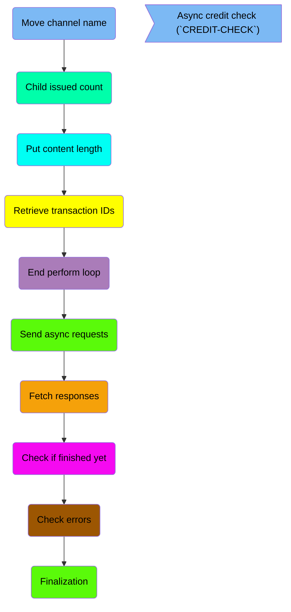

## Move channel name

First, we'll zoom into this section of the flow:

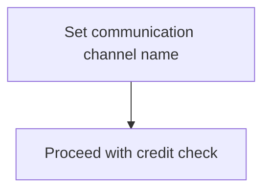

<SwmSnippet path="/src/base/cobol_src/CRECUST.cbl" line="516">

---

The <SwmToken path="src/base/cobol_src/CRECUST.cbl" pos="369:3:5" line-data="           PERFORM CREDIT-CHECK.">`CREDIT-CHECK`</SwmToken> function sets up the communication channel by assigning the name 'CIPCREDCHANN' to <SwmToken path="src/base/cobol_src/CRECUST.cbl" pos="516:10:14" line-data="           MOVE &#39;CIPCREDCHANN    &#39; TO WS-CHANNEL-NAME.">`WS-CHANNEL-NAME`</SwmToken> (the variable that holds the channel name). This step is crucial as it establishes the channel through which the credit check details will be communicated.

```cobol
           MOVE 'CIPCREDCHANN    ' TO WS-CHANNEL-NAME.
```

---

</SwmSnippet>

## Child issued count

This is the next section of the flow.

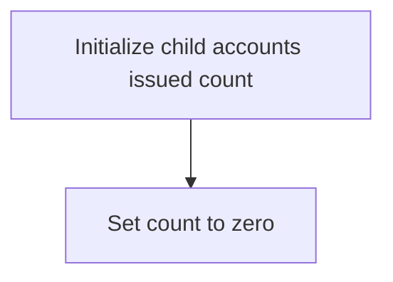

<SwmSnippet path="/src/base/cobol_src/CRECUST.cbl" line="517">

---

The <SwmToken path="src/base/cobol_src/CRECUST.cbl" pos="369:3:5" line-data="           PERFORM CREDIT-CHECK.">`CREDIT-CHECK`</SwmToken> function begins by initializing the count of child accounts issued. This is done by setting the variable <SwmToken path="src/base/cobol_src/CRECUST.cbl" pos="517:7:13" line-data="           MOVE 0 TO WS-CHILD-ISSUED-CNT.">`WS-CHILD-ISSUED-CNT`</SwmToken> (which holds the count of child accounts issued) to zero. This step ensures that the count starts from a known state before any further processing is done.

```cobol
           MOVE 0 TO WS-CHILD-ISSUED-CNT.
```

---

</SwmSnippet>

## Put content length

This is the next section of the flow.

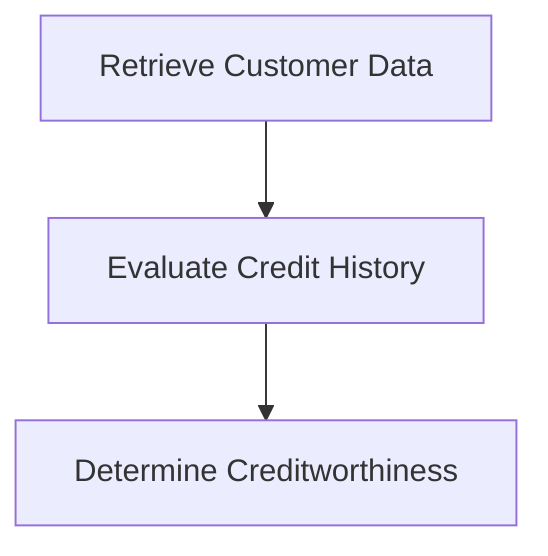

<SwmSnippet path="/src/base/cobol_src/CRECUST.cbl" line="518">

---

### Evaluating Customer Creditworthiness

The <SwmToken path="src/base/cobol_src/CRECUST.cbl" pos="369:3:5" line-data="           PERFORM CREDIT-CHECK.">`CREDIT-CHECK`</SwmToken> function is responsible for evaluating a customer's creditworthiness. It begins by retrieving the customer's data, which includes their credit history and other relevant financial information. This data is then evaluated to determine the customer's creditworthiness, which involves analyzing their credit history, payment patterns, and any outstanding debts. Based on this evaluation, a decision is made regarding the customer's credit status, which can impact their ability to obtain loans or other financial services.

```cobol

```

---

</SwmSnippet>

## Retrieve transaction <SwmToken path="src/base/cobol_src/CRECUST.cbl" pos="513:13:13" line-data="      *    Retrieve the table of transaction IDs to use &amp;">`IDs`</SwmToken>

Now, lets zoom into this section of the flow:

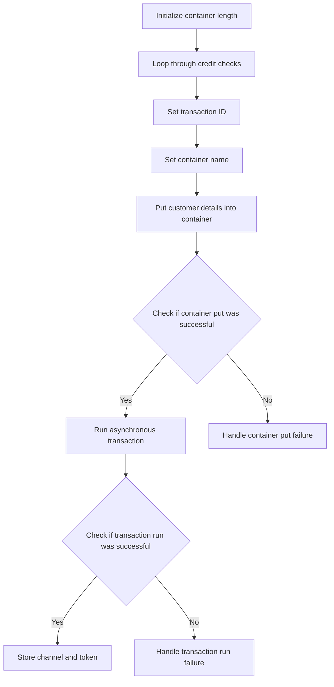

First, the length of the container is computed and stored in <SwmToken path="src/base/cobol_src/CRECUST.cbl" pos="277:3:9" line-data="       01 WS-PUT-CONT-LEN               PIC S9(8) COMP">`WS-PUT-CONT-LEN`</SwmToken>.

Moving to the main loop, the code iterates through five credit checks, incrementing <SwmToken path="src/base/cobol_src/CRECUST.cbl" pos="195:3:7" line-data="       01 WS-CC-CNT                     PIC 9         VALUE 0.">`WS-CC-CNT`</SwmToken> from 1 to 5.

Next, the transaction ID is set by concatenating 'OCR' with the current value of <SwmToken path="src/base/cobol_src/CRECUST.cbl" pos="195:3:7" line-data="       01 WS-CC-CNT                     PIC 9         VALUE 0.">`WS-CC-CNT`</SwmToken>.

Then, the container name is set based on the value of `WS-CC-CCNT`, mapping to 'CIPA', 'CIPB', 'CIPC', 'CIPD', and 'CIPE' respectively.

The customer details are then put into the container using the <SwmToken path="src/base/cobol_src/CRECUST.cbl" pos="557:5:7" line-data="              EXEC CICS PUT CONTAINER(WS-PUT-CONT-NAME)">`PUT CONTAINER`</SwmToken> command, with the container name and length specified.

We check if the container put was successful by evaluating the response code <SwmToken path="src/base/cobol_src/CRECUST.cbl" pos="385:1:5" line-data="                       WS-CICS-RESP &#39; RESP2=&#39; WS-CICS-RESP2">`WS-CICS-RESP`</SwmToken>. If it is not normal, the process is aborted, and an error message is displayed.

If the container put is successful, an asynchronous transaction is run using the <SwmToken path="src/base/cobol_src/CRECUST.cbl" pos="582:5:7" line-data="              EXEC CICS RUN TRANSID(WS-RUN-TRANSID)">`RUN TRANSID`</SwmToken> command with the specified transaction ID and channel name.

We then check if the transaction run was successful by evaluating the response code <SwmToken path="src/base/cobol_src/CRECUST.cbl" pos="385:1:5" line-data="                       WS-CICS-RESP &#39; RESP2=&#39; WS-CICS-RESP2">`WS-CICS-RESP`</SwmToken>. If it is not normal, the process is aborted, and an error message is displayed.

## End perform loop

This is the next section of the flow.

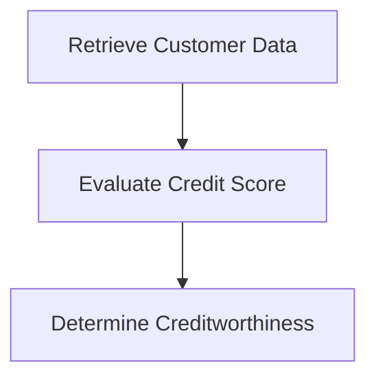

<SwmSnippet path="/src/base/cobol_src/CRECUST.cbl" line="617">

---

### Evaluating Customer Creditworthiness

The <SwmToken path="src/base/cobol_src/CRECUST.cbl" pos="369:3:5" line-data="           PERFORM CREDIT-CHECK.">`CREDIT-CHECK`</SwmToken> function is responsible for evaluating a customer's creditworthiness. It begins by retrieving the customer's data, which includes their financial history and current credit score. This data is then used to evaluate the customer's credit score, considering various factors such as payment history, outstanding debts, and credit utilization. Based on this evaluation, the function determines the customer's creditworthiness, which is crucial for making decisions on loan approvals and credit limits.

```cobol

```

---

</SwmSnippet>

## Send async requests

Now, lets zoom into this section of the flow:

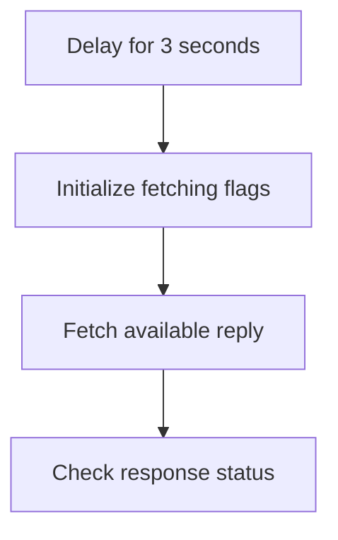

<SwmSnippet path="/src/base/cobol_src/CRECUST.cbl" line="623">

---

First, the process begins with a delay of 3 seconds to allow the asynchronous requests time to be processed.

```cobol
           EXEC CICS DELAY
              FOR SECONDS(3)
           END-EXEC.
```

---

</SwmSnippet>

<SwmSnippet path="/src/base/cobol_src/CRECUST.cbl" line="627">

---

Moving to the next step, the flags <SwmToken path="src/base/cobol_src/CRECUST.cbl" pos="627:9:13" line-data="           MOVE &#39;N&#39; TO WS-FINISHED-FETCHING.">`WS-FINISHED-FETCHING`</SwmToken>, <SwmToken path="src/base/cobol_src/CRECUST.cbl" pos="628:7:11" line-data="           MOVE 0 TO WS-RETRIEVED-CNT.">`WS-RETRIEVED-CNT`</SwmToken>, and <SwmToken path="src/base/cobol_src/CRECUST.cbl" pos="629:7:13" line-data="           MOVE 0 TO WS-TOTAL-CS-SCR.">`WS-TOTAL-CS-SCR`</SwmToken> are initialized to prepare for the fetching process.

```cobol
           MOVE 'N' TO WS-FINISHED-FETCHING.
           MOVE 0 TO WS-RETRIEVED-CNT.
           MOVE 0 TO WS-TOTAL-CS-SCR.
```

---

</SwmSnippet>

<SwmSnippet path="/src/base/cobol_src/CRECUST.cbl" line="631">

---

Next, the process enters a loop that continues until <SwmToken path="src/base/cobol_src/CRECUST.cbl" pos="631:5:9" line-data="           PERFORM UNTIL WS-FINISHED-FETCHING = &#39;Y&#39;">`WS-FINISHED-FETCHING`</SwmToken> is set to 'Y'.

```cobol
           PERFORM UNTIL WS-FINISHED-FETCHING = 'Y'
```

---

</SwmSnippet>

<SwmSnippet path="/src/base/cobol_src/CRECUST.cbl" line="633">

---

Within the loop, the <SwmToken path="src/base/cobol_src/CRECUST.cbl" pos="633:7:15" line-data="              MOVE SPACES TO WS-ANY-CHILD-FETCH-ABCODE">`WS-ANY-CHILD-FETCH-ABCODE`</SwmToken> is cleared to prepare for fetching a new reply.

```cobol
              MOVE SPACES TO WS-ANY-CHILD-FETCH-ABCODE
```

---

</SwmSnippet>

<SwmSnippet path="/src/base/cobol_src/CRECUST.cbl" line="639">

---

Then, an available reply is fetched immediately without waiting, using the <SwmToken path="src/base/cobol_src/CRECUST.cbl" pos="639:1:5" line-data="              EXEC CICS FETCH ANY(WS-ANY-CHILD-FETCH-TKN)">`EXEC CICS FETCH`</SwmToken> command.

```cobol
              EXEC CICS FETCH ANY(WS-ANY-CHILD-FETCH-TKN)
                   CHANNEL(WS-ANY-CHILD-FETCH-CHAN)
                   NOSUSPEND
                   COMPSTATUS(WS-CHILD-FETCH-COMPST)
                   ABCODE(WS-ANY-CHILD-FETCH-ABCODE)
                   RESP(WS-CICS-RESP)
                   RESP2(WS-CICS-RESP2)
              END-EXEC
```

---

</SwmSnippet>

## Fetch responses

Now, lets zoom into this section of the flow:

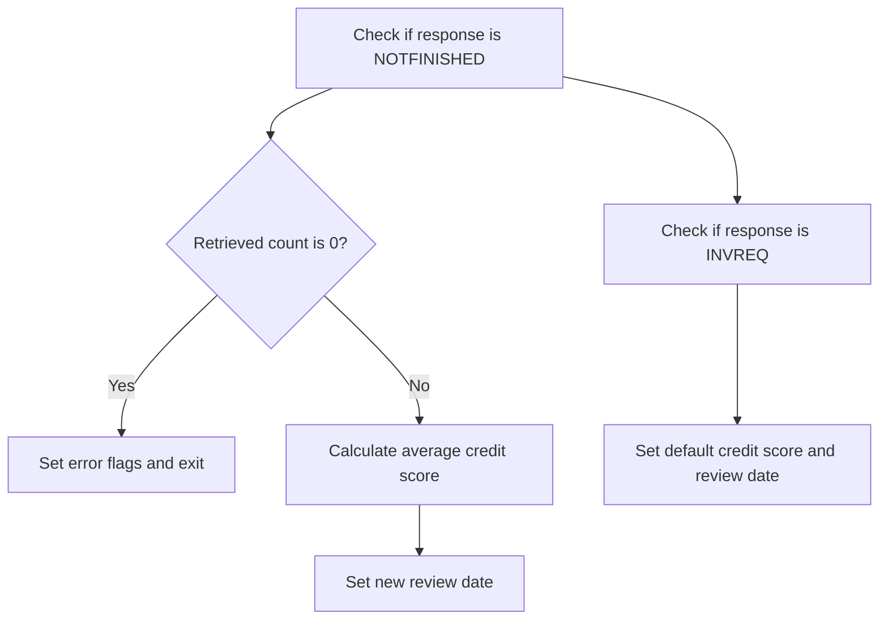

<SwmSnippet path="/src/base/cobol_src/CRECUST.cbl" line="657">

---

First, the code checks if the response from the credit agencies is <SwmToken path="src/base/cobol_src/CRECUST.cbl" pos="657:13:13" line-data="                 IF WS-CICS-RESP = DFHRESP(NOTFINISHED) AND">`NOTFINISHED`</SwmToken>, indicating that not all agencies replied within the required time frame.

```cobol
                 IF WS-CICS-RESP = DFHRESP(NOTFINISHED) AND
                 WS-CICS-RESP2 = 52

```

---

</SwmSnippet>

<SwmSnippet path="/src/base/cobol_src/CRECUST.cbl" line="664">

---

If no data was retrieved at all (<SwmToken path="src/base/cobol_src/CRECUST.cbl" pos="664:3:7" line-data="                    IF WS-RETRIEVED-CNT = 0">`WS-RETRIEVED-CNT`</SwmToken> is 0), it sets the error flags and exits the process.

```cobol
                    IF WS-RETRIEVED-CNT = 0
                       MOVE 'Y' TO WS-FINISHED-FETCHING
                       MOVE 0 TO COMM-CREDIT-SCORE
                       MOVE 'Y' TO WS-CREDIT-CHECK-ERROR

                       STRING WS-ORIG-DATE-DD DELIMITED BY SIZE,
                              WS-ORIG-DATE-MM DELIMITED BY SIZE,
                              WS-ORIG-DATE-YYYY DELIMITED BY SIZE
                              INTO COMM-CS-REVIEW-DATE
                       END-STRING

                       MOVE 'N' TO COMM-SUCCESS
                       MOVE 'C' TO COMM-FAIL-CODE

                       DISPLAY 'EXEC CICS FETCH ANY failed. RESP='
                          WS-CICS-RESP ' RESP2=' WS-CICS-RESP2
                       DISPLAY '   NOTFINISHED (no data) was returned'
                       DISPLAY '   Exiting CRECUST. COMMAREA='
                          DFHCOMMAREA
                       PERFORM GET-ME-OUT-OF-HERE
```

---

</SwmSnippet>

<SwmSnippet path="/src/base/cobol_src/CRECUST.cbl" line="685">

---

Moving to the next condition, if some data was retrieved, it calculates the average credit score from the responses received.

```cobol
                    ELSE
      *
      *                If we have previously retrieved some data from
      *                the credit checking agency/agencies then
      *                calculate the average credit score and a
      *                new random review date (sometime in the
      *                next 21 days)
      *
                       MOVE 'Y' TO WS-FINISHED-FETCHING
                       MOVE 'N' TO WS-CREDIT-CHECK-ERROR
      *
      *                Compute the average credit score from those
      *                credit agencies that responded
      *
                       COMPUTE WS-ACTUAL-CS-SCR = WS-TOTAL-CS-SCR /
                          WS-RETRIEVED-CNT
                       MOVE WS-ACTUAL-CS-SCR TO COMM-CREDIT-SCORE
```

---

</SwmSnippet>

<SwmSnippet path="/src/base/cobol_src/CRECUST.cbl" line="704">

---

Then, it sets a new random review date within the next 21 days.

```cobol
      *                Get today's date
      *
                       MOVE FUNCTION CURRENT-DATE
                          TO WS-CURRENT-DATE-DATA

                       MOVE WS-CURRENT-DATE-DATA (1:8)
                          TO WS-CURRENT-DATE-9

                      COMPUTE WS-TODAY-INT =
                          FUNCTION INTEGER-OF-DATE (WS-CURRENT-DATE-9)

      *
      *                Set up a random Credit Score review date
      *                within the next 21 days.
      *
                       MOVE EIBTASKN           TO WS-SEED

                       COMPUTE WS-REVIEW-DATE-ADD = ((21 - 1)
                                   * FUNCTION RANDOM(WS-SEED)) + 1

                       COMPUTE WS-NEW-REVIEW-DATE-INT =
```

---

</SwmSnippet>

<SwmSnippet path="/src/base/cobol_src/CRECUST.cbl" line="744">

---

Going into the next check, if the response is <SwmToken path="src/base/cobol_src/CRECUST.cbl" pos="744:17:17" line-data="      *          Check to see if the response was INVREQ">`INVREQ`</SwmToken>, it sets a default credit score and review date.

```cobol
      *          Check to see if the response was INVREQ
      *          this means that the parent never had any children
      *
                 IF WS-CICS-RESP = DFHRESP(INVREQ) AND
                 WS-CICS-RESP2 = 1

                    MOVE 0 TO COMM-CREDIT-SCORE

                    STRING WS-ORIG-DATE-DD DELIMITED BY SIZE,
                           WS-ORIG-DATE-MM DELIMITED BY SIZE,
                           WS-ORIG-DATE-YYYY DELIMITED BY SIZE
                           INTO COMM-CS-REVIEW-DATE
                    END-STRING

                    MOVE 'N' TO COMM-SUCCESS
                    MOVE 'D' TO COMM-FAIL-CODE
```

---

</SwmSnippet>

## Check if finished yet

This is the next section of the flow.

```mermaid
graph TD
  A[Display FETCH failure message] --> B[Display INVREQ message] --> C[Display exiting message] --> D[Perform GET-ME-OUT-OF-HERE]

%% Swimm:
%% graph TD
%%   A[Display FETCH failure message] --> B[Display INVREQ message] --> C[Display exiting message] --> D[Perform <SwmToken path="src/base/cobol_src/CRECUST.cbl" pos="388:3:11" line-data="              PERFORM GET-ME-OUT-OF-HERE">`GET-ME-OUT-OF-HERE`</SwmToken>]
```

<SwmSnippet path="/src/base/cobol_src/CRECUST.cbl" line="761">

---

When the CICS FETCH operation fails, the system displays a failure message indicating the response codes <SwmToken path="src/base/cobol_src/CRECUST.cbl" pos="762:1:5" line-data="                       WS-CICS-RESP &#39; RESP2=&#39; WS-CICS-RESP2">`WS-CICS-RESP`</SwmToken> and <SwmToken path="src/base/cobol_src/CRECUST.cbl" pos="762:13:17" line-data="                       WS-CICS-RESP &#39; RESP2=&#39; WS-CICS-RESP2">`WS-CICS-RESP2`</SwmToken>. This helps in identifying the specific error that occurred during the FETCH operation.

```cobol
                    DISPLAY 'EXEC CICS FETCH ANY failed. RESP='
                       WS-CICS-RESP ' RESP2=' WS-CICS-RESP2
```

---

</SwmSnippet>

<SwmSnippet path="/src/base/cobol_src/CRECUST.cbl" line="763">

---

Next, the system displays a message indicating that an INVREQ (invalid request) was returned, meaning no data was found. This informs the user that the requested data could not be retrieved.

```cobol
                    DISPLAY '   INVREQ (no data) was returned'
```

---

</SwmSnippet>

<SwmSnippet path="/src/base/cobol_src/CRECUST.cbl" line="764">

---

Following this, a message is displayed indicating that the program is exiting, along with the current state of <SwmToken path="src/base/cobol_src/CRECUST.cbl" pos="765:1:1" line-data="                       DFHCOMMAREA">`DFHCOMMAREA`</SwmToken> (the communication area). This provides context on the state of the application at the time of exit.

```cobol
                    DISPLAY '   Exiting CRECUST. COMMAREA='
                       DFHCOMMAREA
```

---

</SwmSnippet>

<SwmSnippet path="/src/base/cobol_src/CRECUST.cbl" line="766">

---

Finally, the <SwmToken path="src/base/cobol_src/CRECUST.cbl" pos="766:3:11" line-data="                    PERFORM GET-ME-OUT-OF-HERE">`GET-ME-OUT-OF-HERE`</SwmToken> routine is performed to handle the termination of the program gracefully. This ensures that any necessary cleanup operations are executed before the program exits.

```cobol
                    PERFORM GET-ME-OUT-OF-HERE
```

---

</SwmSnippet>

## Check errors

This is the next section of the flow.

```mermaid
graph TD
  A[Evaluate customer credit status] --> B[Check credit score] --> C[Determine creditworthiness]
```

<SwmSnippet path="/src/base/cobol_src/CRECUST.cbl" line="767">

---

### Evaluating customer credit status

The <SwmToken path="src/base/cobol_src/CRECUST.cbl" pos="369:3:5" line-data="           PERFORM CREDIT-CHECK.">`CREDIT-CHECK`</SwmToken> function is responsible for evaluating the customer's credit status. This involves checking the customer's credit score and determining their creditworthiness based on predefined criteria. The evaluation process ensures that the customer meets the necessary credit requirements before proceeding with any financial transactions.

```cobol

                 END-IF

      *
```

---

</SwmSnippet>

## Finalization

Now, lets zoom into this section of the flow:

```mermaid
graph TD
  A[Check if credit check process is complete]
```

<SwmSnippet path="/src/base/cobol_src/CRECUST.cbl" line="771">

---

The <SwmToken path="src/base/cobol_src/CRECUST.cbl" pos="369:3:5" line-data="           PERFORM CREDIT-CHECK.">`CREDIT-CHECK`</SwmToken> function includes a step to check if the credit check process is complete. This step ensures that the system verifies whether all necessary checks and validations have been performed before proceeding further. This is crucial to maintain the integrity and accuracy of the credit check process, ensuring that no steps are skipped or incomplete.

```cobol
      *          Check to see if we are finished yet.
```

---

</SwmSnippet>

## <SwmToken path="src/base/cobol_src/CRECUST.cbl" pos="388:3:11" line-data="              PERFORM GET-ME-OUT-OF-HERE">`GET-ME-OUT-OF-HERE`</SwmToken>

Lets' zoom into this section of the flow:

```mermaid
graph TD
  A[Complete customer record creation] --> B[Return control to CICS]
```

<SwmSnippet path="/src/base/cobol_src/CRECUST.cbl" line="1271">

---

### Completing the customer record creation

First, the <SwmToken path="src/base/cobol_src/CRECUST.cbl" pos="1271:1:9" line-data="       GET-ME-OUT-OF-HERE SECTION.">`GET-ME-OUT-OF-HERE`</SwmToken> section is initiated to signify the end of the customer record creation process.

```cobol
       GET-ME-OUT-OF-HERE SECTION.
       GMOFH010.
```

---

</SwmSnippet>

<SwmSnippet path="/src/base/cobol_src/CRECUST.cbl" line="1276">

---

### Returning control to CICS

Next, the <SwmToken path="src/base/cobol_src/CRECUST.cbl" pos="1276:1:5" line-data="           EXEC CICS RETURN">`EXEC CICS RETURN`</SwmToken> command is executed to return control to the CICS environment, indicating that the current task is complete.

```cobol
           EXEC CICS RETURN
           END-EXEC.
```

---

</SwmSnippet>

<SwmSnippet path="/src/base/cobol_src/CRECUST.cbl" line="1279">

---

### Exiting the section

Finally, the <SwmToken path="src/base/cobol_src/CRECUST.cbl" pos="1280:1:1" line-data="           EXIT.">`EXIT`</SwmToken> statement is reached, which exits the <SwmToken path="src/base/cobol_src/CRECUST.cbl" pos="388:3:11" line-data="              PERFORM GET-ME-OUT-OF-HERE">`GET-ME-OUT-OF-HERE`</SwmToken> section, completing the flow.

```cobol
       GMOFH999.
           EXIT.
```

---

</SwmSnippet>

## <SwmToken path="src/base/cobol_src/CRECUST.cbl" pos="392:3:9" line-data="           PERFORM DATE-OF-BIRTH-CHECK.">`DATE-OF-BIRTH-CHECK`</SwmToken>

Lets' zoom into this section of the flow:

```mermaid
graph TD
  A[Check if birth year is valid] -->|Invalid| B[Set error code 'O']
  A -->|Valid| C[Convert birth date to Lillian format]
  C --> D[Check if conversion was successful]
  D -->|Failed| E[Set error code 'Z']
  D -->|Successful| F[Get today's date in Lillian format]
  F --> G[Check if conversion was successful]
  G -->|Failed| H[Log error]
  G -->|Successful| I[Calculate customer's age]
  I --> J[Check if age is greater than 150]
  J -->|Yes| K[Set error code 'O']
  J -->|No| L[Check if birth date is in the future]
  L -->|Yes| M[Set error code 'Y']
```

<SwmSnippet path="/src/base/cobol_src/CRECUST.cbl" line="1369">

---

First, we check if the birth year is valid by ensuring it is not earlier than 1601. If it is invalid, we set an error code 'O' to indicate an invalid date of birth.

```cobol
           IF COMM-BIRTH-YEAR < 1601
              MOVE 'Y' TO WS-DATE-OF-BIRTH-ERROR
              MOVE 'O' TO COMM-FAIL-CODE
              GO TO DOBC999
```

---

</SwmSnippet>

<SwmSnippet path="/src/base/cobol_src/CRECUST.cbl" line="1375">

---

Moving to the next step, we convert the birth date into the Lillian date format using the <SwmToken path="src/base/cobol_src/CRECUST.cbl" pos="1375:11:11" line-data="           MOVE COMM-BIRTH-YEAR TO CEEDAYS-YEAR.">`CEEDAYS`</SwmToken> function. This conversion is necessary for further date calculations.

```cobol
           MOVE COMM-BIRTH-YEAR TO CEEDAYS-YEAR.
           MOVE COMM-BIRTH-MONTH TO CEEDAYS-MONTH.
           MOVE COMM-BIRTH-DAY TO CEEDAYS-DAY.

           CALL "CEEDAYS" USING DATE-OF-BIRTH-FOR-CEEDAYS
                                DATE-OF-BIRTH-FORMAT,
                                WS-DATE-OF-BIRTH-LILLIAN,
                                FC.
```

---

</SwmSnippet>

<SwmSnippet path="/src/base/cobol_src/CRECUST.cbl" line="1384">

---

Next, we check if the conversion to the Lillian date format was successful. If it failed, we set an error code 'Z' and log the error message.

```cobol
           IF NOT CEE000 OF FC THEN
              MOVE 'Y' TO WS-DATE-OF-BIRTH-ERROR
              MOVE 'Z' TO COMM-FAIL-CODE
              DISPLAY 'CEEDAYS failed, FORMAT LENGTH 10 with msg '
                 MSG-NO OF FC
                 ' for date YYYYMMDD' DATE-OF-BIRTH-FOR-CEEDAYS
              GO TO DOBC999
           END-IF.
```

---

</SwmSnippet>

<SwmSnippet path="/src/base/cobol_src/CRECUST.cbl" line="1393">

---

Then, we retrieve today's date in the Lillian date format using the <SwmToken path="src/base/cobol_src/CRECUST.cbl" pos="1393:4:4" line-data="           CALL &quot;CEELOCT&quot; USING WS-TODAY-LILLIAN,">`CEELOCT`</SwmToken> function. This is required to calculate the customer's age.

```cobol
           CALL "CEELOCT" USING WS-TODAY-LILLIAN,
                                WS-TODAY-SECONDS,
                                WS-TODAY-GREGORIAN,
                                FC.
```

---

</SwmSnippet>

<SwmSnippet path="/src/base/cobol_src/CRECUST.cbl" line="1398">

---

We check if the conversion of today's date to the Lillian format was successful. If it failed, we log the error message.

```cobol
           IF NOT CEE000 OF FC THEN
              MOVE 'Y' TO WS-DATE-OF-BIRTH-ERROR
              DISPLAY 'CEEDLOCT failed with msg '
                 MSG-NO OF FC
              GO TO DOBC999
```

---

</SwmSnippet>

<SwmSnippet path="/src/base/cobol_src/CRECUST.cbl" line="1405">

---

Next, we calculate the customer's age by subtracting the birth year from the current year.

```cobol
           SUBTRACT COMM-BIRTH-YEAR FROM WS-TODAY-G-YEAR
              GIVING WS-CUSTOMER-AGE
```

---

</SwmSnippet>

<SwmSnippet path="/src/base/cobol_src/CRECUST.cbl" line="1408">

---

We then check if the customer's age is greater than 150 years. If it is, we set an error code 'O' to indicate an invalid age.

```cobol
           IF WS-CUSTOMER-AGE > 150
              MOVE 'Y' TO WS-DATE-OF-BIRTH-ERROR
              MOVE 'O' TO COMM-FAIL-CODE
              GO TO DOBC999
```

---

</SwmSnippet>

<SwmSnippet path="/src/base/cobol_src/CRECUST.cbl" line="1414">

---

Finally, we check if the birth date is in the future by comparing the Lillian dates. If the birth date is in the future, we set an error code 'Y'.

```cobol
           IF WS-TODAY-LILLIAN < WS-DATE-OF-BIRTH-LILLIAN
                        MOVE 'Y' TO WS-DATE-OF-BIRTH-ERROR
              MOVE 'Y' TO COMM-FAIL-CODE
           END-IF.
```

---

</SwmSnippet>

## <SwmToken path="src/base/cobol_src/CRECUST.cbl" pos="404:3:7" line-data="           PERFORM ENQ-NAMED-COUNTER.">`ENQ-NAMED-COUNTER`</SwmToken>

Lets' zoom into this section of the flow:

```mermaid
graph TD
  A[Move SORTCODE to NCS-CUST-NO-TEST-SORT] --> B[Enqueue resource NCS-CUST-NO-NAME] --> C{Check if response is NORMAL} -->|No| D[Set COMM-SUCCESS to 'N'] --> E[Set COMM-FAIL-CODE to '3'] --> F[Perform GET-ME-OUT-OF-HERE]

%% Swimm:
%% graph TD
%%   A[Move SORTCODE to <SwmToken path="src/base/cobol_src/CRECUST.cbl" pos="444:1:9" line-data="              NCS-CUST-NO-TEST-SORT.">`NCS-CUST-NO-TEST-SORT`</SwmToken>] --> B[Enqueue resource <SwmToken path="src/base/cobol_src/CRECUST.cbl" pos="447:3:9" line-data="              RESOURCE(NCS-CUST-NO-NAME)">`NCS-CUST-NO-NAME`</SwmToken>] --> C{Check if response is NORMAL} -->|No| D[Set <SwmToken path="src/base/cobol_src/CRECUST.cbl" pos="380:9:11" line-data="              MOVE &#39;N&#39; TO COMM-SUCCESS">`COMM-SUCCESS`</SwmToken> to 'N'] --> E[Set <SwmToken path="src/base/cobol_src/CRECUST.cbl" pos="381:9:13" line-data="              MOVE &#39;G&#39; TO COMM-FAIL-CODE">`COMM-FAIL-CODE`</SwmToken> to '3'] --> F[Perform <SwmToken path="src/base/cobol_src/CRECUST.cbl" pos="388:3:11" line-data="              PERFORM GET-ME-OUT-OF-HERE">`GET-ME-OUT-OF-HERE`</SwmToken>]
```

<SwmSnippet path="/src/base/cobol_src/CRECUST.cbl" line="443">

---

### Moving SORTCODE to <SwmToken path="src/base/cobol_src/CRECUST.cbl" pos="444:1:9" line-data="              NCS-CUST-NO-TEST-SORT.">`NCS-CUST-NO-TEST-SORT`</SwmToken>

First, the <SwmToken path="src/base/cobol_src/CRECUST.cbl" pos="443:3:3" line-data="           MOVE SORTCODE TO">`SORTCODE`</SwmToken> is moved to <SwmToken path="src/base/cobol_src/CRECUST.cbl" pos="444:1:9" line-data="              NCS-CUST-NO-TEST-SORT.">`NCS-CUST-NO-TEST-SORT`</SwmToken>, which is likely used to prepare the customer number for further processing.

```cobol
           MOVE SORTCODE TO
              NCS-CUST-NO-TEST-SORT.
```

---

</SwmSnippet>

<SwmSnippet path="/src/base/cobol_src/CRECUST.cbl" line="446">

---

### Enqueueing the Resource

Moving to the next step, the code enqueues the resource <SwmToken path="src/base/cobol_src/CRECUST.cbl" pos="447:3:9" line-data="              RESOURCE(NCS-CUST-NO-NAME)">`NCS-CUST-NO-NAME`</SwmToken> with a specified length and response handling. This ensures that the resource is locked for exclusive use, preventing other transactions from modifying it simultaneously.

```cobol
           EXEC CICS ENQ
              RESOURCE(NCS-CUST-NO-NAME)
              LENGTH(16)
              RESP(WS-CICS-RESP)
              RESP2(WS-CICS-RESP2)
           END-EXEC.
```

---

</SwmSnippet>

<SwmSnippet path="/src/base/cobol_src/CRECUST.cbl" line="453">

---

### Checking the Response

Next, the code checks if the response from the enqueue operation is not <SwmToken path="src/base/cobol_src/CRECUST.cbl" pos="453:15:15" line-data="           IF WS-CICS-RESP NOT = DFHRESP(NORMAL)">`NORMAL`</SwmToken>. This is crucial to determine if the resource locking was successful.

```cobol
           IF WS-CICS-RESP NOT = DFHRESP(NORMAL)
```

---

</SwmSnippet>

<SwmSnippet path="/src/base/cobol_src/CRECUST.cbl" line="454">

---

### Handling Unsuccessful Enqueue

Then, if the response is not <SwmToken path="src/base/cobol_src/CRECUST.cbl" pos="453:15:15" line-data="           IF WS-CICS-RESP NOT = DFHRESP(NORMAL)">`NORMAL`</SwmToken>, the code sets <SwmToken path="src/base/cobol_src/CRECUST.cbl" pos="454:9:11" line-data="             MOVE &#39;N&#39; TO COMM-SUCCESS">`COMM-SUCCESS`</SwmToken> to 'N' and <SwmToken path="src/base/cobol_src/CRECUST.cbl" pos="455:9:13" line-data="             MOVE &#39;3&#39; TO COMM-FAIL-CODE">`COMM-FAIL-CODE`</SwmToken> to '3', indicating a failure in the communication process. It then performs the <SwmToken path="src/base/cobol_src/CRECUST.cbl" pos="456:3:11" line-data="             PERFORM GET-ME-OUT-OF-HERE">`GET-ME-OUT-OF-HERE`</SwmToken> routine to handle the error.

```cobol
             MOVE 'N' TO COMM-SUCCESS
             MOVE '3' TO COMM-FAIL-CODE
             PERFORM GET-ME-OUT-OF-HERE
           END-IF.
```

---

</SwmSnippet>

## <SwmToken path="src/base/cobol_src/CRECUST.cbl" pos="409:3:5" line-data="           PERFORM UPD-NCS.">`UPD-NCS`</SwmToken>

Lets' zoom into this section of the flow:

```mermaid
graph TD
  A[Increment Customer Number] --> B[Get Last Customer from VSAM] --> C[Set Updated Status]
```

<SwmSnippet path="/src/base/cobol_src/CRECUST.cbl" line="493">

---

First, the customer number increment value is set to 1, indicating that the customer number should be increased by one.

```cobol
           MOVE 1 TO NCS-CUST-NO-INC.
```

---

</SwmSnippet>

<SwmSnippet path="/src/base/cobol_src/CRECUST.cbl" line="495">

---

Next, the <SwmToken path="src/base/cobol_src/CRECUST.cbl" pos="495:3:9" line-data="           PERFORM GET-LAST-CUSTOMER-VSAM">`GET-LAST-CUSTOMER-VSAM`</SwmToken> operation is performed to retrieve the last customer record from the VSAM file and update the customer control record.

```cobol
           PERFORM GET-LAST-CUSTOMER-VSAM
```

---

</SwmSnippet>

<SwmSnippet path="/src/base/cobol_src/CRECUST.cbl" line="497">

---

Then, the updated status flag <SwmToken path="src/base/cobol_src/CRECUST.cbl" pos="497:9:11" line-data="           MOVE &#39;Y&#39; TO NCS-UPDATED.">`NCS-UPDATED`</SwmToken> is set to 'Y', indicating that the named counter server has been successfully updated.

```cobol
           MOVE 'Y' TO NCS-UPDATED.
```

---

</SwmSnippet>

## <SwmToken path="src/base/cobol_src/CRECUST.cbl" pos="495:3:9" line-data="           PERFORM GET-LAST-CUSTOMER-VSAM">`GET-LAST-CUSTOMER-VSAM`</SwmToken>

Lets' zoom into this section of the flow:

```mermaid
graph TD
  A[Initialize customer control record] --> B[Read customer record from VSAM file] --> C[Check for system ID error] --> D[Retry read operation if system ID error] --> E[Increment customer number] --> F[Rewrite updated customer record to VSAM file] --> G[Check for system ID error on rewrite] --> H[Retry rewrite operation if system ID error] --> I[Move last customer number to communication fields]
```

<SwmSnippet path="/src/base/cobol_src/CRECUST.cbl" line="1286">

---

### Initializing customer control record

First, the customer control record is initialized by setting the sort code to zero and the customer number to all nines.

```cobol
           INITIALIZE CUSTOMER-CONTROL
           MOVE ZERO TO CUSTOMER-CONTROL-SORTCODE
           MOVE ALL '9' TO CUSTOMER-CONTROL-NUMBER
```

---

</SwmSnippet>

<SwmSnippet path="/src/base/cobol_src/CRECUST.cbl" line="1290">

---

### Reading customer record from VSAM file

Next, the program attempts to read a customer record from the 'CUSTOMER' VSAM file using the customer control key.

```cobol
           EXEC CICS READ FILE('CUSTOMER')
                     RIDFLD(CUSTOMER-CONTROL-KEY)
                     UPDATE
                     INTO(CUSTOMER-CONTROL)
                     RESP(WS-CICS-RESP)
                     RESP2(WS-CICS-RESP2)
```

---

</SwmSnippet>

<SwmSnippet path="/src/base/cobol_src/CRECUST.cbl" line="1298">

---

### Checking for system ID error

The program then checks if the response indicates a system ID error.

```cobol
           IF WS-CICS-RESP = DFHRESP(SYSIDERR)
```

---

</SwmSnippet>

<SwmSnippet path="/src/base/cobol_src/CRECUST.cbl" line="1299">

---

### Retrying read operation if system ID error

If a system ID error is detected, the program retries the read operation up to 100 times, with a 3-second delay between each attempt.

```cobol
             PERFORM VARYING SYSIDERR-RETRY FROM 1 BY 1
             UNTIL SYSIDERR-RETRY > 100
             OR WS-CICS-RESP = DFHRESP(NORMAL)
             OR WS-CICS-RESP IS NOT EQUAL TO DFHRESP(SYSIDERR)
               EXEC CICS DELAY FOR SECONDS(3)
               END-EXEC

               EXEC CICS READ FILE('CUSTOMER')
                         RIDFLD(CUSTOMER-CONTROL-KEY)
                         UPDATE
                         INTO(CUSTOMER-CONTROL)
                         RESP(WS-CICS-RESP)
                         RESP2(WS-CICS-RESP2)
               END-EXEC

             END-PERFORM
```

---

</SwmSnippet>

<SwmSnippet path="/src/base/cobol_src/CRECUST.cbl" line="1323">

---

### Incrementing customer number

After successfully reading the customer record, the program increments the customer number by one.

```cobol
           ADD 1 TO LAST-CUSTOMER-NUMBER IN CUSTOMER-CONTROL
           GIVING LAST-CUSTOMER-NUMBER IN CUSTOMER-CONTROL
```

---

</SwmSnippet>

<SwmSnippet path="/src/base/cobol_src/CRECUST.cbl" line="1326">

---

### Rewriting updated customer record to VSAM file

The updated customer control record is then rewritten back to the 'CUSTOMER' VSAM file.

```cobol
           EXEC CICS REWRITE FILE('CUSTOMER')
                FROM(CUSTOMER-CONTROL)
                RESP(WS-CICS-RESP)
                RESP2(WS-CICS-RESP2)
           END-EXEC
```

---

</SwmSnippet>

<SwmSnippet path="/src/base/cobol_src/CRECUST.cbl" line="1332">

---

### Checking for system ID error on rewrite

The program checks again for a system ID error after attempting to rewrite the customer record.

```cobol
           IF WS-CICS-RESP = DFHRESP(SYSIDERR)
```

---

</SwmSnippet>

<SwmSnippet path="/src/base/cobol_src/CRECUST.cbl" line="1333">

---

### Retrying rewrite operation if system ID error

If a system ID error is detected during the rewrite operation, the program retries the rewrite up to 100 times, with a 3-second delay between each attempt.

```cobol
              PERFORM VARYING SYSIDERR-RETRY FROM 1 BY 1
              UNTIL SYSIDERR-RETRY > 100
              OR WS-CICS-RESP = DFHRESP(NORMAL)
              OR WS-CICS-RESP IS NOT EQUAL TO DFHRESP(SYSIDERR)
                 EXEC CICS DELAY FOR SECONDS(3)
                 END-EXEC

                 EXEC CICS REWRITE FILE('CUSTOMER')
                    FROM(CUSTOMER-CONTROL)
                    RESP(WS-CICS-RESP)
                    RESP2(WS-CICS-RESP2)
                 END-EXEC
              END-PERFORM
```

---

</SwmSnippet>

<SwmSnippet path="/src/base/cobol_src/CRECUST.cbl" line="1356">

---

### Moving last customer number to communication fields

Finally, the last customer number is moved to various communication fields for further processing.

```cobol
           MOVE LAST-CUSTOMER-NUMBER OF CUSTOMER-CONTROL  TO
              COMM-NUMBER CUSTOMER-NUMBER REQUIRED-CUST-NUMBER2
              NCS-CUST-NO-VALUE.
```

---

</SwmSnippet>

## <SwmToken path="src/base/cobol_src/CRECUST.cbl" pos="1067:3:7" line-data="              PERFORM DEQ-NAMED-COUNTER">`DEQ-NAMED-COUNTER`</SwmToken>

Lets' zoom into this section of the flow:

```mermaid
graph TD
  A[Move Sort Code to Test Sort] --> B[Get Current Time] --> C[Release Customer Number Resource] --> D[Check Response] --> E{Response Normal?}
  E -- No --> F[Set Communication Failure] --> G[Perform Exit Routine]
```

<SwmSnippet path="/src/base/cobol_src/CRECUST.cbl" line="466">

---

### Moving Sort Code to Test Sort

First, the sort code is moved to the customer number test sort field. This prepares the necessary data for the subsequent operations.

```cobol
           MOVE SORTCODE TO
              NCS-CUST-NO-TEST-SORT.
```

---

</SwmSnippet>

<SwmSnippet path="/src/base/cobol_src/CRECUST.cbl" line="469">

---

### Getting Current Time

Next, the current time is retrieved and stored in the <SwmToken path="src/base/cobol_src/CRECUST.cbl" pos="469:11:13" line-data="      D    EXEC CICS ASKTIME ABSTIME(START-DEQ) END-EXEC">`START-DEQ`</SwmToken> variable. This timestamp is used for tracking the operation's timing.

```cobol
      D    EXEC CICS ASKTIME ABSTIME(START-DEQ) END-EXEC
```

---

</SwmSnippet>

<SwmSnippet path="/src/base/cobol_src/CRECUST.cbl" line="471">

---

### Releasing Customer Number Resource

Then, the customer number resource is released using the <SwmToken path="src/base/cobol_src/CRECUST.cbl" pos="471:5:5" line-data="           EXEC CICS DEQ">`DEQ`</SwmToken> command. This step is crucial for freeing up the resource for other operations.

```cobol
           EXEC CICS DEQ
              RESOURCE(NCS-CUST-NO-NAME)
              LENGTH(16)
              RESP(WS-CICS-RESP)
              RESP2(WS-CICS-RESP2)
           END-EXEC.
```

---

</SwmSnippet>

<SwmSnippet path="/src/base/cobol_src/CRECUST.cbl" line="478">

---

### Checking Response

Finally, the response from the <SwmToken path="src/base/cobol_src/CRECUST.cbl" pos="469:13:13" line-data="      D    EXEC CICS ASKTIME ABSTIME(START-DEQ) END-EXEC">`DEQ`</SwmToken> command is checked. If the response is not normal, the communication success flag is set to 'N', and a failure code is assigned. The exit routine is then performed to handle the error.

```cobol
           IF WS-CICS-RESP NOT = DFHRESP(NORMAL)
             MOVE 'N' TO COMM-SUCCESS
             MOVE '5' TO COMM-FAIL-CODE
             PERFORM GET-ME-OUT-OF-HERE
           END-IF.
```

---

</SwmSnippet>

## <SwmToken path="src/base/cobol_src/CRECUST.cbl" pos="414:3:7" line-data="           PERFORM WRITE-CUSTOMER-VSAM.">`WRITE-CUSTOMER-VSAM`</SwmToken>

Lets' zoom into this section of the flow:

```mermaid
graph TD
  A[Initialize output data] --> B[Set customer eyecatcher]
  B --> C[Move customer details to output data]
  C --> D[Compute record length]
  D --> E[Write record to VSAM file]
  E --> F{Check for SYSIDERR}
  F -->|Yes| G[Retry write operation]
  F -->|No| H{Check if write was successful}
  H -->|No| I[Handle write failure]
  H -->|Yes| J[Update customer control record]
  J --> K[Write to PROCTRAN datastore]
  K --> L[Set up return data]
```

First, the <SwmToken path="src/base/cobol_src/CRECUST.cbl" pos="414:3:7" line-data="           PERFORM WRITE-CUSTOMER-VSAM.">`WRITE-CUSTOMER-VSAM`</SwmToken> section initializes the <SwmToken path="src/base/cobol_src/CRECUST.cbl" pos="1027:17:19" line-data="           COMPUTE WS-CUST-REC-LEN = LENGTH OF OUTPUT-DATA.">`OUTPUT-DATA`</SwmToken> structure, preparing it to hold the new customer information.

Next, it sets the <SwmToken path="src/base/cobol_src/CRECUST.cbl" pos="1018:9:11" line-data="           MOVE &#39;CUST&#39;              TO CUSTOMER-EYECATCHER.">`CUSTOMER-EYECATCHER`</SwmToken> to 'CUST', which is a marker used to identify customer records.

<SwmSnippet path="/src/base/cobol_src/CRECUST.cbl" line="1018">

---

Then, it moves various customer details such as sort code, customer number, name, address, date of birth, credit score, and credit score review date into the <SwmToken path="src/base/cobol_src/CRECUST.cbl" pos="1027:17:19" line-data="           COMPUTE WS-CUST-REC-LEN = LENGTH OF OUTPUT-DATA.">`OUTPUT-DATA`</SwmToken> structure.

```cobol
           MOVE 'CUST'              TO CUSTOMER-EYECATCHER.
           MOVE SORTCODE            TO CUSTOMER-SORTCODE.
           MOVE NCS-CUST-NO-VALUE   TO CUSTOMER-NUMBER.
           MOVE COMM-NAME           TO CUSTOMER-NAME.
           MOVE COMM-ADDRESS        TO CUSTOMER-ADDRESS.
           MOVE COMM-DATE-OF-BIRTH  TO CUSTOMER-DATE-OF-BIRTH.
           MOVE COMM-CREDIT-SCORE   TO CUSTOMER-CREDIT-SCORE.
           MOVE COMM-CS-REVIEW-DATE TO CUSTOMER-CS-REVIEW-DATE.
```

---

</SwmSnippet>

<SwmSnippet path="/src/base/cobol_src/CRECUST.cbl" line="1027">

---

Moving to the next step, the length of the <SwmToken path="src/base/cobol_src/CRECUST.cbl" pos="1027:17:19" line-data="           COMPUTE WS-CUST-REC-LEN = LENGTH OF OUTPUT-DATA.">`OUTPUT-DATA`</SwmToken> is computed and stored in <SwmToken path="src/base/cobol_src/CRECUST.cbl" pos="1027:3:9" line-data="           COMPUTE WS-CUST-REC-LEN = LENGTH OF OUTPUT-DATA.">`WS-CUST-REC-LEN`</SwmToken>.

```cobol
           COMPUTE WS-CUST-REC-LEN = LENGTH OF OUTPUT-DATA.
```

---

</SwmSnippet>

<SwmSnippet path="/src/base/cobol_src/CRECUST.cbl" line="1029">

---

The program then attempts to write the customer record to the VSAM file named 'CUSTOMER'.

```cobol
           EXEC CICS WRITE
                FILE('CUSTOMER')
                FROM(OUTPUT-DATA)
                RIDFLD(CUSTOMER-KEY)
                LENGTH(WS-CUST-REC-LEN)
                KEYLENGTH(16)
                RESP(WS-CICS-RESP)
                RESP2(WS-CICS-RESP2)
           END-EXEC.
```

---

</SwmSnippet>

<SwmSnippet path="/src/base/cobol_src/CRECUST.cbl" line="1039">

---

If a system identifier error (<SwmToken path="src/base/cobol_src/CRECUST.cbl" pos="1039:13:13" line-data="           IF WS-CICS-RESP = DFHRESP(SYSIDERR)">`SYSIDERR`</SwmToken>) occurs, the program retries the write operation up to 100 times, with a 3-second delay between each attempt.

```cobol
           IF WS-CICS-RESP = DFHRESP(SYSIDERR)
              PERFORM VARYING SYSIDERR-RETRY FROM 1 BY 1
              UNTIL SYSIDERR-RETRY > 100
              OR WS-CICS-RESP = DFHRESP(NORMAL)
              OR WS-CICS-RESP IS NOT EQUAL TO DFHRESP(SYSIDERR)

                 EXEC CICS DELAY FOR SECONDS(3)
                 END-EXEC

                 EXEC CICS WRITE
                    FILE('CUSTOMER')
                    FROM(OUTPUT-DATA)
                    RIDFLD(CUSTOMER-KEY)
                    LENGTH(WS-CUST-REC-LEN)
                    KEYLENGTH(16)
                    RESP(WS-CICS-RESP)
                    RESP2(WS-CICS-RESP2)
                 END-EXEC

              END-PERFORM
           END-IF
```

---

</SwmSnippet>

<SwmSnippet path="/src/base/cobol_src/CRECUST.cbl" line="1064">

---

If the write operation is still unsuccessful after retries, the program sets the <SwmToken path="src/base/cobol_src/CRECUST.cbl" pos="1065:9:11" line-data="              MOVE &#39;N&#39; TO COMM-SUCCESS">`COMM-SUCCESS`</SwmToken> flag to 'N' and the <SwmToken path="src/base/cobol_src/CRECUST.cbl" pos="1066:9:13" line-data="              MOVE &#39;1&#39; TO COMM-FAIL-CODE">`COMM-FAIL-CODE`</SwmToken> to '1', then performs error handling routines.

```cobol
           IF WS-CICS-RESP NOT = DFHRESP(NORMAL)
              MOVE 'N' TO COMM-SUCCESS
              MOVE '1' TO COMM-FAIL-CODE
              PERFORM DEQ-NAMED-COUNTER
              PERFORM GET-ME-OUT-OF-HERE
           END-IF.
```

---

</SwmSnippet>

<SwmSnippet path="/src/base/cobol_src/CRECUST.cbl" line="1071">

---

If the write operation is successful, the program updates the customer control record with the new customer information.

```cobol
           INITIALIZE CUSTOMER-CONTROL
           MOVE ZERO TO CUSTOMER-CONTROL-SORTCODE
           MOVE ALL '9' TO CUSTOMER-CONTROL-NUMBER

           EXEC CICS READ FILE('CUSTOMER')
                RIDFLD(CUSTOMER-CONTROL-KEY)
                INTO(CUSTOMER-CONTROL)
                UPDATE
           END-EXEC

           ADD 1 TO NUMBER-OF-CUSTOMERS IN CUSTOMER-CONTROL-RECORD
           GIVING NUMBER-OF-CUSTOMERS IN CUSTOMER-CONTROL-RECORD
           MOVE CUSTOMER-NUMBER OF CUSTOMER-RECORD TO
           LAST-CUSTOMER-NUMBER IN CUSTOMER-CONTROL-RECORD

           EXEC CICS REWRITE FILE('CUSTOMER')
                FROM(CUSTOMER-CONTROL)
           END-EXEC
```

---

</SwmSnippet>

<SwmSnippet path="/src/base/cobol_src/CRECUST.cbl" line="1102">

---

The program then writes the new customer information to the PROCTRAN datastore by performing the <SwmToken path="src/base/cobol_src/CRECUST.cbl" pos="1102:3:5" line-data="           PERFORM WRITE-PROCTRAN.">`WRITE-PROCTRAN`</SwmToken> operation.

```cobol
           PERFORM WRITE-PROCTRAN.
```

---

</SwmSnippet>

<SwmSnippet path="/src/base/cobol_src/CRECUST.cbl" line="1107">

---

Finally, the program sets up the return data in the communication area, indicating a successful operation.

```cobol
      *    Set up the missing data in the COMM AREA ready for return
      *
           MOVE CUSTOMER-SORTCODE OF OUTPUT-DATA
              TO COMM-SORTCODE.
           MOVE CUSTOMER-NUMBER OF OUTPUT-DATA
              TO COMM-NUMBER
           MOVE 'CUST' TO COMM-EYECATCHER.
           MOVE 'Y' TO COMM-SUCCESS.
           MOVE ' ' TO COMM-FAIL-CODE.

```

---

</SwmSnippet>

## <SwmToken path="src/base/cobol_src/CRECUST.cbl" pos="1102:3:5" line-data="           PERFORM WRITE-PROCTRAN.">`WRITE-PROCTRAN`</SwmToken>

Lets' zoom into this section of the flow:

```mermaid
graph TD
  A[Perform Write to PROCTRAN Table] --> B[Exit Section]
```

<SwmSnippet path="/src/base/cobol_src/CRECUST.cbl" line="1121">

---

First, the <SwmToken path="src/base/cobol_src/CRECUST.cbl" pos="1121:1:3" line-data="       WRITE-PROCTRAN SECTION.">`WRITE-PROCTRAN`</SwmToken> section begins by performing the <SwmToken path="src/base/cobol_src/CRECUST.cbl" pos="1123:3:7" line-data="              PERFORM WRITE-PROCTRAN-DB2.">`WRITE-PROCTRAN-DB2`</SwmToken> operation. This operation is responsible for recording the creation of a new customer in the PROCTRAN table, which involves initializing and populating the necessary fields, inserting the new customer data, and handling any SQL errors that may occur.

```cobol
       WRITE-PROCTRAN SECTION.
       WP010.
              PERFORM WRITE-PROCTRAN-DB2.
```

---

</SwmSnippet>

<SwmSnippet path="/src/base/cobol_src/CRECUST.cbl" line="1125">

---

Next, the section reaches the <SwmToken path="src/base/cobol_src/CRECUST.cbl" pos="1125:1:1" line-data="       WP999.">`WP999`</SwmToken> label, which signifies the end of the <SwmToken path="src/base/cobol_src/CRECUST.cbl" pos="1102:3:5" line-data="           PERFORM WRITE-PROCTRAN.">`WRITE-PROCTRAN`</SwmToken> section. The <SwmToken path="src/base/cobol_src/CRECUST.cbl" pos="1126:1:1" line-data="           EXIT.">`EXIT`</SwmToken> statement is then executed to exit the section, completing the process of recording the new customer creation.

```cobol
       WP999.
           EXIT.
```

---

</SwmSnippet>

## <SwmToken path="src/base/cobol_src/CRECUST.cbl" pos="1123:3:7" line-data="              PERFORM WRITE-PROCTRAN-DB2.">`WRITE-PROCTRAN-DB2`</SwmToken>

Lets' zoom into this section of the flow:

```mermaid
graph TD
  A[Initialize Variables] --> B[Set Eyecatcher and Sort Code] --> C[Populate Time and Date] --> D[Move Date and Time to Fields] --> E[Set Description Fields] --> F[Set Type and Amount] --> G[Insert into PROCTRAN Table] --> H[Check SQLCODE] --> I{SQLCODE = 0?} --> |No| J[Handle SQL Error] --> K[Link to Abend Handler] --> L[Display Error Message] --> M[Dequeue Named Counter] --> N[Trigger ABEND]
```

<SwmSnippet path="/src/base/cobol_src/CRECUST.cbl" line="1134">

---

First, the section initializes the variables <SwmToken path="src/base/cobol_src/CRECUST.cbl" pos="1134:3:7" line-data="           INITIALIZE HOST-PROCTRAN-ROW.">`HOST-PROCTRAN-ROW`</SwmToken> and <SwmToken path="src/base/cobol_src/CRECUST.cbl" pos="1135:3:5" line-data="           INITIALIZE WS-EIBTASKN12.">`WS-EIBTASKN12`</SwmToken> to prepare for recording the new customer data.

```cobol
           INITIALIZE HOST-PROCTRAN-ROW.
           INITIALIZE WS-EIBTASKN12.
```

---

</SwmSnippet>

<SwmSnippet path="/src/base/cobol_src/CRECUST.cbl" line="1137">

---

Moving to setting the eyecatcher and sort code, the section assigns 'PRTR' to <SwmToken path="src/base/cobol_src/CRECUST.cbl" pos="1137:9:13" line-data="           MOVE &#39;PRTR&#39; TO HV-PROCTRAN-EYECATCHER.">`HV-PROCTRAN-EYECATCHER`</SwmToken> and the value of <SwmToken path="src/base/cobol_src/CRECUST.cbl" pos="1138:3:3" line-data="           MOVE SORTCODE TO HV-PROCTRAN-SORT-CODE.">`SORTCODE`</SwmToken> to <SwmToken path="src/base/cobol_src/CRECUST.cbl" pos="1138:7:13" line-data="           MOVE SORTCODE TO HV-PROCTRAN-SORT-CODE.">`HV-PROCTRAN-SORT-CODE`</SwmToken>.

```cobol
           MOVE 'PRTR' TO HV-PROCTRAN-EYECATCHER.
           MOVE SORTCODE TO HV-PROCTRAN-SORT-CODE.
```

---

</SwmSnippet>

<SwmSnippet path="/src/base/cobol_src/CRECUST.cbl" line="1146">

---

Next, the section populates the time and date by executing CICS commands to get the current time and format it appropriately.

```cobol
           EXEC CICS ASKTIME
              ABSTIME(WS-U-TIME)
           END-EXEC.

           EXEC CICS FORMATTIME
                     ABSTIME(WS-U-TIME)
                     DDMMYYYY(WS-ORIG-DATE)
                     TIME(HV-PROCTRAN-TIME)
                     DATESEP('.')
           END-EXEC.
```

---

</SwmSnippet>

<SwmSnippet path="/src/base/cobol_src/CRECUST.cbl" line="1157">

---

Then, the section moves the formatted date and time to the respective fields <SwmToken path="src/base/cobol_src/CRECUST.cbl" pos="1158:15:19" line-data="           MOVE WS-ORIG-DATE-GRP-X TO HV-PROCTRAN-DATE.">`HV-PROCTRAN-DATE`</SwmToken> and <SwmToken path="src/base/cobol_src/CRECUST.cbl" pos="1153:3:7" line-data="                     TIME(HV-PROCTRAN-TIME)">`HV-PROCTRAN-TIME`</SwmToken>.

```cobol
           MOVE WS-ORIG-DATE TO WS-ORIG-DATE-GRP-X.
           MOVE WS-ORIG-DATE-GRP-X TO HV-PROCTRAN-DATE.
```

---

</SwmSnippet>

<SwmSnippet path="/src/base/cobol_src/CRECUST.cbl" line="1160">

---

Going into setting the description fields, the section assigns values from stored variables to <SwmToken path="src/base/cobol_src/CRECUST.cbl" pos="1160:9:13" line-data="           MOVE STORED-SORTCODE TO HV-PROCTRAN-DESC(1:6).">`HV-PROCTRAN-DESC`</SwmToken>.

```cobol
           MOVE STORED-SORTCODE TO HV-PROCTRAN-DESC(1:6).
           MOVE STORED-CUSTNO TO HV-PROCTRAN-DESC(7:10).
           MOVE STORED-NAME   TO HV-PROCTRAN-DESC(17:14).
           MOVE STORED-DOB    TO HV-PROCTRAN-DESC(31:10).
```

---

</SwmSnippet>

<SwmSnippet path="/src/base/cobol_src/CRECUST.cbl" line="1165">

---

Diving into setting the type and amount, the section assigns 'OCC' to <SwmToken path="src/base/cobol_src/CRECUST.cbl" pos="1165:9:13" line-data="           MOVE &#39;OCC&#39;         TO HV-PROCTRAN-TYPE.">`HV-PROCTRAN-TYPE`</SwmToken> and zeros to <SwmToken path="src/base/cobol_src/CRECUST.cbl" pos="1166:7:11" line-data="           MOVE ZEROS         TO HV-PROCTRAN-AMOUNT.">`HV-PROCTRAN-AMOUNT`</SwmToken>.

```cobol
           MOVE 'OCC'         TO HV-PROCTRAN-TYPE.
           MOVE ZEROS         TO HV-PROCTRAN-AMOUNT.
```

---

</SwmSnippet>

<SwmSnippet path="/src/base/cobol_src/CRECUST.cbl" line="1168">

---

Next, the section inserts the new customer data into the PROCTRAN table using an SQL INSERT statement.

```cobol
           EXEC SQL
              INSERT INTO PROCTRAN
                     (
                      PROCTRAN_EYECATCHER,
                      PROCTRAN_SORTCODE,
                      PROCTRAN_NUMBER,
                      PROCTRAN_DATE,
                      PROCTRAN_TIME,
                      PROCTRAN_REF,
                      PROCTRAN_TYPE,
                      PROCTRAN_DESC,
                      PROCTRAN_AMOUNT
                     )
              VALUES
                     (
                      :HV-PROCTRAN-EYECATCHER,
                      :HV-PROCTRAN-SORT-CODE,
                      :HV-PROCTRAN-ACC-NUMBER,
                      :HV-PROCTRAN-DATE,
                      :HV-PROCTRAN-TIME,
                      :HV-PROCTRAN-REF,
```

---

</SwmSnippet>

<SwmSnippet path="/src/base/cobol_src/CRECUST.cbl" line="1198">

---

Then, the section checks the <SwmToken path="src/base/cobol_src/CRECUST.cbl" pos="1198:3:3" line-data="           IF SQLCODE NOT = 0">`SQLCODE`</SwmToken> to determine if the insertion was successful.

```cobol
           IF SQLCODE NOT = 0
              MOVE SQLCODE TO SQLCODE-DISPLAY
```

---

</SwmSnippet>

<SwmSnippet path="/src/base/cobol_src/CRECUST.cbl" line="1200">

---

If the <SwmToken path="src/base/cobol_src/CRECUST.cbl" pos="1198:3:3" line-data="           IF SQLCODE NOT = 0">`SQLCODE`</SwmToken> is not zero, indicating an error, the section gathers relevant information and prepares for error handling.

```cobol
      *
      *       Preserve the RESP and RESP2, then set up the
      *       standard ABEND info before getting the applid,
      *       date/time etc. and linking to the Abend Handler
      *       program.
      *
              INITIALIZE ABNDINFO-REC
              MOVE EIBRESP    TO ABND-RESPCODE
              MOVE EIBRESP2   TO ABND-RESP2CODE
```

---

</SwmSnippet>

<SwmSnippet path="/src/base/cobol_src/CRECUST.cbl" line="1250">

---

The section then links to the Abend Handler program to handle the error gracefully.

More about ABNDPROC: <SwmLink doc-title="Writing Abend Records (ABNDPROC)">[Writing Abend Records (ABNDPROC)](/.swm/writing-abend-records-abndproc.svfj4jn5.sw.md)</SwmLink>

```cobol
              EXEC CICS LINK PROGRAM(WS-ABEND-PGM)
                        COMMAREA(ABNDINFO-REC)
              END-EXEC
```

---

</SwmSnippet>

<SwmSnippet path="/src/base/cobol_src/CRECUST.cbl" line="1254">

---

Moving forward, the section displays an error message with the SQLCODE and relevant data to assist in diagnosing the issue.

```cobol
              DISPLAY 'In CRECUST(WPD010) '
              'UNABLE TO WRITE TO PROCTRAN DB2 DATASTORE'
              ' SQLCODE=' SQLCODE-DISPLAY
              'WITH THE FOLLOWING DATA:' HOST-PROCTRAN-ROW
```

---

</SwmSnippet>

<SwmSnippet path="/src/base/cobol_src/CRECUST.cbl" line="1260">

---

Finally, the section performs a dequeue operation on a named counter and triggers an ABEND with the code 'HWPT'.

```cobol
              PERFORM DEQ-NAMED-COUNTER

              EXEC CICS ABEND
                    ABCODE ('HWPT')
              END-EXEC
```

---

</SwmSnippet>

## <SwmToken path="src/base/cobol_src/CRECUST.cbl" pos="1425:6:10" line-data="      D    DISPLAY &#39;POPULATE-TIME-DATE2 SECTION&#39;.">`POPULATE-TIME-DATE2`</SwmToken>

Lets' zoom into this section of the flow:

```mermaid
graph TD
  A[Display message] --> B[Retrieve current time] --> C[Format time and date]
```

<SwmSnippet path="/src/base/cobol_src/CRECUST.cbl" line="1425">

---

First, a message '<SwmToken path="src/base/cobol_src/CRECUST.cbl" pos="1425:6:10" line-data="      D    DISPLAY &#39;POPULATE-TIME-DATE2 SECTION&#39;.">`POPULATE-TIME-DATE2`</SwmToken> SECTION' is displayed to indicate the start of the section.

```cobol
      D    DISPLAY 'POPULATE-TIME-DATE2 SECTION'.
```

---

</SwmSnippet>

<SwmSnippet path="/src/base/cobol_src/CRECUST.cbl" line="1427">

---

Moving to the next step, the current time is retrieved and stored in <SwmToken path="src/base/cobol_src/CRECUST.cbl" pos="1428:3:7" line-data="              ABSTIME(WS-U-TIME)">`WS-U-TIME`</SwmToken>.

```cobol
           EXEC CICS ASKTIME
              ABSTIME(WS-U-TIME)
```

---

</SwmSnippet>

<SwmSnippet path="/src/base/cobol_src/CRECUST.cbl" line="1431">

---

Next, the retrieved time is formatted into a human-readable date and time. The date is stored in <SwmToken path="src/base/cobol_src/CRECUST.cbl" pos="1433:3:7" line-data="                     DDMMYYYY(WS-ORIG-DATE)">`WS-ORIG-DATE`</SwmToken> and the time in <SwmToken path="src/base/cobol_src/CRECUST.cbl" pos="1434:3:7" line-data="                     TIME(WS-TIME-NOW)">`WS-TIME-NOW`</SwmToken>.

```cobol
           EXEC CICS FORMATTIME
                     ABSTIME(WS-U-TIME)
                     DDMMYYYY(WS-ORIG-DATE)
                     TIME(WS-TIME-NOW)
```

---

</SwmSnippet>

<SwmSnippet path="/src/base/cobol_src/CRECUST.cbl" line="1439">

---

Finally, the section ends with an exit statement.

```cobol
           EXIT.
```

---

</SwmSnippet>

&nbsp;

*This is an auto-generated document by Swimm 🌊 and has not yet been verified by a human*

<SwmMeta version="3.0.0" repo-id="Z2l0aHViJTNBJTNBY2ljcy1iYW5raW5nLXNhbXBsZS1hcHBsaWNhdGlvbi1jYnNhLUlCTS1EZW1vJTNBJTNBU3dpbW0tRGVtbw==" repo-name="cics-banking-sample-application-cbsa-IBM-Demo"><sup>Powered by [Swimm](/)</sup></SwmMeta>
