The CREACC program is used to create new bank accounts within the system. It starts from the BNK1CAC flow and involves several steps including initialization, customer validation, account counting, account type validation, processing account data, and cleanup.

The flow begins with initializing necessary fields and setting the account number to zero. It then validates the existence of the customer by linking to the INQCUST program. After confirming the customer exists, it counts the number of accounts the customer has. The program then validates the account type and processes the account data by generating a unique account number and writing the account information to the <SwmToken path="src/base/cobol_src/CREACC.cbl" pos="376:7:7" line-data="           PERFORM WRITE-ACCOUNT-DB2">`DB2`</SwmToken> database. Finally, it performs cleanup tasks and exits the program.

# Where is this program used?

This program is used once, in a flow starting from `BNK1CAC` as represented in the following diagram:

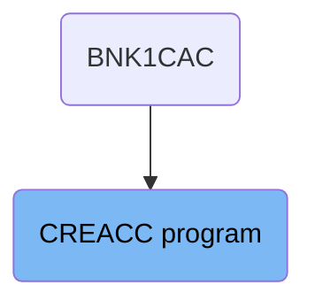

Here is a high level diagram of the program:

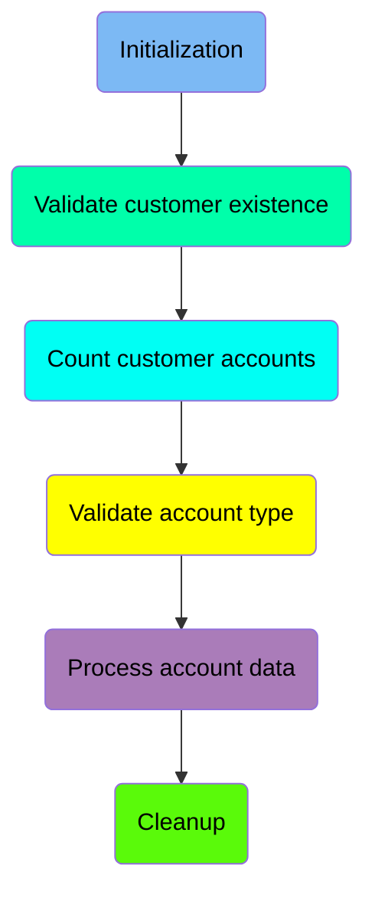

## Initialization

First, we'll zoom into this section of the flow:

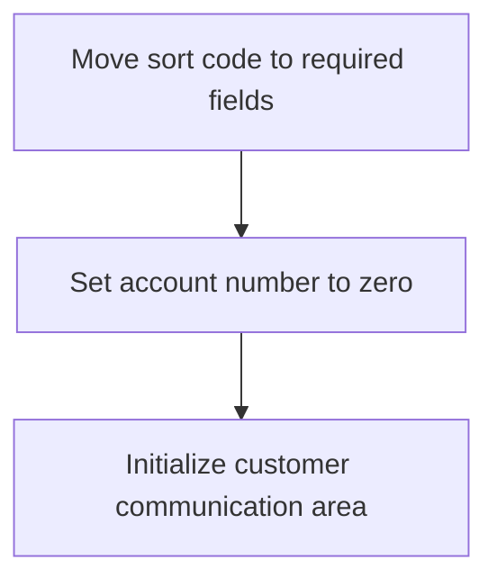

First, the sort code is moved to the required fields <SwmToken path="src/base/cobol_src/CREACC.cbl" pos="155:3:7" line-data="          03 REQUIRED-SORT-CODE             PIC 9(6) VALUE 0.">`REQUIRED-SORT-CODE`</SwmToken> and <SwmToken path="src/base/cobol_src/CREACC.cbl" pos="159:3:7" line-data="          03 REQUIRED-SORT-CODE2            PIC 9(6) VALUE 0.">`REQUIRED-SORT-CODE2`</SwmToken>. This ensures that the necessary sort code information is available for subsequent operations.

Moving to the next step, the account number is set to zero. This step is crucial as it initializes the account number field, preparing it for the creation of a new account.

## Validate customer existence

Now, lets zoom into this section of the flow:

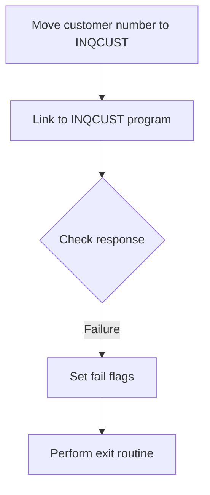

<SwmSnippet path="/src/base/cobol_src/CREACC.cbl" line="302">

---

First, the customer number is moved to the <SwmToken path="src/base/cobol_src/CREACC.cbl" pos="302:13:15" line-data="           MOVE COMM-CUSTNO IN DFHCOMMAREA TO INQCUST-CUSTNO.">`INQCUST-CUSTNO`</SwmToken> field to prepare for the customer inquiry.

```cobol
           MOVE COMM-CUSTNO IN DFHCOMMAREA TO INQCUST-CUSTNO.
```

---

</SwmSnippet>

<SwmSnippet path="/src/base/cobol_src/CREACC.cbl" line="304">

---

Next, the program links to the <SwmToken path="src/base/cobol_src/CREACC.cbl" pos="304:10:10" line-data="           EXEC CICS LINK PROGRAM(&#39;INQCUST &#39;)">`INQCUST`</SwmToken> program to validate the existence of the customer by passing the communication area and checking the response.

```cobol
           EXEC CICS LINK PROGRAM('INQCUST ')
                     COMMAREA(INQCUST-COMMAREA)
                     RESP(WS-CICS-RESP)
           END-EXEC.
```

---

</SwmSnippet>

<SwmSnippet path="/src/base/cobol_src/CREACC.cbl" line="314">

---

Then, the program checks if the response from <SwmToken path="src/base/cobol_src/CREACC.cbl" pos="315:3:3" line-data="           OR INQCUST-INQ-SUCCESS IS NOT EQUAL TO &#39;Y&#39;">`INQCUST`</SwmToken> is normal and if the customer inquiry was successful.

```cobol
           IF EIBRESP IS NOT EQUAL TO DFHRESP(NORMAL)
           OR INQCUST-INQ-SUCCESS IS NOT EQUAL TO 'Y'
```

---

</SwmSnippet>

<SwmSnippet path="/src/base/cobol_src/CREACC.cbl" line="317">

---

If the response is not normal or the inquiry was not successful, the program sets the fail flags in the communication area.

```cobol
             MOVE 'N' TO COMM-SUCCESS IN DFHCOMMAREA
             MOVE '1' TO COMM-FAIL-CODE IN DFHCOMMAREA
```

---

</SwmSnippet>

<SwmSnippet path="/src/base/cobol_src/CREACC.cbl" line="320">

---

Finally, the program performs the exit routine to handle the failure scenario.

```cobol
             PERFORM GET-ME-OUT-OF-HERE
```

---

</SwmSnippet>

## Count customer accounts

Now, lets zoom into this section of the flow:

```mermaid
graph TD
  A[Perform CUSTOMER-ACCOUNT-COUNT] --> B{Check WS-CICS-RESP}
  B -- Not Normal --> C[Display Error and Set Fail Flags]
  C --> D[Perform GET-ME-OUT-OF-HERE]
  B -- Normal --> E{Check COMM-SUCCESS in INQACCCU-COMMAREA}
  E -- N --> F[Display Error and Set Fail Flags]
  F --> G[Perform GET-ME-OUT-OF-HERE]
  E -- Y --> H{Check NUMBER-OF-ACCOUNTS in INQACCCU-COMMAREA}
  H -- > 9 --> I[Set Fail Flags for Too Many Accounts]
  I --> J[Perform GET-ME-OUT-OF-HERE]

%% Swimm:
%% graph TD
%%   A[Perform <SwmToken path="src/base/cobol_src/CREACC.cbl" pos="327:3:7" line-data="           PERFORM CUSTOMER-ACCOUNT-COUNT.">`CUSTOMER-ACCOUNT-COUNT`</SwmToken>] --> B{Check <SwmToken path="src/base/cobol_src/CREACC.cbl" pos="306:3:7" line-data="                     RESP(WS-CICS-RESP)">`WS-CICS-RESP`</SwmToken>}
%%   B -- Not Normal --> C[Display Error and Set Fail Flags]
%%   C --> D[Perform <SwmToken path="src/base/cobol_src/CREACC.cbl" pos="320:3:11" line-data="             PERFORM GET-ME-OUT-OF-HERE">`GET-ME-OUT-OF-HERE`</SwmToken>]
%%   B -- Normal --> E{Check <SwmToken path="src/base/cobol_src/CREACC.cbl" pos="317:9:11" line-data="             MOVE &#39;N&#39; TO COMM-SUCCESS IN DFHCOMMAREA">`COMM-SUCCESS`</SwmToken> in <SwmToken path="src/base/cobol_src/CREACC.cbl" pos="1082:15:17" line-data="           MOVE 20 TO NUMBER-OF-ACCOUNTS IN INQACCCU-COMMAREA.">`INQACCCU-COMMAREA`</SwmToken>}
%%   E -- N --> F[Display Error and Set Fail Flags]
%%   F --> G[Perform <SwmToken path="src/base/cobol_src/CREACC.cbl" pos="320:3:11" line-data="             PERFORM GET-ME-OUT-OF-HERE">`GET-ME-OUT-OF-HERE`</SwmToken>]
%%   E -- Y --> H{Check <SwmToken path="src/base/cobol_src/CREACC.cbl" pos="1082:7:11" line-data="           MOVE 20 TO NUMBER-OF-ACCOUNTS IN INQACCCU-COMMAREA.">`NUMBER-OF-ACCOUNTS`</SwmToken> in <SwmToken path="src/base/cobol_src/CREACC.cbl" pos="1082:15:17" line-data="           MOVE 20 TO NUMBER-OF-ACCOUNTS IN INQACCCU-COMMAREA.">`INQACCCU-COMMAREA`</SwmToken>}
%%   H -- > 9 --> I[Set Fail Flags for Too Many Accounts]
%%   I --> J[Perform <SwmToken path="src/base/cobol_src/CREACC.cbl" pos="320:3:11" line-data="             PERFORM GET-ME-OUT-OF-HERE">`GET-ME-OUT-OF-HERE`</SwmToken>]
```

First, the code performs the <SwmToken path="src/base/cobol_src/CREACC.cbl" pos="327:3:7" line-data="           PERFORM CUSTOMER-ACCOUNT-COUNT.">`CUSTOMER-ACCOUNT-COUNT`</SwmToken> operation to retrieve the number of accounts associated with a customer.

Next, it checks if <SwmToken path="src/base/cobol_src/CREACC.cbl" pos="306:3:7" line-data="                     RESP(WS-CICS-RESP)">`WS-CICS-RESP`</SwmToken> (the response code from the CICS operation) is not equal to <SwmToken path="src/base/cobol_src/CREACC.cbl" pos="314:13:16" line-data="           IF EIBRESP IS NOT EQUAL TO DFHRESP(NORMAL)">`DFHRESP(NORMAL)`</SwmToken> (indicating a normal response).

If the response is not normal, it displays an error message, sets the <SwmToken path="src/base/cobol_src/CREACC.cbl" pos="317:9:11" line-data="             MOVE &#39;N&#39; TO COMM-SUCCESS IN DFHCOMMAREA">`COMM-SUCCESS`</SwmToken> flag in <SwmToken path="src/base/cobol_src/CREACC.cbl" pos="302:9:9" line-data="           MOVE COMM-CUSTNO IN DFHCOMMAREA TO INQCUST-CUSTNO.">`DFHCOMMAREA`</SwmToken> and <SwmToken path="src/base/cobol_src/CREACC.cbl" pos="1082:15:17" line-data="           MOVE 20 TO NUMBER-OF-ACCOUNTS IN INQACCCU-COMMAREA.">`INQACCCU-COMMAREA`</SwmToken> to 'N', and sets the <SwmToken path="src/base/cobol_src/CREACC.cbl" pos="318:9:13" line-data="             MOVE &#39;1&#39; TO COMM-FAIL-CODE IN DFHCOMMAREA">`COMM-FAIL-CODE`</SwmToken> to '9'.

Then, it performs the <SwmToken path="src/base/cobol_src/CREACC.cbl" pos="320:3:11" line-data="             PERFORM GET-ME-OUT-OF-HERE">`GET-ME-OUT-OF-HERE`</SwmToken> operation to exit the process due to the error.

Moving to the next condition, it checks if <SwmToken path="src/base/cobol_src/CREACC.cbl" pos="317:9:11" line-data="             MOVE &#39;N&#39; TO COMM-SUCCESS IN DFHCOMMAREA">`COMM-SUCCESS`</SwmToken> in <SwmToken path="src/base/cobol_src/CREACC.cbl" pos="1082:15:17" line-data="           MOVE 20 TO NUMBER-OF-ACCOUNTS IN INQACCCU-COMMAREA.">`INQACCCU-COMMAREA`</SwmToken> is 'N' (indicating a failure in the account counting operation).

If the account counting operation failed, it displays an error message, sets the <SwmToken path="src/base/cobol_src/CREACC.cbl" pos="317:9:11" line-data="             MOVE &#39;N&#39; TO COMM-SUCCESS IN DFHCOMMAREA">`COMM-SUCCESS`</SwmToken> flag in <SwmToken path="src/base/cobol_src/CREACC.cbl" pos="302:9:9" line-data="           MOVE COMM-CUSTNO IN DFHCOMMAREA TO INQCUST-CUSTNO.">`DFHCOMMAREA`</SwmToken> to 'N', and sets the <SwmToken path="src/base/cobol_src/CREACC.cbl" pos="318:9:13" line-data="             MOVE &#39;1&#39; TO COMM-FAIL-CODE IN DFHCOMMAREA">`COMM-FAIL-CODE`</SwmToken> to '9'.

## Validate account type

Now, lets zoom into this section of the flow:

```mermaid
graph TD
  A[Perform Account Type Check] --> B{Is COMM-SUCCESS 'N'?}
  B -- Yes --> C[Perform Get Me Out Of Here]

%% Swimm:
%% graph TD
%%   A[Perform Account Type Check] --> B{Is <SwmToken path="src/base/cobol_src/CREACC.cbl" pos="317:9:11" line-data="             MOVE &#39;N&#39; TO COMM-SUCCESS IN DFHCOMMAREA">`COMM-SUCCESS`</SwmToken> 'N'?}
%%   B -- Yes --> C[Perform Get Me Out Of Here]
```

<SwmSnippet path="/src/base/cobol_src/CREACC.cbl" line="357">

---

First, the function performs an account type check to validate the type of account, such as a mortgage.

```cobol
           PERFORM ACCOUNT-TYPE-CHECK
```

---

</SwmSnippet>

<SwmSnippet path="/src/base/cobol_src/CREACC.cbl" line="359">

---

Next, it checks if <SwmToken path="src/base/cobol_src/CREACC.cbl" pos="359:3:5" line-data="           IF COMM-SUCCESS OF DFHCOMMAREA = &#39;N&#39;">`COMM-SUCCESS`</SwmToken> (which indicates the success status of the communication area) is 'N'. If it is, the function performs the <SwmToken path="src/base/cobol_src/CREACC.cbl" pos="360:3:11" line-data="             PERFORM GET-ME-OUT-OF-HERE">`GET-ME-OUT-OF-HERE`</SwmToken> operation to handle the error scenario.

```cobol
           IF COMM-SUCCESS OF DFHCOMMAREA = 'N'
             PERFORM GET-ME-OUT-OF-HERE
           END-IF
```

---

</SwmSnippet>

## Process account data

Now, lets zoom into this section of the flow:

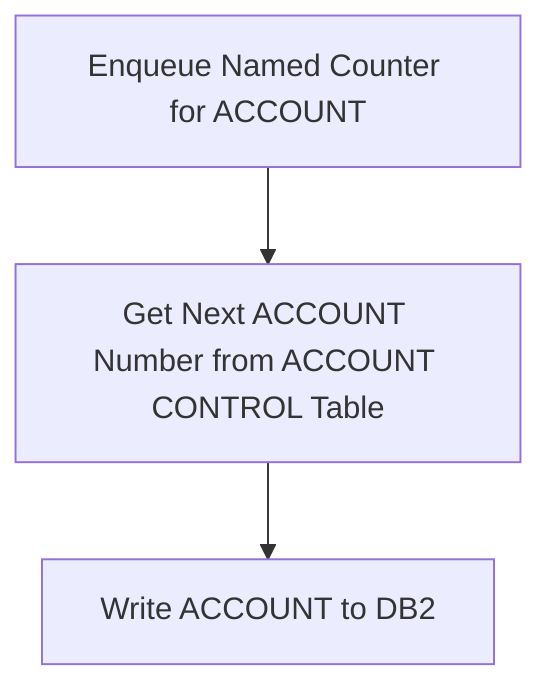

<SwmSnippet path="/src/base/cobol_src/CREACC.cbl" line="369">

---

First, the system enqueues the named counter for the account, ensuring that the account number generation process is synchronized and unique.

```cobol
           PERFORM ENQ-NAMED-COUNTER.
```

---

</SwmSnippet>

<SwmSnippet path="/src/base/cobol_src/CREACC.cbl" line="374">

---

Next, the system retrieves the next available account number from the account control table, which is essential for creating a new account with a unique identifier.

```cobol
           PERFORM FIND-NEXT-ACCOUNT.
```

---

</SwmSnippet>

<SwmSnippet path="/src/base/cobol_src/CREACC.cbl" line="376">

---

Finally, the system writes the new account information to the <SwmToken path="src/base/cobol_src/CREACC.cbl" pos="376:7:7" line-data="           PERFORM WRITE-ACCOUNT-DB2">`DB2`</SwmToken> database, completing the process of creating a new account for the customer.

```cobol
           PERFORM WRITE-ACCOUNT-DB2
```

---

</SwmSnippet>

## Cleanup

This is the next section of the flow.

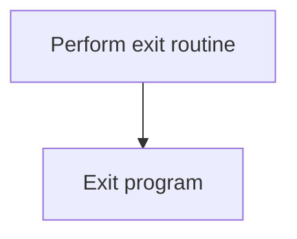

<SwmSnippet path="/src/base/cobol_src/CREACC.cbl" line="379">

---

The <SwmToken path="src/base/cobol_src/CREACC.cbl" pos="379:1:11" line-data="           PERFORM GET-ME-OUT-OF-HERE.">`PERFORM GET-ME-OUT-OF-HERE`</SwmToken> statement is used to execute an exit routine. This routine is typically designed to handle any necessary cleanup or finalization tasks before the program terminates. After performing the exit routine, the <SwmToken path="src/base/cobol_src/CREACC.cbl" pos="381:1:2" line-data="       P999.">`P999.`</SwmToken> label is reached, which is a common convention for marking the end of a COBOL program. Finally, the <SwmToken path="src/base/cobol_src/CREACC.cbl" pos="382:1:1" line-data="           EXIT.">`EXIT`</SwmToken> statement is executed to terminate the program flow, ensuring that control is properly returned to the calling environment.

```cobol
           PERFORM GET-ME-OUT-OF-HERE.

       P999.
           EXIT.
```

---

</SwmSnippet>

## Interim Summary

So far, we saw how the system processes account data by enqueuing the named counter, retrieving the next available account number, and writing the new account information to the <SwmToken path="src/base/cobol_src/CREACC.cbl" pos="376:7:7" line-data="           PERFORM WRITE-ACCOUNT-DB2">`DB2`</SwmToken> database. This ensures that each new account is created with a unique identifier and properly stored in the database. Now, we will focus on the cleanup process, which involves performing an exit routine and terminating the program flow.

## <SwmToken path="src/base/cobol_src/CREACC.cbl" pos="320:3:11" line-data="             PERFORM GET-ME-OUT-OF-HERE">`GET-ME-OUT-OF-HERE`</SwmToken>

Lets' zoom into this section of the flow:

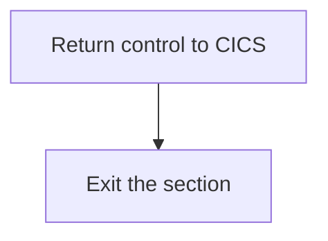

<SwmSnippet path="/src/base/cobol_src/CREACC.cbl" line="1068">

---

First, the <SwmToken path="src/base/cobol_src/CREACC.cbl" pos="1068:1:9" line-data="       GET-ME-OUT-OF-HERE SECTION.">`GET-ME-OUT-OF-HERE`</SwmToken> section initiates the process of returning control to CICS. This is crucial for ensuring that the current process is properly terminated and control is handed back to the CICS environment.

```cobol
       GET-ME-OUT-OF-HERE SECTION.
       GMOFH010.
      *
      *    Finish
      *
           EXEC CICS RETURN
```

---

</SwmSnippet>

<SwmSnippet path="/src/base/cobol_src/CREACC.cbl" line="1073">

---

Next, the <SwmToken path="src/base/cobol_src/CREACC.cbl" pos="1073:1:5" line-data="           EXEC CICS RETURN">`EXEC CICS RETURN`</SwmToken> command is executed. This command is responsible for signaling to CICS that the program has completed its task and is ready to return control. This ensures that any resources allocated during the process are properly released and the system can continue with other tasks.

```cobol
           EXEC CICS RETURN
           END-EXEC.
```

---

</SwmSnippet>

<SwmSnippet path="/src/base/cobol_src/CREACC.cbl" line="1076">

---

Then, the section reaches the <SwmToken path="src/base/cobol_src/CREACC.cbl" pos="1077:1:1" line-data="           EXIT.">`EXIT`</SwmToken> statement, which marks the end of the <SwmToken path="src/base/cobol_src/CREACC.cbl" pos="320:3:11" line-data="             PERFORM GET-ME-OUT-OF-HERE">`GET-ME-OUT-OF-HERE`</SwmToken> section. This final step ensures that the section is exited cleanly, completing the process of returning control to CICS.

```cobol
       GMOFH999.
           EXIT.
```

---

</SwmSnippet>

## <SwmToken path="src/base/cobol_src/CREACC.cbl" pos="327:3:7" line-data="           PERFORM CUSTOMER-ACCOUNT-COUNT.">`CUSTOMER-ACCOUNT-COUNT`</SwmToken>

Lets' zoom into this section of the flow:

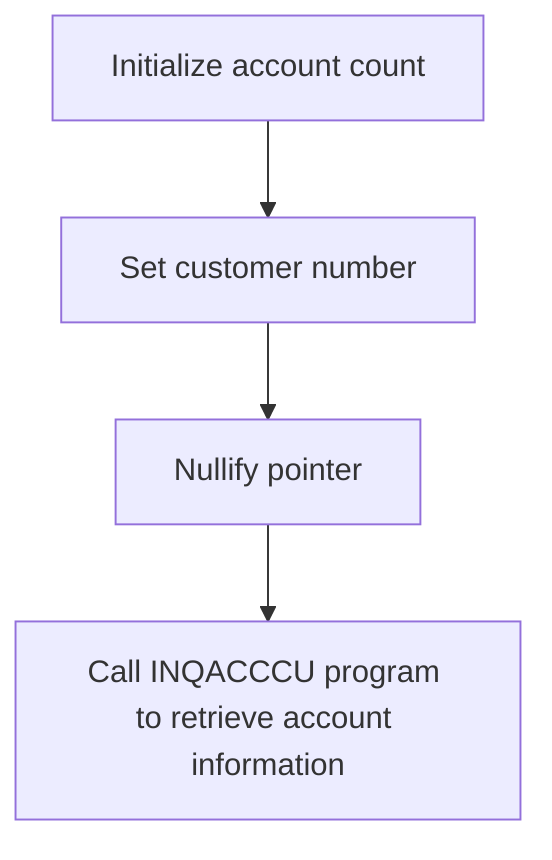

<SwmSnippet path="/src/base/cobol_src/CREACC.cbl" line="1082">

---

First, the number of accounts is initialized to 20 by moving the value 20 to <SwmToken path="src/base/cobol_src/CREACC.cbl" pos="1082:7:11" line-data="           MOVE 20 TO NUMBER-OF-ACCOUNTS IN INQACCCU-COMMAREA.">`NUMBER-OF-ACCOUNTS`</SwmToken> in <SwmToken path="src/base/cobol_src/CREACC.cbl" pos="1082:15:17" line-data="           MOVE 20 TO NUMBER-OF-ACCOUNTS IN INQACCCU-COMMAREA.">`INQACCCU-COMMAREA`</SwmToken>.

```cobol
           MOVE 20 TO NUMBER-OF-ACCOUNTS IN INQACCCU-COMMAREA.
```

---

</SwmSnippet>

<SwmSnippet path="/src/base/cobol_src/CREACC.cbl" line="1083">

---

Next, the customer number from <SwmToken path="src/base/cobol_src/CREACC.cbl" pos="1083:9:9" line-data="           MOVE COMM-CUSTNO IN DFHCOMMAREA">`DFHCOMMAREA`</SwmToken> is moved to <SwmToken path="src/base/cobol_src/CREACC.cbl" pos="1084:3:5" line-data="             TO CUSTOMER-NUMBER IN INQACCCU-COMMAREA.">`CUSTOMER-NUMBER`</SwmToken> in <SwmToken path="src/base/cobol_src/CREACC.cbl" pos="1084:9:11" line-data="             TO CUSTOMER-NUMBER IN INQACCCU-COMMAREA.">`INQACCCU-COMMAREA`</SwmToken> to identify the customer whose accounts are being counted.

```cobol
           MOVE COMM-CUSTNO IN DFHCOMMAREA
             TO CUSTOMER-NUMBER IN INQACCCU-COMMAREA.
```

---

</SwmSnippet>

<SwmSnippet path="/src/base/cobol_src/CREACC.cbl" line="1086">

---

Then, the pointer <SwmToken path="src/base/cobol_src/CREACC.cbl" pos="1086:3:7" line-data="           SET COMM-PCB-POINTER TO NULL">`COMM-PCB-POINTER`</SwmToken> is set to null to ensure no previous pointer values interfere with the current operation. Finally, the <SwmToken path="src/base/cobol_src/CREACC.cbl" pos="1088:10:10" line-data="           EXEC CICS LINK PROGRAM(&#39;INQACCCU&#39;)">`INQACCCU`</SwmToken> program is called using the CICS <SwmToken path="src/base/cobol_src/CREACC.cbl" pos="1088:5:5" line-data="           EXEC CICS LINK PROGRAM(&#39;INQACCCU&#39;)">`LINK`</SwmToken> command to retrieve the account information for the specified customer.

More about INQACCCU: <SwmLink doc-title="Fetching Account (INQACCCU)">[Fetching Account (INQACCCU)](/.swm/fetching-account-inqacccu.rlhpjqor.sw.md)</SwmLink>

```cobol
           SET COMM-PCB-POINTER TO NULL

           EXEC CICS LINK PROGRAM('INQACCCU')
                COMMAREA(INQACCCU-COMMAREA)
                RESP(WS-CICS-RESP)
                SYNCONRETURN
           END-EXEC.
```

---

</SwmSnippet>

## <SwmToken path="src/base/cobol_src/CREACC.cbl" pos="357:3:7" line-data="           PERFORM ACCOUNT-TYPE-CHECK">`ACCOUNT-TYPE-CHECK`</SwmToken>

Lets' zoom into this section of the flow:

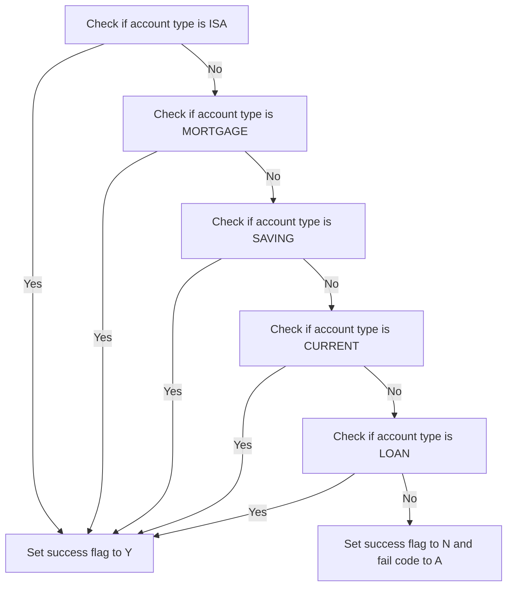

<SwmSnippet path="/src/base/cobol_src/CREACC.cbl" line="1209">

---

First, the function <SwmToken path="src/base/cobol_src/CREACC.cbl" pos="1209:1:5" line-data="       ACCOUNT-TYPE-CHECK SECTION.">`ACCOUNT-TYPE-CHECK`</SwmToken> evaluates the account type provided in the <SwmToken path="src/base/cobol_src/CREACC.cbl" pos="1216:11:11" line-data="              WHEN COMM-ACC-TYPE IN DFHCOMMAREA(1:3) = &#39;ISA&#39;">`DFHCOMMAREA`</SwmToken> to determine if it matches any of the valid account types: 'ISA', 'MORTGAGE', 'SAVING', 'CURRENT', or 'LOAN'.

```cobol
       ACCOUNT-TYPE-CHECK SECTION.
       ATC010.
      *
      *    Validate that only ISA, MORTGAGE, SAVING, CURRENT and LOAN
      *    are the only account types available.
      *
           EVALUATE TRUE
              WHEN COMM-ACC-TYPE IN DFHCOMMAREA(1:3) = 'ISA'
              WHEN COMM-ACC-TYPE IN DFHCOMMAREA(1:8) = 'MORTGAGE'
              WHEN COMM-ACC-TYPE IN DFHCOMMAREA(1:6) = 'SAVING'
              WHEN COMM-ACC-TYPE IN DFHCOMMAREA(1:7) = 'CURRENT'
              WHEN COMM-ACC-TYPE IN DFHCOMMAREA(1:4) = 'LOAN'
```

---

</SwmSnippet>

<SwmSnippet path="/src/base/cobol_src/CREACC.cbl" line="1221">

---

Next, if the account type matches any of the valid types, the function sets the <SwmToken path="src/base/cobol_src/CREACC.cbl" pos="1221:9:11" line-data="                 MOVE &#39;Y&#39; TO COMM-SUCCESS OF DFHCOMMAREA">`COMM-SUCCESS`</SwmToken> flag in the <SwmToken path="src/base/cobol_src/CREACC.cbl" pos="1221:15:15" line-data="                 MOVE &#39;Y&#39; TO COMM-SUCCESS OF DFHCOMMAREA">`DFHCOMMAREA`</SwmToken> to 'Y', indicating a successful validation.

```cobol
                 MOVE 'Y' TO COMM-SUCCESS OF DFHCOMMAREA
```

---

</SwmSnippet>

<SwmSnippet path="/src/base/cobol_src/CREACC.cbl" line="1222">

---

Then, if the account type does not match any of the valid types, the function sets the <SwmToken path="src/base/cobol_src/CREACC.cbl" pos="1223:9:11" line-data="                 MOVE &#39;N&#39; TO COMM-SUCCESS OF DFHCOMMAREA">`COMM-SUCCESS`</SwmToken> flag to 'N' and the <SwmToken path="src/base/cobol_src/CREACC.cbl" pos="1224:9:13" line-data="                 MOVE &#39;A&#39; TO COMM-FAIL-CODE IN DFHCOMMAREA">`COMM-FAIL-CODE`</SwmToken> to 'A' in the <SwmToken path="src/base/cobol_src/CREACC.cbl" pos="1223:15:15" line-data="                 MOVE &#39;N&#39; TO COMM-SUCCESS OF DFHCOMMAREA">`DFHCOMMAREA`</SwmToken>, indicating a failed validation.

```cobol
              WHEN OTHER
                 MOVE 'N' TO COMM-SUCCESS OF DFHCOMMAREA
                 MOVE 'A' TO COMM-FAIL-CODE IN DFHCOMMAREA
           END-EVALUATE.
```

---

</SwmSnippet>

## <SwmToken path="src/base/cobol_src/CREACC.cbl" pos="369:3:7" line-data="           PERFORM ENQ-NAMED-COUNTER.">`ENQ-NAMED-COUNTER`</SwmToken>

Lets' zoom into this section of the flow:

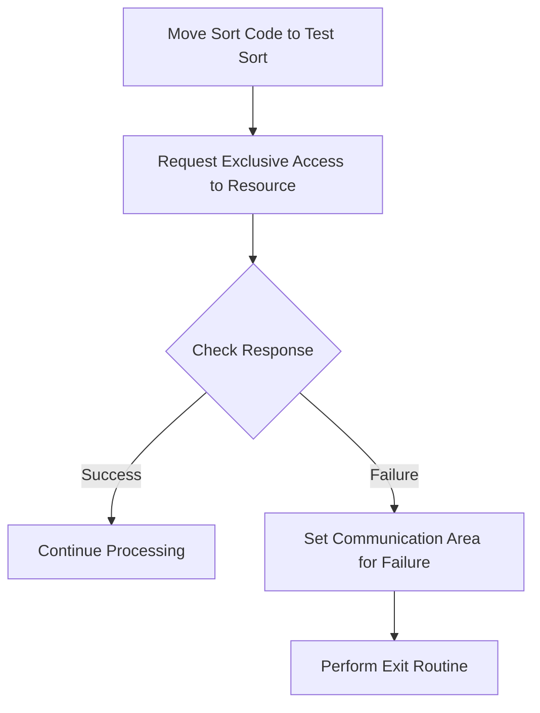

<SwmSnippet path="/src/base/cobol_src/CREACC.cbl" line="388">

---

First, the <SwmToken path="src/base/cobol_src/CREACC.cbl" pos="388:3:3" line-data="           MOVE SORTCODE TO NCS-ACC-NO-TEST-SORT.">`SORTCODE`</SwmToken> is moved to <SwmToken path="src/base/cobol_src/CREACC.cbl" pos="388:7:15" line-data="           MOVE SORTCODE TO NCS-ACC-NO-TEST-SORT.">`NCS-ACC-NO-TEST-SORT`</SwmToken>, which prepares the sort code for the subsequent operations.

```cobol
           MOVE SORTCODE TO NCS-ACC-NO-TEST-SORT.
```

---

</SwmSnippet>

<SwmSnippet path="/src/base/cobol_src/CREACC.cbl" line="390">

---

Next, an exclusive lock is requested on the resource identified by <SwmToken path="src/base/cobol_src/CREACC.cbl" pos="391:3:9" line-data="              RESOURCE(NCS-ACC-NO-NAME)">`NCS-ACC-NO-NAME`</SwmToken> to ensure that no other process can access it simultaneously.

```cobol
           EXEC CICS ENQ
              RESOURCE(NCS-ACC-NO-NAME)
              LENGTH(16)
              RESP(WS-CICS-RESP)
              RESP2(WS-CICS-RESP2)
           END-EXEC.
```

---

</SwmSnippet>

<SwmSnippet path="/src/base/cobol_src/CREACC.cbl" line="397">

---

Then, the response from the lock request is checked. If the response is not normal, it indicates a failure in acquiring the lock.

```cobol
           IF WS-CICS-RESP NOT = DFHRESP(NORMAL)
```

---

</SwmSnippet>

<SwmSnippet path="/src/base/cobol_src/CREACC.cbl" line="398">

---

In case of failure, the communication area is updated to reflect the failure by setting <SwmToken path="src/base/cobol_src/CREACC.cbl" pos="398:9:11" line-data="             MOVE &#39;N&#39; TO COMM-SUCCESS IN DFHCOMMAREA">`COMM-SUCCESS`</SwmToken> to 'N' and <SwmToken path="src/base/cobol_src/CREACC.cbl" pos="399:9:13" line-data="             MOVE &#39;3&#39; TO COMM-FAIL-CODE IN DFHCOMMAREA">`COMM-FAIL-CODE`</SwmToken> to '3', and the exit routine <SwmToken path="src/base/cobol_src/CREACC.cbl" pos="400:3:11" line-data="             PERFORM GET-ME-OUT-OF-HERE">`GET-ME-OUT-OF-HERE`</SwmToken> is performed to handle the error.

```cobol
             MOVE 'N' TO COMM-SUCCESS IN DFHCOMMAREA
             MOVE '3' TO COMM-FAIL-CODE IN DFHCOMMAREA
             PERFORM GET-ME-OUT-OF-HERE
           END-IF.
```

---

</SwmSnippet>

# Assign account number (<SwmToken path="src/base/cobol_src/CREACC.cbl" pos="374:3:7" line-data="           PERFORM FIND-NEXT-ACCOUNT.">`FIND-NEXT-ACCOUNT`</SwmToken>)

Let's split this section into smaller parts:

```mermaid
graph TD
m70dz("Initialize and prepare control for SELECT"):::a17fd2430  --> 
9fsd8("Handle SELECT errors"):::a566033c2  --> 
47doz("Successful SELECT, update control values"):::aced6c5c1  --> 
hpog4("Prepare control for ACCOUNT-COUNT SELECT"):::aa55968a5  --> 
c89q4("Handle ACCOUNT-COUNT SELECT errors"):::ae85d3b64  --> 
xiia9("Successful ACCOUNT-COUNT SELECT, update control values"):::af8e7b712 
id1>"Assign account number (`FIND-NEXT-ACCOUNT`)"]:::af5b17785
classDef af5b17785 color:#000000,fill:#7CB9F4
classDef a17fd2430 color:#000000,fill:#7CB9F4
classDef a566033c2 color:#000000,fill:#00FFAA
classDef aced6c5c1 color:#000000,fill:#00FFF4
classDef aa55968a5 color:#000000,fill:#FFFF00
classDef ae85d3b64 color:#000000,fill:#AA7CB9
classDef af8e7b712 color:#000000,fill:#5afa0a

%% Swimm:
%% graph TD
%% m70dz("Initialize and prepare control for SELECT"):::a17fd2430  --> 
%% 9fsd8("Handle SELECT errors"):::a566033c2  --> 
%% 47doz("Successful SELECT, update control values"):::aced6c5c1  --> 
%% hpog4("Prepare control for <SwmToken path="src/base/cobol_src/CREACC.cbl" pos="609:2:4" line-data="           &#39;ACCOUNT-COUNT&#39; DELIMITED BY SIZE">`ACCOUNT-COUNT`</SwmToken> SELECT"):::aa55968a5  --> 
%% c89q4("Handle <SwmToken path="src/base/cobol_src/CREACC.cbl" pos="609:2:4" line-data="           &#39;ACCOUNT-COUNT&#39; DELIMITED BY SIZE">`ACCOUNT-COUNT`</SwmToken> SELECT errors"):::ae85d3b64  --> 
%% xiia9("Successful <SwmToken path="src/base/cobol_src/CREACC.cbl" pos="609:2:4" line-data="           &#39;ACCOUNT-COUNT&#39; DELIMITED BY SIZE">`ACCOUNT-COUNT`</SwmToken> SELECT, update control values"):::af8e7b712 
%% id1>"Assign account number (`<SwmToken path="src/base/cobol_src/CREACC.cbl" pos="374:3:7" line-data="           PERFORM FIND-NEXT-ACCOUNT.">`FIND-NEXT-ACCOUNT`</SwmToken>`)"]:::af5b17785
%% classDef af5b17785 color:#000000,fill:#7CB9F4
%% classDef a17fd2430 color:#000000,fill:#7CB9F4
%% classDef a566033c2 color:#000000,fill:#00FFAA
%% classDef aced6c5c1 color:#000000,fill:#00FFF4
%% classDef aa55968a5 color:#000000,fill:#FFFF00
%% classDef ae85d3b64 color:#000000,fill:#AA7CB9
%% classDef af8e7b712 color:#000000,fill:#5afa0a
```

## Initialize and prepare control for SELECT

First, we'll zoom into this section of the flow:

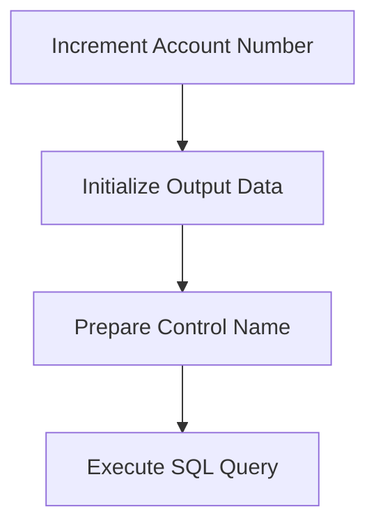

<SwmSnippet path="/src/base/cobol_src/CREACC.cbl" line="432">

---

First, the account number increment is set to 1, indicating that we are looking for the next account number.

```cobol
           MOVE 1 TO NCS-ACC-NO-INC.
```

---

</SwmSnippet>

<SwmSnippet path="/src/base/cobol_src/CREACC.cbl" line="434">

---

Next, the output data is initialized to ensure that any previous data does not interfere with the current operation.

```cobol
           INITIALIZE OUTPUT-DATA.
```

---

</SwmSnippet>

## Handle SELECT errors

Now, lets zoom into this section of the flow:

```mermaid
graph TD
  A[Check SQLCODE] -->|SQLCODE != 0| B[Initialize ABNDINFO-REC]
  B --> C[Move EIBRESP to ABND-RESPCODE]
  C --> D[Move EIBRESP2 to ABND-RESP2CODE]
  D --> E[Assign APPLID to ABND-APPLID]
  E --> F[Move EIBTASKN to ABND-TASKNO-KEY]
  F --> G[Move EIBTRNID to ABND-TRANID]
  G --> H[Perform POPULATE-TIME-DATE2]
  H --> I[Move WS-ORIG-DATE to ABND-DATE]
  I --> J[Format and move current time to ABND-TIME]
  J --> K[Move WS-U-TIME to ABND-UTIME-KEY]
  K --> L[Move 'HNCS' to ABND-CODE]
  L --> M[Assign PROGRAM to ABND-PROGRAM]
  M --> N[Move SQLCODE-DISPLAY to ABND-SQLCODE]
  N --> O[Format and move error message to ABND-FREEFORM]
  O --> P[Link to Abend Handler program]
  P --> Q[Display error message]
  Q --> R[Trigger CICS ABEND]

%% Swimm:
%% graph TD
%%   A[Check SQLCODE] -->|SQLCODE != 0| B[Initialize <SwmToken path="src/base/cobol_src/CREACC.cbl" pos="543:3:5" line-data="               INITIALIZE ABNDINFO-REC">`ABNDINFO-REC`</SwmToken>]
%%   B --> C[Move EIBRESP to <SwmToken path="src/base/cobol_src/CREACC.cbl" pos="544:7:9" line-data="               MOVE EIBRESP    TO ABND-RESPCODE">`ABND-RESPCODE`</SwmToken>]
%%   C --> D[Move <SwmToken path="src/base/cobol_src/CREACC.cbl" pos="545:3:3" line-data="               MOVE EIBRESP2   TO ABND-RESP2CODE">`EIBRESP2`</SwmToken> to <SwmToken path="src/base/cobol_src/CREACC.cbl" pos="545:7:9" line-data="               MOVE EIBRESP2   TO ABND-RESP2CODE">`ABND-RESP2CODE`</SwmToken>]
%%   D --> E[Assign APPLID to <SwmToken path="src/base/cobol_src/CREACC.cbl" pos="549:9:11" line-data="               EXEC CICS ASSIGN APPLID(ABND-APPLID)">`ABND-APPLID`</SwmToken>]
%%   E --> F[Move EIBTASKN to <SwmToken path="src/base/cobol_src/CREACC.cbl" pos="552:7:11" line-data="               MOVE EIBTASKN   TO ABND-TASKNO-KEY">`ABND-TASKNO-KEY`</SwmToken>]
%%   F --> G[Move EIBTRNID to <SwmToken path="src/base/cobol_src/CREACC.cbl" pos="553:7:9" line-data="               MOVE EIBTRNID   TO ABND-TRANID">`ABND-TRANID`</SwmToken>]
%%   G --> H[Perform <SwmToken path="src/base/cobol_src/CREACC.cbl" pos="720:3:7" line-data="               PERFORM POPULATE-TIME-DATE2">`POPULATE-TIME-DATE2`</SwmToken>]
%%   H --> I[Move <SwmToken path="src/base/cobol_src/CREACC.cbl" pos="557:3:7" line-data="               MOVE WS-ORIG-DATE TO ABND-DATE">`WS-ORIG-DATE`</SwmToken> to <SwmToken path="src/base/cobol_src/CREACC.cbl" pos="557:11:13" line-data="               MOVE WS-ORIG-DATE TO ABND-DATE">`ABND-DATE`</SwmToken>]
%%   I --> J[Format and move current time to <SwmToken path="src/base/cobol_src/CREACC.cbl" pos="563:3:5" line-data="                     INTO ABND-TIME">`ABND-TIME`</SwmToken>]
%%   J --> K[Move <SwmToken path="src/base/cobol_src/CREACC.cbl" pos="566:3:7" line-data="               MOVE WS-U-TIME   TO ABND-UTIME-KEY">`WS-U-TIME`</SwmToken> to <SwmToken path="src/base/cobol_src/CREACC.cbl" pos="566:11:15" line-data="               MOVE WS-U-TIME   TO ABND-UTIME-KEY">`ABND-UTIME-KEY`</SwmToken>]
%%   K --> L[Move 'HNCS' to <SwmToken path="src/base/cobol_src/CREACC.cbl" pos="567:9:11" line-data="               MOVE &#39;HNCS&#39;      TO ABND-CODE">`ABND-CODE`</SwmToken>]
%%   L --> M[Assign PROGRAM to <SwmToken path="src/base/cobol_src/CREACC.cbl" pos="569:9:11" line-data="               EXEC CICS ASSIGN PROGRAM(ABND-PROGRAM)">`ABND-PROGRAM`</SwmToken>]
%%   M --> N[Move <SwmToken path="src/base/cobol_src/CREACC.cbl" pos="522:9:11" line-data="      D      MOVE SQLCODE TO SQLCODE-DISPLAY">`SQLCODE-DISPLAY`</SwmToken> to <SwmToken path="src/base/cobol_src/CREACC.cbl" pos="494:9:11" line-data="             MOVE SQLCODE-DISPLAY    TO ABND-SQLCODE">`ABND-SQLCODE`</SwmToken>]
%%   N --> O[Format and move error message to <SwmToken path="src/base/cobol_src/CREACC.cbl" pos="505:3:5" line-data="                    INTO ABND-FREEFORM">`ABND-FREEFORM`</SwmToken>]
%%   O --> P[Link to Abend Handler program]
%%   P --> Q[Display error message]
%%   Q --> R[Trigger CICS ABEND]
```

First, the function checks if <SwmToken path="src/base/cobol_src/CREACC.cbl" pos="522:5:5" line-data="      D      MOVE SQLCODE TO SQLCODE-DISPLAY">`SQLCODE`</SwmToken> (the SQL return code) is not equal to zero, indicating an error in the database operation.

Moving to the next step, it initializes the <SwmToken path="src/base/cobol_src/CREACC.cbl" pos="543:3:5" line-data="               INITIALIZE ABNDINFO-REC">`ABNDINFO-REC`</SwmToken> (abend information record) to prepare for capturing error details.

Next, it moves <SwmToken path="src/base/cobol_src/CREACC.cbl" pos="314:3:3" line-data="           IF EIBRESP IS NOT EQUAL TO DFHRESP(NORMAL)">`EIBRESP`</SwmToken> (the CICS response code) to <SwmToken path="src/base/cobol_src/CREACC.cbl" pos="544:7:9" line-data="               MOVE EIBRESP    TO ABND-RESPCODE">`ABND-RESPCODE`</SwmToken> and <SwmToken path="src/base/cobol_src/CREACC.cbl" pos="545:3:3" line-data="               MOVE EIBRESP2   TO ABND-RESP2CODE">`EIBRESP2`</SwmToken> (the secondary CICS response code) to <SwmToken path="src/base/cobol_src/CREACC.cbl" pos="545:7:9" line-data="               MOVE EIBRESP2   TO ABND-RESP2CODE">`ABND-RESP2CODE`</SwmToken> to preserve the response codes.

Then, it assigns the application ID to <SwmToken path="src/base/cobol_src/CREACC.cbl" pos="549:9:11" line-data="               EXEC CICS ASSIGN APPLID(ABND-APPLID)">`ABND-APPLID`</SwmToken> to capture the application context.

Going into the next steps, it moves <SwmToken path="src/base/cobol_src/CREACC.cbl" pos="552:3:3" line-data="               MOVE EIBTASKN   TO ABND-TASKNO-KEY">`EIBTASKN`</SwmToken> (the task number) to <SwmToken path="src/base/cobol_src/CREACC.cbl" pos="552:7:11" line-data="               MOVE EIBTASKN   TO ABND-TASKNO-KEY">`ABND-TASKNO-KEY`</SwmToken> and <SwmToken path="src/base/cobol_src/CREACC.cbl" pos="553:3:3" line-data="               MOVE EIBTRNID   TO ABND-TRANID">`EIBTRNID`</SwmToken> (the transaction ID) to <SwmToken path="src/base/cobol_src/CREACC.cbl" pos="553:7:9" line-data="               MOVE EIBTRNID   TO ABND-TRANID">`ABND-TRANID`</SwmToken> to capture the task and transaction identifiers.

It then performs <SwmToken path="src/base/cobol_src/CREACC.cbl" pos="720:3:7" line-data="               PERFORM POPULATE-TIME-DATE2">`POPULATE-TIME-DATE2`</SwmToken> to get the current date and time, and moves <SwmToken path="src/base/cobol_src/CREACC.cbl" pos="557:3:7" line-data="               MOVE WS-ORIG-DATE TO ABND-DATE">`WS-ORIG-DATE`</SwmToken> to <SwmToken path="src/base/cobol_src/CREACC.cbl" pos="557:11:13" line-data="               MOVE WS-ORIG-DATE TO ABND-DATE">`ABND-DATE`</SwmToken>.

Next, it formats the current time and moves it to <SwmToken path="src/base/cobol_src/CREACC.cbl" pos="563:3:5" line-data="                     INTO ABND-TIME">`ABND-TIME`</SwmToken> to capture the exact time of the error.

Moving forward, it assigns the user time to <SwmToken path="src/base/cobol_src/CREACC.cbl" pos="566:11:15" line-data="               MOVE WS-U-TIME   TO ABND-UTIME-KEY">`ABND-UTIME-KEY`</SwmToken> and sets the abend code to 'HNCS' in <SwmToken path="src/base/cobol_src/CREACC.cbl" pos="567:9:11" line-data="               MOVE &#39;HNCS&#39;      TO ABND-CODE">`ABND-CODE`</SwmToken>.

## Successful SELECT, update control values

Now, lets zoom into this section of the flow:

```mermaid
graph TD
  A[Move SQLCODE to SQLCODE-DISPLAY] --> B[Display SQLCODE and HV-CONTROL-VALUE-NUM]
  B --> C[Increment HV-CONTROL-VALUE-NUM]
  C --> D[Update CONTROL table with new HV-CONTROL-VALUE-NUM]
  D --> E{SQLCODE is not zero?}
  E -- Yes --> F[Initialize ABNDINFO-REC]
  F --> G[Move EIBRESP and EIBRESP2 to ABND-RESPCODE and ABND-RESP2CODE]
  G --> H[Get supplemental information]
  H --> I[Move task and transaction details to ABNDINFO-REC]
  I --> J[Perform POPULATE-TIME-DATE2]
  J --> K[Move date and time to ABNDINFO-REC]
  K --> L[Move additional information to ABNDINFO-REC]
  L --> M[Link to Abend Handler program]
  M --> N[Display error message]
  N --> O[Trigger CICS ABEND]

%% Swimm:
%% graph TD
%%   A[Move SQLCODE to <SwmToken path="src/base/cobol_src/CREACC.cbl" pos="522:9:11" line-data="      D      MOVE SQLCODE TO SQLCODE-DISPLAY">`SQLCODE-DISPLAY`</SwmToken>] --> B[Display SQLCODE and <SwmToken path="src/base/cobol_src/CREACC.cbl" pos="524:3:9" line-data="      D        HV-CONTROL-VALUE-NUM">`HV-CONTROL-VALUE-NUM`</SwmToken>]
%%   B --> C[Increment <SwmToken path="src/base/cobol_src/CREACC.cbl" pos="524:3:9" line-data="      D        HV-CONTROL-VALUE-NUM">`HV-CONTROL-VALUE-NUM`</SwmToken>]
%%   C --> D[Update CONTROL table with new <SwmToken path="src/base/cobol_src/CREACC.cbl" pos="524:3:9" line-data="      D        HV-CONTROL-VALUE-NUM">`HV-CONTROL-VALUE-NUM`</SwmToken>]
%%   D --> E{SQLCODE is not zero?}
%%   E -- Yes --> F[Initialize <SwmToken path="src/base/cobol_src/CREACC.cbl" pos="543:3:5" line-data="               INITIALIZE ABNDINFO-REC">`ABNDINFO-REC`</SwmToken>]
%%   F --> G[Move EIBRESP and <SwmToken path="src/base/cobol_src/CREACC.cbl" pos="545:3:3" line-data="               MOVE EIBRESP2   TO ABND-RESP2CODE">`EIBRESP2`</SwmToken> to <SwmToken path="src/base/cobol_src/CREACC.cbl" pos="544:7:9" line-data="               MOVE EIBRESP    TO ABND-RESPCODE">`ABND-RESPCODE`</SwmToken> and <SwmToken path="src/base/cobol_src/CREACC.cbl" pos="545:7:9" line-data="               MOVE EIBRESP2   TO ABND-RESP2CODE">`ABND-RESP2CODE`</SwmToken>]
%%   G --> H[Get supplemental information]
%%   H --> I[Move task and transaction details to <SwmToken path="src/base/cobol_src/CREACC.cbl" pos="543:3:5" line-data="               INITIALIZE ABNDINFO-REC">`ABNDINFO-REC`</SwmToken>]
%%   I --> J[Perform <SwmToken path="src/base/cobol_src/CREACC.cbl" pos="720:3:7" line-data="               PERFORM POPULATE-TIME-DATE2">`POPULATE-TIME-DATE2`</SwmToken>]
%%   J --> K[Move date and time to <SwmToken path="src/base/cobol_src/CREACC.cbl" pos="543:3:5" line-data="               INITIALIZE ABNDINFO-REC">`ABNDINFO-REC`</SwmToken>]
%%   K --> L[Move additional information to <SwmToken path="src/base/cobol_src/CREACC.cbl" pos="543:3:5" line-data="               INITIALIZE ABNDINFO-REC">`ABNDINFO-REC`</SwmToken>]
%%   L --> M[Link to Abend Handler program]
%%   M --> N[Display error message]
%%   N --> O[Trigger CICS ABEND]
```

<SwmSnippet path="/src/base/cobol_src/CREACC.cbl" line="522">

---

First, the SQL return code <SwmToken path="src/base/cobol_src/CREACC.cbl" pos="522:5:5" line-data="      D      MOVE SQLCODE TO SQLCODE-DISPLAY">`SQLCODE`</SwmToken> is moved to <SwmToken path="src/base/cobol_src/CREACC.cbl" pos="522:9:11" line-data="      D      MOVE SQLCODE TO SQLCODE-DISPLAY">`SQLCODE-DISPLAY`</SwmToken> for display purposes.

```cobol
      D      MOVE SQLCODE TO SQLCODE-DISPLAY
```

---

</SwmSnippet>

<SwmSnippet path="/src/base/cobol_src/CREACC.cbl" line="523">

---

Next, the current SQL return code and the control value number are displayed for logging and debugging purposes.

```cobol
      D      DISPLAY 'SELECT WAS ' SQLCODE-DISPLAY ' AND FOUND '
      D        HV-CONTROL-VALUE-NUM
```

---

</SwmSnippet>

<SwmSnippet path="/src/base/cobol_src/CREACC.cbl" line="525">

---

Then, the control value number <SwmToken path="src/base/cobol_src/CREACC.cbl" pos="525:7:13" line-data="             ADD 1 TO HV-CONTROL-VALUE-NUM GIVING">`HV-CONTROL-VALUE-NUM`</SwmToken> is incremented by one.

```cobol
             ADD 1 TO HV-CONTROL-VALUE-NUM GIVING
```

---

</SwmSnippet>

<SwmSnippet path="/src/base/cobol_src/CREACC.cbl" line="529">

---

The incremented control value number is then used to update the <SwmToken path="src/base/cobol_src/CREACC.cbl" pos="530:3:3" line-data="               UPDATE CONTROL">`CONTROL`</SwmToken> table in the database.

```cobol
             EXEC SQL
               UPDATE CONTROL
               SET CONTROL_VALUE_NUM = :HV-CONTROL-VALUE-NUM
               WHERE (CONTROL_NAME = :HV-CONTROL-NAME)
             END-EXEC
```

---

</SwmSnippet>

<SwmSnippet path="/src/base/cobol_src/CREACC.cbl" line="534">

---

If the SQL update operation fails (i.e., <SwmToken path="src/base/cobol_src/CREACC.cbl" pos="534:3:3" line-data="             IF SQLCODE IS NOT EQUAL TO ZERO">`SQLCODE`</SwmToken> is not zero), the SQL return code is moved to <SwmToken path="src/base/cobol_src/CREACC.cbl" pos="535:7:9" line-data="               MOVE SQLCODE TO SQLCODE-DISPLAY">`SQLCODE-DISPLAY`</SwmToken> for error handling.

```cobol
             IF SQLCODE IS NOT EQUAL TO ZERO
               MOVE SQLCODE TO SQLCODE-DISPLAY
```

---

</SwmSnippet>

<SwmSnippet path="/src/base/cobol_src/CREACC.cbl" line="543">

---

The program then initializes the <SwmToken path="src/base/cobol_src/CREACC.cbl" pos="543:3:5" line-data="               INITIALIZE ABNDINFO-REC">`ABNDINFO-REC`</SwmToken> structure to prepare for abend (abnormal end) processing.

```cobol
               INITIALIZE ABNDINFO-REC
```

---

</SwmSnippet>

<SwmSnippet path="/src/base/cobol_src/CREACC.cbl" line="544">

---

The response codes <SwmToken path="src/base/cobol_src/CREACC.cbl" pos="544:3:3" line-data="               MOVE EIBRESP    TO ABND-RESPCODE">`EIBRESP`</SwmToken> and <SwmToken path="src/base/cobol_src/CREACC.cbl" pos="545:3:3" line-data="               MOVE EIBRESP2   TO ABND-RESP2CODE">`EIBRESP2`</SwmToken> are moved to <SwmToken path="src/base/cobol_src/CREACC.cbl" pos="544:7:9" line-data="               MOVE EIBRESP    TO ABND-RESPCODE">`ABND-RESPCODE`</SwmToken> and <SwmToken path="src/base/cobol_src/CREACC.cbl" pos="545:7:9" line-data="               MOVE EIBRESP2   TO ABND-RESP2CODE">`ABND-RESP2CODE`</SwmToken> respectively for abend information.

```cobol
               MOVE EIBRESP    TO ABND-RESPCODE
               MOVE EIBRESP2   TO ABND-RESP2CODE
```

---

</SwmSnippet>

<SwmSnippet path="/src/base/cobol_src/CREACC.cbl" line="549">

---

Supplemental information such as the application ID, task number, and transaction ID are retrieved and stored in <SwmToken path="src/base/cobol_src/CREACC.cbl" pos="543:3:5" line-data="               INITIALIZE ABNDINFO-REC">`ABNDINFO-REC`</SwmToken>.

```cobol
               EXEC CICS ASSIGN APPLID(ABND-APPLID)
               END-EXEC

               MOVE EIBTASKN   TO ABND-TASKNO-KEY
               MOVE EIBTRNID   TO ABND-TRANID

```

---

</SwmSnippet>

<SwmSnippet path="/src/base/cobol_src/CREACC.cbl" line="557">

---

The current date and time are formatted and moved to <SwmToken path="src/base/cobol_src/CREACC.cbl" pos="543:3:5" line-data="               INITIALIZE ABNDINFO-REC">`ABNDINFO-REC`</SwmToken>.

```cobol
               MOVE WS-ORIG-DATE TO ABND-DATE
               STRING WS-TIME-NOW-GRP-HH DELIMITED BY SIZE,
                    ':' DELIMITED BY SIZE,
                     WS-TIME-NOW-GRP-MM DELIMITED BY SIZE,
                     ':' DELIMITED BY SIZE,
                     WS-TIME-NOW-GRP-MM DELIMITED BY SIZE
                     INTO ABND-TIME
```

---

</SwmSnippet>

<SwmSnippet path="/src/base/cobol_src/CREACC.cbl" line="566">

---

Additional information such as the universal time and abend code are also moved to <SwmToken path="src/base/cobol_src/CREACC.cbl" pos="543:3:5" line-data="               INITIALIZE ABNDINFO-REC">`ABNDINFO-REC`</SwmToken>.

```cobol
               MOVE WS-U-TIME   TO ABND-UTIME-KEY
               MOVE 'HNCS'      TO ABND-CODE
```

---

</SwmSnippet>

<SwmSnippet path="/src/base/cobol_src/CREACC.cbl" line="569">

---

The program then links to the Abend Handler program to handle the abend processing.

More about ABNDPROC: <SwmLink doc-title="Handling Abnormal Terminations (ABNDPROC)">[Handling Abnormal Terminations (ABNDPROC)](/.swm/handling-abnormal-terminations-abndproc.q6kxvboz.sw.md)</SwmLink>

```cobol
               EXEC CICS ASSIGN PROGRAM(ABND-PROGRAM)
               END-EXEC
```

---

</SwmSnippet>

<SwmSnippet path="/src/base/cobol_src/CREACC.cbl" line="591">

---

Finally, an error message is displayed, and a CICS abend is triggered to terminate the transaction.

```cobol
               DISPLAY 'CREACC - ACCOUNT NCS ' NCS-ACC-NO-NAME
                  ' CANNOT BE ACCESSED AND DB2 UPDATE FAILED. SQLCODE='
                SQLCODE-DISPLAY

               EXEC CICS ABEND
                         ABCODE('HNCS')
```

---

</SwmSnippet>

## Prepare control for <SwmToken path="src/base/cobol_src/CREACC.cbl" pos="609:2:4" line-data="           &#39;ACCOUNT-COUNT&#39; DELIMITED BY SIZE">`ACCOUNT-COUNT`</SwmToken> SELECT

This is the next section of the flow.

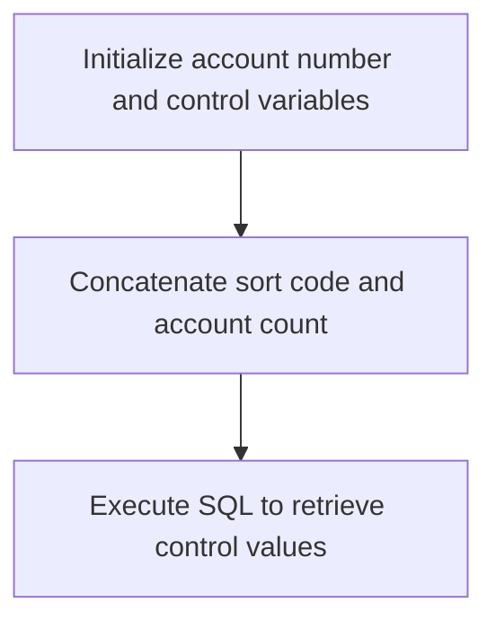

<SwmSnippet path="/src/base/cobol_src/CREACC.cbl" line="602">

---

The <SwmToken path="src/base/cobol_src/CREACC.cbl" pos="374:3:7" line-data="           PERFORM FIND-NEXT-ACCOUNT.">`FIND-NEXT-ACCOUNT`</SwmToken> function is responsible for retrieving the next available account number. Initially, it sets the account number and control variables to their default values. Then, it concatenates the sort code with the string <SwmToken path="src/base/cobol_src/CREACC.cbl" pos="609:2:4" line-data="           &#39;ACCOUNT-COUNT&#39; DELIMITED BY SIZE">`ACCOUNT-COUNT`</SwmToken> to form the control name. Finally, it executes an SQL query to retrieve the control values associated with this control name from the database.

```cobol
           MOVE NCS-ACC-NO-VALUE TO
           COMM-NUMBER ACCOUNT-NUMBER REQUIRED-ACCT-NUMBER3.
           MOVE SPACES TO HV-CONTROL-NAME
           MOVE ZERO TO HV-CONTROL-VALUE-NUM
           MOVE SPACES TO HV-CONTROL-VALUE-STR
           STRING SORTCODE DELIMITED BY SIZE
           '-' DELIMITED BY SIZE
           'ACCOUNT-COUNT' DELIMITED BY SIZE
           INTO HV-CONTROL-NAME
           EXEC SQL
              SELECT CONTROL_NAME,
                       CONTROL_VALUE_NUM,
                       CONTROL_VALUE_STR
              INTO :HV-CONTROL-NAME,
                      :HV-CONTROL-VALUE-NUM,
                      :HV-CONTROL-VALUE-STR
              FROM CONTROL
              WHERE CONTROL_NAME = :HV-CONTROL-NAME
```

---

</SwmSnippet>

## Handle <SwmToken path="src/base/cobol_src/CREACC.cbl" pos="609:2:4" line-data="           &#39;ACCOUNT-COUNT&#39; DELIMITED BY SIZE">`ACCOUNT-COUNT`</SwmToken> SELECT errors

Now, lets zoom into this section of the flow:

```mermaid
graph TD
  A[Check SQLCODE] -->|SQLCODE != 0| B[Initialize ABNDINFO-REC] --> C[Move EIBRESP to ABND-RESPCODE] --> D[Move EIBRESP2 to ABND-RESP2CODE] --> E[Get supplemental information] --> F[Move EIBTASKN to ABND-TASKNO-KEY] --> G[Move EIBTRNID to ABND-TRANID] --> H[Perform POPULATE-TIME-DATE2] --> I[Move WS-ORIG-DATE to ABND-DATE] --> J[Format ABND-TIME] --> K[Move WS-U-TIME to ABND-UTIME-KEY] --> L[Move 'HNCS' to ABND-CODE] --> M[Assign ABND-PROGRAM] --> N[Move SQLCODE-DISPLAY to ABND-SQLCODE] --> O[Format ABND-FREEFORM] --> P[Link to ABEND handler] --> Q[Display error message] --> R[Trigger CICS ABEND]

%% Swimm:
%% graph TD
%%   A[Check SQLCODE] -->|SQLCODE != 0| B[Initialize <SwmToken path="src/base/cobol_src/CREACC.cbl" pos="543:3:5" line-data="               INITIALIZE ABNDINFO-REC">`ABNDINFO-REC`</SwmToken>] --> C[Move EIBRESP to <SwmToken path="src/base/cobol_src/CREACC.cbl" pos="544:7:9" line-data="               MOVE EIBRESP    TO ABND-RESPCODE">`ABND-RESPCODE`</SwmToken>] --> D[Move <SwmToken path="src/base/cobol_src/CREACC.cbl" pos="545:3:3" line-data="               MOVE EIBRESP2   TO ABND-RESP2CODE">`EIBRESP2`</SwmToken> to <SwmToken path="src/base/cobol_src/CREACC.cbl" pos="545:7:9" line-data="               MOVE EIBRESP2   TO ABND-RESP2CODE">`ABND-RESP2CODE`</SwmToken>] --> E[Get supplemental information] --> F[Move EIBTASKN to <SwmToken path="src/base/cobol_src/CREACC.cbl" pos="552:7:11" line-data="               MOVE EIBTASKN   TO ABND-TASKNO-KEY">`ABND-TASKNO-KEY`</SwmToken>] --> G[Move EIBTRNID to <SwmToken path="src/base/cobol_src/CREACC.cbl" pos="553:7:9" line-data="               MOVE EIBTRNID   TO ABND-TRANID">`ABND-TRANID`</SwmToken>] --> H[Perform <SwmToken path="src/base/cobol_src/CREACC.cbl" pos="720:3:7" line-data="               PERFORM POPULATE-TIME-DATE2">`POPULATE-TIME-DATE2`</SwmToken>] --> I[Move <SwmToken path="src/base/cobol_src/CREACC.cbl" pos="557:3:7" line-data="               MOVE WS-ORIG-DATE TO ABND-DATE">`WS-ORIG-DATE`</SwmToken> to <SwmToken path="src/base/cobol_src/CREACC.cbl" pos="557:11:13" line-data="               MOVE WS-ORIG-DATE TO ABND-DATE">`ABND-DATE`</SwmToken>] --> J[Format <SwmToken path="src/base/cobol_src/CREACC.cbl" pos="563:3:5" line-data="                     INTO ABND-TIME">`ABND-TIME`</SwmToken>] --> K[Move <SwmToken path="src/base/cobol_src/CREACC.cbl" pos="566:3:7" line-data="               MOVE WS-U-TIME   TO ABND-UTIME-KEY">`WS-U-TIME`</SwmToken> to <SwmToken path="src/base/cobol_src/CREACC.cbl" pos="566:11:15" line-data="               MOVE WS-U-TIME   TO ABND-UTIME-KEY">`ABND-UTIME-KEY`</SwmToken>] --> L[Move 'HNCS' to <SwmToken path="src/base/cobol_src/CREACC.cbl" pos="567:9:11" line-data="               MOVE &#39;HNCS&#39;      TO ABND-CODE">`ABND-CODE`</SwmToken>] --> M[Assign <SwmToken path="src/base/cobol_src/CREACC.cbl" pos="569:9:11" line-data="               EXEC CICS ASSIGN PROGRAM(ABND-PROGRAM)">`ABND-PROGRAM`</SwmToken>] --> N[Move <SwmToken path="src/base/cobol_src/CREACC.cbl" pos="522:9:11" line-data="      D      MOVE SQLCODE TO SQLCODE-DISPLAY">`SQLCODE-DISPLAY`</SwmToken> to <SwmToken path="src/base/cobol_src/CREACC.cbl" pos="494:9:11" line-data="             MOVE SQLCODE-DISPLAY    TO ABND-SQLCODE">`ABND-SQLCODE`</SwmToken>] --> O[Format <SwmToken path="src/base/cobol_src/CREACC.cbl" pos="505:3:5" line-data="                    INTO ABND-FREEFORM">`ABND-FREEFORM`</SwmToken>] --> P[Link to ABEND handler] --> Q[Display error message] --> R[Trigger CICS ABEND]
```

First, the code checks if <SwmToken path="src/base/cobol_src/CREACC.cbl" pos="522:5:5" line-data="      D      MOVE SQLCODE TO SQLCODE-DISPLAY">`SQLCODE`</SwmToken> (which indicates the result of the last SQL operation) is not equal to zero, meaning an error occurred during the database access.

Next, it initializes the <SwmToken path="src/base/cobol_src/CREACC.cbl" pos="543:3:5" line-data="               INITIALIZE ABNDINFO-REC">`ABNDINFO-REC`</SwmToken> structure to prepare for capturing abend (abnormal end) information.

Then, it moves <SwmToken path="src/base/cobol_src/CREACC.cbl" pos="314:3:3" line-data="           IF EIBRESP IS NOT EQUAL TO DFHRESP(NORMAL)">`EIBRESP`</SwmToken> (the primary response code) to <SwmToken path="src/base/cobol_src/CREACC.cbl" pos="544:7:9" line-data="               MOVE EIBRESP    TO ABND-RESPCODE">`ABND-RESPCODE`</SwmToken> and <SwmToken path="src/base/cobol_src/CREACC.cbl" pos="545:3:3" line-data="               MOVE EIBRESP2   TO ABND-RESP2CODE">`EIBRESP2`</SwmToken> (the secondary response code) to <SwmToken path="src/base/cobol_src/CREACC.cbl" pos="545:7:9" line-data="               MOVE EIBRESP2   TO ABND-RESP2CODE">`ABND-RESP2CODE`</SwmToken> to record the error details.

Moving to the next step, it retrieves supplemental information such as the application ID and task number, which are essential for diagnosing the error.

It then performs the <SwmToken path="src/base/cobol_src/CREACC.cbl" pos="720:3:7" line-data="               PERFORM POPULATE-TIME-DATE2">`POPULATE-TIME-DATE2`</SwmToken> routine to get the current date and time, which are stored in <SwmToken path="src/base/cobol_src/CREACC.cbl" pos="557:11:13" line-data="               MOVE WS-ORIG-DATE TO ABND-DATE">`ABND-DATE`</SwmToken> and <SwmToken path="src/base/cobol_src/CREACC.cbl" pos="563:3:5" line-data="                     INTO ABND-TIME">`ABND-TIME`</SwmToken> respectively.

The code also moves <SwmToken path="src/base/cobol_src/CREACC.cbl" pos="566:3:7" line-data="               MOVE WS-U-TIME   TO ABND-UTIME-KEY">`WS-U-TIME`</SwmToken> (the current time in a specific format) to <SwmToken path="src/base/cobol_src/CREACC.cbl" pos="566:11:15" line-data="               MOVE WS-U-TIME   TO ABND-UTIME-KEY">`ABND-UTIME-KEY`</SwmToken> and sets <SwmToken path="src/base/cobol_src/CREACC.cbl" pos="567:9:11" line-data="               MOVE &#39;HNCS&#39;      TO ABND-CODE">`ABND-CODE`</SwmToken> to 'HNCS' to indicate the specific error code.

Next, it assigns the current program name to <SwmToken path="src/base/cobol_src/CREACC.cbl" pos="569:9:11" line-data="               EXEC CICS ASSIGN PROGRAM(ABND-PROGRAM)">`ABND-PROGRAM`</SwmToken> and moves the <SwmToken path="src/base/cobol_src/CREACC.cbl" pos="522:9:11" line-data="      D      MOVE SQLCODE TO SQLCODE-DISPLAY">`SQLCODE-DISPLAY`</SwmToken> to <SwmToken path="src/base/cobol_src/CREACC.cbl" pos="494:9:11" line-data="             MOVE SQLCODE-DISPLAY    TO ABND-SQLCODE">`ABND-SQLCODE`</SwmToken> to capture the SQL error code.

Then, it formats a detailed error message string and stores it in <SwmToken path="src/base/cobol_src/CREACC.cbl" pos="505:3:5" line-data="                    INTO ABND-FREEFORM">`ABND-FREEFORM`</SwmToken> for logging purposes.

## Successful <SwmToken path="src/base/cobol_src/CREACC.cbl" pos="609:2:4" line-data="           &#39;ACCOUNT-COUNT&#39; DELIMITED BY SIZE">`ACCOUNT-COUNT`</SwmToken> SELECT, update control values

Now, lets zoom into this section of the flow:

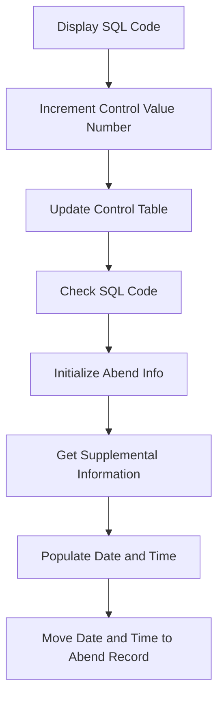

<SwmSnippet path="/src/base/cobol_src/CREACC.cbl" line="688">

---

First, the SQL code from the previous operation is moved to <SwmToken path="src/base/cobol_src/CREACC.cbl" pos="688:9:11" line-data="      D      MOVE SQLCODE TO SQLCODE-DISPLAY">`SQLCODE-DISPLAY`</SwmToken> and displayed along with the current control value number.

```cobol
      D      MOVE SQLCODE TO SQLCODE-DISPLAY
      D      DISPLAY 'SELECT WAS ' SQLCODE-DISPLAY ' AND FOUND '
      D        HV-CONTROL-VALUE-NUM
```

---

</SwmSnippet>

<SwmSnippet path="/src/base/cobol_src/CREACC.cbl" line="691">

---

Next, the control value number is incremented by 1.

```cobol
             ADD 1 TO HV-CONTROL-VALUE-NUM GIVING
             HV-CONTROL-VALUE-NUM
```

---

</SwmSnippet>

<SwmSnippet path="/src/base/cobol_src/CREACC.cbl" line="694">

---

Then, the updated control value number is used to update the <SwmToken path="src/base/cobol_src/CREACC.cbl" pos="695:3:3" line-data="               UPDATE CONTROL">`CONTROL`</SwmToken> table in the database.

```cobol
             EXEC SQL
               UPDATE CONTROL
               SET CONTROL_VALUE_NUM = :HV-CONTROL-VALUE-NUM
               WHERE (CONTROL_NAME = :HV-CONTROL-NAME)
             END-EXEC
```

---

</SwmSnippet>

<SwmSnippet path="/src/base/cobol_src/CREACC.cbl" line="699">

---

Moving to the next step, if the SQL code is not zero, indicating an error, the SQL code is moved to <SwmToken path="src/base/cobol_src/CREACC.cbl" pos="700:7:9" line-data="               MOVE SQLCODE TO SQLCODE-DISPLAY">`SQLCODE-DISPLAY`</SwmToken>.

```cobol
             IF SQLCODE IS NOT EQUAL TO ZERO
               MOVE SQLCODE TO SQLCODE-DISPLAY

```

---

</SwmSnippet>

<SwmSnippet path="/src/base/cobol_src/CREACC.cbl" line="703">

---

Going into error handling, the response codes are preserved, and the standard abend information is set up.

```cobol
      *        Preserve the RESP and RESP2, then set up the
      *        standard ABEND info before getting the applid,
      *        date/time etc. and linking to the Abend Handler
      *        program.
      *
               INITIALIZE ABNDINFO-REC
               MOVE EIBRESP    TO ABND-RESPCODE
               MOVE EIBRESP2   TO ABND-RESP2CODE
```

---

</SwmSnippet>

<SwmSnippet path="/src/base/cobol_src/CREACC.cbl" line="720">

---

Finally, the current date and time are populated and moved to the abend record.

```cobol
               PERFORM POPULATE-TIME-DATE2

               MOVE WS-ORIG-DATE TO ABND-DATE
               STRING WS-TIME-NOW-GRP-HH DELIMITED BY SIZE,
                    ':' DELIMITED BY SIZE,
                     WS-TIME-NOW-GRP-MM DELIMITED BY SIZE,
                     ':' DELIMITED BY SIZE,
                     WS-TIME-NOW-GRP-MM DELIMITED BY SIZE
                     INTO ABND-TIME
```

---

</SwmSnippet>

## <SwmToken path="src/base/cobol_src/CREACC.cbl" pos="720:3:7" line-data="               PERFORM POPULATE-TIME-DATE2">`POPULATE-TIME-DATE2`</SwmToken>

Lets' zoom into this section of the flow:

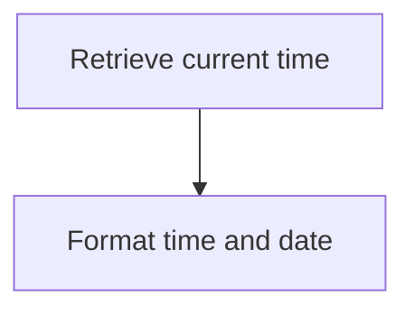

<SwmSnippet path="/src/base/cobol_src/CREACC.cbl" line="1235">

---

### Retrieving current time

First, the <SwmToken path="src/base/cobol_src/CREACC.cbl" pos="720:3:7" line-data="               PERFORM POPULATE-TIME-DATE2">`POPULATE-TIME-DATE2`</SwmToken> section begins by retrieving the current time using the <SwmToken path="src/base/cobol_src/CREACC.cbl" pos="1235:1:5" line-data="           EXEC CICS ASKTIME">`EXEC CICS ASKTIME`</SwmToken> command. This command stores the current time in the <SwmToken path="src/base/cobol_src/CREACC.cbl" pos="1236:3:7" line-data="              ABSTIME(WS-U-TIME)">`WS-U-TIME`</SwmToken> variable.

```cobol
           EXEC CICS ASKTIME
              ABSTIME(WS-U-TIME)
           END-EXEC.
```

---

</SwmSnippet>

<SwmSnippet path="/src/base/cobol_src/CREACC.cbl" line="1239">

---

### Formatting time and date

Next, the <SwmToken path="src/base/cobol_src/CREACC.cbl" pos="1239:1:5" line-data="           EXEC CICS FORMATTIME">`EXEC CICS FORMATTIME`</SwmToken> command is used to format the retrieved time. It converts the <SwmToken path="src/base/cobol_src/CREACC.cbl" pos="1240:3:7" line-data="                     ABSTIME(WS-U-TIME)">`WS-U-TIME`</SwmToken> into a human-readable date and time format, storing the date in <SwmToken path="src/base/cobol_src/CREACC.cbl" pos="1241:3:7" line-data="                     DDMMYYYY(WS-ORIG-DATE)">`WS-ORIG-DATE`</SwmToken> and the time in <SwmToken path="src/base/cobol_src/CREACC.cbl" pos="1242:3:7" line-data="                     TIME(WS-TIME-NOW)">`WS-TIME-NOW`</SwmToken>.

```cobol
           EXEC CICS FORMATTIME
                     ABSTIME(WS-U-TIME)
                     DDMMYYYY(WS-ORIG-DATE)
                     TIME(WS-TIME-NOW)
                     DATESEP
           END-EXEC.
```

---

</SwmSnippet>

## <SwmToken path="src/base/cobol_src/CREACC.cbl" pos="376:3:7" line-data="           PERFORM WRITE-ACCOUNT-DB2">`WRITE-ACCOUNT-DB2`</SwmToken>

Lets' zoom into this section of the flow:

```mermaid
graph TD
  A[Initialize account data] --> B[Calculate next statement date] --> C[Insert account into DB2] --> D[Check insert success] --> E[Write to PROCTRAN datastore] --> F[Update communication area]

%% Swimm:
%% graph TD
%%   A[Initialize account data] --> B[Calculate next statement date] --> C[Insert account into <SwmToken path="src/base/cobol_src/CREACC.cbl" pos="376:7:7" line-data="           PERFORM WRITE-ACCOUNT-DB2">`DB2`</SwmToken>] --> D[Check insert success] --> E[Write to PROCTRAN datastore] --> F[Update communication area]
```

<SwmSnippet path="/src/base/cobol_src/CREACC.cbl" line="774">

---

### Initializing account data

First, the account data structures are initialized and various fields are populated with values from the communication area and other sources.

```cobol
       WRITE-ACCOUNT-DB2 SECTION.
       WAD010.

           INITIALIZE HOST-ACCOUNT-ROW.
           MOVE 'ACCT' TO HV-ACCOUNT-EYECATCHER.
           MOVE COMM-CUSTNO IN DFHCOMMAREA  TO HV-ACCOUNT-CUST-NO.
           MOVE SORTCODE  TO HV-ACCOUNT-SORTCODE.

           MOVE NCS-ACC-NO-VALUE TO NCS-ACC-NO-DISP.
           MOVE NCS-ACC-NO-DISP(9:8) TO HV-ACCOUNT-ACC-NO.
           MOVE COMM-ACC-TYPE IN DFHCOMMAREA    TO HV-ACCOUNT-ACC-TYPE.
           MOVE COMM-INT-RT      TO HV-ACCOUNT-INT-RATE.
           MOVE COMM-OVERDR-LIM  TO HV-ACCOUNT-OVERDRAFT-LIM.
           MOVE COMM-AVAIL-BAL IN DFHCOMMAREA   TO HV-ACCOUNT-AVAIL-BAL.
           MOVE COMM-ACT-BAL     TO HV-ACCOUNT-ACTUAL-BAL.
```

---

</SwmSnippet>

<SwmSnippet path="/src/base/cobol_src/CREACC.cbl" line="790">

---

### Calculating next statement date

Next, the program calculates the next statement date by converting the current date to an integer, adding 30 days, and then converting it back to a Gregorian date.

```cobol
           PERFORM CALCULATE-DATES.

      *
      *    Convert gregorian date (YYYYMMDD) to an integer
      *
           STRING WS-ORIG-DATE-YYYY DELIMITED BY SIZE,
                  WS-ORIG-DATE-MM   DELIMITED BY SIZE,
                  WS-ORIG-DATE-DD   DELIMITED BY SIZE
           INTO WS-STDT-X.

           MOVE WS-STDT-9-NUM TO WS-STDT-9-NUMERIC.

           COMPUTE WS-INTEGER =
              FUNCTION INTEGER-OF-DATE(WS-STDT-9-NUMERIC).

      *
      *    Add 30 days to the date
      *
           COMPUTE WS-INTEGER = WS-INTEGER + 30.

      *
```

---

</SwmSnippet>

<SwmSnippet path="/src/base/cobol_src/CREACC.cbl" line="826">

---

### Inserting account into <SwmToken path="src/base/cobol_src/CREACC.cbl" pos="376:7:7" line-data="           PERFORM WRITE-ACCOUNT-DB2">`DB2`</SwmToken>

Then, the program inserts the new account record into the <SwmToken path="src/base/cobol_src/CREACC.cbl" pos="376:7:7" line-data="           PERFORM WRITE-ACCOUNT-DB2">`DB2`</SwmToken> ACCOUNT table using the populated account data.

```cobol
           EXEC SQL
              INSERT INTO ACCOUNT
                     (ACCOUNT_EYECATCHER,
                      ACCOUNT_CUSTOMER_NUMBER,
                      ACCOUNT_SORTCODE,
                      ACCOUNT_NUMBER,
                      ACCOUNT_TYPE,
                      ACCOUNT_INTEREST_RATE,
                      ACCOUNT_OPENED,
                      ACCOUNT_OVERDRAFT_LIMIT,
                      ACCOUNT_LAST_STATEMENT,
                      ACCOUNT_NEXT_STATEMENT,
                      ACCOUNT_AVAILABLE_BALANCE,
                      ACCOUNT_ACTUAL_BALANCE
                      )
              VALUES (:HV-ACCOUNT-EYECATCHER,
                      :HV-ACCOUNT-CUST-NO,
                      :HV-ACCOUNT-SORTCODE,
                      :HV-ACCOUNT-ACC-NO,
                      :HV-ACCOUNT-ACC-TYPE,
                      :HV-ACCOUNT-INT-RATE,
```

---

</SwmSnippet>

<SwmSnippet path="/src/base/cobol_src/CREACC.cbl" line="855">

---

### Checking insert success

The program checks if the insert operation was successful. If not, it handles the error by updating the communication area with failure information and performing necessary cleanup.

```cobol

      *
      *    Check if the INSERT was unsuccessful and take action.
      *
           IF SQLCODE NOT = 0
              MOVE SQLCODE TO SQLCODE-DISPLAY
              MOVE 'N' TO COMM-SUCCESS IN DFHCOMMAREA
              MOVE '7' TO COMM-FAIL-CODE IN DFHCOMMAREA
              PERFORM DEQ-NAMED-COUNTER
              MOVE SQLCODE TO SQLCODE-DISPLAY

              PERFORM GET-ME-OUT-OF-HERE
           END-IF.
```

---

</SwmSnippet>

<SwmSnippet path="/src/base/cobol_src/CREACC.cbl" line="872">

---

### Writing to PROCTRAN datastore

If the insert was successful, the program writes the transaction data to the PROCTRAN datastore for logging and tracking purposes.

```cobol
           MOVE HV-ACCOUNT-SORTCODE       TO STORED-SORTCODE.
           MOVE HV-ACCOUNT-ACC-NO         TO STORED-ACCNO.
           MOVE HV-ACCOUNT-CUST-NO        TO STORED-CUSTNO.
           MOVE HV-ACCOUNT-ACC-TYPE       TO STORED-ACCTYPE.
           MOVE HV-ACCOUNT-LAST-STMT(1:2) TO STORED-LST-STMT(1:2).
           MOVE HV-ACCOUNT-LAST-STMT(4:2) TO STORED-LST-STMT(3:2).
           MOVE HV-ACCOUNT-LAST-STMT(7:4) TO STORED-LST-STMT(5:4).
           MOVE HV-ACCOUNT-NEXT-STMT(1:2) TO STORED-NXT-STMT(1:2).
           MOVE HV-ACCOUNT-NEXT-STMT(4:2) TO STORED-NXT-STMT(3:2).
           MOVE HV-ACCOUNT-NEXT-STMT(7:4) TO STORED-NXT-STMT(5:4).

           PERFORM WRITE-PROCTRAN.

           PERFORM DEQ-NAMED-COUNTER.
```

---

</SwmSnippet>

<SwmSnippet path="/src/base/cobol_src/CREACC.cbl" line="888">

---

### Updating communication area

Finally, the program updates the communication area with the new account information and sets the success flag to indicate the operation was successful.

```cobol
      *    Set up the missing data in the COMMAREA ready for return
      *
           MOVE HV-ACCOUNT-SORTCODE    TO COMM-SORTCODE.
           MOVE HV-ACCOUNT-ACC-NO      TO COMM-NUMBER.

           MOVE HV-ACCOUNT-OPENED-DAY(1:2)
             TO COMM-OPENED IN DFHCOMMAREA(1:2).
           MOVE HV-ACCOUNT-OPENED-MONTH(1:2)
             TO COMM-OPENED IN DFHCOMMAREA(3:2).
           MOVE HV-ACCOUNT-OPENED-YEAR(1:4)
             TO COMM-OPENED IN DFHCOMMAREA(5:4).
           MOVE HV-ACCOUNT-LAST-STMT-DAY(1:2)
              TO COMM-LAST-STMT-DT IN DFHCOMMAREA(1:2).
           MOVE HV-ACCOUNT-LAST-STMT-MONTH(1:2)
              TO COMM-LAST-STMT-DT IN DFHCOMMAREA(3:2).
           MOVE HV-ACCOUNT-LAST-STMT-YEAR(1:4)
              TO COMM-LAST-STMT-DT IN DFHCOMMAREA(5:4).
           MOVE HV-ACCOUNT-NEXT-STMT-DAY(1:2)
              TO COMM-NEXT-STMT-DT IN DFHCOMMAREA(1:2).
           MOVE HV-ACCOUNT-NEXT-STMT-MONTH(1:2)
              TO COMM-NEXT-STMT-DT IN DFHCOMMAREA(3:2).
```

---

</SwmSnippet>

## <SwmToken path="src/base/cobol_src/CREACC.cbl" pos="790:3:5" line-data="           PERFORM CALCULATE-DATES.">`CALCULATE-DATES`</SwmToken>

Lets' zoom into this section of the flow:

```mermaid
graph TD
  A[Get current date and time] --> B[Format date and time] --> C[Convert date to integer] --> D[Add 30 days to date] --> E[Check for leap year] --> F[Convert integer back to date] --> G[Store next statement date] --> H[Store account opened date] --> I[Store last statement date]
```

<SwmSnippet path="/src/base/cobol_src/CREACC.cbl" line="1099">

---

First, the current date and time are retrieved using the <SwmToken path="src/base/cobol_src/CREACC.cbl" pos="1109:1:5" line-data="           EXEC CICS ASKTIME">`EXEC CICS ASKTIME`</SwmToken> command, which stores the result in <SwmToken path="src/base/cobol_src/CREACC.cbl" pos="1110:3:7" line-data="              ABSTIME(WS-U-TIME)">`WS-U-TIME`</SwmToken>.

```cobol
       CD010.
      *
      *    Store today's date as the ACCOUNT-OPENED date and calculate
      *    the LAST-STMT-DATE (which should be today) and the
      *    NEXT-STMT-DATE (which should be today + 30 days).
      *

      *
      *    Populate the time and date
      *
           EXEC CICS ASKTIME
              ABSTIME(WS-U-TIME)
           END-EXEC.
```

---

</SwmSnippet>

<SwmSnippet path="/src/base/cobol_src/CREACC.cbl" line="1113">

---

Next, the retrieved time is formatted into a readable date format using the <SwmToken path="src/base/cobol_src/CREACC.cbl" pos="1113:1:5" line-data="           EXEC CICS FORMATTIME">`EXEC CICS FORMATTIME`</SwmToken> command, which populates <SwmToken path="src/base/cobol_src/CREACC.cbl" pos="1115:3:7" line-data="                     DDMMYYYY(WS-ORIG-DATE)">`WS-ORIG-DATE`</SwmToken> and <SwmToken path="src/base/cobol_src/CREACC.cbl" pos="1116:3:7" line-data="                     TIME(PROC-TRAN-TIME OF PROCTRAN-AREA)">`PROC-TRAN-TIME`</SwmToken>.

```cobol
           EXEC CICS FORMATTIME
                     ABSTIME(WS-U-TIME)
                     DDMMYYYY(WS-ORIG-DATE)
                     TIME(PROC-TRAN-TIME OF PROCTRAN-AREA)
                     DATESEP
           END-EXEC.
```

---

</SwmSnippet>

<SwmSnippet path="/src/base/cobol_src/CREACC.cbl" line="1124">

---

The formatted date is then converted into an integer representation by concatenating the year, month, and day components and storing the result in <SwmToken path="src/base/cobol_src/CREACC.cbl" pos="1127:3:7" line-data="              INTO WS-STDT-X.">`WS-STDT-X`</SwmToken>.

```cobol
           STRING WS-ORIG-DATE-YYYY DELIMITED BY SIZE,
                  WS-ORIG-DATE-MM   DELIMITED BY SIZE,
                  WS-ORIG-DATE-DD   DELIMITED BY SIZE
              INTO WS-STDT-X.
```

---

</SwmSnippet>

<SwmSnippet path="/src/base/cobol_src/CREACC.cbl" line="1129">

---

The concatenated date string is moved to <SwmToken path="src/base/cobol_src/CREACC.cbl" pos="1129:13:19" line-data="           MOVE WS-STDT-9-NUM TO WS-STDT-9-NUMERIC.">`WS-STDT-9-NUMERIC`</SwmToken>, and then converted to an integer using the <SwmToken path="src/base/cobol_src/CREACC.cbl" pos="1132:3:7" line-data="              FUNCTION INTEGER-OF-DATE(WS-STDT-9-NUMERIC).">`INTEGER-OF-DATE`</SwmToken> function, storing the result in <SwmToken path="src/base/cobol_src/CREACC.cbl" pos="1131:3:5" line-data="           COMPUTE WS-INTEGER =">`WS-INTEGER`</SwmToken>.

```cobol
           MOVE WS-STDT-9-NUM TO WS-STDT-9-NUMERIC.

           COMPUTE WS-INTEGER =
              FUNCTION INTEGER-OF-DATE(WS-STDT-9-NUMERIC).
```

---

</SwmSnippet>

<SwmSnippet path="/src/base/cobol_src/CREACC.cbl" line="1137">

---

Moving to the next step, 30 days are added to the integer date based on the month, adjusting for the number of days in each month.

```cobol
           EVALUATE WS-ORIG-DATE-MM
              WHEN 1
              WHEN 3
              WHEN 5
              WHEN 7
              WHEN 8
              WHEN 10
              WHEN 12
                 COMPUTE WS-INTEGER = WS-INTEGER + 30
              WHEN 9
              WHEN 4
              WHEN 6
              WHEN 11
                 COMPUTE WS-INTEGER = WS-INTEGER + 30
              WHEN 2
                 COMPUTE WS-INTEGER = WS-INTEGER + 28
```

---

</SwmSnippet>

<SwmSnippet path="/src/base/cobol_src/CREACC.cbl" line="1153">

---

Then, a check is performed to determine if the current year is a leap year, and if so, an additional day is added to the date.

```cobol
                 DIVIDE WS-ORIG-DATE-YYYY BY 4 GIVING DONT-CARE
                 REMAINDER LEAP-YEAR

                 IF LEAP-YEAR = ZERO
                    DIVIDE WS-ORIG-DATE-YYYY BY 100 GIVING DONT-CARE
                       REMAINDER LEAP-YEAR

                    IF LEAP-YEAR > 0
                       ADD 1 TO WS-INTEGER GIVING WS-INTEGER
                    ELSE
                       DIVIDE WS-ORIG-DATE-YYYY BY 400 GIVING DONT-CARE
                          REMAINDER LEAP-YEAR
                       IF LEAP-YEAR = ZERO
                         ADD 1 TO WS-INTEGER GIVING WS-INTEGER
                       END-IF
                    END-IF
                 END-IF
```

---

</SwmSnippet>

<SwmSnippet path="/src/base/cobol_src/CREACC.cbl" line="1177">

---

The integer date is then converted back to a Gregorian date format using the <SwmToken path="src/base/cobol_src/CREACC.cbl" pos="1178:3:7" line-data="              FUNCTION DATE-OF-INTEGER (WS-INTEGER).">`DATE-OF-INTEGER`</SwmToken> function, storing the result in <SwmToken path="src/base/cobol_src/CREACC.cbl" pos="1177:3:7" line-data="           COMPUTE WS-FUTURE-DATE =">`WS-FUTURE-DATE`</SwmToken>.

```cobol
           COMPUTE WS-FUTURE-DATE =
              FUNCTION DATE-OF-INTEGER (WS-INTEGER).
```

---

</SwmSnippet>

<SwmSnippet path="/src/base/cobol_src/CREACC.cbl" line="1184">

---

The calculated future date is stored as the next statement date by rearranging the date components and moving them to <SwmToken path="src/base/cobol_src/CREACC.cbl" pos="1184:16:22" line-data="           MOVE WS-FUTURE-DATE(1:4) TO ACCOUNT-NEXT-STMT-DATE(5:4).">`ACCOUNT-NEXT-STMT-DATE`</SwmToken>.

```cobol
           MOVE WS-FUTURE-DATE(1:4) TO ACCOUNT-NEXT-STMT-DATE(5:4).
           MOVE WS-FUTURE-DATE(5:2) TO ACCOUNT-NEXT-STMT-DATE(3:2).
           MOVE WS-FUTURE-DATE(7:2) TO ACCOUNT-NEXT-STMT-DATE(1:2).
```

---

</SwmSnippet>

<SwmSnippet path="/src/base/cobol_src/CREACC.cbl" line="1188">

---

The original date components are stored as the account opened date in <SwmToken path="src/base/cobol_src/CREACC.cbl" pos="1188:13:15" line-data="           MOVE WS-ORIG-DATE-DD   TO ACCOUNT-OPENED(1:2).">`ACCOUNT-OPENED`</SwmToken>.

```cobol
           MOVE WS-ORIG-DATE-DD   TO ACCOUNT-OPENED(1:2).
           MOVE WS-ORIG-DATE-MM   TO ACCOUNT-OPENED(3:2).
           MOVE WS-ORIG-DATE-YYYY TO ACCOUNT-OPENED(5:4).
```

---

</SwmSnippet>

<SwmSnippet path="/src/base/cobol_src/CREACC.cbl" line="1191">

---

Finally, the account opened date is also stored as the last statement date in <SwmToken path="src/base/cobol_src/CREACC.cbl" pos="1191:9:15" line-data="           MOVE ACCOUNT-OPENED    TO ACCOUNT-LAST-STMT-DATE.">`ACCOUNT-LAST-STMT-DATE`</SwmToken>.

```cobol
           MOVE ACCOUNT-OPENED    TO ACCOUNT-LAST-STMT-DATE.
```

---

</SwmSnippet>

## <SwmToken path="src/base/cobol_src/CREACC.cbl" pos="407:1:5" line-data="       DEQ-NAMED-COUNTER SECTION.">`DEQ-NAMED-COUNTER`</SwmToken>

Lets' zoom into this section of the flow:

```mermaid
graph TD
  A[Move Sort Code to Test Sort] --> B[Release Named Counter Resource] --> C{Check Response}
  C -->|Normal| D[Exit]
  C -->|Not Normal| E[Set Communication Failure] --> F[Perform Exit Routine]
```

<SwmSnippet path="/src/base/cobol_src/CREACC.cbl" line="407">

---

First, the <SwmToken path="src/base/cobol_src/CREACC.cbl" pos="407:1:5" line-data="       DEQ-NAMED-COUNTER SECTION.">`DEQ-NAMED-COUNTER`</SwmToken> section begins by moving the <SwmToken path="src/base/cobol_src/CREACC.cbl" pos="410:3:3" line-data="           MOVE SORTCODE TO NCS-ACC-NO-TEST-SORT.">`SORTCODE`</SwmToken> to <SwmToken path="src/base/cobol_src/CREACC.cbl" pos="410:7:15" line-data="           MOVE SORTCODE TO NCS-ACC-NO-TEST-SORT.">`NCS-ACC-NO-TEST-SORT`</SwmToken>.

```cobol
       DEQ-NAMED-COUNTER SECTION.
       DNC010.

           MOVE SORTCODE TO NCS-ACC-NO-TEST-SORT.
```

---

</SwmSnippet>

<SwmSnippet path="/src/base/cobol_src/CREACC.cbl" line="412">

---

Next, it executes the CICS <SwmToken path="src/base/cobol_src/CREACC.cbl" pos="412:5:5" line-data="           EXEC CICS DEQ">`DEQ`</SwmToken> command to release the named counter resource identified by <SwmToken path="src/base/cobol_src/CREACC.cbl" pos="413:3:9" line-data="              RESOURCE(NCS-ACC-NO-NAME)">`NCS-ACC-NO-NAME`</SwmToken>.

```cobol
           EXEC CICS DEQ
              RESOURCE(NCS-ACC-NO-NAME)
              LENGTH(16)
              RESP(WS-CICS-RESP)
              RESP2(WS-CICS-RESP2)
           END-EXEC.
```

---

</SwmSnippet>

<SwmSnippet path="/src/base/cobol_src/CREACC.cbl" line="419">

---

Then, it checks if the response (<SwmToken path="src/base/cobol_src/CREACC.cbl" pos="419:3:7" line-data="           IF WS-CICS-RESP NOT = DFHRESP(NORMAL)">`WS-CICS-RESP`</SwmToken>) is not equal to <SwmToken path="src/base/cobol_src/CREACC.cbl" pos="419:13:16" line-data="           IF WS-CICS-RESP NOT = DFHRESP(NORMAL)">`DFHRESP(NORMAL)`</SwmToken>. If the response is not normal, it sets the communication success flag (<SwmToken path="src/base/cobol_src/CREACC.cbl" pos="420:9:11" line-data="             MOVE &#39;N&#39; TO COMM-SUCCESS IN DFHCOMMAREA">`COMM-SUCCESS`</SwmToken>) to 'N' and the communication failure code (<SwmToken path="src/base/cobol_src/CREACC.cbl" pos="421:9:13" line-data="             MOVE &#39;5&#39; TO COMM-FAIL-CODE IN DFHCOMMAREA">`COMM-FAIL-CODE`</SwmToken>) to '5' in the <SwmToken path="src/base/cobol_src/CREACC.cbl" pos="420:15:15" line-data="             MOVE &#39;N&#39; TO COMM-SUCCESS IN DFHCOMMAREA">`DFHCOMMAREA`</SwmToken>.

```cobol
           IF WS-CICS-RESP NOT = DFHRESP(NORMAL)
             MOVE 'N' TO COMM-SUCCESS IN DFHCOMMAREA
             MOVE '5' TO COMM-FAIL-CODE IN DFHCOMMAREA
```

---

</SwmSnippet>

<SwmSnippet path="/src/base/cobol_src/CREACC.cbl" line="422">

---

Finally, if the response was not normal, it performs the <SwmToken path="src/base/cobol_src/CREACC.cbl" pos="422:3:11" line-data="             PERFORM GET-ME-OUT-OF-HERE">`GET-ME-OUT-OF-HERE`</SwmToken> routine to handle the exit process.

```cobol
             PERFORM GET-ME-OUT-OF-HERE
           END-IF.
```

---

</SwmSnippet>

## <SwmToken path="src/base/cobol_src/CREACC.cbl" pos="883:3:5" line-data="           PERFORM WRITE-PROCTRAN.">`WRITE-PROCTRAN`</SwmToken>

Lets' zoom into this section of the flow:

```mermaid
graph TD
  A[WRITE-PROCTRAN] --> B[Perform WRITE-PROCTRAN-DB2]

%% Swimm:
%% graph TD
%%   A[<SwmToken path="src/base/cobol_src/CREACC.cbl" pos="883:3:5" line-data="           PERFORM WRITE-PROCTRAN.">`WRITE-PROCTRAN`</SwmToken>] --> B[Perform <SwmToken path="src/base/cobol_src/CREACC.cbl" pos="923:3:7" line-data="               PERFORM WRITE-PROCTRAN-DB2.">`WRITE-PROCTRAN-DB2`</SwmToken>]
```

<SwmSnippet path="/src/base/cobol_src/CREACC.cbl" line="920">

---

The <SwmToken path="src/base/cobol_src/CREACC.cbl" pos="920:1:3" line-data="       WRITE-PROCTRAN SECTION.">`WRITE-PROCTRAN`</SwmToken> section is responsible for writing a processed transaction record to the database. It begins by performing the <SwmToken path="src/base/cobol_src/CREACC.cbl" pos="923:3:7" line-data="               PERFORM WRITE-PROCTRAN-DB2.">`WRITE-PROCTRAN-DB2`</SwmToken> operation, which handles the actual insertion of the transaction data into the PROCTRAN Db2 table. This ensures that all successfully processed transactions are recorded in the database for future reference and auditing purposes.

```cobol
       WRITE-PROCTRAN SECTION.
       WP010.

               PERFORM WRITE-PROCTRAN-DB2.
       WP999.
           EXIT.
```

---

</SwmSnippet>

## <SwmToken path="src/base/cobol_src/CREACC.cbl" pos="923:3:7" line-data="               PERFORM WRITE-PROCTRAN-DB2.">`WRITE-PROCTRAN-DB2`</SwmToken>

Lets' zoom into this section of the flow:

```mermaid
graph TD
  A[Initialize transaction data] --> B[Capture current time and date] --> C[Insert transaction into PROCTRAN table] --> D[Check SQLCODE for errors] --> E[Handle error and log details]
```

<SwmSnippet path="/src/base/cobol_src/CREACC.cbl" line="934">

---

### Initializing transaction data

First, the transaction data is initialized to prepare for writing to the PROCTRAN table. This includes setting up various fields such as <SwmToken path="src/base/cobol_src/CREACC.cbl" pos="937:9:13" line-data="           MOVE &#39;PRTR&#39;   TO HV-PROCTRAN-EYECATCHER.">`HV-PROCTRAN-EYECATCHER`</SwmToken>, <SwmToken path="src/base/cobol_src/CREACC.cbl" pos="938:7:13" line-data="           MOVE SORTCODE TO HV-PROCTRAN-SORT-CODE.">`HV-PROCTRAN-SORT-CODE`</SwmToken>, and <SwmToken path="src/base/cobol_src/CREACC.cbl" pos="939:9:15" line-data="           MOVE STORED-ACCNO TO HV-PROCTRAN-ACC-NUMBER.">`HV-PROCTRAN-ACC-NUMBER`</SwmToken>.

```cobol
           INITIALIZE HOST-PROCTRAN-ROW.
           INITIALIZE WS-EIBTASKN12.

           MOVE 'PRTR'   TO HV-PROCTRAN-EYECATCHER.
           MOVE SORTCODE TO HV-PROCTRAN-SORT-CODE.
           MOVE STORED-ACCNO TO HV-PROCTRAN-ACC-NUMBER.
           MOVE EIBTASKN TO WS-EIBTASKN12.
           MOVE WS-EIBTASKN12 TO HV-PROCTRAN-REF.
```

---

</SwmSnippet>

<SwmSnippet path="/src/base/cobol_src/CREACC.cbl" line="946">

---

### Capturing current time and date

Next, the current time and date are captured using the <SwmToken path="src/base/cobol_src/CREACC.cbl" pos="946:1:5" line-data="           EXEC CICS ASKTIME">`EXEC CICS ASKTIME`</SwmToken> and <SwmToken path="src/base/cobol_src/CREACC.cbl" pos="950:1:5" line-data="           EXEC CICS FORMATTIME">`EXEC CICS FORMATTIME`</SwmToken> commands. This information is then moved to the appropriate fields in the transaction data.

```cobol
           EXEC CICS ASKTIME
              ABSTIME(WS-U-TIME)
           END-EXEC.

           EXEC CICS FORMATTIME
                     ABSTIME(WS-U-TIME)
                     DDMMYYYY(WS-ORIG-DATE)
                     TIME(HV-PROCTRAN-TIME)
                     DATESEP('.')
           END-EXEC.

           MOVE WS-ORIG-DATE TO WS-ORIG-DATE-GRP-X.
           MOVE WS-ORIG-DATE-GRP-X TO HV-PROCTRAN-DATE.
```

---

</SwmSnippet>

<SwmSnippet path="/src/base/cobol_src/CREACC.cbl" line="969">

---

### Inserting transaction into PROCTRAN table

Then, the transaction data is inserted into the PROCTRAN table using an <SwmToken path="src/base/cobol_src/CREACC.cbl" pos="969:1:1" line-data="           EXEC SQL">`EXEC`</SwmToken>` `<SwmToken path="src/base/cobol_src/CREACC.cbl" pos="969:3:3" line-data="           EXEC SQL">`SQL`</SwmToken>` `<SwmToken path="src/base/cobol_src/CREACC.cbl" pos="970:1:1" line-data="              INSERT INTO PROCTRAN">`INSERT`</SwmToken> statement. This step ensures that the transaction is recorded in the database.

```cobol
           EXEC SQL
              INSERT INTO PROCTRAN
                     (
                      PROCTRAN_EYECATCHER,
                      PROCTRAN_SORTCODE,
                      PROCTRAN_NUMBER,
                      PROCTRAN_DATE,
                      PROCTRAN_TIME,
                      PROCTRAN_REF,
                      PROCTRAN_TYPE,
                      PROCTRAN_DESC,
                      PROCTRAN_AMOUNT
                     )
              VALUES
                     (
                      :HV-PROCTRAN-EYECATCHER,
                      :HV-PROCTRAN-SORT-CODE,
                      :HV-PROCTRAN-ACC-NUMBER,
                      :HV-PROCTRAN-DATE,
                      :HV-PROCTRAN-TIME,
                      :HV-PROCTRAN-REF,
```

---

</SwmSnippet>

<SwmSnippet path="/src/base/cobol_src/CREACC.cbl" line="999">

---

### Checking SQLCODE for errors

After the insert operation, the <SwmToken path="src/base/cobol_src/CREACC.cbl" pos="999:3:3" line-data="           IF SQLCODE NOT = 0">`SQLCODE`</SwmToken> is checked to determine if the operation was successful. If <SwmToken path="src/base/cobol_src/CREACC.cbl" pos="999:3:3" line-data="           IF SQLCODE NOT = 0">`SQLCODE`</SwmToken> is not equal to 0, it indicates an error occurred during the insert.

```cobol
           IF SQLCODE NOT = 0
              DISPLAY 'In CREACC (WPD010) '
              'UNABLE TO WRITE TO PROCTRAN ROW DATASTORE'
              ' RESP CODE=' WS-CICS-RESP, ' RESP2=' WS-CICS-RESP2
```

---

</SwmSnippet>

<SwmSnippet path="/src/base/cobol_src/CREACC.cbl" line="1005">

---

### Handling error and logging details

If an error is detected, the program handles it by capturing relevant information such as <SwmToken path="src/base/cobol_src/CREACC.cbl" pos="1016:3:3" line-data="              MOVE EIBRESP    TO ABND-RESPCODE">`EIBRESP`</SwmToken> and <SwmToken path="src/base/cobol_src/CREACC.cbl" pos="1017:3:3" line-data="              MOVE EIBRESP2   TO ABND-RESP2CODE">`EIBRESP2`</SwmToken>, and then linking to an Abend Handler program to log the error details and terminate the process.

```cobol

              PERFORM DEQ-NAMED-COUNTER
              MOVE SQLCODE TO SQLCODE-DISPLAY

      *
      *       Preserve the RESP and RESP2, then set up the
      *       standard ABEND info before getting the applid,
      *       date/time etc. and linking to the Abend Handler
      *       program.
      *
              INITIALIZE ABNDINFO-REC
              MOVE EIBRESP    TO ABND-RESPCODE
              MOVE EIBRESP2   TO ABND-RESP2CODE
      *
      *       Get supplemental information
      *
              EXEC CICS ASSIGN APPLID(ABND-APPLID)
              END-EXEC

              MOVE EIBTASKN   TO ABND-TASKNO-KEY
              MOVE EIBTRNID   TO ABND-TRANID
```

---

</SwmSnippet>

&nbsp;

*This is an auto-generated document by Swimm 🌊 and has not yet been verified by a human*

<SwmMeta version="3.0.0" repo-id="Z2l0aHViJTNBJTNBY2ljcy1iYW5raW5nLXNhbXBsZS1hcHBsaWNhdGlvbi1jYnNhLUlCTS1EZW1vJTNBJTNBU3dpbW0tRGVtbw==" repo-name="cics-banking-sample-application-cbsa-IBM-Demo"><sup>Powered by [Swimm](/)</sup></SwmMeta>
