The CREACC program is responsible for creating new customer accounts in the banking system. It ensures that all necessary validations and data handling are performed before a new account is created. The program achieves this by following a structured flow that includes initial setup, customer validation, account information retrieval, account type validation, and finally, account creation and database updates.

The flow starts with initial setup, where necessary fields are initialized. It then validates the customer's existence by linking to the INQCUST program. If the customer exists, it retrieves and verifies the customer's account information. The program then validates the account type to ensure it is correct. Once all validations are passed, the program processes the new account by generating a new account number, writing the account details to the <SwmToken path="src/base/cobol_src/CREACC.cbl" pos="376:7:7" line-data="           PERFORM WRITE-ACCOUNT-DB2">`DB2`</SwmToken> database, and updating the control table. Finally, it exits gracefully, ensuring all resources are released and the transaction is completed successfully.

# Where is this program used?

This program is used once, in a flow starting from `BNK1CAC` as represented in the following diagram:

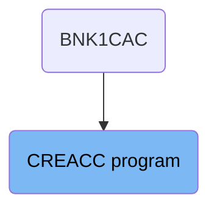

Here is a high level diagram of the program:

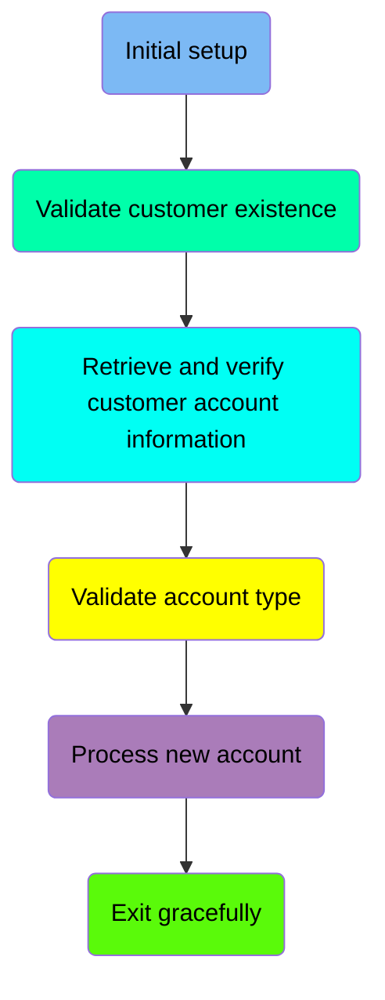

## Initial setup

First, we'll zoom into this section of the flow:

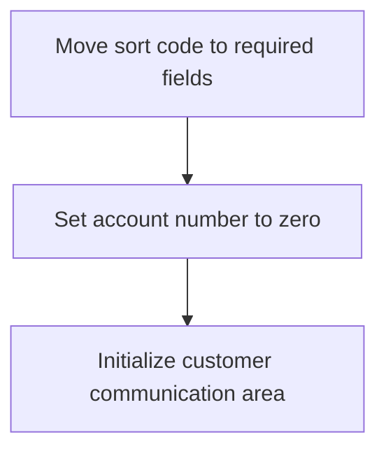

First, the sort code is moved to the required fields <SwmToken path="src/base/cobol_src/CREACC.cbl" pos="155:3:7" line-data="          03 REQUIRED-SORT-CODE             PIC 9(6) VALUE 0.">`REQUIRED-SORT-CODE`</SwmToken> and <SwmToken path="src/base/cobol_src/CREACC.cbl" pos="159:3:7" line-data="          03 REQUIRED-SORT-CODE2            PIC 9(6) VALUE 0.">`REQUIRED-SORT-CODE2`</SwmToken>. This ensures that the necessary sort code information is available for subsequent operations.

Next, the account number is set to zero. This step is crucial as it initializes the account number field, preparing it for the creation of a new account.

## Validate customer existence

Now, lets zoom into this section of the flow:

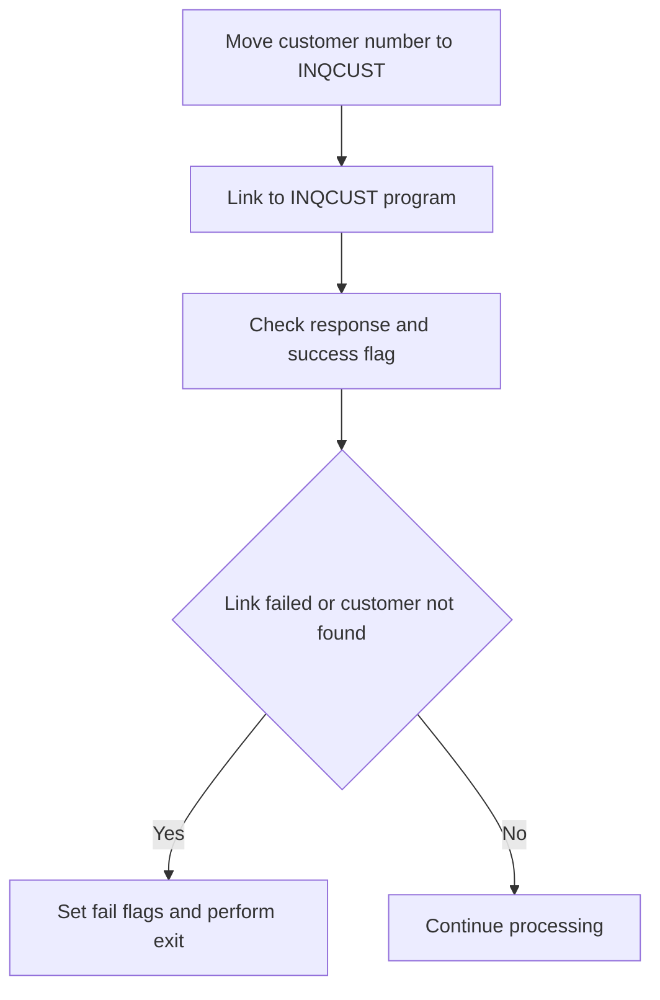

<SwmSnippet path="/src/base/cobol_src/CREACC.cbl" line="302">

---

First, the customer number from the communication area is moved to the <SwmToken path="src/base/cobol_src/CREACC.cbl" pos="302:13:15" line-data="           MOVE COMM-CUSTNO IN DFHCOMMAREA TO INQCUST-CUSTNO.">`INQCUST-CUSTNO`</SwmToken> field to prepare for the customer inquiry.

```cobol
           MOVE COMM-CUSTNO IN DFHCOMMAREA TO INQCUST-CUSTNO.
```

---

</SwmSnippet>

<SwmSnippet path="/src/base/cobol_src/CREACC.cbl" line="304">

---

Next, the program links to the <SwmToken path="src/base/cobol_src/CREACC.cbl" pos="304:10:10" line-data="           EXEC CICS LINK PROGRAM(&#39;INQCUST &#39;)">`INQCUST`</SwmToken> program, passing the customer number and other relevant data in the communication area. This step is crucial as it attempts to retrieve the customer information.

```cobol
           EXEC CICS LINK PROGRAM('INQCUST ')
                     COMMAREA(INQCUST-COMMAREA)
                     RESP(WS-CICS-RESP)
           END-EXEC.
```

---

</SwmSnippet>

<SwmSnippet path="/src/base/cobol_src/CREACC.cbl" line="314">

---

Moving to the validation step, the program checks if the response from the <SwmToken path="src/base/cobol_src/CREACC.cbl" pos="315:3:3" line-data="           OR INQCUST-INQ-SUCCESS IS NOT EQUAL TO &#39;Y&#39;">`INQCUST`</SwmToken> program is normal and if the customer inquiry was successful.

```cobol
           IF EIBRESP IS NOT EQUAL TO DFHRESP(NORMAL)
           OR INQCUST-INQ-SUCCESS IS NOT EQUAL TO 'Y'
```

---

</SwmSnippet>

<SwmSnippet path="/src/base/cobol_src/CREACC.cbl" line="317">

---

If the link to <SwmToken path="src/base/cobol_src/CREACC.cbl" pos="302:13:13" line-data="           MOVE COMM-CUSTNO IN DFHCOMMAREA TO INQCUST-CUSTNO.">`INQCUST`</SwmToken> failed or the customer information could not be retrieved, the program sets the failure flags in the communication area. This indicates that the customer validation was unsuccessful.

```cobol
             MOVE 'N' TO COMM-SUCCESS IN DFHCOMMAREA
             MOVE '1' TO COMM-FAIL-CODE IN DFHCOMMAREA
```

---

</SwmSnippet>

<SwmSnippet path="/src/base/cobol_src/CREACC.cbl" line="320">

---

Finally, the program performs the <SwmToken path="src/base/cobol_src/CREACC.cbl" pos="320:3:11" line-data="             PERFORM GET-ME-OUT-OF-HERE">`GET-ME-OUT-OF-HERE`</SwmToken> routine to handle the exit process when the customer validation fails.

```cobol
             PERFORM GET-ME-OUT-OF-HERE

```

---

</SwmSnippet>

## Retrieve and verify customer account information

Now, lets zoom into this section of the flow:

```mermaid
graph TD
  A[Perform CUSTOMER-ACCOUNT-COUNT] --> B{Check WS-CICS-RESP}
  B -->|Not Normal| C[Display Error and Set COMM-SUCCESS to 'N']
  C --> D[Perform GET-ME-OUT-OF-HERE]
  B -->|Normal| E{Check COMM-SUCCESS in INQACCCU-COMMAREA}
  E -->|N| F[Display Error and Set COMM-SUCCESS to 'N']
  F --> D
  E -->|Y| G{Check NUMBER-OF-ACCOUNTS in INQACCCU-COMMAREA}
  G -->|> 9| H[Set COMM-SUCCESS to 'N']
  H --> D

%% Swimm:
%% graph TD
%%   A[Perform <SwmToken path="src/base/cobol_src/CREACC.cbl" pos="327:3:7" line-data="           PERFORM CUSTOMER-ACCOUNT-COUNT.">`CUSTOMER-ACCOUNT-COUNT`</SwmToken>] --> B{Check <SwmToken path="src/base/cobol_src/CREACC.cbl" pos="306:3:7" line-data="                     RESP(WS-CICS-RESP)">`WS-CICS-RESP`</SwmToken>}
%%   B -->|Not Normal| C[Display Error and Set <SwmToken path="src/base/cobol_src/CREACC.cbl" pos="317:9:11" line-data="             MOVE &#39;N&#39; TO COMM-SUCCESS IN DFHCOMMAREA">`COMM-SUCCESS`</SwmToken> to 'N']
%%   C --> D[Perform <SwmToken path="src/base/cobol_src/CREACC.cbl" pos="320:3:11" line-data="             PERFORM GET-ME-OUT-OF-HERE">`GET-ME-OUT-OF-HERE`</SwmToken>]
%%   B -->|Normal| E{Check <SwmToken path="src/base/cobol_src/CREACC.cbl" pos="317:9:11" line-data="             MOVE &#39;N&#39; TO COMM-SUCCESS IN DFHCOMMAREA">`COMM-SUCCESS`</SwmToken> in <SwmToken path="src/base/cobol_src/CREACC.cbl" pos="332:15:17" line-data="             MOVE &#39;N&#39; to COMM-SUCCESS IN INQACCCU-COMMAREA">`INQACCCU-COMMAREA`</SwmToken>}
%%   E -->|N| F[Display Error and Set <SwmToken path="src/base/cobol_src/CREACC.cbl" pos="317:9:11" line-data="             MOVE &#39;N&#39; TO COMM-SUCCESS IN DFHCOMMAREA">`COMM-SUCCESS`</SwmToken> to 'N']
%%   F --> D
%%   E -->|Y| G{Check <SwmToken path="src/base/cobol_src/CREACC.cbl" pos="347:3:7" line-data="           IF NUMBER-OF-ACCOUNTS IN INQACCCU-COMMAREA &gt; 9">`NUMBER-OF-ACCOUNTS`</SwmToken> in <SwmToken path="src/base/cobol_src/CREACC.cbl" pos="332:15:17" line-data="             MOVE &#39;N&#39; to COMM-SUCCESS IN INQACCCU-COMMAREA">`INQACCCU-COMMAREA`</SwmToken>}
%%   G -->|> 9| H[Set <SwmToken path="src/base/cobol_src/CREACC.cbl" pos="317:9:11" line-data="             MOVE &#39;N&#39; TO COMM-SUCCESS IN DFHCOMMAREA">`COMM-SUCCESS`</SwmToken> to 'N']
%%   H --> D
```

First, the code performs the <SwmToken path="src/base/cobol_src/CREACC.cbl" pos="327:3:7" line-data="           PERFORM CUSTOMER-ACCOUNT-COUNT.">`CUSTOMER-ACCOUNT-COUNT`</SwmToken> operation to retrieve the number of accounts associated with the customer.

<SwmSnippet path="/src/base/cobol_src/CREACC.cbl" line="329">

---

Next, it checks if the response code <SwmToken path="src/base/cobol_src/CREACC.cbl" pos="329:3:7" line-data="           IF WS-CICS-RESP IS NOT EQUAL TO DFHRESP(NORMAL)">`WS-CICS-RESP`</SwmToken> is not equal to <SwmToken path="src/base/cobol_src/CREACC.cbl" pos="329:17:20" line-data="           IF WS-CICS-RESP IS NOT EQUAL TO DFHRESP(NORMAL)">`DFHRESP(NORMAL)`</SwmToken>. If the response is not normal, it displays an error message and sets <SwmToken path="src/base/cobol_src/CREACC.cbl" pos="331:9:11" line-data="             MOVE &#39;N&#39; to COMM-SUCCESS IN DFHCOMMAREA">`COMM-SUCCESS`</SwmToken> to 'N' in both <SwmToken path="src/base/cobol_src/CREACC.cbl" pos="331:15:15" line-data="             MOVE &#39;N&#39; to COMM-SUCCESS IN DFHCOMMAREA">`DFHCOMMAREA`</SwmToken> and <SwmToken path="src/base/cobol_src/CREACC.cbl" pos="332:15:17" line-data="             MOVE &#39;N&#39; to COMM-SUCCESS IN INQACCCU-COMMAREA">`INQACCCU-COMMAREA`</SwmToken>, indicating a failure.

```cobol
           IF WS-CICS-RESP IS NOT EQUAL TO DFHRESP(NORMAL)
             DISPLAY 'Error counting accounts'
             MOVE 'N' to COMM-SUCCESS IN DFHCOMMAREA
             MOVE 'N' to COMM-SUCCESS IN INQACCCU-COMMAREA
             MOVE '9' TO COMM-FAIL-CODE IN DFHCOMMAREA

             PERFORM GET-ME-OUT-OF-HERE
           END-IF
```

---

</SwmSnippet>

<SwmSnippet path="/src/base/cobol_src/CREACC.cbl" line="338">

---

Moving to the next condition, if <SwmToken path="src/base/cobol_src/CREACC.cbl" pos="338:3:5" line-data="           IF COMM-SUCCESS IN INQACCCU-COMMAREA = &#39;N&#39;">`COMM-SUCCESS`</SwmToken> in <SwmToken path="src/base/cobol_src/CREACC.cbl" pos="338:9:11" line-data="           IF COMM-SUCCESS IN INQACCCU-COMMAREA = &#39;N&#39;">`INQACCCU-COMMAREA`</SwmToken> is 'N', it again displays an error message and sets <SwmToken path="src/base/cobol_src/CREACC.cbl" pos="338:3:5" line-data="           IF COMM-SUCCESS IN INQACCCU-COMMAREA = &#39;N&#39;">`COMM-SUCCESS`</SwmToken> to 'N' in <SwmToken path="src/base/cobol_src/CREACC.cbl" pos="340:15:15" line-data="             MOVE &#39;N&#39; to COMM-SUCCESS IN DFHCOMMAREA">`DFHCOMMAREA`</SwmToken>, indicating a failure.

```cobol
           IF COMM-SUCCESS IN INQACCCU-COMMAREA = 'N'
             DISPLAY 'Error counting accounts'
             MOVE 'N' to COMM-SUCCESS IN DFHCOMMAREA
             MOVE '9' TO COMM-FAIL-CODE IN DFHCOMMAREA

             PERFORM GET-ME-OUT-OF-HERE
           END-IF
```

---

</SwmSnippet>

<SwmSnippet path="/src/base/cobol_src/CREACC.cbl" line="347">

---

Finally, if the <SwmToken path="src/base/cobol_src/CREACC.cbl" pos="347:3:7" line-data="           IF NUMBER-OF-ACCOUNTS IN INQACCCU-COMMAREA &gt; 9">`NUMBER-OF-ACCOUNTS`</SwmToken> in <SwmToken path="src/base/cobol_src/CREACC.cbl" pos="347:11:13" line-data="           IF NUMBER-OF-ACCOUNTS IN INQACCCU-COMMAREA &gt; 9">`INQACCCU-COMMAREA`</SwmToken> is greater than 9, it sets <SwmToken path="src/base/cobol_src/CREACC.cbl" pos="348:9:11" line-data="             MOVE &#39;N&#39; TO COMM-SUCCESS IN DFHCOMMAREA">`COMM-SUCCESS`</SwmToken> to 'N' in <SwmToken path="src/base/cobol_src/CREACC.cbl" pos="348:15:15" line-data="             MOVE &#39;N&#39; TO COMM-SUCCESS IN DFHCOMMAREA">`DFHCOMMAREA`</SwmToken> and assigns a failure code '8' to <SwmToken path="src/base/cobol_src/CREACC.cbl" pos="349:9:13" line-data="             MOVE &#39;8&#39; TO COMM-FAIL-CODE IN DFHCOMMAREA">`COMM-FAIL-CODE`</SwmToken>.

```cobol
           IF NUMBER-OF-ACCOUNTS IN INQACCCU-COMMAREA > 9
             MOVE 'N' TO COMM-SUCCESS IN DFHCOMMAREA
             MOVE '8' TO COMM-FAIL-CODE IN DFHCOMMAREA

             PERFORM GET-ME-OUT-OF-HERE
           END-IF
```

---

</SwmSnippet>

## Validate account type

Now, lets zoom into this section of the flow:

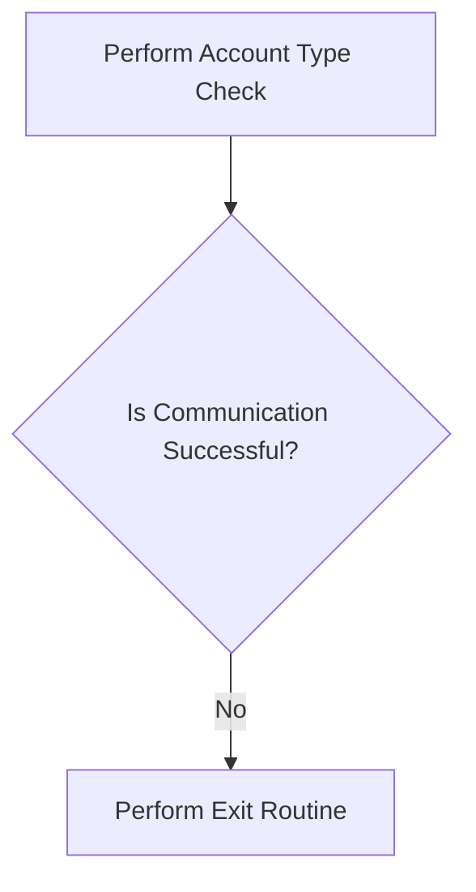

First, the function performs an account type check to validate the type of account, such as MORTGAGE.

<SwmSnippet path="/src/base/cobol_src/CREACC.cbl" line="357">

---

Next, it checks if the communication was successful by evaluating the <SwmToken path="src/base/cobol_src/CREACC.cbl" pos="359:3:5" line-data="           IF COMM-SUCCESS OF DFHCOMMAREA = &#39;N&#39;">`COMM-SUCCESS`</SwmToken> field of <SwmToken path="src/base/cobol_src/CREACC.cbl" pos="359:9:9" line-data="           IF COMM-SUCCESS OF DFHCOMMAREA = &#39;N&#39;">`DFHCOMMAREA`</SwmToken>. If the communication was not successful (indicated by 'N'), it performs an exit routine to handle the error.

```cobol
           PERFORM ACCOUNT-TYPE-CHECK

           IF COMM-SUCCESS OF DFHCOMMAREA = 'N'
             PERFORM GET-ME-OUT-OF-HERE
           END-IF
```

---

</SwmSnippet>

## Process new account

Now, lets zoom into this section of the flow:

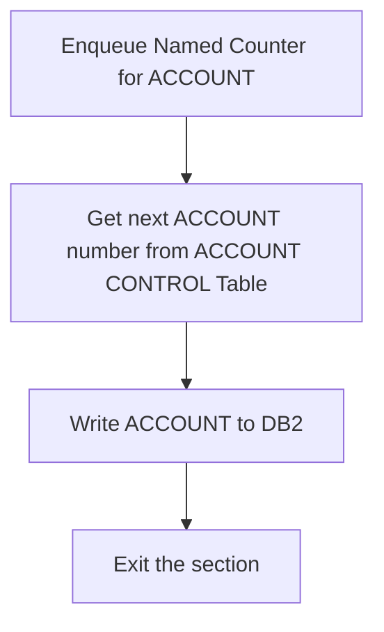

<SwmSnippet path="/src/base/cobol_src/CREACC.cbl" line="369">

---

First, the section enqueues the named counter for the account to ensure that the account number generation process is synchronized.

```cobol
           PERFORM ENQ-NAMED-COUNTER.
```

---

</SwmSnippet>

<SwmSnippet path="/src/base/cobol_src/CREACC.cbl" line="374">

---

Next, it retrieves the next available account number from the account control table, which is essential for creating a new account.

```cobol
           PERFORM FIND-NEXT-ACCOUNT.
```

---

</SwmSnippet>

<SwmSnippet path="/src/base/cobol_src/CREACC.cbl" line="376">

---

Then, the section writes the new account information to the <SwmToken path="src/base/cobol_src/CREACC.cbl" pos="376:7:7" line-data="           PERFORM WRITE-ACCOUNT-DB2">`DB2`</SwmToken> database, ensuring that the account is properly recorded.

```cobol
           PERFORM WRITE-ACCOUNT-DB2
```

---

</SwmSnippet>

## Exit gracefully

This is the next section of the flow.

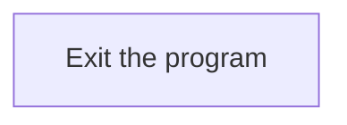

<SwmSnippet path="/src/base/cobol_src/CREACC.cbl" line="381">

---

The <SwmToken path="src/base/cobol_src/CREACC.cbl" pos="381:1:1" line-data="       P999.">`P999`</SwmToken> section is responsible for exiting the program. This is a standard practice in COBOL programs to define an exit point, ensuring that the program terminates correctly and releases any resources it may have been using.

```cobol
       P999.
           EXIT.
```

---

</SwmSnippet>

## Interim Summary

So far, we saw the process of creating a new account, including initial setup, validating customer existence, retrieving and verifying customer account information, validating account type, and processing the new account. Each step ensures that the necessary data is correctly handled and validated before proceeding to the next stage. Now, we will focus on the <SwmToken path="src/base/cobol_src/CREACC.cbl" pos="320:3:11" line-data="             PERFORM GET-ME-OUT-OF-HERE">`GET-ME-OUT-OF-HERE`</SwmToken> section, which handles the final steps of the transaction and ensures a clean exit from the program.

## <SwmToken path="src/base/cobol_src/CREACC.cbl" pos="320:3:11" line-data="             PERFORM GET-ME-OUT-OF-HERE">`GET-ME-OUT-OF-HERE`</SwmToken>

Lets' zoom into this section of the flow:

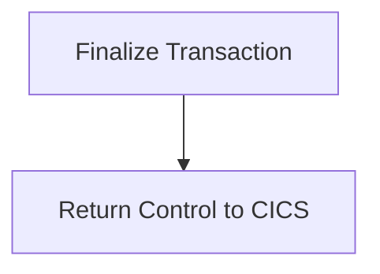

<SwmSnippet path="/src/base/cobol_src/CREACC.cbl" line="1068">

---

First, the <SwmToken path="src/base/cobol_src/CREACC.cbl" pos="1068:1:9" line-data="       GET-ME-OUT-OF-HERE SECTION.">`GET-ME-OUT-OF-HERE`</SwmToken> section is defined to handle the final steps of the transaction.

```cobol
       GET-ME-OUT-OF-HERE SECTION.
       GMOFH010.
```

---

</SwmSnippet>

<SwmSnippet path="/src/base/cobol_src/CREACC.cbl" line="1073">

---

Next, the <SwmToken path="src/base/cobol_src/CREACC.cbl" pos="1073:1:5" line-data="           EXEC CICS RETURN">`EXEC CICS RETURN`</SwmToken> command is executed to return control to the CICS environment, indicating that the transaction is complete.

```cobol
           EXEC CICS RETURN
           END-EXEC.
```

---

</SwmSnippet>

<SwmSnippet path="/src/base/cobol_src/CREACC.cbl" line="1076">

---

Finally, the section ends with the <SwmToken path="src/base/cobol_src/CREACC.cbl" pos="1077:1:1" line-data="           EXIT.">`EXIT`</SwmToken> statement, ensuring that the program exits cleanly.

```cobol
       GMOFH999.
           EXIT.
```

---

</SwmSnippet>

## <SwmToken path="src/base/cobol_src/CREACC.cbl" pos="327:3:7" line-data="           PERFORM CUSTOMER-ACCOUNT-COUNT.">`CUSTOMER-ACCOUNT-COUNT`</SwmToken>

Lets' zoom into this section of the flow:

```mermaid
graph TD
  A[Set number of accounts to 20] --> B[Move customer number to INQACCCU-COMMAREA] --> C[Link to INQACCCU program]

%% Swimm:
%% graph TD
%%   A[Set number of accounts to 20] --> B[Move customer number to <SwmToken path="src/base/cobol_src/CREACC.cbl" pos="332:15:17" line-data="             MOVE &#39;N&#39; to COMM-SUCCESS IN INQACCCU-COMMAREA">`INQACCCU-COMMAREA`</SwmToken>] --> C[Link to INQACCCU program]
```

<SwmSnippet path="/src/base/cobol_src/CREACC.cbl" line="1082">

---

First, the code sets the number of accounts to 20 by moving the value 20 to <SwmToken path="src/base/cobol_src/CREACC.cbl" pos="1082:7:11" line-data="           MOVE 20 TO NUMBER-OF-ACCOUNTS IN INQACCCU-COMMAREA.">`NUMBER-OF-ACCOUNTS`</SwmToken> in <SwmToken path="src/base/cobol_src/CREACC.cbl" pos="1082:15:17" line-data="           MOVE 20 TO NUMBER-OF-ACCOUNTS IN INQACCCU-COMMAREA.">`INQACCCU-COMMAREA`</SwmToken>.

```cobol
           MOVE 20 TO NUMBER-OF-ACCOUNTS IN INQACCCU-COMMAREA.
```

---

</SwmSnippet>

<SwmSnippet path="/src/base/cobol_src/CREACC.cbl" line="1083">

---

Next, the customer number from <SwmToken path="src/base/cobol_src/CREACC.cbl" pos="1083:9:9" line-data="           MOVE COMM-CUSTNO IN DFHCOMMAREA">`DFHCOMMAREA`</SwmToken> is moved to <SwmToken path="src/base/cobol_src/CREACC.cbl" pos="1084:3:5" line-data="             TO CUSTOMER-NUMBER IN INQACCCU-COMMAREA.">`CUSTOMER-NUMBER`</SwmToken> in <SwmToken path="src/base/cobol_src/CREACC.cbl" pos="1084:9:11" line-data="             TO CUSTOMER-NUMBER IN INQACCCU-COMMAREA.">`INQACCCU-COMMAREA`</SwmToken> to prepare for the account inquiry.

```cobol
           MOVE COMM-CUSTNO IN DFHCOMMAREA
             TO CUSTOMER-NUMBER IN INQACCCU-COMMAREA.
```

---

</SwmSnippet>

<SwmSnippet path="/src/base/cobol_src/CREACC.cbl" line="1088">

---

Then, the code links to the <SwmToken path="src/base/cobol_src/CREACC.cbl" pos="1088:10:10" line-data="           EXEC CICS LINK PROGRAM(&#39;INQACCCU&#39;)">`INQACCCU`</SwmToken> program, passing the <SwmToken path="src/base/cobol_src/CREACC.cbl" pos="1089:3:5" line-data="                COMMAREA(INQACCCU-COMMAREA)">`INQACCCU-COMMAREA`</SwmToken> which contains the customer number and the number of accounts to inquire about.

```cobol
           EXEC CICS LINK PROGRAM('INQACCCU')
                COMMAREA(INQACCCU-COMMAREA)
                RESP(WS-CICS-RESP)
                SYNCONRETURN
           END-EXEC.
```

---

</SwmSnippet>

## <SwmToken path="src/base/cobol_src/CREACC.cbl" pos="357:3:7" line-data="           PERFORM ACCOUNT-TYPE-CHECK">`ACCOUNT-TYPE-CHECK`</SwmToken>

Lets' zoom into this section of the flow:

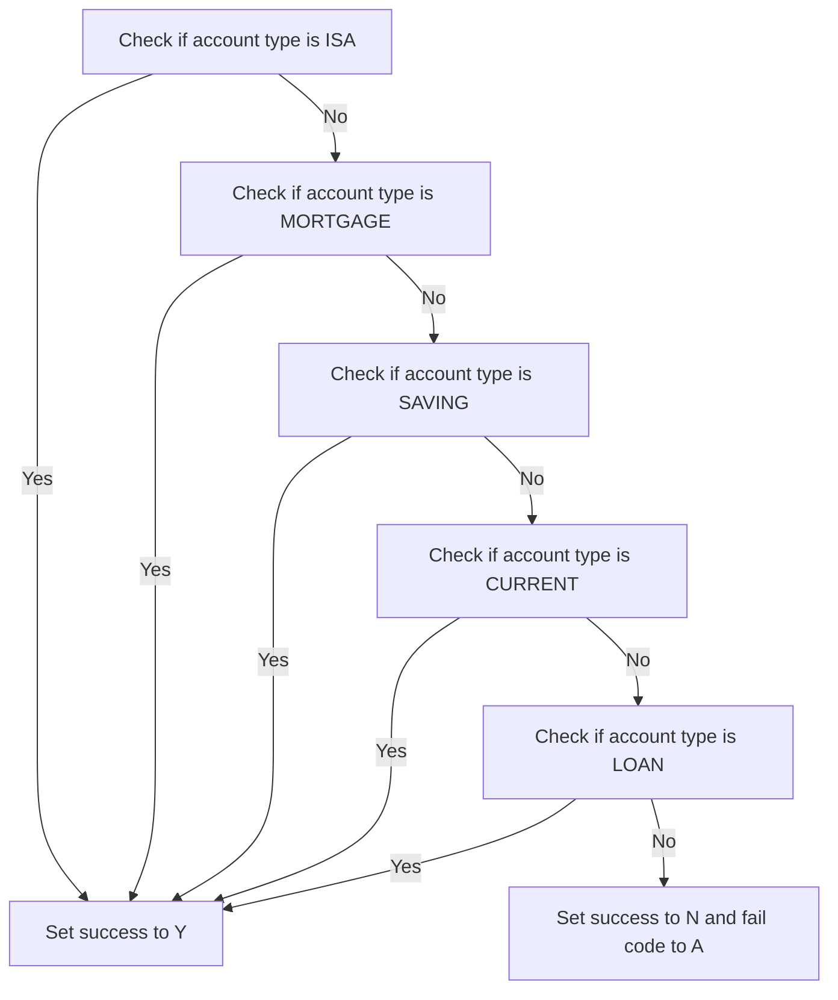

<SwmSnippet path="/src/base/cobol_src/CREACC.cbl" line="1215">

---

First, the function evaluates if the account type in <SwmToken path="src/base/cobol_src/CREACC.cbl" pos="1216:11:11" line-data="              WHEN COMM-ACC-TYPE IN DFHCOMMAREA(1:3) = &#39;ISA&#39;">`DFHCOMMAREA`</SwmToken> is 'ISA'. If it is, the function sets the success flag to 'Y'.

```cobol
           EVALUATE TRUE
              WHEN COMM-ACC-TYPE IN DFHCOMMAREA(1:3) = 'ISA'
```

---

</SwmSnippet>

<SwmSnippet path="/src/base/cobol_src/CREACC.cbl" line="1216">

---

Next, if the account type is not 'ISA', the function checks if it is 'MORTGAGE'. If it is, the function sets the success flag to 'Y'.

```cobol
              WHEN COMM-ACC-TYPE IN DFHCOMMAREA(1:3) = 'ISA'
              WHEN COMM-ACC-TYPE IN DFHCOMMAREA(1:8) = 'MORTGAGE'
```

---

</SwmSnippet>

<SwmSnippet path="/src/base/cobol_src/CREACC.cbl" line="1217">

---

Then, if the account type is neither 'ISA' nor 'MORTGAGE', the function continues to check for 'SAVING', 'CURRENT', and 'LOAN' in sequence, setting the success flag to 'Y' if any of these conditions are met. If none of these account types match, the function sets the success flag to 'N' and assigns a failure code 'A'.

```cobol
              WHEN COMM-ACC-TYPE IN DFHCOMMAREA(1:8) = 'MORTGAGE'
              WHEN COMM-ACC-TYPE IN DFHCOMMAREA(1:6) = 'SAVING'
              WHEN COMM-ACC-TYPE IN DFHCOMMAREA(1:7) = 'CURRENT'
              WHEN COMM-ACC-TYPE IN DFHCOMMAREA(1:4) = 'LOAN'
                 MOVE 'Y' TO COMM-SUCCESS OF DFHCOMMAREA
              WHEN OTHER
                 MOVE 'N' TO COMM-SUCCESS OF DFHCOMMAREA
                 MOVE 'A' TO COMM-FAIL-CODE IN DFHCOMMAREA
           END-EVALUATE.
```

---

</SwmSnippet>

## <SwmToken path="src/base/cobol_src/CREACC.cbl" pos="369:3:7" line-data="           PERFORM ENQ-NAMED-COUNTER.">`ENQ-NAMED-COUNTER`</SwmToken>

Lets' zoom into this section of the flow:

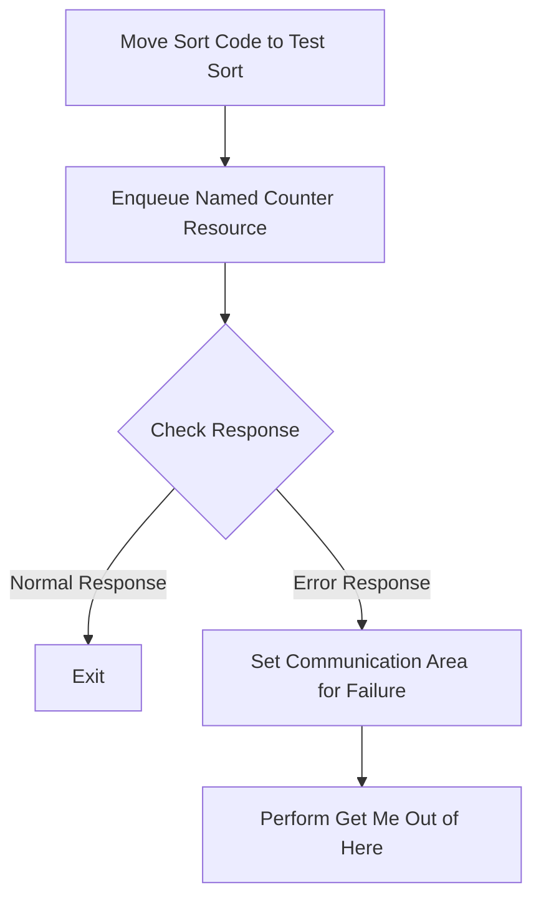

<SwmSnippet path="/src/base/cobol_src/CREACC.cbl" line="388">

---

### Moving Sort Code to Test Sort

First, the sort code is moved to the <SwmToken path="src/base/cobol_src/CREACC.cbl" pos="388:7:15" line-data="           MOVE SORTCODE TO NCS-ACC-NO-TEST-SORT.">`NCS-ACC-NO-TEST-SORT`</SwmToken> field. This prepares the sort code for the subsequent operations.

```cobol
           MOVE SORTCODE TO NCS-ACC-NO-TEST-SORT.
```

---

</SwmSnippet>

<SwmSnippet path="/src/base/cobol_src/CREACC.cbl" line="390">

---

### Enqueue Named Counter Resource

Next, the program enqueues the named counter resource <SwmToken path="src/base/cobol_src/CREACC.cbl" pos="391:3:9" line-data="              RESOURCE(NCS-ACC-NO-NAME)">`NCS-ACC-NO-NAME`</SwmToken> using the CICS <SwmToken path="src/base/cobol_src/CREACC.cbl" pos="390:5:5" line-data="           EXEC CICS ENQ">`ENQ`</SwmToken> command. This ensures that the resource is locked for exclusive use, preventing other transactions from modifying it simultaneously.

```cobol
           EXEC CICS ENQ
              RESOURCE(NCS-ACC-NO-NAME)
              LENGTH(16)
              RESP(WS-CICS-RESP)
              RESP2(WS-CICS-RESP2)
           END-EXEC.
```

---

</SwmSnippet>

<SwmSnippet path="/src/base/cobol_src/CREACC.cbl" line="397">

---

### Checking the Response

Then, the program checks the response from the <SwmToken path="src/base/cobol_src/CREACC.cbl" pos="369:3:3" line-data="           PERFORM ENQ-NAMED-COUNTER.">`ENQ`</SwmToken> command. If the response is not normal, it indicates an issue with enqueuing the resource.

```cobol
           IF WS-CICS-RESP NOT = DFHRESP(NORMAL)
```

---

</SwmSnippet>

<SwmSnippet path="/src/base/cobol_src/CREACC.cbl" line="398">

---

### Handling Errors

If an error occurs, the program sets the communication area to indicate failure by moving 'N' to <SwmToken path="src/base/cobol_src/CREACC.cbl" pos="398:9:11" line-data="             MOVE &#39;N&#39; TO COMM-SUCCESS IN DFHCOMMAREA">`COMM-SUCCESS`</SwmToken> and '3' to <SwmToken path="src/base/cobol_src/CREACC.cbl" pos="399:9:13" line-data="             MOVE &#39;3&#39; TO COMM-FAIL-CODE IN DFHCOMMAREA">`COMM-FAIL-CODE`</SwmToken>. It then performs the <SwmToken path="src/base/cobol_src/CREACC.cbl" pos="400:3:11" line-data="             PERFORM GET-ME-OUT-OF-HERE">`GET-ME-OUT-OF-HERE`</SwmToken> routine to handle the error.

```cobol
             MOVE 'N' TO COMM-SUCCESS IN DFHCOMMAREA
             MOVE '3' TO COMM-FAIL-CODE IN DFHCOMMAREA
             PERFORM GET-ME-OUT-OF-HERE
           END-IF.
```

---

</SwmSnippet>

# Find next acc. number (<SwmToken path="src/base/cobol_src/CREACC.cbl" pos="374:3:7" line-data="           PERFORM FIND-NEXT-ACCOUNT.">`FIND-NEXT-ACCOUNT`</SwmToken>)

Let's split this section into smaller parts:

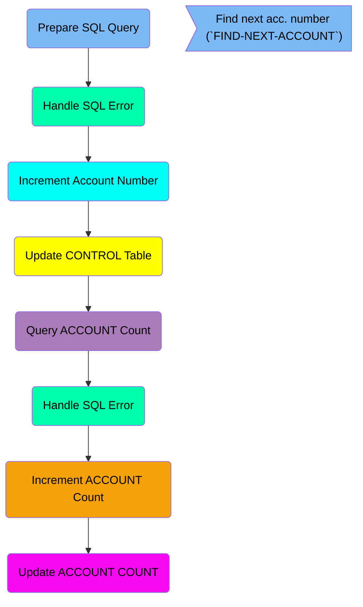

## Prepare SQL Query

First, we'll zoom into this section of the flow:

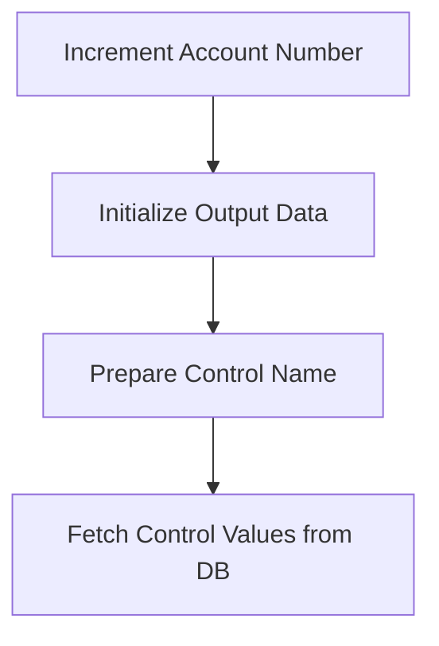

<SwmSnippet path="/src/base/cobol_src/CREACC.cbl" line="432">

---

### Increment Account Number

First, the account number increment value is set to 1, indicating that we are looking for the next account number.

```cobol
           MOVE 1 TO NCS-ACC-NO-INC.
```

---

</SwmSnippet>

<SwmSnippet path="/src/base/cobol_src/CREACC.cbl" line="434">

---

### Initialize Output Data

Next, the output data structure is initialized to ensure that any previous data does not interfere with the current operation.

```cobol
           INITIALIZE OUTPUT-DATA.
```

---

</SwmSnippet>

## Handle SQL Error

Now, lets zoom into this section of the flow:

```mermaid
graph TD
  A[Check SQLCODE] -->|SQLCODE != 0| B[Initialize ABNDINFO-REC]
  B --> C[Move EIBRESP to ABND-RESPCODE]
  C --> D[Move EIBRESP2 to ABND-RESP2CODE]
  D --> E[Assign APPLID to ABND-APPLID]
  E --> F[Move EIBTASKN to ABND-TASKNO-KEY]
  F --> G[Move EIBTRNID to ABND-TRANID]
  G --> H[Perform POPULATE-TIME-DATE2]
  H --> I[Move WS-ORIG-DATE to ABND-DATE]
  I --> J[Format and move current time to ABND-TIME]
  J --> K[Move WS-U-TIME to ABND-UTIME-KEY]
  K --> L[Move 'HNCS' to ABND-CODE]
  L --> M[Assign PROGRAM to ABND-PROGRAM]
  M --> N[Move SQLCODE-DISPLAY to ABND-SQLCODE]
  N --> O[Format and move error message to ABND-FREEFORM]
  O --> P[Link to ABEND handler program]
  P --> Q[Display error message]
  Q --> R[Trigger CICS ABEND]

%% Swimm:
%% graph TD
%%   A[Check SQLCODE] -->|SQLCODE != 0| B[Initialize <SwmToken path="src/base/cobol_src/CREACC.cbl" pos="543:3:5" line-data="               INITIALIZE ABNDINFO-REC">`ABNDINFO-REC`</SwmToken>]
%%   B --> C[Move EIBRESP to <SwmToken path="src/base/cobol_src/CREACC.cbl" pos="580:1:3" line-data="                    ABND-RESPCODE DELIMITED BY SIZE,">`ABND-RESPCODE`</SwmToken>]
%%   C --> D[Move <SwmToken path="src/base/cobol_src/CREACC.cbl" pos="633:3:3" line-data="             MOVE EIBRESP2   TO ABND-RESP2CODE">`EIBRESP2`</SwmToken> to <SwmToken path="src/base/cobol_src/CREACC.cbl" pos="582:1:3" line-data="                    ABND-RESP2CODE DELIMITED BY SIZE">`ABND-RESP2CODE`</SwmToken>]
%%   D --> E[Assign APPLID to <SwmToken path="src/base/cobol_src/CREACC.cbl" pos="549:9:11" line-data="               EXEC CICS ASSIGN APPLID(ABND-APPLID)">`ABND-APPLID`</SwmToken>]
%%   E --> F[Move EIBTASKN to <SwmToken path="src/base/cobol_src/CREACC.cbl" pos="552:7:11" line-data="               MOVE EIBTASKN   TO ABND-TASKNO-KEY">`ABND-TASKNO-KEY`</SwmToken>]
%%   F --> G[Move EIBTRNID to <SwmToken path="src/base/cobol_src/CREACC.cbl" pos="553:7:9" line-data="               MOVE EIBTRNID   TO ABND-TRANID">`ABND-TRANID`</SwmToken>]
%%   G --> H[Perform <SwmToken path="src/base/cobol_src/CREACC.cbl" pos="555:3:7" line-data="               PERFORM POPULATE-TIME-DATE2">`POPULATE-TIME-DATE2`</SwmToken>]
%%   H --> I[Move <SwmToken path="src/base/cobol_src/CREACC.cbl" pos="557:3:7" line-data="               MOVE WS-ORIG-DATE TO ABND-DATE">`WS-ORIG-DATE`</SwmToken> to <SwmToken path="src/base/cobol_src/CREACC.cbl" pos="557:11:13" line-data="               MOVE WS-ORIG-DATE TO ABND-DATE">`ABND-DATE`</SwmToken>]
%%   I --> J[Format and move current time to <SwmToken path="src/base/cobol_src/CREACC.cbl" pos="563:3:5" line-data="                     INTO ABND-TIME">`ABND-TIME`</SwmToken>]
%%   J --> K[Move <SwmToken path="src/base/cobol_src/CREACC.cbl" pos="947:3:7" line-data="              ABSTIME(WS-U-TIME)">`WS-U-TIME`</SwmToken> to <SwmToken path="src/base/cobol_src/CREACC.cbl" pos="488:11:15" line-data="             MOVE WS-U-TIME   TO ABND-UTIME-KEY">`ABND-UTIME-KEY`</SwmToken>]
%%   K --> L[Move 'HNCS' to <SwmToken path="src/base/cobol_src/CREACC.cbl" pos="489:9:11" line-data="             MOVE &#39;HNCS&#39;      TO ABND-CODE">`ABND-CODE`</SwmToken>]
%%   L --> M[Assign PROGRAM to <SwmToken path="src/base/cobol_src/CREACC.cbl" pos="657:9:11" line-data="             EXEC CICS ASSIGN PROGRAM(ABND-PROGRAM)">`ABND-PROGRAM`</SwmToken>]
%%   M --> N[Move <SwmToken path="src/base/cobol_src/CREACC.cbl" pos="522:9:11" line-data="      D      MOVE SQLCODE TO SQLCODE-DISPLAY">`SQLCODE-DISPLAY`</SwmToken> to <SwmToken path="src/base/cobol_src/CREACC.cbl" pos="1044:9:11" line-data="              MOVE SQLCODE-DISPLAY    TO ABND-SQLCODE">`ABND-SQLCODE`</SwmToken>]
%%   N --> O[Format and move error message to <SwmToken path="src/base/cobol_src/CREACC.cbl" pos="583:3:5" line-data="                    INTO ABND-FREEFORM">`ABND-FREEFORM`</SwmToken>]
%%   O --> P[Link to ABEND handler program]
%%   P --> Q[Display error message]
%%   Q --> R[Trigger CICS ABEND]
```

First, we check if <SwmToken path="src/base/cobol_src/CREACC.cbl" pos="522:5:5" line-data="      D      MOVE SQLCODE TO SQLCODE-DISPLAY">`SQLCODE`</SwmToken> (the SQL return code) is not equal to zero, indicating an error occurred during the database access.

Next, we initialize <SwmToken path="src/base/cobol_src/CREACC.cbl" pos="543:3:5" line-data="               INITIALIZE ABNDINFO-REC">`ABNDINFO-REC`</SwmToken> (the abend information record) to prepare for capturing error details.

We then move <SwmToken path="src/base/cobol_src/CREACC.cbl" pos="314:3:3" line-data="           IF EIBRESP IS NOT EQUAL TO DFHRESP(NORMAL)">`EIBRESP`</SwmToken> (the CICS response code) to <SwmToken path="src/base/cobol_src/CREACC.cbl" pos="580:1:3" line-data="                    ABND-RESPCODE DELIMITED BY SIZE,">`ABND-RESPCODE`</SwmToken> to record the response code.

Similarly, we move <SwmToken path="src/base/cobol_src/CREACC.cbl" pos="633:3:3" line-data="             MOVE EIBRESP2   TO ABND-RESP2CODE">`EIBRESP2`</SwmToken> (the CICS extended response code) to <SwmToken path="src/base/cobol_src/CREACC.cbl" pos="582:1:3" line-data="                    ABND-RESP2CODE DELIMITED BY SIZE">`ABND-RESP2CODE`</SwmToken> to capture additional response information.

We assign the application ID to <SwmToken path="src/base/cobol_src/CREACC.cbl" pos="549:9:11" line-data="               EXEC CICS ASSIGN APPLID(ABND-APPLID)">`ABND-APPLID`</SwmToken> to identify the application where the error occurred.

We move <SwmToken path="src/base/cobol_src/CREACC.cbl" pos="552:3:3" line-data="               MOVE EIBTASKN   TO ABND-TASKNO-KEY">`EIBTASKN`</SwmToken> (the task number) to <SwmToken path="src/base/cobol_src/CREACC.cbl" pos="552:7:11" line-data="               MOVE EIBTASKN   TO ABND-TASKNO-KEY">`ABND-TASKNO-KEY`</SwmToken> and <SwmToken path="src/base/cobol_src/CREACC.cbl" pos="553:3:3" line-data="               MOVE EIBTRNID   TO ABND-TRANID">`EIBTRNID`</SwmToken> (the transaction ID) to <SwmToken path="src/base/cobol_src/CREACC.cbl" pos="553:7:9" line-data="               MOVE EIBTRNID   TO ABND-TRANID">`ABND-TRANID`</SwmToken> to capture task and transaction details.

We perform <SwmToken path="src/base/cobol_src/CREACC.cbl" pos="555:3:7" line-data="               PERFORM POPULATE-TIME-DATE2">`POPULATE-TIME-DATE2`</SwmToken> to get the current date and time, then move <SwmToken path="src/base/cobol_src/CREACC.cbl" pos="557:3:7" line-data="               MOVE WS-ORIG-DATE TO ABND-DATE">`WS-ORIG-DATE`</SwmToken> to <SwmToken path="src/base/cobol_src/CREACC.cbl" pos="557:11:13" line-data="               MOVE WS-ORIG-DATE TO ABND-DATE">`ABND-DATE`</SwmToken> and format the current time into <SwmToken path="src/base/cobol_src/CREACC.cbl" pos="563:3:5" line-data="                     INTO ABND-TIME">`ABND-TIME`</SwmToken>.

We move <SwmToken path="src/base/cobol_src/CREACC.cbl" pos="947:3:7" line-data="              ABSTIME(WS-U-TIME)">`WS-U-TIME`</SwmToken> (the universal time) to <SwmToken path="src/base/cobol_src/CREACC.cbl" pos="488:11:15" line-data="             MOVE WS-U-TIME   TO ABND-UTIME-KEY">`ABND-UTIME-KEY`</SwmToken> and set <SwmToken path="src/base/cobol_src/CREACC.cbl" pos="489:9:11" line-data="             MOVE &#39;HNCS&#39;      TO ABND-CODE">`ABND-CODE`</SwmToken> to 'HNCS' to indicate the error code.

We assign the current program name to <SwmToken path="src/base/cobol_src/CREACC.cbl" pos="657:9:11" line-data="             EXEC CICS ASSIGN PROGRAM(ABND-PROGRAM)">`ABND-PROGRAM`</SwmToken> and move <SwmToken path="src/base/cobol_src/CREACC.cbl" pos="522:9:11" line-data="      D      MOVE SQLCODE TO SQLCODE-DISPLAY">`SQLCODE-DISPLAY`</SwmToken> to <SwmToken path="src/base/cobol_src/CREACC.cbl" pos="1044:9:11" line-data="              MOVE SQLCODE-DISPLAY    TO ABND-SQLCODE">`ABND-SQLCODE`</SwmToken> to capture the SQL error code.

We format and move a detailed error message into <SwmToken path="src/base/cobol_src/CREACC.cbl" pos="583:3:5" line-data="                    INTO ABND-FREEFORM">`ABND-FREEFORM`</SwmToken> to provide context for the error.

We link to the ABEND handler program using <SwmToken path="src/base/cobol_src/CREACC.cbl" pos="586:9:13" line-data="               EXEC CICS LINK PROGRAM(WS-ABEND-PGM)">`WS-ABEND-PGM`</SwmToken> and pass <SwmToken path="src/base/cobol_src/CREACC.cbl" pos="543:3:5" line-data="               INITIALIZE ABNDINFO-REC">`ABNDINFO-REC`</SwmToken> to handle the error.

## Increment Account Number

This is the next section of the flow.

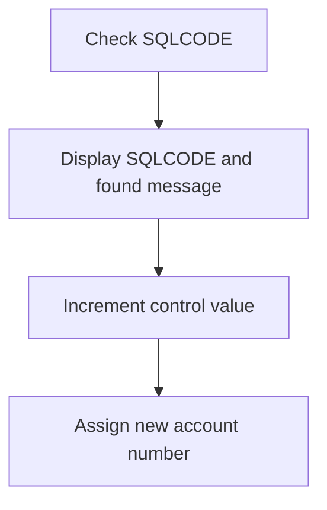

<SwmSnippet path="/src/base/cobol_src/CREACC.cbl" line="521">

---

First, the code checks the <SwmToken path="src/base/cobol_src/CREACC.cbl" pos="522:5:5" line-data="      D      MOVE SQLCODE TO SQLCODE-DISPLAY">`SQLCODE`</SwmToken> to determine the outcome of the previous SQL operation. If the <SwmToken path="src/base/cobol_src/CREACC.cbl" pos="522:5:5" line-data="      D      MOVE SQLCODE TO SQLCODE-DISPLAY">`SQLCODE`</SwmToken> indicates an error or a specific condition, it moves the <SwmToken path="src/base/cobol_src/CREACC.cbl" pos="522:5:5" line-data="      D      MOVE SQLCODE TO SQLCODE-DISPLAY">`SQLCODE`</SwmToken> to <SwmToken path="src/base/cobol_src/CREACC.cbl" pos="522:9:11" line-data="      D      MOVE SQLCODE TO SQLCODE-DISPLAY">`SQLCODE-DISPLAY`</SwmToken> for logging purposes.

```cobol
           ELSE
      D      MOVE SQLCODE TO SQLCODE-DISPLAY
```

---

</SwmSnippet>

<SwmSnippet path="/src/base/cobol_src/CREACC.cbl" line="523">

---

Next, the code increments the <SwmToken path="src/base/cobol_src/CREACC.cbl" pos="524:3:9" line-data="      D        HV-CONTROL-VALUE-NUM">`HV-CONTROL-VALUE-NUM`</SwmToken> (which likely holds the current highest account number) by 1 and assigns this new value to <SwmToken path="src/base/cobol_src/CREACC.cbl" pos="526:1:3" line-data="             COMM-NUMBER ACCOUNT-NUMBER REQUIRED-ACCT-NUMBER3">`COMM-NUMBER`</SwmToken>, <SwmToken path="src/base/cobol_src/CREACC.cbl" pos="526:5:7" line-data="             COMM-NUMBER ACCOUNT-NUMBER REQUIRED-ACCT-NUMBER3">`ACCOUNT-NUMBER`</SwmToken>, and <SwmToken path="src/base/cobol_src/CREACC.cbl" pos="526:9:13" line-data="             COMM-NUMBER ACCOUNT-NUMBER REQUIRED-ACCT-NUMBER3">`REQUIRED-ACCT-NUMBER3`</SwmToken>, effectively generating the next available account number.

```cobol
      D      DISPLAY 'SELECT WAS ' SQLCODE-DISPLAY ' AND FOUND '
      D        HV-CONTROL-VALUE-NUM
             ADD 1 TO HV-CONTROL-VALUE-NUM GIVING
             COMM-NUMBER ACCOUNT-NUMBER REQUIRED-ACCT-NUMBER3
             NCS-ACC-NO-VALUE HV-CONTROL-VALUE-NUM
```

---

</SwmSnippet>

## Update CONTROL Table

Now, lets zoom into this section of the flow:

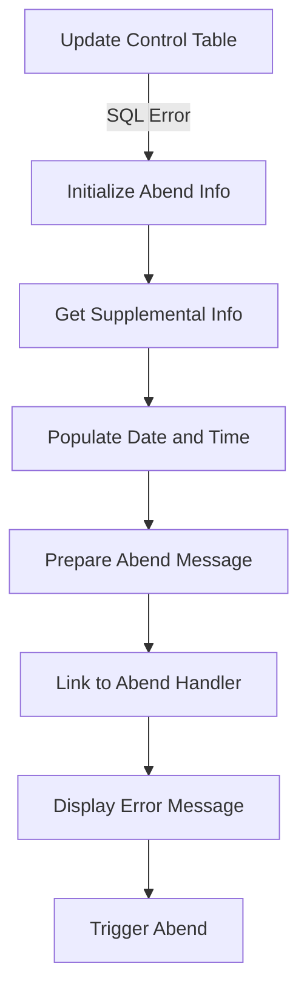

<SwmSnippet path="/src/base/cobol_src/CREACC.cbl" line="529">

---

### Updating Control Table

First, the function attempts to update the control table with the new control value number.

```cobol
             EXEC SQL
               UPDATE CONTROL
               SET CONTROL_VALUE_NUM = :HV-CONTROL-VALUE-NUM
               WHERE (CONTROL_NAME = :HV-CONTROL-NAME)
             END-EXEC
```

---

</SwmSnippet>

<SwmSnippet path="/src/base/cobol_src/CREACC.cbl" line="534">

---

### Handling SQL Error

If the SQL update fails, the SQL error code is stored for further processing.

```cobol
             IF SQLCODE IS NOT EQUAL TO ZERO
               MOVE SQLCODE TO SQLCODE-DISPLAY
```

---

</SwmSnippet>

<SwmSnippet path="/src/base/cobol_src/CREACC.cbl" line="543">

---

### Initializing Abend Info

Next, the function initializes the abend (abnormal end) information record to prepare for error handling.

```cobol
               INITIALIZE ABNDINFO-REC
```

---

</SwmSnippet>

<SwmSnippet path="/src/base/cobol_src/CREACC.cbl" line="549">

---

### Getting Supplemental Info

The function retrieves supplemental information such as application ID, task number, and transaction ID.

```cobol
               EXEC CICS ASSIGN APPLID(ABND-APPLID)
               END-EXEC

               MOVE EIBTASKN   TO ABND-TASKNO-KEY
               MOVE EIBTRNID   TO ABND-TRANID

```

---

</SwmSnippet>

<SwmSnippet path="/src/base/cobol_src/CREACC.cbl" line="555">

---

### Populating Date and Time

Then, it populates the current date and time into the abend information record.

```cobol
               PERFORM POPULATE-TIME-DATE2

               MOVE WS-ORIG-DATE TO ABND-DATE
               STRING WS-TIME-NOW-GRP-HH DELIMITED BY SIZE,
                    ':' DELIMITED BY SIZE,
                     WS-TIME-NOW-GRP-MM DELIMITED BY SIZE,
                     ':' DELIMITED BY SIZE,
                     WS-TIME-NOW-GRP-MM DELIMITED BY SIZE
                     INTO ABND-TIME
```

---

</SwmSnippet>

<SwmSnippet path="/src/base/cobol_src/CREACC.cbl" line="574">

---

### Preparing Abend Message

The function prepares a detailed abend message that includes the SQL error code and other relevant information.

```cobol
               STRING 'FNAND010(2) - ACCOUNT NCS '
                    DELIMITED BY SIZE,
                    NCS-ACC-NO-NAME DELIMITED BY SIZE,
                    ' Cannot be accessed and DB2 UPDATE failed.'
                    DELIMITED BY SIZE,
                    ' EIBRESP=' DELIMITED BY SIZE,
                    ABND-RESPCODE DELIMITED BY SIZE,
                    ' RESP2=' DELIMITED BY SIZE,
                    ABND-RESP2CODE DELIMITED BY SIZE
                    INTO ABND-FREEFORM
```

---

</SwmSnippet>

<SwmSnippet path="/src/base/cobol_src/CREACC.cbl" line="586">

---

### Linking to Abend Handler

It then links to the abend handler program to process the error.

```cobol
               EXEC CICS LINK PROGRAM(WS-ABEND-PGM)
                        COMMAREA(ABNDINFO-REC)
               END-EXEC
```

---

</SwmSnippet>

<SwmSnippet path="/src/base/cobol_src/CREACC.cbl" line="591">

---

### Displaying Error Message

An error message is displayed to indicate that the account cannot be accessed and the <SwmToken path="src/base/cobol_src/CREACC.cbl" pos="592:11:11" line-data="                  &#39; CANNOT BE ACCESSED AND DB2 UPDATE FAILED. SQLCODE=&#39;">`DB2`</SwmToken> update failed.

```cobol
               DISPLAY 'CREACC - ACCOUNT NCS ' NCS-ACC-NO-NAME
                  ' CANNOT BE ACCESSED AND DB2 UPDATE FAILED. SQLCODE='
                SQLCODE-DISPLAY
```

---

</SwmSnippet>

<SwmSnippet path="/src/base/cobol_src/CREACC.cbl" line="595">

---

### Triggering Abend

Finally, the function triggers an abend with a specific abend code to terminate the transaction.

```cobol
               EXEC CICS ABEND
                         ABCODE('HNCS')
                         NODUMP
               END-EXEC
```

---

</SwmSnippet>

## Query ACCOUNT Count

This is the next section of the flow.

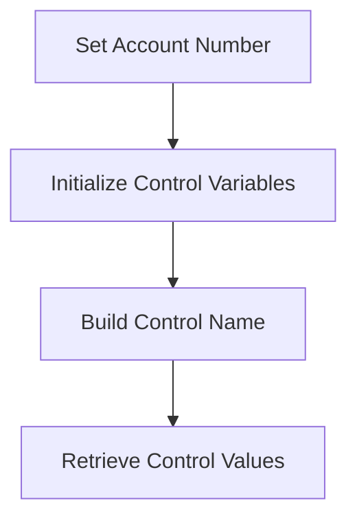

<SwmSnippet path="/src/base/cobol_src/CREACC.cbl" line="602">

---

First, the account number is set by moving <SwmToken path="src/base/cobol_src/CREACC.cbl" pos="602:3:9" line-data="           MOVE NCS-ACC-NO-VALUE TO">`NCS-ACC-NO-VALUE`</SwmToken> to <SwmToken path="src/base/cobol_src/CREACC.cbl" pos="603:1:3" line-data="           COMM-NUMBER ACCOUNT-NUMBER REQUIRED-ACCT-NUMBER3.">`COMM-NUMBER`</SwmToken>, <SwmToken path="src/base/cobol_src/CREACC.cbl" pos="603:5:7" line-data="           COMM-NUMBER ACCOUNT-NUMBER REQUIRED-ACCT-NUMBER3.">`ACCOUNT-NUMBER`</SwmToken>, and <SwmToken path="src/base/cobol_src/CREACC.cbl" pos="603:9:13" line-data="           COMM-NUMBER ACCOUNT-NUMBER REQUIRED-ACCT-NUMBER3.">`REQUIRED-ACCT-NUMBER3`</SwmToken>.

```cobol
           MOVE NCS-ACC-NO-VALUE TO
           COMM-NUMBER ACCOUNT-NUMBER REQUIRED-ACCT-NUMBER3.
```

---

</SwmSnippet>

<SwmSnippet path="/src/base/cobol_src/CREACC.cbl" line="604">

---

Next, control variables are initialized by setting <SwmToken path="src/base/cobol_src/CREACC.cbl" pos="604:7:11" line-data="           MOVE SPACES TO HV-CONTROL-NAME">`HV-CONTROL-NAME`</SwmToken> and <SwmToken path="src/base/cobol_src/CREACC.cbl" pos="606:7:13" line-data="           MOVE SPACES TO HV-CONTROL-VALUE-STR">`HV-CONTROL-VALUE-STR`</SwmToken> to spaces and <SwmToken path="src/base/cobol_src/CREACC.cbl" pos="605:7:13" line-data="           MOVE ZERO TO HV-CONTROL-VALUE-NUM">`HV-CONTROL-VALUE-NUM`</SwmToken> to zero. Then, the control name is built by concatenating <SwmToken path="src/base/cobol_src/CREACC.cbl" pos="607:3:3" line-data="           STRING SORTCODE DELIMITED BY SIZE">`SORTCODE`</SwmToken>, a hyphen, and <SwmToken path="src/base/cobol_src/CREACC.cbl" pos="609:2:4" line-data="           &#39;ACCOUNT-COUNT&#39; DELIMITED BY SIZE">`ACCOUNT-COUNT`</SwmToken> into <SwmToken path="src/base/cobol_src/CREACC.cbl" pos="604:7:11" line-data="           MOVE SPACES TO HV-CONTROL-NAME">`HV-CONTROL-NAME`</SwmToken>. Finally, the control values are retrieved from the <SwmToken path="src/base/cobol_src/CREACC.cbl" pos="604:9:9" line-data="           MOVE SPACES TO HV-CONTROL-NAME">`CONTROL`</SwmToken> table where <SwmToken path="src/base/cobol_src/CREACC.cbl" pos="612:3:3" line-data="              SELECT CONTROL_NAME,">`CONTROL_NAME`</SwmToken> matches <SwmToken path="src/base/cobol_src/CREACC.cbl" pos="604:7:11" line-data="           MOVE SPACES TO HV-CONTROL-NAME">`HV-CONTROL-NAME`</SwmToken>.

```cobol
           MOVE SPACES TO HV-CONTROL-NAME
           MOVE ZERO TO HV-CONTROL-VALUE-NUM
           MOVE SPACES TO HV-CONTROL-VALUE-STR
           STRING SORTCODE DELIMITED BY SIZE
           '-' DELIMITED BY SIZE
           'ACCOUNT-COUNT' DELIMITED BY SIZE
           INTO HV-CONTROL-NAME
           EXEC SQL
              SELECT CONTROL_NAME,
                       CONTROL_VALUE_NUM,
                       CONTROL_VALUE_STR
              INTO :HV-CONTROL-NAME,
                      :HV-CONTROL-VALUE-NUM,
                      :HV-CONTROL-VALUE-STR
              FROM CONTROL
              WHERE CONTROL_NAME = :HV-CONTROL-NAME
           END-EXEC.
```

---

</SwmSnippet>

## Handle SQL Error

Now, lets zoom into this section of the flow:

```mermaid
graph TD
  A[Check SQLCODE] -->|SQLCODE != 0| B[Initialize ABNDINFO-REC]
  B --> C[Move EIBRESP to ABND-RESPCODE]
  C --> D[Move EIBRESP2 to ABND-RESP2CODE]
  D --> E[Get supplemental information]
  E --> F[Move EIBTASKN to ABND-TASKNO-KEY]
  F --> G[Move EIBTRNID to ABND-TRANID]
  G --> H[Perform POPULATE-TIME-DATE2]
  H --> I[Move WS-ORIG-DATE to ABND-DATE]
  I --> J[Format and move current time to ABND-TIME]
  J --> K[Move WS-U-TIME to ABND-UTIME-KEY]
  K --> L[Move 'HNCS' to ABND-CODE]
  L --> M[Assign current program to ABND-PROGRAM]
  M --> N[Move SQLCODE-DISPLAY to ABND-SQLCODE]
  N --> O[Format and move error message to ABND-FREEFORM]
  O --> P[Link to ABEND handler program]
  P --> Q[Display error message]
  Q --> R[Trigger CICS ABEND]

%% Swimm:
%% graph TD
%%   A[Check SQLCODE] -->|SQLCODE != 0| B[Initialize <SwmToken path="src/base/cobol_src/CREACC.cbl" pos="543:3:5" line-data="               INITIALIZE ABNDINFO-REC">`ABNDINFO-REC`</SwmToken>]
%%   B --> C[Move EIBRESP to <SwmToken path="src/base/cobol_src/CREACC.cbl" pos="580:1:3" line-data="                    ABND-RESPCODE DELIMITED BY SIZE,">`ABND-RESPCODE`</SwmToken>]
%%   C --> D[Move <SwmToken path="src/base/cobol_src/CREACC.cbl" pos="633:3:3" line-data="             MOVE EIBRESP2   TO ABND-RESP2CODE">`EIBRESP2`</SwmToken> to <SwmToken path="src/base/cobol_src/CREACC.cbl" pos="582:1:3" line-data="                    ABND-RESP2CODE DELIMITED BY SIZE">`ABND-RESP2CODE`</SwmToken>]
%%   D --> E[Get supplemental information]
%%   E --> F[Move EIBTASKN to <SwmToken path="src/base/cobol_src/CREACC.cbl" pos="552:7:11" line-data="               MOVE EIBTASKN   TO ABND-TASKNO-KEY">`ABND-TASKNO-KEY`</SwmToken>]
%%   F --> G[Move EIBTRNID to <SwmToken path="src/base/cobol_src/CREACC.cbl" pos="553:7:9" line-data="               MOVE EIBTRNID   TO ABND-TRANID">`ABND-TRANID`</SwmToken>]
%%   G --> H[Perform <SwmToken path="src/base/cobol_src/CREACC.cbl" pos="555:3:7" line-data="               PERFORM POPULATE-TIME-DATE2">`POPULATE-TIME-DATE2`</SwmToken>]
%%   H --> I[Move <SwmToken path="src/base/cobol_src/CREACC.cbl" pos="557:3:7" line-data="               MOVE WS-ORIG-DATE TO ABND-DATE">`WS-ORIG-DATE`</SwmToken> to <SwmToken path="src/base/cobol_src/CREACC.cbl" pos="557:11:13" line-data="               MOVE WS-ORIG-DATE TO ABND-DATE">`ABND-DATE`</SwmToken>]
%%   I --> J[Format and move current time to <SwmToken path="src/base/cobol_src/CREACC.cbl" pos="563:3:5" line-data="                     INTO ABND-TIME">`ABND-TIME`</SwmToken>]
%%   J --> K[Move <SwmToken path="src/base/cobol_src/CREACC.cbl" pos="947:3:7" line-data="              ABSTIME(WS-U-TIME)">`WS-U-TIME`</SwmToken> to <SwmToken path="src/base/cobol_src/CREACC.cbl" pos="488:11:15" line-data="             MOVE WS-U-TIME   TO ABND-UTIME-KEY">`ABND-UTIME-KEY`</SwmToken>]
%%   K --> L[Move 'HNCS' to <SwmToken path="src/base/cobol_src/CREACC.cbl" pos="489:9:11" line-data="             MOVE &#39;HNCS&#39;      TO ABND-CODE">`ABND-CODE`</SwmToken>]
%%   L --> M[Assign current program to <SwmToken path="src/base/cobol_src/CREACC.cbl" pos="657:9:11" line-data="             EXEC CICS ASSIGN PROGRAM(ABND-PROGRAM)">`ABND-PROGRAM`</SwmToken>]
%%   M --> N[Move <SwmToken path="src/base/cobol_src/CREACC.cbl" pos="522:9:11" line-data="      D      MOVE SQLCODE TO SQLCODE-DISPLAY">`SQLCODE-DISPLAY`</SwmToken> to <SwmToken path="src/base/cobol_src/CREACC.cbl" pos="1044:9:11" line-data="              MOVE SQLCODE-DISPLAY    TO ABND-SQLCODE">`ABND-SQLCODE`</SwmToken>]
%%   N --> O[Format and move error message to <SwmToken path="src/base/cobol_src/CREACC.cbl" pos="583:3:5" line-data="                    INTO ABND-FREEFORM">`ABND-FREEFORM`</SwmToken>]
%%   O --> P[Link to ABEND handler program]
%%   P --> Q[Display error message]
%%   Q --> R[Trigger CICS ABEND]
```

First, the code checks if <SwmToken path="src/base/cobol_src/CREACC.cbl" pos="522:5:5" line-data="      D      MOVE SQLCODE TO SQLCODE-DISPLAY">`SQLCODE`</SwmToken> (the SQL return code) is not equal to zero, indicating an error in the database operation.

<SwmSnippet path="/src/base/cobol_src/CREACC.cbl" line="631">

---

Next, it initializes the <SwmToken path="src/base/cobol_src/CREACC.cbl" pos="631:3:5" line-data="             INITIALIZE ABNDINFO-REC">`ABNDINFO-REC`</SwmToken> structure to prepare for capturing abend (abnormal end) information.

```cobol
             INITIALIZE ABNDINFO-REC
```

---

</SwmSnippet>

<SwmSnippet path="/src/base/cobol_src/CREACC.cbl" line="632">

---

Then, it moves <SwmToken path="src/base/cobol_src/CREACC.cbl" pos="632:3:3" line-data="             MOVE EIBRESP    TO ABND-RESPCODE">`EIBRESP`</SwmToken> (the primary response code) and <SwmToken path="src/base/cobol_src/CREACC.cbl" pos="633:3:3" line-data="             MOVE EIBRESP2   TO ABND-RESP2CODE">`EIBRESP2`</SwmToken> (the secondary response code) to the abend information structure.

```cobol
             MOVE EIBRESP    TO ABND-RESPCODE
             MOVE EIBRESP2   TO ABND-RESP2CODE
```

---

</SwmSnippet>

<SwmSnippet path="/src/base/cobol_src/CREACC.cbl" line="637">

---

Moving to the next step, it retrieves supplemental information such as the application ID, task number, and transaction ID.

```cobol
             EXEC CICS ASSIGN APPLID(ABND-APPLID)
             END-EXEC

             MOVE EIBTASKN   TO ABND-TASKNO-KEY
             MOVE EIBTRNID   TO ABND-TRANID

```

---

</SwmSnippet>

<SwmSnippet path="/src/base/cobol_src/CREACC.cbl" line="643">

---

The code then performs the <SwmToken path="src/base/cobol_src/CREACC.cbl" pos="643:3:7" line-data="             PERFORM POPULATE-TIME-DATE2">`POPULATE-TIME-DATE2`</SwmToken> routine to get the current date and time.

```cobol
             PERFORM POPULATE-TIME-DATE2
```

---

</SwmSnippet>

<SwmSnippet path="/src/base/cobol_src/CREACC.cbl" line="645">

---

Next, it formats and moves the current date and time into the abend information structure.

```cobol
             MOVE WS-ORIG-DATE TO ABND-DATE
             STRING WS-TIME-NOW-GRP-HH DELIMITED BY SIZE,
                    ':' DELIMITED BY SIZE,
                     WS-TIME-NOW-GRP-MM DELIMITED BY SIZE,
                     ':' DELIMITED BY SIZE,
                     WS-TIME-NOW-GRP-MM DELIMITED BY SIZE
                     INTO ABND-TIME
```

---

</SwmSnippet>

<SwmSnippet path="/src/base/cobol_src/CREACC.cbl" line="657">

---

The code then assigns the current program name to the abend information structure.

```cobol
             EXEC CICS ASSIGN PROGRAM(ABND-PROGRAM)
             END-EXEC
```

---

</SwmSnippet>

<SwmSnippet path="/src/base/cobol_src/CREACC.cbl" line="662">

---

It formats and moves a detailed error message into the abend information structure, including the SQL code and response codes.

```cobol
             STRING 'FNAND010(3) - ACCOUNT NCS '
                    DELIMITED BY SIZE,
                    NCS-ACC-NO-NAME DELIMITED BY SIZE,
                    ' Cannot be accessed and DB2 SELECT failed.'
                    DELIMITED BY SIZE,
                    ' EIBRESP=' DELIMITED BY SIZE,
                    ABND-RESPCODE DELIMITED BY SIZE,
                    ' RESP2=' DELIMITED BY SIZE,
                    ABND-RESP2CODE DELIMITED BY SIZE
                    INTO ABND-FREEFORM
```

---

</SwmSnippet>

<SwmSnippet path="/src/base/cobol_src/CREACC.cbl" line="674">

---

Finally, the code links to the abend handler program and triggers a CICS abend with the code 'HNCS', ensuring the error is logged and the transaction is terminated gracefully.

More about ABNDPROC: <SwmLink doc-title="Writing Abend Records (ABNDPROC)">[Writing Abend Records (ABNDPROC)](/.swm/writing-abend-records-abndproc.svfj4jn5.sw.md)</SwmLink>

```cobol
             EXEC CICS LINK PROGRAM(WS-ABEND-PGM)
                        COMMAREA(ABNDINFO-REC)
             END-EXEC


             DISPLAY 'CREACC - ACCOUNT NCS ' NCS-ACC-NO-NAME
                ' CANNOT BE ACCESSED AND DB2 SELECT FAILED. SQLCODE='
                SQLCODE-DISPLAY

             EXEC CICS ABEND
                       ABCODE('HNCS')
                       NODUMP
             END-EXEC
```

---

</SwmSnippet>

## Increment ACCOUNT Count

This is the next section of the flow.

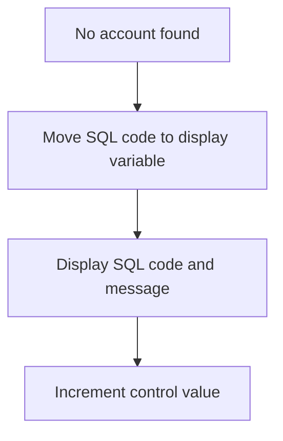

<SwmSnippet path="/src/base/cobol_src/CREACC.cbl" line="688">

---

First, when no account is found, the SQL code is moved to the display variable to capture the result of the SQL operation.

```cobol
      D      MOVE SQLCODE TO SQLCODE-DISPLAY
```

---

</SwmSnippet>

<SwmSnippet path="/src/base/cobol_src/CREACC.cbl" line="689">

---

Next, the SQL code and a message indicating that no account was found are displayed. This helps in understanding the outcome of the SQL operation.

```cobol
      D      DISPLAY 'SELECT WAS ' SQLCODE-DISPLAY ' AND FOUND '
      D        HV-CONTROL-VALUE-NUM
```

---

</SwmSnippet>

<SwmSnippet path="/src/base/cobol_src/CREACC.cbl" line="691">

---

Then, the control value number is incremented by one. This step is crucial for maintaining the sequence or control flow in the application.

```cobol
             ADD 1 TO HV-CONTROL-VALUE-NUM GIVING
             HV-CONTROL-VALUE-NUM
```

---

</SwmSnippet>

## Update ACCOUNT COUNT

Now, lets zoom into this section of the flow:

```mermaid
graph TD
  A[Update Control Value] --> B{SQL Update Successful?}
  B -- Yes --> C[Continue Processing]
  B -- No --> D[Initialize Abend Info] --> E[Get Supplemental Information] --> F[Populate Date and Time] --> G[Format Time String]
```

<SwmSnippet path="/src/base/cobol_src/CREACC.cbl" line="694">

---

### Updating Control Value

First, the control value for the next account is updated in the database. This is done by executing an SQL <SwmToken path="src/base/cobol_src/CREACC.cbl" pos="695:1:1" line-data="               UPDATE CONTROL">`UPDATE`</SwmToken> statement to set the <SwmToken path="src/base/cobol_src/CREACC.cbl" pos="696:3:3" line-data="               SET CONTROL_VALUE_NUM = :HV-CONTROL-VALUE-NUM">`CONTROL_VALUE_NUM`</SwmToken> to the new value where the <SwmToken path="src/base/cobol_src/CREACC.cbl" pos="697:4:4" line-data="               WHERE (CONTROL_NAME = :HV-CONTROL-NAME)">`CONTROL_NAME`</SwmToken> matches the specified value.

```cobol
             EXEC SQL
               UPDATE CONTROL
               SET CONTROL_VALUE_NUM = :HV-CONTROL-VALUE-NUM
               WHERE (CONTROL_NAME = :HV-CONTROL-NAME)
             END-EXEC
```

---

</SwmSnippet>

<SwmSnippet path="/src/base/cobol_src/CREACC.cbl" line="699">

---

### Handling SQL Errors

Next, the program checks if the SQL update was successful by evaluating the <SwmToken path="src/base/cobol_src/CREACC.cbl" pos="699:3:3" line-data="             IF SQLCODE IS NOT EQUAL TO ZERO">`SQLCODE`</SwmToken>. If the <SwmToken path="src/base/cobol_src/CREACC.cbl" pos="699:3:3" line-data="             IF SQLCODE IS NOT EQUAL TO ZERO">`SQLCODE`</SwmToken> is not zero, it indicates an error occurred during the update.

```cobol
             IF SQLCODE IS NOT EQUAL TO ZERO
               MOVE SQLCODE TO SQLCODE-DISPLAY
```

---

</SwmSnippet>

<SwmSnippet path="/src/base/cobol_src/CREACC.cbl" line="708">

---

### Initializing Abend Information

Then, the program initializes the abnormal end (abend) information by preserving the response codes and setting up the standard abend information. This includes capturing the application ID, task number, and transaction ID.

```cobol
               INITIALIZE ABNDINFO-REC
               MOVE EIBRESP    TO ABND-RESPCODE
               MOVE EIBRESP2   TO ABND-RESP2CODE
      *
      *        Get supplemental information
      *
               EXEC CICS ASSIGN APPLID(ABND-APPLID)
               END-EXEC

               MOVE EIBTASKN   TO ABND-TASKNO-KEY
               MOVE EIBTRNID   TO ABND-TRANID

```

---

</SwmSnippet>

<SwmSnippet path="/src/base/cobol_src/CREACC.cbl" line="720">

---

### Formatting Date and Time

Finally, the program populates the current date and time, and formats the time string to include hours, minutes, and seconds. This information is then stored in the abend record.

```cobol
               PERFORM POPULATE-TIME-DATE2

               MOVE WS-ORIG-DATE TO ABND-DATE
               STRING WS-TIME-NOW-GRP-HH DELIMITED BY SIZE,
                    ':' DELIMITED BY SIZE,
                     WS-TIME-NOW-GRP-MM DELIMITED BY SIZE,
                     ':' DELIMITED BY SIZE,
                     WS-TIME-NOW-GRP-MM DELIMITED BY SIZE
                     INTO ABND-TIME
```

---

</SwmSnippet>

## <SwmToken path="src/base/cobol_src/CREACC.cbl" pos="555:3:7" line-data="               PERFORM POPULATE-TIME-DATE2">`POPULATE-TIME-DATE2`</SwmToken>

Lets' zoom into this section of the flow:

```mermaid
graph TD
  A[Display message] --> B[Get current time] --> C[Format time and date]
```

<SwmSnippet path="/src/base/cobol_src/CREACC.cbl" line="1233">

---

First, a message '<SwmToken path="src/base/cobol_src/CREACC.cbl" pos="1233:6:10" line-data="      D    DISPLAY &#39;POPULATE-TIME-DATE2 SECTION&#39;.">`POPULATE-TIME-DATE2`</SwmToken> SECTION' is displayed to indicate the start of the section.

```cobol
      D    DISPLAY 'POPULATE-TIME-DATE2 SECTION'.
```

---

</SwmSnippet>

<SwmSnippet path="/src/base/cobol_src/CREACC.cbl" line="1235">

---

Next, the current time is retrieved using the <SwmToken path="src/base/cobol_src/CREACC.cbl" pos="1235:1:5" line-data="           EXEC CICS ASKTIME">`EXEC CICS ASKTIME`</SwmToken> command, which stores the absolute time in <SwmToken path="src/base/cobol_src/CREACC.cbl" pos="1236:3:7" line-data="              ABSTIME(WS-U-TIME)">`WS-U-TIME`</SwmToken>.

```cobol
           EXEC CICS ASKTIME
              ABSTIME(WS-U-TIME)
           END-EXEC.
```

---

</SwmSnippet>

<SwmSnippet path="/src/base/cobol_src/CREACC.cbl" line="1239">

---

Then, the <SwmToken path="src/base/cobol_src/CREACC.cbl" pos="1239:1:5" line-data="           EXEC CICS FORMATTIME">`EXEC CICS FORMATTIME`</SwmToken> command is used to format the absolute time into a human-readable date and time. The date is stored in <SwmToken path="src/base/cobol_src/CREACC.cbl" pos="1241:3:7" line-data="                     DDMMYYYY(WS-ORIG-DATE)">`WS-ORIG-DATE`</SwmToken> and the time in <SwmToken path="src/base/cobol_src/CREACC.cbl" pos="1242:3:7" line-data="                     TIME(WS-TIME-NOW)">`WS-TIME-NOW`</SwmToken>.

```cobol
           EXEC CICS FORMATTIME
                     ABSTIME(WS-U-TIME)
                     DDMMYYYY(WS-ORIG-DATE)
                     TIME(WS-TIME-NOW)
                     DATESEP
           END-EXEC.
```

---

</SwmSnippet>

<SwmSnippet path="/src/base/cobol_src/CREACC.cbl" line="1246">

---

Finally, the section ends with the <SwmToken path="src/base/cobol_src/CREACC.cbl" pos="1247:1:1" line-data="           EXIT.">`EXIT`</SwmToken> statement, indicating the completion of the time and date population process.

```cobol
       PTD2999.
           EXIT.
```

---

</SwmSnippet>

## <SwmToken path="src/base/cobol_src/CREACC.cbl" pos="376:3:7" line-data="           PERFORM WRITE-ACCOUNT-DB2">`WRITE-ACCOUNT-DB2`</SwmToken>

Lets' zoom into this section of the flow:

```mermaid
graph TD
  A[Initialize account variables] --> B[Calculate next statement date] --> C[Insert account into DB2] --> D[Check insert success] --> E[Write to PROCTRAN datastore] --> F[Update COMMAREA with account details]

%% Swimm:
%% graph TD
%%   A[Initialize account variables] --> B[Calculate next statement date] --> C[Insert account into <SwmToken path="src/base/cobol_src/CREACC.cbl" pos="376:7:7" line-data="           PERFORM WRITE-ACCOUNT-DB2">`DB2`</SwmToken>] --> D[Check insert success] --> E[Write to PROCTRAN datastore] --> F[Update COMMAREA with account details]
```

<SwmSnippet path="/src/base/cobol_src/CREACC.cbl" line="774">

---

First, the section initializes the account-related variables, setting up the necessary fields for the new account entry.

```cobol
       WRITE-ACCOUNT-DB2 SECTION.
       WAD010.

           INITIALIZE HOST-ACCOUNT-ROW.
           MOVE 'ACCT' TO HV-ACCOUNT-EYECATCHER.
```

---

</SwmSnippet>

<SwmSnippet path="/src/base/cobol_src/CREACC.cbl" line="779">

---

Next, it moves the customer number, sort code, account number, account type, interest rate, overdraft limit, available balance, and actual balance into the respective host variables.

```cobol
           MOVE COMM-CUSTNO IN DFHCOMMAREA  TO HV-ACCOUNT-CUST-NO.
           MOVE SORTCODE  TO HV-ACCOUNT-SORTCODE.

           MOVE NCS-ACC-NO-VALUE TO NCS-ACC-NO-DISP.
           MOVE NCS-ACC-NO-DISP(9:8) TO HV-ACCOUNT-ACC-NO.
           MOVE COMM-ACC-TYPE IN DFHCOMMAREA    TO HV-ACCOUNT-ACC-TYPE.
           MOVE COMM-INT-RT      TO HV-ACCOUNT-INT-RATE.
           MOVE COMM-OVERDR-LIM  TO HV-ACCOUNT-OVERDRAFT-LIM.
           MOVE COMM-AVAIL-BAL IN DFHCOMMAREA   TO HV-ACCOUNT-AVAIL-BAL.
           MOVE COMM-ACT-BAL     TO HV-ACCOUNT-ACTUAL-BAL.
```

---

</SwmSnippet>

<SwmSnippet path="/src/base/cobol_src/CREACC.cbl" line="790">

---

Then, the section performs a date calculation to determine the next statement date by adding 30 days to the current date.

```cobol
           PERFORM CALCULATE-DATES.

      *
      *    Convert gregorian date (YYYYMMDD) to an integer
      *
           STRING WS-ORIG-DATE-YYYY DELIMITED BY SIZE,
                  WS-ORIG-DATE-MM   DELIMITED BY SIZE,
                  WS-ORIG-DATE-DD   DELIMITED BY SIZE
           INTO WS-STDT-X.

           MOVE WS-STDT-9-NUM TO WS-STDT-9-NUMERIC.

           COMPUTE WS-INTEGER =
              FUNCTION INTEGER-OF-DATE(WS-STDT-9-NUMERIC).

      *
      *    Add 30 days to the date
      *
           COMPUTE WS-INTEGER = WS-INTEGER + 30.
```

---

</SwmSnippet>

<SwmSnippet path="/src/base/cobol_src/CREACC.cbl" line="809">

---

The calculated next statement date is then formatted and stored in the appropriate fields.

```cobol

      *
      *    Convert integer date back to a Gregorian date (YYYYMMDD)
      *
           COMPUTE WS-FUTURE-DATE =
              FUNCTION DATE-OF-INTEGER (WS-INTEGER).

      *
      *    Store the answer back in the  Next Statement Date
      *
           MOVE WS-FUTURE-DATE      TO WS-FUT-9.
           MOVE WS-FUT-X-YY         TO HV-ACCOUNT-NEXT-STMT-YEAR.
           MOVE '.'                 TO HV-ACCOUNT-NEXT-STMT-DELIM2.
           MOVE WS-FUT-X-MM         TO HV-ACCOUNT-NEXT-STMT-MONTH.
           MOVE '.'                 TO HV-ACCOUNT-NEXT-STMT-DELIM1.
           MOVE WS-FUT-X-DD         TO HV-ACCOUNT-NEXT-STMT-DAY.
```

---

</SwmSnippet>

<SwmSnippet path="/src/base/cobol_src/CREACC.cbl" line="826">

---

Moving to the database interaction, the section inserts the new account details into the ACCOUNT table in <SwmToken path="src/base/cobol_src/CREACC.cbl" pos="376:7:7" line-data="           PERFORM WRITE-ACCOUNT-DB2">`DB2`</SwmToken>.

```cobol
           EXEC SQL
              INSERT INTO ACCOUNT
                     (ACCOUNT_EYECATCHER,
                      ACCOUNT_CUSTOMER_NUMBER,
                      ACCOUNT_SORTCODE,
                      ACCOUNT_NUMBER,
                      ACCOUNT_TYPE,
                      ACCOUNT_INTEREST_RATE,
                      ACCOUNT_OPENED,
                      ACCOUNT_OVERDRAFT_LIMIT,
                      ACCOUNT_LAST_STATEMENT,
                      ACCOUNT_NEXT_STATEMENT,
                      ACCOUNT_AVAILABLE_BALANCE,
                      ACCOUNT_ACTUAL_BALANCE
                      )
              VALUES (:HV-ACCOUNT-EYECATCHER,
                      :HV-ACCOUNT-CUST-NO,
                      :HV-ACCOUNT-SORTCODE,
                      :HV-ACCOUNT-ACC-NO,
                      :HV-ACCOUNT-ACC-TYPE,
                      :HV-ACCOUNT-INT-RATE,
```

---

</SwmSnippet>

<SwmSnippet path="/src/base/cobol_src/CREACC.cbl" line="857">

---

If the insert operation is unsuccessful, it handles the error by setting the appropriate flags and performing necessary cleanup operations.

```cobol
      *    Check if the INSERT was unsuccessful and take action.
      *
           IF SQLCODE NOT = 0
              MOVE SQLCODE TO SQLCODE-DISPLAY
              MOVE 'N' TO COMM-SUCCESS IN DFHCOMMAREA
              MOVE '7' TO COMM-FAIL-CODE IN DFHCOMMAREA
              PERFORM DEQ-NAMED-COUNTER
              MOVE SQLCODE TO SQLCODE-DISPLAY

              PERFORM GET-ME-OUT-OF-HERE
           END-IF.
```

---

</SwmSnippet>

<SwmSnippet path="/src/base/cobol_src/CREACC.cbl" line="870">

---

If the insert operation is successful, the section proceeds to write the transaction details to the PROCTRAN datastore.

```cobol
      *    If the INSERT was successful the WRITE to PROCTRAN datastore
      *
           MOVE HV-ACCOUNT-SORTCODE       TO STORED-SORTCODE.
           MOVE HV-ACCOUNT-ACC-NO         TO STORED-ACCNO.
           MOVE HV-ACCOUNT-CUST-NO        TO STORED-CUSTNO.
           MOVE HV-ACCOUNT-ACC-TYPE       TO STORED-ACCTYPE.
           MOVE HV-ACCOUNT-LAST-STMT(1:2) TO STORED-LST-STMT(1:2).
           MOVE HV-ACCOUNT-LAST-STMT(4:2) TO STORED-LST-STMT(3:2).
           MOVE HV-ACCOUNT-LAST-STMT(7:4) TO STORED-LST-STMT(5:4).
           MOVE HV-ACCOUNT-NEXT-STMT(1:2) TO STORED-NXT-STMT(1:2).
           MOVE HV-ACCOUNT-NEXT-STMT(4:2) TO STORED-NXT-STMT(3:2).
           MOVE HV-ACCOUNT-NEXT-STMT(7:4) TO STORED-NXT-STMT(5:4).

           PERFORM WRITE-PROCTRAN.

```

---

</SwmSnippet>

<SwmSnippet path="/src/base/cobol_src/CREACC.cbl" line="888">

---

Finally, the section updates the communication area (COMMAREA) with the new account details, ensuring that the necessary data is returned for further processing.

```cobol
      *    Set up the missing data in the COMMAREA ready for return
      *
           MOVE HV-ACCOUNT-SORTCODE    TO COMM-SORTCODE.
           MOVE HV-ACCOUNT-ACC-NO      TO COMM-NUMBER.

           MOVE HV-ACCOUNT-OPENED-DAY(1:2)
             TO COMM-OPENED IN DFHCOMMAREA(1:2).
           MOVE HV-ACCOUNT-OPENED-MONTH(1:2)
             TO COMM-OPENED IN DFHCOMMAREA(3:2).
           MOVE HV-ACCOUNT-OPENED-YEAR(1:4)
             TO COMM-OPENED IN DFHCOMMAREA(5:4).
           MOVE HV-ACCOUNT-LAST-STMT-DAY(1:2)
              TO COMM-LAST-STMT-DT IN DFHCOMMAREA(1:2).
           MOVE HV-ACCOUNT-LAST-STMT-MONTH(1:2)
              TO COMM-LAST-STMT-DT IN DFHCOMMAREA(3:2).
           MOVE HV-ACCOUNT-LAST-STMT-YEAR(1:4)
              TO COMM-LAST-STMT-DT IN DFHCOMMAREA(5:4).
           MOVE HV-ACCOUNT-NEXT-STMT-DAY(1:2)
              TO COMM-NEXT-STMT-DT IN DFHCOMMAREA(1:2).
           MOVE HV-ACCOUNT-NEXT-STMT-MONTH(1:2)
              TO COMM-NEXT-STMT-DT IN DFHCOMMAREA(3:2).
```

---

</SwmSnippet>

## <SwmToken path="src/base/cobol_src/CREACC.cbl" pos="790:3:5" line-data="           PERFORM CALCULATE-DATES.">`CALCULATE-DATES`</SwmToken>

Lets' zoom into this section of the flow:

```mermaid
graph TD
  A[Get current time and date] --> B[Format date and time] --> C[Convert date to integer] --> D[Add 30 days to date] --> E[Check for leap year] --> F[Convert integer back to date] --> G[Store next statement date] --> H[Store account opened date] --> I[Store last statement date]
```

<SwmSnippet path="/src/base/cobol_src/CREACC.cbl" line="1099">

---

### Getting current time and date

First, the current time and date are retrieved using the <SwmToken path="src/base/cobol_src/CREACC.cbl" pos="1109:1:5" line-data="           EXEC CICS ASKTIME">`EXEC CICS ASKTIME`</SwmToken> command, which stores the absolute time in <SwmToken path="src/base/cobol_src/CREACC.cbl" pos="1110:3:7" line-data="              ABSTIME(WS-U-TIME)">`WS-U-TIME`</SwmToken>.

```cobol
       CD010.
      *
      *    Store today's date as the ACCOUNT-OPENED date and calculate
      *    the LAST-STMT-DATE (which should be today) and the
      *    NEXT-STMT-DATE (which should be today + 30 days).
      *

      *
      *    Populate the time and date
      *
           EXEC CICS ASKTIME
              ABSTIME(WS-U-TIME)
           END-EXEC.
```

---

</SwmSnippet>

<SwmSnippet path="/src/base/cobol_src/CREACC.cbl" line="1113">

---

### Formatting date and time

Next, the <SwmToken path="src/base/cobol_src/CREACC.cbl" pos="1113:1:5" line-data="           EXEC CICS FORMATTIME">`EXEC CICS FORMATTIME`</SwmToken> command formats the retrieved time into a Gregorian date (DDMMYYYY) and stores it in <SwmToken path="src/base/cobol_src/CREACC.cbl" pos="1115:3:7" line-data="                     DDMMYYYY(WS-ORIG-DATE)">`WS-ORIG-DATE`</SwmToken>. The time is also stored in <SwmToken path="src/base/cobol_src/CREACC.cbl" pos="1116:3:7" line-data="                     TIME(PROC-TRAN-TIME OF PROCTRAN-AREA)">`PROC-TRAN-TIME`</SwmToken>.

```cobol
           EXEC CICS FORMATTIME
                     ABSTIME(WS-U-TIME)
                     DDMMYYYY(WS-ORIG-DATE)
                     TIME(PROC-TRAN-TIME OF PROCTRAN-AREA)
                     DATESEP
           END-EXEC.
```

---

</SwmSnippet>

<SwmSnippet path="/src/base/cobol_src/CREACC.cbl" line="1124">

---

### Converting date to integer

The formatted date is then converted into an integer by concatenating the year, month, and day parts of <SwmToken path="src/base/cobol_src/CREACC.cbl" pos="1124:3:7" line-data="           STRING WS-ORIG-DATE-YYYY DELIMITED BY SIZE,">`WS-ORIG-DATE`</SwmToken> into <SwmToken path="src/base/cobol_src/CREACC.cbl" pos="1127:3:7" line-data="              INTO WS-STDT-X.">`WS-STDT-X`</SwmToken>, moving it to <SwmToken path="src/base/cobol_src/CREACC.cbl" pos="1129:13:19" line-data="           MOVE WS-STDT-9-NUM TO WS-STDT-9-NUMERIC.">`WS-STDT-9-NUMERIC`</SwmToken>, and using the <SwmToken path="src/base/cobol_src/CREACC.cbl" pos="1132:3:7" line-data="              FUNCTION INTEGER-OF-DATE(WS-STDT-9-NUMERIC).">`INTEGER-OF-DATE`</SwmToken> function.

```cobol
           STRING WS-ORIG-DATE-YYYY DELIMITED BY SIZE,
                  WS-ORIG-DATE-MM   DELIMITED BY SIZE,
                  WS-ORIG-DATE-DD   DELIMITED BY SIZE
              INTO WS-STDT-X.

           MOVE WS-STDT-9-NUM TO WS-STDT-9-NUMERIC.

           COMPUTE WS-INTEGER =
              FUNCTION INTEGER-OF-DATE(WS-STDT-9-NUMERIC).
```

---

</SwmSnippet>

<SwmSnippet path="/src/base/cobol_src/CREACC.cbl" line="1135">

---

### Adding 30 days to the date

The integer date is then incremented by 30 days. The <SwmToken path="src/base/cobol_src/CREACC.cbl" pos="1137:1:1" line-data="           EVALUATE WS-ORIG-DATE-MM">`EVALUATE`</SwmToken> statement checks the month and adds 30 days accordingly. For February, it adds 28 days initially and then checks for leap years to adjust the date if necessary.

```cobol
      *    Add 30 days to the date
      *
           EVALUATE WS-ORIG-DATE-MM
              WHEN 1
              WHEN 3
              WHEN 5
              WHEN 7
              WHEN 8
              WHEN 10
              WHEN 12
                 COMPUTE WS-INTEGER = WS-INTEGER + 30
              WHEN 9
              WHEN 4
              WHEN 6
              WHEN 11
                 COMPUTE WS-INTEGER = WS-INTEGER + 30
              WHEN 2
                 COMPUTE WS-INTEGER = WS-INTEGER + 28
                 DIVIDE WS-ORIG-DATE-YYYY BY 4 GIVING DONT-CARE
                 REMAINDER LEAP-YEAR

```

---

</SwmSnippet>

<SwmSnippet path="/src/base/cobol_src/CREACC.cbl" line="1152">

---

### Checking for leap year

The leap year check involves dividing the year by 4, 100, and 400 to determine if an extra day should be added to the date in February.

```cobol
                 COMPUTE WS-INTEGER = WS-INTEGER + 28
                 DIVIDE WS-ORIG-DATE-YYYY BY 4 GIVING DONT-CARE
                 REMAINDER LEAP-YEAR

                 IF LEAP-YEAR = ZERO
                    DIVIDE WS-ORIG-DATE-YYYY BY 100 GIVING DONT-CARE
                       REMAINDER LEAP-YEAR

                    IF LEAP-YEAR > 0
                       ADD 1 TO WS-INTEGER GIVING WS-INTEGER
                    ELSE
                       DIVIDE WS-ORIG-DATE-YYYY BY 400 GIVING DONT-CARE
                          REMAINDER LEAP-YEAR
                       IF LEAP-YEAR = ZERO
                         ADD 1 TO WS-INTEGER GIVING WS-INTEGER
                       END-IF
                    END-IF
                 END-IF
```

---

</SwmSnippet>

<SwmSnippet path="/src/base/cobol_src/CREACC.cbl" line="1175">

---

### Converting integer back to date

The adjusted integer date is then converted back to a Gregorian date using the <SwmToken path="src/base/cobol_src/CREACC.cbl" pos="1178:3:7" line-data="              FUNCTION DATE-OF-INTEGER (WS-INTEGER).">`DATE-OF-INTEGER`</SwmToken> function and stored in <SwmToken path="src/base/cobol_src/CREACC.cbl" pos="1177:3:7" line-data="           COMPUTE WS-FUTURE-DATE =">`WS-FUTURE-DATE`</SwmToken>.

```cobol
      *    Convert integer date back to a Gregorian date (YYYYMMDD)
      *
           COMPUTE WS-FUTURE-DATE =
              FUNCTION DATE-OF-INTEGER (WS-INTEGER).
```

---

</SwmSnippet>

<SwmSnippet path="/src/base/cobol_src/CREACC.cbl" line="1184">

---

### Storing next statement date

The next statement date is stored by moving parts of <SwmToken path="src/base/cobol_src/CREACC.cbl" pos="1184:3:7" line-data="           MOVE WS-FUTURE-DATE(1:4) TO ACCOUNT-NEXT-STMT-DATE(5:4).">`WS-FUTURE-DATE`</SwmToken> into <SwmToken path="src/base/cobol_src/CREACC.cbl" pos="1184:16:22" line-data="           MOVE WS-FUTURE-DATE(1:4) TO ACCOUNT-NEXT-STMT-DATE(5:4).">`ACCOUNT-NEXT-STMT-DATE`</SwmToken>.

```cobol
           MOVE WS-FUTURE-DATE(1:4) TO ACCOUNT-NEXT-STMT-DATE(5:4).
           MOVE WS-FUTURE-DATE(5:2) TO ACCOUNT-NEXT-STMT-DATE(3:2).
           MOVE WS-FUTURE-DATE(7:2) TO ACCOUNT-NEXT-STMT-DATE(1:2).
```

---

</SwmSnippet>

<SwmSnippet path="/src/base/cobol_src/CREACC.cbl" line="1188">

---

### Storing account opened date

The account opened date is stored by moving parts of <SwmToken path="src/base/cobol_src/CREACC.cbl" pos="1188:3:7" line-data="           MOVE WS-ORIG-DATE-DD   TO ACCOUNT-OPENED(1:2).">`WS-ORIG-DATE`</SwmToken> into <SwmToken path="src/base/cobol_src/CREACC.cbl" pos="1188:13:15" line-data="           MOVE WS-ORIG-DATE-DD   TO ACCOUNT-OPENED(1:2).">`ACCOUNT-OPENED`</SwmToken>.

```cobol
           MOVE WS-ORIG-DATE-DD   TO ACCOUNT-OPENED(1:2).
           MOVE WS-ORIG-DATE-MM   TO ACCOUNT-OPENED(3:2).
           MOVE WS-ORIG-DATE-YYYY TO ACCOUNT-OPENED(5:4).
```

---

</SwmSnippet>

<SwmSnippet path="/src/base/cobol_src/CREACC.cbl" line="1191">

---

### Storing last statement date

Finally, the last statement date is stored by moving <SwmToken path="src/base/cobol_src/CREACC.cbl" pos="1191:3:5" line-data="           MOVE ACCOUNT-OPENED    TO ACCOUNT-LAST-STMT-DATE.">`ACCOUNT-OPENED`</SwmToken> into <SwmToken path="src/base/cobol_src/CREACC.cbl" pos="1191:9:15" line-data="           MOVE ACCOUNT-OPENED    TO ACCOUNT-LAST-STMT-DATE.">`ACCOUNT-LAST-STMT-DATE`</SwmToken> and formatting the date into <SwmToken path="src/base/cobol_src/CREACC.cbl" pos="1199:13:19" line-data="           MOVE WS-ORIG-DATE-DD   TO HV-ACCOUNT-LAST-STMT-DAY.">`HV-ACCOUNT-LAST-STMT`</SwmToken>.

```cobol
           MOVE ACCOUNT-OPENED    TO ACCOUNT-LAST-STMT-DATE.

           MOVE WS-ORIG-DATE-DD   TO HV-ACCOUNT-OPENED-DAY.
           MOVE '.'               TO HV-ACCOUNT-OPENED-DELIM1.
           MOVE WS-ORIG-DATE-MM   TO HV-ACCOUNT-OPENED-MONTH.
           MOVE '.'               TO HV-ACCOUNT-OPENED-DELIM2.
           MOVE WS-ORIG-DATE-YYYY TO HV-ACCOUNT-OPENED-YEAR.

           MOVE WS-ORIG-DATE-DD   TO HV-ACCOUNT-LAST-STMT-DAY.
           MOVE '.'               TO HV-ACCOUNT-LAST-STMT-DELIM1.
           MOVE WS-ORIG-DATE-MM   TO HV-ACCOUNT-LAST-STMT-MONTH.
           MOVE '.'               TO HV-ACCOUNT-LAST-STMT-DELIM2.
           MOVE WS-ORIG-DATE-YYYY TO HV-ACCOUNT-LAST-STMT-YEAR.
```

---

</SwmSnippet>

## <SwmToken path="src/base/cobol_src/CREACC.cbl" pos="863:3:7" line-data="              PERFORM DEQ-NAMED-COUNTER">`DEQ-NAMED-COUNTER`</SwmToken>

Lets' zoom into this section of the flow:

```mermaid
graph TD
  A[Move sort code to test sort] --> B[Release named counter resource] --> C[Check response] --> D{Response not normal?}
  D -- Yes --> E[Set communication area success to 'N']
  E --> F[Set communication area fail code to '5']
  F --> G[Perform exit routine]
  D -- No --> H[Exit]
```

<SwmSnippet path="/src/base/cobol_src/CREACC.cbl" line="410">

---

First, the sort code is moved to the test sort field. This prepares the necessary data for the subsequent operations.

```cobol
           MOVE SORTCODE TO NCS-ACC-NO-TEST-SORT.
```

---

</SwmSnippet>

<SwmSnippet path="/src/base/cobol_src/CREACC.cbl" line="412">

---

Moving to the next step, the named counter resource is released using the <SwmToken path="src/base/cobol_src/CREACC.cbl" pos="412:1:5" line-data="           EXEC CICS DEQ">`EXEC CICS DEQ`</SwmToken> command. This operation is crucial for freeing up the resource for other transactions.

```cobol
           EXEC CICS DEQ
              RESOURCE(NCS-ACC-NO-NAME)
              LENGTH(16)
              RESP(WS-CICS-RESP)
              RESP2(WS-CICS-RESP2)
           END-EXEC.
```

---

</SwmSnippet>

<SwmSnippet path="/src/base/cobol_src/CREACC.cbl" line="419">

---

Next, the response from the DEQ command is checked. If the response is not normal, it indicates an issue with releasing the resource.

```cobol
           IF WS-CICS-RESP NOT = DFHRESP(NORMAL)
```

---

</SwmSnippet>

<SwmSnippet path="/src/base/cobol_src/CREACC.cbl" line="420">

---

Then, if the response is not normal, the communication area success flag is set to 'N' and the fail code is set to '5'. This signals that the operation was unsuccessful and triggers the exit routine.

```cobol
             MOVE 'N' TO COMM-SUCCESS IN DFHCOMMAREA
             MOVE '5' TO COMM-FAIL-CODE IN DFHCOMMAREA
             PERFORM GET-ME-OUT-OF-HERE
           END-IF.
```

---

</SwmSnippet>

## <SwmToken path="src/base/cobol_src/CREACC.cbl" pos="883:3:5" line-data="           PERFORM WRITE-PROCTRAN.">`WRITE-PROCTRAN`</SwmToken>

Lets' zoom into this section of the flow:

```mermaid
graph TD
  A[Perform WRITE-PROCTRAN-DB2] --> B[Exit]

%% Swimm:
%% graph TD
%%   A[Perform <SwmToken path="src/base/cobol_src/CREACC.cbl" pos="923:3:7" line-data="               PERFORM WRITE-PROCTRAN-DB2.">`WRITE-PROCTRAN-DB2`</SwmToken>] --> B[Exit]
```

<SwmSnippet path="/src/base/cobol_src/CREACC.cbl" line="920">

---

The <SwmToken path="src/base/cobol_src/CREACC.cbl" pos="920:1:3" line-data="       WRITE-PROCTRAN SECTION.">`WRITE-PROCTRAN`</SwmToken> section is responsible for writing successfully processed transactions to the <SwmToken path="src/base/cobol_src/CREACC.cbl" pos="920:3:3" line-data="       WRITE-PROCTRAN SECTION.">`PROCTRAN`</SwmToken> table in the database. It performs the <SwmToken path="src/base/cobol_src/CREACC.cbl" pos="923:3:7" line-data="               PERFORM WRITE-PROCTRAN-DB2.">`WRITE-PROCTRAN-DB2`</SwmToken> operation, which captures the current time and date, initializes host variables, and inserts a new record into the <SwmToken path="src/base/cobol_src/CREACC.cbl" pos="920:3:3" line-data="       WRITE-PROCTRAN SECTION.">`PROCTRAN`</SwmToken> table. This ensures that all processed transactions are logged in the database for future reference and auditing.

```cobol
       WRITE-PROCTRAN SECTION.
       WP010.

               PERFORM WRITE-PROCTRAN-DB2.
       WP999.
           EXIT.
```

---

</SwmSnippet>

## <SwmToken path="src/base/cobol_src/CREACC.cbl" pos="923:3:7" line-data="               PERFORM WRITE-PROCTRAN-DB2.">`WRITE-PROCTRAN-DB2`</SwmToken>

Lets' zoom into this section of the flow:

```mermaid
graph TD
  A[Initialize transaction data] --> B[Populate time and date] --> C[Insert transaction into PROCTRAN table] --> D[Check SQLCODE] --> E[Handle SQL error]
```

<SwmSnippet path="/src/base/cobol_src/CREACC.cbl" line="934">

---

First, the section initializes the transaction data by setting up the host variables and preparing the necessary fields for the database insertion.

```cobol
           INITIALIZE HOST-PROCTRAN-ROW.
           INITIALIZE WS-EIBTASKN12.

           MOVE 'PRTR'   TO HV-PROCTRAN-EYECATCHER.
           MOVE SORTCODE TO HV-PROCTRAN-SORT-CODE.
           MOVE STORED-ACCNO TO HV-PROCTRAN-ACC-NUMBER.
           MOVE EIBTASKN TO WS-EIBTASKN12.
           MOVE WS-EIBTASKN12 TO HV-PROCTRAN-REF.

```

---

</SwmSnippet>

<SwmSnippet path="/src/base/cobol_src/CREACC.cbl" line="946">

---

Moving to the next step, the current time and date are populated using CICS commands to ensure the transaction record has accurate timestamps.

```cobol
           EXEC CICS ASKTIME
              ABSTIME(WS-U-TIME)
           END-EXEC.

           EXEC CICS FORMATTIME
                     ABSTIME(WS-U-TIME)
                     DDMMYYYY(WS-ORIG-DATE)
                     TIME(HV-PROCTRAN-TIME)
                     DATESEP('.')
           END-EXEC.

           MOVE WS-ORIG-DATE TO WS-ORIG-DATE-GRP-X.
           MOVE WS-ORIG-DATE-GRP-X TO HV-PROCTRAN-DATE.

```

---

</SwmSnippet>

<SwmSnippet path="/src/base/cobol_src/CREACC.cbl" line="960">

---

Next, the transaction details such as customer number, account type, and statement dates are moved into the description field of the transaction record.

```cobol
           MOVE STORED-CUSTNO     TO HV-PROCTRAN-DESC(1:10).
           MOVE STORED-ACCTYPE    TO HV-PROCTRAN-DESC(11:8).
           MOVE STORED-LST-STMT   TO HV-PROCTRAN-DESC(19:8).
           MOVE STORED-NXT-STMT   TO HV-PROCTRAN-DESC(27:8).
           MOVE SPACES            TO HV-PROCTRAN-DESC(35:6).

```

---

</SwmSnippet>

<SwmSnippet path="/src/base/cobol_src/CREACC.cbl" line="966">

---

Then, the transaction type and amount are set before the transaction record is inserted into the PROCTRAN table using an SQL INSERT statement.

```cobol
           MOVE 'OCA'             TO HV-PROCTRAN-TYPE.
           MOVE 0                 TO HV-PROCTRAN-AMOUNT.

           EXEC SQL
              INSERT INTO PROCTRAN
                     (
                      PROCTRAN_EYECATCHER,
                      PROCTRAN_SORTCODE,
                      PROCTRAN_NUMBER,
                      PROCTRAN_DATE,
                      PROCTRAN_TIME,
                      PROCTRAN_REF,
                      PROCTRAN_TYPE,
                      PROCTRAN_DESC,
                      PROCTRAN_AMOUNT
                     )
              VALUES
                     (
                      :HV-PROCTRAN-EYECATCHER,
                      :HV-PROCTRAN-SORT-CODE,
                      :HV-PROCTRAN-ACC-NUMBER,
```

---

</SwmSnippet>

<SwmSnippet path="/src/base/cobol_src/CREACC.cbl" line="999">

---

Going into the error handling part, the SQLCODE is checked to determine if the insertion was successful. If not, an error message is displayed and the error handling routine is invoked.

```cobol
           IF SQLCODE NOT = 0
              DISPLAY 'In CREACC (WPD010) '
              'UNABLE TO WRITE TO PROCTRAN ROW DATASTORE'
              ' RESP CODE=' WS-CICS-RESP, ' RESP2=' WS-CICS-RESP2
              'WITH THE FOLLOWING DATA:' HOST-PROCTRAN-ROW


              PERFORM DEQ-NAMED-COUNTER
              MOVE SQLCODE TO SQLCODE-DISPLAY

```

---

</SwmSnippet>

<SwmSnippet path="/src/base/cobol_src/CREACC.cbl" line="1015">

---

Diving into the error handling routine, the response codes are preserved, and additional information is gathered to prepare for invoking the Abend Handler program.

```cobol
              INITIALIZE ABNDINFO-REC
              MOVE EIBRESP    TO ABND-RESPCODE
              MOVE EIBRESP2   TO ABND-RESP2CODE
      *
      *       Get supplemental information
      *
              EXEC CICS ASSIGN APPLID(ABND-APPLID)
              END-EXEC

              MOVE EIBTASKN   TO ABND-TASKNO-KEY
              MOVE EIBTRNID   TO ABND-TRANID

              PERFORM POPULATE-TIME-DATE2

              MOVE WS-ORIG-DATE TO ABND-DATE
              STRING WS-TIME-NOW-GRP-HH DELIMITED BY SIZE,
                    ':' DELIMITED BY SIZE,
                     WS-TIME-NOW-GRP-MM DELIMITED BY SIZE,
                     ':' DELIMITED BY SIZE,
                     WS-TIME-NOW-GRP-MM DELIMITED BY SIZE
                     INTO ABND-TIME
```

---

</SwmSnippet>

<SwmSnippet path="/src/base/cobol_src/CREACC.cbl" line="1041">

---

Finally, the Abend Handler program is called to log the error details and terminate the transaction abnormally, ensuring that all relevant information is captured for troubleshooting.

```cobol
              EXEC CICS ASSIGN PROGRAM(ABND-PROGRAM)
              END-EXEC

              MOVE SQLCODE-DISPLAY    TO ABND-SQLCODE

              STRING 'WPD010  - PROCTRAN DB2 INSERT issue.'
                    DELIMITED BY SIZE,
                    ' EIBRESP=' DELIMITED BY SIZE,
                    ABND-RESPCODE DELIMITED BY SIZE,
                    ' RESP2=' DELIMITED BY SIZE,
                    ABND-RESP2CODE DELIMITED BY SIZE
                    INTO ABND-FREEFORM
              END-STRING

              EXEC CICS LINK PROGRAM(WS-ABEND-PGM)
                        COMMAREA(ABNDINFO-REC)
              END-EXEC

              EXEC CICS ABEND
                 ABCODE ('HWPT')
              END-EXEC
```

---

</SwmSnippet>

&nbsp;

*This is an auto-generated document by Swimm 🌊 and has not yet been verified by a human*

<SwmMeta version="3.0.0" repo-id="Z2l0aHViJTNBJTNBY2ljcy1iYW5raW5nLXNhbXBsZS1hcHBsaWNhdGlvbi1jYnNhLUlCTS1EZW1vJTNBJTNBU3dpbW0tRGVtbw==" repo-name="cics-banking-sample-application-cbsa-IBM-Demo"><sup>Powered by [Swimm](/)</sup></SwmMeta>
