The <SwmToken path="src/base/cobol_src/CRDTAGY2.cbl" pos="202:4:4" line-data="              DISPLAY &#39;CRDTAGY2 - UNABLE TO GET CONTAINER. RESP=&#39;">`CRDTAGY2`</SwmToken> program is designed to handle various operations related to credit score generation and data management in a banking system. It achieves this by generating delays, handling errors, retrieving and storing data in containers, and generating credit scores.

The flow involves generating a delay, handling any errors that occur, retrieving data from a container, generating a credit score, storing the data back in the container, and handling any errors that occur during these operations.

Here is a high level diagram of the program:

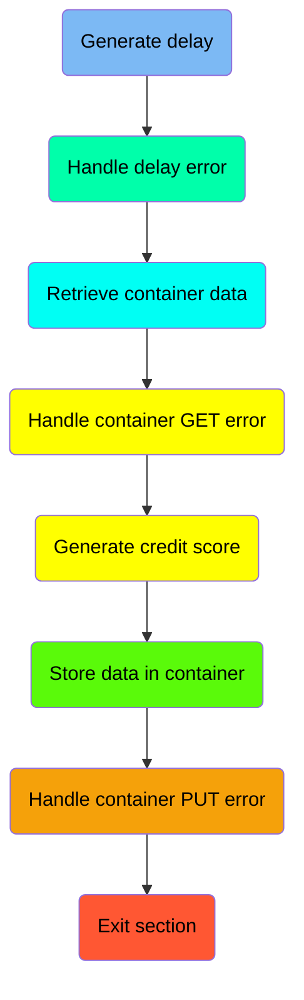

## Generate delay

First, we'll zoom into this section of the flow:

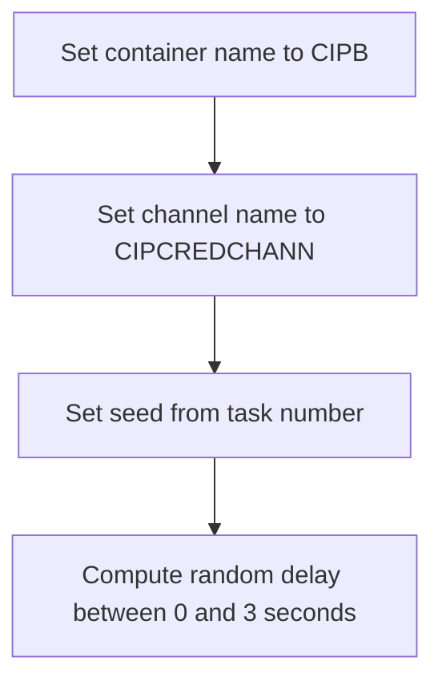

<SwmSnippet path="/src/base/cobol_src/CRDTAGY2.cbl" line="119">

---

First, the container name is set to <SwmToken path="src/base/cobol_src/CRDTAGY2.cbl" pos="119:4:4" line-data="           MOVE &#39;CIPB            &#39; TO WS-CONTAINER-NAME.">`CIPB`</SwmToken> (a predefined container name used for storing data).

```cobol
           MOVE 'CIPB            ' TO WS-CONTAINER-NAME.
```

---

</SwmSnippet>

<SwmSnippet path="/src/base/cobol_src/CRDTAGY2.cbl" line="120">

---

Next, the channel name is set to <SwmToken path="src/base/cobol_src/CRDTAGY2.cbl" pos="120:4:4" line-data="           MOVE &#39;CIPCREDCHANN    &#39; TO WS-CHANNEL-NAME.">`CIPCREDCHANN`</SwmToken> (a predefined channel name used for communication).

```cobol
           MOVE 'CIPCREDCHANN    ' TO WS-CHANNEL-NAME.
```

---

</SwmSnippet>

<SwmSnippet path="/src/base/cobol_src/CRDTAGY2.cbl" line="121">

---

Then, the seed for the random number generator is set using the task number (<SwmToken path="src/base/cobol_src/CRDTAGY2.cbl" pos="121:3:3" line-data="           MOVE EIBTASKN           TO WS-SEED.">`EIBTASKN`</SwmToken>).

```cobol
           MOVE EIBTASKN           TO WS-SEED.
```

---

</SwmSnippet>

<SwmSnippet path="/src/base/cobol_src/CRDTAGY2.cbl" line="123">

---

Finally, a random delay amount between 0 and 3 seconds is computed using the seed. This delay is used to simulate processing time.

```cobol
           COMPUTE WS-DELAY-AMT = ((3 - 1)
                            * FUNCTION RANDOM(WS-SEED)) + 1.
```

---

</SwmSnippet>

## Handle delay error

Now, lets zoom into this section of the flow:

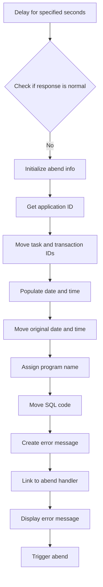

<SwmSnippet path="/src/base/cobol_src/CRDTAGY2.cbl" line="126">

---

First, the code initiates a delay for a specified number of seconds using the <SwmToken path="src/base/cobol_src/CRDTAGY2.cbl" pos="126:1:5" line-data="           EXEC CICS DELAY">`EXEC CICS DELAY`</SwmToken> command.

```cobol
           EXEC CICS DELAY
                FOR SECONDS(WS-DELAY-AMT)
                RESP(WS-CICS-RESP)
                RESP2(WS-CICS-RESP2)
           END-EXEC.
```

---

</SwmSnippet>

<SwmSnippet path="/src/base/cobol_src/CRDTAGY2.cbl" line="132">

---

Next, it checks if the response from the delay command is normal by evaluating <SwmToken path="src/base/cobol_src/CRDTAGY2.cbl" pos="132:3:7" line-data="           IF WS-CICS-RESP NOT = DFHRESP(NORMAL)">`WS-CICS-RESP`</SwmToken>.

```cobol
           IF WS-CICS-RESP NOT = DFHRESP(NORMAL)
```

---

</SwmSnippet>

<SwmSnippet path="/src/base/cobol_src/CRDTAGY2.cbl" line="139">

---

If the response is not normal, the code initializes the abend information record to prepare for error handling.

```cobol
              INITIALIZE ABNDINFO-REC
```

---

</SwmSnippet>

<SwmSnippet path="/src/base/cobol_src/CRDTAGY2.cbl" line="145">

---

It then retrieves the application ID using the <SwmToken path="src/base/cobol_src/CRDTAGY2.cbl" pos="145:1:7" line-data="              EXEC CICS ASSIGN APPLID(ABND-APPLID)">`EXEC CICS ASSIGN APPLID`</SwmToken> command and stores it in <SwmToken path="src/base/cobol_src/CRDTAGY2.cbl" pos="145:9:11" line-data="              EXEC CICS ASSIGN APPLID(ABND-APPLID)">`ABND-APPLID`</SwmToken>.

```cobol
              EXEC CICS ASSIGN APPLID(ABND-APPLID)
              END-EXEC
```

---

</SwmSnippet>

<SwmSnippet path="/src/base/cobol_src/CRDTAGY2.cbl" line="148">

---

The task number and transaction ID are moved to the abend information record for further processing.

```cobol
              MOVE EIBTASKN   TO ABND-TASKNO-KEY
              MOVE EIBTRNID   TO ABND-TRANID
```

---

</SwmSnippet>

<SwmSnippet path="/src/base/cobol_src/CRDTAGY2.cbl" line="151">

---

The code then performs a routine to populate the current date and time, which is crucial for logging the error occurrence.

```cobol
              PERFORM POPULATE-TIME-DATE
```

---

</SwmSnippet>

<SwmSnippet path="/src/base/cobol_src/CRDTAGY2.cbl" line="153">

---

It moves the original date and the current time into the abend information record for accurate error tracking.

```cobol
              MOVE WS-ORIG-DATE TO ABND-DATE
              STRING WS-TIME-NOW-GRP-HH DELIMITED BY SIZE,
                      ':' DELIMITED BY SIZE,
                       WS-TIME-NOW-GRP-MM DELIMITED BY SIZE,
                       ':' DELIMITED BY SIZE,
                       WS-TIME-NOW-GRP-MM DELIMITED BY SIZE
                       INTO ABND-TIME
```

---

</SwmSnippet>

<SwmSnippet path="/src/base/cobol_src/CRDTAGY2.cbl" line="165">

---

The program name is assigned to the abend information record to identify which program encountered the error.

```cobol
              EXEC CICS ASSIGN PROGRAM(ABND-PROGRAM)
              END-EXEC
```

---

</SwmSnippet>

<SwmSnippet path="/src/base/cobol_src/CRDTAGY2.cbl" line="168">

---

The SQL code is set to zero in the abend information record, indicating no SQL errors were involved.

```cobol
              MOVE ZEROS      TO ABND-SQLCODE
```

---

</SwmSnippet>

<SwmSnippet path="/src/base/cobol_src/CRDTAGY2.cbl" line="170">

---

An error message is created and stored in the abend information record to describe the delay issue.

```cobol
              STRING 'A010  - *** The delay messed up! ***'
                      DELIMITED BY SIZE,
                      ' EIBRESP=' DELIMITED BY SIZE,
                      ABND-RESPCODE DELIMITED BY SIZE,
                      ' RESP2=' DELIMITED BY SIZE,
                      ABND-RESP2CODE DELIMITED BY SIZE
                      INTO ABND-FREEFORM
```

---

</SwmSnippet>

<SwmSnippet path="/src/base/cobol_src/CRDTAGY2.cbl" line="179">

---

The code then links to the abend handler program, passing the abend information record for logging and further processing.

```cobol
              EXEC CICS LINK PROGRAM(WS-ABEND-PGM)
                          COMMAREA(ABNDINFO-REC)
              END-EXEC
```

---

</SwmSnippet>

<SwmSnippet path="/src/base/cobol_src/CRDTAGY2.cbl" line="184">

---

Finally, an error message is displayed, and the transaction is abnormally terminated using the <SwmToken path="src/base/cobol_src/CRDTAGY2.cbl" pos="185:1:5" line-data="              EXEC CICS ABEND">`EXEC CICS ABEND`</SwmToken> command.

```cobol
              DISPLAY '*** The delay messed up ! ***'
              EXEC CICS ABEND
                 ABCODE('PLOP')
              END-EXEC
```

---

</SwmSnippet>

## Retrieve container data

This is the next section of the flow.

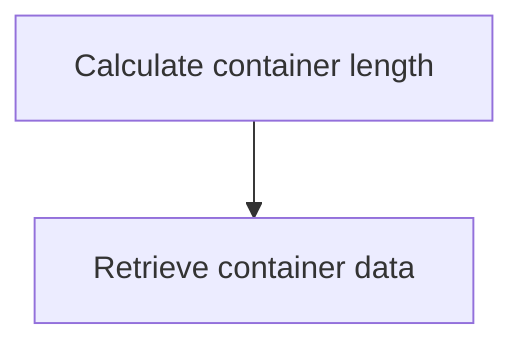

<SwmSnippet path="/src/base/cobol_src/CRDTAGY2.cbl" line="191">

---

### Retrieving data from a CICS container

The <SwmToken path="src/base/cobol_src/CRDTAGY2.cbl" pos="112:1:1" line-data="       PREMIERE SECTION.">`PREMIERE`</SwmToken> function is responsible for retrieving data from a CICS container. First, it calculates the length of the container data by computing <SwmToken path="src/base/cobol_src/CRDTAGY2.cbl" pos="191:3:7" line-data="           COMPUTE WS-CONTAINER-LEN = LENGTH OF WS-CONT-IN.">`WS-CONTAINER-LEN`</SwmToken> (the length of the container input). Then, it retrieves the container data using the <SwmToken path="src/base/cobol_src/CRDTAGY2.cbl" pos="193:1:7" line-data="           EXEC CICS GET CONTAINER(WS-CONTAINER-NAME)">`EXEC CICS GET CONTAINER`</SwmToken> command. This command specifies the container name (<SwmToken path="src/base/cobol_src/CRDTAGY2.cbl" pos="193:9:13" line-data="           EXEC CICS GET CONTAINER(WS-CONTAINER-NAME)">`WS-CONTAINER-NAME`</SwmToken>), the channel name (<SwmToken path="src/base/cobol_src/CRDTAGY2.cbl" pos="194:3:7" line-data="                     CHANNEL(WS-CHANNEL-NAME)">`WS-CHANNEL-NAME`</SwmToken>), and the target variable (<SwmToken path="src/base/cobol_src/CRDTAGY2.cbl" pos="191:15:19" line-data="           COMPUTE WS-CONTAINER-LEN = LENGTH OF WS-CONT-IN.">`WS-CONT-IN`</SwmToken>) where the data will be stored. The length of the data to be retrieved is specified by <SwmToken path="src/base/cobol_src/CRDTAGY2.cbl" pos="191:3:7" line-data="           COMPUTE WS-CONTAINER-LEN = LENGTH OF WS-CONT-IN.">`WS-CONTAINER-LEN`</SwmToken>. The response codes <SwmToken path="src/base/cobol_src/CRDTAGY2.cbl" pos="197:3:7" line-data="                     RESP(WS-CICS-RESP)">`WS-CICS-RESP`</SwmToken> and <SwmToken path="src/base/cobol_src/CRDTAGY2.cbl" pos="198:3:7" line-data="                     RESP2(WS-CICS-RESP2)">`WS-CICS-RESP2`</SwmToken> are used to handle any potential errors during the retrieval process.

```cobol
           COMPUTE WS-CONTAINER-LEN = LENGTH OF WS-CONT-IN.

           EXEC CICS GET CONTAINER(WS-CONTAINER-NAME)
                     CHANNEL(WS-CHANNEL-NAME)
                     INTO(WS-CONT-IN)
                     FLENGTH(WS-CONTAINER-LEN)
                     RESP(WS-CICS-RESP)
                     RESP2(WS-CICS-RESP2)
           END-EXEC.
```

---

</SwmSnippet>

## Handle container GET error

Now, lets zoom into this section of the flow:

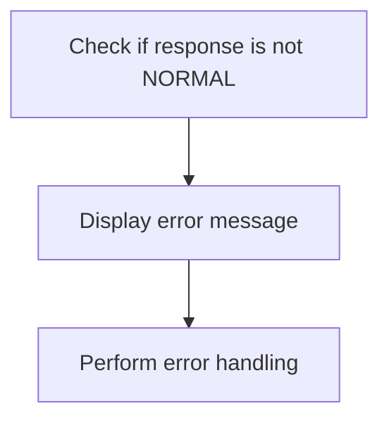

<SwmSnippet path="/src/base/cobol_src/CRDTAGY2.cbl" line="201">

---

The code checks if the response code <SwmToken path="src/base/cobol_src/CRDTAGY2.cbl" pos="201:3:7" line-data="           IF WS-CICS-RESP NOT = DFHRESP(NORMAL)">`WS-CICS-RESP`</SwmToken> is not equal to <SwmToken path="src/base/cobol_src/CRDTAGY2.cbl" pos="201:13:16" line-data="           IF WS-CICS-RESP NOT = DFHRESP(NORMAL)">`DFHRESP(NORMAL)`</SwmToken>, indicating an error occurred while retrieving the container data. If an error is detected, it displays an error message that includes the response codes <SwmToken path="src/base/cobol_src/CRDTAGY2.cbl" pos="201:3:7" line-data="           IF WS-CICS-RESP NOT = DFHRESP(NORMAL)">`WS-CICS-RESP`</SwmToken> and <SwmToken path="src/base/cobol_src/CRDTAGY2.cbl" pos="203:14:18" line-data="                 WS-CICS-RESP &#39;, RESP2=&#39; WS-CICS-RESP2">`WS-CICS-RESP2`</SwmToken>, the container name <SwmToken path="src/base/cobol_src/CRDTAGY2.cbl" pos="204:8:12" line-data="              DISPLAY &#39;CONTAINER=&#39; WS-CONTAINER-NAME &#39; CHANNEL=&#39;">`WS-CONTAINER-NAME`</SwmToken>, the channel name <SwmToken path="src/base/cobol_src/CRDTAGY2.cbl" pos="205:1:5" line-data="                       WS-CHANNEL-NAME &#39; FLENGTH=&#39;">`WS-CHANNEL-NAME`</SwmToken>, and the container length <SwmToken path="src/base/cobol_src/CRDTAGY2.cbl" pos="206:1:5" line-data="                       WS-CONTAINER-LEN">`WS-CONTAINER-LEN`</SwmToken>. Finally, it performs the <SwmToken path="src/base/cobol_src/CRDTAGY2.cbl" pos="207:3:11" line-data="              PERFORM GET-ME-OUT-OF-HERE">`GET-ME-OUT-OF-HERE`</SwmToken> routine to handle the error appropriately.

```cobol
           IF WS-CICS-RESP NOT = DFHRESP(NORMAL)
              DISPLAY 'CRDTAGY2 - UNABLE TO GET CONTAINER. RESP='
                 WS-CICS-RESP ', RESP2=' WS-CICS-RESP2
              DISPLAY 'CONTAINER=' WS-CONTAINER-NAME ' CHANNEL='
                       WS-CHANNEL-NAME ' FLENGTH='
                       WS-CONTAINER-LEN
              PERFORM GET-ME-OUT-OF-HERE
           END-IF.
```

---

</SwmSnippet>

## Generate credit score

This is the next section of the flow.

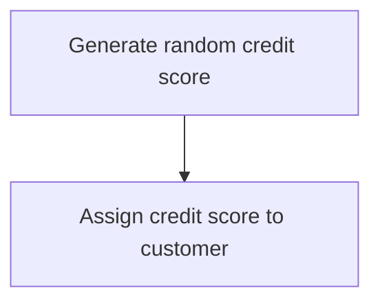

<SwmSnippet path="/src/base/cobol_src/CRDTAGY2.cbl" line="215">

---

First, we generate a new credit score for the customer by computing a random number between 1 and 999. This is done using the <SwmToken path="src/base/cobol_src/CRDTAGY2.cbl" pos="215:1:1" line-data="           COMPUTE WS-NEW-CREDSCORE = ((999 - 1)">`COMPUTE`</SwmToken> statement, which calculates <SwmToken path="src/base/cobol_src/CRDTAGY2.cbl" pos="215:3:7" line-data="           COMPUTE WS-NEW-CREDSCORE = ((999 - 1)">`WS-NEW-CREDSCORE`</SwmToken> as a random number within the specified range.

```cobol
           COMPUTE WS-NEW-CREDSCORE = ((999 - 1)
                            * FUNCTION RANDOM) + 1.
```

---

</SwmSnippet>

<SwmSnippet path="/src/base/cobol_src/CRDTAGY2.cbl" line="218">

---

Next, the newly generated credit score is assigned to the customer's credit score field by moving the value of <SwmToken path="src/base/cobol_src/CRDTAGY2.cbl" pos="218:3:7" line-data="           MOVE WS-NEW-CREDSCORE TO WS-CONT-IN-CREDIT-SCORE.">`WS-NEW-CREDSCORE`</SwmToken> to <SwmToken path="src/base/cobol_src/CRDTAGY2.cbl" pos="218:11:19" line-data="           MOVE WS-NEW-CREDSCORE TO WS-CONT-IN-CREDIT-SCORE.">`WS-CONT-IN-CREDIT-SCORE`</SwmToken>. This ensures that the customer's record is updated with the new credit score.

```cobol
           MOVE WS-NEW-CREDSCORE TO WS-CONT-IN-CREDIT-SCORE.
```

---

</SwmSnippet>

## Interim Summary

So far, we saw how to generate a delay and handle any errors that might occur during this process. We also covered how to retrieve data from a CICS container and handle any errors that might arise during the retrieval. Now, we will focus on generating a credit score for the customer and storing the data in the container.

## Store data in container

This is the next section of the flow.

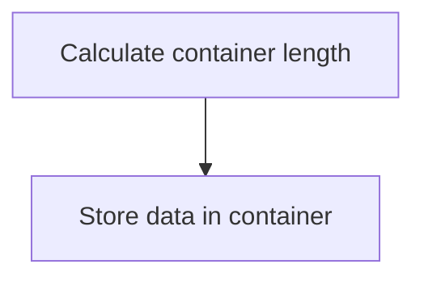

<SwmSnippet path="/src/base/cobol_src/CRDTAGY2.cbl" line="223">

---

First, the length of the data to be stored in the container is calculated and assigned to <SwmToken path="src/base/cobol_src/CRDTAGY2.cbl" pos="223:3:7" line-data="           COMPUTE WS-CONTAINER-LEN = LENGTH OF WS-CONT-IN.">`WS-CONTAINER-LEN`</SwmToken>.

```cobol
           COMPUTE WS-CONTAINER-LEN = LENGTH OF WS-CONT-IN.

```

---

</SwmSnippet>

<SwmSnippet path="/src/base/cobol_src/CRDTAGY2.cbl" line="225">

---

Next, the data is stored in the specified container using the <SwmToken path="src/base/cobol_src/CRDTAGY2.cbl" pos="225:1:7" line-data="           EXEC CICS PUT CONTAINER(WS-CONTAINER-NAME)">`EXEC CICS PUT CONTAINER`</SwmToken> command, which includes the container name, the data, the length of the data, and the channel name.

```cobol
           EXEC CICS PUT CONTAINER(WS-CONTAINER-NAME)
                         FROM(WS-CONT-IN)
                         FLENGTH(WS-CONTAINER-LEN)
                         CHANNEL(WS-CHANNEL-NAME)
                         RESP(WS-CICS-RESP)
                         RESP2(WS-CICS-RESP2)
           END-EXEC.
```

---

</SwmSnippet>

## Handle container PUT error

Now, lets zoom into this section of the flow:

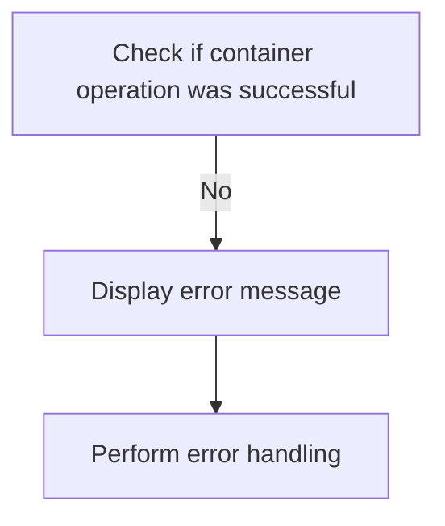

<SwmSnippet path="/src/base/cobol_src/CRDTAGY2.cbl" line="233">

---

The code checks if the container operation was successful by evaluating <SwmToken path="src/base/cobol_src/CRDTAGY2.cbl" pos="233:3:7" line-data="           IF WS-CICS-RESP NOT = DFHRESP(NORMAL)">`WS-CICS-RESP`</SwmToken> (the response code from the CICS operation) against <SwmToken path="src/base/cobol_src/CRDTAGY2.cbl" pos="233:13:16" line-data="           IF WS-CICS-RESP NOT = DFHRESP(NORMAL)">`DFHRESP(NORMAL)`</SwmToken> (the expected normal response). If the response is not normal, it indicates an error in the container operation. Consequently, an error message is displayed, which includes the response codes <SwmToken path="src/base/cobol_src/CRDTAGY2.cbl" pos="233:3:7" line-data="           IF WS-CICS-RESP NOT = DFHRESP(NORMAL)">`WS-CICS-RESP`</SwmToken> and <SwmToken path="src/base/cobol_src/CRDTAGY2.cbl" pos="235:14:18" line-data="                 WS-CICS-RESP &#39;, RESP2=&#39; WS-CICS-RESP2">`WS-CICS-RESP2`</SwmToken>, the container name <SwmToken path="src/base/cobol_src/CRDTAGY2.cbl" pos="236:8:12" line-data="              DISPLAY  &#39;CONTAINER=&#39;  WS-CONTAINER-NAME">`WS-CONTAINER-NAME`</SwmToken>, the channel name <SwmToken path="src/base/cobol_src/CRDTAGY2.cbl" pos="237:7:11" line-data="              &#39; CHANNEL=&#39; WS-CHANNEL-NAME &#39; FLENGTH=&#39;">`WS-CHANNEL-NAME`</SwmToken>, and the container length <SwmToken path="src/base/cobol_src/CRDTAGY2.cbl" pos="238:1:5" line-data="                    WS-CONTAINER-LEN">`WS-CONTAINER-LEN`</SwmToken>. This information helps in diagnosing the issue. Finally, the <SwmToken path="src/base/cobol_src/CRDTAGY2.cbl" pos="239:3:11" line-data="              PERFORM GET-ME-OUT-OF-HERE">`GET-ME-OUT-OF-HERE`</SwmToken> routine is performed to handle the error appropriately, ensuring that the program exits or recovers from the error state.

```cobol
           IF WS-CICS-RESP NOT = DFHRESP(NORMAL)
              DISPLAY 'CRDTAGY2 - UNABLE TO PUT CONTAINER. RESP='
                 WS-CICS-RESP ', RESP2=' WS-CICS-RESP2
              DISPLAY  'CONTAINER='  WS-CONTAINER-NAME
              ' CHANNEL=' WS-CHANNEL-NAME ' FLENGTH='
                    WS-CONTAINER-LEN
              PERFORM GET-ME-OUT-OF-HERE
           END-IF.
```

---

</SwmSnippet>

## Exit section

This is the next section of the flow.

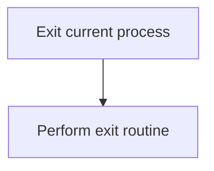

<SwmSnippet path="/src/base/cobol_src/CRDTAGY2.cbl" line="241">

---

The <SwmToken path="src/base/cobol_src/CRDTAGY2.cbl" pos="242:1:11" line-data="           PERFORM GET-ME-OUT-OF-HERE.">`PERFORM GET-ME-OUT-OF-HERE`</SwmToken> statement is used to exit the current process. This step is crucial for terminating the current operation and ensuring that the program can safely exit or transition to another state without any issues.

```cobol

           PERFORM GET-ME-OUT-OF-HERE.
```

---

</SwmSnippet>

## <SwmToken path="src/base/cobol_src/CRDTAGY2.cbl" pos="151:3:7" line-data="              PERFORM POPULATE-TIME-DATE">`POPULATE-TIME-DATE`</SwmToken>

Lets' zoom into this section of the flow:

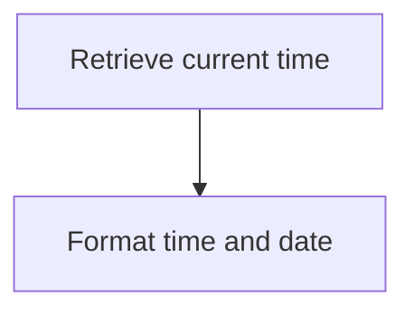

<SwmSnippet path="/src/base/cobol_src/CRDTAGY2.cbl" line="258">

---

First, the <SwmToken path="src/base/cobol_src/CRDTAGY2.cbl" pos="258:1:5" line-data="       POPULATE-TIME-DATE SECTION.">`POPULATE-TIME-DATE`</SwmToken> section begins by retrieving the current time using the <SwmToken path="src/base/cobol_src/CRDTAGY2.cbl" pos="261:1:5" line-data="           EXEC CICS ASKTIME">`EXEC CICS ASKTIME`</SwmToken> command. This command stores the current time in the <SwmToken path="src/base/cobol_src/CRDTAGY2.cbl" pos="262:3:7" line-data="              ABSTIME(WS-U-TIME)">`WS-U-TIME`</SwmToken> variable.

```cobol
       POPULATE-TIME-DATE SECTION.
       PTD010.

           EXEC CICS ASKTIME
              ABSTIME(WS-U-TIME)
           END-EXEC.
```

---

</SwmSnippet>

<SwmSnippet path="/src/base/cobol_src/CRDTAGY2.cbl" line="265">

---

Next, the <SwmToken path="src/base/cobol_src/CRDTAGY2.cbl" pos="265:1:5" line-data="           EXEC CICS FORMATTIME">`EXEC CICS FORMATTIME`</SwmToken> command is used to format the retrieved time. The <SwmToken path="src/base/cobol_src/CRDTAGY2.cbl" pos="266:3:7" line-data="                     ABSTIME(WS-U-TIME)">`WS-U-TIME`</SwmToken> variable is used as input, and the formatted date is stored in <SwmToken path="src/base/cobol_src/CRDTAGY2.cbl" pos="267:3:7" line-data="                     DDMMYYYY(WS-ORIG-DATE)">`WS-ORIG-DATE`</SwmToken> while the formatted time is stored in <SwmToken path="src/base/cobol_src/CRDTAGY2.cbl" pos="268:3:7" line-data="                     TIME(WS-TIME-NOW)">`WS-TIME-NOW`</SwmToken>.

```cobol
           EXEC CICS FORMATTIME
                     ABSTIME(WS-U-TIME)
                     DDMMYYYY(WS-ORIG-DATE)
                     TIME(WS-TIME-NOW)
                     DATESEP
           END-EXEC.
```

---

</SwmSnippet>

<SwmSnippet path="/src/base/cobol_src/CRDTAGY2.cbl" line="272">

---

Finally, the section ends with the <SwmToken path="src/base/cobol_src/CRDTAGY2.cbl" pos="272:1:1" line-data="       PTD999.">`PTD999`</SwmToken> label and an <SwmToken path="src/base/cobol_src/CRDTAGY2.cbl" pos="273:1:1" line-data="           EXIT.">`EXIT`</SwmToken> statement, indicating the end of the <SwmToken path="src/base/cobol_src/CRDTAGY2.cbl" pos="151:3:7" line-data="              PERFORM POPULATE-TIME-DATE">`POPULATE-TIME-DATE`</SwmToken> section.

```cobol
       PTD999.
           EXIT.
```

---

</SwmSnippet>

## <SwmToken path="src/base/cobol_src/CRDTAGY2.cbl" pos="207:3:11" line-data="              PERFORM GET-ME-OUT-OF-HERE">`GET-ME-OUT-OF-HERE`</SwmToken>

Lets' zoom into this section of the flow:

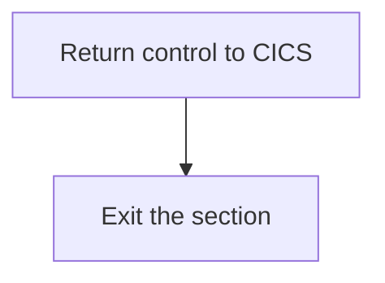

<SwmSnippet path="/src/base/cobol_src/CRDTAGY2.cbl" line="251">

---

First, the <SwmToken path="src/base/cobol_src/CRDTAGY2.cbl" pos="251:1:5" line-data="           EXEC CICS RETURN">`EXEC CICS RETURN`</SwmToken> command is used to return control to the CICS region, indicating that the current transaction has completed its processing.

```cobol
           EXEC CICS RETURN
           END-EXEC.
```

---

</SwmSnippet>

<SwmSnippet path="/src/base/cobol_src/CRDTAGY2.cbl" line="254">

---

Next, the <SwmToken path="src/base/cobol_src/CRDTAGY2.cbl" pos="255:1:1" line-data="           EXIT.">`EXIT`</SwmToken> statement is executed to leave the <SwmToken path="src/base/cobol_src/CRDTAGY2.cbl" pos="207:3:11" line-data="              PERFORM GET-ME-OUT-OF-HERE">`GET-ME-OUT-OF-HERE`</SwmToken> section, ensuring that no further processing occurs in this section.

```cobol
       GMOFH999.
           EXIT.
```

---

</SwmSnippet>

&nbsp;

*This is an auto-generated document by Swimm 🌊 and has not yet been verified by a human*

<SwmMeta version="3.0.0" repo-id="Z2l0aHViJTNBJTNBY2ljcy1iYW5raW5nLXNhbXBsZS1hcHBsaWNhdGlvbi1jYnNhLUlCTS1EZW1vJTNBJTNBU3dpbW0tRGVtbw==" repo-name="cics-banking-sample-application-cbsa-IBM-Demo"><sup>Powered by [Swimm](/)</sup></SwmMeta>
