The <SwmToken path="src/base/cobol_src/CRDTAGY4.cbl" pos="203:4:4" line-data="              DISPLAY &#39;CRDTAGY4 - UNABLE TO GET CONTAINER. RESP=&#39;">`CRDTAGY4`</SwmToken> program is designed to handle various operations related to credit score processing. It achieves this by setting up necessary variables, generating and handling delays, computing container lengths, retrieving and storing data, and finalizing the process. The program ensures that each step is executed correctly and handles any errors that may occur during the process.

The flow involves setting up variables, generating a delay, handling any delay errors, computing the container length, retrieving data, computing the credit score, storing the updated data, handling any container errors, and finalizing the process. Each step is crucial to ensure the accurate processing of credit scores and proper error handling.

Here is a high level diagram of the program:

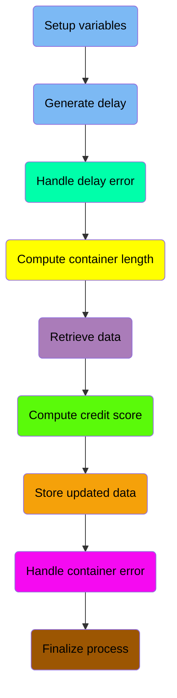

## Setup variables

First, we'll zoom into this section of the flow:

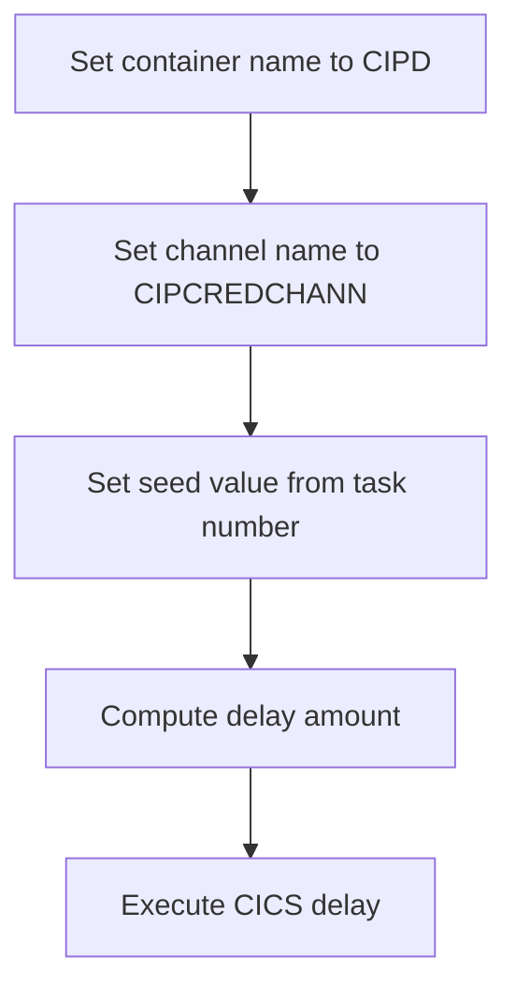

First, we set the container name to <SwmToken path="src/base/cobol_src/CRDTAGY4.cbl" pos="120:4:4" line-data="           MOVE &#39;CIPD            &#39; TO WS-CONTAINER-NAME.">`CIPD`</SwmToken> to specify the target container for the operation.

Moving to the next step, we set the channel name to <SwmToken path="src/base/cobol_src/CRDTAGY4.cbl" pos="121:4:4" line-data="           MOVE &#39;CIPCREDCHANN    &#39; TO WS-CHANNEL-NAME.">`CIPCREDCHANN`</SwmToken>, which is used to identify the communication channel for the operation.

Next, we set the seed value from the task number (<SwmToken path="src/base/cobol_src/CRDTAGY4.cbl" pos="122:3:3" line-data="           MOVE EIBTASKN           TO WS-SEED.">`EIBTASKN`</SwmToken>), which will be used to generate a random delay.

<SwmSnippet path="/src/base/cobol_src/CRDTAGY4.cbl" line="113">

---

Then, we compute the delay amount by generating a random number of seconds between 0 and 3. This delay is introduced to simulate processing time.

```cobol
       PREMIERE SECTION.
       A010.
      *
      *    Generate a random  number of seconds between 0 & 3.
      *    This is the delay amount in seconds.
      *

           MOVE 'CIPD            ' TO WS-CONTAINER-NAME.
           MOVE 'CIPCREDCHANN    ' TO WS-CHANNEL-NAME.
           MOVE EIBTASKN           TO WS-SEED.

           COMPUTE WS-DELAY-AMT = ((3 - 1)
```

---

</SwmSnippet>

## Generate delay

This is the next section of the flow.

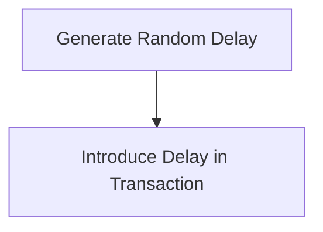

<SwmSnippet path="/src/base/cobol_src/CRDTAGY4.cbl" line="125">

---

First, the function generates a random delay amount using the <SwmToken path="src/base/cobol_src/CRDTAGY4.cbl" pos="125:5:5" line-data="                            * FUNCTION RANDOM(WS-SEED)) + 1.">`RANDOM`</SwmToken> function with <SwmToken path="src/base/cobol_src/CRDTAGY4.cbl" pos="125:7:9" line-data="                            * FUNCTION RANDOM(WS-SEED)) + 1.">`WS-SEED`</SwmToken> as the seed value. This ensures that each delay is unique and unpredictable, adding variability to the transaction processing time.

```cobol
                            * FUNCTION RANDOM(WS-SEED)) + 1.
```

---

</SwmSnippet>

<SwmSnippet path="/src/base/cobol_src/CRDTAGY4.cbl" line="127">

---

Next, the function introduces a delay in the transaction processing by executing the <SwmToken path="src/base/cobol_src/CRDTAGY4.cbl" pos="127:3:5" line-data="           EXEC CICS DELAY">`CICS DELAY`</SwmToken> command. The delay duration is specified by <SwmToken path="src/base/cobol_src/CRDTAGY4.cbl" pos="128:5:9" line-data="                FOR SECONDS(WS-DELAY-AMT)">`WS-DELAY-AMT`</SwmToken>, which was previously determined by the random function.

```cobol
           EXEC CICS DELAY
                FOR SECONDS(WS-DELAY-AMT)
```

---

</SwmSnippet>

<SwmSnippet path="/src/base/cobol_src/CRDTAGY4.cbl" line="129">

---

Then, the function captures the response of the delay operation using <SwmToken path="src/base/cobol_src/CRDTAGY4.cbl" pos="129:1:1" line-data="                RESP(WS-CICS-RESP)">`RESP`</SwmToken> and <SwmToken path="src/base/cobol_src/CRDTAGY4.cbl" pos="130:1:1" line-data="                RESP2(WS-CICS-RESP2)">`RESP2`</SwmToken> to store the response codes in <SwmToken path="src/base/cobol_src/CRDTAGY4.cbl" pos="129:3:7" line-data="                RESP(WS-CICS-RESP)">`WS-CICS-RESP`</SwmToken> and <SwmToken path="src/base/cobol_src/CRDTAGY4.cbl" pos="130:3:7" line-data="                RESP2(WS-CICS-RESP2)">`WS-CICS-RESP2`</SwmToken> respectively. This helps in handling any potential issues that might arise during the delay execution.

```cobol
                RESP(WS-CICS-RESP)
                RESP2(WS-CICS-RESP2)
           END-EXEC.
```

---

</SwmSnippet>

## Handle delay error

Now, lets zoom into this section of the flow:

```mermaid
graph TD
  A[Check if response is normal] -->|No| B[Initialize ABNDINFO-REC]
  B --> C[Move EIBRESP to ABND-RESPCODE]
  C --> D[Move EIBRESP2 to ABND-RESP2CODE]
  D --> E[Assign APPLID to ABND-APPLID]
  E --> F[Move EIBTASKN to ABND-TASKNO-KEY]
  F --> G[Move EIBTRNID to ABND-TRANID]
  G --> H[Perform POPULATE-TIME-DATE]
  H --> I[Move WS-ORIG-DATE to ABND-DATE]
  I --> J[Format and move current time to ABND-TIME]
  J --> K[Move WS-U-TIME to ABND-UTIME-KEY]
  K --> L[Move 'PLOP' to ABND-CODE]
  L --> M[Assign PROGRAM to ABND-PROGRAM]
  M --> N[Move ZEROS to ABND-SQLCODE]
  N --> O[Format and move error message to ABND-FREEFORM]
  O --> P[Link to ABNDPROC program]
  P --> Q[Display error message]
  Q --> R[Trigger CICS ABEND with code 'PLOP']

%% Swimm:
%% graph TD
%%   A[Check if response is normal] -->|No| B[Initialize <SwmToken path="src/base/cobol_src/CRDTAGY4.cbl" pos="140:3:5" line-data="              INITIALIZE ABNDINFO-REC">`ABNDINFO-REC`</SwmToken>]
%%   B --> C[Move EIBRESP to <SwmToken path="src/base/cobol_src/CRDTAGY4.cbl" pos="141:7:9" line-data="              MOVE EIBRESP    TO ABND-RESPCODE">`ABND-RESPCODE`</SwmToken>]
%%   C --> D[Move <SwmToken path="src/base/cobol_src/CRDTAGY4.cbl" pos="142:3:3" line-data="              MOVE EIBRESP2   TO ABND-RESP2CODE">`EIBRESP2`</SwmToken> to <SwmToken path="src/base/cobol_src/CRDTAGY4.cbl" pos="142:7:9" line-data="              MOVE EIBRESP2   TO ABND-RESP2CODE">`ABND-RESP2CODE`</SwmToken>]
%%   D --> E[Assign APPLID to <SwmToken path="src/base/cobol_src/CRDTAGY4.cbl" pos="146:9:11" line-data="              EXEC CICS ASSIGN APPLID(ABND-APPLID)">`ABND-APPLID`</SwmToken>]
%%   E --> F[Move EIBTASKN to <SwmToken path="src/base/cobol_src/CRDTAGY4.cbl" pos="149:7:11" line-data="              MOVE EIBTASKN   TO ABND-TASKNO-KEY">`ABND-TASKNO-KEY`</SwmToken>]
%%   F --> G[Move EIBTRNID to <SwmToken path="src/base/cobol_src/CRDTAGY4.cbl" pos="150:7:9" line-data="              MOVE EIBTRNID   TO ABND-TRANID">`ABND-TRANID`</SwmToken>]
%%   G --> H[Perform <SwmToken path="src/base/cobol_src/CRDTAGY4.cbl" pos="152:3:7" line-data="              PERFORM POPULATE-TIME-DATE">`POPULATE-TIME-DATE`</SwmToken>]
%%   H --> I[Move <SwmToken path="src/base/cobol_src/CRDTAGY4.cbl" pos="154:3:7" line-data="              MOVE WS-ORIG-DATE TO ABND-DATE">`WS-ORIG-DATE`</SwmToken> to <SwmToken path="src/base/cobol_src/CRDTAGY4.cbl" pos="154:11:13" line-data="              MOVE WS-ORIG-DATE TO ABND-DATE">`ABND-DATE`</SwmToken>]
%%   I --> J[Format and move current time to <SwmToken path="src/base/cobol_src/CRDTAGY4.cbl" pos="160:3:5" line-data="                       INTO ABND-TIME">`ABND-TIME`</SwmToken>]
%%   J --> K[Move <SwmToken path="src/base/cobol_src/CRDTAGY4.cbl" pos="163:3:7" line-data="              MOVE WS-U-TIME   TO ABND-UTIME-KEY">`WS-U-TIME`</SwmToken> to <SwmToken path="src/base/cobol_src/CRDTAGY4.cbl" pos="163:11:15" line-data="              MOVE WS-U-TIME   TO ABND-UTIME-KEY">`ABND-UTIME-KEY`</SwmToken>]
%%   K --> L[Move 'PLOP' to <SwmToken path="src/base/cobol_src/CRDTAGY4.cbl" pos="164:9:11" line-data="              MOVE &#39;PLOP&#39;      TO ABND-CODE">`ABND-CODE`</SwmToken>]
%%   L --> M[Assign PROGRAM to <SwmToken path="src/base/cobol_src/CRDTAGY4.cbl" pos="166:9:11" line-data="              EXEC CICS ASSIGN PROGRAM(ABND-PROGRAM)">`ABND-PROGRAM`</SwmToken>]
%%   M --> N[Move ZEROS to <SwmToken path="src/base/cobol_src/CRDTAGY4.cbl" pos="169:7:9" line-data="              MOVE ZEROS      TO ABND-SQLCODE">`ABND-SQLCODE`</SwmToken>]
%%   N --> O[Format and move error message to <SwmToken path="src/base/cobol_src/CRDTAGY4.cbl" pos="177:3:5" line-data="                      INTO ABND-FREEFORM">`ABND-FREEFORM`</SwmToken>]
%%   O --> P[Link to ABNDPROC program]
%%   P --> Q[Display error message]
%%   Q --> R[Trigger CICS ABEND with code 'PLOP']
```

First, the code checks if the response is not normal by evaluating <SwmToken path="src/base/cobol_src/CRDTAGY4.cbl" pos="129:3:7" line-data="                RESP(WS-CICS-RESP)">`WS-CICS-RESP`</SwmToken>.

<SwmSnippet path="/src/base/cobol_src/CRDTAGY4.cbl" line="140">

---

If the response is not normal, it initializes the <SwmToken path="src/base/cobol_src/CRDTAGY4.cbl" pos="140:3:5" line-data="              INITIALIZE ABNDINFO-REC">`ABNDINFO-REC`</SwmToken> to prepare for capturing abend information.

```cobol
              INITIALIZE ABNDINFO-REC
```

---

</SwmSnippet>

<SwmSnippet path="/src/base/cobol_src/CRDTAGY4.cbl" line="141">

---

Next, it moves <SwmToken path="src/base/cobol_src/CRDTAGY4.cbl" pos="141:3:3" line-data="              MOVE EIBRESP    TO ABND-RESPCODE">`EIBRESP`</SwmToken> to <SwmToken path="src/base/cobol_src/CRDTAGY4.cbl" pos="141:7:9" line-data="              MOVE EIBRESP    TO ABND-RESPCODE">`ABND-RESPCODE`</SwmToken> and <SwmToken path="src/base/cobol_src/CRDTAGY4.cbl" pos="142:3:3" line-data="              MOVE EIBRESP2   TO ABND-RESP2CODE">`EIBRESP2`</SwmToken> to <SwmToken path="src/base/cobol_src/CRDTAGY4.cbl" pos="142:7:9" line-data="              MOVE EIBRESP2   TO ABND-RESP2CODE">`ABND-RESP2CODE`</SwmToken> to capture the response codes.

```cobol
              MOVE EIBRESP    TO ABND-RESPCODE
              MOVE EIBRESP2   TO ABND-RESP2CODE
```

---

</SwmSnippet>

<SwmSnippet path="/src/base/cobol_src/CRDTAGY4.cbl" line="146">

---

The program then assigns the application ID to <SwmToken path="src/base/cobol_src/CRDTAGY4.cbl" pos="146:9:11" line-data="              EXEC CICS ASSIGN APPLID(ABND-APPLID)">`ABND-APPLID`</SwmToken> using the CICS ASSIGN command.

```cobol
              EXEC CICS ASSIGN APPLID(ABND-APPLID)
              END-EXEC
```

---

</SwmSnippet>

<SwmSnippet path="/src/base/cobol_src/CRDTAGY4.cbl" line="149">

---

It moves <SwmToken path="src/base/cobol_src/CRDTAGY4.cbl" pos="149:3:3" line-data="              MOVE EIBTASKN   TO ABND-TASKNO-KEY">`EIBTASKN`</SwmToken> to <SwmToken path="src/base/cobol_src/CRDTAGY4.cbl" pos="149:7:11" line-data="              MOVE EIBTASKN   TO ABND-TASKNO-KEY">`ABND-TASKNO-KEY`</SwmToken> and <SwmToken path="src/base/cobol_src/CRDTAGY4.cbl" pos="150:3:3" line-data="              MOVE EIBTRNID   TO ABND-TRANID">`EIBTRNID`</SwmToken> to <SwmToken path="src/base/cobol_src/CRDTAGY4.cbl" pos="150:7:9" line-data="              MOVE EIBTRNID   TO ABND-TRANID">`ABND-TRANID`</SwmToken> to capture the task number and transaction ID.

```cobol
              MOVE EIBTASKN   TO ABND-TASKNO-KEY
              MOVE EIBTRNID   TO ABND-TRANID
```

---

</SwmSnippet>

<SwmSnippet path="/src/base/cobol_src/CRDTAGY4.cbl" line="152">

---

The <SwmToken path="src/base/cobol_src/CRDTAGY4.cbl" pos="152:3:7" line-data="              PERFORM POPULATE-TIME-DATE">`POPULATE-TIME-DATE`</SwmToken> routine is performed to get the current date and time.

```cobol
              PERFORM POPULATE-TIME-DATE
```

---

</SwmSnippet>

<SwmSnippet path="/src/base/cobol_src/CRDTAGY4.cbl" line="154">

---

The original date is moved to <SwmToken path="src/base/cobol_src/CRDTAGY4.cbl" pos="154:11:13" line-data="              MOVE WS-ORIG-DATE TO ABND-DATE">`ABND-DATE`</SwmToken>, and the current time is formatted and moved to <SwmToken path="src/base/cobol_src/CRDTAGY4.cbl" pos="160:3:5" line-data="                       INTO ABND-TIME">`ABND-TIME`</SwmToken>.

```cobol
              MOVE WS-ORIG-DATE TO ABND-DATE
              STRING WS-TIME-NOW-GRP-HH DELIMITED BY SIZE,
                      ':' DELIMITED BY SIZE,
                       WS-TIME-NOW-GRP-MM DELIMITED BY SIZE,
                       ':' DELIMITED BY SIZE,
                       WS-TIME-NOW-GRP-MM DELIMITED BY SIZE
                       INTO ABND-TIME
```

---

</SwmSnippet>

<SwmSnippet path="/src/base/cobol_src/CRDTAGY4.cbl" line="163">

---

The program then moves <SwmToken path="src/base/cobol_src/CRDTAGY4.cbl" pos="163:3:7" line-data="              MOVE WS-U-TIME   TO ABND-UTIME-KEY">`WS-U-TIME`</SwmToken> to <SwmToken path="src/base/cobol_src/CRDTAGY4.cbl" pos="163:11:15" line-data="              MOVE WS-U-TIME   TO ABND-UTIME-KEY">`ABND-UTIME-KEY`</SwmToken> and sets <SwmToken path="src/base/cobol_src/CRDTAGY4.cbl" pos="164:9:11" line-data="              MOVE &#39;PLOP&#39;      TO ABND-CODE">`ABND-CODE`</SwmToken> to 'PLOP'.

```cobol
              MOVE WS-U-TIME   TO ABND-UTIME-KEY
              MOVE 'PLOP'      TO ABND-CODE
```

---

</SwmSnippet>

<SwmSnippet path="/src/base/cobol_src/CRDTAGY4.cbl" line="180">

---

Finally, the program links to the <SwmToken path="src/base/cobol_src/CRDTAGY4.cbl" pos="103:19:19" line-data="       01 WS-ABEND-PGM                  PIC X(8)   VALUE &#39;ABNDPROC&#39;.">`ABNDPROC`</SwmToken> program to handle the abend and displays an error message before triggering a CICS ABEND with the code 'PLOP'.

More about ABNDPROC: <SwmLink doc-title="Writing Abend Records (ABNDPROC)">[Writing Abend Records (ABNDPROC)](/.swm/writing-abend-records-abndproc.svfj4jn5.sw.md)</SwmLink>

```cobol
              EXEC CICS LINK PROGRAM(WS-ABEND-PGM)
                          COMMAREA(ABNDINFO-REC)
              END-EXEC


              DISPLAY '*** The delay messed up ! ***'
              EXEC CICS ABEND
                 ABCODE('PLOP')
              END-EXEC
```

---

</SwmSnippet>

## Compute container length

This is the next section of the flow.

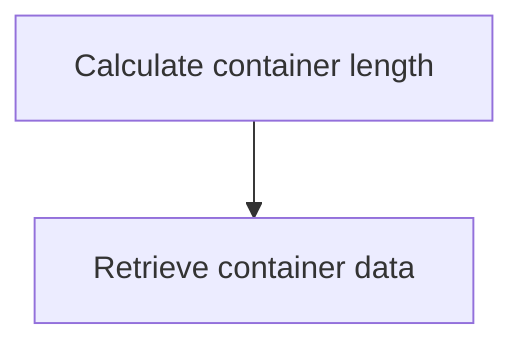

<SwmSnippet path="/src/base/cobol_src/CRDTAGY4.cbl" line="192">

---

The <SwmToken path="src/base/cobol_src/CRDTAGY4.cbl" pos="113:1:1" line-data="       PREMIERE SECTION.">`PREMIERE`</SwmToken> function retrieves data from a CICS container. First, it calculates the length of the container data by computing <SwmToken path="src/base/cobol_src/CRDTAGY4.cbl" pos="192:3:7" line-data="           COMPUTE WS-CONTAINER-LEN = LENGTH OF WS-CONT-IN.">`WS-CONTAINER-LEN`</SwmToken> (the length of <SwmToken path="src/base/cobol_src/CRDTAGY4.cbl" pos="192:15:19" line-data="           COMPUTE WS-CONTAINER-LEN = LENGTH OF WS-CONT-IN.">`WS-CONT-IN`</SwmToken>). This ensures that the program knows the exact size of the data it is about to handle.

```cobol
           COMPUTE WS-CONTAINER-LEN = LENGTH OF WS-CONT-IN.
```

---

</SwmSnippet>

<SwmSnippet path="/src/base/cobol_src/CRDTAGY4.cbl" line="194">

---

Next, the function retrieves the container data using the <SwmToken path="src/base/cobol_src/CRDTAGY4.cbl" pos="194:1:7" line-data="           EXEC CICS GET CONTAINER(WS-CONTAINER-NAME)">`EXEC CICS GET CONTAINER`</SwmToken> command. It specifies the container name (<SwmToken path="src/base/cobol_src/CRDTAGY4.cbl" pos="194:9:13" line-data="           EXEC CICS GET CONTAINER(WS-CONTAINER-NAME)">`WS-CONTAINER-NAME`</SwmToken>), the channel name (<SwmToken path="src/base/cobol_src/CRDTAGY4.cbl" pos="195:3:7" line-data="                     CHANNEL(WS-CHANNEL-NAME)">`WS-CHANNEL-NAME`</SwmToken>), and the target variable (<SwmToken path="src/base/cobol_src/CRDTAGY4.cbl" pos="196:3:7" line-data="                     INTO(WS-CONT-IN)">`WS-CONT-IN`</SwmToken>) where the data will be stored. The length of the data to be retrieved is specified by <SwmToken path="src/base/cobol_src/CRDTAGY4.cbl" pos="197:3:7" line-data="                     FLENGTH(WS-CONTAINER-LEN)">`WS-CONTAINER-LEN`</SwmToken>.

```cobol
           EXEC CICS GET CONTAINER(WS-CONTAINER-NAME)
                     CHANNEL(WS-CHANNEL-NAME)
                     INTO(WS-CONT-IN)
                     FLENGTH(WS-CONTAINER-LEN)
                     RESP(WS-CICS-RESP)
```

---

</SwmSnippet>

<SwmSnippet path="/src/base/cobol_src/CRDTAGY4.cbl" line="198">

---

The <SwmToken path="src/base/cobol_src/CRDTAGY4.cbl" pos="198:1:1" line-data="                     RESP(WS-CICS-RESP)">`RESP`</SwmToken> and <SwmToken path="src/base/cobol_src/CRDTAGY4.cbl" pos="199:1:1" line-data="                     RESP2(WS-CICS-RESP2)">`RESP2`</SwmToken> fields (<SwmToken path="src/base/cobol_src/CRDTAGY4.cbl" pos="198:3:7" line-data="                     RESP(WS-CICS-RESP)">`WS-CICS-RESP`</SwmToken> and <SwmToken path="src/base/cobol_src/CRDTAGY4.cbl" pos="199:3:7" line-data="                     RESP2(WS-CICS-RESP2)">`WS-CICS-RESP2`</SwmToken>) are used to capture the response codes from the CICS command, which helps in handling any errors or special conditions that might occur during the data retrieval process.

```cobol
                     RESP(WS-CICS-RESP)
                     RESP2(WS-CICS-RESP2)
```

---

</SwmSnippet>

## Retrieve data

Now, lets zoom into this section of the flow:

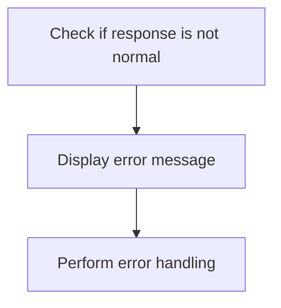

<SwmSnippet path="/src/base/cobol_src/CRDTAGY4.cbl" line="202">

---

The code checks if <SwmToken path="src/base/cobol_src/CRDTAGY4.cbl" pos="202:3:7" line-data="           IF WS-CICS-RESP NOT = DFHRESP(NORMAL)">`WS-CICS-RESP`</SwmToken> (the response code) is not equal to <SwmToken path="src/base/cobol_src/CRDTAGY4.cbl" pos="202:13:16" line-data="           IF WS-CICS-RESP NOT = DFHRESP(NORMAL)">`DFHRESP(NORMAL)`</SwmToken> (indicating a normal response). If the response is not normal, it displays an error message with details such as the response codes, container name, channel name, and container length. This helps in diagnosing the issue by providing relevant information. Finally, it performs the <SwmToken path="src/base/cobol_src/CRDTAGY4.cbl" pos="208:3:11" line-data="              PERFORM GET-ME-OUT-OF-HERE">`GET-ME-OUT-OF-HERE`</SwmToken> routine to handle the error appropriately.

```cobol
           IF WS-CICS-RESP NOT = DFHRESP(NORMAL)
              DISPLAY 'CRDTAGY4 - UNABLE TO GET CONTAINER. RESP='
                 WS-CICS-RESP ', RESP2=' WS-CICS-RESP2
              DISPLAY 'CONTAINER=' WS-CONTAINER-NAME ' CHANNEL='
                       WS-CHANNEL-NAME ' FLENGTH='
                       WS-CONTAINER-LEN
              PERFORM GET-ME-OUT-OF-HERE
           END-IF.
```

---

</SwmSnippet>

## Compute credit score

This is the next section of the flow.

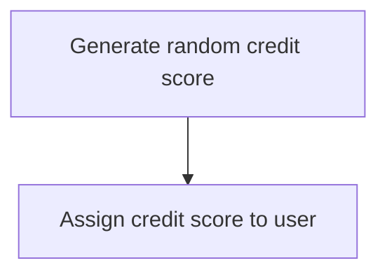

<SwmSnippet path="/src/base/cobol_src/CRDTAGY4.cbl" line="217">

---

### Generating random credit score

First, the code generates a new credit score for the user by computing a random number between 1 and 999. This is achieved using the <SwmToken path="src/base/cobol_src/CRDTAGY4.cbl" pos="218:5:5" line-data="                            * FUNCTION RANDOM) + 1.">`RANDOM`</SwmToken> function, which ensures that the credit score falls within the specified range.

```cobol
           COMPUTE WS-NEW-CREDSCORE = ((999 - 1)
                            * FUNCTION RANDOM) + 1.
```

---

</SwmSnippet>

<SwmSnippet path="/src/base/cobol_src/CRDTAGY4.cbl" line="220">

---

### Assigning credit score to user

Next, the newly generated credit score is assigned to the user by moving the value from <SwmToken path="src/base/cobol_src/CRDTAGY4.cbl" pos="220:3:7" line-data="           MOVE WS-NEW-CREDSCORE TO WS-CONT-IN-CREDIT-SCORE.">`WS-NEW-CREDSCORE`</SwmToken> to <SwmToken path="src/base/cobol_src/CRDTAGY4.cbl" pos="220:11:19" line-data="           MOVE WS-NEW-CREDSCORE TO WS-CONT-IN-CREDIT-SCORE.">`WS-CONT-IN-CREDIT-SCORE`</SwmToken>. This step ensures that the user's credit score is updated with the newly generated value.

```cobol
           MOVE WS-NEW-CREDSCORE TO WS-CONT-IN-CREDIT-SCORE.
```

---

</SwmSnippet>

## Store updated data

This is the next section of the flow.

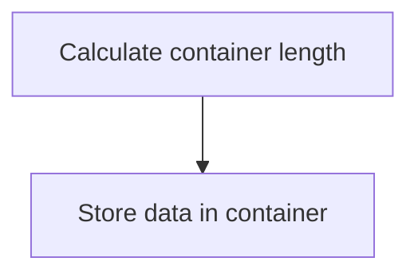

<SwmSnippet path="/src/base/cobol_src/CRDTAGY4.cbl" line="225">

---

### Calculating container length

First, the length of the data to be stored in the container is calculated. This is done by computing the length of <SwmToken path="src/base/cobol_src/CRDTAGY4.cbl" pos="225:15:19" line-data="           COMPUTE WS-CONTAINER-LEN = LENGTH OF WS-CONT-IN.">`WS-CONT-IN`</SwmToken> (the data to be stored) and storing it in <SwmToken path="src/base/cobol_src/CRDTAGY4.cbl" pos="225:3:7" line-data="           COMPUTE WS-CONTAINER-LEN = LENGTH OF WS-CONT-IN.">`WS-CONTAINER-LEN`</SwmToken>.

```cobol
           COMPUTE WS-CONTAINER-LEN = LENGTH OF WS-CONT-IN.
```

---

</SwmSnippet>

<SwmSnippet path="/src/base/cobol_src/CRDTAGY4.cbl" line="227">

---

### Storing data in container

Next, the data is stored in the container using the <SwmToken path="src/base/cobol_src/CRDTAGY4.cbl" pos="227:1:7" line-data="           EXEC CICS PUT CONTAINER(WS-CONTAINER-NAME)">`EXEC CICS PUT CONTAINER`</SwmToken> command. This command takes the container name (<SwmToken path="src/base/cobol_src/CRDTAGY4.cbl" pos="227:9:13" line-data="           EXEC CICS PUT CONTAINER(WS-CONTAINER-NAME)">`WS-CONTAINER-NAME`</SwmToken>), the data (<SwmToken path="src/base/cobol_src/CRDTAGY4.cbl" pos="228:3:7" line-data="                         FROM(WS-CONT-IN)">`WS-CONT-IN`</SwmToken>), the length of the data (<SwmToken path="src/base/cobol_src/CRDTAGY4.cbl" pos="229:3:7" line-data="                         FLENGTH(WS-CONTAINER-LEN)">`WS-CONTAINER-LEN`</SwmToken>), and the channel name (<SwmToken path="src/base/cobol_src/CRDTAGY4.cbl" pos="230:3:7" line-data="                         CHANNEL(WS-CHANNEL-NAME)">`WS-CHANNEL-NAME`</SwmToken>). The response codes are stored in <SwmToken path="src/base/cobol_src/CRDTAGY4.cbl" pos="231:3:7" line-data="                         RESP(WS-CICS-RESP)">`WS-CICS-RESP`</SwmToken> and <SwmToken path="src/base/cobol_src/CRDTAGY4.cbl" pos="232:3:7" line-data="                         RESP2(WS-CICS-RESP2)">`WS-CICS-RESP2`</SwmToken> for further processing.

```cobol
           EXEC CICS PUT CONTAINER(WS-CONTAINER-NAME)
                         FROM(WS-CONT-IN)
                         FLENGTH(WS-CONTAINER-LEN)
                         CHANNEL(WS-CHANNEL-NAME)
                         RESP(WS-CICS-RESP)
                         RESP2(WS-CICS-RESP2)
           END-EXEC.
```

---

</SwmSnippet>

## Handle container error

Now, lets zoom into this section of the flow:

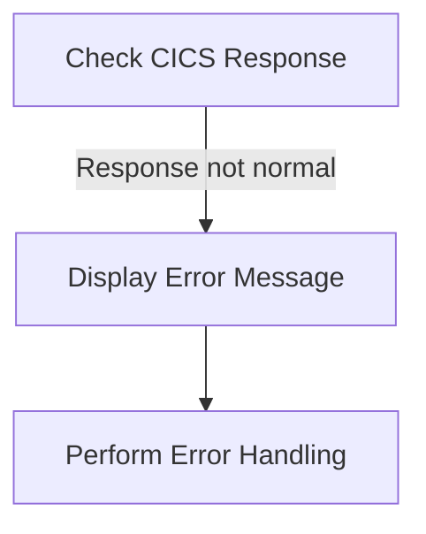

<SwmSnippet path="/src/base/cobol_src/CRDTAGY4.cbl" line="235">

---

When the CICS response is not normal, the system displays an error message indicating the failure to put the container. This message includes the response codes <SwmToken path="src/base/cobol_src/CRDTAGY4.cbl" pos="235:3:7" line-data="           IF WS-CICS-RESP NOT = DFHRESP(NORMAL)">`WS-CICS-RESP`</SwmToken> and <SwmToken path="src/base/cobol_src/CRDTAGY4.cbl" pos="237:14:18" line-data="                 WS-CICS-RESP &#39;, RESP2=&#39; WS-CICS-RESP2">`WS-CICS-RESP2`</SwmToken>, as well as details about the container name <SwmToken path="src/base/cobol_src/CRDTAGY4.cbl" pos="238:8:12" line-data="              DISPLAY  &#39;CONTAINER=&#39;  WS-CONTAINER-NAME">`WS-CONTAINER-NAME`</SwmToken>, channel name <SwmToken path="src/base/cobol_src/CRDTAGY4.cbl" pos="239:7:11" line-data="              &#39; CHANNEL=&#39; WS-CHANNEL-NAME &#39; FLENGTH=&#39;">`WS-CHANNEL-NAME`</SwmToken>, and container length <SwmToken path="src/base/cobol_src/CRDTAGY4.cbl" pos="240:1:5" line-data="                    WS-CONTAINER-LEN">`WS-CONTAINER-LEN`</SwmToken>. Following the error message display, the system performs the <SwmToken path="src/base/cobol_src/CRDTAGY4.cbl" pos="241:3:11" line-data="              PERFORM GET-ME-OUT-OF-HERE">`GET-ME-OUT-OF-HERE`</SwmToken> routine to handle the error and exit the current operation gracefully.

```cobol
           IF WS-CICS-RESP NOT = DFHRESP(NORMAL)
              DISPLAY 'CRDTAGY4- UNABLE TO PUT CONTAINER. RESP='
                 WS-CICS-RESP ', RESP2=' WS-CICS-RESP2
              DISPLAY  'CONTAINER='  WS-CONTAINER-NAME
              ' CHANNEL=' WS-CHANNEL-NAME ' FLENGTH='
                    WS-CONTAINER-LEN
              PERFORM GET-ME-OUT-OF-HERE
           END-IF.
```

---

</SwmSnippet>

## Finalize process

This is the next section of the flow.

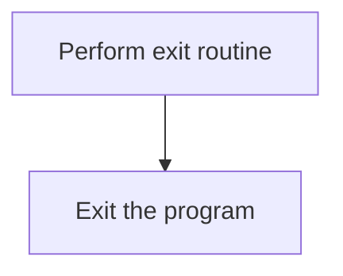

<SwmSnippet path="/src/base/cobol_src/CRDTAGY4.cbl" line="244">

---

The <SwmToken path="src/base/cobol_src/CRDTAGY4.cbl" pos="244:1:11" line-data="           PERFORM GET-ME-OUT-OF-HERE.">`PERFORM GET-ME-OUT-OF-HERE`</SwmToken> statement is used to execute the exit routine, which likely includes any necessary cleanup or finalization tasks before exiting. This ensures that the program terminates gracefully and any required operations are completed. Following this, the <SwmToken path="src/base/cobol_src/CRDTAGY4.cbl" pos="247:1:1" line-data="           EXIT.">`EXIT`</SwmToken> statement is used to leave the current routine, effectively ending the program's execution at this point.

```cobol
           PERFORM GET-ME-OUT-OF-HERE.

       A999.
           EXIT.
```

---

</SwmSnippet>

## <SwmToken path="src/base/cobol_src/CRDTAGY4.cbl" pos="152:3:7" line-data="              PERFORM POPULATE-TIME-DATE">`POPULATE-TIME-DATE`</SwmToken>

Lets' zoom into this section of the flow:

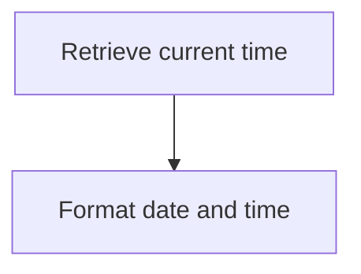

<SwmSnippet path="/src/base/cobol_src/CRDTAGY4.cbl" line="263">

---

### Retrieving current time

First, the current time is retrieved using the <SwmToken path="src/base/cobol_src/CRDTAGY4.cbl" pos="263:1:5" line-data="           EXEC CICS ASKTIME">`EXEC CICS ASKTIME`</SwmToken> command, which stores the absolute time in <SwmToken path="src/base/cobol_src/CRDTAGY4.cbl" pos="264:3:7" line-data="              ABSTIME(WS-U-TIME)">`WS-U-TIME`</SwmToken>.

```cobol
           EXEC CICS ASKTIME
              ABSTIME(WS-U-TIME)
           END-EXEC.
```

---

</SwmSnippet>

<SwmSnippet path="/src/base/cobol_src/CRDTAGY4.cbl" line="267">

---

### Formatting date and time

Next, the <SwmToken path="src/base/cobol_src/CRDTAGY4.cbl" pos="267:1:5" line-data="           EXEC CICS FORMATTIME">`EXEC CICS FORMATTIME`</SwmToken> command is used to format the retrieved time. The absolute time in <SwmToken path="src/base/cobol_src/CRDTAGY4.cbl" pos="268:3:7" line-data="                     ABSTIME(WS-U-TIME)">`WS-U-TIME`</SwmToken> is converted into a human-readable date format stored in <SwmToken path="src/base/cobol_src/CRDTAGY4.cbl" pos="269:3:7" line-data="                     DDMMYYYY(WS-ORIG-DATE)">`WS-ORIG-DATE`</SwmToken> and the current time stored in <SwmToken path="src/base/cobol_src/CRDTAGY4.cbl" pos="270:3:7" line-data="                     TIME(WS-TIME-NOW)">`WS-TIME-NOW`</SwmToken>.

```cobol
           EXEC CICS FORMATTIME
                     ABSTIME(WS-U-TIME)
                     DDMMYYYY(WS-ORIG-DATE)
                     TIME(WS-TIME-NOW)
                     DATESEP
           END-EXEC.
```

---

</SwmSnippet>

## <SwmToken path="src/base/cobol_src/CRDTAGY4.cbl" pos="208:3:11" line-data="              PERFORM GET-ME-OUT-OF-HERE">`GET-ME-OUT-OF-HERE`</SwmToken>

Lets' zoom into this section of the flow:

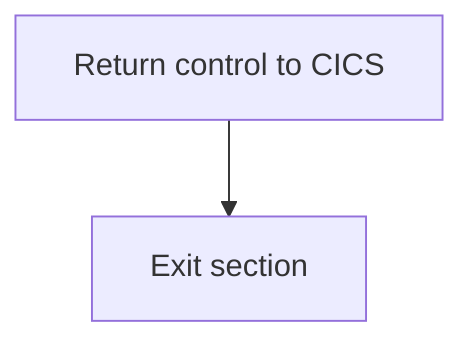

<SwmSnippet path="/src/base/cobol_src/CRDTAGY4.cbl" line="253">

---

### Returning control to CICS

First, the <SwmToken path="src/base/cobol_src/CRDTAGY4.cbl" pos="208:3:11" line-data="              PERFORM GET-ME-OUT-OF-HERE">`GET-ME-OUT-OF-HERE`</SwmToken> section initiates the process of returning control to CICS. This is done using the <SwmToken path="src/base/cobol_src/CRDTAGY4.cbl" pos="253:1:5" line-data="           EXEC CICS RETURN">`EXEC CICS RETURN`</SwmToken> command, which signals the end of the current task and returns control to the CICS region.

```cobol
           EXEC CICS RETURN
           END-EXEC.
```

---

</SwmSnippet>

<SwmSnippet path="/src/base/cobol_src/CRDTAGY4.cbl" line="256">

---

### Exiting the section

Next, the section proceeds to the <SwmToken path="src/base/cobol_src/CRDTAGY4.cbl" pos="256:1:1" line-data="       GMOFH999.">`GMOFH999`</SwmToken> paragraph, which contains the <SwmToken path="src/base/cobol_src/CRDTAGY4.cbl" pos="257:1:1" line-data="           EXIT.">`EXIT`</SwmToken> statement. This marks the end of the <SwmToken path="src/base/cobol_src/CRDTAGY4.cbl" pos="208:3:11" line-data="              PERFORM GET-ME-OUT-OF-HERE">`GET-ME-OUT-OF-HERE`</SwmToken> section, ensuring that the program exits cleanly after returning control to CICS.

```cobol
       GMOFH999.
           EXIT.
```

---

</SwmSnippet>

&nbsp;

*This is an auto-generated document by Swimm 🌊 and has not yet been verified by a human*

<SwmMeta version="3.0.0" repo-id="Z2l0aHViJTNBJTNBY2ljcy1iYW5raW5nLXNhbXBsZS1hcHBsaWNhdGlvbi1jYnNhLUlCTS1EZW1vJTNBJTNBU3dpbW0tRGVtbw==" repo-name="cics-banking-sample-application-cbsa-IBM-Demo"><sup>Powered by [Swimm](/)</sup></SwmMeta>
