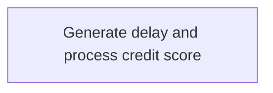

The <SwmToken path="src/base/cobol_src/CRDTAGY4.cbl" pos="25:6:6" line-data="       PROGRAM-ID. CRDTAGY4.">`CRDTAGY4`</SwmToken> program serves as a dummy credit agency used for credit scoring within the application. It receives data via a channel and container, introduces a random delay to simulate real-world conditions, and generates a random credit score. This process is driven using the Async API, and the delay emulates the variability in response times from external systems. The main steps are:

- Generate a random delay amount to simulate processing time variability.
- Introduce the calculated delay.
- Retrieve data from a container.
- Compute a new credit score using a random function.
- Update the container with the new credit score.
- Exit the process to release resources.

For instance, if the program receives a request for credit scoring, it might introduce a delay of 2 seconds and generate a credit score of 450, which is then updated in the container.

# Initializing Delay and Container Setup



<SwmSnippet path="/src/base/cobol_src/CRDTAGY4.cbl" line="114">

---

Here, a random delay amount is generated to introduce variability in processing time, simulating real-world conditions.

```cobol
       A010.
      *
      *    Generate a random  number of seconds between 0 & 3.
      *    This is the delay amount in seconds.
      *

           MOVE 'CIPD            ' TO WS-CONTAINER-NAME.
           MOVE 'CIPCREDCHANN    ' TO WS-CHANNEL-NAME.
           MOVE EIBTASKN           TO WS-SEED.

           COMPUTE WS-DELAY-AMT = ((3 - 1)
```

---

</SwmSnippet>

<SwmSnippet path="/src/base/cobol_src/CRDTAGY4.cbl" line="127">

---

Next, a delay is introduced using the calculated random delay amount to simulate real-world processing times.

```cobol
           EXEC CICS DELAY
                FOR SECONDS(WS-DELAY-AMT)
                RESP(WS-CICS-RESP)
                RESP2(WS-CICS-RESP2)
           END-EXEC.
```

---

</SwmSnippet>

<SwmSnippet path="/src/base/cobol_src/CRDTAGY4.cbl" line="192">

---

Next, data is retrieved from a container to prepare for computing a new credit score.

```cobol
           COMPUTE WS-CONTAINER-LEN = LENGTH OF WS-CONT-IN.

           EXEC CICS GET CONTAINER(WS-CONTAINER-NAME)
                     CHANNEL(WS-CHANNEL-NAME)
                     INTO(WS-CONT-IN)
                     FLENGTH(WS-CONTAINER-LEN)
                     RESP(WS-CICS-RESP)
                     RESP2(WS-CICS-RESP2)
           END-EXEC.
```

---

</SwmSnippet>

<SwmSnippet path="/src/base/cobol_src/CRDTAGY4.cbl" line="217">

---

Next, a new credit score is calculated using a random function and updated in the container to reflect changes in the data.

```cobol
           COMPUTE WS-NEW-CREDSCORE = ((999 - 1)
                            * FUNCTION RANDOM) + 1.

           MOVE WS-NEW-CREDSCORE TO WS-CONT-IN-CREDIT-SCORE.

      *
      *    Now PUT the data back into a container
      *
           COMPUTE WS-CONTAINER-LEN = LENGTH OF WS-CONT-IN.
```

---

</SwmSnippet>

<SwmSnippet path="/src/base/cobol_src/CRDTAGY4.cbl" line="227">

---

Next, updated data is stored back into the container to ensure subsequent operations use the latest data.

```cobol
           EXEC CICS PUT CONTAINER(WS-CONTAINER-NAME)
                         FROM(WS-CONT-IN)
                         FLENGTH(WS-CONTAINER-LEN)
                         CHANNEL(WS-CHANNEL-NAME)
                         RESP(WS-CICS-RESP)
                         RESP2(WS-CICS-RESP2)
           END-EXEC.
```

---

</SwmSnippet>

<SwmSnippet path="/src/base/cobol_src/CRDTAGY4.cbl" line="243">

---

Finally, the flow exits the current process to ensure resources are released properly.

```cobol

           PERFORM GET-ME-OUT-OF-HERE.
```

---

</SwmSnippet>

&nbsp;

*This is an auto-generated document by Swimm 🌊 and has not yet been verified by a human*

<SwmMeta version="3.0.0" repo-id="Z2l0aHViJTNBJTNBY2ljcy1iYW5raW5nLXNhbXBsZS1hcHBsaWNhdGlvbi1jYnNhLUlCTS1EZW1vJTNBJTNBU3dpbW0tRGVtbw==" repo-name="cics-banking-sample-application-cbsa-IBM-Demo"><sup>Powered by [Swimm](/)</sup></SwmMeta>
