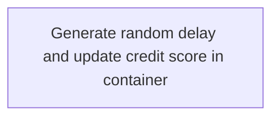

The <SwmToken path="src/base/cobol_src/CRDTAGY5.cbl" pos="25:6:6" line-data="       PROGRAM-ID. CRDTAGY5.">`CRDTAGY5`</SwmToken> program serves as a dummy credit agency used for credit scoring within the application. It receives data via a channel and container, introduces a random delay to simulate asynchronous operations, and generates a random credit score. The program's role is to mimic real-world credit scoring delays and variability, enhancing the application's testing and teaching capabilities. The flow involves several key steps:

- Generate a random delay and update the credit score in the container.
- Use CICS DELAY to simulate a pause.
- Retrieve data from a container for processing.
- Compute a new credit score and update the container.
- Put the updated data back into the container.
- Perform an exit routine to conclude the operation.

For instance, if the program is triggered, it might introduce a delay of 2 seconds and generate a credit score of 450, which is then updated in the container.

# Initializing Delay and Container Operations



<SwmSnippet path="/src/base/cobol_src/CRDTAGY5.cbl" line="112">

---

Here, we use the task number as a seed for randomness to ensure variability in delay calculation, simulating asynchronous operations.

```cobol
       A010.
      *
      *    Generate a random  number of seconds between 0 & 3.
      *    This is the delay amount in seconds.
      *


           MOVE 'CIPE            ' TO WS-CONTAINER-NAME.
           MOVE 'CIPCREDCHANN    ' TO WS-CHANNEL-NAME.
           MOVE EIBTASKN           TO WS-SEED.

           COMPUTE WS-DELAY-AMT = ((3 - 1)
```

---

</SwmSnippet>

<SwmSnippet path="/src/base/cobol_src/CRDTAGY5.cbl" line="126">

---

Next, we use CICS DELAY to simulate a pause, testing the application's handling of timing variations.

```cobol
           EXEC CICS DELAY
                FOR SECONDS(WS-DELAY-AMT)
                RESP(WS-CICS-RESP)
                RESP2(WS-CICS-RESP2)
           END-EXEC.
```

---

</SwmSnippet>

<SwmSnippet path="/src/base/cobol_src/CRDTAGY5.cbl" line="190">

---

Next, we retrieve data from a container, essential for processing and updating the credit score.

```cobol
           COMPUTE WS-CONTAINER-LEN = LENGTH OF WS-CONT-IN.

           EXEC CICS GET CONTAINER(WS-CONTAINER-NAME)
                     CHANNEL(WS-CHANNEL-NAME)
                     INTO(WS-CONT-IN)
                     FLENGTH(WS-CONTAINER-LEN)
                     RESP(WS-CICS-RESP)
                     RESP2(WS-CICS-RESP2)
           END-EXEC.
```

---

</SwmSnippet>

<SwmSnippet path="/src/base/cobol_src/CRDTAGY5.cbl" line="216">

---

Next, we compute a new credit score and update the container to reflect changes accurately.

```cobol
           COMPUTE WS-NEW-CREDSCORE = ((999 - 1)
                            * FUNCTION RANDOM) + 1.

           MOVE WS-NEW-CREDSCORE TO WS-CONT-IN-CREDIT-SCORE.


      *
      *    Now PUT the data back into a container
      *
           COMPUTE WS-CONTAINER-LEN = LENGTH OF WS-CONT-IN.
```

---

</SwmSnippet>

<SwmSnippet path="/src/base/cobol_src/CRDTAGY5.cbl" line="227">

---

Next, we put the updated data back into the container to maintain data integrity and continuity.

```cobol
           EXEC CICS PUT CONTAINER(WS-CONTAINER-NAME)
                         FROM(WS-CONT-IN)
                         FLENGTH(WS-CONTAINER-LEN)
                         CHANNEL(WS-CHANNEL-NAME)
                         RESP(WS-CICS-RESP)
                         RESP2(WS-CICS-RESP2)
           END-EXEC.
```

---

</SwmSnippet>

<SwmSnippet path="/src/base/cobol_src/CRDTAGY5.cbl" line="243">

---

Finally, we perform an exit routine to cleanly end the flow and transition between operations.

```cobol

           PERFORM GET-ME-OUT-OF-HERE.
```

---

</SwmSnippet>

&nbsp;

*This is an auto-generated document by Swimm 🌊 and has not yet been verified by a human*

<SwmMeta version="3.0.0" repo-id="Z2l0aHViJTNBJTNBY2ljcy1iYW5raW5nLXNhbXBsZS1hcHBsaWNhdGlvbi1jYnNhLUlCTS1EZW1vJTNBJTNBU3dpbW0tRGVtbw==" repo-name="cics-banking-sample-application-cbsa-IBM-Demo"><sup>Powered by [Swimm](/)</sup></SwmMeta>
