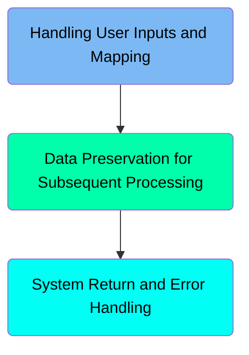
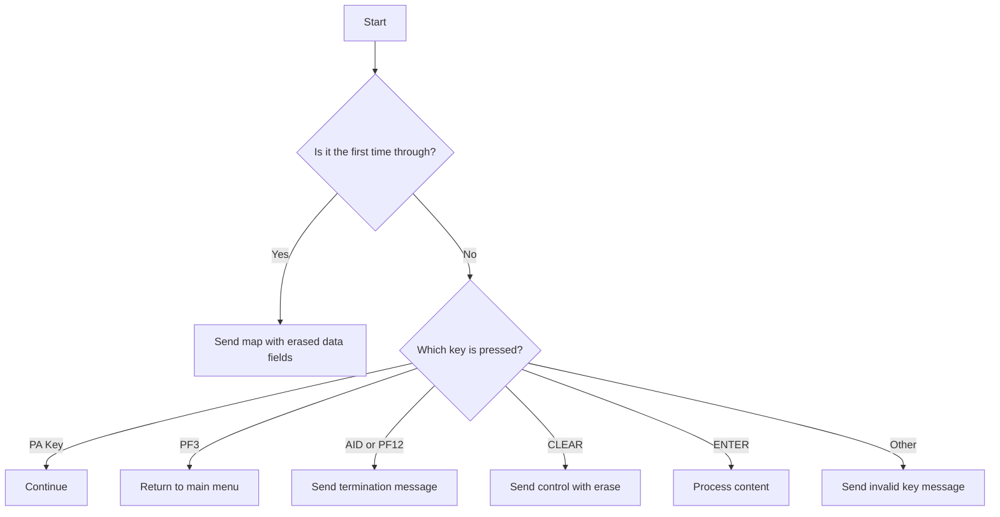
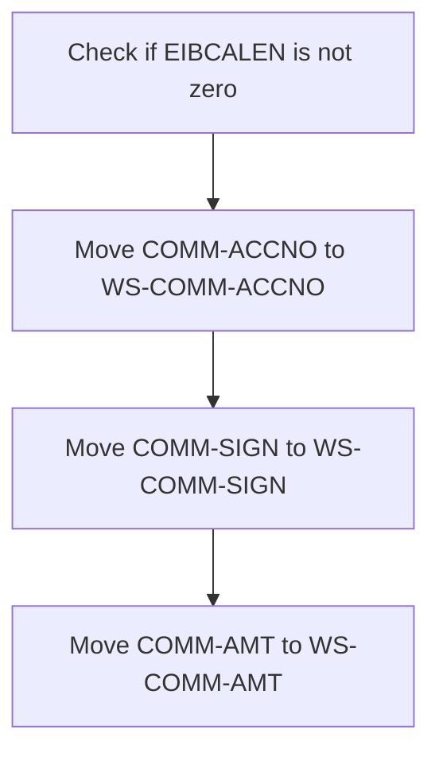
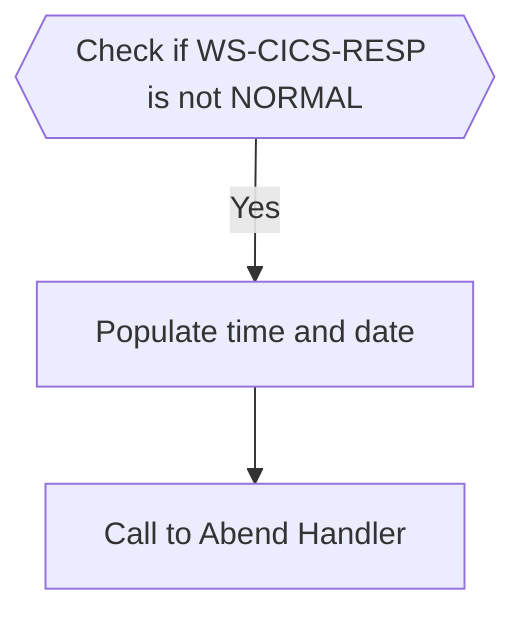

The <SwmToken path="src/base/cobol_src/BNK1CRA.cbl" pos="16:6:6" line-data="       PROGRAM-ID. BNK1CRA.">`BNK1CRA`</SwmToken> program handles user inputs and maps them accordingly in a banking application. It ensures data preservation for subsequent processing and manages system returns and error handling. The program achieves this by evaluating key presses, processing user inputs, and preserving data for continuity and accuracy in the user's session.

The <SwmToken path="src/base/cobol_src/BNK1CRA.cbl" pos="16:6:6" line-data="       PROGRAM-ID. BNK1CRA.">`BNK1CRA`</SwmToken> program starts by checking if it's the first time through and sends a map with erased data fields if true. It then handles various key presses such as PA, PF3, AID, PF12, CLEAR, ENTER, and invalid keys by performing specific actions for each. The program also preserves data for subsequent processing by moving account numbers, signs, and amounts to working storage areas. Finally, it manages system returns and error handling by checking CICS responses, initializing abend information, and linking to the abend handler program.

Here is a high level diagram of the program:



# Handling User Inputs and Mapping



<SwmSnippet path="/src/base/cobol_src/BNK1CRA.cbl" line="180">

---

### Handling First Time Through

First, the code checks if it is the first time through by evaluating if <SwmToken path="src/base/cobol_src/BNK1CRA.cbl" pos="185:3:3" line-data="              WHEN EIBCALEN = ZERO">`EIBCALEN`</SwmToken> is zero. If it is, it moves low values to <SwmToken path="src/base/cobol_src/BNK1CRA.cbl" pos="186:9:9" line-data="                 MOVE LOW-VALUE TO BNK1CDO">`BNK1CDO`</SwmToken>, sets <SwmToken path="src/base/cobol_src/BNK1CRA.cbl" pos="187:8:8" line-data="                 MOVE -1 TO ACCNOL">`ACCNOL`</SwmToken> to -1, and sets <SwmToken path="src/base/cobol_src/BNK1CRA.cbl" pos="188:3:5" line-data="                 SET SEND-ERASE TO TRUE">`SEND-ERASE`</SwmToken> to true. Then, it performs the <SwmToken path="src/base/cobol_src/BNK1CRA.cbl" pos="189:3:5" line-data="                 PERFORM SEND-MAP">`SEND-MAP`</SwmToken> operation to send the map with erased data fields.

```cobol
           EVALUATE TRUE
      *
      *       Is it the first time through? If so, send the map
      *       with erased (empty) data fields.
      *
              WHEN EIBCALEN = ZERO
                 MOVE LOW-VALUE TO BNK1CDO
                 MOVE -1 TO ACCNOL
                 SET SEND-ERASE TO TRUE
                 PERFORM SEND-MAP
```

---

</SwmSnippet>

<SwmSnippet path="/src/base/cobol_src/BNK1CRA.cbl" line="194">

---

### Handling PA Key Press

Moving to the next condition, if a PA key is pressed (<SwmToken path="src/base/cobol_src/BNK1CRA.cbl" pos="194:3:3" line-data="              WHEN EIBAID = DFHPA1 OR DFHPA2 OR DFHPA3">`EIBAID`</SwmToken> equals <SwmToken path="src/base/cobol_src/BNK1CRA.cbl" pos="194:7:7" line-data="              WHEN EIBAID = DFHPA1 OR DFHPA2 OR DFHPA3">`DFHPA1`</SwmToken>, <SwmToken path="src/base/cobol_src/BNK1CRA.cbl" pos="194:11:11" line-data="              WHEN EIBAID = DFHPA1 OR DFHPA2 OR DFHPA3">`DFHPA2`</SwmToken>, or <SwmToken path="src/base/cobol_src/BNK1CRA.cbl" pos="194:15:15" line-data="              WHEN EIBAID = DFHPA1 OR DFHPA2 OR DFHPA3">`DFHPA3`</SwmToken>), the code simply continues without any additional actions.

```cobol
              WHEN EIBAID = DFHPA1 OR DFHPA2 OR DFHPA3
                 CONTINUE
```

---

</SwmSnippet>

<SwmSnippet path="/src/base/cobol_src/BNK1CRA.cbl" line="200">

---

### Handling PF3 Key Press

Next, if the PF3 key is pressed (<SwmToken path="src/base/cobol_src/BNK1CRA.cbl" pos="200:3:3" line-data="              WHEN EIBAID = DFHPF3">`EIBAID`</SwmToken> equals <SwmToken path="src/base/cobol_src/BNK1CRA.cbl" pos="200:7:7" line-data="              WHEN EIBAID = DFHPF3">`DFHPF3`</SwmToken>), the code executes a CICS RETURN command to return to the main menu with the transaction ID 'OMEN'.

```cobol
              WHEN EIBAID = DFHPF3
                 EXEC CICS RETURN
                    TRANSID('OMEN')
                    IMMEDIATE
                    RESP(WS-CICS-RESP)
                    RESP2(WS-CICS-RESP2)
                 END-EXEC
```

---

</SwmSnippet>

<SwmSnippet path="/src/base/cobol_src/BNK1CRA.cbl" line="212">

---

### Handling AID or PF12 Key Press

Then, if the AID or PF12 key is pressed (<SwmToken path="src/base/cobol_src/BNK1CRA.cbl" pos="212:3:3" line-data="              WHEN EIBAID = DFHAID OR DFHPF12">`EIBAID`</SwmToken> equals <SwmToken path="src/base/cobol_src/BNK1CRA.cbl" pos="212:7:7" line-data="              WHEN EIBAID = DFHAID OR DFHPF12">`DFHAID`</SwmToken> or <SwmToken path="src/base/cobol_src/BNK1CRA.cbl" pos="212:11:11" line-data="              WHEN EIBAID = DFHAID OR DFHPF12">`DFHPF12`</SwmToken>), the code performs the <SwmToken path="src/base/cobol_src/BNK1CRA.cbl" pos="213:3:7" line-data="                 PERFORM SEND-TERMINATION-MSG">`SEND-TERMINATION-MSG`</SwmToken> operation to send a termination message and then executes a CICS RETURN command.

```cobol
              WHEN EIBAID = DFHAID OR DFHPF12
                 PERFORM SEND-TERMINATION-MSG

                 EXEC CICS
                    RETURN
                 END-EXEC
```

---

</SwmSnippet>

<SwmSnippet path="/src/base/cobol_src/BNK1CRA.cbl" line="222">

---

### Handling CLEAR Key Press

When the CLEAR key is pressed (<SwmToken path="src/base/cobol_src/BNK1CRA.cbl" pos="222:3:3" line-data="              WHEN EIBAID = DFHCLEAR">`EIBAID`</SwmToken> equals <SwmToken path="src/base/cobol_src/BNK1CRA.cbl" pos="222:7:7" line-data="              WHEN EIBAID = DFHCLEAR">`DFHCLEAR`</SwmToken>), the code sends a control command to erase the screen and free the keyboard, followed by a CICS RETURN command.

```cobol
              WHEN EIBAID = DFHCLEAR
                EXEC CICS SEND CONTROL
                          ERASE
                          FREEKB
                END-EXEC

                EXEC CICS RETURN
                END-EXEC
```

---

</SwmSnippet>

<SwmSnippet path="/src/base/cobol_src/BNK1CRA.cbl" line="234">

---

### Handling ENTER Key Press

When the ENTER key is pressed (<SwmToken path="src/base/cobol_src/BNK1CRA.cbl" pos="234:3:3" line-data="              WHEN EIBAID = DFHENTER">`EIBAID`</SwmToken> equals <SwmToken path="src/base/cobol_src/BNK1CRA.cbl" pos="234:7:7" line-data="              WHEN EIBAID = DFHENTER">`DFHENTER`</SwmToken>), the code performs the <SwmToken path="src/base/cobol_src/BNK1CRA.cbl" pos="235:3:5" line-data="                 PERFORM PROCESS-MAP">`PROCESS-MAP`</SwmToken> operation to process the content entered by the user.

```cobol
              WHEN EIBAID = DFHENTER
                 PERFORM PROCESS-MAP

```

---

</SwmSnippet>

<SwmSnippet path="/src/base/cobol_src/BNK1CRA.cbl" line="240">

---

### Handling Invalid Key Press

Finally, if any other key is pressed, the code moves low values to <SwmToken path="src/base/cobol_src/BNK1CRA.cbl" pos="241:9:9" line-data="                 MOVE LOW-VALUES TO BNK1CDO">`BNK1CDO`</SwmToken>, sets the message to 'Invalid key pressed.', sets <SwmToken path="src/base/cobol_src/BNK1CRA.cbl" pos="243:7:7" line-data="                 MOVE 8 TO ACCNOL">`ACCNOL`</SwmToken> to 8, and sets <SwmToken path="src/base/cobol_src/BNK1CRA.cbl" pos="244:3:7" line-data="                 SET SEND-DATAONLY-ALARM TO TRUE">`SEND-DATAONLY-ALARM`</SwmToken> to true. It then performs the <SwmToken path="src/base/cobol_src/BNK1CRA.cbl" pos="245:3:5" line-data="                 PERFORM SEND-MAP">`SEND-MAP`</SwmToken> operation to send the invalid key message.

```cobol
              WHEN OTHER
                 MOVE LOW-VALUES TO BNK1CDO
                 MOVE 'Invalid key pressed.' TO MESSAGEO
                 MOVE 8 TO ACCNOL
                 SET SEND-DATAONLY-ALARM TO TRUE
                 PERFORM SEND-MAP
```

---

</SwmSnippet>

# Data Preservation for Subsequent Processing

This is the next section of the flow.



<SwmSnippet path="/src/base/cobol_src/BNK1CRA.cbl" line="255">

---

## Checking EIBCALEN

First, the code checks if <SwmToken path="src/base/cobol_src/BNK1CRA.cbl" pos="255:3:3" line-data="           IF EIBCALEN NOT = ZERO">`EIBCALEN`</SwmToken> (which indicates the length of the communication area) is not zero. This condition ensures that the data transfer only occurs if it is not the first time through the program.

```cobol
           IF EIBCALEN NOT = ZERO
```

---

</SwmSnippet>

<SwmSnippet path="/src/base/cobol_src/BNK1CRA.cbl" line="257">

---

## Moving Account Number

Next, the account number from the communication area (<SwmToken path="src/base/cobol_src/BNK1CRA.cbl" pos="257:3:5" line-data="              MOVE COMM-ACCNO  TO WS-COMM-ACCNO">`COMM-ACCNO`</SwmToken>) is moved to the working storage area (<SwmToken path="src/base/cobol_src/BNK1CRA.cbl" pos="257:9:13" line-data="              MOVE COMM-ACCNO  TO WS-COMM-ACCNO">`WS-COMM-ACCNO`</SwmToken>). This step ensures that the account number is available for further processing.

```cobol
              MOVE COMM-ACCNO  TO WS-COMM-ACCNO
```

---

</SwmSnippet>

<SwmSnippet path="/src/base/cobol_src/BNK1CRA.cbl" line="258">

---

## Moving Sign

Then, the sign from the communication area (<SwmToken path="src/base/cobol_src/BNK1CRA.cbl" pos="258:3:5" line-data="              MOVE COMM-SIGN   TO  WS-COMM-SIGN">`COMM-SIGN`</SwmToken>) is moved to the working storage area (<SwmToken path="src/base/cobol_src/BNK1CRA.cbl" pos="258:9:13" line-data="              MOVE COMM-SIGN   TO  WS-COMM-SIGN">`WS-COMM-SIGN`</SwmToken>). This step ensures that the sign information is available for further processing.

```cobol
              MOVE COMM-SIGN   TO  WS-COMM-SIGN
```

---

</SwmSnippet>

<SwmSnippet path="/src/base/cobol_src/BNK1CRA.cbl" line="259">

---

## Moving Amount

Finally, the amount from the communication area (<SwmToken path="src/base/cobol_src/BNK1CRA.cbl" pos="259:3:5" line-data="              MOVE COMM-AMT    TO WS-COMM-AMT">`COMM-AMT`</SwmToken>) is moved to the working storage area (<SwmToken path="src/base/cobol_src/BNK1CRA.cbl" pos="259:9:13" line-data="              MOVE COMM-AMT    TO WS-COMM-AMT">`WS-COMM-AMT`</SwmToken>). This step ensures that the amount information is available for further processing.

```cobol
              MOVE COMM-AMT    TO WS-COMM-AMT
```

---

</SwmSnippet>

## Interim Summary

So far, we saw how the program handles various key presses, including PA, PF3, AID, PF12, CLEAR, ENTER, and invalid keys, and how it processes user inputs and maps them accordingly. Now, we will focus on how the program preserves data for subsequent processing to ensure continuity and accuracy in the user's session.

# System Return and Error Handling



<SwmSnippet path="/src/base/cobol_src/BNK1CRA.cbl" line="271">

---

## Checking CICS Response

First, we check if <SwmToken path="src/base/cobol_src/BNK1CRA.cbl" pos="271:3:7" line-data="           IF WS-CICS-RESP NOT = DFHRESP(NORMAL)">`WS-CICS-RESP`</SwmToken> is not equal to <SwmToken path="src/base/cobol_src/BNK1CRA.cbl" pos="271:13:16" line-data="           IF WS-CICS-RESP NOT = DFHRESP(NORMAL)">`DFHRESP(NORMAL)`</SwmToken>. This condition determines if there was an error in the previous CICS transaction.

```cobol
           IF WS-CICS-RESP NOT = DFHRESP(NORMAL)
```

---

</SwmSnippet>

<SwmSnippet path="/src/base/cobol_src/BNK1CRA.cbl" line="278">

---

## Initializing Abend Information

Next, we initialize the <SwmToken path="src/base/cobol_src/BNK1CRA.cbl" pos="278:3:5" line-data="              INITIALIZE ABNDINFO-REC">`ABNDINFO-REC`</SwmToken> and move the response codes <SwmToken path="src/base/cobol_src/BNK1CRA.cbl" pos="279:3:3" line-data="              MOVE EIBRESP    TO ABND-RESPCODE">`EIBRESP`</SwmToken> and <SwmToken path="src/base/cobol_src/BNK1CRA.cbl" pos="280:3:3" line-data="              MOVE EIBRESP2   TO ABND-RESP2CODE">`EIBRESP2`</SwmToken> to <SwmToken path="src/base/cobol_src/BNK1CRA.cbl" pos="279:7:9" line-data="              MOVE EIBRESP    TO ABND-RESPCODE">`ABND-RESPCODE`</SwmToken> and <SwmToken path="src/base/cobol_src/BNK1CRA.cbl" pos="280:7:9" line-data="              MOVE EIBRESP2   TO ABND-RESP2CODE">`ABND-RESP2CODE`</SwmToken> respectively. This step preserves the error codes for further processing.

```cobol
              INITIALIZE ABNDINFO-REC
              MOVE EIBRESP    TO ABND-RESPCODE
              MOVE EIBRESP2   TO ABND-RESP2CODE
```

---

</SwmSnippet>

<SwmSnippet path="/src/base/cobol_src/BNK1CRA.cbl" line="284">

---

## Assigning Application ID

Then, we assign the application ID to <SwmToken path="src/base/cobol_src/BNK1CRA.cbl" pos="284:9:11" line-data="              EXEC CICS ASSIGN APPLID(ABND-APPLID)">`ABND-APPLID`</SwmToken> using the CICS <SwmToken path="src/base/cobol_src/BNK1CRA.cbl" pos="284:5:5" line-data="              EXEC CICS ASSIGN APPLID(ABND-APPLID)">`ASSIGN`</SwmToken> command. This helps in identifying the application where the error occurred.

```cobol
              EXEC CICS ASSIGN APPLID(ABND-APPLID)
              END-EXEC
```

---

</SwmSnippet>

<SwmSnippet path="/src/base/cobol_src/BNK1CRA.cbl" line="287">

---

## Moving Task and Transaction IDs

We move the task number <SwmToken path="src/base/cobol_src/BNK1CRA.cbl" pos="287:3:3" line-data="              MOVE EIBTASKN   TO ABND-TASKNO-KEY">`EIBTASKN`</SwmToken> to <SwmToken path="src/base/cobol_src/BNK1CRA.cbl" pos="287:7:11" line-data="              MOVE EIBTASKN   TO ABND-TASKNO-KEY">`ABND-TASKNO-KEY`</SwmToken> and the transaction ID <SwmToken path="src/base/cobol_src/BNK1CRA.cbl" pos="288:3:3" line-data="              MOVE EIBTRNID   TO ABND-TRANID">`EIBTRNID`</SwmToken> to <SwmToken path="src/base/cobol_src/BNK1CRA.cbl" pos="288:7:9" line-data="              MOVE EIBTRNID   TO ABND-TRANID">`ABND-TRANID`</SwmToken>. These values are essential for tracking the specific task and transaction that encountered the error.

```cobol
              MOVE EIBTASKN   TO ABND-TASKNO-KEY
              MOVE EIBTRNID   TO ABND-TRANID
```

---

</SwmSnippet>

<SwmSnippet path="/src/base/cobol_src/BNK1CRA.cbl" line="290">

---

## Populating Time and Date

Next, we perform the <SwmToken path="src/base/cobol_src/BNK1CRA.cbl" pos="290:3:7" line-data="              PERFORM POPULATE-TIME-DATE">`POPULATE-TIME-DATE`</SwmToken> section to get the current time and date. This information is crucial for logging and debugging purposes.

```cobol
              PERFORM POPULATE-TIME-DATE
```

---

</SwmSnippet>

<SwmSnippet path="/src/base/cobol_src/BNK1CRA.cbl" line="1151">

---

### Populating Time and Date Details

The <SwmToken path="src/base/cobol_src/BNK1CRA.cbl" pos="1151:1:5" line-data="       POPULATE-TIME-DATE SECTION.">`POPULATE-TIME-DATE`</SwmToken> section uses CICS commands <SwmToken path="src/base/cobol_src/BNK1CRA.cbl" pos="1154:5:5" line-data="           EXEC CICS ASKTIME">`ASKTIME`</SwmToken> and <SwmToken path="src/base/cobol_src/BNK1CRA.cbl" pos="1158:5:5" line-data="           EXEC CICS FORMATTIME">`FORMATTIME`</SwmToken> to get the current time in <SwmToken path="src/base/cobol_src/BNK1CRA.cbl" pos="1155:3:7" line-data="              ABSTIME(WS-U-TIME)">`WS-U-TIME`</SwmToken> and format it into <SwmToken path="src/base/cobol_src/BNK1CRA.cbl" pos="1160:3:7" line-data="                     DDMMYYYY(WS-ORIG-DATE)">`WS-ORIG-DATE`</SwmToken> and <SwmToken path="src/base/cobol_src/BNK1CRA.cbl" pos="1161:3:7" line-data="                     TIME(WS-TIME-NOW)">`WS-TIME-NOW`</SwmToken>. This formatted time and date are then used in the abend information.

```cobol
       POPULATE-TIME-DATE SECTION.
       PTD010.

           EXEC CICS ASKTIME
              ABSTIME(WS-U-TIME)
           END-EXEC.

           EXEC CICS FORMATTIME
                     ABSTIME(WS-U-TIME)
                     DDMMYYYY(WS-ORIG-DATE)
                     TIME(WS-TIME-NOW)
                     DATESEP
           END-EXEC.

       PTD999.
           EXIT.
```

---

</SwmSnippet>

<SwmSnippet path="/src/base/cobol_src/BNK1CRA.cbl" line="292">

---

## Moving Date and Time

We move the original date <SwmToken path="src/base/cobol_src/BNK1CRA.cbl" pos="292:3:7" line-data="              MOVE WS-ORIG-DATE TO ABND-DATE">`WS-ORIG-DATE`</SwmToken> to <SwmToken path="src/base/cobol_src/BNK1CRA.cbl" pos="292:11:13" line-data="              MOVE WS-ORIG-DATE TO ABND-DATE">`ABND-DATE`</SwmToken> and construct the time string from <SwmToken path="src/base/cobol_src/BNK1CRA.cbl" pos="293:3:11" line-data="              STRING WS-TIME-NOW-GRP-HH DELIMITED BY SIZE,">`WS-TIME-NOW-GRP-HH`</SwmToken>, <SwmToken path="src/base/cobol_src/BNK1CRA.cbl" pos="295:1:9" line-data="                     WS-TIME-NOW-GRP-MM DELIMITED BY SIZE,">`WS-TIME-NOW-GRP-MM`</SwmToken>, and <SwmToken path="src/base/cobol_src/BNK1CRA.cbl" pos="295:1:9" line-data="                     WS-TIME-NOW-GRP-MM DELIMITED BY SIZE,">`WS-TIME-NOW-GRP-MM`</SwmToken> into <SwmToken path="src/base/cobol_src/BNK1CRA.cbl" pos="298:3:5" line-data="                     INTO ABND-TIME">`ABND-TIME`</SwmToken>. This step ensures that the abend record has accurate date and time information.

```cobol
              MOVE WS-ORIG-DATE TO ABND-DATE
              STRING WS-TIME-NOW-GRP-HH DELIMITED BY SIZE,
                    ':' DELIMITED BY SIZE,
                     WS-TIME-NOW-GRP-MM DELIMITED BY SIZE,
                     ':' DELIMITED BY SIZE,
                     WS-TIME-NOW-GRP-MM DELIMITED BY SIZE
                     INTO ABND-TIME
```

---

</SwmSnippet>

<SwmSnippet path="/src/base/cobol_src/BNK1CRA.cbl" line="304">

---

## Assigning Program Name

We assign the current program name to <SwmToken path="src/base/cobol_src/BNK1CRA.cbl" pos="304:9:11" line-data="              EXEC CICS ASSIGN PROGRAM(ABND-PROGRAM)">`ABND-PROGRAM`</SwmToken> using the CICS <SwmToken path="src/base/cobol_src/BNK1CRA.cbl" pos="304:5:5" line-data="              EXEC CICS ASSIGN PROGRAM(ABND-PROGRAM)">`ASSIGN`</SwmToken> command. This helps in identifying which program encountered the error.

```cobol
              EXEC CICS ASSIGN PROGRAM(ABND-PROGRAM)
              END-EXEC
```

---

</SwmSnippet>

<SwmSnippet path="/src/base/cobol_src/BNK1CRA.cbl" line="309">

---

## Constructing Freeform Message

We construct a freeform message <SwmToken path="src/base/cobol_src/BNK1CRA.cbl" pos="315:3:5" line-data="                    INTO ABND-FREEFORM">`ABND-FREEFORM`</SwmToken> that includes the error message, response codes, and other relevant information. This message is useful for debugging and logging purposes.

```cobol
              STRING 'A010 - RETURN TRANSID(OCRA) FAIL.'
                    DELIMITED BY SIZE,
                    'EIBRESP=' DELIMITED BY SIZE,
                    ABND-RESPCODE DELIMITED BY SIZE,
                    ' RESP2=' DELIMITED BY SIZE,
                    ABND-RESP2CODE DELIMITED BY SIZE
                    INTO ABND-FREEFORM
```

---

</SwmSnippet>

<SwmSnippet path="/src/base/cobol_src/BNK1CRA.cbl" line="318">

---

## Linking to Abend Handler

Finally, we link to the abend handler program <SwmToken path="src/base/cobol_src/BNK1CRA.cbl" pos="318:9:13" line-data="              EXEC CICS LINK PROGRAM(WS-ABEND-PGM)">`WS-ABEND-PGM`</SwmToken> with the <SwmToken path="src/base/cobol_src/BNK1CRA.cbl" pos="319:3:5" line-data="                        COMMAREA(ABNDINFO-REC)">`ABNDINFO-REC`</SwmToken> commarea. This step transfers control to the abend handler to process the error.

```cobol
              EXEC CICS LINK PROGRAM(WS-ABEND-PGM)
                        COMMAREA(ABNDINFO-REC)
              END-EXEC
```

---

</SwmSnippet>

&nbsp;

*This is an auto-generated document by Swimm 🌊 and has not yet been verified by a human*

<SwmMeta version="3.0.0" repo-id="Z2l0aHViJTNBJTNBY2ljcy1iYW5raW5nLXNhbXBsZS1hcHBsaWNhdGlvbi1jYnNhLUlCTS1EZW1vJTNBJTNBU3dpbW0tRGVtbw==" repo-name="cics-banking-sample-application-cbsa-IBM-Demo"><sup>Powered by [Swimm](/)</sup></SwmMeta>
