```mermaid
graph TD
  subgraph creditAccountInternal
    creditAccountInternal:A["Retrieve account information"] --> creditAccountInternal:B["Check account retrieval status"]
    creditAccountInternal:B -->|Not 200| creditAccountInternal:C["Handle error response"]
    creditAccountInternal:B -->|200| creditAccountInternal:D["Parse sort code"]
    creditAccountInternal:D --> creditAccountInternal:E["Credit account via debitCreditAccount"]
    creditAccountInternal:E --> creditAccountInternal:F["Return response"]
  end

%% Swimm:
%% graph TD
%%   subgraph <SwmToken path="src/webui/src/main/java/com/ibm/cics/cip/bankliberty/api/json/AccountsResource.java" pos="865:7:7" line-data="		Response myResponse = creditAccountInternal(accountNumber, dbcr);">`creditAccountInternal`</SwmToken>
%%     <SwmToken path="src/webui/src/main/java/com/ibm/cics/cip/bankliberty/api/json/AccountsResource.java" pos="865:7:7" line-data="		Response myResponse = creditAccountInternal(accountNumber, dbcr);">`creditAccountInternal`</SwmToken>:A["Retrieve account information"] --> <SwmToken path="src/webui/src/main/java/com/ibm/cics/cip/bankliberty/api/json/AccountsResource.java" pos="865:7:7" line-data="		Response myResponse = creditAccountInternal(accountNumber, dbcr);">`creditAccountInternal`</SwmToken>:B["Check account retrieval status"]
%%     <SwmToken path="src/webui/src/main/java/com/ibm/cics/cip/bankliberty/api/json/AccountsResource.java" pos="865:7:7" line-data="		Response myResponse = creditAccountInternal(accountNumber, dbcr);">`creditAccountInternal`</SwmToken>:B -->|Not 200| <SwmToken path="src/webui/src/main/java/com/ibm/cics/cip/bankliberty/api/json/AccountsResource.java" pos="865:7:7" line-data="		Response myResponse = creditAccountInternal(accountNumber, dbcr);">`creditAccountInternal`</SwmToken>:C["Handle error response"]
%%     <SwmToken path="src/webui/src/main/java/com/ibm/cics/cip/bankliberty/api/json/AccountsResource.java" pos="865:7:7" line-data="		Response myResponse = creditAccountInternal(accountNumber, dbcr);">`creditAccountInternal`</SwmToken>:B -->|200| <SwmToken path="src/webui/src/main/java/com/ibm/cics/cip/bankliberty/api/json/AccountsResource.java" pos="865:7:7" line-data="		Response myResponse = creditAccountInternal(accountNumber, dbcr);">`creditAccountInternal`</SwmToken>:D["Parse sort code"]
%%     <SwmToken path="src/webui/src/main/java/com/ibm/cics/cip/bankliberty/api/json/AccountsResource.java" pos="865:7:7" line-data="		Response myResponse = creditAccountInternal(accountNumber, dbcr);">`creditAccountInternal`</SwmToken>:D --> <SwmToken path="src/webui/src/main/java/com/ibm/cics/cip/bankliberty/api/json/AccountsResource.java" pos="865:7:7" line-data="		Response myResponse = creditAccountInternal(accountNumber, dbcr);">`creditAccountInternal`</SwmToken>:E["Credit account via <SwmToken path="src/webui/src/main/java/com/ibm/cics/cip/bankliberty/api/json/AccountsResource.java" pos="914:5:5" line-data="		myResponse = debitCreditAccount(sortcode, accountNumber,">`debitCreditAccount`</SwmToken>"]
%%     <SwmToken path="src/webui/src/main/java/com/ibm/cics/cip/bankliberty/api/json/AccountsResource.java" pos="865:7:7" line-data="		Response myResponse = creditAccountInternal(accountNumber, dbcr);">`creditAccountInternal`</SwmToken>:E --> <SwmToken path="src/webui/src/main/java/com/ibm/cics/cip/bankliberty/api/json/AccountsResource.java" pos="865:7:7" line-data="		Response myResponse = creditAccountInternal(accountNumber, dbcr);">`creditAccountInternal`</SwmToken>:F["Return response"]
%%   end
```

```mermaid
graph TD
subgraph debitCreditAccount
  debitCreditAccount:A["Check if debitAccount and adjust apiAmount"] --> debitCreditAccount:B["Create db2Account"]
  debitCreditAccount:B --> debitCreditAccount:C["Set db2Account properties"]
  debitCreditAccount:C --> debitCreditAccount:D["Call db2Account.debitCredit"]
  debitCreditAccount:D --> |Success| debitCreditAccount:E["Create ProcessedTransactionResource"]
  debitCreditAccount:D --> |Failure| debitCreditAccount:F["Log error and return failure response"]
  debitCreditAccount:E --> debitCreditAccount:G["Create ProcessedTransactionDebitCreditJSON"]
  debitCreditAccount:G --> debitCreditAccount:H["Set properties of ProcessedTransactionDebitCreditJSON"]
  debitCreditAccount:H --> debitCreditAccount:I["Call myProcessedTransactionResource.writeInternal"]
  debitCreditAccount:I --> |Success| debitCreditAccount:J["Build and return success response"]
  debitCreditAccount:I --> |Failure| debitCreditAccount:K["Log error, rollback transaction and return failure response"]
end

%% Swimm:
%% graph TD
%% subgraph <SwmToken path="src/webui/src/main/java/com/ibm/cics/cip/bankliberty/api/json/AccountsResource.java" pos="914:5:5" line-data="		myResponse = debitCreditAccount(sortcode, accountNumber,">`debitCreditAccount`</SwmToken>
%%   <SwmToken path="src/webui/src/main/java/com/ibm/cics/cip/bankliberty/api/json/AccountsResource.java" pos="914:5:5" line-data="		myResponse = debitCreditAccount(sortcode, accountNumber,">`debitCreditAccount`</SwmToken>:A["Check if <SwmToken path="src/webui/src/main/java/com/ibm/cics/cip/bankliberty/api/json/AccountsResource.java" pos="1137:8:8" line-data="			BigDecimal apiAmount, boolean debitAccount)">`debitAccount`</SwmToken> and adjust <SwmToken path="src/webui/src/main/java/com/ibm/cics/cip/bankliberty/api/json/AccountsResource.java" pos="1137:3:3" line-data="			BigDecimal apiAmount, boolean debitAccount)">`apiAmount`</SwmToken>"] --> <SwmToken path="src/webui/src/main/java/com/ibm/cics/cip/bankliberty/api/json/AccountsResource.java" pos="914:5:5" line-data="		myResponse = debitCreditAccount(sortcode, accountNumber,">`debitCreditAccount`</SwmToken>:B["Create <SwmToken path="src/webui/src/main/java/com/ibm/cics/cip/bankliberty/api/json/AccountsResource.java" pos="1147:17:17" line-data="		com.ibm.cics.cip.bankliberty.web.db2.Account db2Account = new com.ibm.cics.cip.bankliberty.web.db2.Account();">`db2Account`</SwmToken>"]
%%   <SwmToken path="src/webui/src/main/java/com/ibm/cics/cip/bankliberty/api/json/AccountsResource.java" pos="914:5:5" line-data="		myResponse = debitCreditAccount(sortcode, accountNumber,">`debitCreditAccount`</SwmToken>:B --> <SwmToken path="src/webui/src/main/java/com/ibm/cics/cip/bankliberty/api/json/AccountsResource.java" pos="914:5:5" line-data="		myResponse = debitCreditAccount(sortcode, accountNumber,">`debitCreditAccount`</SwmToken>:C["Set <SwmToken path="src/webui/src/main/java/com/ibm/cics/cip/bankliberty/api/json/AccountsResource.java" pos="1147:17:17" line-data="		com.ibm.cics.cip.bankliberty.web.db2.Account db2Account = new com.ibm.cics.cip.bankliberty.web.db2.Account();">`db2Account`</SwmToken> properties"]
%%   <SwmToken path="src/webui/src/main/java/com/ibm/cics/cip/bankliberty/api/json/AccountsResource.java" pos="914:5:5" line-data="		myResponse = debitCreditAccount(sortcode, accountNumber,">`debitCreditAccount`</SwmToken>:C --> <SwmToken path="src/webui/src/main/java/com/ibm/cics/cip/bankliberty/api/json/AccountsResource.java" pos="914:5:5" line-data="		myResponse = debitCreditAccount(sortcode, accountNumber,">`debitCreditAccount`</SwmToken>:D["Call <SwmToken path="src/webui/src/main/java/com/ibm/cics/cip/bankliberty/api/json/AccountsResource.java" pos="1150:5:7" line-data="		if (!db2Account.debitCredit(apiAmount))">`db2Account.debitCredit`</SwmToken>"]
%%   <SwmToken path="src/webui/src/main/java/com/ibm/cics/cip/bankliberty/api/json/AccountsResource.java" pos="914:5:5" line-data="		myResponse = debitCreditAccount(sortcode, accountNumber,">`debitCreditAccount`</SwmToken>:D --> |Success| <SwmToken path="src/webui/src/main/java/com/ibm/cics/cip/bankliberty/api/json/AccountsResource.java" pos="914:5:5" line-data="		myResponse = debitCreditAccount(sortcode, accountNumber,">`debitCreditAccount`</SwmToken>:E["Create <SwmToken path="src/webui/src/main/java/com/ibm/cics/cip/bankliberty/api/json/AccountsResource.java" pos="1179:1:1" line-data="		ProcessedTransactionResource myProcessedTransactionResource = new ProcessedTransactionResource();">`ProcessedTransactionResource`</SwmToken>"]
%%   <SwmToken path="src/webui/src/main/java/com/ibm/cics/cip/bankliberty/api/json/AccountsResource.java" pos="914:5:5" line-data="		myResponse = debitCreditAccount(sortcode, accountNumber,">`debitCreditAccount`</SwmToken>:D --> |Failure| <SwmToken path="src/webui/src/main/java/com/ibm/cics/cip/bankliberty/api/json/AccountsResource.java" pos="914:5:5" line-data="		myResponse = debitCreditAccount(sortcode, accountNumber,">`debitCreditAccount`</SwmToken>:F["Log error and return failure response"]
%%   <SwmToken path="src/webui/src/main/java/com/ibm/cics/cip/bankliberty/api/json/AccountsResource.java" pos="914:5:5" line-data="		myResponse = debitCreditAccount(sortcode, accountNumber,">`debitCreditAccount`</SwmToken>:E --> <SwmToken path="src/webui/src/main/java/com/ibm/cics/cip/bankliberty/api/json/AccountsResource.java" pos="914:5:5" line-data="		myResponse = debitCreditAccount(sortcode, accountNumber,">`debitCreditAccount`</SwmToken>:G["Create <SwmToken path="src/webui/src/main/java/com/ibm/cics/cip/bankliberty/api/json/AccountsResource.java" pos="1180:1:1" line-data="		ProcessedTransactionDebitCreditJSON myProctranDbCr = new ProcessedTransactionDebitCreditJSON();">`ProcessedTransactionDebitCreditJSON`</SwmToken>"]
%%   <SwmToken path="src/webui/src/main/java/com/ibm/cics/cip/bankliberty/api/json/AccountsResource.java" pos="914:5:5" line-data="		myResponse = debitCreditAccount(sortcode, accountNumber,">`debitCreditAccount`</SwmToken>:G --> <SwmToken path="src/webui/src/main/java/com/ibm/cics/cip/bankliberty/api/json/AccountsResource.java" pos="914:5:5" line-data="		myResponse = debitCreditAccount(sortcode, accountNumber,">`debitCreditAccount`</SwmToken>:H["Set properties of <SwmToken path="src/webui/src/main/java/com/ibm/cics/cip/bankliberty/api/json/AccountsResource.java" pos="1180:1:1" line-data="		ProcessedTransactionDebitCreditJSON myProctranDbCr = new ProcessedTransactionDebitCreditJSON();">`ProcessedTransactionDebitCreditJSON`</SwmToken>"]
%%   <SwmToken path="src/webui/src/main/java/com/ibm/cics/cip/bankliberty/api/json/AccountsResource.java" pos="914:5:5" line-data="		myResponse = debitCreditAccount(sortcode, accountNumber,">`debitCreditAccount`</SwmToken>:H --> <SwmToken path="src/webui/src/main/java/com/ibm/cics/cip/bankliberty/api/json/AccountsResource.java" pos="914:5:5" line-data="		myResponse = debitCreditAccount(sortcode, accountNumber,">`debitCreditAccount`</SwmToken>:I["Call myProcessedTransactionResource.writeInternal"]
%%   <SwmToken path="src/webui/src/main/java/com/ibm/cics/cip/bankliberty/api/json/AccountsResource.java" pos="914:5:5" line-data="		myResponse = debitCreditAccount(sortcode, accountNumber,">`debitCreditAccount`</SwmToken>:I --> |Success| <SwmToken path="src/webui/src/main/java/com/ibm/cics/cip/bankliberty/api/json/AccountsResource.java" pos="914:5:5" line-data="		myResponse = debitCreditAccount(sortcode, accountNumber,">`debitCreditAccount`</SwmToken>:J["Build and return success response"]
%%   <SwmToken path="src/webui/src/main/java/com/ibm/cics/cip/bankliberty/api/json/AccountsResource.java" pos="914:5:5" line-data="		myResponse = debitCreditAccount(sortcode, accountNumber,">`debitCreditAccount`</SwmToken>:I --> |Failure| <SwmToken path="src/webui/src/main/java/com/ibm/cics/cip/bankliberty/api/json/AccountsResource.java" pos="914:5:5" line-data="		myResponse = debitCreditAccount(sortcode, accountNumber,">`debitCreditAccount`</SwmToken>:K["Log error, rollback transaction and return failure response"]
%% end
```

```mermaid
graph TD
  subgraph writeInternal
    writeInternal:A["Create ProcessedTransaction instance"] --> writeInternal:B["Check if amount is negative"]
    writeInternal:B --> |Yes| writeInternal:C["Call writeDebit with account info and amount"]
    writeInternal:C --> |Success| writeInternal:D["Return OK"]
    writeInternal:C --> |Failure| writeInternal:E["Log error and return server error"]
    writeInternal:B --> |No| writeInternal:F["Call writeCredit with account info and amount"]
    writeInternal:F --> |Success| writeInternal:G["Return OK"]
    writeInternal:F --> |Failure| writeInternal:H["Log error and return server error"]
  end
  subgraph writeDebit
    writeDebit:A["Log entry"] --> writeDebit:B["Sort out date and time task"]
    writeDebit:B --> writeDebit:C["Open database connection"] --> writeDebit:D["Prepare SQL statement (debit)"] --> writeDebit:E["Execute statement and update database"]
    writeDebit:E --> |Success| writeDebit:F["Log exit and return true"]
    writeDebit:E --> |Failure| writeDebit:G["Log error and return false"]
  end
  subgraph writeCredit
    writeCredit:A["Log entry"] --> writeCredit:B["Sort out date and time task"]
    writeCredit:B --> writeCredit:C["Open database connection"] --> writeCredit:D["Prepare SQL statement (credit)"] --> writeCredit:E["Execute statement and update database"]
    writeCredit:E --> |Success| writeCredit:F["Log exit and return true"]
    writeCredit:E --> |Failure| writeCredit:G["Log error and return false"]
  end
  writeInternal:C --> writeDebit
  writeInternal:F --> writeCredit

%% Swimm:
%% graph TD
%%   subgraph <SwmToken path="src/webui/src/main/java/com/ibm/cics/cip/bankliberty/api/json/AccountsResource.java" pos="1186:2:2" line-data="				.writeInternal(myProctranDbCr);">`writeInternal`</SwmToken>
%%     <SwmToken path="src/webui/src/main/java/com/ibm/cics/cip/bankliberty/api/json/AccountsResource.java" pos="1186:2:2" line-data="				.writeInternal(myProctranDbCr);">`writeInternal`</SwmToken>:A["Create <SwmToken path="src/webui/src/main/java/com/ibm/cics/cip/bankliberty/api/json/ProcessedTransactionResource.java" pos="273:15:15" line-data="		com.ibm.cics.cip.bankliberty.web.db2.ProcessedTransaction myProcessedTransactionDB2 = new com.ibm.cics.cip.bankliberty.web.db2.ProcessedTransaction();">`ProcessedTransaction`</SwmToken> instance"] --> <SwmToken path="src/webui/src/main/java/com/ibm/cics/cip/bankliberty/api/json/AccountsResource.java" pos="1186:2:2" line-data="				.writeInternal(myProctranDbCr);">`writeInternal`</SwmToken>:B["Check if amount is negative"]
%%     <SwmToken path="src/webui/src/main/java/com/ibm/cics/cip/bankliberty/api/json/AccountsResource.java" pos="1186:2:2" line-data="				.writeInternal(myProctranDbCr);">`writeInternal`</SwmToken>:B --> |Yes| <SwmToken path="src/webui/src/main/java/com/ibm/cics/cip/bankliberty/api/json/AccountsResource.java" pos="1186:2:2" line-data="				.writeInternal(myProctranDbCr);">`writeInternal`</SwmToken>:C["Call <SwmToken path="src/webui/src/main/java/com/ibm/cics/cip/bankliberty/api/json/ProcessedTransactionResource.java" pos="277:6:6" line-data="			if (myProcessedTransactionDB2.writeDebit(">`writeDebit`</SwmToken> with account info and amount"]
%%     <SwmToken path="src/webui/src/main/java/com/ibm/cics/cip/bankliberty/api/json/AccountsResource.java" pos="1186:2:2" line-data="				.writeInternal(myProctranDbCr);">`writeInternal`</SwmToken>:C --> |Success| <SwmToken path="src/webui/src/main/java/com/ibm/cics/cip/bankliberty/api/json/AccountsResource.java" pos="1186:2:2" line-data="				.writeInternal(myProctranDbCr);">`writeInternal`</SwmToken>:D["Return OK"]
%%     <SwmToken path="src/webui/src/main/java/com/ibm/cics/cip/bankliberty/api/json/AccountsResource.java" pos="1186:2:2" line-data="				.writeInternal(myProctranDbCr);">`writeInternal`</SwmToken>:C --> |Failure| <SwmToken path="src/webui/src/main/java/com/ibm/cics/cip/bankliberty/api/json/AccountsResource.java" pos="1186:2:2" line-data="				.writeInternal(myProctranDbCr);">`writeInternal`</SwmToken>:E["Log error and return server error"]
%%     <SwmToken path="src/webui/src/main/java/com/ibm/cics/cip/bankliberty/api/json/AccountsResource.java" pos="1186:2:2" line-data="				.writeInternal(myProctranDbCr);">`writeInternal`</SwmToken>:B --> |No| <SwmToken path="src/webui/src/main/java/com/ibm/cics/cip/bankliberty/api/json/AccountsResource.java" pos="1186:2:2" line-data="				.writeInternal(myProctranDbCr);">`writeInternal`</SwmToken>:F["Call <SwmToken path="src/webui/src/main/java/com/ibm/cics/cip/bankliberty/api/json/ProcessedTransactionResource.java" pos="291:6:6" line-data="			if (myProcessedTransactionDB2.writeCredit(">`writeCredit`</SwmToken> with account info and amount"]
%%     <SwmToken path="src/webui/src/main/java/com/ibm/cics/cip/bankliberty/api/json/AccountsResource.java" pos="1186:2:2" line-data="				.writeInternal(myProctranDbCr);">`writeInternal`</SwmToken>:F --> |Success| <SwmToken path="src/webui/src/main/java/com/ibm/cics/cip/bankliberty/api/json/AccountsResource.java" pos="1186:2:2" line-data="				.writeInternal(myProctranDbCr);">`writeInternal`</SwmToken>:G["Return OK"]
%%     <SwmToken path="src/webui/src/main/java/com/ibm/cics/cip/bankliberty/api/json/AccountsResource.java" pos="1186:2:2" line-data="				.writeInternal(myProctranDbCr);">`writeInternal`</SwmToken>:F --> |Failure| <SwmToken path="src/webui/src/main/java/com/ibm/cics/cip/bankliberty/api/json/AccountsResource.java" pos="1186:2:2" line-data="				.writeInternal(myProctranDbCr);">`writeInternal`</SwmToken>:H["Log error and return server error"]
%%   end
%%   subgraph <SwmToken path="src/webui/src/main/java/com/ibm/cics/cip/bankliberty/api/json/ProcessedTransactionResource.java" pos="277:6:6" line-data="			if (myProcessedTransactionDB2.writeDebit(">`writeDebit`</SwmToken>
%%     <SwmToken path="src/webui/src/main/java/com/ibm/cics/cip/bankliberty/api/json/ProcessedTransactionResource.java" pos="277:6:6" line-data="			if (myProcessedTransactionDB2.writeDebit(">`writeDebit`</SwmToken>:A["Log entry"] --> <SwmToken path="src/webui/src/main/java/com/ibm/cics/cip/bankliberty/api/json/ProcessedTransactionResource.java" pos="277:6:6" line-data="			if (myProcessedTransactionDB2.writeDebit(">`writeDebit`</SwmToken>:B["Sort out date and time task"]
%%     <SwmToken path="src/webui/src/main/java/com/ibm/cics/cip/bankliberty/api/json/ProcessedTransactionResource.java" pos="277:6:6" line-data="			if (myProcessedTransactionDB2.writeDebit(">`writeDebit`</SwmToken>:B --> <SwmToken path="src/webui/src/main/java/com/ibm/cics/cip/bankliberty/api/json/ProcessedTransactionResource.java" pos="277:6:6" line-data="			if (myProcessedTransactionDB2.writeDebit(">`writeDebit`</SwmToken>:C["Open database connection"] --> <SwmToken path="src/webui/src/main/java/com/ibm/cics/cip/bankliberty/api/json/ProcessedTransactionResource.java" pos="277:6:6" line-data="			if (myProcessedTransactionDB2.writeDebit(">`writeDebit`</SwmToken>:D["Prepare SQL statement (debit)"] --> <SwmToken path="src/webui/src/main/java/com/ibm/cics/cip/bankliberty/api/json/ProcessedTransactionResource.java" pos="277:6:6" line-data="			if (myProcessedTransactionDB2.writeDebit(">`writeDebit`</SwmToken>:E["Execute statement and update database"]
%%     <SwmToken path="src/webui/src/main/java/com/ibm/cics/cip/bankliberty/api/json/ProcessedTransactionResource.java" pos="277:6:6" line-data="			if (myProcessedTransactionDB2.writeDebit(">`writeDebit`</SwmToken>:E --> |Success| <SwmToken path="src/webui/src/main/java/com/ibm/cics/cip/bankliberty/api/json/ProcessedTransactionResource.java" pos="277:6:6" line-data="			if (myProcessedTransactionDB2.writeDebit(">`writeDebit`</SwmToken>:F["Log exit and return true"]
%%     <SwmToken path="src/webui/src/main/java/com/ibm/cics/cip/bankliberty/api/json/ProcessedTransactionResource.java" pos="277:6:6" line-data="			if (myProcessedTransactionDB2.writeDebit(">`writeDebit`</SwmToken>:E --> |Failure| <SwmToken path="src/webui/src/main/java/com/ibm/cics/cip/bankliberty/api/json/ProcessedTransactionResource.java" pos="277:6:6" line-data="			if (myProcessedTransactionDB2.writeDebit(">`writeDebit`</SwmToken>:G["Log error and return false"]
%%   end
%%   subgraph <SwmToken path="src/webui/src/main/java/com/ibm/cics/cip/bankliberty/api/json/ProcessedTransactionResource.java" pos="291:6:6" line-data="			if (myProcessedTransactionDB2.writeCredit(">`writeCredit`</SwmToken>
%%     <SwmToken path="src/webui/src/main/java/com/ibm/cics/cip/bankliberty/api/json/ProcessedTransactionResource.java" pos="291:6:6" line-data="			if (myProcessedTransactionDB2.writeCredit(">`writeCredit`</SwmToken>:A["Log entry"] --> <SwmToken path="src/webui/src/main/java/com/ibm/cics/cip/bankliberty/api/json/ProcessedTransactionResource.java" pos="291:6:6" line-data="			if (myProcessedTransactionDB2.writeCredit(">`writeCredit`</SwmToken>:B["Sort out date and time task"]
%%     <SwmToken path="src/webui/src/main/java/com/ibm/cics/cip/bankliberty/api/json/ProcessedTransactionResource.java" pos="291:6:6" line-data="			if (myProcessedTransactionDB2.writeCredit(">`writeCredit`</SwmToken>:B --> <SwmToken path="src/webui/src/main/java/com/ibm/cics/cip/bankliberty/api/json/ProcessedTransactionResource.java" pos="291:6:6" line-data="			if (myProcessedTransactionDB2.writeCredit(">`writeCredit`</SwmToken>:C["Open database connection"] --> <SwmToken path="src/webui/src/main/java/com/ibm/cics/cip/bankliberty/api/json/ProcessedTransactionResource.java" pos="291:6:6" line-data="			if (myProcessedTransactionDB2.writeCredit(">`writeCredit`</SwmToken>:D["Prepare SQL statement (credit)"] --> <SwmToken path="src/webui/src/main/java/com/ibm/cics/cip/bankliberty/api/json/ProcessedTransactionResource.java" pos="291:6:6" line-data="			if (myProcessedTransactionDB2.writeCredit(">`writeCredit`</SwmToken>:E["Execute statement and update database"]
%%     <SwmToken path="src/webui/src/main/java/com/ibm/cics/cip/bankliberty/api/json/ProcessedTransactionResource.java" pos="291:6:6" line-data="			if (myProcessedTransactionDB2.writeCredit(">`writeCredit`</SwmToken>:E --> |Success| <SwmToken path="src/webui/src/main/java/com/ibm/cics/cip/bankliberty/api/json/ProcessedTransactionResource.java" pos="291:6:6" line-data="			if (myProcessedTransactionDB2.writeCredit(">`writeCredit`</SwmToken>:F["Log exit and return true"]
%%     <SwmToken path="src/webui/src/main/java/com/ibm/cics/cip/bankliberty/api/json/ProcessedTransactionResource.java" pos="291:6:6" line-data="			if (myProcessedTransactionDB2.writeCredit(">`writeCredit`</SwmToken>:E --> |Failure| <SwmToken path="src/webui/src/main/java/com/ibm/cics/cip/bankliberty/api/json/ProcessedTransactionResource.java" pos="291:6:6" line-data="			if (myProcessedTransactionDB2.writeCredit(">`writeCredit`</SwmToken>:G["Log error and return false"]
%%   end
%%   <SwmToken path="src/webui/src/main/java/com/ibm/cics/cip/bankliberty/api/json/AccountsResource.java" pos="1186:2:2" line-data="				.writeInternal(myProctranDbCr);">`writeInternal`</SwmToken>:C --> <SwmToken path="src/webui/src/main/java/com/ibm/cics/cip/bankliberty/api/json/ProcessedTransactionResource.java" pos="277:6:6" line-data="			if (myProcessedTransactionDB2.writeDebit(">`writeDebit`</SwmToken>
%%   <SwmToken path="src/webui/src/main/java/com/ibm/cics/cip/bankliberty/api/json/AccountsResource.java" pos="1186:2:2" line-data="				.writeInternal(myProctranDbCr);">`writeInternal`</SwmToken>:F --> <SwmToken path="src/webui/src/main/java/com/ibm/cics/cip/bankliberty/api/json/ProcessedTransactionResource.java" pos="291:6:6" line-data="			if (myProcessedTransactionDB2.writeCredit(">`writeCredit`</SwmToken>
```

```mermaid
graph TD
subgraph debitCredit
debitCredit:A["Get account details"] --> debitCredit:B["Check if account exists"]
debitCredit:B -->|No| debitCredit:C["Log warning and return false"]
debitCredit:B -->|Yes| debitCredit:D["Open connection"]
debitCredit:D --> debitCredit:E["Prepare SQL queries"]
debitCredit:E --> debitCredit:F["Execute SQL query and retrieve account"]
debitCredit:F --> debitCredit:G["Check if result set has results"]
debitCredit:G -->|No results| debitCredit:H["Log warning and return false"]
debitCredit:G -->|Has results| debitCredit:I["Calculate new balances"]
debitCredit:I --> debitCredit:J["Update account balances"]
debitCredit:J --> debitCredit:K["Log and return true"]
end
subgraph getAccount
getAccount:A["Open connection"] --> getAccount:B["Prepare SQL queries"]
getAccount:B --> getAccount:C["Execute SQL query"]
getAccount:C --> getAccount:D["Check if account number is 99999999"]
getAccount:D -->|Yes| getAccount:E["Retrieve latest account"]
getAccount:D -->|No| getAccount:F["Pad account number"]
getAccount:F --> getAccount:G["Execute query and retrieve account"]
getAccount:G --> getAccount:H["Check if result set is closed"]
getAccount:H -->|Closed| getAccount:I["Log warning and return temp"]
getAccount:H -->|Open| getAccount:J["Retrieve and return account"]
end
debitCredit:A --> getAccount

%% Swimm:
%% graph TD
%% subgraph <SwmToken path="src/webui/src/main/java/com/ibm/cics/cip/bankliberty/api/json/AccountsResource.java" pos="1150:7:7" line-data="		if (!db2Account.debitCredit(apiAmount))">`debitCredit`</SwmToken>
%% <SwmToken path="src/webui/src/main/java/com/ibm/cics/cip/bankliberty/api/json/AccountsResource.java" pos="1150:7:7" line-data="		if (!db2Account.debitCredit(apiAmount))">`debitCredit`</SwmToken>:A["Get account details"] --> <SwmToken path="src/webui/src/main/java/com/ibm/cics/cip/bankliberty/api/json/AccountsResource.java" pos="1150:7:7" line-data="		if (!db2Account.debitCredit(apiAmount))">`debitCredit`</SwmToken>:B["Check if account exists"]
%% <SwmToken path="src/webui/src/main/java/com/ibm/cics/cip/bankliberty/api/json/AccountsResource.java" pos="1150:7:7" line-data="		if (!db2Account.debitCredit(apiAmount))">`debitCredit`</SwmToken>:B -->|No| <SwmToken path="src/webui/src/main/java/com/ibm/cics/cip/bankliberty/api/json/AccountsResource.java" pos="1150:7:7" line-data="		if (!db2Account.debitCredit(apiAmount))">`debitCredit`</SwmToken>:C["Log warning and return false"]
%% <SwmToken path="src/webui/src/main/java/com/ibm/cics/cip/bankliberty/api/json/AccountsResource.java" pos="1150:7:7" line-data="		if (!db2Account.debitCredit(apiAmount))">`debitCredit`</SwmToken>:B -->|Yes| <SwmToken path="src/webui/src/main/java/com/ibm/cics/cip/bankliberty/api/json/AccountsResource.java" pos="1150:7:7" line-data="		if (!db2Account.debitCredit(apiAmount))">`debitCredit`</SwmToken>:D["Open connection"]
%% <SwmToken path="src/webui/src/main/java/com/ibm/cics/cip/bankliberty/api/json/AccountsResource.java" pos="1150:7:7" line-data="		if (!db2Account.debitCredit(apiAmount))">`debitCredit`</SwmToken>:D --> <SwmToken path="src/webui/src/main/java/com/ibm/cics/cip/bankliberty/api/json/AccountsResource.java" pos="1150:7:7" line-data="		if (!db2Account.debitCredit(apiAmount))">`debitCredit`</SwmToken>:E["Prepare SQL queries"]
%% <SwmToken path="src/webui/src/main/java/com/ibm/cics/cip/bankliberty/api/json/AccountsResource.java" pos="1150:7:7" line-data="		if (!db2Account.debitCredit(apiAmount))">`debitCredit`</SwmToken>:E --> <SwmToken path="src/webui/src/main/java/com/ibm/cics/cip/bankliberty/api/json/AccountsResource.java" pos="1150:7:7" line-data="		if (!db2Account.debitCredit(apiAmount))">`debitCredit`</SwmToken>:F["Execute SQL query and retrieve account"]
%% <SwmToken path="src/webui/src/main/java/com/ibm/cics/cip/bankliberty/api/json/AccountsResource.java" pos="1150:7:7" line-data="		if (!db2Account.debitCredit(apiAmount))">`debitCredit`</SwmToken>:F --> <SwmToken path="src/webui/src/main/java/com/ibm/cics/cip/bankliberty/api/json/AccountsResource.java" pos="1150:7:7" line-data="		if (!db2Account.debitCredit(apiAmount))">`debitCredit`</SwmToken>:G["Check if result set has results"]
%% <SwmToken path="src/webui/src/main/java/com/ibm/cics/cip/bankliberty/api/json/AccountsResource.java" pos="1150:7:7" line-data="		if (!db2Account.debitCredit(apiAmount))">`debitCredit`</SwmToken>:G -->|No results| <SwmToken path="src/webui/src/main/java/com/ibm/cics/cip/bankliberty/api/json/AccountsResource.java" pos="1150:7:7" line-data="		if (!db2Account.debitCredit(apiAmount))">`debitCredit`</SwmToken>:H["Log warning and return false"]
%% <SwmToken path="src/webui/src/main/java/com/ibm/cics/cip/bankliberty/api/json/AccountsResource.java" pos="1150:7:7" line-data="		if (!db2Account.debitCredit(apiAmount))">`debitCredit`</SwmToken>:G -->|Has results| <SwmToken path="src/webui/src/main/java/com/ibm/cics/cip/bankliberty/api/json/AccountsResource.java" pos="1150:7:7" line-data="		if (!db2Account.debitCredit(apiAmount))">`debitCredit`</SwmToken>:I["Calculate new balances"]
%% <SwmToken path="src/webui/src/main/java/com/ibm/cics/cip/bankliberty/api/json/AccountsResource.java" pos="1150:7:7" line-data="		if (!db2Account.debitCredit(apiAmount))">`debitCredit`</SwmToken>:I --> <SwmToken path="src/webui/src/main/java/com/ibm/cics/cip/bankliberty/api/json/AccountsResource.java" pos="1150:7:7" line-data="		if (!db2Account.debitCredit(apiAmount))">`debitCredit`</SwmToken>:J["Update account balances"]
%% <SwmToken path="src/webui/src/main/java/com/ibm/cics/cip/bankliberty/api/json/AccountsResource.java" pos="1150:7:7" line-data="		if (!db2Account.debitCredit(apiAmount))">`debitCredit`</SwmToken>:J --> <SwmToken path="src/webui/src/main/java/com/ibm/cics/cip/bankliberty/api/json/AccountsResource.java" pos="1150:7:7" line-data="		if (!db2Account.debitCredit(apiAmount))">`debitCredit`</SwmToken>:K["Log and return true"]
%% end
%% subgraph <SwmToken path="src/webui/src/main/java/com/ibm/cics/cip/bankliberty/web/db2/Account.java" pos="402:5:5" line-data="	public Account getAccount(int accountNumber, int sortCode)">`getAccount`</SwmToken>
%% <SwmToken path="src/webui/src/main/java/com/ibm/cics/cip/bankliberty/web/db2/Account.java" pos="402:5:5" line-data="	public Account getAccount(int accountNumber, int sortCode)">`getAccount`</SwmToken>:A["Open connection"] --> <SwmToken path="src/webui/src/main/java/com/ibm/cics/cip/bankliberty/web/db2/Account.java" pos="402:5:5" line-data="	public Account getAccount(int accountNumber, int sortCode)">`getAccount`</SwmToken>:B["Prepare SQL queries"]
%% <SwmToken path="src/webui/src/main/java/com/ibm/cics/cip/bankliberty/web/db2/Account.java" pos="402:5:5" line-data="	public Account getAccount(int accountNumber, int sortCode)">`getAccount`</SwmToken>:B --> <SwmToken path="src/webui/src/main/java/com/ibm/cics/cip/bankliberty/web/db2/Account.java" pos="402:5:5" line-data="	public Account getAccount(int accountNumber, int sortCode)">`getAccount`</SwmToken>:C["Execute SQL query"]
%% <SwmToken path="src/webui/src/main/java/com/ibm/cics/cip/bankliberty/web/db2/Account.java" pos="402:5:5" line-data="	public Account getAccount(int accountNumber, int sortCode)">`getAccount`</SwmToken>:C --> <SwmToken path="src/webui/src/main/java/com/ibm/cics/cip/bankliberty/web/db2/Account.java" pos="402:5:5" line-data="	public Account getAccount(int accountNumber, int sortCode)">`getAccount`</SwmToken>:D["Check if account number is 99999999"]
%% <SwmToken path="src/webui/src/main/java/com/ibm/cics/cip/bankliberty/web/db2/Account.java" pos="402:5:5" line-data="	public Account getAccount(int accountNumber, int sortCode)">`getAccount`</SwmToken>:D -->|Yes| <SwmToken path="src/webui/src/main/java/com/ibm/cics/cip/bankliberty/web/db2/Account.java" pos="402:5:5" line-data="	public Account getAccount(int accountNumber, int sortCode)">`getAccount`</SwmToken>:E["Retrieve latest account"]
%% <SwmToken path="src/webui/src/main/java/com/ibm/cics/cip/bankliberty/web/db2/Account.java" pos="402:5:5" line-data="	public Account getAccount(int accountNumber, int sortCode)">`getAccount`</SwmToken>:D -->|No| <SwmToken path="src/webui/src/main/java/com/ibm/cics/cip/bankliberty/web/db2/Account.java" pos="402:5:5" line-data="	public Account getAccount(int accountNumber, int sortCode)">`getAccount`</SwmToken>:F["Pad account number"]
%% <SwmToken path="src/webui/src/main/java/com/ibm/cics/cip/bankliberty/web/db2/Account.java" pos="402:5:5" line-data="	public Account getAccount(int accountNumber, int sortCode)">`getAccount`</SwmToken>:F --> <SwmToken path="src/webui/src/main/java/com/ibm/cics/cip/bankliberty/web/db2/Account.java" pos="402:5:5" line-data="	public Account getAccount(int accountNumber, int sortCode)">`getAccount`</SwmToken>:G["Execute query and retrieve account"]
%% <SwmToken path="src/webui/src/main/java/com/ibm/cics/cip/bankliberty/web/db2/Account.java" pos="402:5:5" line-data="	public Account getAccount(int accountNumber, int sortCode)">`getAccount`</SwmToken>:G --> <SwmToken path="src/webui/src/main/java/com/ibm/cics/cip/bankliberty/web/db2/Account.java" pos="402:5:5" line-data="	public Account getAccount(int accountNumber, int sortCode)">`getAccount`</SwmToken>:H["Check if result set is closed"]
%% <SwmToken path="src/webui/src/main/java/com/ibm/cics/cip/bankliberty/web/db2/Account.java" pos="402:5:5" line-data="	public Account getAccount(int accountNumber, int sortCode)">`getAccount`</SwmToken>:H -->|Closed| <SwmToken path="src/webui/src/main/java/com/ibm/cics/cip/bankliberty/web/db2/Account.java" pos="402:5:5" line-data="	public Account getAccount(int accountNumber, int sortCode)">`getAccount`</SwmToken>:I["Log warning and return temp"]
%% <SwmToken path="src/webui/src/main/java/com/ibm/cics/cip/bankliberty/web/db2/Account.java" pos="402:5:5" line-data="	public Account getAccount(int accountNumber, int sortCode)">`getAccount`</SwmToken>:H -->|Open| <SwmToken path="src/webui/src/main/java/com/ibm/cics/cip/bankliberty/web/db2/Account.java" pos="402:5:5" line-data="	public Account getAccount(int accountNumber, int sortCode)">`getAccount`</SwmToken>:J["Retrieve and return account"]
%% end
%% <SwmToken path="src/webui/src/main/java/com/ibm/cics/cip/bankliberty/api/json/AccountsResource.java" pos="1150:7:7" line-data="		if (!db2Account.debitCredit(apiAmount))">`debitCredit`</SwmToken>:A --> <SwmToken path="src/webui/src/main/java/com/ibm/cics/cip/bankliberty/web/db2/Account.java" pos="402:5:5" line-data="	public Account getAccount(int accountNumber, int sortCode)">`getAccount`</SwmToken>
```

In this document, we will explain the process of crediting an account externally. The process involves several steps, starting from initiating the credit request to updating the account balances and logging the transaction.

The flow begins with the initiation of a credit request through the <SwmToken path="src/webui/src/main/java/com/ibm/cics/cip/bankliberty/api/json/AccountsResource.java" pos="864:2:2" line-data="				&quot;creditAccountExternal(String accountNumber, DebitCreditAccountJSON dbcr)&quot;);">`creditAccountExternal`</SwmToken> method. This method handles the external API call and delegates the internal processing to the <SwmToken path="src/webui/src/main/java/com/ibm/cics/cip/bankliberty/api/json/AccountsResource.java" pos="865:7:7" line-data="		Response myResponse = creditAccountInternal(accountNumber, dbcr);">`creditAccountInternal`</SwmToken> method. The internal method validates the account, performs the credit operation, and updates the account balances. It then logs the transaction and returns the response. The <SwmToken path="src/webui/src/main/java/com/ibm/cics/cip/bankliberty/api/json/AccountsResource.java" pos="914:5:5" line-data="		myResponse = debitCreditAccount(sortcode, accountNumber,">`debitCreditAccount`</SwmToken> method is responsible for managing both debit and credit transactions, ensuring the account balances are updated correctly. Finally, the <SwmToken path="src/webui/src/main/java/com/ibm/cics/cip/bankliberty/api/json/AccountsResource.java" pos="1186:2:2" line-data="				.writeInternal(myProctranDbCr);">`writeInternal`</SwmToken> method processes the transaction by determining whether it is a debit or credit and logs the transaction details in the database.

Here is a high level diagram of the flow, showing only the most important functions:

```mermaid
graph TD;
      subgraph srcwebuisrcmainjavacomibmcicscipbanklibertyapijson[src/…/api/json]
007b4c7297b80983745ecd0ef3a5bb38d27c6dd0b2b59d02f77332f479212590(AccountsResource.creditAccountExternal) --> 0ef5adc5c738617492f79228bdd7d99023899bc629b05eb406bada1db557a820(AccountsResource.creditAccountInternal)
end

subgraph srcwebuisrcmainjavacomibmcicscipbanklibertyapijson[src/…/api/json]
0ef5adc5c738617492f79228bdd7d99023899bc629b05eb406bada1db557a820(AccountsResource.creditAccountInternal) --> bcebcbcc63223e9ac08389922390ae42e04c2e79ce5dda9d037d7c4cb59d9b9c(AccountsResource.debitCreditAccount)
end

subgraph srcwebuisrcmainjavacomibmcicscipbanklibertyapijson[src/…/api/json]
bcebcbcc63223e9ac08389922390ae42e04c2e79ce5dda9d037d7c4cb59d9b9c(AccountsResource.debitCreditAccount) --> 25f2888d531dfddec6ad5e0bc2e89fea4d91a9f8d0507bbc9be1885452d8e64d(ProcessedTransactionResource.writeInternal)
end

subgraph srcwebuisrcmainjavacomibmcicscipbanklibertywebdb2[src/…/web/db2]
bcebcbcc63223e9ac08389922390ae42e04c2e79ce5dda9d037d7c4cb59d9b9c(AccountsResource.debitCreditAccount) --> 780638d70fb3f6987395cc4beebe659b258551949bf538a704570512ffd3e68c(Account.debitCredit)
end

subgraph srcwebuisrcmainjavacomibmcicscipbanklibertywebdb2[src/…/web/db2]
25f2888d531dfddec6ad5e0bc2e89fea4d91a9f8d0507bbc9be1885452d8e64d(ProcessedTransactionResource.writeInternal) --> 94c83c019d5d5e4175137d27fe205db0f10f4b2634ef7073ffb6e2d490b40f96(ProcessedTransaction.writeDebit)
end

subgraph srcwebuisrcmainjavacomibmcicscipbanklibertywebdb2[src/…/web/db2]
25f2888d531dfddec6ad5e0bc2e89fea4d91a9f8d0507bbc9be1885452d8e64d(ProcessedTransactionResource.writeInternal) --> b3e717082e40b734bf584ba2e6e97cecd10518541550a8bc818a607bc713d118(ProcessedTransaction.writeCredit)
end

subgraph srcwebuisrcmainjavacomibmcicscipbanklibertywebdb2[src/…/web/db2]
780638d70fb3f6987395cc4beebe659b258551949bf538a704570512ffd3e68c(Account.debitCredit) --> 1eab8b7c3852bcbc5a3632cd4490f056cd96c1dbf48f74d39c5e626e18f47fcc(Account.getAccount)
end


      classDef mainFlowStyle color:#000000,fill:#7CB9F4
classDef rootsStyle color:#000000,fill:#00FFF4
classDef Style1 color:#000000,fill:#00FFAA
classDef Style2 color:#000000,fill:#FFFF00
classDef Style3 color:#000000,fill:#AA7CB9

%% Swimm:
%% graph TD;
%%       subgraph srcwebuisrcmainjavacomibmcicscipbanklibertyapijson[<SwmPath>[src/…/api/json/](src/webui/src/main/java/com/ibm/cics/cip/bankliberty/api/json/)</SwmPath>]
%% 007b4c7297b80983745ecd0ef3a5bb38d27c6dd0b2b59d02f77332f479212590(AccountsResource.creditAccountExternal) --> 0ef5adc5c738617492f79228bdd7d99023899bc629b05eb406bada1db557a820(AccountsResource.creditAccountInternal)
%% end
%% 
%% subgraph srcwebuisrcmainjavacomibmcicscipbanklibertyapijson[<SwmPath>[src/…/api/json/](src/webui/src/main/java/com/ibm/cics/cip/bankliberty/api/json/)</SwmPath>]
%% 0ef5adc5c738617492f79228bdd7d99023899bc629b05eb406bada1db557a820(AccountsResource.creditAccountInternal) --> bcebcbcc63223e9ac08389922390ae42e04c2e79ce5dda9d037d7c4cb59d9b9c(AccountsResource.debitCreditAccount)
%% end
%% 
%% subgraph srcwebuisrcmainjavacomibmcicscipbanklibertyapijson[<SwmPath>[src/…/api/json/](src/webui/src/main/java/com/ibm/cics/cip/bankliberty/api/json/)</SwmPath>]
%% bcebcbcc63223e9ac08389922390ae42e04c2e79ce5dda9d037d7c4cb59d9b9c(AccountsResource.debitCreditAccount) --> 25f2888d531dfddec6ad5e0bc2e89fea4d91a9f8d0507bbc9be1885452d8e64d(ProcessedTransactionResource.writeInternal)
%% end
%% 
%% subgraph srcwebuisrcmainjavacomibmcicscipbanklibertywebdb2[<SwmPath>[src/…/web/db2/](src/webui/src/main/java/com/ibm/cics/cip/bankliberty/web/db2/)</SwmPath>]
%% bcebcbcc63223e9ac08389922390ae42e04c2e79ce5dda9d037d7c4cb59d9b9c(AccountsResource.debitCreditAccount) --> 780638d70fb3f6987395cc4beebe659b258551949bf538a704570512ffd3e68c(Account.debitCredit)
%% end
%% 
%% subgraph srcwebuisrcmainjavacomibmcicscipbanklibertywebdb2[<SwmPath>[src/…/web/db2/](src/webui/src/main/java/com/ibm/cics/cip/bankliberty/web/db2/)</SwmPath>]
%% 25f2888d531dfddec6ad5e0bc2e89fea4d91a9f8d0507bbc9be1885452d8e64d(ProcessedTransactionResource.writeInternal) --> 94c83c019d5d5e4175137d27fe205db0f10f4b2634ef7073ffb6e2d490b40f96(ProcessedTransaction.writeDebit)
%% end
%% 
%% subgraph srcwebuisrcmainjavacomibmcicscipbanklibertywebdb2[<SwmPath>[src/…/web/db2/](src/webui/src/main/java/com/ibm/cics/cip/bankliberty/web/db2/)</SwmPath>]
%% 25f2888d531dfddec6ad5e0bc2e89fea4d91a9f8d0507bbc9be1885452d8e64d(ProcessedTransactionResource.writeInternal) --> b3e717082e40b734bf584ba2e6e97cecd10518541550a8bc818a607bc713d118(ProcessedTransaction.writeCredit)
%% end
%% 
%% subgraph srcwebuisrcmainjavacomibmcicscipbanklibertywebdb2[<SwmPath>[src/…/web/db2/](src/webui/src/main/java/com/ibm/cics/cip/bankliberty/web/db2/)</SwmPath>]
%% 780638d70fb3f6987395cc4beebe659b258551949bf538a704570512ffd3e68c(Account.debitCredit) --> 1eab8b7c3852bcbc5a3632cd4490f056cd96c1dbf48f74d39c5e626e18f47fcc(Account.getAccount)
%% end
%% 
%% 
%%       classDef mainFlowStyle color:#000000,fill:#7CB9F4
%% classDef rootsStyle color:#000000,fill:#00FFF4
%% classDef Style1 color:#000000,fill:#00FFAA
%% classDef Style2 color:#000000,fill:#FFFF00
%% classDef Style3 color:#000000,fill:#AA7CB9
```



# Flow drill down

```mermaid
graph TD
  subgraph creditAccountExternal
    creditAccountExternal:A["Invoke creditAccountInternal"] --> creditAccountExternal:B["Create HBankDataAccess instance"]
    creditAccountExternal:B --> creditAccountExternal:C["Terminate HBankDataAccess instance"]
    creditAccountExternal:C --> creditAccountExternal:D["Return response"]
  end

%% Swimm:
%% graph TD
%%   subgraph <SwmToken path="src/webui/src/main/java/com/ibm/cics/cip/bankliberty/api/json/AccountsResource.java" pos="864:2:2" line-data="				&quot;creditAccountExternal(String accountNumber, DebitCreditAccountJSON dbcr)&quot;);">`creditAccountExternal`</SwmToken>
%%     <SwmToken path="src/webui/src/main/java/com/ibm/cics/cip/bankliberty/api/json/AccountsResource.java" pos="864:2:2" line-data="				&quot;creditAccountExternal(String accountNumber, DebitCreditAccountJSON dbcr)&quot;);">`creditAccountExternal`</SwmToken>:A["Invoke <SwmToken path="src/webui/src/main/java/com/ibm/cics/cip/bankliberty/api/json/AccountsResource.java" pos="865:7:7" line-data="		Response myResponse = creditAccountInternal(accountNumber, dbcr);">`creditAccountInternal`</SwmToken>"] --> <SwmToken path="src/webui/src/main/java/com/ibm/cics/cip/bankliberty/api/json/AccountsResource.java" pos="864:2:2" line-data="				&quot;creditAccountExternal(String accountNumber, DebitCreditAccountJSON dbcr)&quot;);">`creditAccountExternal`</SwmToken>:B["Create <SwmToken path="src/webui/src/main/java/com/ibm/cics/cip/bankliberty/api/json/AccountsResource.java" pos="866:1:1" line-data="		HBankDataAccess myHBankDataAccess = new HBankDataAccess();">`HBankDataAccess`</SwmToken> instance"]
%%     <SwmToken path="src/webui/src/main/java/com/ibm/cics/cip/bankliberty/api/json/AccountsResource.java" pos="864:2:2" line-data="				&quot;creditAccountExternal(String accountNumber, DebitCreditAccountJSON dbcr)&quot;);">`creditAccountExternal`</SwmToken>:B --> <SwmToken path="src/webui/src/main/java/com/ibm/cics/cip/bankliberty/api/json/AccountsResource.java" pos="864:2:2" line-data="				&quot;creditAccountExternal(String accountNumber, DebitCreditAccountJSON dbcr)&quot;);">`creditAccountExternal`</SwmToken>:C["Terminate <SwmToken path="src/webui/src/main/java/com/ibm/cics/cip/bankliberty/api/json/AccountsResource.java" pos="866:1:1" line-data="		HBankDataAccess myHBankDataAccess = new HBankDataAccess();">`HBankDataAccess`</SwmToken> instance"]
%%     <SwmToken path="src/webui/src/main/java/com/ibm/cics/cip/bankliberty/api/json/AccountsResource.java" pos="864:2:2" line-data="				&quot;creditAccountExternal(String accountNumber, DebitCreditAccountJSON dbcr)&quot;);">`creditAccountExternal`</SwmToken>:C --> <SwmToken path="src/webui/src/main/java/com/ibm/cics/cip/bankliberty/api/json/AccountsResource.java" pos="864:2:2" line-data="				&quot;creditAccountExternal(String accountNumber, DebitCreditAccountJSON dbcr)&quot;);">`creditAccountExternal`</SwmToken>:D["Return response"]
%%   end
```

## Breaking down <SwmToken path="src/webui/src/main/java/com/ibm/cics/cip/bankliberty/api/json/AccountsResource.java" pos="864:2:2" line-data="				&quot;creditAccountExternal(String accountNumber, DebitCreditAccountJSON dbcr)&quot;);">`creditAccountExternal`</SwmToken>



<SwmSnippet path="/src/webui/src/main/java/com/ibm/cics/cip/bankliberty/api/json/AccountsResource.java" line="855">

---

## <SwmToken path="src/webui/src/main/java/com/ibm/cics/cip/bankliberty/api/json/AccountsResource.java" pos="864:2:2" line-data="				&quot;creditAccountExternal(String accountNumber, DebitCreditAccountJSON dbcr)&quot;);">`creditAccountExternal`</SwmToken>

First, the <SwmToken path="src/webui/src/main/java/com/ibm/cics/cip/bankliberty/api/json/AccountsResource.java" pos="864:2:2" line-data="				&quot;creditAccountExternal(String accountNumber, DebitCreditAccountJSON dbcr)&quot;);">`creditAccountExternal`</SwmToken> method is called to initiate the process of adding money to a user's bank account. This method is annotated with <SwmToken path="src/webui/src/main/java/com/ibm/cics/cip/bankliberty/api/json/AccountsResource.java" pos="855:1:2" line-data="	@PUT">`@PUT`</SwmToken> and <SwmToken path="src/webui/src/main/java/com/ibm/cics/cip/bankliberty/api/json/AccountsResource.java" pos="856:1:2" line-data="	@Path(&quot;/credit/{id}&quot;)">`@Path`</SwmToken> to define the HTTP method and endpoint for the operation.

```java
	@PUT
	@Path("/credit/{id}")
	@Consumes(MediaType.APPLICATION_JSON)
```

---

</SwmSnippet>

<SwmSnippet path="/src/webui/src/main/java/com/ibm/cics/cip/bankliberty/api/json/AccountsResource.java" line="857">

---

Next, the method consumes and produces JSON data, ensuring that the input and output are in the correct format for the API.

```java
	@Consumes(MediaType.APPLICATION_JSON)
	@Produces(MediaType.APPLICATION_JSON)
```

---

</SwmSnippet>

<SwmSnippet path="/src/webui/src/main/java/com/ibm/cics/cip/bankliberty/api/json/AccountsResource.java" line="863">

---

The method then logs the entry into the <SwmToken path="src/webui/src/main/java/com/ibm/cics/cip/bankliberty/api/json/AccountsResource.java" pos="864:2:2" line-data="				&quot;creditAccountExternal(String accountNumber, DebitCreditAccountJSON dbcr)&quot;);">`creditAccountExternal`</SwmToken> process for tracking and debugging purposes.

```java
		logger.entering(this.getClass().getName(),
				"creditAccountExternal(String accountNumber, DebitCreditAccountJSON dbcr)");
```

---

</SwmSnippet>

<SwmSnippet path="/src/webui/src/main/java/com/ibm/cics/cip/bankliberty/api/json/AccountsResource.java" line="865">

---

Moving to the core functionality, the method calls <SwmToken path="src/webui/src/main/java/com/ibm/cics/cip/bankliberty/api/json/AccountsResource.java" pos="865:7:7" line-data="		Response myResponse = creditAccountInternal(accountNumber, dbcr);">`creditAccountInternal`</SwmToken> to handle the internal processing of crediting the account. This involves checking the existence and validity of the account and then crediting the specified amount if the account is valid.

```java
		Response myResponse = creditAccountInternal(accountNumber, dbcr);
```

---

</SwmSnippet>

<SwmSnippet path="/src/webui/src/main/java/com/ibm/cics/cip/bankliberty/api/json/AccountsResource.java" line="866">

---

After the internal processing, the method creates an instance of <SwmToken path="src/webui/src/main/java/com/ibm/cics/cip/bankliberty/api/json/AccountsResource.java" pos="866:1:1" line-data="		HBankDataAccess myHBankDataAccess = new HBankDataAccess();">`HBankDataAccess`</SwmToken> to manage the data access layer and then terminates it to ensure that resources are properly released.

```java
		HBankDataAccess myHBankDataAccess = new HBankDataAccess();
		myHBankDataAccess.terminate();
```

---

</SwmSnippet>

<SwmSnippet path="/src/webui/src/main/java/com/ibm/cics/cip/bankliberty/api/json/AccountsResource.java" line="868">

---

Finally, the method logs the exit from the <SwmToken path="src/webui/src/main/java/com/ibm/cics/cip/bankliberty/api/json/AccountsResource.java" pos="869:2:2" line-data="				&quot;creditAccountExternal(String accountNumber, DebitCreditAccountJSON dbcr)&quot;,">`creditAccountExternal`</SwmToken> process and returns the response generated by the <SwmToken path="src/webui/src/main/java/com/ibm/cics/cip/bankliberty/api/json/AccountsResource.java" pos="865:7:7" line-data="		Response myResponse = creditAccountInternal(accountNumber, dbcr);">`creditAccountInternal`</SwmToken> method.

```java
		logger.exiting(this.getClass().getName(),
				"creditAccountExternal(String accountNumber, DebitCreditAccountJSON dbcr)",
				myResponse);
		return myResponse;
```

---

</SwmSnippet>

## Going into <SwmToken path="src/webui/src/main/java/com/ibm/cics/cip/bankliberty/api/json/AccountsResource.java" pos="865:7:7" line-data="		Response myResponse = creditAccountInternal(accountNumber, dbcr);">`creditAccountInternal`</SwmToken>



<SwmSnippet path="/src/webui/src/main/java/com/ibm/cics/cip/bankliberty/api/json/AccountsResource.java" line="882">

---

## Validating the account

First, the <SwmToken path="src/webui/src/main/java/com/ibm/cics/cip/bankliberty/api/json/AccountsResource.java" pos="865:7:7" line-data="		Response myResponse = creditAccountInternal(accountNumber, dbcr);">`creditAccountInternal`</SwmToken> method begins by validating the account number provided. It calls the <SwmToken path="src/webui/src/main/java/com/ibm/cics/cip/bankliberty/api/json/AccountsResource.java" pos="884:2:2" line-data="				.getAccountInternal(Long.parseLong(accountNumber));">`getAccountInternal`</SwmToken> method to check if the account exists and retrieves the account details.

```java
		AccountsResource checkAccount = new AccountsResource();
		Response checkAccountResponse = checkAccount
				.getAccountInternal(Long.parseLong(accountNumber));
```

---

</SwmSnippet>

<SwmSnippet path="/src/webui/src/main/java/com/ibm/cics/cip/bankliberty/api/json/AccountsResource.java" line="886">

---

Next, the method checks the response status from the <SwmToken path="src/webui/src/main/java/com/ibm/cics/cip/bankliberty/api/json/AccountsResource.java" pos="884:2:2" line-data="				.getAccountInternal(Long.parseLong(accountNumber));">`getAccountInternal`</SwmToken> call. If the account is not found (status 404), it logs an error message and returns a response indicating the failure.

```java
		if (checkAccountResponse.getStatus() != 200)
		{
			if (checkAccountResponse.getStatus() == 404)
			{
				JSONObject error = new JSONObject();
				error.put(JSON_ERROR_MSG, FAILED_TO_READ + accountNumber
						+ IN_CREDIT_ACCOUNT + this.getClass().toString());
				logger.log(Level.WARNING, () -> (FAILED_TO_READ + accountNumber
						+ IN_CREDIT_ACCOUNT + this.getClass().toString()));
				myResponse = Response.status(404).entity(error.toString())
						.build();
				logger.exiting(this.getClass().getName(),
						CREDIT_ACCOUNT_INTERNAL, myResponse);
				return myResponse;
			}
```

---

</SwmSnippet>

<SwmSnippet path="/src/webui/src/main/java/com/ibm/cics/cip/bankliberty/api/json/AccountsResource.java" line="901">

---

If the account retrieval fails for any other reason, it logs a severe error and returns a response with the appropriate status code.

```java
			JSONObject error = new JSONObject();
			error.put(JSON_ERROR_MSG, FAILED_TO_READ + accountNumber
					+ IN_CREDIT_ACCOUNT + this.getClass().toString());
			logger.log(Level.SEVERE, () -> FAILED_TO_READ + accountNumber
					+ IN_CREDIT_ACCOUNT + this.getClass().toString());
			myResponse = Response.status(checkAccountResponse.getStatus())
					.entity(error.toString()).build();
			logger.exiting(this.getClass().getName(), CREDIT_ACCOUNT_INTERNAL,
					myResponse);
			return myResponse;
```

---

</SwmSnippet>

<SwmSnippet path="/src/webui/src/main/java/com/ibm/cics/cip/bankliberty/api/json/AccountsResource.java" line="913">

---

## Performing the credit operation

Moving to the next step, if the account is valid, the method proceeds to perform the credit operation. It calls the <SwmToken path="src/webui/src/main/java/com/ibm/cics/cip/bankliberty/api/json/AccountsResource.java" pos="914:5:5" line-data="		myResponse = debitCreditAccount(sortcode, accountNumber,">`debitCreditAccount`</SwmToken> method with the sort code, account number, amount to be credited, and a flag indicating a credit operation.

```java
		Long sortcode = Long.parseLong(this.getSortCode().toString());
		myResponse = debitCreditAccount(sortcode, accountNumber,
				dbcr.getAmount(), false);
```

---

</SwmSnippet>

<SwmSnippet path="/src/webui/src/main/java/com/ibm/cics/cip/bankliberty/api/json/AccountsResource.java" line="916">

---

Finally, the method logs the exit and returns the response from the <SwmToken path="src/webui/src/main/java/com/ibm/cics/cip/bankliberty/api/json/AccountsResource.java" pos="914:5:5" line-data="		myResponse = debitCreditAccount(sortcode, accountNumber,">`debitCreditAccount`</SwmToken> method, which includes the updated account details or an error message if the operation failed.

```java
		logger.exiting(this.getClass().getName(), CREDIT_ACCOUNT_INTERNAL,
				myResponse);
		return myResponse;
```

---

</SwmSnippet>

## Zooming into <SwmToken path="src/webui/src/main/java/com/ibm/cics/cip/bankliberty/api/json/AccountsResource.java" pos="914:5:5" line-data="		myResponse = debitCreditAccount(sortcode, accountNumber,">`debitCreditAccount`</SwmToken>



<SwmSnippet path="/src/webui/src/main/java/com/ibm/cics/cip/bankliberty/api/json/AccountsResource.java" line="1136">

---

## Handling debit or credit transactions

First, the <SwmToken path="src/webui/src/main/java/com/ibm/cics/cip/bankliberty/api/json/AccountsResource.java" pos="1136:5:5" line-data="	private Response debitCreditAccount(Long sortCode, String accountNumber,">`debitCreditAccount`</SwmToken> method is responsible for managing both debit and credit transactions for a given account. It takes the account details and the transaction amount as inputs, and determines whether to debit or credit the account based on a boolean flag.

```java
	private Response debitCreditAccount(Long sortCode, String accountNumber,
			BigDecimal apiAmount, boolean debitAccount)
	{
		// This method does both debit AND credit, controlled by the boolean
```

---

</SwmSnippet>

<SwmSnippet path="/src/webui/src/main/java/com/ibm/cics/cip/bankliberty/api/json/AccountsResource.java" line="1144">

---

Next, if the transaction is a debit, the amount is multiplied by -1 to reflect the deduction. This ensures that the amount is correctly subtracted from the account balance.

```java
		if (debitAccount)
			apiAmount = apiAmount.multiply(BigDecimal.valueOf(-1));
```

---

</SwmSnippet>

<SwmSnippet path="/src/webui/src/main/java/com/ibm/cics/cip/bankliberty/api/json/AccountsResource.java" line="1147">

---

Then, the account is retrieved using the provided account number and sort code. The <SwmToken path="src/webui/src/main/java/com/ibm/cics/cip/bankliberty/api/json/AccountsResource.java" pos="1150:7:7" line-data="		if (!db2Account.debitCredit(apiAmount))">`debitCredit`</SwmToken> method is called to update the account balances. If the operation fails, an error message is logged and a response indicating failure is returned.

```java
		com.ibm.cics.cip.bankliberty.web.db2.Account db2Account = new com.ibm.cics.cip.bankliberty.web.db2.Account();
		db2Account.setAccountNumber(accountNumber);
		db2Account.setSortcode(sortCode.toString());
		if (!db2Account.debitCredit(apiAmount))
		{
			JSONObject error = new JSONObject();
			if (apiAmount.doubleValue() < 0)
			{
				error.put(JSON_ERROR_MSG, "Failed to debit account "
						+ accountNumber + CLASS_NAME_MSG);
				logger.log(Level.SEVERE, () -> "Failed to debit account "
						+ accountNumber + CLASS_NAME_MSG);
				myResponse = Response.status(500).entity(error.toString())
						.build();
				logger.exiting(this.getClass().getName(), DEBIT_CREDIT_ACCOUNT,
						myResponse);
				return myResponse;
			}
			else
			{
				error.put(JSON_ERROR_MSG, "Failed to credit account "
```

---

</SwmSnippet>

<SwmSnippet path="/src/webui/src/main/java/com/ibm/cics/cip/bankliberty/api/json/AccountsResource.java" line="1179">

---

Moving to the next step, a <SwmToken path="src/webui/src/main/java/com/ibm/cics/cip/bankliberty/api/json/AccountsResource.java" pos="1179:1:1" line-data="		ProcessedTransactionResource myProcessedTransactionResource = new ProcessedTransactionResource();">`ProcessedTransactionResource`</SwmToken> object is created to log the transaction. The transaction details are set, and the <SwmToken path="src/webui/src/main/java/com/ibm/cics/cip/bankliberty/api/json/AccountsResource.java" pos="1186:2:2" line-data="				.writeInternal(myProctranDbCr);">`writeInternal`</SwmToken> method is called to insert the transaction record into the database.

```java
		ProcessedTransactionResource myProcessedTransactionResource = new ProcessedTransactionResource();
		ProcessedTransactionDebitCreditJSON myProctranDbCr = new ProcessedTransactionDebitCreditJSON();
		myProctranDbCr.setSortCode(db2Account.getSortcode());
		myProctranDbCr.setAccountNumber(db2Account.getAccountNumber());
		myProctranDbCr.setAmount(apiAmount);

		Response debitCreditResponse = myProcessedTransactionResource
				.writeInternal(myProctranDbCr);
```

---

</SwmSnippet>

<SwmSnippet path="/src/webui/src/main/java/com/ibm/cics/cip/bankliberty/api/json/AccountsResource.java" line="1188">

---

If the transaction logging fails, an error message is logged, and the transaction is rolled back to maintain data integrity. A response indicating failure is then returned.

```java
		if (debitCreditResponse == null
				|| debitCreditResponse.getStatus() != 200)
		{

			JSONObject error = new JSONObject();
			error.put(JSON_ERROR_MSG, PROCTRAN_WRITE_FAILURE);
			logger.log(Level.SEVERE, () -> PROCTRAN_WRITE_FAILURE);
			try
			{
				Task.getTask().rollback();
			}
			catch (InvalidRequestException e)
			{
				logger.log(Level.SEVERE, () -> PROCTRAN_WRITE_FAILURE);
			}
			myResponse = Response.status(500).entity(error.toString()).build();
			logger.exiting(this.getClass().getName(), DEBIT_CREDIT_ACCOUNT,
					myResponse);
			return myResponse;
```

---

</SwmSnippet>

<SwmSnippet path="/src/webui/src/main/java/com/ibm/cics/cip/bankliberty/api/json/AccountsResource.java" line="1209">

---

Finally, if all operations are successful, the updated account details, including the new balances and interest rate, are returned in the response. This ensures that the user receives confirmation of the transaction and the updated account status.

```java
		response.put(JSON_SORT_CODE, db2Account.getSortcode().trim());
		response.put("id", db2Account.getAccountNumber());
		response.put(JSON_AVAILABLE_BALANCE,
				BigDecimal.valueOf(db2Account.getAvailableBalance()));
		response.put(JSON_ACTUAL_BALANCE,
				BigDecimal.valueOf(db2Account.getActualBalance()));
		response.put(JSON_INTEREST_RATE,
				BigDecimal.valueOf(db2Account.getInterestRate()));
		myResponse = Response.status(200).entity(response.toString()).build();
		logger.exiting(this.getClass().getName(), DEBIT_CREDIT_ACCOUNT,
				myResponse);
		return myResponse;
```

---

</SwmSnippet>

## Inside <SwmToken path="src/webui/src/main/java/com/ibm/cics/cip/bankliberty/api/json/AccountsResource.java" pos="1186:2:2" line-data="				.writeInternal(myProctranDbCr);">`writeInternal`</SwmToken> & <SwmToken path="src/webui/src/main/java/com/ibm/cics/cip/bankliberty/api/json/ProcessedTransactionResource.java" pos="277:6:6" line-data="			if (myProcessedTransactionDB2.writeDebit(">`writeDebit`</SwmToken> & <SwmToken path="src/webui/src/main/java/com/ibm/cics/cip/bankliberty/api/json/ProcessedTransactionResource.java" pos="291:6:6" line-data="			if (myProcessedTransactionDB2.writeCredit(">`writeCredit`</SwmToken>



<SwmSnippet path="/src/webui/src/main/java/com/ibm/cics/cip/bankliberty/api/json/ProcessedTransactionResource.java" line="270">

---

## Processing Debit and Credit Transactions

The <SwmToken path="src/webui/src/main/java/com/ibm/cics/cip/bankliberty/api/json/ProcessedTransactionResource.java" pos="270:5:5" line-data="	public Response writeInternal(">`writeInternal`</SwmToken> method is responsible for processing transactions by determining whether the transaction is a debit or a credit. It then delegates the task to the appropriate method for further processing.

```java
	public Response writeInternal(
			ProcessedTransactionDebitCreditJSON proctranDbCr)
	{
		com.ibm.cics.cip.bankliberty.web.db2.ProcessedTransaction myProcessedTransactionDB2 = new com.ibm.cics.cip.bankliberty.web.db2.ProcessedTransaction();

		if (proctranDbCr.getAmount().compareTo(new BigDecimal(0)) < 0)
		{
			if (myProcessedTransactionDB2.writeDebit(
					proctranDbCr.getAccountNumber(), proctranDbCr.getSortCode(),
					proctranDbCr.getAmount()))
			{
				return Response.ok().build();
			}
			else
			{
				logger.severe("PROCTRAN Insert debit didn't work");
				return Response.serverError().build();
			}
		}
		else
		{
```

---

</SwmSnippet>

<SwmSnippet path="/src/webui/src/main/java/com/ibm/cics/cip/bankliberty/api/json/ProcessedTransactionResource.java" line="275">

---

### Handling Debit Transactions

First, if the transaction amount is less than zero, it is identified as a debit transaction. The <SwmToken path="src/webui/src/main/java/com/ibm/cics/cip/bankliberty/api/json/AccountsResource.java" pos="1186:2:2" line-data="				.writeInternal(myProctranDbCr);">`writeInternal`</SwmToken> method then calls the <SwmToken path="src/webui/src/main/java/com/ibm/cics/cip/bankliberty/api/json/ProcessedTransactionResource.java" pos="277:6:6" line-data="			if (myProcessedTransactionDB2.writeDebit(">`writeDebit`</SwmToken> method to process this transaction.

```java
		if (proctranDbCr.getAmount().compareTo(new BigDecimal(0)) < 0)
		{
			if (myProcessedTransactionDB2.writeDebit(
					proctranDbCr.getAccountNumber(), proctranDbCr.getSortCode(),
					proctranDbCr.getAmount()))
			{
```

---

</SwmSnippet>

<SwmSnippet path="/src/webui/src/main/java/com/ibm/cics/cip/bankliberty/web/db2/ProcessedTransaction.java" line="510">

---

The <SwmToken path="src/webui/src/main/java/com/ibm/cics/cip/bankliberty/web/db2/ProcessedTransaction.java" pos="510:5:5" line-data="	public boolean writeDebit(String accountNumber, String sortcode,">`writeDebit`</SwmToken> method processes the debit transaction by inserting a record into the database. It takes the account number, sort code, and debit amount as inputs and returns a boolean indicating success or failure.

```java
	public boolean writeDebit(String accountNumber, String sortcode,
			BigDecimal amount2)
	{
		logger.entering(this.getClass().getName(), WRITE_DEBIT);

		sortOutDateTimeTaskString();

		openConnection();

		logger.log(Level.FINE, () -> ABOUT_TO_INSERT + SQL_INSERT + ">");
		try (PreparedStatement stmt = conn.prepareStatement(SQL_INSERT);)
		{
			stmt.setString(1, PROCTRAN.PROC_TRAN_VALID);
			stmt.setString(2, sortcode);
			stmt.setString(3,
					String.format("%08d", Integer.parseInt(accountNumber)));
			stmt.setString(4, dateString);
			stmt.setString(5, timeString);
			stmt.setString(6, taskRef);
			stmt.setString(7, PROCTRAN.PROC_TY_DEBIT);
			stmt.setString(8, "INTERNET WTHDRW");
```

---

</SwmSnippet>

<SwmSnippet path="/src/webui/src/main/java/com/ibm/cics/cip/bankliberty/api/json/ProcessedTransactionResource.java" line="291">

---

### Handling Credit Transactions

Next, if the transaction amount is greater than or equal to zero, it is identified as a credit transaction. The <SwmToken path="src/webui/src/main/java/com/ibm/cics/cip/bankliberty/api/json/AccountsResource.java" pos="1186:2:2" line-data="				.writeInternal(myProctranDbCr);">`writeInternal`</SwmToken> method then calls the <SwmToken path="src/webui/src/main/java/com/ibm/cics/cip/bankliberty/api/json/ProcessedTransactionResource.java" pos="291:6:6" line-data="			if (myProcessedTransactionDB2.writeCredit(">`writeCredit`</SwmToken> method to process this transaction.

```java
			if (myProcessedTransactionDB2.writeCredit(
					proctranDbCr.getAccountNumber(), proctranDbCr.getSortCode(),
					proctranDbCr.getAmount()))
```

---

</SwmSnippet>

<SwmSnippet path="/src/webui/src/main/java/com/ibm/cics/cip/bankliberty/web/db2/ProcessedTransaction.java" line="545">

---

The <SwmToken path="src/webui/src/main/java/com/ibm/cics/cip/bankliberty/web/db2/ProcessedTransaction.java" pos="545:5:5" line-data="	public boolean writeCredit(String accountNumber, String sortcode,">`writeCredit`</SwmToken> method processes the credit transaction by inserting a record into the database. It takes the account number, sort code, and credit amount as inputs and returns a boolean indicating success or failure.

```java
	public boolean writeCredit(String accountNumber, String sortcode,
			BigDecimal amount2)
	{
		logger.entering(this.getClass().getName(), WRITE_CREDIT, false);
		sortOutDateTimeTaskString();

		openConnection();

		logger.log(Level.FINE, () -> ABOUT_TO_INSERT + SQL_INSERT + ">");
		try (PreparedStatement stmt = conn.prepareStatement(SQL_INSERT);)
		{
			stmt.setString(1, PROCTRAN.PROC_TRAN_VALID);
			stmt.setString(2, sortcode);
			stmt.setString(3,
					String.format("%08d", Integer.parseInt(accountNumber)));
			stmt.setString(4, dateString);
			stmt.setString(5, timeString);
			stmt.setString(6, taskRef);
			stmt.setString(7, PROCTRAN.PROC_TY_CREDIT);
			stmt.setString(8, "INTERNET RECVED");
			stmt.setBigDecimal(9, amount2);
```

---

</SwmSnippet>

## Exploring <SwmToken path="src/webui/src/main/java/com/ibm/cics/cip/bankliberty/api/json/AccountsResource.java" pos="1150:7:7" line-data="		if (!db2Account.debitCredit(apiAmount))">`debitCredit`</SwmToken> & <SwmToken path="src/webui/src/main/java/com/ibm/cics/cip/bankliberty/web/db2/Account.java" pos="402:5:5" line-data="	public Account getAccount(int accountNumber, int sortCode)">`getAccount`</SwmToken>



<SwmSnippet path="/src/webui/src/main/java/com/ibm/cics/cip/bankliberty/web/db2/Account.java" line="1003">

---

## Retrieving Account Details

First, the <SwmToken path="src/webui/src/main/java/com/ibm/cics/cip/bankliberty/api/json/AccountsResource.java" pos="1150:7:7" line-data="		if (!db2Account.debitCredit(apiAmount))">`debitCredit`</SwmToken> method retrieves the account details using the <SwmToken path="src/webui/src/main/java/com/ibm/cics/cip/bankliberty/web/db2/Account.java" pos="1003:9:9" line-data="		Account temp = this.getAccount(">`getAccount`</SwmToken> method. This step is crucial as it ensures that the account exists and fetches the current balance information.

```java
		Account temp = this.getAccount(
				Integer.parseInt(this.getAccountNumber()),
				Integer.parseInt(this.getSortcode()));
```

---

</SwmSnippet>

<SwmSnippet path="/src/webui/src/main/java/com/ibm/cics/cip/bankliberty/web/db2/Account.java" line="402">

---

Next, the <SwmToken path="src/webui/src/main/java/com/ibm/cics/cip/bankliberty/web/db2/Account.java" pos="402:5:5" line-data="	public Account getAccount(int accountNumber, int sortCode)">`getAccount`</SwmToken> method is called with the account number and sort code. This method queries the database to find the account details. If the account is found, it returns an <SwmToken path="src/webui/src/main/java/com/ibm/cics/cip/bankliberty/web/db2/Account.java" pos="402:3:3" line-data="	public Account getAccount(int accountNumber, int sortCode)">`Account`</SwmToken> object with the relevant details; otherwise, it returns null.

```java
	public Account getAccount(int accountNumber, int sortCode)
	{
		logger.entering(this.getClass().getName(), GET_ACCOUNT + accountNumber);
		openConnection();
```

---

</SwmSnippet>

<SwmSnippet path="/src/webui/src/main/java/com/ibm/cics/cip/bankliberty/web/db2/Account.java" line="1052">

---

## Updating Account Balances

Moving to the next step, if the account is found, the <SwmToken path="src/webui/src/main/java/com/ibm/cics/cip/bankliberty/api/json/AccountsResource.java" pos="1150:7:7" line-data="		if (!db2Account.debitCredit(apiAmount))">`debitCredit`</SwmToken> method proceeds to update the account balances. It calculates the new actual and available balances by adding the <SwmToken path="src/webui/src/main/java/com/ibm/cics/cip/bankliberty/web/db2/Account.java" pos="1055:9:9" line-data="			newActualBalance = newActualBalance + apiAmount.doubleValue();">`apiAmount`</SwmToken> to the current balances.

```java
			double newActualBalance = temp.getActualBalance();
			double newAvailableBalance = temp.getAvailableBalance();

			newActualBalance = newActualBalance + apiAmount.doubleValue();
			newAvailableBalance = newAvailableBalance + apiAmount.doubleValue();
```

---

</SwmSnippet>

<SwmSnippet path="/src/webui/src/main/java/com/ibm/cics/cip/bankliberty/web/db2/Account.java" line="1058">

---

Then, the method updates the account object with the new balances and prepares an SQL update statement to persist these changes in the database.

```java
			this.setActualBalance(newActualBalance);
			this.setAvailableBalance(newAvailableBalance);

			stmt2.setDouble(1, newActualBalance);
			stmt2.setDouble(2, newAvailableBalance);
			stmt2.setString(3, accountNumberString);
			stmt2.setString(4, sortCodeString);
			logger.log(Level.FINE,
					() -> "About to issue update SQL <" + sqlUpdate + ">");
			stmt2.execute();
```

---

</SwmSnippet>

<SwmSnippet path="/src/webui/src/main/java/com/ibm/cics/cip/bankliberty/web/db2/Account.java" line="1069">

---

Finally, the method executes the update statement and logs the outcome. If the update is successful, it returns true; otherwise, it returns false.

```java
			logger.exiting(this.getClass().getName(), DEBIT_CREDIT_ACCOUNT,
					true);
			return true;
```

---

</SwmSnippet>

&nbsp;

*This is an auto-generated document by Swimm 🌊 and has not yet been verified by a human*

<SwmMeta version="3.0.0" repo-id="Z2l0aHViJTNBJTNBY2ljcy1iYW5raW5nLXNhbXBsZS1hcHBsaWNhdGlvbi1jYnNhLUlCTS1EZW1vJTNBJTNBU3dpbW0tRGVtbw==" repo-name="cics-banking-sample-application-cbsa-IBM-Demo"><sup>Powered by [Swimm](/)</sup></SwmMeta>
