The <SwmToken path="src/base/cobol_src/BNK1CCS.cbl" pos="16:6:6" line-data="       PROGRAM-ID. BNK1CCS.">`BNK1CCS`</SwmToken> program handles various aspects of user interaction and transaction processing within the CICS environment. It ensures smooth operation by managing abnormal terminations, setting up initial maps, evaluating user inputs, and handling responses. The program achieves this by using a combination of COBOL commands and CICS functions to interact with the user interface and process data.

The <SwmToken path="src/base/cobol_src/BNK1CCS.cbl" pos="16:6:6" line-data="       PROGRAM-ID. BNK1CCS.">`BNK1CCS`</SwmToken> program starts by handling any abnormal terminations to ensure the system remains stable. It then sets up the initial map for user interaction, evaluates user inputs to determine the next steps, and processes these inputs accordingly. The program also handles responses and errors, ensuring that any issues are logged and managed properly. Throughout the process, the program uses COBOL commands and CICS functions to interact with the user interface and process data, ensuring a seamless user experience.

Here is a high level diagram of the program:

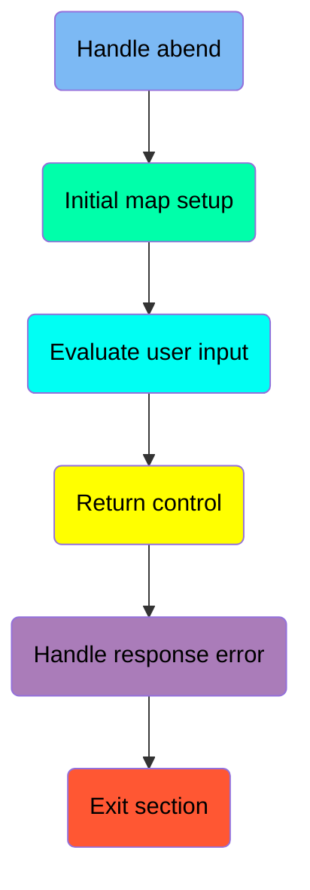

## Handle abend

First, we'll zoom into this section of the flow:

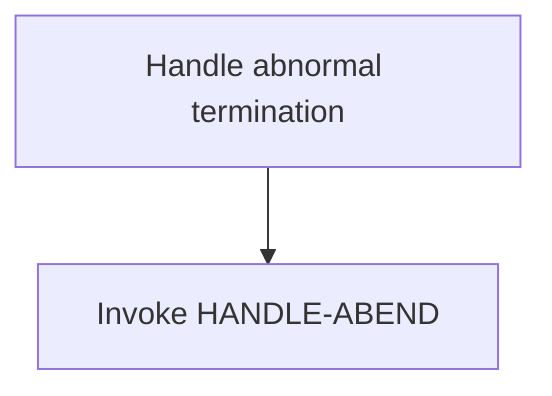

<SwmSnippet path="/src/base/cobol_src/BNK1CCS.cbl" line="158">

---

The <SwmToken path="src/base/cobol_src/BNK1CCS.cbl" pos="158:1:1" line-data="       PREMIERE SECTION.">`PREMIERE`</SwmToken> section is responsible for handling abnormal termination (abend) of transactions in the CICS environment. This is achieved by invoking the <SwmToken path="src/base/cobol_src/BNK1CCS.cbl" pos="162:3:5" line-data="              LABEL(HANDLE-ABEND)">`HANDLE-ABEND`</SwmToken> command, which directs the control to the <SwmToken path="src/base/cobol_src/BNK1CCS.cbl" pos="162:3:5" line-data="              LABEL(HANDLE-ABEND)">`HANDLE-ABEND`</SwmToken> label in case of an abend. This ensures that any abnormal termination is properly managed and logged, facilitating easier diagnosis and resolution of issues.

```cobol
       PREMIERE SECTION.
       A010.

           EXEC CICS HANDLE ABEND
              LABEL(HANDLE-ABEND)
           END-EXEC.
```

---

</SwmSnippet>

## Initial map setup

Now, lets zoom into this section of the flow:

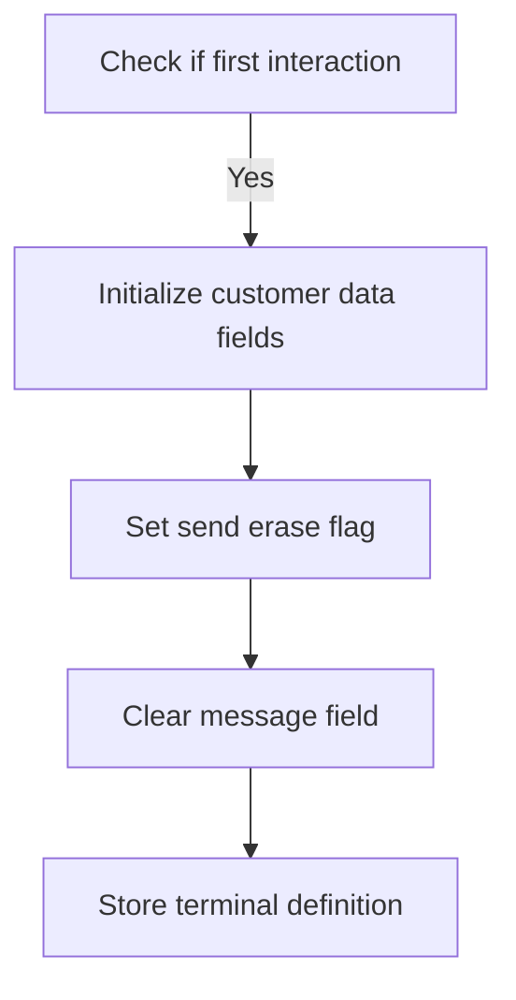

<SwmSnippet path="/src/base/cobol_src/BNK1CCS.cbl" line="165">

---

### Check if first interaction

First, the program checks if it is the first time through by evaluating if <SwmToken path="src/base/cobol_src/BNK1CCS.cbl" pos="170:3:3" line-data="              WHEN EIBCALEN = ZERO">`EIBCALEN`</SwmToken> (the length of the communication area) is zero.

```cobol
           EVALUATE TRUE
      *
      *       Is it the first time through? If so, send the map
      *       with erased (empty) data fields.
      *
              WHEN EIBCALEN = ZERO
```

---

</SwmSnippet>

<SwmSnippet path="/src/base/cobol_src/BNK1CCS.cbl" line="171">

---

### Initialize customer data fields

If it is the first interaction, the program initializes various customer data fields to empty values. This includes setting <SwmToken path="src/base/cobol_src/BNK1CCS.cbl" pos="171:9:9" line-data="                 MOVE LOW-VALUE TO BNK1CCO">`BNK1CCO`</SwmToken> to low-value and clearing fields like <SwmToken path="src/base/cobol_src/BNK1CCS.cbl" pos="172:7:7" line-data="                 MOVE SPACES TO CUSTTITO">`CUSTTITO`</SwmToken>, <SwmToken path="src/base/cobol_src/BNK1CCS.cbl" pos="173:7:7" line-data="                 MOVE SPACES TO CHRISTNO">`CHRISTNO`</SwmToken>, <SwmToken path="src/base/cobol_src/BNK1CCS.cbl" pos="174:7:7" line-data="                 MOVE SPACES TO CUSTINSO">`CUSTINSO`</SwmToken>, <SwmToken path="src/base/cobol_src/BNK1CCS.cbl" pos="175:7:7" line-data="                 MOVE SPACES TO CUSTSNO">`CUSTSNO`</SwmToken>, <SwmToken path="src/base/cobol_src/BNK1CCS.cbl" pos="176:7:7" line-data="                 MOVE SPACES TO CUSTAD1O">`CUSTAD1O`</SwmToken>, <SwmToken path="src/base/cobol_src/BNK1CCS.cbl" pos="177:7:7" line-data="                 MOVE SPACES TO CUSTAD2O">`CUSTAD2O`</SwmToken>, and <SwmToken path="src/base/cobol_src/BNK1CCS.cbl" pos="178:7:7" line-data="                 MOVE SPACES TO CUSTAD3O">`CUSTAD3O`</SwmToken>.

```cobol
                 MOVE LOW-VALUE TO BNK1CCO
                 MOVE SPACES TO CUSTTITO
                 MOVE SPACES TO CHRISTNO
                 MOVE SPACES TO CUSTINSO
                 MOVE SPACES TO CUSTSNO
                 MOVE SPACES TO CUSTAD1O
                 MOVE SPACES TO CUSTAD2O
                 MOVE SPACES TO CUSTAD3O
```

---

</SwmSnippet>

<SwmSnippet path="/src/base/cobol_src/BNK1CCS.cbl" line="180">

---

### Set send erase flag

Next, the program sets the <SwmToken path="src/base/cobol_src/BNK1CCS.cbl" pos="181:3:5" line-data="                 SET SEND-ERASE TO TRUE">`SEND-ERASE`</SwmToken> flag to true by moving <SwmToken path="src/base/cobol_src/BNK1CCS.cbl" pos="180:3:4" line-data="                 MOVE -1 TO CUSTTITL">`-1`</SwmToken> to <SwmToken path="src/base/cobol_src/BNK1CCS.cbl" pos="180:8:8" line-data="                 MOVE -1 TO CUSTTITL">`CUSTTITL`</SwmToken> and setting <SwmToken path="src/base/cobol_src/BNK1CCS.cbl" pos="181:3:5" line-data="                 SET SEND-ERASE TO TRUE">`SEND-ERASE`</SwmToken> to true. This indicates that the map should be sent with erased (empty) data fields.

```cobol
                 MOVE -1 TO CUSTTITL
                 SET SEND-ERASE TO TRUE
```

---

</SwmSnippet>

<SwmSnippet path="/src/base/cobol_src/BNK1CCS.cbl" line="182">

---

### Clear message field and store terminal definition

Finally, the program clears the <SwmToken path="src/base/cobol_src/BNK1CCS.cbl" pos="182:7:7" line-data="                 MOVE SPACES TO MESSAGEO">`MESSAGEO`</SwmToken> field by moving spaces to it and performs the <SwmToken path="src/base/cobol_src/BNK1CCS.cbl" pos="184:3:7" line-data="                 PERFORM STORE-TERM-DEF">`STORE-TERM-DEF`</SwmToken> operation to store the terminal definition.

```cobol
                 MOVE SPACES TO MESSAGEO

                 PERFORM STORE-TERM-DEF
```

---

</SwmSnippet>

## Evaluate user input

Now, lets zoom into this section of the flow:

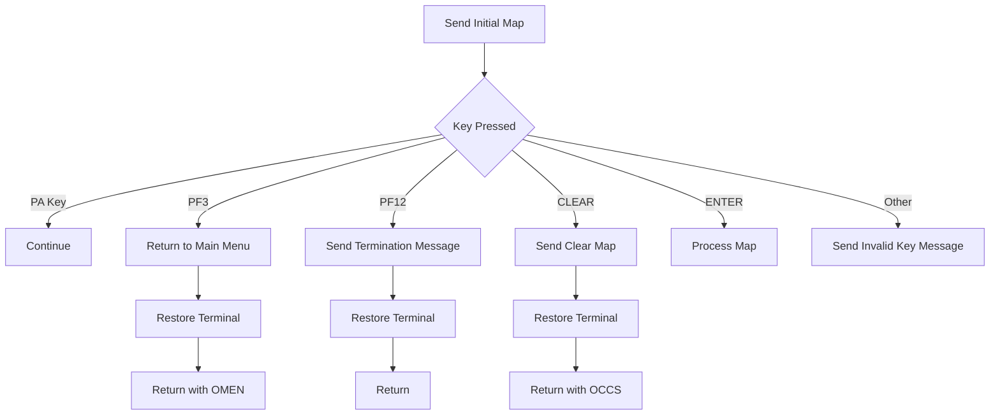

<SwmSnippet path="/src/base/cobol_src/BNK1CCS.cbl" line="186">

---

### Sending Initial Map

First, the function sends the initial map to the user interface to display the current state of the application.

```cobol
                 PERFORM SEND-MAP
```

---

</SwmSnippet>

<SwmSnippet path="/src/base/cobol_src/BNK1CCS.cbl" line="194">

---

### Handling PA Key Presses

Moving to the next step, if a PA key (Program Attention key) is pressed, the function simply continues without any additional actions.

```cobol
              WHEN EIBAID = DFHPA1 OR DFHPA2 OR DFHPA3
                 CONTINUE
```

---

</SwmSnippet>

<SwmSnippet path="/src/base/cobol_src/BNK1CCS.cbl" line="200">

---

### Returning to Main Menu

When the PF3 key is pressed, the function initiates a return to the main menu by restoring the terminal to its default state and returning control to the 'OMEN' transaction.

```cobol
              WHEN EIBAID = DFHPF3

      *
      *          Set the terminal UCTRAN back to
      *          its starting position
      *
                 PERFORM RESTORE-TERM-DEF

                 EXEC CICS RETURN
                    TRANSID('OMEN')
                    IMMEDIATE
                    RESP(WS-CICS-RESP)
                    RESP2(WS-CICS-RESP2)
                 END-EXEC
```

---

</SwmSnippet>

<SwmSnippet path="/src/base/cobol_src/BNK1CCS.cbl" line="219">

---

### Sending Termination Message

If the PF12 key is pressed, the function sends a termination message to the user, restores the terminal to its default state, and then returns control.

```cobol
              WHEN EIBAID = DFHPF12
                 PERFORM SEND-TERMINATION-MSG

      *
      *          Set the terminal UCTRAN back to
      *          its starting position
      *
                 PERFORM RESTORE-TERM-DEF

                 EXEC CICS
                    RETURN
                 END-EXEC
```

---

</SwmSnippet>

<SwmSnippet path="/src/base/cobol_src/BNK1CCS.cbl" line="235">

---

### Handling CLEAR Key Press

When the CLEAR key is pressed, the function sends a clear map to the user interface, restores the terminal to its default state, and returns control to the 'OCCS' transaction.

```cobol
              WHEN EIBAID = DFHCLEAR
                 EXEC CICS SEND MAP('BNK1CCM')
                           MAPONLY
                           ERASE
                           FREEKB
                 END-EXEC

      *
      *          Set the terminal UCTRAN back to
      *          its starting position
      *
                 PERFORM RESTORE-TERM-DEF


                 EXEC CICS RETURN TRANSID('OCCS')
                           COMMAREA(WS-COMM-AREA)
                 END-EXEC
```

---

</SwmSnippet>

<SwmSnippet path="/src/base/cobol_src/BNK1CCS.cbl" line="256">

---

### Processing Map on ENTER Key Press

When the ENTER key is pressed, the function processes the content of the map, which typically involves handling user input and updating the application state accordingly.

```cobol
              WHEN EIBAID = DFHENTER
                 PERFORM PROCESS-MAP
```

---

</SwmSnippet>

<SwmSnippet path="/src/base/cobol_src/BNK1CCS.cbl" line="262">

---

### Handling Invalid Key Presses

Finally, if any other key is pressed, the function sends an invalid key message to the user, indicating that the key press was not recognized or supported.

```cobol
              WHEN OTHER
                 MOVE DFHCOMMAREA TO WS-COMM-AREA
                 MOVE LOW-VALUES TO BNK1CCO
                 MOVE SPACES TO MESSAGEO
                 MOVE 'Invalid key pressed.' TO MESSAGEO
                 SET SEND-DATAONLY-ALARM TO TRUE
                 PERFORM SEND-MAP
```

---

</SwmSnippet>

## Return control

This is the next section of the flow.

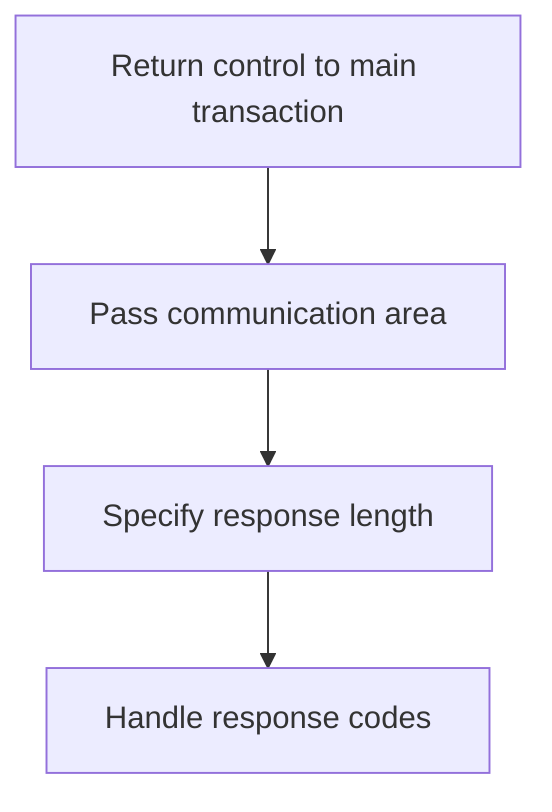

<SwmSnippet path="/src/base/cobol_src/BNK1CCS.cbl" line="272">

---

The <SwmToken path="src/base/cobol_src/BNK1CCS.cbl" pos="158:1:1" line-data="       PREMIERE SECTION.">`PREMIERE`</SwmToken> function is responsible for returning control to the main transaction identified by 'OCCS'. This is done using the <SwmToken path="src/base/cobol_src/BNK1CCS.cbl" pos="277:1:8" line-data="              RETURN TRANSID(&#39;OCCS&#39;)">`RETURN TRANSID('OCCS')`</SwmToken> statement, which specifies the transaction ID to return to. The communication area <SwmToken path="src/base/cobol_src/BNK1CCS.cbl" pos="278:3:7" line-data="              COMMAREA(WS-COMM-AREA)">`WS-COMM-AREA`</SwmToken> is passed along with the return, ensuring that any necessary data is transferred back to the main transaction. The length of the communication area is specified as 248 bytes, ensuring that the receiving transaction knows how much data to expect. Additionally, response codes <SwmToken path="src/base/cobol_src/BNK1CCS.cbl" pos="280:3:7" line-data="              RESP(WS-CICS-RESP)">`WS-CICS-RESP`</SwmToken> and <SwmToken path="src/base/cobol_src/BNK1CCS.cbl" pos="281:3:7" line-data="              RESP2(WS-CICS-RESP2)">`WS-CICS-RESP2`</SwmToken> are used to handle any potential errors or responses from the CICS system, ensuring that the transaction can handle different outcomes appropriately.

```cobol

      *
      * Now RETURN
      *
           EXEC CICS
              RETURN TRANSID('OCCS')
              COMMAREA(WS-COMM-AREA)
              LENGTH(248)
              RESP(WS-CICS-RESP)
              RESP2(WS-CICS-RESP2)
           END-EXEC.
```

---

</SwmSnippet>

## Handle response error

Now, lets zoom into this section of the flow:

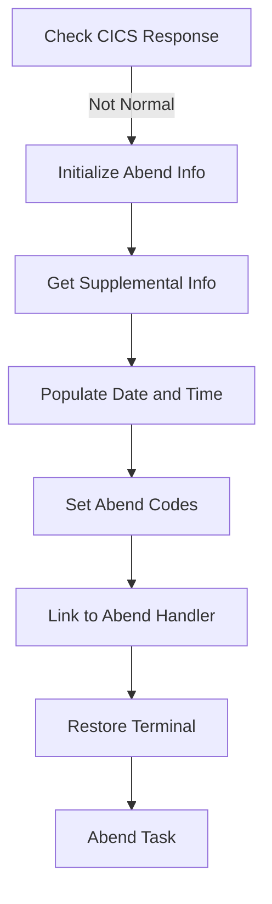

<SwmSnippet path="/src/base/cobol_src/BNK1CCS.cbl" line="284">

---

### Check CICS Response

First, the code checks if the CICS response is not normal. This is crucial to determine if there was an abnormal termination that needs to be handled.

```cobol
           IF WS-CICS-RESP NOT = DFHRESP(NORMAL)
```

---

</SwmSnippet>

<SwmSnippet path="/src/base/cobol_src/BNK1CCS.cbl" line="291">

---

### Initialize Abend Info

Moving to the next step, the code initializes the <SwmToken path="src/base/cobol_src/BNK1CCS.cbl" pos="291:3:5" line-data="              INITIALIZE ABNDINFO-REC">`ABNDINFO-REC`</SwmToken> structure to prepare for capturing abend-related information.

```cobol
              INITIALIZE ABNDINFO-REC
```

---

</SwmSnippet>

<SwmSnippet path="/src/base/cobol_src/BNK1CCS.cbl" line="297">

---

### Get Supplemental Info

Next, the code retrieves supplemental information such as the application ID, task number, and transaction ID to provide context for the abend.

```cobol
              EXEC CICS ASSIGN APPLID(ABND-APPLID)
              END-EXEC

              MOVE EIBTASKN   TO ABND-TASKNO-KEY
              MOVE EIBTRNID   TO ABND-TRANID

```

---

</SwmSnippet>

<SwmSnippet path="/src/base/cobol_src/BNK1CCS.cbl" line="303">

---

### Populate Date and Time

Then, the code populates the current date and time to record when the abend occurred. This information is crucial for diagnosing issues.

```cobol
              PERFORM POPULATE-TIME-DATE

              MOVE WS-ORIG-DATE TO ABND-DATE
              STRING WS-TIME-NOW-GRP-HH DELIMITED BY SIZE,
                    ':' DELIMITED BY SIZE,
                     WS-TIME-NOW-GRP-MM DELIMITED BY SIZE,
                     ':' DELIMITED BY SIZE,
                     WS-TIME-NOW-GRP-MM DELIMITED BY SIZE
                     INTO ABND-TIME
```

---

</SwmSnippet>

<SwmSnippet path="/src/base/cobol_src/BNK1CCS.cbl" line="314">

---

### Set Abend Codes

Going into the next step, the code sets various abend codes and identifiers such as <SwmToken path="src/base/cobol_src/BNK1CCS.cbl" pos="314:11:15" line-data="              MOVE WS-U-TIME   TO ABND-UTIME-KEY">`ABND-UTIME-KEY`</SwmToken>, <SwmToken path="src/base/cobol_src/BNK1CCS.cbl" pos="315:9:11" line-data="              MOVE &#39;HBNK&#39;      TO ABND-CODE">`ABND-CODE`</SwmToken>, and <SwmToken path="src/base/cobol_src/BNK1CCS.cbl" pos="317:9:11" line-data="              EXEC CICS ASSIGN PROGRAM(ABND-PROGRAM)">`ABND-PROGRAM`</SwmToken> to further detail the abend context.

```cobol
              MOVE WS-U-TIME   TO ABND-UTIME-KEY
              MOVE 'HBNK'      TO ABND-CODE

              EXEC CICS ASSIGN PROGRAM(ABND-PROGRAM)
              END-EXEC
```

---

</SwmSnippet>

<SwmSnippet path="/src/base/cobol_src/BNK1CCS.cbl" line="322">

---

### Link to Abend Handler

Next, the code constructs a freeform message detailing the abend and links to the abend handler program <SwmToken path="src/base/cobol_src/BNK1CCS.cbl" pos="331:9:13" line-data="              EXEC CICS LINK PROGRAM(WS-ABEND-PGM)">`WS-ABEND-PGM`</SwmToken> to process the abend information.

```cobol
              STRING 'A010 -RETURN TRANSID(OCCS) FAIL'
                    DELIMITED BY SIZE,
                    'EIBRESP=' DELIMITED BY SIZE,
                    ABND-RESPCODE DELIMITED BY SIZE,
                    ' RESP2=' DELIMITED BY SIZE,
                    ABND-RESP2CODE DELIMITED BY SIZE
                    INTO ABND-FREEFORM
              END-STRING

              EXEC CICS LINK PROGRAM(WS-ABEND-PGM)
                        COMMAREA(ABNDINFO-REC)
              END-EXEC
```

---

</SwmSnippet>

<SwmSnippet path="/src/base/cobol_src/BNK1CCS.cbl" line="341">

---

### Restore Terminal

Then, the code restores the terminal definition to its original state to ensure that the terminal can be used for subsequent transactions.

```cobol
              PERFORM RESTORE-TERM-DEF
```

---

</SwmSnippet>

<SwmSnippet path="/src/base/cobol_src/BNK1CCS.cbl" line="342">

---

### Abend Task

Finally, the code performs the abend task to terminate the transaction and log the abend information for further analysis.

```cobol
              PERFORM ABEND-THIS-TASK
           END-IF.
```

---

</SwmSnippet>

## Interim Summary

So far, we saw how the program handles abnormal termination (abend) of transactions, sets up the initial map, evaluates user input, and returns control to the main transaction. Each of these steps ensures that the application can manage user interactions and system responses effectively. Now, we will focus on handling response errors, which is crucial for diagnosing and resolving issues that may arise during transaction processing.

## Exit section

This is the next section of the flow.


<SwmSnippet path="/src/base/cobol_src/BNK1CCS.cbl" line="345">

---

The <SwmToken path="src/base/cobol_src/BNK1CCS.cbl" pos="345:1:1" line-data="       A999.">`A999`</SwmToken> label is used to mark the end of the program. The <SwmToken path="src/base/cobol_src/BNK1CCS.cbl" pos="346:1:1" line-data="           EXIT.">`EXIT`</SwmToken> statement is then executed to terminate the program and return control to the calling environment.

```cobol
       A999.
           EXIT.
```

---

</SwmSnippet>

## <SwmToken path="src/base/cobol_src/BNK1CCS.cbl" pos="184:3:7" line-data="                 PERFORM STORE-TERM-DEF">`STORE-TERM-DEF`</SwmToken>

Lets' zoom into this section of the flow:

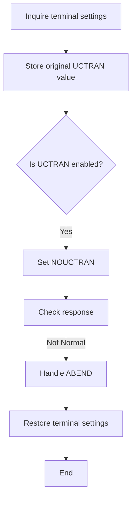

<SwmSnippet path="/src/base/cobol_src/BNK1CCS.cbl" line="1105">

---

First, the terminal settings are inquired to retrieve the current uppercase translation settings (<SwmToken path="src/base/cobol_src/BNK1CCS.cbl" pos="1107:5:5" line-data="                UCTRANST(WS-UCTRANS)">`UCTRANS`</SwmToken>).

```cobol
           EXEC CICS INQUIRE
                TERMINAL(EIBTRMID)
                UCTRANST(WS-UCTRANS)
                RESP(WS-CICS-RESP)
                RESP2(WS-CICS-RESP2)
           END-EXEC.
```

---

</SwmSnippet>

<SwmSnippet path="/src/base/cobol_src/BNK1CCS.cbl" line="1116">

---

Next, the original <SwmToken path="src/base/cobol_src/BNK1CCS.cbl" pos="1116:5:5" line-data="           MOVE WS-UCTRANS TO STORED-UCTRANS.">`UCTRANS`</SwmToken> value is stored for potential restoration later.

```cobol
           MOVE WS-UCTRANS TO STORED-UCTRANS.
```

---

</SwmSnippet>

<SwmSnippet path="/src/base/cobol_src/BNK1CCS.cbl" line="1122">

---

Then, it checks if the uppercase translation is currently enabled by comparing <SwmToken path="src/base/cobol_src/BNK1CCS.cbl" pos="1122:3:5" line-data="           IF WS-UCTRANS = DFHVALUE(UCTRAN) OR">`WS-UCTRANS`</SwmToken> with <SwmToken path="src/base/cobol_src/BNK1CCS.cbl" pos="1122:11:11" line-data="           IF WS-UCTRANS = DFHVALUE(UCTRAN) OR">`UCTRAN`</SwmToken> and <SwmToken path="src/base/cobol_src/BNK1CCS.cbl" pos="1123:9:9" line-data="           WS-UCTRANS = DFHVALUE(TRANIDONLY)">`TRANIDONLY`</SwmToken> values.

```cobol
           IF WS-UCTRANS = DFHVALUE(UCTRAN) OR
           WS-UCTRANS = DFHVALUE(TRANIDONLY)
```

---

</SwmSnippet>

<SwmSnippet path="/src/base/cobol_src/BNK1CCS.cbl" line="1125">

---

If uppercase translation is enabled, it sets the <SwmToken path="src/base/cobol_src/BNK1CCS.cbl" pos="1125:12:12" line-data="              MOVE DFHVALUE(NOUCTRAN) TO WS-UCTRANS">`UCTRANS`</SwmToken> to <SwmToken path="src/base/cobol_src/BNK1CCS.cbl" pos="1125:5:5" line-data="              MOVE DFHVALUE(NOUCTRAN) TO WS-UCTRANS">`NOUCTRAN`</SwmToken> to disable it.

```cobol
              MOVE DFHVALUE(NOUCTRAN) TO WS-UCTRANS

              EXEC CICS SET TERMINAL(EIBTRMID)
                 UCTRANST(WS-UCTRANS)
                 RESP(WS-CICS-RESP)
                 RESP2(WS-CICS-RESP2)
              END-EXEC
```

---

</SwmSnippet>

<SwmSnippet path="/src/base/cobol_src/BNK1CCS.cbl" line="1134">

---

The response from the CICS command is checked to ensure it executed normally.

```cobol
              IF WS-CICS-RESP NOT = DFHRESP(NORMAL)
```

---

</SwmSnippet>

<SwmSnippet path="/src/base/cobol_src/BNK1CCS.cbl" line="1141">

---

If the response is not normal, it initializes the abnormal termination (ABEND) information and gathers supplemental data such as application ID, task number, and transaction ID.

```cobol
                 INITIALIZE ABNDINFO-REC
                 MOVE EIBRESP    TO ABND-RESPCODE
                 MOVE EIBRESP2   TO ABND-RESP2CODE
      *
      *          Get supplemental information
      *
                 EXEC CICS ASSIGN APPLID(ABND-APPLID)
                 END-EXEC

                 MOVE EIBTASKN   TO ABND-TASKNO-KEY
                 MOVE EIBTRNID   TO ABND-TRANID

```

---

</SwmSnippet>

<SwmSnippet path="/src/base/cobol_src/BNK1CCS.cbl" line="1155">

---

The current date and time are formatted and stored in the ABEND information record.

```cobol
                 MOVE WS-ORIG-DATE TO ABND-DATE
                 STRING WS-TIME-NOW-GRP-HH DELIMITED BY SIZE,
                       ':' DELIMITED BY SIZE,
                        WS-TIME-NOW-GRP-MM DELIMITED BY SIZE,
                        ':' DELIMITED BY SIZE,
                        WS-TIME-NOW-GRP-MM DELIMITED BY SIZE
                        INTO ABND-TIME
                 END-STRING

                 MOVE WS-U-TIME   TO ABND-UTIME-KEY
```

---

</SwmSnippet>

<SwmSnippet path="/src/base/cobol_src/BNK1CCS.cbl" line="1167">

---

Additional ABEND information such as the program name and a freeform message is populated.

```cobol
                 EXEC CICS ASSIGN PROGRAM(ABND-PROGRAM)
                 END-EXEC

                 MOVE ZEROS      TO ABND-SQLCODE

                 STRING 'STD010 - SET TERMINAL UC FAIL '
                      DELIMITED BY SIZE,
                       'EIBRESP=' DELIMITED BY SIZE,
                       ABND-RESPCODE DELIMITED BY SIZE,
                       ' RESP2=' DELIMITED BY SIZE,
                       ABND-RESP2CODE DELIMITED BY SIZE
                       INTO ABND-FREEFORM
```

---

</SwmSnippet>

<SwmSnippet path="/src/base/cobol_src/BNK1CCS.cbl" line="1181">

---

The ABEND handler program is then linked to handle the abnormal termination.

```cobol
                 EXEC CICS LINK PROGRAM(WS-ABEND-PGM)
                           COMMAREA(ABNDINFO-REC)
                 END-EXEC
```

---

</SwmSnippet>

<SwmSnippet path="/src/base/cobol_src/BNK1CCS.cbl" line="1192">

---

Finally, the original terminal settings are restored, and the task is abnormally terminated.

```cobol
                 PERFORM RESTORE-TERM-DEF
                 PERFORM ABEND-THIS-TASK
              END-IF
```

---

</SwmSnippet>

## <SwmToken path="src/base/cobol_src/BNK1CCS.cbl" pos="303:3:7" line-data="              PERFORM POPULATE-TIME-DATE">`POPULATE-TIME-DATE`</SwmToken>

Lets' zoom into this section of the flow:

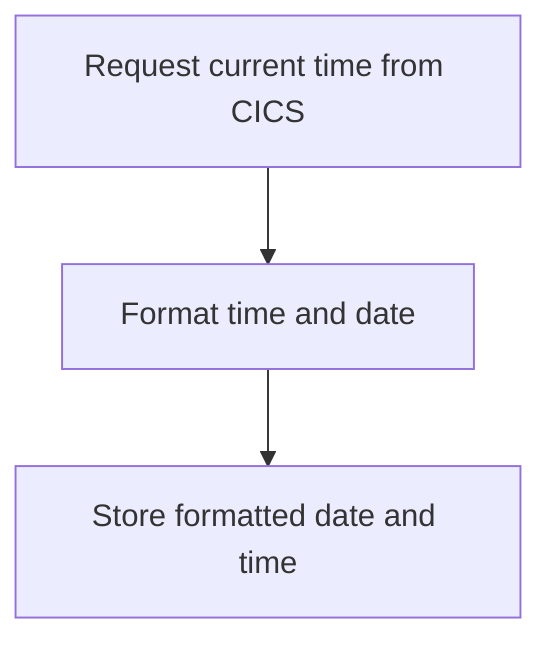

<SwmSnippet path="/src/base/cobol_src/BNK1CCS.cbl" line="1626">

---

### Requesting current time

First, the function requests the current time from CICS and stores it in <SwmToken path="src/base/cobol_src/BNK1CCS.cbl" pos="1627:3:7" line-data="              ABSTIME(WS-U-TIME)">`WS-U-TIME`</SwmToken>.

```cobol
           EXEC CICS ASKTIME
              ABSTIME(WS-U-TIME)
```

---

</SwmSnippet>

<SwmSnippet path="/src/base/cobol_src/BNK1CCS.cbl" line="1630">

---

### Formatting time and date

Next, the function formats the obtained time into a readable date and time format. The formatted date is stored in <SwmToken path="src/base/cobol_src/BNK1CCS.cbl" pos="1632:3:7" line-data="                     DDMMYYYY(WS-ORIG-DATE)">`WS-ORIG-DATE`</SwmToken> and the time in <SwmToken path="src/base/cobol_src/BNK1CCS.cbl" pos="1633:3:7" line-data="                     TIME(WS-TIME-NOW)">`WS-TIME-NOW`</SwmToken>.

```cobol
           EXEC CICS FORMATTIME
                     ABSTIME(WS-U-TIME)
                     DDMMYYYY(WS-ORIG-DATE)
                     TIME(WS-TIME-NOW)
```

---

</SwmSnippet>

<SwmSnippet path="/src/base/cobol_src/BNK1CCS.cbl" line="1637">

---

### Storing formatted date and time

Finally, the function completes the section and exits, ensuring that the formatted date and time are available for further processing.

```cobol
       PTD999.
           EXIT.
```

---

</SwmSnippet>

## <SwmToken path="src/base/cobol_src/BNK1CCS.cbl" pos="206:3:7" line-data="                 PERFORM RESTORE-TERM-DEF">`RESTORE-TERM-DEF`</SwmToken>

Lets' zoom into this section of the flow:

```mermaid
graph TD
  A[Initialize ABNDINFO-REC] --> B[Move EIBRESP to ABND-RESPCODE]
  B --> C[Move EIBRESP2 to ABND-RESP2CODE]
  C --> D[Assign APPLID to ABND-APPLID]
  D --> E[Move EIBTASKN to ABND-TASKNO-KEY]
  E --> F[Move EIBTRNID to ABND-TRANID]
  F --> G[Perform POPULATE-TIME-DATE]
  G --> H[Move WS-ORIG-DATE to ABND-DATE]
  H --> I[Format current time into ABND-TIME]
  I --> J[Move WS-U-TIME to ABND-UTIME-KEY]
  J --> K[Move 'HBNK' to ABND-CODE]
  K --> L[Assign PROGRAM to ABND-PROGRAM]
  L --> M[Move ZEROS to ABND-SQLCODE]
  M --> N[Format failure message into ABND-FREEFORM]
  N --> O[Link to ABNDPROC program]
  O --> P[Initialize WS-FAIL-INFO]
  P --> Q[Move failure message to WS-CICS-FAIL-MSG]
  Q --> R[Move WS-CICS-RESP to WS-CICS-RESP-DISP]
  R --> S[Move WS-CICS-RESP2 to WS-CICS-RESP2-DISP]
  S --> T[Perform ABEND-THIS-TASK]

%% Swimm:
%% graph TD
%%   A[Initialize <SwmToken path="src/base/cobol_src/BNK1CCS.cbl" pos="291:3:5" line-data="              INITIALIZE ABNDINFO-REC">`ABNDINFO-REC`</SwmToken>] --> B[Move EIBRESP to <SwmToken path="src/base/cobol_src/BNK1CCS.cbl" pos="325:1:3" line-data="                    ABND-RESPCODE DELIMITED BY SIZE,">`ABND-RESPCODE`</SwmToken>]
%%   B --> C[Move <SwmToken path="src/base/cobol_src/BNK1CCS.cbl" pos="424:3:3" line-data="                 MOVE EIBRESP2   TO ABND-RESP2CODE">`EIBRESP2`</SwmToken> to <SwmToken path="src/base/cobol_src/BNK1CCS.cbl" pos="327:1:3" line-data="                    ABND-RESP2CODE DELIMITED BY SIZE">`ABND-RESP2CODE`</SwmToken>]
%%   C --> D[Assign APPLID to <SwmToken path="src/base/cobol_src/BNK1CCS.cbl" pos="297:9:11" line-data="              EXEC CICS ASSIGN APPLID(ABND-APPLID)">`ABND-APPLID`</SwmToken>]
%%   D --> E[Move EIBTASKN to <SwmToken path="src/base/cobol_src/BNK1CCS.cbl" pos="300:7:11" line-data="              MOVE EIBTASKN   TO ABND-TASKNO-KEY">`ABND-TASKNO-KEY`</SwmToken>]
%%   E --> F[Move EIBTRNID to <SwmToken path="src/base/cobol_src/BNK1CCS.cbl" pos="301:7:9" line-data="              MOVE EIBTRNID   TO ABND-TRANID">`ABND-TRANID`</SwmToken>]
%%   F --> G[Perform <SwmToken path="src/base/cobol_src/BNK1CCS.cbl" pos="303:3:7" line-data="              PERFORM POPULATE-TIME-DATE">`POPULATE-TIME-DATE`</SwmToken>]
%%   G --> H[Move <SwmToken path="src/base/cobol_src/BNK1CCS.cbl" pos="305:3:7" line-data="              MOVE WS-ORIG-DATE TO ABND-DATE">`WS-ORIG-DATE`</SwmToken> to <SwmToken path="src/base/cobol_src/BNK1CCS.cbl" pos="305:11:13" line-data="              MOVE WS-ORIG-DATE TO ABND-DATE">`ABND-DATE`</SwmToken>]
%%   H --> I[Format current time into <SwmToken path="src/base/cobol_src/BNK1CCS.cbl" pos="311:3:5" line-data="                     INTO ABND-TIME">`ABND-TIME`</SwmToken>]
%%   I --> J[Move <SwmToken path="src/base/cobol_src/BNK1CCS.cbl" pos="314:3:7" line-data="              MOVE WS-U-TIME   TO ABND-UTIME-KEY">`WS-U-TIME`</SwmToken> to <SwmToken path="src/base/cobol_src/BNK1CCS.cbl" pos="314:11:15" line-data="              MOVE WS-U-TIME   TO ABND-UTIME-KEY">`ABND-UTIME-KEY`</SwmToken>]
%%   J --> K[Move 'HBNK' to <SwmToken path="src/base/cobol_src/BNK1CCS.cbl" pos="315:9:11" line-data="              MOVE &#39;HBNK&#39;      TO ABND-CODE">`ABND-CODE`</SwmToken>]
%%   K --> L[Assign PROGRAM to <SwmToken path="src/base/cobol_src/BNK1CCS.cbl" pos="317:9:11" line-data="              EXEC CICS ASSIGN PROGRAM(ABND-PROGRAM)">`ABND-PROGRAM`</SwmToken>]
%%   L --> M[Move ZEROS to <SwmToken path="src/base/cobol_src/BNK1CCS.cbl" pos="1170:7:9" line-data="                 MOVE ZEROS      TO ABND-SQLCODE">`ABND-SQLCODE`</SwmToken>]
%%   M --> N[Format failure message into <SwmToken path="src/base/cobol_src/BNK1CCS.cbl" pos="328:3:5" line-data="                    INTO ABND-FREEFORM">`ABND-FREEFORM`</SwmToken>]
%%   N --> O[Link to ABNDPROC program]
%%   O --> P[Initialize <SwmToken path="src/base/cobol_src/BNK1CCS.cbl" pos="36:3:7" line-data="       01 WS-FAIL-INFO.">`WS-FAIL-INFO`</SwmToken>]
%%   P --> Q[Move failure message to <SwmToken path="src/base/cobol_src/BNK1CCS.cbl" pos="38:3:9" line-data="          03 WS-CICS-FAIL-MSG         PIC X(70) VALUE &#39; &#39;.">`WS-CICS-FAIL-MSG`</SwmToken>]
%%   Q --> R[Move <SwmToken path="src/base/cobol_src/BNK1CCS.cbl" pos="211:3:7" line-data="                    RESP(WS-CICS-RESP)">`WS-CICS-RESP`</SwmToken> to <SwmToken path="src/base/cobol_src/BNK1CCS.cbl" pos="40:3:9" line-data="          03 WS-CICS-RESP-DISP        PIC 9(10) VALUE 0.">`WS-CICS-RESP-DISP`</SwmToken>]
%%   R --> S[Move <SwmToken path="src/base/cobol_src/BNK1CCS.cbl" pos="212:3:7" line-data="                    RESP2(WS-CICS-RESP2)">`WS-CICS-RESP2`</SwmToken> to <SwmToken path="src/base/cobol_src/BNK1CCS.cbl" pos="42:3:9" line-data="          03 WS-CICS-RESP2-DISP       PIC 9(10) VALUE 0.">`WS-CICS-RESP2-DISP`</SwmToken>]
%%   S --> T[Perform <SwmToken path="src/base/cobol_src/BNK1CCS.cbl" pos="342:3:7" line-data="              PERFORM ABEND-THIS-TASK">`ABEND-THIS-TASK`</SwmToken>]
```

First, the function initializes the <SwmToken path="src/base/cobol_src/BNK1CCS.cbl" pos="291:3:5" line-data="              INITIALIZE ABNDINFO-REC">`ABNDINFO-REC`</SwmToken> structure to prepare for capturing failure information.

Moving to the next step, it captures the primary and secondary response codes from the CICS environment into <SwmToken path="src/base/cobol_src/BNK1CCS.cbl" pos="325:1:3" line-data="                    ABND-RESPCODE DELIMITED BY SIZE,">`ABND-RESPCODE`</SwmToken> and <SwmToken path="src/base/cobol_src/BNK1CCS.cbl" pos="327:1:3" line-data="                    ABND-RESP2CODE DELIMITED BY SIZE">`ABND-RESP2CODE`</SwmToken> respectively.

Next, the application ID is assigned to <SwmToken path="src/base/cobol_src/BNK1CCS.cbl" pos="297:9:11" line-data="              EXEC CICS ASSIGN APPLID(ABND-APPLID)">`ABND-APPLID`</SwmToken> to identify the application context of the failure.

The function then captures the task number and transaction ID into <SwmToken path="src/base/cobol_src/BNK1CCS.cbl" pos="300:7:11" line-data="              MOVE EIBTASKN   TO ABND-TASKNO-KEY">`ABND-TASKNO-KEY`</SwmToken> and <SwmToken path="src/base/cobol_src/BNK1CCS.cbl" pos="301:7:9" line-data="              MOVE EIBTRNID   TO ABND-TRANID">`ABND-TRANID`</SwmToken> respectively, which are essential for tracking the specific transaction that failed.

It performs the <SwmToken path="src/base/cobol_src/BNK1CCS.cbl" pos="303:3:7" line-data="              PERFORM POPULATE-TIME-DATE">`POPULATE-TIME-DATE`</SwmToken> routine to get the current date and time, which are then formatted and stored in <SwmToken path="src/base/cobol_src/BNK1CCS.cbl" pos="305:11:13" line-data="              MOVE WS-ORIG-DATE TO ABND-DATE">`ABND-DATE`</SwmToken> and <SwmToken path="src/base/cobol_src/BNK1CCS.cbl" pos="311:3:5" line-data="                     INTO ABND-TIME">`ABND-TIME`</SwmToken>.

The function assigns a unique time key to <SwmToken path="src/base/cobol_src/BNK1CCS.cbl" pos="314:11:15" line-data="              MOVE WS-U-TIME   TO ABND-UTIME-KEY">`ABND-UTIME-KEY`</SwmToken> and sets a failure code 'HBNK' to <SwmToken path="src/base/cobol_src/BNK1CCS.cbl" pos="315:9:11" line-data="              MOVE &#39;HBNK&#39;      TO ABND-CODE">`ABND-CODE`</SwmToken>.

It then assigns the current program name to <SwmToken path="src/base/cobol_src/BNK1CCS.cbl" pos="317:9:11" line-data="              EXEC CICS ASSIGN PROGRAM(ABND-PROGRAM)">`ABND-PROGRAM`</SwmToken> and initializes the SQL code to zero in <SwmToken path="src/base/cobol_src/BNK1CCS.cbl" pos="1170:7:9" line-data="                 MOVE ZEROS      TO ABND-SQLCODE">`ABND-SQLCODE`</SwmToken>.

A detailed failure message is formatted into <SwmToken path="src/base/cobol_src/BNK1CCS.cbl" pos="328:3:5" line-data="                    INTO ABND-FREEFORM">`ABND-FREEFORM`</SwmToken>, which includes the response codes.

The function links to the <SwmToken path="src/base/cobol_src/BNK1CCS.cbl" pos="146:19:19" line-data="       01 WS-ABEND-PGM                  PIC X(8) VALUE &#39;ABNDPROC&#39;.">`ABNDPROC`</SwmToken> program to handle the abnormal termination processing.

## <SwmToken path="src/base/cobol_src/BNK1CCS.cbl" pos="342:3:7" line-data="              PERFORM ABEND-THIS-TASK">`ABEND-THIS-TASK`</SwmToken>

Lets' zoom into this section of the flow:

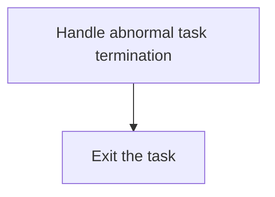

<SwmSnippet path="/src/base/cobol_src/BNK1CCS.cbl" line="1619">

---

The <SwmToken path="src/base/cobol_src/BNK1CCS.cbl" pos="342:3:7" line-data="              PERFORM ABEND-THIS-TASK">`ABEND-THIS-TASK`</SwmToken> function is responsible for handling the abnormal termination of a task within the CICS environment. This function ensures that when a task encounters an error or an unexpected condition, it is terminated gracefully. The function includes a label <SwmToken path="src/base/cobol_src/BNK1CCS.cbl" pos="1619:1:1" line-data="       ATT999.">`ATT999`</SwmToken> which serves as an entry point for the abnormal termination logic. Following this, the <SwmToken path="src/base/cobol_src/BNK1CCS.cbl" pos="1620:1:1" line-data="           EXIT.">`EXIT`</SwmToken> statement is executed to terminate the task. This ensures that the task is halted and control is returned to the CICS environment, allowing for proper logging and cleanup operations to be performed.

```cobol
       ATT999.
           EXIT.
```

---

</SwmSnippet>

# Send MAP (<SwmToken path="src/base/cobol_src/BNK1CCS.cbl" pos="186:3:5" line-data="                 PERFORM SEND-MAP">`SEND-MAP`</SwmToken>)

Let's split this section into smaller parts:

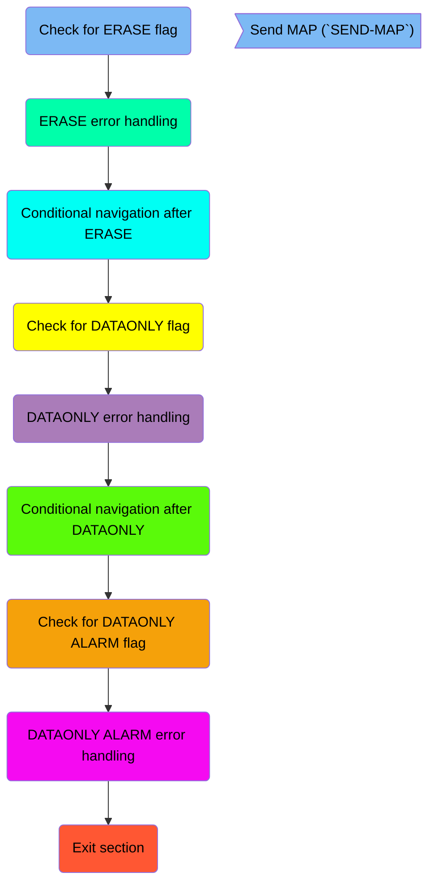

## Check for ERASE flag

First, we'll zoom into this section of the flow:

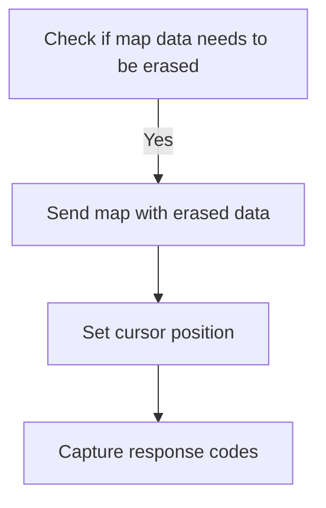

<SwmSnippet path="/src/base/cobol_src/BNK1CCS.cbl" line="1285">

---

First, the code checks if the map data needs to be erased by evaluating the <SwmToken path="src/base/cobol_src/BNK1CCS.cbl" pos="1285:3:5" line-data="           IF SEND-ERASE">`SEND-ERASE`</SwmToken> flag.

```cobol
           IF SEND-ERASE
```

---

</SwmSnippet>

<SwmSnippet path="/src/base/cobol_src/BNK1CCS.cbl" line="1286">

---

Next, if the <SwmToken path="src/base/cobol_src/BNK1CCS.cbl" pos="181:3:5" line-data="                 SET SEND-ERASE TO TRUE">`SEND-ERASE`</SwmToken> flag is set, the code sends the map <SwmToken path="src/base/cobol_src/BNK1CCS.cbl" pos="1286:10:10" line-data="              EXEC CICS SEND MAP(&#39;BNK1CC&#39;)">`BNK1CC`</SwmToken> from the mapset <SwmToken path="src/base/cobol_src/BNK1CCS.cbl" pos="1287:4:4" line-data="                  MAPSET(&#39;BNK1CCM&#39;)">`BNK1CCM`</SwmToken> with the data erased, sets the cursor position, and captures the response codes in <SwmToken path="src/base/cobol_src/BNK1CCS.cbl" pos="1291:3:7" line-data="                  RESP(WS-CICS-RESP)">`WS-CICS-RESP`</SwmToken> and <SwmToken path="src/base/cobol_src/BNK1CCS.cbl" pos="1292:3:7" line-data="                  RESP2(WS-CICS-RESP2)">`WS-CICS-RESP2`</SwmToken>.

```cobol
              EXEC CICS SEND MAP('BNK1CC')
                  MAPSET('BNK1CCM')
                  FROM(BNK1CCO)
                  ERASE
                  CURSOR
                  RESP(WS-CICS-RESP)
                  RESP2(WS-CICS-RESP2)
              END-EXEC
```

---

</SwmSnippet>

## ERASE error handling

Now, lets zoom into this section of the flow:

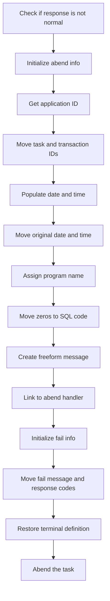

<SwmSnippet path="/src/base/cobol_src/BNK1CCS.cbl" line="1295">

---

First, the code checks if the response code <SwmToken path="src/base/cobol_src/BNK1CCS.cbl" pos="1295:3:7" line-data="              IF WS-CICS-RESP NOT = DFHRESP(NORMAL)">`WS-CICS-RESP`</SwmToken> is not equal to <SwmToken path="src/base/cobol_src/BNK1CCS.cbl" pos="1295:13:16" line-data="              IF WS-CICS-RESP NOT = DFHRESP(NORMAL)">`DFHRESP(NORMAL)`</SwmToken> to determine if there was an error in sending the map.

```cobol
              IF WS-CICS-RESP NOT = DFHRESP(NORMAL)
```

---

</SwmSnippet>

<SwmSnippet path="/src/base/cobol_src/BNK1CCS.cbl" line="1302">

---

Next, it initializes the <SwmToken path="src/base/cobol_src/BNK1CCS.cbl" pos="1302:3:5" line-data="                 INITIALIZE ABNDINFO-REC">`ABNDINFO-REC`</SwmToken> structure to store information about the abnormal termination.

```cobol
                 INITIALIZE ABNDINFO-REC
```

---

</SwmSnippet>

<SwmSnippet path="/src/base/cobol_src/BNK1CCS.cbl" line="1303">

---

Then, it moves the response codes <SwmToken path="src/base/cobol_src/BNK1CCS.cbl" pos="1303:3:3" line-data="                 MOVE EIBRESP    TO ABND-RESPCODE">`EIBRESP`</SwmToken> and <SwmToken path="src/base/cobol_src/BNK1CCS.cbl" pos="1304:3:3" line-data="                 MOVE EIBRESP2   TO ABND-RESP2CODE">`EIBRESP2`</SwmToken> into <SwmToken path="src/base/cobol_src/BNK1CCS.cbl" pos="1303:7:9" line-data="                 MOVE EIBRESP    TO ABND-RESPCODE">`ABND-RESPCODE`</SwmToken> and <SwmToken path="src/base/cobol_src/BNK1CCS.cbl" pos="1304:7:9" line-data="                 MOVE EIBRESP2   TO ABND-RESP2CODE">`ABND-RESP2CODE`</SwmToken> respectively to preserve the error information.

```cobol
                 MOVE EIBRESP    TO ABND-RESPCODE
                 MOVE EIBRESP2   TO ABND-RESP2CODE
```

---

</SwmSnippet>

<SwmSnippet path="/src/base/cobol_src/BNK1CCS.cbl" line="1308">

---

Moving to the next step, it assigns the application ID to <SwmToken path="src/base/cobol_src/BNK1CCS.cbl" pos="1308:9:11" line-data="                 EXEC CICS ASSIGN APPLID(ABND-APPLID)">`ABND-APPLID`</SwmToken> using the <SwmToken path="src/base/cobol_src/BNK1CCS.cbl" pos="1308:1:5" line-data="                 EXEC CICS ASSIGN APPLID(ABND-APPLID)">`EXEC CICS ASSIGN`</SwmToken> command.

```cobol
                 EXEC CICS ASSIGN APPLID(ABND-APPLID)
                 END-EXEC
```

---

</SwmSnippet>

<SwmSnippet path="/src/base/cobol_src/BNK1CCS.cbl" line="1311">

---

It then moves the task number and transaction ID to <SwmToken path="src/base/cobol_src/BNK1CCS.cbl" pos="1311:7:11" line-data="                 MOVE EIBTASKN   TO ABND-TASKNO-KEY">`ABND-TASKNO-KEY`</SwmToken> and <SwmToken path="src/base/cobol_src/BNK1CCS.cbl" pos="1312:7:9" line-data="                 MOVE EIBTRNID   TO ABND-TRANID">`ABND-TRANID`</SwmToken> respectively.

```cobol
                 MOVE EIBTASKN   TO ABND-TASKNO-KEY
                 MOVE EIBTRNID   TO ABND-TRANID
```

---

</SwmSnippet>

<SwmSnippet path="/src/base/cobol_src/BNK1CCS.cbl" line="1314">

---

Next, it performs the <SwmToken path="src/base/cobol_src/BNK1CCS.cbl" pos="1314:3:7" line-data="                 PERFORM POPULATE-TIME-DATE">`POPULATE-TIME-DATE`</SwmToken> routine to get the current date and time.

```cobol
                 PERFORM POPULATE-TIME-DATE
```

---

</SwmSnippet>

<SwmSnippet path="/src/base/cobol_src/BNK1CCS.cbl" line="1316">

---

It then moves the original date and current time into <SwmToken path="src/base/cobol_src/BNK1CCS.cbl" pos="1316:11:13" line-data="                 MOVE WS-ORIG-DATE TO ABND-DATE">`ABND-DATE`</SwmToken> and <SwmToken path="src/base/cobol_src/BNK1CCS.cbl" pos="1322:3:5" line-data="                        INTO ABND-TIME">`ABND-TIME`</SwmToken> respectively.

```cobol
                 MOVE WS-ORIG-DATE TO ABND-DATE
                 STRING WS-TIME-NOW-GRP-HH DELIMITED BY SIZE,
                       ':' DELIMITED BY SIZE,
                        WS-TIME-NOW-GRP-MM DELIMITED BY SIZE,
                        ':' DELIMITED BY SIZE,
                        WS-TIME-NOW-GRP-MM DELIMITED BY SIZE
                        INTO ABND-TIME
```

---

</SwmSnippet>

<SwmSnippet path="/src/base/cobol_src/BNK1CCS.cbl" line="1328">

---

Following this, it assigns the program name to <SwmToken path="src/base/cobol_src/BNK1CCS.cbl" pos="1328:9:11" line-data="                 EXEC CICS ASSIGN PROGRAM(ABND-PROGRAM)">`ABND-PROGRAM`</SwmToken> using the <SwmToken path="src/base/cobol_src/BNK1CCS.cbl" pos="1328:1:5" line-data="                 EXEC CICS ASSIGN PROGRAM(ABND-PROGRAM)">`EXEC CICS ASSIGN`</SwmToken> command.

```cobol
                 EXEC CICS ASSIGN PROGRAM(ABND-PROGRAM)
                 END-EXEC
```

---

</SwmSnippet>

<SwmSnippet path="/src/base/cobol_src/BNK1CCS.cbl" line="1333">

---

Finally, it creates a freeform message detailing the error and links to the abend handler program <SwmToken path="src/base/cobol_src/BNK1CCS.cbl" pos="1342:9:13" line-data="                 EXEC CICS LINK PROGRAM(WS-ABEND-PGM)">`WS-ABEND-PGM`</SwmToken> with the <SwmToken path="src/base/cobol_src/BNK1CCS.cbl" pos="1343:3:5" line-data="                           COMMAREA(ABNDINFO-REC)">`ABNDINFO-REC`</SwmToken> structure.

```cobol
                 STRING 'SM010 - SEND MAP ERASE FAIL '
                       DELIMITED BY SIZE,
                       'EIBRESP=' DELIMITED BY SIZE,
                       ABND-RESPCODE DELIMITED BY SIZE,
                       ' RESP2=' DELIMITED BY SIZE,
                       ABND-RESP2CODE DELIMITED BY SIZE
                       INTO ABND-FREEFORM
                 END-STRING

                 EXEC CICS LINK PROGRAM(WS-ABEND-PGM)
                           COMMAREA(ABNDINFO-REC)
                 END-EXEC
```

---

</SwmSnippet>

## Conditional navigation after ERASE

This is the next section of the flow.

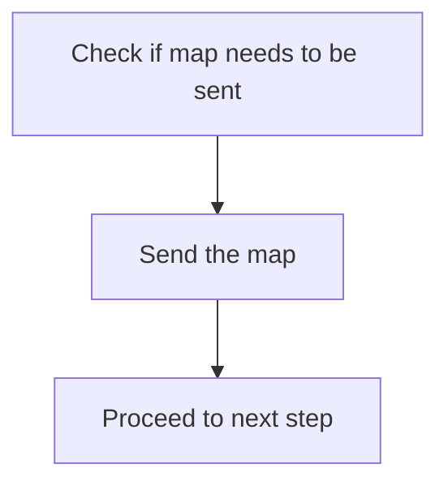

<SwmSnippet path="/src/base/cobol_src/BNK1CCS.cbl" line="1357">

---

The <SwmToken path="src/base/cobol_src/BNK1CCS.cbl" pos="186:3:5" line-data="                 PERFORM SEND-MAP">`SEND-MAP`</SwmToken> function is responsible for sending the map to the user interface. This is crucial for updating the user interface with the latest data or prompts. The code checks if the map needs to be sent and then proceeds to send it. After sending the map, the flow continues to the next step in the process.

```cobol
              GO TO SM999
           END-IF.
```

---

</SwmSnippet>

## Check for DATAONLY flag

Now, lets zoom into this section of the flow:

```mermaid
graph TD
  A[Check if SEND-DATAONLY is true] -->|Yes| B[Send MAP BNK1CC with DATAONLY option]

%% Swimm:
%% graph TD
%%   A[Check if <SwmToken path="src/base/cobol_src/BNK1CCS.cbl" pos="267:3:5" line-data="                 SET SEND-DATAONLY-ALARM TO TRUE">`SEND-DATAONLY`</SwmToken> is true] -->|Yes| B[Send MAP <SwmToken path="src/base/cobol_src/BNK1CCS.cbl" pos="501:6:6" line-data="              RECEIVE MAP(&#39;BNK1CC&#39;)">`BNK1CC`</SwmToken> with DATAONLY option]
```

<SwmSnippet path="/src/base/cobol_src/BNK1CCS.cbl" line="1363">

---

### Resending map data

When the <SwmToken path="src/base/cobol_src/BNK1CCS.cbl" pos="1363:3:5" line-data="           IF SEND-DATAONLY">`SEND-DATAONLY`</SwmToken> flag is set to true, the system resends the map data to the user interface. This is done by executing a CICS command to send the map <SwmToken path="src/base/cobol_src/BNK1CCS.cbl" pos="1364:10:10" line-data="              EXEC CICS SEND MAP(&#39;BNK1CC&#39;)">`BNK1CC`</SwmToken> from the mapset <SwmToken path="src/base/cobol_src/BNK1CCS.cbl" pos="1365:4:4" line-data="                 MAPSET(&#39;BNK1CCM&#39;)">`BNK1CCM`</SwmToken> with the <SwmToken path="src/base/cobol_src/BNK1CCS.cbl" pos="1363:5:5" line-data="           IF SEND-DATAONLY">`DATAONLY`</SwmToken> option. This ensures that only the data is refreshed on the user interface without redrawing the entire map.

```cobol
           IF SEND-DATAONLY
              EXEC CICS SEND MAP('BNK1CC')
                 MAPSET('BNK1CCM')
                 FROM(BNK1CCO)
                 DATAONLY
                 CURSOR
                 RESP(WS-CICS-RESP)
                 RESP2(WS-CICS-RESP2)
              END-EXEC
```

---

</SwmSnippet>

## DATAONLY error handling

Now, lets zoom into this section of the flow:

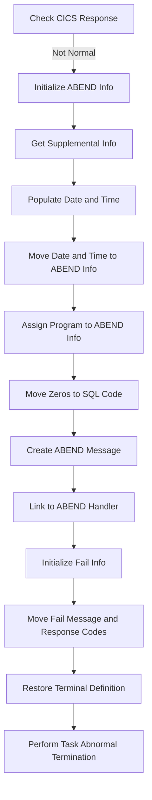

First, the code checks if the CICS response is not normal by evaluating <SwmToken path="src/base/cobol_src/BNK1CCS.cbl" pos="211:3:7" line-data="                    RESP(WS-CICS-RESP)">`WS-CICS-RESP`</SwmToken> against <SwmToken path="src/base/cobol_src/BNK1CCS.cbl" pos="284:13:16" line-data="           IF WS-CICS-RESP NOT = DFHRESP(NORMAL)">`DFHRESP(NORMAL)`</SwmToken>.

<SwmSnippet path="/src/base/cobol_src/BNK1CCS.cbl" line="1380">

---

If the response is not normal, it initializes the ABEND information record using <SwmToken path="src/base/cobol_src/BNK1CCS.cbl" pos="1380:1:5" line-data="                 INITIALIZE ABNDINFO-REC">`INITIALIZE ABNDINFO-REC`</SwmToken>.

```cobol
                 INITIALIZE ABNDINFO-REC
```

---

</SwmSnippet>

<SwmSnippet path="/src/base/cobol_src/BNK1CCS.cbl" line="1381">

---

Next, it moves the response codes <SwmToken path="src/base/cobol_src/BNK1CCS.cbl" pos="1381:3:3" line-data="                 MOVE EIBRESP    TO ABND-RESPCODE">`EIBRESP`</SwmToken> and <SwmToken path="src/base/cobol_src/BNK1CCS.cbl" pos="1382:3:3" line-data="                 MOVE EIBRESP2   TO ABND-RESP2CODE">`EIBRESP2`</SwmToken> to <SwmToken path="src/base/cobol_src/BNK1CCS.cbl" pos="1381:7:9" line-data="                 MOVE EIBRESP    TO ABND-RESPCODE">`ABND-RESPCODE`</SwmToken> and <SwmToken path="src/base/cobol_src/BNK1CCS.cbl" pos="1382:7:9" line-data="                 MOVE EIBRESP2   TO ABND-RESP2CODE">`ABND-RESP2CODE`</SwmToken> respectively.

```cobol
                 MOVE EIBRESP    TO ABND-RESPCODE
                 MOVE EIBRESP2   TO ABND-RESP2CODE
```

---

</SwmSnippet>

<SwmSnippet path="/src/base/cobol_src/BNK1CCS.cbl" line="1386">

---

Then, it retrieves supplemental information such as the application ID, task number, and transaction ID, and assigns them to the ABEND information record.

```cobol
                 EXEC CICS ASSIGN APPLID(ABND-APPLID)
                 END-EXEC

                 MOVE EIBTASKN   TO ABND-TASKNO-KEY
                 MOVE EIBTRNID   TO ABND-TRANID

```

---

</SwmSnippet>

<SwmSnippet path="/src/base/cobol_src/BNK1CCS.cbl" line="1392">

---

The code performs the <SwmToken path="src/base/cobol_src/BNK1CCS.cbl" pos="1392:3:7" line-data="                 PERFORM POPULATE-TIME-DATE">`POPULATE-TIME-DATE`</SwmToken> routine to get the current date and time.

```cobol
                 PERFORM POPULATE-TIME-DATE
```

---

</SwmSnippet>

<SwmSnippet path="/src/base/cobol_src/BNK1CCS.cbl" line="1394">

---

It then moves the original date and the current time to the ABEND information record.

```cobol
                 MOVE WS-ORIG-DATE TO ABND-DATE
                 STRING WS-TIME-NOW-GRP-HH DELIMITED BY SIZE,
                       ':' DELIMITED BY SIZE,
                        WS-TIME-NOW-GRP-MM DELIMITED BY SIZE,
                        ':' DELIMITED BY SIZE,
                        WS-TIME-NOW-GRP-MM DELIMITED BY SIZE
                        INTO ABND-TIME
```

---

</SwmSnippet>

<SwmSnippet path="/src/base/cobol_src/BNK1CCS.cbl" line="1406">

---

The program assigns the current program name to the ABEND information record.

```cobol
                 EXEC CICS ASSIGN PROGRAM(ABND-PROGRAM)
                 END-EXEC
```

---

</SwmSnippet>

<SwmSnippet path="/src/base/cobol_src/BNK1CCS.cbl" line="1409">

---

It initializes the SQL code in the ABEND information record to zeros.

```cobol
                 MOVE ZEROS      TO ABND-SQLCODE
```

---

</SwmSnippet>

<SwmSnippet path="/src/base/cobol_src/BNK1CCS.cbl" line="1411">

---

Finally, it creates a freeform ABEND message and links to the ABEND handler program, passing the ABEND information record.

```cobol
                 STRING 'SM010 - SEND MAP DATAONLY FAIL '
                       DELIMITED BY SIZE,
                       'EIBRESP=' DELIMITED BY SIZE,
                       ABND-RESPCODE DELIMITED BY SIZE,
                       ' RESP2=' DELIMITED BY SIZE,
                       ABND-RESP2CODE DELIMITED BY SIZE
                       INTO ABND-FREEFORM
                 END-STRING

                 EXEC CICS LINK PROGRAM(WS-ABEND-PGM)
                           COMMAREA(ABNDINFO-REC)
                 END-EXEC
```

---

</SwmSnippet>

## Conditional navigation after DATAONLY

This is the next section of the flow.

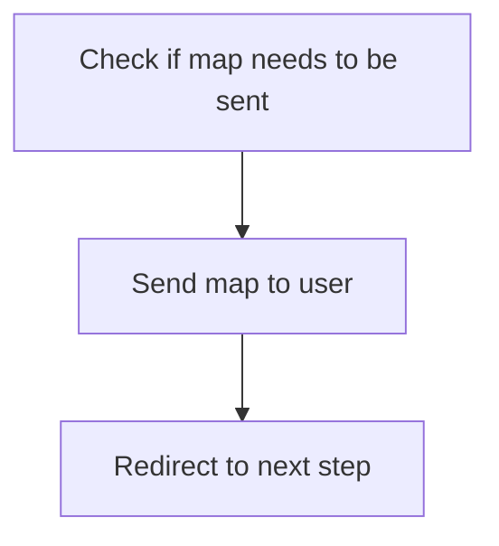

<SwmSnippet path="/src/base/cobol_src/BNK1CCS.cbl" line="1433">

---

### Sending the map to the user

The <SwmToken path="src/base/cobol_src/BNK1CCS.cbl" pos="186:3:5" line-data="                 PERFORM SEND-MAP">`SEND-MAP`</SwmToken> function is responsible for displaying the map to the user. This step ensures that the map is sent to the user interface, allowing the user to interact with it. After sending the map, the flow proceeds to the next step in the process.

```cobol

              GO TO SM999
           END-IF.
```

---

</SwmSnippet>

## Check for DATAONLY ALARM flag

Now, lets zoom into this section of the flow:

```mermaid
graph TD
  A[Check if SEND-DATAONLY-ALARM is true] -->|Yes| B[Send map BNK1CC with alarm and data only]

%% Swimm:
%% graph TD
%%   A[Check if <SwmToken path="src/base/cobol_src/BNK1CCS.cbl" pos="267:3:7" line-data="                 SET SEND-DATAONLY-ALARM TO TRUE">`SEND-DATAONLY-ALARM`</SwmToken> is true] -->|Yes| B[Send map <SwmToken path="src/base/cobol_src/BNK1CCS.cbl" pos="501:6:6" line-data="              RECEIVE MAP(&#39;BNK1CC&#39;)">`BNK1CC`</SwmToken> with alarm and data only]
```

<SwmSnippet path="/src/base/cobol_src/BNK1CCS.cbl" line="1437">

---

If the condition <SwmToken path="src/base/cobol_src/BNK1CCS.cbl" pos="1440:3:7" line-data="           IF SEND-DATAONLY-ALARM">`SEND-DATAONLY-ALARM`</SwmToken> is true, the system sends the map <SwmToken path="src/base/cobol_src/BNK1CCS.cbl" pos="1441:10:10" line-data="              EXEC CICS SEND MAP(&#39;BNK1CC&#39;)">`BNK1CC`</SwmToken> to the user interface. This map is part of the mapset <SwmToken path="src/base/cobol_src/BNK1CCS.cbl" pos="1442:4:4" line-data="                 MAPSET(&#39;BNK1CCM&#39;)">`BNK1CCM`</SwmToken> and is sent from the data structure <SwmToken path="src/base/cobol_src/BNK1CCS.cbl" pos="1443:3:3" line-data="                 FROM(BNK1CCO)">`BNK1CCO`</SwmToken>. The map is sent with an alarm to alert the user, and only the data is sent without any additional control information. The cursor is also positioned on the map, and the response codes are captured in <SwmToken path="src/base/cobol_src/BNK1CCS.cbl" pos="1447:3:7" line-data="                 RESP(WS-CICS-RESP)">`WS-CICS-RESP`</SwmToken> and <SwmToken path="src/base/cobol_src/BNK1CCS.cbl" pos="1448:3:7" line-data="                 RESP2(WS-CICS-RESP2)">`WS-CICS-RESP2`</SwmToken> to handle any potential errors or responses from the CICS system.

```cobol
      *
      *    If we have elected to send the map and a beep
      *
           IF SEND-DATAONLY-ALARM
              EXEC CICS SEND MAP('BNK1CC')
                 MAPSET('BNK1CCM')
                 FROM(BNK1CCO)
                 ALARM
                 DATAONLY
                 CURSOR
                 RESP(WS-CICS-RESP)
                 RESP2(WS-CICS-RESP2)
              END-EXEC
```

---

</SwmSnippet>

## DATAONLY ALARM error handling

Now, lets zoom into this section of the flow:

```mermaid
graph TD
  A[Check if response is not normal] --> B[Initialize ABNDINFO-REC] --> C[Move EIBRESP to ABND-RESPCODE] --> D[Move EIBRESP2 to ABND-RESP2CODE] --> E[Assign APPLID to ABND-APPLID] --> F[Move EIBTASKN to ABND-TASKNO-KEY] --> G[Move EIBTRNID to ABND-TRANID] --> H[Perform POPULATE-TIME-DATE] --> I[Move WS-ORIG-DATE to ABND-DATE] --> J[Concatenate time components into ABND-TIME] --> K[Move WS-U-TIME to ABND-UTIME-KEY] --> L[Move 'HBNK' to ABND-CODE] --> M[Assign PROGRAM to ABND-PROGRAM] --> N[Move ZEROS to ABND-SQLCODE] --> O[Concatenate error message into ABND-FREEFORM] --> P[Link to Abend Handler program] --> Q[Initialize WS-FAIL-INFO] --> R[Move error message to WS-CICS-FAIL-MSG] --> S[Move WS-CICS-RESP to WS-CICS-RESP-DISP] --> T[Move WS-CICS-RESP2 to WS-CICS-RESP2-DISP] --> U[Perform RESTORE-TERM-DEF] --> V[Perform ABEND-THIS-TASK]

%% Swimm:
%% graph TD
%%   A[Check if response is not normal] --> B[Initialize <SwmToken path="src/base/cobol_src/BNK1CCS.cbl" pos="291:3:5" line-data="              INITIALIZE ABNDINFO-REC">`ABNDINFO-REC`</SwmToken>] --> C[Move EIBRESP to <SwmToken path="src/base/cobol_src/BNK1CCS.cbl" pos="325:1:3" line-data="                    ABND-RESPCODE DELIMITED BY SIZE,">`ABND-RESPCODE`</SwmToken>] --> D[Move <SwmToken path="src/base/cobol_src/BNK1CCS.cbl" pos="424:3:3" line-data="                 MOVE EIBRESP2   TO ABND-RESP2CODE">`EIBRESP2`</SwmToken> to <SwmToken path="src/base/cobol_src/BNK1CCS.cbl" pos="327:1:3" line-data="                    ABND-RESP2CODE DELIMITED BY SIZE">`ABND-RESP2CODE`</SwmToken>] --> E[Assign APPLID to <SwmToken path="src/base/cobol_src/BNK1CCS.cbl" pos="297:9:11" line-data="              EXEC CICS ASSIGN APPLID(ABND-APPLID)">`ABND-APPLID`</SwmToken>] --> F[Move EIBTASKN to <SwmToken path="src/base/cobol_src/BNK1CCS.cbl" pos="300:7:11" line-data="              MOVE EIBTASKN   TO ABND-TASKNO-KEY">`ABND-TASKNO-KEY`</SwmToken>] --> G[Move EIBTRNID to <SwmToken path="src/base/cobol_src/BNK1CCS.cbl" pos="301:7:9" line-data="              MOVE EIBTRNID   TO ABND-TRANID">`ABND-TRANID`</SwmToken>] --> H[Perform <SwmToken path="src/base/cobol_src/BNK1CCS.cbl" pos="303:3:7" line-data="              PERFORM POPULATE-TIME-DATE">`POPULATE-TIME-DATE`</SwmToken>] --> I[Move <SwmToken path="src/base/cobol_src/BNK1CCS.cbl" pos="305:3:7" line-data="              MOVE WS-ORIG-DATE TO ABND-DATE">`WS-ORIG-DATE`</SwmToken> to <SwmToken path="src/base/cobol_src/BNK1CCS.cbl" pos="305:11:13" line-data="              MOVE WS-ORIG-DATE TO ABND-DATE">`ABND-DATE`</SwmToken>] --> J[Concatenate time components into <SwmToken path="src/base/cobol_src/BNK1CCS.cbl" pos="311:3:5" line-data="                     INTO ABND-TIME">`ABND-TIME`</SwmToken>] --> K[Move <SwmToken path="src/base/cobol_src/BNK1CCS.cbl" pos="314:3:7" line-data="              MOVE WS-U-TIME   TO ABND-UTIME-KEY">`WS-U-TIME`</SwmToken> to <SwmToken path="src/base/cobol_src/BNK1CCS.cbl" pos="314:11:15" line-data="              MOVE WS-U-TIME   TO ABND-UTIME-KEY">`ABND-UTIME-KEY`</SwmToken>] --> L[Move 'HBNK' to <SwmToken path="src/base/cobol_src/BNK1CCS.cbl" pos="315:9:11" line-data="              MOVE &#39;HBNK&#39;      TO ABND-CODE">`ABND-CODE`</SwmToken>] --> M[Assign PROGRAM to <SwmToken path="src/base/cobol_src/BNK1CCS.cbl" pos="317:9:11" line-data="              EXEC CICS ASSIGN PROGRAM(ABND-PROGRAM)">`ABND-PROGRAM`</SwmToken>] --> N[Move ZEROS to <SwmToken path="src/base/cobol_src/BNK1CCS.cbl" pos="1170:7:9" line-data="                 MOVE ZEROS      TO ABND-SQLCODE">`ABND-SQLCODE`</SwmToken>] --> O[Concatenate error message into <SwmToken path="src/base/cobol_src/BNK1CCS.cbl" pos="328:3:5" line-data="                    INTO ABND-FREEFORM">`ABND-FREEFORM`</SwmToken>] --> P[Link to Abend Handler program] --> Q[Initialize <SwmToken path="src/base/cobol_src/BNK1CCS.cbl" pos="36:3:7" line-data="       01 WS-FAIL-INFO.">`WS-FAIL-INFO`</SwmToken>] --> R[Move error message to <SwmToken path="src/base/cobol_src/BNK1CCS.cbl" pos="38:3:9" line-data="          03 WS-CICS-FAIL-MSG         PIC X(70) VALUE &#39; &#39;.">`WS-CICS-FAIL-MSG`</SwmToken>] --> S[Move <SwmToken path="src/base/cobol_src/BNK1CCS.cbl" pos="211:3:7" line-data="                    RESP(WS-CICS-RESP)">`WS-CICS-RESP`</SwmToken> to <SwmToken path="src/base/cobol_src/BNK1CCS.cbl" pos="40:3:9" line-data="          03 WS-CICS-RESP-DISP        PIC 9(10) VALUE 0.">`WS-CICS-RESP-DISP`</SwmToken>] --> T[Move <SwmToken path="src/base/cobol_src/BNK1CCS.cbl" pos="212:3:7" line-data="                    RESP2(WS-CICS-RESP2)">`WS-CICS-RESP2`</SwmToken> to <SwmToken path="src/base/cobol_src/BNK1CCS.cbl" pos="42:3:9" line-data="          03 WS-CICS-RESP2-DISP       PIC 9(10) VALUE 0.">`WS-CICS-RESP2-DISP`</SwmToken>] --> U[Perform <SwmToken path="src/base/cobol_src/BNK1CCS.cbl" pos="206:3:7" line-data="                 PERFORM RESTORE-TERM-DEF">`RESTORE-TERM-DEF`</SwmToken>] --> V[Perform <SwmToken path="src/base/cobol_src/BNK1CCS.cbl" pos="342:3:7" line-data="              PERFORM ABEND-THIS-TASK">`ABEND-THIS-TASK`</SwmToken>]
```

First, the code checks if the response code <SwmToken path="src/base/cobol_src/BNK1CCS.cbl" pos="211:3:7" line-data="                    RESP(WS-CICS-RESP)">`WS-CICS-RESP`</SwmToken> is not equal to <SwmToken path="src/base/cobol_src/BNK1CCS.cbl" pos="284:13:16" line-data="           IF WS-CICS-RESP NOT = DFHRESP(NORMAL)">`DFHRESP(NORMAL)`</SwmToken> to determine if an error occurred during the <SwmToken path="src/base/cobol_src/BNK1CCS.cbl" pos="186:3:5" line-data="                 PERFORM SEND-MAP">`SEND-MAP`</SwmToken> operation.

If an error is detected, the <SwmToken path="src/base/cobol_src/BNK1CCS.cbl" pos="291:3:5" line-data="              INITIALIZE ABNDINFO-REC">`ABNDINFO-REC`</SwmToken> structure is initialized to prepare for capturing error details.

The response codes <SwmToken path="src/base/cobol_src/BNK1CCS.cbl" pos="324:2:2" line-data="                    &#39;EIBRESP=&#39; DELIMITED BY SIZE,">`EIBRESP`</SwmToken> and <SwmToken path="src/base/cobol_src/BNK1CCS.cbl" pos="424:3:3" line-data="                 MOVE EIBRESP2   TO ABND-RESP2CODE">`EIBRESP2`</SwmToken> are then moved to <SwmToken path="src/base/cobol_src/BNK1CCS.cbl" pos="325:1:3" line-data="                    ABND-RESPCODE DELIMITED BY SIZE,">`ABND-RESPCODE`</SwmToken> and <SwmToken path="src/base/cobol_src/BNK1CCS.cbl" pos="327:1:3" line-data="                    ABND-RESP2CODE DELIMITED BY SIZE">`ABND-RESP2CODE`</SwmToken> respectively to record the error codes.

Next, the application ID is assigned to <SwmToken path="src/base/cobol_src/BNK1CCS.cbl" pos="297:9:11" line-data="              EXEC CICS ASSIGN APPLID(ABND-APPLID)">`ABND-APPLID`</SwmToken> using the <SwmToken path="src/base/cobol_src/BNK1CCS.cbl" pos="297:1:5" line-data="              EXEC CICS ASSIGN APPLID(ABND-APPLID)">`EXEC CICS ASSIGN`</SwmToken> command to capture the application context.

The task number and transaction ID are moved to <SwmToken path="src/base/cobol_src/BNK1CCS.cbl" pos="300:7:11" line-data="              MOVE EIBTASKN   TO ABND-TASKNO-KEY">`ABND-TASKNO-KEY`</SwmToken> and <SwmToken path="src/base/cobol_src/BNK1CCS.cbl" pos="301:7:9" line-data="              MOVE EIBTRNID   TO ABND-TRANID">`ABND-TRANID`</SwmToken> respectively to identify the specific task and transaction where the error occurred.

The <SwmToken path="src/base/cobol_src/BNK1CCS.cbl" pos="303:3:7" line-data="              PERFORM POPULATE-TIME-DATE">`POPULATE-TIME-DATE`</SwmToken> routine is performed to get the current date and time, which are then formatted and moved to <SwmToken path="src/base/cobol_src/BNK1CCS.cbl" pos="305:11:13" line-data="              MOVE WS-ORIG-DATE TO ABND-DATE">`ABND-DATE`</SwmToken> and <SwmToken path="src/base/cobol_src/BNK1CCS.cbl" pos="311:3:5" line-data="                     INTO ABND-TIME">`ABND-TIME`</SwmToken>.

Additional information such as <SwmToken path="src/base/cobol_src/BNK1CCS.cbl" pos="314:3:7" line-data="              MOVE WS-U-TIME   TO ABND-UTIME-KEY">`WS-U-TIME`</SwmToken>, a unique identifier, and a code 'HBNK' are moved to <SwmToken path="src/base/cobol_src/BNK1CCS.cbl" pos="314:11:15" line-data="              MOVE WS-U-TIME   TO ABND-UTIME-KEY">`ABND-UTIME-KEY`</SwmToken> and <SwmToken path="src/base/cobol_src/BNK1CCS.cbl" pos="315:9:11" line-data="              MOVE &#39;HBNK&#39;      TO ABND-CODE">`ABND-CODE`</SwmToken> respectively.

The program name is assigned to <SwmToken path="src/base/cobol_src/BNK1CCS.cbl" pos="317:9:11" line-data="              EXEC CICS ASSIGN PROGRAM(ABND-PROGRAM)">`ABND-PROGRAM`</SwmToken> and <SwmToken path="src/base/cobol_src/BNK1CCS.cbl" pos="1170:3:3" line-data="                 MOVE ZEROS      TO ABND-SQLCODE">`ZEROS`</SwmToken> are moved to <SwmToken path="src/base/cobol_src/BNK1CCS.cbl" pos="1170:7:9" line-data="                 MOVE ZEROS      TO ABND-SQLCODE">`ABND-SQLCODE`</SwmToken> to reset the SQL code.

An error message is constructed and moved into <SwmToken path="src/base/cobol_src/BNK1CCS.cbl" pos="328:3:5" line-data="                    INTO ABND-FREEFORM">`ABND-FREEFORM`</SwmToken> to provide a detailed description of the error.

The <SwmToken path="src/base/cobol_src/BNK1CCS.cbl" pos="331:1:5" line-data="              EXEC CICS LINK PROGRAM(WS-ABEND-PGM)">`EXEC CICS LINK`</SwmToken> command is used to link to the Abend Handler program, passing the <SwmToken path="src/base/cobol_src/BNK1CCS.cbl" pos="291:3:5" line-data="              INITIALIZE ABNDINFO-REC">`ABNDINFO-REC`</SwmToken> structure to handle the error.

The <SwmToken path="src/base/cobol_src/BNK1CCS.cbl" pos="36:3:7" line-data="       01 WS-FAIL-INFO.">`WS-FAIL-INFO`</SwmToken> structure is initialized and an error message is moved to <SwmToken path="src/base/cobol_src/BNK1CCS.cbl" pos="38:3:9" line-data="          03 WS-CICS-FAIL-MSG         PIC X(70) VALUE &#39; &#39;.">`WS-CICS-FAIL-MSG`</SwmToken> to log the failure.

The response codes <SwmToken path="src/base/cobol_src/BNK1CCS.cbl" pos="211:3:7" line-data="                    RESP(WS-CICS-RESP)">`WS-CICS-RESP`</SwmToken> and <SwmToken path="src/base/cobol_src/BNK1CCS.cbl" pos="212:3:7" line-data="                    RESP2(WS-CICS-RESP2)">`WS-CICS-RESP2`</SwmToken> are moved to <SwmToken path="src/base/cobol_src/BNK1CCS.cbl" pos="40:3:9" line-data="          03 WS-CICS-RESP-DISP        PIC 9(10) VALUE 0.">`WS-CICS-RESP-DISP`</SwmToken> and <SwmToken path="src/base/cobol_src/BNK1CCS.cbl" pos="42:3:9" line-data="          03 WS-CICS-RESP2-DISP       PIC 9(10) VALUE 0.">`WS-CICS-RESP2-DISP`</SwmToken> respectively for display purposes.

## Exit section

This is the next section of the flow.

```mermaid
graph TD
  A[Check if map sending is complete] --> B[Exit SEND-MAP function]

%% Swimm:
%% graph TD
%%   A[Check if map sending is complete] --> B[Exit <SwmToken path="src/base/cobol_src/BNK1CCS.cbl" pos="186:3:5" line-data="                 PERFORM SEND-MAP">`SEND-MAP`</SwmToken> function]
```

<SwmSnippet path="/src/base/cobol_src/BNK1CCS.cbl" line="1512">

---

After completing the map sending process, the function checks if the map sending is complete. If it is, the function proceeds to the <SwmToken path="src/base/cobol_src/BNK1CCS.cbl" pos="1514:1:1" line-data="       SM999.">`SM999`</SwmToken> label, which signifies the end of the <SwmToken path="src/base/cobol_src/BNK1CCS.cbl" pos="186:3:5" line-data="                 PERFORM SEND-MAP">`SEND-MAP`</SwmToken> function. The function then exits, indicating that the map sending process has been successfully completed.

```cobol
           END-IF.

       SM999.
           EXIT.
```

---

</SwmSnippet>

## <SwmToken path="src/base/cobol_src/BNK1CCS.cbl" pos="220:3:7" line-data="                 PERFORM SEND-TERMINATION-MSG">`SEND-TERMINATION-MSG`</SwmToken>

Lets' zoom into this section of the flow:

```mermaid
graph TD
  A[Move EIBRESP2 to ABND-RESP2CODE] --> B[Assign APPLID to ABND-APPLID] --> C[Move EIBTASKN to ABND-TASKNO-KEY] --> D[Move EIBTRNID to ABND-TRANID] --> E[Perform POPULATE-TIME-DATE] --> F[Move WS-ORIG-DATE to ABND-DATE] --> G[Format current time into ABND-TIME] --> H[Move WS-U-TIME to ABND-UTIME-KEY] --> I[Move 'HBNK' to ABND-CODE] --> J[Assign PROGRAM to ABND-PROGRAM] --> K[Move ZEROS to ABND-SQLCODE] --> L[Format error message into ABND-FREEFORM] --> M[Link to ABEND handler program] --> N[Initialize WS-FAIL-INFO] --> O[Move error message to WS-CICS-FAIL-MSG] --> P[Move response codes to display variables] --> Q[Perform RESTORE-TERM-DEF] --> R[Perform ABEND-THIS-TASK]

%% Swimm:
%% graph TD
%%   A[Move <SwmToken path="src/base/cobol_src/BNK1CCS.cbl" pos="424:3:3" line-data="                 MOVE EIBRESP2   TO ABND-RESP2CODE">`EIBRESP2`</SwmToken> to <SwmToken path="src/base/cobol_src/BNK1CCS.cbl" pos="327:1:3" line-data="                    ABND-RESP2CODE DELIMITED BY SIZE">`ABND-RESP2CODE`</SwmToken>] --> B[Assign APPLID to <SwmToken path="src/base/cobol_src/BNK1CCS.cbl" pos="297:9:11" line-data="              EXEC CICS ASSIGN APPLID(ABND-APPLID)">`ABND-APPLID`</SwmToken>] --> C[Move EIBTASKN to <SwmToken path="src/base/cobol_src/BNK1CCS.cbl" pos="300:7:11" line-data="              MOVE EIBTASKN   TO ABND-TASKNO-KEY">`ABND-TASKNO-KEY`</SwmToken>] --> D[Move EIBTRNID to <SwmToken path="src/base/cobol_src/BNK1CCS.cbl" pos="301:7:9" line-data="              MOVE EIBTRNID   TO ABND-TRANID">`ABND-TRANID`</SwmToken>] --> E[Perform <SwmToken path="src/base/cobol_src/BNK1CCS.cbl" pos="303:3:7" line-data="              PERFORM POPULATE-TIME-DATE">`POPULATE-TIME-DATE`</SwmToken>] --> F[Move <SwmToken path="src/base/cobol_src/BNK1CCS.cbl" pos="305:3:7" line-data="              MOVE WS-ORIG-DATE TO ABND-DATE">`WS-ORIG-DATE`</SwmToken> to <SwmToken path="src/base/cobol_src/BNK1CCS.cbl" pos="305:11:13" line-data="              MOVE WS-ORIG-DATE TO ABND-DATE">`ABND-DATE`</SwmToken>] --> G[Format current time into <SwmToken path="src/base/cobol_src/BNK1CCS.cbl" pos="311:3:5" line-data="                     INTO ABND-TIME">`ABND-TIME`</SwmToken>] --> H[Move <SwmToken path="src/base/cobol_src/BNK1CCS.cbl" pos="314:3:7" line-data="              MOVE WS-U-TIME   TO ABND-UTIME-KEY">`WS-U-TIME`</SwmToken> to <SwmToken path="src/base/cobol_src/BNK1CCS.cbl" pos="314:11:15" line-data="              MOVE WS-U-TIME   TO ABND-UTIME-KEY">`ABND-UTIME-KEY`</SwmToken>] --> I[Move 'HBNK' to <SwmToken path="src/base/cobol_src/BNK1CCS.cbl" pos="315:9:11" line-data="              MOVE &#39;HBNK&#39;      TO ABND-CODE">`ABND-CODE`</SwmToken>] --> J[Assign PROGRAM to <SwmToken path="src/base/cobol_src/BNK1CCS.cbl" pos="317:9:11" line-data="              EXEC CICS ASSIGN PROGRAM(ABND-PROGRAM)">`ABND-PROGRAM`</SwmToken>] --> K[Move ZEROS to <SwmToken path="src/base/cobol_src/BNK1CCS.cbl" pos="1170:7:9" line-data="                 MOVE ZEROS      TO ABND-SQLCODE">`ABND-SQLCODE`</SwmToken>] --> L[Format error message into <SwmToken path="src/base/cobol_src/BNK1CCS.cbl" pos="328:3:5" line-data="                    INTO ABND-FREEFORM">`ABND-FREEFORM`</SwmToken>] --> M[Link to ABEND handler program] --> N[Initialize <SwmToken path="src/base/cobol_src/BNK1CCS.cbl" pos="36:3:7" line-data="       01 WS-FAIL-INFO.">`WS-FAIL-INFO`</SwmToken>] --> O[Move error message to <SwmToken path="src/base/cobol_src/BNK1CCS.cbl" pos="38:3:9" line-data="          03 WS-CICS-FAIL-MSG         PIC X(70) VALUE &#39; &#39;.">`WS-CICS-FAIL-MSG`</SwmToken>] --> P[Move response codes to display variables] --> Q[Perform <SwmToken path="src/base/cobol_src/BNK1CCS.cbl" pos="206:3:7" line-data="                 PERFORM RESTORE-TERM-DEF">`RESTORE-TERM-DEF`</SwmToken>] --> R[Perform <SwmToken path="src/base/cobol_src/BNK1CCS.cbl" pos="342:3:7" line-data="              PERFORM ABEND-THIS-TASK">`ABEND-THIS-TASK`</SwmToken>]
```

First, the response code from the previous operation is moved to <SwmToken path="src/base/cobol_src/BNK1CCS.cbl" pos="327:1:3" line-data="                    ABND-RESP2CODE DELIMITED BY SIZE">`ABND-RESP2CODE`</SwmToken> to capture the response for logging purposes.

Next, the application ID is assigned to <SwmToken path="src/base/cobol_src/BNK1CCS.cbl" pos="297:9:11" line-data="              EXEC CICS ASSIGN APPLID(ABND-APPLID)">`ABND-APPLID`</SwmToken> to identify the application context of the transaction.

The task number and transaction ID are then moved to <SwmToken path="src/base/cobol_src/BNK1CCS.cbl" pos="300:7:11" line-data="              MOVE EIBTASKN   TO ABND-TASKNO-KEY">`ABND-TASKNO-KEY`</SwmToken> and <SwmToken path="src/base/cobol_src/BNK1CCS.cbl" pos="301:7:9" line-data="              MOVE EIBTRNID   TO ABND-TRANID">`ABND-TRANID`</SwmToken> respectively, to uniquely identify the transaction.

The <SwmToken path="src/base/cobol_src/BNK1CCS.cbl" pos="303:3:7" line-data="              PERFORM POPULATE-TIME-DATE">`POPULATE-TIME-DATE`</SwmToken> routine is performed to get the current date and time.

The original date is moved to <SwmToken path="src/base/cobol_src/BNK1CCS.cbl" pos="305:11:13" line-data="              MOVE WS-ORIG-DATE TO ABND-DATE">`ABND-DATE`</SwmToken>, and the current time is formatted and moved to <SwmToken path="src/base/cobol_src/BNK1CCS.cbl" pos="311:3:5" line-data="                     INTO ABND-TIME">`ABND-TIME`</SwmToken> for timestamping the termination.

The unique time key is moved to <SwmToken path="src/base/cobol_src/BNK1CCS.cbl" pos="314:11:15" line-data="              MOVE WS-U-TIME   TO ABND-UTIME-KEY">`ABND-UTIME-KEY`</SwmToken>, and a specific code 'HBNK' is assigned to <SwmToken path="src/base/cobol_src/BNK1CCS.cbl" pos="315:9:11" line-data="              MOVE &#39;HBNK&#39;      TO ABND-CODE">`ABND-CODE`</SwmToken> for identification.

The program name is assigned to <SwmToken path="src/base/cobol_src/BNK1CCS.cbl" pos="317:9:11" line-data="              EXEC CICS ASSIGN PROGRAM(ABND-PROGRAM)">`ABND-PROGRAM`</SwmToken> to log which program was running during the termination.

Zeros are moved to <SwmToken path="src/base/cobol_src/BNK1CCS.cbl" pos="1170:7:9" line-data="                 MOVE ZEROS      TO ABND-SQLCODE">`ABND-SQLCODE`</SwmToken> to initialize the SQL code field.

An error message is formatted and moved to <SwmToken path="src/base/cobol_src/BNK1CCS.cbl" pos="328:3:5" line-data="                    INTO ABND-FREEFORM">`ABND-FREEFORM`</SwmToken> to provide a detailed description of the failure.

The ABEND handler program is linked with the <SwmToken path="src/base/cobol_src/BNK1CCS.cbl" pos="291:3:5" line-data="              INITIALIZE ABNDINFO-REC">`ABNDINFO-REC`</SwmToken> to handle the abnormal termination.

The <SwmToken path="src/base/cobol_src/BNK1CCS.cbl" pos="36:3:7" line-data="       01 WS-FAIL-INFO.">`WS-FAIL-INFO`</SwmToken> structure is initialized, and a failure message is moved to <SwmToken path="src/base/cobol_src/BNK1CCS.cbl" pos="38:3:9" line-data="          03 WS-CICS-FAIL-MSG         PIC X(70) VALUE &#39; &#39;.">`WS-CICS-FAIL-MSG`</SwmToken> for display.

The response codes are moved to display variables <SwmToken path="src/base/cobol_src/BNK1CCS.cbl" pos="40:3:9" line-data="          03 WS-CICS-RESP-DISP        PIC 9(10) VALUE 0.">`WS-CICS-RESP-DISP`</SwmToken> and <SwmToken path="src/base/cobol_src/BNK1CCS.cbl" pos="42:3:9" line-data="          03 WS-CICS-RESP2-DISP       PIC 9(10) VALUE 0.">`WS-CICS-RESP2-DISP`</SwmToken> for logging.

The <SwmToken path="src/base/cobol_src/BNK1CCS.cbl" pos="206:3:7" line-data="                 PERFORM RESTORE-TERM-DEF">`RESTORE-TERM-DEF`</SwmToken> routine is performed to restore the terminal definition.

## <SwmToken path="src/base/cobol_src/BNK1CCS.cbl" pos="257:3:5" line-data="                 PERFORM PROCESS-MAP">`PROCESS-MAP`</SwmToken>

Lets' zoom into this section of the flow:

```mermaid
graph TD
  A[Perform SEND-MAP] --> B[Exit]

%% Swimm:
%% graph TD
%%   A[Perform <SwmToken path="src/base/cobol_src/BNK1CCS.cbl" pos="186:3:5" line-data="                 PERFORM SEND-MAP">`SEND-MAP`</SwmToken>] --> B[Exit]
```

<SwmSnippet path="/src/base/cobol_src/BNK1CCS.cbl" line="374">

---

First, the <SwmToken path="src/base/cobol_src/BNK1CCS.cbl" pos="374:1:5" line-data="           PERFORM SEND-MAP.">`PERFORM SEND-MAP`</SwmToken> statement is executed to display the processed data on the user's screen. This step ensures that the user can see the results of the operations performed by the program.

```cobol
           PERFORM SEND-MAP.
```

---

</SwmSnippet>

<SwmSnippet path="/src/base/cobol_src/BNK1CCS.cbl" line="376">

---

Next, the <SwmToken path="src/base/cobol_src/BNK1CCS.cbl" pos="376:1:1" line-data="       PM999.">`PM999`</SwmToken> section is reached, which contains an <SwmToken path="src/base/cobol_src/BNK1CCS.cbl" pos="377:1:1" line-data="           EXIT.">`EXIT`</SwmToken> statement. This marks the end of the <SwmToken path="src/base/cobol_src/BNK1CCS.cbl" pos="257:3:5" line-data="                 PERFORM PROCESS-MAP">`PROCESS-MAP`</SwmToken> function, indicating that the data has been successfully displayed and the function can now terminate.

```cobol
       PM999.
           EXIT.
```

---

</SwmSnippet>

# Map Reception (<SwmToken path="src/base/cobol_src/BNK1CCS.cbl" pos="356:3:5" line-data="           PERFORM RECEIVE-MAP.">`RECEIVE-MAP`</SwmToken>)

Let's split this section into smaller parts:

```mermaid
graph TD
z8o37("Inquire terminal settings"):::ac6062ae8  --> 
3jqq2("Configure terminal case sensitivity"):::a6a14c417  --> 
d2x72("Receive map data"):::a0c20f159  --> 
sairs("Handle map reception error"):::a22bd4df6  --> 
d2j34("Exit"):::a53de50cd 
id1>"Map Reception (`RECEIVE-MAP`)"]:::a8788a88d
classDef a8788a88d color:#000000,fill:#7CB9F4
classDef ac6062ae8 color:#000000,fill:#7CB9F4
classDef a6a14c417 color:#000000,fill:#00FFAA
classDef a0c20f159 color:#000000,fill:#00FFF4
classDef a22bd4df6 color:#000000,fill:#FFFF00
classDef a53de50cd color:#000000,fill:#AA7CB9

%% Swimm:
%% graph TD
%% z8o37("Inquire terminal settings"):::ac6062ae8  --> 
%% 3jqq2("Configure terminal case sensitivity"):::a6a14c417  --> 
%% d2x72("Receive map data"):::a0c20f159  --> 
%% sairs("Handle map reception error"):::a22bd4df6  --> 
%% d2j34("Exit"):::a53de50cd 
%% id1>"Map Reception (`<SwmToken path="src/base/cobol_src/BNK1CCS.cbl" pos="356:3:5" line-data="           PERFORM RECEIVE-MAP.">`RECEIVE-MAP`</SwmToken>`)"]:::a8788a88d
%% classDef a8788a88d color:#000000,fill:#7CB9F4
%% classDef ac6062ae8 color:#000000,fill:#7CB9F4
%% classDef a6a14c417 color:#000000,fill:#00FFAA
%% classDef a0c20f159 color:#000000,fill:#00FFF4
%% classDef a22bd4df6 color:#000000,fill:#FFFF00
%% classDef a53de50cd color:#000000,fill:#AA7CB9
```

## Inquire terminal settings

First, we'll zoom into this section of the flow:

```mermaid
graph TD
  A[Retrieve terminal ID] --> B[Get upper case translation setting] --> C[Store response codes]
```

<SwmSnippet path="/src/base/cobol_src/BNK1CCS.cbl" line="392">

---

First, the <SwmToken path="src/base/cobol_src/BNK1CCS.cbl" pos="356:3:5" line-data="           PERFORM RECEIVE-MAP.">`RECEIVE-MAP`</SwmToken> section retrieves the terminal ID using the <SwmToken path="src/base/cobol_src/BNK1CCS.cbl" pos="392:1:5" line-data="           EXEC CICS INQUIRE">`EXEC CICS INQUIRE`</SwmToken> command. This step is crucial for identifying the terminal from which the data is being received.

```cobol
           EXEC CICS INQUIRE
                TERMINAL(EIBTRMID)
```

---

</SwmSnippet>

<SwmSnippet path="/src/base/cobol_src/BNK1CCS.cbl" line="394">

---

Next, it inquires about the upper case translation setting (<SwmToken path="src/base/cobol_src/BNK1CCS.cbl" pos="394:1:1" line-data="                UCTRANST(WS-UCTRANS)">`UCTRANST`</SwmToken>) to ensure that the terminal does not change the case of the input data from lower case to upper case. This setting is stored in the <SwmToken path="src/base/cobol_src/BNK1CCS.cbl" pos="394:3:5" line-data="                UCTRANST(WS-UCTRANS)">`WS-UCTRANS`</SwmToken> variable. Additionally, the response codes are stored in <SwmToken path="src/base/cobol_src/BNK1CCS.cbl" pos="395:3:7" line-data="                RESP(WS-CICS-RESP)">`WS-CICS-RESP`</SwmToken> and <SwmToken path="src/base/cobol_src/BNK1CCS.cbl" pos="396:3:7" line-data="                RESP2(WS-CICS-RESP2)">`WS-CICS-RESP2`</SwmToken> for further processing.

```cobol
                UCTRANST(WS-UCTRANS)
                RESP(WS-CICS-RESP)
                RESP2(WS-CICS-RESP2)
           END-EXEC.
```

---

</SwmSnippet>

## Configure terminal case sensitivity

Now, lets zoom into this section of the flow:

```mermaid
graph TD
  A[Check if Uppercase Translation is On] -->|Yes| B[Set NOUCTRAN]
  B --> C[Set Terminal with UCTRANST]
  C --> D[Check if Response is Normal]
  D -->|No| E[Initialize ABNDINFO-REC]
  E --> F[Move Response Codes to ABNDINFO-REC]
  F --> G[Get Supplemental Information]
  G --> H[Move Task and Transaction IDs to ABNDINFO-REC]
  H --> I[Perform POPULATE-TIME-DATE]
  I --> J[Move Date and Time to ABNDINFO-REC]
  J --> K[Move U-TIME to ABNDINFO-REC]
  K --> L[Assign Program to ABNDINFO-REC]
  L --> M[Move Zeros to ABND-SQLCODE]
  M --> N[Create ABND-FREEFORM String]
  N --> O[Link to Abend Handler Program]
  O --> P[Initialize WS-FAIL-INFO]
  P --> Q[Move Failure Message to WS-FAIL-INFO]
  Q --> R[Display Failure Message]
  R --> S[Perform RESTORE-TERM-DEF]
  S --> T[Perform ABEND-THIS-TASK]

%% Swimm:
%% graph TD
%%   A[Check if Uppercase Translation is On] -->|Yes| B[Set NOUCTRAN]
%%   B --> C[Set Terminal with UCTRANST]
%%   C --> D[Check if Response is Normal]
%%   D -->|No| E[Initialize <SwmToken path="src/base/cobol_src/BNK1CCS.cbl" pos="291:3:5" line-data="              INITIALIZE ABNDINFO-REC">`ABNDINFO-REC`</SwmToken>]
%%   E --> F[Move Response Codes to <SwmToken path="src/base/cobol_src/BNK1CCS.cbl" pos="291:3:5" line-data="              INITIALIZE ABNDINFO-REC">`ABNDINFO-REC`</SwmToken>]
%%   F --> G[Get Supplemental Information]
%%   G --> H[Move Task and Transaction IDs to <SwmToken path="src/base/cobol_src/BNK1CCS.cbl" pos="291:3:5" line-data="              INITIALIZE ABNDINFO-REC">`ABNDINFO-REC`</SwmToken>]
%%   H --> I[Perform <SwmToken path="src/base/cobol_src/BNK1CCS.cbl" pos="303:3:7" line-data="              PERFORM POPULATE-TIME-DATE">`POPULATE-TIME-DATE`</SwmToken>]
%%   I --> J[Move Date and Time to <SwmToken path="src/base/cobol_src/BNK1CCS.cbl" pos="291:3:5" line-data="              INITIALIZE ABNDINFO-REC">`ABNDINFO-REC`</SwmToken>]
%%   J --> K[Move <SwmToken path="src/base/cobol_src/BNK1CCS.cbl" pos="314:5:7" line-data="              MOVE WS-U-TIME   TO ABND-UTIME-KEY">`U-TIME`</SwmToken> to <SwmToken path="src/base/cobol_src/BNK1CCS.cbl" pos="291:3:5" line-data="              INITIALIZE ABNDINFO-REC">`ABNDINFO-REC`</SwmToken>]
%%   K --> L[Assign Program to <SwmToken path="src/base/cobol_src/BNK1CCS.cbl" pos="291:3:5" line-data="              INITIALIZE ABNDINFO-REC">`ABNDINFO-REC`</SwmToken>]
%%   L --> M[Move Zeros to <SwmToken path="src/base/cobol_src/BNK1CCS.cbl" pos="1170:7:9" line-data="                 MOVE ZEROS      TO ABND-SQLCODE">`ABND-SQLCODE`</SwmToken>]
%%   M --> N[Create <SwmToken path="src/base/cobol_src/BNK1CCS.cbl" pos="328:3:5" line-data="                    INTO ABND-FREEFORM">`ABND-FREEFORM`</SwmToken> String]
%%   N --> O[Link to Abend Handler Program]
%%   O --> P[Initialize <SwmToken path="src/base/cobol_src/BNK1CCS.cbl" pos="36:3:7" line-data="       01 WS-FAIL-INFO.">`WS-FAIL-INFO`</SwmToken>]
%%   P --> Q[Move Failure Message to <SwmToken path="src/base/cobol_src/BNK1CCS.cbl" pos="36:3:7" line-data="       01 WS-FAIL-INFO.">`WS-FAIL-INFO`</SwmToken>]
%%   Q --> R[Display Failure Message]
%%   R --> S[Perform <SwmToken path="src/base/cobol_src/BNK1CCS.cbl" pos="206:3:7" line-data="                 PERFORM RESTORE-TERM-DEF">`RESTORE-TERM-DEF`</SwmToken>]
%%   S --> T[Perform <SwmToken path="src/base/cobol_src/BNK1CCS.cbl" pos="342:3:7" line-data="              PERFORM ABEND-THIS-TASK">`ABEND-THIS-TASK`</SwmToken>]
```

### Setting NOUCTRAN

### Checking Uppercase Translation

First, the code checks if uppercase translation is switched on by evaluating the value of <SwmToken path="src/base/cobol_src/BNK1CCS.cbl" pos="394:3:5" line-data="                UCTRANST(WS-UCTRANS)">`WS-UCTRANS`</SwmToken>.

<SwmSnippet path="/src/base/cobol_src/BNK1CCS.cbl" line="404">

---

If uppercase translation is on, it sets <SwmToken path="src/base/cobol_src/BNK1CCS.cbl" pos="404:3:5" line-data="           IF WS-UCTRANS = DFHVALUE(UCTRAN) OR">`WS-UCTRANS`</SwmToken> to <SwmToken path="src/base/cobol_src/BNK1CCS.cbl" pos="407:3:6" line-data="              MOVE DFHVALUE(NOUCTRAN) TO WS-UCTRANS">`DFHVALUE(NOUCTRAN)`</SwmToken> to disable it.

```cobol
           IF WS-UCTRANS = DFHVALUE(UCTRAN) OR
           WS-UCTRANS = DFHVALUE(TRANIDONLY)

              MOVE DFHVALUE(NOUCTRAN) TO WS-UCTRANS
```

---

</SwmSnippet>

<SwmSnippet path="/src/base/cobol_src/BNK1CCS.cbl" line="409">

---

### Setting Terminal with UCTRANST

Next, the terminal is set with the updated <SwmToken path="src/base/cobol_src/BNK1CCS.cbl" pos="410:3:5" line-data="                 UCTRANST(WS-UCTRANS)">`WS-UCTRANS`</SwmToken> value using the <SwmToken path="src/base/cobol_src/BNK1CCS.cbl" pos="409:1:7" line-data="              EXEC CICS SET TERMINAL(EIBTRMID)">`EXEC CICS SET TERMINAL`</SwmToken> command.

```cobol
              EXEC CICS SET TERMINAL(EIBTRMID)
                 UCTRANST(WS-UCTRANS)
                 RESP(WS-CICS-RESP)
                 RESP2(WS-CICS-RESP2)
```

---

</SwmSnippet>

<SwmSnippet path="/src/base/cobol_src/BNK1CCS.cbl" line="415">

---

### Checking Response

The code then checks if the response from setting the terminal is normal by evaluating <SwmToken path="src/base/cobol_src/BNK1CCS.cbl" pos="415:3:7" line-data="              IF WS-CICS-RESP NOT = DFHRESP(NORMAL)">`WS-CICS-RESP`</SwmToken>.

```cobol
              IF WS-CICS-RESP NOT = DFHRESP(NORMAL)
```

---

</SwmSnippet>

<SwmSnippet path="/src/base/cobol_src/BNK1CCS.cbl" line="422">

---

### Initializing <SwmToken path="src/base/cobol_src/BNK1CCS.cbl" pos="422:3:5" line-data="                 INITIALIZE ABNDINFO-REC">`ABNDINFO-REC`</SwmToken>

If the response is not normal, it initializes the <SwmToken path="src/base/cobol_src/BNK1CCS.cbl" pos="422:3:5" line-data="                 INITIALIZE ABNDINFO-REC">`ABNDINFO-REC`</SwmToken> structure to prepare for abnormal termination handling.

```cobol
                 INITIALIZE ABNDINFO-REC
```

---

</SwmSnippet>

<SwmSnippet path="/src/base/cobol_src/BNK1CCS.cbl" line="423">

---

### Moving Response Codes

The response codes <SwmToken path="src/base/cobol_src/BNK1CCS.cbl" pos="423:3:3" line-data="                 MOVE EIBRESP    TO ABND-RESPCODE">`EIBRESP`</SwmToken> and <SwmToken path="src/base/cobol_src/BNK1CCS.cbl" pos="424:3:3" line-data="                 MOVE EIBRESP2   TO ABND-RESP2CODE">`EIBRESP2`</SwmToken> are moved to <SwmToken path="src/base/cobol_src/BNK1CCS.cbl" pos="423:7:9" line-data="                 MOVE EIBRESP    TO ABND-RESPCODE">`ABND-RESPCODE`</SwmToken> and <SwmToken path="src/base/cobol_src/BNK1CCS.cbl" pos="424:7:9" line-data="                 MOVE EIBRESP2   TO ABND-RESP2CODE">`ABND-RESP2CODE`</SwmToken> respectively.

```cobol
                 MOVE EIBRESP    TO ABND-RESPCODE
                 MOVE EIBRESP2   TO ABND-RESP2CODE
```

---

</SwmSnippet>

<SwmSnippet path="/src/base/cobol_src/BNK1CCS.cbl" line="428">

---

### Getting Supplemental Information

Supplemental information such as the application ID is retrieved using the <SwmToken path="src/base/cobol_src/BNK1CCS.cbl" pos="428:1:7" line-data="                 EXEC CICS ASSIGN APPLID(ABND-APPLID)">`EXEC CICS ASSIGN APPLID`</SwmToken> command.

```cobol
                 EXEC CICS ASSIGN APPLID(ABND-APPLID)
                 END-EXEC
```

---

</SwmSnippet>

<SwmSnippet path="/src/base/cobol_src/BNK1CCS.cbl" line="431">

---

### Moving Task and Transaction IDs

The task number and transaction ID are moved to <SwmToken path="src/base/cobol_src/BNK1CCS.cbl" pos="431:7:11" line-data="                 MOVE EIBTASKN   TO ABND-TASKNO-KEY">`ABND-TASKNO-KEY`</SwmToken> and <SwmToken path="src/base/cobol_src/BNK1CCS.cbl" pos="432:7:9" line-data="                 MOVE EIBTRNID   TO ABND-TRANID">`ABND-TRANID`</SwmToken> respectively.

```cobol
                 MOVE EIBTASKN   TO ABND-TASKNO-KEY
                 MOVE EIBTRNID   TO ABND-TRANID
```

---

</SwmSnippet>

<SwmSnippet path="/src/base/cobol_src/BNK1CCS.cbl" line="434">

---

### Performing <SwmToken path="src/base/cobol_src/BNK1CCS.cbl" pos="434:3:7" line-data="                 PERFORM POPULATE-TIME-DATE">`POPULATE-TIME-DATE`</SwmToken>

The <SwmToken path="src/base/cobol_src/BNK1CCS.cbl" pos="434:3:7" line-data="                 PERFORM POPULATE-TIME-DATE">`POPULATE-TIME-DATE`</SwmToken> routine is performed to get the current date and time.

```cobol
                 PERFORM POPULATE-TIME-DATE
```

---

</SwmSnippet>

<SwmSnippet path="/src/base/cobol_src/BNK1CCS.cbl" line="436">

---

### Moving Date and Time

The original date and current time are moved to <SwmToken path="src/base/cobol_src/BNK1CCS.cbl" pos="436:11:13" line-data="                 MOVE WS-ORIG-DATE TO ABND-DATE">`ABND-DATE`</SwmToken> and <SwmToken path="src/base/cobol_src/BNK1CCS.cbl" pos="442:3:5" line-data="                        INTO ABND-TIME">`ABND-TIME`</SwmToken> respectively.

```cobol
                 MOVE WS-ORIG-DATE TO ABND-DATE
                 STRING WS-TIME-NOW-GRP-HH DELIMITED BY SIZE,
                       ':' DELIMITED BY SIZE,
                        WS-TIME-NOW-GRP-MM DELIMITED BY SIZE,
                        ':' DELIMITED BY SIZE,
                        WS-TIME-NOW-GRP-MM DELIMITED BY SIZE
                        INTO ABND-TIME
```

---

</SwmSnippet>

<SwmSnippet path="/src/base/cobol_src/BNK1CCS.cbl" line="445">

---

### Moving <SwmToken path="src/base/cobol_src/BNK1CCS.cbl" pos="445:5:7" line-data="                 MOVE WS-U-TIME   TO ABND-UTIME-KEY">`U-TIME`</SwmToken>

The <SwmToken path="src/base/cobol_src/BNK1CCS.cbl" pos="445:3:7" line-data="                 MOVE WS-U-TIME   TO ABND-UTIME-KEY">`WS-U-TIME`</SwmToken> value is moved to <SwmToken path="src/base/cobol_src/BNK1CCS.cbl" pos="445:11:15" line-data="                 MOVE WS-U-TIME   TO ABND-UTIME-KEY">`ABND-UTIME-KEY`</SwmToken>.

```cobol
                 MOVE WS-U-TIME   TO ABND-UTIME-KEY
```

---

</SwmSnippet>

## Receive map data

This is the next section of the flow.

```mermaid
graph TD
  A[Initialize customer data fields] --> B[Receive map data from terminal]
```

<SwmSnippet path="/src/base/cobol_src/BNK1CCS.cbl" line="481">

---

First, the function initializes various customer data fields to ensure they are empty or set to default values before receiving new data. This includes setting fields like <SwmToken path="src/base/cobol_src/BNK1CCS.cbl" pos="481:9:9" line-data="           MOVE LOW-VALUES TO BNK1CCI.">`BNK1CCI`</SwmToken> (customer ID), <SwmToken path="src/base/cobol_src/BNK1CCS.cbl" pos="482:7:7" line-data="           MOVE SPACES TO CUSTTITI.">`CUSTTITI`</SwmToken> (customer title), <SwmToken path="src/base/cobol_src/BNK1CCS.cbl" pos="483:7:7" line-data="           MOVE SPACES TO CHRISTNI.">`CHRISTNI`</SwmToken> (customer first name), and other related fields to spaces or zeroes.

```cobol
           MOVE LOW-VALUES TO BNK1CCI.
           MOVE SPACES TO CUSTTITI.
           MOVE SPACES TO CHRISTNI.
           MOVE SPACES TO CUSTINSI.
           MOVE SPACES TO CUSTSNI.
           MOVE SPACES TO CUSTAD1I.
           MOVE SPACES TO CUSTAD2I.
           MOVE SPACES TO CUSTAD3I.
           MOVE 0 TO DOBDDI.
           MOVE 0 TO DOBMMI.
           MOVE 0 TO DOBYYI.
           MOVE 0 TO SORTCI.
           MOVE 0 TO CUSTNO2I.
           MOVE 0 TO CREDSCI.
           MOVE 0 TO SCRDTDDI.
           MOVE 0 TO SCRDTMMI.
           MOVE 0 TO SCRDTYYI.
           MOVE SPACES TO MESSAGEI.
```

---

</SwmSnippet>

<SwmSnippet path="/src/base/cobol_src/BNK1CCS.cbl" line="500">

---

Next, the function uses the <SwmToken path="src/base/cobol_src/BNK1CCS.cbl" pos="500:1:1" line-data="           EXEC CICS">`EXEC`</SwmToken>` `<SwmToken path="src/base/cobol_src/BNK1CCS.cbl" pos="500:3:3" line-data="           EXEC CICS">`CICS`</SwmToken>` `<SwmToken path="src/base/cobol_src/BNK1CCS.cbl" pos="501:1:1" line-data="              RECEIVE MAP(&#39;BNK1CC&#39;)">`RECEIVE`</SwmToken>` `<SwmToken path="src/base/cobol_src/BNK1CCS.cbl" pos="501:3:3" line-data="              RECEIVE MAP(&#39;BNK1CC&#39;)">`MAP`</SwmToken> command to receive the map data from the terminal. This command specifies the map name <SwmToken path="src/base/cobol_src/BNK1CCS.cbl" pos="501:6:6" line-data="              RECEIVE MAP(&#39;BNK1CC&#39;)">`BNK1CC`</SwmToken>, the mapset <SwmToken path="src/base/cobol_src/BNK1CCS.cbl" pos="502:4:4" line-data="              MAPSET(&#39;BNK1CCM&#39;)">`BNK1CCM`</SwmToken>, and the target data area <SwmToken path="src/base/cobol_src/BNK1CCS.cbl" pos="503:3:3" line-data="              INTO(BNK1CCI)">`BNK1CCI`</SwmToken>. The <SwmToken path="src/base/cobol_src/BNK1CCS.cbl" pos="505:1:1" line-data="              ASIS">`ASIS`</SwmToken> option is used to receive the data as-is, and the response codes are stored in <SwmToken path="src/base/cobol_src/BNK1CCS.cbl" pos="506:3:7" line-data="              RESP(WS-CICS-RESP)">`WS-CICS-RESP`</SwmToken> and <SwmToken path="src/base/cobol_src/BNK1CCS.cbl" pos="507:3:7" line-data="              RESP2(WS-CICS-RESP2)">`WS-CICS-RESP2`</SwmToken>.

```cobol
           EXEC CICS
              RECEIVE MAP('BNK1CC')
              MAPSET('BNK1CCM')
              INTO(BNK1CCI)
              TERMINAL
              ASIS
              RESP(WS-CICS-RESP)
              RESP2(WS-CICS-RESP2)
           END-EXEC.
```

---

</SwmSnippet>

## Handle map reception error

Now, lets zoom into this section of the flow:

```mermaid
graph TD
  A[Check if response is not normal] --> B[Initialize ABNDINFO-REC] --> C[Move EIBRESP to ABND-RESPCODE] --> D[Move EIBRESP2 to ABND-RESP2CODE] --> E[Assign APPLID to ABND-APPLID] --> F[Move EIBTASKN to ABND-TASKNO-KEY] --> G[Move EIBTRNID to ABND-TRANID] --> H[Perform POPULATE-TIME-DATE] --> I[Move WS-ORIG-DATE to ABND-DATE] --> J[Create ABND-TIME string] --> K[Move WS-U-TIME to ABND-UTIME-KEY] --> L[Move 'HBNK' to ABND-CODE] --> M[Assign PROGRAM to ABND-PROGRAM] --> N[Move ZEROS to ABND-SQLCODE] --> O[Create ABND-FREEFORM string] --> P[Link to ABNDPROC program] --> Q[Initialize WS-FAIL-INFO] --> R[Move failure message to WS-CICS-FAIL-MSG] --> S[Move WS-CICS-RESP to WS-CICS-RESP-DISP] --> T[Move WS-CICS-RESP2 to WS-CICS-RESP2-DISP] --> U[Perform RESTORE-TERM-DEF] --> V[Perform ABEND-THIS-TASK]

%% Swimm:
%% graph TD
%%   A[Check if response is not normal] --> B[Initialize <SwmToken path="src/base/cobol_src/BNK1CCS.cbl" pos="291:3:5" line-data="              INITIALIZE ABNDINFO-REC">`ABNDINFO-REC`</SwmToken>] --> C[Move EIBRESP to <SwmToken path="src/base/cobol_src/BNK1CCS.cbl" pos="325:1:3" line-data="                    ABND-RESPCODE DELIMITED BY SIZE,">`ABND-RESPCODE`</SwmToken>] --> D[Move <SwmToken path="src/base/cobol_src/BNK1CCS.cbl" pos="424:3:3" line-data="                 MOVE EIBRESP2   TO ABND-RESP2CODE">`EIBRESP2`</SwmToken> to <SwmToken path="src/base/cobol_src/BNK1CCS.cbl" pos="327:1:3" line-data="                    ABND-RESP2CODE DELIMITED BY SIZE">`ABND-RESP2CODE`</SwmToken>] --> E[Assign APPLID to <SwmToken path="src/base/cobol_src/BNK1CCS.cbl" pos="297:9:11" line-data="              EXEC CICS ASSIGN APPLID(ABND-APPLID)">`ABND-APPLID`</SwmToken>] --> F[Move EIBTASKN to <SwmToken path="src/base/cobol_src/BNK1CCS.cbl" pos="300:7:11" line-data="              MOVE EIBTASKN   TO ABND-TASKNO-KEY">`ABND-TASKNO-KEY`</SwmToken>] --> G[Move EIBTRNID to <SwmToken path="src/base/cobol_src/BNK1CCS.cbl" pos="301:7:9" line-data="              MOVE EIBTRNID   TO ABND-TRANID">`ABND-TRANID`</SwmToken>] --> H[Perform <SwmToken path="src/base/cobol_src/BNK1CCS.cbl" pos="303:3:7" line-data="              PERFORM POPULATE-TIME-DATE">`POPULATE-TIME-DATE`</SwmToken>] --> I[Move <SwmToken path="src/base/cobol_src/BNK1CCS.cbl" pos="305:3:7" line-data="              MOVE WS-ORIG-DATE TO ABND-DATE">`WS-ORIG-DATE`</SwmToken> to <SwmToken path="src/base/cobol_src/BNK1CCS.cbl" pos="305:11:13" line-data="              MOVE WS-ORIG-DATE TO ABND-DATE">`ABND-DATE`</SwmToken>] --> J[Create <SwmToken path="src/base/cobol_src/BNK1CCS.cbl" pos="311:3:5" line-data="                     INTO ABND-TIME">`ABND-TIME`</SwmToken> string] --> K[Move <SwmToken path="src/base/cobol_src/BNK1CCS.cbl" pos="314:3:7" line-data="              MOVE WS-U-TIME   TO ABND-UTIME-KEY">`WS-U-TIME`</SwmToken> to <SwmToken path="src/base/cobol_src/BNK1CCS.cbl" pos="314:11:15" line-data="              MOVE WS-U-TIME   TO ABND-UTIME-KEY">`ABND-UTIME-KEY`</SwmToken>] --> L[Move 'HBNK' to <SwmToken path="src/base/cobol_src/BNK1CCS.cbl" pos="315:9:11" line-data="              MOVE &#39;HBNK&#39;      TO ABND-CODE">`ABND-CODE`</SwmToken>] --> M[Assign PROGRAM to <SwmToken path="src/base/cobol_src/BNK1CCS.cbl" pos="317:9:11" line-data="              EXEC CICS ASSIGN PROGRAM(ABND-PROGRAM)">`ABND-PROGRAM`</SwmToken>] --> N[Move ZEROS to <SwmToken path="src/base/cobol_src/BNK1CCS.cbl" pos="1170:7:9" line-data="                 MOVE ZEROS      TO ABND-SQLCODE">`ABND-SQLCODE`</SwmToken>] --> O[Create <SwmToken path="src/base/cobol_src/BNK1CCS.cbl" pos="328:3:5" line-data="                    INTO ABND-FREEFORM">`ABND-FREEFORM`</SwmToken> string] --> P[Link to ABNDPROC program] --> Q[Initialize <SwmToken path="src/base/cobol_src/BNK1CCS.cbl" pos="36:3:7" line-data="       01 WS-FAIL-INFO.">`WS-FAIL-INFO`</SwmToken>] --> R[Move failure message to <SwmToken path="src/base/cobol_src/BNK1CCS.cbl" pos="38:3:9" line-data="          03 WS-CICS-FAIL-MSG         PIC X(70) VALUE &#39; &#39;.">`WS-CICS-FAIL-MSG`</SwmToken>] --> S[Move <SwmToken path="src/base/cobol_src/BNK1CCS.cbl" pos="211:3:7" line-data="                    RESP(WS-CICS-RESP)">`WS-CICS-RESP`</SwmToken> to <SwmToken path="src/base/cobol_src/BNK1CCS.cbl" pos="40:3:9" line-data="          03 WS-CICS-RESP-DISP        PIC 9(10) VALUE 0.">`WS-CICS-RESP-DISP`</SwmToken>] --> T[Move <SwmToken path="src/base/cobol_src/BNK1CCS.cbl" pos="212:3:7" line-data="                    RESP2(WS-CICS-RESP2)">`WS-CICS-RESP2`</SwmToken> to <SwmToken path="src/base/cobol_src/BNK1CCS.cbl" pos="42:3:9" line-data="          03 WS-CICS-RESP2-DISP       PIC 9(10) VALUE 0.">`WS-CICS-RESP2-DISP`</SwmToken>] --> U[Perform <SwmToken path="src/base/cobol_src/BNK1CCS.cbl" pos="206:3:7" line-data="                 PERFORM RESTORE-TERM-DEF">`RESTORE-TERM-DEF`</SwmToken>] --> V[Perform <SwmToken path="src/base/cobol_src/BNK1CCS.cbl" pos="342:3:7" line-data="              PERFORM ABEND-THIS-TASK">`ABEND-THIS-TASK`</SwmToken>]
```

First, the code checks if the response code <SwmToken path="src/base/cobol_src/BNK1CCS.cbl" pos="211:3:7" line-data="                    RESP(WS-CICS-RESP)">`WS-CICS-RESP`</SwmToken> is not equal to <SwmToken path="src/base/cobol_src/BNK1CCS.cbl" pos="284:13:16" line-data="           IF WS-CICS-RESP NOT = DFHRESP(NORMAL)">`DFHRESP(NORMAL)`</SwmToken>, indicating an abnormal response.

If the response is abnormal, it initializes the <SwmToken path="src/base/cobol_src/BNK1CCS.cbl" pos="291:3:5" line-data="              INITIALIZE ABNDINFO-REC">`ABNDINFO-REC`</SwmToken> to prepare for capturing abend (abnormal end) information.

Next, the response codes <SwmToken path="src/base/cobol_src/BNK1CCS.cbl" pos="324:2:2" line-data="                    &#39;EIBRESP=&#39; DELIMITED BY SIZE,">`EIBRESP`</SwmToken> and <SwmToken path="src/base/cobol_src/BNK1CCS.cbl" pos="424:3:3" line-data="                 MOVE EIBRESP2   TO ABND-RESP2CODE">`EIBRESP2`</SwmToken> are moved to <SwmToken path="src/base/cobol_src/BNK1CCS.cbl" pos="325:1:3" line-data="                    ABND-RESPCODE DELIMITED BY SIZE,">`ABND-RESPCODE`</SwmToken> and <SwmToken path="src/base/cobol_src/BNK1CCS.cbl" pos="327:1:3" line-data="                    ABND-RESP2CODE DELIMITED BY SIZE">`ABND-RESP2CODE`</SwmToken> respectively, to record the specific error codes.

The application ID is assigned to <SwmToken path="src/base/cobol_src/BNK1CCS.cbl" pos="297:9:11" line-data="              EXEC CICS ASSIGN APPLID(ABND-APPLID)">`ABND-APPLID`</SwmToken> using the <SwmToken path="src/base/cobol_src/BNK1CCS.cbl" pos="297:1:5" line-data="              EXEC CICS ASSIGN APPLID(ABND-APPLID)">`EXEC CICS ASSIGN`</SwmToken> command, which helps in identifying the application where the error occurred.

The task number and transaction ID are moved to <SwmToken path="src/base/cobol_src/BNK1CCS.cbl" pos="300:7:11" line-data="              MOVE EIBTASKN   TO ABND-TASKNO-KEY">`ABND-TASKNO-KEY`</SwmToken> and <SwmToken path="src/base/cobol_src/BNK1CCS.cbl" pos="301:7:9" line-data="              MOVE EIBTRNID   TO ABND-TRANID">`ABND-TRANID`</SwmToken> respectively, providing additional context for the abend.

The <SwmToken path="src/base/cobol_src/BNK1CCS.cbl" pos="303:3:7" line-data="              PERFORM POPULATE-TIME-DATE">`POPULATE-TIME-DATE`</SwmToken> routine is performed to get the current date and time, which are then moved to <SwmToken path="src/base/cobol_src/BNK1CCS.cbl" pos="305:11:13" line-data="              MOVE WS-ORIG-DATE TO ABND-DATE">`ABND-DATE`</SwmToken> and <SwmToken path="src/base/cobol_src/BNK1CCS.cbl" pos="311:3:5" line-data="                     INTO ABND-TIME">`ABND-TIME`</SwmToken>.

The universal time is moved to <SwmToken path="src/base/cobol_src/BNK1CCS.cbl" pos="314:11:15" line-data="              MOVE WS-U-TIME   TO ABND-UTIME-KEY">`ABND-UTIME-KEY`</SwmToken>, and a specific code 'HBNK' is assigned to <SwmToken path="src/base/cobol_src/BNK1CCS.cbl" pos="315:9:11" line-data="              MOVE &#39;HBNK&#39;      TO ABND-CODE">`ABND-CODE`</SwmToken> for further identification.

The program name is assigned to <SwmToken path="src/base/cobol_src/BNK1CCS.cbl" pos="317:9:11" line-data="              EXEC CICS ASSIGN PROGRAM(ABND-PROGRAM)">`ABND-PROGRAM`</SwmToken> using another <SwmToken path="src/base/cobol_src/BNK1CCS.cbl" pos="297:1:5" line-data="              EXEC CICS ASSIGN APPLID(ABND-APPLID)">`EXEC CICS ASSIGN`</SwmToken> command, and the SQL code is set to zero.

A detailed error message is constructed and moved to <SwmToken path="src/base/cobol_src/BNK1CCS.cbl" pos="328:3:5" line-data="                    INTO ABND-FREEFORM">`ABND-FREEFORM`</SwmToken>, which includes the response codes and a description of the failure.

The <SwmToken path="src/base/cobol_src/BNK1CCS.cbl" pos="331:1:5" line-data="              EXEC CICS LINK PROGRAM(WS-ABEND-PGM)">`EXEC CICS LINK`</SwmToken> command is used to link to the <SwmToken path="src/base/cobol_src/BNK1CCS.cbl" pos="146:19:19" line-data="       01 WS-ABEND-PGM                  PIC X(8) VALUE &#39;ABNDPROC&#39;.">`ABNDPROC`</SwmToken> program, passing the <SwmToken path="src/base/cobol_src/BNK1CCS.cbl" pos="291:3:5" line-data="              INITIALIZE ABNDINFO-REC">`ABNDINFO-REC`</SwmToken> to handle the abend processing.

The <SwmToken path="src/base/cobol_src/BNK1CCS.cbl" pos="36:3:7" line-data="       01 WS-FAIL-INFO.">`WS-FAIL-INFO`</SwmToken> is initialized, and a failure message is moved to <SwmToken path="src/base/cobol_src/BNK1CCS.cbl" pos="38:3:9" line-data="          03 WS-CICS-FAIL-MSG         PIC X(70) VALUE &#39; &#39;.">`WS-CICS-FAIL-MSG`</SwmToken> for logging purposes.

The response codes are moved to display fields <SwmToken path="src/base/cobol_src/BNK1CCS.cbl" pos="40:3:9" line-data="          03 WS-CICS-RESP-DISP        PIC 9(10) VALUE 0.">`WS-CICS-RESP-DISP`</SwmToken> and <SwmToken path="src/base/cobol_src/BNK1CCS.cbl" pos="42:3:9" line-data="          03 WS-CICS-RESP2-DISP       PIC 9(10) VALUE 0.">`WS-CICS-RESP2-DISP`</SwmToken> for further analysis.

## Exit

This is the next section of the flow.

```mermaid
graph TD
  A[Receive user input from screen] --> B[Exit RECEIVE-MAP]

%% Swimm:
%% graph TD
%%   A[Receive user input from screen] --> B[Exit <SwmToken path="src/base/cobol_src/BNK1CCS.cbl" pos="356:3:5" line-data="           PERFORM RECEIVE-MAP.">`RECEIVE-MAP`</SwmToken>]
```

<SwmSnippet path="/src/base/cobol_src/BNK1CCS.cbl" line="571">

---

The <SwmToken path="src/base/cobol_src/BNK1CCS.cbl" pos="356:3:5" line-data="           PERFORM RECEIVE-MAP.">`RECEIVE-MAP`</SwmToken> function is responsible for handling the receipt of user input from the screen. This is a crucial step in the flow as it ensures that the data entered by the user is captured and can be processed further. The function then immediately exits, indicating that its sole purpose is to receive the input and no additional processing is done within this function.

```cobol

       RM999.
           EXIT.
```

---

</SwmSnippet>

## <SwmToken path="src/base/cobol_src/BNK1CCS.cbl" pos="361:3:5" line-data="           PERFORM EDIT-DATA.">`EDIT-DATA`</SwmToken>

Lets' zoom into this section of the flow:

```mermaid
graph TD
  A[Check Title] --> B[Normalize Title]
  B --> C[Check First Name]
  C --> D[Check Surname]
  D --> E[Check Address Line 1]
  E --> F[Check Date of Birth DD]
  F --> G[Check Date of Birth MM]
  G --> H[Check Date of Birth YYYY]
  H --> I[Check Numeric Date of Birth DD]
  I --> J[Check Numeric Date of Birth MM]
  J --> K[Check Numeric Date of Birth YYYY]
```

<SwmSnippet path="/src/base/cobol_src/BNK1CCS.cbl" line="604">

---

### Checking Title

First, the function checks if the customer title is greater than zero. If it is, it evaluates the title to ensure it matches a valid format such as 'Mr', 'Mrs', 'Miss', 'Ms', 'Dr', 'Drs', 'Professor', 'Lord', 'Lady', or 'Sir'. If the title does not match any of these formats, an error message is set and the validation flag is marked as invalid.

```cobol
           IF CUSTTITL > 0

              EVALUATE CUSTTITI
                 WHEN 'MR________'
                    MOVE 'Mr' TO CUSTTITI
                    CONTINUE
                 WHEN 'Mr________'
                    MOVE 'Mr' TO CUSTTITI
                    CONTINUE
                 WHEN 'MR        '
                    MOVE 'Mr' TO CUSTTITI
                    CONTINUE
                 WHEN 'Mr         '
                    CONTINUE
                 WHEN 'mr________'
                    MOVE 'Mr' TO CUSTTITI
                    CONTINUE
                 WHEN 'MRS_______'
                    MOVE 'Mrs' TO CUSTTITI
                    CONTINUE
                 WHEN 'Mrs_______'
```

---

</SwmSnippet>

<SwmSnippet path="/src/base/cobol_src/BNK1CCS.cbl" line="783">

---

### Checking First Name

Moving to the first name validation, the function checks if the length of the first name is less than one or if the first name is either all underscores or spaces. If any of these conditions are met, an error message is set and the validation flag is marked as invalid.

```cobol
           IF CHRISTNL < 1 OR CHRISTNI = '____________________'
              OR CHRISTNI = SPACES
              MOVE SPACES TO MESSAGEO
              MOVE 'Please supply a valid First Name  ' TO
                 MESSAGEO
              MOVE -1 TO CHRISTNL

              MOVE 'N' TO VALID-DATA-SW
              GO TO ED999
           END-IF.
```

---

</SwmSnippet>

<SwmSnippet path="/src/base/cobol_src/BNK1CCS.cbl" line="794">

---

### Checking Surname

Next, the function checks the surname in a similar manner to the first name. If the length of the surname is less than one or if the surname is either all underscores or spaces, an error message is set and the validation flag is marked as invalid.

```cobol
           IF CUSTSNL < 1 OR CUSTSNI = '____________________'
              OR CUSTSNI = SPACES
              MOVE SPACES TO MESSAGEO
              MOVE 'Please supply a valid Surname ' TO
                 MESSAGEO

              MOVE -1 TO CUSTSNL
              MOVE 'N' TO VALID-DATA-SW
              GO TO ED999
           END-IF.
```

---

</SwmSnippet>

<SwmSnippet path="/src/base/cobol_src/BNK1CCS.cbl" line="805">

---

### Checking Address Line 1

Then, the function checks the first line of the address. If the first character is an underscore, the length is less than one, or the address is all spaces, an error message is set and the validation flag is marked as invalid.

```cobol
           IF CUSTAD1I(1:1)= '_'  OR CUSTAD1L < 1
              OR CUSTAD1I = SPACES

              MOVE SPACES TO MESSAGEO
              MOVE 'Please supply a valid Address Line 1 ' TO
                 MESSAGEO
              MOVE 'N' TO VALID-DATA-SW
              MOVE -1 TO CUSTAD1L
              GO TO ED999
           END-IF.
```

---

</SwmSnippet>

<SwmSnippet path="/src/base/cobol_src/BNK1CCS.cbl" line="816">

---

### Checking Date of Birth DD

The function then checks the day part of the date of birth. If the length is less than one or the day part is either all underscores or spaces, an error message is set and the validation flag is marked as invalid.

```cobol
           IF DOBDDL < 1 OR DOBDDI = '__'

              MOVE SPACES TO MESSAGEO
              MOVE 'Please supply a valid Date of Birth DD' TO
                 MESSAGEO
              MOVE 'N' TO VALID-DATA-SW
              MOVE -1 TO DOBDDL
              GO TO ED999
           END-IF.
```

---

</SwmSnippet>

<SwmSnippet path="/src/base/cobol_src/BNK1CCS.cbl" line="826">

---

### Checking Date of Birth MM

Similarly, the function checks the month part of the date of birth. If the length is less than one or the month part is either all underscores or spaces, an error message is set and the validation flag is marked as invalid.

```cobol
           IF DOBMML < 1 OR DOBMMI = '__'

              MOVE SPACES TO MESSAGEO
              MOVE 'Please supply a valid Date of Birth MM' TO
                 MESSAGEO
              MOVE 'N' TO VALID-DATA-SW
              MOVE -1 TO DOBMML
              GO TO ED999
           END-IF.
```

---

</SwmSnippet>

<SwmSnippet path="/src/base/cobol_src/BNK1CCS.cbl" line="836">

---

### Checking Date of Birth YYYY

The function also checks the year part of the date of birth. If the length is less than four or the year part is either all underscores or spaces, an error message is set and the validation flag is marked as invalid.

```cobol
           IF DOBYYL < 4 OR DOBYYI = '____'

              MOVE SPACES TO MESSAGEO
              MOVE 'Please supply a valid Date of Birth YYYY' TO
                 MESSAGEO
              MOVE 'N' TO VALID-DATA-SW
              MOVE -1 TO DOBYYL
              GO TO ED999
           END-IF.
```

---

</SwmSnippet>

<SwmSnippet path="/src/base/cobol_src/BNK1CCS.cbl" line="846">

---

### Checking Numeric Date of Birth DD

The function then checks if the day part of the date of birth is numeric. If it is not, an error message is set and the validation flag is marked as invalid.

```cobol
           IF DOBDDI NOT NUMERIC

              MOVE SPACES TO MESSAGEO
              MOVE 'Non numeric Date of Birth DD entered      ' TO
                 MESSAGEO
              MOVE 'N' TO VALID-DATA-SW
              MOVE -1 TO DOBDDL
              GO TO ED999
           END-IF.
```

---

</SwmSnippet>

<SwmSnippet path="/src/base/cobol_src/BNK1CCS.cbl" line="856">

---

### Checking Numeric Date of Birth MM

Similarly, the function checks if the month part of the date of birth is numeric. If it is not, an error message is set and the validation flag is marked as invalid.

```cobol
           IF DOBMMI NOT NUMERIC

              MOVE SPACES TO MESSAGEO
              MOVE 'Non numeric Date of Birth MM entered      ' TO
                 MESSAGEO
              MOVE 'N' TO VALID-DATA-SW
              MOVE -1 TO DOBMML
              GO TO ED999
           END-IF.
```

---

</SwmSnippet>

<SwmSnippet path="/src/base/cobol_src/BNK1CCS.cbl" line="866">

---

### Checking Numeric Date of Birth YYYY

Finally, the function checks if the year part of the date of birth is numeric. If it is not, an error message is set and the validation flag is marked as invalid.

```cobol
           IF DOBYYI NOT NUMERIC

              MOVE SPACES TO MESSAGEO
              MOVE 'Non numeric Date of Birth YYYY entered  ' TO
                 MESSAGEO
              MOVE 'N' TO VALID-DATA-SW
              MOVE -1 TO DOBYYL
              GO TO ED999
           END-IF.
```

---

</SwmSnippet>

## <SwmToken path="src/base/cobol_src/BNK1CCS.cbl" pos="367:3:7" line-data="              PERFORM CRE-CUST-DATA">`CRE-CUST-DATA`</SwmToken>

Lets' zoom into this section of the flow:

```mermaid
graph TD
  A[Initialize Parameters] --> B[Format Customer Name] --> C[Format Customer Address] --> D[Set Date of Birth] --> E[Link to CRECUST Program] --> F[Check Response] --> G[Handle Error] --> H[Check Creation Success] --> I[Set Success Message] --> J[Update Map Values]
```

<SwmSnippet path="/src/base/cobol_src/BNK1CCS.cbl" line="942">

---

### Initializing Parameters

First, the function initializes the parameters required for creating a customer record. This includes setting up the <SwmToken path="src/base/cobol_src/BNK1CCS.cbl" pos="942:3:5" line-data="           INITIALIZE SUBPGM-PARMS.">`SUBPGM-PARMS`</SwmToken> structure with default values.

```cobol
           INITIALIZE SUBPGM-PARMS.
           MOVE 'CUST' TO SUBPGM-EYECATCHER.
           MOVE 'N' TO SUBPGM-SUCCESS.
```

---

</SwmSnippet>

<SwmSnippet path="/src/base/cobol_src/BNK1CCS.cbl" line="949">

---

### Formatting Customer Name

Next, the function formats the customer name by replacing any underscores with spaces and concatenating the name parts into the <SwmToken path="src/base/cobol_src/BNK1CCS.cbl" pos="961:3:5" line-data="           INTO SUBPGM-NAME.">`SUBPGM-NAME`</SwmToken> field.

```cobol
           INSPECT CUSTTITI REPLACING ALL '_' BY ' '.
           INSPECT CHRISTNI REPLACING ALL '_' BY ' '.
           INSPECT CUSTINSI REPLACING ALL '_' BY ' '.
           INSPECT CUSTSNI  REPLACING ALL '_' BY ' '.

           STRING CUSTTITI DELIMITED BY SPACE,
                  ' ' DELIMITED BY SIZE,
                  CHRISTNI DELIMITED BY SPACE,
                  ' ' DELIMITED BY SIZE,
                  CUSTINSI  DELIMITED BY SPACE,
                  ' ' DELIMITED BY SIZE,
                  CUSTSNI   DELIMITED BY SIZE
           INTO SUBPGM-NAME.
```

---

</SwmSnippet>

<SwmSnippet path="/src/base/cobol_src/BNK1CCS.cbl" line="963">

---

### Formatting Customer Address

Moving to the address, the function formats the customer address by replacing underscores with spaces and concatenating the address parts into the <SwmToken path="src/base/cobol_src/BNK1CCS.cbl" pos="970:3:5" line-data="                  INTO SUBPGM-ADDRESS.">`SUBPGM-ADDRESS`</SwmToken> field.

```cobol
           INSPECT CUSTAD1I REPLACING ALL '_' BY ' '.
           INSPECT CUSTAD2I REPLACING ALL '_' BY ' '.
           INSPECT CUSTAD3I REPLACING ALL '_' BY ' '.

           STRING CUSTAD1I   DELIMITED BY SIZE,
                  CUSTAD2I   DELIMITED BY SIZE,
                  CUSTAD3I   DELIMITED BY SIZE
                  INTO SUBPGM-ADDRESS.
```

---

</SwmSnippet>

<SwmSnippet path="/src/base/cobol_src/BNK1CCS.cbl" line="972">

---

### Setting Date of Birth

Then, the function sets the customer's date of birth by moving the individual date components into the corresponding fields in the <SwmToken path="src/base/cobol_src/BNK1CCS.cbl" pos="942:3:5" line-data="           INITIALIZE SUBPGM-PARMS.">`SUBPGM-PARMS`</SwmToken> structure.

```cobol
           MOVE DOBDDI TO SUBPGM-BIRTH-DAY.
           MOVE DOBMMI TO SUBPGM-BIRTH-MONTH.
           MOVE DOBYYI TO SUBPGM-BIRTH-YEAR.
```

---

</SwmSnippet>

<SwmSnippet path="/src/base/cobol_src/BNK1CCS.cbl" line="976">

---

### Linking to CRECUST Program

The function then links to the <SwmToken path="src/base/cobol_src/BNK1CCS.cbl" pos="977:4:4" line-data="              PROGRAM(&#39;CRECUST&#39;)">`CRECUST`</SwmToken> program to create the customer record, passing the <SwmToken path="src/base/cobol_src/BNK1CCS.cbl" pos="978:3:5" line-data="              COMMAREA(SUBPGM-PARMS)">`SUBPGM-PARMS`</SwmToken> structure as input.

```cobol
           EXEC CICS LINK
              PROGRAM('CRECUST')
              COMMAREA(SUBPGM-PARMS)
              RESP(WS-CICS-RESP)
              RESP2(WS-CICS-RESP2)
              SYNCONRETURN
           END-EXEC.
```

---

</SwmSnippet>

<SwmSnippet path="/src/base/cobol_src/BNK1CCS.cbl" line="984">

---

### Checking Response

After linking to <SwmToken path="src/base/cobol_src/BNK1CCS.cbl" pos="977:4:4" line-data="              PROGRAM(&#39;CRECUST&#39;)">`CRECUST`</SwmToken>, the function checks the response to determine if the operation was successful. If not, it prepares to handle the error.

More about CRECUST: <SwmLink doc-title="Creating Customer Records (CRECUST)">[Creating Customer Records (CRECUST)](/.swm/creating-customer-records-crecust.iz66o386.sw.md)</SwmLink>

```cobol
           IF WS-CICS-RESP NOT = DFHRESP(NORMAL)
      *
```

---

</SwmSnippet>

<SwmSnippet path="/src/base/cobol_src/BNK1CCS.cbl" line="991">

---

### Handling Error

If an error occurred, the function initializes the <SwmToken path="src/base/cobol_src/BNK1CCS.cbl" pos="991:3:5" line-data="              INITIALIZE ABNDINFO-REC">`ABNDINFO-REC`</SwmToken> structure, gathers additional information, and links to the <SwmToken path="src/base/cobol_src/BNK1CCS.cbl" pos="146:19:19" line-data="       01 WS-ABEND-PGM                  PIC X(8) VALUE &#39;ABNDPROC&#39;.">`ABNDPROC`</SwmToken> program to handle the abnormal termination.

```cobol
              INITIALIZE ABNDINFO-REC
              MOVE EIBRESP    TO ABND-RESPCODE
              MOVE EIBRESP2   TO ABND-RESP2CODE
      *
      *       Get supplemental information
      *
              EXEC CICS ASSIGN APPLID(ABND-APPLID)
              END-EXEC

              MOVE EIBTASKN   TO ABND-TASKNO-KEY
              MOVE EIBTRNID   TO ABND-TRANID

              PERFORM POPULATE-TIME-DATE

              MOVE WS-ORIG-DATE TO ABND-DATE
              STRING WS-TIME-NOW-GRP-HH DELIMITED BY SIZE,
                    ':' DELIMITED BY SIZE,
                     WS-TIME-NOW-GRP-MM DELIMITED BY SIZE,
                     ':' DELIMITED BY SIZE,
                     WS-TIME-NOW-GRP-MM DELIMITED BY SIZE
                     INTO ABND-TIME
```

---

</SwmSnippet>

<SwmSnippet path="/src/base/cobol_src/BNK1CCS.cbl" line="1048">

---

### Checking Creation Success

If the customer record creation was not successful, the function sets an appropriate error message based on the failure code.

More about ABNDPROC: <SwmLink doc-title="Writing Abend Records (ABNDPROC)">[Writing Abend Records (ABNDPROC)](/.swm/writing-abend-records-abndproc.svfj4jn5.sw.md)</SwmLink>

```cobol
           IF SUBPGM-SUCCESS = 'N'
              MOVE SPACES TO MESSAGEO
              MOVE 'Sorry but unable to create Customer record '
                TO MESSAGEO
              IF SUBPGM-FAIL-CODE = 'O'
                MOVE 'Sorry, customer is too old. Please check D.O.B.'
                  to messageo
              END-IF
              IF SUBPGM-FAIL-CODE = 'Y'
                MOVE 'Sorry, customer D.O.B. is in the future.'
                  to messageo
              END-IF
              IF SUBPGM-FAIL-CODE = 'Z'
                MOVE 'Sorry, customer D.O.B. is invalid.'
                  to messageo
              END-IF
              MOVE 'N' TO VALID-DATA-SW
           END-IF.
```

---

</SwmSnippet>

<SwmSnippet path="/src/base/cobol_src/BNK1CCS.cbl" line="1067">

---

### Setting Success Message

If the customer record creation was successful, the function sets a success message and updates the customer number and sort code.

```cobol
           IF SUBPGM-SUCCESS = 'Y'
              MOVE SPACES TO MESSAGEO
              MOVE
                'The Customer record has been successfully created'
                TO MESSAGEO

              MOVE SUBPGM-SORTCODE    TO SORTCO
              MOVE SUBPGM-NUMBER      TO CUSTNO2O
           END-IF.
```

---

</SwmSnippet>

<SwmSnippet path="/src/base/cobol_src/BNK1CCS.cbl" line="1080">

---

### Updating Map Values

Finally, the function updates various fields on the user interface with the newly created customer data, including the date of birth, address, and credit score.

```cobol
           MOVE SUBPGM-BIRTH-YEAR     TO DOBYYO.
           MOVE SUBPGM-BIRTH-MONTH    TO DOBMMO.
           MOVE SUBPGM-BIRTH-DAY      TO DOBDDO.
           MOVE SUBPGM-ADDRESS        TO WS-ADDR-SPLIT.
           MOVE WS-ADDR-SPLIT1        TO CUSTAD1O.
           MOVE WS-ADDR-SPLIT2        TO CUSTAD2O.
           MOVE WS-ADDR-SPLIT3        TO CUSTAD3O.
           MOVE SUBPGM-CREDIT-SCORE   TO CREDSCO.
           MOVE SUBPGM-CS-REVIEW-DATE(1:2)
                                      TO SCRDTDDO.
           MOVE SUBPGM-CS-REVIEW-DATE(3:2)
                                      TO SCRDTMMO.
           MOVE SUBPGM-CS-REVIEW-DATE(5:4)
                                      TO SCRDTYYO.
```

---

</SwmSnippet>

&nbsp;

*This is an auto-generated document by Swimm 🌊 and has not yet been verified by a human*

<SwmMeta version="3.0.0" repo-id="Z2l0aHViJTNBJTNBY2ljcy1iYW5raW5nLXNhbXBsZS1hcHBsaWNhdGlvbi1jYnNhLUlCTS1EZW1vJTNBJTNBU3dpbW0tRGVtbw==" repo-name="cics-banking-sample-application-cbsa-IBM-Demo"><sup>Powered by [Swimm](https://staging.swimm.cloud/)</sup></SwmMeta>
