The <SwmToken path="src/webui/src/main/java/com/ibm/cics/cip/bankliberty/webui/data_access/Customer.java" pos="265:5:5" line-data="	public String addToDB()">`addToDB`</SwmToken> process involves creating a new customer record in the database. This process includes initializing customer resources, setting customer data, creating the customer externally, handling responses, and logging errors if any occur.

The flow starts with initializing a customer resource object to interact with the customer data service. Then, customer data such as address, name, date of birth, and sort code are set. The customer is created externally by calling a method that handles the creation and validation of the customer record. The response is checked to see if the customer was successfully created. If successful, the customer details are parsed and set in the current customer object. If not, an error is logged, and the response is closed.

Here is a high level diagram of the flow, showing only the most important functions:

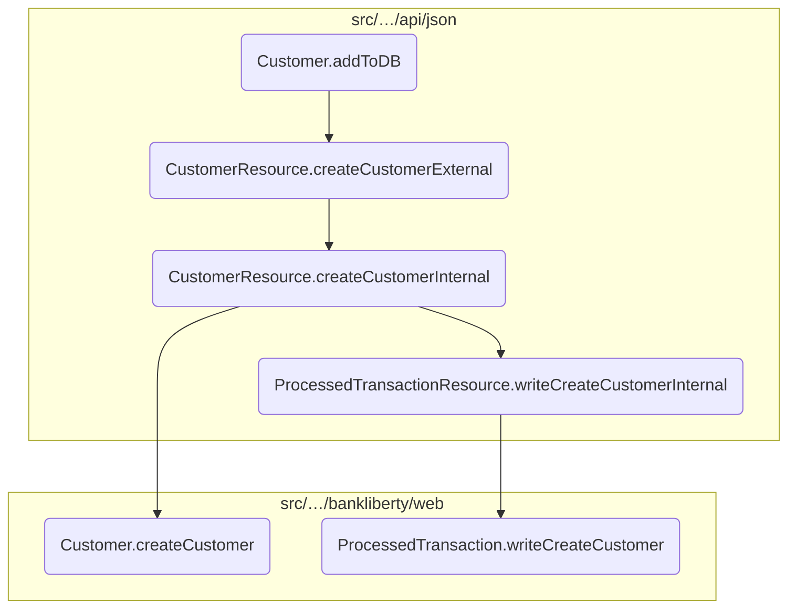

# Flow drill down

## Exploring <SwmToken path="src/webui/src/main/java/com/ibm/cics/cip/bankliberty/webui/data_access/Customer.java" pos="265:5:5" line-data="	public String addToDB()">`addToDB`</SwmToken>

```mermaid
graph TD
  subgraph addToDB
    addToDB:A["Create Customer Resource"] --> addToDB:B["Set Customer Address"]
    addToDB:B --> addToDB:C["Set Customer Name"]
    addToDB:C --> addToDB:D["Set Date Of Birth"]
    addToDB:D --> addToDB:E["Set Sort Code"]
    addToDB:E --> addToDB:F["Call createCustomerExternal"]
    addToDB:F --> addToDB:G["Check if response status is 201"]
    addToDB:G -->|Yes| addToDB:H["Parse Customer Response"]
    addToDB:H --> addToDB:I["Set Customer Details"]
    addToDB:I --> addToDB:J["Return Customer Number"]
    addToDB:G -->|No| addToDB:K["Log error response"]
    addToDB:K --> addToDB:L["Close Customer Response"]
  end

%% Swimm:
%% graph TD
%%   subgraph <SwmToken path="src/webui/src/main/java/com/ibm/cics/cip/bankliberty/webui/data_access/Customer.java" pos="265:5:5" line-data="	public String addToDB()">`addToDB`</SwmToken>
%%     <SwmToken path="src/webui/src/main/java/com/ibm/cics/cip/bankliberty/webui/data_access/Customer.java" pos="265:5:5" line-data="	public String addToDB()">`addToDB`</SwmToken>:A["Create Customer Resource"] --> <SwmToken path="src/webui/src/main/java/com/ibm/cics/cip/bankliberty/webui/data_access/Customer.java" pos="265:5:5" line-data="	public String addToDB()">`addToDB`</SwmToken>:B["Set Customer Address"]
%%     <SwmToken path="src/webui/src/main/java/com/ibm/cics/cip/bankliberty/webui/data_access/Customer.java" pos="265:5:5" line-data="	public String addToDB()">`addToDB`</SwmToken>:B --> <SwmToken path="src/webui/src/main/java/com/ibm/cics/cip/bankliberty/webui/data_access/Customer.java" pos="265:5:5" line-data="	public String addToDB()">`addToDB`</SwmToken>:C["Set Customer Name"]
%%     <SwmToken path="src/webui/src/main/java/com/ibm/cics/cip/bankliberty/webui/data_access/Customer.java" pos="265:5:5" line-data="	public String addToDB()">`addToDB`</SwmToken>:C --> <SwmToken path="src/webui/src/main/java/com/ibm/cics/cip/bankliberty/webui/data_access/Customer.java" pos="265:5:5" line-data="	public String addToDB()">`addToDB`</SwmToken>:D["Set Date Of Birth"]
%%     <SwmToken path="src/webui/src/main/java/com/ibm/cics/cip/bankliberty/webui/data_access/Customer.java" pos="265:5:5" line-data="	public String addToDB()">`addToDB`</SwmToken>:D --> <SwmToken path="src/webui/src/main/java/com/ibm/cics/cip/bankliberty/webui/data_access/Customer.java" pos="265:5:5" line-data="	public String addToDB()">`addToDB`</SwmToken>:E["Set Sort Code"]
%%     <SwmToken path="src/webui/src/main/java/com/ibm/cics/cip/bankliberty/webui/data_access/Customer.java" pos="265:5:5" line-data="	public String addToDB()">`addToDB`</SwmToken>:E --> <SwmToken path="src/webui/src/main/java/com/ibm/cics/cip/bankliberty/webui/data_access/Customer.java" pos="265:5:5" line-data="	public String addToDB()">`addToDB`</SwmToken>:F["Call <SwmToken path="src/webui/src/main/java/com/ibm/cics/cip/bankliberty/webui/data_access/Customer.java" pos="276:2:2" line-data="				.createCustomerExternal(myCustomerJSON);">`createCustomerExternal`</SwmToken>"]
%%     <SwmToken path="src/webui/src/main/java/com/ibm/cics/cip/bankliberty/webui/data_access/Customer.java" pos="265:5:5" line-data="	public String addToDB()">`addToDB`</SwmToken>:F --> <SwmToken path="src/webui/src/main/java/com/ibm/cics/cip/bankliberty/webui/data_access/Customer.java" pos="265:5:5" line-data="	public String addToDB()">`addToDB`</SwmToken>:G["Check if response status is 201"]
%%     <SwmToken path="src/webui/src/main/java/com/ibm/cics/cip/bankliberty/webui/data_access/Customer.java" pos="265:5:5" line-data="	public String addToDB()">`addToDB`</SwmToken>:G -->|Yes| <SwmToken path="src/webui/src/main/java/com/ibm/cics/cip/bankliberty/webui/data_access/Customer.java" pos="265:5:5" line-data="	public String addToDB()">`addToDB`</SwmToken>:H["Parse Customer Response"]
%%     <SwmToken path="src/webui/src/main/java/com/ibm/cics/cip/bankliberty/webui/data_access/Customer.java" pos="265:5:5" line-data="	public String addToDB()">`addToDB`</SwmToken>:H --> <SwmToken path="src/webui/src/main/java/com/ibm/cics/cip/bankliberty/webui/data_access/Customer.java" pos="265:5:5" line-data="	public String addToDB()">`addToDB`</SwmToken>:I["Set Customer Details"]
%%     <SwmToken path="src/webui/src/main/java/com/ibm/cics/cip/bankliberty/webui/data_access/Customer.java" pos="265:5:5" line-data="	public String addToDB()">`addToDB`</SwmToken>:I --> <SwmToken path="src/webui/src/main/java/com/ibm/cics/cip/bankliberty/webui/data_access/Customer.java" pos="265:5:5" line-data="	public String addToDB()">`addToDB`</SwmToken>:J["Return Customer Number"]
%%     <SwmToken path="src/webui/src/main/java/com/ibm/cics/cip/bankliberty/webui/data_access/Customer.java" pos="265:5:5" line-data="	public String addToDB()">`addToDB`</SwmToken>:G -->|No| <SwmToken path="src/webui/src/main/java/com/ibm/cics/cip/bankliberty/webui/data_access/Customer.java" pos="265:5:5" line-data="	public String addToDB()">`addToDB`</SwmToken>:K["Log error response"]
%%     <SwmToken path="src/webui/src/main/java/com/ibm/cics/cip/bankliberty/webui/data_access/Customer.java" pos="265:5:5" line-data="	public String addToDB()">`addToDB`</SwmToken>:K --> <SwmToken path="src/webui/src/main/java/com/ibm/cics/cip/bankliberty/webui/data_access/Customer.java" pos="265:5:5" line-data="	public String addToDB()">`addToDB`</SwmToken>:L["Close Customer Response"]
%%   end
```

<SwmSnippet path="/src/webui/src/main/java/com/ibm/cics/cip/bankliberty/webui/data_access/Customer.java" line="267">

---

## Initializing Customer Resource

First, we initialize a <SwmToken path="src/webui/src/main/java/com/ibm/cics/cip/bankliberty/webui/data_access/Customer.java" pos="267:1:1" line-data="		CustomerResource myCustomerResource = new CustomerResource();">`CustomerResource`</SwmToken> object which will be used to interact with the customer data service.

```java
		CustomerResource myCustomerResource = new CustomerResource();
```

---

</SwmSnippet>

<SwmSnippet path="/src/webui/src/main/java/com/ibm/cics/cip/bankliberty/webui/data_access/Customer.java" line="269">

---

## Setting Customer Data

Next, we create a <SwmToken path="src/webui/src/main/java/com/ibm/cics/cip/bankliberty/webui/data_access/Customer.java" pos="269:1:1" line-data="		CustomerJSON myCustomerJSON = new CustomerJSON();">`CustomerJSON`</SwmToken> object and set the customer's address, name, date of birth, and sort code. This object will hold the customer data that needs to be sent to the service.

```java
		CustomerJSON myCustomerJSON = new CustomerJSON();

		myCustomerJSON.setCustomerAddress(this.getAddress());
		myCustomerJSON.setCustomerName(this.getName());
		myCustomerJSON.setDateOfBirth(this.getDob());
		myCustomerJSON.setSortCode(this.getSortcode());
```

---

</SwmSnippet>

<SwmSnippet path="/src/webui/src/main/java/com/ibm/cics/cip/bankliberty/webui/data_access/Customer.java" line="275">

---

## Creating Customer Externally

Then, we call the <SwmToken path="src/webui/src/main/java/com/ibm/cics/cip/bankliberty/webui/data_access/Customer.java" pos="276:2:2" line-data="				.createCustomerExternal(myCustomerJSON);">`createCustomerExternal`</SwmToken> method on the <SwmToken path="src/webui/src/main/java/com/ibm/cics/cip/bankliberty/webui/data_access/Customer.java" pos="267:1:1" line-data="		CustomerResource myCustomerResource = new CustomerResource();">`CustomerResource`</SwmToken> object, passing the <SwmToken path="src/webui/src/main/java/com/ibm/cics/cip/bankliberty/webui/data_access/Customer.java" pos="269:1:1" line-data="		CustomerJSON myCustomerJSON = new CustomerJSON();">`CustomerJSON`</SwmToken> object. This method handles the creation of a new customer by receiving the customer details, validating them, creating a new customer record, and writing this record to the PROCTRAN data store.

```java
		Response myCustomerResponse = myCustomerResource
				.createCustomerExternal(myCustomerJSON);
```

---

</SwmSnippet>

<SwmSnippet path="/src/webui/src/main/java/com/ibm/cics/cip/bankliberty/webui/data_access/Customer.java" line="281">

---

## Handling the Response

Moving to the response handling, we check if the response status is 201 (Created). If so, we parse the response entity to extract customer details such as date of birth, address, name, sort code, and customer number, and update the current customer object with these details.

```java
		if (myCustomerResponse.getStatus() == 201)
		{
			myCustomerString = myCustomerResponse.getEntity().toString();
			try
			{
				myCustomer = JSONObject.parse(myCustomerString);

				this.setDob(sortOutDate(
						(String) myCustomer.get(JSON_DATE_OF_BIRTH)));
				this.setAddress((String) myCustomer.get(JSON_CUSTOMER_ADDRESS));
				this.setName((String) myCustomer.get(JSON_CUSTOMER_NAME));
				this.setSortcode((String) myCustomer.get(JSON_SORT_CODE));

				String customerNoString = (String) myCustomer.get(JSON_ID);
				this.setCustomerNumber(customerNoString);
				myCustomerResponse.close();
				return customerNoString;
```

---

</SwmSnippet>

<SwmSnippet path="/src/webui/src/main/java/com/ibm/cics/cip/bankliberty/webui/data_access/Customer.java" line="306">

---

## Error Handling

If the response status is not 201, we log the error status and response entity, and return '-1' indicating a failure in creating the customer.

```java
		else
		{
			logger.log(Level.SEVERE, () -> myCustomerResponse.getStatus() + " "
					+ myCustomerResponse.getEntity().toString());
			myCustomerResponse.close();
			return "-1";
```

---

</SwmSnippet>

## Zooming into <SwmToken path="src/webui/src/main/java/com/ibm/cics/cip/bankliberty/webui/data_access/Customer.java" pos="276:2:2" line-data="				.createCustomerExternal(myCustomerJSON);">`createCustomerExternal`</SwmToken>

```mermaid
graph TD
  subgraph createCustomerExternal
    createCustomerExternal:A["Log entry"] --> createCustomerExternal:B["Create customer internally"]
    createCustomerExternal:B --> createCustomerExternal:C["Terminate HBankDataAccess"]
    createCustomerExternal:C --> createCustomerExternal:D["Log exit and send response"]
  end

%% Swimm:
%% graph TD
%%   subgraph <SwmToken path="src/webui/src/main/java/com/ibm/cics/cip/bankliberty/webui/data_access/Customer.java" pos="276:2:2" line-data="				.createCustomerExternal(myCustomerJSON);">`createCustomerExternal`</SwmToken>
%%     <SwmToken path="src/webui/src/main/java/com/ibm/cics/cip/bankliberty/webui/data_access/Customer.java" pos="276:2:2" line-data="				.createCustomerExternal(myCustomerJSON);">`createCustomerExternal`</SwmToken>:A["Log entry"] --> <SwmToken path="src/webui/src/main/java/com/ibm/cics/cip/bankliberty/webui/data_access/Customer.java" pos="276:2:2" line-data="				.createCustomerExternal(myCustomerJSON);">`createCustomerExternal`</SwmToken>:B["Create customer internally"]
%%     <SwmToken path="src/webui/src/main/java/com/ibm/cics/cip/bankliberty/webui/data_access/Customer.java" pos="276:2:2" line-data="				.createCustomerExternal(myCustomerJSON);">`createCustomerExternal`</SwmToken>:B --> <SwmToken path="src/webui/src/main/java/com/ibm/cics/cip/bankliberty/webui/data_access/Customer.java" pos="276:2:2" line-data="				.createCustomerExternal(myCustomerJSON);">`createCustomerExternal`</SwmToken>:C["Terminate <SwmToken path="src/webui/src/main/java/com/ibm/cics/cip/bankliberty/api/json/CustomerResource.java" pos="115:1:1" line-data="		HBankDataAccess myHBankDataAccess = new HBankDataAccess();">`HBankDataAccess`</SwmToken>"]
%%     <SwmToken path="src/webui/src/main/java/com/ibm/cics/cip/bankliberty/webui/data_access/Customer.java" pos="276:2:2" line-data="				.createCustomerExternal(myCustomerJSON);">`createCustomerExternal`</SwmToken>:C --> <SwmToken path="src/webui/src/main/java/com/ibm/cics/cip/bankliberty/webui/data_access/Customer.java" pos="276:2:2" line-data="				.createCustomerExternal(myCustomerJSON);">`createCustomerExternal`</SwmToken>:D["Log exit and send response"]
%%   end
```

<SwmSnippet path="/src/webui/src/main/java/com/ibm/cics/cip/bankliberty/api/json/CustomerResource.java" line="108">

---

## Handling customer creation and logging

First, the <SwmToken path="src/webui/src/main/java/com/ibm/cics/cip/bankliberty/api/json/CustomerResource.java" pos="110:5:5" line-data="	public Response createCustomerExternal(CustomerJSON customer)">`createCustomerExternal`</SwmToken> method is invoked to handle the creation of a new customer. This method is annotated with <SwmToken path="src/webui/src/main/java/com/ibm/cics/cip/bankliberty/api/json/CustomerResource.java" pos="108:1:2" line-data="	@POST">`@POST`</SwmToken> and <SwmToken path="src/webui/src/main/java/com/ibm/cics/cip/bankliberty/api/json/CustomerResource.java" pos="109:1:7" line-data="	@Produces(MediaType.APPLICATION_JSON)">`@Produces(MediaType.APPLICATION_JSON)`</SwmToken>, indicating that it handles HTTP POST requests and produces JSON responses.

```java
	@POST
	@Produces(MediaType.APPLICATION_JSON)
	public Response createCustomerExternal(CustomerJSON customer)
```

---

</SwmSnippet>

<SwmSnippet path="/src/webui/src/main/java/com/ibm/cics/cip/bankliberty/api/json/CustomerResource.java" line="112">

---

Next, the method logs the entry into the <SwmToken path="src/webui/src/main/java/com/ibm/cics/cip/bankliberty/webui/data_access/Customer.java" pos="276:2:2" line-data="				.createCustomerExternal(myCustomerJSON);">`createCustomerExternal`</SwmToken> process, capturing the customer details provided as input.

```java
		logger.entering(this.getClass().getName(),
				CREATE_CUSTOMER_EXTERNAL + customer.toString());
```

---

</SwmSnippet>

<SwmSnippet path="/src/webui/src/main/java/com/ibm/cics/cip/bankliberty/api/json/CustomerResource.java" line="114">

---

Moving to the core functionality, the method calls <SwmToken path="src/webui/src/main/java/com/ibm/cics/cip/bankliberty/api/json/CustomerResource.java" pos="114:7:7" line-data="		Response myResponse = createCustomerInternal(customer);">`createCustomerInternal`</SwmToken> to validate the customer details, create a new customer record, and write it to the PROCTRAN data store. This step is crucial as it ensures that the customer data is correctly processed and stored.

```java
		Response myResponse = createCustomerInternal(customer);
```

---

</SwmSnippet>

<SwmSnippet path="/src/webui/src/main/java/com/ibm/cics/cip/bankliberty/api/json/CustomerResource.java" line="115">

---

Then, an instance of <SwmToken path="src/webui/src/main/java/com/ibm/cics/cip/bankliberty/api/json/CustomerResource.java" pos="115:1:1" line-data="		HBankDataAccess myHBankDataAccess = new HBankDataAccess();">`HBankDataAccess`</SwmToken> is created and terminated to manage the data access layer, ensuring that resources are properly released after the operation.

```java
		HBankDataAccess myHBankDataAccess = new HBankDataAccess();
		myHBankDataAccess.terminate();
```

---

</SwmSnippet>

<SwmSnippet path="/src/webui/src/main/java/com/ibm/cics/cip/bankliberty/api/json/CustomerResource.java" line="117">

---

Finally, the method logs the exit from the <SwmToken path="src/webui/src/main/java/com/ibm/cics/cip/bankliberty/webui/data_access/Customer.java" pos="276:2:2" line-data="				.createCustomerExternal(myCustomerJSON);">`createCustomerExternal`</SwmToken> process and returns the response generated by <SwmToken path="src/webui/src/main/java/com/ibm/cics/cip/bankliberty/api/json/CustomerResource.java" pos="114:7:7" line-data="		Response myResponse = createCustomerInternal(customer);">`createCustomerInternal`</SwmToken>, indicating the success or failure of the customer creation operation.

```java
		logger.exiting(this.getClass().getName(), CREATE_CUSTOMER_EXTERNAL_EXIT,
				myResponse);
		return myResponse;
```

---

</SwmSnippet>

## Diving into the <SwmToken path="src/webui/src/main/java/com/ibm/cics/cip/bankliberty/api/json/CustomerResource.java" pos="114:7:7" line-data="		Response myResponse = createCustomerInternal(customer);">`createCustomerInternal`</SwmToken> function

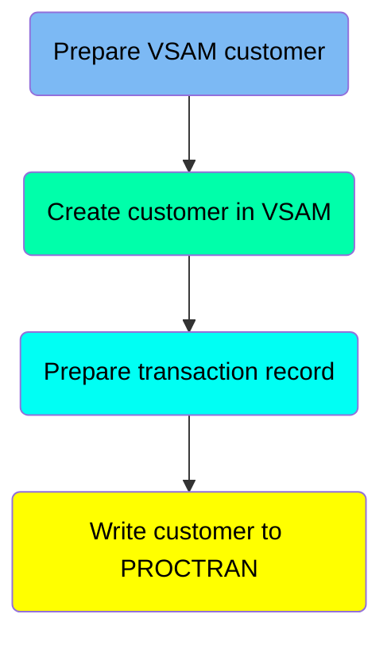

## <SwmToken path="src/webui/src/main/java/com/ibm/cics/cip/bankliberty/api/json/CustomerResource.java" pos="114:7:7" line-data="		Response myResponse = createCustomerInternal(customer);">`createCustomerInternal`</SwmToken> function - Prepare VSAM customer

Here is a diagram of this part:

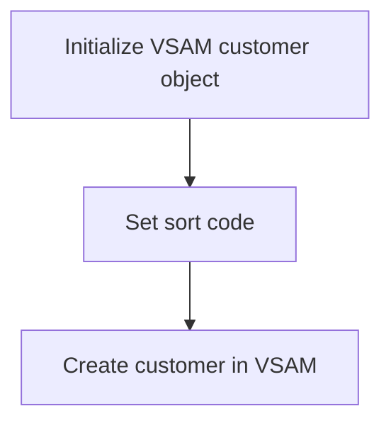

<SwmSnippet path="/src/webui/src/main/java/com/ibm/cics/cip/bankliberty/api/json/CustomerResource.java" line="224">

---

### Initialize VSAM customer object

The first step involves initializing a new VSAM customer object. This object will be used to store the customer details and interact with the VSAM file system.

```java
		com.ibm.cics.cip.bankliberty.web.vsam.Customer vsamCustomer = new com.ibm.cics.cip.bankliberty.web.vsam.Customer();
```

---

</SwmSnippet>

<SwmSnippet path="/src/webui/src/main/java/com/ibm/cics/cip/bankliberty/api/json/CustomerResource.java" line="226">

---

### Set sort code

Next, the sort code of the customer is set to the sort code of the current bank. This ensures that the customer is associated with the correct bank branch.

```java
		customer.setSortCode(this.getSortCode().toString());
```

---

</SwmSnippet>

<SwmSnippet path="/src/webui/src/main/java/com/ibm/cics/cip/bankliberty/api/json/CustomerResource.java" line="228">

---

### Create customer in VSAM

Finally, the <SwmToken path="src/webui/src/main/java/com/ibm/cics/cip/bankliberty/api/json/CustomerResource.java" pos="228:7:7" line-data="		vsamCustomer = vsamCustomer.createCustomer(customer,">`createCustomer`</SwmToken> method is called on the VSAM customer object, passing in the customer details and the sort code. This method handles the creation of the customer in the VSAM file system, including generating a unique customer number, assigning a credit score, and writing the new customer record to the file.

```java
		vsamCustomer = vsamCustomer.createCustomer(customer,
				this.getSortCode());
```

---

</SwmSnippet>

## <SwmToken path="src/webui/src/main/java/com/ibm/cics/cip/bankliberty/api/json/CustomerResource.java" pos="114:7:7" line-data="		Response myResponse = createCustomerInternal(customer);">`createCustomerInternal`</SwmToken> function - Create customer in VSAM

Here is a diagram of this part:

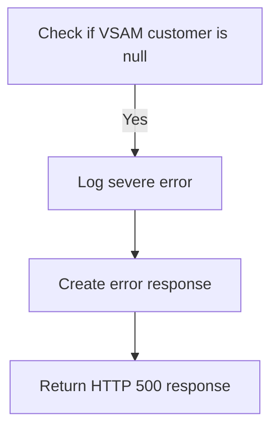

<SwmSnippet path="/src/webui/src/main/java/com/ibm/cics/cip/bankliberty/api/json/CustomerResource.java" line="231">

---

### Checking if the customer creation in VSAM was successful

After attempting to create a customer in the VSAM database, the function checks if the <SwmToken path="src/webui/src/main/java/com/ibm/cics/cip/bankliberty/api/json/CustomerResource.java" pos="231:4:4" line-data="		if (vsamCustomer == null)">`vsamCustomer`</SwmToken> object is <SwmToken path="src/webui/src/main/java/com/ibm/cics/cip/bankliberty/api/json/CustomerResource.java" pos="231:8:8" line-data="		if (vsamCustomer == null)">`null`</SwmToken>. This indicates whether the customer creation was successful or not.

```java
		if (vsamCustomer == null)
		{
```

---

</SwmSnippet>

<SwmSnippet path="/src/webui/src/main/java/com/ibm/cics/cip/bankliberty/api/json/CustomerResource.java" line="233">

---

If the <SwmToken path="src/webui/src/main/java/com/ibm/cics/cip/bankliberty/api/json/CustomerResource.java" pos="224:17:17" line-data="		com.ibm.cics.cip.bankliberty.web.vsam.Customer vsamCustomer = new com.ibm.cics.cip.bankliberty.web.vsam.Customer();">`vsamCustomer`</SwmToken> is <SwmToken path="src/webui/src/main/java/com/ibm/cics/cip/bankliberty/api/json/CustomerResource.java" pos="231:8:8" line-data="		if (vsamCustomer == null)">`null`</SwmToken>, it means the customer creation failed. The function then logs a severe error message to indicate this failure.

```java
			JSONObject error = new JSONObject();
			error.put(JSON_ERROR_MSG,
					"Failed to create customer in com.ibm.cics.cip.bankliberty.web.vsam.Customer");
			logger.severe(
					"Failed to create customer in com.ibm.cics.cip.bankliberty.web.vsam.Customer");
```

---

</SwmSnippet>

<SwmSnippet path="/src/webui/src/main/java/com/ibm/cics/cip/bankliberty/api/json/CustomerResource.java" line="238">

---

Subsequently, an error response is created with a status code of 500 (Internal Server Error) and an appropriate error message. This response is then returned to the client.

```java
			Response myResponse = Response.status(500).entity(error.toString())
					.build();
			logger.exiting(this.getClass().getName(),
					CREATE_CUSTOMER_INTERNAL_EXIT, myResponse);
			return myResponse;
		}
```

---

</SwmSnippet>

## <SwmToken path="src/webui/src/main/java/com/ibm/cics/cip/bankliberty/api/json/CustomerResource.java" pos="114:7:7" line-data="		Response myResponse = createCustomerInternal(customer);">`createCustomerInternal`</SwmToken> function - Prepare transaction record

Here is a diagram of this part:

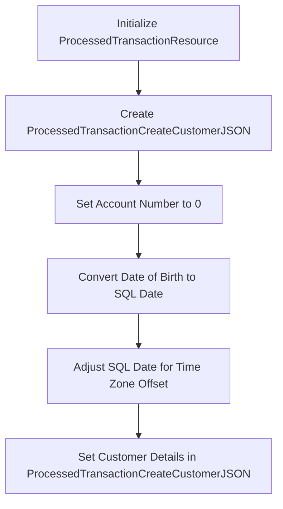

<SwmSnippet path="/src/webui/src/main/java/com/ibm/cics/cip/bankliberty/api/json/CustomerResource.java" line="262">

---

### Preparing the transaction record for the new customer

The function begins by initializing a <SwmToken path="src/webui/src/main/java/com/ibm/cics/cip/bankliberty/api/json/CustomerResource.java" pos="262:1:1" line-data="		ProcessedTransactionResource myProcessedTransactionResource = new ProcessedTransactionResource();">`ProcessedTransactionResource`</SwmToken> object, which will be used to handle the transaction record for the new customer.

```java
		ProcessedTransactionResource myProcessedTransactionResource = new ProcessedTransactionResource();

```

---

</SwmSnippet>

<SwmSnippet path="/src/webui/src/main/java/com/ibm/cics/cip/bankliberty/api/json/CustomerResource.java" line="264">

---

Next, a <SwmToken path="src/webui/src/main/java/com/ibm/cics/cip/bankliberty/api/json/CustomerResource.java" pos="264:1:1" line-data="		ProcessedTransactionCreateCustomerJSON myCreatedCustomer = new ProcessedTransactionCreateCustomerJSON();">`ProcessedTransactionCreateCustomerJSON`</SwmToken> object is created to store the details of the new customer. The account number is initially set to '0'.

```java
		ProcessedTransactionCreateCustomerJSON myCreatedCustomer = new ProcessedTransactionCreateCustomerJSON();
		myCreatedCustomer.setAccountNumber("0");
		
```

---

</SwmSnippet>

<SwmSnippet path="/src/webui/src/main/java/com/ibm/cics/cip/bankliberty/api/json/CustomerResource.java" line="267">

---

The customer's date of birth is converted to a <SwmToken path="src/webui/src/main/java/com/ibm/cics/cip/bankliberty/api/json/CustomerResource.java" pos="267:1:5" line-data="		java.sql.Date mySqlDate = new java.sql.Date(myCalendar.getTimeInMillis());">`java.sql.Date`</SwmToken> object to ensure compatibility with the database. This date is then adjusted for any time zone offset to maintain accuracy.

```java
		java.sql.Date mySqlDate = new java.sql.Date(myCalendar.getTimeInMillis());
		
		
		mySqlDate.setTime(mySqlDate.getTime() - myCalendar.getTimeZone().getOffset(myCalendar.getTimeInMillis()));
```

---

</SwmSnippet>

<SwmSnippet path="/src/webui/src/main/java/com/ibm/cics/cip/bankliberty/api/json/CustomerResource.java" line="272">

---

Finally, the customer's details such as date of birth, name, sort code, and customer number are set in the <SwmToken path="src/webui/src/main/java/com/ibm/cics/cip/bankliberty/api/json/CustomerResource.java" pos="264:1:1" line-data="		ProcessedTransactionCreateCustomerJSON myCreatedCustomer = new ProcessedTransactionCreateCustomerJSON();">`ProcessedTransactionCreateCustomerJSON`</SwmToken> object. These details are essential for creating a complete transaction record for the new customer.

```java
		myCreatedCustomer.setCustomerDOB(mySqlDate);
		myCreatedCustomer.setCustomerName(vsamCustomer.getName());
		myCreatedCustomer.setSortCode(vsamCustomer.getSortcode());
		myCreatedCustomer.setCustomerNumber(vsamCustomer.getCustomerNumber());

```

---

</SwmSnippet>

## <SwmToken path="src/webui/src/main/java/com/ibm/cics/cip/bankliberty/api/json/CustomerResource.java" pos="114:7:7" line-data="		Response myResponse = createCustomerInternal(customer);">`createCustomerInternal`</SwmToken> function - Write customer to PROCTRAN

Here is a diagram of this part:

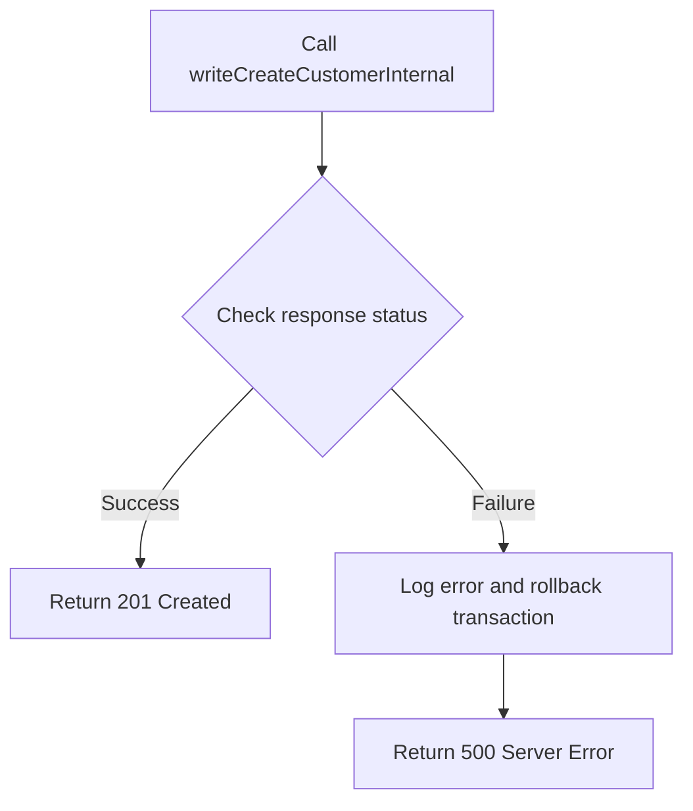

<SwmSnippet path="/src/webui/src/main/java/com/ibm/cics/cip/bankliberty/api/json/CustomerResource.java" line="277">

---

### Writing customer data to PROCTRAN

The function calls <SwmToken path="src/webui/src/main/java/com/ibm/cics/cip/bankliberty/api/json/CustomerResource.java" pos="278:2:2" line-data="				.writeCreateCustomerInternal(myCreatedCustomer);">`writeCreateCustomerInternal`</SwmToken> to write the customer data to the PROCTRAN data store. This step is crucial as it ensures that the customer information is persisted in the database.

```java
		Response writeCreateCustomerResponse = myProcessedTransactionResource
				.writeCreateCustomerInternal(myCreatedCustomer);
```

---

</SwmSnippet>

<SwmSnippet path="/src/webui/src/main/java/com/ibm/cics/cip/bankliberty/api/json/CustomerResource.java" line="279">

---

### Handling response and potential errors

After attempting to write the customer data, the function checks the response status. If the response is null or not successful (status code not 200), it logs an error message and attempts to roll back the transaction to maintain data integrity. If the rollback fails, it logs another error message. Finally, it returns a 500 Server Error response to indicate the failure.

```java
		if (writeCreateCustomerResponse == null
				|| writeCreateCustomerResponse.getStatus() != 200)
		{
			JSONObject error = new JSONObject();
			error.put(JSON_ERROR_MSG, "Failed to write to PROCTRAN data store");
			try
			{
				logger.severe(
						"Customer: createCustomer: Failed to write to PROCTRAN");
				Task.getTask().rollback();
			}
			catch (InvalidRequestException e)
			{
				logger.severe("Customer: createCustomer: Failed to rollback");
			}
			Response myResponse = Response.status(500).entity(error.toString())
					.build();
			logger.exiting(this.getClass().getName(),
					CREATE_CUSTOMER_INTERNAL_EXIT, myResponse);
			return myResponse;
		}
```

---

</SwmSnippet>

## Diving into the <SwmToken path="src/webui/src/main/java/com/ibm/cics/cip/bankliberty/api/json/CustomerResource.java" pos="228:7:7" line-data="		vsamCustomer = vsamCustomer.createCustomer(customer,">`createCustomer`</SwmToken> function

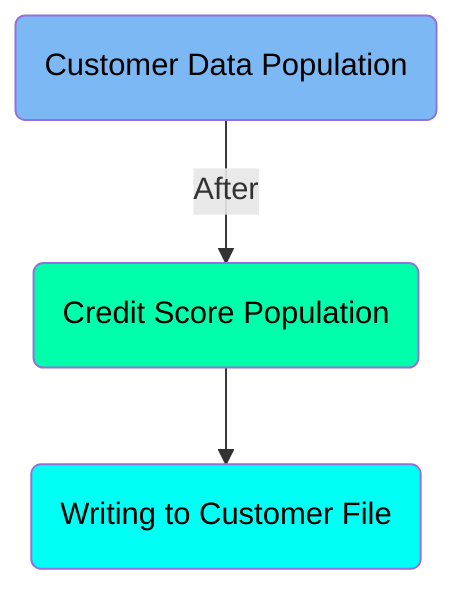

## <SwmToken path="src/webui/src/main/java/com/ibm/cics/cip/bankliberty/api/json/CustomerResource.java" pos="228:7:7" line-data="		vsamCustomer = vsamCustomer.createCustomer(customer,">`createCustomer`</SwmToken> function - Customer Data Population

Here is a diagram of this part:

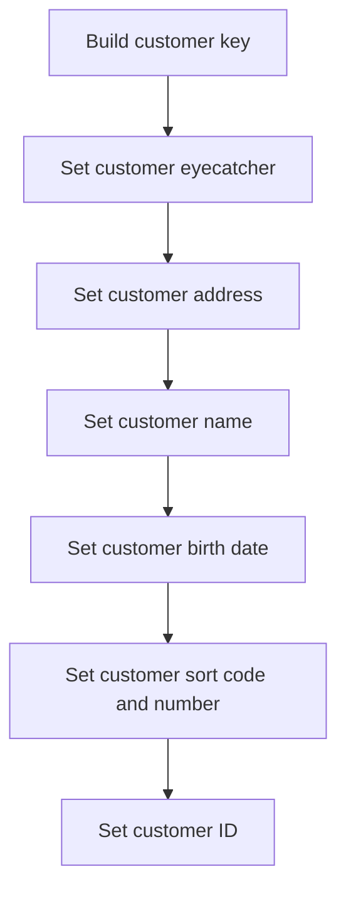

<SwmSnippet path="/src/webui/src/main/java/com/ibm/cics/cip/bankliberty/web/vsam/Customer.java" line="759">

---

### Building customer key

The function begins by building a unique key for the customer using the <SwmToken path="src/webui/src/main/java/com/ibm/cics/cip/bankliberty/web/vsam/Customer.java" pos="759:9:9" line-data="		byte[] key = buildKey(sortCodeInteger, customerNumberLong);">`buildKey`</SwmToken> method. This key is constructed from the provided <SwmToken path="src/webui/src/main/java/com/ibm/cics/cip/bankliberty/web/vsam/Customer.java" pos="759:11:11" line-data="		byte[] key = buildKey(sortCodeInteger, customerNumberLong);">`sortCodeInteger`</SwmToken> and <SwmToken path="src/webui/src/main/java/com/ibm/cics/cip/bankliberty/web/vsam/Customer.java" pos="759:14:14" line-data="		byte[] key = buildKey(sortCodeInteger, customerNumberLong);">`customerNumberLong`</SwmToken>.

```java
		byte[] key = buildKey(sortCodeInteger, customerNumberLong);
```

---

</SwmSnippet>

<SwmSnippet path="/src/webui/src/main/java/com/ibm/cics/cip/bankliberty/web/vsam/Customer.java" line="761">

---

### Setting customer eyecatcher

Next, the <SwmToken path="src/webui/src/main/java/com/ibm/cics/cip/bankliberty/web/vsam/Customer.java" pos="761:1:1" line-data="		myCustomer = new CUSTOMER();">`myCustomer`</SwmToken> object is initialized, and the <SwmToken path="src/webui/src/main/java/com/ibm/cics/cip/bankliberty/web/vsam/Customer.java" pos="762:3:3" line-data="		myCustomer.setCustomerEyecatcher(CUSTOMER.CUSTOMER_EYECATCHER_VALUE);">`setCustomerEyecatcher`</SwmToken> method is called to set a predefined eyecatcher value, which is a constant used to identify customer records.

```java
		myCustomer = new CUSTOMER();
		myCustomer.setCustomerEyecatcher(CUSTOMER.CUSTOMER_EYECATCHER_VALUE);
```

---

</SwmSnippet>

<SwmSnippet path="/src/webui/src/main/java/com/ibm/cics/cip/bankliberty/web/vsam/Customer.java" line="763">

---

### Setting customer address and name

The customer's address and name are then set using the <SwmToken path="src/webui/src/main/java/com/ibm/cics/cip/bankliberty/web/vsam/Customer.java" pos="763:3:3" line-data="		myCustomer.setCustomerAddress(customer.getCustomerAddress().trim());">`setCustomerAddress`</SwmToken> and <SwmToken path="src/webui/src/main/java/com/ibm/cics/cip/bankliberty/web/vsam/Customer.java" pos="765:3:3" line-data="		myCustomer.setCustomerName(customer.getCustomerName().trim());">`setCustomerName`</SwmToken> methods, respectively. These values are trimmed to remove any leading or trailing whitespace.

```java
		myCustomer.setCustomerAddress(customer.getCustomerAddress().trim());
		// What about title validation?
		myCustomer.setCustomerName(customer.getCustomerName().trim());
```

---

</SwmSnippet>

<SwmSnippet path="/src/webui/src/main/java/com/ibm/cics/cip/bankliberty/web/vsam/Customer.java" line="767">

---

### Setting customer birth date

The customer's date of birth is processed to set the day, month, and year fields. The date is adjusted to GMT time zone before setting these fields.

```java
		Calendar myCalendar = Calendar.getInstance(TimeZone.getTimeZone("GMT"));
		myCalendar.setTime(customer.getDateOfBirth());
		
		myCalendar.setTimeInMillis(myCalendar.getTimeInMillis() - myCalendar.getTimeZone().getOffset(myCalendar.getTimeInMillis()));
		
		myCustomer.setCustomerBirthDay(myCalendar.get(Calendar.DAY_OF_MONTH));
		myCustomer.setCustomerBirthMonth(myCalendar.get(Calendar.MONTH) + 1);
		myCustomer.setCustomerBirthYear(myCalendar.get(Calendar.YEAR));
```

---

</SwmSnippet>

<SwmSnippet path="/src/webui/src/main/java/com/ibm/cics/cip/bankliberty/web/vsam/Customer.java" line="776">

---

### Setting customer sort code and number

The customer's sort code and number are set using the <SwmToken path="src/webui/src/main/java/com/ibm/cics/cip/bankliberty/web/vsam/Customer.java" pos="776:3:3" line-data="		myCustomer.setCustomerSortcode(sortCodeInteger);">`setCustomerSortcode`</SwmToken> and <SwmToken path="src/webui/src/main/java/com/ibm/cics/cip/bankliberty/web/vsam/Customer.java" pos="777:3:3" line-data="		myCustomer.setCustomerNumber(customerNumberAsPrimitive);">`setCustomerNumber`</SwmToken> methods. These values are derived from the provided <SwmToken path="src/webui/src/main/java/com/ibm/cics/cip/bankliberty/web/vsam/Customer.java" pos="776:5:5" line-data="		myCustomer.setCustomerSortcode(sortCodeInteger);">`sortCodeInteger`</SwmToken> and <SwmToken path="src/webui/src/main/java/com/ibm/cics/cip/bankliberty/web/vsam/Customer.java" pos="777:5:5" line-data="		myCustomer.setCustomerNumber(customerNumberAsPrimitive);">`customerNumberAsPrimitive`</SwmToken>.

```java
		myCustomer.setCustomerSortcode(sortCodeInteger);
		myCustomer.setCustomerNumber(customerNumberAsPrimitive);
```

---

</SwmSnippet>

<SwmSnippet path="/src/webui/src/main/java/com/ibm/cics/cip/bankliberty/web/vsam/Customer.java" line="779">

---

### Setting customer ID

Finally, the customer's ID is set by converting the <SwmToken path="src/webui/src/main/java/com/ibm/cics/cip/bankliberty/web/vsam/Customer.java" pos="779:5:5" line-data="		customer.setId(customerNumberLong.toString());">`customerNumberLong`</SwmToken> to a string and assigning it to the <SwmToken path="src/webui/src/main/java/com/ibm/cics/cip/bankliberty/web/vsam/Customer.java" pos="779:1:1" line-data="		customer.setId(customerNumberLong.toString());">`customer`</SwmToken> object.

```java
		customer.setId(customerNumberLong.toString());
```

---

</SwmSnippet>

## <SwmToken path="src/webui/src/main/java/com/ibm/cics/cip/bankliberty/api/json/CustomerResource.java" pos="228:7:7" line-data="		vsamCustomer = vsamCustomer.createCustomer(customer,">`createCustomer`</SwmToken> function - Credit Score Population

Here is a diagram of this part:

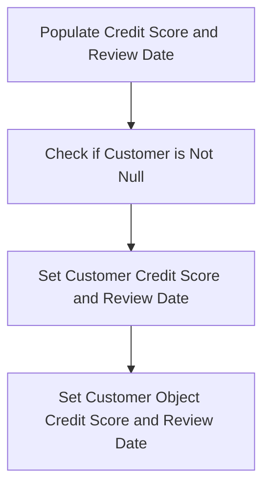

<SwmSnippet path="/src/webui/src/main/java/com/ibm/cics/cip/bankliberty/web/vsam/Customer.java" line="781">

---

### Populating Credit Score and Review Date

The function <SwmToken path="src/webui/src/main/java/com/ibm/cics/cip/bankliberty/api/json/CustomerResource.java" pos="228:7:7" line-data="		vsamCustomer = vsamCustomer.createCustomer(customer,">`createCustomer`</SwmToken> first calls <SwmToken path="src/webui/src/main/java/com/ibm/cics/cip/bankliberty/web/vsam/Customer.java" pos="781:5:10" line-data="		customer = CreditScore.populateCreditScoreAndReviewDate(customer);">`CreditScore.populateCreditScoreAndReviewDate(customer)`</SwmToken> to populate the credit score and review date for the customer.

```java
		customer = CreditScore.populateCreditScoreAndReviewDate(customer);
```

---

</SwmSnippet>

<SwmSnippet path="/src/webui/src/main/java/com/ibm/cics/cip/bankliberty/web/vsam/Customer.java" line="783">

---

### Checking if Customer is Not Null

After populating the credit score and review date, the function checks if the <SwmToken path="src/webui/src/main/java/com/ibm/cics/cip/bankliberty/web/vsam/Customer.java" pos="783:4:4" line-data="		if (customer != null)">`customer`</SwmToken> object is not null. If it is null, it logs an error and exits the function.

```java
		if (customer != null)
		{
			customer.setCreditScore(customer.getCreditScore());
			customer.setReviewDate(customer.getReviewDate());
			creditScore = customer.getCreditScore();
			reviewDate = customer.getReviewDate();
		}
		else
		{
			logger.severe(
					"Error! populateCreditScoreAndReviewDate returned null");
			logger.exiting(this.getClass().getName(), CREATE_CUSTOMER, null);
			return null;
```

---

</SwmSnippet>

<SwmSnippet path="/src/webui/src/main/java/com/ibm/cics/cip/bankliberty/web/vsam/Customer.java" line="785">

---

### Setting Customer Credit Score and Review Date

If the <SwmToken path="src/webui/src/main/java/com/ibm/cics/cip/bankliberty/web/vsam/Customer.java" pos="785:1:1" line-data="			customer.setCreditScore(customer.getCreditScore());">`customer`</SwmToken> object is not null, the function sets the <SwmToken path="src/webui/src/main/java/com/ibm/cics/cip/bankliberty/web/vsam/Customer.java" pos="787:1:1" line-data="			creditScore = customer.getCreditScore();">`creditScore`</SwmToken> and <SwmToken path="src/webui/src/main/java/com/ibm/cics/cip/bankliberty/web/vsam/Customer.java" pos="788:1:1" line-data="			reviewDate = customer.getReviewDate();">`reviewDate`</SwmToken> fields of the <SwmToken path="src/webui/src/main/java/com/ibm/cics/cip/bankliberty/web/vsam/Customer.java" pos="785:1:1" line-data="			customer.setCreditScore(customer.getCreditScore());">`customer`</SwmToken> object.

```java
			customer.setCreditScore(customer.getCreditScore());
			customer.setReviewDate(customer.getReviewDate());
			creditScore = customer.getCreditScore();
			reviewDate = customer.getReviewDate();
```

---

</SwmSnippet>

<SwmSnippet path="/src/webui/src/main/java/com/ibm/cics/cip/bankliberty/web/vsam/Customer.java" line="798">

---

### Setting Customer Object Credit Score and Review Date

Finally, the function sets the credit score and review date in the <SwmToken path="src/webui/src/main/java/com/ibm/cics/cip/bankliberty/web/vsam/Customer.java" pos="798:1:1" line-data="		myCustomer.setCustomerCreditScore(">`myCustomer`</SwmToken> object, which represents the customer in the system.

```java
		myCustomer.setCustomerCreditScore(
				Integer.parseInt(customer.getCreditScore()));
		Date myCustomerCsReviewDate = customer.getReviewDate();
		myCalendar.setTime(myCustomerCsReviewDate);
		myCustomer
				.setCustomerCsReviewDay(myCalendar.get(Calendar.DAY_OF_MONTH));
		myCustomer.setCustomerCsReviewMonth(myCalendar.get(Calendar.MONTH) + 1);
		myCustomer.setCustomerCsReviewYear(myCalendar.get(Calendar.YEAR));
```

---

</SwmSnippet>

## <SwmToken path="src/webui/src/main/java/com/ibm/cics/cip/bankliberty/api/json/CustomerResource.java" pos="228:7:7" line-data="		vsamCustomer = vsamCustomer.createCustomer(customer,">`createCustomer`</SwmToken> function - Writing to Customer File

Here is a diagram of this part:

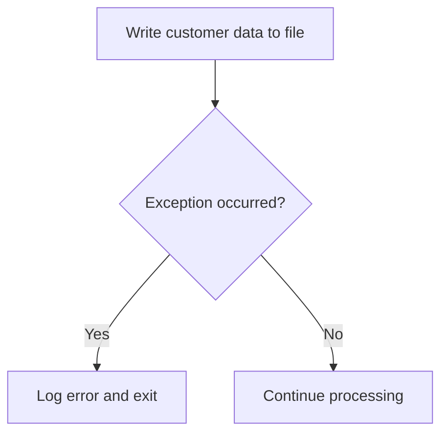

<SwmSnippet path="/src/webui/src/main/java/com/ibm/cics/cip/bankliberty/web/vsam/Customer.java" line="807">

---

### Writing customer data to the file

The <SwmToken path="src/webui/src/main/java/com/ibm/cics/cip/bankliberty/api/json/CustomerResource.java" pos="228:7:7" line-data="		vsamCustomer = vsamCustomer.createCustomer(customer,">`createCustomer`</SwmToken> function attempts to write the customer data to the customer file using the <SwmToken path="src/webui/src/main/java/com/ibm/cics/cip/bankliberty/web/vsam/Customer.java" pos="809:3:3" line-data="			customerFile.write(key, myCustomer.getByteBuffer());">`write`</SwmToken> method of <SwmToken path="src/webui/src/main/java/com/ibm/cics/cip/bankliberty/web/vsam/Customer.java" pos="809:1:1" line-data="			customerFile.write(key, myCustomer.getByteBuffer());">`customerFile`</SwmToken>. This method takes the <SwmToken path="src/webui/src/main/java/com/ibm/cics/cip/bankliberty/web/vsam/Customer.java" pos="809:5:5" line-data="			customerFile.write(key, myCustomer.getByteBuffer());">`key`</SwmToken> (which is a byte array representing the customer key) and the byte buffer of <SwmToken path="src/webui/src/main/java/com/ibm/cics/cip/bankliberty/web/vsam/Customer.java" pos="809:8:8" line-data="			customerFile.write(key, myCustomer.getByteBuffer());">`myCustomer`</SwmToken> (which contains the customer data).

```java
		try
		{
			customerFile.write(key, myCustomer.getByteBuffer());
			myCustomer = new CUSTOMER(myCustomer.getByteBuffer());
```

---

</SwmSnippet>

<SwmSnippet path="/src/webui/src/main/java/com/ibm/cics/cip/bankliberty/web/vsam/Customer.java" line="812">

---

### Handling exceptions

If an exception occurs during the write operation, it is caught and logged. The function handles various exceptions such as <SwmToken path="src/webui/src/main/java/com/ibm/cics/cip/bankliberty/web/vsam/Customer.java" pos="812:4:4" line-data="		catch (InvalidSystemIdException | NoSpaceException | LogicException">`InvalidSystemIdException`</SwmToken>, <SwmToken path="src/webui/src/main/java/com/ibm/cics/cip/bankliberty/web/vsam/Customer.java" pos="812:8:8" line-data="		catch (InvalidSystemIdException | NoSpaceException | LogicException">`NoSpaceException`</SwmToken>, <SwmToken path="src/webui/src/main/java/com/ibm/cics/cip/bankliberty/web/vsam/Customer.java" pos="812:12:12" line-data="		catch (InvalidSystemIdException | NoSpaceException | LogicException">`LogicException`</SwmToken>, and others. If any of these exceptions are caught, an error message is logged, and the function exits, returning <SwmToken path="src/webui/src/main/java/com/ibm/cics/cip/bankliberty/web/vsam/Customer.java" pos="821:19:19" line-data="			logger.exiting(this.getClass().getName(), CREATE_CUSTOMER, null);">`null`</SwmToken>.

```java
		catch (InvalidSystemIdException | NoSpaceException | LogicException
				| InvalidRequestException | IOErrorException
				| LengthErrorException | ChangedException | LockedException
				| LoadingException | RecordBusyException | FileDisabledException
				| FileNotFoundException | ISCInvalidRequestException
				| NotAuthorisedException | NotOpenException e)
		{
			logger.severe("Error writing record to CUSTOMER file, "
					+ e.getLocalizedMessage());
			logger.exiting(this.getClass().getName(), CREATE_CUSTOMER, null);
			return null;
```

---

</SwmSnippet>

## A closer look at <SwmToken path="src/webui/src/main/java/com/ibm/cics/cip/bankliberty/api/json/CustomerResource.java" pos="278:2:2" line-data="				.writeCreateCustomerInternal(myCreatedCustomer);">`writeCreateCustomerInternal`</SwmToken> & <SwmToken path="src/webui/src/main/java/com/ibm/cics/cip/bankliberty/api/json/ProcessedTransactionResource.java" pos="395:6:6" line-data="		if (myProcessedTransactionDB2.writeCreateCustomer(">`writeCreateCustomer`</SwmToken>

```mermaid
graph TD
  subgraph writeCreateCustomerInternal
    writeCreateCustomerInternal:A["Create ProcessedTransaction instance"] --> writeCreateCustomerInternal:B["Call writeCreateCustomer"]
    writeCreateCustomerInternal:B --> writeCreateCustomerInternal:C{"Is customer creation successful?"}
    writeCreateCustomerInternal:C -->|Yes| writeCreateCustomerInternal:D["Return response: OK"]
    writeCreateCustomerInternal:C -->|No| writeCreateCustomerInternal:E["Return response: Server Error"]
  end
  subgraph writeCreateCustomer
    writeCreateCustomer:A["Prepare customer description"] --> writeCreateCustomer:B["Open database connection"]
    writeCreateCustomer:B --> writeCreateCustomer:C["Create SQL insert statement"]
    writeCreateCustomer:C --> writeCreateCustomer:D{"Execute insert statement"}
    writeCreateCustomer:D -->|Success| writeCreateCustomer:E["Log and return True"]
    writeCreateCustomer:D -->|Failure| writeCreateCustomer:F["Log and return False"]
  end
  writeCreateCustomerInternal:B --> writeCreateCustomer

%% Swimm:
%% graph TD
%%   subgraph <SwmToken path="src/webui/src/main/java/com/ibm/cics/cip/bankliberty/api/json/CustomerResource.java" pos="278:2:2" line-data="				.writeCreateCustomerInternal(myCreatedCustomer);">`writeCreateCustomerInternal`</SwmToken>
%%     <SwmToken path="src/webui/src/main/java/com/ibm/cics/cip/bankliberty/api/json/CustomerResource.java" pos="278:2:2" line-data="				.writeCreateCustomerInternal(myCreatedCustomer);">`writeCreateCustomerInternal`</SwmToken>:A["Create <SwmToken path="src/webui/src/main/java/com/ibm/cics/cip/bankliberty/api/json/ProcessedTransactionResource.java" pos="392:15:15" line-data="		com.ibm.cics.cip.bankliberty.web.db2.ProcessedTransaction myProcessedTransactionDB2 = new com.ibm.cics.cip.bankliberty.web.db2.ProcessedTransaction();">`ProcessedTransaction`</SwmToken> instance"] --> <SwmToken path="src/webui/src/main/java/com/ibm/cics/cip/bankliberty/api/json/CustomerResource.java" pos="278:2:2" line-data="				.writeCreateCustomerInternal(myCreatedCustomer);">`writeCreateCustomerInternal`</SwmToken>:B["Call <SwmToken path="src/webui/src/main/java/com/ibm/cics/cip/bankliberty/api/json/ProcessedTransactionResource.java" pos="395:6:6" line-data="		if (myProcessedTransactionDB2.writeCreateCustomer(">`writeCreateCustomer`</SwmToken>"]
%%     <SwmToken path="src/webui/src/main/java/com/ibm/cics/cip/bankliberty/api/json/CustomerResource.java" pos="278:2:2" line-data="				.writeCreateCustomerInternal(myCreatedCustomer);">`writeCreateCustomerInternal`</SwmToken>:B --> <SwmToken path="src/webui/src/main/java/com/ibm/cics/cip/bankliberty/api/json/CustomerResource.java" pos="278:2:2" line-data="				.writeCreateCustomerInternal(myCreatedCustomer);">`writeCreateCustomerInternal`</SwmToken>:C{"Is customer creation successful?"}
%%     <SwmToken path="src/webui/src/main/java/com/ibm/cics/cip/bankliberty/api/json/CustomerResource.java" pos="278:2:2" line-data="				.writeCreateCustomerInternal(myCreatedCustomer);">`writeCreateCustomerInternal`</SwmToken>:C -->|Yes| <SwmToken path="src/webui/src/main/java/com/ibm/cics/cip/bankliberty/api/json/CustomerResource.java" pos="278:2:2" line-data="				.writeCreateCustomerInternal(myCreatedCustomer);">`writeCreateCustomerInternal`</SwmToken>:D["Return response: OK"]
%%     <SwmToken path="src/webui/src/main/java/com/ibm/cics/cip/bankliberty/api/json/CustomerResource.java" pos="278:2:2" line-data="				.writeCreateCustomerInternal(myCreatedCustomer);">`writeCreateCustomerInternal`</SwmToken>:C -->|No| <SwmToken path="src/webui/src/main/java/com/ibm/cics/cip/bankliberty/api/json/CustomerResource.java" pos="278:2:2" line-data="				.writeCreateCustomerInternal(myCreatedCustomer);">`writeCreateCustomerInternal`</SwmToken>:E["Return response: Server Error"]
%%   end
%%   subgraph <SwmToken path="src/webui/src/main/java/com/ibm/cics/cip/bankliberty/api/json/ProcessedTransactionResource.java" pos="395:6:6" line-data="		if (myProcessedTransactionDB2.writeCreateCustomer(">`writeCreateCustomer`</SwmToken>
%%     <SwmToken path="src/webui/src/main/java/com/ibm/cics/cip/bankliberty/api/json/ProcessedTransactionResource.java" pos="395:6:6" line-data="		if (myProcessedTransactionDB2.writeCreateCustomer(">`writeCreateCustomer`</SwmToken>:A["Prepare customer description"] --> <SwmToken path="src/webui/src/main/java/com/ibm/cics/cip/bankliberty/api/json/ProcessedTransactionResource.java" pos="395:6:6" line-data="		if (myProcessedTransactionDB2.writeCreateCustomer(">`writeCreateCustomer`</SwmToken>:B["Open database connection"]
%%     <SwmToken path="src/webui/src/main/java/com/ibm/cics/cip/bankliberty/api/json/ProcessedTransactionResource.java" pos="395:6:6" line-data="		if (myProcessedTransactionDB2.writeCreateCustomer(">`writeCreateCustomer`</SwmToken>:B --> <SwmToken path="src/webui/src/main/java/com/ibm/cics/cip/bankliberty/api/json/ProcessedTransactionResource.java" pos="395:6:6" line-data="		if (myProcessedTransactionDB2.writeCreateCustomer(">`writeCreateCustomer`</SwmToken>:C["Create SQL insert statement"]
%%     <SwmToken path="src/webui/src/main/java/com/ibm/cics/cip/bankliberty/api/json/ProcessedTransactionResource.java" pos="395:6:6" line-data="		if (myProcessedTransactionDB2.writeCreateCustomer(">`writeCreateCustomer`</SwmToken>:C --> <SwmToken path="src/webui/src/main/java/com/ibm/cics/cip/bankliberty/api/json/ProcessedTransactionResource.java" pos="395:6:6" line-data="		if (myProcessedTransactionDB2.writeCreateCustomer(">`writeCreateCustomer`</SwmToken>:D{"Execute insert statement"}
%%     <SwmToken path="src/webui/src/main/java/com/ibm/cics/cip/bankliberty/api/json/ProcessedTransactionResource.java" pos="395:6:6" line-data="		if (myProcessedTransactionDB2.writeCreateCustomer(">`writeCreateCustomer`</SwmToken>:D -->|Success| <SwmToken path="src/webui/src/main/java/com/ibm/cics/cip/bankliberty/api/json/ProcessedTransactionResource.java" pos="395:6:6" line-data="		if (myProcessedTransactionDB2.writeCreateCustomer(">`writeCreateCustomer`</SwmToken>:E["Log and return True"]
%%     <SwmToken path="src/webui/src/main/java/com/ibm/cics/cip/bankliberty/api/json/ProcessedTransactionResource.java" pos="395:6:6" line-data="		if (myProcessedTransactionDB2.writeCreateCustomer(">`writeCreateCustomer`</SwmToken>:D -->|Failure| <SwmToken path="src/webui/src/main/java/com/ibm/cics/cip/bankliberty/api/json/ProcessedTransactionResource.java" pos="395:6:6" line-data="		if (myProcessedTransactionDB2.writeCreateCustomer(">`writeCreateCustomer`</SwmToken>:F["Log and return False"]
%%   end
%%   <SwmToken path="src/webui/src/main/java/com/ibm/cics/cip/bankliberty/api/json/CustomerResource.java" pos="278:2:2" line-data="				.writeCreateCustomerInternal(myCreatedCustomer);">`writeCreateCustomerInternal`</SwmToken>:B --> <SwmToken path="src/webui/src/main/java/com/ibm/cics/cip/bankliberty/api/json/ProcessedTransactionResource.java" pos="395:6:6" line-data="		if (myProcessedTransactionDB2.writeCreateCustomer(">`writeCreateCustomer`</SwmToken>
```

<SwmSnippet path="/src/webui/src/main/java/com/ibm/cics/cip/bankliberty/api/json/ProcessedTransactionResource.java" line="389">

---

## Creating and Inserting a New Customer Record

First, the <SwmToken path="src/webui/src/main/java/com/ibm/cics/cip/bankliberty/api/json/ProcessedTransactionResource.java" pos="389:5:5" line-data="	public Response writeCreateCustomerInternal(">`writeCreateCustomerInternal`</SwmToken> method is invoked with the customer details encapsulated in the <SwmToken path="src/webui/src/main/java/com/ibm/cics/cip/bankliberty/api/json/ProcessedTransactionResource.java" pos="390:1:1" line-data="			ProcessedTransactionCreateCustomerJSON myCreatedCustomer)">`ProcessedTransactionCreateCustomerJSON`</SwmToken> object. This method is responsible for orchestrating the creation of a new customer record by delegating the task to the <SwmToken path="src/webui/src/main/java/com/ibm/cics/cip/bankliberty/api/json/ProcessedTransactionResource.java" pos="395:6:6" line-data="		if (myProcessedTransactionDB2.writeCreateCustomer(">`writeCreateCustomer`</SwmToken> method.

```java
	public Response writeCreateCustomerInternal(
			ProcessedTransactionCreateCustomerJSON myCreatedCustomer)
	{
		com.ibm.cics.cip.bankliberty.web.db2.ProcessedTransaction myProcessedTransactionDB2 = new com.ibm.cics.cip.bankliberty.web.db2.ProcessedTransaction();
		

		if (myProcessedTransactionDB2.writeCreateCustomer(
				myCreatedCustomer.getSortCode(),
				myCreatedCustomer.getAccountNumber(), 0.00,
				myCreatedCustomer.getCustomerDOB(),
				myCreatedCustomer.getCustomerName(),
				myCreatedCustomer.getCustomerNumber()))
		{
			return Response.ok().build();
		}
		else
		{
			return Response.serverError().build();
		}

	}
```

---

</SwmSnippet>

<SwmSnippet path="/src/webui/src/main/java/com/ibm/cics/cip/bankliberty/web/db2/ProcessedTransaction.java" line="693">

---

### Delegating to <SwmToken path="src/webui/src/main/java/com/ibm/cics/cip/bankliberty/web/db2/ProcessedTransaction.java" pos="693:5:5" line-data="	public boolean writeCreateCustomer(String sortCode2, String accountNumber,">`writeCreateCustomer`</SwmToken>

Moving to the <SwmToken path="src/webui/src/main/java/com/ibm/cics/cip/bankliberty/web/db2/ProcessedTransaction.java" pos="693:5:5" line-data="	public boolean writeCreateCustomer(String sortCode2, String accountNumber,">`writeCreateCustomer`</SwmToken> method, it begins by logging the entry into the method and preparing the customer description string. This string is constructed by concatenating various customer details such as the sort code, customer number, and customer name, ensuring that each piece of information is properly formatted and padded as needed.

```java
	public boolean writeCreateCustomer(String sortCode2, String accountNumber,
			double amountWhichWillBeZero, Date customerDOB, String customerName,
			String customerNumber)
	{
		logger.entering(this.getClass().getName(), WRITE_CREATE_CUSTOMER);
		sortOutDateTimeTaskString();
		String createCustomerDescription = "";
		createCustomerDescription = createCustomerDescription
				.concat(padSortCode(Integer.parseInt(sortCode2)));

		createCustomerDescription = createCustomerDescription
				.concat(padCustomerNumber(customerNumber));
		StringBuilder myStringBuilder = new StringBuilder();
		for (int z = customerName.length(); z < 14; z++)
		{
			myStringBuilder.append("0");
		}
		myStringBuilder.append(customerName);
		createCustomerDescription = createCustomerDescription
				.concat(myStringBuilder.substring(0, 14));

```

---

</SwmSnippet>

<SwmSnippet path="/src/webui/src/main/java/com/ibm/cics/cip/bankliberty/web/db2/ProcessedTransaction.java" line="721">

---

### Preparing and Executing the SQL Insert Statement

Next, the method opens a connection to the database and prepares an SQL insert statement. It sets the appropriate values for each parameter in the statement, including the sort code, account number, date, time, task reference, transaction type, customer description, and amount. The method then executes the insert statement to add the new customer record to the database.

```java
		openConnection();

		logger.log(Level.FINE, () -> ABOUT_TO_INSERT + SQL_INSERT + ">");

		try (PreparedStatement stmt = conn.prepareStatement(SQL_INSERT);)
		{
			stmt.setString(1, PROCTRAN.PROC_TRAN_VALID);
			stmt.setString(2, sortCode2);
			stmt.setString(3,
					String.format("%08d", Integer.parseInt(accountNumber)));
			stmt.setString(4, dateString);
			stmt.setString(5, timeString);
			stmt.setString(6, taskRef);
			stmt.setString(7, PROCTRAN.PROC_TY_WEB_CREATE_CUSTOMER);
			stmt.setString(8, createCustomerDescription);
			stmt.setDouble(9, amountWhichWillBeZero);
			stmt.executeUpdate();
		}
```

---

</SwmSnippet>

<SwmSnippet path="/src/webui/src/main/java/com/ibm/cics/cip/bankliberty/web/db2/ProcessedTransaction.java" line="739">

---

### Handling SQL Exceptions

Finally, the method includes error handling to catch any SQL exceptions that may occur during the execution of the insert statement. If an exception is caught, it logs the error and returns `false`, indicating that the operation was unsuccessful. If no exceptions occur, the method logs the successful completion of the operation and returns `true`.

```java
		catch (SQLException e)
		{

			logger.severe(e.getLocalizedMessage());
			logger.exiting(this.getClass().getName(), WRITE_CREATE_CUSTOMER,
					false);
			return false;
		}
		logger.exiting(this.getClass().getName(), WRITE_CREATE_CUSTOMER, true);
		return true;
```

---

</SwmSnippet>

&nbsp;

*This is an auto-generated document by Swimm 🌊 and has not yet been verified by a human*

<SwmMeta version="3.0.0" repo-id="Z2l0aHViJTNBJTNBY2ljcy1iYW5raW5nLXNhbXBsZS1hcHBsaWNhdGlvbi1jYnNhLUlCTS1EZW1vJTNBJTNBU3dpbW0tRGVtbw==" repo-name="cics-banking-sample-application-cbsa-IBM-Demo"><sup>Powered by [Swimm](/)</sup></SwmMeta>
