In this document, we will explain the process of deleting a customer from the database. The process involves several steps, including creating a resource, deleting the customer, checking the deletion status, and updating the customer details.

The flow starts by creating a resource to handle the customer deletion. The customer is then deleted using this resource. The system checks if the deletion was successful. If it was, the response is parsed into a JSON object, and the customer details are updated. If the deletion was not successful, the process returns a failure response.

Here is a high level diagram of the flow, showing only the most important functions:

```mermaid
graph TD;
      subgraph srcwebuisrcmainjavacomibmcicscipbanklibertyapijson[src/…/api/json]
230b3bdd21f6ffb401315948d1a30182afc26826b8593dad8baf8010b9d9e118(Customer.deleteFromDB) --> 5d50b72d1d617f982bc09d0fdb533611e7b4e94bf0412b9279c7e1416bf3f871(CustomerResource.deleteCustomerExternal)
end

subgraph srcwebuisrcmainjavacomibmcicscipbanklibertyapijson[src/…/api/json]
5d50b72d1d617f982bc09d0fdb533611e7b4e94bf0412b9279c7e1416bf3f871(CustomerResource.deleteCustomerExternal) --> 7fbd9448c13513c6d77bc645626e0da86c2610c2267a0d98611ab2d19672c0fd(CustomerResource.deleteCustomerInternal)
end

subgraph srcwebuisrcmainjavacomibmcicscipbanklibertyapijson[src/…/api/json]
7fbd9448c13513c6d77bc645626e0da86c2610c2267a0d98611ab2d19672c0fd(CustomerResource.deleteCustomerInternal) --> fe110b5e292e50b577c45cceb2bbc05bc00eb890b3c62f1aad2f5adb48782877(AccountsResource.deleteAccountInternal)
end

subgraph srcwebuisrcmainjavacomibmcicscipbanklibertyapijson[src/…/api/json]
7fbd9448c13513c6d77bc645626e0da86c2610c2267a0d98611ab2d19672c0fd(CustomerResource.deleteCustomerInternal) --> 684eeaac8794ce5d410ff6628b5badf434d88acc2c317574d21ad654147bf93c(AccountsResource.getAccountsByCustomerInternal)
end

subgraph srcwebuisrcmainjavacomibmcicscipbanklibertywebdb2[src/…/web/db2]
fe110b5e292e50b577c45cceb2bbc05bc00eb890b3c62f1aad2f5adb48782877(AccountsResource.deleteAccountInternal) --> 551bc939bf153d021e4b889b6fe3fac03beb53ed54151b123e4ac583fd6cba7e(Account.deleteAccount)
end

subgraph srcwebuisrcmainjavacomibmcicscipbanklibertyapijson[src/…/api/json]
fe110b5e292e50b577c45cceb2bbc05bc00eb890b3c62f1aad2f5adb48782877(AccountsResource.deleteAccountInternal) --> 0df2045cc807bbce7985486c830347a3ec5b867a7fb1919e30cad7dc6d46c996(ProcessedTransactionResource.writeDeleteAccountInternal)
end

subgraph srcwebuisrcmainjavacomibmcicscipbanklibertywebdb2[src/…/web/db2]
551bc939bf153d021e4b889b6fe3fac03beb53ed54151b123e4ac583fd6cba7e(Account.deleteAccount) --> 1eab8b7c3852bcbc5a3632cd4490f056cd96c1dbf48f74d39c5e626e18f47fcc(Account.getAccount)
end

subgraph srcwebuisrcmainjavacomibmcicscipbanklibertywebdb2[src/…/web/db2]
0df2045cc807bbce7985486c830347a3ec5b867a7fb1919e30cad7dc6d46c996(ProcessedTransactionResource.writeDeleteAccountInternal) --> e4839591940764c1b91ca6b007e665b5e602baa2e1f63b03f41ec29ba5d5eb87(ProcessedTransaction.writeDeleteAccount)
end


      classDef mainFlowStyle color:#000000,fill:#7CB9F4
classDef rootsStyle color:#000000,fill:#00FFF4
classDef Style1 color:#000000,fill:#00FFAA
classDef Style2 color:#000000,fill:#FFFF00
classDef Style3 color:#000000,fill:#AA7CB9

%% Swimm:
%% graph TD;
%%       subgraph srcwebuisrcmainjavacomibmcicscipbanklibertyapijson[<SwmPath>[src/…/api/json/](src/webui/src/main/java/com/ibm/cics/cip/bankliberty/api/json/)</SwmPath>]
%% 230b3bdd21f6ffb401315948d1a30182afc26826b8593dad8baf8010b9d9e118(Customer.deleteFromDB) --> 5d50b72d1d617f982bc09d0fdb533611e7b4e94bf0412b9279c7e1416bf3f871(CustomerResource.deleteCustomerExternal)
%% end
%% 
%% subgraph srcwebuisrcmainjavacomibmcicscipbanklibertyapijson[<SwmPath>[src/…/api/json/](src/webui/src/main/java/com/ibm/cics/cip/bankliberty/api/json/)</SwmPath>]
%% 5d50b72d1d617f982bc09d0fdb533611e7b4e94bf0412b9279c7e1416bf3f871(CustomerResource.deleteCustomerExternal) --> 7fbd9448c13513c6d77bc645626e0da86c2610c2267a0d98611ab2d19672c0fd(<SwmToken path="src/webui/src/main/java/com/ibm/cics/cip/bankliberty/api/json/CustomerResource.java" pos="671:7:9" line-data="					() -&gt; &quot;CustomerResource.deleteCustomerInternal() customer &quot;">`CustomerResource.deleteCustomerInternal`</SwmToken>)
%% end
%% 
%% subgraph srcwebuisrcmainjavacomibmcicscipbanklibertyapijson[<SwmPath>[src/…/api/json/](src/webui/src/main/java/com/ibm/cics/cip/bankliberty/api/json/)</SwmPath>]
%% 7fbd9448c13513c6d77bc645626e0da86c2610c2267a0d98611ab2d19672c0fd(<SwmToken path="src/webui/src/main/java/com/ibm/cics/cip/bankliberty/api/json/CustomerResource.java" pos="671:7:9" line-data="					() -&gt; &quot;CustomerResource.deleteCustomerInternal() customer &quot;">`CustomerResource.deleteCustomerInternal`</SwmToken>) --> fe110b5e292e50b577c45cceb2bbc05bc00eb890b3c62f1aad2f5adb48782877(AccountsResource.deleteAccountInternal)
%% end
%% 
%% subgraph srcwebuisrcmainjavacomibmcicscipbanklibertyapijson[<SwmPath>[src/…/api/json/](src/webui/src/main/java/com/ibm/cics/cip/bankliberty/api/json/)</SwmPath>]
%% 7fbd9448c13513c6d77bc645626e0da86c2610c2267a0d98611ab2d19672c0fd(<SwmToken path="src/webui/src/main/java/com/ibm/cics/cip/bankliberty/api/json/CustomerResource.java" pos="671:7:9" line-data="					() -&gt; &quot;CustomerResource.deleteCustomerInternal() customer &quot;">`CustomerResource.deleteCustomerInternal`</SwmToken>) --> 684eeaac8794ce5d410ff6628b5badf434d88acc2c317574d21ad654147bf93c(AccountsResource.getAccountsByCustomerInternal)
%% end
%% 
%% subgraph srcwebuisrcmainjavacomibmcicscipbanklibertywebdb2[<SwmPath>[src/…/web/db2/](src/webui/src/main/java/com/ibm/cics/cip/bankliberty/web/db2/)</SwmPath>]
%% fe110b5e292e50b577c45cceb2bbc05bc00eb890b3c62f1aad2f5adb48782877(AccountsResource.deleteAccountInternal) --> 551bc939bf153d021e4b889b6fe3fac03beb53ed54151b123e4ac583fd6cba7e(Account.deleteAccount)
%% end
%% 
%% subgraph srcwebuisrcmainjavacomibmcicscipbanklibertyapijson[<SwmPath>[src/…/api/json/](src/webui/src/main/java/com/ibm/cics/cip/bankliberty/api/json/)</SwmPath>]
%% fe110b5e292e50b577c45cceb2bbc05bc00eb890b3c62f1aad2f5adb48782877(AccountsResource.deleteAccountInternal) --> 0df2045cc807bbce7985486c830347a3ec5b867a7fb1919e30cad7dc6d46c996(ProcessedTransactionResource.writeDeleteAccountInternal)
%% end
%% 
%% subgraph srcwebuisrcmainjavacomibmcicscipbanklibertywebdb2[<SwmPath>[src/…/web/db2/](src/webui/src/main/java/com/ibm/cics/cip/bankliberty/web/db2/)</SwmPath>]
%% 551bc939bf153d021e4b889b6fe3fac03beb53ed54151b123e4ac583fd6cba7e(Account.deleteAccount) --> 1eab8b7c3852bcbc5a3632cd4490f056cd96c1dbf48f74d39c5e626e18f47fcc(Account.getAccount)
%% end
%% 
%% subgraph srcwebuisrcmainjavacomibmcicscipbanklibertywebdb2[<SwmPath>[src/…/web/db2/](src/webui/src/main/java/com/ibm/cics/cip/bankliberty/web/db2/)</SwmPath>]
%% 0df2045cc807bbce7985486c830347a3ec5b867a7fb1919e30cad7dc6d46c996(ProcessedTransactionResource.writeDeleteAccountInternal) --> e4839591940764c1b91ca6b007e665b5e602baa2e1f63b03f41ec29ba5d5eb87(ProcessedTransaction.writeDeleteAccount)
%% end
%% 
%% 
%%       classDef mainFlowStyle color:#000000,fill:#7CB9F4
%% classDef rootsStyle color:#000000,fill:#00FFF4
%% classDef Style1 color:#000000,fill:#00FFAA
%% classDef Style2 color:#000000,fill:#FFFF00
%% classDef Style3 color:#000000,fill:#AA7CB9
```

# Flow drill down

## A closer look at <SwmToken path="src/webui/src/main/java/com/ibm/cics/cip/bankliberty/webui/data_access/Customer.java" pos="220:5:5" line-data="	public boolean deleteFromDB()">`deleteFromDB`</SwmToken>

```mermaid
graph TD
subgraph deleteFromDB
  deleteFromDB:A["Create CustomerResource"] --> deleteFromDB:B["Delete customer using CustomerResource"] --> deleteFromDB:C["Check if deletion was successful"]
  deleteFromDB:C -- success --> deleteFromDB:D["Parse response entity into JSON"] --> deleteFromDB:E["Set customer details from JSON"]
  deleteFromDB:C -- failure --> deleteFromDB:F["Return false"]
end

%% Swimm:
%% graph TD
%% subgraph <SwmToken path="src/webui/src/main/java/com/ibm/cics/cip/bankliberty/webui/data_access/Customer.java" pos="220:5:5" line-data="	public boolean deleteFromDB()">`deleteFromDB`</SwmToken>
%%   <SwmToken path="src/webui/src/main/java/com/ibm/cics/cip/bankliberty/webui/data_access/Customer.java" pos="220:5:5" line-data="	public boolean deleteFromDB()">`deleteFromDB`</SwmToken>:A["Create <SwmToken path="src/webui/src/main/java/com/ibm/cics/cip/bankliberty/webui/data_access/Customer.java" pos="222:1:1" line-data="		CustomerResource myCustomerResource = new CustomerResource();">`CustomerResource`</SwmToken>"] --> <SwmToken path="src/webui/src/main/java/com/ibm/cics/cip/bankliberty/webui/data_access/Customer.java" pos="220:5:5" line-data="	public boolean deleteFromDB()">`deleteFromDB`</SwmToken>:B["Delete customer using <SwmToken path="src/webui/src/main/java/com/ibm/cics/cip/bankliberty/webui/data_access/Customer.java" pos="222:1:1" line-data="		CustomerResource myCustomerResource = new CustomerResource();">`CustomerResource`</SwmToken>"] --> <SwmToken path="src/webui/src/main/java/com/ibm/cics/cip/bankliberty/webui/data_access/Customer.java" pos="220:5:5" line-data="	public boolean deleteFromDB()">`deleteFromDB`</SwmToken>:C["Check if deletion was successful"]
%%   <SwmToken path="src/webui/src/main/java/com/ibm/cics/cip/bankliberty/webui/data_access/Customer.java" pos="220:5:5" line-data="	public boolean deleteFromDB()">`deleteFromDB`</SwmToken>:C -- success --> <SwmToken path="src/webui/src/main/java/com/ibm/cics/cip/bankliberty/webui/data_access/Customer.java" pos="220:5:5" line-data="	public boolean deleteFromDB()">`deleteFromDB`</SwmToken>:D["Parse response entity into JSON"] --> <SwmToken path="src/webui/src/main/java/com/ibm/cics/cip/bankliberty/webui/data_access/Customer.java" pos="220:5:5" line-data="	public boolean deleteFromDB()">`deleteFromDB`</SwmToken>:E["Set customer details from JSON"]
%%   <SwmToken path="src/webui/src/main/java/com/ibm/cics/cip/bankliberty/webui/data_access/Customer.java" pos="220:5:5" line-data="	public boolean deleteFromDB()">`deleteFromDB`</SwmToken>:C -- failure --> <SwmToken path="src/webui/src/main/java/com/ibm/cics/cip/bankliberty/webui/data_access/Customer.java" pos="220:5:5" line-data="	public boolean deleteFromDB()">`deleteFromDB`</SwmToken>:F["Return false"]
%% end
```

<SwmSnippet path="/src/webui/src/main/java/com/ibm/cics/cip/bankliberty/webui/data_access/Customer.java" line="220">

---

## <SwmToken path="src/webui/src/main/java/com/ibm/cics/cip/bankliberty/webui/data_access/Customer.java" pos="220:5:5" line-data="	public boolean deleteFromDB()">`deleteFromDB`</SwmToken>

The <SwmToken path="src/webui/src/main/java/com/ibm/cics/cip/bankliberty/webui/data_access/Customer.java" pos="220:5:5" line-data="	public boolean deleteFromDB()">`deleteFromDB`</SwmToken> method is responsible for initiating the deletion of a customer record from the database. It starts by creating an instance of <SwmToken path="src/webui/src/main/java/com/ibm/cics/cip/bankliberty/webui/data_access/Customer.java" pos="222:1:1" line-data="		CustomerResource myCustomerResource = new CustomerResource();">`CustomerResource`</SwmToken> and then calls the <SwmToken path="src/webui/src/main/java/com/ibm/cics/cip/bankliberty/webui/data_access/Customer.java" pos="224:9:9" line-data="		Response myCustomerResponse = myCustomerResource.deleteCustomerExternal(">`deleteCustomerExternal`</SwmToken> method, passing the customer number as a parameter.

```java
	public boolean deleteFromDB()
	{
		CustomerResource myCustomerResource = new CustomerResource();

		Response myCustomerResponse = myCustomerResource.deleteCustomerExternal(
				Long.parseLong(this.getCustomerNumber()));
```

---

</SwmSnippet>

<SwmSnippet path="/src/webui/src/main/java/com/ibm/cics/cip/bankliberty/webui/data_access/Customer.java" line="230">

---

Next, the method checks the response status from the <SwmToken path="src/webui/src/main/java/com/ibm/cics/cip/bankliberty/webui/data_access/Customer.java" pos="224:9:9" line-data="		Response myCustomerResponse = myCustomerResource.deleteCustomerExternal(">`deleteCustomerExternal`</SwmToken> call. If the status is 200, indicating success, it proceeds to parse the response entity into a JSON object.

```java
		if (myCustomerResponse.getStatus() == 200)
		{
			myCustomerString = myCustomerResponse.getEntity().toString();
			try
			{
				myCustomer = JSONObject.parse(myCustomerString);
```

---

</SwmSnippet>

<SwmSnippet path="/src/webui/src/main/java/com/ibm/cics/cip/bankliberty/webui/data_access/Customer.java" line="244">

---

Then, the method updates the customer object with the details from the JSON response, such as date of birth, address, name, sort code, credit score, and review date. This ensures that the customer object reflects the latest state after the deletion operation.

```java
			this.setDob(
					sortOutDate((String) myCustomer.get(JSON_DATE_OF_BIRTH)));
			this.setAddress((String) myCustomer.get(JSON_CUSTOMER_ADDRESS));
			this.setName((String) myCustomer.get(JSON_CUSTOMER_NAME));
			this.setSortcode((String) myCustomer.get(JSON_SORT_CODE));
			this.setCreditScore(
					(String) myCustomer.get(JSON_CUSTOMER_CREDIT_SCORE));
			this.setCreditScoreReviewDate(sortOutDate(
					(String) myCustomer.get(JSON_CUSTOMER_REVIEW_DATE)));
```

---

</SwmSnippet>

<SwmSnippet path="/src/webui/src/main/java/com/ibm/cics/cip/bankliberty/webui/data_access/Customer.java" line="257">

---

Finally, if the response status is not 200, the method returns false, indicating that the deletion operation was unsuccessful. Otherwise, it returns true, confirming the successful deletion of the customer record.

```java
		else
		{
			return false;
		}
		return true;
```

---

</SwmSnippet>

## Exploring <SwmToken path="src/webui/src/main/java/com/ibm/cics/cip/bankliberty/webui/data_access/Customer.java" pos="224:9:9" line-data="		Response myCustomerResponse = myCustomerResource.deleteCustomerExternal(">`deleteCustomerExternal`</SwmToken>

```mermaid
graph TD
subgraph deleteCustomerExternal
deleteCustomerExternal:A["Log entry for deleteCustomerExternal with customer ID"] --> deleteCustomerExternal:B["Delete customer record internally"] --> deleteCustomerExternal:C["Terminate HBank Data Access"]
deleteCustomerExternal:C --> deleteCustomerExternal:D["Log exit for deleteCustomerExternal with response"]
deleteCustomerExternal:B --> deleteCustomerExternal:C
end

%% Swimm:
%% graph TD
%% subgraph <SwmToken path="src/webui/src/main/java/com/ibm/cics/cip/bankliberty/webui/data_access/Customer.java" pos="224:9:9" line-data="		Response myCustomerResponse = myCustomerResource.deleteCustomerExternal(">`deleteCustomerExternal`</SwmToken>
%% <SwmToken path="src/webui/src/main/java/com/ibm/cics/cip/bankliberty/webui/data_access/Customer.java" pos="224:9:9" line-data="		Response myCustomerResponse = myCustomerResource.deleteCustomerExternal(">`deleteCustomerExternal`</SwmToken>:A["Log entry for <SwmToken path="src/webui/src/main/java/com/ibm/cics/cip/bankliberty/webui/data_access/Customer.java" pos="224:9:9" line-data="		Response myCustomerResponse = myCustomerResource.deleteCustomerExternal(">`deleteCustomerExternal`</SwmToken> with customer ID"] --> <SwmToken path="src/webui/src/main/java/com/ibm/cics/cip/bankliberty/webui/data_access/Customer.java" pos="224:9:9" line-data="		Response myCustomerResponse = myCustomerResource.deleteCustomerExternal(">`deleteCustomerExternal`</SwmToken>:B["Delete customer record internally"] --> <SwmToken path="src/webui/src/main/java/com/ibm/cics/cip/bankliberty/webui/data_access/Customer.java" pos="224:9:9" line-data="		Response myCustomerResponse = myCustomerResource.deleteCustomerExternal(">`deleteCustomerExternal`</SwmToken>:C["Terminate HBank Data Access"]
%% <SwmToken path="src/webui/src/main/java/com/ibm/cics/cip/bankliberty/webui/data_access/Customer.java" pos="224:9:9" line-data="		Response myCustomerResponse = myCustomerResource.deleteCustomerExternal(">`deleteCustomerExternal`</SwmToken>:C --> <SwmToken path="src/webui/src/main/java/com/ibm/cics/cip/bankliberty/webui/data_access/Customer.java" pos="224:9:9" line-data="		Response myCustomerResponse = myCustomerResource.deleteCustomerExternal(">`deleteCustomerExternal`</SwmToken>:D["Log exit for <SwmToken path="src/webui/src/main/java/com/ibm/cics/cip/bankliberty/webui/data_access/Customer.java" pos="224:9:9" line-data="		Response myCustomerResponse = myCustomerResource.deleteCustomerExternal(">`deleteCustomerExternal`</SwmToken> with response"]
%% <SwmToken path="src/webui/src/main/java/com/ibm/cics/cip/bankliberty/webui/data_access/Customer.java" pos="224:9:9" line-data="		Response myCustomerResponse = myCustomerResource.deleteCustomerExternal(">`deleteCustomerExternal`</SwmToken>:B --> <SwmToken path="src/webui/src/main/java/com/ibm/cics/cip/bankliberty/webui/data_access/Customer.java" pos="224:9:9" line-data="		Response myCustomerResponse = myCustomerResource.deleteCustomerExternal(">`deleteCustomerExternal`</SwmToken>:C
%% end
```

<SwmSnippet path="/src/webui/src/main/java/com/ibm/cics/cip/bankliberty/api/json/CustomerResource.java" line="547">

---

## <SwmToken path="src/webui/src/main/java/com/ibm/cics/cip/bankliberty/api/json/CustomerResource.java" pos="550:5:5" line-data="	public Response deleteCustomerExternal(@PathParam(JSON_ID) Long id)">`deleteCustomerExternal`</SwmToken>

First, the <SwmToken path="src/webui/src/main/java/com/ibm/cics/cip/bankliberty/api/json/CustomerResource.java" pos="550:5:5" line-data="	public Response deleteCustomerExternal(@PathParam(JSON_ID) Long id)">`deleteCustomerExternal`</SwmToken> method is invoked to handle the deletion of a customer based on their ID. This method is annotated with <SwmToken path="src/webui/src/main/java/com/ibm/cics/cip/bankliberty/api/json/CustomerResource.java" pos="547:1:2" line-data="	@DELETE">`@DELETE`</SwmToken> and <SwmToken path="src/webui/src/main/java/com/ibm/cics/cip/bankliberty/api/json/CustomerResource.java" pos="548:1:2" line-data="	@Path(&quot;/{id}&quot;)">`@Path`</SwmToken> to specify that it handles HTTP DELETE requests for a specific customer ID.

```java
	@DELETE
	@Path("/{id}")
	@Produces(MediaType.APPLICATION_JSON)
	public Response deleteCustomerExternal(@PathParam(JSON_ID) Long id)
```

---

</SwmSnippet>

<SwmSnippet path="/src/webui/src/main/java/com/ibm/cics/cip/bankliberty/api/json/CustomerResource.java" line="552">

---

Next, the method logs the entry into the deletion process, which helps in tracking and debugging the flow of the deletion operation.

```java
		logger.entering(this.getClass().getName(),
				"deleteCustomerExtnernal(Long id) for customerNumber " + id);
```

---

</SwmSnippet>

<SwmSnippet path="/src/webui/src/main/java/com/ibm/cics/cip/bankliberty/api/json/CustomerResource.java" line="554">

---

Then, the method calls <SwmToken path="src/webui/src/main/java/com/ibm/cics/cip/bankliberty/api/json/CustomerResource.java" pos="554:7:7" line-data="		Response myResponse = deleteCustomerInternal(id);">`deleteCustomerInternal`</SwmToken> to perform the actual deletion of the customer. This internal method handles the verification of the customer ID, deletion of associated accounts, and removal of the customer record.

```java
		Response myResponse = deleteCustomerInternal(id);
```

---

</SwmSnippet>

<SwmSnippet path="/src/webui/src/main/java/com/ibm/cics/cip/bankliberty/api/json/CustomerResource.java" line="555">

---

After the internal deletion process, the method initializes an instance of <SwmToken path="src/webui/src/main/java/com/ibm/cics/cip/bankliberty/api/json/CustomerResource.java" pos="555:1:1" line-data="		HBankDataAccess myHBankDataAccess = new HBankDataAccess();">`HBankDataAccess`</SwmToken> and calls its <SwmToken path="src/webui/src/main/java/com/ibm/cics/cip/bankliberty/api/json/CustomerResource.java" pos="556:3:3" line-data="		myHBankDataAccess.terminate();">`terminate`</SwmToken> method to ensure that any resources used during the deletion process are properly released.

```java
		HBankDataAccess myHBankDataAccess = new HBankDataAccess();
		myHBankDataAccess.terminate();
```

---

</SwmSnippet>

<SwmSnippet path="/src/webui/src/main/java/com/ibm/cics/cip/bankliberty/api/json/CustomerResource.java" line="557">

---

Finally, the method logs the exit from the deletion process and returns the response generated by <SwmToken path="src/webui/src/main/java/com/ibm/cics/cip/bankliberty/api/json/CustomerResource.java" pos="554:7:7" line-data="		Response myResponse = deleteCustomerInternal(id);">`deleteCustomerInternal`</SwmToken>, which encapsulates the result of the deletion operation or an error message if the deletion failed.

```java
		logger.exiting(this.getClass().getName(),
				"deleteCustomerExternal(Long id)", myResponse);
		return myResponse;
	}
```

---

</SwmSnippet>

## Diving into the <SwmToken path="src/webui/src/main/java/com/ibm/cics/cip/bankliberty/api/json/CustomerResource.java" pos="554:7:7" line-data="		Response myResponse = deleteCustomerInternal(id);">`deleteCustomerInternal`</SwmToken> function

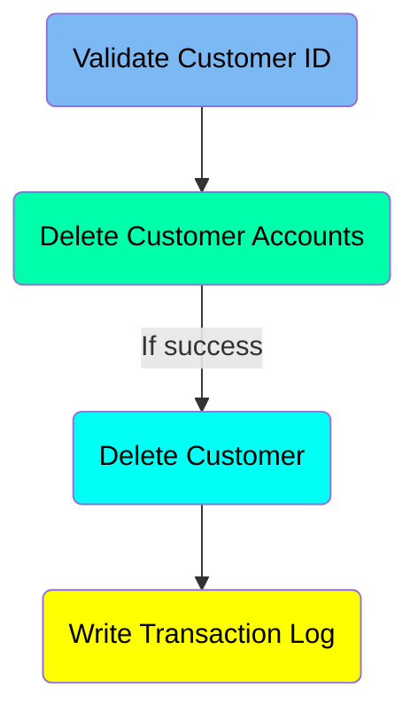

## <SwmToken path="src/webui/src/main/java/com/ibm/cics/cip/bankliberty/api/json/CustomerResource.java" pos="554:7:7" line-data="		Response myResponse = deleteCustomerInternal(id);">`deleteCustomerInternal`</SwmToken> function - Validate Customer ID

Here is a diagram of this part:

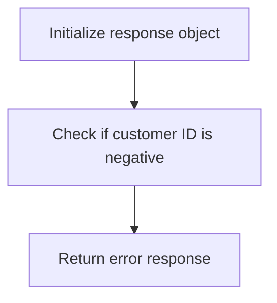

### Validating the customer ID

The function <SwmToken path="src/webui/src/main/java/com/ibm/cics/cip/bankliberty/api/json/CustomerResource.java" pos="554:7:7" line-data="		Response myResponse = deleteCustomerInternal(id);">`deleteCustomerInternal`</SwmToken> begins by initializing a <SwmToken path="src/webui/src/main/java/com/ibm/cics/cip/bankliberty/webui/data_access/Customer.java" pos="235:5:5" line-data="				myCustomer = JSONObject.parse(myCustomerString);">`JSONObject`</SwmToken> named <SwmToken path="src/webui/src/main/java/com/ibm/cics/cip/bankliberty/api/json/CustomerResource.java" pos="575:1:1" line-data="			response.put(JSON_ERROR_MSG, &quot;Customer number cannot be negative&quot;);">`response`</SwmToken> to store the response data.

<SwmSnippet path="/src/webui/src/main/java/com/ibm/cics/cip/bankliberty/api/json/CustomerResource.java" line="572">

---

Next, it checks if the provided customer ID (<SwmToken path="src/webui/src/main/java/com/ibm/cics/cip/bankliberty/api/json/CustomerResource.java" pos="572:4:4" line-data="		if (id.longValue() &lt; 0)">`id`</SwmToken>) is negative. This is done to ensure that the customer number is valid and non-negative.

```java
		if (id.longValue() < 0)
		{
```

---

</SwmSnippet>

<SwmSnippet path="/src/webui/src/main/java/com/ibm/cics/cip/bankliberty/api/json/CustomerResource.java" line="575">

---

If the customer ID is found to be negative, an error message is added to the <SwmToken path="src/webui/src/main/java/com/ibm/cics/cip/bankliberty/api/json/CustomerResource.java" pos="575:1:1" line-data="			response.put(JSON_ERROR_MSG, &quot;Customer number cannot be negative&quot;);">`response`</SwmToken> object indicating that the customer number cannot be negative. Subsequently, a <SwmToken path="src/webui/src/main/java/com/ibm/cics/cip/bankliberty/api/json/CustomerResource.java" pos="576:1:1" line-data="			Response myResponse = Response.status(404)">`Response`</SwmToken> object is created with a 404 status code and the error message, which is then logged and returned.

```java
			response.put(JSON_ERROR_MSG, "Customer number cannot be negative");
			Response myResponse = Response.status(404)
					.entity(response.toString()).build();
			logger.log(Level.WARNING,
					() -> "Customer number supplied was negative in deleteCustomerInternal()");
			logger.exiting(this.getClass().getName(),
					DELETE_CUSTOMER_INTERNAL_EXIT, myResponse);
			return myResponse;
```

---

</SwmSnippet>

## <SwmToken path="src/webui/src/main/java/com/ibm/cics/cip/bankliberty/api/json/CustomerResource.java" pos="554:7:7" line-data="		Response myResponse = deleteCustomerInternal(id);">`deleteCustomerInternal`</SwmToken> function - Delete Customer Accounts

Here is a diagram of this part:

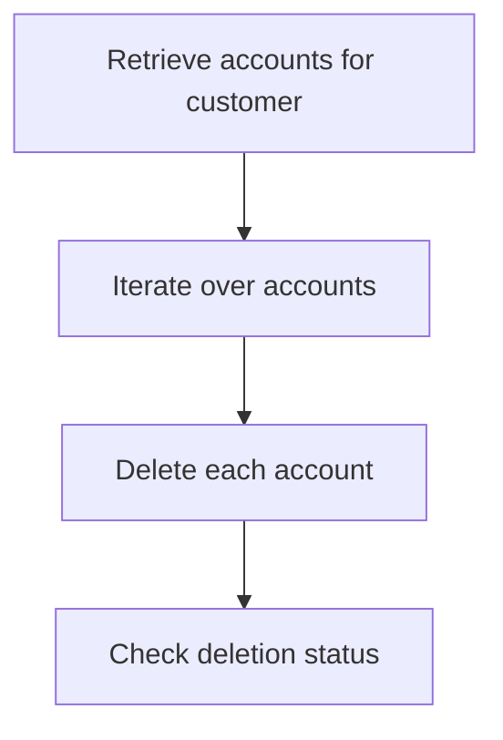

<SwmSnippet path="/src/webui/src/main/java/com/ibm/cics/cip/bankliberty/api/json/CustomerResource.java" line="584">

---

### Deleting customer accounts

The function begins by retrieving all accounts associated with the customer using the <SwmToken path="src/webui/src/main/java/com/ibm/cics/cip/bankliberty/api/json/CustomerResource.java" pos="593:2:2" line-data="					.getAccountsByCustomerInternal(id).getEntity().toString());">`getAccountsByCustomerInternal`</SwmToken> method. This method queries the database and returns a JSON object containing the account details.

```java

		// First we need to delete all the accounts

		AccountsResource myAccountsResource = new AccountsResource();

		JSONObject myAccountsJSON;
		try
		{
			myAccountsJSON = JSONObject.parse(myAccountsResource
					.getAccountsByCustomerInternal(id).getEntity().toString());

```

---

</SwmSnippet>

<SwmSnippet path="/src/webui/src/main/java/com/ibm/cics/cip/bankliberty/api/json/CustomerResource.java" line="595">

---

Next, the function iterates over the list of accounts to delete each one individually. For each account, it calls the <SwmToken path="src/webui/src/main/java/com/ibm/cics/cip/bankliberty/api/json/CustomerResource.java" pos="606:2:2" line-data="						.deleteAccountInternal(accountToDeleteLong);">`deleteAccountInternal`</SwmToken> method, which handles the deletion process and returns a response indicating the success or failure of the operation.

```java
			//
			JSONArray accountsToDelete = (JSONArray) myAccountsJSON
					.get("accounts");
			for (int i = 0; i < accountsToDelete.size(); i++)
			{

				JSONObject accountToDelete = (JSONObject) accountsToDelete
						.get(i);
				Long accountToDeleteLong = Long
						.parseLong((String) accountToDelete.get(JSON_ID));
				Response deleteAccountResponse = myAccountsResource
						.deleteAccountInternal(accountToDeleteLong);

```

---

</SwmSnippet>

## <SwmToken path="src/webui/src/main/java/com/ibm/cics/cip/bankliberty/api/json/CustomerResource.java" pos="554:7:7" line-data="		Response myResponse = deleteCustomerInternal(id);">`deleteCustomerInternal`</SwmToken> function - Delete Customer

Here is a diagram of this part:

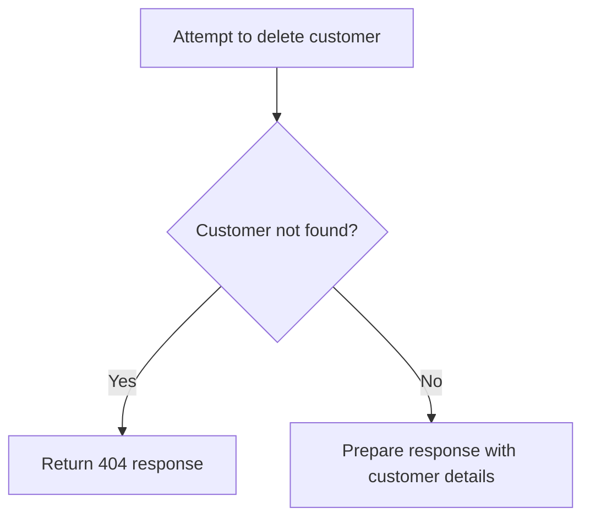

<SwmSnippet path="/src/webui/src/main/java/com/ibm/cics/cip/bankliberty/api/json/CustomerResource.java" line="661">

---

### Attempting to delete the customer

The function attempts to delete the customer by calling the <SwmToken path="src/webui/src/main/java/com/ibm/cics/cip/bankliberty/api/json/CustomerResource.java" pos="663:7:7" line-data="		vsamCustomer = vsamCustomer.deleteCustomer(id, sortCode);">`deleteCustomer`</SwmToken> method on the <SwmToken path="src/webui/src/main/java/com/ibm/cics/cip/bankliberty/api/json/CustomerResource.java" pos="661:17:17" line-data="		com.ibm.cics.cip.bankliberty.web.vsam.Customer vsamCustomer = new com.ibm.cics.cip.bankliberty.web.vsam.Customer();">`vsamCustomer`</SwmToken> object, passing the customer ID and sort code.

```java
		com.ibm.cics.cip.bankliberty.web.vsam.Customer vsamCustomer = new com.ibm.cics.cip.bankliberty.web.vsam.Customer();

		vsamCustomer = vsamCustomer.deleteCustomer(id, sortCode);
```

---

</SwmSnippet>

<SwmSnippet path="/src/webui/src/main/java/com/ibm/cics/cip/bankliberty/api/json/CustomerResource.java" line="665">

---

### Handling customer not found error

If the customer is not found, indicated by the <SwmToken path="src/webui/src/main/java/com/ibm/cics/cip/bankliberty/api/json/CustomerResource.java" pos="665:6:6" line-data="		if (vsamCustomer.isNotFound())">`isNotFound`</SwmToken> method on the <SwmToken path="src/webui/src/main/java/com/ibm/cics/cip/bankliberty/api/json/CustomerResource.java" pos="665:4:4" line-data="		if (vsamCustomer.isNotFound())">`vsamCustomer`</SwmToken> object, the function prepares a JSON response with an error message and returns a 404 status code.

```java
		if (vsamCustomer.isNotFound())
		{
			response.put(JSON_ERROR_MSG, CUSTOMER_PREFIX + id + NOT_FOUND_MSG);
			Response myResponse = Response.status(404)
					.entity(response.toString()).build();
			logger.log(Level.WARNING,
					() -> "CustomerResource.deleteCustomerInternal() customer "
							+ id + NOT_FOUND_MSG);
			logger.exiting(this.getClass().getName(), DELETE_CUSTOMER_INTERNAL,
					myResponse);
			return myResponse;
```

---

</SwmSnippet>

<SwmSnippet path="/src/webui/src/main/java/com/ibm/cics/cip/bankliberty/api/json/CustomerResource.java" line="677">

---

### Preparing the response with customer details

If the customer is successfully deleted, the function prepares a JSON response with the customer's details, including sort code, customer number, name, address, date of birth, credit score, and review date.

```java
		response.put(JSON_SORT_CODE, vsamCustomer.getSortcode().trim());
		response.put(JSON_ID, vsamCustomer.getCustomerNumber().trim());
		response.put(JSON_CUSTOMER_NAME, vsamCustomer.getName().trim());
		response.put(JSON_CUSTOMER_ADDRESS, vsamCustomer.getAddress().trim());

		response.put(JSON_DATE_OF_BIRTH, vsamCustomer.getDob().toString());

		response.put(JSON_CUSTOMER_CREDIT_SCORE, vsamCustomer.getCreditScore());
		response.put(JSON_CUSTOMER_REVIEW_DATE,
				vsamCustomer.getReviewDate().toString());
```

---

</SwmSnippet>

## <SwmToken path="src/webui/src/main/java/com/ibm/cics/cip/bankliberty/api/json/CustomerResource.java" pos="554:7:7" line-data="		Response myResponse = deleteCustomerInternal(id);">`deleteCustomerInternal`</SwmToken> function - Write Transaction Log

Here is a diagram of this part:

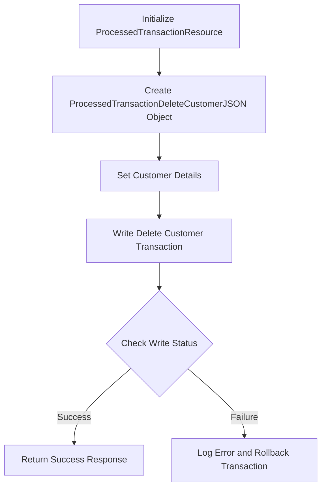

<SwmSnippet path="/src/webui/src/main/java/com/ibm/cics/cip/bankliberty/api/json/CustomerResource.java" line="688">

---

### Initialize <SwmToken path="src/webui/src/main/java/com/ibm/cics/cip/bankliberty/api/json/CustomerResource.java" pos="688:1:1" line-data="		ProcessedTransactionResource myProcessedTransactionResource = new ProcessedTransactionResource();">`ProcessedTransactionResource`</SwmToken>

The <SwmToken path="src/webui/src/main/java/com/ibm/cics/cip/bankliberty/api/json/CustomerResource.java" pos="688:1:1" line-data="		ProcessedTransactionResource myProcessedTransactionResource = new ProcessedTransactionResource();">`ProcessedTransactionResource`</SwmToken> is initialized to handle the transaction logging for the customer deletion process.

```java
		ProcessedTransactionResource myProcessedTransactionResource = new ProcessedTransactionResource();

```

---

</SwmSnippet>

<SwmSnippet path="/src/webui/src/main/java/com/ibm/cics/cip/bankliberty/api/json/CustomerResource.java" line="690">

---

### Create <SwmToken path="src/webui/src/main/java/com/ibm/cics/cip/bankliberty/api/json/CustomerResource.java" pos="690:1:1" line-data="		ProcessedTransactionDeleteCustomerJSON myDeletedCustomer = new ProcessedTransactionDeleteCustomerJSON();">`ProcessedTransactionDeleteCustomerJSON`</SwmToken> Object

A <SwmToken path="src/webui/src/main/java/com/ibm/cics/cip/bankliberty/api/json/CustomerResource.java" pos="690:1:1" line-data="		ProcessedTransactionDeleteCustomerJSON myDeletedCustomer = new ProcessedTransactionDeleteCustomerJSON();">`ProcessedTransactionDeleteCustomerJSON`</SwmToken> object is created to store the details of the customer being deleted. This object will be used to log the transaction.

```java
		ProcessedTransactionDeleteCustomerJSON myDeletedCustomer = new ProcessedTransactionDeleteCustomerJSON();
```

---

</SwmSnippet>

<SwmSnippet path="/src/webui/src/main/java/com/ibm/cics/cip/bankliberty/api/json/CustomerResource.java" line="691">

---

### Set Customer Details

The details of the customer, such as account number, date of birth, name, sort code, and customer number, are set in the <SwmToken path="src/webui/src/main/java/com/ibm/cics/cip/bankliberty/api/json/CustomerResource.java" pos="690:1:1" line-data="		ProcessedTransactionDeleteCustomerJSON myDeletedCustomer = new ProcessedTransactionDeleteCustomerJSON();">`ProcessedTransactionDeleteCustomerJSON`</SwmToken> object. This ensures that all relevant information is captured for the transaction log.

```java
		myDeletedCustomer.setAccountNumber("0");
		myDeletedCustomer.setCustomerDOB(vsamCustomer.getDob());
		myDeletedCustomer.setCustomerName(vsamCustomer.getName());
		
		
		myDeletedCustomer.setSortCode(vsamCustomer.getSortcode());
		myDeletedCustomer.setCustomerNumber(vsamCustomer.getCustomerNumber());
```

---

</SwmSnippet>

<SwmSnippet path="/src/webui/src/main/java/com/ibm/cics/cip/bankliberty/api/json/CustomerResource.java" line="700">

---

### Write Delete Customer Transaction

The <SwmToken path="src/webui/src/main/java/com/ibm/cics/cip/bankliberty/api/json/CustomerResource.java" pos="701:2:2" line-data="				.writeDeleteCustomerInternal(myDeletedCustomer);">`writeDeleteCustomerInternal`</SwmToken> method of <SwmToken path="src/webui/src/main/java/com/ibm/cics/cip/bankliberty/api/json/CustomerResource.java" pos="688:1:1" line-data="		ProcessedTransactionResource myProcessedTransactionResource = new ProcessedTransactionResource();">`ProcessedTransactionResource`</SwmToken> is called with the <SwmToken path="src/webui/src/main/java/com/ibm/cics/cip/bankliberty/api/json/CustomerResource.java" pos="690:1:1" line-data="		ProcessedTransactionDeleteCustomerJSON myDeletedCustomer = new ProcessedTransactionDeleteCustomerJSON();">`ProcessedTransactionDeleteCustomerJSON`</SwmToken> object to log the customer deletion transaction. This step is crucial for maintaining data integrity and traceability.

```java
		Response writeDeleteCustomerResponse = myProcessedTransactionResource
				.writeDeleteCustomerInternal(myDeletedCustomer);
```

---

</SwmSnippet>

<SwmSnippet path="/src/webui/src/main/java/com/ibm/cics/cip/bankliberty/api/json/CustomerResource.java" line="702">

---

### Check Write Status

The status of the write operation is checked. If the write operation is not successful, an error message is logged, and the transaction is rolled back to maintain data consistency. A response indicating the failure is then returned.

```java
		if (writeDeleteCustomerResponse.getStatus() != 200)
		{
			JSONObject error = new JSONObject();
			error.put(JSON_ERROR_MSG, "Failed to write to PROCTRAN data store");
			try
			{
				logger.log(Level.SEVERE,
						() -> "Customer: deleteCustomer: Failed to write to proctran");
				Task.getTask().rollback();
			}
			catch (InvalidRequestException e)
			{
				logger.log(Level.SEVERE,
						() -> "Customer: deleteCustomer: Failed to rollback");
			}
			Response myResponse = Response.status(500).entity(error.toString())
					.build();
			logger.log(Level.WARNING,
					() -> "CustomerResource.deleteCustomerInternal() failed to write to proctran");
			logger.exiting(this.getClass().getName(), DELETE_CUSTOMER_INTERNAL,
					myResponse);
```

---

</SwmSnippet>

## Diving into the <SwmToken path="src/webui/src/main/java/com/ibm/cics/cip/bankliberty/api/json/CustomerResource.java" pos="593:2:2" line-data="					.getAccountsByCustomerInternal(id).getEntity().toString());">`getAccountsByCustomerInternal`</SwmToken> function

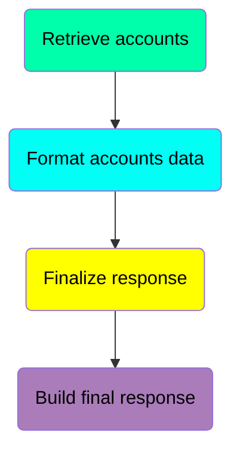

## <SwmToken path="src/webui/src/main/java/com/ibm/cics/cip/bankliberty/api/json/CustomerResource.java" pos="593:2:2" line-data="					.getAccountsByCustomerInternal(id).getEntity().toString());">`getAccountsByCustomerInternal`</SwmToken> function - Fetch customer details

Here is a diagram of this part:

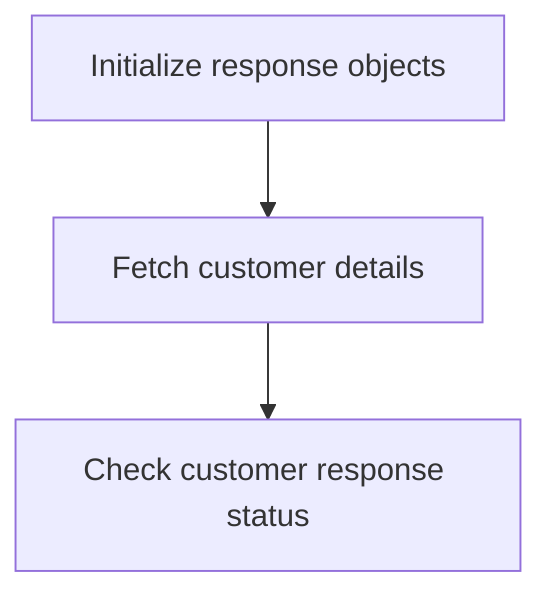

<SwmSnippet path="/src/webui/src/main/java/com/ibm/cics/cip/bankliberty/api/json/AccountsResource.java" line="498">

---

### Initializing response objects

The function begins by initializing several response-related objects. It sets <SwmToken path="src/webui/src/main/java/com/ibm/cics/cip/bankliberty/api/json/AccountsResource.java" pos="498:3:3" line-data="		JSONArray accounts = null;">`accounts`</SwmToken> to <SwmToken path="src/webui/src/main/java/com/ibm/cics/cip/bankliberty/api/json/AccountsResource.java" pos="498:7:7" line-data="		JSONArray accounts = null;">`null`</SwmToken>, prepares a <SwmToken path="src/webui/src/main/java/com/ibm/cics/cip/bankliberty/api/json/AccountsResource.java" pos="499:3:3" line-data="		Response myResponse = null;">`myResponse`</SwmToken> object, and creates a new <SwmToken path="src/webui/src/main/java/com/ibm/cics/cip/bankliberty/api/json/AccountsResource.java" pos="501:1:1" line-data="		JSONObject response = new JSONObject();">`JSONObject`</SwmToken> named <SwmToken path="src/webui/src/main/java/com/ibm/cics/cip/bankliberty/api/json/AccountsResource.java" pos="501:3:3" line-data="		JSONObject response = new JSONObject();">`response`</SwmToken>. Additionally, it retrieves the sort code by calling <SwmToken path="src/webui/src/main/java/com/ibm/cics/cip/bankliberty/api/json/AccountsResource.java" pos="502:7:11" line-data="		Integer sortCode = this.getSortCode();">`this.getSortCode()`</SwmToken> and initializes <SwmToken path="src/webui/src/main/java/com/ibm/cics/cip/bankliberty/api/json/AccountsResource.java" pos="503:3:3" line-data="		int numberOfAccounts = 0;">`numberOfAccounts`</SwmToken> to 0.

```java
		JSONArray accounts = null;
		Response myResponse = null;

		JSONObject response = new JSONObject();
		Integer sortCode = this.getSortCode();
		int numberOfAccounts = 0;

```

---

</SwmSnippet>

<SwmSnippet path="/src/webui/src/main/java/com/ibm/cics/cip/bankliberty/api/json/AccountsResource.java" line="505">

---

### Fetching customer details

Next, the function creates an instance of <SwmToken path="src/webui/src/main/java/com/ibm/cics/cip/bankliberty/api/json/AccountsResource.java" pos="505:1:1" line-data="		CustomerResource myCustomer = new CustomerResource();">`CustomerResource`</SwmToken> and calls <SwmToken path="src/webui/src/main/java/com/ibm/cics/cip/bankliberty/api/json/AccountsResource.java" pos="507:2:2" line-data="				.getCustomerInternal(customerNumber);">`getCustomerInternal`</SwmToken> with the provided <SwmToken path="src/webui/src/main/java/com/ibm/cics/cip/bankliberty/api/json/AccountsResource.java" pos="507:4:4" line-data="				.getCustomerInternal(customerNumber);">`customerNumber`</SwmToken> to fetch the customer details. The response from this call is stored in <SwmToken path="src/webui/src/main/java/com/ibm/cics/cip/bankliberty/api/json/AccountsResource.java" pos="506:3:3" line-data="		Response customerResponse = myCustomer">`customerResponse`</SwmToken>.

```java
		CustomerResource myCustomer = new CustomerResource();
		Response customerResponse = myCustomer
				.getCustomerInternal(customerNumber);
```

---

</SwmSnippet>

## <SwmToken path="src/webui/src/main/java/com/ibm/cics/cip/bankliberty/api/json/CustomerResource.java" pos="593:2:2" line-data="					.getAccountsByCustomerInternal(id).getEntity().toString());">`getAccountsByCustomerInternal`</SwmToken> function - Retrieve accounts

Here is a diagram of this part:

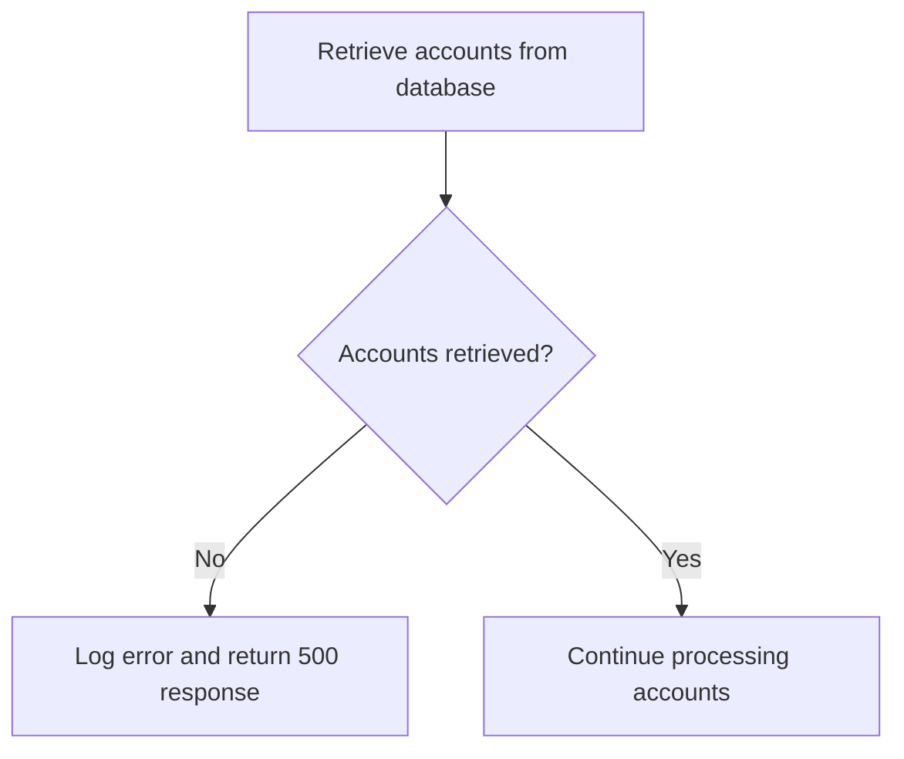

<SwmSnippet path="/src/webui/src/main/java/com/ibm/cics/cip/bankliberty/api/json/AccountsResource.java" line="544">

---

### Retrieving accounts from the database

The function retrieves all accounts associated with a given customer number and sort code from the database. This is done by calling <SwmToken path="src/webui/src/main/java/com/ibm/cics/cip/bankliberty/api/json/AccountsResource.java" pos="545:9:11" line-data="		Account[] myAccounts = db2Account.getAccounts(customerNumber.intValue(),">`db2Account.getAccounts`</SwmToken>`(`<SwmToken path="src/webui/src/main/java/com/ibm/cics/cip/bankliberty/api/json/AccountsResource.java" pos="545:13:17" line-data="		Account[] myAccounts = db2Account.getAccounts(customerNumber.intValue(),">`customerNumber.intValue()`</SwmToken>`, `<SwmToken path="src/webui/src/main/java/com/ibm/cics/cip/bankliberty/api/json/AccountsResource.java" pos="546:1:1" line-data="				sortCode);">`sortCode`</SwmToken>`)`, which constructs an SQL query, executes it, and maps the result set to an array of Account objects.

```java
		com.ibm.cics.cip.bankliberty.web.db2.Account db2Account = new Account();
		Account[] myAccounts = db2Account.getAccounts(customerNumber.intValue(),
				sortCode);
```

---

</SwmSnippet>

<SwmSnippet path="/src/webui/src/main/java/com/ibm/cics/cip/bankliberty/api/json/AccountsResource.java" line="547">

---

### Handling errors when accounts cannot be accessed

If the accounts cannot be accessed (i.e., <SwmToken path="src/webui/src/main/java/com/ibm/cics/cip/bankliberty/api/json/AccountsResource.java" pos="547:4:4" line-data="		if (myAccounts == null)">`myAccounts`</SwmToken> is null), the function logs an error message and returns a 500 response. This is done by creating a JSON error object with a message indicating that the accounts cannot be accessed for the specified customer number, logging the error, and building the response with a 500 status code.

```java
		if (myAccounts == null)
		{
			JSONObject error = new JSONObject();
			error.put(JSON_ERROR_MSG,
					"Accounts cannot be accessed for customer "
							+ customerNumber.longValue() + CLASS_NAME_MSG);
			logger.log(Level.SEVERE,
					() -> "Accounts cannot be accessed for customer "
							+ customerNumber.longValue() + CLASS_NAME_MSG);
			myResponse = Response.status(500).entity(error.toString()).build();
			logger.exiting(this.getClass().getName(),
					GET_ACCOUNTS_BY_CUSTOMER_INTERNAL, myResponse);
			return myResponse;
		}
```

---

</SwmSnippet>

## <SwmToken path="src/webui/src/main/java/com/ibm/cics/cip/bankliberty/api/json/CustomerResource.java" pos="593:2:2" line-data="					.getAccountsByCustomerInternal(id).getEntity().toString());">`getAccountsByCustomerInternal`</SwmToken> function - Format accounts data

Here is a diagram of this part:

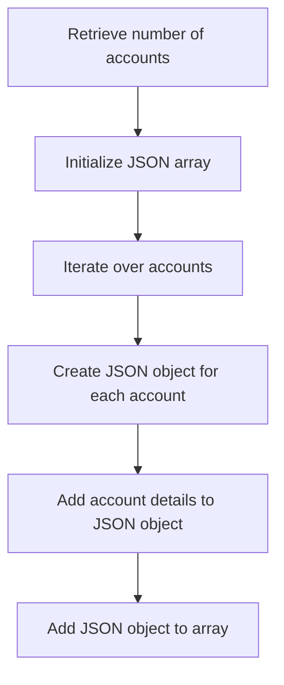

<SwmSnippet path="/src/webui/src/main/java/com/ibm/cics/cip/bankliberty/api/json/AccountsResource.java" line="562">

---

### Formatting account data into JSON objects

The function begins by determining the number of accounts retrieved and initializing a <SwmToken path="src/webui/src/main/java/com/ibm/cics/cip/bankliberty/api/json/AccountsResource.java" pos="563:7:7" line-data="		accounts = new JSONArray(numberOfAccounts);">`JSONArray`</SwmToken> with this number.

```java
		numberOfAccounts = myAccounts.length;
		accounts = new JSONArray(numberOfAccounts);
```

---

</SwmSnippet>

<SwmSnippet path="/src/webui/src/main/java/com/ibm/cics/cip/bankliberty/api/json/AccountsResource.java" line="564">

---

It then iterates over each account, creating a new <SwmToken path="src/webui/src/main/java/com/ibm/cics/cip/bankliberty/webui/data_access/Customer.java" pos="235:5:5" line-data="				myCustomer = JSONObject.parse(myCustomerString);">`JSONObject`</SwmToken> for each one.

```java
		for (int i = 0; i < numberOfAccounts; i++)
		{
```

---

</SwmSnippet>

<SwmSnippet path="/src/webui/src/main/java/com/ibm/cics/cip/bankliberty/api/json/AccountsResource.java" line="567">

---

For each account, various details such as sort code, account number, customer number, account type, available balance, actual balance, interest rate, overdraft limit, last statement date, next statement date, and date opened are added to the <SwmToken path="src/webui/src/main/java/com/ibm/cics/cip/bankliberty/api/json/AccountsResource.java" pos="567:1:1" line-data="			JSONObject account = new JSONObject();">`JSONObject`</SwmToken>.

```java
			JSONObject account = new JSONObject();
			account.put(JSON_SORT_CODE, myAccounts[i].getSortcode());
			account.put("id", myAccounts[i].getAccountNumber());
			account.put(JSON_CUSTOMER_NUMBER,
					myAccounts[i].getCustomerNumber());
			account.put(JSON_ACCOUNT_TYPE, myAccounts[i].getType());
			account.put(JSON_AVAILABLE_BALANCE,
					BigDecimal.valueOf(myAccounts[i].getAvailableBalance()));
			account.put(JSON_ACTUAL_BALANCE,
					BigDecimal.valueOf(myAccounts[i].getActualBalance()));
			account.put(JSON_INTEREST_RATE,
					BigDecimal.valueOf(myAccounts[i].getInterestRate()));
			account.put(JSON_OVERDRAFT, myAccounts[i].getOverdraftLimit());
			account.put(JSON_LAST_STATEMENT_DATE,
					myAccounts[i].getLastStatement().toString());
			account.put(JSON_NEXT_STATEMENT_DATE,
					myAccounts[i].getNextStatement().toString());
			account.put(JSON_DATE_OPENED, myAccounts[i].getOpened().toString());
```

---

</SwmSnippet>

<SwmSnippet path="/src/webui/src/main/java/com/ibm/cics/cip/bankliberty/api/json/AccountsResource.java" line="586">

---

Finally, the <SwmToken path="src/webui/src/main/java/com/ibm/cics/cip/bankliberty/webui/data_access/Customer.java" pos="235:5:5" line-data="				myCustomer = JSONObject.parse(myCustomerString);">`JSONObject`</SwmToken> representing the account is added to the <SwmToken path="src/webui/src/main/java/com/ibm/cics/cip/bankliberty/api/json/CustomerResource.java" pos="596:1:1" line-data="			JSONArray accountsToDelete = (JSONArray) myAccountsJSON">`JSONArray`</SwmToken>.

```java
			accounts.add(account);
		}
```

---

</SwmSnippet>

## <SwmToken path="src/webui/src/main/java/com/ibm/cics/cip/bankliberty/api/json/CustomerResource.java" pos="593:2:2" line-data="					.getAccountsByCustomerInternal(id).getEntity().toString());">`getAccountsByCustomerInternal`</SwmToken> function - Finalize response

Here is a diagram of this part:

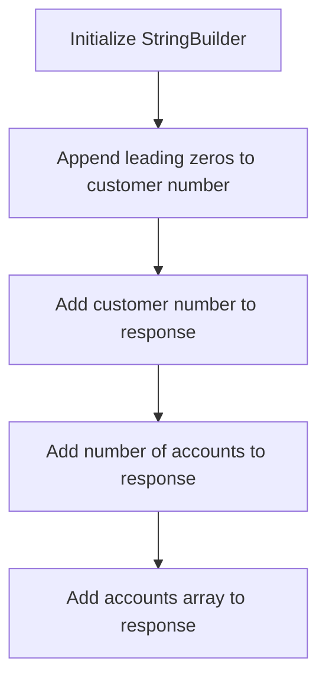

<SwmSnippet path="/src/webui/src/main/java/com/ibm/cics/cip/bankliberty/api/json/AccountsResource.java" line="588">

---

### Building the customer number string

The function initializes a <SwmToken path="src/webui/src/main/java/com/ibm/cics/cip/bankliberty/api/json/AccountsResource.java" pos="588:1:1" line-data="		StringBuilder myStringBuilder = new StringBuilder();">`StringBuilder`</SwmToken> to construct the customer number string with leading zeros. This ensures that the customer number has a consistent length for formatting purposes.

```java
		StringBuilder myStringBuilder = new StringBuilder();

```

---

</SwmSnippet>

<SwmSnippet path="/src/webui/src/main/java/com/ibm/cics/cip/bankliberty/api/json/AccountsResource.java" line="590">

---

The function then appends leading zeros to the <SwmToken path="src/webui/src/main/java/com/ibm/cics/cip/bankliberty/api/json/AccountsResource.java" pos="588:1:1" line-data="		StringBuilder myStringBuilder = new StringBuilder();">`StringBuilder`</SwmToken> until the customer number reaches the required length (<SwmToken path="src/webui/src/main/java/com/ibm/cics/cip/bankliberty/api/json/AccountsResource.java" pos="590:25:25" line-data="		for (int i = customerNumber.toString().length(); i &lt; CUSTOMER_NUMBER_LENGTH; i++)">`CUSTOMER_NUMBER_LENGTH`</SwmToken>). This step ensures that the customer number is properly formatted with leading zeros.

```java
		for (int i = customerNumber.toString().length(); i < CUSTOMER_NUMBER_LENGTH; i++)
		{
			myStringBuilder.append('0');
		}
```

---

</SwmSnippet>

<SwmSnippet path="/src/webui/src/main/java/com/ibm/cics/cip/bankliberty/api/json/AccountsResource.java" line="594">

---

After appending the leading zeros, the function adds the actual customer number to the <SwmToken path="src/webui/src/main/java/com/ibm/cics/cip/bankliberty/api/json/AccountsResource.java" pos="588:1:1" line-data="		StringBuilder myStringBuilder = new StringBuilder();">`StringBuilder`</SwmToken>. This completes the construction of the formatted customer number string.

```java
		myStringBuilder.append(customerNumber.toString());

```

---

</SwmSnippet>

<SwmSnippet path="/src/webui/src/main/java/com/ibm/cics/cip/bankliberty/api/json/AccountsResource.java" line="596">

---

### Finalizing the response

The function adds the formatted customer number string to the response JSON object under the key <SwmToken path="src/webui/src/main/java/com/ibm/cics/cip/bankliberty/api/json/AccountsResource.java" pos="596:5:5" line-data="		response.put(JSON_CUSTOMER_NUMBER, myStringBuilder.toString());">`JSON_CUSTOMER_NUMBER`</SwmToken>. This ensures that the response includes the properly formatted customer number.

```java
		response.put(JSON_CUSTOMER_NUMBER, myStringBuilder.toString());
```

---

</SwmSnippet>

<SwmSnippet path="/src/webui/src/main/java/com/ibm/cics/cip/bankliberty/api/json/AccountsResource.java" line="597">

---

Next, the function adds the number of accounts to the response JSON object under the key <SwmToken path="src/webui/src/main/java/com/ibm/cics/cip/bankliberty/api/json/AccountsResource.java" pos="597:5:5" line-data="		response.put(JSON_NUMBER_OF_ACCOUNTS, numberOfAccounts);">`JSON_NUMBER_OF_ACCOUNTS`</SwmToken>. This provides the client with the total number of accounts associated with the customer.

```java
		response.put(JSON_NUMBER_OF_ACCOUNTS, numberOfAccounts);
```

---

</SwmSnippet>

<SwmSnippet path="/src/webui/src/main/java/com/ibm/cics/cip/bankliberty/api/json/AccountsResource.java" line="598">

---

Finally, the function adds the array of account details to the response JSON object under the key <SwmToken path="src/webui/src/main/java/com/ibm/cics/cip/bankliberty/api/json/AccountsResource.java" pos="598:5:5" line-data="		response.put(JSON_ACCOUNTS, accounts);">`JSON_ACCOUNTS`</SwmToken>. This includes all the account information retrieved for the customer.

```java
		response.put(JSON_ACCOUNTS, accounts);
```

---

</SwmSnippet>

## <SwmToken path="src/webui/src/main/java/com/ibm/cics/cip/bankliberty/api/json/CustomerResource.java" pos="593:2:2" line-data="					.getAccountsByCustomerInternal(id).getEntity().toString());">`getAccountsByCustomerInternal`</SwmToken> function - Build final response

Here is a diagram of this part:

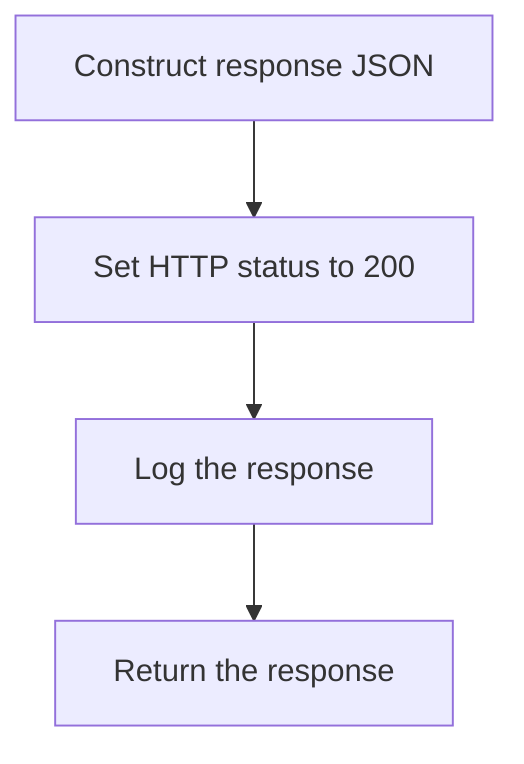

### Setting the HTTP status

### Constructing the final response

After gathering all necessary account and customer information, the function constructs a JSON object named <SwmToken path="src/webui/src/main/java/com/ibm/cics/cip/bankliberty/api/json/CustomerResource.java" pos="575:1:1" line-data="			response.put(JSON_ERROR_MSG, &quot;Customer number cannot be negative&quot;);">`response`</SwmToken> that includes the customer number, number of accounts, and the accounts array.

<SwmSnippet path="/src/webui/src/main/java/com/ibm/cics/cip/bankliberty/api/json/AccountsResource.java" line="600">

---

The function then sets the HTTP status of the response to 200, indicating a successful operation.

```java
		myResponse = Response.status(200).entity(response.toString()).build();
```

---

</SwmSnippet>

<SwmSnippet path="/src/webui/src/main/java/com/ibm/cics/cip/bankliberty/api/json/AccountsResource.java" line="601">

---

### Logging the response

Before returning the response, the function logs the response details for auditing and debugging purposes.

```java
		logger.exiting(this.getClass().getName(),
				GET_ACCOUNTS_BY_CUSTOMER_INTERNAL, myResponse);
```

---

</SwmSnippet>

<SwmSnippet path="/src/webui/src/main/java/com/ibm/cics/cip/bankliberty/api/json/AccountsResource.java" line="603">

---

### Returning the response

Finally, the function returns the constructed response to the client, completing the process.

```java
		return myResponse;
```

---

</SwmSnippet>

## Breaking down <SwmToken path="src/webui/src/main/java/com/ibm/cics/cip/bankliberty/api/json/CustomerResource.java" pos="606:2:2" line-data="						.deleteAccountInternal(accountToDeleteLong);">`deleteAccountInternal`</SwmToken>

```mermaid
graph TD
  subgraph deleteAccountInternal
    deleteAccountInternal:A["Retrieve sort code for the account"] --> deleteAccountInternal:B["Delete account using account number and sort code"]
    deleteAccountInternal:C["Account found?"]
    deleteAccountInternal:C -->|Yes| deleteAccountInternal:D["Collect deleted account details into JSON response"]
    deleteAccountInternal:D --> deleteAccountInternal:E["Call ProcessedTransactionResource's writeDeleteAccountInternal with the deleted account details"]
    deleteAccountInternal:E --> deleteAccountInternal:F["Transaction successful?"]
    deleteAccountInternal:F -->|Yes| deleteAccountInternal:G["Generate HTTP 200 Response"]
    deleteAccountInternal:F -->|No| deleteAccountInternal:H["Log error and rollback transaction and Generate HTTP 500 Response"]
    deleteAccountInternal:C -->|No| deleteAccountInternal:I["Log information and rollback transaction and Generate HTTP 404 Response"]
  end

%% Swimm:
%% graph TD
%%   subgraph <SwmToken path="src/webui/src/main/java/com/ibm/cics/cip/bankliberty/api/json/CustomerResource.java" pos="606:2:2" line-data="						.deleteAccountInternal(accountToDeleteLong);">`deleteAccountInternal`</SwmToken>
%%     <SwmToken path="src/webui/src/main/java/com/ibm/cics/cip/bankliberty/api/json/CustomerResource.java" pos="606:2:2" line-data="						.deleteAccountInternal(accountToDeleteLong);">`deleteAccountInternal`</SwmToken>:A["Retrieve sort code for the account"] --> <SwmToken path="src/webui/src/main/java/com/ibm/cics/cip/bankliberty/api/json/CustomerResource.java" pos="606:2:2" line-data="						.deleteAccountInternal(accountToDeleteLong);">`deleteAccountInternal`</SwmToken>:B["Delete account using account number and sort code"]
%%     <SwmToken path="src/webui/src/main/java/com/ibm/cics/cip/bankliberty/api/json/CustomerResource.java" pos="606:2:2" line-data="						.deleteAccountInternal(accountToDeleteLong);">`deleteAccountInternal`</SwmToken>:C["Account found?"]
%%     <SwmToken path="src/webui/src/main/java/com/ibm/cics/cip/bankliberty/api/json/CustomerResource.java" pos="606:2:2" line-data="						.deleteAccountInternal(accountToDeleteLong);">`deleteAccountInternal`</SwmToken>:C -->|Yes| <SwmToken path="src/webui/src/main/java/com/ibm/cics/cip/bankliberty/api/json/CustomerResource.java" pos="606:2:2" line-data="						.deleteAccountInternal(accountToDeleteLong);">`deleteAccountInternal`</SwmToken>:D["Collect deleted account details into JSON response"]
%%     <SwmToken path="src/webui/src/main/java/com/ibm/cics/cip/bankliberty/api/json/CustomerResource.java" pos="606:2:2" line-data="						.deleteAccountInternal(accountToDeleteLong);">`deleteAccountInternal`</SwmToken>:D --> <SwmToken path="src/webui/src/main/java/com/ibm/cics/cip/bankliberty/api/json/CustomerResource.java" pos="606:2:2" line-data="						.deleteAccountInternal(accountToDeleteLong);">`deleteAccountInternal`</SwmToken>:E["Call <SwmToken path="src/webui/src/main/java/com/ibm/cics/cip/bankliberty/api/json/CustomerResource.java" pos="688:1:1" line-data="		ProcessedTransactionResource myProcessedTransactionResource = new ProcessedTransactionResource();">`ProcessedTransactionResource`</SwmToken>'s <SwmToken path="src/webui/src/main/java/com/ibm/cics/cip/bankliberty/api/json/AccountsResource.java" pos="1288:2:2" line-data="					.writeDeleteAccountInternal(myDeletedAccount);">`writeDeleteAccountInternal`</SwmToken> with the deleted account details"]
%%     <SwmToken path="src/webui/src/main/java/com/ibm/cics/cip/bankliberty/api/json/CustomerResource.java" pos="606:2:2" line-data="						.deleteAccountInternal(accountToDeleteLong);">`deleteAccountInternal`</SwmToken>:E --> <SwmToken path="src/webui/src/main/java/com/ibm/cics/cip/bankliberty/api/json/CustomerResource.java" pos="606:2:2" line-data="						.deleteAccountInternal(accountToDeleteLong);">`deleteAccountInternal`</SwmToken>:F["Transaction successful?"]
%%     <SwmToken path="src/webui/src/main/java/com/ibm/cics/cip/bankliberty/api/json/CustomerResource.java" pos="606:2:2" line-data="						.deleteAccountInternal(accountToDeleteLong);">`deleteAccountInternal`</SwmToken>:F -->|Yes| <SwmToken path="src/webui/src/main/java/com/ibm/cics/cip/bankliberty/api/json/CustomerResource.java" pos="606:2:2" line-data="						.deleteAccountInternal(accountToDeleteLong);">`deleteAccountInternal`</SwmToken>:G["Generate HTTP 200 Response"]
%%     <SwmToken path="src/webui/src/main/java/com/ibm/cics/cip/bankliberty/api/json/CustomerResource.java" pos="606:2:2" line-data="						.deleteAccountInternal(accountToDeleteLong);">`deleteAccountInternal`</SwmToken>:F -->|No| <SwmToken path="src/webui/src/main/java/com/ibm/cics/cip/bankliberty/api/json/CustomerResource.java" pos="606:2:2" line-data="						.deleteAccountInternal(accountToDeleteLong);">`deleteAccountInternal`</SwmToken>:H["Log error and rollback transaction and Generate HTTP 500 Response"]
%%     <SwmToken path="src/webui/src/main/java/com/ibm/cics/cip/bankliberty/api/json/CustomerResource.java" pos="606:2:2" line-data="						.deleteAccountInternal(accountToDeleteLong);">`deleteAccountInternal`</SwmToken>:C -->|No| <SwmToken path="src/webui/src/main/java/com/ibm/cics/cip/bankliberty/api/json/CustomerResource.java" pos="606:2:2" line-data="						.deleteAccountInternal(accountToDeleteLong);">`deleteAccountInternal`</SwmToken>:I["Log information and rollback transaction and Generate HTTP 404 Response"]
%%   end
```

<SwmSnippet path="/src/webui/src/main/java/com/ibm/cics/cip/bankliberty/api/json/AccountsResource.java" line="1252">

---

## Removing the account from the database

First, the <SwmToken path="src/webui/src/main/java/com/ibm/cics/cip/bankliberty/api/json/CustomerResource.java" pos="606:2:2" line-data="						.deleteAccountInternal(accountToDeleteLong);">`deleteAccountInternal`</SwmToken> method attempts to remove an account from the database based on the provided account number and sort code. It retrieves the account details to ensure the account exists before proceeding with the deletion.

```java
		db2Account = db2Account.deleteAccount(accountNumber.intValue(),
				sortCode.intValue());
```

---

</SwmSnippet>

<SwmSnippet path="/src/webui/src/main/java/com/ibm/cics/cip/bankliberty/api/json/AccountsResource.java" line="1274">

---

## Processing the deletion transaction

Next, the method processes the deletion transaction by interacting with the <SwmToken path="src/webui/src/main/java/com/ibm/cics/cip/bankliberty/api/json/AccountsResource.java" pos="1274:1:1" line-data="			ProcessedTransactionResource myProcessedTransactionResource = new ProcessedTransactionResource();">`ProcessedTransactionResource`</SwmToken>. It passes necessary account details such as sort code, account number, and balance to ensure the transaction is recorded correctly.

```java
			ProcessedTransactionResource myProcessedTransactionResource = new ProcessedTransactionResource();

			ProcessedTransactionAccountJSON myDeletedAccount = new ProcessedTransactionAccountJSON();
			myDeletedAccount.setAccountNumber(db2Account.getAccountNumber());
			myDeletedAccount.setType(db2Account.getType());
			myDeletedAccount.setCustomerNumber(db2Account.getCustomerNumber());

			myDeletedAccount.setSortCode(db2Account.getSortcode());
			myDeletedAccount.setNextStatement(db2Account.getNextStatement());
			myDeletedAccount.setLastStatement(db2Account.getLastStatement());
			myDeletedAccount.setActualBalance(
					BigDecimal.valueOf(db2Account.getActualBalance()));

			Response deletedAccountResponse = myProcessedTransactionResource
					.writeDeleteAccountInternal(myDeletedAccount);
```

---

</SwmSnippet>

<SwmSnippet path="/src/webui/src/main/java/com/ibm/cics/cip/bankliberty/api/json/AccountsResource.java" line="1289">

---

## Handling errors and responses

Then, the method handles potential errors during the deletion process. If the deletion transaction fails, it logs the error, performs a rollback, and returns a 500 status response. If the account is not found, it logs the issue, performs a rollback, and returns a 404 status response.

```java
			if (deletedAccountResponse == null
					|| deletedAccountResponse.getStatus() != 200)
			{
				JSONObject error = new JSONObject();
				error.put(JSON_ERROR_MSG, PROCTRAN_WRITE_FAILURE);
				logger.log(Level.SEVERE, () -> PROCTRAN_WRITE_FAILURE);
				try
				{
					Task.getTask().rollback();
				}
				catch (InvalidRequestException e)
				{
					logger.log(Level.SEVERE, () -> PROCTRAN_WRITE_FAILURE);
				}
				myResponse = Response.status(500).entity(error.toString())
						.build();
				logger.exiting(this.getClass().getName(), DELETE_ACCOUNT,
						myResponse);
				return myResponse;
			}
		}
```

---

</SwmSnippet>

<SwmSnippet path="/src/webui/src/main/java/com/ibm/cics/cip/bankliberty/api/json/AccountsResource.java" line="1335">

---

## Returning the final response

Finally, if the deletion is successful, the method constructs a response with the details of the deleted account and returns a 200 status response.

```java
		myResponse = Response.status(200).entity(response.toString()).build();
		logger.exiting(this.getClass().getName(), DELETE_ACCOUNT, myResponse);
		return myResponse;
```

---

</SwmSnippet>

## Zooming into <SwmToken path="src/webui/src/main/java/com/ibm/cics/cip/bankliberty/api/json/AccountsResource.java" pos="1252:7:7" line-data="		db2Account = db2Account.deleteAccount(accountNumber.intValue(),">`deleteAccount`</SwmToken> & <SwmToken path="src/webui/src/main/java/com/ibm/cics/cip/bankliberty/web/db2/Account.java" pos="650:9:9" line-data="		Account db2Account = this.getAccount(account, sortcode);">`getAccount`</SwmToken>

```mermaid
graph TD
  subgraph deleteAccount
    deleteAccount:A["Fetch account details"] --> deleteAccount:B["Check if account exists"]
    deleteAccount:B -->|Exists| deleteAccount:C["Format account and sort code"]
    deleteAccount:C --> deleteAccount:D["Perform SQL delete operation"]
    deleteAccount:D --> deleteAccount:E["Return deleted account details"]
    deleteAccount:B -->|Does not exist| deleteAccount:F["Return null"]
  end
  subgraph getAccount
    getAccount:A["Open database connection"] --> getAccount:B["Format account and sort code"]
    getAccount:B --> getAccount:C["Check account number special case"]
    getAccount:C -->|Special case| getAccount:D["Perform special SQL query"]
    getAccount:D --> getAccount:E["Return account details if found"]
    getAccount:C -->|Regular case| getAccount:F["Perform regular SQL query"]
    getAccount:F --> getAccount:G["Return account details if found"]
    getAccount:D -->|No results| getAccount:H["Return null"]
    getAccount:G -->|No results| getAccount:H
  end
  deleteAccount:A --> getAccount

%% Swimm:
%% graph TD
%%   subgraph <SwmToken path="src/webui/src/main/java/com/ibm/cics/cip/bankliberty/api/json/AccountsResource.java" pos="1252:7:7" line-data="		db2Account = db2Account.deleteAccount(accountNumber.intValue(),">`deleteAccount`</SwmToken>
%%     <SwmToken path="src/webui/src/main/java/com/ibm/cics/cip/bankliberty/api/json/AccountsResource.java" pos="1252:7:7" line-data="		db2Account = db2Account.deleteAccount(accountNumber.intValue(),">`deleteAccount`</SwmToken>:A["Fetch account details"] --> <SwmToken path="src/webui/src/main/java/com/ibm/cics/cip/bankliberty/api/json/AccountsResource.java" pos="1252:7:7" line-data="		db2Account = db2Account.deleteAccount(accountNumber.intValue(),">`deleteAccount`</SwmToken>:B["Check if account exists"]
%%     <SwmToken path="src/webui/src/main/java/com/ibm/cics/cip/bankliberty/api/json/AccountsResource.java" pos="1252:7:7" line-data="		db2Account = db2Account.deleteAccount(accountNumber.intValue(),">`deleteAccount`</SwmToken>:B -->|Exists| <SwmToken path="src/webui/src/main/java/com/ibm/cics/cip/bankliberty/api/json/AccountsResource.java" pos="1252:7:7" line-data="		db2Account = db2Account.deleteAccount(accountNumber.intValue(),">`deleteAccount`</SwmToken>:C["Format account and sort code"]
%%     <SwmToken path="src/webui/src/main/java/com/ibm/cics/cip/bankliberty/api/json/AccountsResource.java" pos="1252:7:7" line-data="		db2Account = db2Account.deleteAccount(accountNumber.intValue(),">`deleteAccount`</SwmToken>:C --> <SwmToken path="src/webui/src/main/java/com/ibm/cics/cip/bankliberty/api/json/AccountsResource.java" pos="1252:7:7" line-data="		db2Account = db2Account.deleteAccount(accountNumber.intValue(),">`deleteAccount`</SwmToken>:D["Perform SQL delete operation"]
%%     <SwmToken path="src/webui/src/main/java/com/ibm/cics/cip/bankliberty/api/json/AccountsResource.java" pos="1252:7:7" line-data="		db2Account = db2Account.deleteAccount(accountNumber.intValue(),">`deleteAccount`</SwmToken>:D --> <SwmToken path="src/webui/src/main/java/com/ibm/cics/cip/bankliberty/api/json/AccountsResource.java" pos="1252:7:7" line-data="		db2Account = db2Account.deleteAccount(accountNumber.intValue(),">`deleteAccount`</SwmToken>:E["Return deleted account details"]
%%     <SwmToken path="src/webui/src/main/java/com/ibm/cics/cip/bankliberty/api/json/AccountsResource.java" pos="1252:7:7" line-data="		db2Account = db2Account.deleteAccount(accountNumber.intValue(),">`deleteAccount`</SwmToken>:B -->|Does not exist| <SwmToken path="src/webui/src/main/java/com/ibm/cics/cip/bankliberty/api/json/AccountsResource.java" pos="1252:7:7" line-data="		db2Account = db2Account.deleteAccount(accountNumber.intValue(),">`deleteAccount`</SwmToken>:F["Return null"]
%%   end
%%   subgraph <SwmToken path="src/webui/src/main/java/com/ibm/cics/cip/bankliberty/web/db2/Account.java" pos="650:9:9" line-data="		Account db2Account = this.getAccount(account, sortcode);">`getAccount`</SwmToken>
%%     <SwmToken path="src/webui/src/main/java/com/ibm/cics/cip/bankliberty/web/db2/Account.java" pos="650:9:9" line-data="		Account db2Account = this.getAccount(account, sortcode);">`getAccount`</SwmToken>:A["Open database connection"] --> <SwmToken path="src/webui/src/main/java/com/ibm/cics/cip/bankliberty/web/db2/Account.java" pos="650:9:9" line-data="		Account db2Account = this.getAccount(account, sortcode);">`getAccount`</SwmToken>:B["Format account and sort code"]
%%     <SwmToken path="src/webui/src/main/java/com/ibm/cics/cip/bankliberty/web/db2/Account.java" pos="650:9:9" line-data="		Account db2Account = this.getAccount(account, sortcode);">`getAccount`</SwmToken>:B --> <SwmToken path="src/webui/src/main/java/com/ibm/cics/cip/bankliberty/web/db2/Account.java" pos="650:9:9" line-data="		Account db2Account = this.getAccount(account, sortcode);">`getAccount`</SwmToken>:C["Check account number special case"]
%%     <SwmToken path="src/webui/src/main/java/com/ibm/cics/cip/bankliberty/web/db2/Account.java" pos="650:9:9" line-data="		Account db2Account = this.getAccount(account, sortcode);">`getAccount`</SwmToken>:C -->|Special case| <SwmToken path="src/webui/src/main/java/com/ibm/cics/cip/bankliberty/web/db2/Account.java" pos="650:9:9" line-data="		Account db2Account = this.getAccount(account, sortcode);">`getAccount`</SwmToken>:D["Perform special SQL query"]
%%     <SwmToken path="src/webui/src/main/java/com/ibm/cics/cip/bankliberty/web/db2/Account.java" pos="650:9:9" line-data="		Account db2Account = this.getAccount(account, sortcode);">`getAccount`</SwmToken>:D --> <SwmToken path="src/webui/src/main/java/com/ibm/cics/cip/bankliberty/web/db2/Account.java" pos="650:9:9" line-data="		Account db2Account = this.getAccount(account, sortcode);">`getAccount`</SwmToken>:E["Return account details if found"]
%%     <SwmToken path="src/webui/src/main/java/com/ibm/cics/cip/bankliberty/web/db2/Account.java" pos="650:9:9" line-data="		Account db2Account = this.getAccount(account, sortcode);">`getAccount`</SwmToken>:C -->|Regular case| <SwmToken path="src/webui/src/main/java/com/ibm/cics/cip/bankliberty/web/db2/Account.java" pos="650:9:9" line-data="		Account db2Account = this.getAccount(account, sortcode);">`getAccount`</SwmToken>:F["Perform regular SQL query"]
%%     <SwmToken path="src/webui/src/main/java/com/ibm/cics/cip/bankliberty/web/db2/Account.java" pos="650:9:9" line-data="		Account db2Account = this.getAccount(account, sortcode);">`getAccount`</SwmToken>:F --> <SwmToken path="src/webui/src/main/java/com/ibm/cics/cip/bankliberty/web/db2/Account.java" pos="650:9:9" line-data="		Account db2Account = this.getAccount(account, sortcode);">`getAccount`</SwmToken>:G["Return account details if found"]
%%     <SwmToken path="src/webui/src/main/java/com/ibm/cics/cip/bankliberty/web/db2/Account.java" pos="650:9:9" line-data="		Account db2Account = this.getAccount(account, sortcode);">`getAccount`</SwmToken>:D -->|No results| <SwmToken path="src/webui/src/main/java/com/ibm/cics/cip/bankliberty/web/db2/Account.java" pos="650:9:9" line-data="		Account db2Account = this.getAccount(account, sortcode);">`getAccount`</SwmToken>:H["Return null"]
%%     <SwmToken path="src/webui/src/main/java/com/ibm/cics/cip/bankliberty/web/db2/Account.java" pos="650:9:9" line-data="		Account db2Account = this.getAccount(account, sortcode);">`getAccount`</SwmToken>:G -->|No results| <SwmToken path="src/webui/src/main/java/com/ibm/cics/cip/bankliberty/web/db2/Account.java" pos="650:9:9" line-data="		Account db2Account = this.getAccount(account, sortcode);">`getAccount`</SwmToken>:H
%%   end
%%   <SwmToken path="src/webui/src/main/java/com/ibm/cics/cip/bankliberty/api/json/AccountsResource.java" pos="1252:7:7" line-data="		db2Account = db2Account.deleteAccount(accountNumber.intValue(),">`deleteAccount`</SwmToken>:A --> <SwmToken path="src/webui/src/main/java/com/ibm/cics/cip/bankliberty/web/db2/Account.java" pos="650:9:9" line-data="		Account db2Account = this.getAccount(account, sortcode);">`getAccount`</SwmToken>
```

<SwmSnippet path="/src/webui/src/main/java/com/ibm/cics/cip/bankliberty/web/db2/Account.java" line="647">

---

## Retrieving Account Details

First, the <SwmToken path="src/webui/src/main/java/com/ibm/cics/cip/bankliberty/web/db2/Account.java" pos="647:5:5" line-data="	public Account deleteAccount(int account, int sortcode)">`deleteAccount`</SwmToken> method retrieves the account details based on the provided account number and sort code. This is done by calling the <SwmToken path="src/webui/src/main/java/com/ibm/cics/cip/bankliberty/web/db2/Account.java" pos="650:9:9" line-data="		Account db2Account = this.getAccount(account, sortcode);">`getAccount`</SwmToken> method, which queries the database to find the account matching the given criteria. If the account is not found, the method exits early and returns null.

```java
	public Account deleteAccount(int account, int sortcode)
	{
		logger.entering(this.getClass().getName(), DELETE_ACCOUNT);
		Account db2Account = this.getAccount(account, sortcode);
		if (db2Account == null)
		{
			logger.exiting(this.getClass().getName(), DELETE_ACCOUNT, null);
			return null;
		}
```

---

</SwmSnippet>

<SwmSnippet path="/src/webui/src/main/java/com/ibm/cics/cip/bankliberty/web/db2/Account.java" line="677">

---

## Deleting the Account

Next, if the account is found, the method proceeds to delete the account from the database. It constructs the SQL DELETE statement and executes it to remove the account record. This ensures that the account is permanently deleted from the system.

```java
		String sql1 = SQL_SELECT;
		String sql2 = "DELETE from ACCOUNT where ACCOUNT_EYECATCHER LIKE 'ACCT' AND ACCOUNT_NUMBER like ? and ACCOUNT_SORTCODE like ?";
		try (PreparedStatement stmt = conn.prepareStatement(sql1);
				PreparedStatement stmt2 = conn.prepareStatement(sql2);)
		{
			logger.log(Level.FINE, () -> PRE_SELECT_MSG + sql1 + ">");

			stmt.setString(1, accountNumberString);
			stmt.setString(2, sortCodeString);
			
			
			ResultSet rs = stmt.executeQuery();
			while (rs.next())
			{
				temp = new Account(rs.getString(ACCOUNT_CUSTOMER_NUMBER),
						rs.getString(ACCOUNT_SORTCODE),
						rs.getString(ACCOUNT_NUMBER),
						rs.getString(ACCOUNT_TYPE),
						rs.getDouble(ACCOUNT_INTEREST_RATE),
						rs.getDate(ACCOUNT_OPENED),
						rs.getInt(ACCOUNT_OVERDRAFT_LIMIT),
```

---

</SwmSnippet>

## Inside <SwmToken path="src/webui/src/main/java/com/ibm/cics/cip/bankliberty/api/json/AccountsResource.java" pos="1288:2:2" line-data="					.writeDeleteAccountInternal(myDeletedAccount);">`writeDeleteAccountInternal`</SwmToken> & <SwmToken path="src/webui/src/main/java/com/ibm/cics/cip/bankliberty/api/json/ProcessedTransactionResource.java" pos="430:6:6" line-data="		if (myProcessedTransactionDB2.writeDeleteAccount(">`writeDeleteAccount`</SwmToken>

```mermaid
graph TD
  subgraph writeDeleteAccountInternal
    writeDeleteAccountInternal:A["Create ProcessedTransaction object"] --> writeDeleteAccountInternal:B["Call writeDeleteAccount with account details"]
    writeDeleteAccountInternal:B --> writeDeleteAccountInternal:C{"Is account deleted?"}
    writeDeleteAccountInternal:C -->|Yes| writeDeleteAccountInternal:D["Return OK response"]
    writeDeleteAccountInternal:C -->|No| writeDeleteAccountInternal:E["Return server error response"]
  end
  subgraph writeDeleteAccount
    writeDeleteAccount:A["Initialize and set account details"] --> writeDeleteAccount:B["Get current time and set last and next statement dates"]
    writeDeleteAccount:B --> writeDeleteAccount:C["Prepare SQL statement for account deletion"]
    writeDeleteAccount:C --> writeDeleteAccount:D["Execute SQL statement"]
    writeDeleteAccount:D --> writeDeleteAccount:E{"SQL execution successful?"}
    writeDeleteAccount:E -->|Yes| writeDeleteAccount:F["Return true"]
    writeDeleteAccount:E -->|No| writeDeleteAccount:G["Handle SQL exception and return false"]
  end
  writeDeleteAccountInternal:B --> writeDeleteAccount

%% Swimm:
%% graph TD
%%   subgraph <SwmToken path="src/webui/src/main/java/com/ibm/cics/cip/bankliberty/api/json/AccountsResource.java" pos="1288:2:2" line-data="					.writeDeleteAccountInternal(myDeletedAccount);">`writeDeleteAccountInternal`</SwmToken>
%%     <SwmToken path="src/webui/src/main/java/com/ibm/cics/cip/bankliberty/api/json/AccountsResource.java" pos="1288:2:2" line-data="					.writeDeleteAccountInternal(myDeletedAccount);">`writeDeleteAccountInternal`</SwmToken>:A["Create <SwmToken path="src/webui/src/main/java/com/ibm/cics/cip/bankliberty/api/json/ProcessedTransactionResource.java" pos="429:15:15" line-data="		com.ibm.cics.cip.bankliberty.web.db2.ProcessedTransaction myProcessedTransactionDB2 = new com.ibm.cics.cip.bankliberty.web.db2.ProcessedTransaction();">`ProcessedTransaction`</SwmToken> object"] --> <SwmToken path="src/webui/src/main/java/com/ibm/cics/cip/bankliberty/api/json/AccountsResource.java" pos="1288:2:2" line-data="					.writeDeleteAccountInternal(myDeletedAccount);">`writeDeleteAccountInternal`</SwmToken>:B["Call <SwmToken path="src/webui/src/main/java/com/ibm/cics/cip/bankliberty/api/json/ProcessedTransactionResource.java" pos="430:6:6" line-data="		if (myProcessedTransactionDB2.writeDeleteAccount(">`writeDeleteAccount`</SwmToken> with account details"]
%%     <SwmToken path="src/webui/src/main/java/com/ibm/cics/cip/bankliberty/api/json/AccountsResource.java" pos="1288:2:2" line-data="					.writeDeleteAccountInternal(myDeletedAccount);">`writeDeleteAccountInternal`</SwmToken>:B --> <SwmToken path="src/webui/src/main/java/com/ibm/cics/cip/bankliberty/api/json/AccountsResource.java" pos="1288:2:2" line-data="					.writeDeleteAccountInternal(myDeletedAccount);">`writeDeleteAccountInternal`</SwmToken>:C{"Is account deleted?"}
%%     <SwmToken path="src/webui/src/main/java/com/ibm/cics/cip/bankliberty/api/json/AccountsResource.java" pos="1288:2:2" line-data="					.writeDeleteAccountInternal(myDeletedAccount);">`writeDeleteAccountInternal`</SwmToken>:C -->|Yes| <SwmToken path="src/webui/src/main/java/com/ibm/cics/cip/bankliberty/api/json/AccountsResource.java" pos="1288:2:2" line-data="					.writeDeleteAccountInternal(myDeletedAccount);">`writeDeleteAccountInternal`</SwmToken>:D["Return OK response"]
%%     <SwmToken path="src/webui/src/main/java/com/ibm/cics/cip/bankliberty/api/json/AccountsResource.java" pos="1288:2:2" line-data="					.writeDeleteAccountInternal(myDeletedAccount);">`writeDeleteAccountInternal`</SwmToken>:C -->|No| <SwmToken path="src/webui/src/main/java/com/ibm/cics/cip/bankliberty/api/json/AccountsResource.java" pos="1288:2:2" line-data="					.writeDeleteAccountInternal(myDeletedAccount);">`writeDeleteAccountInternal`</SwmToken>:E["Return server error response"]
%%   end
%%   subgraph <SwmToken path="src/webui/src/main/java/com/ibm/cics/cip/bankliberty/api/json/ProcessedTransactionResource.java" pos="430:6:6" line-data="		if (myProcessedTransactionDB2.writeDeleteAccount(">`writeDeleteAccount`</SwmToken>
%%     <SwmToken path="src/webui/src/main/java/com/ibm/cics/cip/bankliberty/api/json/ProcessedTransactionResource.java" pos="430:6:6" line-data="		if (myProcessedTransactionDB2.writeDeleteAccount(">`writeDeleteAccount`</SwmToken>:A["Initialize and set account details"] --> <SwmToken path="src/webui/src/main/java/com/ibm/cics/cip/bankliberty/api/json/ProcessedTransactionResource.java" pos="430:6:6" line-data="		if (myProcessedTransactionDB2.writeDeleteAccount(">`writeDeleteAccount`</SwmToken>:B["Get current time and set last and next statement dates"]
%%     <SwmToken path="src/webui/src/main/java/com/ibm/cics/cip/bankliberty/api/json/ProcessedTransactionResource.java" pos="430:6:6" line-data="		if (myProcessedTransactionDB2.writeDeleteAccount(">`writeDeleteAccount`</SwmToken>:B --> <SwmToken path="src/webui/src/main/java/com/ibm/cics/cip/bankliberty/api/json/ProcessedTransactionResource.java" pos="430:6:6" line-data="		if (myProcessedTransactionDB2.writeDeleteAccount(">`writeDeleteAccount`</SwmToken>:C["Prepare SQL statement for account deletion"]
%%     <SwmToken path="src/webui/src/main/java/com/ibm/cics/cip/bankliberty/api/json/ProcessedTransactionResource.java" pos="430:6:6" line-data="		if (myProcessedTransactionDB2.writeDeleteAccount(">`writeDeleteAccount`</SwmToken>:C --> <SwmToken path="src/webui/src/main/java/com/ibm/cics/cip/bankliberty/api/json/ProcessedTransactionResource.java" pos="430:6:6" line-data="		if (myProcessedTransactionDB2.writeDeleteAccount(">`writeDeleteAccount`</SwmToken>:D["Execute SQL statement"]
%%     <SwmToken path="src/webui/src/main/java/com/ibm/cics/cip/bankliberty/api/json/ProcessedTransactionResource.java" pos="430:6:6" line-data="		if (myProcessedTransactionDB2.writeDeleteAccount(">`writeDeleteAccount`</SwmToken>:D --> <SwmToken path="src/webui/src/main/java/com/ibm/cics/cip/bankliberty/api/json/ProcessedTransactionResource.java" pos="430:6:6" line-data="		if (myProcessedTransactionDB2.writeDeleteAccount(">`writeDeleteAccount`</SwmToken>:E{"SQL execution successful?"}
%%     <SwmToken path="src/webui/src/main/java/com/ibm/cics/cip/bankliberty/api/json/ProcessedTransactionResource.java" pos="430:6:6" line-data="		if (myProcessedTransactionDB2.writeDeleteAccount(">`writeDeleteAccount`</SwmToken>:E -->|Yes| <SwmToken path="src/webui/src/main/java/com/ibm/cics/cip/bankliberty/api/json/ProcessedTransactionResource.java" pos="430:6:6" line-data="		if (myProcessedTransactionDB2.writeDeleteAccount(">`writeDeleteAccount`</SwmToken>:F["Return true"]
%%     <SwmToken path="src/webui/src/main/java/com/ibm/cics/cip/bankliberty/api/json/ProcessedTransactionResource.java" pos="430:6:6" line-data="		if (myProcessedTransactionDB2.writeDeleteAccount(">`writeDeleteAccount`</SwmToken>:E -->|No| <SwmToken path="src/webui/src/main/java/com/ibm/cics/cip/bankliberty/api/json/ProcessedTransactionResource.java" pos="430:6:6" line-data="		if (myProcessedTransactionDB2.writeDeleteAccount(">`writeDeleteAccount`</SwmToken>:G["Handle SQL exception and return false"]
%%   end
%%   <SwmToken path="src/webui/src/main/java/com/ibm/cics/cip/bankliberty/api/json/AccountsResource.java" pos="1288:2:2" line-data="					.writeDeleteAccountInternal(myDeletedAccount);">`writeDeleteAccountInternal`</SwmToken>:B --> <SwmToken path="src/webui/src/main/java/com/ibm/cics/cip/bankliberty/api/json/ProcessedTransactionResource.java" pos="430:6:6" line-data="		if (myProcessedTransactionDB2.writeDeleteAccount(">`writeDeleteAccount`</SwmToken>
```

<SwmSnippet path="/src/webui/src/main/java/com/ibm/cics/cip/bankliberty/api/json/ProcessedTransactionResource.java" line="426">

---

## Processing the deletion transaction

First, the <SwmToken path="src/webui/src/main/java/com/ibm/cics/cip/bankliberty/api/json/ProcessedTransactionResource.java" pos="426:5:5" line-data="	public Response writeDeleteAccountInternal(">`writeDeleteAccountInternal`</SwmToken> method in <SwmToken path="src/webui/src/main/java/com/ibm/cics/cip/bankliberty/api/json/CustomerResource.java" pos="688:1:1" line-data="		ProcessedTransactionResource myProcessedTransactionResource = new ProcessedTransactionResource();">`ProcessedTransactionResource`</SwmToken> is called to handle the deletion of a bank account. This method receives the account details in the form of a <SwmToken path="src/webui/src/main/java/com/ibm/cics/cip/bankliberty/api/json/ProcessedTransactionResource.java" pos="427:1:1" line-data="			ProcessedTransactionAccountJSON myDeletedAccount)">`ProcessedTransactionAccountJSON`</SwmToken> object.

```java
	public Response writeDeleteAccountInternal(
			ProcessedTransactionAccountJSON myDeletedAccount)
```

---

</SwmSnippet>

<SwmSnippet path="/src/webui/src/main/java/com/ibm/cics/cip/bankliberty/api/json/ProcessedTransactionResource.java" line="429">

---

## Preparing the SQL statement

Next, the method creates an instance of <SwmToken path="src/webui/src/main/java/com/ibm/cics/cip/bankliberty/api/json/ProcessedTransactionResource.java" pos="429:15:15" line-data="		com.ibm.cics.cip.bankliberty.web.db2.ProcessedTransaction myProcessedTransactionDB2 = new com.ibm.cics.cip.bankliberty.web.db2.ProcessedTransaction();">`ProcessedTransaction`</SwmToken> and calls its <SwmToken path="src/webui/src/main/java/com/ibm/cics/cip/bankliberty/api/json/ProcessedTransactionResource.java" pos="430:6:6" line-data="		if (myProcessedTransactionDB2.writeDeleteAccount(">`writeDeleteAccount`</SwmToken> method, passing the necessary account details such as sort code, account number, actual balance, last statement date, next statement date, customer number, and account type.

```java
		com.ibm.cics.cip.bankliberty.web.db2.ProcessedTransaction myProcessedTransactionDB2 = new com.ibm.cics.cip.bankliberty.web.db2.ProcessedTransaction();
		if (myProcessedTransactionDB2.writeDeleteAccount(
				myDeletedAccount.getSortCode(),
				myDeletedAccount.getAccountNumber(),
				myDeletedAccount.getActualBalance(),
				myDeletedAccount.getLastStatement(),
				myDeletedAccount.getNextStatement(),
				myDeletedAccount.getCustomerNumber(),
				myDeletedAccount.getType()))
```

---

</SwmSnippet>

<SwmSnippet path="/src/webui/src/main/java/com/ibm/cics/cip/bankliberty/web/db2/ProcessedTransaction.java" line="752">

---

## Executing the SQL command

Then, the <SwmToken path="src/webui/src/main/java/com/ibm/cics/cip/bankliberty/web/db2/ProcessedTransaction.java" pos="752:5:5" line-data="	public boolean writeDeleteAccount(String sortCode2, String accountNumber,">`writeDeleteAccount`</SwmToken> method in <SwmToken path="src/webui/src/main/java/com/ibm/cics/cip/bankliberty/api/json/ProcessedTransactionResource.java" pos="429:15:15" line-data="		com.ibm.cics.cip.bankliberty.web.db2.ProcessedTransaction myProcessedTransactionDB2 = new com.ibm.cics.cip.bankliberty.web.db2.ProcessedTransaction();">`ProcessedTransaction`</SwmToken> processes the deletion transaction by setting the necessary account details and timestamps. It prepares a SQL statement to delete the record from the database and executes the SQL command. If the operation is successful, it returns `true`; otherwise, it returns `false`.

```java
	public boolean writeDeleteAccount(String sortCode2, String accountNumber,
			BigDecimal actualBalance, Date lastStatement, Date nextStatement,
			String customerNumber, String accountType)
	{
		logger.entering(this.getClass().getName(), WRITE_DELETE_ACCOUNT);

		PROCTRAN myPROCTRAN = new PROCTRAN();

		Calendar myCalendar = Calendar.getInstance();
		myCalendar.setTime(lastStatement);

		myPROCTRAN.setProcDescDelaccLastDd(myCalendar.get(Calendar.DATE));
		myPROCTRAN.setProcDescDelaccLastMm(myCalendar.get(Calendar.MONTH) + 1);
		myPROCTRAN.setProcDescDelaccLastYyyy(myCalendar.get(Calendar.YEAR));

		myCalendar.setTime(nextStatement);
		myPROCTRAN.setProcDescDelaccNextDd(myCalendar.get(Calendar.DATE));
		myPROCTRAN.setProcDescDelaccNextMm(myCalendar.get(Calendar.MONTH) + 1);
		myPROCTRAN.setProcDescDelaccNextYyyy(myCalendar.get(Calendar.YEAR));
		myPROCTRAN.setProcDescDelaccAcctype(accountType);
		myPROCTRAN.setProcDescDelaccCustomer(Integer.parseInt(customerNumber));
```

---

</SwmSnippet>

<SwmSnippet path="/src/webui/src/main/java/com/ibm/cics/cip/bankliberty/api/json/ProcessedTransactionResource.java" line="438">

---

## Returning the response

Finally, based on the result of the <SwmToken path="src/webui/src/main/java/com/ibm/cics/cip/bankliberty/api/json/ProcessedTransactionResource.java" pos="430:6:6" line-data="		if (myProcessedTransactionDB2.writeDeleteAccount(">`writeDeleteAccount`</SwmToken> method, <SwmToken path="src/webui/src/main/java/com/ibm/cics/cip/bankliberty/api/json/AccountsResource.java" pos="1288:2:2" line-data="					.writeDeleteAccountInternal(myDeletedAccount);">`writeDeleteAccountInternal`</SwmToken> returns an appropriate HTTP response. If the deletion was successful, it returns an `OK` response; otherwise, it returns a <SwmToken path="src/webui/src/main/java/com/ibm/cics/cip/bankliberty/api/json/ProcessedTransactionResource.java" pos="443:5:5" line-data="			return Response.serverError().build();">`serverError`</SwmToken> response.

```java
		{
			return Response.ok().build();
		}
		else
		{
			return Response.serverError().build();
		}
```

---

</SwmSnippet>

&nbsp;

*This is an auto-generated document by Swimm 🌊 and has not yet been verified by a human*

<SwmMeta version="3.0.0" repo-id="Z2l0aHViJTNBJTNBY2ljcy1iYW5raW5nLXNhbXBsZS1hcHBsaWNhdGlvbi1jYnNhLUlCTS1EZW1vJTNBJTNBU3dpbW0tRGVtbw==" repo-name="cics-banking-sample-application-cbsa-IBM-Demo"><sup>Powered by [Swimm](/)</sup></SwmMeta>
