The INQCUST program is used to handle customer inquiries within the banking system. It plays a crucial role in retrieving and processing customer information from the VSAM file. The program achieves this by setting up abend handling, initializing inquiry codes, setting required sort codes and customer numbers, and performing various checks and operations to retrieve and process customer data.

The INQCUST program starts by setting up abend handling to manage any abnormal terminations. It then initializes the inquiry success and failure codes and sets the required sort code and customer number based on input values. The program checks if the customer number is 0 or 9, and if so, retrieves the last customer number from the NCS or generates a random customer number. It then reads customer information from the VSAM file and processes the data based on the success of the inquiry. If successful, the customer data is moved to the commarea for further processing.

# Where is this program used?

This program is used multiple times in the codebase as represented in the following diagram:

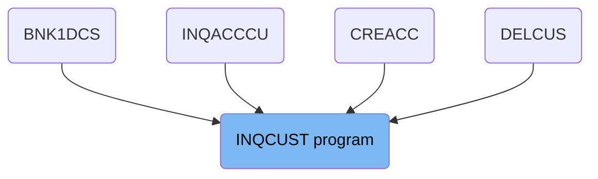

## PREMIERE

Lets' zoom into this section of the flow:

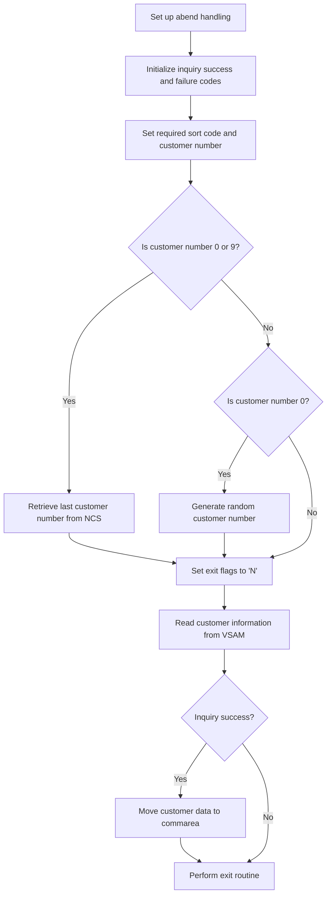

<SwmSnippet path="/src/base/cobol_src/INQCUST.cbl" line="171">

---

### Set up abend handling

First, the program sets up abend handling to ensure that any abnormal terminations are properly managed.

```cobol
           EXEC CICS HANDLE ABEND
              LABEL(ABEND-HANDLING)
           END-EXEC.
```

---

</SwmSnippet>

<SwmSnippet path="/src/base/cobol_src/INQCUST.cbl" line="175">

---

### Initialize inquiry success and failure codes

Next, the inquiry success and failure codes are initialized to 'N' and '0' respectively, preparing the system for a new inquiry.

```cobol
           MOVE 'N' TO INQCUST-INQ-SUCCESS
           MOVE '0' TO INQCUST-INQ-FAIL-CD

```

---

</SwmSnippet>

<SwmSnippet path="/src/base/cobol_src/INQCUST.cbl" line="178">

---

### Set required sort code and customer number

The required sort code and customer number are then set based on the input values.

```cobol
           MOVE SORTCODE TO REQUIRED-SORT-CODE.
           MOVE INQCUST-CUSTNO TO REQUIRED-CUST-NUMBER.
```

---

</SwmSnippet>

<SwmSnippet path="/src/base/cobol_src/INQCUST.cbl" line="190">

---

### Check if customer number is 0 or 9

The program checks if the customer number is set to 0 or 9. If it is, it retrieves the last customer number from the NCS.

```cobol
           IF INQCUST-CUSTNO = 0000000000 OR INQCUST-CUSTNO = 9999999999
              PERFORM READ-CUSTOMER-NCS
      D       DISPLAY 'CUST NO RETURNED FROM NCS=' NCS-CUST-NO-VALUE
              IF INQCUST-INQ-SUCCESS = 'Y'
                MOVE NCS-CUST-NO-VALUE TO REQUIRED-CUST-NUMBER
              ELSE
                PERFORM GET-ME-OUT-OF-HERE
              END-IF
           END-IF.
```

---

</SwmSnippet>

<SwmSnippet path="/src/base/cobol_src/INQCUST.cbl" line="204">

---

### Generate random customer number

If the customer number is 0, a random customer number is generated.

```cobol
           IF INQCUST-CUSTNO = 0000000000
              PERFORM GENERATE-RANDOM-CUSTOMER
              MOVE RANDOM-CUSTOMER TO REQUIRED-CUST-NUMBER
           END-IF.
```

---

</SwmSnippet>

<SwmSnippet path="/src/base/cobol_src/INQCUST.cbl" line="215">

---

### Read customer information from VSAM

The program then reads the customer information from the VSAM file until the read is successful.

```cobol
           PERFORM READ-CUSTOMER-VSAM
             UNTIL EXIT-VSAM-READ = 'Y'.
```

---

</SwmSnippet>

<SwmSnippet path="/src/base/cobol_src/INQCUST.cbl" line="220">

---

### Move customer data to commarea

If the inquiry is successful, the customer data is moved to the commarea for further processing.

```cobol
           IF INQCUST-INQ-SUCCESS = 'Y'
             MOVE '0' TO INQCUST-INQ-FAIL-CD
             MOVE CUSTOMER-EYECATCHER OF OUTPUT-DATA
                TO INQCUST-EYE
             MOVE CUSTOMER-SORTCODE OF OUTPUT-DATA
                TO INQCUST-SCODE
             MOVE CUSTOMER-NUMBER OF OUTPUT-DATA
                TO INQCUST-CUSTNO
             MOVE CUSTOMER-NAME OF OUTPUT-DATA
                TO INQCUST-NAME
             MOVE CUSTOMER-ADDRESS OF OUTPUT-DATA
                TO INQCUST-ADDR
             MOVE CUSTOMER-DATE-OF-BIRTH OF OUTPUT-DATA
                TO INQCUST-DOB
             MOVE CUSTOMER-CREDIT-SCORE OF OUTPUT-DATA
                TO INQCUST-CREDIT-SCORE
             MOVE CUSTOMER-CS-REVIEW-DATE OF OUTPUT-DATA
                TO INQCUST-CS-REVIEW-DT
```

---

</SwmSnippet>

## <SwmToken path="src/base/cobol_src/INQCUST.cbl" pos="191:3:7" line-data="              PERFORM READ-CUSTOMER-NCS">`READ-CUSTOMER-NCS`</SwmToken>

Lets' zoom into this section of the flow:

```mermaid
graph TD
  A[Retrieve last customer number] --> B{Check if retrieval was successful}
  B -- Yes --> C[Move customer number to NCS-CUST-NO-VALUE]
  B -- No --> D[End section]

%% Swimm:
%% graph TD
%%   A[Retrieve last customer number] --> B{Check if retrieval was successful}
%%   B -- Yes --> C[Move customer number to <SwmToken path="src/base/cobol_src/INQCUST.cbl" pos="192:18:24" line-data="      D       DISPLAY &#39;CUST NO RETURNED FROM NCS=&#39; NCS-CUST-NO-VALUE">`NCS-CUST-NO-VALUE`</SwmToken>]
%%   B -- No --> D[End section]
```

<SwmSnippet path="/src/base/cobol_src/INQCUST.cbl" line="251">

---

First, the section performs the <SwmToken path="src/base/cobol_src/INQCUST.cbl" pos="251:3:9" line-data="           PERFORM GET-LAST-CUSTOMER-VSAM">`GET-LAST-CUSTOMER-VSAM`</SwmToken> operation to retrieve the last customer number in use.

```cobol
           PERFORM GET-LAST-CUSTOMER-VSAM
```

---

</SwmSnippet>

<SwmSnippet path="/src/base/cobol_src/INQCUST.cbl" line="252">

---

Next, it checks if the retrieval was successful by evaluating if <SwmToken path="src/base/cobol_src/INQCUST.cbl" pos="252:3:7" line-data="           IF INQCUST-INQ-SUCCESS = &#39;Y&#39;">`INQCUST-INQ-SUCCESS`</SwmToken> is 'Y'. If successful, it moves the retrieved customer number (<SwmToken path="src/base/cobol_src/INQCUST.cbl" pos="253:3:7" line-data="             MOVE REQUIRED-CUST-NUMBER2 TO NCS-CUST-NO-VALUE">`REQUIRED-CUST-NUMBER2`</SwmToken>) to <SwmToken path="src/base/cobol_src/INQCUST.cbl" pos="253:11:17" line-data="             MOVE REQUIRED-CUST-NUMBER2 TO NCS-CUST-NO-VALUE">`NCS-CUST-NO-VALUE`</SwmToken>.

```cobol
           IF INQCUST-INQ-SUCCESS = 'Y'
             MOVE REQUIRED-CUST-NUMBER2 TO NCS-CUST-NO-VALUE
           END-IF.
```

---

</SwmSnippet>

## <SwmToken path="src/base/cobol_src/INQCUST.cbl" pos="251:3:9" line-data="           PERFORM GET-LAST-CUSTOMER-VSAM">`GET-LAST-CUSTOMER-VSAM`</SwmToken>

Lets' zoom into this section of the flow:

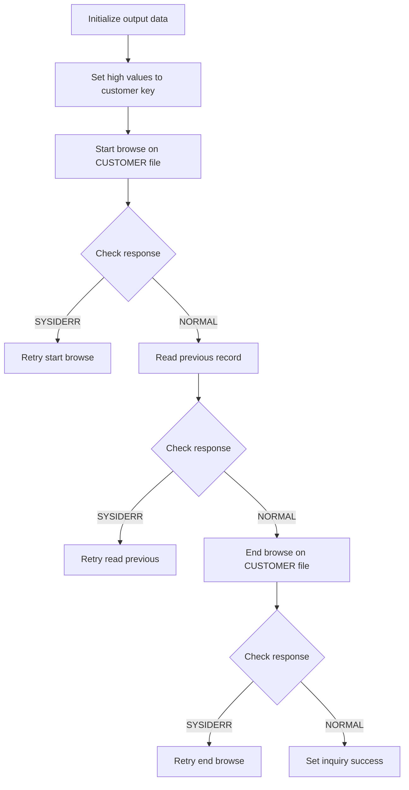

<SwmSnippet path="/src/base/cobol_src/INQCUST.cbl" line="570">

---

First, the output data is initialized to ensure that any previous data is cleared.

```cobol
           INITIALIZE OUTPUT-DATA.
```

---

</SwmSnippet>

<SwmSnippet path="/src/base/cobol_src/INQCUST.cbl" line="572">

---

Next, high values are assigned to <SwmToken path="src/base/cobol_src/INQCUST.cbl" pos="572:9:11" line-data="           MOVE HIGH-VALUES TO CUSTOMER-KY2.">`CUSTOMER-KY2`</SwmToken> (the customer key) to prepare for the browse operation.

```cobol
           MOVE HIGH-VALUES TO CUSTOMER-KY2.
```

---

</SwmSnippet>

<SwmSnippet path="/src/base/cobol_src/INQCUST.cbl" line="574">

---

Then, a browse operation is started on the CUSTOMER file using the <SwmToken path="src/base/cobol_src/INQCUST.cbl" pos="574:5:5" line-data="           EXEC CICS STARTBR FILE(&#39;CUSTOMER&#39;)">`STARTBR`</SwmToken> command with the customer key.

```cobol
           EXEC CICS STARTBR FILE('CUSTOMER')
                RIDFLD(CUSTOMER-KY2)
                RESP(WS-CICS-RESP)
                RESP2(WS-CICS-RESP2)
           END-EXEC.
```

---

</SwmSnippet>

<SwmSnippet path="/src/base/cobol_src/INQCUST.cbl" line="580">

---

If the response indicates a <SwmToken path="src/base/cobol_src/INQCUST.cbl" pos="580:13:13" line-data="           IF WS-CICS-RESP = DFHRESP(SYSIDERR)">`SYSIDERR`</SwmToken>, the operation retries up to 100 times with a delay of 3 seconds between each attempt.

```cobol
           IF WS-CICS-RESP = DFHRESP(SYSIDERR)
              PERFORM VARYING SYSIDERR-RETRY FROM 1 BY 1
              UNTIL SYSIDERR-RETRY > 100
              OR WS-CICS-RESP = DFHRESP(NORMAL)
              OR WS-CICS-RESP IS NOT EQUAL TO DFHRESP(SYSIDERR)

                 EXEC CICS DELAY FOR SECONDS(3)
                 END-EXEC

                 EXEC CICS STARTBR FILE('CUSTOMER')
                    RIDFLD(CUSTOMER-KY2)
                    RESP(WS-CICS-RESP)
                    RESP2(WS-CICS-RESP2)
                 END-EXEC

              END-PERFORM
```

---

</SwmSnippet>

<SwmSnippet path="/src/base/cobol_src/INQCUST.cbl" line="603">

---

If the response is not normal after retries, the inquiry is marked as unsuccessful and the flow exits.

```cobol
           IF WS-CICS-RESP IS NOT EQUAL TO DFHRESP(NORMAL)
               MOVE 'N' TO INQCUST-INQ-SUCCESS
               MOVE '9' TO INQCUST-INQ-FAIL-CD
               GO TO GLCVE999
           END-IF.
```

---

</SwmSnippet>

<SwmSnippet path="/src/base/cobol_src/INQCUST.cbl" line="609">

---

If the browse operation is successful, the previous record is read using the <SwmToken path="src/base/cobol_src/INQCUST.cbl" pos="609:5:5" line-data="           EXEC CICS READPREV FILE(&#39;CUSTOMER&#39;)">`READPREV`</SwmToken> command.

```cobol
           EXEC CICS READPREV FILE('CUSTOMER')
                RIDFLD(CUSTOMER-KY2)
                INTO(OUTPUT-DATA)
                RESP(WS-CICS-RESP)
                RESP2(WS-CICS-RESP2)
           END-EXEC.
```

---

</SwmSnippet>

<SwmSnippet path="/src/base/cobol_src/INQCUST.cbl" line="616">

---

If the response indicates a <SwmToken path="src/base/cobol_src/INQCUST.cbl" pos="616:13:13" line-data="           IF WS-CICS-RESP = DFHRESP(SYSIDERR)">`SYSIDERR`</SwmToken>, the read operation retries up to 100 times with a delay of 3 seconds between each attempt.

```cobol
           IF WS-CICS-RESP = DFHRESP(SYSIDERR)
              PERFORM VARYING SYSIDERR-RETRY FROM 1 BY 1
              UNTIL SYSIDERR-RETRY > 100
              OR WS-CICS-RESP = DFHRESP(NORMAL)
              OR WS-CICS-RESP IS NOT EQUAL TO DFHRESP(SYSIDERR)

                 EXEC CICS DELAY FOR SECONDS(3)
                 END-EXEC

                 EXEC CICS READPREV FILE('CUSTOMER')
                      RIDFLD(CUSTOMER-KY2)
                      INTO(OUTPUT-DATA)
                      RESP(WS-CICS-RESP)
                      RESP2(WS-CICS-RESP2)
                 END-EXEC

              END-PERFORM
```

---

</SwmSnippet>

<SwmSnippet path="/src/base/cobol_src/INQCUST.cbl" line="636">

---

If the response is not normal after retries, the inquiry is marked as unsuccessful and the flow exits.

```cobol
           IF WS-CICS-RESP IS NOT EQUAL TO DFHRESP(NORMAL)
              MOVE 'N' TO INQCUST-INQ-SUCCESS
              MOVE '9' TO INQCUST-INQ-FAIL-CD
              GO TO GLCVE999
           END-IF.
```

---

</SwmSnippet>

<SwmSnippet path="/src/base/cobol_src/INQCUST.cbl" line="642">

---

If the read operation is successful, the browse operation is ended using the <SwmToken path="src/base/cobol_src/INQCUST.cbl" pos="642:5:5" line-data="           EXEC CICS ENDBR FILE(&#39;CUSTOMER&#39;)">`ENDBR`</SwmToken> command.

```cobol
           EXEC CICS ENDBR FILE('CUSTOMER')
                RESP(WS-CICS-RESP)
                RESP2(WS-CICS-RESP2)
           END-EXEC.
```

---

</SwmSnippet>

<SwmSnippet path="/src/base/cobol_src/INQCUST.cbl" line="647">

---

If the response indicates a <SwmToken path="src/base/cobol_src/INQCUST.cbl" pos="647:13:13" line-data="           IF WS-CICS-RESP = DFHRESP(SYSIDERR)">`SYSIDERR`</SwmToken>, the end browse operation retries up to 100 times with a delay of 3 seconds between each attempt.

```cobol
           IF WS-CICS-RESP = DFHRESP(SYSIDERR)
              PERFORM VARYING SYSIDERR-RETRY FROM 1 BY 1
              UNTIL SYSIDERR-RETRY > 100
              OR WS-CICS-RESP = DFHRESP(NORMAL)
              OR WS-CICS-RESP IS NOT EQUAL TO DFHRESP(SYSIDERR)

                 EXEC CICS DELAY FOR SECONDS(3)
                 END-EXEC

                 EXEC CICS ENDBR FILE('CUSTOMER')
                      RESP(WS-CICS-RESP)
                      RESP2(WS-CICS-RESP2)
                 END-EXEC

              END-PERFORM
```

---

</SwmSnippet>

<SwmSnippet path="/src/base/cobol_src/INQCUST.cbl" line="663">

---

If the response is not normal after retries, the inquiry is marked as unsuccessful and the flow exits.

```cobol
           IF WS-CICS-RESP IS NOT EQUAL TO DFHRESP(NORMAL)
              MOVE 'N' TO INQCUST-INQ-SUCCESS
              MOVE '9' TO INQCUST-INQ-FAIL-CD
              GO TO GLCVE999
           END-IF.
```

---

</SwmSnippet>

<SwmSnippet path="/src/base/cobol_src/INQCUST.cbl" line="669">

---

Finally, if all operations are successful, the inquiry is marked as successful.

```cobol
           MOVE 'Y' TO INQCUST-INQ-SUCCESS.
```

---

</SwmSnippet>

## <SwmToken path="src/base/cobol_src/INQCUST.cbl" pos="196:3:11" line-data="                PERFORM GET-ME-OUT-OF-HERE">`GET-ME-OUT-OF-HERE`</SwmToken>

Lets' zoom into this section of the flow:

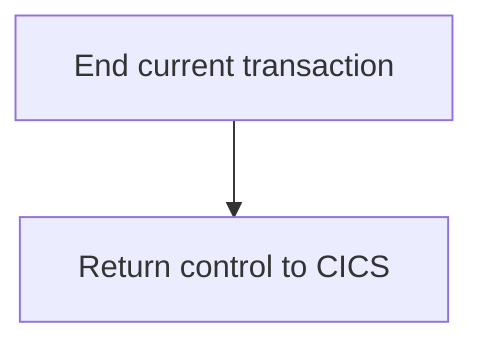

<SwmSnippet path="/src/base/cobol_src/INQCUST.cbl" line="428">

---

First, the <SwmToken path="src/base/cobol_src/INQCUST.cbl" pos="428:1:9" line-data="       GET-ME-OUT-OF-HERE SECTION.">`GET-ME-OUT-OF-HERE`</SwmToken> section is defined to handle the termination of the current transaction.

```cobol
       GET-ME-OUT-OF-HERE SECTION.
       GMOFH010.
```

---

</SwmSnippet>

<SwmSnippet path="/src/base/cobol_src/INQCUST.cbl" line="433">

---

Next, the <SwmToken path="src/base/cobol_src/INQCUST.cbl" pos="433:1:5" line-data="           EXEC CICS RETURN">`EXEC CICS RETURN`</SwmToken> command is executed to end the current transaction and return control to CICS. This ensures that all resources are properly released and the transaction is cleanly terminated.

```cobol
           EXEC CICS RETURN
           END-EXEC.
```

---

</SwmSnippet>

<SwmSnippet path="/src/base/cobol_src/INQCUST.cbl" line="436">

---

Finally, the <SwmToken path="src/base/cobol_src/INQCUST.cbl" pos="437:1:1" line-data="           EXIT.">`EXIT`</SwmToken> statement is used to exit the <SwmToken path="src/base/cobol_src/INQCUST.cbl" pos="196:3:11" line-data="                PERFORM GET-ME-OUT-OF-HERE">`GET-ME-OUT-OF-HERE`</SwmToken> section, completing the termination process.

```cobol
       GMOFH999.
           EXIT.
```

---

</SwmSnippet>

## <SwmToken path="src/base/cobol_src/INQCUST.cbl" pos="205:3:7" line-data="              PERFORM GENERATE-RANDOM-CUSTOMER">`GENERATE-RANDOM-CUSTOMER`</SwmToken>

Lets' zoom into this section of the flow:

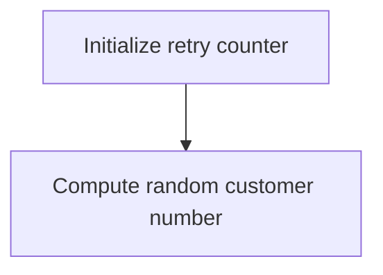

<SwmSnippet path="/src/base/cobol_src/INQCUST.cbl" line="697">

---

### Initializing retry counter

First, the retry counter <SwmToken path="src/base/cobol_src/INQCUST.cbl" pos="697:7:9" line-data="           MOVE ZERO TO INQCUST-RETRY.">`INQCUST-RETRY`</SwmToken> is initialized to zero. This step ensures that any previous retry attempts are reset before generating a new random customer number.

```cobol
           MOVE ZERO TO INQCUST-RETRY.
```

---

</SwmSnippet>

<SwmSnippet path="/src/base/cobol_src/INQCUST.cbl" line="698">

---

### Computing random customer number

Next, the random customer number is computed by using the <SwmToken path="src/base/cobol_src/INQCUST.cbl" pos="699:3:5" line-data="                                     * FUNCTION RANDOM(EIBTASKN)) + 1.">`FUNCTION RANDOM`</SwmToken> with the task number <SwmToken path="src/base/cobol_src/INQCUST.cbl" pos="699:7:7" line-data="                                     * FUNCTION RANDOM(EIBTASKN)) + 1.">`EIBTASKN`</SwmToken>. The result is scaled to the range of customer numbers by multiplying with <SwmToken path="src/base/cobol_src/INQCUST.cbl" pos="698:11:21" line-data="           COMPUTE RANDOM-CUSTOMER = ((NCS-CUST-NO-VALUE - 1)">`NCS-CUST-NO-VALUE - 1`</SwmToken> and adding 1. This ensures that the generated number falls within the valid range of customer numbers.

```cobol
           COMPUTE RANDOM-CUSTOMER = ((NCS-CUST-NO-VALUE - 1)
                                     * FUNCTION RANDOM(EIBTASKN)) + 1.
```

---

</SwmSnippet>

# Read Customer (<SwmToken path="src/base/cobol_src/INQCUST.cbl" pos="215:3:7" line-data="           PERFORM READ-CUSTOMER-VSAM">`READ-CUSTOMER-VSAM`</SwmToken>)

Let's split this section into smaller parts:

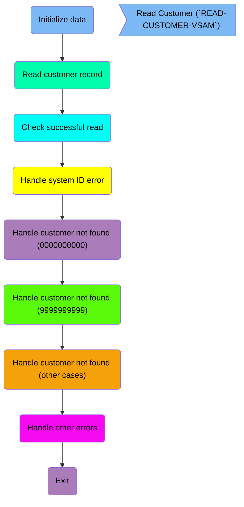

## Initialize data

First, we'll zoom into this section of the flow:

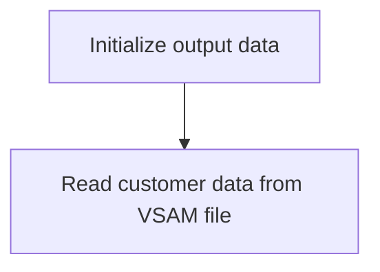

<SwmSnippet path="/src/base/cobol_src/INQCUST.cbl" line="258">

---

First, the <SwmToken path="src/base/cobol_src/INQCUST.cbl" pos="258:1:5" line-data="       READ-CUSTOMER-VSAM SECTION.">`READ-CUSTOMER-VSAM`</SwmToken> section begins by initializing the <SwmToken path="src/base/cobol_src/INQCUST.cbl" pos="263:3:5" line-data="           INITIALIZE OUTPUT-DATA.">`OUTPUT-DATA`</SwmToken> structure. This step ensures that the data structure used to store the customer information is cleared and ready to hold new data.

```cobol
       READ-CUSTOMER-VSAM SECTION.
       RCV010.
      *
      *    Read the VSAM CUSTOMER file
      *
           INITIALIZE OUTPUT-DATA.
```

---

</SwmSnippet>

## Read customer record

This is the next section of the flow.

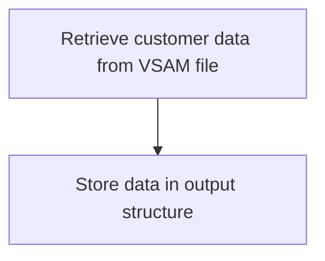

<SwmSnippet path="/src/base/cobol_src/INQCUST.cbl" line="265">

---

The <SwmToken path="src/base/cobol_src/INQCUST.cbl" pos="215:3:7" line-data="           PERFORM READ-CUSTOMER-VSAM">`READ-CUSTOMER-VSAM`</SwmToken> function retrieves customer data from the VSAM file named 'CUSTOMER'. The <SwmToken path="src/base/cobol_src/INQCUST.cbl" pos="266:3:5" line-data="                RIDFLD(CUSTOMER-KY)">`CUSTOMER-KY`</SwmToken> (customer key) is used to locate the specific customer record in the file. The retrieved data is then stored into the <SwmToken path="src/base/cobol_src/INQCUST.cbl" pos="267:3:5" line-data="                INTO(OUTPUT-DATA)">`OUTPUT-DATA`</SwmToken> structure for further processing or display. The <SwmToken path="src/base/cobol_src/INQCUST.cbl" pos="268:1:1" line-data="                RESP(WS-CICS-RESP)">`RESP`</SwmToken> and <SwmToken path="src/base/cobol_src/INQCUST.cbl" pos="269:1:1" line-data="                RESP2(WS-CICS-RESP2)">`RESP2`</SwmToken> variables capture the response codes from the CICS read operation, which can be used for error handling or validation of the read operation's success.

```cobol
           EXEC CICS READ FILE('CUSTOMER')
                RIDFLD(CUSTOMER-KY)
                INTO(OUTPUT-DATA)
                RESP(WS-CICS-RESP)
                RESP2(WS-CICS-RESP2)
           END-EXEC.
```

---

</SwmSnippet>

## Check successful read

This is the next section of the flow.

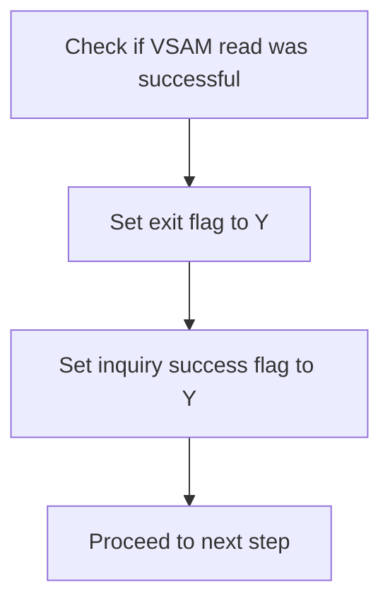

<SwmSnippet path="/src/base/cobol_src/INQCUST.cbl" line="276">

---

The code checks if the VSAM read operation was successful by evaluating if <SwmToken path="src/base/cobol_src/INQCUST.cbl" pos="276:3:7" line-data="           IF WS-CICS-RESP = DFHRESP(NORMAL)">`WS-CICS-RESP`</SwmToken> equals <SwmToken path="src/base/cobol_src/INQCUST.cbl" pos="276:11:14" line-data="           IF WS-CICS-RESP = DFHRESP(NORMAL)">`DFHRESP(NORMAL)`</SwmToken> (indicating a normal response). If the read was successful, it sets <SwmToken path="src/base/cobol_src/INQCUST.cbl" pos="277:9:13" line-data="              MOVE &#39;Y&#39; TO EXIT-VSAM-READ">`EXIT-VSAM-READ`</SwmToken> to 'Y', signaling that the read loop should be exited. Additionally, it sets <SwmToken path="src/base/cobol_src/INQCUST.cbl" pos="278:9:13" line-data="              MOVE &#39;Y&#39; TO INQCUST-INQ-SUCCESS">`INQCUST-INQ-SUCCESS`</SwmToken> to 'Y', indicating that the customer inquiry was successful. Finally, the code proceeds to the next step by branching to <SwmToken path="src/base/cobol_src/INQCUST.cbl" pos="279:5:5" line-data="              GO TO RCV999">`RCV999`</SwmToken>.

```cobol
           IF WS-CICS-RESP = DFHRESP(NORMAL)
              MOVE 'Y' TO EXIT-VSAM-READ
              MOVE 'Y' TO INQCUST-INQ-SUCCESS
              GO TO RCV999
           END-IF.
```

---

</SwmSnippet>

## Handle system ID error

Now, lets zoom into this section of the flow:

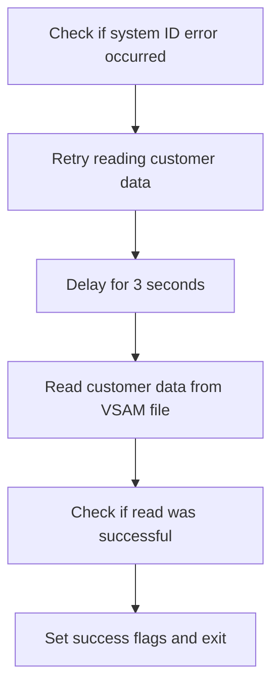

<SwmSnippet path="/src/base/cobol_src/INQCUST.cbl" line="282">

---

First, the code checks if there is a system ID error by evaluating if <SwmToken path="src/base/cobol_src/INQCUST.cbl" pos="282:3:7" line-data="           IF WS-CICS-RESP = DFHRESP(SYSIDERR)">`WS-CICS-RESP`</SwmToken> is equal to <SwmToken path="src/base/cobol_src/INQCUST.cbl" pos="282:11:14" line-data="           IF WS-CICS-RESP = DFHRESP(SYSIDERR)">`DFHRESP(SYSIDERR)`</SwmToken>.

```cobol
           IF WS-CICS-RESP = DFHRESP(SYSIDERR)
```

---

</SwmSnippet>

<SwmSnippet path="/src/base/cobol_src/INQCUST.cbl" line="283">

---

Next, if a system ID error is detected, the code performs a retry loop up to 100 times or until the error is resolved. During each iteration, it delays for 3 seconds before attempting to read the customer data again.

```cobol
              PERFORM VARYING SYSIDERR-RETRY FROM 1 BY 1
              UNTIL SYSIDERR-RETRY > 100
              OR WS-CICS-RESP IS NOT EQUAL TO DFHRESP(SYSIDERR)

                 EXEC CICS DELAY FOR SECONDS(3)
                 END-EXEC
```

---

</SwmSnippet>

<SwmSnippet path="/src/base/cobol_src/INQCUST.cbl" line="290">

---

Then, the code attempts to read the customer data from the VSAM file <SwmToken path="src/base/cobol_src/INQCUST.cbl" pos="290:10:10" line-data="                 EXEC CICS READ FILE(&#39;CUSTOMER&#39;)">`CUSTOMER`</SwmToken> using the <SwmToken path="src/base/cobol_src/INQCUST.cbl" pos="291:3:5" line-data="                    RIDFLD(CUSTOMER-KY)">`CUSTOMER-KY`</SwmToken> key and stores the result in <SwmToken path="src/base/cobol_src/INQCUST.cbl" pos="292:3:5" line-data="                    INTO(OUTPUT-DATA)">`OUTPUT-DATA`</SwmToken>. The response codes are stored in <SwmToken path="src/base/cobol_src/INQCUST.cbl" pos="293:3:7" line-data="                    RESP(WS-CICS-RESP)">`WS-CICS-RESP`</SwmToken> and <SwmToken path="src/base/cobol_src/INQCUST.cbl" pos="294:3:7" line-data="                    RESP2(WS-CICS-RESP2)">`WS-CICS-RESP2`</SwmToken>.

```cobol
                 EXEC CICS READ FILE('CUSTOMER')
                    RIDFLD(CUSTOMER-KY)
                    INTO(OUTPUT-DATA)
                    RESP(WS-CICS-RESP)
                    RESP2(WS-CICS-RESP2)
                  END-EXEC
```

---

</SwmSnippet>

<SwmSnippet path="/src/base/cobol_src/INQCUST.cbl" line="297">

---

Finally, if the read operation is successful (indicated by <SwmToken path="src/base/cobol_src/INQCUST.cbl" pos="297:3:7" line-data="                  IF WS-CICS-RESP = DFHRESP(NORMAL)">`WS-CICS-RESP`</SwmToken> being equal to <SwmToken path="src/base/cobol_src/INQCUST.cbl" pos="297:11:14" line-data="                  IF WS-CICS-RESP = DFHRESP(NORMAL)">`DFHRESP(NORMAL)`</SwmToken>), the code sets the success flags <SwmToken path="src/base/cobol_src/INQCUST.cbl" pos="298:9:13" line-data="                     MOVE &#39;Y&#39; TO EXIT-VSAM-READ">`EXIT-VSAM-READ`</SwmToken> and <SwmToken path="src/base/cobol_src/INQCUST.cbl" pos="299:9:13" line-data="                     MOVE &#39;Y&#39; TO INQCUST-INQ-SUCCESS">`INQCUST-INQ-SUCCESS`</SwmToken> to 'Y' and exits the loop.

```cobol
                  IF WS-CICS-RESP = DFHRESP(NORMAL)
                     MOVE 'Y' TO EXIT-VSAM-READ
                     MOVE 'Y' TO INQCUST-INQ-SUCCESS
                     GO TO RCV999
                  END-IF
```

---

</SwmSnippet>

## Handle customer not found (0000000000)

Now, lets zoom into this section of the flow:

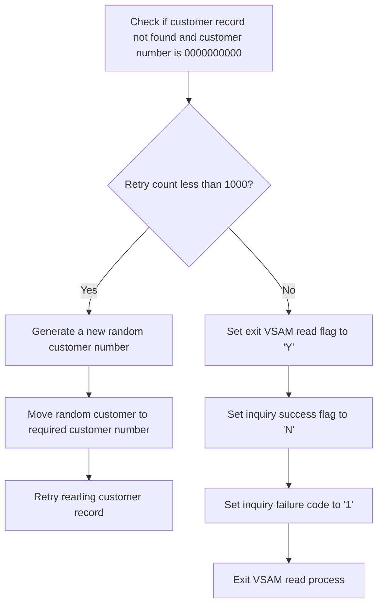

<SwmSnippet path="/src/base/cobol_src/INQCUST.cbl" line="305">

---

When a customer record is not found and the incoming customer number is <SwmToken path="src/base/cobol_src/INQCUST.cbl" pos="306:7:7" line-data="      * customer was 0000000000 (i.e. generate a random">`0000000000`</SwmToken> (indicating a request to generate a random customer number), the system checks if the retry count is less than 1000. If the retry count is less than 1000, the system generates a new random customer number and assigns it to the required customer number, then attempts to read the customer record again. If the retry count reaches 1000, the system sets the exit VSAM read flag to 'Y', indicating that the read process should be terminated. Additionally, it sets the inquiry success flag to 'N' and the inquiry failure code to '1', signaling that the customer record retrieval has failed.

```cobol
      * If the customer record was NOT found and the incoming
      * customer was 0000000000 (i.e. generate a random
      * customer number) then have another go at generating a
      * different random customer number and try reading that.
      *
           IF WS-CICS-RESP = DFHRESP(NOTFND) AND
              INQCUST-CUSTNO = 0000000000
            IF INQCUST-RETRY < 1000
                PERFORM GENERATE-RANDOM-CUSTOMER-AGAIN
                MOVE RANDOM-CUSTOMER TO REQUIRED-CUST-NUMBER
                GO TO RCV999
              ELSE
                MOVE 'Y' TO EXIT-VSAM-READ
                MOVE 'N' TO INQCUST-INQ-SUCCESS
                MOVE '1' TO INQCUST-INQ-FAIL-CD
                GO TO RCV999
              END-IF
```

---

</SwmSnippet>

## Handle customer not found (9999999999)

Now, lets zoom into this section of the flow:

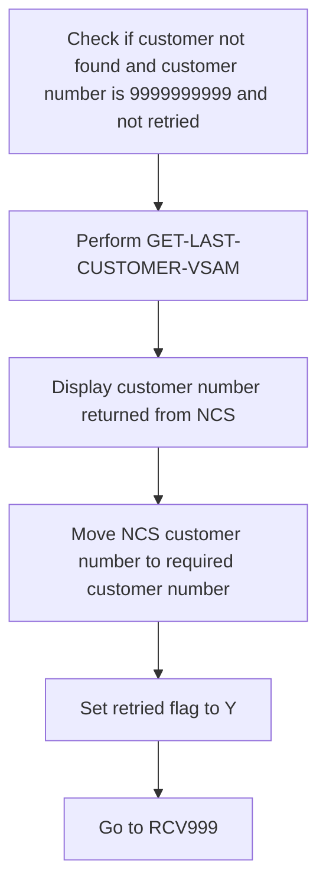

<SwmSnippet path="/src/base/cobol_src/INQCUST.cbl" line="323">

---

First, the code checks if the customer was not found (<SwmToken path="src/base/cobol_src/INQCUST.cbl" pos="323:3:14" line-data="           IF WS-CICS-RESP = DFHRESP(NOTFND) AND">`WS-CICS-RESP = DFHRESP(NOTFND)`</SwmToken>), the customer number is <SwmToken path="src/base/cobol_src/INQCUST.cbl" pos="324:7:7" line-data="           INQCUST-CUSTNO = 9999999999 AND">`9999999999`</SwmToken>, and the retry flag (<SwmToken path="src/base/cobol_src/INQCUST.cbl" pos="325:1:5" line-data="           WS-V-RETRIED = &#39;N&#39;">`WS-V-RETRIED`</SwmToken>) is 'N'.

```cobol
           IF WS-CICS-RESP = DFHRESP(NOTFND) AND
           INQCUST-CUSTNO = 9999999999 AND
           WS-V-RETRIED = 'N'
```

---

</SwmSnippet>

<SwmSnippet path="/src/base/cobol_src/INQCUST.cbl" line="326">

---

Next, if all conditions are met, it performs the <SwmToken path="src/base/cobol_src/INQCUST.cbl" pos="326:3:9" line-data="              PERFORM GET-LAST-CUSTOMER-VSAM">`GET-LAST-CUSTOMER-VSAM`</SwmToken> operation to retrieve the last customer number from the NCS system, displays the returned customer number, moves it to the <SwmToken path="src/base/cobol_src/INQCUST.cbl" pos="329:13:17" line-data="              MOVE NCS-CUST-NO-VALUE TO REQUIRED-CUST-NUMBER">`REQUIRED-CUST-NUMBER`</SwmToken>, sets the retry flag to 'Y', and then goes to the <SwmToken path="src/base/cobol_src/INQCUST.cbl" pos="331:5:5" line-data="              GO TO RCV999">`RCV999`</SwmToken> section.

```cobol
              PERFORM GET-LAST-CUSTOMER-VSAM
      D       DISPLAY 'CUSTOMER NUMBER RETURNED FROM NCS IS='
      D           NCS-CUST-NO-VALUE
              MOVE NCS-CUST-NO-VALUE TO REQUIRED-CUST-NUMBER
              MOVE 'Y' TO WS-V-RETRIED
              GO TO RCV999
           END-IF.
```

---

</SwmSnippet>

## Handle customer not found (other cases)

This is the next section of the flow.

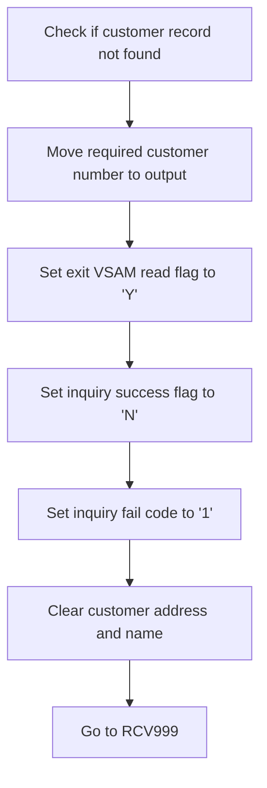

<SwmSnippet path="/src/base/cobol_src/INQCUST.cbl" line="334">

---

When the customer record is not found, the system must handle this scenario appropriately. First, it checks if the customer record was not found and the customer number is not equal to <SwmToken path="src/base/cobol_src/INQCUST.cbl" pos="340:11:11" line-data="                AND INQCUST-CUSTNO NOT = 9999999999)">`9999999999`</SwmToken> or <SwmToken path="src/base/cobol_src/INQCUST.cbl" pos="342:11:11" line-data="                AND INQCUST-CUSTNO NOT = 0000000000)">`0000000000`</SwmToken>. If these conditions are met, it moves the required customer number to the output data to indicate that the supplied customer number was invalid. Then, it sets the <SwmToken path="src/base/cobol_src/INQCUST.cbl" pos="345:9:13" line-data="              MOVE &#39;Y&#39; TO EXIT-VSAM-READ">`EXIT-VSAM-READ`</SwmToken> flag to 'Y' to signal that the VSAM read operation should exit. Additionally, it sets the inquiry success flag to 'N' and the inquiry fail code to '1' to indicate that the inquiry was unsuccessful. Finally, it clears the customer address and name fields and directs the flow to the <SwmToken path="src/base/cobol_src/INQCUST.cbl" pos="350:5:5" line-data="              GO TO RCV999">`RCV999`</SwmToken> label for further processing.

```cobol
      *    If the customer record was NOT found
      *    we must return the customer number with an initialised
      *    output record (this will indicate that the supplied
      *    customer number was a dud.
      *
           IF (WS-CICS-RESP = DFHRESP(NOTFND)
                AND INQCUST-CUSTNO NOT = 9999999999)
                AND (WS-CICS-RESP = DFHRESP(NOTFND)
                AND INQCUST-CUSTNO NOT = 0000000000)
              MOVE REQUIRED-CUST-NUMBER TO CUSTOMER-NUMBER
                                           OF OUTPUT-DATA
              MOVE 'Y' TO EXIT-VSAM-READ
              MOVE 'N' TO INQCUST-INQ-SUCCESS
              MOVE '1' TO INQCUST-INQ-FAIL-CD
              MOVE SPACES TO INQCUST-ADDR
              MOVE SPACES TO INQCUST-NAME
              GO TO RCV999
           END-IF.
```

---

</SwmSnippet>

## Handle other errors

Now, lets zoom into this section of the flow:

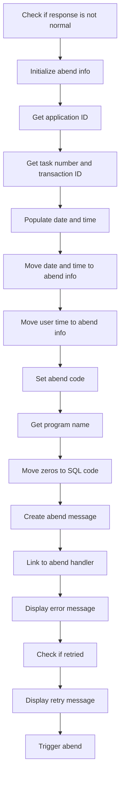

First, the code checks if the response code <SwmToken path="src/base/cobol_src/INQCUST.cbl" pos="268:3:7" line-data="                RESP(WS-CICS-RESP)">`WS-CICS-RESP`</SwmToken> is not equal to <SwmToken path="src/base/cobol_src/INQCUST.cbl" pos="276:11:14" line-data="           IF WS-CICS-RESP = DFHRESP(NORMAL)">`DFHRESP(NORMAL)`</SwmToken>, indicating an abnormal condition.

Next, it initializes the <SwmToken path="src/base/cobol_src/INQCUST.cbl" pos="156:3:5" line-data="       01 ABNDINFO-REC.">`ABNDINFO-REC`</SwmToken> structure to prepare for capturing abend information.

Then, it retrieves the application ID using the <SwmToken path="src/base/cobol_src/INQCUST.cbl" pos="370:1:7" line-data="              EXEC CICS ASSIGN APPLID(ABND-APPLID)">`EXEC CICS ASSIGN APPLID`</SwmToken> command and stores it in <SwmToken path="src/base/cobol_src/INQCUST.cbl" pos="370:9:11" line-data="              EXEC CICS ASSIGN APPLID(ABND-APPLID)">`ABND-APPLID`</SwmToken>.

Moving to the next step, it captures the task number and transaction ID, storing them in <SwmToken path="src/base/cobol_src/INQCUST.cbl" pos="373:7:11" line-data="              MOVE EIBTASKN   TO ABND-TASKNO-KEY">`ABND-TASKNO-KEY`</SwmToken> and <SwmToken path="src/base/cobol_src/INQCUST.cbl" pos="374:7:9" line-data="              MOVE EIBTRNID   TO ABND-TRANID">`ABND-TRANID`</SwmToken> respectively.

The code then performs the <SwmToken path="src/base/cobol_src/INQCUST.cbl" pos="376:3:7" line-data="              PERFORM POPULATE-TIME-DATE">`POPULATE-TIME-DATE`</SwmToken> routine to get the current date and time.

After that, it moves the original date and current time into the <SwmToken path="src/base/cobol_src/INQCUST.cbl" pos="378:11:13" line-data="              MOVE WS-ORIG-DATE TO ABND-DATE">`ABND-DATE`</SwmToken> and <SwmToken path="src/base/cobol_src/INQCUST.cbl" pos="384:3:5" line-data="                     INTO ABND-TIME">`ABND-TIME`</SwmToken> fields of the abend info structure.

It also moves the user time to <SwmToken path="src/base/cobol_src/INQCUST.cbl" pos="387:11:15" line-data="              MOVE WS-U-TIME   TO ABND-UTIME-KEY">`ABND-UTIME-KEY`</SwmToken> and sets the abend code to <SwmToken path="src/base/cobol_src/INQCUST.cbl" pos="388:4:4" line-data="              MOVE &#39;CVR1&#39;      TO ABND-CODE">`CVR1`</SwmToken>.

The program name is then retrieved using <SwmToken path="src/base/cobol_src/INQCUST.cbl" pos="390:1:7" line-data="              EXEC CICS ASSIGN PROGRAM(ABND-PROGRAM)">`EXEC CICS ASSIGN PROGRAM`</SwmToken> and stored in <SwmToken path="src/base/cobol_src/INQCUST.cbl" pos="390:9:11" line-data="              EXEC CICS ASSIGN PROGRAM(ABND-PROGRAM)">`ABND-PROGRAM`</SwmToken>.

Zeros are moved to the <SwmToken path="src/base/cobol_src/INQCUST.cbl" pos="393:7:9" line-data="              MOVE ZEROS      TO ABND-SQLCODE">`ABND-SQLCODE`</SwmToken> field to indicate no SQL error.

A detailed abend message is created by concatenating various pieces of information, including the customer key, response codes, and stored in <SwmToken path="src/base/cobol_src/INQCUST.cbl" pos="403:3:5" line-data="                    INTO ABND-FREEFORM">`ABND-FREEFORM`</SwmToken>.

The code then links to the abend handler program <SwmToken path="src/base/cobol_src/INQCUST.cbl" pos="154:3:7" line-data="       01 WS-ABEND-PGM                 PIC X(8) VALUE &#39;ABNDPROC&#39;.">`WS-ABEND-PGM`</SwmToken> with the abend info structure.

An error message is displayed, showing the customer key and response code.

If the operation was retried (<SwmToken path="src/base/cobol_src/INQCUST.cbl" pos="325:1:5" line-data="           WS-V-RETRIED = &#39;N&#39;">`WS-V-RETRIED`</SwmToken> is 'Y'), a retry message is displayed.

## Exit

This is the next section of the flow.

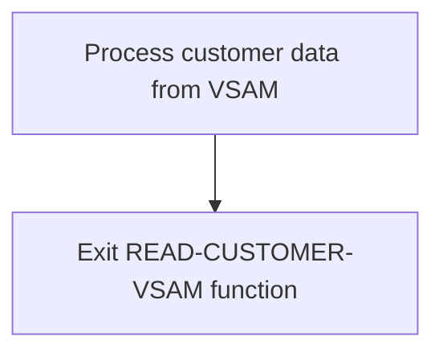

<SwmSnippet path="/src/base/cobol_src/INQCUST.cbl" line="424">

---

The <SwmToken path="src/base/cobol_src/INQCUST.cbl" pos="215:3:7" line-data="           PERFORM READ-CUSTOMER-VSAM">`READ-CUSTOMER-VSAM`</SwmToken> function concludes its operations by reaching the <SwmToken path="src/base/cobol_src/INQCUST.cbl" pos="424:1:1" line-data="       RCV999.">`RCV999`</SwmToken> label, which signifies the end of the function's execution. This step ensures that the function exits cleanly after processing the customer data retrieved from the VSAM file.

```cobol
       RCV999.
           EXIT.
```

---

</SwmSnippet>

## <SwmToken path="src/base/cobol_src/INQCUST.cbl" pos="313:3:9" line-data="                PERFORM GENERATE-RANDOM-CUSTOMER-AGAIN">`GENERATE-RANDOM-CUSTOMER-AGAIN`</SwmToken>

Lets' zoom into this section of the flow:

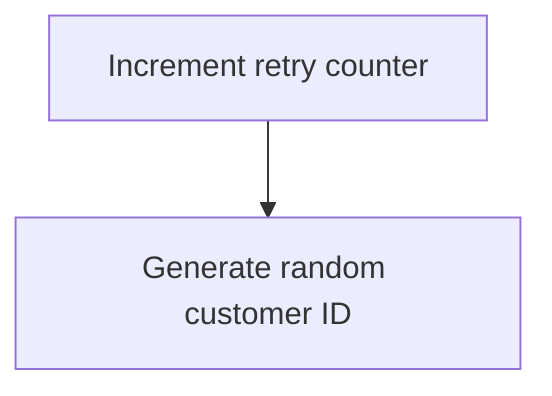

<SwmSnippet path="/src/base/cobol_src/INQCUST.cbl" line="705">

---

### Generating a new random customer ID

The <SwmToken path="src/base/cobol_src/INQCUST.cbl" pos="705:1:7" line-data="       GENERATE-RANDOM-CUSTOMER-AGAIN SECTION.">`GENERATE-RANDOM-CUSTOMER-AGAIN`</SwmToken> section is responsible for generating a new random customer ID each time it is called. First, it increments the retry counter <SwmToken path="src/base/cobol_src/INQCUST.cbl" pos="707:7:9" line-data="           ADD 1 TO INQCUST-RETRY GIVING INQCUST-RETRY.">`INQCUST-RETRY`</SwmToken> by 1, which keeps track of how many times a new customer ID has been attempted. Then, it calculates a new random customer ID by using the <SwmToken path="src/base/cobol_src/INQCUST.cbl" pos="709:3:5" line-data="                                                * FUNCTION RANDOM) + 1.">`FUNCTION RANDOM`</SwmToken> to generate a random number, which is then scaled to the range of valid customer IDs by multiplying it with <SwmToken path="src/base/cobol_src/INQCUST.cbl" pos="708:11:21" line-data="           COMPUTE RANDOM-CUSTOMER = ((NCS-CUST-NO-VALUE - 1)">`NCS-CUST-NO-VALUE - 1`</SwmToken> and adding 1. This ensures that the generated customer ID falls within the valid range of customer numbers.

```cobol
       GENERATE-RANDOM-CUSTOMER-AGAIN SECTION.
       GRCA10.
           ADD 1 TO INQCUST-RETRY GIVING INQCUST-RETRY.
           COMPUTE RANDOM-CUSTOMER = ((NCS-CUST-NO-VALUE - 1)
                                                * FUNCTION RANDOM) + 1.
        GRCA99.
            EXIT.
```

---

</SwmSnippet>

## <SwmToken path="src/base/cobol_src/INQCUST.cbl" pos="376:3:7" line-data="              PERFORM POPULATE-TIME-DATE">`POPULATE-TIME-DATE`</SwmToken>

Lets' zoom into this section of the flow:

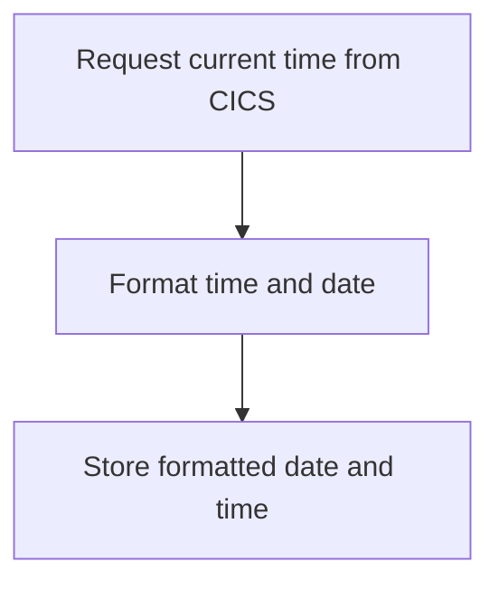

<SwmSnippet path="/src/base/cobol_src/INQCUST.cbl" line="678">

---

First, the function requests the current time from CICS and stores it in <SwmToken path="src/base/cobol_src/INQCUST.cbl" pos="679:3:7" line-data="              ABSTIME(WS-U-TIME)">`WS-U-TIME`</SwmToken> (a variable for holding the current time).

```cobol
           EXEC CICS ASKTIME
              ABSTIME(WS-U-TIME)
           END-EXEC.
```

---

</SwmSnippet>

<SwmSnippet path="/src/base/cobol_src/INQCUST.cbl" line="682">

---

Next, the function formats the retrieved time into a human-readable date and time format. It stores the formatted date in <SwmToken path="src/base/cobol_src/INQCUST.cbl" pos="684:3:7" line-data="                     DDMMYYYY(WS-ORIG-DATE)">`WS-ORIG-DATE`</SwmToken> and the formatted time in <SwmToken path="src/base/cobol_src/INQCUST.cbl" pos="685:3:7" line-data="                     TIME(WS-TIME-NOW)">`WS-TIME-NOW`</SwmToken>.

```cobol
           EXEC CICS FORMATTIME
                     ABSTIME(WS-U-TIME)
                     DDMMYYYY(WS-ORIG-DATE)
                     TIME(WS-TIME-NOW)
                     DATESEP
           END-EXEC.
```

---

</SwmSnippet>

<SwmSnippet path="/src/base/cobol_src/INQCUST.cbl" line="689">

---

Then, the function completes its execution and exits.

```cobol
       PTD999.
           EXIT.
```

---

</SwmSnippet>

&nbsp;

*This is an auto-generated document by Swimm 🌊 and has not yet been verified by a human*

<SwmMeta version="3.0.0" repo-id="Z2l0aHViJTNBJTNBY2ljcy1iYW5raW5nLXNhbXBsZS1hcHBsaWNhdGlvbi1jYnNhLUlCTS1EZW1vJTNBJTNBU3dpbW0tRGVtbw==" repo-name="cics-banking-sample-application-cbsa-IBM-Demo"><sup>Powered by [Swimm](/)</sup></SwmMeta>
