The <SwmToken path="src/base/cobol_src/BNK1DCS.cbl" pos="387:4:4" line-data="              MOVE &#39;BNK1DCS - A010 - RETURN TRANSID(ODCS) FAIL&#39; TO">`BNK1DCS`</SwmToken> program handles various user interactions within the CICS Bank Sample Application. It manages tasks such as sending initial maps, processing user inputs, handling abnormal terminations, and sending termination messages. The program ensures smooth operation by setting up abend handling, processing data entries, and managing screen updates.

The <SwmToken path="src/base/cobol_src/BNK1DCS.cbl" pos="387:4:4" line-data="              MOVE &#39;BNK1DCS - A010 - RETURN TRANSID(ODCS) FAIL&#39; TO">`BNK1DCS`</SwmToken> program starts by setting up abend handling to manage any abnormal terminations. It then sends the initial map to the user interface, erasing any previous data fields. The program processes various user inputs, such as pressing function keys to delete or update data, and handles these actions accordingly. If an abnormal termination occurs, the program captures relevant information and links to an abend handler. Finally, it sends a termination message to the user and returns control to CICS.

Here is a high level diagram of the program:

```mermaid
graph TD
ulo79("Set up abend handling"):::ad2c216a6  --> 
twjdl("Send initial map, erase data fields"):::aa61e7baa  --> 
mugm8("PA key pressed"):::a6dfe88ca  --> 
opx15("Return to main menu on PF3"):::a5cd96cae  --> 
zfhyj("Process delete on PF5"):::a2f334b19  --> 
he3r1("Process update on PF10"):::ada9f1234  --> 
9x0np("Send termination message on AID or PF12"):::acc641b67  --> 
igjyt("Clear screen on CLEAR"):::acddeccc6  --> 
kzi8k("Process data on ENTER"):::af1511375  --> 
uanvu("Send invalid key message on other input"):::a17bf1b13  --> 
d7s3g("Transfer data from DFHCOMMAREA if not first time"):::a393a8474  --> 
kqozl("Return control to CICS"):::ac6e7fdf0  --> 
kp7ec("Handle abnormal termination"):::af4906a77  --> 
djt54("Exit"):::a53de50cd 
classDef ad2c216a6 color:#000000,fill:#7CB9F4
classDef aa61e7baa color:#000000,fill:#00FFAA
classDef a6dfe88ca color:#000000,fill:#00FFAA
classDef a5cd96cae color:#000000,fill:#FFFF00
classDef a2f334b19 color:#000000,fill:#AA7CB9
classDef ada9f1234 color:#000000,fill:#5afa0a
classDef acc641b67 color:#000000,fill:#f5a10a
classDef acddeccc6 color:#000000,fill:#f50af1
classDef af1511375 color:#000000,fill:#9c5602
classDef a17bf1b13 color:#000000,fill:#FF5733
classDef a393a8474 color:#000000,fill:#C70039
classDef ac6e7fdf0 color:#000000,fill:#f5a10a
classDef af4906a77 color:#000000,fill:#581845
classDef a53de50cd color:#000000,fill:#AA7CB9

%% Swimm:
%% graph TD
%% ulo79("Set up abend handling"):::ad2c216a6  --> 
%% twjdl("Send initial map, erase data fields"):::aa61e7baa  --> 
%% mugm8("PA key pressed"):::a6dfe88ca  --> 
%% opx15("Return to main menu on PF3"):::a5cd96cae  --> 
%% zfhyj("Process delete on <SwmToken path="src/base/cobol_src/BNK1DCS.cbl" pos="951:12:12" line-data="           STRING &#39;Customer lookup successful. &lt;PF5&gt; to Delete. &lt;PF10&#39;">`PF5`</SwmToken>"):::a2f334b19  --> 
%% he3r1("Process update on <SwmToken path="src/base/cobol_src/BNK1DCS.cbl" pos="951:21:21" line-data="           STRING &#39;Customer lookup successful. &lt;PF5&gt; to Delete. &lt;PF10&#39;">`PF10`</SwmToken>"):::ada9f1234  --> 
%% 9x0np("Send termination message on AID or PF12"):::acc641b67  --> 
%% igjyt("Clear screen on CLEAR"):::acddeccc6  --> 
%% kzi8k("Process data on ENTER"):::af1511375  --> 
%% uanvu("Send invalid key message on other input"):::a17bf1b13  --> 
%% d7s3g("Transfer data from DFHCOMMAREA if not first time"):::a393a8474  --> 
%% kqozl("Return control to CICS"):::ac6e7fdf0  --> 
%% kp7ec("Handle abnormal termination"):::af4906a77  --> 
%% djt54("Exit"):::a53de50cd 
%% classDef ad2c216a6 color:#000000,fill:#7CB9F4
%% classDef aa61e7baa color:#000000,fill:#00FFAA
%% classDef a6dfe88ca color:#000000,fill:#00FFAA
%% classDef a5cd96cae color:#000000,fill:#FFFF00
%% classDef a2f334b19 color:#000000,fill:#AA7CB9
%% classDef ada9f1234 color:#000000,fill:#5afa0a
%% classDef acc641b67 color:#000000,fill:#f5a10a
%% classDef acddeccc6 color:#000000,fill:#f50af1
%% classDef af1511375 color:#000000,fill:#9c5602
%% classDef a17bf1b13 color:#000000,fill:#FF5733
%% classDef a393a8474 color:#000000,fill:#C70039
%% classDef ac6e7fdf0 color:#000000,fill:#f5a10a
%% classDef af4906a77 color:#000000,fill:#581845
%% classDef a53de50cd color:#000000,fill:#AA7CB9
```

## Set up abend handling

First, we'll zoom into this section of the flow:

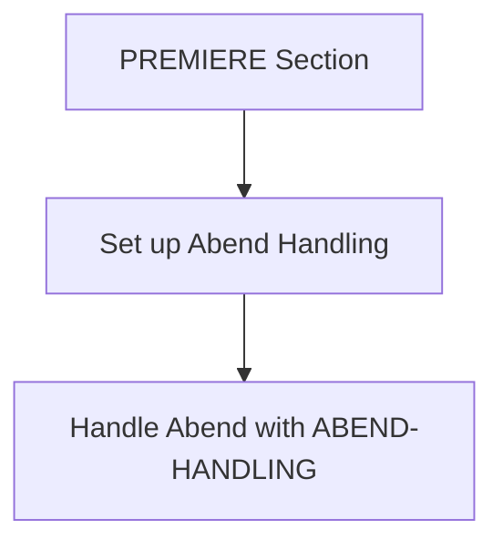

<SwmSnippet path="/src/base/cobol_src/BNK1DCS.cbl" line="189">

---

First, the <SwmToken path="src/base/cobol_src/BNK1DCS.cbl" pos="189:1:1" line-data="       PREMIERE SECTION.">`PREMIERE`</SwmToken> section is initiated to handle specific operations within the program.

```cobol
       PREMIERE SECTION.
       A010.

```

---

</SwmSnippet>

<SwmSnippet path="/src/base/cobol_src/BNK1DCS.cbl" line="195">

---

Moving to the next step, the program sets up the abnormal end (abend) handling by executing the <SwmToken path="src/base/cobol_src/BNK1DCS.cbl" pos="195:5:7" line-data="           EXEC CICS HANDLE ABEND">`HANDLE ABEND`</SwmToken> command, which directs the control to the <SwmToken path="src/base/cobol_src/BNK1DCS.cbl" pos="196:3:5" line-data="                LABEL(ABEND-HANDLING)">`ABEND-HANDLING`</SwmToken> label in case of an abnormal termination.

```cobol
           EXEC CICS HANDLE ABEND
                LABEL(ABEND-HANDLING)
           END-EXEC.
```

---

</SwmSnippet>

## Send initial map, erase data fields

Now, lets zoom into this section of the flow:

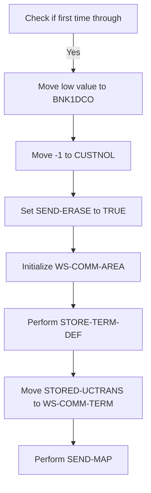

First, the code checks if it is the first time through by evaluating if <SwmToken path="src/base/cobol_src/BNK1DCS.cbl" pos="205:3:3" line-data="              WHEN EIBCALEN = ZERO">`EIBCALEN`</SwmToken> (which indicates the length of the communication area) is zero.

<SwmSnippet path="/src/base/cobol_src/BNK1DCS.cbl" line="206">

---

If it is the first time through, the code moves a low value to <SwmToken path="src/base/cobol_src/BNK1DCS.cbl" pos="206:9:9" line-data="                 MOVE LOW-VALUE TO BNK1DCO">`BNK1DCO`</SwmToken> (which likely represents an empty or initial state for the data fields).

```cobol
                 MOVE LOW-VALUE TO BNK1DCO
```

---

</SwmSnippet>

<SwmSnippet path="/src/base/cobol_src/BNK1DCS.cbl" line="207">

---

Next, it moves -1 to <SwmToken path="src/base/cobol_src/BNK1DCS.cbl" pos="207:8:8" line-data="                 MOVE -1 TO CUSTNOL">`CUSTNOL`</SwmToken> (which might be a placeholder for an uninitialized customer number) and sets <SwmToken path="src/base/cobol_src/BNK1DCS.cbl" pos="208:3:5" line-data="                 SET SEND-ERASE TO TRUE">`SEND-ERASE`</SwmToken> to TRUE (indicating that the map should be sent with erased data fields).

```cobol
                 MOVE -1 TO CUSTNOL
                 SET SEND-ERASE TO TRUE
```

---

</SwmSnippet>

<SwmSnippet path="/src/base/cobol_src/BNK1DCS.cbl" line="209">

---

Then, the code initializes <SwmToken path="src/base/cobol_src/BNK1DCS.cbl" pos="209:3:7" line-data="                 INITIALIZE WS-COMM-AREA">`WS-COMM-AREA`</SwmToken> (which is likely a working storage communication area) and performs the <SwmToken path="src/base/cobol_src/BNK1DCS.cbl" pos="211:3:7" line-data="                 PERFORM STORE-TERM-DEF">`STORE-TERM-DEF`</SwmToken> routine to store terminal definitions.

```cobol
                 INITIALIZE WS-COMM-AREA

                 PERFORM STORE-TERM-DEF
```

---

</SwmSnippet>

<SwmSnippet path="/src/base/cobol_src/BNK1DCS.cbl" line="213">

---

Finally, it moves <SwmToken path="src/base/cobol_src/BNK1DCS.cbl" pos="213:3:5" line-data="                 MOVE STORED-UCTRANS TO WS-COMM-TERM">`STORED-UCTRANS`</SwmToken> to <SwmToken path="src/base/cobol_src/BNK1DCS.cbl" pos="213:9:13" line-data="                 MOVE STORED-UCTRANS TO WS-COMM-TERM">`WS-COMM-TERM`</SwmToken> (which might be related to terminal settings) and performs the <SwmToken path="src/base/cobol_src/BNK1DCS.cbl" pos="215:3:5" line-data="                 PERFORM SEND-MAP">`SEND-MAP`</SwmToken> routine to send the map to the terminal.

```cobol
                 MOVE STORED-UCTRANS TO WS-COMM-TERM

                 PERFORM SEND-MAP
```

---

</SwmSnippet>

## PA key pressed

Now, lets zoom into this section of the flow:

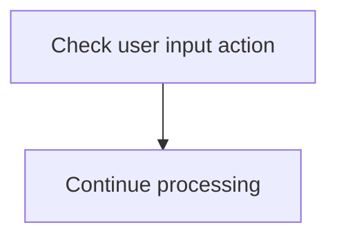

<SwmSnippet path="/src/base/cobol_src/BNK1DCS.cbl" line="220">

---

### Handling user input actions

The code checks the value of <SwmToken path="src/base/cobol_src/BNK1DCS.cbl" pos="220:3:3" line-data="              WHEN EIBAID = DFHPA1 OR DFHPA2 OR DFHPA3">`EIBAID`</SwmToken> (which holds the user input action identifier) to determine if it matches any of the predefined actions <SwmToken path="src/base/cobol_src/BNK1DCS.cbl" pos="220:7:7" line-data="              WHEN EIBAID = DFHPA1 OR DFHPA2 OR DFHPA3">`DFHPA1`</SwmToken>, <SwmToken path="src/base/cobol_src/BNK1DCS.cbl" pos="220:11:11" line-data="              WHEN EIBAID = DFHPA1 OR DFHPA2 OR DFHPA3">`DFHPA2`</SwmToken>, or <SwmToken path="src/base/cobol_src/BNK1DCS.cbl" pos="220:15:15" line-data="              WHEN EIBAID = DFHPA1 OR DFHPA2 OR DFHPA3">`DFHPA3`</SwmToken>. If there is a match, the program proceeds with the next steps in processing the user input.

```cobol
              WHEN EIBAID = DFHPA1 OR DFHPA2 OR DFHPA3
                 CONTINUE
```

---

</SwmSnippet>

## Return to main menu on PF3

Now, lets zoom into this section of the flow:

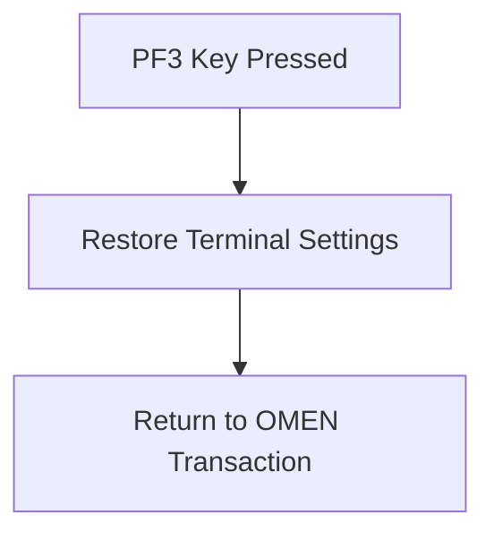

<SwmSnippet path="/src/base/cobol_src/BNK1DCS.cbl" line="226">

---

First, when the PF3 key is pressed, the terminal settings are restored to their default state by performing the <SwmToken path="src/base/cobol_src/BNK1DCS.cbl" pos="231:3:7" line-data="                 PERFORM RESTORE-TERM-DEF">`RESTORE-TERM-DEF`</SwmToken> operation.

```cobol
              WHEN EIBAID = DFHPF3

      *
      *          Set the terminal UCTRAN back to its starting position
      *
                 PERFORM RESTORE-TERM-DEF
```

---

</SwmSnippet>

<SwmSnippet path="/src/base/cobol_src/BNK1DCS.cbl" line="233">

---

Next, the transaction is terminated and control is returned to the 'OMEN' transaction. This is done using the <SwmToken path="src/base/cobol_src/BNK1DCS.cbl" pos="233:1:5" line-data="                 EXEC CICS RETURN">`EXEC CICS RETURN`</SwmToken> command with the <SwmToken path="src/base/cobol_src/BNK1DCS.cbl" pos="234:1:6" line-data="                    TRANSID(&#39;OMEN&#39;)">`TRANSID('OMEN')`</SwmToken> parameter.

```cobol
                 EXEC CICS RETURN
                    TRANSID('OMEN')
                    IMMEDIATE
                    RESP(WS-CICS-RESP)
                    RESP2(WS-CICS-RESP2)
                 END-EXEC
```

---

</SwmSnippet>

## Process delete on <SwmToken path="src/base/cobol_src/BNK1DCS.cbl" pos="951:12:12" line-data="           STRING &#39;Customer lookup successful. &lt;PF5&gt; to Delete. &lt;PF10&#39;">`PF5`</SwmToken>

Now, lets zoom into this section of the flow:

```mermaid
graph TD
  A[Check if user pressed PF5 key] --> B[Process the map]

%% Swimm:
%% graph TD
%%   A[Check if user pressed <SwmToken path="src/base/cobol_src/BNK1DCS.cbl" pos="951:12:12" line-data="           STRING &#39;Customer lookup successful. &lt;PF5&gt; to Delete. &lt;PF10&#39;">`PF5`</SwmToken> key] --> B[Process the map]
```

<SwmSnippet path="/src/base/cobol_src/BNK1DCS.cbl" line="244">

---

When the user presses the <SwmToken path="src/base/cobol_src/BNK1DCS.cbl" pos="951:12:12" line-data="           STRING &#39;Customer lookup successful. &lt;PF5&gt; to Delete. &lt;PF10&#39;">`PF5`</SwmToken> key, the system recognizes this action by checking if <SwmToken path="src/base/cobol_src/BNK1DCS.cbl" pos="244:3:3" line-data="              WHEN EIBAID = DFHPF5">`EIBAID`</SwmToken> (which holds the attention identifier) is equal to <SwmToken path="src/base/cobol_src/BNK1DCS.cbl" pos="244:7:7" line-data="              WHEN EIBAID = DFHPF5">`DFHPF5`</SwmToken> (the identifier for the <SwmToken path="src/base/cobol_src/BNK1DCS.cbl" pos="951:12:12" line-data="           STRING &#39;Customer lookup successful. &lt;PF5&gt; to Delete. &lt;PF10&#39;">`PF5`</SwmToken> key). If this condition is met, the system proceeds to perform the <SwmToken path="src/base/cobol_src/BNK1DCS.cbl" pos="245:3:5" line-data="                 PERFORM PROCESS-MAP">`PROCESS-MAP`</SwmToken> operation, which handles the necessary actions to process the map based on the user's request.

```cobol
              WHEN EIBAID = DFHPF5
                 PERFORM PROCESS-MAP

```

---

</SwmSnippet>

## Process update on <SwmToken path="src/base/cobol_src/BNK1DCS.cbl" pos="951:21:21" line-data="           STRING &#39;Customer lookup successful. &lt;PF5&gt; to Delete. &lt;PF10&#39;">`PF10`</SwmToken>

Now, lets zoom into this section of the flow:

```mermaid
graph TD
  A[User presses PF10 key] --> B[Process the map]

%% Swimm:
%% graph TD
%%   A[User presses <SwmToken path="src/base/cobol_src/BNK1DCS.cbl" pos="951:21:21" line-data="           STRING &#39;Customer lookup successful. &lt;PF5&gt; to Delete. &lt;PF10&#39;">`PF10`</SwmToken> key] --> B[Process the map]
```

<SwmSnippet path="/src/base/cobol_src/BNK1DCS.cbl" line="251">

---

### Handling the user input for the <SwmToken path="src/base/cobol_src/BNK1DCS.cbl" pos="951:21:21" line-data="           STRING &#39;Customer lookup successful. &lt;PF5&gt; to Delete. &lt;PF10&#39;">`PF10`</SwmToken> key

When the user presses the <SwmToken path="src/base/cobol_src/BNK1DCS.cbl" pos="951:21:21" line-data="           STRING &#39;Customer lookup successful. &lt;PF5&gt; to Delete. &lt;PF10&#39;">`PF10`</SwmToken> key, the system recognizes this action by checking if <SwmToken path="src/base/cobol_src/BNK1DCS.cbl" pos="251:3:3" line-data="              WHEN EIBAID = DFHPF10">`EIBAID`</SwmToken> (which holds the identifier for the key pressed) is equal to <SwmToken path="src/base/cobol_src/BNK1DCS.cbl" pos="251:7:7" line-data="              WHEN EIBAID = DFHPF10">`DFHPF10`</SwmToken> (the identifier for the <SwmToken path="src/base/cobol_src/BNK1DCS.cbl" pos="951:21:21" line-data="           STRING &#39;Customer lookup successful. &lt;PF5&gt; to Delete. &lt;PF10&#39;">`PF10`</SwmToken> key). If this condition is met, the <SwmToken path="src/base/cobol_src/BNK1DCS.cbl" pos="252:3:5" line-data="                 PERFORM PROCESS-MAP">`PROCESS-MAP`</SwmToken> routine is performed. This routine is responsible for processing the current map, which typically involves updating the display or handling user inputs on the screen.

```cobol
              WHEN EIBAID = DFHPF10
                 PERFORM PROCESS-MAP

```

---

</SwmSnippet>

## Send termination message on AID or PF12

Now, lets zoom into this section of the flow:

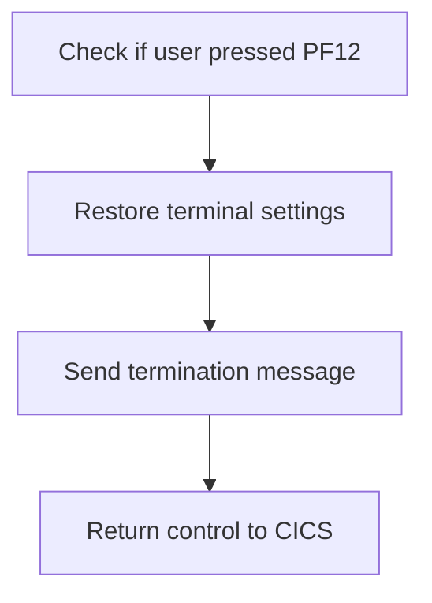

<SwmSnippet path="/src/base/cobol_src/BNK1DCS.cbl" line="258">

---

First, we check if the user pressed the PF12 key, which is typically used to signal a termination request.

```cobol
              WHEN EIBAID = DFHAID OR DFHPF12
```

---

</SwmSnippet>

<SwmSnippet path="/src/base/cobol_src/BNK1DCS.cbl" line="262">

---

Next, we restore the terminal settings to their default state to ensure that the terminal is left in a consistent and expected configuration.

```cobol
                 PERFORM RESTORE-TERM-DEF
```

---

</SwmSnippet>

<SwmSnippet path="/src/base/cobol_src/BNK1DCS.cbl" line="264">

---

Then, we send a termination message to the user, informing them that their session is ending.

```cobol
                 PERFORM SEND-TERMINATION-MSG
```

---

</SwmSnippet>

<SwmSnippet path="/src/base/cobol_src/BNK1DCS.cbl" line="266">

---

Finally, we return control to CICS, completing the termination process.

```cobol
                 EXEC CICS
                    RETURN
                 END-EXEC
```

---

</SwmSnippet>

## Clear screen on CLEAR

Now, lets zoom into this section of the flow:

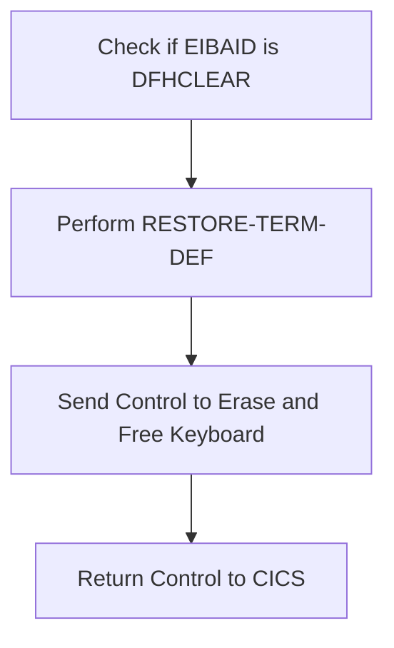

First, we check if <SwmToken path="src/base/cobol_src/BNK1DCS.cbl" pos="220:3:3" line-data="              WHEN EIBAID = DFHPA1 OR DFHPA2 OR DFHPA3">`EIBAID`</SwmToken> (which holds the attention identifier) is equal to <SwmToken path="src/base/cobol_src/BNK1DCS.cbl" pos="273:7:7" line-data="              WHEN EIBAID = DFHCLEAR">`DFHCLEAR`</SwmToken> (a constant indicating a clear screen request).

<SwmSnippet path="/src/base/cobol_src/BNK1DCS.cbl" line="277">

---

Next, we perform the <SwmToken path="src/base/cobol_src/BNK1DCS.cbl" pos="277:3:7" line-data="                 PERFORM RESTORE-TERM-DEF">`RESTORE-TERM-DEF`</SwmToken> operation, which resets the terminal to its default settings.

```cobol
                 PERFORM RESTORE-TERM-DEF
```

---

</SwmSnippet>

<SwmSnippet path="/src/base/cobol_src/BNK1DCS.cbl" line="279">

---

Then, we send a control command to erase the screen and free the keyboard, ensuring the terminal is ready for the next input.

```cobol
                 EXEC CICS SEND CONTROL
                          ERASE
                          FREEKB
                 END-EXEC
```

---

</SwmSnippet>

<SwmSnippet path="/src/base/cobol_src/BNK1DCS.cbl" line="284">

---

Finally, we return control to CICS, indicating that the terminal reset process is complete.

```cobol
                 EXEC CICS RETURN
                 END-EXEC
```

---

</SwmSnippet>

## Process data on ENTER

Now, lets zoom into this section of the flow:

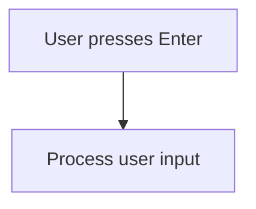

## Interim Summary

So far, we saw how the program processes user input when the Enter key is pressed, handling the data accordingly. Now, we will focus on how the system responds when an invalid key is pressed, ensuring the user is informed of the error and the appropriate actions are taken.

## Send invalid key message on other input

Now, lets zoom into this section of the flow:

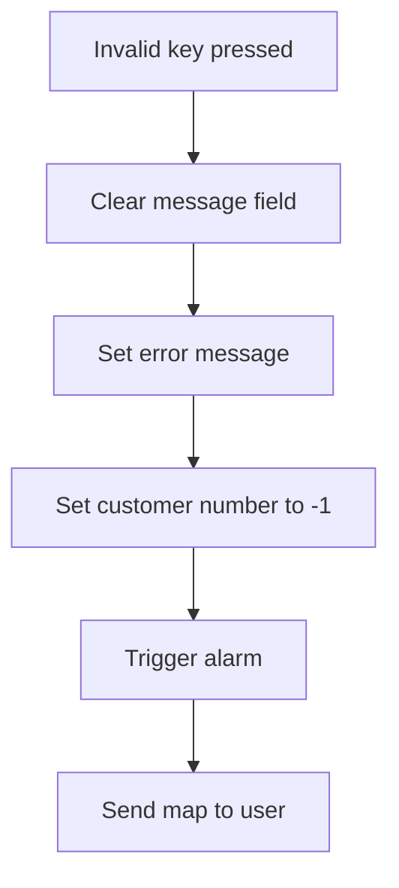

<SwmSnippet path="/src/base/cobol_src/BNK1DCS.cbl" line="296">

---

When an invalid key is pressed by the user, the system first clears the <SwmToken path="src/base/cobol_src/BNK1DCS.cbl" pos="297:7:7" line-data="                 MOVE SPACES                 TO MESSAGEO">`MESSAGEO`</SwmToken> field to ensure no previous messages are displayed. It then sets the <SwmToken path="src/base/cobol_src/BNK1DCS.cbl" pos="297:7:7" line-data="                 MOVE SPACES                 TO MESSAGEO">`MESSAGEO`</SwmToken> field to 'Invalid key pressed.' to inform the user of the error. The customer number (<SwmToken path="src/base/cobol_src/BNK1DCS.cbl" pos="299:8:8" line-data="                 MOVE -1 TO CUSTNOL">`CUSTNOL`</SwmToken>) is set to -1 to indicate an invalid operation. An alarm is triggered to alert the user of the error, and finally, the map is sent back to the user interface to display the error message.

```cobol
              WHEN OTHER
                 MOVE SPACES                 TO MESSAGEO
                 MOVE 'Invalid key pressed.' TO MESSAGEO
                 MOVE -1 TO CUSTNOL
                 SET SEND-DATAONLY-ALARM TO TRUE
                 PERFORM SEND-MAP

```

---

</SwmSnippet>

## Transfer data from DFHCOMMAREA if not first time

This is the next section of the flow.

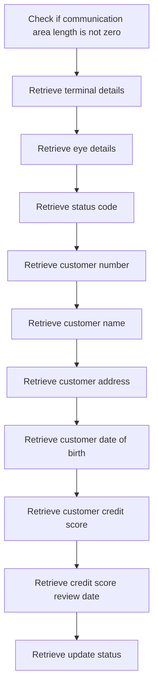

## Return control to CICS

This is the next section of the flow.

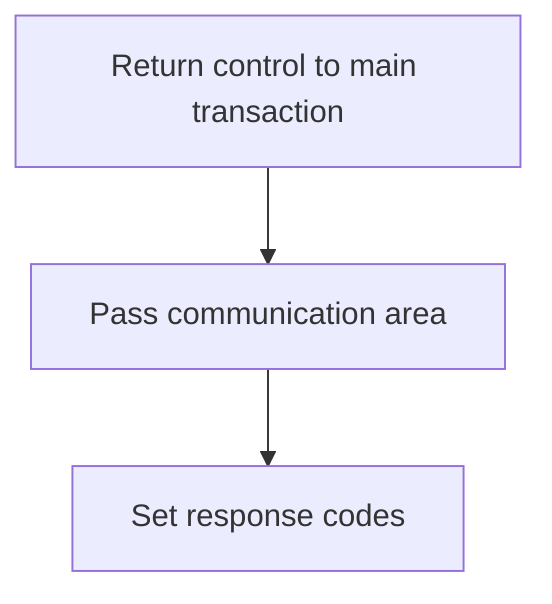

<SwmSnippet path="/src/base/cobol_src/BNK1DCS.cbl" line="326">

---

The <SwmToken path="src/base/cobol_src/BNK1DCS.cbl" pos="326:1:1" line-data="           EXEC CICS">`EXEC`</SwmToken>` `<SwmToken path="src/base/cobol_src/BNK1DCS.cbl" pos="326:3:3" line-data="           EXEC CICS">`CICS`</SwmToken>`RETURN`<SwmToken path="src/base/cobol_src/BNK1DCS.cbl" pos="327:3:3" line-data="              RETURN TRANSID(&#39;ODCS&#39;)">`TRANSID`</SwmToken>`(`<SwmToken path="src/base/cobol_src/BNK1DCS.cbl" pos="327:6:6" line-data="              RETURN TRANSID(&#39;ODCS&#39;)">`ODCS`</SwmToken>`)` statement returns control to the main transaction processing program, identified by the transaction ID 'ODCS'. This ensures that the main transaction continues processing after the current operation is completed.

```cobol
           EXEC CICS
              RETURN TRANSID('ODCS')
              COMMAREA(WS-COMM-AREA)
              LENGTH(266)
              RESP(WS-CICS-RESP)
              RESP2(WS-CICS-RESP2)
           END-EXEC.
```

---

</SwmSnippet>

## Handle abnormal termination

Now, lets zoom into this section of the flow:

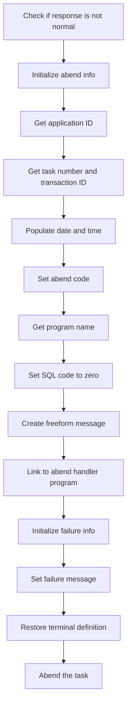

### Initializing abend information

### Checking response status

First, the code checks if the response status <SwmToken path="src/base/cobol_src/BNK1DCS.cbl" pos="236:3:7" line-data="                    RESP(WS-CICS-RESP)">`WS-CICS-RESP`</SwmToken> is not equal to <SwmToken path="src/base/cobol_src/BNK1DCS.cbl" pos="532:13:16" line-data="              IF WS-CICS-RESP NOT = DFHRESP(NORMAL)">`DFHRESP(NORMAL)`</SwmToken>. This indicates that an abnormal condition has occurred and requires special handling.

<SwmSnippet path="/src/base/cobol_src/BNK1DCS.cbl" line="341">

---

Moving to the next step, the code initializes the <SwmToken path="src/base/cobol_src/BNK1DCS.cbl" pos="341:3:5" line-data="              INITIALIZE ABNDINFO-REC">`ABNDINFO-REC`</SwmToken> structure to prepare for capturing abend-related information. This ensures that all relevant fields are reset before populating them with new data.

```cobol
              INITIALIZE ABNDINFO-REC
```

---

</SwmSnippet>

<SwmSnippet path="/src/base/cobol_src/BNK1DCS.cbl" line="342">

---

### Capturing response codes

Next, the response codes <SwmToken path="src/base/cobol_src/BNK1DCS.cbl" pos="342:3:3" line-data="              MOVE EIBRESP    TO ABND-RESPCODE">`EIBRESP`</SwmToken> and <SwmToken path="src/base/cobol_src/BNK1DCS.cbl" pos="343:3:3" line-data="              MOVE EIBRESP2   TO ABND-RESP2CODE">`EIBRESP2`</SwmToken> are moved to <SwmToken path="src/base/cobol_src/BNK1DCS.cbl" pos="342:7:9" line-data="              MOVE EIBRESP    TO ABND-RESPCODE">`ABND-RESPCODE`</SwmToken> and <SwmToken path="src/base/cobol_src/BNK1DCS.cbl" pos="343:7:9" line-data="              MOVE EIBRESP2   TO ABND-RESP2CODE">`ABND-RESP2CODE`</SwmToken> respectively. These codes provide specific details about the error condition encountered.

```cobol
              MOVE EIBRESP    TO ABND-RESPCODE
              MOVE EIBRESP2   TO ABND-RESP2CODE
```

---

</SwmSnippet>

<SwmSnippet path="/src/base/cobol_src/BNK1DCS.cbl" line="347">

---

### Gathering supplemental information

Then, the code gathers supplemental information such as the application ID, task number, and transaction ID. This information is crucial for identifying the context in which the error occurred.

```cobol
              EXEC CICS ASSIGN APPLID(ABND-APPLID)
              END-EXEC

              MOVE EIBTASKN   TO ABND-TASKNO-KEY
              MOVE EIBTRNID   TO ABND-TRANID

```

---

</SwmSnippet>

<SwmSnippet path="/src/base/cobol_src/BNK1DCS.cbl" line="353">

---

### Populating date and time

The <SwmToken path="src/base/cobol_src/BNK1DCS.cbl" pos="353:3:7" line-data="              PERFORM POPULATE-TIME-DATE">`POPULATE-TIME-DATE`</SwmToken> routine is performed to get the current date and time, which are then formatted and stored in <SwmToken path="src/base/cobol_src/BNK1DCS.cbl" pos="355:11:13" line-data="              MOVE WS-ORIG-DATE TO ABND-DATE">`ABND-DATE`</SwmToken> and <SwmToken path="src/base/cobol_src/BNK1DCS.cbl" pos="361:3:5" line-data="                     INTO ABND-TIME">`ABND-TIME`</SwmToken>. This timestamp helps in tracking when the error occurred.

```cobol
              PERFORM POPULATE-TIME-DATE

              MOVE WS-ORIG-DATE TO ABND-DATE
              STRING WS-TIME-NOW-GRP-HH DELIMITED BY SIZE,
                    ':' DELIMITED BY SIZE,
                     WS-TIME-NOW-GRP-MM DELIMITED BY SIZE,
                     ':' DELIMITED BY SIZE,
                     WS-TIME-NOW-GRP-MM DELIMITED BY SIZE
                     INTO ABND-TIME
```

---

</SwmSnippet>

<SwmSnippet path="/src/base/cobol_src/BNK1DCS.cbl" line="365">

---

### Setting abend code and program name

The abend code <SwmToken path="src/base/cobol_src/BNK1DCS.cbl" pos="365:4:4" line-data="              MOVE &#39;HBNK&#39;      TO ABND-CODE">`HBNK`</SwmToken> is set in <SwmToken path="src/base/cobol_src/BNK1DCS.cbl" pos="365:9:11" line-data="              MOVE &#39;HBNK&#39;      TO ABND-CODE">`ABND-CODE`</SwmToken>, and the current program name is assigned to <SwmToken path="src/base/cobol_src/BNK1DCS.cbl" pos="367:9:11" line-data="              EXEC CICS ASSIGN PROGRAM(ABND-PROGRAM)">`ABND-PROGRAM`</SwmToken>. These fields help in identifying the source of the error.

```cobol
              MOVE 'HBNK'      TO ABND-CODE

              EXEC CICS ASSIGN PROGRAM(ABND-PROGRAM)
              END-EXEC
```

---

</SwmSnippet>

<SwmSnippet path="/src/base/cobol_src/BNK1DCS.cbl" line="372">

---

### Creating freeform message

A freeform message is created by concatenating various pieces of information, including a description of the error and the response codes. This message is stored in <SwmToken path="src/base/cobol_src/BNK1DCS.cbl" pos="378:3:5" line-data="                    INTO ABND-FREEFORM">`ABND-FREEFORM`</SwmToken> for logging purposes.

```cobol
              STRING 'A010 - RETURN TRANSID(ODCS) FAIL'
                    DELIMITED BY SIZE,
                    'EIBRESP=' DELIMITED BY SIZE,
                    ABND-RESPCODE DELIMITED BY SIZE,
                    ' RESP2=' DELIMITED BY SIZE,
                    ABND-RESP2CODE DELIMITED BY SIZE
                    INTO ABND-FREEFORM
```

---

</SwmSnippet>

<SwmSnippet path="/src/base/cobol_src/BNK1DCS.cbl" line="381">

---

### Linking to abend handler program

The code then links to the abend handler program specified in <SwmToken path="src/base/cobol_src/BNK1DCS.cbl" pos="381:9:13" line-data="              EXEC CICS LINK PROGRAM(WS-ABEND-PGM)">`WS-ABEND-PGM`</SwmToken>, passing the <SwmToken path="src/base/cobol_src/BNK1DCS.cbl" pos="382:3:5" line-data="                        COMMAREA(ABNDINFO-REC)">`ABNDINFO-REC`</SwmToken> structure. This step ensures that the abend information is processed and logged appropriately.

```cobol
              EXEC CICS LINK PROGRAM(WS-ABEND-PGM)
                        COMMAREA(ABNDINFO-REC)
              END-EXEC
```

---

</SwmSnippet>

<SwmSnippet path="/src/base/cobol_src/BNK1DCS.cbl" line="386">

---

### Finalizing abend handling

Finally, the code initializes the failure information structure, sets a failure message, and performs routines to restore the terminal definition and abend the task. These steps ensure that the system is left in a consistent state after handling the error.

```cobol
              INITIALIZE WS-FAIL-INFO
              MOVE 'BNK1DCS - A010 - RETURN TRANSID(ODCS) FAIL' TO
                 WS-CICS-FAIL-MSG
              MOVE WS-CICS-RESP  TO WS-CICS-RESP-DISP
              MOVE WS-CICS-RESP2 TO WS-CICS-RESP2-DISP

              PERFORM RESTORE-TERM-DEF
              PERFORM ABEND-THIS-TASK
```

---

</SwmSnippet>

## Exit

This is the next section of the flow.

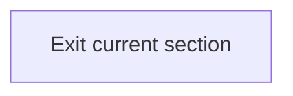

<SwmSnippet path="/src/base/cobol_src/BNK1DCS.cbl" line="396">

---

The <SwmToken path="src/base/cobol_src/BNK1DCS.cbl" pos="396:1:1" line-data="       A999.">`A999`</SwmToken> label marks the end of the current section in the program. This is a common practice in COBOL to define exit points for different sections of the code. The <SwmToken path="src/base/cobol_src/BNK1DCS.cbl" pos="397:1:1" line-data="           EXIT.">`EXIT`</SwmToken> statement is used to leave the current section and return control to the calling program or the next section of code. This ensures that the program flow is managed correctly and that resources are released appropriately.

```cobol
       A999.
           EXIT.
```

---

</SwmSnippet>

## <SwmToken path="src/base/cobol_src/BNK1DCS.cbl" pos="211:3:7" line-data="                 PERFORM STORE-TERM-DEF">`STORE-TERM-DEF`</SwmToken>

Lets' zoom into this section of the flow:

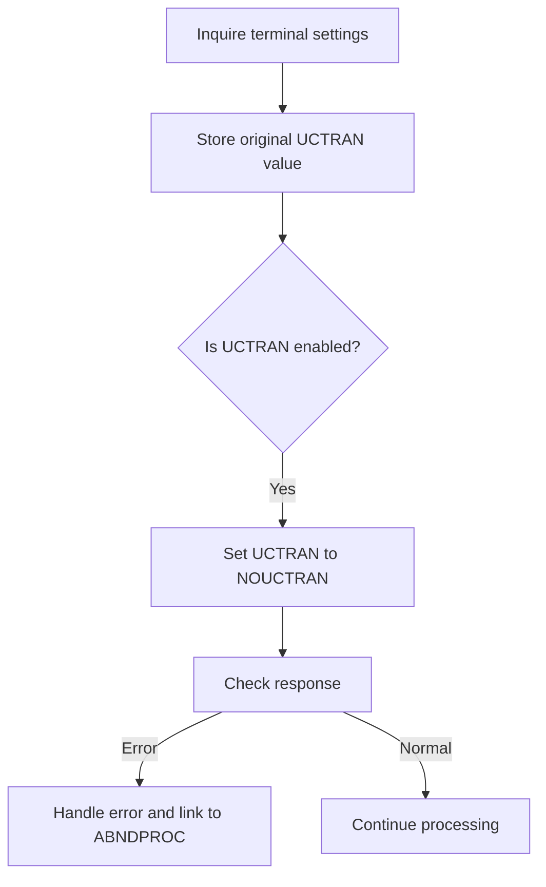

<SwmSnippet path="/src/base/cobol_src/BNK1DCS.cbl" line="1648">

---

### Inquiring terminal settings

First, the terminal settings are inquired to retrieve the current uppercase translation setting (<SwmToken path="src/base/cobol_src/BNK1DCS.cbl" pos="1650:5:5" line-data="                UCTRANST(WS-UCTRANS)">`UCTRANS`</SwmToken>). This is done using the <SwmToken path="src/base/cobol_src/BNK1DCS.cbl" pos="1648:1:5" line-data="           EXEC CICS INQUIRE">`EXEC CICS INQUIRE`</SwmToken> command, which stores the result in <SwmToken path="src/base/cobol_src/BNK1DCS.cbl" pos="1650:3:5" line-data="                UCTRANST(WS-UCTRANS)">`WS-UCTRANS`</SwmToken>.

```cobol
           EXEC CICS INQUIRE
                TERMINAL(EIBTRMID)
                UCTRANST(WS-UCTRANS)
                RESP(WS-CICS-RESP)
                RESP2(WS-CICS-RESP2)
```

---

</SwmSnippet>

<SwmSnippet path="/src/base/cobol_src/BNK1DCS.cbl" line="1658">

---

### Storing original UCTRAN value

Next, the original <SwmToken path="src/base/cobol_src/BNK1DCS.cbl" pos="229:9:9" line-data="      *          Set the terminal UCTRAN back to its starting position">`UCTRAN`</SwmToken> value is stored in <SwmToken path="src/base/cobol_src/BNK1DCS.cbl" pos="1658:9:11" line-data="           MOVE WS-UCTRANS TO STORED-UCTRANS.">`STORED-UCTRANS`</SwmToken> to preserve the initial state of the terminal's uppercase translation setting.

```cobol
           MOVE WS-UCTRANS TO STORED-UCTRANS.
```

---

</SwmSnippet>

<SwmSnippet path="/src/base/cobol_src/BNK1DCS.cbl" line="1664">

---

### Checking and setting UCTRAN

Moving to the next step, the code checks if the <SwmToken path="src/base/cobol_src/BNK1DCS.cbl" pos="1664:5:5" line-data="           IF WS-UCTRANS = DFHVALUE(UCTRAN) OR">`UCTRANS`</SwmToken> setting is enabled by comparing <SwmToken path="src/base/cobol_src/BNK1DCS.cbl" pos="1664:3:5" line-data="           IF WS-UCTRANS = DFHVALUE(UCTRAN) OR">`WS-UCTRANS`</SwmToken> with <SwmToken path="src/base/cobol_src/BNK1DCS.cbl" pos="1664:9:12" line-data="           IF WS-UCTRANS = DFHVALUE(UCTRAN) OR">`DFHVALUE(UCTRAN)`</SwmToken> or <SwmToken path="src/base/cobol_src/BNK1DCS.cbl" pos="1665:7:10" line-data="           WS-UCTRANS = DFHVALUE(TRANIDONLY)">`DFHVALUE(TRANIDONLY)`</SwmToken>. If it is enabled, the <SwmToken path="src/base/cobol_src/BNK1DCS.cbl" pos="1664:5:5" line-data="           IF WS-UCTRANS = DFHVALUE(UCTRAN) OR">`UCTRANS`</SwmToken> setting is changed to <SwmToken path="src/base/cobol_src/BNK1DCS.cbl" pos="1667:3:6" line-data="              MOVE DFHVALUE(NOUCTRAN) TO WS-UCTRANS">`DFHVALUE(NOUCTRAN)`</SwmToken> to disable uppercase translation.

```cobol
           IF WS-UCTRANS = DFHVALUE(UCTRAN) OR
           WS-UCTRANS = DFHVALUE(TRANIDONLY)

              MOVE DFHVALUE(NOUCTRAN) TO WS-UCTRANS
```

---

</SwmSnippet>

<SwmSnippet path="/src/base/cobol_src/BNK1DCS.cbl" line="1669">

---

### Setting terminal UCTRAN

Then, the terminal's <SwmToken path="src/base/cobol_src/BNK1DCS.cbl" pos="1670:5:5" line-data="                 UCTRANST(WS-UCTRANS)">`UCTRANS`</SwmToken> setting is updated with the new value using the <SwmToken path="src/base/cobol_src/BNK1DCS.cbl" pos="1669:1:7" line-data="              EXEC CICS SET TERMINAL(EIBTRMID)">`EXEC CICS SET TERMINAL`</SwmToken> command.

```cobol
              EXEC CICS SET TERMINAL(EIBTRMID)
                 UCTRANST(WS-UCTRANS)
                 RESP(WS-CICS-RESP)
                 RESP2(WS-CICS-RESP2)
              END-EXEC
```

---

</SwmSnippet>

<SwmSnippet path="/src/base/cobol_src/BNK1DCS.cbl" line="1676">

---

### Handling errors

Next, the code checks if the response from the <SwmToken path="src/base/cobol_src/BNK1DCS.cbl" pos="525:5:7" line-data="              EXEC CICS SET TERMINAL(EIBTRMID)">`SET TERMINAL`</SwmToken> command is not normal. If an error occurs, it initializes the <SwmToken path="src/base/cobol_src/BNK1DCS.cbl" pos="1683:3:5" line-data="                 INITIALIZE ABNDINFO-REC">`ABNDINFO-REC`</SwmToken> structure and populates it with relevant information such as response codes, application ID, task number, transaction ID, date, and time. This information is used to diagnose the issue.

```cobol
              IF WS-CICS-RESP NOT = DFHRESP(NORMAL)
      *
      *          Preserve the RESP and RESP2, then set up the
      *          standard ABEND info before getting the applid,
      *          date/time etc. and linking to the Abend Handler
      *          program.
      *
                 INITIALIZE ABNDINFO-REC
                 MOVE EIBRESP    TO ABND-RESPCODE
                 MOVE EIBRESP2   TO ABND-RESP2CODE
      *
      *          Get supplemental information
      *
                 EXEC CICS ASSIGN APPLID(ABND-APPLID)
                 END-EXEC

                 MOVE EIBTASKN   TO ABND-TASKNO-KEY
                 MOVE EIBTRNID   TO ABND-TRANID

                 PERFORM POPULATE-TIME-DATE

```

---

</SwmSnippet>

<SwmSnippet path="/src/base/cobol_src/BNK1DCS.cbl" line="1723">

---

### Linking to ABNDPROC

Finally, if an error is detected, the code links to the <SwmToken path="src/base/cobol_src/BNK1DCS.cbl" pos="166:19:19" line-data="       01 WS-ABEND-PGM                  PIC X(8) VALUE &#39;ABNDPROC&#39;.">`ABNDPROC`</SwmToken> program by passing the <SwmToken path="src/base/cobol_src/BNK1DCS.cbl" pos="1724:3:5" line-data="                           COMMAREA(ABNDINFO-REC)">`ABNDINFO-REC`</SwmToken> structure. This program handles the abnormal termination processing, logging the error details for further investigation.

```cobol
                 EXEC CICS LINK PROGRAM(WS-ABEND-PGM)
                           COMMAREA(ABNDINFO-REC)
                 END-EXEC
```

---

</SwmSnippet>

## <SwmToken path="src/base/cobol_src/BNK1DCS.cbl" pos="353:3:7" line-data="              PERFORM POPULATE-TIME-DATE">`POPULATE-TIME-DATE`</SwmToken>

Lets' zoom into this section of the flow:

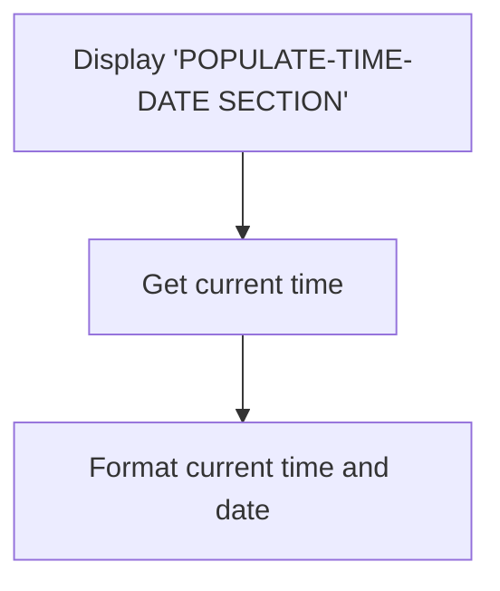

<SwmSnippet path="/src/base/cobol_src/BNK1DCS.cbl" line="1923">

---

First, the section displays the message '<SwmToken path="src/base/cobol_src/BNK1DCS.cbl" pos="1923:6:10" line-data="      D    DISPLAY &#39;POPULATE-TIME-DATE SECTION&#39;.">`POPULATE-TIME-DATE`</SwmToken> SECTION' to indicate the start of the process.

```cobol
      D    DISPLAY 'POPULATE-TIME-DATE SECTION'.
```

---

</SwmSnippet>

<SwmSnippet path="/src/base/cobol_src/BNK1DCS.cbl" line="1925">

---

Next, it retrieves the current time using the <SwmToken path="src/base/cobol_src/BNK1DCS.cbl" pos="1925:1:5" line-data="           EXEC CICS ASKTIME">`EXEC CICS ASKTIME`</SwmToken> command, which stores the time in the <SwmToken path="src/base/cobol_src/BNK1DCS.cbl" pos="1926:3:7" line-data="              ABSTIME(WS-U-TIME)">`WS-U-TIME`</SwmToken> variable.

```cobol
           EXEC CICS ASKTIME
              ABSTIME(WS-U-TIME)
```

---

</SwmSnippet>

<SwmSnippet path="/src/base/cobol_src/BNK1DCS.cbl" line="1929">

---

Then, the section formats the retrieved time and date using the <SwmToken path="src/base/cobol_src/BNK1DCS.cbl" pos="1929:1:5" line-data="           EXEC CICS FORMATTIME">`EXEC CICS FORMATTIME`</SwmToken> command. This command converts the time stored in <SwmToken path="src/base/cobol_src/BNK1DCS.cbl" pos="1930:3:7" line-data="                     ABSTIME(WS-U-TIME)">`WS-U-TIME`</SwmToken> into a human-readable date format stored in <SwmToken path="src/base/cobol_src/BNK1DCS.cbl" pos="1931:3:7" line-data="                     DDMMYYYY(WS-ORIG-DATE)">`WS-ORIG-DATE`</SwmToken> and the current time stored in <SwmToken path="src/base/cobol_src/BNK1DCS.cbl" pos="1932:3:7" line-data="                     TIME(WS-TIME-NOW)">`WS-TIME-NOW`</SwmToken>.

```cobol
           EXEC CICS FORMATTIME
                     ABSTIME(WS-U-TIME)
                     DDMMYYYY(WS-ORIG-DATE)
                     TIME(WS-TIME-NOW)
```

---

</SwmSnippet>

<SwmSnippet path="/src/base/cobol_src/BNK1DCS.cbl" line="1936">

---

Finally, the section ends with an <SwmToken path="src/base/cobol_src/BNK1DCS.cbl" pos="1937:1:1" line-data="           EXIT.">`EXIT`</SwmToken> statement, indicating the completion of the time and date population process.

```cobol
       PTD999.
           EXIT.
```

---

</SwmSnippet>

## <SwmToken path="src/base/cobol_src/BNK1DCS.cbl" pos="231:3:7" line-data="                 PERFORM RESTORE-TERM-DEF">`RESTORE-TERM-DEF`</SwmToken>

Lets' zoom into this section of the flow:

```mermaid
graph TD
  A[Move DFHCOMMAREA to WS-COMM-AREA] --> B[Move WS-COMM-TERM to WS-UCTRANS] --> C[Set terminal UCTRANST to WS-UCTRANS] --> D{Check if WS-CICS-RESP is NORMAL}
  D -- No --> E[Initialize ABNDINFO-REC] --> F[Move EIBRESP to ABND-RESPCODE] --> G[Move EIBRESP2 to ABND-RESP2CODE] --> H[Assign APPLID to ABND-APPLID] --> I[Move EIBTASKN to ABND-TASKNO-KEY] --> J[Move EIBTRNID to ABND-TRANID] --> K[Perform POPULATE-TIME-DATE] --> L[Move WS-ORIG-DATE to ABND-DATE] --> M[Format and move current time to ABND-TIME] --> N[Move WS-U-TIME to ABND-UTIME-KEY] --> O[Move 'HBNK' to ABND-CODE] --> P[Assign PROGRAM to ABND-PROGRAM] --> Q[Move ZEROS to ABND-SQLCODE] --> R[Format and move failure message to ABND-FREEFORM] --> S[Link to ABEND handler program] --> T[Initialize WS-FAIL-INFO] --> U[Move failure message to WS-CICS-FAIL-MSG] --> V[Move WS-CICS-RESP to WS-CICS-RESP-DISP] --> W[Move WS-CICS-RESP2 to WS-CICS-RESP2-DISP] --> X[Perform ABEND-THIS-TASK]

%% Swimm:
%% graph TD
%%   A[Move DFHCOMMAREA to <SwmToken path="src/base/cobol_src/BNK1DCS.cbl" pos="209:3:7" line-data="                 INITIALIZE WS-COMM-AREA">`WS-COMM-AREA`</SwmToken>] --> B[Move <SwmToken path="src/base/cobol_src/BNK1DCS.cbl" pos="213:9:13" line-data="                 MOVE STORED-UCTRANS TO WS-COMM-TERM">`WS-COMM-TERM`</SwmToken> to <SwmToken path="src/base/cobol_src/BNK1DCS.cbl" pos="511:3:5" line-data="                UCTRANST(WS-UCTRANS)">`WS-UCTRANS`</SwmToken>] --> C[Set terminal UCTRANST to <SwmToken path="src/base/cobol_src/BNK1DCS.cbl" pos="511:3:5" line-data="                UCTRANST(WS-UCTRANS)">`WS-UCTRANS`</SwmToken>] --> D{Check if <SwmToken path="src/base/cobol_src/BNK1DCS.cbl" pos="236:3:7" line-data="                    RESP(WS-CICS-RESP)">`WS-CICS-RESP`</SwmToken> is NORMAL}
%%   D -- No --> E[Initialize <SwmToken path="src/base/cobol_src/BNK1DCS.cbl" pos="341:3:5" line-data="              INITIALIZE ABNDINFO-REC">`ABNDINFO-REC`</SwmToken>] --> F[Move EIBRESP to <SwmToken path="src/base/cobol_src/BNK1DCS.cbl" pos="342:7:9" line-data="              MOVE EIBRESP    TO ABND-RESPCODE">`ABND-RESPCODE`</SwmToken>] --> G[Move <SwmToken path="src/base/cobol_src/BNK1DCS.cbl" pos="343:3:3" line-data="              MOVE EIBRESP2   TO ABND-RESP2CODE">`EIBRESP2`</SwmToken> to <SwmToken path="src/base/cobol_src/BNK1DCS.cbl" pos="343:7:9" line-data="              MOVE EIBRESP2   TO ABND-RESP2CODE">`ABND-RESP2CODE`</SwmToken>] --> H[Assign APPLID to <SwmToken path="src/base/cobol_src/BNK1DCS.cbl" pos="347:9:11" line-data="              EXEC CICS ASSIGN APPLID(ABND-APPLID)">`ABND-APPLID`</SwmToken>] --> I[Move EIBTASKN to <SwmToken path="src/base/cobol_src/BNK1DCS.cbl" pos="350:7:11" line-data="              MOVE EIBTASKN   TO ABND-TASKNO-KEY">`ABND-TASKNO-KEY`</SwmToken>] --> J[Move EIBTRNID to <SwmToken path="src/base/cobol_src/BNK1DCS.cbl" pos="351:7:9" line-data="              MOVE EIBTRNID   TO ABND-TRANID">`ABND-TRANID`</SwmToken>] --> K[Perform <SwmToken path="src/base/cobol_src/BNK1DCS.cbl" pos="353:3:7" line-data="              PERFORM POPULATE-TIME-DATE">`POPULATE-TIME-DATE`</SwmToken>] --> L[Move <SwmToken path="src/base/cobol_src/BNK1DCS.cbl" pos="355:3:7" line-data="              MOVE WS-ORIG-DATE TO ABND-DATE">`WS-ORIG-DATE`</SwmToken> to <SwmToken path="src/base/cobol_src/BNK1DCS.cbl" pos="355:11:13" line-data="              MOVE WS-ORIG-DATE TO ABND-DATE">`ABND-DATE`</SwmToken>] --> M[Format and move current time to <SwmToken path="src/base/cobol_src/BNK1DCS.cbl" pos="361:3:5" line-data="                     INTO ABND-TIME">`ABND-TIME`</SwmToken>] --> N[Move <SwmToken path="src/base/cobol_src/BNK1DCS.cbl" pos="562:3:7" line-data="                 MOVE WS-U-TIME   TO ABND-UTIME-KEY">`WS-U-TIME`</SwmToken> to <SwmToken path="src/base/cobol_src/BNK1DCS.cbl" pos="562:11:15" line-data="                 MOVE WS-U-TIME   TO ABND-UTIME-KEY">`ABND-UTIME-KEY`</SwmToken>] --> O[Move 'HBNK' to <SwmToken path="src/base/cobol_src/BNK1DCS.cbl" pos="365:9:11" line-data="              MOVE &#39;HBNK&#39;      TO ABND-CODE">`ABND-CODE`</SwmToken>] --> P[Assign PROGRAM to <SwmToken path="src/base/cobol_src/BNK1DCS.cbl" pos="367:9:11" line-data="              EXEC CICS ASSIGN PROGRAM(ABND-PROGRAM)">`ABND-PROGRAM`</SwmToken>] --> Q[Move ZEROS to <SwmToken path="src/base/cobol_src/BNK1DCS.cbl" pos="643:7:9" line-data="              MOVE ZEROS      TO ABND-SQLCODE">`ABND-SQLCODE`</SwmToken>] --> R[Format and move failure message to <SwmToken path="src/base/cobol_src/BNK1DCS.cbl" pos="378:3:5" line-data="                    INTO ABND-FREEFORM">`ABND-FREEFORM`</SwmToken>] --> S[Link to ABEND handler program] --> T[Initialize <SwmToken path="src/base/cobol_src/BNK1DCS.cbl" pos="386:3:7" line-data="              INITIALIZE WS-FAIL-INFO">`WS-FAIL-INFO`</SwmToken>] --> U[Move failure message to <SwmToken path="src/base/cobol_src/BNK1DCS.cbl" pos="388:1:7" line-data="                 WS-CICS-FAIL-MSG">`WS-CICS-FAIL-MSG`</SwmToken>] --> V[Move <SwmToken path="src/base/cobol_src/BNK1DCS.cbl" pos="236:3:7" line-data="                    RESP(WS-CICS-RESP)">`WS-CICS-RESP`</SwmToken> to <SwmToken path="src/base/cobol_src/BNK1DCS.cbl" pos="389:11:17" line-data="              MOVE WS-CICS-RESP  TO WS-CICS-RESP-DISP">`WS-CICS-RESP-DISP`</SwmToken>] --> W[Move <SwmToken path="src/base/cobol_src/BNK1DCS.cbl" pos="237:3:7" line-data="                    RESP2(WS-CICS-RESP2)">`WS-CICS-RESP2`</SwmToken> to <SwmToken path="src/base/cobol_src/BNK1DCS.cbl" pos="390:11:17" line-data="              MOVE WS-CICS-RESP2 TO WS-CICS-RESP2-DISP">`WS-CICS-RESP2-DISP`</SwmToken>] --> X[Perform <SwmToken path="src/base/cobol_src/BNK1DCS.cbl" pos="393:3:7" line-data="              PERFORM ABEND-THIS-TASK">`ABEND-THIS-TASK`</SwmToken>]
```

<SwmSnippet path="/src/base/cobol_src/BNK1DCS.cbl" line="1750">

---

First, the <SwmToken path="src/base/cobol_src/BNK1DCS.cbl" pos="1750:3:3" line-data="           MOVE DFHCOMMAREA TO WS-COMM-AREA.">`DFHCOMMAREA`</SwmToken> is moved to <SwmToken path="src/base/cobol_src/BNK1DCS.cbl" pos="1750:7:11" line-data="           MOVE DFHCOMMAREA TO WS-COMM-AREA.">`WS-COMM-AREA`</SwmToken>, which is a working storage area used to hold communication data.

```cobol
           MOVE DFHCOMMAREA TO WS-COMM-AREA.
```

---

</SwmSnippet>

<SwmSnippet path="/src/base/cobol_src/BNK1DCS.cbl" line="1752">

---

Next, the <SwmToken path="src/base/cobol_src/BNK1DCS.cbl" pos="1752:3:7" line-data="           MOVE WS-COMM-TERM TO WS-UCTRANS.">`WS-COMM-TERM`</SwmToken> is moved to <SwmToken path="src/base/cobol_src/BNK1DCS.cbl" pos="1752:11:13" line-data="           MOVE WS-COMM-TERM TO WS-UCTRANS.">`WS-UCTRANS`</SwmToken>, which holds the terminal's UCTRAN setting.

```cobol
           MOVE WS-COMM-TERM TO WS-UCTRANS.
```

---

</SwmSnippet>

<SwmSnippet path="/src/base/cobol_src/BNK1DCS.cbl" line="1754">

---

Then, the terminal's UCTRANST is set to <SwmToken path="src/base/cobol_src/BNK1DCS.cbl" pos="1755:3:5" line-data="               UCTRANST(WS-UCTRANS)">`WS-UCTRANS`</SwmToken> using the CICS <SwmToken path="src/base/cobol_src/BNK1DCS.cbl" pos="1754:5:7" line-data="           EXEC CICS SET TERMINAL(EIBTRMID)">`SET TERMINAL`</SwmToken> command.

```cobol
           EXEC CICS SET TERMINAL(EIBTRMID)
               UCTRANST(WS-UCTRANS)
               RESP(WS-CICS-RESP)
               RESP2(WS-CICS-RESP2)
           END-EXEC.
```

---

</SwmSnippet>

<SwmSnippet path="/src/base/cobol_src/BNK1DCS.cbl" line="1760">

---

Moving to the next step, the code checks if <SwmToken path="src/base/cobol_src/BNK1DCS.cbl" pos="1760:3:7" line-data="           IF WS-CICS-RESP NOT = DFHRESP(NORMAL)">`WS-CICS-RESP`</SwmToken> is not equal to <SwmToken path="src/base/cobol_src/BNK1DCS.cbl" pos="1760:13:16" line-data="           IF WS-CICS-RESP NOT = DFHRESP(NORMAL)">`DFHRESP(NORMAL)`</SwmToken>, indicating an abnormal response.

```cobol
           IF WS-CICS-RESP NOT = DFHRESP(NORMAL)
```

---

</SwmSnippet>

<SwmSnippet path="/src/base/cobol_src/BNK1DCS.cbl" line="1767">

---

If the response is abnormal, the <SwmToken path="src/base/cobol_src/BNK1DCS.cbl" pos="1767:3:5" line-data="              INITIALIZE ABNDINFO-REC">`ABNDINFO-REC`</SwmToken> is initialized to prepare for capturing abend information.

```cobol
              INITIALIZE ABNDINFO-REC
```

---

</SwmSnippet>

<SwmSnippet path="/src/base/cobol_src/BNK1DCS.cbl" line="1768">

---

The <SwmToken path="src/base/cobol_src/BNK1DCS.cbl" pos="1768:3:3" line-data="              MOVE EIBRESP    TO ABND-RESPCODE">`EIBRESP`</SwmToken> and <SwmToken path="src/base/cobol_src/BNK1DCS.cbl" pos="1769:3:3" line-data="              MOVE EIBRESP2   TO ABND-RESP2CODE">`EIBRESP2`</SwmToken> values are moved to <SwmToken path="src/base/cobol_src/BNK1DCS.cbl" pos="1768:7:9" line-data="              MOVE EIBRESP    TO ABND-RESPCODE">`ABND-RESPCODE`</SwmToken> and <SwmToken path="src/base/cobol_src/BNK1DCS.cbl" pos="1769:7:9" line-data="              MOVE EIBRESP2   TO ABND-RESP2CODE">`ABND-RESP2CODE`</SwmToken> respectively to capture the response codes.

```cobol
              MOVE EIBRESP    TO ABND-RESPCODE
              MOVE EIBRESP2   TO ABND-RESP2CODE
```

---

</SwmSnippet>

<SwmSnippet path="/src/base/cobol_src/BNK1DCS.cbl" line="1773">

---

The <SwmToken path="src/base/cobol_src/BNK1DCS.cbl" pos="1773:7:7" line-data="              EXEC CICS ASSIGN APPLID(ABND-APPLID)">`APPLID`</SwmToken> is assigned to <SwmToken path="src/base/cobol_src/BNK1DCS.cbl" pos="1773:9:11" line-data="              EXEC CICS ASSIGN APPLID(ABND-APPLID)">`ABND-APPLID`</SwmToken> to capture the application ID.

```cobol
              EXEC CICS ASSIGN APPLID(ABND-APPLID)
              END-EXEC
```

---

</SwmSnippet>

<SwmSnippet path="/src/base/cobol_src/BNK1DCS.cbl" line="1776">

---

The <SwmToken path="src/base/cobol_src/BNK1DCS.cbl" pos="1776:3:3" line-data="              MOVE EIBTASKN   TO ABND-TASKNO-KEY">`EIBTASKN`</SwmToken> and <SwmToken path="src/base/cobol_src/BNK1DCS.cbl" pos="1777:3:3" line-data="              MOVE EIBTRNID   TO ABND-TRANID">`EIBTRNID`</SwmToken> values are moved to <SwmToken path="src/base/cobol_src/BNK1DCS.cbl" pos="1776:7:11" line-data="              MOVE EIBTASKN   TO ABND-TASKNO-KEY">`ABND-TASKNO-KEY`</SwmToken> and <SwmToken path="src/base/cobol_src/BNK1DCS.cbl" pos="1777:7:9" line-data="              MOVE EIBTRNID   TO ABND-TRANID">`ABND-TRANID`</SwmToken> respectively to capture the task and transaction IDs.

```cobol
              MOVE EIBTASKN   TO ABND-TASKNO-KEY
              MOVE EIBTRNID   TO ABND-TRANID

```

---

</SwmSnippet>

<SwmSnippet path="/src/base/cobol_src/BNK1DCS.cbl" line="1779">

---

The <SwmToken path="src/base/cobol_src/BNK1DCS.cbl" pos="1779:3:7" line-data="              PERFORM POPULATE-TIME-DATE">`POPULATE-TIME-DATE`</SwmToken> routine is performed to get the current date and time.

```cobol
              PERFORM POPULATE-TIME-DATE
```

---

</SwmSnippet>

<SwmSnippet path="/src/base/cobol_src/BNK1DCS.cbl" line="1781">

---

The original date is moved to <SwmToken path="src/base/cobol_src/BNK1DCS.cbl" pos="1781:11:13" line-data="              MOVE WS-ORIG-DATE TO ABND-DATE">`ABND-DATE`</SwmToken>, and the current time is formatted and moved to <SwmToken path="src/base/cobol_src/BNK1DCS.cbl" pos="1787:3:5" line-data="                     INTO ABND-TIME">`ABND-TIME`</SwmToken>.

```cobol
              MOVE WS-ORIG-DATE TO ABND-DATE
              STRING WS-TIME-NOW-GRP-HH DELIMITED BY SIZE,
                    ':' DELIMITED BY SIZE,
                     WS-TIME-NOW-GRP-MM DELIMITED BY SIZE,
                     ':' DELIMITED BY SIZE,
                     WS-TIME-NOW-GRP-MM DELIMITED BY SIZE
                     INTO ABND-TIME
```

---

</SwmSnippet>

<SwmSnippet path="/src/base/cobol_src/BNK1DCS.cbl" line="1790">

---

The <SwmToken path="src/base/cobol_src/BNK1DCS.cbl" pos="1790:3:7" line-data="              MOVE WS-U-TIME   TO ABND-UTIME-KEY">`WS-U-TIME`</SwmToken> is moved to <SwmToken path="src/base/cobol_src/BNK1DCS.cbl" pos="1790:11:15" line-data="              MOVE WS-U-TIME   TO ABND-UTIME-KEY">`ABND-UTIME-KEY`</SwmToken>, and 'HBNK' is moved to <SwmToken path="src/base/cobol_src/BNK1DCS.cbl" pos="1791:9:11" line-data="              MOVE &#39;HBNK&#39;      TO ABND-CODE">`ABND-CODE`</SwmToken> to capture the unique time key and code.

```cobol
              MOVE WS-U-TIME   TO ABND-UTIME-KEY
              MOVE 'HBNK'      TO ABND-CODE
```

---

</SwmSnippet>

<SwmSnippet path="/src/base/cobol_src/BNK1DCS.cbl" line="1793">

---

The <SwmToken path="src/base/cobol_src/BNK1DCS.cbl" pos="1793:7:7" line-data="              EXEC CICS ASSIGN PROGRAM(ABND-PROGRAM)">`PROGRAM`</SwmToken> is assigned to <SwmToken path="src/base/cobol_src/BNK1DCS.cbl" pos="1793:9:11" line-data="              EXEC CICS ASSIGN PROGRAM(ABND-PROGRAM)">`ABND-PROGRAM`</SwmToken> to capture the program name.

```cobol
              EXEC CICS ASSIGN PROGRAM(ABND-PROGRAM)
              END-EXEC
```

---

</SwmSnippet>

<SwmSnippet path="/src/base/cobol_src/BNK1DCS.cbl" line="1796">

---

The <SwmToken path="src/base/cobol_src/BNK1DCS.cbl" pos="1796:7:9" line-data="              MOVE ZEROS      TO ABND-SQLCODE">`ABND-SQLCODE`</SwmToken> is set to zero, and a failure message is formatted and moved to <SwmToken path="src/base/cobol_src/BNK1DCS.cbl" pos="1804:3:5" line-data="                    INTO ABND-FREEFORM">`ABND-FREEFORM`</SwmToken>.

```cobol
              MOVE ZEROS      TO ABND-SQLCODE

              STRING 'RTD010 - SET TERMINAL UC FAIL'
                    DELIMITED BY SIZE,
                    'EIBRESP=' DELIMITED BY SIZE,
                    ABND-RESPCODE DELIMITED BY SIZE,
                    ' RESP2=' DELIMITED BY SIZE,
                    ABND-RESP2CODE DELIMITED BY SIZE
                    INTO ABND-FREEFORM
```

---

</SwmSnippet>

<SwmSnippet path="/src/base/cobol_src/BNK1DCS.cbl" line="1807">

---

Finally, the abend handler program is linked to, and the failure information is initialized and moved to <SwmToken path="src/base/cobol_src/BNK1DCS.cbl" pos="1813:3:9" line-data="                 TO WS-CICS-FAIL-MSG">`WS-CICS-FAIL-MSG`</SwmToken>, <SwmToken path="src/base/cobol_src/BNK1DCS.cbl" pos="1814:11:17" line-data="              MOVE WS-CICS-RESP  TO WS-CICS-RESP-DISP">`WS-CICS-RESP-DISP`</SwmToken>, and <SwmToken path="src/base/cobol_src/BNK1DCS.cbl" pos="1815:11:17" line-data="              MOVE WS-CICS-RESP2 TO WS-CICS-RESP2-DISP">`WS-CICS-RESP2-DISP`</SwmToken>.

```cobol
              EXEC CICS LINK PROGRAM(WS-ABEND-PGM)
                        COMMAREA(ABNDINFO-REC)
              END-EXEC

              INITIALIZE WS-FAIL-INFO
              MOVE 'BNK1DCS - RTD010 - SET TERMINAL UC FAIL '
                 TO WS-CICS-FAIL-MSG
              MOVE WS-CICS-RESP  TO WS-CICS-RESP-DISP
              MOVE WS-CICS-RESP2 TO WS-CICS-RESP2-DISP
```

---

</SwmSnippet>

## <SwmToken path="src/base/cobol_src/BNK1DCS.cbl" pos="393:3:7" line-data="              PERFORM ABEND-THIS-TASK">`ABEND-THIS-TASK`</SwmToken>

Lets' zoom into this section of the flow:

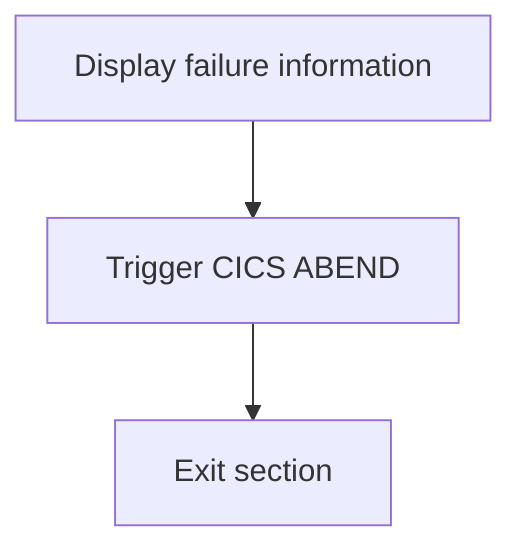

<SwmSnippet path="/src/base/cobol_src/BNK1DCS.cbl" line="1909">

---

### Displaying failure information

First, the function displays the failure information stored in <SwmToken path="src/base/cobol_src/BNK1DCS.cbl" pos="1909:3:7" line-data="           DISPLAY WS-FAIL-INFO.">`WS-FAIL-INFO`</SwmToken> (which includes details about the failure such as response codes and a message indicating the task is abending).

```cobol
           DISPLAY WS-FAIL-INFO.
```

---

</SwmSnippet>

<SwmSnippet path="/src/base/cobol_src/BNK1DCS.cbl" line="1911">

---

### Triggering CICS ABEND

Moving to the next step, the function triggers a CICS abnormal end (ABEND) with the code 'HBNK'. This is done to terminate the task immediately without generating a dump and to cancel the task.

```cobol
           EXEC CICS ABEND
              ABCODE('HBNK')
              NODUMP
              CANCEL
           END-EXEC.
```

---

</SwmSnippet>

<SwmSnippet path="/src/base/cobol_src/BNK1DCS.cbl" line="1917">

---

### Exiting the section

Finally, the function exits the section, completing the abnormal termination process.

```cobol
       ATT999.
           EXIT.
```

---

</SwmSnippet>

# Handle map sends (<SwmToken path="src/base/cobol_src/BNK1DCS.cbl" pos="215:3:5" line-data="                 PERFORM SEND-MAP">`SEND-MAP`</SwmToken>)

Let's split this section into smaller parts:

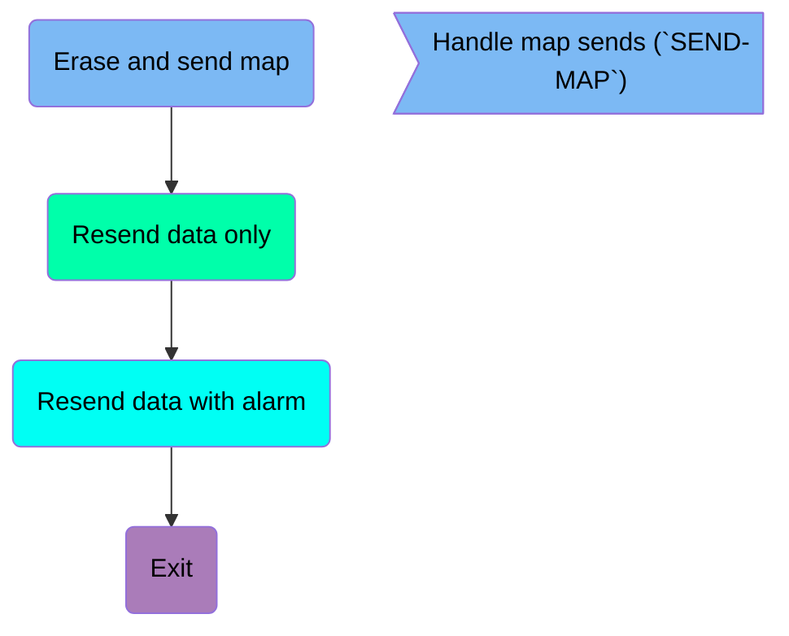

## Erase and send map

First, we'll zoom into this section of the flow:

```mermaid
graph TD
  A[Check if SEND-ERASE is set] -->|Yes| B[Send map with ERASE option]
  B --> C[Check CICS response]
  C -->|Error| D[Initialize ABEND info]
  D --> E[Get supplemental information]
  E --> F[Populate date and time]
  F --> G[Move additional info to ABEND record]
  G --> H[Link to ABEND handler]
  C -->|No Error| I[Go to SM999]

%% Swimm:
%% graph TD
%%   A[Check if <SwmToken path="src/base/cobol_src/BNK1DCS.cbl" pos="208:3:5" line-data="                 SET SEND-ERASE TO TRUE">`SEND-ERASE`</SwmToken> is set] -->|Yes| B[Send map with ERASE option]
%%   B --> C[Check CICS response]
%%   C -->|Error| D[Initialize ABEND info]
%%   D --> E[Get supplemental information]
%%   E --> F[Populate date and time]
%%   F --> G[Move additional info to ABEND record]
%%   G --> H[Link to ABEND handler]
%%   C -->|No Error| I[Go to <SwmToken path="src/base/cobol_src/BNK1DCS.cbl" pos="1480:5:5" line-data="              GO TO SM999">`SM999`</SwmToken>]
```

<SwmSnippet path="/src/base/cobol_src/BNK1DCS.cbl" line="1409">

---

### Checking <SwmToken path="src/base/cobol_src/BNK1DCS.cbl" pos="1409:3:5" line-data="           IF SEND-ERASE">`SEND-ERASE`</SwmToken> flag

First, the code checks if the <SwmToken path="src/base/cobol_src/BNK1DCS.cbl" pos="1409:3:5" line-data="           IF SEND-ERASE">`SEND-ERASE`</SwmToken> flag is set. This flag indicates whether the map data should be erased before sending the map to the terminal screen.

```cobol
           IF SEND-ERASE
```

---

</SwmSnippet>

<SwmSnippet path="/src/base/cobol_src/BNK1DCS.cbl" line="1410">

---

### Sending map with ERASE option

If the <SwmToken path="src/base/cobol_src/BNK1DCS.cbl" pos="208:3:5" line-data="                 SET SEND-ERASE TO TRUE">`SEND-ERASE`</SwmToken> flag is set, the map is sent with the <SwmToken path="src/base/cobol_src/BNK1DCS.cbl" pos="1413:1:1" line-data="                 ERASE">`ERASE`</SwmToken> option, which clears the current screen data before displaying the new map.

```cobol
              EXEC CICS SEND MAP('BNK1DC')
                 MAPSET('BNK1DCM')
                 FROM(BNK1DCO)
                 ERASE
                 CURSOR
                 RESP(WS-CICS-RESP)
                 RESP2(WS-CICS-RESP2)
              END-EXEC
```

---

</SwmSnippet>

<SwmSnippet path="/src/base/cobol_src/BNK1DCS.cbl" line="1419">

---

### Checking CICS response

Next, the code checks the CICS response to ensure that the map was sent successfully. If the response is not normal, it proceeds to handle the error.

```cobol
              IF WS-CICS-RESP NOT = DFHRESP(NORMAL)
```

---

</SwmSnippet>

<SwmSnippet path="/src/base/cobol_src/BNK1DCS.cbl" line="1426">

---

### Initializing ABEND info

If there is an error, the code initializes the ABEND information record to capture details about the error.

```cobol
                 INITIALIZE ABNDINFO-REC
```

---

</SwmSnippet>

<SwmSnippet path="/src/base/cobol_src/BNK1DCS.cbl" line="1432">

---

### Getting supplemental information

The code then retrieves supplemental information such as the application ID and task number to include in the ABEND record.

```cobol
                 EXEC CICS ASSIGN APPLID(ABND-APPLID)
                 END-EXEC
```

---

</SwmSnippet>

<SwmSnippet path="/src/base/cobol_src/BNK1DCS.cbl" line="1438">

---

### Populating date and time

The current date and time are populated into the ABEND record to provide a timestamp for when the error occurred.

```cobol
                 PERFORM POPULATE-TIME-DATE

                 MOVE WS-ORIG-DATE TO ABND-DATE
                 STRING WS-TIME-NOW-GRP-HH DELIMITED BY SIZE,
                       ':' DELIMITED BY SIZE,
                        WS-TIME-NOW-GRP-MM DELIMITED BY SIZE,
                        ':' DELIMITED BY SIZE,
                        WS-TIME-NOW-GRP-MM DELIMITED BY SIZE
                        INTO ABND-TIME
```

---

</SwmSnippet>

<SwmSnippet path="/src/base/cobol_src/BNK1DCS.cbl" line="1449">

---

### Moving additional info to ABEND record

Additional information such as the original date, user time, and a specific code are moved to the ABEND record.

```cobol
                 MOVE WS-U-TIME   TO ABND-UTIME-KEY
                 MOVE 'HBNK'      TO ABND-CODE
```

---

</SwmSnippet>

<SwmSnippet path="/src/base/cobol_src/BNK1DCS.cbl" line="1466">

---

### Linking to ABEND handler

Finally, the code links to the ABEND handler program, passing the ABEND information record to handle the error appropriately.

More about ABNDPROC: <SwmLink doc-title="Writing Abend Records (ABNDPROC)">[Writing Abend Records (ABNDPROC)](/.swm/writing-abend-records-abndproc.svfj4jn5.sw.md)</SwmLink>

```cobol
                 EXEC CICS LINK PROGRAM(WS-ABEND-PGM)
                           COMMAREA(ABNDINFO-REC)
                 END-EXEC
```

---

</SwmSnippet>

<SwmSnippet path="/src/base/cobol_src/BNK1DCS.cbl" line="1480">

---

### Going to <SwmToken path="src/base/cobol_src/BNK1DCS.cbl" pos="1480:5:5" line-data="              GO TO SM999">`SM999`</SwmToken>

If there is no error, the code proceeds to the next section labeled <SwmToken path="src/base/cobol_src/BNK1DCS.cbl" pos="1480:5:5" line-data="              GO TO SM999">`SM999`</SwmToken>.

```cobol
              GO TO SM999
           END-IF.
```

---

</SwmSnippet>

## Resend data only

Now, lets zoom into this section of the flow:

```mermaid
graph TD
  A[Check if SEND-DATAONLY is true] -->|Yes| B[SEND MAP with DATAONLY]
  B --> C[Check if WS-CICS-RESP is not NORMAL]
  C -->|Yes| D[Initialize ABNDINFO-REC]
  D --> E[Move EIBRESP and EIBRESP2 to ABND-RESPCODE and ABND-RESP2CODE]
  E --> F[Assign APPLID to ABND-APPLID]
  F --> G[Move EIBTASKN and EIBTRNID to ABND-TASKNO-KEY and ABND-TRANID]
  G --> H[Perform POPULATE-TIME-DATE]
  H --> I[Move WS-ORIG-DATE to ABND-DATE]
  I --> J[Create ABND-TIME string]
  J --> K[Move WS-U-TIME to ABND-UTIME-KEY]
  K --> L[Assign PROGRAM to ABND-PROGRAM]
  L --> M[Move ZEROS to ABND-SQLCODE]
  M --> N[Create ABND-FREEFORM string]
  N --> O[Link to WS-ABEND-PGM with ABNDINFO-REC]
  O --> P[Initialize WS-FAIL-INFO]
  P --> Q[Move failure message to WS-CICS-FAIL-MSG]
  Q --> R[Move WS-CICS-RESP and WS-CICS-RESP2 to display fields]
  R --> S[Perform RESTORE-TERM-DEF]
  S --> T[Perform ABEND-THIS-TASK]

%% Swimm:
%% graph TD
%%   A[Check if <SwmToken path="src/base/cobol_src/BNK1DCS.cbl" pos="300:3:5" line-data="                 SET SEND-DATAONLY-ALARM TO TRUE">`SEND-DATAONLY`</SwmToken> is true] -->|Yes| B[SEND MAP with DATAONLY]
%%   B --> C[Check if <SwmToken path="src/base/cobol_src/BNK1DCS.cbl" pos="236:3:7" line-data="                    RESP(WS-CICS-RESP)">`WS-CICS-RESP`</SwmToken> is not NORMAL]
%%   C -->|Yes| D[Initialize <SwmToken path="src/base/cobol_src/BNK1DCS.cbl" pos="341:3:5" line-data="              INITIALIZE ABNDINFO-REC">`ABNDINFO-REC`</SwmToken>]
%%   D --> E[Move EIBRESP and <SwmToken path="src/base/cobol_src/BNK1DCS.cbl" pos="343:3:3" line-data="              MOVE EIBRESP2   TO ABND-RESP2CODE">`EIBRESP2`</SwmToken> to <SwmToken path="src/base/cobol_src/BNK1DCS.cbl" pos="342:7:9" line-data="              MOVE EIBRESP    TO ABND-RESPCODE">`ABND-RESPCODE`</SwmToken> and <SwmToken path="src/base/cobol_src/BNK1DCS.cbl" pos="343:7:9" line-data="              MOVE EIBRESP2   TO ABND-RESP2CODE">`ABND-RESP2CODE`</SwmToken>]
%%   E --> F[Assign APPLID to <SwmToken path="src/base/cobol_src/BNK1DCS.cbl" pos="347:9:11" line-data="              EXEC CICS ASSIGN APPLID(ABND-APPLID)">`ABND-APPLID`</SwmToken>]
%%   F --> G[Move EIBTASKN and EIBTRNID to <SwmToken path="src/base/cobol_src/BNK1DCS.cbl" pos="350:7:11" line-data="              MOVE EIBTASKN   TO ABND-TASKNO-KEY">`ABND-TASKNO-KEY`</SwmToken> and <SwmToken path="src/base/cobol_src/BNK1DCS.cbl" pos="351:7:9" line-data="              MOVE EIBTRNID   TO ABND-TRANID">`ABND-TRANID`</SwmToken>]
%%   G --> H[Perform <SwmToken path="src/base/cobol_src/BNK1DCS.cbl" pos="353:3:7" line-data="              PERFORM POPULATE-TIME-DATE">`POPULATE-TIME-DATE`</SwmToken>]
%%   H --> I[Move <SwmToken path="src/base/cobol_src/BNK1DCS.cbl" pos="355:3:7" line-data="              MOVE WS-ORIG-DATE TO ABND-DATE">`WS-ORIG-DATE`</SwmToken> to <SwmToken path="src/base/cobol_src/BNK1DCS.cbl" pos="355:11:13" line-data="              MOVE WS-ORIG-DATE TO ABND-DATE">`ABND-DATE`</SwmToken>]
%%   I --> J[Create <SwmToken path="src/base/cobol_src/BNK1DCS.cbl" pos="361:3:5" line-data="                     INTO ABND-TIME">`ABND-TIME`</SwmToken> string]
%%   J --> K[Move <SwmToken path="src/base/cobol_src/BNK1DCS.cbl" pos="562:3:7" line-data="                 MOVE WS-U-TIME   TO ABND-UTIME-KEY">`WS-U-TIME`</SwmToken> to <SwmToken path="src/base/cobol_src/BNK1DCS.cbl" pos="562:11:15" line-data="                 MOVE WS-U-TIME   TO ABND-UTIME-KEY">`ABND-UTIME-KEY`</SwmToken>]
%%   K --> L[Assign PROGRAM to <SwmToken path="src/base/cobol_src/BNK1DCS.cbl" pos="367:9:11" line-data="              EXEC CICS ASSIGN PROGRAM(ABND-PROGRAM)">`ABND-PROGRAM`</SwmToken>]
%%   L --> M[Move ZEROS to <SwmToken path="src/base/cobol_src/BNK1DCS.cbl" pos="643:7:9" line-data="              MOVE ZEROS      TO ABND-SQLCODE">`ABND-SQLCODE`</SwmToken>]
%%   M --> N[Create <SwmToken path="src/base/cobol_src/BNK1DCS.cbl" pos="378:3:5" line-data="                    INTO ABND-FREEFORM">`ABND-FREEFORM`</SwmToken> string]
%%   N --> O[Link to <SwmToken path="src/base/cobol_src/BNK1DCS.cbl" pos="381:9:13" line-data="              EXEC CICS LINK PROGRAM(WS-ABEND-PGM)">`WS-ABEND-PGM`</SwmToken> with <SwmToken path="src/base/cobol_src/BNK1DCS.cbl" pos="341:3:5" line-data="              INITIALIZE ABNDINFO-REC">`ABNDINFO-REC`</SwmToken>]
%%   O --> P[Initialize <SwmToken path="src/base/cobol_src/BNK1DCS.cbl" pos="386:3:7" line-data="              INITIALIZE WS-FAIL-INFO">`WS-FAIL-INFO`</SwmToken>]
%%   P --> Q[Move failure message to <SwmToken path="src/base/cobol_src/BNK1DCS.cbl" pos="388:1:7" line-data="                 WS-CICS-FAIL-MSG">`WS-CICS-FAIL-MSG`</SwmToken>]
%%   Q --> R[Move <SwmToken path="src/base/cobol_src/BNK1DCS.cbl" pos="236:3:7" line-data="                    RESP(WS-CICS-RESP)">`WS-CICS-RESP`</SwmToken> and <SwmToken path="src/base/cobol_src/BNK1DCS.cbl" pos="237:3:7" line-data="                    RESP2(WS-CICS-RESP2)">`WS-CICS-RESP2`</SwmToken> to display fields]
%%   R --> S[Perform <SwmToken path="src/base/cobol_src/BNK1DCS.cbl" pos="231:3:7" line-data="                 PERFORM RESTORE-TERM-DEF">`RESTORE-TERM-DEF`</SwmToken>]
%%   S --> T[Perform <SwmToken path="src/base/cobol_src/BNK1DCS.cbl" pos="393:3:7" line-data="              PERFORM ABEND-THIS-TASK">`ABEND-THIS-TASK`</SwmToken>]
```

First, the code checks if <SwmToken path="src/base/cobol_src/BNK1DCS.cbl" pos="300:3:5" line-data="                 SET SEND-DATAONLY-ALARM TO TRUE">`SEND-DATAONLY`</SwmToken> is true, which indicates that only the data needs to be resent.

<SwmSnippet path="/src/base/cobol_src/BNK1DCS.cbl" line="1486">

---

If <SwmToken path="src/base/cobol_src/BNK1DCS.cbl" pos="1486:3:5" line-data="           IF SEND-DATAONLY">`SEND-DATAONLY`</SwmToken> is true, the <SwmToken path="src/base/cobol_src/BNK1DCS.cbl" pos="1487:5:7" line-data="              EXEC CICS SEND MAP(&#39;BNK1DC&#39;)">`SEND MAP`</SwmToken> command is executed with the <SwmToken path="src/base/cobol_src/BNK1DCS.cbl" pos="1486:5:5" line-data="           IF SEND-DATAONLY">`DATAONLY`</SwmToken> option to resend the map data.

```cobol
           IF SEND-DATAONLY
              EXEC CICS SEND MAP('BNK1DC')
                 MAPSET('BNK1DCM')
                 FROM(BNK1DCO)
                 DATAONLY
                 CURSOR
                 RESP(WS-CICS-RESP)
                 RESP2(WS-CICS-RESP2)
              END-EXEC
```

---

</SwmSnippet>

<SwmSnippet path="/src/base/cobol_src/BNK1DCS.cbl" line="1496">

---

Next, the code checks if the response code <SwmToken path="src/base/cobol_src/BNK1DCS.cbl" pos="1496:3:7" line-data="              IF WS-CICS-RESP NOT = DFHRESP(NORMAL)">`WS-CICS-RESP`</SwmToken> is not equal to <SwmToken path="src/base/cobol_src/BNK1DCS.cbl" pos="1496:13:16" line-data="              IF WS-CICS-RESP NOT = DFHRESP(NORMAL)">`DFHRESP(NORMAL)`</SwmToken>, indicating an error occurred.

```cobol
              IF WS-CICS-RESP NOT = DFHRESP(NORMAL)
```

---

</SwmSnippet>

<SwmSnippet path="/src/base/cobol_src/BNK1DCS.cbl" line="1503">

---

If an error occurred, the <SwmToken path="src/base/cobol_src/BNK1DCS.cbl" pos="1503:3:5" line-data="                 INITIALIZE ABNDINFO-REC">`ABNDINFO-REC`</SwmToken> structure is initialized to store abend information.

```cobol
                 INITIALIZE ABNDINFO-REC
```

---

</SwmSnippet>

<SwmSnippet path="/src/base/cobol_src/BNK1DCS.cbl" line="1504">

---

The response codes <SwmToken path="src/base/cobol_src/BNK1DCS.cbl" pos="1504:3:3" line-data="                 MOVE EIBRESP    TO ABND-RESPCODE">`EIBRESP`</SwmToken> and <SwmToken path="src/base/cobol_src/BNK1DCS.cbl" pos="1505:3:3" line-data="                 MOVE EIBRESP2   TO ABND-RESP2CODE">`EIBRESP2`</SwmToken> are moved to <SwmToken path="src/base/cobol_src/BNK1DCS.cbl" pos="1504:7:9" line-data="                 MOVE EIBRESP    TO ABND-RESPCODE">`ABND-RESPCODE`</SwmToken> and <SwmToken path="src/base/cobol_src/BNK1DCS.cbl" pos="1505:7:9" line-data="                 MOVE EIBRESP2   TO ABND-RESP2CODE">`ABND-RESP2CODE`</SwmToken> respectively for logging.

```cobol
                 MOVE EIBRESP    TO ABND-RESPCODE
                 MOVE EIBRESP2   TO ABND-RESP2CODE
```

---

</SwmSnippet>

<SwmSnippet path="/src/base/cobol_src/BNK1DCS.cbl" line="1509">

---

The application ID is assigned to <SwmToken path="src/base/cobol_src/BNK1DCS.cbl" pos="1509:9:11" line-data="                 EXEC CICS ASSIGN APPLID(ABND-APPLID)">`ABND-APPLID`</SwmToken> to capture the application context.

```cobol
                 EXEC CICS ASSIGN APPLID(ABND-APPLID)
                 END-EXEC
```

---

</SwmSnippet>

<SwmSnippet path="/src/base/cobol_src/BNK1DCS.cbl" line="1512">

---

The task number and transaction ID are moved to <SwmToken path="src/base/cobol_src/BNK1DCS.cbl" pos="1512:7:11" line-data="                 MOVE EIBTASKN   TO ABND-TASKNO-KEY">`ABND-TASKNO-KEY`</SwmToken> and <SwmToken path="src/base/cobol_src/BNK1DCS.cbl" pos="1513:7:9" line-data="                 MOVE EIBTRNID   TO ABND-TRANID">`ABND-TRANID`</SwmToken> respectively for identification.

```cobol
                 MOVE EIBTASKN   TO ABND-TASKNO-KEY
                 MOVE EIBTRNID   TO ABND-TRANID
```

---

</SwmSnippet>

<SwmSnippet path="/src/base/cobol_src/BNK1DCS.cbl" line="1515">

---

The <SwmToken path="src/base/cobol_src/BNK1DCS.cbl" pos="1515:3:7" line-data="                 PERFORM POPULATE-TIME-DATE">`POPULATE-TIME-DATE`</SwmToken> routine is performed to get the current date and time.

```cobol
                 PERFORM POPULATE-TIME-DATE
```

---

</SwmSnippet>

<SwmSnippet path="/src/base/cobol_src/BNK1DCS.cbl" line="1517">

---

The original date is moved to <SwmToken path="src/base/cobol_src/BNK1DCS.cbl" pos="1517:11:13" line-data="                 MOVE WS-ORIG-DATE TO ABND-DATE">`ABND-DATE`</SwmToken> and the current time is formatted and moved to <SwmToken path="src/base/cobol_src/BNK1DCS.cbl" pos="1523:3:5" line-data="                        INTO ABND-TIME">`ABND-TIME`</SwmToken>.

```cobol
                 MOVE WS-ORIG-DATE TO ABND-DATE
                 STRING WS-TIME-NOW-GRP-HH DELIMITED BY SIZE,
                       ':' DELIMITED BY SIZE,
                        WS-TIME-NOW-GRP-MM DELIMITED BY SIZE,
                        ':' DELIMITED BY SIZE,
                        WS-TIME-NOW-GRP-MM DELIMITED BY SIZE
                        INTO ABND-TIME
```

---

</SwmSnippet>

<SwmSnippet path="/src/base/cobol_src/BNK1DCS.cbl" line="1526">

---

The universal time is moved to <SwmToken path="src/base/cobol_src/BNK1DCS.cbl" pos="1526:11:15" line-data="                 MOVE WS-U-TIME   TO ABND-UTIME-KEY">`ABND-UTIME-KEY`</SwmToken> and a specific code 'HBNK' is assigned to <SwmToken path="src/base/cobol_src/BNK1DCS.cbl" pos="1527:9:11" line-data="                 MOVE &#39;HBNK&#39;      TO ABND-CODE">`ABND-CODE`</SwmToken>.

```cobol
                 MOVE WS-U-TIME   TO ABND-UTIME-KEY
                 MOVE 'HBNK'      TO ABND-CODE
```

---

</SwmSnippet>

<SwmSnippet path="/src/base/cobol_src/BNK1DCS.cbl" line="1529">

---

Finally, the program name is assigned to <SwmToken path="src/base/cobol_src/BNK1DCS.cbl" pos="1529:9:11" line-data="                 EXEC CICS ASSIGN PROGRAM(ABND-PROGRAM)">`ABND-PROGRAM`</SwmToken>, and the <SwmToken path="src/base/cobol_src/BNK1DCS.cbl" pos="1543:9:13" line-data="                 EXEC CICS LINK PROGRAM(WS-ABEND-PGM)">`WS-ABEND-PGM`</SwmToken> is linked with the <SwmToken path="src/base/cobol_src/BNK1DCS.cbl" pos="1544:3:5" line-data="                           COMMAREA(ABNDINFO-REC)">`ABNDINFO-REC`</SwmToken> to handle the abend.

```cobol
                 EXEC CICS ASSIGN PROGRAM(ABND-PROGRAM)
                 END-EXEC

                 MOVE ZEROS      TO ABND-SQLCODE

                 STRING 'SM010 - SEND MAP DATAONLY FAIL '
                       DELIMITED BY SIZE,
                       'EIBRESP=' DELIMITED BY SIZE,
                       ABND-RESPCODE DELIMITED BY SIZE,
                       ' RESP2=' DELIMITED BY SIZE,
                       ABND-RESP2CODE DELIMITED BY SIZE
                       INTO ABND-FREEFORM
                 END-STRING

                 EXEC CICS LINK PROGRAM(WS-ABEND-PGM)
                           COMMAREA(ABNDINFO-REC)
                 END-EXEC
```

---

</SwmSnippet>

## Resend data with alarm

Now, lets zoom into this section of the flow:

```mermaid
graph TD
  A[Check if SEND-DATAONLY-ALARM is true] -->|Yes| B[Send map with alarm]
  B --> C{Response is normal?}
  C -->|No| D[Initialize ABNDINFO-REC]
  D --> E[Move EIBRESP to ABND-RESPCODE]
  E --> F[Move EIBRESP2 to ABND-RESP2CODE]
  F --> G[Assign APPLID to ABND-APPLID]
  G --> H[Move EIBTASKN to ABND-TASKNO-KEY]
  H --> I[Move EIBTRNID to ABND-TRANID]
  I --> J[Perform POPULATE-TIME-DATE]
  J --> K[Move WS-ORIG-DATE to ABND-DATE]
  K --> L[Format ABND-TIME]
  L --> M[Move WS-U-TIME to ABND-UTIME-KEY]
  M --> N[Move 'HBNK' to ABND-CODE]
  N --> O[Assign PROGRAM to ABND-PROGRAM]
  O --> P[Move ZEROS to ABND-SQLCODE]
  P --> Q[Format ABND-FREEFORM]
  Q --> R[Link to ABEND handler]
  R --> S[Initialize WS-FAIL-INFO]
  S --> T[Move failure message to WS-CICS-FAIL-MSG]
  T --> U[Move WS-CICS-RESP to WS-CICS-RESP-DISP]
  U --> V[Move WS-CICS-RESP2 to WS-CICS-RESP2-DISP]
  V --> W[Perform RESTORE-TERM-DEF]
  W --> X[Perform ABEND-THIS-TASK]

%% Swimm:
%% graph TD
%%   A[Check if <SwmToken path="src/base/cobol_src/BNK1DCS.cbl" pos="300:3:7" line-data="                 SET SEND-DATAONLY-ALARM TO TRUE">`SEND-DATAONLY-ALARM`</SwmToken> is true] -->|Yes| B[Send map with alarm]
%%   B --> C{Response is normal?}
%%   C -->|No| D[Initialize <SwmToken path="src/base/cobol_src/BNK1DCS.cbl" pos="341:3:5" line-data="              INITIALIZE ABNDINFO-REC">`ABNDINFO-REC`</SwmToken>]
%%   D --> E[Move EIBRESP to <SwmToken path="src/base/cobol_src/BNK1DCS.cbl" pos="342:7:9" line-data="              MOVE EIBRESP    TO ABND-RESPCODE">`ABND-RESPCODE`</SwmToken>]
%%   E --> F[Move <SwmToken path="src/base/cobol_src/BNK1DCS.cbl" pos="343:3:3" line-data="              MOVE EIBRESP2   TO ABND-RESP2CODE">`EIBRESP2`</SwmToken> to <SwmToken path="src/base/cobol_src/BNK1DCS.cbl" pos="343:7:9" line-data="              MOVE EIBRESP2   TO ABND-RESP2CODE">`ABND-RESP2CODE`</SwmToken>]
%%   F --> G[Assign APPLID to <SwmToken path="src/base/cobol_src/BNK1DCS.cbl" pos="347:9:11" line-data="              EXEC CICS ASSIGN APPLID(ABND-APPLID)">`ABND-APPLID`</SwmToken>]
%%   G --> H[Move EIBTASKN to <SwmToken path="src/base/cobol_src/BNK1DCS.cbl" pos="350:7:11" line-data="              MOVE EIBTASKN   TO ABND-TASKNO-KEY">`ABND-TASKNO-KEY`</SwmToken>]
%%   H --> I[Move EIBTRNID to <SwmToken path="src/base/cobol_src/BNK1DCS.cbl" pos="351:7:9" line-data="              MOVE EIBTRNID   TO ABND-TRANID">`ABND-TRANID`</SwmToken>]
%%   I --> J[Perform <SwmToken path="src/base/cobol_src/BNK1DCS.cbl" pos="353:3:7" line-data="              PERFORM POPULATE-TIME-DATE">`POPULATE-TIME-DATE`</SwmToken>]
%%   J --> K[Move <SwmToken path="src/base/cobol_src/BNK1DCS.cbl" pos="355:3:7" line-data="              MOVE WS-ORIG-DATE TO ABND-DATE">`WS-ORIG-DATE`</SwmToken> to <SwmToken path="src/base/cobol_src/BNK1DCS.cbl" pos="355:11:13" line-data="              MOVE WS-ORIG-DATE TO ABND-DATE">`ABND-DATE`</SwmToken>]
%%   K --> L[Format <SwmToken path="src/base/cobol_src/BNK1DCS.cbl" pos="361:3:5" line-data="                     INTO ABND-TIME">`ABND-TIME`</SwmToken>]
%%   L --> M[Move <SwmToken path="src/base/cobol_src/BNK1DCS.cbl" pos="562:3:7" line-data="                 MOVE WS-U-TIME   TO ABND-UTIME-KEY">`WS-U-TIME`</SwmToken> to <SwmToken path="src/base/cobol_src/BNK1DCS.cbl" pos="562:11:15" line-data="                 MOVE WS-U-TIME   TO ABND-UTIME-KEY">`ABND-UTIME-KEY`</SwmToken>]
%%   M --> N[Move 'HBNK' to <SwmToken path="src/base/cobol_src/BNK1DCS.cbl" pos="365:9:11" line-data="              MOVE &#39;HBNK&#39;      TO ABND-CODE">`ABND-CODE`</SwmToken>]
%%   N --> O[Assign PROGRAM to <SwmToken path="src/base/cobol_src/BNK1DCS.cbl" pos="367:9:11" line-data="              EXEC CICS ASSIGN PROGRAM(ABND-PROGRAM)">`ABND-PROGRAM`</SwmToken>]
%%   O --> P[Move ZEROS to <SwmToken path="src/base/cobol_src/BNK1DCS.cbl" pos="643:7:9" line-data="              MOVE ZEROS      TO ABND-SQLCODE">`ABND-SQLCODE`</SwmToken>]
%%   P --> Q[Format <SwmToken path="src/base/cobol_src/BNK1DCS.cbl" pos="378:3:5" line-data="                    INTO ABND-FREEFORM">`ABND-FREEFORM`</SwmToken>]
%%   Q --> R[Link to ABEND handler]
%%   R --> S[Initialize <SwmToken path="src/base/cobol_src/BNK1DCS.cbl" pos="386:3:7" line-data="              INITIALIZE WS-FAIL-INFO">`WS-FAIL-INFO`</SwmToken>]
%%   S --> T[Move failure message to <SwmToken path="src/base/cobol_src/BNK1DCS.cbl" pos="388:1:7" line-data="                 WS-CICS-FAIL-MSG">`WS-CICS-FAIL-MSG`</SwmToken>]
%%   T --> U[Move <SwmToken path="src/base/cobol_src/BNK1DCS.cbl" pos="236:3:7" line-data="                    RESP(WS-CICS-RESP)">`WS-CICS-RESP`</SwmToken> to <SwmToken path="src/base/cobol_src/BNK1DCS.cbl" pos="389:11:17" line-data="              MOVE WS-CICS-RESP  TO WS-CICS-RESP-DISP">`WS-CICS-RESP-DISP`</SwmToken>]
%%   U --> V[Move <SwmToken path="src/base/cobol_src/BNK1DCS.cbl" pos="237:3:7" line-data="                    RESP2(WS-CICS-RESP2)">`WS-CICS-RESP2`</SwmToken> to <SwmToken path="src/base/cobol_src/BNK1DCS.cbl" pos="390:11:17" line-data="              MOVE WS-CICS-RESP2 TO WS-CICS-RESP2-DISP">`WS-CICS-RESP2-DISP`</SwmToken>]
%%   V --> W[Perform <SwmToken path="src/base/cobol_src/BNK1DCS.cbl" pos="231:3:7" line-data="                 PERFORM RESTORE-TERM-DEF">`RESTORE-TERM-DEF`</SwmToken>]
%%   W --> X[Perform <SwmToken path="src/base/cobol_src/BNK1DCS.cbl" pos="393:3:7" line-data="              PERFORM ABEND-THIS-TASK">`ABEND-THIS-TASK`</SwmToken>]
```

First, the code checks if <SwmToken path="src/base/cobol_src/BNK1DCS.cbl" pos="300:3:7" line-data="                 SET SEND-DATAONLY-ALARM TO TRUE">`SEND-DATAONLY-ALARM`</SwmToken> is true, indicating that the map should be sent with an alarm.

<SwmSnippet path="/src/base/cobol_src/BNK1DCS.cbl" line="1563">

---

If <SwmToken path="src/base/cobol_src/BNK1DCS.cbl" pos="1563:3:7" line-data="           IF SEND-DATAONLY-ALARM">`SEND-DATAONLY-ALARM`</SwmToken> is true, the map <SwmToken path="src/base/cobol_src/BNK1DCS.cbl" pos="1564:10:10" line-data="              EXEC CICS SEND MAP(&#39;BNK1DC&#39;)">`BNK1DC`</SwmToken> is sent from <SwmToken path="src/base/cobol_src/BNK1DCS.cbl" pos="1566:3:3" line-data="                 FROM(BNK1DCO)">`BNK1DCO`</SwmToken> with the <SwmToken path="src/base/cobol_src/BNK1DCS.cbl" pos="1563:5:5" line-data="           IF SEND-DATAONLY-ALARM">`DATAONLY`</SwmToken>, <SwmToken path="src/base/cobol_src/BNK1DCS.cbl" pos="1568:1:1" line-data="                 CURSOR">`CURSOR`</SwmToken>, and <SwmToken path="src/base/cobol_src/BNK1DCS.cbl" pos="1563:7:7" line-data="           IF SEND-DATAONLY-ALARM">`ALARM`</SwmToken> options.

```cobol
           IF SEND-DATAONLY-ALARM
              EXEC CICS SEND MAP('BNK1DC')
                 MAPSET('BNK1DCM')
                 FROM(BNK1DCO)
                 DATAONLY
                 CURSOR
                 ALARM
                 RESP(WS-CICS-RESP)
                 RESP2(WS-CICS-RESP2)
              END-EXEC
```

---

</SwmSnippet>

<SwmSnippet path="/src/base/cobol_src/BNK1DCS.cbl" line="1574">

---

Next, the code checks if the response <SwmToken path="src/base/cobol_src/BNK1DCS.cbl" pos="1574:3:7" line-data="              IF WS-CICS-RESP NOT = DFHRESP(NORMAL)">`WS-CICS-RESP`</SwmToken> is not equal to <SwmToken path="src/base/cobol_src/BNK1DCS.cbl" pos="1574:13:16" line-data="              IF WS-CICS-RESP NOT = DFHRESP(NORMAL)">`DFHRESP(NORMAL)`</SwmToken>, indicating an error occurred.

```cobol
              IF WS-CICS-RESP NOT = DFHRESP(NORMAL)
```

---

</SwmSnippet>

<SwmSnippet path="/src/base/cobol_src/BNK1DCS.cbl" line="1581">

---

If an error occurred, the <SwmToken path="src/base/cobol_src/BNK1DCS.cbl" pos="1581:3:5" line-data="                 INITIALIZE ABNDINFO-REC">`ABNDINFO-REC`</SwmToken> structure is initialized to store the error information.

```cobol
                 INITIALIZE ABNDINFO-REC
```

---

</SwmSnippet>

<SwmSnippet path="/src/base/cobol_src/BNK1DCS.cbl" line="1582">

---

The response codes <SwmToken path="src/base/cobol_src/BNK1DCS.cbl" pos="1582:3:3" line-data="                 MOVE EIBRESP    TO ABND-RESPCODE">`EIBRESP`</SwmToken> and <SwmToken path="src/base/cobol_src/BNK1DCS.cbl" pos="1583:3:3" line-data="                 MOVE EIBRESP2   TO ABND-RESP2CODE">`EIBRESP2`</SwmToken> are moved to <SwmToken path="src/base/cobol_src/BNK1DCS.cbl" pos="1582:7:9" line-data="                 MOVE EIBRESP    TO ABND-RESPCODE">`ABND-RESPCODE`</SwmToken> and <SwmToken path="src/base/cobol_src/BNK1DCS.cbl" pos="1583:7:9" line-data="                 MOVE EIBRESP2   TO ABND-RESP2CODE">`ABND-RESP2CODE`</SwmToken> respectively.

```cobol
                 MOVE EIBRESP    TO ABND-RESPCODE
                 MOVE EIBRESP2   TO ABND-RESP2CODE
```

---

</SwmSnippet>

<SwmSnippet path="/src/base/cobol_src/BNK1DCS.cbl" line="1587">

---

The application ID is assigned to <SwmToken path="src/base/cobol_src/BNK1DCS.cbl" pos="1587:9:11" line-data="                 EXEC CICS ASSIGN APPLID(ABND-APPLID)">`ABND-APPLID`</SwmToken>.

```cobol
                 EXEC CICS ASSIGN APPLID(ABND-APPLID)
                 END-EXEC
```

---

</SwmSnippet>

<SwmSnippet path="/src/base/cobol_src/BNK1DCS.cbl" line="1590">

---

The task number and transaction ID are moved to <SwmToken path="src/base/cobol_src/BNK1DCS.cbl" pos="1590:7:11" line-data="                 MOVE EIBTASKN   TO ABND-TASKNO-KEY">`ABND-TASKNO-KEY`</SwmToken> and <SwmToken path="src/base/cobol_src/BNK1DCS.cbl" pos="1591:7:9" line-data="                 MOVE EIBTRNID   TO ABND-TRANID">`ABND-TRANID`</SwmToken> respectively.

```cobol
                 MOVE EIBTASKN   TO ABND-TASKNO-KEY
                 MOVE EIBTRNID   TO ABND-TRANID

```

---

</SwmSnippet>

<SwmSnippet path="/src/base/cobol_src/BNK1DCS.cbl" line="1595">

---

The current date and time are formatted and moved to <SwmToken path="src/base/cobol_src/BNK1DCS.cbl" pos="1595:11:13" line-data="                 MOVE WS-ORIG-DATE TO ABND-DATE">`ABND-DATE`</SwmToken> and <SwmToken path="src/base/cobol_src/BNK1DCS.cbl" pos="1601:3:5" line-data="                        INTO ABND-TIME">`ABND-TIME`</SwmToken>.

```cobol
                 MOVE WS-ORIG-DATE TO ABND-DATE
                 STRING WS-TIME-NOW-GRP-HH DELIMITED BY SIZE,
                       ':' DELIMITED BY SIZE,
                        WS-TIME-NOW-GRP-MM DELIMITED BY SIZE,
                        ':' DELIMITED BY SIZE,
                        WS-TIME-NOW-GRP-MM DELIMITED BY SIZE
                        INTO ABND-TIME
```

---

</SwmSnippet>

<SwmSnippet path="/src/base/cobol_src/BNK1DCS.cbl" line="1604">

---

The universal time is moved to <SwmToken path="src/base/cobol_src/BNK1DCS.cbl" pos="1604:11:15" line-data="                 MOVE WS-U-TIME   TO ABND-UTIME-KEY">`ABND-UTIME-KEY`</SwmToken> and the code 'HBNK' is moved to <SwmToken path="src/base/cobol_src/BNK1DCS.cbl" pos="1605:9:11" line-data="                 MOVE &#39;HBNK&#39;      TO ABND-CODE">`ABND-CODE`</SwmToken>.

```cobol
                 MOVE WS-U-TIME   TO ABND-UTIME-KEY
                 MOVE 'HBNK'      TO ABND-CODE
```

---

</SwmSnippet>

<SwmSnippet path="/src/base/cobol_src/BNK1DCS.cbl" line="1607">

---

The program name is assigned to <SwmToken path="src/base/cobol_src/BNK1DCS.cbl" pos="1607:9:11" line-data="                 EXEC CICS ASSIGN PROGRAM(ABND-PROGRAM)">`ABND-PROGRAM`</SwmToken>.

```cobol
                 EXEC CICS ASSIGN PROGRAM(ABND-PROGRAM)
                 END-EXEC
```

---

</SwmSnippet>

<SwmSnippet path="/src/base/cobol_src/BNK1DCS.cbl" line="1626">

---

Finally, the <SwmToken path="src/base/cobol_src/BNK1DCS.cbl" pos="1626:3:7" line-data="                 INITIALIZE WS-FAIL-INFO">`WS-FAIL-INFO`</SwmToken> structure is initialized and the failure message is moved to <SwmToken path="src/base/cobol_src/BNK1DCS.cbl" pos="1628:3:9" line-data="                    TO WS-CICS-FAIL-MSG">`WS-CICS-FAIL-MSG`</SwmToken>.

```cobol
                 INITIALIZE WS-FAIL-INFO
                 MOVE 'BNK1DCS - SM010 - SEND MAP DATAONLY ALARM FAIL '
                    TO WS-CICS-FAIL-MSG
```

---

</SwmSnippet>

## Exit

This is the next section of the flow.

```mermaid
graph TD
  A[Exit SEND-MAP function]

%% Swimm:
%% graph TD
%%   A[Exit <SwmToken path="src/base/cobol_src/BNK1DCS.cbl" pos="215:3:5" line-data="                 PERFORM SEND-MAP">`SEND-MAP`</SwmToken> function]
```

<SwmSnippet path="/src/base/cobol_src/BNK1DCS.cbl" line="1638">

---

The <SwmToken path="src/base/cobol_src/BNK1DCS.cbl" pos="215:3:5" line-data="                 PERFORM SEND-MAP">`SEND-MAP`</SwmToken> function concludes its operations by reaching the <SwmToken path="src/base/cobol_src/BNK1DCS.cbl" pos="1638:1:1" line-data="       SM999.">`SM999`</SwmToken> label, which signifies the end of the function's execution. This is followed by the <SwmToken path="src/base/cobol_src/BNK1DCS.cbl" pos="1639:1:1" line-data="           EXIT.">`EXIT`</SwmToken> statement, which formally exits the function, ensuring that control is returned to the calling program or the next sequence in the flow.

```cobol
       SM999.
           EXIT.
```

---

</SwmSnippet>

# Process map actions (<SwmToken path="src/base/cobol_src/BNK1DCS.cbl" pos="245:3:5" line-data="                 PERFORM PROCESS-MAP">`PROCESS-MAP`</SwmToken>)

Let's split this section into smaller parts:

```mermaid
graph TD
e35ez("Receive map data"):::a0c20f159  --> 
zt85k("Retrieve customer data"):::af75e1e15  --> 
eze9p("Update customer data"):::a6eb0ff55  --> 
u057m("Delete customer data"):::ab7fbfd19  --> 
69zib("Unlock fields"):::af591c8d1  --> 
423j7("Send map to screen"):::a51a1a3bd 
id1>"Process map actions (`PROCESS-MAP`)"]:::a6a543693
classDef a6a543693 color:#000000,fill:#7CB9F4
classDef a0c20f159 color:#000000,fill:#00FFF4
classDef af75e1e15 color:#000000,fill:#00FFAA
classDef a6eb0ff55 color:#000000,fill:#00FFF4
classDef ab7fbfd19 color:#000000,fill:#FFFF00
classDef af591c8d1 color:#000000,fill:#AA7CB9
classDef a51a1a3bd color:#000000,fill:#5afa0a

%% Swimm:
%% graph TD
%% e35ez("Receive map data"):::a0c20f159  --> 
%% zt85k("Retrieve customer data"):::af75e1e15  --> 
%% eze9p("Update customer data"):::a6eb0ff55  --> 
%% u057m("Delete customer data"):::ab7fbfd19  --> 
%% 69zib("Unlock fields"):::af591c8d1  --> 
%% 423j7("Send map to screen"):::a51a1a3bd 
%% id1>"Process map actions (`<SwmToken path="src/base/cobol_src/BNK1DCS.cbl" pos="245:3:5" line-data="                 PERFORM PROCESS-MAP">`PROCESS-MAP`</SwmToken>`)"]:::a6a543693
%% classDef a6a543693 color:#000000,fill:#7CB9F4
%% classDef a0c20f159 color:#000000,fill:#00FFF4
%% classDef af75e1e15 color:#000000,fill:#00FFAA
%% classDef a6eb0ff55 color:#000000,fill:#00FFF4
%% classDef ab7fbfd19 color:#000000,fill:#FFFF00
%% classDef af591c8d1 color:#000000,fill:#AA7CB9
%% classDef a51a1a3bd color:#000000,fill:#5afa0a
```

## Receive map data

First, we'll zoom into this section of the flow:

```mermaid
graph TD
  A[Receive terminal data] --> B[Process received data]
```

<SwmSnippet path="/src/base/cobol_src/BNK1DCS.cbl" line="405">

---

The <SwmToken path="src/base/cobol_src/BNK1DCS.cbl" pos="245:3:5" line-data="                 PERFORM PROCESS-MAP">`PROCESS-MAP`</SwmToken> function performs the <SwmToken path="src/base/cobol_src/BNK1DCS.cbl" pos="405:3:5" line-data="           PERFORM RECEIVE-MAP.">`RECEIVE-MAP`</SwmToken> operation, which is responsible for receiving data from the terminal screen. This step is crucial as it ensures that the data entered by the user is captured and made available for further processing. By performing this operation, the system can then proceed to handle the received data appropriately, whether it involves querying customer information, updating records, or other actions based on user input.

```cobol
           PERFORM RECEIVE-MAP.
```

---

</SwmSnippet>

## Retrieve customer data

Now, lets zoom into this section of the flow:

```mermaid
graph TD
  A[Check if Enter key is pressed and COMM-UPD is not 'Y'] --> B[Move -1 to CUSTNOL]
  B --> C[Perform data validation]
  C --> D{Is data valid?}
  D --> |Yes| E[Retrieve customer data]
  D --> |No| F[Initialize INQCUST-COMMAREA and set INQCUST-PCB-POINTER to NULL]

%% Swimm:
%% graph TD
%%   A[Check if Enter key is pressed and <SwmToken path="src/base/cobol_src/BNK1DCS.cbl" pos="411:11:13" line-data="           IF EIBAID = DFHENTER AND COMM-UPD NOT = &#39;Y&#39;">`COMM-UPD`</SwmToken> is not 'Y'] --> B[Move -1 to CUSTNOL]
%%   B --> C[Perform data validation]
%%   C --> D{Is data valid?}
%%   D --> |Yes| E[Retrieve customer data]
%%   D --> |No| F[Initialize <SwmToken path="src/base/cobol_src/BNK1DCS.cbl" pos="424:3:5" line-data="                 INITIALIZE INQCUST-COMMAREA">`INQCUST-COMMAREA`</SwmToken> and set <SwmToken path="src/base/cobol_src/BNK1DCS.cbl" pos="425:3:7" line-data="                 SET INQCUST-PCB-POINTER TO NULL">`INQCUST-PCB-POINTER`</SwmToken> to NULL]
```

First, the code checks if the Enter key is pressed and if <SwmToken path="src/base/cobol_src/BNK1DCS.cbl" pos="411:11:13" line-data="           IF EIBAID = DFHENTER AND COMM-UPD NOT = &#39;Y&#39;">`COMM-UPD`</SwmToken> (a flag indicating if a communication update is in progress) is not equal to 'Y'. This ensures that the process only continues if the Enter key is pressed and no communication update is happening.

<SwmSnippet path="/src/base/cobol_src/BNK1DCS.cbl" line="411">

---

Moving to the next step, the code sets <SwmToken path="src/base/cobol_src/BNK1DCS.cbl" pos="412:8:8" line-data="              MOVE -1 TO CUSTNOL">`CUSTNOL`</SwmToken> (which likely holds the customer number) to -1. This could be a way to initialize or reset the customer number before performing further operations.

```cobol
           IF EIBAID = DFHENTER AND COMM-UPD NOT = 'Y'
              MOVE -1 TO CUSTNOL
```

---

</SwmSnippet>

<SwmSnippet path="/src/base/cobol_src/BNK1DCS.cbl" line="414">

---

Next, the <SwmToken path="src/base/cobol_src/BNK1DCS.cbl" pos="414:3:5" line-data="              PERFORM EDIT-DATA">`EDIT-DATA`</SwmToken> routine is performed to validate the input data. This step ensures that the data entered by the user meets the required criteria before proceeding.

```cobol
              PERFORM EDIT-DATA
```

---

</SwmSnippet>

<SwmSnippet path="/src/base/cobol_src/BNK1DCS.cbl" line="420">

---

Then, the code checks if the data is valid by evaluating the <SwmToken path="src/base/cobol_src/BNK1DCS.cbl" pos="420:3:5" line-data="              IF VALID-DATA">`VALID-DATA`</SwmToken> flag. If the data is valid, the <SwmToken path="src/base/cobol_src/BNK1DCS.cbl" pos="422:3:7" line-data="                 PERFORM GET-CUST-DATA">`GET-CUST-DATA`</SwmToken> routine is performed to retrieve the customer data. If the data is not valid, the <SwmToken path="src/base/cobol_src/BNK1DCS.cbl" pos="424:3:5" line-data="                 INITIALIZE INQCUST-COMMAREA">`INQCUST-COMMAREA`</SwmToken> is initialized and the <SwmToken path="src/base/cobol_src/BNK1DCS.cbl" pos="425:3:7" line-data="                 SET INQCUST-PCB-POINTER TO NULL">`INQCUST-PCB-POINTER`</SwmToken> is set to NULL, effectively resetting the inquiry customer communication area and pointer.

```cobol
              IF VALID-DATA

                 PERFORM GET-CUST-DATA
              ELSE
                 INITIALIZE INQCUST-COMMAREA
                 SET INQCUST-PCB-POINTER TO NULL
              END-IF
```

---

</SwmSnippet>

## Update customer data

Now, lets zoom into this section of the flow:

```mermaid
graph TD
  A[Check if Enter key is pressed and communication update is 'Y'] --> B[Perform data validation]
  B --> C{Is data valid?}
  C -- Yes --> D[Update customer data]
```

<SwmSnippet path="/src/base/cobol_src/BNK1DCS.cbl" line="434">

---

First, the code checks if the Enter key is pressed (<SwmToken path="src/base/cobol_src/BNK1DCS.cbl" pos="434:3:7" line-data="           IF EIBAID = DFHENTER AND COMM-UPD = &#39;Y&#39;">`EIBAID = DFHENTER`</SwmToken>) and if the communication update flag is set to 'Y' (<SwmToken path="src/base/cobol_src/BNK1DCS.cbl" pos="434:11:19" line-data="           IF EIBAID = DFHENTER AND COMM-UPD = &#39;Y&#39;">`COMM-UPD = 'Y'`</SwmToken>). This ensures that the process only continues if the user has submitted the form and the communication update is required.

```cobol
           IF EIBAID = DFHENTER AND COMM-UPD = 'Y'
```

---

</SwmSnippet>

<SwmSnippet path="/src/base/cobol_src/BNK1DCS.cbl" line="435">

---

Next, if the conditions are met, the <SwmToken path="src/base/cobol_src/BNK1DCS.cbl" pos="435:3:5" line-data="              PERFORM EDIT-DATA2">`EDIT-DATA2`</SwmToken> routine is performed to validate the input data. If the data passes validation (<SwmToken path="src/base/cobol_src/BNK1DCS.cbl" pos="440:3:5" line-data="              IF VALID-DATA">`VALID-DATA`</SwmToken>), the <SwmToken path="src/base/cobol_src/BNK1DCS.cbl" pos="441:3:7" line-data="                 PERFORM UPDATE-CUST-DATA">`UPDATE-CUST-DATA`</SwmToken> routine is performed to update the customer record with the new data.

```cobol
              PERFORM EDIT-DATA2
      *
      *       If the data passes validation go on to
      *       update the customer record
      *
              IF VALID-DATA
                 PERFORM UPDATE-CUST-DATA
```

---

</SwmSnippet>

## Delete customer data

Now, lets zoom into this section of the flow:

```mermaid
graph TD
  A[Check if PF5 key is pressed] --> B[Edit customer data]
  B --> C[Validate customer data]
  C --> D{Is data valid?}
  D -- Yes --> E[Delete customer record]
  D -- No --> F[Set customer number to -1]

%% Swimm:
%% graph TD
%%   A[Check if <SwmToken path="src/base/cobol_src/BNK1DCS.cbl" pos="951:12:12" line-data="           STRING &#39;Customer lookup successful. &lt;PF5&gt; to Delete. &lt;PF10&#39;">`PF5`</SwmToken> key is pressed] --> B[Edit customer data]
%%   B --> C[Validate customer data]
%%   C --> D{Is data valid?}
%%   D -- Yes --> E[Delete customer record]
%%   D -- No --> F[Set customer number to -1]
```

<SwmSnippet path="/src/base/cobol_src/BNK1DCS.cbl" line="449">

---

First, the code checks if the <SwmToken path="src/base/cobol_src/BNK1DCS.cbl" pos="951:12:12" line-data="           STRING &#39;Customer lookup successful. &lt;PF5&gt; to Delete. &lt;PF10&#39;">`PF5`</SwmToken> key is pressed by evaluating the <SwmToken path="src/base/cobol_src/BNK1DCS.cbl" pos="449:3:3" line-data="           IF EIBAID = DFHPF5">`EIBAID`</SwmToken> variable. If the <SwmToken path="src/base/cobol_src/BNK1DCS.cbl" pos="951:12:12" line-data="           STRING &#39;Customer lookup successful. &lt;PF5&gt; to Delete. &lt;PF10&#39;">`PF5`</SwmToken> key is pressed, it proceeds to the next step.

```cobol
           IF EIBAID = DFHPF5
```

---

</SwmSnippet>

<SwmSnippet path="/src/base/cobol_src/BNK1DCS.cbl" line="450">

---

Next, the code performs the <SwmToken path="src/base/cobol_src/BNK1DCS.cbl" pos="450:3:5" line-data="              PERFORM EDIT-DATA">`EDIT-DATA`</SwmToken> operation to edit the customer data, followed by the <SwmToken path="src/base/cobol_src/BNK1DCS.cbl" pos="452:3:5" line-data="              PERFORM VALIDATE-DATA">`VALIDATE-DATA`</SwmToken> operation to ensure the data is correct.

```cobol
              PERFORM EDIT-DATA

              PERFORM VALIDATE-DATA
```

---

</SwmSnippet>

<SwmSnippet path="/src/base/cobol_src/BNK1DCS.cbl" line="457">

---

Then, if the data passes validation (indicated by the <SwmToken path="src/base/cobol_src/BNK1DCS.cbl" pos="457:3:5" line-data="              IF VALID-DATA">`VALID-DATA`</SwmToken> switch), the code performs the <SwmToken path="src/base/cobol_src/BNK1DCS.cbl" pos="458:3:7" line-data="                 PERFORM DEL-CUST-DATA">`DEL-CUST-DATA`</SwmToken> operation to delete the customer record. Finally, it sets the customer number to -1.

```cobol
              IF VALID-DATA
                 PERFORM DEL-CUST-DATA
              END-IF
              MOVE -1 TO CUSTNOL

```

---

</SwmSnippet>

## Unlock fields

Now, lets zoom into this section of the flow:

```mermaid
graph TD
  A[Check if PF10 key is pressed] --> B[Perform data editing] --> C[Perform data validation] --> D{Is data valid?}
  D -- Yes --> E[Unprotect customer data] --> F[Clear message field] --> G[Set message to prompt user to amend data]
  D -- No --> H[Exit]

%% Swimm:
%% graph TD
%%   A[Check if <SwmToken path="src/base/cobol_src/BNK1DCS.cbl" pos="951:21:21" line-data="           STRING &#39;Customer lookup successful. &lt;PF5&gt; to Delete. &lt;PF10&#39;">`PF10`</SwmToken> key is pressed] --> B[Perform data editing] --> C[Perform data validation] --> D{Is data valid?}
%%   D -- Yes --> E[Unprotect customer data] --> F[Clear message field] --> G[Set message to prompt user to amend data]
%%   D -- No --> H[Exit]
```

<SwmSnippet path="/src/base/cobol_src/BNK1DCS.cbl" line="468">

---

### Checking if <SwmToken path="src/base/cobol_src/BNK1DCS.cbl" pos="951:21:21" line-data="           STRING &#39;Customer lookup successful. &lt;PF5&gt; to Delete. &lt;PF10&#39;">`PF10`</SwmToken> key is pressed

First, the function checks if the <SwmToken path="src/base/cobol_src/BNK1DCS.cbl" pos="468:3:3" line-data="           IF EIBAID = DFHPF10">`EIBAID`</SwmToken> (which holds the key pressed by the user) is equal to <SwmToken path="src/base/cobol_src/BNK1DCS.cbl" pos="468:7:7" line-data="           IF EIBAID = DFHPF10">`DFHPF10`</SwmToken> (the <SwmToken path="src/base/cobol_src/BNK1DCS.cbl" pos="951:21:21" line-data="           STRING &#39;Customer lookup successful. &lt;PF5&gt; to Delete. &lt;PF10&#39;">`PF10`</SwmToken> key). This indicates that the user wants to amend the data.

```cobol
           IF EIBAID = DFHPF10
```

---

</SwmSnippet>

<SwmSnippet path="/src/base/cobol_src/BNK1DCS.cbl" line="469">

---

### Validating and updating customer data

Next, the function performs data editing and validation by calling <SwmToken path="src/base/cobol_src/BNK1DCS.cbl" pos="469:3:5" line-data="              PERFORM EDIT-DATA">`EDIT-DATA`</SwmToken> and <SwmToken path="src/base/cobol_src/BNK1DCS.cbl" pos="470:3:5" line-data="              PERFORM VALIDATE-DATA">`VALIDATE-DATA`</SwmToken>. If the data passes validation (<SwmToken path="src/base/cobol_src/BNK1DCS.cbl" pos="475:3:5" line-data="              IF VALID-DATA">`VALID-DATA`</SwmToken> is true), it unprotects the customer data on the screen, clears the <SwmToken path="src/base/cobol_src/BNK1DCS.cbl" pos="477:7:7" line-data="                 MOVE SPACES TO MESSAGEO">`MESSAGEO`</SwmToken> field, and sets a message prompting the user to amend the data and press enter.

```cobol
              PERFORM EDIT-DATA
              PERFORM VALIDATE-DATA
      *
      *       If the data passes both sets of validation unprotect
      *       the data on the screen
      *
              IF VALID-DATA
                 PERFORM UNPROT-CUST-DATA
                 MOVE SPACES TO MESSAGEO
                 STRING 'Amend data then press <ENTER>.'
                    DELIMITED BY SIZE,
                    ' '
                    DELIMITED BY SIZE
                    INTO MESSAGEO
              END-IF
```

---

</SwmSnippet>

## Send map to screen

Now, lets zoom into this section of the flow:

```mermaid
graph TD
  A[Set alarm flag] --> B[Send data to screen]
```

<SwmSnippet path="/src/base/cobol_src/BNK1DCS.cbl" line="486">

---

First, the alarm flag is set to true, indicating that the data should be sent with an alarm to alert the user.

```cobol
           SET SEND-DATAONLY-ALARM TO TRUE.
```

---

</SwmSnippet>

<SwmSnippet path="/src/base/cobol_src/BNK1DCS.cbl" line="490">

---

Next, the data is output to the screen by performing the <SwmToken path="src/base/cobol_src/BNK1DCS.cbl" pos="490:3:5" line-data="           PERFORM SEND-MAP.">`SEND-MAP`</SwmToken> operation, which handles the actual display of the data to the user.

```cobol
           PERFORM SEND-MAP.
```

---

</SwmSnippet>

# Retrieve data (<SwmToken path="src/base/cobol_src/BNK1DCS.cbl" pos="405:3:5" line-data="           PERFORM RECEIVE-MAP.">`RECEIVE-MAP`</SwmToken>)

Let's split this section into smaller parts:

```mermaid
graph TD
1nmvf("Inquire terminal"):::a791ffd44  --> 
3f260("Set UCTRAN"):::a10a0edbb  --> 
odmp7("Receive map"):::a47da14ba  --> 
1mkzi("Handle error"):::a20e5d2ec  --> 
ahtf4("Move data to INQCUST"):::a204222a1  --> 
7npg9("Exit"):::a53de50cd 
id1>"Retrieve data (`RECEIVE-MAP`)"]:::a36891791
classDef a36891791 color:#000000,fill:#7CB9F4
classDef a791ffd44 color:#000000,fill:#7CB9F4
classDef a10a0edbb color:#000000,fill:#00FFAA
classDef a47da14ba color:#000000,fill:#00FFF4
classDef a20e5d2ec color:#000000,fill:#FFFF00
classDef a204222a1 color:#000000,fill:#AA7CB9
classDef a53de50cd color:#000000,fill:#AA7CB9

%% Swimm:
%% graph TD
%% 1nmvf("Inquire terminal"):::a791ffd44  --> 
%% 3f260("Set UCTRAN"):::a10a0edbb  --> 
%% odmp7("Receive map"):::a47da14ba  --> 
%% 1mkzi("Handle error"):::a20e5d2ec  --> 
%% ahtf4("Move data to INQCUST"):::a204222a1  --> 
%% 7npg9("Exit"):::a53de50cd 
%% id1>"Retrieve data (`<SwmToken path="src/base/cobol_src/BNK1DCS.cbl" pos="405:3:5" line-data="           PERFORM RECEIVE-MAP.">`RECEIVE-MAP`</SwmToken>`)"]:::a36891791
%% classDef a36891791 color:#000000,fill:#7CB9F4
%% classDef a791ffd44 color:#000000,fill:#7CB9F4
%% classDef a10a0edbb color:#000000,fill:#00FFAA
%% classDef a47da14ba color:#000000,fill:#00FFF4
%% classDef a20e5d2ec color:#000000,fill:#FFFF00
%% classDef a204222a1 color:#000000,fill:#AA7CB9
%% classDef a53de50cd color:#000000,fill:#AA7CB9
```

## Inquire terminal

First, we'll zoom into this section of the flow:

```mermaid
graph TD
  A[Inquire Terminal] --> B[Retrieve UCTRANST Setting]
```

<SwmSnippet path="/src/base/cobol_src/BNK1DCS.cbl" line="496">

---

First, the <SwmToken path="src/base/cobol_src/BNK1DCS.cbl" pos="496:1:3" line-data="       RECEIVE-MAP SECTION.">`RECEIVE-MAP`</SwmToken> section begins by inquiring the terminal to retrieve its current settings. This is crucial for ensuring that the terminal's configuration is correctly understood before any data is processed.

```cobol
       RECEIVE-MAP SECTION.
       RM010.
```

---

</SwmSnippet>

<SwmSnippet path="/src/base/cobol_src/BNK1DCS.cbl" line="509">

---

Moving to the next step, the program retrieves the <SwmToken path="src/base/cobol_src/BNK1DCS.cbl" pos="511:1:1" line-data="                UCTRANST(WS-UCTRANS)">`UCTRANST`</SwmToken> setting, which determines whether uppercase translation is enabled or disabled on the terminal. This step is important to ensure that the data received from the terminal is in the correct case.

```cobol
           EXEC CICS INQUIRE
                TERMINAL(EIBTRMID)
                UCTRANST(WS-UCTRANS)
```

---

</SwmSnippet>

<SwmSnippet path="/src/base/cobol_src/BNK1DCS.cbl" line="512">

---

Next, the program captures the response codes (<SwmToken path="src/base/cobol_src/BNK1DCS.cbl" pos="512:1:1" line-data="                RESP(WS-CICS-RESP)">`RESP`</SwmToken> and <SwmToken path="src/base/cobol_src/BNK1DCS.cbl" pos="513:1:1" line-data="                RESP2(WS-CICS-RESP2)">`RESP2`</SwmToken>) from the terminal inquiry. These response codes are used to handle any errors or issues that may arise during the terminal data retrieval process.

```cobol
                RESP(WS-CICS-RESP)
                RESP2(WS-CICS-RESP2)
           END-EXEC.
```

---

</SwmSnippet>

## Set UCTRAN

Now, lets zoom into this section of the flow:

```mermaid
graph TD
  A[Check if uppercase translation is on] -->|Yes| B[Set translation to NOUCTRAN]
  B --> C[Set terminal translation settings]
  C --> D[Check if response is normal]
  D -->|No| E[Initialize ABEND info]
  E --> F[Get supplemental information]
  F --> G[Populate date and time]
  G --> H[Move additional info to ABEND record]
  H --> I[Link to ABEND handler program]
  I --> J[Initialize failure info]
  J --> K[Restore terminal settings]
  K --> L[ABEND the task]
```

First, the code checks if uppercase translation is currently enabled by evaluating the values of <SwmToken path="src/base/cobol_src/BNK1DCS.cbl" pos="511:3:5" line-data="                UCTRANST(WS-UCTRANS)">`WS-UCTRANS`</SwmToken>.

<SwmSnippet path="/src/base/cobol_src/BNK1DCS.cbl" line="520">

---

If uppercase translation is enabled, it sets the translation to <SwmToken path="src/base/cobol_src/BNK1DCS.cbl" pos="523:5:5" line-data="              MOVE DFHVALUE(NOUCTRAN) TO WS-UCTRANS">`NOUCTRAN`</SwmToken> to disable it.

```cobol
           IF WS-UCTRANS = DFHVALUE(UCTRAN) OR
           WS-UCTRANS = DFHVALUE(TRANIDONLY)

              MOVE DFHVALUE(NOUCTRAN) TO WS-UCTRANS
```

---

</SwmSnippet>

<SwmSnippet path="/src/base/cobol_src/BNK1DCS.cbl" line="525">

---

Next, the terminal translation settings are updated using the <SwmToken path="src/base/cobol_src/BNK1DCS.cbl" pos="525:5:7" line-data="              EXEC CICS SET TERMINAL(EIBTRMID)">`SET TERMINAL`</SwmToken> command with the new translation value.

```cobol
              EXEC CICS SET TERMINAL(EIBTRMID)
                 UCTRANST(WS-UCTRANS)
                 RESP(WS-CICS-RESP)
                 RESP2(WS-CICS-RESP2)
              END-EXEC
```

---

</SwmSnippet>

<SwmSnippet path="/src/base/cobol_src/BNK1DCS.cbl" line="532">

---

The code then checks if the response from the <SwmToken path="src/base/cobol_src/BNK1DCS.cbl" pos="525:5:7" line-data="              EXEC CICS SET TERMINAL(EIBTRMID)">`SET TERMINAL`</SwmToken> command is normal.

```cobol
              IF WS-CICS-RESP NOT = DFHRESP(NORMAL)
```

---

</SwmSnippet>

<SwmSnippet path="/src/base/cobol_src/BNK1DCS.cbl" line="539">

---

If the response is not normal, it initializes the ABEND information record to capture details about the error.

```cobol
                 INITIALIZE ABNDINFO-REC
```

---

</SwmSnippet>

<SwmSnippet path="/src/base/cobol_src/BNK1DCS.cbl" line="545">

---

The program then retrieves supplemental information such as the application ID and task number.

```cobol
                 EXEC CICS ASSIGN APPLID(ABND-APPLID)
                 END-EXEC

                 MOVE EIBTASKN   TO ABND-TASKNO-KEY
                 MOVE EIBTRNID   TO ABND-TRANID
```

---

</SwmSnippet>

<SwmSnippet path="/src/base/cobol_src/BNK1DCS.cbl" line="551">

---

It also populates the current date and time into the ABEND record.

```cobol
                 PERFORM POPULATE-TIME-DATE

                 MOVE WS-ORIG-DATE TO ABND-DATE
                 STRING WS-TIME-NOW-GRP-HH DELIMITED BY SIZE,
                       ':' DELIMITED BY SIZE,
                        WS-TIME-NOW-GRP-MM DELIMITED BY SIZE,
                        ':' DELIMITED BY SIZE,
                        WS-TIME-NOW-GRP-MM DELIMITED BY SIZE
                        INTO ABND-TIME
```

---

</SwmSnippet>

<SwmSnippet path="/src/base/cobol_src/BNK1DCS.cbl" line="562">

---

Additional information such as the unique time and a specific code are moved to the ABEND record.

```cobol
                 MOVE WS-U-TIME   TO ABND-UTIME-KEY
                 MOVE 'HBNK'      TO ABND-CODE

```

---

</SwmSnippet>

<SwmSnippet path="/src/base/cobol_src/BNK1DCS.cbl" line="565">

---

The program name is also assigned to the ABEND record.

```cobol
                 EXEC CICS ASSIGN PROGRAM(ABND-PROGRAM)
                 END-EXEC
```

---

</SwmSnippet>

<SwmSnippet path="/src/base/cobol_src/BNK1DCS.cbl" line="570">

---

A freeform message detailing the failure is constructed and added to the ABEND record.

```cobol
                 STRING 'RM010 (1) - SET TERMINAL UC FAIL '
                       DELIMITED BY SIZE,
                       'EIBRESP=' DELIMITED BY SIZE,
                       ABND-RESPCODE DELIMITED BY SIZE,
                       ' RESP2=' DELIMITED BY SIZE,
                       ABND-RESP2CODE DELIMITED BY SIZE
                       INTO ABND-FREEFORM
```

---

</SwmSnippet>

<SwmSnippet path="/src/base/cobol_src/BNK1DCS.cbl" line="579">

---

The program then links to the ABEND handler program to process the abnormal termination.

More about ABNDPROC: <SwmLink doc-title="Writing Abend Records (ABNDPROC)">[Writing Abend Records (ABNDPROC)](/.swm/writing-abend-records-abndproc.svfj4jn5.sw.md)</SwmLink>

```cobol
                 EXEC CICS LINK PROGRAM(WS-ABEND-PGM)
                           COMMAREA(ABNDINFO-REC)
                 END-EXEC
```

---

</SwmSnippet>

<SwmSnippet path="/src/base/cobol_src/BNK1DCS.cbl" line="583">

---

Finally, it initializes failure information and restores the terminal settings before abending the task.

```cobol
                 INITIALIZE WS-FAIL-INFO
                 MOVE 'BNK1DCS - RM010 (1) - SET TERMINAL UC FAIL ' TO
                    WS-CICS-FAIL-MSG
                 MOVE WS-CICS-RESP  TO WS-CICS-RESP-DISP
                 MOVE WS-CICS-RESP2 TO WS-CICS-RESP2-DISP

                 PERFORM RESTORE-TERM-DEF
                 PERFORM ABEND-THIS-TASK
```

---

</SwmSnippet>

## Receive map

This is the next section of the flow.

```mermaid
graph TD
  A[Receive user input from terminal] --> B[Store input in BNK1DCI] --> C[Check CICS response]

%% Swimm:
%% graph TD
%%   A[Receive user input from terminal] --> B[Store input in <SwmToken path="src/base/cobol_src/BNK1DCS.cbl" pos="600:3:3" line-data="              INTO(BNK1DCI)">`BNK1DCI`</SwmToken>] --> C[Check CICS response]
```

<SwmSnippet path="/src/base/cobol_src/BNK1DCS.cbl" line="593">

---

The <SwmToken path="src/base/cobol_src/BNK1DCS.cbl" pos="405:3:5" line-data="           PERFORM RECEIVE-MAP.">`RECEIVE-MAP`</SwmToken> function is responsible for receiving user input from the terminal. It uses the <SwmToken path="src/base/cobol_src/BNK1DCS.cbl" pos="598:1:3" line-data="              RECEIVE MAP(&#39;BNK1DC&#39;)">`RECEIVE MAP`</SwmToken> command to capture the data entered by the user on the screen. The input is stored into the <SwmToken path="src/base/cobol_src/BNK1DCS.cbl" pos="600:3:3" line-data="              INTO(BNK1DCI)">`BNK1DCI`</SwmToken> structure, which holds the data for further processing. The <SwmToken path="src/base/cobol_src/BNK1DCS.cbl" pos="598:3:3" line-data="              RECEIVE MAP(&#39;BNK1DC&#39;)">`MAP`</SwmToken> and <SwmToken path="src/base/cobol_src/BNK1DCS.cbl" pos="599:1:1" line-data="              MAPSET(&#39;BNK1DCM&#39;)">`MAPSET`</SwmToken> parameters specify the map and mapset names, respectively, ensuring the correct screen layout is used. The <SwmToken path="src/base/cobol_src/BNK1DCS.cbl" pos="601:1:1" line-data="              TERMINAL">`TERMINAL`</SwmToken> and <SwmToken path="src/base/cobol_src/BNK1DCS.cbl" pos="595:7:7" line-data="      *    RECEIVE map ASIS">`ASIS`</SwmToken> options indicate that the data is received from the terminal without any modifications. Finally, the <SwmToken path="src/base/cobol_src/BNK1DCS.cbl" pos="603:1:1" line-data="              RESP(WS-CICS-RESP)">`RESP`</SwmToken> and <SwmToken path="src/base/cobol_src/BNK1DCS.cbl" pos="604:1:1" line-data="              RESP2(WS-CICS-RESP2)">`RESP2`</SwmToken> parameters capture the response codes from CICS, which are used to handle any errors or special conditions that may arise during the input reception.

```cobol

      *
      *    RECEIVE map ASIS
      *
           EXEC CICS
              RECEIVE MAP('BNK1DC')
              MAPSET('BNK1DCM')
              INTO(BNK1DCI)
              TERMINAL
              ASIS
              RESP(WS-CICS-RESP)
              RESP2(WS-CICS-RESP2)
           END-EXEC.

```

---

</SwmSnippet>

## Handle error

Now, lets zoom into this section of the flow:

```mermaid
graph TD
  A[Check if response is not normal] --> B[Initialize ABEND info] --> C[Get application ID] --> D[Get task number and transaction ID] --> E[Populate date and time] --> F[Move date and time to ABEND info] --> G[Move user time and code to ABEND info] --> H[Get program name] --> I[Move zeros to SQL code] --> J[Create failure message] --> K[Link to ABEND handler program] --> L[Initialize failure info] --> M[Move failure message and response codes] --> N[Restore terminal definition] --> O[Perform ABEND task]
```

First, the code checks if the response code <SwmToken path="src/base/cobol_src/BNK1DCS.cbl" pos="236:3:7" line-data="                    RESP(WS-CICS-RESP)">`WS-CICS-RESP`</SwmToken> is not equal to <SwmToken path="src/base/cobol_src/BNK1DCS.cbl" pos="532:13:16" line-data="              IF WS-CICS-RESP NOT = DFHRESP(NORMAL)">`DFHRESP(NORMAL)`</SwmToken>, indicating an abnormal condition.

<SwmSnippet path="/src/base/cobol_src/BNK1DCS.cbl" line="614">

---

Moving to the next step, it initializes the <SwmToken path="src/base/cobol_src/BNK1DCS.cbl" pos="614:3:5" line-data="              INITIALIZE ABNDINFO-REC">`ABNDINFO-REC`</SwmToken> structure to prepare for capturing ABEND (abnormal end) information.

```cobol
              INITIALIZE ABNDINFO-REC
```

---

</SwmSnippet>

<SwmSnippet path="/src/base/cobol_src/BNK1DCS.cbl" line="615">

---

Then, it moves the response codes <SwmToken path="src/base/cobol_src/BNK1DCS.cbl" pos="615:3:3" line-data="              MOVE EIBRESP    TO ABND-RESPCODE">`EIBRESP`</SwmToken> and <SwmToken path="src/base/cobol_src/BNK1DCS.cbl" pos="616:3:3" line-data="              MOVE EIBRESP2   TO ABND-RESP2CODE">`EIBRESP2`</SwmToken> to <SwmToken path="src/base/cobol_src/BNK1DCS.cbl" pos="615:7:9" line-data="              MOVE EIBRESP    TO ABND-RESPCODE">`ABND-RESPCODE`</SwmToken> and <SwmToken path="src/base/cobol_src/BNK1DCS.cbl" pos="616:7:9" line-data="              MOVE EIBRESP2   TO ABND-RESP2CODE">`ABND-RESP2CODE`</SwmToken> respectively, to record the error details.

```cobol
              MOVE EIBRESP    TO ABND-RESPCODE
              MOVE EIBRESP2   TO ABND-RESP2CODE
```

---

</SwmSnippet>

<SwmSnippet path="/src/base/cobol_src/BNK1DCS.cbl" line="620">

---

Next, it retrieves the application ID using the <SwmToken path="src/base/cobol_src/BNK1DCS.cbl" pos="620:1:7" line-data="              EXEC CICS ASSIGN APPLID(ABND-APPLID)">`EXEC CICS ASSIGN APPLID`</SwmToken> command and stores it in <SwmToken path="src/base/cobol_src/BNK1DCS.cbl" pos="620:9:11" line-data="              EXEC CICS ASSIGN APPLID(ABND-APPLID)">`ABND-APPLID`</SwmToken>.

```cobol
              EXEC CICS ASSIGN APPLID(ABND-APPLID)
              END-EXEC
```

---

</SwmSnippet>

<SwmSnippet path="/src/base/cobol_src/BNK1DCS.cbl" line="623">

---

The task number and transaction ID are then moved to <SwmToken path="src/base/cobol_src/BNK1DCS.cbl" pos="623:7:11" line-data="              MOVE EIBTASKN   TO ABND-TASKNO-KEY">`ABND-TASKNO-KEY`</SwmToken> and <SwmToken path="src/base/cobol_src/BNK1DCS.cbl" pos="624:7:9" line-data="              MOVE EIBTRNID   TO ABND-TRANID">`ABND-TRANID`</SwmToken> respectively.

```cobol
              MOVE EIBTASKN   TO ABND-TASKNO-KEY
              MOVE EIBTRNID   TO ABND-TRANID
```

---

</SwmSnippet>

<SwmSnippet path="/src/base/cobol_src/BNK1DCS.cbl" line="626">

---

Following this, the <SwmToken path="src/base/cobol_src/BNK1DCS.cbl" pos="626:3:7" line-data="              PERFORM POPULATE-TIME-DATE">`POPULATE-TIME-DATE`</SwmToken> routine is performed to get the current date and time.

```cobol
              PERFORM POPULATE-TIME-DATE
```

---

</SwmSnippet>

<SwmSnippet path="/src/base/cobol_src/BNK1DCS.cbl" line="628">

---

The date and time are then moved to <SwmToken path="src/base/cobol_src/BNK1DCS.cbl" pos="628:11:13" line-data="              MOVE WS-ORIG-DATE TO ABND-DATE">`ABND-DATE`</SwmToken> and <SwmToken path="src/base/cobol_src/BNK1DCS.cbl" pos="634:3:5" line-data="                     INTO ABND-TIME">`ABND-TIME`</SwmToken> respectively, to record when the error occurred.

```cobol
              MOVE WS-ORIG-DATE TO ABND-DATE
              STRING WS-TIME-NOW-GRP-HH DELIMITED BY SIZE,
                    ':' DELIMITED BY SIZE,
                     WS-TIME-NOW-GRP-MM DELIMITED BY SIZE,
                     ':' DELIMITED BY SIZE,
                     WS-TIME-NOW-GRP-MM DELIMITED BY SIZE
                     INTO ABND-TIME
```

---

</SwmSnippet>

<SwmSnippet path="/src/base/cobol_src/BNK1DCS.cbl" line="637">

---

Additionally, the user time and a specific code are moved to <SwmToken path="src/base/cobol_src/BNK1DCS.cbl" pos="637:11:15" line-data="              MOVE WS-U-TIME   TO ABND-UTIME-KEY">`ABND-UTIME-KEY`</SwmToken> and <SwmToken path="src/base/cobol_src/BNK1DCS.cbl" pos="638:9:11" line-data="              MOVE &#39;HBNK&#39;      TO ABND-CODE">`ABND-CODE`</SwmToken> respectively.

```cobol
              MOVE WS-U-TIME   TO ABND-UTIME-KEY
              MOVE 'HBNK'      TO ABND-CODE
```

---

</SwmSnippet>

<SwmSnippet path="/src/base/cobol_src/BNK1DCS.cbl" line="640">

---

Finally, the program name is retrieved and moved to <SwmToken path="src/base/cobol_src/BNK1DCS.cbl" pos="640:9:11" line-data="              EXEC CICS ASSIGN PROGRAM(ABND-PROGRAM)">`ABND-PROGRAM`</SwmToken>, and a failure message is created and linked to the ABEND handler program using <SwmToken path="src/base/cobol_src/BNK1DCS.cbl" pos="654:1:7" line-data="              EXEC CICS LINK PROGRAM(WS-ABEND-PGM)">`EXEC CICS LINK PROGRAM`</SwmToken>.

```cobol
              EXEC CICS ASSIGN PROGRAM(ABND-PROGRAM)
              END-EXEC

              MOVE ZEROS      TO ABND-SQLCODE

              STRING 'RM010 - RECEIVE MAP FAIL '
                    DELIMITED BY SIZE,
                    'EIBRESP=' DELIMITED BY SIZE,
                    ABND-RESPCODE DELIMITED BY SIZE,
                    ' RESP2=' DELIMITED BY SIZE,
                    ABND-RESP2CODE DELIMITED BY SIZE
                    INTO ABND-FREEFORM
              END-STRING

              EXEC CICS LINK PROGRAM(WS-ABEND-PGM)
                        COMMAREA(ABNDINFO-REC)
              END-EXEC
```

---

</SwmSnippet>

## Move data to INQCUST

This is the next section of the flow.

```mermaid
graph TD
  A[Transfer Customer Number] --> B[Transfer Sort Code]
```

<SwmSnippet path="/src/base/cobol_src/BNK1DCS.cbl" line="668">

---

The <SwmToken path="src/base/cobol_src/BNK1DCS.cbl" pos="405:3:5" line-data="           PERFORM RECEIVE-MAP.">`RECEIVE-MAP`</SwmToken> function transfers the customer number and sort code to the inquiry fields. First, it moves the customer number from <SwmToken path="src/base/cobol_src/BNK1DCS.cbl" pos="668:3:3" line-data="           MOVE CUSTNOI TO INQCUST-CUSTNO.">`CUSTNOI`</SwmToken> to <SwmToken path="src/base/cobol_src/BNK1DCS.cbl" pos="668:7:9" line-data="           MOVE CUSTNOI TO INQCUST-CUSTNO.">`INQCUST-CUSTNO`</SwmToken>, ensuring that the customer number is correctly placed in the inquiry structure.

```cobol
           MOVE CUSTNOI TO INQCUST-CUSTNO.
```

---

</SwmSnippet>

<SwmSnippet path="/src/base/cobol_src/BNK1DCS.cbl" line="669">

---

Next, it moves the sort code from <SwmToken path="src/base/cobol_src/BNK1DCS.cbl" pos="669:3:3" line-data="           MOVE SORTCI  TO INQCUST-SCODE.">`SORTCI`</SwmToken> to <SwmToken path="src/base/cobol_src/BNK1DCS.cbl" pos="669:7:9" line-data="           MOVE SORTCI  TO INQCUST-SCODE.">`INQCUST-SCODE`</SwmToken>, ensuring that the sort code is correctly placed in the inquiry structure.

```cobol
           MOVE SORTCI  TO INQCUST-SCODE.
```

---

</SwmSnippet>

## Exit

This is the next section of the flow.

```mermaid
graph TD
  A[Process map data] --> B[Exit RECEIVE-MAP function]

%% Swimm:
%% graph TD
%%   A[Process map data] --> B[Exit <SwmToken path="src/base/cobol_src/BNK1DCS.cbl" pos="405:3:5" line-data="           PERFORM RECEIVE-MAP.">`RECEIVE-MAP`</SwmToken> function]
```

<SwmSnippet path="/src/base/cobol_src/BNK1DCS.cbl" line="671">

---

The <SwmToken path="src/base/cobol_src/BNK1DCS.cbl" pos="405:3:5" line-data="           PERFORM RECEIVE-MAP.">`RECEIVE-MAP`</SwmToken> function concludes its operations by reaching the <SwmToken path="src/base/cobol_src/BNK1DCS.cbl" pos="671:1:1" line-data="       RM999.">`RM999`</SwmToken> label, which signifies the end of the function's logic. This is followed by an <SwmToken path="src/base/cobol_src/BNK1DCS.cbl" pos="672:1:1" line-data="           EXIT.">`EXIT`</SwmToken> statement, which ensures that the function terminates properly and returns control to the calling program or the next section of code. This step is crucial as it marks the completion of the map data processing and ensures that the program flow continues smoothly without any interruptions.

```cobol
       RM999.
           EXIT.
```

---

</SwmSnippet>

## <SwmToken path="src/base/cobol_src/BNK1DCS.cbl" pos="414:3:5" line-data="              PERFORM EDIT-DATA">`EDIT-DATA`</SwmToken>

Lets' zoom into this section of the flow:

```mermaid
graph TD
  A[Check if customer number is zero or low values] --> B[Display error message and set flags]
  B --> C[Call CICS BIF DEEDIT to de-edit the customer number]
  C --> D[Check if customer number is numeric]
  D --> E[Display error message and set flags if not numeric]
```

<SwmSnippet path="/src/base/cobol_src/BNK1DCS.cbl" line="680">

---

### Initial Validation

First, the function checks if the customer number is zero or contains low values. This ensures that the customer number field is not empty or invalid.

```cobol
           IF CUSTNOL = ZERO OR CUSTNOI = LOW-VALUES
```

---

</SwmSnippet>

<SwmSnippet path="/src/base/cobol_src/BNK1DCS.cbl" line="681">

---

If the customer number is zero or contains low values, an error message 'Please enter a customer number.' is displayed to the user. This guides the user to provide a valid customer number.

```cobol
              MOVE SPACES TO MESSAGEO
              MOVE 'Please enter a customer number.' TO
                 MESSAGEO
```

---

</SwmSnippet>

<SwmSnippet path="/src/base/cobol_src/BNK1DCS.cbl" line="684">

---

Additionally, the function sets the <SwmToken path="src/base/cobol_src/BNK1DCS.cbl" pos="684:9:13" line-data="              MOVE &#39;N&#39; TO VALID-DATA-SW">`VALID-DATA-SW`</SwmToken> switch to 'N' and the <SwmToken path="src/base/cobol_src/BNK1DCS.cbl" pos="685:8:8" line-data="              MOVE -1  TO CUSTNOL">`CUSTNOL`</SwmToken> to -1, indicating that the data is invalid and the process should not continue.

```cobol
              MOVE 'N' TO VALID-DATA-SW
              MOVE -1  TO CUSTNOL
```

---

</SwmSnippet>

<SwmSnippet path="/src/base/cobol_src/BNK1DCS.cbl" line="690">

---

Next, the function calls the CICS BIF DEEDIT command to de-edit the customer number. This step ensures that the customer number is in the correct format for further processing.

```cobol
           EXEC CICS BIF DEEDIT
              FIELD(CUSTNOI)
           END-EXEC
```

---

</SwmSnippet>

<SwmSnippet path="/src/base/cobol_src/BNK1DCS.cbl" line="694">

---

Finally, the function checks if the customer number is numeric. If it is not numeric, an error message 'Please enter a customer number.' is displayed again, and the <SwmToken path="src/base/cobol_src/BNK1DCS.cbl" pos="698:9:13" line-data="              MOVE &#39;N&#39; TO VALID-DATA-SW">`VALID-DATA-SW`</SwmToken> switch is set to 'N' and <SwmToken path="src/base/cobol_src/BNK1DCS.cbl" pos="699:8:8" line-data="              MOVE -1  TO CUSTNOL">`CUSTNOL`</SwmToken> to -1, indicating invalid data.

```cobol
           IF CUSTNOI NOT NUMERIC
              MOVE SPACES TO MESSAGEO
              MOVE 'Please enter a customer number.' TO
                 MESSAGEO
              MOVE 'N' TO VALID-DATA-SW
              MOVE -1  TO CUSTNOL
```

---

</SwmSnippet>

## <SwmToken path="src/base/cobol_src/BNK1DCS.cbl" pos="422:3:7" line-data="                 PERFORM GET-CUST-DATA">`GET-CUST-DATA`</SwmToken>

Lets' zoom into this section of the flow:

```mermaid
graph TD
  A[Initialize INQCUST-COMMAREA] --> B[Set customer number in INQCUST-COMMAREA] --> C[Link to INQCUST program] --> D{Check if response is normal}
  D -- No --> E[Handle error and log details] --> F[Link to ABNDPROC program]
  D -- Yes --> G{Check if customer data is returned}
  G -- No --> H[Set error message for no data found]
  G -- Yes --> I[Set customer data in output fields]

%% Swimm:
%% graph TD
%%   A[Initialize <SwmToken path="src/base/cobol_src/BNK1DCS.cbl" pos="424:3:5" line-data="                 INITIALIZE INQCUST-COMMAREA">`INQCUST-COMMAREA`</SwmToken>] --> B[Set customer number in <SwmToken path="src/base/cobol_src/BNK1DCS.cbl" pos="424:3:5" line-data="                 INITIALIZE INQCUST-COMMAREA">`INQCUST-COMMAREA`</SwmToken>] --> C[Link to INQCUST program] --> D{Check if response is normal}
%%   D -- No --> E[Handle error and log details] --> F[Link to ABNDPROC program]
%%   D -- Yes --> G{Check if customer data is returned}
%%   G -- No --> H[Set error message for no data found]
%%   G -- Yes --> I[Set customer data in output fields]
```

<SwmSnippet path="/src/base/cobol_src/BNK1DCS.cbl" line="823">

---

First, the <SwmToken path="src/base/cobol_src/BNK1DCS.cbl" pos="823:1:5" line-data="       GET-CUST-DATA SECTION.">`GET-CUST-DATA`</SwmToken> section initializes the <SwmToken path="src/base/cobol_src/BNK1DCS.cbl" pos="828:3:5" line-data="           INITIALIZE INQCUST-COMMAREA.">`INQCUST-COMMAREA`</SwmToken> to prepare for the customer inquiry.

```cobol
       GET-CUST-DATA SECTION.
       GCD010.
      *
      *    Set up the fields required by INQCUST then link to it
      *
           INITIALIZE INQCUST-COMMAREA.
```

---

</SwmSnippet>

<SwmSnippet path="/src/base/cobol_src/BNK1DCS.cbl" line="831">

---

Next, the customer number is set in the <SwmToken path="src/base/cobol_src/BNK1DCS.cbl" pos="424:3:5" line-data="                 INITIALIZE INQCUST-COMMAREA">`INQCUST-COMMAREA`</SwmToken> to specify which customer's data is being requested.

```cobol
           MOVE CUSTNOI TO INQCUST-CUSTNO.
```

---

</SwmSnippet>

<SwmSnippet path="/src/base/cobol_src/BNK1DCS.cbl" line="833">

---

Then, the program links to the <SwmToken path="src/base/cobol_src/BNK1DCS.cbl" pos="834:4:4" line-data="              PROGRAM(&#39;INQCUST&#39;)">`INQCUST`</SwmToken> program to fetch the customer data.

```cobol
           EXEC CICS LINK
              PROGRAM('INQCUST')
              COMMAREA(INQCUST-COMMAREA)
              RESP(WS-CICS-RESP)
              RESP2(WS-CICS-RESP2)
              SYNCONRETURN
           END-EXEC.
```

---

</SwmSnippet>

<SwmSnippet path="/src/base/cobol_src/BNK1DCS.cbl" line="841">

---

Moving to the next step, the response from the <SwmToken path="src/base/cobol_src/BNK1DCS.cbl" pos="424:3:3" line-data="                 INITIALIZE INQCUST-COMMAREA">`INQCUST`</SwmToken> program is checked to ensure it is normal.

More about INQCUST: <SwmLink doc-title="Customer Inquiry (INQCUST)">[Customer Inquiry (INQCUST)](/.swm/customer-inquiry-inqcust.kzcrsldz.sw.md)</SwmLink>

```cobol
           IF WS-CICS-RESP NOT = DFHRESP(NORMAL)
```

---

</SwmSnippet>

<SwmSnippet path="/src/base/cobol_src/BNK1DCS.cbl" line="848">

---

If the response is not normal, error handling is performed by initializing the <SwmToken path="src/base/cobol_src/BNK1DCS.cbl" pos="848:3:5" line-data="              INITIALIZE ABNDINFO-REC">`ABNDINFO-REC`</SwmToken> and logging the response details.

```cobol
              INITIALIZE ABNDINFO-REC
              MOVE EIBRESP    TO ABND-RESPCODE
              MOVE EIBRESP2   TO ABND-RESP2CODE
      *
      *       Get supplemental information
      *
              EXEC CICS ASSIGN APPLID(ABND-APPLID)
              END-EXEC

              MOVE EIBTASKN   TO ABND-TASKNO-KEY
              MOVE EIBTRNID   TO ABND-TRANID

              PERFORM POPULATE-TIME-DATE

              MOVE WS-ORIG-DATE TO ABND-DATE
              STRING WS-TIME-NOW-GRP-HH DELIMITED BY SIZE,
                    ':' DELIMITED BY SIZE,
                     WS-TIME-NOW-GRP-MM DELIMITED BY SIZE,
                     ':' DELIMITED BY SIZE,
                     WS-TIME-NOW-GRP-MM DELIMITED BY SIZE
                     INTO ABND-TIME
```

---

</SwmSnippet>

<SwmSnippet path="/src/base/cobol_src/BNK1DCS.cbl" line="888">

---

The program then links to the <SwmToken path="src/base/cobol_src/BNK1DCS.cbl" pos="166:19:19" line-data="       01 WS-ABEND-PGM                  PIC X(8) VALUE &#39;ABNDPROC&#39;.">`ABNDPROC`</SwmToken> program to handle the abnormal termination.

```cobol
              EXEC CICS LINK PROGRAM(WS-ABEND-PGM)
                        COMMAREA(ABNDINFO-REC)
              END-EXEC
```

---

</SwmSnippet>

<SwmSnippet path="/src/base/cobol_src/BNK1DCS.cbl" line="906">

---

If the response is normal, the program checks if any customer data was returned.

More about ABNDPROC: <SwmLink doc-title="Writing Abend Records (ABNDPROC)">[Writing Abend Records (ABNDPROC)](/.swm/writing-abend-records-abndproc.svfj4jn5.sw.md)</SwmLink>

```cobol
           IF INQCUST-NAME = SPACES AND INQCUST-ADDR = SPACES
```

---

</SwmSnippet>

<SwmSnippet path="/src/base/cobol_src/BNK1DCS.cbl" line="907">

---

If no customer data is found, an error message is set indicating that the customer number was not found.

```cobol
              MOVE SPACES TO MESSAGEO
              MOVE 'Sorry, but that customer number was not found.' TO
                 MESSAGEO
              MOVE 'N' TO VALID-DATA-SW
              MOVE SPACES   TO SORTCO
              MOVE SPACES TO CUSTNO2O CUSTNAMO
              MOVE SPACES TO CUSTAD1O CUSTAD2O CUSTAD3O
              MOVE SPACES TO DOBDDO DOBMMO DOBYYO
              MOVE SPACES TO CREDSCO SCRDTDDO SCRDTMMO SCRDTYYO
              move -1 to custnol
              GO TO GCD999
```

---

</SwmSnippet>

<SwmSnippet path="/src/base/cobol_src/BNK1DCS.cbl" line="922">

---

If customer data is found, the program sets the customer data in the output fields for display.

```cobol
           MOVE INQCUST-SCODE       TO SORTCO.
           MOVE INQCUST-CUSTNO      TO CUSTNO2O.
           MOVE INQCUST-NAME        TO CUSTNAMO.

           MOVE INQCUST-ADDR TO COMM-ADDR-SPLIT.
           MOVE COMM-ADDR-SPLIT1 TO CUSTAD1O.
           MOVE COMM-ADDR-SPLIT2 TO CUSTAD2O.
           MOVE COMM-ADDR-SPLIT3 TO CUSTAD3O.

           MOVE INQCUST-DOB          TO COMM-DOB-SPLIT.
           MOVE COMM-DOB-SPLIT-DD   TO DOBDDO.
           MOVE COMM-DOB-SPLIT-MM   TO DOBMMO.
           MOVE COMM-DOB-SPLIT-YYYY TO DOBYYO.

           MOVE INQCUST-CREDIT-SCORE TO CREDIT-SCORE-9.
           MOVE CREDIT-SCORE-X TO CREDSCO.

           MOVE INQCUST-CS-REVIEW-DD  TO
              SCRDTDDO.
           MOVE INQCUST-CS-REVIEW-MM TO
              SCRDTMMO.
```

---

</SwmSnippet>

<SwmSnippet path="/src/base/cobol_src/BNK1DCS.cbl" line="947">

---

Finally, a success message is set to indicate that the customer lookup was successful.

```cobol
           IF CUSTNOI = ZERO OR CUSTNOI = '9999999999'
             MOVE   'Customer lookup successful.'
                     TO MESSAGEO
           ELSE
           STRING 'Customer lookup successful. <PF5> to Delete. <PF10'
                 DELIMITED BY SIZE,
                '> to Update.                       '
                 DELIMITED BY SIZE
                 INTO MESSAGEO
           END-IF.
```

---

</SwmSnippet>

## <SwmToken path="src/base/cobol_src/BNK1DCS.cbl" pos="435:3:5" line-data="              PERFORM EDIT-DATA2">`EDIT-DATA2`</SwmToken>

Lets' zoom into this section of the flow:

```mermaid
graph TD
  A[Move customer name to validation field] --> B[Extract title from name] --> C[Check title validity] --> D[Set title validity flag] --> E[Check if title is valid] --> F[Set error message for invalid title] --> G[Check if address fields are empty] --> H[Set error message for empty address]
```

<SwmSnippet path="/src/base/cobol_src/BNK1DCS.cbl" line="716">

---

### Moving customer name to validation field

First, the customer name is moved to a working storage field <SwmToken path="src/base/cobol_src/BNK1DCS.cbl" pos="716:7:11" line-data="           MOVE CUSTNAMI TO WS-VALIDATE-NAME.">`WS-VALIDATE-NAME`</SwmToken> for validation.

```cobol
           MOVE CUSTNAMI TO WS-VALIDATE-NAME.
```

---

</SwmSnippet>

<SwmSnippet path="/src/base/cobol_src/BNK1DCS.cbl" line="718">

---

### Extracting title from name

Next, the title is extracted from the customer name by unstringing <SwmToken path="src/base/cobol_src/BNK1DCS.cbl" pos="718:3:7" line-data="           UNSTRING WS-VALIDATE-NAME DELIMITED BY SPACE">`WS-VALIDATE-NAME`</SwmToken> into <SwmToken path="src/base/cobol_src/BNK1DCS.cbl" pos="719:3:7" line-data="              INTO WS-UNSTR-TITLE.">`WS-UNSTR-TITLE`</SwmToken>.

```cobol
           UNSTRING WS-VALIDATE-NAME DELIMITED BY SPACE
              INTO WS-UNSTR-TITLE.
```

---

</SwmSnippet>

<SwmSnippet path="/src/base/cobol_src/BNK1DCS.cbl" line="723">

---

### Checking title validity

Then, the extracted title is checked against a list of valid titles such as 'Mr', 'Mrs', 'Miss', 'Ms', 'Dr', 'Professor', etc.

```cobol
           EVALUATE WS-UNSTR-TITLE

              WHEN 'Professor'
                 MOVE 'Y' TO WS-TITLE-VALID

              WHEN 'Mr       '
                 MOVE 'Y' TO WS-TITLE-VALID

              WHEN 'Mrs      '
                 MOVE 'Y' TO WS-TITLE-VALID

              WHEN 'Miss     '
                 MOVE 'Y' TO WS-TITLE-VALID

              WHEN 'Ms       '
                 MOVE 'Y' TO WS-TITLE-VALID

              WHEN 'Dr       '
                 MOVE 'Y' TO WS-TITLE-VALID

              WHEN 'Drs      '
```

---

</SwmSnippet>

<SwmSnippet path="/src/base/cobol_src/BNK1DCS.cbl" line="723">

---

### Setting title validity flag

Based on the title check, a flag <SwmToken path="src/base/cobol_src/BNK1DCS.cbl" pos="726:9:13" line-data="                 MOVE &#39;Y&#39; TO WS-TITLE-VALID">`WS-TITLE-VALID`</SwmToken> is set to 'Y' for valid titles and 'N' for invalid titles.

```cobol
           EVALUATE WS-UNSTR-TITLE

              WHEN 'Professor'
                 MOVE 'Y' TO WS-TITLE-VALID

              WHEN 'Mr       '
                 MOVE 'Y' TO WS-TITLE-VALID

              WHEN 'Mrs      '
                 MOVE 'Y' TO WS-TITLE-VALID

              WHEN 'Miss     '
                 MOVE 'Y' TO WS-TITLE-VALID

              WHEN 'Ms       '
                 MOVE 'Y' TO WS-TITLE-VALID

              WHEN 'Dr       '
                 MOVE 'Y' TO WS-TITLE-VALID

              WHEN 'Drs      '
```

---

</SwmSnippet>

<SwmSnippet path="/src/base/cobol_src/BNK1DCS.cbl" line="763">

---

### Checking if title is valid

If the title is found to be invalid (<SwmToken path="src/base/cobol_src/BNK1DCS.cbl" pos="763:3:7" line-data="           IF WS-TITLE-VALID = &#39;N&#39;">`WS-TITLE-VALID`</SwmToken> is 'N'), an error message is set in <SwmToken path="src/base/cobol_src/BNK1DCS.cbl" pos="764:7:7" line-data="              MOVE SPACES TO MESSAGEO">`MESSAGEO`</SwmToken> indicating the valid titles.

```cobol
           IF WS-TITLE-VALID = 'N'
              MOVE SPACES TO MESSAGEO
              STRING 'Valid titles are: Mr,Mrs,Miss,Ms,Dr,Professor,'
                    DELIMITED BY SIZE,
                     'Drs,Lord,Sir,Lady' DELIMITED BY SIZE
                 INTO MESSAGEO
              MOVE 'N' TO VALID-DATA-SW
              move -1 to custnaml
```

---

</SwmSnippet>

<SwmSnippet path="/src/base/cobol_src/BNK1DCS.cbl" line="778">

---

### Checking if address fields are empty

The code then checks if all address fields (<SwmToken path="src/base/cobol_src/BNK1DCS.cbl" pos="778:3:3" line-data="           IF CUSTAD1I = SPACES AND">`CUSTAD1I`</SwmToken>, <SwmToken path="src/base/cobol_src/BNK1DCS.cbl" pos="779:1:1" line-data="           CUSTAD2I = SPACES AND">`CUSTAD2I`</SwmToken>, <SwmToken path="src/base/cobol_src/BNK1DCS.cbl" pos="780:1:1" line-data="           CUSTAD3I = SPACES">`CUSTAD3I`</SwmToken>) are empty (spaces).

```cobol
           IF CUSTAD1I = SPACES AND
           CUSTAD2I = SPACES AND
           CUSTAD3I = SPACES
```

---

</SwmSnippet>

<SwmSnippet path="/src/base/cobol_src/BNK1DCS.cbl" line="781">

---

### Setting error message for empty address

If the address fields are empty, an error message is set in <SwmToken path="src/base/cobol_src/BNK1DCS.cbl" pos="781:7:7" line-data="              MOVE SPACES TO MESSAGEO">`MESSAGEO`</SwmToken> indicating that the address must not be all spaces.

```cobol
              MOVE SPACES TO MESSAGEO
              STRING 'Address must not be all spaces'
                    DELIMITED BY SIZE,
                     ' - please reenter' DELIMITED BY SIZE
                 INTO MESSAGEO
              MOVE 'N' TO VALID-DATA-SW
              move -1 to CUSTAD1L
```

---

</SwmSnippet>

# Update customer data (<SwmToken path="src/base/cobol_src/BNK1DCS.cbl" pos="441:3:7" line-data="                 PERFORM UPDATE-CUST-DATA">`UPDATE-CUST-DATA`</SwmToken>)

Let's split this section into smaller parts:

```mermaid
graph TD
wytv4("Setting up fields"):::a2cd93ec2  --> 
o6dkc("Link to UPDCUST"):::a7be0a35d  --> 
111sw("Handling errors"):::a65cc329b  --> 
3f35m("Setting error messages"):::aefde509b  --> 
to015("Populate output fields"):::a4bc10b78  --> 
zqay5("Finalize"):::a3baa7344 
id1>"Update customer data (`UPDATE-CUST-DATA`)"]:::af2cde9a4
classDef af2cde9a4 color:#000000,fill:#7CB9F4
classDef a2cd93ec2 color:#000000,fill:#7CB9F4
classDef a7be0a35d color:#000000,fill:#00FFAA
classDef a65cc329b color:#000000,fill:#00FFF4
classDef aefde509b color:#000000,fill:#FFFF00
classDef a4bc10b78 color:#000000,fill:#AA7CB9
classDef a3baa7344 color:#000000,fill:#5afa0a

%% Swimm:
%% graph TD
%% wytv4("Setting up fields"):::a2cd93ec2  --> 
%% o6dkc("Link to UPDCUST"):::a7be0a35d  --> 
%% 111sw("Handling errors"):::a65cc329b  --> 
%% 3f35m("Setting error messages"):::aefde509b  --> 
%% to015("Populate output fields"):::a4bc10b78  --> 
%% zqay5("Finalize"):::a3baa7344 
%% id1>"Update customer data (`<SwmToken path="src/base/cobol_src/BNK1DCS.cbl" pos="441:3:7" line-data="                 PERFORM UPDATE-CUST-DATA">`UPDATE-CUST-DATA`</SwmToken>`)"]:::af2cde9a4
%% classDef af2cde9a4 color:#000000,fill:#7CB9F4
%% classDef a2cd93ec2 color:#000000,fill:#7CB9F4
%% classDef a7be0a35d color:#000000,fill:#00FFAA
%% classDef a65cc329b color:#000000,fill:#00FFF4
%% classDef aefde509b color:#000000,fill:#FFFF00
%% classDef a4bc10b78 color:#000000,fill:#AA7CB9
%% classDef a3baa7344 color:#000000,fill:#5afa0a
```

## Setting up fields

First, we'll zoom into this section of the flow:

```mermaid
graph TD
  A[Initialize customer data area] --> B[Move sort code to communication area] --> C[Move customer number to communication area] --> D[Move customer name to communication area] --> E[Concatenate and move address to communication area] --> F[Move date of birth to communication area] --> G[Move credit score to communication area] --> H[Move credit score review date to communication area] --> I[Clear update success and fail code]
```

<SwmSnippet path="/src/base/cobol_src/BNK1DCS.cbl" line="1126">

---

First, the customer data area is initialized to ensure that all fields are set to their default values.

```cobol
           INITIALIZE UPDCUST-COMMAREA.
```

---

</SwmSnippet>

<SwmSnippet path="/src/base/cobol_src/BNK1DCS.cbl" line="1128">

---

Next, the sort code is moved to the communication area, which is used to identify the customer's branch.

```cobol
           MOVE SORTCI TO COMM-SCODE OF UPDCUST-COMMAREA.
```

---

</SwmSnippet>

<SwmSnippet path="/src/base/cobol_src/BNK1DCS.cbl" line="1129">

---

Then, the customer number and name are moved to the communication area to identify the specific customer being updated.

```cobol
           MOVE CUSTNO2I TO COMM-CUSTNO OF UPDCUST-COMMAREA.
           MOVE CUSTNAMI TO COMM-NAME OF UPDCUST-COMMAREA.
```

---

</SwmSnippet>

<SwmSnippet path="/src/base/cobol_src/BNK1DCS.cbl" line="1131">

---

Moving to the address, it is concatenated from multiple input fields and moved into the communication area to ensure the complete address is updated.

```cobol
           STRING CUSTAD1I
                    DELIMITED BY SIZE,
                  CUSTAD2I
                    DELIMITED BY SIZE,
                  CUSTAD3I
                    DELIMITED BY SIZE,
           INTO COMM-ADDR OF UPDCUST-COMMAREA.
```

---

</SwmSnippet>

## Link to UPDCUST

Now, lets zoom into this section of the flow:

```mermaid
graph TD
  A[Invoke UPDCUST program] --> B[Pass customer data] --> C[Handle response]
```

<SwmSnippet path="/src/base/cobol_src/BNK1DCS.cbl" line="1155">

---

The <SwmToken path="src/base/cobol_src/BNK1DCS.cbl" pos="441:3:7" line-data="                 PERFORM UPDATE-CUST-DATA">`UPDATE-CUST-DATA`</SwmToken> function is responsible for updating customer data by invoking the <SwmToken path="src/base/cobol_src/BNK1DCS.cbl" pos="1156:4:4" line-data="              PROGRAM(&#39;UPDCUST&#39;)">`UPDCUST`</SwmToken> program. This is done using the <SwmToken path="src/base/cobol_src/BNK1DCS.cbl" pos="1155:1:5" line-data="           EXEC CICS LINK">`EXEC CICS LINK`</SwmToken> command, which links to the <SwmToken path="src/base/cobol_src/BNK1DCS.cbl" pos="1156:4:4" line-data="              PROGRAM(&#39;UPDCUST&#39;)">`UPDCUST`</SwmToken> program and passes the customer data through the <SwmToken path="src/base/cobol_src/BNK1DCS.cbl" pos="1157:1:1" line-data="              COMMAREA(UPDCUST-COMMAREA)">`COMMAREA`</SwmToken> (communication area). The response from the <SwmToken path="src/base/cobol_src/BNK1DCS.cbl" pos="1156:4:4" line-data="              PROGRAM(&#39;UPDCUST&#39;)">`UPDCUST`</SwmToken> program is captured in <SwmToken path="src/base/cobol_src/BNK1DCS.cbl" pos="1158:3:7" line-data="              RESP(WS-CICS-RESP)">`WS-CICS-RESP`</SwmToken> and <SwmToken path="src/base/cobol_src/BNK1DCS.cbl" pos="1159:3:7" line-data="              RESP2(WS-CICS-RESP2)">`WS-CICS-RESP2`</SwmToken> variables. The <SwmToken path="src/base/cobol_src/BNK1DCS.cbl" pos="1160:1:1" line-data="              SYNCONRETURN">`SYNCONRETURN`</SwmToken> option ensures that the update is synchronized before returning control to the calling program.

More about UPDCUST: <SwmLink doc-title="Updating Customer Records (UPDCUST)">[Updating Customer Records (UPDCUST)](/.swm/updating-customer-records-updcust.hj5zy3az.sw.md)</SwmLink>

```cobol
           EXEC CICS LINK
              PROGRAM('UPDCUST')
              COMMAREA(UPDCUST-COMMAREA)
              RESP(WS-CICS-RESP)
              RESP2(WS-CICS-RESP2)
              SYNCONRETURN
           END-EXEC.
```

---

</SwmSnippet>

## Handling errors

Now, lets zoom into this section of the flow:

```mermaid
graph TD
  A[Check CICS Response] -->|Not Normal| B[Initialize ABEND Info] --> C[Get Supplemental Info] --> D[Populate Date and Time] --> E[Move Date and Time] --> F[Assign Program] --> G[Prepare Freeform Message] --> H[Link to ABEND Handler] --> I[Initialize Failure Info] --> J[Restore Terminal] --> K[ABEND Task]
```

<SwmSnippet path="/src/base/cobol_src/BNK1DCS.cbl" line="1163">

---

### Check CICS Response

First, the code checks if the CICS response is not normal, indicating an error in the customer data update process.

```cobol
           IF WS-CICS-RESP NOT = DFHRESP(NORMAL)
```

---

</SwmSnippet>

<SwmSnippet path="/src/base/cobol_src/BNK1DCS.cbl" line="1170">

---

### Initialize ABEND Info

If an error is detected, the ABEND information record is initialized to prepare for capturing error details.

```cobol
              INITIALIZE ABNDINFO-REC
```

---

</SwmSnippet>

<SwmSnippet path="/src/base/cobol_src/BNK1DCS.cbl" line="1176">

---

### Get Supplemental Info

Next, supplemental information such as the application ID, task number, and transaction ID are retrieved to provide context for the error.

```cobol
              EXEC CICS ASSIGN APPLID(ABND-APPLID)
              END-EXEC

              MOVE EIBTASKN   TO ABND-TASKNO-KEY
              MOVE EIBTRNID   TO ABND-TRANID

```

---

</SwmSnippet>

<SwmSnippet path="/src/base/cobol_src/BNK1DCS.cbl" line="1182">

---

### Populate Date and Time

The current date and time are then populated to record when the error occurred.

```cobol
              PERFORM POPULATE-TIME-DATE
```

---

</SwmSnippet>

<SwmSnippet path="/src/base/cobol_src/BNK1DCS.cbl" line="1184">

---

### Move Date and Time

The original date and current time are moved into the ABEND information record.

```cobol
              MOVE WS-ORIG-DATE TO ABND-DATE
              STRING WS-TIME-NOW-GRP-HH DELIMITED BY SIZE,
                    ':' DELIMITED BY SIZE,
                     WS-TIME-NOW-GRP-MM DELIMITED BY SIZE,
                     ':' DELIMITED BY SIZE,
                     WS-TIME-NOW-GRP-MM DELIMITED BY SIZE
                     INTO ABND-TIME
              END-STRING
```

---

</SwmSnippet>

<SwmSnippet path="/src/base/cobol_src/BNK1DCS.cbl" line="1196">

---

### Assign Program

The program name is assigned to the ABEND information record to identify which program encountered the error.

```cobol
              EXEC CICS ASSIGN PROGRAM(ABND-PROGRAM)
              END-EXEC
```

---

</SwmSnippet>

<SwmSnippet path="/src/base/cobol_src/BNK1DCS.cbl" line="1201">

---

### Prepare Freeform Message

A freeform message is prepared with details about the error, including response codes, to aid in debugging.

```cobol
              STRING 'UAPDC010 - LINK UPDCUST  FAIL'
                    DELIMITED BY SIZE,
                    'EIBRESP=' DELIMITED BY SIZE,
                    ABND-RESPCODE DELIMITED BY SIZE,
                    ' RESP2=' DELIMITED BY SIZE,
                    ABND-RESP2CODE DELIMITED BY SIZE
                    INTO ABND-FREEFORM
```

---

</SwmSnippet>

<SwmSnippet path="/src/base/cobol_src/BNK1DCS.cbl" line="1210">

---

### Link to ABEND Handler

The ABEND handler program is then linked to, passing the ABEND information record for further processing.

```cobol
              EXEC CICS LINK PROGRAM(WS-ABEND-PGM)
                        COMMAREA(ABNDINFO-REC)
              END-EXEC
```

---

</SwmSnippet>

<SwmSnippet path="/src/base/cobol_src/BNK1DCS.cbl" line="1215">

---

### Initialize Failure Info

Finally, failure information is initialized, and the terminal is restored to its default state before the task is abnormally ended.

```cobol
              INITIALIZE WS-FAIL-INFO
              MOVE 'BNK1DCS - UPDCD010 - LINK UPDCUST  FAIL    '
                 TO WS-CICS-FAIL-MSG
              MOVE WS-CICS-RESP  TO WS-CICS-RESP-DISP
              MOVE WS-CICS-RESP2 TO WS-CICS-RESP2-DISP

              PERFORM RESTORE-TERM-DEF
              PERFORM ABEND-THIS-TASK
```

---

</SwmSnippet>

## Setting error messages

Now, lets zoom into this section of the flow:

```mermaid
graph TD
  A[Check if update was successful] --> |No| B[Evaluate failure code]
  B --> |Code 1| C[Customer not found message]
  B --> |Code 2| D[Datastore error message]
  B --> |Code 3| E[Update error message]
  B --> |Other| F[Unknown error message]
  C --> G[Set valid data switch to 'N']
  D --> G[Set valid data switch to 'N']
  E --> G[Set valid data switch to 'N']
  F --> G[Set valid data switch to 'N']
  G --> H[Set customer number to -1]
  H --> I[Move sort code]
  I --> J[Go to UPDCD999]

%% Swimm:
%% graph TD
%%   A[Check if update was successful] --> |No| B[Evaluate failure code]
%%   B --> |Code 1| C[Customer not found message]
%%   B --> |Code 2| D[Datastore error message]
%%   B --> |Code 3| E[Update error message]
%%   B --> |Other| F[Unknown error message]
%%   C --> G[Set valid data switch to 'N']
%%   D --> G[Set valid data switch to 'N']
%%   E --> G[Set valid data switch to 'N']
%%   F --> G[Set valid data switch to 'N']
%%   G --> H[Set customer number to -1]
%%   H --> I[Move sort code]
%%   I --> J[Go to <SwmToken path="src/base/cobol_src/BNK1DCS.cbl" pos="1275:5:5" line-data="                    GO TO UPDCD999">`UPDCD999`</SwmToken>]
```

<SwmSnippet path="/src/base/cobol_src/BNK1DCS.cbl" line="1230">

---

First, the function checks if the customer data update was successful by evaluating the <SwmToken path="src/base/cobol_src/BNK1DCS.cbl" pos="1230:3:7" line-data="           IF COMM-UPD-SUCCESS = &#39;N&#39;">`COMM-UPD-SUCCESS`</SwmToken> variable.

```cobol
           IF COMM-UPD-SUCCESS = 'N'
```

---

</SwmSnippet>

<SwmSnippet path="/src/base/cobol_src/BNK1DCS.cbl" line="1232">

---

Moving to the next step, if the update was not successful, the function evaluates the failure code stored in <SwmToken path="src/base/cobol_src/BNK1DCS.cbl" pos="1232:3:9" line-data="              EVALUATE COMM-UPD-FAIL-CD">`COMM-UPD-FAIL-CD`</SwmToken> to determine the specific error.

```cobol
              EVALUATE COMM-UPD-FAIL-CD
```

---

</SwmSnippet>

<SwmSnippet path="/src/base/cobol_src/BNK1DCS.cbl" line="1233">

---

Next, if the failure code is '1', it indicates that the customer number was not found. The function then constructs an appropriate error message and sets the <SwmToken path="src/base/cobol_src/BNK1DCS.cbl" pos="1239:9:13" line-data="                    MOVE &#39;N&#39; TO VALID-DATA-SW">`VALID-DATA-SW`</SwmToken> to 'N' to indicate invalid data.

```cobol
                 WHEN '1'
                    MOVE SPACES TO MESSAGEO
                    STRING 'Sorry but that Cust no was not found.'
                       DELIMITED BY SIZE,
                       ' Customer NOT updated.' DELIMITED BY SIZE
                       INTO MESSAGEO
                    MOVE 'N' TO VALID-DATA-SW
```

---

</SwmSnippet>

<SwmSnippet path="/src/base/cobol_src/BNK1DCS.cbl" line="1244">

---

Then, if the failure code is '2', it signifies a datastore error. The function constructs a corresponding error message and sets the <SwmToken path="src/base/cobol_src/BNK1DCS.cbl" pos="1250:9:13" line-data="                    MOVE &#39;N&#39; TO VALID-DATA-SW">`VALID-DATA-SW`</SwmToken> to 'N'.

```cobol
                 WHEN '2'
                    MOVE SPACES TO MESSAGEO
                    STRING 'Sorry but a datastore error occurred.'
                       DELIMITED BY SIZE,
                       ' Customer NOT updated.' DELIMITED BY SIZE
                       INTO MESSAGEO
                    MOVE 'N' TO VALID-DATA-SW
```

---

</SwmSnippet>

<SwmSnippet path="/src/base/cobol_src/BNK1DCS.cbl" line="1266">

---

Finally, for any other failure codes, the function constructs a generic error message, sets the <SwmToken path="src/base/cobol_src/BNK1DCS.cbl" pos="1272:9:13" line-data="                    MOVE &#39;N&#39; TO VALID-DATA-SW">`VALID-DATA-SW`</SwmToken> to 'N', and moves the sort code from <SwmToken path="src/base/cobol_src/BNK1DCS.cbl" pos="1273:9:11" line-data="                    MOVE COMM-SCODE OF UPDCUST-COMMAREA   TO SORTCO">`UPDCUST-COMMAREA`</SwmToken> to <SwmToken path="src/base/cobol_src/BNK1DCS.cbl" pos="1273:15:15" line-data="                    MOVE COMM-SCODE OF UPDCUST-COMMAREA   TO SORTCO">`SORTCO`</SwmToken> before proceeding to the <SwmToken path="src/base/cobol_src/BNK1DCS.cbl" pos="1275:5:5" line-data="                    GO TO UPDCD999">`UPDCD999`</SwmToken> section.

```cobol
                 WHEN OTHER
                    MOVE SPACES TO MESSAGEO
                    STRING 'Sorry but an unknown error occurred.'
                       DELIMITED BY SIZE,
                       ' Customer NOT updated.' DELIMITED BY SIZE
                       INTO MESSAGEO
                    MOVE 'N' TO VALID-DATA-SW
                    MOVE COMM-SCODE OF UPDCUST-COMMAREA   TO SORTCO
                    MOVE -1 TO CUSTNO2L
                    GO TO UPDCD999
```

---

</SwmSnippet>

## Populate output fields

This is the next section of the flow.

```mermaid
graph TD
  A[Move customer code to SORTCO] --> B[Move customer number to CUSTNO2O] --> C[Move customer name to CUSTNAMO] --> D[Split and move address to CUSTAD1O, CUSTAD2O, CUSTAD3O] --> E[Split and move date of birth to DOBDDO, DOBMMO, DOBYYO] --> F[Move credit score to CREDSCO] --> G[Move credit score date to SCRDTDDO, SCRDTMMO, SCRDTYYO] --> H[Clear MESSAGEO] --> I[Create success message]

%% Swimm:
%% graph TD
%%   A[Move customer code to SORTCO] --> B[Move customer number to <SwmToken path="src/base/cobol_src/BNK1DCS.cbl" pos="912:7:7" line-data="              MOVE SPACES TO CUSTNO2O CUSTNAMO">`CUSTNO2O`</SwmToken>] --> C[Move customer name to CUSTNAMO] --> D[Split and move address to <SwmToken path="src/base/cobol_src/BNK1DCS.cbl" pos="913:7:7" line-data="              MOVE SPACES TO CUSTAD1O CUSTAD2O CUSTAD3O">`CUSTAD1O`</SwmToken>, <SwmToken path="src/base/cobol_src/BNK1DCS.cbl" pos="913:9:9" line-data="              MOVE SPACES TO CUSTAD1O CUSTAD2O CUSTAD3O">`CUSTAD2O`</SwmToken>, <SwmToken path="src/base/cobol_src/BNK1DCS.cbl" pos="913:11:11" line-data="              MOVE SPACES TO CUSTAD1O CUSTAD2O CUSTAD3O">`CUSTAD3O`</SwmToken>] --> E[Split and move date of birth to DOBDDO, DOBMMO, DOBYYO] --> F[Move credit score to CREDSCO] --> G[Move credit score date to SCRDTDDO, SCRDTMMO, SCRDTYYO] --> H[Clear MESSAGEO] --> I[Create success message]
```

<SwmSnippet path="/src/base/cobol_src/BNK1DCS.cbl" line="1284">

---

First, the customer code is moved to <SwmToken path="src/base/cobol_src/BNK1DCS.cbl" pos="1284:15:15" line-data="           MOVE COMM-SCODE  OF UPDCUST-COMMAREA TO SORTCO.">`SORTCO`</SwmToken> to ensure it is available for sorting or further processing.

```cobol
           MOVE COMM-SCODE  OF UPDCUST-COMMAREA TO SORTCO.
```

---

</SwmSnippet>

<SwmSnippet path="/src/base/cobol_src/BNK1DCS.cbl" line="1285">

---

Next, the customer number is moved to <SwmToken path="src/base/cobol_src/BNK1DCS.cbl" pos="1285:15:15" line-data="           MOVE COMM-CUSTNO OF UPDCUST-COMMAREA TO CUSTNO2O.">`CUSTNO2O`</SwmToken> to be used in identifying the customer in subsequent operations.

```cobol
           MOVE COMM-CUSTNO OF UPDCUST-COMMAREA TO CUSTNO2O.
```

---

</SwmSnippet>

<SwmSnippet path="/src/base/cobol_src/BNK1DCS.cbl" line="1286">

---

Then, the customer name is moved to <SwmToken path="src/base/cobol_src/BNK1DCS.cbl" pos="1286:15:15" line-data="           MOVE COMM-NAME   OF UPDCUST-COMMAREA TO CUSTNAMO.">`CUSTNAMO`</SwmToken> for updating the customer's name record.

```cobol
           MOVE COMM-NAME   OF UPDCUST-COMMAREA TO CUSTNAMO.
```

---

</SwmSnippet>

<SwmSnippet path="/src/base/cobol_src/BNK1DCS.cbl" line="1288">

---

Moving to the address, it is split into three parts and moved to <SwmToken path="src/base/cobol_src/BNK1DCS.cbl" pos="1289:11:11" line-data="           MOVE COMM-ADDR-SPLIT1     TO CUSTAD1O.">`CUSTAD1O`</SwmToken>, <SwmToken path="src/base/cobol_src/BNK1DCS.cbl" pos="1290:11:11" line-data="           MOVE COMM-ADDR-SPLIT2     TO CUSTAD2O.">`CUSTAD2O`</SwmToken>, and <SwmToken path="src/base/cobol_src/BNK1DCS.cbl" pos="1291:11:11" line-data="           MOVE COMM-ADDR-SPLIT3     TO CUSTAD3O.">`CUSTAD3O`</SwmToken> to store the address in a structured format.

```cobol
           MOVE COMM-ADDR  OF UPDCUST-COMMAREA TO COMM-ADDR-SPLIT.
           MOVE COMM-ADDR-SPLIT1     TO CUSTAD1O.
           MOVE COMM-ADDR-SPLIT2     TO CUSTAD2O.
           MOVE COMM-ADDR-SPLIT3     TO CUSTAD3O.
```

---

</SwmSnippet>

<SwmSnippet path="/src/base/cobol_src/BNK1DCS.cbl" line="1308">

---

Finally, a success message is created and stored in <SwmToken path="src/base/cobol_src/BNK1DCS.cbl" pos="1308:7:7" line-data="           MOVE SPACES TO MESSAGEO.">`MESSAGEO`</SwmToken> to confirm the customer data update operation.

```cobol
           MOVE SPACES TO MESSAGEO.
           STRING 'Customer ' DELIMITED BY SIZE,
                 COMM-CUSTNO OF UPDCUST-COMMAREA DELIMITED BY SIZE,
                 ' was updated successfully'
                 DELIMITED BY SIZE,
                 INTO MESSAGEO.
```

---

</SwmSnippet>

## Finalize

Now, lets zoom into this section of the flow:

```mermaid
graph TD
  A[Initialize Customer Number] --> B[Perform Customer Data Protection]
```

<SwmSnippet path="/src/base/cobol_src/BNK1DCS.cbl" line="1314">

---

The <SwmToken path="src/base/cobol_src/BNK1DCS.cbl" pos="441:3:7" line-data="                 PERFORM UPDATE-CUST-DATA">`UPDATE-CUST-DATA`</SwmToken> function begins by initializing the customer number to <SwmToken path="src/base/cobol_src/BNK1DCS.cbl" pos="1314:3:4" line-data="           MOVE -1  TO CUSTNOL.">`-1`</SwmToken>, which likely serves as a default or error value to indicate that no valid customer number is currently set.

```cobol
           MOVE -1  TO CUSTNOL.
```

---

</SwmSnippet>

<SwmSnippet path="/src/base/cobol_src/BNK1DCS.cbl" line="1315">

---

Next, the function performs the <SwmToken path="src/base/cobol_src/BNK1DCS.cbl" pos="1315:3:7" line-data="           PERFORM  PROT-CUST-DATA.">`PROT-CUST-DATA`</SwmToken> operation, which is responsible for protecting or validating the customer data before any updates are made. This ensures that the data integrity is maintained and any necessary checks are performed.

```cobol
           PERFORM  PROT-CUST-DATA.
```

---

</SwmSnippet>

## <SwmToken path="src/base/cobol_src/BNK1DCS.cbl" pos="1315:3:7" line-data="           PERFORM  PROT-CUST-DATA.">`PROT-CUST-DATA`</SwmToken>

Lets' zoom into this section of the flow:

```mermaid
graph TD
  A[Move Sort Code to SORTCO] --> B[Move Customer Number to CUSTNO2O]
  B --> C[Move Customer Name to CUSTNAMO]
  C --> D[Split and Move Address to CUSTAD1O, CUSTAD2O, CUSTAD3O]
  D --> E[Split and Move DOB to DOBDDO, DOBMMO, DOBYYO]
  E --> F[Move 'CUST' to COMM-EYE]
  F --> G[Move SORTCO to COMM-SCODE]
  G --> H[Move CUSTNO2O to COMM-CUSTNO]
  H --> I[Move CUSTNAMO to COMM-NAME]
  I --> J[Move Address parts to COMM-ADDR-UPD1, COMM-ADDR-UPD2, COMM-ADDR-UPD3]
  J --> K[Move DOB parts to COMM-DOBX-DD, COMM-DOBX-MM, COMM-DOBX-YYYY]
  K --> L[Move Credit Score to COMM-CREDIT-SCORE]
  L --> M[Move Credit Score Review Date to COMM-CS-REVIEW-DATE]
  M --> N[Set Update Flag to 'N']
  N --> O[Allow Editing for Customer Name and Address]
  O --> P[Position Cursor at Customer Number]
  P --> Q[Allow Editing for Address Fields]
  Q --> R[Make Customer Number Field Editable and Green]

%% Swimm:
%% graph TD
%%   A[Move Sort Code to SORTCO] --> B[Move Customer Number to <SwmToken path="src/base/cobol_src/BNK1DCS.cbl" pos="912:7:7" line-data="              MOVE SPACES TO CUSTNO2O CUSTNAMO">`CUSTNO2O`</SwmToken>]
%%   B --> C[Move Customer Name to CUSTNAMO]
%%   C --> D[Split and Move Address to <SwmToken path="src/base/cobol_src/BNK1DCS.cbl" pos="913:7:7" line-data="              MOVE SPACES TO CUSTAD1O CUSTAD2O CUSTAD3O">`CUSTAD1O`</SwmToken>, <SwmToken path="src/base/cobol_src/BNK1DCS.cbl" pos="913:9:9" line-data="              MOVE SPACES TO CUSTAD1O CUSTAD2O CUSTAD3O">`CUSTAD2O`</SwmToken>, <SwmToken path="src/base/cobol_src/BNK1DCS.cbl" pos="913:11:11" line-data="              MOVE SPACES TO CUSTAD1O CUSTAD2O CUSTAD3O">`CUSTAD3O`</SwmToken>]
%%   D --> E[Split and Move DOB to DOBDDO, DOBMMO, DOBYYO]
%%   E --> F[Move 'CUST' to <SwmToken path="src/base/cobol_src/BNK1DCS.cbl" pos="1329:9:11" line-data="           MOVE &#39;CUST&#39;   TO COMM-EYE OF DFHCOMMAREA.">`COMM-EYE`</SwmToken>]
%%   F --> G[Move SORTCO to <SwmToken path="src/base/cobol_src/BNK1DCS.cbl" pos="1051:3:5" line-data="              MOVE COMM-SCODE OF DELCUS-COMMAREA   TO SORTCO">`COMM-SCODE`</SwmToken>]
%%   G --> H[Move <SwmToken path="src/base/cobol_src/BNK1DCS.cbl" pos="912:7:7" line-data="              MOVE SPACES TO CUSTNO2O CUSTNAMO">`CUSTNO2O`</SwmToken> to <SwmToken path="src/base/cobol_src/BNK1DCS.cbl" pos="967:7:9" line-data="           MOVE CUSTNO2I TO COMM-CUSTNO OF DELCUS-COMMAREA.">`COMM-CUSTNO`</SwmToken>]
%%   H --> I[Move CUSTNAMO to <SwmToken path="src/base/cobol_src/BNK1DCS.cbl" pos="1130:7:9" line-data="           MOVE CUSTNAMI TO COMM-NAME OF UPDCUST-COMMAREA.">`COMM-NAME`</SwmToken>]
%%   I --> J[Move Address parts to <SwmToken path="src/base/cobol_src/BNK1DCS.cbl" pos="1334:7:11" line-data="           MOVE CUSTAD1O TO COMM-ADDR-UPD1 .">`COMM-ADDR-UPD1`</SwmToken>, <SwmToken path="src/base/cobol_src/BNK1DCS.cbl" pos="1335:7:11" line-data="           MOVE CUSTAD2O TO COMM-ADDR-UPD2.">`COMM-ADDR-UPD2`</SwmToken>, <SwmToken path="src/base/cobol_src/BNK1DCS.cbl" pos="1336:7:11" line-data="           MOVE CUSTAD3O TO COMM-ADDR-UPD3.">`COMM-ADDR-UPD3`</SwmToken>]
%%   J --> K[Move DOB parts to <SwmToken path="src/base/cobol_src/BNK1DCS.cbl" pos="1339:7:11" line-data="           MOVE DOBDDO   TO COMM-DOBX-DD.">`COMM-DOBX-DD`</SwmToken>, <SwmToken path="src/base/cobol_src/BNK1DCS.cbl" pos="1340:7:11" line-data="           MOVE DOBMMO   TO COMM-DOBX-MM.">`COMM-DOBX-MM`</SwmToken>, <SwmToken path="src/base/cobol_src/BNK1DCS.cbl" pos="1341:7:11" line-data="           MOVE DOBYYO   TO COMM-DOBX-YYYY.">`COMM-DOBX-YYYY`</SwmToken>]
%%   K --> L[Move Credit Score to <SwmToken path="src/base/cobol_src/BNK1DCS.cbl" pos="1345:11:15" line-data="           MOVE CREDIT-SCORE-9 TO COMM-CREDIT-SCORE OF DFHCOMMAREA.">`COMM-CREDIT-SCORE`</SwmToken>]
%%   L --> M[Move Credit Score Review Date to <SwmToken path="src/base/cobol_src/BNK1DCS.cbl" pos="1351:3:9" line-data="              TO COMM-CS-REVIEW-DATE OF DFHCOMMAREA.">`COMM-CS-REVIEW-DATE`</SwmToken>]
%%   M --> N[Set Update Flag to 'N']
%%   N --> O[Allow Editing for Customer Name and Address]
%%   O --> P[Position Cursor at Customer Number]
%%   P --> Q[Allow Editing for Address Fields]
%%   Q --> R[Make Customer Number Field Editable and Green]
```

<SwmSnippet path="/src/base/cobol_src/BNK1DCS.cbl" line="1945">

---

First, the sort code from the communication area is moved to <SwmToken path="src/base/cobol_src/BNK1DCS.cbl" pos="1945:15:15" line-data="           MOVE COMM-SCODE OF UPDCUST-COMMAREA TO SORTCO.">`SORTCO`</SwmToken> (which holds the sort code).

```cobol
           MOVE COMM-SCODE OF UPDCUST-COMMAREA TO SORTCO.
```

---

</SwmSnippet>

<SwmSnippet path="/src/base/cobol_src/BNK1DCS.cbl" line="1946">

---

Next, the customer number is moved to <SwmToken path="src/base/cobol_src/BNK1DCS.cbl" pos="1946:15:15" line-data="           MOVE COMM-CUSTNO OF UPDCUST-COMMAREA TO CUSTNO2O.">`CUSTNO2O`</SwmToken> (which holds the customer number).

```cobol
           MOVE COMM-CUSTNO OF UPDCUST-COMMAREA TO CUSTNO2O.
```

---

</SwmSnippet>

<SwmSnippet path="/src/base/cobol_src/BNK1DCS.cbl" line="1947">

---

Then, the customer name is moved to <SwmToken path="src/base/cobol_src/BNK1DCS.cbl" pos="1947:15:15" line-data="           MOVE COMM-NAME OF UPDCUST-COMMAREA   TO CUSTNAMO.">`CUSTNAMO`</SwmToken> (which holds the customer name).

```cobol
           MOVE COMM-NAME OF UPDCUST-COMMAREA   TO CUSTNAMO.
```

---

</SwmSnippet>

<SwmSnippet path="/src/base/cobol_src/BNK1DCS.cbl" line="1949">

---

Moving to the address, it is split and moved to <SwmToken path="src/base/cobol_src/BNK1DCS.cbl" pos="1950:11:11" line-data="           MOVE COMM-ADDR-SPLIT1     TO CUSTAD1O.">`CUSTAD1O`</SwmToken>, <SwmToken path="src/base/cobol_src/BNK1DCS.cbl" pos="1951:11:11" line-data="           MOVE COMM-ADDR-SPLIT2     TO CUSTAD2O.">`CUSTAD2O`</SwmToken>, and <SwmToken path="src/base/cobol_src/BNK1DCS.cbl" pos="1952:11:11" line-data="           MOVE COMM-ADDR-SPLIT3     TO CUSTAD3O.">`CUSTAD3O`</SwmToken> (which hold the address parts).

```cobol
           MOVE COMM-ADDR OF UPDCUST-COMMAREA TO COMM-ADDR-SPLIT.
           MOVE COMM-ADDR-SPLIT1     TO CUSTAD1O.
           MOVE COMM-ADDR-SPLIT2     TO CUSTAD2O.
           MOVE COMM-ADDR-SPLIT3     TO CUSTAD3O.
```

---

</SwmSnippet>

<SwmSnippet path="/src/base/cobol_src/BNK1DCS.cbl" line="1954">

---

Next, the date of birth is split and moved to <SwmToken path="src/base/cobol_src/BNK1DCS.cbl" pos="1955:13:13" line-data="           MOVE COMM-DOB-SPLIT-DD    TO DOBDDO.">`DOBDDO`</SwmToken>, <SwmToken path="src/base/cobol_src/BNK1DCS.cbl" pos="1956:13:13" line-data="           MOVE COMM-DOB-SPLIT-MM    TO DOBMMO.">`DOBMMO`</SwmToken>, and <SwmToken path="src/base/cobol_src/BNK1DCS.cbl" pos="1957:13:13" line-data="           MOVE COMM-DOB-SPLIT-YYYY  TO DOBYYO.">`DOBYYO`</SwmToken> (which hold the day, month, and year of birth respectively).

```cobol
           MOVE COMM-DOB OF UPDCUST-COMMAREA TO COMM-DOB-SPLIT.
           MOVE COMM-DOB-SPLIT-DD    TO DOBDDO.
           MOVE COMM-DOB-SPLIT-MM    TO DOBMMO.
           MOVE COMM-DOB-SPLIT-YYYY  TO DOBYYO.
```

---

</SwmSnippet>

<SwmSnippet path="/src/base/cobol_src/BNK1DCS.cbl" line="1959">

---

Then, the string 'CUST' is moved to <SwmToken path="src/base/cobol_src/BNK1DCS.cbl" pos="1959:9:11" line-data="           MOVE &#39;CUST&#39;   TO COMM-EYE OF DFHCOMMAREA.">`COMM-EYE`</SwmToken> (which is used to identify the customer data).

```cobol
           MOVE 'CUST'   TO COMM-EYE OF DFHCOMMAREA.
```

---

</SwmSnippet>

<SwmSnippet path="/src/base/cobol_src/BNK1DCS.cbl" line="1960">

---

The sort code is then moved to <SwmToken path="src/base/cobol_src/BNK1DCS.cbl" pos="1960:7:9" line-data="           MOVE SORTCO   TO COMM-SCODE OF DFHCOMMAREA.">`COMM-SCODE`</SwmToken> (which holds the sort code in the communication area).

```cobol
           MOVE SORTCO   TO COMM-SCODE OF DFHCOMMAREA.
```

---

</SwmSnippet>

<SwmSnippet path="/src/base/cobol_src/BNK1DCS.cbl" line="1961">

---

The customer number is moved to <SwmToken path="src/base/cobol_src/BNK1DCS.cbl" pos="1961:7:9" line-data="           MOVE CUSTNO2O TO COMM-CUSTNO OF DFHCOMMAREA.">`COMM-CUSTNO`</SwmToken> (which holds the customer number in the communication area).

```cobol
           MOVE CUSTNO2O TO COMM-CUSTNO OF DFHCOMMAREA.
```

---

</SwmSnippet>

<SwmSnippet path="/src/base/cobol_src/BNK1DCS.cbl" line="1962">

---

The customer name is moved to <SwmToken path="src/base/cobol_src/BNK1DCS.cbl" pos="1962:7:9" line-data="           MOVE CUSTNAMO TO COMM-NAME OF DFHCOMMAREA.">`COMM-NAME`</SwmToken> (which holds the customer name in the communication area).

```cobol
           MOVE CUSTNAMO TO COMM-NAME OF DFHCOMMAREA.
```

---

</SwmSnippet>

<SwmSnippet path="/src/base/cobol_src/BNK1DCS.cbl" line="1964">

---

The address parts are moved to <SwmToken path="src/base/cobol_src/BNK1DCS.cbl" pos="1964:7:11" line-data="           MOVE CUSTAD1O TO COMM-ADDR-UPD1.">`COMM-ADDR-UPD1`</SwmToken>, <SwmToken path="src/base/cobol_src/BNK1DCS.cbl" pos="1965:7:11" line-data="           MOVE CUSTAD2O TO COMM-ADDR-UPD2.">`COMM-ADDR-UPD2`</SwmToken>, and <SwmToken path="src/base/cobol_src/BNK1DCS.cbl" pos="1966:7:11" line-data="           MOVE CUSTAD3O TO COMM-ADDR-UPD3.">`COMM-ADDR-UPD3`</SwmToken> (which hold the updated address parts).

```cobol
           MOVE CUSTAD1O TO COMM-ADDR-UPD1.
           MOVE CUSTAD2O TO COMM-ADDR-UPD2.
           MOVE CUSTAD3O TO COMM-ADDR-UPD3.
```

---

</SwmSnippet>

<SwmSnippet path="/src/base/cobol_src/BNK1DCS.cbl" line="1970">

---

The date of birth parts are moved to <SwmToken path="src/base/cobol_src/BNK1DCS.cbl" pos="1970:7:11" line-data="           MOVE DOBDDO   TO COMM-DOBX-DD.">`COMM-DOBX-DD`</SwmToken>, <SwmToken path="src/base/cobol_src/BNK1DCS.cbl" pos="1971:7:11" line-data="           MOVE DOBMMO   TO COMM-DOBX-MM.">`COMM-DOBX-MM`</SwmToken>, and <SwmToken path="src/base/cobol_src/BNK1DCS.cbl" pos="1972:7:11" line-data="           MOVE DOBYYO   TO COMM-DOBX-YYYY.">`COMM-DOBX-YYYY`</SwmToken> (which hold the updated day, month, and year of birth).

```cobol
           MOVE DOBDDO   TO COMM-DOBX-DD.
           MOVE DOBMMO   TO COMM-DOBX-MM.
           MOVE DOBYYO   TO COMM-DOBX-YYYY.
```

---

</SwmSnippet>

<SwmSnippet path="/src/base/cobol_src/BNK1DCS.cbl" line="1975">

---

The credit score is moved to <SwmToken path="src/base/cobol_src/BNK1DCS.cbl" pos="1976:11:15" line-data="           MOVE CREDIT-SCORE-9 TO COMM-CREDIT-SCORE OF DFHCOMMAREA.">`COMM-CREDIT-SCORE`</SwmToken> (which holds the credit score in the communication area).

```cobol
           MOVE CREDSCO  TO CREDIT-SCORE-X.
           MOVE CREDIT-SCORE-9 TO COMM-CREDIT-SCORE OF DFHCOMMAREA.
```

---

</SwmSnippet>

<SwmSnippet path="/src/base/cobol_src/BNK1DCS.cbl" line="1978">

---

The credit score review date is moved to <SwmToken path="src/base/cobol_src/BNK1DCS.cbl" pos="1983:3:9" line-data="              TO COMM-CS-REVIEW-DATE OF DFHCOMMAREA.">`COMM-CS-REVIEW-DATE`</SwmToken> (which holds the review date in the communication area).

```cobol
           MOVE SCRDTDDO TO COMM-CS-REVIEWX-DD.
           MOVE SCRDTMMO TO COMM-CS-REVIEWX-MM.
           MOVE SCRDTYYO TO COMM-CS-REVIEWX-YYYY.

           MOVE COMM-CS-REVIEW-UPD-9
              TO COMM-CS-REVIEW-DATE OF DFHCOMMAREA.
```

---

</SwmSnippet>

<SwmSnippet path="/src/base/cobol_src/BNK1DCS.cbl" line="1988">

---

A flag is set to 'N' in <SwmToken path="src/base/cobol_src/BNK1DCS.cbl" pos="1988:9:11" line-data="           MOVE &#39;N&#39;      TO COMM-UPD.">`COMM-UPD`</SwmToken> to indicate that this is preserved update data.

```cobol
           MOVE 'N'      TO COMM-UPD.
```

---

</SwmSnippet>

<SwmSnippet path="/src/base/cobol_src/BNK1DCS.cbl" line="1996">

---

Moving to the protection of fields, the customer name and address fields are allowed for editing by setting appropriate values.

```cobol
           MOVE DFHNEUTR TO CUSTNO2C.
           MOVE DFHBMPRF TO CUSTNO2A.

           MOVE DFHNEUTR TO CUSTNAMC.
           MOVE DFHBMPRF TO CUSTNAMA.
           MOVE HIGH-VALUES  TO CUSTNAMH.
```

---

</SwmSnippet>

<SwmSnippet path="/src/base/cobol_src/BNK1DCS.cbl" line="2006">

---

The cursor is positioned at the customer number field to facilitate user interaction.

```cobol
           MOVE -1 TO CUSTNOL.
```

---

</SwmSnippet>

<SwmSnippet path="/src/base/cobol_src/BNK1DCS.cbl" line="2009">

---

The address fields are allowed for editing by setting appropriate values.

```cobol
           MOVE DFHNEUTR TO CUSTAD1C.
           MOVE DFHBMPRF TO CUSTAD1A.
           MOVE HIGH-VALUES  TO CUSTAD1H.
.

           MOVE DFHNEUTR TO CUSTAD2C.
           MOVE DFHBMPRF TO CUSTAD2A.
           MOVE HIGH-VALUES  TO CUSTAD2H.


           MOVE DFHNEUTR TO CUSTAD3C.
           MOVE DFHBMPRF TO CUSTAD3A.
           MOVE HIGH-VALUES  TO CUSTAD3H.
```

---

</SwmSnippet>

<SwmSnippet path="/src/base/cobol_src/BNK1DCS.cbl" line="2027">

---

The customer number field is made editable and set to green color with an underscore to indicate it is unprotected.

```cobol
           MOVE DFHBMFSE TO CUSTNOA.

      *
      *    Also, make the Customer Number field green the
      *    same as other unprotected fields and add the underscore.
      *
           MOVE DFHGREEN TO CUSTNOC.
           MOVE DFHUNDLN TO CUSTNOH.
```

---

</SwmSnippet>

## <SwmToken path="src/base/cobol_src/BNK1DCS.cbl" pos="452:3:5" line-data="              PERFORM VALIDATE-DATA">`VALIDATE-DATA`</SwmToken>

Lets' zoom into this section of the flow:

```mermaid
graph TD
  A[Check Sort Code] -->|Invalid| B[Set Validation Flag and Message]
  A -->|Valid| C[Check Customer Number] -->|Invalid| B[Set Validation Flag and Message]
```

<SwmSnippet path="/src/base/cobol_src/BNK1DCS.cbl" line="802">

---

### Checking Sort Code

First, the function checks if the <SwmToken path="src/base/cobol_src/BNK1DCS.cbl" pos="802:3:5" line-data="           IF INQCUST-SCODE = &#39;000000&#39;">`INQCUST-SCODE`</SwmToken> (the sort code) is equal to '000000'. If it is, this indicates an invalid sort code.

```cobol
           IF INQCUST-SCODE = '000000'
              MOVE 'N' TO VALID-DATA-SW
              MOVE SPACES TO MESSAGEO
              STRING 'The Sort code / Customer number combination is'
                  DELIMITED BY SIZE,
                  ' not VALID.' DELIMITED BY SIZE
                  INTO MESSAGEO
           END-IF.
```

---

</SwmSnippet>

<SwmSnippet path="/src/base/cobol_src/BNK1DCS.cbl" line="810">

---

### Checking Customer Number

Next, the function checks if <SwmToken path="src/base/cobol_src/BNK1DCS.cbl" pos="810:3:3" line-data="           IF CUSTNOI = ZERO OR CUSTNOI = &#39;9999999999&#39;">`CUSTNOI`</SwmToken> (the customer number) is either zero or '9999999999'. If it is, this indicates an invalid customer number.

```cobol
           IF CUSTNOI = ZERO OR CUSTNOI = '9999999999'
              MOVE 'N' TO VALID-DATA-SW
              MOVE SPACES TO MESSAGEO
              STRING 'The customer number is'
                  DELIMITED BY SIZE,
                  ' not VALID.' DELIMITED BY SIZE
                  INTO MESSAGEO
           END-IF.
```

---

</SwmSnippet>

## <SwmToken path="src/base/cobol_src/BNK1DCS.cbl" pos="458:3:7" line-data="                 PERFORM DEL-CUST-DATA">`DEL-CUST-DATA`</SwmToken>

Lets' zoom into this section of the flow:

```mermaid
graph TD
  A[Initialize DELCUS-COMMAREA] --> B[Link to DELCUS program]
  B --> C{Check WS-CICS-RESP}
  C -->|Not Normal| D[Initialize ABNDINFO-REC]
  D --> E[Assign APPLID and other details]
  E --> F[Link to ABNDPROC program]
  C -->|Normal| G{Check DELCUS-COMMAREA}
  G -->|Not Found| H[Set error message: Customer not found]
  G -->|Datastore Error| I[Set error message: Datastore error]
  G -->|Delete Error| J[Set error message: Delete error]
  G -->|Other Error| K[Set error message: General error]
  G -->|Success| L[Set success message: Customer deleted]

%% Swimm:
%% graph TD
%%   A[Initialize <SwmToken path="src/base/cobol_src/BNK1DCS.cbl" pos="966:3:5" line-data="           INITIALIZE DELCUS-COMMAREA">`DELCUS-COMMAREA`</SwmToken>] --> B[Link to DELCUS program]
%%   B --> C{Check <SwmToken path="src/base/cobol_src/BNK1DCS.cbl" pos="236:3:7" line-data="                    RESP(WS-CICS-RESP)">`WS-CICS-RESP`</SwmToken>}
%%   C -->|Not Normal| D[Initialize <SwmToken path="src/base/cobol_src/BNK1DCS.cbl" pos="341:3:5" line-data="              INITIALIZE ABNDINFO-REC">`ABNDINFO-REC`</SwmToken>]
%%   D --> E[Assign APPLID and other details]
%%   E --> F[Link to ABNDPROC program]
%%   C -->|Normal| G{Check <SwmToken path="src/base/cobol_src/BNK1DCS.cbl" pos="966:3:5" line-data="           INITIALIZE DELCUS-COMMAREA">`DELCUS-COMMAREA`</SwmToken>}
%%   G -->|Not Found| H[Set error message: Customer not found]
%%   G -->|Datastore Error| I[Set error message: Datastore error]
%%   G -->|Delete Error| J[Set error message: Delete error]
%%   G -->|Other Error| K[Set error message: General error]
%%   G -->|Success| L[Set success message: Customer deleted]
```

<SwmSnippet path="/src/base/cobol_src/BNK1DCS.cbl" line="966">

---

First, the <SwmToken path="src/base/cobol_src/BNK1DCS.cbl" pos="966:3:5" line-data="           INITIALIZE DELCUS-COMMAREA">`DELCUS-COMMAREA`</SwmToken> is initialized to prepare for the deletion process.

```cobol
           INITIALIZE DELCUS-COMMAREA
           MOVE CUSTNO2I TO COMM-CUSTNO OF DELCUS-COMMAREA.
```

---

</SwmSnippet>

<SwmSnippet path="/src/base/cobol_src/BNK1DCS.cbl" line="967">

---

Next, the customer number is moved to the communication area to be used by the <SwmToken path="src/base/cobol_src/BNK1DCS.cbl" pos="967:13:13" line-data="           MOVE CUSTNO2I TO COMM-CUSTNO OF DELCUS-COMMAREA.">`DELCUS`</SwmToken> program.

```cobol
           MOVE CUSTNO2I TO COMM-CUSTNO OF DELCUS-COMMAREA.
```

---

</SwmSnippet>

<SwmSnippet path="/src/base/cobol_src/BNK1DCS.cbl" line="969">

---

Then, the <SwmToken path="src/base/cobol_src/BNK1DCS.cbl" pos="970:4:4" line-data="              PROGRAM(&#39;DELCUS&#39;)">`DELCUS`</SwmToken> program is linked to handle the actual deletion of the customer data.

```cobol
           EXEC CICS LINK
              PROGRAM('DELCUS')
              COMMAREA(DELCUS-COMMAREA)
              RESP(WS-CICS-RESP)
              RESP2(WS-CICS-RESP2)
              SYNCONRETURN
           END-EXEC.
```

---

</SwmSnippet>

<SwmSnippet path="/src/base/cobol_src/BNK1DCS.cbl" line="977">

---

If the response from the <SwmToken path="src/base/cobol_src/BNK1DCS.cbl" pos="966:3:3" line-data="           INITIALIZE DELCUS-COMMAREA">`DELCUS`</SwmToken> program is not normal, the system initializes the <SwmToken path="src/base/cobol_src/BNK1DCS.cbl" pos="984:3:5" line-data="              INITIALIZE ABNDINFO-REC">`ABNDINFO-REC`</SwmToken> to capture error details.

```cobol
           IF WS-CICS-RESP NOT = DFHRESP(NORMAL)
      *
      *       Preserve the RESP and RESP2, then set up the
      *       standard ABEND info before getting the applid,
      *       date/time etc. and linking to the Abend Handler
      *       program.
      *
              INITIALIZE ABNDINFO-REC
```

---

</SwmSnippet>

<SwmSnippet path="/src/base/cobol_src/BNK1DCS.cbl" line="990">

---

The system then assigns the application ID and other details to the <SwmToken path="src/base/cobol_src/BNK1DCS.cbl" pos="341:3:5" line-data="              INITIALIZE ABNDINFO-REC">`ABNDINFO-REC`</SwmToken> for logging purposes.

```cobol
              EXEC CICS ASSIGN APPLID(ABND-APPLID)
              END-EXEC

              MOVE EIBTASKN   TO ABND-TASKNO-KEY
              MOVE EIBTRNID   TO ABND-TRANID

              PERFORM POPULATE-TIME-DATE

              MOVE WS-ORIG-DATE TO ABND-DATE
              STRING WS-TIME-NOW-GRP-HH DELIMITED BY SIZE,
                    ':' DELIMITED BY SIZE,
                     WS-TIME-NOW-GRP-MM DELIMITED BY SIZE,
                     ':' DELIMITED BY SIZE,
                     WS-TIME-NOW-GRP-MM DELIMITED BY SIZE
                     INTO ABND-TIME
              END-STRING

              MOVE WS-U-TIME   TO ABND-UTIME-KEY
              MOVE 'HBNK'      TO ABND-CODE

              EXEC CICS ASSIGN PROGRAM(ABND-PROGRAM)
```

---

</SwmSnippet>

<SwmSnippet path="/src/base/cobol_src/BNK1DCS.cbl" line="1024">

---

The <SwmToken path="src/base/cobol_src/BNK1DCS.cbl" pos="166:19:19" line-data="       01 WS-ABEND-PGM                  PIC X(8) VALUE &#39;ABNDPROC&#39;.">`ABNDPROC`</SwmToken> program is linked to handle the abnormal termination and log the error details.

```cobol
              EXEC CICS LINK PROGRAM(WS-ABEND-PGM)
                        COMMAREA(ABNDINFO-REC)
              END-EXEC
```

---

</SwmSnippet>

<SwmSnippet path="/src/base/cobol_src/BNK1DCS.cbl" line="1042">

---

If the deletion was not successful and the customer was not found, an error message is set indicating that the customer number was not found.

```cobol
           IF COMM-DEL-SUCCESS OF DELCUS-COMMAREA = 'N' AND
           COMM-DEL-FAIL-CD OF DELCUS-COMMAREA = '1'
              MOVE SPACES TO MESSAGEO
              STRING 'Sorry but that Cust no was not found.'
                 DELIMITED BY SIZE,
                 ' Customer NOT deleted.' DELIMITED BY SIZE
                 INTO MESSAGEO
              MOVE 'N' TO VALID-DATA-SW
              MOVE -1  TO CUSTNO2L
              MOVE COMM-SCODE OF DELCUS-COMMAREA   TO SORTCO
              GO TO DCD999
```

---

</SwmSnippet>

<SwmSnippet path="/src/base/cobol_src/BNK1DCS.cbl" line="1055">

---

If there was a datastore error, an error message is set indicating that a datastore error occurred and the action was not applied.

```cobol
           IF COMM-DEL-SUCCESS OF DELCUS-COMMAREA = 'N' AND
           COMM-DEL-FAIL-CD OF DELCUS-COMMAREA = '2'
              MOVE SPACES TO MESSAGEO
              STRING 'Sorry but a datastore error occurred.'
                 DELIMITED BY SIZE,
                 ' Action NOT applied.  ' DELIMITED BY SIZE
                 INTO MESSAGEO
              MOVE 'N' TO VALID-DATA-SW
              MOVE COMM-SCODE OF DELCUS-COMMAREA   TO SORTCO
              GO TO DCD999
```

---

</SwmSnippet>

<SwmSnippet path="/src/base/cobol_src/BNK1DCS.cbl" line="1067">

---

If there was a delete error, an error message is set indicating that a delete error occurred and the customer was not deleted.

```cobol
           IF COMM-DEL-SUCCESS OF DELCUS-COMMAREA = 'N' AND
           COMM-DEL-FAIL-CD OF DELCUS-COMMAREA = '3'
              MOVE SPACES TO MESSAGEO
              STRING 'Sorry but a delete error occurred.'
                 DELIMITED BY SIZE,
                 ' Customer NOT deleted.' DELIMITED BY SIZE
                 INTO MESSAGEO
              MOVE 'N' TO VALID-DATA-SW
              MOVE COMM-SCODE OF DELCUS-COMMAREA   TO SORTCO
              GO TO DCD999
```

---

</SwmSnippet>

<SwmSnippet path="/src/base/cobol_src/BNK1DCS.cbl" line="1079">

---

If there was any other error, a general error message is set indicating that an error occurred and the customer was not deleted.

```cobol
           IF COMM-DEL-SUCCESS OF DELCUS-COMMAREA = 'N'
              MOVE SPACES TO MESSAGEO
              STRING 'Sorry but an error occurred.'
                 DELIMITED BY SIZE,
                 ' Customer NOT deleted.' DELIMITED BY SIZE
                 INTO MESSAGEO
              MOVE 'N' TO VALID-DATA-SW
              MOVE COMM-SCODE OF DELCUS-COMMAREA   TO SORTCO
              GO TO DCD999
```

---

</SwmSnippet>

<SwmSnippet path="/src/base/cobol_src/BNK1DCS.cbl" line="1109">

---

If the deletion was successful, a success message is set indicating that the customer and associated accounts were successfully deleted.

```cobol
           STRING 'Customer ' DELIMITED BY SIZE,
              COMM-CUSTNO OF DELCUS-COMMAREA DELIMITED BY SIZE,
              ' and associated accounts were successfully'
              DELIMITED BY SIZE,
              ' deleted.'
              DELIMITED BY SIZE,
           INTO MESSAGEO.
```

---

</SwmSnippet>

## <SwmToken path="src/base/cobol_src/BNK1DCS.cbl" pos="476:3:7" line-data="                 PERFORM UNPROT-CUST-DATA">`UNPROT-CUST-DATA`</SwmToken>

Lets' zoom into this section of the flow:

```mermaid
graph TD
  A[Set COMM-EYE to 'CUST'] --> B[Move SORTCO to COMM-SCODE] --> C[Move CUSTNO2O to COMM-CUSTNO] --> D[Move CUSTNAMO to COMM-NAME] --> E[Move address fields to COMM-ADDR] --> F[Move DOB fields to COMM-DOB] --> G[Move credit score to COMM-CREDIT-SCORE] --> H[Move review date to COMM-CS-REVIEW-DATE] --> I[Set update flag to 'Y'] --> J[Unprotect customer name field] --> K[Position cursor at customer name] --> L[Unprotect address fields] --> M[Protect customer number field] --> N[Set customer number field to neutral]

%% Swimm:
%% graph TD
%%   A[Set <SwmToken path="src/base/cobol_src/BNK1DCS.cbl" pos="1329:9:11" line-data="           MOVE &#39;CUST&#39;   TO COMM-EYE OF DFHCOMMAREA.">`COMM-EYE`</SwmToken> to 'CUST'] --> B[Move SORTCO to <SwmToken path="src/base/cobol_src/BNK1DCS.cbl" pos="1051:3:5" line-data="              MOVE COMM-SCODE OF DELCUS-COMMAREA   TO SORTCO">`COMM-SCODE`</SwmToken>] --> C[Move <SwmToken path="src/base/cobol_src/BNK1DCS.cbl" pos="912:7:7" line-data="              MOVE SPACES TO CUSTNO2O CUSTNAMO">`CUSTNO2O`</SwmToken> to <SwmToken path="src/base/cobol_src/BNK1DCS.cbl" pos="967:7:9" line-data="           MOVE CUSTNO2I TO COMM-CUSTNO OF DELCUS-COMMAREA.">`COMM-CUSTNO`</SwmToken>] --> D[Move CUSTNAMO to <SwmToken path="src/base/cobol_src/BNK1DCS.cbl" pos="1130:7:9" line-data="           MOVE CUSTNAMI TO COMM-NAME OF UPDCUST-COMMAREA.">`COMM-NAME`</SwmToken>] --> E[Move address fields to <SwmToken path="src/base/cobol_src/BNK1DCS.cbl" pos="926:9:11" line-data="           MOVE INQCUST-ADDR TO COMM-ADDR-SPLIT.">`COMM-ADDR`</SwmToken>] --> F[Move DOB fields to <SwmToken path="src/base/cobol_src/BNK1DCS.cbl" pos="931:9:11" line-data="           MOVE INQCUST-DOB          TO COMM-DOB-SPLIT.">`COMM-DOB`</SwmToken>] --> G[Move credit score to <SwmToken path="src/base/cobol_src/BNK1DCS.cbl" pos="1345:11:15" line-data="           MOVE CREDIT-SCORE-9 TO COMM-CREDIT-SCORE OF DFHCOMMAREA.">`COMM-CREDIT-SCORE`</SwmToken>] --> H[Move review date to <SwmToken path="src/base/cobol_src/BNK1DCS.cbl" pos="1351:3:9" line-data="              TO COMM-CS-REVIEW-DATE OF DFHCOMMAREA.">`COMM-CS-REVIEW-DATE`</SwmToken>] --> I[Set update flag to 'Y'] --> J[Unprotect customer name field] --> K[Position cursor at customer name] --> L[Unprotect address fields] --> M[Protect customer number field] --> N[Set customer number field to neutral]
```

<SwmSnippet path="/src/base/cobol_src/BNK1DCS.cbl" line="1329">

---

First, the <SwmToken path="src/base/cobol_src/BNK1DCS.cbl" pos="1329:9:11" line-data="           MOVE &#39;CUST&#39;   TO COMM-EYE OF DFHCOMMAREA.">`COMM-EYE`</SwmToken> field is set to 'CUST' to indicate that the operation is related to customer data.

```cobol
           MOVE 'CUST'   TO COMM-EYE OF DFHCOMMAREA.
```

---

</SwmSnippet>

<SwmSnippet path="/src/base/cobol_src/BNK1DCS.cbl" line="1330">

---

Next, the <SwmToken path="src/base/cobol_src/BNK1DCS.cbl" pos="1330:3:3" line-data="           MOVE SORTCO   TO COMM-SCODE OF DFHCOMMAREA.">`SORTCO`</SwmToken> value is moved to <SwmToken path="src/base/cobol_src/BNK1DCS.cbl" pos="1330:7:9" line-data="           MOVE SORTCO   TO COMM-SCODE OF DFHCOMMAREA.">`COMM-SCODE`</SwmToken> to preserve the customer's sort code.

```cobol
           MOVE SORTCO   TO COMM-SCODE OF DFHCOMMAREA.
```

---

</SwmSnippet>

<SwmSnippet path="/src/base/cobol_src/BNK1DCS.cbl" line="1331">

---

Then, the <SwmToken path="src/base/cobol_src/BNK1DCS.cbl" pos="1331:3:3" line-data="           MOVE CUSTNO2O TO COMM-CUSTNO OF DFHCOMMAREA.">`CUSTNO2O`</SwmToken> value is moved to <SwmToken path="src/base/cobol_src/BNK1DCS.cbl" pos="1331:7:9" line-data="           MOVE CUSTNO2O TO COMM-CUSTNO OF DFHCOMMAREA.">`COMM-CUSTNO`</SwmToken> to preserve the customer number.

```cobol
           MOVE CUSTNO2O TO COMM-CUSTNO OF DFHCOMMAREA.
```

---

</SwmSnippet>

<SwmSnippet path="/src/base/cobol_src/BNK1DCS.cbl" line="1332">

---

The <SwmToken path="src/base/cobol_src/BNK1DCS.cbl" pos="1332:3:3" line-data="           MOVE CUSTNAMO TO COMM-NAME OF DFHCOMMAREA.">`CUSTNAMO`</SwmToken> value is moved to <SwmToken path="src/base/cobol_src/BNK1DCS.cbl" pos="1332:7:9" line-data="           MOVE CUSTNAMO TO COMM-NAME OF DFHCOMMAREA.">`COMM-NAME`</SwmToken> to preserve the customer name.

```cobol
           MOVE CUSTNAMO TO COMM-NAME OF DFHCOMMAREA.
```

---

</SwmSnippet>

<SwmSnippet path="/src/base/cobol_src/BNK1DCS.cbl" line="1334">

---

Moving to the address fields, <SwmToken path="src/base/cobol_src/BNK1DCS.cbl" pos="1334:3:3" line-data="           MOVE CUSTAD1O TO COMM-ADDR-UPD1 .">`CUSTAD1O`</SwmToken>, <SwmToken path="src/base/cobol_src/BNK1DCS.cbl" pos="1335:3:3" line-data="           MOVE CUSTAD2O TO COMM-ADDR-UPD2.">`CUSTAD2O`</SwmToken>, and <SwmToken path="src/base/cobol_src/BNK1DCS.cbl" pos="1336:3:3" line-data="           MOVE CUSTAD3O TO COMM-ADDR-UPD3.">`CUSTAD3O`</SwmToken> are moved to <SwmToken path="src/base/cobol_src/BNK1DCS.cbl" pos="1334:7:11" line-data="           MOVE CUSTAD1O TO COMM-ADDR-UPD1 .">`COMM-ADDR-UPD1`</SwmToken>, <SwmToken path="src/base/cobol_src/BNK1DCS.cbl" pos="1335:7:11" line-data="           MOVE CUSTAD2O TO COMM-ADDR-UPD2.">`COMM-ADDR-UPD2`</SwmToken>, and <SwmToken path="src/base/cobol_src/BNK1DCS.cbl" pos="1336:7:11" line-data="           MOVE CUSTAD3O TO COMM-ADDR-UPD3.">`COMM-ADDR-UPD3`</SwmToken> respectively, and then combined into <SwmToken path="src/base/cobol_src/BNK1DCS.cbl" pos="1334:7:9" line-data="           MOVE CUSTAD1O TO COMM-ADDR-UPD1 .">`COMM-ADDR`</SwmToken>.

```cobol
           MOVE CUSTAD1O TO COMM-ADDR-UPD1 .
           MOVE CUSTAD2O TO COMM-ADDR-UPD2.
           MOVE CUSTAD3O TO COMM-ADDR-UPD3.
           MOVE COMM-ADDR-UPD-SPLIT TO COMM-ADDR OF DFHCOMMAREA.
```

---

</SwmSnippet>

<SwmSnippet path="/src/base/cobol_src/BNK1DCS.cbl" line="1339">

---

The date of birth fields <SwmToken path="src/base/cobol_src/BNK1DCS.cbl" pos="1339:3:3" line-data="           MOVE DOBDDO   TO COMM-DOBX-DD.">`DOBDDO`</SwmToken>, <SwmToken path="src/base/cobol_src/BNK1DCS.cbl" pos="1340:3:3" line-data="           MOVE DOBMMO   TO COMM-DOBX-MM.">`DOBMMO`</SwmToken>, and <SwmToken path="src/base/cobol_src/BNK1DCS.cbl" pos="1341:3:3" line-data="           MOVE DOBYYO   TO COMM-DOBX-YYYY.">`DOBYYO`</SwmToken> are moved to <SwmToken path="src/base/cobol_src/BNK1DCS.cbl" pos="1339:7:11" line-data="           MOVE DOBDDO   TO COMM-DOBX-DD.">`COMM-DOBX-DD`</SwmToken>, <SwmToken path="src/base/cobol_src/BNK1DCS.cbl" pos="1340:7:11" line-data="           MOVE DOBMMO   TO COMM-DOBX-MM.">`COMM-DOBX-MM`</SwmToken>, and <SwmToken path="src/base/cobol_src/BNK1DCS.cbl" pos="1341:7:11" line-data="           MOVE DOBYYO   TO COMM-DOBX-YYYY.">`COMM-DOBX-YYYY`</SwmToken> respectively, and then combined into <SwmToken path="src/base/cobol_src/BNK1DCS.cbl" pos="1342:3:5" line-data="           MOVE COMM-DOB-UPD-9 TO COMM-DOB OF DFHCOMMAREA.">`COMM-DOB`</SwmToken>.

```cobol
           MOVE DOBDDO   TO COMM-DOBX-DD.
           MOVE DOBMMO   TO COMM-DOBX-MM.
           MOVE DOBYYO   TO COMM-DOBX-YYYY.
           MOVE COMM-DOB-UPD-9 TO COMM-DOB OF DFHCOMMAREA.
```

---

</SwmSnippet>

<SwmSnippet path="/src/base/cobol_src/BNK1DCS.cbl" line="1344">

---

The credit score is preserved by moving <SwmToken path="src/base/cobol_src/BNK1DCS.cbl" pos="1344:3:3" line-data="           MOVE CREDSCO  TO CREDIT-SCORE-X.">`CREDSCO`</SwmToken> to <SwmToken path="src/base/cobol_src/BNK1DCS.cbl" pos="1344:7:11" line-data="           MOVE CREDSCO  TO CREDIT-SCORE-X.">`CREDIT-SCORE-X`</SwmToken> and <SwmToken path="src/base/cobol_src/BNK1DCS.cbl" pos="1345:3:7" line-data="           MOVE CREDIT-SCORE-9 TO COMM-CREDIT-SCORE OF DFHCOMMAREA.">`CREDIT-SCORE-9`</SwmToken> to <SwmToken path="src/base/cobol_src/BNK1DCS.cbl" pos="1345:11:15" line-data="           MOVE CREDIT-SCORE-9 TO COMM-CREDIT-SCORE OF DFHCOMMAREA.">`COMM-CREDIT-SCORE`</SwmToken>.

```cobol
           MOVE CREDSCO  TO CREDIT-SCORE-X.
           MOVE CREDIT-SCORE-9 TO COMM-CREDIT-SCORE OF DFHCOMMAREA.
```

---

</SwmSnippet>

<SwmSnippet path="/src/base/cobol_src/BNK1DCS.cbl" line="1347">

---

The review date fields <SwmToken path="src/base/cobol_src/BNK1DCS.cbl" pos="1347:3:3" line-data="           MOVE SCRDTDDO TO COMM-CS-REVIEWX-DD.">`SCRDTDDO`</SwmToken>, <SwmToken path="src/base/cobol_src/BNK1DCS.cbl" pos="1348:3:3" line-data="           MOVE SCRDTMMO TO COMM-CS-REVIEWX-MM.">`SCRDTMMO`</SwmToken>, and <SwmToken path="src/base/cobol_src/BNK1DCS.cbl" pos="1349:3:3" line-data="           MOVE SCRDTYYO TO COMM-CS-REVIEWX-YYYY.">`SCRDTYYO`</SwmToken> are moved to <SwmToken path="src/base/cobol_src/BNK1DCS.cbl" pos="1347:7:13" line-data="           MOVE SCRDTDDO TO COMM-CS-REVIEWX-DD.">`COMM-CS-REVIEWX-DD`</SwmToken>, <SwmToken path="src/base/cobol_src/BNK1DCS.cbl" pos="1348:7:13" line-data="           MOVE SCRDTMMO TO COMM-CS-REVIEWX-MM.">`COMM-CS-REVIEWX-MM`</SwmToken>, and <SwmToken path="src/base/cobol_src/BNK1DCS.cbl" pos="1349:7:13" line-data="           MOVE SCRDTYYO TO COMM-CS-REVIEWX-YYYY.">`COMM-CS-REVIEWX-YYYY`</SwmToken> respectively, and then combined into <SwmToken path="src/base/cobol_src/BNK1DCS.cbl" pos="1351:3:9" line-data="              TO COMM-CS-REVIEW-DATE OF DFHCOMMAREA.">`COMM-CS-REVIEW-DATE`</SwmToken>.

```cobol
           MOVE SCRDTDDO TO COMM-CS-REVIEWX-DD.
           MOVE SCRDTMMO TO COMM-CS-REVIEWX-MM.
           MOVE SCRDTYYO TO COMM-CS-REVIEWX-YYYY.
           MOVE COMM-CS-REVIEW-UPD-9
              TO COMM-CS-REVIEW-DATE OF DFHCOMMAREA.
```

---

</SwmSnippet>

<SwmSnippet path="/src/base/cobol_src/BNK1DCS.cbl" line="1357">

---

A flag <SwmToken path="src/base/cobol_src/BNK1DCS.cbl" pos="1357:9:11" line-data="           MOVE &#39;Y&#39;      TO COMM-UPD.">`COMM-UPD`</SwmToken> is set to 'Y' to indicate that the data has been preserved for update.

```cobol
           MOVE 'Y'      TO COMM-UPD.
```

---

</SwmSnippet>

<SwmSnippet path="/src/base/cobol_src/BNK1DCS.cbl" line="1366">

---

Next, the customer name field is unprotected by setting its color to green, its attribute to 'A', and its highlight to underline.

```cobol
           MOVE DFHGREEN TO CUSTNAMC.
           MOVE 'A' TO CUSTNAMA.
           MOVE DFHUNDLN TO CUSTNAMH.
```

---

</SwmSnippet>

<SwmSnippet path="/src/base/cobol_src/BNK1DCS.cbl" line="1373">

---

The cursor is positioned at the customer name field to facilitate editing.

```cobol
           MOVE -1 TO CUSTNAML.
```

---

</SwmSnippet>

<SwmSnippet path="/src/base/cobol_src/BNK1DCS.cbl" line="1375">

---

The address fields are unprotected by setting their color to green, their attribute to 'A', and their highlight to underline.

```cobol
           MOVE DFHGREEN TO CUSTAD1C.
           MOVE 'A' TO CUSTAD1A.
           MOVE DFHUNDLN TO CUSTAD1H.

           MOVE DFHGREEN TO CUSTAD2C.
           MOVE 'A' TO CUSTAD2A.
           MOVE DFHUNDLN TO CUSTAD2H.

           MOVE DFHGREEN TO CUSTAD3C.
           MOVE 'A' TO CUSTAD3A.
           MOVE DFHUNDLN TO CUSTAD3H.
```

---

</SwmSnippet>

<SwmSnippet path="/src/base/cobol_src/BNK1DCS.cbl" line="1391">

---

The customer number field is dynamically protected to prevent editing.

```cobol
           MOVE DFHBMASK TO CUSTNOA.
```

---

</SwmSnippet>

<SwmSnippet path="/src/base/cobol_src/BNK1DCS.cbl" line="1397">

---

Finally, the customer number field is set to a neutral color and the underscore is removed to match other protected fields.

```cobol
           MOVE DFHNEUTR TO CUSTNOC.
           MOVE HIGH-VALUES  TO CUSTNOH.
```

---

</SwmSnippet>

## <SwmToken path="src/base/cobol_src/BNK1DCS.cbl" pos="264:3:7" line-data="                 PERFORM SEND-TERMINATION-MSG">`SEND-TERMINATION-MSG`</SwmToken>

Lets' zoom into this section of the flow:

```mermaid
graph TD
  A[Send termination message] -->|Success| B[Exit]
  A -->|Failure| C[Initialize ABEND info] --> D[Get supplemental information] --> E[Populate date and time] --> F[Prepare ABEND record] --> G[Link to ABEND handler] --> H[Initialize fail information] --> I[Invoke ABEND tasks]
```

<SwmSnippet path="/src/base/cobol_src/BNK1DCS.cbl" line="1833">

---

### Sending termination message

First, the termination message is sent to the user using the <SwmToken path="src/base/cobol_src/BNK1DCS.cbl" pos="1833:5:7" line-data="           EXEC CICS SEND TEXT">`SEND TEXT`</SwmToken> command.

```cobol
           EXEC CICS SEND TEXT
              FROM(END-OF-SESSION-MESSAGE)
              ERASE
              FREEKB
              RESP(WS-CICS-RESP)
              RESP2(WS-CICS-RESP2)
           END-EXEC.
```

---

</SwmSnippet>

<SwmSnippet path="/src/base/cobol_src/BNK1DCS.cbl" line="1841">

---

### Handling send failure

Moving to the next step, if the message sending fails, the response codes are checked to determine the error.

```cobol
           IF WS-CICS-RESP NOT = DFHRESP(NORMAL)
```

---

</SwmSnippet>

<SwmSnippet path="/src/base/cobol_src/BNK1DCS.cbl" line="1848">

---

### Initializing ABEND info

Next, the ABEND info record is initialized to store error details.

```cobol
              INITIALIZE ABNDINFO-REC
```

---

</SwmSnippet>

<SwmSnippet path="/src/base/cobol_src/BNK1DCS.cbl" line="1849">

---

### Capturing response codes

Then, the response codes are captured and stored in the ABEND info record.

```cobol
              MOVE EIBRESP    TO ABND-RESPCODE
              MOVE EIBRESP2   TO ABND-RESP2CODE
```

---

</SwmSnippet>

<SwmSnippet path="/src/base/cobol_src/BNK1DCS.cbl" line="1854">

---

### Getting supplemental information

Going into the next step, supplemental information such as application ID, task number, and transaction ID is retrieved and stored.

```cobol
              EXEC CICS ASSIGN APPLID(ABND-APPLID)
              END-EXEC

              MOVE EIBTASKN   TO ABND-TASKNO-KEY
              MOVE EIBTRNID   TO ABND-TRANID
```

---

</SwmSnippet>

<SwmSnippet path="/src/base/cobol_src/BNK1DCS.cbl" line="1860">

---

### Populating date and time

Next, the current date and time are populated into the ABEND info record.

```cobol
              PERFORM POPULATE-TIME-DATE

              MOVE WS-ORIG-DATE TO ABND-DATE
              STRING WS-TIME-NOW-GRP-HH DELIMITED BY SIZE,
                    ':' DELIMITED BY SIZE,
                     WS-TIME-NOW-GRP-MM DELIMITED BY SIZE,
                     ':' DELIMITED BY SIZE,
                     WS-TIME-NOW-GRP-MM DELIMITED BY SIZE
                     INTO ABND-TIME
```

---

</SwmSnippet>

<SwmSnippet path="/src/base/cobol_src/BNK1DCS.cbl" line="1871">

---

### Preparing ABEND record

Then, the ABEND record is prepared with additional details such as the program name and a freeform message.

```cobol
              MOVE WS-U-TIME   TO ABND-UTIME-KEY
              MOVE 'HBNK'      TO ABND-CODE

              EXEC CICS ASSIGN PROGRAM(ABND-PROGRAM)
              END-EXEC

              MOVE ZEROS      TO ABND-SQLCODE

              STRING 'STM010 - SEND TEXT FAIL'
                    DELIMITED BY SIZE,
                    'EIBRESP=' DELIMITED BY SIZE,
                    ABND-RESPCODE DELIMITED BY SIZE,
                    ' RESP2=' DELIMITED BY SIZE,
                    ABND-RESP2CODE DELIMITED BY SIZE
                    INTO ABND-FREEFORM
```

---

</SwmSnippet>

<SwmSnippet path="/src/base/cobol_src/BNK1DCS.cbl" line="1888">

---

### Linking to ABEND handler

Next, the ABEND handler program is linked to handle the abnormal termination.

```cobol
              EXEC CICS LINK PROGRAM(WS-ABEND-PGM)
                        COMMAREA(ABNDINFO-REC)
              END-EXEC
```

---

</SwmSnippet>

<SwmSnippet path="/src/base/cobol_src/BNK1DCS.cbl" line="1893">

---

### Initializing fail information

Moving to the next step, fail information is initialized to store details about the failure.

```cobol
              INITIALIZE WS-FAIL-INFO
              MOVE 'BNK1DCS - STM010 - SEND TEXT FAIL'
                 TO WS-CICS-FAIL-MSG
              MOVE WS-CICS-RESP  TO WS-CICS-RESP-DISP
              MOVE WS-CICS-RESP2 TO WS-CICS-RESP2-DISP
```

---

</SwmSnippet>

<SwmSnippet path="/src/base/cobol_src/BNK1DCS.cbl" line="1899">

---

### Invoking ABEND tasks

Finally, ABEND tasks are invoked to handle the termination process.

```cobol
              PERFORM RESTORE-TERM-DEF
              PERFORM ABEND-THIS-TASK
```

---

</SwmSnippet>

&nbsp;

*This is an auto-generated document by Swimm 🌊 and has not yet been verified by a human*

<SwmMeta version="3.0.0" repo-id="Z2l0aHViJTNBJTNBY2ljcy1iYW5raW5nLXNhbXBsZS1hcHBsaWNhdGlvbi1jYnNhLUlCTS1EZW1vJTNBJTNBU3dpbW0tRGVtbw==" repo-name="cics-banking-sample-application-cbsa-IBM-Demo"><sup>Powered by [Swimm](https://staging.swimm.cloud/)</sup></SwmMeta>
