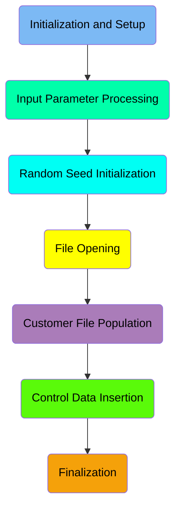
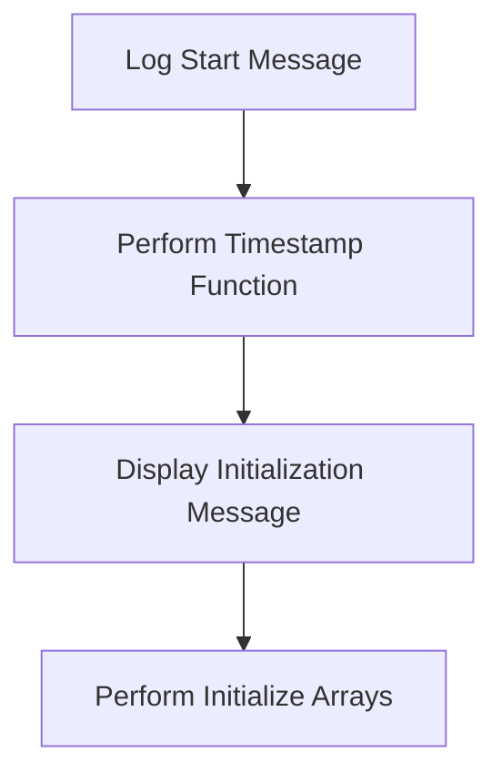
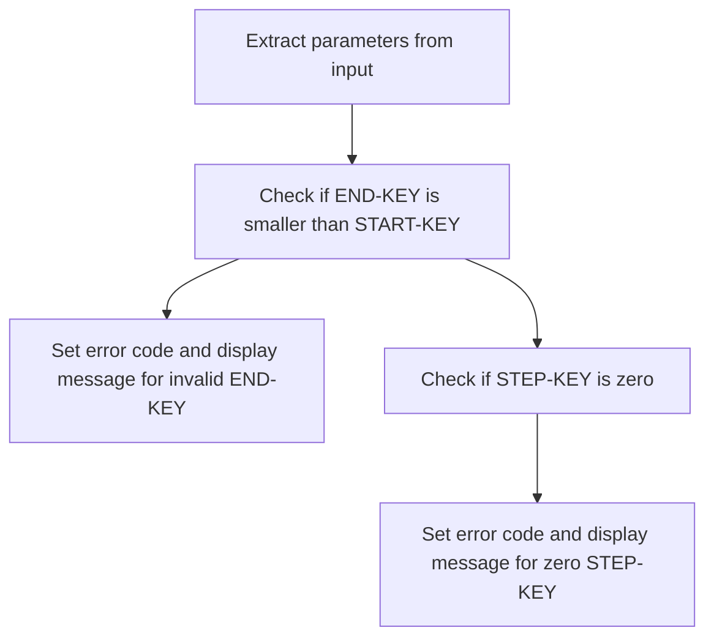
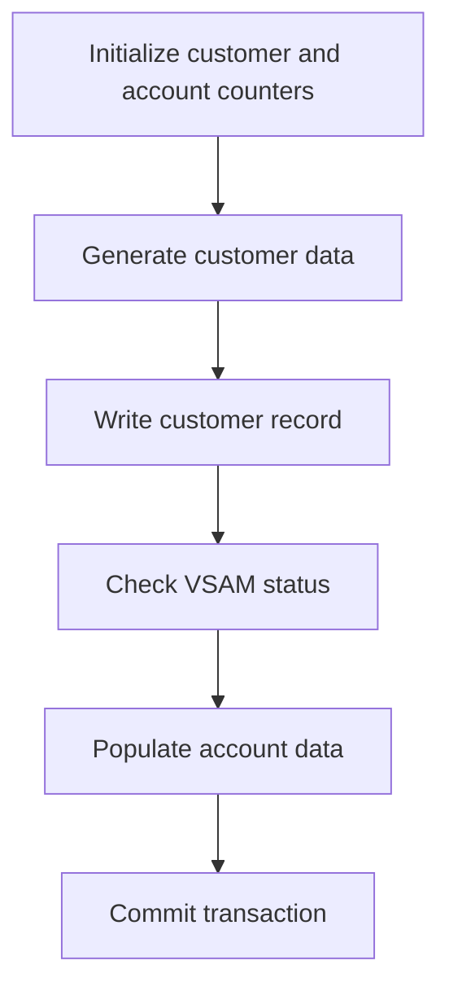
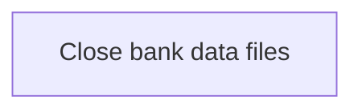

```mermaid
graph TD
  A[Initialize control record fields] --> B[Write control record to file] --> C{Check VSAM status}
  C -->|Error| D[Display error message]
  C -->|Success| E[Prepare DB2 insert for last account]
  E --> F[Insert last account control record]
  F --> G{Check SQL status}
  G -->|Error| H[Display SQL error for last account]
  G -->|Success| I[Prepare DB2 insert for account count]
  I --> J[Insert account count control record]
  J --> K{Check SQL status}
  K -->|Error| L[Display SQL error for account count]

%% Swimm:
%% graph TD
%%   A[Initialize control record fields] --> B[Write control record to file] --> C{Check VSAM status}
%%   C -->|Error| D[Display error message]
%%   C -->|Success| E[Prepare <SwmToken path="src/base/cobol_src/BANKDATA.cbl" pos="417:12:12" line-data="      D    DISPLAY &#39;About to delete DB2 rows&#39;.">`DB2`</SwmToken> insert for last account]
%%   E --> F[Insert last account control record]
%%   F --> G{Check SQL status}
%%   G -->|Error| H[Display SQL error for last account]
%%   G -->|Success| I[Prepare <SwmToken path="src/base/cobol_src/BANKDATA.cbl" pos="417:12:12" line-data="      D    DISPLAY &#39;About to delete DB2 rows&#39;.">`DB2`</SwmToken> insert for account count]
%%   I --> J[Insert account count control record]
%%   J --> K{Check SQL status}
%%   K -->|Error| L[Display SQL error for account count]
```

The BANKDATA program is responsible for initializing and setting up banking data within the system. This is achieved through a series of steps including input parameter processing, random seed initialization, file opening, customer file population, control data insertion, and finalization.

The flow begins with the initialization and setup of the program, followed by processing input parameters to extract necessary values. Next, the random seed is initialized to generate random data for customer records. The program then opens the customer file for output and populates it with customer data. Control data is inserted into the database, and finally, the program closes the bank data files to ensure data integrity.

Here is a high level diagram of the program:



## Initialization and Setup

First, we'll zoom into this section of the flow:



<SwmSnippet path="/src/base/cobol_src/BANKDATA.cbl" line="369">

---

First, a message 'Starting BANKDATA' is moved to <SwmToken path="src/base/cobol_src/BANKDATA.cbl" pos="372:3:5" line-data="             to TIMESTAMP-FUNCTION">`TIMESTAMP-FUNCTION`</SwmToken> to log the start of the banking data initialization process.

```cobol
       PREMIERE SECTION.
       A010.
           MOVE 'Starting BANKDATA'
             to TIMESTAMP-FUNCTION
```

---

</SwmSnippet>

<SwmSnippet path="/src/base/cobol_src/BANKDATA.cbl" line="378">

---

Next, the <SwmToken path="src/base/cobol_src/BANKDATA.cbl" pos="379:3:5" line-data="           PERFORM INITIALISE-ARRAYS.">`INITIALISE-ARRAYS`</SwmToken> routine is performed to set up the necessary arrays for the banking data, ensuring that all required data structures are properly initialized.

```cobol
      D    DISPLAY 'About to initialise arrays'.
           PERFORM INITIALISE-ARRAYS.
```

---

</SwmSnippet>

## Input Parameter Processing

Now, lets zoom into this section of the flow:



<SwmSnippet path="/src/base/cobol_src/BANKDATA.cbl" line="385">

---

### Extracting Parameters

First, the function extracts the parameters from the input string <SwmToken path="src/base/cobol_src/BANKDATA.cbl" pos="385:3:3" line-data="           UNSTRING PARM(1:PARM-LENGTH)">`PARM`</SwmToken> by splitting it based on spaces or commas. The extracted values are stored in <SwmToken path="src/base/cobol_src/BANKDATA.cbl" pos="387:3:5" line-data="                    INTO START-KEY">`START-KEY`</SwmToken>, <SwmToken path="src/base/cobol_src/BANKDATA.cbl" pos="388:1:3" line-data="                         END-KEY">`END-KEY`</SwmToken>, <SwmToken path="src/base/cobol_src/BANKDATA.cbl" pos="389:1:3" line-data="                         STEP-KEY">`STEP-KEY`</SwmToken>, and <SwmToken path="src/base/cobol_src/BANKDATA.cbl" pos="390:1:3" line-data="                         RANDOM-SEED.">`RANDOM-SEED`</SwmToken>.

```cobol
           UNSTRING PARM(1:PARM-LENGTH)
                    DELIMITED BY SPACE OR ','
                    INTO START-KEY
                         END-KEY
                         STEP-KEY
                         RANDOM-SEED.
```

---

</SwmSnippet>

<SwmSnippet path="/src/base/cobol_src/BANKDATA.cbl" line="397">

---

### Validating <SwmToken path="src/base/cobol_src/BANKDATA.cbl" pos="397:3:5" line-data="           IF END-KEY &lt; START-KEY">`END-KEY`</SwmToken>

Next, the function checks if <SwmToken path="src/base/cobol_src/BANKDATA.cbl" pos="397:3:5" line-data="           IF END-KEY &lt; START-KEY">`END-KEY`</SwmToken> (the final customer number) is smaller than <SwmToken path="src/base/cobol_src/BANKDATA.cbl" pos="397:9:11" line-data="           IF END-KEY &lt; START-KEY">`START-KEY`</SwmToken> (the first customer number). If this condition is true, it sets the <SwmToken path="src/base/cobol_src/BANKDATA.cbl" pos="398:7:9" line-data="             MOVE 12 TO RETURN-CODE">`RETURN-CODE`</SwmToken> to 12 and displays an error message indicating that the final customer number cannot be smaller than the first customer number.

```cobol
           IF END-KEY < START-KEY
             MOVE 12 TO RETURN-CODE
             DISPLAY 'Final customer number cannot be smaller than '
               'first customer number'
             GOBACK
           END-IF
```

---

</SwmSnippet>

<SwmSnippet path="/src/base/cobol_src/BANKDATA.cbl" line="403">

---

### Validating <SwmToken path="src/base/cobol_src/BANKDATA.cbl" pos="389:1:3" line-data="                         STEP-KEY">`STEP-KEY`</SwmToken>

Then, the function checks if <SwmToken path="src/base/cobol_src/BANKDATA.cbl" pos="389:1:3" line-data="                         STEP-KEY">`STEP-KEY`</SwmToken> (the gap between customer numbers) is zero. If this condition is true, it sets the <SwmToken path="src/base/cobol_src/BANKDATA.cbl" pos="404:7:9" line-data="             MOVE 12 TO RETURN-CODE">`RETURN-CODE`</SwmToken> to 12 and displays an error message indicating that the gap between customers cannot be zero.

```cobol
           IF step-key = zero
             MOVE 12 TO RETURN-CODE
             DISPLAY 'Gap between customers cannot be zero'
             GOBACK
           END-IF
```

---

</SwmSnippet>

## Random Seed Initialization

Now, lets zoom into this section of the flow:

```mermaid
graph TD
  A[Get today's date] --> B[Delete DB2 rows by SortCode]
  B --> C[Initialize random seed]
  C --> D[Calculate random pointer for forenames]
  D --> E[Calculate random pointer for initials]
  E --> F[Calculate random pointer for surnames]
  F --> G[Calculate random pointer for towns]
  G --> H[Calculate random pointer for street names (R)]
  H --> I[Calculate random pointer for street names (T)]

%% Swimm:
%% graph TD
%%   A[Get today's date] --> B[Delete <SwmToken path="src/base/cobol_src/BANKDATA.cbl" pos="417:12:12" line-data="      D    DISPLAY &#39;About to delete DB2 rows&#39;.">`DB2`</SwmToken> rows by <SwmToken path="src/base/cobol_src/BANKDATA.cbl" pos="415:19:19" line-data="      * Delete the DB2 TABLE contents that match the SortCode">`SortCode`</SwmToken>]
%%   B --> C[Initialize random seed]
%%   C --> D[Calculate random pointer for forenames]
%%   D --> E[Calculate random pointer for initials]
%%   E --> F[Calculate random pointer for surnames]
%%   F --> G[Calculate random pointer for towns]
%%   G --> H[Calculate random pointer for street names (R)]
%%   H --> I[Calculate random pointer for street names (T)]
```

<SwmSnippet path="/src/base/cobol_src/BANKDATA.cbl" line="412">

---

### Getting today's date

First, the function retrieves today's date and stores it as an integer. This is essential for timestamping and ensuring that the operations are performed with the current date.

```cobol
           PERFORM GET-TODAYS-DATE.
```

---

</SwmSnippet>

<SwmSnippet path="/src/base/cobol_src/BANKDATA.cbl" line="417">

---

### Deleting <SwmToken path="src/base/cobol_src/BANKDATA.cbl" pos="417:12:12" line-data="      D    DISPLAY &#39;About to delete DB2 rows&#39;.">`DB2`</SwmToken> rows by <SwmToken path="src/base/cobol_src/BANKDATA.cbl" pos="415:19:19" line-data="      * Delete the DB2 TABLE contents that match the SortCode">`SortCode`</SwmToken>

Next, the function deletes the contents of the <SwmToken path="src/base/cobol_src/BANKDATA.cbl" pos="417:12:12" line-data="      D    DISPLAY &#39;About to delete DB2 rows&#39;.">`DB2`</SwmToken> table that match a specific <SwmToken path="src/base/cobol_src/BANKDATA.cbl" pos="415:19:19" line-data="      * Delete the DB2 TABLE contents that match the SortCode">`SortCode`</SwmToken>. This step ensures that any existing data related to the <SwmToken path="src/base/cobol_src/BANKDATA.cbl" pos="415:19:19" line-data="      * Delete the DB2 TABLE contents that match the SortCode">`SortCode`</SwmToken> is cleared before new data is inserted.

```cobol
      D    DISPLAY 'About to delete DB2 rows'.

           PERFORM DELETE-DB2-ROWS.
```

---

</SwmSnippet>

<SwmSnippet path="/src/base/cobol_src/BANKDATA.cbl" line="427">

---

### Initializing random seed

Moving to the initialization of the random seed, the function sets up the random number generator. This is crucial for generating random data for the new customer records.

```cobol
      D    DISPLAY 'RANDOM SEED IS ' RANDOM-SEED-NUMERIC
```

---

</SwmSnippet>

<SwmSnippet path="/src/base/cobol_src/BANKDATA.cbl" line="428">

---

### Calculating random pointers

Then, the function calculates random pointers for various fields such as forenames, initials, surnames, towns, and street names. These pointers are used to select random entries from predefined lists, ensuring that the new customer records have varied and realistic data.

```cobol
           COMPUTE FORENAMES-PTR = FORENAMES-CNT *
                                   FUNCTION RANDOM(RANDOM-SEED-NUMERIC).
      D    DISPLAY 'FORENAMES-PTR IS ' FORENAMES-PTR.
           COMPUTE INITIALS-PTR =  INITIALS-CNT *
                                   FUNCTION RANDOM.
      D    DISPLAY 'INITIALS-PTR IS ' INITIALS-PTR
           COMPUTE SURNAMES-PTR  =  SURNAMES-CNT *
                                   FUNCTION RANDOM.
           COMPUTE TOWN-PTR  =  TOWN-COUNT *
                                   FUNCTION RANDOM.
           COMPUTE STREET-NAME-R-PTR =  STREET-NAME-R-CNT *
                                   FUNCTION RANDOM.
           COMPUTE STREET-NAME-T-PTR =  STREET-NAME-T-CNT *
```

---

</SwmSnippet>

## File Opening

This is the next section of the flow.



First, the code attempts to open the <SwmToken path="src/base/cobol_src/BANKDATA.cbl" pos="669:3:5" line-data="           CLOSE CUSTOMER-FILE.">`CUSTOMER-FILE`</SwmToken> for output operations. This is crucial for any subsequent operations that involve writing data to the customer file.

Next, the code checks the <SwmToken path="src/base/cobol_src/BANKDATA.cbl" pos="564:3:7" line-data="               IF CUSTOMER-VSAM-STATUS NOT EQUAL &#39;00&#39; THEN">`CUSTOMER-VSAM-STATUS`</SwmToken> to determine if the file was opened successfully. The status '00' indicates a successful operation.

```mermaid
graph TD
  A[Open CUSTOMER-FILE for output] --> B{Check CUSTOMER-VSAM-STATUS}
  B -- Status not '00' --> C[Display error message]
  C --> D[Set RETURN-CODE to 12]
  D --> E[Perform PROGRAM-DONE]

%% Swimm:
%% graph TD
%%   A[Open <SwmToken path="src/base/cobol_src/BANKDATA.cbl" pos="669:3:5" line-data="           CLOSE CUSTOMER-FILE.">`CUSTOMER-FILE`</SwmToken> for output] --> B{Check <SwmToken path="src/base/cobol_src/BANKDATA.cbl" pos="564:3:7" line-data="               IF CUSTOMER-VSAM-STATUS NOT EQUAL &#39;00&#39; THEN">`CUSTOMER-VSAM-STATUS`</SwmToken>}
%%   B -- Status not '00' --> C[Display error message]
%%   C --> D[Set <SwmToken path="src/base/cobol_src/BANKDATA.cbl" pos="398:7:9" line-data="             MOVE 12 TO RETURN-CODE">`RETURN-CODE`</SwmToken> to 12]
%%   D --> E[Perform <SwmToken path="src/base/cobol_src/BANKDATA.cbl" pos="568:3:5" line-data="                   PERFORM PROGRAM-DONE">`PROGRAM-DONE`</SwmToken>]
```

## Customer File Population

Now, lets zoom into this section of the flow:



<SwmSnippet path="/src/base/cobol_src/BANKDATA.cbl" line="464">

---

### Initialize customer and account counters

First, the function initializes the counters for customers and accounts to zero. This sets up the environment for generating new customer and account records.

```cobol
           MOVE ZERO TO COMMIT-COUNT
           MOVE ZERO TO LAST-CUSTOMER-NUMBER NUMBER-OF-CUSTOMERS
           MOVE ZERO TO LAST-ACCOUNT-NUMBER NUMBER-OF-ACCOUNTS
```

---

</SwmSnippet>

<SwmSnippet path="/src/base/cobol_src/BANKDATA.cbl" line="467">

---

### Generate customer data

Next, the function enters a loop to generate customer data. It initializes the customer record structure and sets a unique identifier for each customer.

```cobol
           PERFORM TEST BEFORE
                   VARYING NEXT-KEY FROM START-KEY BY STEP-KEY
                     UNTIL NEXT-KEY > END-KEY

               INITIALIZE CUSTOMER-RECORD IN CUSTOMER-RECORD-STRUCTURE

               SET CUSTOMER-EYECATCHER-VALUE TO TRUE

               MOVE NEXT-KEY TO CUSTOMER-NUMBER
               MOVE NEXT-KEY TO LAST-CUSTOMER-NUMBER
```

---

</SwmSnippet>

<SwmSnippet path="/src/base/cobol_src/BANKDATA.cbl" line="562">

---

### Write customer record

Then, the function writes the generated customer record to the CUSTOMER file. This step ensures that the customer data is stored in the database.

```cobol
               WRITE CUSTOMER-RECORD-STRUCTURE
```

---

</SwmSnippet>

<SwmSnippet path="/src/base/cobol_src/BANKDATA.cbl" line="564">

---

### Check VSAM status

After writing the customer record, the function checks the VSAM status to ensure that the write operation was successful. If there is an error, it displays an error message and performs the program termination routine.

```cobol
               IF CUSTOMER-VSAM-STATUS NOT EQUAL '00' THEN
                   DISPLAY 'Error writing to VSAM file, status='
                           CUSTOMER-VSAM-STATUS
                   MOVE 12 TO RETURN-CODE
                   PERFORM PROGRAM-DONE
               END-IF
```

---

</SwmSnippet>

<SwmSnippet path="/src/base/cobol_src/BANKDATA.cbl" line="571">

---

### Populate account data

Moving to the next step, the function uses the generated customer information to populate related data in the ACCOUNT datastore. This ensures that each customer has corresponding account data.

```cobol
      * Having written out to the CUSTOMER datastore we now need to
      * use some of this information to populate related data on
      * on the ACCOUNT datastore.
      *

               PERFORM DEFINE-ACC
```

---

</SwmSnippet>

<SwmSnippet path="/src/base/cobol_src/BANKDATA.cbl" line="579">

---

### Commit transaction

Finally, the function commits the transaction after every 1,000 records to ensure data integrity and consistency. This step helps in managing large volumes of data efficiently.

```cobol
               IF COMMIT-COUNT > 1000
      D          DISPLAY 'Commit every 1,000 records or so'
                 EXEC SQL
                  COMMIT WORK
                 END-EXEC
                 MOVE ZERO TO COMMIT-COUNT
               END-IF
```

---

</SwmSnippet>

## Control Data Insertion

This is the next section of the flow.



<SwmSnippet path="/src/base/cobol_src/BANKDATA.cbl" line="588">

---

First, the function initializes the customer control record fields by setting the sort code and control number, and marking the control eyecatcher as true.

```cobol
           MOVE '000000' TO CUSTOMER-CONTROL-SORTCODE
           MOVE '9999999999' TO CUSTOMER-CONTROL-NUMBER
           SET CUSTOMER-CONTROL-EYECATCHER-V TO TRUE
```

---

</SwmSnippet>

<SwmSnippet path="/src/base/cobol_src/BANKDATA.cbl" line="592">

---

Next, it writes the customer control record to the file and checks the VSAM status to ensure the write operation was successful.

```cobol
           MOVE CUSTOMER-CONTROL-RECORD
             TO CUSTOMER-RECORD IN CUSTOMER-RECORD-STRUCTURE
           WRITE CUSTOMER-RECORD-STRUCTURE
           IF CUSTOMER-VSAM-STATUS NOT EQUAL '00' THEN
                   DISPLAY 'Error writing CUSTOMER-CONTROL-RECORD file'
                   ', status=' CUSTOMER-VSAM-STATUS
                   MOVE 12 TO RETURN-CODE
                   PERFORM PROGRAM-DONE
           END-IF.
```

---

</SwmSnippet>

<SwmSnippet path="/src/base/cobol_src/BANKDATA.cbl" line="606">

---

Moving to the database operations, the function prepares to insert the last account control record into the <SwmToken path="src/base/cobol_src/BANKDATA.cbl" pos="417:12:12" line-data="      D    DISPLAY &#39;About to delete DB2 rows&#39;.">`DB2`</SwmToken> database by setting the appropriate fields.

```cobol
           MOVE SPACES TO HV-CONTROL-NAME
           MOVE LAST-ACCOUNT-NUMBER TO HV-CONTROL-VALUE-NUM
           MOVE SPACES TO HV-CONTROL-VALUE-STR
           STRING SORTCODE DELIMITED BY SIZE
           '-' DELIMITED BY SIZE
           'ACCOUNT-LAST' DELIMITED BY SIZE
           INTO HV-CONTROL-NAME
```

---

</SwmSnippet>

<SwmSnippet path="/src/base/cobol_src/BANKDATA.cbl" line="613">

---

Then, it executes the SQL insert statement for the last account control record and checks the SQL status to ensure the operation was successful.

```cobol
           EXEC SQL
              INSERT INTO CONTROL
                      (CONTROL_NAME,
                       CONTROL_VALUE_NUM,
                       CONTROL_VALUE_STR
                      )
              VALUES (:HV-CONTROL-NAME,
                      :HV-CONTROL-VALUE-NUM,
                      :HV-CONTROL-VALUE-STR
                     )
           END-EXEC.

           IF SQLCODE IS NOT EQUAL TO ZERO
             MOVE SQLCODE TO WS-SQLCODE-DISPLAY
             DISPLAY 'Error inserting last account control record '
             ws-sqlcode-display
             '.'
             HV-CONTROL-NAME,
             ','
             HV-CONTROL-VALUE-NUM
           END-IF
```

---

</SwmSnippet>

<SwmSnippet path="/src/base/cobol_src/BANKDATA.cbl" line="635">

---

Next, the function prepares to insert the account count control record into the <SwmToken path="src/base/cobol_src/BANKDATA.cbl" pos="417:12:12" line-data="      D    DISPLAY &#39;About to delete DB2 rows&#39;.">`DB2`</SwmToken> database by setting the appropriate fields.

```cobol
           MOVE SPACES TO HV-CONTROL-NAME
           MOVE NUMBER-OF-ACCOUNTS TO HV-CONTROL-VALUE-NUM
           MOVE SPACES TO HV-CONTROL-VALUE-STR
           STRING SORTCODE DELIMITED BY SIZE
           '-' DELIMITED BY SIZE
           'ACCOUNT-COUNT' DELIMITED BY SIZE
           INTO HV-CONTROL-NAME
```

---

</SwmSnippet>

<SwmSnippet path="/src/base/cobol_src/BANKDATA.cbl" line="642">

---

Finally, it executes the SQL insert statement for the account count control record and checks the SQL status to ensure the operation was successful.

```cobol
           EXEC SQL
              INSERT INTO CONTROL
                      (CONTROL_NAME,
                       CONTROL_VALUE_NUM,
                       CONTROL_VALUE_STR
                      )
              VALUES (:HV-CONTROL-NAME,
                      :HV-CONTROL-VALUE-NUM,
                      :HV-CONTROL-VALUE-STR
                     )
           END-EXEC.

           IF SQLCODE IS NOT EQUAL TO ZERO
             MOVE SQLCODE TO WS-SQLCODE-DISPLAY
             DISPLAY 'Error inserting account count control record '
             ws-sqlcode-display
             '.'
             HV-CONTROL-NAME,
             ','
             HV-CONTROL-VALUE-NUM
           END-IF
```

---

</SwmSnippet>

## Finalization

This is the next section of the flow.



<SwmSnippet path="/src/base/cobol_src/BANKDATA.cbl" line="663">

---

### Closing the bank data files

The PREMIERE function is responsible for closing the bank data files. This step ensures that all open files are properly closed, which is crucial for maintaining data integrity and preventing data corruption. By closing the files, we ensure that all the data written during the session is saved correctly and that the system resources are freed up for other operations.

```cobol


      *
      *** Close the files
      *
           CLOSE CUSTOMER-FILE.

           MOVE 'Finishing BANKDATA'
             to TIMESTAMP-FUNCTION
           perform TIMESTAMP.

       A999.
           EXIT.

      *
      * Finish
      *
```

---

</SwmSnippet>

&nbsp;

*This is an auto-generated document by Swimm 🌊 and has not yet been verified by a human*

<SwmMeta version="3.0.0" repo-id="Z2l0aHViJTNBJTNBY2ljcy1iYW5raW5nLXNhbXBsZS1hcHBsaWNhdGlvbi1jYnNhLUlCTS1EZW1vJTNBJTNBU3dpbW0tRGVtbw==" repo-name="cics-banking-sample-application-cbsa-IBM-Demo"><sup>Powered by [Swimm](/)</sup></SwmMeta>
