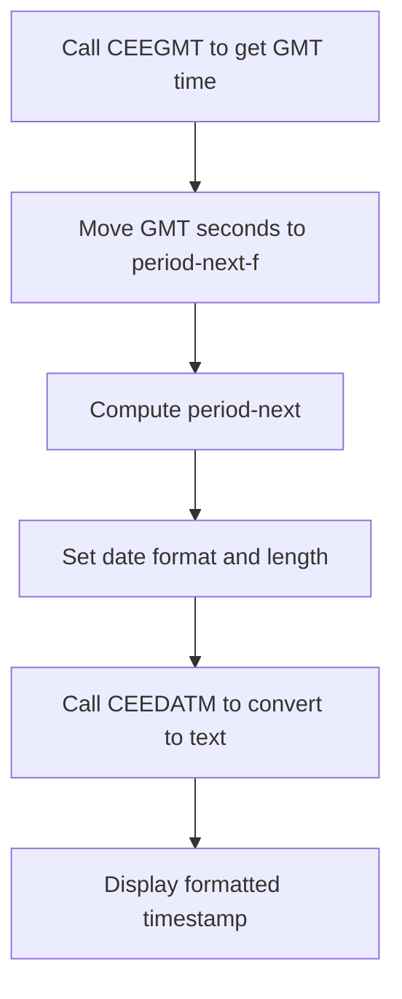
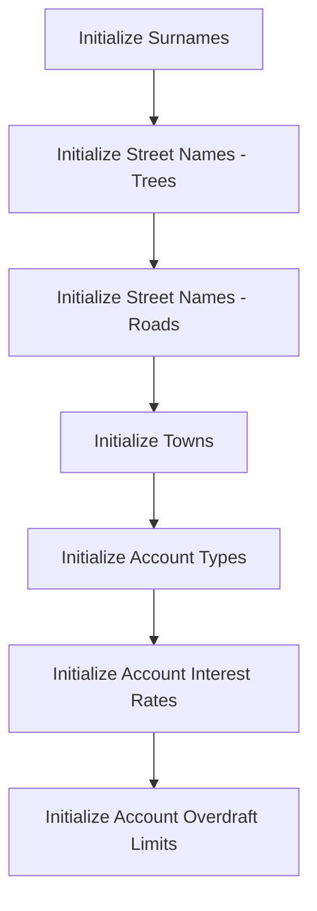
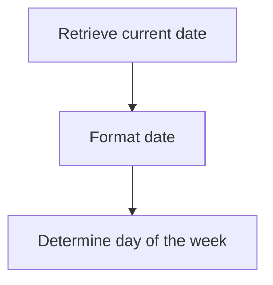
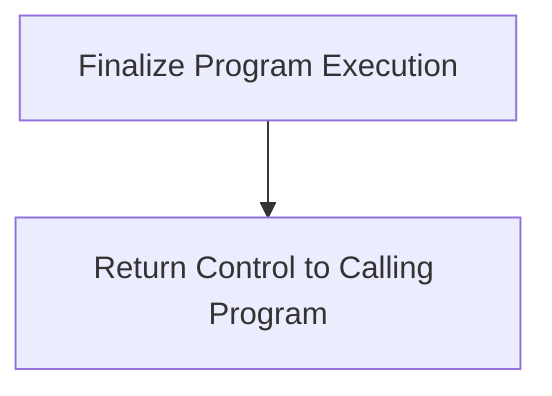
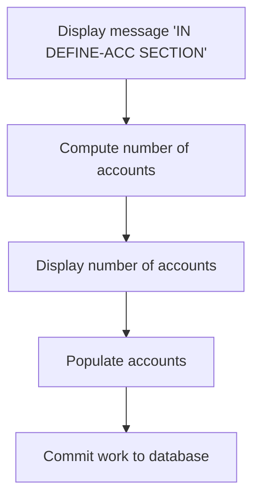
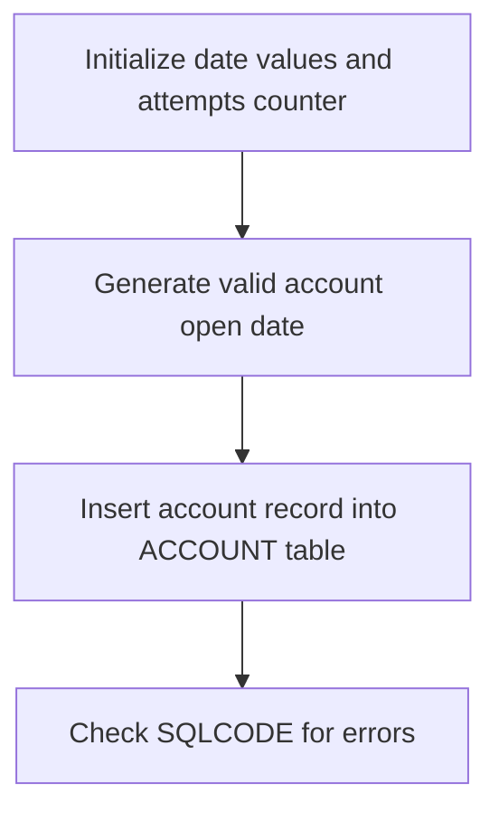
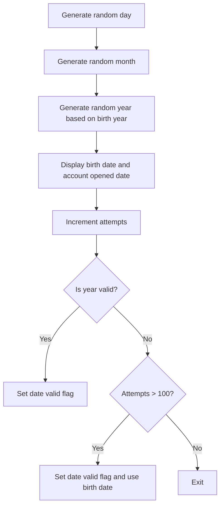

```mermaid
graph TD
  A[Initialize arrays] --> B[Get parameters] --> C[Validate parameters] --> D[Get today's date] --> E[Delete DB2 rows] --> F[Initialize random seed] --> G[Open customer file] --> H[Populate customer file] --> I[Write customer control record] --> J[Insert control records]

%% Swimm:
%% graph TD
%%   A[Initialize arrays] --> B[Get parameters] --> C[Validate parameters] --> D[Get today's date] --> E[Delete <SwmToken path="src/base/cobol_src/BANKDATA.cbl" pos="417:12:12" line-data="      D    DISPLAY &#39;About to delete DB2 rows&#39;.">`DB2`</SwmToken> rows] --> F[Initialize random seed] --> G[Open customer file] --> H[Populate customer file] --> I[Write customer control record] --> J[Insert control records]
```

The BANKDATA program (PREMIERE) is responsible for initializing and processing data within the banking system. This involves setting up initial data arrays, extracting and validating parameters, and performing various database operations to ensure the system is ready for further transactions.

The flow begins with initializing arrays to prepare for data processing. Parameters are then extracted from the input string and validated to ensure correctness. The program retrieves the current date, deletes relevant <SwmToken path="src/base/cobol_src/BANKDATA.cbl" pos="417:12:12" line-data="      D    DISPLAY &#39;About to delete DB2 rows&#39;.">`DB2`</SwmToken> rows to clear old data, and initializes random seeds for generating new data. It opens and populates the customer file, writes control records, and inserts these records into the database. Throughout the process, various arrays such as surnames, street names, towns, account types, interest rates, and overdraft limits are initialized to provide a foundation for the banking operations.

## Initialize and process data (<SwmToken path="src/base/cobol_src/BANKDATA.cbl" pos="369:1:1" line-data="       PREMIERE SECTION.">`PREMIERE`</SwmToken>)

Lets' zoom into this section of the flow:



<SwmSnippet path="/src/base/cobol_src/BANKDATA.cbl" line="378">

---

First, the arrays are initialized to prepare for the data processing.

```cobol
      D    DISPLAY 'About to initialise arrays'.
           PERFORM INITIALISE-ARRAYS.
```

---

</SwmSnippet>

<SwmSnippet path="/src/base/cobol_src/BANKDATA.cbl" line="385">

---

Next, the parameters are extracted from the input string to determine the range and step for customer data generation.

```cobol
           UNSTRING PARM(1:PARM-LENGTH)
                    DELIMITED BY SPACE OR ','
                    INTO START-KEY
                         END-KEY
                         STEP-KEY
                         RANDOM-SEED.
```

---

</SwmSnippet>

<SwmSnippet path="/src/base/cobol_src/BANKDATA.cbl" line="397">

---

Then, the parameters are validated to ensure that the end key is not smaller than the start key and the step key is not zero.

```cobol
           IF END-KEY < START-KEY
             MOVE 12 TO RETURN-CODE
             DISPLAY 'Final customer number cannot be smaller than '
               'first customer number'
             GOBACK
           END-IF
           IF step-key = zero
             MOVE 12 TO RETURN-CODE
             DISPLAY 'Gap between customers cannot be zero'
             GOBACK
           END-IF
```

---

</SwmSnippet>

<SwmSnippet path="/src/base/cobol_src/BANKDATA.cbl" line="412">

---

Moving to the next step, today's date is retrieved and stored as an integer for further processing.

```cobol
           PERFORM GET-TODAYS-DATE.
```

---

</SwmSnippet>

<SwmSnippet path="/src/base/cobol_src/BANKDATA.cbl" line="417">

---

The <SwmToken path="src/base/cobol_src/BANKDATA.cbl" pos="417:12:12" line-data="      D    DISPLAY &#39;About to delete DB2 rows&#39;.">`DB2`</SwmToken> table contents that match the sort code are deleted to ensure a clean slate for new data.

```cobol
      D    DISPLAY 'About to delete DB2 rows'.

           PERFORM DELETE-DB2-ROWS.
```

---

</SwmSnippet>

## TIMESTAMP

Lets' zoom into this section of the flow:



<SwmSnippet path="/src/base/cobol_src/BANKDATA.cbl" line="1442">

---

### Calling CEEGMT to get GMT time

First, the function calls <SwmToken path="src/base/cobol_src/BANKDATA.cbl" pos="1442:4:4" line-data="           CALL &#39;CEEGMT&#39; USING BY REFERENCE gmt-lilian">`CEEGMT`</SwmToken> to retrieve the current GMT time. This call populates <SwmToken path="src/base/cobol_src/BANKDATA.cbl" pos="1442:13:15" line-data="           CALL &#39;CEEGMT&#39; USING BY REFERENCE gmt-lilian">`gmt-lilian`</SwmToken> and <SwmToken path="src/base/cobol_src/BANKDATA.cbl" pos="1443:5:7" line-data="                                           BY REFERENCE gmt-seconds">`gmt-seconds`</SwmToken> with the current time in Lilian date format and seconds since midnight, respectively.

```cobol
           CALL 'CEEGMT' USING BY REFERENCE gmt-lilian
                                           BY REFERENCE gmt-seconds
                                           BY REFERENCE fc
```

---

</SwmSnippet>

<SwmSnippet path="/src/base/cobol_src/BANKDATA.cbl" line="1450">

---

### Moving and computing <SwmToken path="src/base/cobol_src/BANKDATA.cbl" pos="1450:9:11" line-data="           MOVE gmt-seconds TO period-next-f.">`period-next`</SwmToken>

Moving to the next step, the function moves <SwmToken path="src/base/cobol_src/BANKDATA.cbl" pos="1450:3:5" line-data="           MOVE gmt-seconds TO period-next-f.">`gmt-seconds`</SwmToken> to <SwmToken path="src/base/cobol_src/BANKDATA.cbl" pos="1450:9:13" line-data="           MOVE gmt-seconds TO period-next-f.">`period-next-f`</SwmToken> to avoid rounding issues during division. It then computes <SwmToken path="src/base/cobol_src/BANKDATA.cbl" pos="1450:9:11" line-data="           MOVE gmt-seconds TO period-next-f.">`period-next`</SwmToken> from <SwmToken path="src/base/cobol_src/BANKDATA.cbl" pos="1450:9:13" line-data="           MOVE gmt-seconds TO period-next-f.">`period-next-f`</SwmToken>.

```cobol
           MOVE gmt-seconds TO period-next-f.
           COMPUTE period-next   = period-next-f.
```

---

</SwmSnippet>

<SwmSnippet path="/src/base/cobol_src/BANKDATA.cbl" line="1456">

---

### Formatting and displaying the timestamp

Next, the function sets the length and format for the date string. It then calls <SwmToken path="src/base/cobol_src/BANKDATA.cbl" pos="1458:4:4" line-data="           CALL &#39;CEEDATM&#39; USING BY REFERENCE period-next">`CEEDATM`</SwmToken> to convert <SwmToken path="src/base/cobol_src/BANKDATA.cbl" pos="1458:13:15" line-data="           CALL &#39;CEEDATM&#39; USING BY REFERENCE period-next">`period-next`</SwmToken> into a formatted text string according to the specified format. Finally, the formatted timestamp is displayed.

```cobol
           MOVE 14               TO datm-length.
           MOVE 'YYYYMMDDHHMISS' TO datm-format.
           CALL 'CEEDATM' USING BY REFERENCE period-next
                                BY REFERENCE datm-picture
                                BY REFERENCE datm-conv
                                BY REFERENCE fc.
      D    DISPLAY TIMESTAMP-FUNCTION ' AT ' DATM-CONV(1:14).
```

---

</SwmSnippet>

## <SwmToken path="src/base/cobol_src/BANKDATA.cbl" pos="379:3:5" line-data="           PERFORM INITIALISE-ARRAYS.">`INITIALISE-ARRAYS`</SwmToken>

Lets' zoom into this section of the flow:



<SwmSnippet path="/src/base/cobol_src/BANKDATA.cbl" line="1018">

---

### Initializing Surnames

First, the function initializes an array of surnames with predefined values. This ensures that the application has a set of sample surnames to work with for various operations.

```cobol
           MOVE 'Lloyd'        TO SURNAME(24).
           MOVE 'Hughes'       TO SURNAME(25).
           MOVE 'Briggs'       TO SURNAME(26).
           MOVE 'Higins'       TO SURNAME(27).
           MOVE 'Goodwin'      TO SURNAME(28).
           MOVE 'Valmont'      TO SURNAME(29).
           MOVE 'Brown'        TO SURNAME(30).
           MOVE 'Hopkins'      TO SURNAME(31).
           MOVE 'Bonney'       TO SURNAME(32).
           MOVE 'Jenkins'      TO SURNAME(33).
           MOVE 'Lloyd'        TO SURNAME(34).
           MOVE 'Wilmore'      TO SURNAME(35).
           MOVE 'Franklin'     TO SURNAME(36).
           MOVE 'Renton'       TO SURNAME(37).
           MOVE 'Seward'       TO SURNAME(38).
           MOVE 'Morris'       TO SURNAME(39).
           MOVE 'Johnson'      TO SURNAME(40).
           MOVE 'Brennan'      TO SURNAME(41).
           MOVE 'Thomson'      TO SURNAME(42).
           MOVE 'Barker'       TO SURNAME(43).
           MOVE 'Corbett'      TO SURNAME(44).
```

---

</SwmSnippet>

<SwmSnippet path="/src/base/cobol_src/BANKDATA.cbl" line="1049">

---

### Initializing Street Names - Trees

Moving to the next section, the function initializes an array of tree names for street names. This provides a variety of tree names that can be used to generate realistic street names in the application.

```cobol
           MOVE 'Acacia' to    STREET-NAME-TREE(1).
           MOVE 'Birch' to     STREET-NAME-TREE(2).
           MOVE 'Cypress' to   STREET-NAME-TREE(3).
           MOVE 'Douglas' to   STREET-NAME-TREE(4).
           MOVE 'Elm' to       STREET-NAME-TREE(5).
           MOVE 'Fir' to       STREET-NAME-TREE(6).
           MOVE 'Gorse' to     STREET-NAME-TREE(7).
           MOVE 'Holly' to     STREET-NAME-TREE(8).
           MOVE 'Ironwood' to  STREET-NAME-TREE(9).
           MOVE 'Joshua' to    STREET-NAME-TREE(10).
           MOVE 'Kapok' to     STREET-NAME-TREE(11).
           MOVE 'Laburnam' to  STREET-NAME-TREE(12).
           MOVE 'Maple' to     STREET-NAME-TREE(13).
           MOVE 'Nutmeg' to    STREET-NAME-TREE(14).
           MOVE 'Oak' to       STREET-NAME-TREE(15).
           MOVE 'Pine' to      STREET-NAME-TREE(16).
           MOVE 'Quercine' to  STREET-NAME-TREE(17).
           MOVE 'Rowan' to     STREET-NAME-TREE(18).
           MOVE 'Sycamore' to  STREET-NAME-TREE(19).
           MOVE 'Thorn' to     STREET-NAME-TREE(20).
           MOVE 'Ulmus' to     STREET-NAME-TREE(21).
```

---

</SwmSnippet>

<SwmSnippet path="/src/base/cobol_src/BANKDATA.cbl" line="1077">

---

### Initializing Street Names - Roads

Next, the function initializes an array of road types. This array includes different types of roads such as 'Avenue', 'Boulevard', and 'Drive', which can be used to create diverse and realistic street names.

```cobol
           MOVE 'Avenue' to    STREET-NAME-ROAD(1).
           MOVE 'Boulevard' to STREET-NAME-ROAD(2).
           MOVE 'Close' to     STREET-NAME-ROAD(3).
           MOVE 'Crescent' to  STREET-NAME-ROAD(4).
           MOVE 'Drive' to     STREET-NAME-ROAD(5).
           MOVE 'Escalade' to  STREET-NAME-ROAD(6).
           MOVE 'Frontage' to  STREET-NAME-ROAD(7).
           MOVE 'Lane' to      STREET-NAME-ROAD(8).
           MOVE 'Mews' to      STREET-NAME-ROAD(9).
           MOVE 'Rise' to      STREET-NAME-ROAD(10).
           MOVE 'Court' to     STREET-NAME-ROAD(11).
           MOVE 'Opening' to   STREET-NAME-ROAD(12).
           MOVE 'Loke' to      STREET-NAME-ROAD(13).
           MOVE 'Square' to    STREET-NAME-ROAD(14).
           MOVE 'Houses' to    STREET-NAME-ROAD(15).
           MOVE 'Gate' to      STREET-NAME-ROAD(16).
           MOVE 'Street' to    STREET-NAME-ROAD(17).
           MOVE 'Grove' to     STREET-NAME-ROAD(18).
           MOVE 'March' to     STREET-NAME-ROAD(19).

```

---

</SwmSnippet>

<SwmSnippet path="/src/base/cobol_src/BANKDATA.cbl" line="1099">

---

### Initializing Towns

Then, the function initializes an array of town names. This array includes a variety of town names that can be used to simulate different locations within the application.

```cobol
           MOVE 'Norwich'      TO TOWN(01).
           MOVE 'Acle   '      TO TOWN(02).
           MOVE 'Aylsham'      TO TOWN(03).
           MOVE 'Wymondham'    TO TOWN(04).
           MOVE 'Attleborough' TO TOWN(05).
           MOVE 'Cromer '      TO TOWN(06).
           MOVE 'Cambridge'    TO TOWN(07).
           MOVE 'Peterborough' TO TOWN(08).
           MOVE 'Weobley'      TO TOWN(09).
           MOVE 'Wembley'      TO TOWN(10).
           MOVE 'Hereford'     TO TOWN(11).
           MOVE 'Ross-on-Wye'  TO TOWN(12).
           MOVE 'Hay-on-Wye'   TO TOWN(13).
           MOVE 'Nottingham'   TO TOWN(14).
           MOVE 'Northampton'  TO TOWN(15).
           MOVE 'Nuneaton'     TO TOWN(16).
           MOVE 'Oxford'       TO TOWN(17).
           MOVE 'Oswestry'     TO TOWN(18).
           MOVE 'Ormskirk'     TO TOWN(19).
           MOVE 'Royston'      TO TOWN(20).
           MOVE 'Chilcomb'     TO TOWN(21).
```

---

</SwmSnippet>

<SwmSnippet path="/src/base/cobol_src/BANKDATA.cbl" line="1153">

---

### Initializing Account Types

Going into the next section, the function initializes an array of account types. This ensures that the application has predefined account types such as 'ISA', 'SAVING', and 'CURRENT' for various banking operations.

```cobol
           MOVE 'ISA     ' TO WS-ACCOUNT-TYPE(1).
           MOVE 'SAVING  ' TO WS-ACCOUNT-TYPE(2).
           MOVE 'CURRENT ' TO WS-ACCOUNT-TYPE(3).
           MOVE 'LOAN    ' TO WS-ACCOUNT-TYPE(4).
           MOVE 'MORTGAGE' TO WS-ACCOUNT-TYPE(5).
```

---

</SwmSnippet>

<SwmSnippet path="/src/base/cobol_src/BANKDATA.cbl" line="1161">

---

### Initializing Account Interest Rates

Next, the function initializes an array of account interest rates. This array includes predefined interest rates for different account types, which are essential for calculating interest in various banking operations.

```cobol
           MOVE 2.10       TO WS-ACCOUNT-INT-RATE(1).
           MOVE 1.75       TO WS-ACCOUNT-INT-RATE(2).
           MOVE 000000     TO WS-ACCOUNT-INT-RATE(3).
           MOVE 17.90      TO WS-ACCOUNT-INT-RATE(4).
           MOVE 5.25       TO WS-ACCOUNT-INT-RATE(5).
```

---

</SwmSnippet>

<SwmSnippet path="/src/base/cobol_src/BANKDATA.cbl" line="1170">

---

### Initializing Account Overdraft Limits

Finally, the function initializes an array of account overdraft limits. This array includes predefined overdraft limits for different account types, which are crucial for managing overdraft conditions in the application.

```cobol
           MOVE 0          TO WS-ACCOUNT-OVERDRAFT-LIM(1).
           MOVE 0          TO WS-ACCOUNT-OVERDRAFT-LIM(2).
           MOVE 00000100   TO WS-ACCOUNT-OVERDRAFT-LIM(3).
           MOVE 0          TO WS-ACCOUNT-OVERDRAFT-LIM(4).
           MOVE 0          TO WS-ACCOUNT-OVERDRAFT-LIM(5).
```

---

</SwmSnippet>

## Interim Summary

So far, we saw how the arrays are initialized, parameters are extracted and validated, and the <SwmToken path="src/base/cobol_src/BANKDATA.cbl" pos="417:12:12" line-data="      D    DISPLAY &#39;About to delete DB2 rows&#39;.">`DB2`</SwmToken> table contents are deleted to ensure a clean slate for new data. We also explored how the timestamp is retrieved and formatted, and how various arrays such as surnames, street names, towns, account types, interest rates, and overdraft limits are initialized. Now, we will focus on the <SwmToken path="src/base/cobol_src/BANKDATA.cbl" pos="412:3:7" line-data="           PERFORM GET-TODAYS-DATE.">`GET-TODAYS-DATE`</SwmToken> function, which retrieves and formats the current date and determines the day of the week.

## <SwmToken path="src/base/cobol_src/BANKDATA.cbl" pos="412:3:7" line-data="           PERFORM GET-TODAYS-DATE.">`GET-TODAYS-DATE`</SwmToken>

Lets' zoom into this section of the flow:



<SwmSnippet path="/src/base/cobol_src/BANKDATA.cbl" line="1480">

---

### Retrieving the current date

The <SwmToken path="src/base/cobol_src/BANKDATA.cbl" pos="412:3:7" line-data="           PERFORM GET-TODAYS-DATE.">`GET-TODAYS-DATE`</SwmToken> function is responsible for retrieving the current date and determining the day of the week. It starts by calling the <SwmToken path="src/base/cobol_src/BANKDATA.cbl" pos="307:5:7" line-data="       01 WS-CURRENT-DATE-DATA.">`CURRENT-DATE`</SwmToken> intrinsic function to get the current date and time. The date is then formatted and stored in <SwmToken path="src/base/cobol_src/BANKDATA.cbl" pos="350:3:7" line-data="       01 WS-DAY-TODAY                   PIC X(9) VALUE &#39; &#39;.">`WS-DAY-TODAY`</SwmToken> (which holds the formatted date). Finally, the function determines the day of the week and stores it in <SwmToken path="src/base/cobol_src/BANKDATA.cbl" pos="349:3:11" line-data="       01 WS-DAY-OF-WEEK-VAL             PIC 9    VALUE 0.">`WS-DAY-OF-WEEK-VAL`</SwmToken> (which holds the day of the week value).

```cobol

```

---

</SwmSnippet>

## <SwmToken path="src/base/cobol_src/BANKDATA.cbl" pos="419:3:7" line-data="           PERFORM DELETE-DB2-ROWS.">`DELETE-DB2-ROWS`</SwmToken>

Lets' zoom into this section of the flow:

```mermaid
graph TD
  A[Delete from ACCOUNT table] --> B[Check SQL code for ACCOUNT table]
  B -->|SQL code not 0 or +100| C[Display error and set return code]
  B -->|SQL code 0 or +100| D[Delete from CONTROL table (ACCOUNT-LAST)]
  D --> E[Check SQL code for CONTROL table (ACCOUNT-LAST)]
  E -->|SQL code not 0 or +100| F[Display error and set return code]
  E -->|SQL code 0 or +100| G[Delete from CONTROL table (ACCOUNT-COUNT)]
  G --> H[Check SQL code for CONTROL table (ACCOUNT-COUNT)]
  H -->|SQL code not 0 or +100| I[Display error and set return code]
  H -->|SQL code 0 or +100| J[Commit work]

%% Swimm:
%% graph TD
%%   A[Delete from ACCOUNT table] --> B[Check SQL code for ACCOUNT table]
%%   B -->|SQL code not 0 or +100| C[Display error and set return code]
%%   B -->|SQL code 0 or +100| D[Delete from CONTROL table (<SwmToken path="src/base/cobol_src/BANKDATA.cbl" pos="770:3:5" line-data="              HV-ACCOUNT-LAST-STMT-YEAR OF HOST-ACCOUNT-ROW.">`ACCOUNT-LAST`</SwmToken>)]
%%   D --> E[Check SQL code for CONTROL table (<SwmToken path="src/base/cobol_src/BANKDATA.cbl" pos="770:3:5" line-data="              HV-ACCOUNT-LAST-STMT-YEAR OF HOST-ACCOUNT-ROW.">`ACCOUNT-LAST`</SwmToken>)]
%%   E -->|SQL code not 0 or +100| F[Display error and set return code]
%%   E -->|SQL code 0 or +100| G[Delete from CONTROL table (<SwmToken path="src/base/cobol_src/BANKDATA.cbl" pos="1314:2:4" line-data="           &#39;ACCOUNT-COUNT&#39; DELIMITED BY SIZE">`ACCOUNT-COUNT`</SwmToken>)]
%%   G --> H[Check SQL code for CONTROL table (<SwmToken path="src/base/cobol_src/BANKDATA.cbl" pos="1314:2:4" line-data="           &#39;ACCOUNT-COUNT&#39; DELIMITED BY SIZE">`ACCOUNT-COUNT`</SwmToken>)]
%%   H -->|SQL code not 0 or +100| I[Display error and set return code]
%%   H -->|SQL code 0 or +100| J[Commit work]
```

<SwmSnippet path="/src/base/cobol_src/BANKDATA.cbl" line="1188">

---

First, the function deletes rows from the ACCOUNT table where the <SwmToken path="src/base/cobol_src/BANKDATA.cbl" pos="1188:3:3" line-data="           MOVE SORTCODE TO HV-ACCOUNT-SORT-CODE.">`SORTCODE`</SwmToken> matches the provided value.

```cobol
           MOVE SORTCODE TO HV-ACCOUNT-SORT-CODE.
           MOVE 'Deleting from ACCOUNT table'
             to TIMESTAMP-FUNCTION
           perform TIMESTAMP
           EXEC SQL
              DELETE FROM ACCOUNT
              WHERE ACCOUNT_SORTCODE = :HV-ACCOUNT-SORT-CODE
           END-EXEC.
```

---

</SwmSnippet>

<SwmSnippet path="/src/base/cobol_src/BANKDATA.cbl" line="1205">

---

Next, it checks the SQL code to determine if the deletion was successful. If the SQL code is not 0 or +100, it proceeds to handle the error.

```cobol
           IF SQLCODE NOT = +100 AND
           SQLCODE NOT = 0

```

---

</SwmSnippet>

<SwmSnippet path="/src/base/cobol_src/BANKDATA.cbl" line="1223">

---

If an error occurs, it displays an error message with details such as the SORTCODE, SQL code, reason code, and other SQL error information.

```cobol
              DISPLAY 'Error deleting rows from ACCOUNT table. For'
                      ' SORTCODE=' HV-ACCOUNT-SORT-CODE
                      ' SQLCODE=' DISP-LOT
                      ' SQLREASON=' DISP-REASON-CODE ' ( '
                      SQLERRD (3) ')'
                      ',SQLSTATE=' SQLSTATE
                      ',SQLERRMC=' sqlerrmc(1:sqlerrmL)
                      ',sqlerrd(1)=' sqlerrd(1)
                      ',sqlerrd(2)=' sqlerrd(2)
                      ',sqlerrd(3)=' sqlerrd(3)
                      ',sqlerrd(4)=' sqlerrd(4)
                      ',sqlerrd(5)=' sqlerrd(5)
                      ',sqlerrd(6)=' sqlerrd(6)
```

---

</SwmSnippet>

<SwmSnippet path="/src/base/cobol_src/BANKDATA.cbl" line="1237">

---

Then, it sets the return code to 12 and performs the <SwmToken path="src/base/cobol_src/BANKDATA.cbl" pos="1238:3:5" line-data="              PERFORM PROGRAM-DONE">`PROGRAM-DONE`</SwmToken> routine to handle the error.

```cobol
              MOVE 12 TO RETURN-CODE
              PERFORM PROGRAM-DONE

```

---

</SwmSnippet>

<SwmSnippet path="/src/base/cobol_src/BANKDATA.cbl" line="1245">

---

If the deletion from the ACCOUNT table is successful, it proceeds to delete rows from the CONTROL table where the <SwmToken path="src/base/cobol_src/BANKDATA.cbl" pos="1258:3:3" line-data="              WHERE CONTROL_NAME = :HV-CONTROL-NAME">`CONTROL_NAME`</SwmToken> is constructed using the SORTCODE and <SwmToken path="src/base/cobol_src/BANKDATA.cbl" pos="1248:2:4" line-data="           &#39;ACCOUNT-LAST&#39; DELIMITED BY SIZE">`ACCOUNT-LAST`</SwmToken>.

```cobol
           MOVE SPACES TO HV-CONTROL-NAME
           STRING SORTCODE DELIMITED BY SIZE
           '-' DELIMITED BY SIZE
           'ACCOUNT-LAST' DELIMITED BY SIZE
           INTO HV-CONTROL-NAME

           MOVE 'Deleting from CONTROL table'
             to TIMESTAMP-FUNCTION.

           PERFORM TIMESTAMP.

           EXEC SQL
              DELETE FROM CONTROL
              WHERE CONTROL_NAME = :HV-CONTROL-NAME
           END-EXEC.
```

---

</SwmSnippet>

<SwmSnippet path="/src/base/cobol_src/BANKDATA.cbl" line="1271">

---

It then checks the SQL code for the CONTROL table deletion. If the SQL code is not 0 or +100, it handles the error similarly to the ACCOUNT table deletion.

```cobol
           IF SQLCODE NOT = +100 AND
           SQLCODE NOT = 0

```

---

</SwmSnippet>

<SwmSnippet path="/src/base/cobol_src/BANKDATA.cbl" line="1289">

---

If an error occurs during the CONTROL table deletion, it displays an error message with details and sets the return code to 12.

```cobol
              DISPLAY 'Error deleting rows from CONTROL table. For'
                      ' CONTROL_NAME=' HV-CONTROL-NAME
                      ' SQLCODE=' DISP-LOT
                      ' SQLREASON=' DISP-REASON-CODE ' ( '
                      SQLERRD (3) ')'
                      ',SQLSTATE=' SQLSTATE
                      ',SQLERRMC=' sqlerrmc(1:sqlerrmL)
                      ',sqlerrd(1)=' sqlerrd(1)
                      ',sqlerrd(2)=' sqlerrd(2)
                      ',sqlerrd(3)=' sqlerrd(3)
                      ',sqlerrd(4)=' sqlerrd(4)
                      ',sqlerrd(5)=' sqlerrd(5)
                      ',sqlerrd(6)=' sqlerrd(6)

              MOVE 12 TO RETURN-CODE
              PERFORM PROGRAM-DONE
```

---

</SwmSnippet>

<SwmSnippet path="/src/base/cobol_src/BANKDATA.cbl" line="1311">

---

If the deletion from the CONTROL table (<SwmToken path="src/base/cobol_src/BANKDATA.cbl" pos="770:3:5" line-data="              HV-ACCOUNT-LAST-STMT-YEAR OF HOST-ACCOUNT-ROW.">`ACCOUNT-LAST`</SwmToken>) is successful, it proceeds to delete rows from the CONTROL table where the <SwmToken path="src/base/cobol_src/BANKDATA.cbl" pos="1324:3:3" line-data="              WHERE CONTROL_NAME = :HV-CONTROL-NAME">`CONTROL_NAME`</SwmToken> is constructed using the SORTCODE and <SwmToken path="src/base/cobol_src/BANKDATA.cbl" pos="1314:2:4" line-data="           &#39;ACCOUNT-COUNT&#39; DELIMITED BY SIZE">`ACCOUNT-COUNT`</SwmToken>.

```cobol
           MOVE SPACES TO HV-CONTROL-NAME
           STRING SORTCODE DELIMITED BY SIZE
           '-' DELIMITED BY SIZE
           'ACCOUNT-COUNT' DELIMITED BY SIZE
           INTO HV-CONTROL-NAME

           MOVE 'Deleting from CONTROL table'
             to TIMESTAMP-FUNCTION.

           PERFORM TIMESTAMP.

           EXEC SQL
              DELETE FROM CONTROL
              WHERE CONTROL_NAME = :HV-CONTROL-NAME
           END-EXEC.
```

---

</SwmSnippet>

<SwmSnippet path="/src/base/cobol_src/BANKDATA.cbl" line="1337">

---

It then checks the SQL code for the CONTROL table (<SwmToken path="src/base/cobol_src/BANKDATA.cbl" pos="1314:2:4" line-data="           &#39;ACCOUNT-COUNT&#39; DELIMITED BY SIZE">`ACCOUNT-COUNT`</SwmToken>) deletion. If the SQL code is not 0 or +100, it handles the error similarly to the previous deletions.

```cobol
           IF SQLCODE NOT = +100 AND
           SQLCODE NOT = 0

```

---

</SwmSnippet>

<SwmSnippet path="/src/base/cobol_src/BANKDATA.cbl" line="1355">

---

If an error occurs during the CONTROL table (<SwmToken path="src/base/cobol_src/BANKDATA.cbl" pos="1314:2:4" line-data="           &#39;ACCOUNT-COUNT&#39; DELIMITED BY SIZE">`ACCOUNT-COUNT`</SwmToken>) deletion, it displays an error message with details and sets the return code to 12.

```cobol
              DISPLAY 'Error deleting rows from CONTROL table. For'
                      ' CONTROL_NAME=' HV-CONTROL-NAME
                      ' SQLCODE=' DISP-LOT
                      ' SQLREASON=' DISP-REASON-CODE ' ( '
                      SQLERRD (3) ')'
                      ',SQLSTATE=' SQLSTATE
                      ',SQLERRMC=' sqlerrmc(1:sqlerrmL)
                      ',sqlerrd(1)=' sqlerrd(1)
                      ',sqlerrd(2)=' sqlerrd(2)
                      ',sqlerrd(3)=' sqlerrd(3)
                      ',sqlerrd(4)=' sqlerrd(4)
                      ',sqlerrd(5)=' sqlerrd(5)
                      ',sqlerrd(6)=' sqlerrd(6)

              MOVE 12 TO RETURN-CODE
              PERFORM PROGRAM-DONE
```

---

</SwmSnippet>

<SwmSnippet path="/src/base/cobol_src/BANKDATA.cbl" line="1375">

---

Finally, if all deletions are successful, it commits the work to ensure the changes are saved.

```cobol
           EXEC SQL
              COMMIT WORK
           END-EXEC.
```

---

</SwmSnippet>

## <SwmToken path="src/base/cobol_src/BANKDATA.cbl" pos="681:1:3" line-data="       PROGRAM-DONE SECTION.">`PROGRAM-DONE`</SwmToken>

Lets' zoom into this section of the flow:



<SwmSnippet path="/src/base/cobol_src/BANKDATA.cbl" line="681">

---

First, the <SwmToken path="src/base/cobol_src/BANKDATA.cbl" pos="681:1:3" line-data="       PROGRAM-DONE SECTION.">`PROGRAM-DONE`</SwmToken> section is defined to mark the end of the program's execution.

```cobol
       PROGRAM-DONE SECTION.
       PD010.
```

---

</SwmSnippet>

<SwmSnippet path="/src/base/cobol_src/BANKDATA.cbl" line="684">

---

Next, the <SwmToken path="src/base/cobol_src/BANKDATA.cbl" pos="684:1:1" line-data="           GOBACK.">`GOBACK`</SwmToken> statement is used to return control to the calling program, effectively ending the current program's execution.

```cobol
           GOBACK.
```

---

</SwmSnippet>

## <SwmToken path="src/base/cobol_src/BANKDATA.cbl" pos="691:1:3" line-data="       DEFINE-ACC SECTION.">`DEFINE-ACC`</SwmToken>

Lets' zoom into this section of the flow:



<SwmSnippet path="/src/base/cobol_src/BANKDATA.cbl" line="691">

---

First, a message 'IN <SwmToken path="src/base/cobol_src/BANKDATA.cbl" pos="691:1:3" line-data="       DEFINE-ACC SECTION.">`DEFINE-ACC`</SwmToken> SECTION' is displayed to indicate the start of the account definition process.

```cobol
       DEFINE-ACC SECTION.
       DA010.
      D    DISPLAY 'IN DEFINE-ACC SECTION'.
```

---

</SwmSnippet>

<SwmSnippet path="/src/base/cobol_src/BANKDATA.cbl" line="696">

---

Next, the number of accounts for the customer is computed. This number is randomly chosen to be between 1 and 5, allowing for future growth.

```cobol
      * Decide how many accounts this customer will have. To allow
      * for growth make it between 1 and 5 (max is 10 at the moment
      * this maximum is dictated by the alternate key index which is
      * currently set to 10).
      *
           COMPUTE NO-OF-ACCOUNTS =  ((5 - 1)
                                        * FUNCTION RANDOM) + 1
```

---

</SwmSnippet>

<SwmSnippet path="/src/base/cobol_src/BANKDATA.cbl" line="703">

---

Then, the computed number of accounts is displayed to provide feedback on the number of accounts being created.

```cobol
      D    DISPLAY 'Creating accounts ' NO-OF-ACCOUNTS
```

---

</SwmSnippet>

<SwmSnippet path="/src/base/cobol_src/BANKDATA.cbl" line="704">

---

Moving to the next step, the accounts are populated by calling another section repeatedly until the desired number of accounts is created. Finally, the work is committed to the database to ensure the changes are saved.

```cobol
           PERFORM POPULATE-ACC VARYING WS-CNT FROM 1 BY 1
               UNTIL WS-CNT > NO-OF-ACCOUNTS.
           EXEC SQL
             COMMIT WORK
           END-EXEC.
```

---

</SwmSnippet>

## <SwmToken path="src/base/cobol_src/BANKDATA.cbl" pos="704:3:5" line-data="           PERFORM POPULATE-ACC VARYING WS-CNT FROM 1 BY 1">`POPULATE-ACC`</SwmToken>

Lets' zoom into this section of the flow:



<SwmSnippet path="/src/base/cobol_src/BANKDATA.cbl" line="723">

---

First, the section initializes the date values and attempts counter to zero, and sets the validation flag to 'N'. This prepares the variables for generating a valid account open date.

```cobol
           MOVE 0 TO HV-ACCOUNT-OPENED-DAY
                     HV-ACCOUNT-OPENED-MONTH
                     HV-ACCOUNT-OPENED-YEAR
           MOVE 0 TO OPENED-DATE-ATTEMPTS
      D    DISPLAY 'About to generate opened date'
           MOVE 'N' TO OPENED-DATE-VALID
```

---

</SwmSnippet>

<SwmSnippet path="/src/base/cobol_src/BANKDATA.cbl" line="729">

---

Next, it repeatedly calls the <SwmToken path="src/base/cobol_src/BANKDATA.cbl" pos="729:3:7" line-data="           PERFORM GENERATE-OPENED-DATE">`GENERATE-OPENED-DATE`</SwmToken> section until a valid date is obtained. This ensures that the account open date is always after the customer's date of birth.

```cobol
           PERFORM GENERATE-OPENED-DATE
                   UNTIL OPENED-DATE-VALID = 'Y'.
```

---

</SwmSnippet>

<SwmSnippet path="/src/base/cobol_src/BANKDATA.cbl" line="740">

---

Moving to the next step, the section inserts the account record into the <SwmToken path="src/base/cobol_src/BANKDATA.cbl" pos="741:3:3" line-data="              HV-ACCOUNT-EYECATCHER OF HOST-ACCOUNT-ROW.">`ACCOUNT`</SwmToken> table. It populates various fields such as account number, customer number, sort code, account type, interest rate, and overdraft limit.

```cobol
           MOVE 'ACCT' TO
              HV-ACCOUNT-EYECATCHER OF HOST-ACCOUNT-ROW.
           MOVE CUSTOMER-NUMBER TO
              HV-ACCOUNT-CUST-NO OF HOST-ACCOUNT-ROW.
           MOVE SORTCODE TO
              HV-ACCOUNT-SORT-CODE OF HOST-ACCOUNT-ROW.
           MOVE WS-ACCOUNT-NUMBER TO
              HV-ACCOUNT-NUMBER OF HOST-ACCOUNT-ROW.

           MOVE WS-ACCOUNT-NUMBER TO LAST-ACCOUNT-NUMBER

      *    ADD 1 TO NUMBER-OF-ACCOUNTS GIVING NUMBER-OF-ACCOUNTS

      *    ADD 1 TO WS-ACCOUNT-NUMBER GIVING WS-ACCOUNT-NUMBER

           MOVE WS-ACCOUNT-TYPE(WS-CNT) TO
              HV-ACCOUNT-TYPE OF HOST-ACCOUNT-ROW.
           MOVE WS-ACCOUNT-INT-RATE(WS-CNT) TO
              HV-ACCOUNT-INTEREST-RATE OF HOST-ACCOUNT-ROW.
           MOVE '.' TO HV-ACCOUNT-OPENED-DELIM1.
           MOVE '.' TO HV-ACCOUNT-OPENED-DELIM2.
```

---

</SwmSnippet>

<SwmSnippet path="/src/base/cobol_src/BANKDATA.cbl" line="769">

---

Then, it sets the last statement and next statement dates for the account. These dates are important for generating account statements.

```cobol
           MOVE '2021' TO
              HV-ACCOUNT-LAST-STMT-YEAR OF HOST-ACCOUNT-ROW.
           MOVE '.' TO HV-ACCOUNT-LAST-STMT-DELIM1.
           MOVE '07' TO
              HV-ACCOUNT-LAST-STMT-MONTH OF HOST-ACCOUNT-ROW.
           MOVE '.' TO HV-ACCOUNT-LAST-STMT-DELIM2.
           MOVE '01' TO
              HV-ACCOUNT-LAST-STMT-DAY OF HOST-ACCOUNT-ROW.
           MOVE '2021' TO
              HV-ACCOUNT-NEXT-STMT-YEAR OF HOST-ACCOUNT-ROW.
           MOVE '.' TO HV-ACCOUNT-NEXT-STMT-DELIM1.
           MOVE '08' TO
              HV-ACCOUNT-NEXT-STMT-MONTH OF HOST-ACCOUNT-ROW.
           MOVE '.' TO HV-ACCOUNT-NEXT-STMT-DELIM2.
           MOVE '01' TO
              HV-ACCOUNT-NEXT-STMT-DAY OF HOST-ACCOUNT-ROW.
```

---

</SwmSnippet>

<SwmSnippet path="/src/base/cobol_src/BANKDATA.cbl" line="785">

---

Diving into the balance calculations, the section computes the available and actual balances for the account. If the account type is a loan or mortgage, it ensures that the balance is negative.

```cobol
           COMPUTE HV-ACCOUNT-AVAILABLE-BALANCE
                  = ((999999 - 1)
                                   * FUNCTION RANDOM) + 1.
           MOVE HV-ACCOUNT-AVAILABLE-BALANCE  TO
              HV-ACCOUNT-ACTUAL-BALANCE.


      *
      *    If it is a LOAN or a MORTGAGE then it should really have
      *    a negative balance (it doesn't make any sense for these
      *    accounts to have a positive balance).
      *
           IF HV-ACCOUNT-TYPE OF HOST-ACCOUNT-ROW = 'LOAN    ' OR
           HV-ACCOUNT-TYPE OF HOST-ACCOUNT-ROW = 'MORTGAGE'
                COMPUTE HV-ACCOUNT-ACTUAL-BALANCE =
                   0 - HV-ACCOUNT-ACTUAL-BALANCE OF HOST-ACCOUNT-ROW

                COMPUTE HV-ACCOUNT-AVAILABLE-BALANCE
                   OF HOST-ACCOUNT-ROW =
                   0 - HV-ACCOUNT-AVAILABLE-BALANCE OF HOST-ACCOUNT-ROW
```

---

</SwmSnippet>

<SwmSnippet path="/src/base/cobol_src/BANKDATA.cbl" line="808">

---

Finally, the section executes an SQL <SwmToken path="src/base/cobol_src/BANKDATA.cbl" pos="809:1:1" line-data="              INSERT INTO ACCOUNT">`INSERT`</SwmToken> statement to add the account record to the <SwmToken path="src/base/cobol_src/BANKDATA.cbl" pos="809:5:5" line-data="              INSERT INTO ACCOUNT">`ACCOUNT`</SwmToken> table. It checks the <SwmToken path="src/base/cobol_src/BANKDATA.cbl" pos="1205:3:3" line-data="           IF SQLCODE NOT = +100 AND">`SQLCODE`</SwmToken> for any errors and handles them appropriately, displaying error messages if necessary.

```cobol
           EXEC SQL
              INSERT INTO ACCOUNT
                     (ACCOUNT_EYECATCHER,
                      ACCOUNT_CUSTOMER_NUMBER,
                      ACCOUNT_SORTCODE,
                      ACCOUNT_NUMBER,
                      ACCOUNT_TYPE,
                      ACCOUNT_INTEREST_RATE,
                      ACCOUNT_OPENED,
                      ACCOUNT_OVERDRAFT_LIMIT,
                      ACCOUNT_LAST_STATEMENT,
                      ACCOUNT_NEXT_STATEMENT,
                      ACCOUNT_AVAILABLE_BALANCE,
                      ACCOUNT_ACTUAL_BALANCE
                      )
              VALUES (:HV-ACCOUNT-EYECATCHER,
                      :HV-ACCOUNT-CUST-NO,
                      :HV-ACCOUNT-SORT-CODE,
                      :HV-ACCOUNT-NUMBER,
                      :HV-ACCOUNT-TYPE,
                      :HV-ACCOUNT-INTEREST-RATE,
```

---

</SwmSnippet>

## <SwmToken path="src/base/cobol_src/BANKDATA.cbl" pos="729:3:7" line-data="           PERFORM GENERATE-OPENED-DATE">`GENERATE-OPENED-DATE`</SwmToken>

Lets' zoom into this section of the flow:



<SwmSnippet path="/src/base/cobol_src/BANKDATA.cbl" line="883">

---

First, the function generates a random day for the account opened date by computing a value between 1 and 28 and assigns it to <SwmToken path="src/base/cobol_src/BANKDATA.cbl" pos="883:3:9" line-data="           COMPUTE WS-ACCOUNT-OPENED-DAY">`WS-ACCOUNT-OPENED-DAY`</SwmToken>.

```cobol
           COMPUTE WS-ACCOUNT-OPENED-DAY
                  =  ((28 - 1)
                                    * FUNCTION RANDOM) + 1.
```

---

</SwmSnippet>

<SwmSnippet path="/src/base/cobol_src/BANKDATA.cbl" line="887">

---

Moving to the next step, a random month is generated by computing a value between 1 and 12 and assigns it to <SwmToken path="src/base/cobol_src/BANKDATA.cbl" pos="887:3:9" line-data="           COMPUTE WS-ACCOUNT-OPENED-MONTH">`WS-ACCOUNT-OPENED-MONTH`</SwmToken>.

```cobol
           COMPUTE WS-ACCOUNT-OPENED-MONTH
                  =  ((12 - 1)
                                    * FUNCTION RANDOM) + 1.
```

---

</SwmSnippet>

<SwmSnippet path="/src/base/cobol_src/BANKDATA.cbl" line="891">

---

Next, the function generates a random year for the account opened date. This year is computed based on the customer's birth year and assigns it to <SwmToken path="src/base/cobol_src/BANKDATA.cbl" pos="891:3:9" line-data="           COMPUTE WS-ACCOUNT-OPENED-YEAR">`WS-ACCOUNT-OPENED-YEAR`</SwmToken>.

```cobol
           COMPUTE WS-ACCOUNT-OPENED-YEAR
                  =  ((2014 -
                                    CUSTOMER-BIRTH-YEAR)
                                    * FUNCTION RANDOM) +
                                    CUSTOMER-BIRTH-YEAR.
```

---

</SwmSnippet>

<SwmSnippet path="/src/base/cobol_src/BANKDATA.cbl" line="897">

---

Then, the function displays the customer's birth date and the generated account opened date for verification purposes.

```cobol
      D    DISPLAY 'DATE OF BIRTH IS '
      D             CUSTOMER-BIRTH-DAY
      D             '/'
      D             CUSTOMER-BIRTH-MONTH
      D             '/'
      D             CUSTOMER-BIRTH-YEAR

      D    DISPLAY 'ACCOUNT OPENED  '
      D             HV-ACCOUNT-OPENED-DAY
      D             '/'
      D             HV-ACCOUNT-OPENED-MONTH
      D             '/'
      D             HV-ACCOUNT-OPENED-YEAR
```

---

</SwmSnippet>

<SwmSnippet path="/src/base/cobol_src/BANKDATA.cbl" line="911">

---

Next, the function increments the <SwmToken path="src/base/cobol_src/BANKDATA.cbl" pos="911:7:11" line-data="           ADD 1 TO OPENED-DATE-ATTEMPTS GIVING OPENED-DATE-ATTEMPTS.">`OPENED-DATE-ATTEMPTS`</SwmToken> counter to keep track of the number of attempts made to generate a valid date.

```cobol
           ADD 1 TO OPENED-DATE-ATTEMPTS GIVING OPENED-DATE-ATTEMPTS.
```

---

</SwmSnippet>

<SwmSnippet path="/src/base/cobol_src/BANKDATA.cbl" line="912">

---

Finally, the function checks if the generated year is valid by comparing it with the customer's birth year. If valid, it sets the <SwmToken path="src/base/cobol_src/BANKDATA.cbl" pos="914:9:13" line-data="             MOVE &#39;Y&#39; TO OPENED-DATE-VALID">`OPENED-DATE-VALID`</SwmToken> flag. If not, it checks if the attempts exceed 100, and if so, it sets the <SwmToken path="src/base/cobol_src/BANKDATA.cbl" pos="914:9:13" line-data="             MOVE &#39;Y&#39; TO OPENED-DATE-VALID">`OPENED-DATE-VALID`</SwmToken> flag and uses the customer's birth date as the account opened date.

```cobol
           IF HV-ACCOUNT-OPENED-YEAR
              > CUSTOMER-BIRTH-YEAR
             MOVE 'Y' TO OPENED-DATE-VALID
             GO TO GOD999
           END-IF.
           IF OPENED-DATE-ATTEMPTS > 100
             MOVE 'Y' TO OPENED-DATE-VALID
             MOVE CUSTOMER-BIRTH-DAY   TO HV-ACCOUNT-OPENED-DAY
             MOVE CUSTOMER-BIRTH-MONTH TO HV-ACCOUNT-OPENED-MONTH
             MOVE CUSTOMER-BIRTH-YEAR  TO HV-ACCOUNT-OPENED-YEAR
           END-IF.
```

---

</SwmSnippet>

&nbsp;

*This is an auto-generated document by Swimm 🌊 and has not yet been verified by a human*

<SwmMeta version="3.0.0" repo-id="Z2l0aHViJTNBJTNBY2ljcy1iYW5raW5nLXNhbXBsZS1hcHBsaWNhdGlvbi1jYnNhLUlCTS1EZW1vJTNBJTNBU3dpbW0tRGVtbw==" repo-name="cics-banking-sample-application-cbsa-IBM-Demo"><sup>Powered by [Swimm](/)</sup></SwmMeta>
