This document explains the <SwmToken path="src/webui/src/main/java/com/ibm/cics/cip/bankliberty/web/db2/Account.java" pos="44:14:14" line-data="	private static final String DEBIT_CREDIT_ACCOUNT = &quot;debitCredit(BigDecimal apiAmount)&quot;;">`debitCredit`</SwmToken> process, which is a critical part of the banking application. The process involves retrieving account details, checking if the account exists, opening a database connection, executing SQL queries to fetch and update account balances, and committing the updated balances to the database.

The <SwmToken path="src/webui/src/main/java/com/ibm/cics/cip/bankliberty/web/db2/Account.java" pos="44:14:14" line-data="	private static final String DEBIT_CREDIT_ACCOUNT = &quot;debitCredit(BigDecimal apiAmount)&quot;;">`debitCredit`</SwmToken> process starts by retrieving the account details using the account number and sort code. If the account does not exist, a warning is logged, and the process exits. If the account exists, a database connection is opened to execute SQL queries. The current account balances are fetched, and the new balances are calculated by adding the transaction amount to the current balances. Finally, the updated balances are committed to the database, ensuring the account information is up-to-date.

# Where is this flow used?

This flow is used multiple times in the codebase as represented in the following diagram:

```mermaid
graph TD;
      subgraph srcwebuisrcmainjavacomibmcicscipbankliberty[src/…/cip/bankliberty]
c8947d548dc563c2be6a10fbca2da001399af0f479e9c3b8b9182232b73d921a(transferLocalInternal) --> 780638d70fb3f6987395cc4beebe659b258551949bf538a704570512ffd3e68c(Account.debitCredit)
end

subgraph srcwebuisrcmainjavacomibmcicscipbankliberty[src/…/cip/bankliberty]
658081b45ad438789a73433d6d4bf8b21fb94fd04e7068996af1ee88ecadcb07(transferLocalExternal) --> c8947d548dc563c2be6a10fbca2da001399af0f479e9c3b8b9182232b73d921a(transferLocalInternal)
end

subgraph srcwebuisrcmainjavacomibmcicscipbankliberty[src/…/cip/bankliberty]
9496de396fe4bf02ff0ca3312205b53e9fba8611ab39247caff1cbf012a96f7b(debitCreditAccount) --> 780638d70fb3f6987395cc4beebe659b258551949bf538a704570512ffd3e68c(Account.debitCredit)
end

subgraph srcwebuisrcmainjavacomibmcicscipbankliberty[src/…/cip/bankliberty]
99805d9ac870ca29bf2059841ae731f58bf8d9e06f5eabf2633080095a3cd86d(debitAccountInternal) --> 9496de396fe4bf02ff0ca3312205b53e9fba8611ab39247caff1cbf012a96f7b(debitCreditAccount)
end

subgraph srcwebuisrcmainjavacomibmcicscipbankliberty[src/…/cip/bankliberty]
8186a1821b6f99efb12133f01dd2ba00d5cf8682fc3b16d1afa195c5a7e24eb9(debitAccountExternal) --> 99805d9ac870ca29bf2059841ae731f58bf8d9e06f5eabf2633080095a3cd86d(debitAccountInternal)
end

subgraph srcwebuisrcmainjavacomibmcicscipbankliberty[src/…/cip/bankliberty]
d0a8cc508be9084712089483281287c672b742c434495db73753c60d1c5fc1a0(creditAccountInternal) --> 9496de396fe4bf02ff0ca3312205b53e9fba8611ab39247caff1cbf012a96f7b(debitCreditAccount)
end

subgraph srcwebuisrcmainjavacomibmcicscipbankliberty[src/…/cip/bankliberty]
2a070bc0faf6c2d9cbfa20772c3de34afe2560ea96146e5b5bc7cacaddffac73(creditAccountExternal) --> d0a8cc508be9084712089483281287c672b742c434495db73753c60d1c5fc1a0(creditAccountInternal)
end


      classDef mainFlowStyle color:#000000,fill:#7CB9F4
classDef rootsStyle color:#000000,fill:#00FFF4
classDef Style1 color:#000000,fill:#00FFAA
classDef Style2 color:#000000,fill:#FFFF00
classDef Style3 color:#000000,fill:#AA7CB9

%% Swimm:
%% graph TD;
%%       subgraph srcwebuisrcmainjavacomibmcicscipbankliberty[<SwmPath>[src/…/cip/bankliberty/](src/webui/src/main/java/com/ibm/cics/cip/bankliberty/)</SwmPath>]
%% c8947d548dc563c2be6a10fbca2da001399af0f479e9c3b8b9182232b73d921a(transferLocalInternal) --> 780638d70fb3f6987395cc4beebe659b258551949bf538a704570512ffd3e68c(Account.debitCredit)
%% end
%% 
%% subgraph srcwebuisrcmainjavacomibmcicscipbankliberty[<SwmPath>[src/…/cip/bankliberty/](src/webui/src/main/java/com/ibm/cics/cip/bankliberty/)</SwmPath>]
%% 658081b45ad438789a73433d6d4bf8b21fb94fd04e7068996af1ee88ecadcb07(transferLocalExternal) --> c8947d548dc563c2be6a10fbca2da001399af0f479e9c3b8b9182232b73d921a(transferLocalInternal)
%% end
%% 
%% subgraph srcwebuisrcmainjavacomibmcicscipbankliberty[<SwmPath>[src/…/cip/bankliberty/](src/webui/src/main/java/com/ibm/cics/cip/bankliberty/)</SwmPath>]
%% 9496de396fe4bf02ff0ca3312205b53e9fba8611ab39247caff1cbf012a96f7b(debitCreditAccount) --> 780638d70fb3f6987395cc4beebe659b258551949bf538a704570512ffd3e68c(Account.debitCredit)
%% end
%% 
%% subgraph srcwebuisrcmainjavacomibmcicscipbankliberty[<SwmPath>[src/…/cip/bankliberty/](src/webui/src/main/java/com/ibm/cics/cip/bankliberty/)</SwmPath>]
%% 99805d9ac870ca29bf2059841ae731f58bf8d9e06f5eabf2633080095a3cd86d(debitAccountInternal) --> 9496de396fe4bf02ff0ca3312205b53e9fba8611ab39247caff1cbf012a96f7b(debitCreditAccount)
%% end
%% 
%% subgraph srcwebuisrcmainjavacomibmcicscipbankliberty[<SwmPath>[src/…/cip/bankliberty/](src/webui/src/main/java/com/ibm/cics/cip/bankliberty/)</SwmPath>]
%% 8186a1821b6f99efb12133f01dd2ba00d5cf8682fc3b16d1afa195c5a7e24eb9(debitAccountExternal) --> 99805d9ac870ca29bf2059841ae731f58bf8d9e06f5eabf2633080095a3cd86d(debitAccountInternal)
%% end
%% 
%% subgraph srcwebuisrcmainjavacomibmcicscipbankliberty[<SwmPath>[src/…/cip/bankliberty/](src/webui/src/main/java/com/ibm/cics/cip/bankliberty/)</SwmPath>]
%% d0a8cc508be9084712089483281287c672b742c434495db73753c60d1c5fc1a0(creditAccountInternal) --> 9496de396fe4bf02ff0ca3312205b53e9fba8611ab39247caff1cbf012a96f7b(debitCreditAccount)
%% end
%% 
%% subgraph srcwebuisrcmainjavacomibmcicscipbankliberty[<SwmPath>[src/…/cip/bankliberty/](src/webui/src/main/java/com/ibm/cics/cip/bankliberty/)</SwmPath>]
%% 2a070bc0faf6c2d9cbfa20772c3de34afe2560ea96146e5b5bc7cacaddffac73(creditAccountExternal) --> d0a8cc508be9084712089483281287c672b742c434495db73753c60d1c5fc1a0(creditAccountInternal)
%% end
%% 
%% 
%%       classDef mainFlowStyle color:#000000,fill:#7CB9F4
%% classDef rootsStyle color:#000000,fill:#00FFF4
%% classDef Style1 color:#000000,fill:#00FFAA
%% classDef Style2 color:#000000,fill:#FFFF00
%% classDef Style3 color:#000000,fill:#AA7CB9
```



# Flow drill down

```mermaid
graph TD
  subgraph debitCredit
    debitCredit:A["Retrieve Account Details"] --> debitCredit:B["Check if Account Exists"]
    debitCredit:B -->|Not exist| debitCredit:C["Log Warning and Exit"]
    debitCredit:B -->|Exists| debitCredit:D["Open Connection"]
    debitCredit:D --> debitCredit:E["Retrieve Account Number and Sort Code"]
    debitCredit:E --> debitCredit:F["Prepare and Execute Select SQL"]
    debitCredit:F --> debitCredit:G["Check Result Set"]
    debitCredit:G -->|No results| debitCredit:H["Log Warning and Exit"]
    debitCredit:G -->|Has results| debitCredit:I["Update Account Balances"]
    debitCredit:I --> debitCredit:J["Commit Updated Balances"]
    debitCredit:J --> debitCredit:K["Log Success and Return"]
  end
  subgraph getAccount
    getAccount:A["Open Connection"] --> getAccount:B["Check Account Number"]
    getAccount:B -->|99999999| getAccount:C["Execute Predefined SQL Query"]
    getAccount:B -->|Other| getAccount:D["Prepare Account Number and Sort Code"]
    getAccount:C --> getAccount:E["Check Result Set"]
    getAccount:D --> getAccount:F["Execute Standard SQL Query"]
    getAccount:E -->|No results| getAccount:G["Log and Return Null"]
    getAccount:E -->|Has results| getAccount:H["Retrieve and Return Account"]
    getAccount:F --> getAccount:I["Check Result Set"]
    getAccount:I -->|Closed| getAccount:J["Log and Return Null"]
    getAccount:I -->|Open| getAccount:K["Retrieve and Return Account"]
  end
debitCredit:A --> getAccount

%% Swimm:
%% graph TD
%%   subgraph <SwmToken path="src/webui/src/main/java/com/ibm/cics/cip/bankliberty/web/db2/Account.java" pos="44:14:14" line-data="	private static final String DEBIT_CREDIT_ACCOUNT = &quot;debitCredit(BigDecimal apiAmount)&quot;;">`debitCredit`</SwmToken>
%%     <SwmToken path="src/webui/src/main/java/com/ibm/cics/cip/bankliberty/web/db2/Account.java" pos="44:14:14" line-data="	private static final String DEBIT_CREDIT_ACCOUNT = &quot;debitCredit(BigDecimal apiAmount)&quot;;">`debitCredit`</SwmToken>:A["Retrieve Account Details"] --> <SwmToken path="src/webui/src/main/java/com/ibm/cics/cip/bankliberty/web/db2/Account.java" pos="44:14:14" line-data="	private static final String DEBIT_CREDIT_ACCOUNT = &quot;debitCredit(BigDecimal apiAmount)&quot;;">`debitCredit`</SwmToken>:B["Check if Account Exists"]
%%     <SwmToken path="src/webui/src/main/java/com/ibm/cics/cip/bankliberty/web/db2/Account.java" pos="44:14:14" line-data="	private static final String DEBIT_CREDIT_ACCOUNT = &quot;debitCredit(BigDecimal apiAmount)&quot;;">`debitCredit`</SwmToken>:B -->|Not exist| <SwmToken path="src/webui/src/main/java/com/ibm/cics/cip/bankliberty/web/db2/Account.java" pos="44:14:14" line-data="	private static final String DEBIT_CREDIT_ACCOUNT = &quot;debitCredit(BigDecimal apiAmount)&quot;;">`debitCredit`</SwmToken>:C["Log Warning and Exit"]
%%     <SwmToken path="src/webui/src/main/java/com/ibm/cics/cip/bankliberty/web/db2/Account.java" pos="44:14:14" line-data="	private static final String DEBIT_CREDIT_ACCOUNT = &quot;debitCredit(BigDecimal apiAmount)&quot;;">`debitCredit`</SwmToken>:B -->|Exists| <SwmToken path="src/webui/src/main/java/com/ibm/cics/cip/bankliberty/web/db2/Account.java" pos="44:14:14" line-data="	private static final String DEBIT_CREDIT_ACCOUNT = &quot;debitCredit(BigDecimal apiAmount)&quot;;">`debitCredit`</SwmToken>:D["Open Connection"]
%%     <SwmToken path="src/webui/src/main/java/com/ibm/cics/cip/bankliberty/web/db2/Account.java" pos="44:14:14" line-data="	private static final String DEBIT_CREDIT_ACCOUNT = &quot;debitCredit(BigDecimal apiAmount)&quot;;">`debitCredit`</SwmToken>:D --> <SwmToken path="src/webui/src/main/java/com/ibm/cics/cip/bankliberty/web/db2/Account.java" pos="44:14:14" line-data="	private static final String DEBIT_CREDIT_ACCOUNT = &quot;debitCredit(BigDecimal apiAmount)&quot;;">`debitCredit`</SwmToken>:E["Retrieve Account Number and Sort Code"]
%%     <SwmToken path="src/webui/src/main/java/com/ibm/cics/cip/bankliberty/web/db2/Account.java" pos="44:14:14" line-data="	private static final String DEBIT_CREDIT_ACCOUNT = &quot;debitCredit(BigDecimal apiAmount)&quot;;">`debitCredit`</SwmToken>:E --> <SwmToken path="src/webui/src/main/java/com/ibm/cics/cip/bankliberty/web/db2/Account.java" pos="44:14:14" line-data="	private static final String DEBIT_CREDIT_ACCOUNT = &quot;debitCredit(BigDecimal apiAmount)&quot;;">`debitCredit`</SwmToken>:F["Prepare and Execute Select SQL"]
%%     <SwmToken path="src/webui/src/main/java/com/ibm/cics/cip/bankliberty/web/db2/Account.java" pos="44:14:14" line-data="	private static final String DEBIT_CREDIT_ACCOUNT = &quot;debitCredit(BigDecimal apiAmount)&quot;;">`debitCredit`</SwmToken>:F --> <SwmToken path="src/webui/src/main/java/com/ibm/cics/cip/bankliberty/web/db2/Account.java" pos="44:14:14" line-data="	private static final String DEBIT_CREDIT_ACCOUNT = &quot;debitCredit(BigDecimal apiAmount)&quot;;">`debitCredit`</SwmToken>:G["Check Result Set"]
%%     <SwmToken path="src/webui/src/main/java/com/ibm/cics/cip/bankliberty/web/db2/Account.java" pos="44:14:14" line-data="	private static final String DEBIT_CREDIT_ACCOUNT = &quot;debitCredit(BigDecimal apiAmount)&quot;;">`debitCredit`</SwmToken>:G -->|No results| <SwmToken path="src/webui/src/main/java/com/ibm/cics/cip/bankliberty/web/db2/Account.java" pos="44:14:14" line-data="	private static final String DEBIT_CREDIT_ACCOUNT = &quot;debitCredit(BigDecimal apiAmount)&quot;;">`debitCredit`</SwmToken>:H["Log Warning and Exit"]
%%     <SwmToken path="src/webui/src/main/java/com/ibm/cics/cip/bankliberty/web/db2/Account.java" pos="44:14:14" line-data="	private static final String DEBIT_CREDIT_ACCOUNT = &quot;debitCredit(BigDecimal apiAmount)&quot;;">`debitCredit`</SwmToken>:G -->|Has results| <SwmToken path="src/webui/src/main/java/com/ibm/cics/cip/bankliberty/web/db2/Account.java" pos="44:14:14" line-data="	private static final String DEBIT_CREDIT_ACCOUNT = &quot;debitCredit(BigDecimal apiAmount)&quot;;">`debitCredit`</SwmToken>:I["Update Account Balances"]
%%     <SwmToken path="src/webui/src/main/java/com/ibm/cics/cip/bankliberty/web/db2/Account.java" pos="44:14:14" line-data="	private static final String DEBIT_CREDIT_ACCOUNT = &quot;debitCredit(BigDecimal apiAmount)&quot;;">`debitCredit`</SwmToken>:I --> <SwmToken path="src/webui/src/main/java/com/ibm/cics/cip/bankliberty/web/db2/Account.java" pos="44:14:14" line-data="	private static final String DEBIT_CREDIT_ACCOUNT = &quot;debitCredit(BigDecimal apiAmount)&quot;;">`debitCredit`</SwmToken>:J["Commit Updated Balances"]
%%     <SwmToken path="src/webui/src/main/java/com/ibm/cics/cip/bankliberty/web/db2/Account.java" pos="44:14:14" line-data="	private static final String DEBIT_CREDIT_ACCOUNT = &quot;debitCredit(BigDecimal apiAmount)&quot;;">`debitCredit`</SwmToken>:J --> <SwmToken path="src/webui/src/main/java/com/ibm/cics/cip/bankliberty/web/db2/Account.java" pos="44:14:14" line-data="	private static final String DEBIT_CREDIT_ACCOUNT = &quot;debitCredit(BigDecimal apiAmount)&quot;;">`debitCredit`</SwmToken>:K["Log Success and Return"]
%%   end
%%   subgraph <SwmToken path="src/webui/src/main/java/com/ibm/cics/cip/bankliberty/web/db2/Account.java" pos="1003:9:9" line-data="		Account temp = this.getAccount(">`getAccount`</SwmToken>
%%     <SwmToken path="src/webui/src/main/java/com/ibm/cics/cip/bankliberty/web/db2/Account.java" pos="1003:9:9" line-data="		Account temp = this.getAccount(">`getAccount`</SwmToken>:A["Open Connection"] --> <SwmToken path="src/webui/src/main/java/com/ibm/cics/cip/bankliberty/web/db2/Account.java" pos="1003:9:9" line-data="		Account temp = this.getAccount(">`getAccount`</SwmToken>:B["Check Account Number"]
%%     <SwmToken path="src/webui/src/main/java/com/ibm/cics/cip/bankliberty/web/db2/Account.java" pos="1003:9:9" line-data="		Account temp = this.getAccount(">`getAccount`</SwmToken>:B -->|99999999| <SwmToken path="src/webui/src/main/java/com/ibm/cics/cip/bankliberty/web/db2/Account.java" pos="1003:9:9" line-data="		Account temp = this.getAccount(">`getAccount`</SwmToken>:C["Execute Predefined SQL Query"]
%%     <SwmToken path="src/webui/src/main/java/com/ibm/cics/cip/bankliberty/web/db2/Account.java" pos="1003:9:9" line-data="		Account temp = this.getAccount(">`getAccount`</SwmToken>:B -->|Other| <SwmToken path="src/webui/src/main/java/com/ibm/cics/cip/bankliberty/web/db2/Account.java" pos="1003:9:9" line-data="		Account temp = this.getAccount(">`getAccount`</SwmToken>:D["Prepare Account Number and Sort Code"]
%%     <SwmToken path="src/webui/src/main/java/com/ibm/cics/cip/bankliberty/web/db2/Account.java" pos="1003:9:9" line-data="		Account temp = this.getAccount(">`getAccount`</SwmToken>:C --> <SwmToken path="src/webui/src/main/java/com/ibm/cics/cip/bankliberty/web/db2/Account.java" pos="1003:9:9" line-data="		Account temp = this.getAccount(">`getAccount`</SwmToken>:E["Check Result Set"]
%%     <SwmToken path="src/webui/src/main/java/com/ibm/cics/cip/bankliberty/web/db2/Account.java" pos="1003:9:9" line-data="		Account temp = this.getAccount(">`getAccount`</SwmToken>:D --> <SwmToken path="src/webui/src/main/java/com/ibm/cics/cip/bankliberty/web/db2/Account.java" pos="1003:9:9" line-data="		Account temp = this.getAccount(">`getAccount`</SwmToken>:F["Execute Standard SQL Query"]
%%     <SwmToken path="src/webui/src/main/java/com/ibm/cics/cip/bankliberty/web/db2/Account.java" pos="1003:9:9" line-data="		Account temp = this.getAccount(">`getAccount`</SwmToken>:E -->|No results| <SwmToken path="src/webui/src/main/java/com/ibm/cics/cip/bankliberty/web/db2/Account.java" pos="1003:9:9" line-data="		Account temp = this.getAccount(">`getAccount`</SwmToken>:G["Log and Return Null"]
%%     <SwmToken path="src/webui/src/main/java/com/ibm/cics/cip/bankliberty/web/db2/Account.java" pos="1003:9:9" line-data="		Account temp = this.getAccount(">`getAccount`</SwmToken>:E -->|Has results| <SwmToken path="src/webui/src/main/java/com/ibm/cics/cip/bankliberty/web/db2/Account.java" pos="1003:9:9" line-data="		Account temp = this.getAccount(">`getAccount`</SwmToken>:H["Retrieve and Return Account"]
%%     <SwmToken path="src/webui/src/main/java/com/ibm/cics/cip/bankliberty/web/db2/Account.java" pos="1003:9:9" line-data="		Account temp = this.getAccount(">`getAccount`</SwmToken>:F --> <SwmToken path="src/webui/src/main/java/com/ibm/cics/cip/bankliberty/web/db2/Account.java" pos="1003:9:9" line-data="		Account temp = this.getAccount(">`getAccount`</SwmToken>:I["Check Result Set"]
%%     <SwmToken path="src/webui/src/main/java/com/ibm/cics/cip/bankliberty/web/db2/Account.java" pos="1003:9:9" line-data="		Account temp = this.getAccount(">`getAccount`</SwmToken>:I -->|Closed| <SwmToken path="src/webui/src/main/java/com/ibm/cics/cip/bankliberty/web/db2/Account.java" pos="1003:9:9" line-data="		Account temp = this.getAccount(">`getAccount`</SwmToken>:J["Log and Return Null"]
%%     <SwmToken path="src/webui/src/main/java/com/ibm/cics/cip/bankliberty/web/db2/Account.java" pos="1003:9:9" line-data="		Account temp = this.getAccount(">`getAccount`</SwmToken>:I -->|Open| <SwmToken path="src/webui/src/main/java/com/ibm/cics/cip/bankliberty/web/db2/Account.java" pos="1003:9:9" line-data="		Account temp = this.getAccount(">`getAccount`</SwmToken>:K["Retrieve and Return Account"]
%%   end
%% <SwmToken path="src/webui/src/main/java/com/ibm/cics/cip/bankliberty/web/db2/Account.java" pos="44:14:14" line-data="	private static final String DEBIT_CREDIT_ACCOUNT = &quot;debitCredit(BigDecimal apiAmount)&quot;;">`debitCredit`</SwmToken>:A --> <SwmToken path="src/webui/src/main/java/com/ibm/cics/cip/bankliberty/web/db2/Account.java" pos="1003:9:9" line-data="		Account temp = this.getAccount(">`getAccount`</SwmToken>
```



<SwmSnippet path="/src/webui/src/main/java/com/ibm/cics/cip/bankliberty/web/db2/Account.java" line="1003">

---

## Retrieving Account Details

First, the <SwmToken path="src/webui/src/main/java/com/ibm/cics/cip/bankliberty/web/db2/Account.java" pos="44:14:14" line-data="	private static final String DEBIT_CREDIT_ACCOUNT = &quot;debitCredit(BigDecimal apiAmount)&quot;;">`debitCredit`</SwmToken> method retrieves the account details using the <SwmToken path="src/webui/src/main/java/com/ibm/cics/cip/bankliberty/web/db2/Account.java" pos="1003:9:9" line-data="		Account temp = this.getAccount(">`getAccount`</SwmToken> method. This involves fetching the account based on the account number and sort code.

```java
		Account temp = this.getAccount(
				Integer.parseInt(this.getAccountNumber()),
				Integer.parseInt(this.getSortcode()));
```

---

</SwmSnippet>

<SwmSnippet path="/src/webui/src/main/java/com/ibm/cics/cip/bankliberty/web/db2/Account.java" line="1006">

---

## Handling Missing Account

Next, if the account is not found, a warning is logged, and the method exits, returning false. This ensures that no further processing occurs for non-existent accounts.

```java
		if (temp == null)
		{
			logger.log(Level.WARNING,
					() -> "Unable to find account " + this.getAccountNumber());
			logger.exiting(this.getClass().getName(), DEBIT_CREDIT_ACCOUNT,
					false);
			return false;
		}
```

---

</SwmSnippet>

<SwmSnippet path="/src/webui/src/main/java/com/ibm/cics/cip/bankliberty/web/db2/Account.java" line="1015">

---

## Opening Database Connection

Moving to the next step, the method opens a database connection to prepare for executing SQL queries. This is crucial for accessing and updating account information.

```java
		openConnection();
```

---

</SwmSnippet>

<SwmSnippet path="/src/webui/src/main/java/com/ibm/cics/cip/bankliberty/web/db2/Account.java" line="1022">

---

## Executing SQL Query

Then, the method executes an SQL query to fetch the current account balances. This step is essential for obtaining the latest balance information before making any updates.

```java
		String sqlUpdate = "UPDATE ACCOUNT SET ACCOUNT_ACTUAL_BALANCE = ? ,ACCOUNT_AVAILABLE_BALANCE = ? WHERE ACCOUNT_NUMBER like ? AND ACCOUNT_SORTCODE like ?";
		try (PreparedStatement stmt = conn.prepareStatement(sql1);
				PreparedStatement stmt2 = conn.prepareStatement(sqlUpdate);)
		{
			stmt.setString(1, accountNumberString);
			stmt.setString(2, sortCodeString);
			ResultSet rs = stmt.executeQuery();
```

---

</SwmSnippet>

<SwmSnippet path="/src/webui/src/main/java/com/ibm/cics/cip/bankliberty/web/db2/Account.java" line="1052">

---

## Updating Account Balances

Next, the method calculates the new actual and available balances by adding the <SwmToken path="src/webui/src/main/java/com/ibm/cics/cip/bankliberty/web/db2/Account.java" pos="1055:9:9" line-data="			newActualBalance = newActualBalance + apiAmount.doubleValue();">`apiAmount`</SwmToken> to the current balances. This ensures that the account reflects the latest transaction.

```java
			double newActualBalance = temp.getActualBalance();
			double newAvailableBalance = temp.getAvailableBalance();

			newActualBalance = newActualBalance + apiAmount.doubleValue();
			newAvailableBalance = newAvailableBalance + apiAmount.doubleValue();
```

---

</SwmSnippet>

<SwmSnippet path="/src/webui/src/main/java/com/ibm/cics/cip/bankliberty/web/db2/Account.java" line="1061">

---

## Committing the Update

Finally, the method updates the account balances in the database using an SQL update statement. This step commits the new balances to ensure the account information is up-to-date.

```java
			stmt2.setDouble(1, newActualBalance);
			stmt2.setDouble(2, newAvailableBalance);
			stmt2.setString(3, accountNumberString);
			stmt2.setString(4, sortCodeString);
			logger.log(Level.FINE,
					() -> "About to issue update SQL <" + sqlUpdate + ">");
			stmt2.execute();
```

---

</SwmSnippet>

&nbsp;

*This is an auto-generated document by Swimm 🌊 and has not yet been verified by a human*

<SwmMeta version="3.0.0" repo-id="Z2l0aHViJTNBJTNBY2ljcy1iYW5raW5nLXNhbXBsZS1hcHBsaWNhdGlvbi1jYnNhLUlCTS1EZW1vJTNBJTNBU3dpbW0tRGVtbw==" repo-name="cics-banking-sample-application-cbsa-IBM-Demo"><sup>Powered by [Swimm](/)</sup></SwmMeta>
