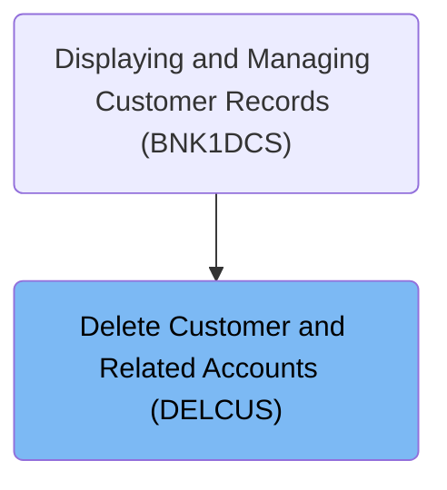
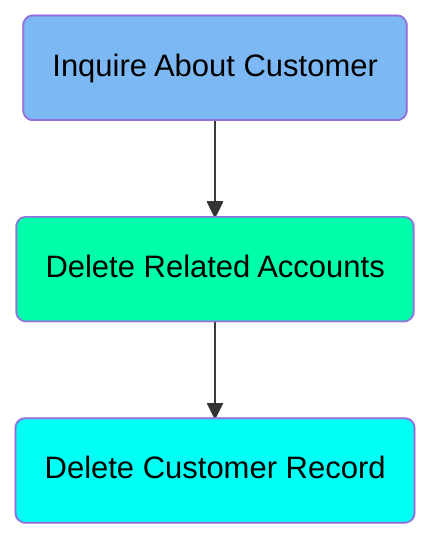
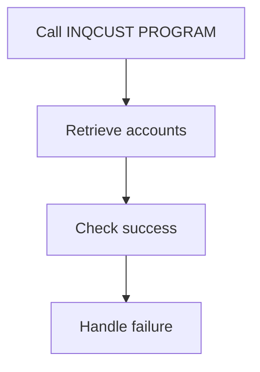
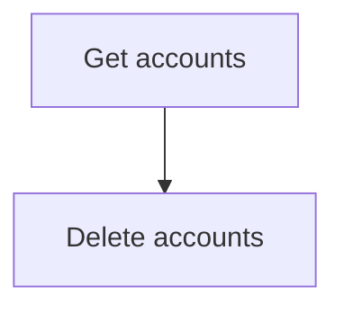
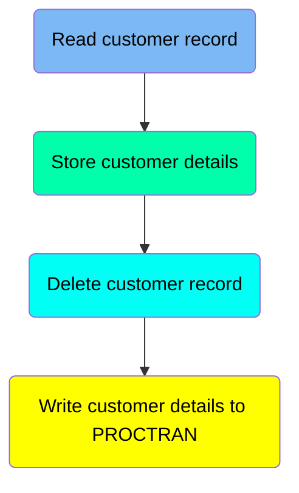
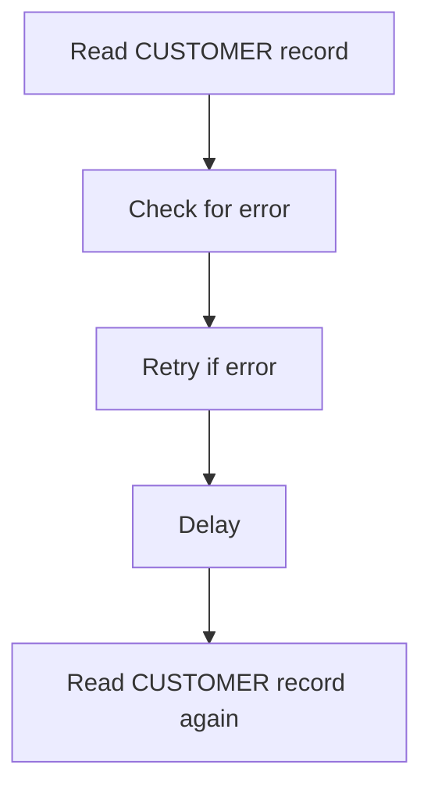
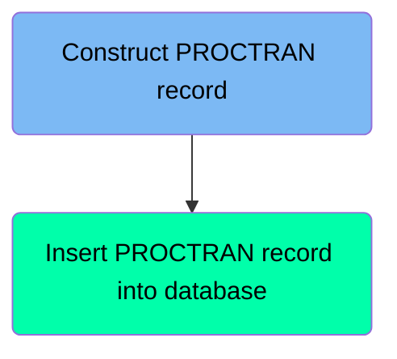

When a user requests to delete a customer and their accounts, the BNK1DCS program initiates the DELCUS program. The DELCUS program then retrieves the customer's accounts, deletes them one by one, and finally deletes the customer record. This ensures that all related records are deleted in a controlled manner, maintaining data integrity.

# Where is this program used?

This program is used once, in a flow starting from `BNK1DCS` as represented in the following diagram:



# Main flow (PREMIERE)



## Inquire about customer



<SwmSnippet path="/src/base/cobol_src/DELCUS.cbl" line="260" repo-id="Z2l0aHViJTNBJTNBY2ljcy1iYW5raW5nLXNhbXBsZS1hcHBsaWNhdGlvbi1jYnNhLUlCTS1EZW1vJTNBJTNBU3dpbW0tRGVtbw==">

---

The PREMIERE function calls the INQCUST program to retrieve the associated accounts for the customer.

```cobol
           EXEC CICS LINK PROGRAM(INQCUST-PROGRAM)
                     COMMAREA(INQCUST-COMMAREA)
           END-EXEC.
```

---

</SwmSnippet>

<SwmSnippet path="/src/base/cobol_src/DELCUS.cbl" line="264" repo-id="Z2l0aHViJTNBJTNBY2ljcy1iYW5raW5nLXNhbXBsZS1hcHBsaWNhdGlvbi1jYnNhLUlCTS1EZW1vJTNBJTNBU3dpbW0tRGVtbw==">

---

If the customer inquiry was unsuccessful, the function returns control to the calling program, effectively terminating the deletion process.

```cobol
           IF INQCUST-INQ-SUCCESS = 'N'
             MOVE 'N' TO COMM-DEL-SUCCESS
             MOVE INQCUST-INQ-FAIL-CD TO COMM-DEL-FAIL-CD
             EXEC CICS RETURN
```

---

</SwmSnippet>

## Delete related accounts



<SwmSnippet path="/src/base/cobol_src/DELCUS.cbl" line="271" repo-id="Z2l0aHViJTNBJTNBY2ljcy1iYW5raW5nLXNhbXBsZS1hcHBsaWNhdGlvbi1jYnNhLUlCTS1EZW1vJTNBJTNBU3dpbW0tRGVtbw==">

---

The PREMIERE function calls the <SwmToken path="/src/base/cobol_src/DELCUS.cbl" pos="271:3:5" line-data="           PERFORM GET-ACCOUNTS" repo-id="Z2l0aHViJTNBJTNBY2ljcy1iYW5raW5nLXNhbXBsZS1hcHBsaWNhdGlvbi1jYnNhLUlCTS1EZW1vJTNBJTNBU3dpbW0tRGVtbw==" repo-name="cics-banking-sample-application-cbsa-IBM-Demo">`GET-ACCOUNTS`</SwmToken> function to retrieve the associated accounts for the customer.

```cobol
           PERFORM GET-ACCOUNTS
      *
```

---

</SwmSnippet>

<SwmSnippet path="/src/base/cobol_src/DELCUS.cbl" line="276" repo-id="Z2l0aHViJTNBJTNBY2ljcy1iYW5raW5nLXNhbXBsZS1hcHBsaWNhdGlvbi1jYnNhLUlCTS1EZW1vJTNBJTNBU3dpbW0tRGVtbw==">

---

After retrieving the accounts, the PREMIERE function uses the <SwmToken path="/src/base/cobol_src/DELCUS.cbl" pos="277:3:5" line-data="             PERFORM DELETE-ACCOUNTS" repo-id="Z2l0aHViJTNBJTNBY2ljcy1iYW5raW5nLXNhbXBsZS1hcHBsaWNhdGlvbi1jYnNhLUlCTS1EZW1vJTNBJTNBU3dpbW0tRGVtbw==" repo-name="cics-banking-sample-application-cbsa-IBM-Demo">`DELETE-ACCOUNTS`</SwmToken> function to delete the accounts one at a time.

```cobol
           IF NUMBER-OF-ACCOUNTS > 0
             PERFORM DELETE-ACCOUNTS
           END-IF
```

---

</SwmSnippet>

## Delete customer record

<SwmSnippet path="/src/base/cobol_src/DELCUS.cbl" line="286" repo-id="Z2l0aHViJTNBJTNBY2ljcy1iYW5raW5nLXNhbXBsZS1hcHBsaWNhdGlvbi1jYnNhLUlCTS1EZW1vJTNBJTNBU3dpbW0tRGVtbw==">

---

After deleting all the accounts, the function calls the <SwmToken path="/src/base/cobol_src/DELCUS.cbl" pos="286:3:7" line-data="           PERFORM DEL-CUST-VSAM" repo-id="Z2l0aHViJTNBJTNBY2ljcy1iYW5raW5nLXNhbXBsZS1hcHBsaWNhdGlvbi1jYnNhLUlCTS1EZW1vJTNBJTNBU3dpbW0tRGVtbw==" repo-name="cics-banking-sample-application-cbsa-IBM-Demo">`DEL-CUST-VSAM`</SwmToken> section to delete the customer record.

```cobol
           PERFORM DEL-CUST-VSAM


           MOVE 'Y' TO COMM-DEL-SUCCESS.
           MOVE ' ' TO COMM-DEL-FAIL-CD.
```

---

</SwmSnippet>

# Retrieve customer accounts (<SwmToken path="/src/base/cobol_src/DELCUS.cbl" pos="322:1:3" line-data="       GET-ACCOUNTS SECTION." repo-id="Z2l0aHViJTNBJTNBY2ljcy1iYW5raW5nLXNhbXBsZS1hcHBsaWNhdGlvbi1jYnNhLUlCTS1EZW1vJTNBJTNBU3dpbW0tRGVtbw==" repo-name="cics-banking-sample-application-cbsa-IBM-Demo">`GET-ACCOUNTS`</SwmToken>)

<SwmSnippet path="/src/base/cobol_src/DELCUS.cbl" line="328" repo-id="Z2l0aHViJTNBJTNBY2ljcy1iYW5raW5nLXNhbXBsZS1hcHBsaWNhdGlvbi1jYnNhLUlCTS1EZW1vJTNBJTNBU3dpbW0tRGVtbw==">

---

The <SwmToken path="/src/base/cobol_src/DELCUS.cbl" pos="322:1:3" line-data="       GET-ACCOUNTS SECTION." repo-id="Z2l0aHViJTNBJTNBY2ljcy1iYW5raW5nLXNhbXBsZS1hcHBsaWNhdGlvbi1jYnNhLUlCTS1EZW1vJTNBJTNBU3dpbW0tRGVtbw==" repo-name="cics-banking-sample-application-cbsa-IBM-Demo">`GET-ACCOUNTS`</SwmToken> function retrieves the accounts associated with a given customer number. It calls the  <SwmToken path="/src/base/cobol_src/DELCUS.cbl" pos="334:10:10" line-data="           EXEC CICS LINK PROGRAM(&#39;INQACCCU&#39;)" repo-id="Z2l0aHViJTNBJTNBY2ljcy1iYW5raW5nLXNhbXBsZS1hcHBsaWNhdGlvbi1jYnNhLUlCTS1EZW1vJTNBJTNBU3dpbW0tRGVtbw==" repo-name="cics-banking-sample-application-cbsa-IBM-Demo">`INQACCCU`</SwmToken> program, which retrieves the accounts and stores them in an array.

```cobol
           MOVE COMM-CUSTNO OF DFHCOMMAREA
              TO CUSTOMER-NUMBER OF INQACCCU-COMMAREA.
           MOVE 20 TO NUMBER-OF-ACCOUNTS IN INQACCCU-COMMAREA.
           SET COMM-PCB-POINTER OF INQACCCU-COMMAREA
              TO DELACC-COMM-PCB1

           EXEC CICS LINK PROGRAM('INQACCCU')
                     COMMAREA(INQACCCU-COMMAREA)
                     SYNCONRETURN
           END-EXEC.
```

---

</SwmSnippet>

# Deleting accounts (<SwmToken path="/src/base/cobol_src/DELCUS.cbl" pos="298:1:3" line-data="       DELETE-ACCOUNTS SECTION." repo-id="Z2l0aHViJTNBJTNBY2ljcy1iYW5raW5nLXNhbXBsZS1hcHBsaWNhdGlvbi1jYnNhLUlCTS1EZW1vJTNBJTNBU3dpbW0tRGVtbw==" repo-name="cics-banking-sample-application-cbsa-IBM-Demo">`DELETE-ACCOUNTS`</SwmToken>)

<SwmSnippet path="/src/base/cobol_src/DELCUS.cbl" line="306" repo-id="Z2l0aHViJTNBJTNBY2ljcy1iYW5raW5nLXNhbXBsZS1hcHBsaWNhdGlvbi1jYnNhLUlCTS1EZW1vJTNBJTNBU3dpbW0tRGVtbw==">

---

The function goes through all the accounts in the array to check if they are relevant. It then calls to the DELACC program for each relevant account to delete it.

```cobol
           PERFORM VARYING WS-INDEX FROM 1 BY 1
           UNTIL WS-INDEX > NUMBER-OF-ACCOUNTS
              INITIALIZE DELACC-COMMAREA
              MOVE WS-APPLID TO DELACC-COMM-APPLID
              MOVE COMM-ACCNO(WS-INDEX) TO DELACC-COMM-ACCNO

              EXEC CICS LINK PROGRAM('DELACC  ')
                       COMMAREA(DELACC-COMMAREA)
              END-EXEC

           END-PERFORM.
```

---

</SwmSnippet>

# Read and delete customer record (<SwmToken path="/src/base/cobol_src/DELCUS.cbl" pos="343:1:5" line-data="       DEL-CUST-VSAM SECTION." repo-id="Z2l0aHViJTNBJTNBY2ljcy1iYW5raW5nLXNhbXBsZS1hcHBsaWNhdGlvbi1jYnNhLUlCTS1EZW1vJTNBJTNBU3dpbW0tRGVtbw==" repo-name="cics-banking-sample-application-cbsa-IBM-Demo">`DEL-CUST-VSAM`</SwmToken>)

Let's split this section into smaller parts:



## Read customer record



<SwmSnippet path="/src/base/cobol_src/DELCUS.cbl" line="353" repo-id="Z2l0aHViJTNBJTNBY2ljcy1iYW5raW5nLXNhbXBsZS1hcHBsaWNhdGlvbi1jYnNhLUlCTS1EZW1vJTNBJTNBU3dpbW0tRGVtbw==">

---

The <SwmToken path="/src/base/cobol_src/DELCUS.cbl" pos="343:1:5" line-data="       DEL-CUST-VSAM SECTION." repo-id="Z2l0aHViJTNBJTNBY2ljcy1iYW5raW5nLXNhbXBsZS1hcHBsaWNhdGlvbi1jYnNhLUlCTS1EZW1vJTNBJTNBU3dpbW0tRGVtbw==" repo-name="cics-banking-sample-application-cbsa-IBM-Demo">`DEL-CUST-VSAM`</SwmToken> function reads the CUSTOMER record from the <SwmToken path="/src/base/cobol_src/DELCUS.cbl" pos="353:10:10" line-data="           EXEC CICS READ FILE(&#39;CUSTOMER&#39;)" repo-id="Z2l0aHViJTNBJTNBY2ljcy1iYW5raW5nLXNhbXBsZS1hcHBsaWNhdGlvbi1jYnNhLUlCTS1EZW1vJTNBJTNBU3dpbW0tRGVtbw==" repo-name="cics-banking-sample-application-cbsa-IBM-Demo">`CUSTOMER`</SwmToken> file.

```cobol
           EXEC CICS READ FILE('CUSTOMER')
                RIDFLD(DESIRED-KEY)
                INTO(OUTPUT-CUST-DATA)
                UPDATE
                TOKEN(WS-TOKEN)
                RESP(WS-CICS-RESP)
```

---

</SwmSnippet>

<SwmSnippet path="/src/base/cobol_src/DELCUS.cbl" line="362" repo-id="Z2l0aHViJTNBJTNBY2ljcy1iYW5raW5nLXNhbXBsZS1hcHBsaWNhdGlvbi1jYnNhLUlCTS1EZW1vJTNBJTNBU3dpbW0tRGVtbw==">

---

If the CICS response code indicates a system ID error, the function enters a loop to retry the read operation up to <SwmToken path="/src/base/cobol_src/DELCUS.cbl" pos="501:9:9" line-data="              UNTIL SYSIDERR-RETRY &gt; 100" repo-id="Z2l0aHViJTNBJTNBY2ljcy1iYW5raW5nLXNhbXBsZS1hcHBsaWNhdGlvbi1jYnNhLUlCTS1EZW1vJTNBJTNBU3dpbW0tRGVtbw==" repo-name="cics-banking-sample-application-cbsa-IBM-Demo">`100`</SwmToken> times. It uses the EXEC CICS DELAY FOR SECONDS command to introduce a <SwmToken path="/src/base/cobol_src/DELCUS.cbl" pos="368:11:11" line-data="                 EXEC CICS DELAY FOR SECONDS(3)" repo-id="Z2l0aHViJTNBJTNBY2ljcy1iYW5raW5nLXNhbXBsZS1hcHBsaWNhdGlvbi1jYnNhLUlCTS1EZW1vJTNBJTNBU3dpbW0tRGVtbw==" repo-name="cics-banking-sample-application-cbsa-IBM-Demo">`3`</SwmToken>-second delay between retries.

```cobol
           IF WS-CICS-RESP = DFHRESP(SYSIDERR)
              PERFORM VARYING SYSIDERR-RETRY FROM 1 BY 1
              UNTIL SYSIDERR-RETRY > 100
              OR WS-CICS-RESP = DFHRESP(NORMAL)
              OR WS-CICS-RESP IS NOT EQUAL TO DFHRESP(SYSIDERR)

                 EXEC CICS DELAY FOR SECONDS(3)
                 END-EXEC

```

---

</SwmSnippet>

## Store customer details

<SwmSnippet path="src/base/cobol_src/DELCUS.cbl" line="454" repo-id="Z2l0aHViJTNBJTNBY2ljcy1iYW5raW5nLXNhbXBsZS1hcHBsaWNhdGlvbi1jYnNhLUlCTS1EZW1vJTNBJTNBU3dpbW0tRGVtbw==">

---

Here we store the customer details in the <SwmToken path="/src/base/cobol_src/DELCUS.cbl" pos="454:9:11" line-data="           MOVE CUSTOMER-EYECATCHER TO WS-STOREDC-EYECATCHER" repo-id="Z2l0aHViJTNBJTNBY2ljcy1iYW5raW5nLXNhbXBsZS1hcHBsaWNhdGlvbi1jYnNhLUlCTS1EZW1vJTNBJTNBU3dpbW0tRGVtbw==" repo-name="cics-banking-sample-application-cbsa-IBM-Demo">`WS-STOREDC`</SwmToken> structure.

```
           MOVE CUSTOMER-EYECATCHER TO WS-STOREDC-EYECATCHER
                                        COMM-EYE IN DFHCOMMAREA.
           MOVE CUSTOMER-SORTCODE   TO WS-STOREDC-SORTCODE
                                       COMM-SCODE IN DFHCOMMAREA.
           MOVE CUSTOMER-NUMBER OF CUSTOMER-RECORD
              TO WS-STOREDC-NUMBER COMM-CUSTNO IN DFHCOMMAREA.
           MOVE CUSTOMER-NAME       TO WS-STOREDC-NAME
                                       COMM-NAME IN DFHCOMMAREA.
           MOVE CUSTOMER-ADDRESS    TO WS-STOREDC-ADDRESS
                                       COMM-ADDR IN DFHCOMMAREA.
           MOVE CUSTOMER-DATE-OF-BIRTH(1:2)
              TO WS-STOREDC-DATE-OF-BIRTH(1:2)
                 COMM-BIRTH-DAY IN DFHCOMMAREA.
           MOVE '/'                 TO WS-STOREDC-DATE-OF-BIRTH(3:1).
           MOVE CUSTOMER-DATE-OF-BIRTH(3:2)
              TO WS-STOREDC-DATE-OF-BIRTH(4:2)
                 COMM-BIRTH-MONTH IN DFHCOMMAREA.
           MOVE '/'                 TO WS-STOREDC-DATE-OF-BIRTH(6:1).

           MOVE CUSTOMER-DATE-OF-BIRTH(5:4)
              TO WS-STOREDC-DATE-OF-BIRTH(7:4)
                 COMM-BIRTH-YEAR IN DFHCOMMAREA.

           MOVE CUSTOMER-CREDIT-SCORE TO WS-STOREDC-CREDIT-SCORE
                                         COMM-CREDIT-SCORE.
           MOVE CUSTOMER-CS-REVIEW-DATE(1:2)
             TO WS-STOREDC-CS-REVIEW-DATE(1:2)
                COMM-CS-REVIEW-DD IN DFHCOMMAREA.
           MOVE '/'                 TO WS-STOREDC-CS-REVIEW-DATE(3:1).
           MOVE CUSTOMER-CS-REVIEW-DATE(3:2)
             TO WS-STOREDC-CS-REVIEW-DATE(4:2)
                COMM-CS-REVIEW-MM IN DFHCOMMAREA.
           MOVE '/'                 TO WS-STOREDC-CS-REVIEW-DATE(6:1).
           MOVE CUSTOMER-CS-REVIEW-DATE(5:4)
             TO WS-STOREDC-CS-REVIEW-DATE(7:4)
                COMM-CS-REVIEW-YYYY IN DFHCOMMAREA.
```

---

</SwmSnippet>

## Delete customer record

<SwmSnippet path="/src/base/cobol_src/DELCUS.cbl" line="491" repo-id="Z2l0aHViJTNBJTNBY2ljcy1iYW5raW5nLXNhbXBsZS1hcHBsaWNhdGlvbi1jYnNhLUlCTS1EZW1vJTNBJTNBU3dpbW0tRGVtbw==">

---

The function deletes the customer record from the <SwmToken path="/src/base/cobol_src/DELCUS.cbl" pos="492:7:7" line-data="              DELETE FILE (&#39;CUSTOMER&#39;)" repo-id="Z2l0aHViJTNBJTNBY2ljcy1iYW5raW5nLXNhbXBsZS1hcHBsaWNhdGlvbi1jYnNhLUlCTS1EZW1vJTNBJTNBU3dpbW0tRGVtbw==" repo-name="cics-banking-sample-application-cbsa-IBM-Demo">`CUSTOMER`</SwmToken> file. If there is a failure at any time after deleting the record, the function abends to ensure the records remain in sync.

```cobol
           EXEC CICS
              DELETE FILE ('CUSTOMER')
              TOKEN(WS-TOKEN)
              RESP(WS-CICS-RESP)
              RESP2(WS-CICS-RESP2)
           END-EXEC.
```

---

</SwmSnippet>

## Write customer details to PROCTRAN

<SwmSnippet path="/src/base/cobol_src/DELCUS.cbl" line="580" repo-id="Z2l0aHViJTNBJTNBY2ljcy1iYW5raW5nLXNhbXBsZS1hcHBsaWNhdGlvbi1jYnNhLUlCTS1EZW1vJTNBJTNBU3dpbW0tRGVtbw==">

---

Finally, the function calls the <SwmToken path="/src/base/cobol_src/DELCUS.cbl" pos="580:3:7" line-data="           PERFORM WRITE-PROCTRAN-CUST." repo-id="Z2l0aHViJTNBJTNBY2ljcy1iYW5raW5nLXNhbXBsZS1hcHBsaWNhdGlvbi1jYnNhLUlCTS1EZW1vJTNBJTNBU3dpbW0tRGVtbw==" repo-name="cics-banking-sample-application-cbsa-IBM-Demo">`WRITE-PROCTRAN-CUST`</SwmToken> function, which writes the customer details to the PROCTRAN file.

```cobol
           PERFORM WRITE-PROCTRAN-CUST.
```

---

</SwmSnippet>

# Record customer deletion (<SwmToken path="/src/base/cobol_src/DELCUS.cbl" pos="597:1:7" line-data="       WRITE-PROCTRAN-CUST-DB2 SECTION." repo-id="Z2l0aHViJTNBJTNBY2ljcy1iYW5raW5nLXNhbXBsZS1hcHBsaWNhdGlvbi1jYnNhLUlCTS1EZW1vJTNBJTNBU3dpbW0tRGVtbw==" repo-name="cics-banking-sample-application-cbsa-IBM-Demo">`WRITE-PROCTRAN-CUST-DB2`</SwmToken>)

Let's split this section into smaller parts:



## Construct PROCTRAN record

<SwmSnippet path="/src/base/cobol_src/DELCUS.cbl" line="624" repo-id="Z2l0aHViJTNBJTNBY2ljcy1iYW5raW5nLXNhbXBsZS1hcHBsaWNhdGlvbi1jYnNhLUlCTS1EZW1vJTNBJTNBU3dpbW0tRGVtbw==">

---

Here we set the date for the PROCTRAN record.

```cobol
           MOVE WS-ORIG-DATE TO WS-ORIG-DATE-GRP-X.
           MOVE WS-ORIG-DATE-GRP-X TO HV-PROCTRAN-DATE.
```

---

</SwmSnippet>

<SwmSnippet path="/src/base/cobol_src/DELCUS.cbl" line="627" repo-id="Z2l0aHViJTNBJTNBY2ljcy1iYW5raW5nLXNhbXBsZS1hcHBsaWNhdGlvbi1jYnNhLUlCTS1EZW1vJTNBJTNBU3dpbW0tRGVtbw==">

---

Next, we set the customer details in the PROCTRAN record by moving the stored customer sort code, number, name, and date of birth to the appropriate positions.

```cobol
           MOVE WS-STOREDC-SORTCODE      TO HV-PROCTRAN-DESC(1:6).
           MOVE WS-STOREDC-NUMBER        TO HV-PROCTRAN-DESC(7:10).
           MOVE WS-STOREDC-NAME          TO HV-PROCTRAN-DESC(17:14).
           MOVE WS-STOREDC-DATE-OF-BIRTH TO HV-PROCTRAN-DESC(31:10).
```

---

</SwmSnippet>

## Insert PROCTRAN record into database

<SwmSnippet path="/src/base/cobol_src/DELCUS.cbl" line="636" repo-id="Z2l0aHViJTNBJTNBY2ljcy1iYW5raW5nLXNhbXBsZS1hcHBsaWNhdGlvbi1jYnNhLUlCTS1EZW1vJTNBJTNBU3dpbW0tRGVtbw==">

---

The code snippet executes an SQL INSERT statement to insert a PROCTRAN record into the database.

```cobol
           EXEC SQL
              INSERT INTO PROCTRAN
                     (
                      PROCTRAN_EYECATCHER,
                      PROCTRAN_SORTCODE,
                      PROCTRAN_NUMBER,
                      PROCTRAN_DATE,
                      PROCTRAN_TIME,
                      PROCTRAN_REF,
                      PROCTRAN_TYPE,
                      PROCTRAN_DESC,
                      PROCTRAN_AMOUNT
                     )
              VALUES
                     (
                      :HV-PROCTRAN-EYECATCHER,
                      :HV-PROCTRAN-SORT-CODE,
                      :HV-PROCTRAN-ACC-NUMBER,
                      :HV-PROCTRAN-DATE,
                      :HV-PROCTRAN-TIME,
                      :HV-PROCTRAN-REF,
                      :HV-PROCTRAN-TYPE,
                      :HV-PROCTRAN-DESC,
                      :HV-PROCTRAN-AMOUNT
                     )
```

---

</SwmSnippet>

*This is an auto-generated document by Swimm 🌊 and has not yet been verified by a human*

<SwmMeta version="3.0.0"><sup>Powered by [Swimm](https://app.swimm.io/)</sup></SwmMeta>
