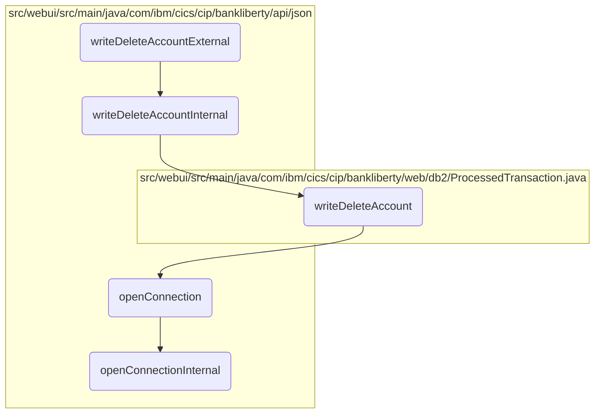

In this document, we will explain the process of deleting a bank account. The process involves several steps, including initiating the deletion, processing the deletion internally, writing the deletion to the database, and managing the database connection.

The flow starts with initiating the account deletion by receiving the account details in JSON format. Then, it processes the deletion internally by interacting with the database to check if the deletion was successful. If successful, it writes the account deletion details to the database, preparing and executing the SQL statement. Finally, it ensures that a connection to the <SwmToken path="src/webui/src/main/java/com/ibm/cics/cip/bankliberty/api/json/HBankDataAccess.java" pos="71:13:13" line-data="		// Open a connection to the DB2 database">`DB2`</SwmToken> database is established and managed properly.

# Flow drill down



<SwmSnippet path="/src/webui/src/main/java/com/ibm/cics/cip/bankliberty/api/json/ProcessedTransactionResource.java" line="412">

---

## Handling the deletion of an account

First, the <SwmToken path="src/webui/src/main/java/com/ibm/cics/cip/bankliberty/api/json/ProcessedTransactionResource.java" pos="416:5:5" line-data="	public Response writeDeleteAccountExternal(">`writeDeleteAccountExternal`</SwmToken> function is called to initiate the account deletion process. It receives the account details in JSON format and calls the <SwmToken path="src/webui/src/main/java/com/ibm/cics/cip/bankliberty/api/json/ProcessedTransactionResource.java" pos="419:7:7" line-data="		Response myResponse = writeDeleteAccountInternal(myDeletedAccount);">`writeDeleteAccountInternal`</SwmToken> function to proceed with the deletion.

```java
	@POST
	@Produces("application/json")
	@Consumes(MediaType.APPLICATION_JSON)
	@Path("/deleteAccount")
	public Response writeDeleteAccountExternal(
			ProcessedTransactionAccountJSON myDeletedAccount)
	{
		Response myResponse = writeDeleteAccountInternal(myDeletedAccount);
		HBankDataAccess myHBankDataAccess = new HBankDataAccess();
		myHBankDataAccess.terminate();
		return myResponse;
	}
```

---

</SwmSnippet>

<SwmSnippet path="/src/webui/src/main/java/com/ibm/cics/cip/bankliberty/api/json/ProcessedTransactionResource.java" line="426">

---

## Processing the account deletion internally

Next, the <SwmToken path="src/webui/src/main/java/com/ibm/cics/cip/bankliberty/api/json/ProcessedTransactionResource.java" pos="426:5:5" line-data="	public Response writeDeleteAccountInternal(">`writeDeleteAccountInternal`</SwmToken> function processes the account deletion by interacting with the database. It checks if the deletion was successful and returns an appropriate response.

```java
	public Response writeDeleteAccountInternal(
			ProcessedTransactionAccountJSON myDeletedAccount)
	{
		com.ibm.cics.cip.bankliberty.web.db2.ProcessedTransaction myProcessedTransactionDB2 = new com.ibm.cics.cip.bankliberty.web.db2.ProcessedTransaction();
		if (myProcessedTransactionDB2.writeDeleteAccount(
				myDeletedAccount.getSortCode(),
				myDeletedAccount.getAccountNumber(),
				myDeletedAccount.getActualBalance(),
				myDeletedAccount.getLastStatement(),
				myDeletedAccount.getNextStatement(),
				myDeletedAccount.getCustomerNumber(),
				myDeletedAccount.getType()))
		{
			return Response.ok().build();
		}
		else
		{
			return Response.serverError().build();
		}

	}
```

---

</SwmSnippet>

<SwmSnippet path="/src/webui/src/main/java/com/ibm/cics/cip/bankliberty/web/db2/ProcessedTransaction.java" line="752">

---

## Writing the account deletion to the database

Then, the <SwmToken path="src/webui/src/main/java/com/ibm/cics/cip/bankliberty/web/db2/ProcessedTransaction.java" pos="752:5:5" line-data="	public boolean writeDeleteAccount(String sortCode2, String accountNumber,">`writeDeleteAccount`</SwmToken> function writes the account deletion details to the database. It prepares the SQL statement and executes it, handling any SQL exceptions that may occur.

```java
	public boolean writeDeleteAccount(String sortCode2, String accountNumber,
			BigDecimal actualBalance, Date lastStatement, Date nextStatement,
			String customerNumber, String accountType)
	{
		logger.entering(this.getClass().getName(), WRITE_DELETE_ACCOUNT);

		PROCTRAN myPROCTRAN = new PROCTRAN();

		Calendar myCalendar = Calendar.getInstance();
		myCalendar.setTime(lastStatement);

		myPROCTRAN.setProcDescDelaccLastDd(myCalendar.get(Calendar.DATE));
		myPROCTRAN.setProcDescDelaccLastMm(myCalendar.get(Calendar.MONTH) + 1);
		myPROCTRAN.setProcDescDelaccLastYyyy(myCalendar.get(Calendar.YEAR));

		myCalendar.setTime(nextStatement);
		myPROCTRAN.setProcDescDelaccNextDd(myCalendar.get(Calendar.DATE));
		myPROCTRAN.setProcDescDelaccNextMm(myCalendar.get(Calendar.MONTH) + 1);
		myPROCTRAN.setProcDescDelaccNextYyyy(myCalendar.get(Calendar.YEAR));
		myPROCTRAN.setProcDescDelaccAcctype(accountType);
		myPROCTRAN.setProcDescDelaccCustomer(Integer.parseInt(customerNumber));
```

---

</SwmSnippet>

<SwmSnippet path="/src/webui/src/main/java/com/ibm/cics/cip/bankliberty/api/json/HBankDataAccess.java" line="69">

---

## Opening a database connection

Moving to the <SwmToken path="src/webui/src/main/java/com/ibm/cics/cip/bankliberty/api/json/HBankDataAccess.java" pos="69:5:5" line-data="	protected void openConnection()">`openConnection`</SwmToken> function, it ensures that a connection to the <SwmToken path="src/webui/src/main/java/com/ibm/cics/cip/bankliberty/api/json/HBankDataAccess.java" pos="71:13:13" line-data="		// Open a connection to the DB2 database">`DB2`</SwmToken> database is established. If a connection is not available or is closed, it calls <SwmToken path="src/webui/src/main/java/com/ibm/cics/cip/bankliberty/api/json/HBankDataAccess.java" pos="87:1:1" line-data="			openConnectionInternal();">`openConnectionInternal`</SwmToken> to create a new one.

```java
	protected void openConnection()
	{
		// Open a connection to the DB2 database
		logger.entering(this.getClass().getName(), "openConnection()");

		Integer taskNumberInteger = Task.getTask().getTaskNumber();
		String db2ConnString = DB2CONN.concat(taskNumberInteger.toString());
		logger.log(Level.FINE,
				() -> "Attempting to get DB2CONN for task number "
						+ taskNumberInteger.toString());
		this.conn = (Connection) cornedBeef.get(db2ConnString);
		if (this.conn == null)
		{
			HBankDataAccess.incrementConnCount();
			logger.log(Level.FINE,
					() -> "Attempting to create DB2CONN for task number "
							+ taskNumberInteger.toString());
			// Attempt to open a connection
			openConnectionInternal();
			logger.log(Level.FINE,
					() -> "Creation succcessful for DB2CONN for task number "
```

---

</SwmSnippet>

<SwmSnippet path="/src/webui/src/main/java/com/ibm/cics/cip/bankliberty/api/json/HBankDataAccess.java" line="162">

---

## Establishing a new database connection

Finally, the <SwmToken path="src/webui/src/main/java/com/ibm/cics/cip/bankliberty/api/json/HBankDataAccess.java" pos="163:3:3" line-data="	void openConnectionInternal()">`openConnectionInternal`</SwmToken> function establishes a new connection to the database using JNDI lookup. It handles any exceptions that may occur during this process and ensures the connection is ready for use.

```java
	@SuppressWarnings("unchecked")
	void openConnectionInternal()
	{
		logger.entering(this.getClass().getName(), "openConnectionInternal");
		String jndiString = "jdbc/defaultCICSDataSource";
		Context ctx;

		try
		{
			ctx = new InitialContext();
			DataSource ds = (DataSource) ctx.lookup(jndiString);
			logger.log(Level.FINE, () -> "jndi string is " + jndiString);
			// If there is no current connection
			if (this.conn == null)
			{
				logger.log(Level.FINE,
						() -> "About to attempt to get DB2 connection");
				// Try and get a connection
				this.conn = ds.getConnection();
				this.conn.setTransactionIsolation(
						Connection.TRANSACTION_READ_UNCOMMITTED);
```

---

</SwmSnippet>

&nbsp;

*This is an auto-generated document by Swimm 🌊 and has not yet been verified by a human*

<SwmMeta version="3.0.0" repo-id="Z2l0aHViJTNBJTNBY2ljcy1iYW5raW5nLXNhbXBsZS1hcHBsaWNhdGlvbi1jYnNhLUlCTS1EZW1vJTNBJTNBU3dpbW0tRGVtbw==" repo-name="cics-banking-sample-application-cbsa-IBM-Demo"><sup>Powered by [Swimm](/)</sup></SwmMeta>
