```mermaid
graph TD
  subgraph writeDeleteCustomerInternal
    writeDeleteCustomerInternal:A["Create ProcessedTransaction object"] --> writeDeleteCustomerInternal:B["Call writeDeleteCustomer with customer details"]
    writeDeleteCustomerInternal:B --> writeDeleteCustomerInternal:C["Check result"]
    writeDeleteCustomerInternal:C -->|Success| writeDeleteCustomerInternal:D["Return OK response"]
    writeDeleteCustomerInternal:C -->|Failure| writeDeleteCustomerInternal:E["Return Server Error response"]
  end
  subgraph writeDeleteCustomer
    writeDeleteCustomer:A["Sort out DateTime string"] --> writeDeleteCustomer:B["Convert customer DOB to string"]
    writeDeleteCustomer:B --> writeDeleteCustomer:C["Initialize deleteCustomerDescription"]
    writeDeleteCustomer:C --> writeDeleteCustomer:D["Format and append sort code"]
    writeDeleteCustomer:D --> writeDeleteCustomer:E["Pad and append customer number and name"]
    writeDeleteCustomer:E --> writeDeleteCustomer:F["Append customer DOB string"]
    writeDeleteCustomer:F --> writeDeleteCustomer:G["Open database connection"]
    writeDeleteCustomer:G --> writeDeleteCustomer:H["Prepare SQL DELETE statement"]
    writeDeleteCustomer:H --> writeDeleteCustomer:I["Execute SQL statement"]
    writeDeleteCustomer:I --> writeDeleteCustomer:J["Check if execution was successful"]
    writeDeleteCustomer:J -->|Success| writeDeleteCustomer:K["Return true"]
    writeDeleteCustomer:J -->|Failure| writeDeleteCustomer:L["Log error and return false"]
  end
  writeDeleteCustomerInternal:B --> writeDeleteCustomer

%% Swimm:
%% graph TD
%%   subgraph <SwmToken path="src/webui/src/main/java/com/ibm/cics/cip/bankliberty/api/json/ProcessedTransactionResource.java" pos="346:7:7" line-data="		Response myResponse = writeDeleteCustomerInternal(myDeletedCustomer);">`writeDeleteCustomerInternal`</SwmToken>
%%     <SwmToken path="src/webui/src/main/java/com/ibm/cics/cip/bankliberty/api/json/ProcessedTransactionResource.java" pos="346:7:7" line-data="		Response myResponse = writeDeleteCustomerInternal(myDeletedCustomer);">`writeDeleteCustomerInternal`</SwmToken>:A["Create <SwmToken path="src/webui/src/main/java/com/ibm/cics/cip/bankliberty/api/json/ProcessedTransactionResource.java" pos="356:15:15" line-data="		com.ibm.cics.cip.bankliberty.web.db2.ProcessedTransaction myProcessedTransactionDB2 = new com.ibm.cics.cip.bankliberty.web.db2.ProcessedTransaction();">`ProcessedTransaction`</SwmToken> object"] --> <SwmToken path="src/webui/src/main/java/com/ibm/cics/cip/bankliberty/api/json/ProcessedTransactionResource.java" pos="346:7:7" line-data="		Response myResponse = writeDeleteCustomerInternal(myDeletedCustomer);">`writeDeleteCustomerInternal`</SwmToken>:B["Call <SwmToken path="src/webui/src/main/java/com/ibm/cics/cip/bankliberty/api/json/ProcessedTransactionResource.java" pos="358:6:6" line-data="		if (myProcessedTransactionDB2.writeDeleteCustomer(">`writeDeleteCustomer`</SwmToken> with customer details"]
%%     <SwmToken path="src/webui/src/main/java/com/ibm/cics/cip/bankliberty/api/json/ProcessedTransactionResource.java" pos="346:7:7" line-data="		Response myResponse = writeDeleteCustomerInternal(myDeletedCustomer);">`writeDeleteCustomerInternal`</SwmToken>:B --> <SwmToken path="src/webui/src/main/java/com/ibm/cics/cip/bankliberty/api/json/ProcessedTransactionResource.java" pos="346:7:7" line-data="		Response myResponse = writeDeleteCustomerInternal(myDeletedCustomer);">`writeDeleteCustomerInternal`</SwmToken>:C["Check result"]
%%     <SwmToken path="src/webui/src/main/java/com/ibm/cics/cip/bankliberty/api/json/ProcessedTransactionResource.java" pos="346:7:7" line-data="		Response myResponse = writeDeleteCustomerInternal(myDeletedCustomer);">`writeDeleteCustomerInternal`</SwmToken>:C -->|Success| <SwmToken path="src/webui/src/main/java/com/ibm/cics/cip/bankliberty/api/json/ProcessedTransactionResource.java" pos="346:7:7" line-data="		Response myResponse = writeDeleteCustomerInternal(myDeletedCustomer);">`writeDeleteCustomerInternal`</SwmToken>:D["Return OK response"]
%%     <SwmToken path="src/webui/src/main/java/com/ibm/cics/cip/bankliberty/api/json/ProcessedTransactionResource.java" pos="346:7:7" line-data="		Response myResponse = writeDeleteCustomerInternal(myDeletedCustomer);">`writeDeleteCustomerInternal`</SwmToken>:C -->|Failure| <SwmToken path="src/webui/src/main/java/com/ibm/cics/cip/bankliberty/api/json/ProcessedTransactionResource.java" pos="346:7:7" line-data="		Response myResponse = writeDeleteCustomerInternal(myDeletedCustomer);">`writeDeleteCustomerInternal`</SwmToken>:E["Return Server Error response"]
%%   end
%%   subgraph <SwmToken path="src/webui/src/main/java/com/ibm/cics/cip/bankliberty/api/json/ProcessedTransactionResource.java" pos="358:6:6" line-data="		if (myProcessedTransactionDB2.writeDeleteCustomer(">`writeDeleteCustomer`</SwmToken>
%%     <SwmToken path="src/webui/src/main/java/com/ibm/cics/cip/bankliberty/api/json/ProcessedTransactionResource.java" pos="358:6:6" line-data="		if (myProcessedTransactionDB2.writeDeleteCustomer(">`writeDeleteCustomer`</SwmToken>:A["Sort out DateTime string"] --> <SwmToken path="src/webui/src/main/java/com/ibm/cics/cip/bankliberty/api/json/ProcessedTransactionResource.java" pos="358:6:6" line-data="		if (myProcessedTransactionDB2.writeDeleteCustomer(">`writeDeleteCustomer`</SwmToken>:B["Convert customer DOB to string"]
%%     <SwmToken path="src/webui/src/main/java/com/ibm/cics/cip/bankliberty/api/json/ProcessedTransactionResource.java" pos="358:6:6" line-data="		if (myProcessedTransactionDB2.writeDeleteCustomer(">`writeDeleteCustomer`</SwmToken>:B --> <SwmToken path="src/webui/src/main/java/com/ibm/cics/cip/bankliberty/api/json/ProcessedTransactionResource.java" pos="358:6:6" line-data="		if (myProcessedTransactionDB2.writeDeleteCustomer(">`writeDeleteCustomer`</SwmToken>:C["Initialize <SwmToken path="src/webui/src/main/java/com/ibm/cics/cip/bankliberty/web/db2/ProcessedTransaction.java" pos="636:3:3" line-data="		String deleteCustomerDescription = &quot;&quot;;">`deleteCustomerDescription`</SwmToken>"]
%%     <SwmToken path="src/webui/src/main/java/com/ibm/cics/cip/bankliberty/api/json/ProcessedTransactionResource.java" pos="358:6:6" line-data="		if (myProcessedTransactionDB2.writeDeleteCustomer(">`writeDeleteCustomer`</SwmToken>:C --> <SwmToken path="src/webui/src/main/java/com/ibm/cics/cip/bankliberty/api/json/ProcessedTransactionResource.java" pos="358:6:6" line-data="		if (myProcessedTransactionDB2.writeDeleteCustomer(">`writeDeleteCustomer`</SwmToken>:D["Format and append sort code"]
%%     <SwmToken path="src/webui/src/main/java/com/ibm/cics/cip/bankliberty/api/json/ProcessedTransactionResource.java" pos="358:6:6" line-data="		if (myProcessedTransactionDB2.writeDeleteCustomer(">`writeDeleteCustomer`</SwmToken>:D --> <SwmToken path="src/webui/src/main/java/com/ibm/cics/cip/bankliberty/api/json/ProcessedTransactionResource.java" pos="358:6:6" line-data="		if (myProcessedTransactionDB2.writeDeleteCustomer(">`writeDeleteCustomer`</SwmToken>:E["Pad and append customer number and name"]
%%     <SwmToken path="src/webui/src/main/java/com/ibm/cics/cip/bankliberty/api/json/ProcessedTransactionResource.java" pos="358:6:6" line-data="		if (myProcessedTransactionDB2.writeDeleteCustomer(">`writeDeleteCustomer`</SwmToken>:E --> <SwmToken path="src/webui/src/main/java/com/ibm/cics/cip/bankliberty/api/json/ProcessedTransactionResource.java" pos="358:6:6" line-data="		if (myProcessedTransactionDB2.writeDeleteCustomer(">`writeDeleteCustomer`</SwmToken>:F["Append customer DOB string"]
%%     <SwmToken path="src/webui/src/main/java/com/ibm/cics/cip/bankliberty/api/json/ProcessedTransactionResource.java" pos="358:6:6" line-data="		if (myProcessedTransactionDB2.writeDeleteCustomer(">`writeDeleteCustomer`</SwmToken>:F --> <SwmToken path="src/webui/src/main/java/com/ibm/cics/cip/bankliberty/api/json/ProcessedTransactionResource.java" pos="358:6:6" line-data="		if (myProcessedTransactionDB2.writeDeleteCustomer(">`writeDeleteCustomer`</SwmToken>:G["Open database connection"]
%%     <SwmToken path="src/webui/src/main/java/com/ibm/cics/cip/bankliberty/api/json/ProcessedTransactionResource.java" pos="358:6:6" line-data="		if (myProcessedTransactionDB2.writeDeleteCustomer(">`writeDeleteCustomer`</SwmToken>:G --> <SwmToken path="src/webui/src/main/java/com/ibm/cics/cip/bankliberty/api/json/ProcessedTransactionResource.java" pos="358:6:6" line-data="		if (myProcessedTransactionDB2.writeDeleteCustomer(">`writeDeleteCustomer`</SwmToken>:H["Prepare SQL DELETE statement"]
%%     <SwmToken path="src/webui/src/main/java/com/ibm/cics/cip/bankliberty/api/json/ProcessedTransactionResource.java" pos="358:6:6" line-data="		if (myProcessedTransactionDB2.writeDeleteCustomer(">`writeDeleteCustomer`</SwmToken>:H --> <SwmToken path="src/webui/src/main/java/com/ibm/cics/cip/bankliberty/api/json/ProcessedTransactionResource.java" pos="358:6:6" line-data="		if (myProcessedTransactionDB2.writeDeleteCustomer(">`writeDeleteCustomer`</SwmToken>:I["Execute SQL statement"]
%%     <SwmToken path="src/webui/src/main/java/com/ibm/cics/cip/bankliberty/api/json/ProcessedTransactionResource.java" pos="358:6:6" line-data="		if (myProcessedTransactionDB2.writeDeleteCustomer(">`writeDeleteCustomer`</SwmToken>:I --> <SwmToken path="src/webui/src/main/java/com/ibm/cics/cip/bankliberty/api/json/ProcessedTransactionResource.java" pos="358:6:6" line-data="		if (myProcessedTransactionDB2.writeDeleteCustomer(">`writeDeleteCustomer`</SwmToken>:J["Check if execution was successful"]
%%     <SwmToken path="src/webui/src/main/java/com/ibm/cics/cip/bankliberty/api/json/ProcessedTransactionResource.java" pos="358:6:6" line-data="		if (myProcessedTransactionDB2.writeDeleteCustomer(">`writeDeleteCustomer`</SwmToken>:J -->|Success| <SwmToken path="src/webui/src/main/java/com/ibm/cics/cip/bankliberty/api/json/ProcessedTransactionResource.java" pos="358:6:6" line-data="		if (myProcessedTransactionDB2.writeDeleteCustomer(">`writeDeleteCustomer`</SwmToken>:K["Return true"]
%%     <SwmToken path="src/webui/src/main/java/com/ibm/cics/cip/bankliberty/api/json/ProcessedTransactionResource.java" pos="358:6:6" line-data="		if (myProcessedTransactionDB2.writeDeleteCustomer(">`writeDeleteCustomer`</SwmToken>:J -->|Failure| <SwmToken path="src/webui/src/main/java/com/ibm/cics/cip/bankliberty/api/json/ProcessedTransactionResource.java" pos="358:6:6" line-data="		if (myProcessedTransactionDB2.writeDeleteCustomer(">`writeDeleteCustomer`</SwmToken>:L["Log error and return false"]
%%   end
%%   <SwmToken path="src/webui/src/main/java/com/ibm/cics/cip/bankliberty/api/json/ProcessedTransactionResource.java" pos="346:7:7" line-data="		Response myResponse = writeDeleteCustomerInternal(myDeletedCustomer);">`writeDeleteCustomerInternal`</SwmToken>:B --> <SwmToken path="src/webui/src/main/java/com/ibm/cics/cip/bankliberty/api/json/ProcessedTransactionResource.java" pos="358:6:6" line-data="		if (myProcessedTransactionDB2.writeDeleteCustomer(">`writeDeleteCustomer`</SwmToken>
```

In this document, we will explain the process of deleting a customer record. The process involves the following steps: receiving the customer details, performing the deletion operation in the database, and ensuring proper resource management.

The flow starts with receiving the customer details that need to be deleted. Then, the system performs the actual deletion operation in the database. Finally, it ensures that any resources used during the process are properly released and returns a response indicating the success or failure of the operation.

Here is a high level diagram of the flow, showing only the most important functions:

```mermaid
graph TD;
      subgraph srcwebuisrcmainjavacomibmcicscipbankliberty[src/…/cip/bankliberty]
fa5b933520b20bd11349d476a82882f5ade8fcee2473556a4ac006397bfa5377(ProcessedTransactionResource.writeDeleteCustomerExternal) --> 3d74789877718d1b8b019d57e87bd22d8662b5cc6e48958da27494ee1231f216(ProcessedTransactionResource.writeDeleteCustomerInternal)
end

subgraph srcwebuisrcmainjavacomibmcicscipbankliberty[src/…/cip/bankliberty]
3d74789877718d1b8b019d57e87bd22d8662b5cc6e48958da27494ee1231f216(ProcessedTransactionResource.writeDeleteCustomerInternal) --> 89963fe55601352e3b770948e3bc8fb102f9d275b152d082dcb64aaf2a23acfc(ProcessedTransaction.writeDeleteCustomer)
end


      classDef mainFlowStyle color:#000000,fill:#7CB9F4
classDef rootsStyle color:#000000,fill:#00FFF4
classDef Style1 color:#000000,fill:#00FFAA
classDef Style2 color:#000000,fill:#FFFF00
classDef Style3 color:#000000,fill:#AA7CB9

%% Swimm:
%% graph TD;
%%       subgraph srcwebuisrcmainjavacomibmcicscipbankliberty[<SwmPath>[src/…/cip/bankliberty/](src/webui/src/main/java/com/ibm/cics/cip/bankliberty/)</SwmPath>]
%% fa5b933520b20bd11349d476a82882f5ade8fcee2473556a4ac006397bfa5377(ProcessedTransactionResource.writeDeleteCustomerExternal) --> 3d74789877718d1b8b019d57e87bd22d8662b5cc6e48958da27494ee1231f216(ProcessedTransactionResource.writeDeleteCustomerInternal)
%% end
%% 
%% subgraph srcwebuisrcmainjavacomibmcicscipbankliberty[<SwmPath>[src/…/cip/bankliberty/](src/webui/src/main/java/com/ibm/cics/cip/bankliberty/)</SwmPath>]
%% 3d74789877718d1b8b019d57e87bd22d8662b5cc6e48958da27494ee1231f216(ProcessedTransactionResource.writeDeleteCustomerInternal) --> 89963fe55601352e3b770948e3bc8fb102f9d275b152d082dcb64aaf2a23acfc(ProcessedTransaction.writeDeleteCustomer)
%% end
%% 
%% 
%%       classDef mainFlowStyle color:#000000,fill:#7CB9F4
%% classDef rootsStyle color:#000000,fill:#00FFF4
%% classDef Style1 color:#000000,fill:#00FFAA
%% classDef Style2 color:#000000,fill:#FFFF00
%% classDef Style3 color:#000000,fill:#AA7CB9
```



# Flow drill down

```mermaid
graph TD
  subgraph writeDeleteCustomerExternal
    writeDeleteCustomerExternal:A["Call writeDeleteCustomerInternal"] --> writeDeleteCustomerExternal:B["Create HBankDataAccess instance"]
    writeDeleteCustomerExternal:B --> writeDeleteCustomerExternal:C["Terminate HBankDataAccess instance"]
    writeDeleteCustomerExternal:C --> writeDeleteCustomerExternal:D["Return response"]
  end

%% Swimm:
%% graph TD
%%   subgraph <SwmToken path="src/webui/src/main/java/com/ibm/cics/cip/bankliberty/api/json/ProcessedTransactionResource.java" pos="343:5:5" line-data="	public Response writeDeleteCustomerExternal(">`writeDeleteCustomerExternal`</SwmToken>
%%     <SwmToken path="src/webui/src/main/java/com/ibm/cics/cip/bankliberty/api/json/ProcessedTransactionResource.java" pos="343:5:5" line-data="	public Response writeDeleteCustomerExternal(">`writeDeleteCustomerExternal`</SwmToken>:A["Call <SwmToken path="src/webui/src/main/java/com/ibm/cics/cip/bankliberty/api/json/ProcessedTransactionResource.java" pos="346:7:7" line-data="		Response myResponse = writeDeleteCustomerInternal(myDeletedCustomer);">`writeDeleteCustomerInternal`</SwmToken>"] --> <SwmToken path="src/webui/src/main/java/com/ibm/cics/cip/bankliberty/api/json/ProcessedTransactionResource.java" pos="343:5:5" line-data="	public Response writeDeleteCustomerExternal(">`writeDeleteCustomerExternal`</SwmToken>:B["Create <SwmToken path="src/webui/src/main/java/com/ibm/cics/cip/bankliberty/api/json/ProcessedTransactionResource.java" pos="347:1:1" line-data="		HBankDataAccess myHBankDataAccess = new HBankDataAccess();">`HBankDataAccess`</SwmToken> instance"]
%%     <SwmToken path="src/webui/src/main/java/com/ibm/cics/cip/bankliberty/api/json/ProcessedTransactionResource.java" pos="343:5:5" line-data="	public Response writeDeleteCustomerExternal(">`writeDeleteCustomerExternal`</SwmToken>:B --> <SwmToken path="src/webui/src/main/java/com/ibm/cics/cip/bankliberty/api/json/ProcessedTransactionResource.java" pos="343:5:5" line-data="	public Response writeDeleteCustomerExternal(">`writeDeleteCustomerExternal`</SwmToken>:C["Terminate <SwmToken path="src/webui/src/main/java/com/ibm/cics/cip/bankliberty/api/json/ProcessedTransactionResource.java" pos="347:1:1" line-data="		HBankDataAccess myHBankDataAccess = new HBankDataAccess();">`HBankDataAccess`</SwmToken> instance"]
%%     <SwmToken path="src/webui/src/main/java/com/ibm/cics/cip/bankliberty/api/json/ProcessedTransactionResource.java" pos="343:5:5" line-data="	public Response writeDeleteCustomerExternal(">`writeDeleteCustomerExternal`</SwmToken>:C --> <SwmToken path="src/webui/src/main/java/com/ibm/cics/cip/bankliberty/api/json/ProcessedTransactionResource.java" pos="343:5:5" line-data="	public Response writeDeleteCustomerExternal(">`writeDeleteCustomerExternal`</SwmToken>:D["Return response"]
%%   end
```

## Inside <SwmToken path="src/webui/src/main/java/com/ibm/cics/cip/bankliberty/api/json/ProcessedTransactionResource.java" pos="343:5:5" line-data="	public Response writeDeleteCustomerExternal(">`writeDeleteCustomerExternal`</SwmToken>



<SwmSnippet path="/src/webui/src/main/java/com/ibm/cics/cip/bankliberty/api/json/ProcessedTransactionResource.java" line="339">

---

## Deleting a customer record

First, the <SwmToken path="src/webui/src/main/java/com/ibm/cics/cip/bankliberty/api/json/ProcessedTransactionResource.java" pos="343:5:5" line-data="	public Response writeDeleteCustomerExternal(">`writeDeleteCustomerExternal`</SwmToken> method is invoked to handle the deletion of a customer record. This method is annotated to handle HTTP POST requests and consume JSON data.

```java
	@POST
	@Produces("application/json")
	@Consumes(MediaType.APPLICATION_JSON)
	@Path("/deleteCustomer")
	public Response writeDeleteCustomerExternal(
```

---

</SwmSnippet>

<SwmSnippet path="/src/webui/src/main/java/com/ibm/cics/cip/bankliberty/api/json/ProcessedTransactionResource.java" line="344">

---

Next, the method receives a <SwmToken path="src/webui/src/main/java/com/ibm/cics/cip/bankliberty/api/json/ProcessedTransactionResource.java" pos="344:1:1" line-data="			ProcessedTransactionDeleteCustomerJSON myDeletedCustomer)">`ProcessedTransactionDeleteCustomerJSON`</SwmToken> object which contains the details of the customer to be deleted.

```java
			ProcessedTransactionDeleteCustomerJSON myDeletedCustomer)
	{
```

---

</SwmSnippet>

<SwmSnippet path="/src/webui/src/main/java/com/ibm/cics/cip/bankliberty/api/json/ProcessedTransactionResource.java" line="346">

---

Then, it calls the <SwmToken path="src/webui/src/main/java/com/ibm/cics/cip/bankliberty/api/json/ProcessedTransactionResource.java" pos="346:7:7" line-data="		Response myResponse = writeDeleteCustomerInternal(myDeletedCustomer);">`writeDeleteCustomerInternal`</SwmToken> method to perform the actual deletion operation in the database. This internal method handles the SQL operation to remove the customer record.

```java
		Response myResponse = writeDeleteCustomerInternal(myDeletedCustomer);
```

---

</SwmSnippet>

<SwmSnippet path="/src/webui/src/main/java/com/ibm/cics/cip/bankliberty/api/json/ProcessedTransactionResource.java" line="347">

---

After the deletion operation, an instance of <SwmToken path="src/webui/src/main/java/com/ibm/cics/cip/bankliberty/api/json/ProcessedTransactionResource.java" pos="347:1:1" line-data="		HBankDataAccess myHBankDataAccess = new HBankDataAccess();">`HBankDataAccess`</SwmToken> is created and its <SwmToken path="src/webui/src/main/java/com/ibm/cics/cip/bankliberty/api/json/ProcessedTransactionResource.java" pos="348:3:3" line-data="		myHBankDataAccess.terminate();">`terminate`</SwmToken> method is called to ensure that any resources are properly released.

```java
		HBankDataAccess myHBankDataAccess = new HBankDataAccess();
		myHBankDataAccess.terminate();
```

---

</SwmSnippet>

<SwmSnippet path="/src/webui/src/main/java/com/ibm/cics/cip/bankliberty/api/json/ProcessedTransactionResource.java" line="349">

---

Finally, the method returns a <SwmToken path="src/webui/src/main/java/com/ibm/cics/cip/bankliberty/api/json/ProcessedTransactionResource.java" pos="343:3:3" line-data="	public Response writeDeleteCustomerExternal(">`Response`</SwmToken> object which indicates the success or failure of the deletion operation.

```java
		return myResponse;
	}
```

---

</SwmSnippet>

## Diving into <SwmToken path="src/webui/src/main/java/com/ibm/cics/cip/bankliberty/api/json/ProcessedTransactionResource.java" pos="346:7:7" line-data="		Response myResponse = writeDeleteCustomerInternal(myDeletedCustomer);">`writeDeleteCustomerInternal`</SwmToken> & <SwmToken path="src/webui/src/main/java/com/ibm/cics/cip/bankliberty/api/json/ProcessedTransactionResource.java" pos="358:6:6" line-data="		if (myProcessedTransactionDB2.writeDeleteCustomer(">`writeDeleteCustomer`</SwmToken>



<SwmSnippet path="/src/webui/src/main/java/com/ibm/cics/cip/bankliberty/api/json/ProcessedTransactionResource.java" line="353">

---

## Handling the deletion of a customer record

First, the <SwmToken path="src/webui/src/main/java/com/ibm/cics/cip/bankliberty/api/json/ProcessedTransactionResource.java" pos="353:5:5" line-data="	public Response writeDeleteCustomerInternal(">`writeDeleteCustomerInternal`</SwmToken> method is invoked to handle the deletion of a customer record. This method receives a <SwmToken path="src/webui/src/main/java/com/ibm/cics/cip/bankliberty/api/json/ProcessedTransactionResource.java" pos="354:1:1" line-data="			ProcessedTransactionDeleteCustomerJSON myDeletedCustomer)">`ProcessedTransactionDeleteCustomerJSON`</SwmToken> object containing the details of the customer to be deleted.

```java
	public Response writeDeleteCustomerInternal(
			ProcessedTransactionDeleteCustomerJSON myDeletedCustomer)
```

---

</SwmSnippet>

<SwmSnippet path="/src/webui/src/main/java/com/ibm/cics/cip/bankliberty/api/json/ProcessedTransactionResource.java" line="356">

---

Next, a new instance of <SwmToken path="src/webui/src/main/java/com/ibm/cics/cip/bankliberty/api/json/ProcessedTransactionResource.java" pos="356:15:15" line-data="		com.ibm.cics.cip.bankliberty.web.db2.ProcessedTransaction myProcessedTransactionDB2 = new com.ibm.cics.cip.bankliberty.web.db2.ProcessedTransaction();">`ProcessedTransaction`</SwmToken> is created to interact with the database.

```java
		com.ibm.cics.cip.bankliberty.web.db2.ProcessedTransaction myProcessedTransactionDB2 = new com.ibm.cics.cip.bankliberty.web.db2.ProcessedTransaction();
```

---

</SwmSnippet>

<SwmSnippet path="/src/webui/src/main/java/com/ibm/cics/cip/bankliberty/api/json/ProcessedTransactionResource.java" line="358">

---

Then, the <SwmToken path="src/webui/src/main/java/com/ibm/cics/cip/bankliberty/api/json/ProcessedTransactionResource.java" pos="358:6:6" line-data="		if (myProcessedTransactionDB2.writeDeleteCustomer(">`writeDeleteCustomer`</SwmToken> method is called with the necessary customer details such as sort code, account number, date of birth, name, and customer number. This method constructs the <SwmToken path="src/webui/src/main/java/com/ibm/cics/cip/bankliberty/web/db2/ProcessedTransaction.java" pos="636:3:3" line-data="		String deleteCustomerDescription = &quot;&quot;;">`deleteCustomerDescription`</SwmToken> string and prepares the SQL DELETE statement.

```java
		if (myProcessedTransactionDB2.writeDeleteCustomer(
				myDeletedCustomer.getSortCode(),
				myDeletedCustomer.getAccountNumber(), 0.00,
				myDeletedCustomer.getCustomerDOB(),
				myDeletedCustomer.getCustomerName(),
				myDeletedCustomer.getCustomerNumber()))
```

---

</SwmSnippet>

<SwmSnippet path="/src/webui/src/main/java/com/ibm/cics/cip/bankliberty/web/db2/ProcessedTransaction.java" line="628">

---

Moving to the <SwmToken path="src/webui/src/main/java/com/ibm/cics/cip/bankliberty/web/db2/ProcessedTransaction.java" pos="628:5:5" line-data="	public boolean writeDeleteCustomer(String sortCode2, String accountNumber,">`writeDeleteCustomer`</SwmToken> method, it first logs the entry into the method and formats the customer details into the <SwmToken path="src/webui/src/main/java/com/ibm/cics/cip/bankliberty/web/db2/ProcessedTransaction.java" pos="636:3:3" line-data="		String deleteCustomerDescription = &quot;&quot;;">`deleteCustomerDescription`</SwmToken> string.

```java
	public boolean writeDeleteCustomer(String sortCode2, String accountNumber,
			double amountWhichWillAlwaysBeZero, Date customerDOB,
			String customerName, String customerNumber)
	{
		logger.entering(this.getClass().getName(), WRITE_DELETE_CUSTOMER);

		sortOutDateTimeTaskString();
		String customerDOBString = sortOutCustomerDOB(customerDOB);
		String deleteCustomerDescription = "";

		StringBuilder myStringBuilder = new StringBuilder();
		for (int z = sortCode2.length(); z < 6; z++)
		{
			myStringBuilder = myStringBuilder.append("0");
		}
		myStringBuilder.append(sortCode2);

		
		deleteCustomerDescription = deleteCustomerDescription.concat(myStringBuilder.toString());
		
		deleteCustomerDescription = deleteCustomerDescription
```

---

</SwmSnippet>

<SwmSnippet path="/src/webui/src/main/java/com/ibm/cics/cip/bankliberty/web/db2/ProcessedTransaction.java" line="663">

---

Next, the method opens a connection to the database and prepares the SQL DELETE statement. It sets the appropriate parameters for the SQL statement, including the customer details and the amount (which is always zero).

```java
		openConnection();

		logger.log(Level.FINE, () -> ABOUT_TO_INSERT + SQL_INSERT + ">");

		try (PreparedStatement stmt = conn.prepareStatement(SQL_INSERT);)
		{
			stmt.setString(1, PROCTRAN.PROC_TRAN_VALID);
			stmt.setString(2, sortCode2);
			stmt.setString(3,
					String.format("%08d", Integer.parseInt(accountNumber)));
			stmt.setString(4, dateString);
			stmt.setString(5, timeString);
			stmt.setString(6, taskRef);
			stmt.setString(7, PROCTRAN.PROC_TY_WEB_DELETE_CUSTOMER);
			stmt.setString(8, deleteCustomerDescription);
			stmt.setDouble(9, amountWhichWillAlwaysBeZero);
```

---

</SwmSnippet>

<SwmSnippet path="/src/webui/src/main/java/com/ibm/cics/cip/bankliberty/web/db2/ProcessedTransaction.java" line="679">

---

Finally, the method attempts to execute the SQL statement. If the operation is successful, it returns true; otherwise, it logs the error and returns false.

```java
			stmt.executeUpdate();
		}
		catch (SQLException e)
		{
			logger.severe(e.getLocalizedMessage());
			logger.exiting(this.getClass().getName(), WRITE_DELETE_CUSTOMER,
					false);
			return false;
		}
		logger.exiting(this.getClass().getName(), WRITE_DELETE_CUSTOMER, true);
		return true;
```

---

</SwmSnippet>

&nbsp;

*This is an auto-generated document by Swimm 🌊 and has not yet been verified by a human*

<SwmMeta version="3.0.0" repo-id="Z2l0aHViJTNBJTNBY2ljcy1iYW5raW5nLXNhbXBsZS1hcHBsaWNhdGlvbi1jYnNhLUlCTS1EZW1vJTNBJTNBU3dpbW0tRGVtbw==" repo-name="cics-banking-sample-application-cbsa-IBM-Demo"><sup>Powered by [Swimm](/)</sup></SwmMeta>
