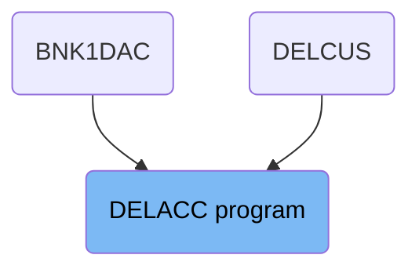
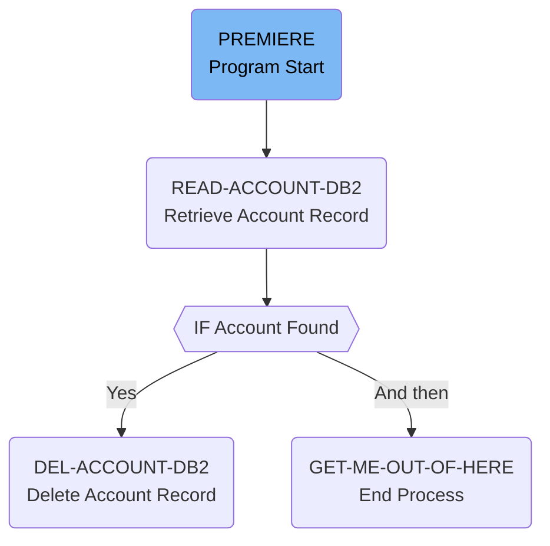

The DELACC program is responsible for deleting an account from the database. It achieves this by first retrieving the account record using the account number and sort code, and then deleting the account if it exists. The program also logs the transaction if the deletion is successful.

The flow starts with the PREMIERE section, which initiates the account deletion process by moving the sort code to the required sort code of the account key. It then retrieves the account record from the database in the <SwmToken path="src/base/cobol_src/DELACC.cbl" pos="212:3:7" line-data="           PERFORM READ-ACCOUNT-DB2.">`READ-ACCOUNT-DB2`</SwmToken> section. If the account is found, the <SwmToken path="src/base/cobol_src/DELACC.cbl" pos="220:3:7" line-data="             PERFORM DEL-ACCOUNT-DB2">`DEL-ACCOUNT-DB2`</SwmToken> section deletes the account record. Finally, the <SwmToken path="src/base/cobol_src/DELACC.cbl" pos="625:1:9" line-data="       GET-ME-OUT-OF-HERE SECTION.">`GET-ME-OUT-OF-HERE`</SwmToken> section ends the process by returning control to the calling program.

# Where is this program used?

This program is used multiple times in the codebase as represented in the following diagram:



Lets' zoom into the flow:



<SwmSnippet path="/src/base/cobol_src/DELACC.cbl" line="204">

---

## PREMIERE Section

The <SwmToken path="src/base/cobol_src/DELACC.cbl" pos="204:1:1" line-data="       PREMIERE SECTION.">`PREMIERE`</SwmToken> section initiates the account deletion process. It starts by moving the <SwmToken path="src/base/cobol_src/DELACC.cbl" pos="207:3:3" line-data="           MOVE SORTCODE TO REQUIRED-SORT-CODE OF ACCOUNT-KEY-RID.">`SORTCODE`</SwmToken> to <SwmToken path="src/base/cobol_src/DELACC.cbl" pos="207:7:11" line-data="           MOVE SORTCODE TO REQUIRED-SORT-CODE OF ACCOUNT-KEY-RID.">`REQUIRED-SORT-CODE`</SwmToken> of <SwmToken path="src/base/cobol_src/DELACC.cbl" pos="207:15:19" line-data="           MOVE SORTCODE TO REQUIRED-SORT-CODE OF ACCOUNT-KEY-RID.">`ACCOUNT-KEY-RID`</SwmToken>, which is necessary for identifying the account to be deleted. Then, it performs the <SwmToken path="src/base/cobol_src/DELACC.cbl" pos="212:3:7" line-data="           PERFORM READ-ACCOUNT-DB2.">`READ-ACCOUNT-DB2`</SwmToken> paragraph to retrieve the account record from the database.

```cobol
       PREMIERE SECTION.
       A010.

           MOVE SORTCODE TO REQUIRED-SORT-CODE OF ACCOUNT-KEY-RID.

      *
      *          Get the account record
      *
           PERFORM READ-ACCOUNT-DB2.

      *
      *          If a matching account record was successfully
      *          retrieved then delete it
      *
           IF DELACC-DEL-SUCCESS = 'Y'

             PERFORM DEL-ACCOUNT-DB2
             IF DELACC-DEL-SUCCESS = 'Y'
               PERFORM WRITE-PROCTRAN
             END-IF
           END-IF
```

---

</SwmSnippet>

<SwmSnippet path="/src/base/cobol_src/DELACC.cbl" line="236">

---

## <SwmToken path="src/base/cobol_src/DELACC.cbl" pos="236:1:5" line-data="       READ-ACCOUNT-DB2 SECTION.">`READ-ACCOUNT-DB2`</SwmToken> Section

The <SwmToken path="src/base/cobol_src/DELACC.cbl" pos="236:1:5" line-data="       READ-ACCOUNT-DB2 SECTION.">`READ-ACCOUNT-DB2`</SwmToken> section retrieves the account record from the database using the account number and sort code. If the account is found, it sets the <SwmToken path="src/base/cobol_src/DELACC.cbl" pos="218:3:7" line-data="           IF DELACC-DEL-SUCCESS = &#39;Y&#39;">`DELACC-DEL-SUCCESS`</SwmToken> flag to 'Y'. If the account is not found, it sets the <SwmToken path="src/base/cobol_src/DELACC.cbl" pos="218:3:7" line-data="           IF DELACC-DEL-SUCCESS = &#39;Y&#39;">`DELACC-DEL-SUCCESS`</SwmToken> flag to 'N' and returns an error code.

```cobol
       READ-ACCOUNT-DB2 SECTION.
       RAD010.

      *
      *    Take the Account number from the comm area and retrieve
      *    the account record from the datastore.
      *
           MOVE DELACC-ACCNO
              TO HV-ACCOUNT-ACC-NO.

           MOVE SORTCODE TO HV-ACCOUNT-SORTCODE.

           EXEC SQL
              SELECT ACCOUNT_EYECATCHER,
                     ACCOUNT_CUSTOMER_NUMBER,
                     ACCOUNT_SORTCODE,
                     ACCOUNT_NUMBER,
                     ACCOUNT_TYPE,
                     ACCOUNT_INTEREST_RATE,
                     ACCOUNT_OPENED,
                     ACCOUNT_OVERDRAFT_LIMIT,
```

---

</SwmSnippet>

<SwmSnippet path="/src/base/cobol_src/DELACC.cbl" line="431">

---

## <SwmToken path="src/base/cobol_src/DELACC.cbl" pos="431:1:5" line-data="       DEL-ACCOUNT-DB2 SECTION.">`DEL-ACCOUNT-DB2`</SwmToken> Section

The <SwmToken path="src/base/cobol_src/DELACC.cbl" pos="431:1:5" line-data="       DEL-ACCOUNT-DB2 SECTION.">`DEL-ACCOUNT-DB2`</SwmToken> section deletes the account record from the database if the <SwmToken path="src/base/cobol_src/DELACC.cbl" pos="446:9:13" line-data="              MOVE &#39;N&#39; TO DELACC-DEL-SUCCESS">`DELACC-DEL-SUCCESS`</SwmToken> flag is 'Y'. If the deletion is successful, it performs the <SwmToken path="src/base/cobol_src/DELACC.cbl" pos="222:3:5" line-data="               PERFORM WRITE-PROCTRAN">`WRITE-PROCTRAN`</SwmToken> paragraph to log the transaction.

```cobol
       DEL-ACCOUNT-DB2 SECTION.
       DADB010.

      *
      *    Delete the ACCOUNT row where the SORTCODE and ACCOUNT
      *    NUMBER match.
      *
           EXEC SQL
              DELETE FROM ACCOUNT
              WHERE ACCOUNT_SORTCODE = :HV-ACCOUNT-SORTCODE AND
                    ACCOUNT_NUMBER = :HV-ACCOUNT-ACC-NO
           END-EXEC.

           IF SQLCODE NOT = 0
              MOVE ' ' TO DELACC-SUCCESS
              MOVE 'N' TO DELACC-DEL-SUCCESS
              MOVE '3' TO DELACC-DEL-FAIL-CD
           END-IF.

       DADB999.
           EXIT.
```

---

</SwmSnippet>

<SwmSnippet path="/src/base/cobol_src/DELACC.cbl" line="625">

---

## <SwmToken path="src/base/cobol_src/DELACC.cbl" pos="625:1:9" line-data="       GET-ME-OUT-OF-HERE SECTION.">`GET-ME-OUT-OF-HERE`</SwmToken> Section

The <SwmToken path="src/base/cobol_src/DELACC.cbl" pos="625:1:9" line-data="       GET-ME-OUT-OF-HERE SECTION.">`GET-ME-OUT-OF-HERE`</SwmToken> section ends the process by executing the <SwmToken path="src/base/cobol_src/DELACC.cbl" pos="628:1:1" line-data="           GOBACK.">`GOBACK`</SwmToken> statement, which returns control to the calling program.

```cobol
       GET-ME-OUT-OF-HERE SECTION.
       GMOFH010.

           GOBACK.

       GMOFH999.
           EXIT.
```

---

</SwmSnippet>

&nbsp;

*This is an auto-generated document by Swimm 🌊 and has not yet been verified by a human*

<SwmMeta version="3.0.0" repo-id="Z2l0aHViJTNBJTNBY2ljcy1iYW5raW5nLXNhbXBsZS1hcHBsaWNhdGlvbi1jYnNhLUlCTS1EZW1vJTNBJTNBU3dpbW0tRGVtbw==" repo-name="cics-banking-sample-application-cbsa-IBM-Demo"><sup>Powered by [Swimm](/)</sup></SwmMeta>
