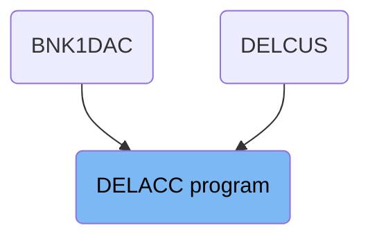
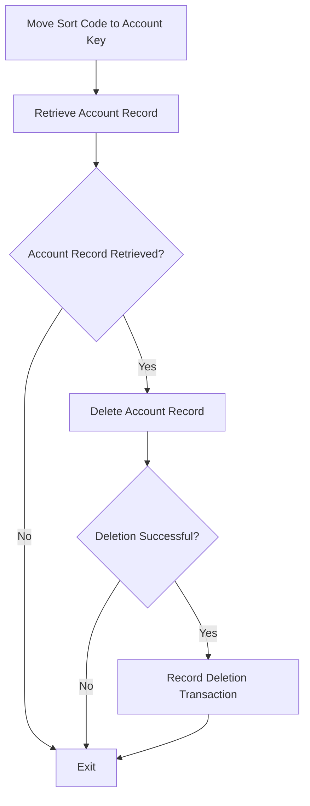
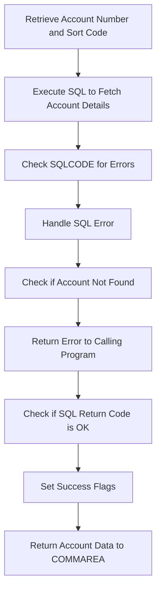
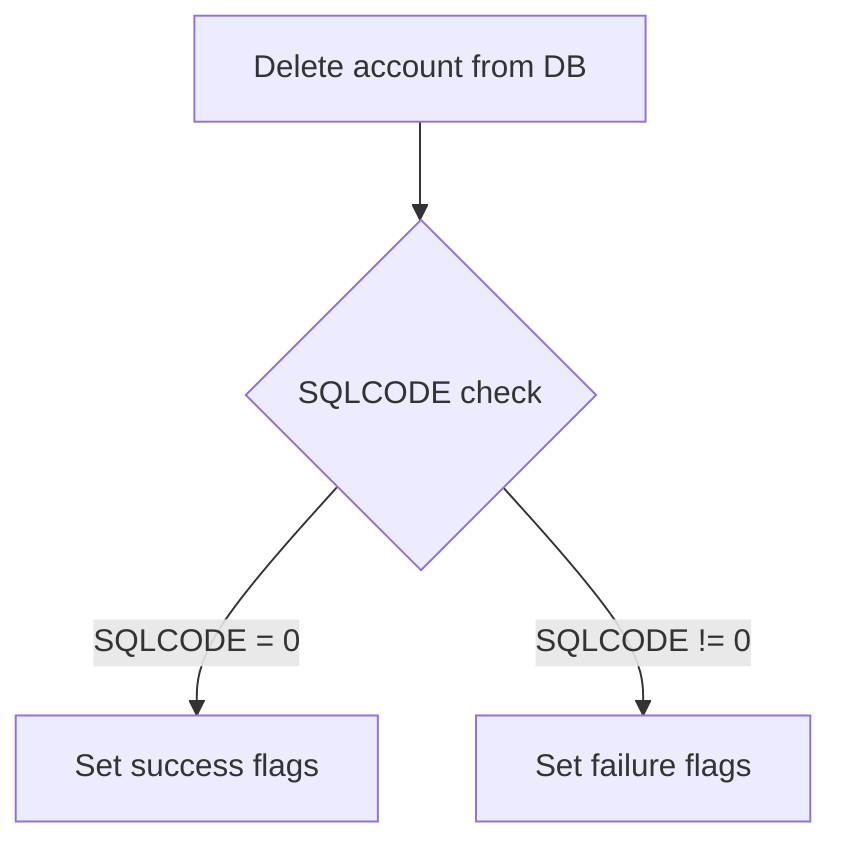
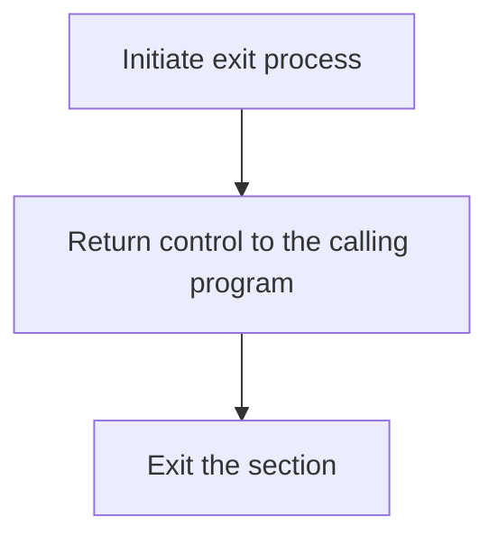

The DELACC program is responsible for deleting account records from the database. This process involves several steps, including moving the sort code to the required format, retrieving the account record, checking if the account record was successfully retrieved, deleting the account record, and recording the deletion transaction. The program ensures that the account key is correctly formatted for subsequent database operations and handles any errors that may occur during the process.

The flow starts by formatting the sort code for the account key, then retrieves the account record from the database. If the account record is found, it proceeds to delete the record and logs the deletion transaction. If any errors occur, they are handled appropriately to ensure the process completes correctly.

# Where is this program used?

This program is used multiple times in the codebase as represented in the following diagram:



## PREMIERE

Lets' zoom into this section of the flow:



<SwmSnippet path="/src/base/cobol_src/DELACC.cbl" line="207">

---

First, the sort code is moved to the required format for the account key. This step ensures that the account key is correctly formatted for the subsequent database operations.

```cobol
           MOVE SORTCODE TO REQUIRED-SORT-CODE OF ACCOUNT-KEY-RID.
```

---

</SwmSnippet>

<SwmSnippet path="/src/base/cobol_src/DELACC.cbl" line="212">

---

Next, the account record is retrieved from the database using the formatted account key. This step is crucial as it fetches the account details that are needed for the deletion process.

```cobol
           PERFORM READ-ACCOUNT-DB2.
```

---

</SwmSnippet>

<SwmSnippet path="/src/base/cobol_src/DELACC.cbl" line="218">

---

We then check if the account record was successfully retrieved. If the retrieval is successful, the process proceeds to delete the account record.

```cobol
           IF DELACC-DEL-SUCCESS = 'Y'
```

---

</SwmSnippet>

<SwmSnippet path="/src/base/cobol_src/DELACC.cbl" line="222">

---

If the account record was successfully deleted, the deletion transaction is recorded in the PROCTRAN datastore. This step ensures that there is a record of the deletion for auditing and tracking purposes.

```cobol
               PERFORM WRITE-PROCTRAN
```

---

</SwmSnippet>

<SwmSnippet path="/src/base/cobol_src/DELACC.cbl" line="227">

---

Finally, the process exits, completing the account deletion flow. This step ensures that the program terminates correctly after performing the necessary operations.

```cobol
           PERFORM GET-ME-OUT-OF-HERE.
```

---

</SwmSnippet>

## <SwmToken path="src/base/cobol_src/DELACC.cbl" pos="212:3:7" line-data="           PERFORM READ-ACCOUNT-DB2.">`READ-ACCOUNT-DB2`</SwmToken>

Lets' zoom into this section of the flow:



<SwmSnippet path="/src/base/cobol_src/DELACC.cbl" line="243">

---

### Retrieving Account Number and Sort Code

First, the account number and sort code are retrieved from the communication area and moved to the host variables <SwmToken path="src/base/cobol_src/DELACC.cbl" pos="244:3:9" line-data="              TO HV-ACCOUNT-ACC-NO.">`HV-ACCOUNT-ACC-NO`</SwmToken> and <SwmToken path="src/base/cobol_src/DELACC.cbl" pos="246:7:11" line-data="           MOVE SORTCODE TO HV-ACCOUNT-SORTCODE.">`HV-ACCOUNT-SORTCODE`</SwmToken> respectively.

```cobol
           MOVE DELACC-ACCNO
              TO HV-ACCOUNT-ACC-NO.

           MOVE SORTCODE TO HV-ACCOUNT-SORTCODE.
```

---

</SwmSnippet>

<SwmSnippet path="/src/base/cobol_src/DELACC.cbl" line="248">

---

### Executing SQL to Fetch Account Details

Next, an SQL query is executed to fetch the account details from the database using the account number and sort code. The retrieved details are stored in the corresponding host variables.

```cobol
           EXEC SQL
              SELECT ACCOUNT_EYECATCHER,
                     ACCOUNT_CUSTOMER_NUMBER,
                     ACCOUNT_SORTCODE,
                     ACCOUNT_NUMBER,
                     ACCOUNT_TYPE,
                     ACCOUNT_INTEREST_RATE,
                     ACCOUNT_OPENED,
                     ACCOUNT_OVERDRAFT_LIMIT,
                     ACCOUNT_LAST_STATEMENT,
                     ACCOUNT_NEXT_STATEMENT,
                     ACCOUNT_AVAILABLE_BALANCE,
                     ACCOUNT_ACTUAL_BALANCE
              INTO  :HV-ACCOUNT-EYECATCHER,
                    :HV-ACCOUNT-CUST-NO,
                    :HV-ACCOUNT-SORTCODE,
                    :HV-ACCOUNT-ACC-NO,
                    :HV-ACCOUNT-ACC-TYPE,
                    :HV-ACCOUNT-INT-RATE,
                    :HV-ACCOUNT-OPENED,
                    :HV-ACCOUNT-OVERDRAFT-LIM,
```

---

</SwmSnippet>

<SwmSnippet path="/src/base/cobol_src/DELACC.cbl" line="278">

---

### Checking SQLCODE for Errors

Then, the SQL return code (<SwmToken path="src/base/cobol_src/DELACC.cbl" pos="279:7:7" line-data="      *    If the SQLCODE returned anything other than OK or row not">`SQLCODE`</SwmToken>) is checked to determine if the query was successful or if an error occurred. If an error other than 'row not found' is encountered, the process moves to handle the error.

```cobol
      *
      *    If the SQLCODE returned anything other than OK or row not
      *    found then we have a problem (so abend it)
      *
           IF SQLCODE NOT = 0 AND SQLCODE NOT = +100
```

---

</SwmSnippet>

<SwmSnippet path="/src/base/cobol_src/DELACC.cbl" line="283">

---

### Handling SQL Error

If an SQL error is detected, the error details are preserved, and supplemental information is gathered. The program then links to the Abend Handler program to handle the abnormal termination.

More about ABNDPROC: <SwmLink doc-title="Handling Abnormal Terminations (ABNDPROC)">[Handling Abnormal Terminations (ABNDPROC)](/.swm/handling-abnormal-terminations-abndproc.q6kxvboz.sw.md)</SwmLink>

```cobol
              MOVE SQLCODE TO SQLCODE-DISPLAY
      *
      *       Preserve the RESP and RESP2, then set up the
      *       standard ABEND info before getting the applid,
      *       date/time etc. and linking to the Abend Handler
      *       program.
      *
              INITIALIZE ABNDINFO-REC
              MOVE ZERO       TO ABND-RESPCODE
              MOVE ZERO       TO ABND-RESP2CODE
      *
      *       Get supplemental information
      *
              EXEC CICS ASSIGN APPLID(ABND-APPLID)
              END-EXEC

              MOVE EIBTASKN   TO ABND-TASKNO-KEY
              MOVE EIBTRNID   TO ABND-TRANID

              PERFORM POPULATE-TIME-DATE

```

---

</SwmSnippet>

<SwmSnippet path="/src/base/cobol_src/DELACC.cbl" line="350">

---

### Checking if Account Not Found

If the account is not found (<SwmToken path="src/base/cobol_src/DELACC.cbl" pos="350:3:8" line-data="           IF SQLCODE = +100">`SQLCODE = +100`</SwmToken>), the output data is initialized, and an error message is returned to the calling program indicating that the account deletion was not successful.

```cobol
           IF SQLCODE = +100
              INITIALIZE OUTPUT-DATA
              MOVE SORTCODE TO ACCOUNT-SORT-CODE OF OUTPUT-DATA
              MOVE DELACC-ACCNO TO ACCOUNT-NUMBER OF OUTPUT-DATA
              MOVE 'N' TO DELACC-DEL-SUCCESS
              MOVE '1' TO DELACC-DEL-FAIL-CD
              GO TO RAD999
           END-IF.
```

---

</SwmSnippet>

<SwmSnippet path="/src/base/cobol_src/DELACC.cbl" line="363">

---

### Checking if SQL Return Code is OK

If the SQL return code is OK (<SwmToken path="src/base/cobol_src/DELACC.cbl" pos="363:3:7" line-data="           IF SQLCODE = 0">`SQLCODE = 0`</SwmToken>), the success flags are set accordingly to indicate that the account deletion was successful.

```cobol
           IF SQLCODE = 0
              MOVE ' ' TO DELACC-SUCCESS
              MOVE 'Y' TO DELACC-DEL-SUCCESS
              MOVE ' ' TO DELACC-DEL-FAIL-CD
           END-IF.
```

---

</SwmSnippet>

<SwmSnippet path="/src/base/cobol_src/DELACC.cbl" line="372">

---

### Returning Account Data to COMMAREA

Finally, the retrieved account data is moved to the communication area (<SwmToken path="src/base/cobol_src/DELACC.cbl" pos="86:11:11" line-data="      * Pull in the SQL COMMAREA">`COMMAREA`</SwmToken>) to be returned to the calling program. This includes details such as the account number, sort code, customer number, account type, interest rate, and balances.

```cobol
           MOVE HV-ACCOUNT-EYECATCHER TO
              ACCOUNT-EYE-CATCHER OF OUTPUT-DATA.
           MOVE HV-ACCOUNT-CUST-NO TO
              ACCOUNT-CUST-NO OF OUTPUT-DATA.
           MOVE HV-ACCOUNT-SORTCODE TO
              ACCOUNT-SORT-CODE OF OUTPUT-DATA.
           MOVE HV-ACCOUNT-ACC-NO TO
              ACCOUNT-NUMBER OF OUTPUT-DATA.
           MOVE HV-ACCOUNT-ACC-TYPE TO
              ACCOUNT-TYPE OF OUTPUT-DATA.
           MOVE HV-ACCOUNT-INT-RATE TO
              ACCOUNT-INTEREST-RATE OF OUTPUT-DATA.
           MOVE HV-ACCOUNT-OPENED TO DB2-DATE-REFORMAT.
           MOVE DB2-DATE-REF-DAY TO
              ACCOUNT-OPENED-DAY OF OUTPUT-DATA.
           MOVE DB2-DATE-REF-MNTH TO
              ACCOUNT-OPENED-MONTH OF OUTPUT-DATA.
           MOVE DB2-DATE-REF-YR TO
              ACCOUNT-OPENED-YEAR OF OUTPUT-DATA.
           MOVE HV-ACCOUNT-OVERDRAFT-LIM TO
              ACCOUNT-OVERDRAFT-LIMIT OF OUTPUT-DATA.
```

---

</SwmSnippet>

## Interim Summary

So far, we saw the detailed steps involved in retrieving and processing account data, including handling SQL errors and returning the account data to the communication area. This ensures that the account details are accurately fetched and any issues are properly managed. Now, we will focus on the process of deleting the account from the database, including the SQL deletion statement and the subsequent checks for successful deletion.

## <SwmToken path="src/base/cobol_src/DELACC.cbl" pos="220:3:7" line-data="             PERFORM DEL-ACCOUNT-DB2">`DEL-ACCOUNT-DB2`</SwmToken>

Lets' zoom into this section of the flow:



<SwmSnippet path="/src/base/cobol_src/DELACC.cbl" line="438">

---

### Deleting account from DB

First, the section executes an SQL <SwmToken path="src/base/cobol_src/DELACC.cbl" pos="439:1:1" line-data="              DELETE FROM ACCOUNT">`DELETE`</SwmToken> statement to remove the account row where the <SwmToken path="src/base/cobol_src/DELACC.cbl" pos="440:12:12" line-data="              WHERE ACCOUNT_SORTCODE = :HV-ACCOUNT-SORTCODE AND">`SORTCODE`</SwmToken> and <SwmToken path="src/base/cobol_src/DELACC.cbl" pos="439:5:5" line-data="              DELETE FROM ACCOUNT">`ACCOUNT`</SwmToken>` `<SwmToken path="src/base/cobol_src/DELACC.cbl" pos="353:11:11" line-data="              MOVE DELACC-ACCNO TO ACCOUNT-NUMBER OF OUTPUT-DATA">`NUMBER`</SwmToken> match the provided values.

```cobol
           EXEC SQL
              DELETE FROM ACCOUNT
              WHERE ACCOUNT_SORTCODE = :HV-ACCOUNT-SORTCODE AND
                    ACCOUNT_NUMBER = :HV-ACCOUNT-ACC-NO
           END-EXEC.
```

---

</SwmSnippet>

<SwmSnippet path="/src/base/cobol_src/DELACC.cbl" line="444">

---

### SQLCODE check

Next, the program checks the <SwmToken path="src/base/cobol_src/DELACC.cbl" pos="444:3:3" line-data="           IF SQLCODE NOT = 0">`SQLCODE`</SwmToken> to determine if the deletion was successful. If <SwmToken path="src/base/cobol_src/DELACC.cbl" pos="444:3:3" line-data="           IF SQLCODE NOT = 0">`SQLCODE`</SwmToken> is not equal to 0, it indicates a failure in the deletion process.

```cobol
           IF SQLCODE NOT = 0
```

---

</SwmSnippet>

<SwmSnippet path="/src/base/cobol_src/DELACC.cbl" line="445">

---

### Setting failure flags

If the deletion fails, the program sets the <SwmToken path="src/base/cobol_src/DELACC.cbl" pos="445:9:11" line-data="              MOVE &#39; &#39; TO DELACC-SUCCESS">`DELACC-SUCCESS`</SwmToken> flag to a blank space, <SwmToken path="src/base/cobol_src/DELACC.cbl" pos="446:9:13" line-data="              MOVE &#39;N&#39; TO DELACC-DEL-SUCCESS">`DELACC-DEL-SUCCESS`</SwmToken> to 'N', and <SwmToken path="src/base/cobol_src/DELACC.cbl" pos="447:9:15" line-data="              MOVE &#39;3&#39; TO DELACC-DEL-FAIL-CD">`DELACC-DEL-FAIL-CD`</SwmToken> to '3' to indicate the failure.

```cobol
              MOVE ' ' TO DELACC-SUCCESS
              MOVE 'N' TO DELACC-DEL-SUCCESS
              MOVE '3' TO DELACC-DEL-FAIL-CD
           END-IF.
```

---

</SwmSnippet>

## <SwmToken path="src/base/cobol_src/DELACC.cbl" pos="227:3:11" line-data="           PERFORM GET-ME-OUT-OF-HERE.">`GET-ME-OUT-OF-HERE`</SwmToken>

Lets' zoom into this section of the flow:



<SwmSnippet path="/src/base/cobol_src/DELACC.cbl" line="625">

---

First, the <SwmToken path="src/base/cobol_src/DELACC.cbl" pos="625:1:9" line-data="       GET-ME-OUT-OF-HERE SECTION.">`GET-ME-OUT-OF-HERE`</SwmToken> section is initiated to handle the exit process.

```cobol
       GET-ME-OUT-OF-HERE SECTION.
       GMOFH010.
```

---

</SwmSnippet>

<SwmSnippet path="/src/base/cobol_src/DELACC.cbl" line="628">

---

Next, the <SwmToken path="src/base/cobol_src/DELACC.cbl" pos="628:1:1" line-data="           GOBACK.">`GOBACK`</SwmToken> statement is executed to return control to the calling program, ensuring that the current process is exited properly.

```cobol
           GOBACK.
```

---

</SwmSnippet>

&nbsp;

*This is an auto-generated document by Swimm 🌊 and has not yet been verified by a human*

<SwmMeta version="3.0.0" repo-id="Z2l0aHViJTNBJTNBY2ljcy1iYW5raW5nLXNhbXBsZS1hcHBsaWNhdGlvbi1jYnNhLUlCTS1EZW1vJTNBJTNBU3dpbW0tRGVtbw==" repo-name="cics-banking-sample-application-cbsa-IBM-Demo"><sup>Powered by [Swimm](/)</sup></SwmMeta>
