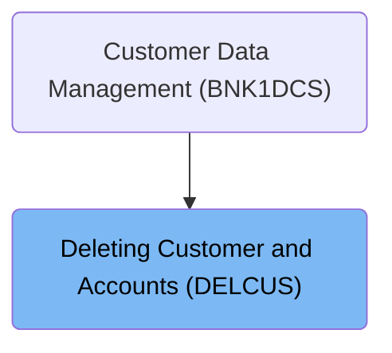
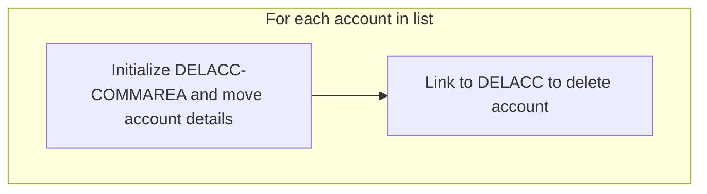
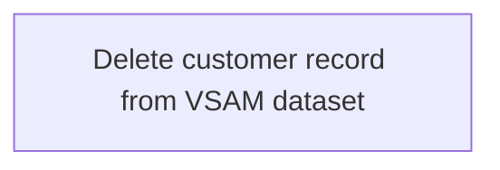
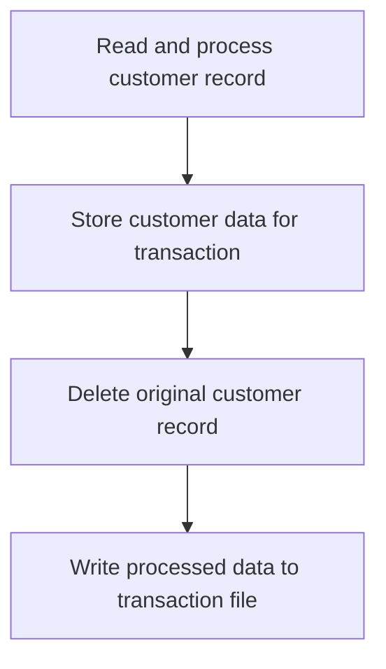
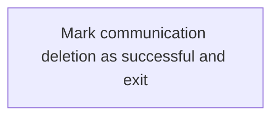

The document describes the process of deleting a customer and their associated accounts using the DELCUS program. This program is part of the customer data management system and ensures that all related accounts are deleted before the customer record itself is removed. The process begins by retrieving the customer's accounts, deleting each account, and finally deleting the customer record. If any failure occurs during the deletion process, the program will abend to prevent data inconsistency, except when an account has already been deleted. The main steps are:

- Initialize the deletion process by setting up necessary fields and communication areas.
- Retrieve all accounts associated with the customer.
- Delete each account one by one, writing a delete record for each.
- Delete the customer record and write a delete record for the customer.
- Handle any failures by abending, except for already deleted accounts.

For instance, if a customer has multiple accounts, the program will iterate through each account, delete it, and then proceed to delete the customer record once all accounts are removed.

# Where is this program used?

This program is used once, as represented in the following diagram:



# Initiating Customer Inquiry

```mermaid
flowchart TD
    node1[Initialize deletion process] --> node2{Check accounts}
    node2 -->|Accounts exist| loop1[Delete accounts]
    loop1 --> node3[Delete customer record]
    node3 --> node4[Processing Customer Record]

    subgraph loop1[For each account]
        node2 --> node5[Perform account deletion]
        node5 --> node2
    end
    
    node2 -->|No accounts| node3

subgraph node2 [DA010]
  subgraph loop1[For each account in list]
  sgmain_1_node1[Initialize DELACC-COMMAREA and move account details] --> sgmain_1_node2[Iterating Account Deletion]
  end
end

subgraph node4 [DCV010]
  sgmain_2_node1[Read and process customer record] --> sgmain_2_node2[Iterating Account Deletion]
  sgmain_2_node2 --> sgmain_2_node3[Delete original customer record]
  sgmain_2_node3 --> sgmain_2_node4[Processing Customer Record]
end

%% Swimm:
%% flowchart TD
%%     node1[Initialize deletion process] --> node2{Check accounts}
%%     node2 -->|Accounts exist| loop1[Delete accounts]
%%     loop1 --> node3[Delete customer record]
%%     node3 --> node4[Processing Customer Record]
%% 
%%     subgraph loop1[For each account]
%%         node2 --> node5[Perform account deletion]
%%         node5 --> node2
%%     end
%%     
%%     node2 -->|No accounts| node3
%% 
%% subgraph node2 [<SwmToken path="src/base/cobol_src/DELCUS.cbl" pos="299:1:1" line-data="       DA010.">`DA010`</SwmToken>]
%%   subgraph loop1[For each account in list]
%%   sgmain_1_node1[Initialize <SwmToken path="src/base/cobol_src/DELCUS.cbl" pos="308:3:5" line-data="              INITIALIZE DELACC-COMMAREA">`DELACC-COMMAREA`</SwmToken> and move account details] --> sgmain_1_node2[Iterating Account Deletion]
%%   end
%% end
%% 
%% subgraph node4 [<SwmToken path="src/base/cobol_src/DELCUS.cbl" pos="344:1:1" line-data="       DCV010.">`DCV010`</SwmToken>]
%%   sgmain_2_node1[Read and process customer record] --> sgmain_2_node2[Iterating Account Deletion]
%%   sgmain_2_node2 --> sgmain_2_node3[Delete original customer record]
%%   sgmain_2_node3 --> sgmain_2_node4[Processing Customer Record]
%% end
```

<SwmSnippet path="/src/base/cobol_src/DELCUS.cbl" line="247">

---

Here, we prepare for customer inquiry by setting up key fields with sort codes and customer numbers, and initializing communication areas.

```cobol
       A010.

           MOVE SORTCODE TO REQUIRED-SORT-CODE
                            REQUIRED-SORT-CODE OF CUSTOMER-KY
                            DESIRED-KEY-SORTCODE.

           MOVE COMM-CUSTNO OF DFHCOMMAREA
             TO DESIRED-KEY-CUSTOMER.

           INITIALIZE INQCUST-COMMAREA.
           MOVE COMM-CUSTNO OF DFHCOMMAREA TO
              INQCUST-CUSTNO.
```

---

</SwmSnippet>

<SwmSnippet path="/src/base/cobol_src/DELCUS.cbl" line="260">

---

Next, we call another program using the initialized communication area to continue the customer inquiry process, ensuring necessary data is passed.

```cobol
           EXEC CICS LINK PROGRAM(INQCUST-PROGRAM)
                     COMMAREA(INQCUST-COMMAREA)
           END-EXEC.
```

---

</SwmSnippet>

<SwmSnippet path="/src/base/cobol_src/DELCUS.cbl" line="271">

---

Next, we retrieve all accounts associated with the customer to ensure any existing accounts are handled before deletion.

```cobol
           PERFORM GET-ACCOUNTS
```

---

</SwmSnippet>

<SwmSnippet path="/src/base/cobol_src/DELCUS.cbl" line="276">

---

Next, we ensure complete customer removal by deleting any associated accounts to maintain data integrity.

```cobol
           IF NUMBER-OF-ACCOUNTS > 0
             PERFORM DELETE-ACCOUNTS
           END-IF
```

---

</SwmSnippet>

## Iterating Account Deletion



<SwmSnippet path="/src/base/cobol_src/DELCUS.cbl" line="299">

---

Here, we iterate over each account and link to DELACC for deletion to ensure all accounts are processed.

```cobol
       DA010.

      *
      *    Go through the entries (accounts) in the array,
      *    and for each one link to DELACC to delete that
      *    account.
      *
           PERFORM VARYING WS-INDEX FROM 1 BY 1
           UNTIL WS-INDEX > NUMBER-OF-ACCOUNTS
              INITIALIZE DELACC-COMMAREA
              MOVE WS-APPLID TO DELACC-COMM-APPLID
              MOVE COMM-ACCNO(WS-INDEX) TO DELACC-COMM-ACCNO
```

---

</SwmSnippet>

<SwmSnippet path="/src/base/cobol_src/DELCUS.cbl" line="312">

---

Finally, we return control after all accounts are deleted, ensuring all are processed before proceeding.

```cobol
              EXEC CICS LINK PROGRAM('DELACC  ')
                       COMMAREA(DELACC-COMMAREA)
              END-EXEC

           END-PERFORM.
```

---

</SwmSnippet>

## Executing Customer Deletion



<SwmSnippet path="/src/base/cobol_src/DELCUS.cbl" line="286">

---

Next, we delete the customer record after returning from <SwmToken path="src/base/cobol_src/DELCUS.cbl" pos="277:3:5" line-data="             PERFORM DELETE-ACCOUNTS">`DELETE-ACCOUNTS`</SwmToken> to ensure complete removal from the system.

```cobol
           PERFORM DEL-CUST-VSAM
```

---

</SwmSnippet>

## Processing Customer Record



<SwmSnippet path="/src/base/cobol_src/DELCUS.cbl" line="344">

---

Here, we read the customer record and store details for processing to prepare for transaction update and deletion.

```cobol
       DCV010.

      *
      *    Read the CUSTOMER record and store the details
      *    for inclusion on PROCTRAN later, then delete the CUSTOMER
      *    record and write to PROCTRAN.
      *
           INITIALIZE OUTPUT-CUST-DATA.

           EXEC CICS READ FILE('CUSTOMER')
                RIDFLD(DESIRED-KEY)
                INTO(OUTPUT-CUST-DATA)
                UPDATE
                TOKEN(WS-TOKEN)
                RESP(WS-CICS-RESP)
                RESP2(WS-CICS-RESP2)
           END-EXEC.
```

---

</SwmSnippet>

<SwmSnippet path="/src/base/cobol_src/DELCUS.cbl" line="454">

---

Next, we prepare customer details for transaction inclusion to capture information before deletion.

```cobol
           MOVE CUSTOMER-EYECATCHER TO WS-STOREDC-EYECATCHER
                                        COMM-EYE IN DFHCOMMAREA.
           MOVE CUSTOMER-SORTCODE   TO WS-STOREDC-SORTCODE
                                       COMM-SCODE IN DFHCOMMAREA.
           MOVE CUSTOMER-NUMBER OF CUSTOMER-RECORD
              TO WS-STOREDC-NUMBER COMM-CUSTNO IN DFHCOMMAREA.
           MOVE CUSTOMER-NAME       TO WS-STOREDC-NAME
                                       COMM-NAME IN DFHCOMMAREA.
           MOVE CUSTOMER-ADDRESS    TO WS-STOREDC-ADDRESS
                                       COMM-ADDR IN DFHCOMMAREA.
           MOVE CUSTOMER-DATE-OF-BIRTH(1:2)
              TO WS-STOREDC-DATE-OF-BIRTH(1:2)
                 COMM-BIRTH-DAY IN DFHCOMMAREA.
           MOVE '/'                 TO WS-STOREDC-DATE-OF-BIRTH(3:1).
           MOVE CUSTOMER-DATE-OF-BIRTH(3:2)
              TO WS-STOREDC-DATE-OF-BIRTH(4:2)
                 COMM-BIRTH-MONTH IN DFHCOMMAREA.
           MOVE '/'                 TO WS-STOREDC-DATE-OF-BIRTH(6:1).

           MOVE CUSTOMER-DATE-OF-BIRTH(5:4)
              TO WS-STOREDC-DATE-OF-BIRTH(7:4)
                 COMM-BIRTH-YEAR IN DFHCOMMAREA.

           MOVE CUSTOMER-CREDIT-SCORE TO WS-STOREDC-CREDIT-SCORE
                                         COMM-CREDIT-SCORE.
           MOVE CUSTOMER-CS-REVIEW-DATE(1:2)
             TO WS-STOREDC-CS-REVIEW-DATE(1:2)
                COMM-CS-REVIEW-DD IN DFHCOMMAREA.
           MOVE '/'                 TO WS-STOREDC-CS-REVIEW-DATE(3:1).
           MOVE CUSTOMER-CS-REVIEW-DATE(3:2)
             TO WS-STOREDC-CS-REVIEW-DATE(4:2)
                COMM-CS-REVIEW-MM IN DFHCOMMAREA.
           MOVE '/'                 TO WS-STOREDC-CS-REVIEW-DATE(6:1).
           MOVE CUSTOMER-CS-REVIEW-DATE(5:4)
             TO WS-STOREDC-CS-REVIEW-DATE(7:4)
                COMM-CS-REVIEW-YYYY IN DFHCOMMAREA.
```

---

</SwmSnippet>

<SwmSnippet path="/src/base/cobol_src/DELCUS.cbl" line="491">

---

Next, we remove the customer record from the database to ensure complete removal before final processing.

```cobol
           EXEC CICS
              DELETE FILE ('CUSTOMER')
              TOKEN(WS-TOKEN)
              RESP(WS-CICS-RESP)
              RESP2(WS-CICS-RESP2)
           END-EXEC.
```

---

</SwmSnippet>

<SwmSnippet path="/src/base/cobol_src/DELCUS.cbl" line="579">

---

Finally, we update transaction records after returning from <SwmToken path="src/base/cobol_src/DELCUS.cbl" pos="410:3:7" line-data="              PERFORM POPULATE-TIME-DATE">`POPULATE-TIME-DATE`</SwmToken> to complete the customer deletion process.

```cobol

           PERFORM WRITE-PROCTRAN-CUST.
```

---

</SwmSnippet>

## Finalizing Customer Deletion



<SwmSnippet path="/src/base/cobol_src/DELCUS.cbl" line="289">

---

Finally, we mark the deletion as successful after returning from <SwmToken path="src/base/cobol_src/DELCUS.cbl" pos="286:3:7" line-data="           PERFORM DEL-CUST-VSAM">`DEL-CUST-VSAM`</SwmToken> to conclude the operation.

```cobol
           MOVE 'Y' TO COMM-DEL-SUCCESS.
           MOVE ' ' TO COMM-DEL-FAIL-CD.

           PERFORM GET-ME-OUT-OF-HERE.
```

---

</SwmSnippet>

&nbsp;

*This is an auto-generated document by Swimm 🌊 and has not yet been verified by a human*

<SwmMeta version="3.0.0" repo-id="Z2l0aHViJTNBJTNBY2ljcy1iYW5raW5nLXNhbXBsZS1hcHBsaWNhdGlvbi1jYnNhLUlCTS1EZW1vJTNBJTNBU3dpbW0tRGVtbw==" repo-name="cics-banking-sample-application-cbsa-IBM-Demo"><sup>Powered by [Swimm](/)</sup></SwmMeta>
