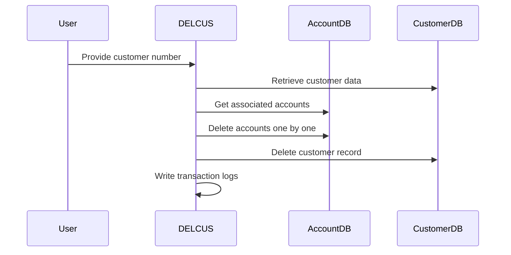
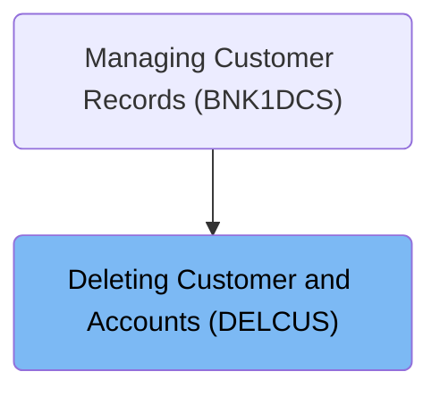
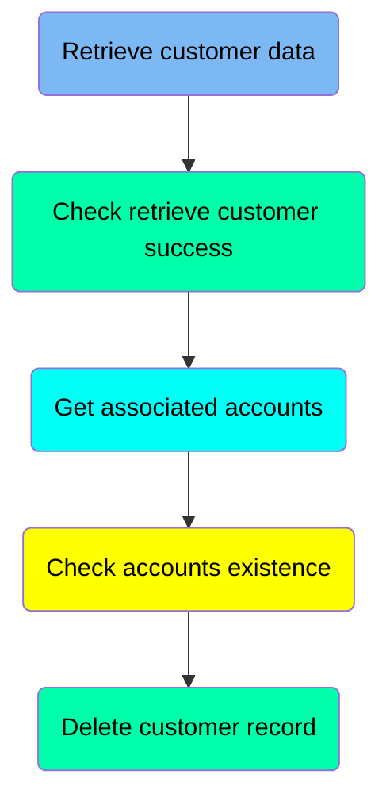
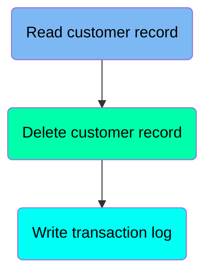

The DELCUS program is responsible for deleting customer records and their associated accounts (DELCUS). Within our customer management system, this program ensures that when a customer is removed, all related accounts are also deleted to maintain data integrity. It retrieves the customer data and associated accounts, deletes each account individually, and then removes the customer record, logging each deletion.

For example, if a customer with number 12345 has three associated accounts, the program will delete each account and then remove the customer record, logging each deletion.

The main steps are:

- Retrieve customer data
- Get associated accounts
- Delete accounts one by one
- Delete customer record
- Write transaction logs



# Where is this program used?

This program is used once, as represented in the following diagram:



# Delete customer records (<SwmToken path="src/base/cobol_src/DELCUS.cbl" pos="247:1:1" line-data="       A010.">`A010`</SwmToken>)

Let's split this section into smaller parts:



## Retrieve customer data

<SwmSnippet path="/src/base/cobol_src/DELCUS.cbl" line="260">

---

### Calling INQCUST to retrieve accounts

The function calls the INQCUST program, which retrieves the associated accounts for a given customer number and stores them in an array for subsequent deletion.

```cobol
           EXEC CICS LINK PROGRAM(INQCUST-PROGRAM)
                     COMMAREA(INQCUST-COMMAREA)
           END-EXEC.
```

---

</SwmSnippet>

## Check retrieve customer success

<SwmSnippet path="/src/base/cobol_src/DELCUS.cbl" line="264">

---

### Handling Inquiry Failure

If the customer inquiry was unsuccessful, the function returns control to the calling program, effectively terminating the deletion process.

```cobol
           IF INQCUST-INQ-SUCCESS = 'N'
             MOVE 'N' TO COMM-DEL-SUCCESS
             MOVE INQCUST-INQ-FAIL-CD TO COMM-DEL-FAIL-CD
             EXEC CICS RETURN
             END-EXEC
           END-IF.
```

---

</SwmSnippet>

## Get associated accounts

<SwmSnippet path="/src/base/cobol_src/DELCUS.cbl" line="271">

---

Going into the <SwmToken path="src/base/cobol_src/DELCUS.cbl" pos="247:1:1" line-data="       A010.">`A010`</SwmToken> function, it performs the <SwmToken path="src/base/cobol_src/DELCUS.cbl" pos="271:3:5" line-data="           PERFORM GET-ACCOUNTS">`GET-ACCOUNTS`</SwmToken> operation to retrieve all accounts associated with a customer. This step is crucial for preparing the necessary data for subsequent account deletion processes.

```cobol
           PERFORM GET-ACCOUNTS
```

---

</SwmSnippet>

## Delete customer record

<SwmSnippet path="/src/base/cobol_src/DELCUS.cbl" line="286">

---

The snippet deletes the customer record after all associated accounts have been removed, ensuring data consistency.

```cobol
           PERFORM DEL-CUST-VSAM
```

---

</SwmSnippet>

# Retrieve customer accounts (<SwmToken path="src/base/cobol_src/DELCUS.cbl" pos="323:1:1" line-data="       GAC010.">`GAC010`</SwmToken>)

<SwmSnippet path="/src/base/cobol_src/DELCUS.cbl" line="323">

---

### Preparing to Retrieve Customer Accounts

Going into the first snippet, the code prepares to retrieve all accounts associated with a given customer number. It sets up the necessary information to ensure that the correct customer accounts are retrieved for further processing.

```cobol
       GAC010.
      *
      *    Link to INQACCCU to get all of the accounts for a
      *    given customer number.
      *
           MOVE COMM-CUSTNO OF DFHCOMMAREA
              TO CUSTOMER-NUMBER OF INQACCCU-COMMAREA.
           MOVE 20 TO NUMBER-OF-ACCOUNTS IN INQACCCU-COMMAREA.
           SET COMM-PCB-POINTER OF INQACCCU-COMMAREA
              TO DELACC-COMM-PCB1
```

---

</SwmSnippet>

<SwmSnippet path="/src/base/cobol_src/DELCUS.cbl" line="334">

---

### Linking to INQACCCU Program

Now, the code snippet shows the execution of a command to call the <SwmToken path="src/base/cobol_src/DELCUS.cbl" pos="334:10:10" line-data="           EXEC CICS LINK PROGRAM(&#39;INQACCCU&#39;)">`INQACCCU`</SwmToken> program. This program retrieves the account information associated with the customer number provided.

```cobol
           EXEC CICS LINK PROGRAM('INQACCCU')
                     COMMAREA(INQACCCU-COMMAREA)
                     SYNCONRETURN
           END-EXEC.
```

---

</SwmSnippet>

# Delete Accounts (<SwmToken path="src/base/cobol_src/DELCUS.cbl" pos="299:1:1" line-data="       DA010.">`DA010`</SwmToken>)

<SwmSnippet path="/src/base/cobol_src/DELCUS.cbl" line="299">

---

Going into the <SwmToken path="src/base/cobol_src/DELCUS.cbl" pos="299:1:1" line-data="       DA010.">`DA010`</SwmToken> function, it iterates over the customer accounts stored in an array. For each account, it prepares the necessary information for the DELACC program to delete the account.

```cobol
       DA010.

      *
      *    Go through the entries (accounts) in the array,
      *    and for each one link to DELACC to delete that
      *    account.
      *
           PERFORM VARYING WS-INDEX FROM 1 BY 1
           UNTIL WS-INDEX > NUMBER-OF-ACCOUNTS
              INITIALIZE DELACC-COMMAREA
              MOVE WS-APPLID TO DELACC-COMM-APPLID
              MOVE COMM-ACCNO(WS-INDEX) TO DELACC-COMM-ACCNO
```

---

</SwmSnippet>

<SwmSnippet path="/src/base/cobol_src/DELCUS.cbl" line="312">

---

Next, the <SwmToken path="src/base/cobol_src/DELCUS.cbl" pos="299:1:1" line-data="       DA010.">`DA010`</SwmToken> function calls the DELACC program for each account. This program is responsible for deleting the account from the datastore, ensuring all accounts associated with the customer are removed.

```cobol
              EXEC CICS LINK PROGRAM('DELACC  ')
                       COMMAREA(DELACC-COMMAREA)
              END-EXEC

           END-PERFORM.
```

---

</SwmSnippet>

# Process and delete customer (<SwmToken path="src/base/cobol_src/DELCUS.cbl" pos="344:1:1" line-data="       DCV010.">`DCV010`</SwmToken>)

Let's split this section into smaller parts:



## Read customer record

<SwmSnippet path="/src/base/cobol_src/DELCUS.cbl" line="353">

---

Going into the snippet, it retrieves the customer record from the 'CUSTOMER' file using the desired key. This data is stored for later use in the transaction logging system. The operation is prepared to update the record if needed, ensuring that any changes can be made before deletion. Response codes are captured to manage any issues that might arise during the read operation.

```cobol
           EXEC CICS READ FILE('CUSTOMER')
                RIDFLD(DESIRED-KEY)
                INTO(OUTPUT-CUST-DATA)
                UPDATE
                TOKEN(WS-TOKEN)
                RESP(WS-CICS-RESP)
                RESP2(WS-CICS-RESP2)
           END-EXEC.
```

---

</SwmSnippet>

## Delete customer record

<SwmSnippet path="/src/base/cobol_src/DELCUS.cbl" line="491">

---

Diving into the snippet, it deletes the customer record from the 'CUSTOMER' file. This step is essential to ensure that once all associated accounts are removed, the customer record is also deleted, maintaining data consistency.

```cobol
           EXEC CICS
              DELETE FILE ('CUSTOMER')
              TOKEN(WS-TOKEN)
              RESP(WS-CICS-RESP)
              RESP2(WS-CICS-RESP2)
           END-EXEC.
```

---

</SwmSnippet>

## Write transaction log

<SwmSnippet path="/src/base/cobol_src/DELCUS.cbl" line="580">

---

### Recording Customer Deletion

The snippet performs the action of writing a PROCTRAN customer record. This is crucial for maintaining a log of customer deletions within the transaction system. By executing this step, the system ensures that every customer deletion is properly recorded, which is essential for auditing and tracking purposes.

```cobol
           PERFORM WRITE-PROCTRAN-CUST.
```

---

</SwmSnippet>

&nbsp;

*This is an auto-generated document by Swimm 🌊 and has not yet been verified by a human*

<SwmMeta version="3.0.0" repo-id="Z2l0aHViJTNBJTNBY2ljcy1iYW5raW5nLXNhbXBsZS1hcHBsaWNhdGlvbi1jYnNhLUlCTS1EZW1vJTNBJTNBU3dpbW0tRGVtbw==" repo-name="cics-banking-sample-application-cbsa-IBM-Demo"><sup>Powered by [Swimm](/)</sup></SwmMeta>
