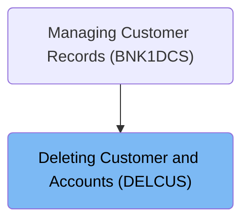
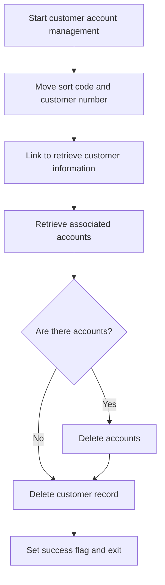
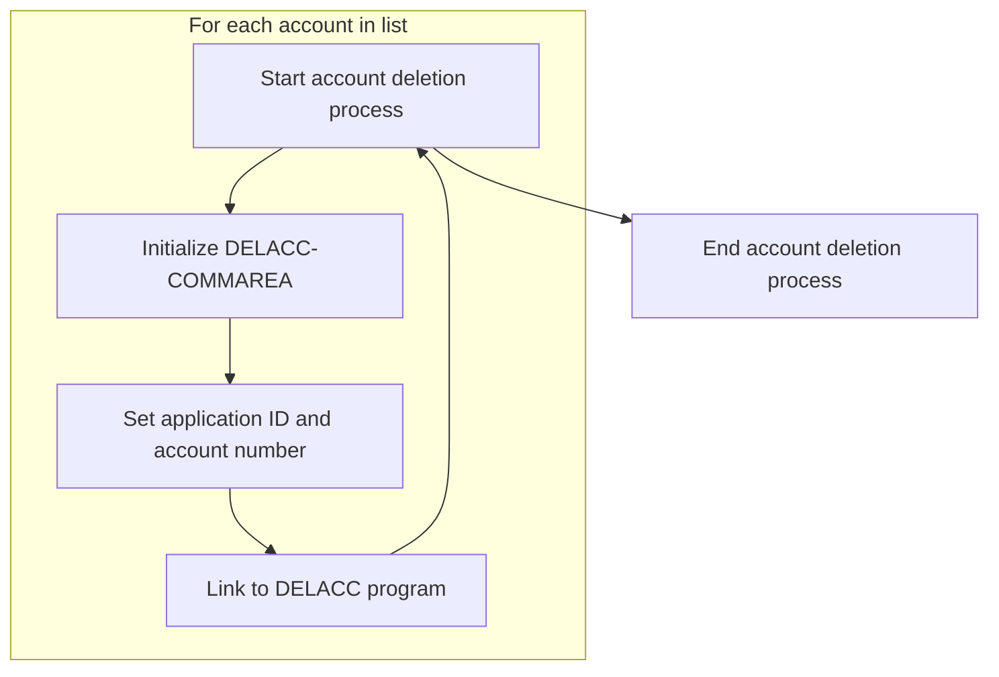
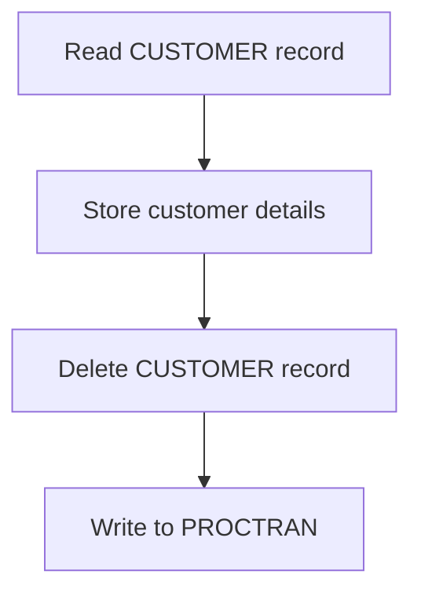

The document describes the process of deleting a customer and their associated accounts using the DELCUS program. This flow is part of managing customer records, where it ensures that all related accounts are deleted before removing the customer record itself. The program starts by retrieving the customer number and associated accounts, then proceeds to delete each account individually, logging each deletion. Once all accounts are deleted, the customer record is removed, and a log entry is created to maintain data integrity and auditability. The main steps are:

- Retrieve customer information and associated accounts.
- Delete each account and log the deletion.
- Delete the customer record and log the transaction.

For instance, if a customer with multiple accounts needs to be removed from the system, the DELCUS program will first gather all account details, delete each account while logging the action, and finally remove the customer record, ensuring no orphaned data remains.

# Where is this program used?

This program is used once, in a flow starting from `BNK1DCS` as represented in the following diagram:



# Initiating Customer Deletion



<SwmSnippet path="/src/base/cobol_src/DELCUS.cbl" line="247">

---

Here, we set up the required keys for processing the customer and prepare to retrieve associated accounts by calling <SwmToken path="src/base/cobol_src/DELCUS.cbl" pos="271:3:5" line-data="           PERFORM GET-ACCOUNTS">`GET-ACCOUNTS`</SwmToken> next, which is necessary to ensure all related accounts are handled before deleting the customer record.

```cobol
       A010.

           MOVE SORTCODE TO REQUIRED-SORT-CODE
                            REQUIRED-SORT-CODE OF CUSTOMER-KY
                            DESIRED-KEY-SORTCODE.

           MOVE COMM-CUSTNO OF DFHCOMMAREA
             TO DESIRED-KEY-CUSTOMER.

           INITIALIZE INQCUST-COMMAREA.
           MOVE COMM-CUSTNO OF DFHCOMMAREA TO
              INQCUST-CUSTNO.
```

---

</SwmSnippet>

<SwmSnippet path="/src/base/cobol_src/DELCUS.cbl" line="260">

---

Next, we link to INQCUST to retrieve detailed customer information, which is essential for the subsequent account retrieval and deletion processes.

```cobol
           EXEC CICS LINK PROGRAM(INQCUST-PROGRAM)
                     COMMAREA(INQCUST-COMMAREA)
           END-EXEC.
```

---

</SwmSnippet>

<SwmSnippet path="/src/base/cobol_src/DELCUS.cbl" line="271">

---

Next, we perform <SwmToken path="src/base/cobol_src/DELCUS.cbl" pos="271:3:5" line-data="           PERFORM GET-ACCOUNTS">`GET-ACCOUNTS`</SwmToken> to identify all accounts associated with the customer, which is necessary to determine whether there are accounts to delete, influencing the next steps in the flow.

```cobol
           PERFORM GET-ACCOUNTS
```

---

</SwmSnippet>

<SwmSnippet path="/src/base/cobol_src/DELCUS.cbl" line="276">

---

Next, we check for associated accounts and perform <SwmToken path="src/base/cobol_src/DELCUS.cbl" pos="277:3:5" line-data="             PERFORM DELETE-ACCOUNTS">`DELETE-ACCOUNTS`</SwmToken> if any exist, ensuring that all accounts are deleted before proceeding to delete the customer record itself, maintaining data integrity.

```cobol
           IF NUMBER-OF-ACCOUNTS > 0
             PERFORM DELETE-ACCOUNTS
           END-IF
```

---

</SwmSnippet>

<SwmSnippet path="/src/base/cobol_src/DELCUS.cbl" line="286">

---

Next, we perform <SwmToken path="src/base/cobol_src/DELCUS.cbl" pos="286:3:7" line-data="           PERFORM DEL-CUST-VSAM">`DEL-CUST-VSAM`</SwmToken> to delete the customer record from the VSAM file, ensuring that the customer record is removed from the database, completing the deletion process before signaling success.

```cobol
           PERFORM DEL-CUST-VSAM
```

---

</SwmSnippet>

<SwmSnippet path="/src/base/cobol_src/DELCUS.cbl" line="289">

---

Finally, we set a success flag and clear any failure code to signal successful completion, which is important for communicating the outcome of the operation to any calling functions or processes.

```cobol
           MOVE 'Y' TO COMM-DEL-SUCCESS.
           MOVE ' ' TO COMM-DEL-FAIL-CD.

           PERFORM GET-ME-OUT-OF-HERE.
```

---

</SwmSnippet>

# Processing Account Deletions



<SwmSnippet path="/src/base/cobol_src/DELCUS.cbl" line="299">

---

Here, we iterate over each customer account and prepare for deletion, ensuring that each account is individually processed and deleted, maintaining data consistency.

```cobol
       DA010.

      *
      *    Go through the entries (accounts) in the array,
      *    and for each one link to DELACC to delete that
      *    account.
      *
           PERFORM VARYING WS-INDEX FROM 1 BY 1
           UNTIL WS-INDEX > NUMBER-OF-ACCOUNTS
              INITIALIZE DELACC-COMMAREA
              MOVE WS-APPLID TO DELACC-COMM-APPLID
              MOVE COMM-ACCNO(WS-INDEX) TO DELACC-COMM-ACCNO
```

---

</SwmSnippet>

<SwmSnippet path="/src/base/cobol_src/DELCUS.cbl" line="312">

---

Finally, we link to DELACC for each account to complete the deletion process, ensuring that no accounts remain after the customer deletion.

```cobol
              EXEC CICS LINK PROGRAM('DELACC  ')
                       COMMAREA(DELACC-COMMAREA)
              END-EXEC

           END-PERFORM.
```

---

</SwmSnippet>

# Finalizing Customer Record Deletion



<SwmSnippet path="/src/base/cobol_src/DELCUS.cbl" line="344">

---

Here, we read the customer record and prepare it for deletion, with a timestamp added next to maintain an accurate log of when the deletion occurred.

```cobol
       DCV010.

      *
      *    Read the CUSTOMER record and store the details
      *    for inclusion on PROCTRAN later, then delete the CUSTOMER
      *    record and write to PROCTRAN.
      *
           INITIALIZE OUTPUT-CUST-DATA.

           EXEC CICS READ FILE('CUSTOMER')
                RIDFLD(DESIRED-KEY)
                INTO(OUTPUT-CUST-DATA)
                UPDATE
                TOKEN(WS-TOKEN)
                RESP(WS-CICS-RESP)
                RESP2(WS-CICS-RESP2)
           END-EXEC.
```

---

</SwmSnippet>

<SwmSnippet path="/src/base/cobol_src/DELCUS.cbl" line="454">

---

Next, we move customer details for logging before deleting the record, ensuring that all relevant customer information is captured for accurate logging and auditing.

```cobol
           MOVE CUSTOMER-EYECATCHER TO WS-STOREDC-EYECATCHER
                                        COMM-EYE IN DFHCOMMAREA.
           MOVE CUSTOMER-SORTCODE   TO WS-STOREDC-SORTCODE
                                       COMM-SCODE IN DFHCOMMAREA.
           MOVE CUSTOMER-NUMBER OF CUSTOMER-RECORD
              TO WS-STOREDC-NUMBER COMM-CUSTNO IN DFHCOMMAREA.
           MOVE CUSTOMER-NAME       TO WS-STOREDC-NAME
                                       COMM-NAME IN DFHCOMMAREA.
           MOVE CUSTOMER-ADDRESS    TO WS-STOREDC-ADDRESS
                                       COMM-ADDR IN DFHCOMMAREA.
           MOVE CUSTOMER-DATE-OF-BIRTH(1:2)
              TO WS-STOREDC-DATE-OF-BIRTH(1:2)
                 COMM-BIRTH-DAY IN DFHCOMMAREA.
           MOVE '/'                 TO WS-STOREDC-DATE-OF-BIRTH(3:1).
           MOVE CUSTOMER-DATE-OF-BIRTH(3:2)
              TO WS-STOREDC-DATE-OF-BIRTH(4:2)
                 COMM-BIRTH-MONTH IN DFHCOMMAREA.
           MOVE '/'                 TO WS-STOREDC-DATE-OF-BIRTH(6:1).

           MOVE CUSTOMER-DATE-OF-BIRTH(5:4)
              TO WS-STOREDC-DATE-OF-BIRTH(7:4)
                 COMM-BIRTH-YEAR IN DFHCOMMAREA.

           MOVE CUSTOMER-CREDIT-SCORE TO WS-STOREDC-CREDIT-SCORE
                                         COMM-CREDIT-SCORE.
           MOVE CUSTOMER-CS-REVIEW-DATE(1:2)
             TO WS-STOREDC-CS-REVIEW-DATE(1:2)
                COMM-CS-REVIEW-DD IN DFHCOMMAREA.
           MOVE '/'                 TO WS-STOREDC-CS-REVIEW-DATE(3:1).
           MOVE CUSTOMER-CS-REVIEW-DATE(3:2)
             TO WS-STOREDC-CS-REVIEW-DATE(4:2)
                COMM-CS-REVIEW-MM IN DFHCOMMAREA.
           MOVE '/'                 TO WS-STOREDC-CS-REVIEW-DATE(6:1).
           MOVE CUSTOMER-CS-REVIEW-DATE(5:4)
             TO WS-STOREDC-CS-REVIEW-DATE(7:4)
                COMM-CS-REVIEW-YYYY IN DFHCOMMAREA.
```

---

</SwmSnippet>

<SwmSnippet path="/src/base/cobol_src/DELCUS.cbl" line="491">

---

Next, we delete the customer record from the database, ensuring that the customer record is removed and allowing the flow to proceed to logging the transaction.

```cobol
           EXEC CICS
              DELETE FILE ('CUSTOMER')
              TOKEN(WS-TOKEN)
              RESP(WS-CICS-RESP)
              RESP2(WS-CICS-RESP2)
           END-EXEC.
```

---

</SwmSnippet>

<SwmSnippet path="/src/base/cobol_src/DELCUS.cbl" line="579">

---

Finally, we write to the transaction log to record the deletion, which is crucial for maintaining an accurate record for auditing and tracking purposes.

```cobol

           PERFORM WRITE-PROCTRAN-CUST.
```

---

</SwmSnippet>

&nbsp;

*This is an auto-generated document by Swimm 🌊 and has not yet been verified by a human*

<SwmMeta version="3.0.0" repo-id="Z2l0aHViJTNBJTNBY2ljcy1iYW5raW5nLXNhbXBsZS1hcHBsaWNhdGlvbi1jYnNhLUlCTS1EZW1vJTNBJTNBU3dpbW0tRGVtbw==" repo-name="cics-banking-sample-application-cbsa-IBM-Demo"><sup>Powered by [Swimm](/)</sup></SwmMeta>
