The DELCUS program is responsible for deleting a customer from the system. This process involves several steps, including preparing the sort code and customer data, checking if the customer exists, retrieving and deleting related accounts, and finally deleting the customer record. The program ensures that all related data is handled appropriately to maintain data integrity.

The flow starts by preparing the sort code and customer data. It then calls the INQCUST program to check if the customer exists. If the customer exists, the program retrieves and deletes any related accounts before deleting the customer record. If the customer does not exist, it sets a failure code and exits. Throughout the process, the program handles errors and ensures that all operations are completed successfully.

# Where is this program used?

This program is used once, in a flow starting from `BNK1DCS` as represented in the following diagram:

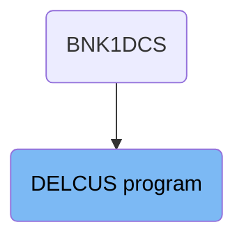

## PREMIERE

Lets' zoom into this section of the flow:

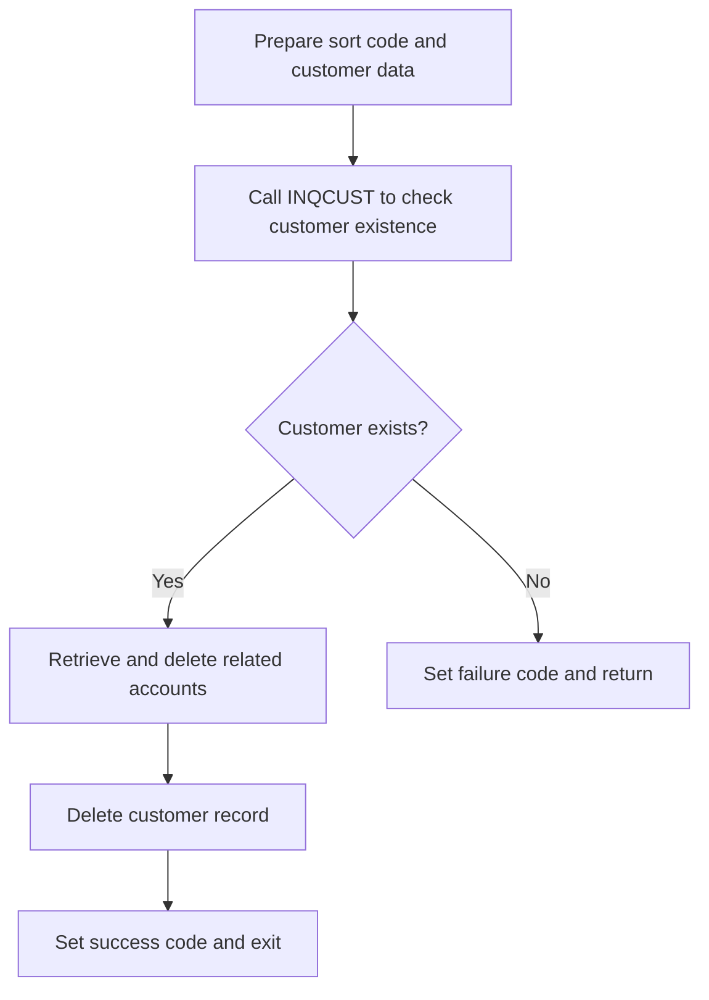

<SwmSnippet path="/src/base/cobol_src/DELCUS.cbl" line="249">

---

First, the sort code and customer data are prepared by moving the <SwmToken path="src/base/cobol_src/DELCUS.cbl" pos="249:3:3" line-data="           MOVE SORTCODE TO REQUIRED-SORT-CODE">`SORTCODE`</SwmToken> to <SwmToken path="src/base/cobol_src/DELCUS.cbl" pos="249:7:11" line-data="           MOVE SORTCODE TO REQUIRED-SORT-CODE">`REQUIRED-SORT-CODE`</SwmToken> and setting the <SwmToken path="src/base/cobol_src/DELCUS.cbl" pos="254:3:7" line-data="             TO DESIRED-KEY-CUSTOMER.">`DESIRED-KEY-CUSTOMER`</SwmToken> with the customer number from <SwmToken path="src/base/cobol_src/DELCUS.cbl" pos="253:9:9" line-data="           MOVE COMM-CUSTNO OF DFHCOMMAREA">`DFHCOMMAREA`</SwmToken>.

```cobol
           MOVE SORTCODE TO REQUIRED-SORT-CODE
                            REQUIRED-SORT-CODE OF CUSTOMER-KY
                            DESIRED-KEY-SORTCODE.

           MOVE COMM-CUSTNO OF DFHCOMMAREA
             TO DESIRED-KEY-CUSTOMER.
```

---

</SwmSnippet>

<SwmSnippet path="/src/base/cobol_src/DELCUS.cbl" line="256">

---

Next, the <SwmToken path="src/base/cobol_src/DELCUS.cbl" pos="256:3:5" line-data="           INITIALIZE INQCUST-COMMAREA.">`INQCUST-COMMAREA`</SwmToken> is initialized and the customer number is moved to <SwmToken path="src/base/cobol_src/DELCUS.cbl" pos="258:1:3" line-data="              INQCUST-CUSTNO.">`INQCUST-CUSTNO`</SwmToken>.

```cobol
           INITIALIZE INQCUST-COMMAREA.
           MOVE COMM-CUSTNO OF DFHCOMMAREA TO
              INQCUST-CUSTNO.
```

---

</SwmSnippet>

<SwmSnippet path="/src/base/cobol_src/DELCUS.cbl" line="260">

---

Then, the <SwmToken path="src/base/cobol_src/DELCUS.cbl" pos="260:9:9" line-data="           EXEC CICS LINK PROGRAM(INQCUST-PROGRAM)">`INQCUST`</SwmToken> program is called to check if the customer exists. This program fetches related customer information and returns it in the communication area.

More about INQCUST: <SwmLink doc-title="Customer Inquiry (INQCUST)">[Customer Inquiry (INQCUST)](/.swm/customer-inquiry-inqcust.kzcrsldz.sw.md)</SwmLink>

```cobol
           EXEC CICS LINK PROGRAM(INQCUST-PROGRAM)
                     COMMAREA(INQCUST-COMMAREA)
           END-EXEC.
```

---

</SwmSnippet>

<SwmSnippet path="/src/base/cobol_src/DELCUS.cbl" line="264">

---

If the customer inquiry is not successful (<SwmToken path="src/base/cobol_src/DELCUS.cbl" pos="264:3:7" line-data="           IF INQCUST-INQ-SUCCESS = &#39;N&#39;">`INQCUST-INQ-SUCCESS`</SwmToken> is 'N'), the failure code is set and the program returns.

```cobol
           IF INQCUST-INQ-SUCCESS = 'N'
             MOVE 'N' TO COMM-DEL-SUCCESS
             MOVE INQCUST-INQ-FAIL-CD TO COMM-DEL-FAIL-CD
             EXEC CICS RETURN
             END-EXEC
           END-IF.
```

---

</SwmSnippet>

<SwmSnippet path="/src/base/cobol_src/DELCUS.cbl" line="271">

---

Moving to the next step, the <SwmToken path="src/base/cobol_src/DELCUS.cbl" pos="271:3:5" line-data="           PERFORM GET-ACCOUNTS">`GET-ACCOUNTS`</SwmToken> section is performed to retrieve all account details for the given customer number.

More about INQACCCU: <SwmLink doc-title="Account Inquiry (INQACCCU)">[Account Inquiry (INQACCCU)](/.swm/account-inquiry-inqacccu.wgrcjjcu.sw.md)</SwmLink>

```cobol
           PERFORM GET-ACCOUNTS
```

---

</SwmSnippet>

<SwmSnippet path="/src/base/cobol_src/DELCUS.cbl" line="276">

---

If there are related accounts found (<SwmToken path="src/base/cobol_src/DELCUS.cbl" pos="276:3:7" line-data="           IF NUMBER-OF-ACCOUNTS &gt; 0">`NUMBER-OF-ACCOUNTS`</SwmToken> > 0), the <SwmToken path="src/base/cobol_src/DELCUS.cbl" pos="277:3:5" line-data="             PERFORM DELETE-ACCOUNTS">`DELETE-ACCOUNTS`</SwmToken> section is performed to delete each account.

More about DELACC: <SwmLink doc-title="Account Deletion (DELACC)">[Account Deletion (DELACC)](/.swm/account-deletion-delacc.tbnnomf7.sw.md)</SwmLink>

```cobol
           IF NUMBER-OF-ACCOUNTS > 0
             PERFORM DELETE-ACCOUNTS
           END-IF
```

---

</SwmSnippet>

<SwmSnippet path="/src/base/cobol_src/DELCUS.cbl" line="286">

---

After deleting the accounts, the <SwmToken path="src/base/cobol_src/DELCUS.cbl" pos="286:3:7" line-data="           PERFORM DEL-CUST-VSAM">`DEL-CUST-VSAM`</SwmToken> section is performed to delete the customer record and record the deletion in the <SwmToken path="src/base/cobol_src/DELCUS.cbl" pos="348:9:9" line-data="      *    for inclusion on PROCTRAN later, then delete the CUSTOMER">`PROCTRAN`</SwmToken> datastore.

```cobol
           PERFORM DEL-CUST-VSAM
```

---

</SwmSnippet>

<SwmSnippet path="/src/base/cobol_src/DELCUS.cbl" line="289">

---

Finally, the success code is set to 'Y' and the failure code is cleared before exiting the section.

```cobol
           MOVE 'Y' TO COMM-DEL-SUCCESS.
           MOVE ' ' TO COMM-DEL-FAIL-CD.

           PERFORM GET-ME-OUT-OF-HERE.
```

---

</SwmSnippet>

## <SwmToken path="src/base/cobol_src/DELCUS.cbl" pos="271:3:5" line-data="           PERFORM GET-ACCOUNTS">`GET-ACCOUNTS`</SwmToken>

Lets' zoom into this section of the flow:

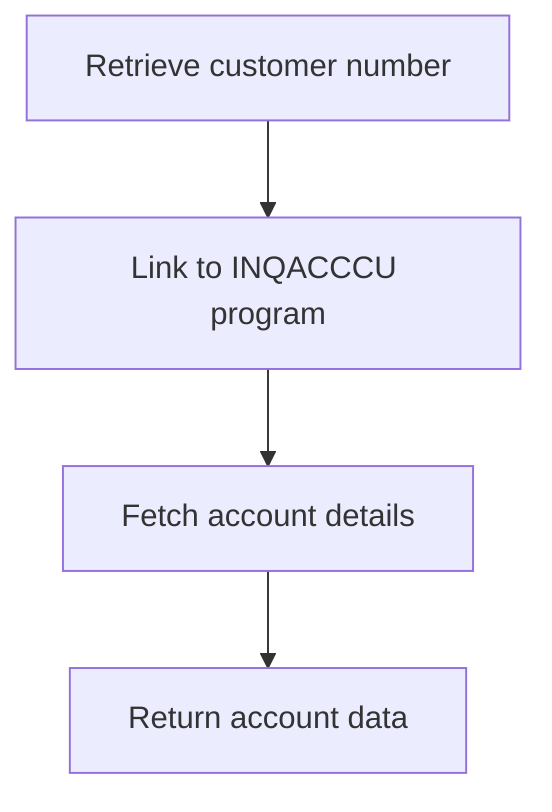

<SwmSnippet path="/src/base/cobol_src/DELCUS.cbl" line="609">

---

### Retrieving Customer Account Details

The <SwmToken path="src/base/cobol_src/DELCUS.cbl" pos="271:3:5" line-data="           PERFORM GET-ACCOUNTS">`GET-ACCOUNTS`</SwmToken> function is responsible for retrieving all account details associated with a given customer number. It begins by moving the customer number to the communication area of the <SwmToken path="src/base/cobol_src/DELCUS.cbl" pos="219:3:3" line-data="       01 INQACCCU-PROGRAM         PIC X(8) VALUE &#39;INQACCCU&#39;.">`INQACCCU`</SwmToken> program. This is followed by setting up the communication area pointer and executing the CICS LINK command to call the <SwmToken path="src/base/cobol_src/DELCUS.cbl" pos="219:3:3" line-data="       01 INQACCCU-PROGRAM         PIC X(8) VALUE &#39;INQACCCU&#39;.">`INQACCCU`</SwmToken> program. The <SwmToken path="src/base/cobol_src/DELCUS.cbl" pos="219:3:3" line-data="       01 INQACCCU-PROGRAM         PIC X(8) VALUE &#39;INQACCCU&#39;.">`INQACCCU`</SwmToken> program then fetches the account details from the <SwmToken path="src/base/cobol_src/DELCUS.cbl" pos="53:5:5" line-data="      * PROCTRAN DB2 copybook">`DB2`</SwmToken> database and returns this data to the communication area. This process ensures that all relevant account information for the customer is retrieved and made available for further processing.

```cobol

      *
      * Populate the time and date
      *
           EXEC CICS ASKTIME
              ABSTIME(WS-U-TIME)
           END-EXEC.

           EXEC CICS FORMATTIME
                     ABSTIME(WS-U-TIME)
                     DDMMYYYY(WS-ORIG-DATE)
                     TIME(HV-PROCTRAN-TIME)
                     DATESEP('.')
           END-EXEC.

           MOVE WS-ORIG-DATE TO WS-ORIG-DATE-GRP-X.
           MOVE WS-ORIG-DATE-GRP-X TO HV-PROCTRAN-DATE.

           MOVE WS-STOREDC-SORTCODE      TO HV-PROCTRAN-DESC(1:6).
```

---

</SwmSnippet>

## <SwmToken path="src/base/cobol_src/DELCUS.cbl" pos="277:3:5" line-data="             PERFORM DELETE-ACCOUNTS">`DELETE-ACCOUNTS`</SwmToken>

Lets' zoom into this section of the flow:

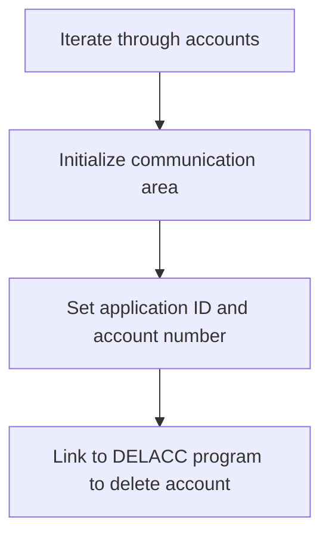

<SwmSnippet path="/src/base/cobol_src/DELCUS.cbl" line="306">

---

First, the <SwmToken path="src/base/cobol_src/DELCUS.cbl" pos="277:3:5" line-data="             PERFORM DELETE-ACCOUNTS">`DELETE-ACCOUNTS`</SwmToken> section begins by iterating through the list of accounts using a loop. This loop runs from 1 to the total number of accounts, ensuring that each account is processed individually.

```cobol
           PERFORM VARYING WS-INDEX FROM 1 BY 1
           UNTIL WS-INDEX > NUMBER-OF-ACCOUNTS
```

---

</SwmSnippet>

<SwmSnippet path="/src/base/cobol_src/DELCUS.cbl" line="308">

---

Moving to the next step, for each account, the communication area is initialized. This prepares the necessary data structures for the subsequent operations.

```cobol
              INITIALIZE DELACC-COMMAREA
```

---

</SwmSnippet>

<SwmSnippet path="/src/base/cobol_src/DELCUS.cbl" line="309">

---

Next, the application ID and the account number for the current account are set in the communication area. This ensures that the correct account information is passed to the deletion program.

```cobol
              MOVE WS-APPLID TO DELACC-COMM-APPLID
              MOVE COMM-ACCNO(WS-INDEX) TO DELACC-COMM-ACCNO
```

---

</SwmSnippet>

<SwmSnippet path="/src/base/cobol_src/DELCUS.cbl" line="312">

---

Then, the program links to the <SwmToken path="src/base/cobol_src/DELCUS.cbl" pos="312:10:10" line-data="              EXEC CICS LINK PROGRAM(&#39;DELACC  &#39;)">`DELACC`</SwmToken> program to delete the account. This call performs the actual deletion operation for the account specified in the communication area.

More about DELACC: <SwmLink doc-title="Account Deletion (DELACC)">[Account Deletion (DELACC)](/.swm/account-deletion-delacc.tbnnomf7.sw.md)</SwmLink>

```cobol
              EXEC CICS LINK PROGRAM('DELACC  ')
                       COMMAREA(DELACC-COMMAREA)
              END-EXEC
```

---

</SwmSnippet>

# Delete customer (<SwmToken path="src/base/cobol_src/DELCUS.cbl" pos="286:3:7" line-data="           PERFORM DEL-CUST-VSAM">`DEL-CUST-VSAM`</SwmToken>)

Let's split this section into smaller parts:

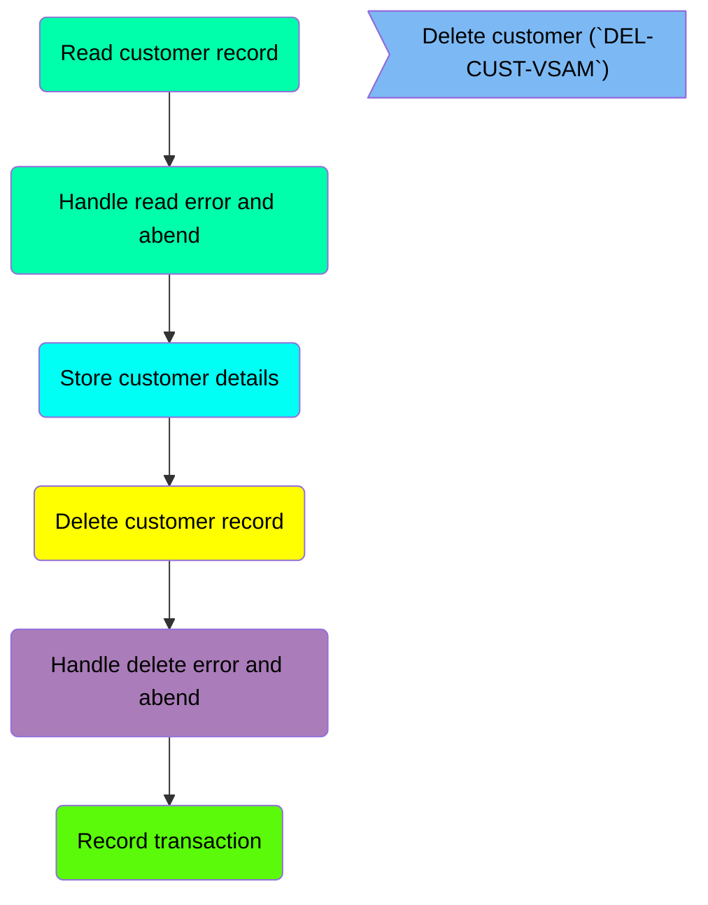

## Read customer record

First, we'll zoom into this section of the flow:

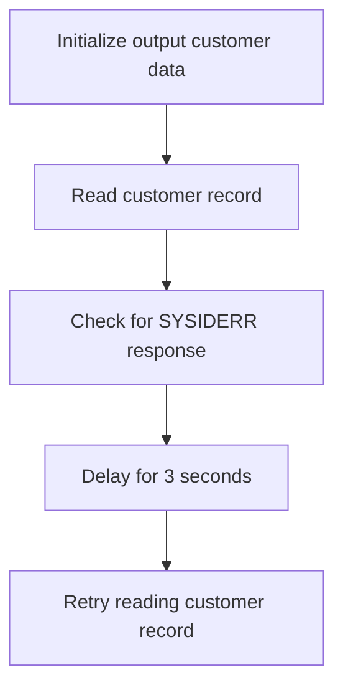

<SwmSnippet path="/src/base/cobol_src/DELCUS.cbl" line="343">

---

First, the <SwmToken path="src/base/cobol_src/DELCUS.cbl" pos="343:1:5" line-data="       DEL-CUST-VSAM SECTION.">`DEL-CUST-VSAM`</SwmToken> section initializes the <SwmToken path="src/base/cobol_src/DELCUS.cbl" pos="351:3:7" line-data="           INITIALIZE OUTPUT-CUST-DATA.">`OUTPUT-CUST-DATA`</SwmToken> to prepare for storing customer details.

```cobol
       DEL-CUST-VSAM SECTION.
       DCV010.

      *
      *    Read the CUSTOMER record and store the details
      *    for inclusion on PROCTRAN later, then delete the CUSTOMER
      *    record and write to PROCTRAN.
      *
           INITIALIZE OUTPUT-CUST-DATA.
```

---

</SwmSnippet>

<SwmSnippet path="/src/base/cobol_src/DELCUS.cbl" line="353">

---

Moving to the next step, the program reads the customer record from the <SwmToken path="src/base/cobol_src/DELCUS.cbl" pos="353:10:10" line-data="           EXEC CICS READ FILE(&#39;CUSTOMER&#39;)">`CUSTOMER`</SwmToken> file using the <SwmToken path="src/base/cobol_src/DELCUS.cbl" pos="354:3:5" line-data="                RIDFLD(DESIRED-KEY)">`DESIRED-KEY`</SwmToken> and stores the details in <SwmToken path="src/base/cobol_src/DELCUS.cbl" pos="355:3:7" line-data="                INTO(OUTPUT-CUST-DATA)">`OUTPUT-CUST-DATA`</SwmToken>.

```cobol
           EXEC CICS READ FILE('CUSTOMER')
                RIDFLD(DESIRED-KEY)
                INTO(OUTPUT-CUST-DATA)
                UPDATE
                TOKEN(WS-TOKEN)
                RESP(WS-CICS-RESP)
                RESP2(WS-CICS-RESP2)
           END-EXEC.
```

---

</SwmSnippet>

<SwmSnippet path="/src/base/cobol_src/DELCUS.cbl" line="362">

---

Next, the program checks if the response code <SwmToken path="src/base/cobol_src/DELCUS.cbl" pos="362:3:7" line-data="           IF WS-CICS-RESP = DFHRESP(SYSIDERR)">`WS-CICS-RESP`</SwmToken> is equal to <SwmToken path="src/base/cobol_src/DELCUS.cbl" pos="362:11:14" line-data="           IF WS-CICS-RESP = DFHRESP(SYSIDERR)">`DFHRESP(SYSIDERR)`</SwmToken>, indicating a system ID error.

```cobol
           IF WS-CICS-RESP = DFHRESP(SYSIDERR)
              PERFORM VARYING SYSIDERR-RETRY FROM 1 BY 1
              UNTIL SYSIDERR-RETRY > 100
              OR WS-CICS-RESP = DFHRESP(NORMAL)
              OR WS-CICS-RESP IS NOT EQUAL TO DFHRESP(SYSIDERR)

```

---

</SwmSnippet>

<SwmSnippet path="/src/base/cobol_src/DELCUS.cbl" line="368">

---

If a system ID error is detected, the program performs a delay of 3 seconds before retrying the read operation.

```cobol
                 EXEC CICS DELAY FOR SECONDS(3)
                 END-EXEC
```

---

</SwmSnippet>

<SwmSnippet path="/src/base/cobol_src/DELCUS.cbl" line="371">

---

Then, the program retries reading the customer record from the <SwmToken path="src/base/cobol_src/DELCUS.cbl" pos="371:10:10" line-data="                 EXEC CICS READ FILE(&#39;CUSTOMER&#39;)">`CUSTOMER`</SwmToken> file, again using the <SwmToken path="src/base/cobol_src/DELCUS.cbl" pos="372:3:5" line-data="                    RIDFLD(DESIRED-KEY)">`DESIRED-KEY`</SwmToken> and storing the details in <SwmToken path="src/base/cobol_src/DELCUS.cbl" pos="373:3:7" line-data="                    INTO(OUTPUT-CUST-DATA)">`OUTPUT-CUST-DATA`</SwmToken>.

```cobol
                 EXEC CICS READ FILE('CUSTOMER')
                    RIDFLD(DESIRED-KEY)
                    INTO(OUTPUT-CUST-DATA)
                    UPDATE
                    TOKEN(WS-TOKEN)
                    RESP(WS-CICS-RESP)
                    RESP2(WS-CICS-RESP2)
                 END-EXEC
```

---

</SwmSnippet>

<SwmSnippet path="/src/base/cobol_src/DELCUS.cbl" line="380">

---

Finally, the program exits the loop once the read operation is successful or the retry limit is reached.

```cobol
              END-PERFORM

           END-IF
```

---

</SwmSnippet>

## Handle read error and abend

Now, lets zoom into this section of the flow:

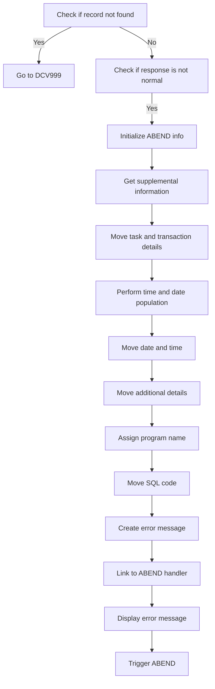

First, the code checks if the customer record was not found by evaluating <SwmToken path="src/base/cobol_src/DELCUS.cbl" pos="358:3:7" line-data="                RESP(WS-CICS-RESP)">`WS-CICS-RESP`</SwmToken> against <SwmToken path="src/base/cobol_src/DELCUS.cbl" pos="384:11:14" line-data="           IF WS-CICS-RESP = DFHRESP(NOTFND)">`DFHRESP(NOTFND)`</SwmToken>. If the record is not found, it proceeds to the label <SwmToken path="src/base/cobol_src/DELCUS.cbl" pos="582:1:1" line-data="       DCV999.">`DCV999`</SwmToken>.

Moving to the next condition, if the response code <SwmToken path="src/base/cobol_src/DELCUS.cbl" pos="358:3:7" line-data="                RESP(WS-CICS-RESP)">`WS-CICS-RESP`</SwmToken> is not equal to <SwmToken path="src/base/cobol_src/DELCUS.cbl" pos="365:11:14" line-data="              OR WS-CICS-RESP = DFHRESP(NORMAL)">`DFHRESP(NORMAL)`</SwmToken>, the code begins the process of handling an abnormal end (ABEND).

<SwmSnippet path="/src/base/cobol_src/DELCUS.cbl" line="398">

---

The code initializes the <SwmToken path="src/base/cobol_src/DELCUS.cbl" pos="398:3:5" line-data="              INITIALIZE ABNDINFO-REC">`ABNDINFO-REC`</SwmToken> structure to prepare for capturing ABEND information.

```cobol
              INITIALIZE ABNDINFO-REC
```

---

</SwmSnippet>

<SwmSnippet path="/src/base/cobol_src/DELCUS.cbl" line="399">

---

Next, it moves the response codes <SwmToken path="src/base/cobol_src/DELCUS.cbl" pos="399:3:3" line-data="              MOVE EIBRESP    TO ABND-RESPCODE">`EIBRESP`</SwmToken> and <SwmToken path="src/base/cobol_src/DELCUS.cbl" pos="400:3:3" line-data="              MOVE EIBRESP2   TO ABND-RESP2CODE">`EIBRESP2`</SwmToken> into the <SwmToken path="src/base/cobol_src/DELCUS.cbl" pos="399:7:9" line-data="              MOVE EIBRESP    TO ABND-RESPCODE">`ABND-RESPCODE`</SwmToken> and <SwmToken path="src/base/cobol_src/DELCUS.cbl" pos="400:7:9" line-data="              MOVE EIBRESP2   TO ABND-RESP2CODE">`ABND-RESP2CODE`</SwmToken> fields respectively.

```cobol
              MOVE EIBRESP    TO ABND-RESPCODE
              MOVE EIBRESP2   TO ABND-RESP2CODE
```

---

</SwmSnippet>

<SwmSnippet path="/src/base/cobol_src/DELCUS.cbl" line="404">

---

The code then retrieves supplemental information such as the application ID by executing the <SwmToken path="src/base/cobol_src/DELCUS.cbl" pos="404:3:7" line-data="              EXEC CICS ASSIGN APPLID(ABND-APPLID)">`CICS ASSIGN APPLID`</SwmToken> command.

```cobol
              EXEC CICS ASSIGN APPLID(ABND-APPLID)
              END-EXEC
```

---

</SwmSnippet>

<SwmSnippet path="/src/base/cobol_src/DELCUS.cbl" line="407">

---

It moves the task number and transaction ID into the <SwmToken path="src/base/cobol_src/DELCUS.cbl" pos="407:7:11" line-data="              MOVE EIBTASKN   TO ABND-TASKNO-KEY">`ABND-TASKNO-KEY`</SwmToken> and <SwmToken path="src/base/cobol_src/DELCUS.cbl" pos="408:7:9" line-data="              MOVE EIBTRNID   TO ABND-TRANID">`ABND-TRANID`</SwmToken> fields respectively.

```cobol
              MOVE EIBTASKN   TO ABND-TASKNO-KEY
              MOVE EIBTRNID   TO ABND-TRANID
```

---

</SwmSnippet>

<SwmSnippet path="/src/base/cobol_src/DELCUS.cbl" line="410">

---

The code performs a routine to populate the current date and time, and then moves these values into the <SwmToken path="src/base/cobol_src/DELCUS.cbl" pos="412:11:13" line-data="              MOVE WS-ORIG-DATE TO ABND-DATE">`ABND-DATE`</SwmToken> and <SwmToken path="src/base/cobol_src/DELCUS.cbl" pos="418:3:5" line-data="                     INTO ABND-TIME">`ABND-TIME`</SwmToken> fields.

```cobol
              PERFORM POPULATE-TIME-DATE

              MOVE WS-ORIG-DATE TO ABND-DATE
              STRING WS-TIME-NOW-GRP-HH DELIMITED BY SIZE,
                    ':' DELIMITED BY SIZE,
                     WS-TIME-NOW-GRP-MM DELIMITED BY SIZE,
                     ':' DELIMITED BY SIZE,
                     WS-TIME-NOW-GRP-MM DELIMITED BY SIZE
                     INTO ABND-TIME
```

---

</SwmSnippet>

<SwmSnippet path="/src/base/cobol_src/DELCUS.cbl" line="421">

---

Additional details such as <SwmToken path="src/base/cobol_src/DELCUS.cbl" pos="421:3:7" line-data="              MOVE WS-U-TIME   TO ABND-UTIME-KEY">`WS-U-TIME`</SwmToken> and a specific ABEND code <SwmToken path="src/base/cobol_src/DELCUS.cbl" pos="422:4:4" line-data="              MOVE &#39;WPV6&#39;      TO ABND-CODE">`WPV6`</SwmToken> are moved into their respective fields.

```cobol
              MOVE WS-U-TIME   TO ABND-UTIME-KEY
              MOVE 'WPV6'      TO ABND-CODE
```

---

</SwmSnippet>

<SwmSnippet path="/src/base/cobol_src/DELCUS.cbl" line="424">

---

The program name is assigned to <SwmToken path="src/base/cobol_src/DELCUS.cbl" pos="424:9:11" line-data="              EXEC CICS ASSIGN PROGRAM(ABND-PROGRAM)">`ABND-PROGRAM`</SwmToken> using the <SwmToken path="src/base/cobol_src/DELCUS.cbl" pos="424:3:7" line-data="              EXEC CICS ASSIGN PROGRAM(ABND-PROGRAM)">`CICS ASSIGN PROGRAM`</SwmToken> command.

```cobol
              EXEC CICS ASSIGN PROGRAM(ABND-PROGRAM)
              END-EXEC
```

---

</SwmSnippet>

<SwmSnippet path="/src/base/cobol_src/DELCUS.cbl" line="427">

---

The SQL code is set to zero, and an error message is constructed and moved into the <SwmToken path="src/base/cobol_src/DELCUS.cbl" pos="436:3:5" line-data="                    INTO ABND-FREEFORM">`ABND-FREEFORM`</SwmToken> field.

```cobol
              MOVE ZEROS    TO ABND-SQLCODE

              STRING 'DCV010 - Unable to READ CUSTOMER VSAM rec '
                    DELIMITED BY SIZE,
                    'for key:' DESIRED-KEY DELIMITED BY SIZE,
                    ' EIBRESP=' DELIMITED BY SIZE,
                    ABND-RESPCODE DELIMITED BY SIZE,
                    ' RESP2=' DELIMITED BY SIZE,
                    ABND-RESP2CODE DELIMITED BY SIZE
                    INTO ABND-FREEFORM
```

---

</SwmSnippet>

<SwmSnippet path="/src/base/cobol_src/DELCUS.cbl" line="439">

---

Finally, the code links to the ABEND handler program and displays an error message before triggering the ABEND with the code <SwmToken path="src/base/cobol_src/DELCUS.cbl" pos="449:5:5" line-data="                 ABCODE (&#39;WPV6&#39;)">`WPV6`</SwmToken>.

```cobol
              EXEC CICS LINK PROGRAM(WS-ABEND-PGM)
                        COMMAREA(ABNDINFO-REC)
              END-EXEC

              DISPLAY 'In DELCUS (DCV010) '
              'UNABLE TO READ CUSTOMER VSAM REC'
              ' RESP CODE=' WS-CICS-RESP, ' RESP2=' WS-CICS-RESP2
              'FOR KEY=' DESIRED-KEY

              EXEC CICS ABEND
                 ABCODE ('WPV6')
```

---

</SwmSnippet>

## Store customer details

This is the next section of the flow.

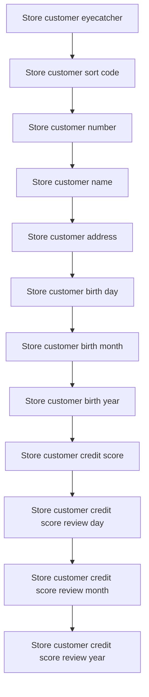

<SwmSnippet path="/src/base/cobol_src/DELCUS.cbl" line="454">

---

First, the customer's eyecatcher is stored in the communication area to uniquely identify the customer record.

```cobol
           MOVE CUSTOMER-EYECATCHER TO WS-STOREDC-EYECATCHER
                                        COMM-EYE IN DFHCOMMAREA.
```

---

</SwmSnippet>

<SwmSnippet path="/src/base/cobol_src/DELCUS.cbl" line="456">

---

Next, the customer's sort code, number, name, and address are stored in the communication area to ensure all relevant identification and contact details are available for further processing.

```cobol
           MOVE CUSTOMER-SORTCODE   TO WS-STOREDC-SORTCODE
                                       COMM-SCODE IN DFHCOMMAREA.
           MOVE CUSTOMER-NUMBER OF CUSTOMER-RECORD
              TO WS-STOREDC-NUMBER COMM-CUSTNO IN DFHCOMMAREA.
           MOVE CUSTOMER-NAME       TO WS-STOREDC-NAME
                                       COMM-NAME IN DFHCOMMAREA.
           MOVE CUSTOMER-ADDRESS    TO WS-STOREDC-ADDRESS
                                       COMM-ADDR IN DFHCOMMAREA.
```

---

</SwmSnippet>

<SwmSnippet path="/src/base/cobol_src/DELCUS.cbl" line="464">

---

Then, the customer's date of birth and credit score details, including the review date, are stored in the communication area to maintain a complete profile of the customer's financial status and history.

```cobol
           MOVE CUSTOMER-DATE-OF-BIRTH(1:2)
              TO WS-STOREDC-DATE-OF-BIRTH(1:2)
                 COMM-BIRTH-DAY IN DFHCOMMAREA.
           MOVE '/'                 TO WS-STOREDC-DATE-OF-BIRTH(3:1).
           MOVE CUSTOMER-DATE-OF-BIRTH(3:2)
              TO WS-STOREDC-DATE-OF-BIRTH(4:2)
                 COMM-BIRTH-MONTH IN DFHCOMMAREA.
           MOVE '/'                 TO WS-STOREDC-DATE-OF-BIRTH(6:1).

           MOVE CUSTOMER-DATE-OF-BIRTH(5:4)
              TO WS-STOREDC-DATE-OF-BIRTH(7:4)
                 COMM-BIRTH-YEAR IN DFHCOMMAREA.

           MOVE CUSTOMER-CREDIT-SCORE TO WS-STOREDC-CREDIT-SCORE
                                         COMM-CREDIT-SCORE.
           MOVE CUSTOMER-CS-REVIEW-DATE(1:2)
             TO WS-STOREDC-CS-REVIEW-DATE(1:2)
                COMM-CS-REVIEW-DD IN DFHCOMMAREA.
           MOVE '/'                 TO WS-STOREDC-CS-REVIEW-DATE(3:1).
           MOVE CUSTOMER-CS-REVIEW-DATE(3:2)
             TO WS-STOREDC-CS-REVIEW-DATE(4:2)
```

---

</SwmSnippet>

## Delete customer record

This is the next section of the flow.

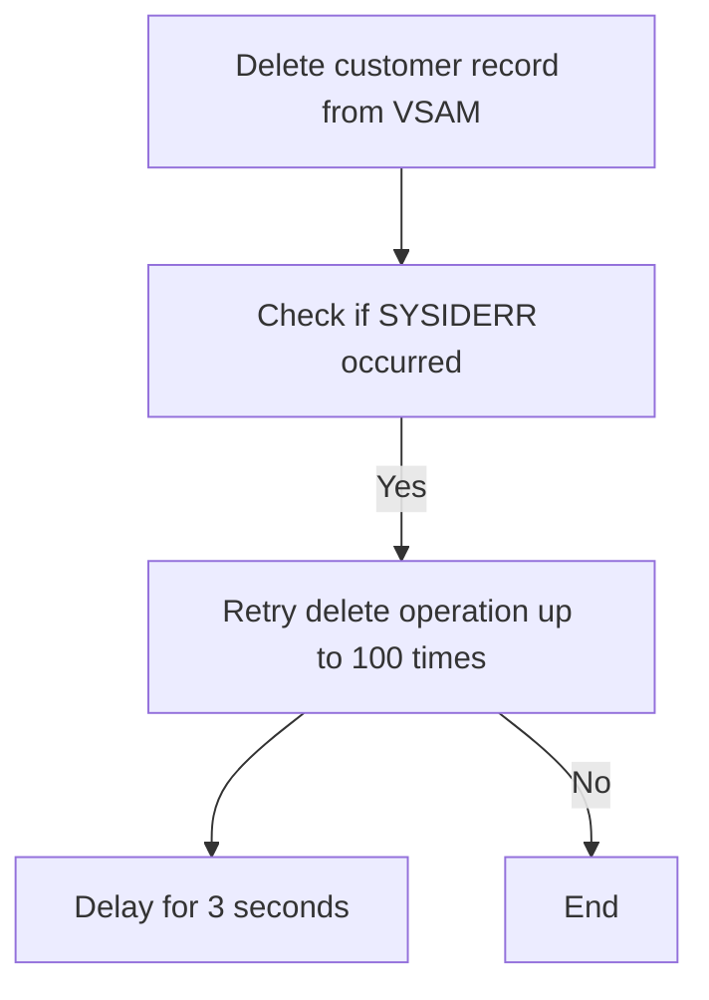

<SwmSnippet path="/src/base/cobol_src/DELCUS.cbl" line="491">

---

First, the code attempts to delete a customer record from the VSAM file by executing the <SwmToken path="src/base/cobol_src/DELCUS.cbl" pos="492:1:9" line-data="              DELETE FILE (&#39;CUSTOMER&#39;)">`DELETE FILE ('CUSTOMER')`</SwmToken> command.

```cobol
           EXEC CICS
              DELETE FILE ('CUSTOMER')
              TOKEN(WS-TOKEN)
              RESP(WS-CICS-RESP)
              RESP2(WS-CICS-RESP2)
           END-EXEC.
```

---

</SwmSnippet>

<SwmSnippet path="/src/base/cobol_src/DELCUS.cbl" line="498">

---

Next, it checks if the response code <SwmToken path="src/base/cobol_src/DELCUS.cbl" pos="498:3:7" line-data="           IF WS-CICS-RESP = DFHRESP(SYSIDERR)">`WS-CICS-RESP`</SwmToken> equals <SwmToken path="src/base/cobol_src/DELCUS.cbl" pos="498:11:14" line-data="           IF WS-CICS-RESP = DFHRESP(SYSIDERR)">`DFHRESP(SYSIDERR)`</SwmToken>, indicating a system ID error.

```cobol
           IF WS-CICS-RESP = DFHRESP(SYSIDERR)

```

---

</SwmSnippet>

<SwmSnippet path="/src/base/cobol_src/DELCUS.cbl" line="500">

---

If a system ID error occurred, the code enters a loop to retry the delete operation up to 100 times or until the response is normal.

```cobol
              PERFORM VARYING SYSIDERR-RETRY FROM 1 BY 1
              UNTIL SYSIDERR-RETRY > 100
              OR WS-CICS-RESP = DFHRESP(NORMAL)
              OR WS-CICS-RESP IS NOT EQUAL TO DFHRESP(SYSIDERR)

```

---

</SwmSnippet>

<SwmSnippet path="/src/base/cobol_src/DELCUS.cbl" line="505">

---

During each retry, the code delays for 3 seconds before attempting to delete the customer record again.

```cobol
                 EXEC CICS DELAY FOR SECONDS(3)
                 END-EXEC

                 EXEC CICS DELETE FILE ('CUSTOMER')
                    TOKEN(WS-TOKEN)
                    RESP(WS-CICS-RESP)
                    RESP2(WS-CICS-RESP2)
                 END-EXEC
```

---

</SwmSnippet>

## Handle delete error and abend

Now, lets zoom into this section of the flow:

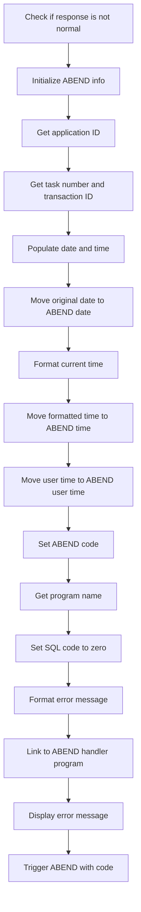

First, the code checks if the response code <SwmToken path="src/base/cobol_src/DELCUS.cbl" pos="358:3:7" line-data="                RESP(WS-CICS-RESP)">`WS-CICS-RESP`</SwmToken> is not equal to <SwmToken path="src/base/cobol_src/DELCUS.cbl" pos="365:11:14" line-data="              OR WS-CICS-RESP = DFHRESP(NORMAL)">`DFHRESP(NORMAL)`</SwmToken>, indicating an abnormal response.

Moving to the next step, the ABEND information record <SwmToken path="src/base/cobol_src/DELCUS.cbl" pos="398:3:5" line-data="              INITIALIZE ABNDINFO-REC">`ABNDINFO-REC`</SwmToken> is initialized to prepare for capturing error details.

Next, the application ID is retrieved using the <SwmToken path="src/base/cobol_src/DELCUS.cbl" pos="404:1:7" line-data="              EXEC CICS ASSIGN APPLID(ABND-APPLID)">`EXEC CICS ASSIGN APPLID`</SwmToken> command and stored in <SwmToken path="src/base/cobol_src/DELCUS.cbl" pos="404:9:11" line-data="              EXEC CICS ASSIGN APPLID(ABND-APPLID)">`ABND-APPLID`</SwmToken>.

Then, the task number and transaction ID are obtained and stored in <SwmToken path="src/base/cobol_src/DELCUS.cbl" pos="407:7:11" line-data="              MOVE EIBTASKN   TO ABND-TASKNO-KEY">`ABND-TASKNO-KEY`</SwmToken> and <SwmToken path="src/base/cobol_src/DELCUS.cbl" pos="408:7:9" line-data="              MOVE EIBTRNID   TO ABND-TRANID">`ABND-TRANID`</SwmToken> respectively.

Going into the next step, the current date and time are populated by performing the <SwmToken path="src/base/cobol_src/DELCUS.cbl" pos="410:3:7" line-data="              PERFORM POPULATE-TIME-DATE">`POPULATE-TIME-DATE`</SwmToken> routine.

The original date is then moved to <SwmToken path="src/base/cobol_src/DELCUS.cbl" pos="412:11:13" line-data="              MOVE WS-ORIG-DATE TO ABND-DATE">`ABND-DATE`</SwmToken> to capture when the error occurred.

Next, the current time is formatted and moved into <SwmToken path="src/base/cobol_src/DELCUS.cbl" pos="418:3:5" line-data="                     INTO ABND-TIME">`ABND-TIME`</SwmToken> to record the exact time of the error.

The user time is also moved to <SwmToken path="src/base/cobol_src/DELCUS.cbl" pos="421:11:15" line-data="              MOVE WS-U-TIME   TO ABND-UTIME-KEY">`ABND-UTIME-KEY`</SwmToken> for additional error context.

The ABEND code <SwmToken path="src/base/cobol_src/DELCUS.cbl" pos="548:4:4" line-data="              MOVE &#39;WPV7&#39;      TO ABND-CODE">`WPV7`</SwmToken> is set to indicate the specific error type.

The program name is retrieved and stored in <SwmToken path="src/base/cobol_src/DELCUS.cbl" pos="424:9:11" line-data="              EXEC CICS ASSIGN PROGRAM(ABND-PROGRAM)">`ABND-PROGRAM`</SwmToken> using the <SwmToken path="src/base/cobol_src/DELCUS.cbl" pos="424:1:7" line-data="              EXEC CICS ASSIGN PROGRAM(ABND-PROGRAM)">`EXEC CICS ASSIGN PROGRAM`</SwmToken> command.

The SQL code is set to zero in <SwmToken path="src/base/cobol_src/DELCUS.cbl" pos="427:7:9" line-data="              MOVE ZEROS    TO ABND-SQLCODE">`ABND-SQLCODE`</SwmToken> as part of the error information.

An error message is formatted and stored in <SwmToken path="src/base/cobol_src/DELCUS.cbl" pos="436:3:5" line-data="                    INTO ABND-FREEFORM">`ABND-FREEFORM`</SwmToken> to provide a detailed description of the failure.

The ABEND handler program is linked using the <SwmToken path="src/base/cobol_src/DELCUS.cbl" pos="260:1:7" line-data="           EXEC CICS LINK PROGRAM(INQCUST-PROGRAM)">`EXEC CICS LINK PROGRAM`</SwmToken> command with the error information passed in <SwmToken path="src/base/cobol_src/DELCUS.cbl" pos="398:3:5" line-data="              INITIALIZE ABNDINFO-REC">`ABNDINFO-REC`</SwmToken>.

An error message is displayed to the console to inform the operator of the failure details.

## Record transaction

Now, lets zoom into this section of the flow:

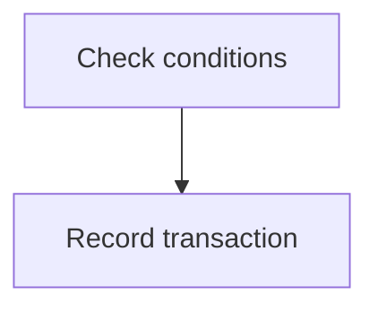

<SwmSnippet path="/src/base/cobol_src/DELCUS.cbl" line="580">

---

First, the code performs the <SwmToken path="src/base/cobol_src/DELCUS.cbl" pos="580:3:7" line-data="           PERFORM WRITE-PROCTRAN-CUST.">`WRITE-PROCTRAN-CUST`</SwmToken> operation, which is responsible for recording the deletion of a customer transaction. This step ensures that the transaction details are logged appropriately for future reference.

```cobol
           PERFORM WRITE-PROCTRAN-CUST.
```

---

</SwmSnippet>

<SwmSnippet path="/src/base/cobol_src/DELCUS.cbl" line="582">

---

Next, the code reaches the <SwmToken path="src/base/cobol_src/DELCUS.cbl" pos="582:1:1" line-data="       DCV999.">`DCV999`</SwmToken> label, which signifies the end of the <SwmToken path="src/base/cobol_src/DELCUS.cbl" pos="286:3:7" line-data="           PERFORM DEL-CUST-VSAM">`DEL-CUST-VSAM`</SwmToken> function. The <SwmToken path="src/base/cobol_src/DELCUS.cbl" pos="583:1:1" line-data="           EXIT.">`EXIT`</SwmToken> statement is then executed to terminate the function and return control to the calling program.

```cobol
       DCV999.
           EXIT.
```

---

</SwmSnippet>

## <SwmToken path="src/base/cobol_src/DELCUS.cbl" pos="410:3:7" line-data="              PERFORM POPULATE-TIME-DATE">`POPULATE-TIME-DATE`</SwmToken>

Lets' zoom into this section of the flow:

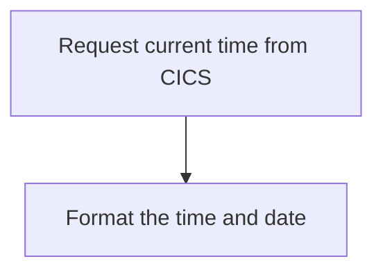

<SwmSnippet path="/src/base/cobol_src/DELCUS.cbl" line="749">

---

### Requesting current time

First, the function requests the current time from CICS and stores it in <SwmToken path="src/base/cobol_src/DELCUS.cbl" pos="750:3:7" line-data="              ABSTIME(WS-U-TIME)">`WS-U-TIME`</SwmToken> (a working storage variable for time).

```cobol
           EXEC CICS ASKTIME
              ABSTIME(WS-U-TIME)
           END-EXEC.
```

---

</SwmSnippet>

<SwmSnippet path="/src/base/cobol_src/DELCUS.cbl" line="753">

---

### Formatting the time and date

Next, the function formats the retrieved time into a human-readable date and time. It stores the formatted date in <SwmToken path="src/base/cobol_src/DELCUS.cbl" pos="755:3:7" line-data="                     DDMMYYYY(WS-ORIG-DATE)">`WS-ORIG-DATE`</SwmToken> and the time in <SwmToken path="src/base/cobol_src/DELCUS.cbl" pos="756:3:7" line-data="                     TIME(WS-TIME-NOW)">`WS-TIME-NOW`</SwmToken>.

```cobol
           EXEC CICS FORMATTIME
                     ABSTIME(WS-U-TIME)
                     DDMMYYYY(WS-ORIG-DATE)
                     TIME(WS-TIME-NOW)
                     DATESEP
           END-EXEC.
```

---

</SwmSnippet>

<SwmSnippet path="/src/base/cobol_src/DELCUS.cbl" line="760">

---

### Exiting the section

Then, the function reaches the end of the section and exits, completing the process of populating the current date and time.

```cobol
       PTD999.
           EXIT.
```

---

</SwmSnippet>

## <SwmToken path="src/base/cobol_src/DELCUS.cbl" pos="580:3:7" line-data="           PERFORM WRITE-PROCTRAN-CUST.">`WRITE-PROCTRAN-CUST`</SwmToken>

Lets' zoom into this section of the flow:

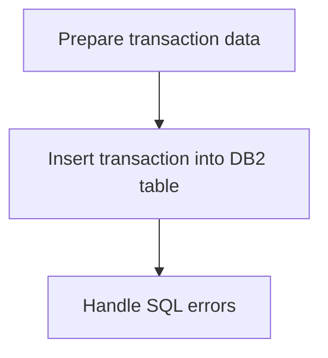

<SwmSnippet path="/src/base/cobol_src/DELCUS.cbl" line="873">

---

The <SwmToken path="src/base/cobol_src/DELCUS.cbl" pos="580:3:7" line-data="           PERFORM WRITE-PROCTRAN-CUST.">`WRITE-PROCTRAN-CUST`</SwmToken> function is responsible for recording the details of a customer transaction. It prepares the transaction data by setting up various fields such as the eyecatcher, sort code, account number, date, time, reference, type, and amount. This data is then inserted into the PROCTRAN <SwmToken path="src/base/cobol_src/DELCUS.cbl" pos="53:5:5" line-data="      * PROCTRAN DB2 copybook">`DB2`</SwmToken> table using an SQL INSERT statement. If the SQL operation fails, the function captures the error codes, assembles detailed error information, and links to an abend handler program to manage the error.

```cobol

```

---

</SwmSnippet>

## <SwmToken path="src/base/cobol_src/DELCUS.cbl" pos="592:3:9" line-data="              PERFORM WRITE-PROCTRAN-CUST-DB2.">`WRITE-PROCTRAN-CUST-DB2`</SwmToken>

Lets' zoom into this section of the flow:

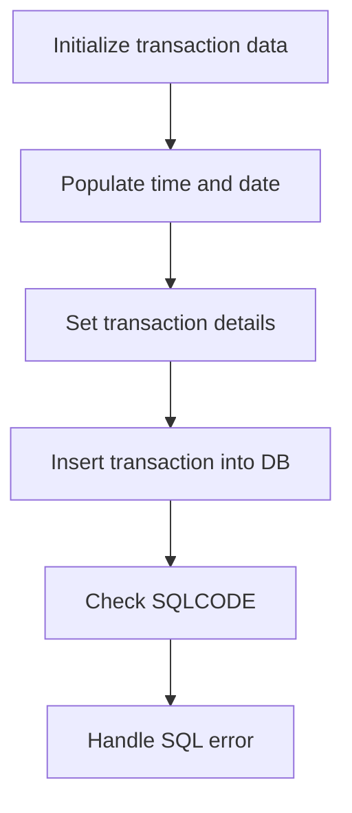

First, the section initializes the transaction data by setting up the <SwmToken path="src/base/cobol_src/DELCUS.cbl" pos="59:3:7" line-data="       01 HOST-PROCTRAN-ROW.">`HOST-PROCTRAN-ROW`</SwmToken> and <SwmToken path="src/base/cobol_src/DELCUS.cbl" pos="123:3:5" line-data="       01 WS-EIBTASKN12                PIC 9(12) VALUE 0.">`WS-EIBTASKN12`</SwmToken> fields.

Moving to the next step, it sets the eyecatcher and sort code for the transaction.

Next, it populates the time and date fields by using the <SwmToken path="src/base/cobol_src/DELCUS.cbl" pos="613:5:5" line-data="           EXEC CICS ASKTIME">`ASKTIME`</SwmToken> and <SwmToken path="src/base/cobol_src/DELCUS.cbl" pos="617:5:5" line-data="           EXEC CICS FORMATTIME">`FORMATTIME`</SwmToken> commands to get the current time and date.

Then, it sets the transaction description fields with the stored data such as sort code, number, name, and date of birth.

Diving into the next step, it sets the transaction type and amount fields.

<SwmSnippet path="/src/base/cobol_src/DELCUS.cbl" line="636">

---

The section then inserts the transaction data into the <SwmToken path="src/base/cobol_src/DELCUS.cbl" pos="637:5:5" line-data="              INSERT INTO PROCTRAN">`PROCTRAN`</SwmToken> <SwmToken path="src/base/cobol_src/DELCUS.cbl" pos="53:5:5" line-data="      * PROCTRAN DB2 copybook">`DB2`</SwmToken> table using an SQL <SwmToken path="src/base/cobol_src/DELCUS.cbl" pos="637:1:1" line-data="              INSERT INTO PROCTRAN">`INSERT`</SwmToken> statement.

```cobol
           EXEC SQL
              INSERT INTO PROCTRAN
                     (
                      PROCTRAN_EYECATCHER,
                      PROCTRAN_SORTCODE,
                      PROCTRAN_NUMBER,
                      PROCTRAN_DATE,
                      PROCTRAN_TIME,
                      PROCTRAN_REF,
                      PROCTRAN_TYPE,
                      PROCTRAN_DESC,
                      PROCTRAN_AMOUNT
                     )
              VALUES
                     (
                      :HV-PROCTRAN-EYECATCHER,
                      :HV-PROCTRAN-SORT-CODE,
                      :HV-PROCTRAN-ACC-NUMBER,
                      :HV-PROCTRAN-DATE,
                      :HV-PROCTRAN-TIME,
                      :HV-PROCTRAN-REF,
```

---

</SwmSnippet>

After the insertion, it checks the <SwmToken path="src/base/cobol_src/DELCUS.cbl" pos="427:9:9" line-data="              MOVE ZEROS    TO ABND-SQLCODE">`SQLCODE`</SwmToken> to determine if the operation was successful.

If the <SwmToken path="src/base/cobol_src/DELCUS.cbl" pos="427:9:9" line-data="              MOVE ZEROS    TO ABND-SQLCODE">`SQLCODE`</SwmToken> is not zero, indicating an error, it initializes the <SwmToken path="src/base/cobol_src/DELCUS.cbl" pos="398:3:5" line-data="              INITIALIZE ABNDINFO-REC">`ABNDINFO-REC`</SwmToken> and captures the response codes.

It then gathers supplemental information such as the application ID, task number, and transaction ID.

Next, it performs the <SwmToken path="src/base/cobol_src/DELCUS.cbl" pos="410:3:7" line-data="              PERFORM POPULATE-TIME-DATE">`POPULATE-TIME-DATE`</SwmToken> routine to get the current date and time.

The section then assembles the error information into the <SwmToken path="src/base/cobol_src/DELCUS.cbl" pos="436:3:5" line-data="                    INTO ABND-FREEFORM">`ABND-FREEFORM`</SwmToken> field.

## <SwmToken path="src/base/cobol_src/DELCUS.cbl" pos="292:3:11" line-data="           PERFORM GET-ME-OUT-OF-HERE.">`GET-ME-OUT-OF-HERE`</SwmToken>

Lets' zoom into this section of the flow:

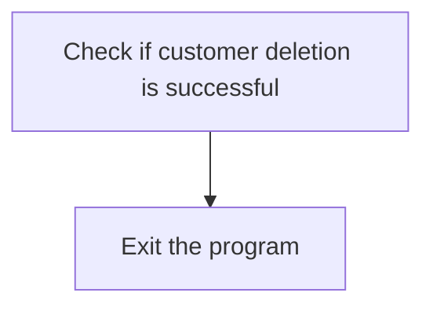

<SwmSnippet path="/src/base/cobol_src/DELCUS.cbl" line="1024">

---

The <SwmToken path="src/base/cobol_src/DELCUS.cbl" pos="292:3:11" line-data="           PERFORM GET-ME-OUT-OF-HERE.">`GET-ME-OUT-OF-HERE`</SwmToken> function is responsible for handling the exit process after attempting to delete a customer. It first checks if the customer deletion operation was successful. If the deletion was successful, the function proceeds to exit the program gracefully. This ensures that the system can handle the end of the customer deletion process without any issues, maintaining the integrity of the application.

```cobol

```

---

</SwmSnippet>

&nbsp;

*This is an auto-generated document by Swimm 🌊 and has not yet been verified by a human*

<SwmMeta version="3.0.0" repo-id="Z2l0aHViJTNBJTNBY2ljcy1iYW5raW5nLXNhbXBsZS1hcHBsaWNhdGlvbi1jYnNhLUlCTS1EZW1vJTNBJTNBU3dpbW0tRGVtbw==" repo-name="cics-banking-sample-application-cbsa-IBM-Demo"><sup>Powered by [Swimm](/)</sup></SwmMeta>
