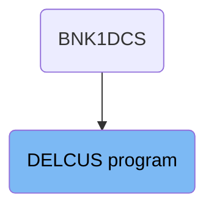
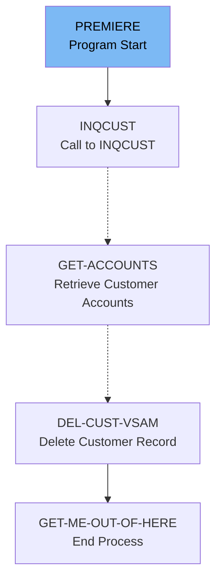

The DELCUS program is responsible for deleting a customer record from the system. This process involves initializing the deletion, verifying the customer's existence, retrieving and deleting associated accounts, and finally removing the customer record from the VSAM file. The program ensures that all related data is properly handled before completing the deletion process.

The flow starts by setting up the necessary information to identify the customer. It then verifies if the customer exists, retrieves any associated accounts, deletes those accounts, and finally removes the customer record from the system. Each step ensures that the data is correctly processed and the deletion is successful.

# Where is this program used?

This program is used once, in a flow starting from `BNK1DCS` as represented in the following diagram:



Lets' zoom into the flow:



<SwmSnippet path="/src/base/cobol_src/DELCUS.cbl" line="246">

---

## Initializing Customer Deletion

First, the <SwmToken path="src/base/cobol_src/DELCUS.cbl" pos="246:1:1" line-data="       PREMIERE SECTION.">`PREMIERE`</SwmToken> section initializes the customer deletion process by setting up the required sort code and customer number. This is essential for identifying the customer record to be deleted.

```cobol
       PREMIERE SECTION.
       A010.

           MOVE SORTCODE TO REQUIRED-SORT-CODE
                            REQUIRED-SORT-CODE OF CUSTOMER-KY
                            DESIRED-KEY-SORTCODE.

           MOVE COMM-CUSTNO OF DFHCOMMAREA
             TO DESIRED-KEY-CUSTOMER.

```

---

</SwmSnippet>

<SwmSnippet path="/src/base/cobol_src/DELCUS.cbl" line="256">

---

## Calling INQCUST Program

Next, the program calls <SwmToken path="src/base/cobol_src/DELCUS.cbl" pos="256:3:3" line-data="           INITIALIZE INQCUST-COMMAREA.">`INQCUST`</SwmToken> to verify the existence of the customer. This step ensures that the customer record is valid and can be processed for deletion.

```cobol
           INITIALIZE INQCUST-COMMAREA.
           MOVE COMM-CUSTNO OF DFHCOMMAREA TO
              INQCUST-CUSTNO.

           EXEC CICS LINK PROGRAM(INQCUST-PROGRAM)
                     COMMAREA(INQCUST-COMMAREA)
           END-EXEC.
```

---

</SwmSnippet>

<SwmSnippet path="/src/base/cobol_src/DELCUS.cbl" line="263">

---

## Handling INQCUST Response

Then, the program checks the response from <SwmToken path="src/base/cobol_src/DELCUS.cbl" pos="264:3:3" line-data="           IF INQCUST-INQ-SUCCESS = &#39;N&#39;">`INQCUST`</SwmToken>. If the inquiry is unsuccessful, it sets the deletion success flag to 'N' and returns, terminating the process.

More about INQCUST: <SwmLink doc-title="Get Customer Record (INQCUST)">[Get Customer Record (INQCUST)](/.swm/get-customer-record-inqcust.p714ejgj.sw.md)</SwmLink>

```cobol

           IF INQCUST-INQ-SUCCESS = 'N'
             MOVE 'N' TO COMM-DEL-SUCCESS
             MOVE INQCUST-INQ-FAIL-CD TO COMM-DEL-FAIL-CD
             EXEC CICS RETURN
             END-EXEC
           END-IF.
```

---

</SwmSnippet>

<SwmSnippet path="/src/base/cobol_src/DELCUS.cbl" line="271">

---

## Retrieving Customer Accounts

Moving to the next step, the program performs <SwmToken path="src/base/cobol_src/DELCUS.cbl" pos="271:3:5" line-data="           PERFORM GET-ACCOUNTS">`GET-ACCOUNTS`</SwmToken> to retrieve any accounts associated with the customer. If accounts are found, it proceeds to delete them.

```cobol
           PERFORM GET-ACCOUNTS
      *
      *          If there are related accounts found then delete
      *          them.
      *
           IF NUMBER-OF-ACCOUNTS > 0
             PERFORM DELETE-ACCOUNTS
           END-IF
```

---

</SwmSnippet>

<SwmSnippet path="/src/base/cobol_src/DELCUS.cbl" line="322">

---

The <SwmToken path="/src/base/cobol_src/DELCUS.cbl" pos="322:1:3" line-data="       GET-ACCOUNTS SECTION.">`GET-ACCOUNTS`</SwmToken> section calls the <SwmToken path="/src/base/cobol_src/DELCUS.cbl" pos="334:10:10" line-data="           EXEC CICS LINK PROGRAM(&#39;INQACCCU&#39;)">`INQACCCU`</SwmToken>program to get all the accounts of the given customer.

More about INQACCCU: <SwmLink doc-title="Retrieving Customer Accounts (INQACCCU)">[Retrieving Customer Accounts (INQACCCU)](/.swm/retrieving-customer-accounts-inqacccu.p3rivzh3.sw.md)</SwmLink>

```cobol
       GET-ACCOUNTS SECTION.
       GAC010.
      *
      *    Link to INQACCCU to get all of the accounts for a
      *    given customer number.
      *
           MOVE COMM-CUSTNO OF DFHCOMMAREA
              TO CUSTOMER-NUMBER OF INQACCCU-COMMAREA.
           MOVE 20 TO NUMBER-OF-ACCOUNTS IN INQACCCU-COMMAREA.
           SET COMM-PCB-POINTER OF INQACCCU-COMMAREA
              TO DELACC-COMM-PCB1

           EXEC CICS LINK PROGRAM('INQACCCU')
                     COMMAREA(INQACCCU-COMMAREA)
                     SYNCONRETURN
           END-EXEC.
```

---

</SwmSnippet>

<SwmSnippet path="/src/base/cobol_src/DELCUS.cbl" line="298">

---

The <SwmToken path="/src/base/cobol_src/DELCUS.cbl" pos="298:1:3" line-data="       DELETE-ACCOUNTS SECTION.">`DELETE-ACCOUNTS`</SwmToken> section calls the <SwmToken path="/src/base/cobol_src/DELCUS.cbl" pos="303:15:15" line-data="      *    and for each one link to DELACC to delete that">`DELACC`</SwmToken>program to delete account.

More about DELACC: <SwmLink doc-title="Deleting Account (DELACC)">[Deleting Account (DELACC)](/.swm/deleting-account-delacc.3q2xvv4c.sw.md)</SwmLink>

```cobol
       DELETE-ACCOUNTS SECTION.
       DA010.

      *
      *    Go through the entries (accounts) in the array,
      *    and for each one link to DELACC to delete that
      *    account.
      *
           PERFORM VARYING WS-INDEX FROM 1 BY 1
           UNTIL WS-INDEX > NUMBER-OF-ACCOUNTS
              INITIALIZE DELACC-COMMAREA
              MOVE WS-APPLID TO DELACC-COMM-APPLID
              MOVE COMM-ACCNO(WS-INDEX) TO DELACC-COMM-ACCNO

              EXEC CICS LINK PROGRAM('DELACC  ')
                       COMMAREA(DELACC-COMMAREA)
              END-EXEC

           END-PERFORM.
```

---

</SwmSnippet>

<SwmSnippet path="/src/base/cobol_src/DELCUS.cbl" line="280">

---

## Deleting Customer Record

After deleting the accounts, the program performs <SwmToken path="src/base/cobol_src/DELCUS.cbl" pos="286:3:7" line-data="           PERFORM DEL-CUST-VSAM">`DEL-CUST-VSAM`</SwmToken> to delete the customer record from the VSAM file. This step ensures that the customer data is completely removed from the system.

```cobol
      *
      *    Having deleted the accounts and written the
      *    details to the PROCTRAN datastore, if we haven't abended
      *    then we must go on to delete the CUSTOMER record
      *

           PERFORM DEL-CUST-VSAM

```

---

</SwmSnippet>

<SwmSnippet path="/src/base/cobol_src/DELCUS.cbl" line="289">

---

## Finalizing Deletion Process

Finally, the program sets the deletion success flag to 'Y' and clears any failure codes. It then performs <SwmToken path="src/base/cobol_src/DELCUS.cbl" pos="292:3:11" line-data="           PERFORM GET-ME-OUT-OF-HERE.">`GET-ME-OUT-OF-HERE`</SwmToken> to end the process and return control.

```cobol
           MOVE 'Y' TO COMM-DEL-SUCCESS.
           MOVE ' ' TO COMM-DEL-FAIL-CD.

           PERFORM GET-ME-OUT-OF-HERE.

       A999.
           EXIT.
```

---

</SwmSnippet>

&nbsp;

*This is an auto-generated document by Swimm 🌊 and has not yet been verified by a human*

<SwmMeta version="3.0.0" repo-id="Z2l0aHViJTNBJTNBY2ljcy1iYW5raW5nLXNhbXBsZS1hcHBsaWNhdGlvbi1jYnNhLUlCTS1EZW1vJTNBJTNBU3dpbW0tRGVtbw==" repo-name="cics-banking-sample-application-cbsa-IBM-Demo"><sup>Powered by [Swimm](https://staging.swimm.cloud/)</sup></SwmMeta>
